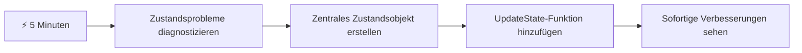
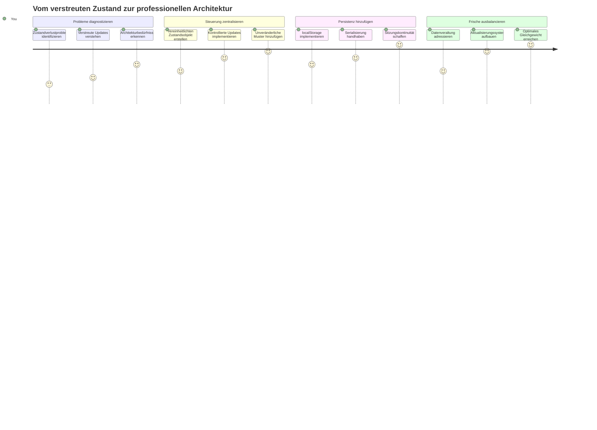
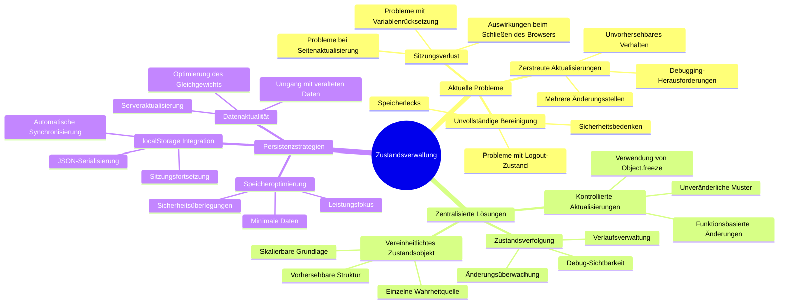
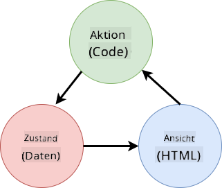
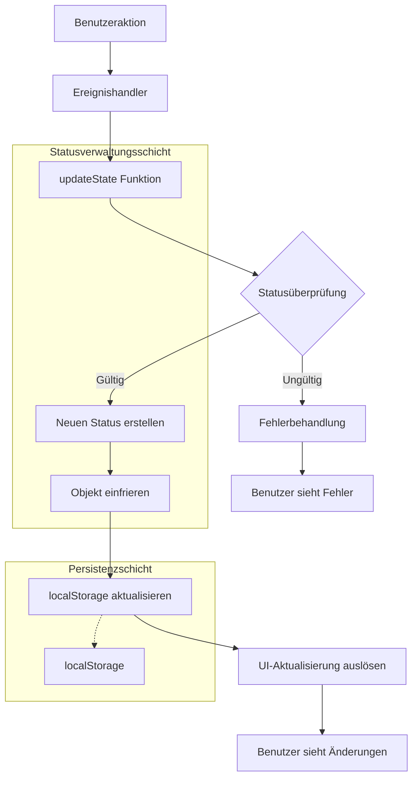
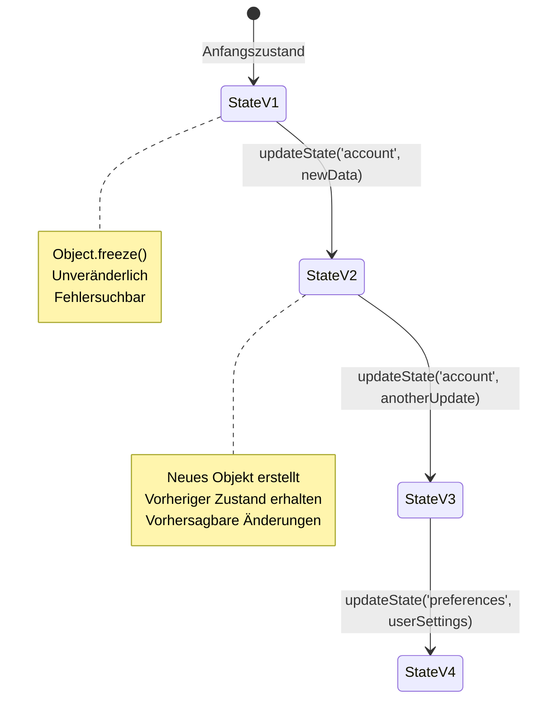
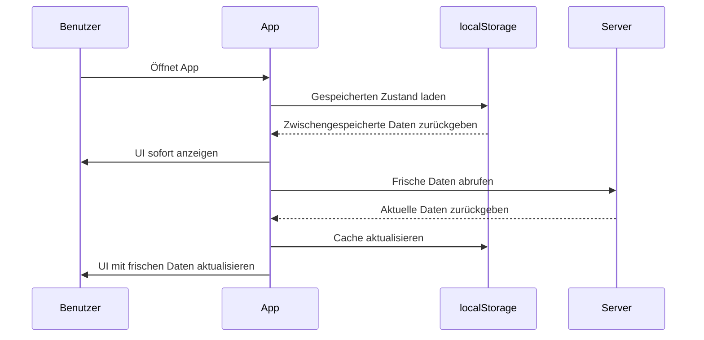
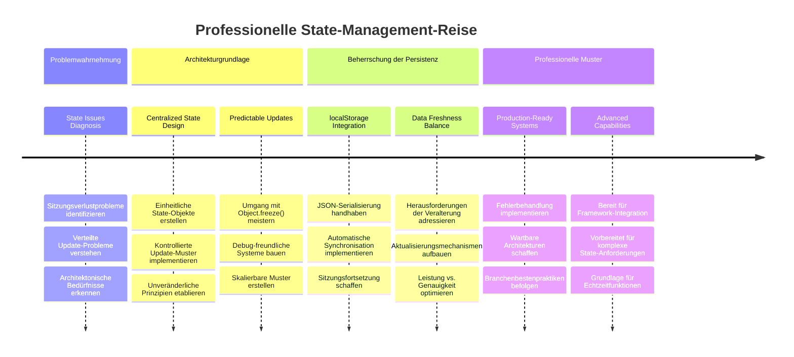
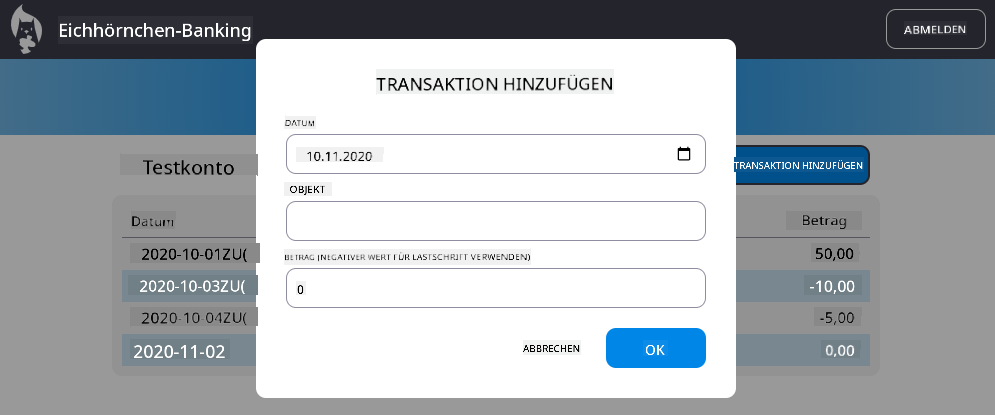

<!--
CO_OP_TRANSLATOR_METADATA:
{
  "original_hash": "b807b09df716dc48a2b750835bf8e933",
  "translation_date": "2026-01-06T09:07:31+00:00",
  "source_file": "7-bank-project/4-state-management/README.md",
  "language_code": "de"
}
-->
# Erstellen einer Banking-App Teil 4: Konzepte des State Managements

## ⚡ Was Sie in den nächsten 5 Minuten tun können

**Schnellstartpfad für beschäftigte Entwickler**


- **Minute 1**: Testen Sie das aktuelle Zustandsproblem – melden Sie sich an, aktualisieren Sie die Seite, beobachten Sie die Abmeldung
- **Minute 2**: Ersetzen Sie `let account = null` durch `let state = { account: null }`
- **Minute 3**: Erstellen Sie eine einfache `updateState()`-Funktion für kontrollierte Aktualisierungen
- **Minute 4**: Aktualisieren Sie eine Funktion, um das neue Muster zu verwenden
- **Minute 5**: Testen Sie die verbesserte Vorhersagbarkeit und Debugging-Fähigkeit

**Schnelltest zur Diagnose**:
```javascript
// Vorher: Zerstreuter Zustand
let account = null; // Beim Aktualisieren verloren!

// Nachher: Zentralisierter Zustand
let state = Object.freeze({ account: null }); // Kontrolliert und nachvollziehbar!
```

**Warum das wichtig ist**: In 5 Minuten erleben Sie die Transformation von chaotischem State Management zu vorhersagbaren, debug-freundlichen Mustern. Das ist die Grundlage, die komplexe Anwendungen wartbar macht.

## 🗺️ Ihre Lernreise durch die Meisterschaft im State Management


**Ihr Reiseziel**: Am Ende dieser Lektion haben Sie ein professionelles State-Management-System erstellt, das Persistenz, Datenaktualität und vorhersagbare Aktualisierungen handhabt – dieselben Muster, die in Produktionsanwendungen verwendet werden.

## Pre-Lecture Quiz

[Vorvorlesungsquiz](https://ff-quizzes.netlify.app/web/quiz/47)

## Einführung

State Management ist wie das Navigationssystem der Voyager-Raumsonde – wenn alles reibungslos funktioniert, bemerken Sie es kaum. Wenn jedoch etwas schiefgeht, macht es den Unterschied aus, ob man interstellaren Raum erreicht oder verloren in der kosmischen Leere treibt. Im Web-Development steht State für alles, was Ihre Anwendung sich merken muss: Benutzer-Login-Status, Formulardaten, Navigationsverlauf und temporäre Schnittstellenzustände.

Da sich Ihre Banking-App von einem einfachen Login-Formular zu einer anspruchsvolleren Anwendung entwickelt hat, sind Ihnen wahrscheinlich einige häufige Herausforderungen begegnet. Laden Sie die Seite neu und Benutzer werden unerwartet ausgeloggt. Schließen Sie den Browser und der gesamte Fortschritt ist weg. Debuggen Sie ein Problem und Sie suchen sich durch mehrere Funktionen, die alle dieselben Daten auf unterschiedliche Weise verändern.

Dies sind keine Anzeichen schlechten Codes – es sind natürliche Wachstumsschmerzen, die entstehen, wenn Anwendungen eine bestimmte Komplexitätsstufe erreichen. Jeder Entwickler steht vor diesen Herausforderungen, wenn seine Apps von „Proof of Concept“ zu „Produktionsreife“ übergehen.

In dieser Lektion implementieren wir ein zentrales State-Management-System, das Ihre Banking-App in eine zuverlässige, professionelle Anwendung verwandelt. Sie lernen, Datenflüsse vorhersagbar zu verwalten, Benutzersitzungen angemessen zu persistieren und das reibungslose Nutzererlebnis zu erschaffen, das moderne Webanwendungen erfordern.

## Voraussetzungen

Bevor Sie in die Konzepte des State Managements eintauchen, sollten Sie Ihre Entwicklungsumgebung richtig eingerichtet und die Basis Ihrer Banking-App bereit haben. Diese Lektion baut direkt auf den Konzepten und dem Code der vorherigen Teile dieser Serie auf.

Stellen Sie sicher, dass Ihnen die folgenden Komponenten zur Verfügung stehen, bevor Sie fortfahren:

**Erforderliche Einrichtung:**
- Schließen Sie die [Datenabruf-Lektion](../3-data/README.md) ab – Ihre App sollte erfolgreich Kontodaten laden und anzeigen können
- Installieren Sie [Node.js](https://nodejs.org) auf Ihrem System, um die Backend-API auszuführen
- Starten Sie die [Server-API](../api/README.md) lokal, um Konto-Datenoperationen zu verarbeiten

**Testen Ihrer Umgebung:**

Prüfen Sie, ob Ihr API-Server korrekt läuft, indem Sie diesen Befehl im Terminal ausführen:

```sh
curl http://localhost:5000/api
# -> sollte als Ergebnis "Bank API v1.0.0" zurückgeben
```

**Was dieser Befehl tut:**
- **Sendet** eine GET-Anfrage an Ihren lokalen API-Server
- **Testet** die Verbindung und verifiziert, dass der Server antwortet
- **Gibt** Versionsinformationen der API zurück, wenn alles funktioniert

## 🧠 Überblick über die Architektur des State Managements


**Grundprinzip**: Professionelles State Management balanciert Vorhersagbarkeit, Persistenz und Performance aus, um verlässliche Benutzererlebnisse zu schaffen, die von einfachen Interaktionen bis zu komplexen Anwendungsabläufen skalieren.

---

## Diagnose der aktuellen Zustandsprobleme

Wie Sherlock Holmes am Tatort müssen wir genau verstehen, was in unserer momentanen Implementierung passiert, bevor wir das Rätsel der verschwindenden Benutzersitzungen lösen können.

Führen wir ein einfaches Experiment durch, das die zugrunde liegenden Probleme des State Managements offenbart:

**🧪 Versuchen Sie diesen Diagnosetest:**
1. Melden Sie sich in Ihrer Banking-App an und navigieren Sie zum Dashboard
2. Aktualisieren Sie die Browser-Seite
3. Beobachten Sie, was mit Ihrem Login-Status passiert

Wenn Sie zurück zum Login-Bildschirm weitergeleitet werden, haben Sie das klassische Problem der fehlenden Zustands-Persistenz entdeckt. Dieses Verhalten tritt auf, weil unsere aktuelle Implementierung Benutzerdaten in JavaScript-Variablen speichert, die bei jeder Seitenaktualisierung zurückgesetzt werden.

**Probleme der aktuellen Implementierung:**

Die einfache `account`-Variable aus unserer [vorherigen Lektion](../3-data/README.md) erzeugt drei wesentliche Probleme, die sowohl die Benutzererfahrung als auch die Wartbarkeit des Codes beeinträchtigen:

| Problem | Technische Ursache | Nutzer-Auswirkung |
|---------|-------------------|-------------------|
| **Sitzungsverlust** | Seitenaktualisierung löscht JavaScript-Variablen | Benutzer müssen sich häufig neu anmelden |
| **Verteilte Aktualisierungen** | Mehrere Funktionen ändern den State direkt | Debugging wird zunehmend schwierig |
| **Unvollständige Bereinigung** | Logout löscht nicht alle State-Referenzen | Potenzielle Sicherheits- und Datenschutzprobleme |

**Die architektonische Herausforderung:**

Wie beim aufgeteilten Design der Titanic, das robust schien, bis mehrere Abteile gleichzeitig überflutet wurden, löst das individuelle Beheben dieser Probleme nicht die grundlegende Architekturfrage. Wir brauchen eine umfassende State-Management-Lösung.

> 💡 **Worum geht es hier eigentlich?**

[State Management](https://de.wikipedia.org/wiki/State_Management) löst im Grunde zwei grundlegende Rätsel:

1. **Wo sind meine Daten?**: Verfolgen, welche Informationen wir haben und woher sie kommen
2. **Sind alle auf dem gleichen Stand?**: Sicherstellen, dass Benutzer sehen, was tatsächlich passiert

**Unser Spielplan:**

Anstatt uns im Kreis zu drehen, schaffen wir ein **zentralisiertes State-Management**. Stellen Sie sich das vor wie eine wirklich organisierte Person, die für alle wichtigen Dinge verantwortlich ist:




**Verstehen dieses Datenflusses:**
- **Zentralisiert** den gesamten Anwendungs-State an einem Ort
- **Leitet** alle State-Änderungen über kontrollierte Funktionen
- **Sichert**, dass die Benutzeroberfläche synchron mit dem aktuellen State bleibt
- **Bietet** ein klares, vorhersagbares Muster für Datenmanagement

> 💡 **Professioneller Einblick**: Diese Lektion konzentriert sich auf grundlegende Konzepte. Für komplexe Anwendungen bieten Bibliotheken wie [Redux](https://redux.js.org) fortgeschrittenere State-Management-Funktionen. Das Verständnis dieser Grundprinzipien hilft Ihnen, jede State-Management-Bibliothek zu meistern.

> ⚠️ **Fortgeschrittenes Thema**: Wir behandeln keine automatische UI-Aktualisierung, die durch State-Änderungen ausgelöst wird, da dies Konzepte des [reaktiven Programmierens](https://de.wikipedia.org/wiki/Reaktive_Programmierung) involviert. Dies ist ein hervorragender nächster Schritt für Ihre Lernreise!

### Aufgabe: Zentralisieren Sie die State-Struktur

Beginnen wir damit, unser verstreutes State-Management in ein zentrales System zu verwandeln. Dieser erste Schritt legt die Grundlage für alle folgenden Verbesserungen.

**Schritt 1: Erstellen Sie ein zentrales State-Objekt**

Ersetzen Sie die einfache `account`-Deklaration:

```js
let account = null;
```

Durch ein strukturiertes State-Objekt:

```js
let state = {
  account: null
};
```

**Darum ist diese Änderung wichtig:**
- **Zentralisiert** alle Anwendungsdaten an einem Ort
- **Bereitet** die Struktur für weitere State-Eigenschaften vor
- **Schafft** eine klare Grenze zwischen State und anderen Variablen
- **Legt** ein Muster fest, das mit der App mitwächst

**Schritt 2: Aktualisieren Sie die State-Zugriffsmuster**

Passen Sie Ihre Funktionen an, um die neue State-Struktur zu verwenden:

**In `register()` und `login()`-Funktionen**, ersetzen Sie:
```js
account = ...
```

Durch:
```js
state.account = ...
```

**In der Funktion `updateDashboard()`** fügen Sie diese Zeile ganz oben hinzu:
```js
const account = state.account;
```

**Was diese Updates bewirken:**
- **Erhalten** die bestehende Funktionalität bei verbesserter Struktur
- **Bereiten** Ihren Code auf ausgefeilteres State Management vor
- **Schaffen** konsistente Muster für den Zugriff auf State-Daten
- **Legen** die Grundlage für zentrale State-Aktualisierungen

> 💡 **Hinweis**: Dieses Refactoring löst unsere Probleme nicht sofort, legt aber die wesentliche Grundlage für die mächtigen Verbesserungen, die folgen!

### 🎯 Pädagogische Zwischenfrage: Zentralisierungskonzepte

**Pause und Reflektion**: Sie haben gerade das Fundament für zentrales State-Management gelegt. Das ist eine entscheidende Architekturentscheidung.

**Schnelle Selbstbewertung**:
- Können Sie erklären, warum das Zentralisieren des State in einem Objekt besser ist als verstreute Variablen?
- Was würde passieren, wenn Sie vergessen, eine Funktion auf `state.account` umzustellen?
- Wie bereitet dieses Muster Ihren Code auf fortgeschrittene Features vor?

**Praxisbezug**: Das Zentralisierungsmuster, das Sie gelernt haben, ist die Basis moderner Frameworks wie Redux, Vuex und React Context. Sie entwickeln dieselbe architektonische Denkweise, die in großen Anwendungen verwendet wird.

**Kritische Frage**: Wenn Sie Benutzerpräferenzen (Theme, Sprache) Ihrer App hinzufügen müssten, wo würden Sie diese im State-Objekt unterbringen? Wie würde das skalieren?

## Implementierung kontrollierter State-Aktualisierungen

Mit unserem zentralisierten State geht es im nächsten Schritt darum, kontrollierte Mechanismen für Datenänderungen einzuführen. Dieser Ansatz sorgt für vorhersagbare State-Änderungen und erleichtert das Debugging.

Das Grundprinzip ähnelt der Flugsicherung: Anstatt mehreren Funktionen zu erlauben, unabhängig den State zu verändern, leiten wir alle Änderungen durch eine einzige kontrollierte Funktion. Dieses Muster bietet klare Übersicht darüber, wann und wie Daten geändert werden.

**Immutable State-Verwaltung:**

Wir behandeln unser `state`-Objekt als [*immutable*](https://de.wikipedia.org/wiki/Immutable_object), das heißt, wir modifizieren es nie direkt. Stattdessen erzeugt jede Änderung ein neues State-Objekt mit den aktualisierten Daten.

Obwohl dieser Ansatz anfänglich weniger effizient wirkt als direkte Modifikationen, bietet er erhebliche Vorteile für Debugging, Tests und die Vorhersagbarkeit der Anwendung.

**Vorteile der immutablen State-Verwaltung:**

| Vorteil | Beschreibung | Auswirkung |
|---------|--------------|------------|
| **Vorhersagbarkeit** | Änderungen erfolgen nur durch kontrollierte Funktionen | Leichter zu debuggen und zu testen |
| **Verlaufshistorie** | Jede State-Änderung erzeugt ein neues Objekt | Ermöglicht Undo/Redo-Funktionalitäten |
| **Vermeidung von Nebeneffekten** | Keine unbeabsichtigten Modifikationen | Verhindert mysteriöse Fehler |
| **Performance-Optimierung** | Leicht zu erkennen, wann sich der State tatsächlich ändert | Ermöglicht effiziente UI-Updates |

**JavaScript-Immutabilität mit `Object.freeze()`:**

JavaScript stellt [`Object.freeze()`](https://developer.mozilla.org/docs/Web/JavaScript/Reference/Global_Objects/Object/freeze) bereit, um Objekte vor Änderungen zu schützen:

```js
const immutableState = Object.freeze({ account: userData });
// Jeder Versuch, immutableState zu ändern, wird einen Fehler auslösen
```

**Was hier passiert:**
- **Verhindert** direkte Zuweisungen oder Löschungen von Eigenschaften
- **Löst** Ausnahmen aus, wenn Änderungsversuche erfolgen
- **Stellt sicher**, dass State-Änderungen kontrolliert ausgeführt werden
- **Schafft** einen klaren Vertrag, wie der State aktualisiert werden darf

> 💡 **Vertiefung**: Lernen Sie den Unterschied zwischen *shallow* und *deep* immutable Objekten in der [MDN-Dokumentation](https://developer.mozilla.org/docs/Web/JavaScript/Reference/Global_Objects/Object/freeze#What_is_shallow_freeze). Dieses Verständnis ist wichtig für komplexe State-Strukturen.


### Aufgabe

Erstellen wir eine neue Funktion `updateState()`:

```js
function updateState(property, newData) {
  state = Object.freeze({
    ...state,
    [property]: newData
  });
}
```

In dieser Funktion erzeugen wir ein neues State-Objekt und kopieren Daten aus dem vorherigen State mithilfe des [*Spread-Operators (`...`)*](https://developer.mozilla.org/docs/Web/JavaScript/Reference/Operators/Spread_syntax#Spread_in_object_literals). Dann überschreiben wir eine bestimmte Eigenschaft des State-Objekts mit den neuen Daten mittels der [Klammernotation](https://developer.mozilla.org/docs/Web/JavaScript/Guide/Working_with_Objects#Objects_and_properties) `[property]` zur Zuweisung. Abschließend sperren wir das Objekt, um Modifikationen mit `Object.freeze()` zu verhindern. Derzeit haben wir nur die Eigenschaft `account` im State gespeichert, aber mit diesem Ansatz können Sie beliebig viele Eigenschaften hinzufügen.

Wir aktualisieren auch die Initialisierung des `state`, damit der Anfangszustand ebenfalls eingefroren ist:

```js
let state = Object.freeze({
  account: null
});
```

Anschließend ersetzen wir in der Funktion `register` die Zuweisung `state.account = result;` durch:

```js
updateState('account', result);
```

Machen Sie das Gleiche in der `login`-Funktion und ersetzen `state.account = data;` durch:

```js
updateState('account', data);
```

Wir nutzen die Gelegenheit, um das Problem zu beheben, dass Kontodaten nicht gelöscht werden, wenn der Benutzer auf *Logout* klickt.

Erstellen Sie eine neue Funktion `logout()`:

```js
function logout() {
  updateState('account', null);
  navigate('/login');
}
```

In `updateDashboard()` ersetzen Sie die Weiterleitung `return navigate('/login');` durch `return logout();`

Testen Sie die Registrierung eines neuen Kontos, das Ausloggen und erneute Einloggen, um sicherzustellen, dass alles weiterhin korrekt funktioniert.

> Tipp: Sie können alle State-Änderungen mitverfolgen, indem Sie `console.log(state)` am Ende von `updateState()` hinzufügen und die Entwicklertools Ihres Browsers öffnen.

## Implementierung der Datenpersistenz

Das zuvor identifizierte Problem des Sitzungsverlusts erfordert eine Persistenzlösung, die den Benutzer-Status über Browsersitzungen hinweg erhält. Dadurch verwandelt sich unsere Anwendung von einer temporären Erfahrung in ein zuverlässiges, professionelles Tool.

Betrachten Sie, wie Atomuhren die genaue Zeit auch bei Stromausfällen durch Speicherung in nichtflüchtigem Speicher bewahren. Ebenso benötigen Webanwendungen persistente Speichermechanismen, um wichtige Benutzerdaten über Browser-Sitzungen und Seitenaktualisierungen hinweg zu sichern.

**Strategische Fragen zur Datenpersistenz:**

Bevor Sie Persistenz implementieren, sollten Sie diese kritischen Faktoren bedenken:

| Frage | Kontext der Banking-App | Auswirkung der Entscheidung |
|----------|-------------------|----------------|
| **Sind die Daten sensibel?** | Kontostand, Transaktionshistorie | Wählen Sie sichere Speicherverfahren |
| **Wie lange soll es bestehen bleiben?** | Anmeldestatus vs. temporäre UI-Einstellungen | Wählen Sie die geeignete Speicherdauer aus |
| **Benötigt der Server es?** | Authentifizierungs-Tokens vs. UI-Einstellungen | Bestimmen Sie die Anforderungen an das Teilen |

**Browser-Speicheroptionen:**

Moderne Browser bieten mehrere Speichermechanismen, die jeweils für unterschiedliche Anwendungsfälle ausgelegt sind:

**Primäre Speicher-APIs:**

1. **[`localStorage`](https://developer.mozilla.org/docs/Web/API/Window/localStorage)**: Persistenter [Schlüssel/Wert-Speicher](https://de.wikipedia.org/wiki/Key-Value-Datenbank)
   - **Behält** Daten über Browser-Sitzungen hinweg unbegrenzt bei  
   - **Übersteht** Browser-Neustarts und Computer-Neustarts
   - **Gilt** für die spezifische Website-Domain
   - **Perfekt** für Benutzereinstellungen und Anmeldestatus

2. **[`sessionStorage`](https://developer.mozilla.org/docs/Web/API/Window/sessionStorage)**: Temporärer Sitzungs-Speicher
   - **Funktioniert** identisch mit localStorage während aktiver Sitzungen
   - **Wird automatisch gelöscht**, wenn der Browser-Tab geschlossen wird
   - **Ideal** für temporäre Daten, die nicht dauerhaft gespeichert werden sollen

3. **[HTTP-Cookies](https://developer.mozilla.org/docs/Web/HTTP/Cookies)**: Servergemeinsam genutzter Speicher
   - **Werden automatisch** mit jeder Serveranforderung gesendet
   - **Perfekt** für [Authentifizierungs-](https://de.wikipedia.org/wiki/Authentifizierung) tokens
   - **Begrenzt** in der Größe und kann die Leistung beeinträchtigen

**Anforderung an die Datenspeicherung:**

Sowohl `localStorage` als auch `sessionStorage` speichern nur [Strings](https://developer.mozilla.org/docs/Web/JavaScript/Reference/Global_Objects/String):

```js
// Objekte zur Speicherung in JSON-Zeichenfolgen umwandeln
const accountData = { user: 'john', balance: 150 };
localStorage.setItem('account', JSON.stringify(accountData));

// JSON-Zeichenfolgen beim Abrufen wieder in Objekte parsen
const savedAccount = JSON.parse(localStorage.getItem('account'));
```

**Verstehen der Serialisierung:**
- **Konvertiert** JavaScript-Objekte in JSON-Strings mit [`JSON.stringify()`](https://developer.mozilla.org/docs/Web/JavaScript/Reference/Global_Objects/JSON/stringify)
- **Rekonstruiert** Objekte aus JSON mit [`JSON.parse()`](https://developer.mozilla.org/docs/Web/JavaScript/Reference/Global_Objects/JSON/parse)
- **Verarbeitet** automatisch komplexe verschachtelte Objekte und Arrays
- **Scheitert** bei Funktionen, undefined-Werten und zirkulären Referenzen

> 💡 **Erweiterte Option**: Für komplexe Offline-Anwendungen mit großen Datensätzen erwägen Sie die [`IndexedDB` API](https://developer.mozilla.org/docs/Web/API/IndexedDB_API). Sie bietet eine vollständige clientseitige Datenbank, erfordert aber eine komplexere Implementierung.


### Aufgabe: Implementiere Persistenz mit localStorage

Lassen Sie uns persistente Speicherung implementieren, damit Nutzer angemeldet bleiben, bis sie sich explizit abmelden. Wir verwenden `localStorage`, um Kontodaten über Browsersitzungen hinweg zu speichern.

**Schritt 1: Definieren der Speicher-Konfiguration**

```js
const storageKey = 'savedAccount';
```

**Was diese Konstante bereitstellt:**
- **Erzeugt** einen konsistenten Bezeichner für unsere gespeicherten Daten
- **Verhindert** Tippfehler bei Speicher-Schlüsselreferenzen
- **Erleichtert** das Ändern des Speicherschlüssels bei Bedarf
- **Folgt** den Best Practices für wartbaren Code

**Schritt 2: Automatische Persistenz hinzufügen**

Fügen Sie diese Zeile am Ende der `updateState()` Funktion hinzu:

```js
localStorage.setItem(storageKey, JSON.stringify(state.account));
```

**Aufschlüsselung dessen, was hier passiert:**
- **Konvertiert** das Kontoobjekt in einen JSON-String zur Speicherung
- **Speichert** die Daten unter unserem konsistenten Speicherschlüssel
- **Wird automatisch ausgelöst**, wann immer sich der Zustand ändert
- **Stellt sicher**, dass gespeicherte Daten immer mit dem aktuellen Zustand synchronisiert sind

> 💡 **Architektur-Vorteil**: Da wir alle Zustandsänderungen zentral über `updateState()` führen, benötigten wir nur eine Codezeile, um Persistenz hinzuzufügen. Das zeigt die Stärke guter Architekturentscheidungen!

**Schritt 3: Zustand beim Laden der App wiederherstellen**

Erstellen Sie eine Initialisierungsfunktion, um gespeicherte Daten wiederherzustellen:

```js
function init() {
  const savedAccount = localStorage.getItem(storageKey);
  if (savedAccount) {
    updateState('account', JSON.parse(savedAccount));
  }

  // Unser vorheriger Initialisierungscode
  window.onpopstate = () => updateRoute();
  updateRoute();
}

init();
```

**Verstehen des Initialisierungsprozesses:**
- **Ruft** zuvor gespeicherte Kontodaten aus localStorage ab
- **Parst** den JSON-String zurück in ein JavaScript-Objekt
- **Aktualisiert** den Zustand mit unserer kontrollierten Update-Funktion
- **Stellt** automatisch die Benutzersitzung beim Laden der Seite wieder her
- **Wird ausgeführt**, bevor Routen aktualisiert werden, um Zustand sicherzustellen

**Schritt 4: Standardroute optimieren**

Aktualisieren Sie die Standardroute, um die Persistenz zu nutzen:

In `updateRoute()`, ersetzen Sie:
```js
// Ersetze: return navigate('/login');
return navigate('/dashboard');
```

**Warum diese Änderung sinnvoll ist:**
- **Nutzt** unser neues Persistenzsystem effektiv
- **Ermöglicht**, dass das Dashboard Authentifizierungsprüfungen übernimmt
- **Leitet automatisch** zur Anmeldung weiter, wenn keine gespeicherte Sitzung existiert
- **Schafft** ein nahtloseres Benutzererlebnis

**Testen Sie Ihre Implementierung:**

1. Melden Sie sich in Ihrer Banking-App an
2. Laden Sie die Browserseite neu
3. Prüfen Sie, ob Sie angemeldet bleiben und auf dem Dashboard sind
4. Schließen Sie den Browser und öffnen Sie ihn wieder
5. Rufen Sie Ihre App auf und bestätigen Sie, dass Sie weiterhin angemeldet sind

🎉 **Erfolg erzielt**: Sie haben erfolgreich persistentes Zustandsmanagement implementiert! Ihre App verhält sich jetzt wie eine professionelle Webanwendung.

### 🎯 Pädagogisches Check-in: Persistenz-Architektur

**Architekturverständnis**: Sie haben eine ausgefeilte Persistenz-Schicht implementiert, die Benutzererlebnis mit Datenmanagement-Komplexität ausbalanciert.

**Beherrschte Schlüsselkategorien**:
- **JSON-Serialisierung**: Umwandeln komplexer Objekte in speicherbare Strings
- **Automatische Synchronisierung**: Zustandsänderungen lösen persistenten Speicher aus
- **Sitzungswiederherstellung**: Apps können den Benutzerkontext nach Unterbrechungen wiederherstellen
- **Zentralisierte Persistenz**: Eine Update-Funktion verwaltet den gesamten Speicher

**Branche-Bezug**: Dieses Persistenzmuster ist grundlegend für Progressive Web Apps (PWAs), Offline-First-Anwendungen und moderne mobile Web-Erfahrungen. Sie bauen Produktions-Qualität auf.

**Reflexionsfrage**: Wie würden Sie dieses System anpassen, um mehrere Benutzerkonten auf demselben Gerät zu verwalten? Berücksichtigen Sie Datenschutz- und Sicherheitsaspekte.

## Balance zwischen Persistenz und Datenaktualität

Unser Persistenzsystem erhält Sitzungen erfolgreich, bringt jedoch eine neue Herausforderung mit sich: veraltete Daten. Wenn mehrere Nutzer oder Apps dieselben Serverdaten ändern, werden lokal zwischengespeicherte Informationen unaktuell.

Diese Situation ähnelt Wikinger-Navigatoren, die sowohl auf gespeicherte Sternkarten als auch auf aktuelle Himmelsbeobachtungen angewiesen waren. Die Karten boten Konsistenz, aber Navigatoren brauchten frische Beobachtungen für wechselnde Bedingungen. Ähnlich benötigt unsere Anwendung sowohl persistenten Benutzerzustand als auch aktuelle Serverdaten.

**🧪 Entdeckung des Problems der Datenaktualität:**

1. Melden Sie sich im Dashboard mit dem `test` Konto an
2. Führen Sie diesen Befehl im Terminal aus, um eine Transaktion von einer anderen Quelle zu simulieren:

```sh
curl --request POST \
     --header "Content-Type: application/json" \
     --data "{ \"date\": \"2020-07-24\", \"object\": \"Bought book\", \"amount\": -20 }" \
     http://localhost:5000/api/accounts/test/transactions
```

3. Laden Sie die Dashboard-Seite im Browser neu
4. Beobachten Sie, ob die neue Transaktion angezeigt wird

**Was dieser Test zeigt:**
- **Veranschaulicht**, wie lokaler Speicher „veraltet“ werden kann (überholt)
- **Simuliert** reale Szenarien, in denen sich Daten außerhalb Ihrer App ändern
- **Offenbart** den Konflikt zwischen Persistenz und Datenaktualität

**Die Herausforderung veralteter Daten:**

| Problem | Ursache | Auswirkung für Nutzer |
|---------|---------|----------------------|
| **Veraltete Daten** | localStorage läuft nie automatisch ab | Nutzer sehen veraltete Informationen |
| **Serveränderungen** | Andere Apps/Benutzer ändern dieselben Daten | Inkonsistente Ansicht über Plattformen hinweg |
| **Cache vs. Realität** | Lokaler Cache stimmt nicht mit Serverstand überein | Schlechtes Nutzererlebnis und Verwirrung |

**Lösungsstrategie:**

Wir implementieren ein „Refresh on load“-Muster, das die Vorteile der Persistenz mit dem Bedarf an aktuellen Daten verbindet. Dieser Ansatz bewahrt das flüssige Nutzererlebnis und gewährleistet Genauigkeit.


### Aufgabe: Implementiere Daten-Aktualisierungs-System

Wir erstellen ein System, das automatisch frische Daten vom Server abruft und gleichzeitig die Vorteile unseres persistierenden Zustands beibehält.

**Schritt 1: Erstellen eines Account-Daten-Aktualisierers**

```js
async function updateAccountData() {
  const account = state.account;
  if (!account) {
    return logout();
  }

  const data = await getAccount(account.user);
  if (data.error) {
    return logout();
  }

  updateState('account', data);
}
```

**Verstehen der Logik dieser Funktion:**
- **Prüft**, ob ein Benutzer aktuell angemeldet ist (state.account existiert)
- **Leitet** zum Logout weiter, falls keine gültige Sitzung besteht
- **Holt** frische Kontodaten vom Server mit der bestehenden `getAccount()` Funktion
- **Handhabt** Serverfehler geschickt durch Abmeldung ungültiger Sitzungen
- **Aktualisiert** den Zustand mit frischen Daten über unser kontrolliertes Update-System
- **Löst** automatische localStorage-Persistenz durch `updateState()` aus

**Schritt 2: Erstellen eines Dashboard-Refresh-Handlers**

```js
async function refresh() {
  await updateAccountData();
  updateDashboard();
}
```

**Was diese Aktualisierungsfunktion bewirkt:**
- **Koordiniert** den Daten-Refresh und die UI-Aktualisierung
- **Wartet**, bis frische Daten geladen sind, bevor die Anzeige aktualisiert wird
- **Stellt sicher**, dass das Dashboard die aktuellsten Informationen anzeigt
- **Erhält** klare Trennung zwischen Datenmanagement und UI-Aktualisierungen

**Schritt 3: Integration mit Routensystem**

Aktualisieren Sie Ihre Routen-Konfiguration, um den Refresh automatisch auszulösen:

```js
const routes = {
  '/login': { templateId: 'login' },
  '/dashboard': { templateId: 'dashboard', init: refresh }
};
```

**Wie diese Integration funktioniert:**
- **Führt** die Refresh-Funktion bei jedem Laden der Dashboard-Route aus
- **Stellt sicher**, dass frische Daten immer angezeigt werden, wenn Nutzer zum Dashboard navigieren
- **Bewahrt** bestehende Routenstruktur und ergänzt Daten-Aktualität
- **Ermöglicht** ein konsistentes Muster für routen-spezifische Initialisierung

**Testen Sie Ihr Daten-Aktualisierungs-System:**

1. Melden Sie sich in Ihrer Banking-App an
2. Führen Sie den zuvor erwähnten curl-Befehl aus, um eine neue Transaktion zu erzeugen
3. Laden Sie Ihr Dashboard neu oder navigieren Sie weg und zurück
4. Verifizieren Sie, dass die neue Transaktion sofort angezeigt wird

🎉 **Perfekte Balance erreicht**: Ihre App vereint jetzt das flüssige Erlebnis persistenter Zustände mit der Genauigkeit frischer Serverdaten!

## 📈 Ihre Zeitlinie zur Beherrschung des Zustandsmanagements


**🎓 Abschluss-Meilenstein**: Sie haben erfolgreich ein vollständiges Zustandsmanagementsystem aufgebaut – basierend auf den Prinzipien, die Redux, Vuex und andere professionelle State-Libraries antreiben. Diese Muster skalieren von einfachen Apps bis hin zu Enterprise-Anwendungen.

**🔄 Nächste Fähigkeiten:**
- Bereit, State-Management-Frameworks (Redux, Zustand, Pinia) zu meistern
- Gewappnet, Echtzeit-Funktionen mit WebSockets zu implementieren
- Ausgestattet, Offline-first Progressive Web Apps zu bauen
- Fundament gelegt für fortgeschrittene Muster wie Zustandsmaschinen und Beobachter

## GitHub Copilot Agent Challenge 🚀

Verwenden Sie den Agent-Modus, um die folgende Herausforderung zu meistern:

**Beschreibung:** Implementieren Sie ein umfassendes Zustandsmanagementsystem mit Undo/Redo-Funktionalität für die Banking-App. Diese Herausforderung hilft Ihnen, fortgeschrittene State-Management-Konzepte wie Zustands-Historie, unveränderliche Updates und Synchronisierung der Benutzeroberfläche zu üben.

**Aufgabenstellung:** Erstellen Sie ein erweitertes State-Management-System, das Folgendes enthält: 1) Ein Array zur Verfolgung aller vorherigen Zustände, 2) Funktionen für Undo und Redo, die zu vorherigen Zuständen zurückkehren können, 3) UI-Schaltflächen für Undo/Redo-Operationen im Dashboard, 4) eine maximale Verlaufsgrenze von 10 Zuständen zur Vermeidung von Speicherproblemen, und 5) ordnungsgemäße Bereinigung der Historie bei Benutzer-Logout. Stellen Sie sicher, dass Undo/Redo mit Kontostandsänderungen funktioniert und auch Browser-Refreshes überdauert.

Erfahren Sie mehr über den [Agent-Modus](https://code.visualstudio.com/blogs/2025/02/24/introducing-copilot-agent-mode) hier.

## 🚀 Herausforderung: Speicheroptimierung

Ihre Implementierung verwaltet jetzt effektiv Benutzersitzungen, Datenaktualisierungen und Zustandsmanagement. Überlegen Sie jedoch, ob unser derzeitiger Ansatz Speicher-Effizienz und Funktionalität optimal ausbalanciert.

Wie Schachmeister, die zwischen essentiellen Figuren und verzichtbaren Bauern unterscheiden, erfordert effektives Zustandsmanagement die Identifikation, welche Daten bestehen bleiben müssen und welche immer frisch vom Server geladen werden sollen.

**Optimierungsanalyse:**

Bewerten Sie Ihre aktuelle localStorage-Implementierung und bedenken Sie folgende strategische Fragen:
- Welche Minimalinformationen sind nötig, um Benutzer-Authentifizierung aufrechtzuerhalten?
- Welche Daten ändern sich so häufig, dass lokales Caching wenig Vorteil bringt?
- Wie lässt sich Speicheroptimierung nutzen, um Leistung zu verbessern, ohne das Nutzererlebnis zu verschlechtern?

Diese Art der Architektur-Analyse unterscheidet erfahrene Entwickler, die sowohl Funktionalität als auch Effizienz in Lösungen bedenken.

**Umsetzungs-Strategie:**
- **Identifizieren** Sie die essenziellen Daten, die gespeichert bleiben müssen (vermutlich nur Benutzer-Identifikation)
- **Modifizieren** Sie Ihre localStorage-Implementierung, um nur kritische Sitzungsdaten zu speichern
- **Stellen sicher**, dass frische Daten bei Dashboard-Besuch immer vom Server geladen werden
- **Testen**, dass Ihr optimierter Ansatz dasselbe Nutzererlebnis bietet

**Fortgeschrittene Überlegung:**
- **Vergleichen** Sie die Vor- und Nachteile, vollständige Kontodaten vs. nur Authentifizierungstoken zu speichern
- **Dokumentieren** Sie Ihre Entscheidungen und Begründungen für künftige Teammitglieder

Diese Herausforderung hilft Ihnen, wie ein professioneller Entwickler zu denken, der sowohl Nutzererfahrung als auch Effizienz berücksichtigt. Nehmen Sie sich Zeit für Experimente!

## Post-Vorlesungs-Quiz

[Post-Vorlesungs-Quiz](https://ff-quizzes.netlify.app/web/quiz/48)

## Aufgabe

[Implementiere den "Transaktion hinzufügen"-Dialog](assignment.md)

Hier ein Beispielergebnis nach Abschluss der Aufgabe:



---

<!-- CO-OP TRANSLATOR DISCLAIMER START -->
**Haftungsausschluss**:  
Dieses Dokument wurde mit dem KI-Übersetzungsdienst [Co-op Translator](https://github.com/Azure/co-op-translator) übersetzt. Obwohl wir uns um Genauigkeit bemühen, können automatisierte Übersetzungen Fehler oder Ungenauigkeiten enthalten. Das Originaldokument in seiner Ursprungssprache gilt als maßgebliche Quelle. Für wichtige Informationen wird eine professionelle menschliche Übersetzung empfohlen. Wir übernehmen keine Haftung für Missverständnisse oder Fehlinterpretationen, die aus der Verwendung dieser Übersetzung entstehen.
<!-- CO-OP TRANSLATOR DISCLAIMER END -->