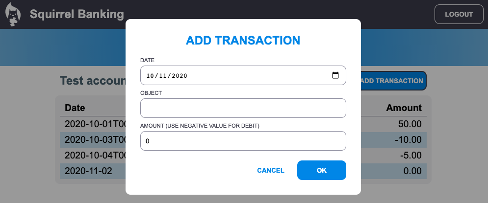

<!--
CO_OP_TRANSLATOR_METADATA:
{
  "original_hash": "5d2efabbc8f94d89f4317ee8646c3ce9",
  "translation_date": "2025-08-29T14:06:53+00:00",
  "source_file": "7-bank-project/4-state-management/README.md",
  "language_code": "de"
}
-->
# Erstellen einer Banking-App Teil 4: Konzepte des State Managements

## Quiz vor der Vorlesung

[Quiz vor der Vorlesung](https://ff-quizzes.netlify.app/web/quiz/47)

### Einführung

Wenn eine Webanwendung wächst, wird es zunehmend schwierig, alle Datenflüsse im Blick zu behalten. Welcher Code ruft die Daten ab, welche Seite nutzt sie, wo und wann müssen sie aktualisiert werden... Es ist leicht, am Ende mit unübersichtlichem Code dazustehen, der schwer zu warten ist. Dies gilt besonders, wenn Daten zwischen verschiedenen Seiten der App geteilt werden müssen, wie z. B. Benutzerdaten. Das Konzept des *State Managements* existiert schon immer in allen Arten von Programmen, aber da Web-Apps immer komplexer werden, ist es mittlerweile ein zentraler Punkt, über den man während der Entwicklung nachdenken muss.

In diesem letzten Teil werden wir die App, die wir gebaut haben, überarbeiten, um das State Management neu zu denken. Ziel ist es, die Unterstützung für Browser-Aktualisierungen zu jeder Zeit zu ermöglichen und Daten über Benutzersitzungen hinweg zu speichern.

### Voraussetzungen

Du musst den [Datenabruf](../3-data/README.md) Teil der Web-App abgeschlossen haben, um diese Lektion zu bearbeiten. Außerdem musst du [Node.js](https://nodejs.org) installieren und [den Server-API](../api/README.md) lokal ausführen, damit du Kontodaten verwalten kannst.

Du kannst testen, ob der Server ordnungsgemäß läuft, indem du diesen Befehl in einem Terminal ausführst:

```sh
curl http://localhost:5000/api
# -> should return "Bank API v1.0.0" as a result
```

---

## State Management überdenken

In der [vorherigen Lektion](../3-data/README.md) haben wir ein grundlegendes Konzept des States in unserer App eingeführt, mit der globalen `account`-Variable, die die Bankdaten des aktuell angemeldeten Benutzers enthält. Unsere aktuelle Implementierung weist jedoch einige Schwächen auf. Versuche, die Seite zu aktualisieren, während du auf dem Dashboard bist. Was passiert?

Es gibt drei Probleme mit dem aktuellen Code:

- Der State wird nicht gespeichert, da ein Browser-Refresh dich zurück zur Login-Seite bringt.
- Es gibt mehrere Funktionen, die den State ändern. Wenn die App wächst, kann es schwierig werden, die Änderungen nachzuverfolgen, und es ist leicht, zu vergessen, eine Aktualisierung vorzunehmen.
- Der State wird nicht bereinigt, sodass die Kontodaten noch vorhanden sind, wenn du auf *Logout* klickst, obwohl du auf der Login-Seite bist.

Wir könnten unseren Code aktualisieren, um diese Probleme einzeln anzugehen, aber das würde zu mehr Code-Duplikation führen und die App komplexer und schwerer wartbar machen. Oder wir könnten uns ein paar Minuten Zeit nehmen und unsere Strategie überdenken.

> Welche Probleme versuchen wir hier wirklich zu lösen?

[State Management](https://en.wikipedia.org/wiki/State_management) dreht sich darum, einen guten Ansatz zu finden, um diese zwei spezifischen Probleme zu lösen:

- Wie können die Datenflüsse in einer App verständlich gehalten werden?
- Wie kann der State immer mit der Benutzeroberfläche synchronisiert werden (und umgekehrt)?

Sobald diese Probleme gelöst sind, könnten andere Probleme entweder bereits behoben sein oder leichter zu lösen sein. Es gibt viele mögliche Ansätze, um diese Probleme zu lösen, aber wir werden eine gängige Lösung verwenden, die darin besteht, **die Daten und die Möglichkeiten, sie zu ändern, zu zentralisieren**. Die Datenflüsse würden wie folgt aussehen:


> Wir behandeln hier nicht den Teil, bei dem die Daten automatisch die Ansicht aktualisieren, da dies mit fortgeschrittenen Konzepten der [Reaktiven Programmierung](https://en.wikipedia.org/wiki/Reactive_programming) verbunden ist. Es ist ein gutes Thema für einen tiefergehenden Einstieg.

✅ Es gibt viele Bibliotheken mit unterschiedlichen Ansätzen für das State Management, [Redux](https://redux.js.org) ist eine beliebte Option. Schau dir die Konzepte und Muster an, die verwendet werden, da sie oft eine gute Möglichkeit bieten, zu lernen, welche potenziellen Probleme in großen Web-Apps auftreten können und wie sie gelöst werden können.

### Aufgabe

Wir beginnen mit etwas Refactoring. Ersetze die `account`-Deklaration:

```js
let account = null;
```

Mit:

```js
let state = {
  account: null
};
```

Die Idee ist, *alle Daten unserer App* in einem einzigen State-Objekt zu zentralisieren. Wir haben derzeit nur `account` im State, sodass sich nicht viel ändert, aber es schafft eine Grundlage für Weiterentwicklungen.

Wir müssen auch die Funktionen aktualisieren, die es verwenden. In den Funktionen `register()` und `login()` ersetze `account = ...` durch `state.account = ...`;

Füge am Anfang der Funktion `updateDashboard()` diese Zeile hinzu:

```js
const account = state.account;
```

Dieses Refactoring hat für sich genommen nicht viele Verbesserungen gebracht, aber die Idee war, die Grundlage für die nächsten Änderungen zu schaffen.

## Datenänderungen verfolgen

Jetzt, da wir das `state`-Objekt eingerichtet haben, um unsere Daten zu speichern, ist der nächste Schritt, die Updates zu zentralisieren. Ziel ist es, Änderungen und deren Zeitpunkte leichter nachverfolgen zu können.

Um zu vermeiden, dass Änderungen am `state`-Objekt vorgenommen werden, ist es auch eine gute Praxis, es als [*unveränderlich*](https://en.wikipedia.org/wiki/Immutable_object) zu betrachten, was bedeutet, dass es überhaupt nicht geändert werden kann. Das bedeutet auch, dass du ein neues State-Objekt erstellen musst, wenn du etwas daran ändern möchtest. Dadurch wird eine Schutzmaßnahme gegen potenziell unerwünschte [Nebenwirkungen](https://en.wikipedia.org/wiki/Side_effect_(computer_science)) geschaffen und gleichzeitig die Möglichkeit für neue Funktionen in deiner App eröffnet, wie z. B. die Implementierung von Undo/Redo. Außerdem wird das Debuggen erleichtert. Du könntest beispielsweise jede Änderung am State protokollieren und eine Historie der Änderungen führen, um die Quelle eines Fehlers zu verstehen.

In JavaScript kannst du [`Object.freeze()`](https://developer.mozilla.org/docs/Web/JavaScript/Reference/Global_Objects/Object/freeze) verwenden, um eine unveränderliche Version eines Objekts zu erstellen. Wenn du versuchst, Änderungen an einem unveränderlichen Objekt vorzunehmen, wird eine Ausnahme ausgelöst.

✅ Kennst du den Unterschied zwischen einem *flachen* und einem *tiefen* unveränderlichen Objekt? Du kannst darüber [hier](https://developer.mozilla.org/docs/Web/JavaScript/Reference/Global_Objects/Object/freeze#What_is_shallow_freeze) lesen.

### Aufgabe

Lass uns eine neue Funktion `updateState()` erstellen:

```js
function updateState(property, newData) {
  state = Object.freeze({
    ...state,
    [property]: newData
  });
}
```

In dieser Funktion erstellen wir ein neues State-Objekt und kopieren Daten aus dem vorherigen State mithilfe des [*Spread (`...`) Operators*](https://developer.mozilla.org/docs/Web/JavaScript/Reference/Operators/Spread_syntax#Spread_in_object_literals). Dann überschreiben wir eine bestimmte Eigenschaft des State-Objekts mit den neuen Daten, indem wir die [Bracket-Notation](https://developer.mozilla.org/docs/Web/JavaScript/Guide/Working_with_Objects#Objects_and_properties) `[property]` für die Zuweisung verwenden. Schließlich sperren wir das Objekt, um Änderungen zu verhindern, indem wir `Object.freeze()` verwenden. Derzeit haben wir nur die `account`-Eigenschaft im State gespeichert, aber mit diesem Ansatz kannst du so viele Eigenschaften wie nötig im State hinzufügen.

Wir aktualisieren auch die `state`-Initialisierung, um sicherzustellen, dass der anfängliche State ebenfalls eingefroren ist:

```js
let state = Object.freeze({
  account: null
});
```

Danach aktualisieren wir die Funktion `register`, indem wir die Zuweisung `state.account = result;` durch Folgendes ersetzen:

```js
updateState('account', result);
```

Das Gleiche machen wir mit der Funktion `login`, indem wir `state.account = data;` durch Folgendes ersetzen:

```js
updateState('account', data);
```

Wir nutzen die Gelegenheit, um das Problem zu beheben, dass die Kontodaten nicht gelöscht werden, wenn der Benutzer auf *Logout* klickt.

Erstelle eine neue Funktion `logout()`:

```js
function logout() {
  updateState('account', null);
  navigate('/login');
}
```

Ersetze in `updateDashboard()` die Umleitung `return navigate('/login');` durch `return logout();`;

Versuche, ein neues Konto zu registrieren, dich auszuloggen und erneut einzuloggen, um zu überprüfen, ob alles weiterhin korrekt funktioniert.

> Tipp: Du kannst dir alle State-Änderungen ansehen, indem du `console.log(state)` am Ende von `updateState()` hinzufügst und die Konsole in den Entwicklertools deines Browsers öffnest.

## State speichern

Die meisten Web-Apps müssen Daten speichern, um korrekt zu funktionieren. Alle kritischen Daten werden normalerweise in einer Datenbank gespeichert und über eine Server-API abgerufen, wie z. B. die Benutzerdaten in unserem Fall. Aber manchmal ist es auch interessant, einige Daten in der Client-App zu speichern, die in deinem Browser läuft, um eine bessere Benutzererfahrung oder eine verbesserte Ladeleistung zu erzielen.

Wenn du Daten in deinem Browser speichern möchtest, gibt es einige wichtige Fragen, die du dir stellen solltest:

- *Sind die Daten sensibel?* Du solltest vermeiden, sensible Daten wie Benutzerpasswörter auf dem Client zu speichern.
- *Wie lange möchtest du diese Daten behalten?* Planst du, auf diese Daten nur während der aktuellen Sitzung zuzugreifen, oder möchtest du sie dauerhaft speichern?

Es gibt verschiedene Möglichkeiten, Informationen innerhalb einer Web-App zu speichern, abhängig davon, was du erreichen möchtest. Zum Beispiel kannst du die URLs verwenden, um eine Suchanfrage zu speichern und sie zwischen Benutzern teilbar zu machen. Du kannst auch [HTTP-Cookies](https://developer.mozilla.org/docs/Web/HTTP/Cookies) verwenden, wenn die Daten mit dem Server geteilt werden müssen, wie z. B. [Authentifizierungsinformationen](https://en.wikipedia.org/wiki/Authentication).

Eine andere Option ist die Verwendung einer der vielen Browser-APIs zum Speichern von Daten. Zwei davon sind besonders interessant:

- [`localStorage`](https://developer.mozilla.org/docs/Web/API/Window/localStorage): ein [Key/Value Store](https://en.wikipedia.org/wiki/Key%E2%80%93value_database), der es ermöglicht, daten spezifisch für die aktuelle Website über verschiedene Sitzungen hinweg zu speichern. Die gespeicherten Daten verfallen nie.
- [`sessionStorage`](https://developer.mozilla.org/docs/Web/API/Window/sessionStorage): funktioniert genauso wie `localStorage`, außer dass die darin gespeicherten Daten gelöscht werden, wenn die Sitzung endet (wenn der Browser geschlossen wird).

Beachte, dass beide APIs nur [Strings](https://developer.mozilla.org/docs/Web/JavaScript/Reference/Global_Objects/String) speichern können. Wenn du komplexe Objekte speichern möchtest, musst du sie in das [JSON](https://developer.mozilla.org/docs/Web/JavaScript/Reference/Global_Objects/JSON)-Format serialisieren, indem du [`JSON.stringify()`](https://developer.mozilla.org/docs/Web/JavaScript/Reference/Global_Objects/JSON/stringify) verwendest.

✅ Wenn du eine Web-App erstellen möchtest, die nicht mit einem Server arbeitet, ist es auch möglich, eine Datenbank auf dem Client mit der [`IndexedDB` API](https://developer.mozilla.org/docs/Web/API/IndexedDB_API) zu erstellen. Diese ist für fortgeschrittene Anwendungsfälle oder wenn du eine erhebliche Menge an Daten speichern musst, da sie komplexer zu verwenden ist.

### Aufgabe

Wir möchten, dass unsere Benutzer eingeloggt bleiben, bis sie explizit auf die *Logout*-Schaltfläche klicken. Daher verwenden wir `localStorage`, um die Kontodaten zu speichern. Zunächst definieren wir einen Schlüssel, den wir zum Speichern unserer Daten verwenden.

```js
const storageKey = 'savedAccount';
```

Füge dann diese Zeile am Ende der Funktion `updateState()` hinzu:

```js
localStorage.setItem(storageKey, JSON.stringify(state.account));
```

Damit werden die Benutzerdaten gespeichert und sind immer auf dem neuesten Stand, da wir zuvor alle State-Updates zentralisiert haben. Hier beginnen wir, von all unseren vorherigen Refactorings zu profitieren 🙂.

Da die Daten gespeichert werden, müssen wir auch dafür sorgen, dass sie wiederhergestellt werden, wenn die App geladen wird. Da wir mehr Initialisierungscode haben werden, ist es eine gute Idee, eine neue Funktion `init` zu erstellen, die auch unseren vorherigen Code am Ende von `app.js` enthält:

```js
function init() {
  const savedAccount = localStorage.getItem(storageKey);
  if (savedAccount) {
    updateState('account', JSON.parse(savedAccount));
  }

  // Our previous initialization code
  window.onpopstate = () => updateRoute();
  updateRoute();
}

init();
```

Hier rufen wir die gespeicherten Daten ab, und wenn welche vorhanden sind, aktualisieren wir den State entsprechend. Es ist wichtig, dies *vor* der Aktualisierung der Route zu tun, da es Code geben könnte, der während der Seitenaktualisierung auf den State angewiesen ist.

Wir können auch die *Dashboard*-Seite zur Standardseite unserer Anwendung machen, da wir jetzt die Kontodaten speichern. Wenn keine Daten gefunden werden, kümmert sich das Dashboard ohnehin darum, zur *Login*-Seite umzuleiten. Ersetze in `updateRoute()` den Fallback `return navigate('/login');` durch `return navigate('/dashboard');`.

Logge dich jetzt in die App ein und versuche, die Seite zu aktualisieren. Du solltest auf dem Dashboard bleiben. Mit diesem Update haben wir alle unsere anfänglichen Probleme gelöst...

## Daten aktualisieren

...Aber wir könnten auch ein neues Problem geschaffen haben. Ups!

Gehe mit dem `test`-Konto zum Dashboard und führe dann diesen Befehl in einem Terminal aus, um eine neue Transaktion zu erstellen:

```sh
curl --request POST \
     --header "Content-Type: application/json" \
     --data "{ \"date\": \"2020-07-24\", \"object\": \"Bought book\", \"amount\": -20 }" \
     http://localhost:5000/api/accounts/test/transactions
```

Versuche jetzt, die Dashboard-Seite im Browser zu aktualisieren. Was passiert? Siehst du die neue Transaktion?

Der State wird dank `localStorage` unbegrenzt gespeichert, aber das bedeutet auch, dass er nie aktualisiert wird, bis du dich aus der App ausloggst und wieder einloggst!

Eine mögliche Strategie, um das zu beheben, ist, die Kontodaten jedes Mal neu zu laden, wenn das Dashboard geladen wird, um veraltete Daten zu vermeiden.

### Aufgabe

Erstelle eine neue Funktion `updateAccountData`:

```js
async function updateAccountData() {
  const account = state.account;
  if (!account) {
    return logout();
  }

  const data = await getAccount(account.user);
  if (data.error) {
    return logout();
  }

  updateState('account', data);
}
```

Diese Methode überprüft, ob wir derzeit eingeloggt sind, und lädt dann die Kontodaten vom Server neu.

Erstelle eine weitere Funktion namens `refresh`:

```js
async function refresh() {
  await updateAccountData();
  updateDashboard();
}
```

Diese Funktion aktualisiert die Kontodaten und kümmert sich dann um die Aktualisierung des HTML des Dashboard-Seite. Sie ist das, was wir aufrufen müssen, wenn die Dashboard-Route geladen wird. Aktualisiere die Routen-Definition mit:

```js
const routes = {
  '/login': { templateId: 'login' },
  '/dashboard': { templateId: 'dashboard', init: refresh }
};
```

Versuche jetzt, das Dashboard zu aktualisieren. Es sollte die aktualisierten Kontodaten anzeigen.

---

## 🚀 Herausforderung

Da wir die Kontodaten jedes Mal neu laden, wenn das Dashboard geladen wird, denkst du, dass wir immer noch *alle Kontodaten* speichern müssen?

Versuche gemeinsam zu arbeiten, um zu ändern, was in `localStorage` gespeichert und geladen wird, sodass nur das gespeichert wird, was absolut notwendig ist, damit die App funktioniert.

## Quiz nach der Vorlesung

[Quiz nach der Vorlesung](https://ff-quizzes.netlify.app/web/quiz/48)

## Aufgabe
[Implementieren Sie den Dialog "Transaktion hinzufügen"](assignment.md)

Hier ist ein Beispielergebnis nach Abschluss der Aufgabe:



---

**Haftungsausschluss**:  
Dieses Dokument wurde mit dem KI-Übersetzungsdienst [Co-op Translator](https://github.com/Azure/co-op-translator) übersetzt. Obwohl wir uns um Genauigkeit bemühen, beachten Sie bitte, dass automatisierte Übersetzungen Fehler oder Ungenauigkeiten enthalten können. Das Originaldokument in seiner ursprünglichen Sprache sollte als maßgebliche Quelle betrachtet werden. Für kritische Informationen wird eine professionelle menschliche Übersetzung empfohlen. Wir übernehmen keine Haftung für Missverständnisse oder Fehlinterpretationen, die sich aus der Nutzung dieser Übersetzung ergeben.