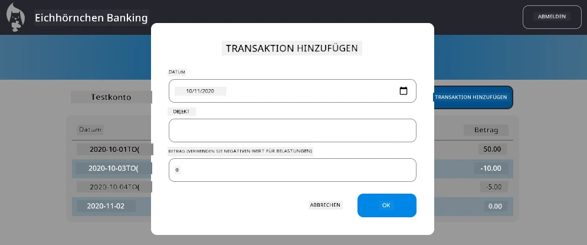

# "Transaktion hinzufügen"-Dialog implementieren

## Übersicht

Deine Banking-App verfügt jetzt über eine solide Zustandsverwaltung und Datenpersistenz, aber es fehlt eine wichtige Funktion, die echte Banking-Apps benötigen: die Möglichkeit für Benutzer, eigene Transaktionen hinzuzufügen. In dieser Aufgabe implementierst du einen vollständigen "Transaktion hinzufügen"-Dialog, der nahtlos in dein bestehendes Zustandsverwaltungssystem integriert wird.

Diese Aufgabe verbindet alles, was du in den vier Banking-Lektionen gelernt hast: HTML-Templating, Formularverarbeitung, API-Integration und Zustandsverwaltung.

## Lernziele

Durch die Bearbeitung dieser Aufgabe wirst du:
- **Eine** benutzerfreundliche Dialogoberfläche zur Dateneingabe erstellen
- **Eine** barrierefreie Formulargestaltung mit Tastatur- und Screenreader-Unterstützung umsetzen
- **Neue** Funktionen in dein bestehendes Zustandsverwaltungssystem integrieren
- **API-Kommunikation** und Fehlerbehandlung üben
- **Moderne** Webentwicklungsmuster auf eine reale Funktion anwenden

## Anweisungen

### Schritt 1: "Transaktion hinzufügen"-Button

**Erstelle** einen "Transaktion hinzufügen"-Button auf deiner Dashboard-Seite, den Benutzer leicht finden und benutzen können.

**Anforderungen:**
- **Platziere** den Button an einem logischen Ort auf dem Dashboard
- **Verwende** klare, handlungsorientierte Button-Beschriftungen
- **Gestalte** den Button passend zum bestehenden UI-Design
- **Stelle sicher**, dass der Button per Tastatur erreichbar ist

### Schritt 2: Dialog-Implementierung

Wähle eine dieser beiden Ansätze zur Umsetzung deines Dialogs:

**Option A: Separate Seite**
- **Erstelle** eine neue HTML-Vorlage für das Transaktionsformular
- **Füge** dem Routing-System eine neue Route hinzu
- **Implementiere** Navigation zur Formularseite und zurück

**Option B: Modal-Dialog (Empfohlen)**
- **Nutze** JavaScript, um den Dialog anzuzeigen/zu verstecken, ohne das Dashboard zu verlassen
- **Setze** dazu die [`hidden`-Eigenschaft](https://developer.mozilla.org/docs/Web/HTML/Global_attributes/hidden) oder CSS-Klassen ein
- **Schaffe** eine reibungslose Nutzererfahrung mit korrektem Fokusmanagement

### Schritt 3: Barrierefreiheit umsetzen

**Stelle sicher**, dass dein Dialog den [Barrierefreiheitsstandards für modale Dialoge](https://developer.paciellogroup.com/blog/2018/06/the-current-state-of-modal-dialog-accessibility/) entspricht:

**Tastaturnavigation:**
- **Unterstütze** die Escape-Taste zum Schließen des Dialogs
- **Fange** den Fokus innerhalb des Dialogs, wenn dieser geöffnet ist
- **Gib** den Fokus nach dem Schließen an den auslösenden Button zurück

**Screenreader-Unterstützung:**
- **Füge** passende ARIA-Labels und Rollen hinzu
- **Kündige** das Öffnen/Schließen des Dialogs für Screenreader an
- **Stelle** klare Formularfeldbeschriftungen und Fehlermeldungen bereit

### Schritt 4: Formular erstellen

**Gestalte** ein HTML-Formular, das Transaktionsdaten sammelt:

**Pflichtfelder:**
- **Datum**: Wann die Transaktion stattgefunden hat
- **Beschreibung**: Wofür die Transaktion war
- **Betrag**: Transaktionswert (positiv für Einnahmen, negativ für Ausgaben)

**Formularfunktionen:**
- **Validiere** Benutzereingaben vor dem Absenden
- **Zeige** klare Fehlermeldungen bei ungültigen Daten an
- **Verwende** hilfreiche Platzhaltertexte und Labels
- **Stylen** das Formular konsistent mit deinem bestehenden Design

### Schritt 5: API-Integration

**Verbinde** dein Formular mit der Backend-API:

**Umsetzungsschritte:**
- **Sieh** dir die [Server-API-Spezifikationen](../api/README.md) für den korrekten Endpunkt und das Datenformat an
- **Erstelle** JSON-Daten aus den Formulareingaben
- **Sende** die Daten mit entsprechender Fehlerbehandlung an die API
- **Zeige** dem Benutzer Erfolg- oder Fehlermeldungen an
- **Behandle** Netzwerkfehler angemessen

### Schritt 6: Integration in die Zustandsverwaltung

**Aktualisiere** dein Dashboard mit der neuen Transaktion:

**Integrationsanforderungen:**
- **Lade** die Kontodaten nach erfolgreicher Transaktion neu
- **Aktualisiere** die Dashboard-Anzeige ohne Seiten-Neuladen
- **Stelle sicher**, dass die neue Transaktion sofort erscheint
- **Bewahre** während des gesamten Prozesses eine konsistente Zustandsverwaltung

## Technische Spezifikationen

**Details zum API-Endpunkt:**
Siehe die [Server-API-Dokumentation](../api/README.md) für:
- Erforderliches JSON-Format der Transaktionsdaten
- HTTP-Methode und Endpunkt-URL
- Erwartetes Antwortformat
- Fehlerantwort-Behandlung

**Erwartetes Ergebnis:**
Nach Abschluss dieser Aufgabe verfügt deine Banking-App über eine voll funktionsfähige "Transaktion hinzufügen"-Funktion, die professionell aussieht und funktioniert:

## Testen deiner Implementierung

**Funktionale Tests:**
1. **Überprüfe**, dass der "Transaktion hinzufügen"-Button gut sichtbar und erreichbar ist
2. **Teste**, ob der Dialog korrekt öffnet und schließt
3. **Bestätige**, dass die Formularvalidierung für alle Pflichtfelder funktioniert
4. **Prüfe**, dass erfolgreiche Transaktionen sofort im Dashboard erscheinen
5. **Vergewissere** dich, dass die Fehlerbehandlung bei ungültigen Daten und Netzwerkproblemen funktioniert

**Barrierefreiheitstests:**
1. **Navigiere** den gesamten Ablauf ausschließlich mit der Tastatur
2. **Teste** mit einem Screenreader, ob die Ansagen korrekt erfolgen
3. **Überprüfe**, ob das Fokusmanagement korrekt funktioniert
4. **Stelle sicher**, dass alle Formularelemente passende Labels besitzen

## Bewertungsraster

| Kriterien | Hervorragend | Ausreichend | Verbesserungswürdig |
| -------- | --------- | -------- | ----------------- |
| **Funktionalität** | Die Funktion zum Hinzufügen von Transaktionen funktioniert einwandfrei mit hervorragender Nutzererfahrung und entspricht allen Best Practices aus den Lektionen | Funktion zum Hinzufügen von Transaktionen funktioniert korrekt, entspricht aber nicht allen Best Practices oder weist kleinere Usability-Mängel auf | Funktion zum Hinzufügen von Transaktionen ist nur teilweise funktionsfähig oder weist erhebliche Usability-Probleme auf |
| **Codequalität** | Code ist gut strukturiert, folgt etablierten Mustern, enthält fehlerfreie Fehlerbehandlung und integriert sich nahtlos in die bestehende Zustandsverwaltung | Code funktioniert, kann aber organisatorische Probleme oder uneinheitliche Muster gegenüber dem bestehenden Code aufweisen | Code hat erhebliche strukturelle Probleme oder integriert sich schlecht in bestehende Muster |
| **Barrierefreiheit** | Vollständige Tastaturnavigation, Kompatibilität mit Screenreadern und Einhaltung der WCAG-Richtlinien mit exzellentem Fokusmanagement | Basis-Barrierefreiheitsfunktionen umgesetzt, aber eventuell fehlen einige Tastaturnavigations- oder Screenreader-Funktionen | Eingeschränkte oder keine Barrierefreiheitsmaßnahmen umgesetzt |
| **Benutzererlebnis** | Intuitive, ausgereifte Oberfläche mit klaren Rückmeldungen, reibungsvollen Interaktionen und professionellem Erscheinungsbild | Gutes Benutzererlebnis mit kleineren Verbesserungsbereichen bei Rückmeldung oder Design | Schlechtes Benutzererlebnis mit verwirrender Oberfläche oder fehlenden Benutzerfeedbacks |

## Zusätzliche Herausforderungen (Optional)

Nach Erfüllung der Grundanforderungen kannst du folgende Erweiterungen in Betracht ziehen:

**Erweiterte Funktionen:**
- **Füge** Transaktionskategorien hinzu (Essen, Transport, Unterhaltung usw.)
- **Implementiere** Eingabevalidierung mit Echtzeit-Feedback
- **Erstelle** Tastaturkürzel für Power-User
- **Füge** Funktionen zum Bearbeiten und Löschen von Transaktionen hinzu

**Erweiterte Integration:**
- **Implementiere** Rückgängig-Funktionen für zuletzt hinzugefügte Transaktionen
- **Füge** einen Massenimport von Transaktionen aus CSV-Dateien hinzu
- **Erstelle** Such- und Filterfunktionen für Transaktionen
- **Implementiere** eine Datenexportfunktion

Diese optionalen Funktionen helfen dir, fortgeschrittene Webentwicklungskonzepte zu üben und eine umfassendere Banking-Anwendung zu erstellen!

---

<!-- CO-OP TRANSLATOR DISCLAIMER START -->
**Haftungsausschluss**:  
Dieses Dokument wurde mit dem KI-Übersetzungsdienst [Co-op Translator](https://github.com/Azure/co-op-translator) übersetzt. Obwohl wir um Genauigkeit bemüht sind, beachten Sie bitte, dass automatisierte Übersetzungen Fehler oder Ungenauigkeiten enthalten können. Das Originaldokument in seiner ursprünglichen Sprache gilt als maßgebliche Quelle. Für kritische Informationen wird eine professionelle menschliche Übersetzung empfohlen. Wir übernehmen keine Haftung für Missverständnisse oder Fehlinterpretationen, die aus der Nutzung dieser Übersetzung entstehen.
<!-- CO-OP TRANSLATOR DISCLAIMER END -->