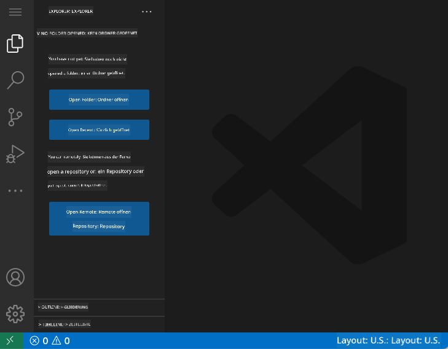
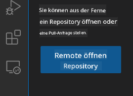
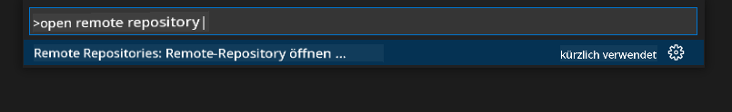
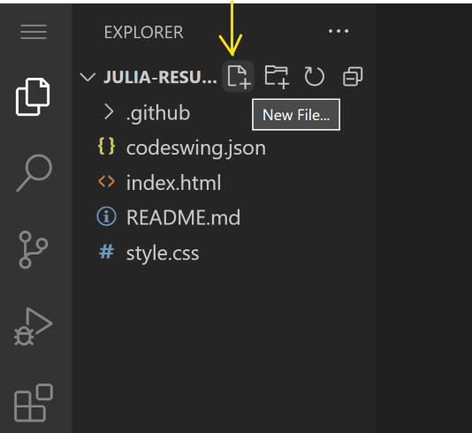
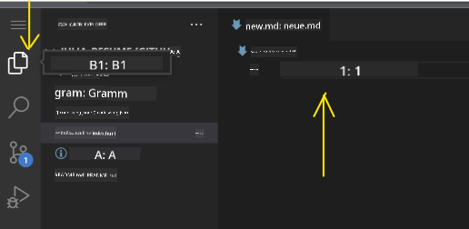
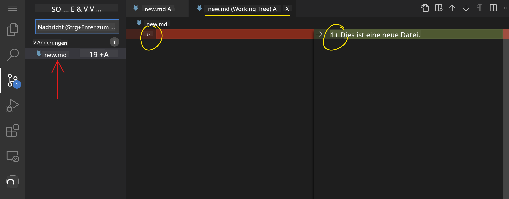
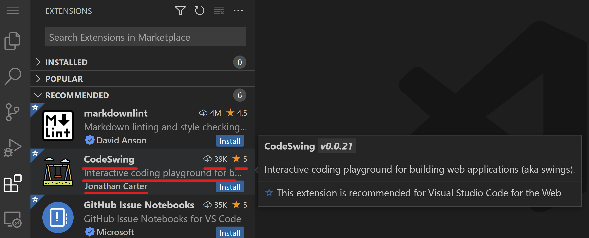
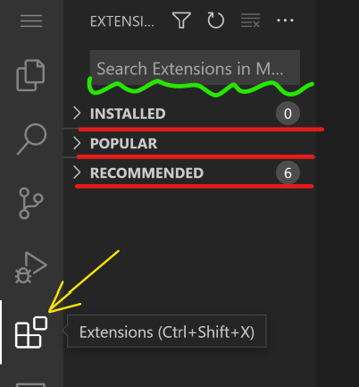
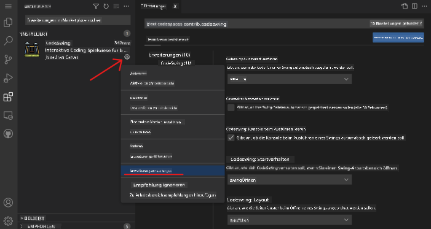

<!--
CO_OP_TRANSLATOR_METADATA:
{
  "original_hash": "1ba61d96a11309a2a6ea507496dcf7e5",
  "translation_date": "2025-08-29T14:16:25+00:00",
  "source_file": "8-code-editor/1-using-a-code-editor/README.md",
  "language_code": "de"
}
-->
# Verwendung eines Code-Editors

Diese Lektion behandelt die Grundlagen der Nutzung von [VSCode.dev](https://vscode.dev), einem webbasierten Code-Editor, damit du Änderungen an deinem Code vornehmen und zu einem Projekt beitragen kannst, ohne etwas auf deinem Computer installieren zu müssen.

<!----
TODO: optionales Bild hinzufügen

> Sketchnote von [Author name](https://example.com)
---->

<!---
## Quiz vor der Lektion
[Quiz vor der Lektion](https://ff-quizzes.netlify.app/web/quiz/3)
---->

## Lernziele

In dieser Lektion lernst du:

- Einen Code-Editor in einem Code-Projekt zu verwenden
- Änderungen mit Versionskontrolle zu verfolgen
- Den Editor für die Entwicklung anzupassen

### Voraussetzungen

Bevor du beginnst, musst du ein Konto bei [GitHub](https://github.com) erstellen. Navigiere zu [GitHub](https://github.com/) und erstelle ein Konto, falls du noch keines hast.

### Einführung

Ein Code-Editor ist ein unverzichtbares Werkzeug zum Schreiben von Programmen und zur Zusammenarbeit an bestehenden Coding-Projekten. Sobald du die Grundlagen eines Editors und dessen Funktionen verstanden hast, kannst du diese beim Schreiben von Code anwenden.

## Einstieg in VSCode.dev

[VSCode.dev](https://vscode.dev) ist ein Code-Editor im Web. Du musst nichts installieren, um ihn zu nutzen – es ist genauso einfach wie das Öffnen einer anderen Website. Um mit dem Editor zu beginnen, öffne den folgenden Link: [https://vscode.dev](https://vscode.dev). Falls du nicht bei [GitHub](https://github.com/) angemeldet bist, folge den Anweisungen, um dich anzumelden oder ein neues Konto zu erstellen und dich dann einzuloggen.

Sobald der Editor geladen ist, sollte er ähnlich wie dieses Bild aussehen:



Es gibt drei Hauptbereiche, von links nach rechts:

1. Die _Aktivitätsleiste_, die einige Symbole enthält, wie die Lupe 🔎, das Zahnrad ⚙️ und einige andere.
2. Die erweiterte Aktivitätsleiste, die standardmäßig den _Explorer_ zeigt und als _Seitenleiste_ bezeichnet wird.
3. Und schließlich der Code-Bereich rechts.

Klicke auf jedes der Symbole, um ein anderes Menü anzuzeigen. Wenn du fertig bist, klicke auf den _Explorer_, um wieder zum Ausgangspunkt zurückzukehren.

Wenn du anfängst, Code zu erstellen oder bestehenden Code zu ändern, geschieht dies im größten Bereich rechts. Du wirst diesen Bereich auch nutzen, um bestehenden Code zu visualisieren, was du als Nächstes tun wirst.

## Ein GitHub-Repository öffnen

Das Erste, was du tun musst, ist ein GitHub-Repository zu öffnen. Es gibt mehrere Möglichkeiten, ein Repository zu öffnen. In diesem Abschnitt siehst du zwei verschiedene Methoden, wie du ein Repository öffnen kannst, um Änderungen vorzunehmen.

### 1. Mit dem Editor

Verwende den Editor selbst, um ein Remote-Repository zu öffnen. Wenn du zu [VSCode.dev](https://vscode.dev) gehst, siehst du einen Button _"Open Remote Repository"_:



Du kannst auch die Befehls-Palette verwenden. Die Befehls-Palette ist ein Eingabefeld, in das du ein beliebiges Wort eingeben kannst, das Teil eines Befehls oder einer Aktion ist, um den richtigen Befehl auszuführen. Verwende das Menü oben links, wähle dann _View_ und anschließend _Command Palette_, oder nutze die folgende Tastenkombination: Strg-Shift-P (auf MacOS wäre es Command-Shift-P).



Sobald das Menü geöffnet ist, gib _open remote repository_ ein und wähle die erste Option. Mehrere Repositories, an denen du beteiligt bist oder die du kürzlich geöffnet hast, werden angezeigt. Du kannst auch eine vollständige GitHub-URL verwenden, um eines auszuwählen. Verwende die folgende URL und füge sie in das Feld ein:

```
https://github.com/microsoft/Web-Dev-For-Beginners
```

✅ Wenn erfolgreich, werden alle Dateien dieses Repositorys im Texteditor geladen.

### 2. Mit der URL

Du kannst auch direkt eine URL verwenden, um ein Repository zu laden. Zum Beispiel lautet die vollständige URL für das aktuelle Repository [https://github.com/microsoft/Web-Dev-For-Beginners](https://github.com/microsoft/Web-Dev-For-Beginners), aber du kannst die GitHub-Domain durch `VSCode.dev/github` ersetzen und das Repository direkt laden. Die resultierende URL wäre [https://vscode.dev/github/microsoft/Web-Dev-For-Beginners](https://vscode.dev/github/microsoft/Web-Dev-For-Beginners).

## Dateien bearbeiten

Sobald du das Repository im Browser/vscode.dev geöffnet hast, besteht der nächste Schritt darin, Updates oder Änderungen am Projekt vorzunehmen.

### 1. Eine neue Datei erstellen

Du kannst entweder eine Datei in einem bestehenden Ordner erstellen oder sie im Stammverzeichnis/Ordner anlegen. Um eine neue Datei zu erstellen, öffne einen Speicherort/Ordner, in dem die Datei gespeichert werden soll, und wähle das Symbol _'Neue Datei ...'_ in der Aktivitätsleiste _(links)_, gib ihr einen Namen und drücke Enter.



### 2. Eine Datei im Repository bearbeiten und speichern

Die Nutzung von vscode.dev ist hilfreich, wenn du schnelle Updates an deinem Projekt vornehmen möchtest, ohne Software lokal zu laden. Um deinen Code zu aktualisieren, klicke auf das Symbol 'Explorer', das sich ebenfalls in der Aktivitätsleiste befindet, um Dateien und Ordner im Repository anzuzeigen. Wähle eine Datei aus, um sie im Code-Bereich zu öffnen, nimm deine Änderungen vor und speichere sie.



Sobald du mit der Aktualisierung deines Projekts fertig bist, wähle das Symbol _`Source Control`_, das alle neuen Änderungen enthält, die du an deinem Repository vorgenommen hast.

Um die Änderungen an deinem Projekt anzuzeigen, wähle die Datei(en) im Ordner `Changes` in der erweiterten Aktivitätsleiste aus. Dadurch wird ein 'Working Tree' geöffnet, in dem du die Änderungen an der Datei visuell sehen kannst. Rot zeigt eine Entfernung aus dem Projekt, während Grün eine Hinzufügung bedeutet.



Wenn du mit den Änderungen zufrieden bist, die du vorgenommen hast, bewege den Mauszeiger über den Ordner `Changes` und klicke auf die Schaltfläche `+`, um die Änderungen zu stagen. Staging bedeutet einfach, deine Änderungen vorzubereiten, um sie bei GitHub zu committen.

Falls du jedoch mit einigen Änderungen nicht zufrieden bist und sie verwerfen möchtest, bewege den Mauszeiger über den Ordner `Changes` und wähle das Symbol `Undo`.

Gib dann eine `Commit-Nachricht` ein _(Eine Beschreibung der Änderungen, die du am Projekt vorgenommen hast)_, klicke auf das `Check-Symbol`, um die Änderungen zu committen und zu pushen.

Sobald du mit deinem Projekt fertig bist, wähle das `Hamburger-Menü-Symbol` oben links, um zum Repository auf github.com zurückzukehren.


## Erweiterungen verwenden

Das Installieren von Erweiterungen in VSCode ermöglicht es dir, neue Funktionen und Optionen für eine angepasste Entwicklungsumgebung in deinem Editor hinzuzufügen, um deinen Entwicklungsworkflow zu verbessern. Diese Erweiterungen helfen dir auch, Unterstützung für mehrere Programmiersprachen hinzuzufügen und sind oft entweder generische Erweiterungen oder sprachbasierte Erweiterungen.

Um die Liste aller verfügbaren Erweiterungen zu durchsuchen, klicke auf das Symbol _`Extensions`_ in der Aktivitätsleiste und beginne, den Namen der Erweiterung in das Textfeld mit der Bezeichnung _'Search Extensions in Marketplace'_ einzugeben. Du siehst eine Liste von Erweiterungen, die jeweils **den Namen der Erweiterung, den Namen des Herausgebers, eine kurze Beschreibung, die Anzahl der Downloads** und **eine Sternebewertung** enthalten.



Du kannst auch alle zuvor installierten Erweiterungen anzeigen, indem du den Ordner _`Installed`_ erweiterst, beliebte Erweiterungen, die von den meisten Entwicklern verwendet werden, im Ordner _`Popular`_ und empfohlene Erweiterungen für dich entweder von Benutzern im selben Arbeitsbereich oder basierend auf deinen zuletzt geöffneten Dateien im Ordner _`Recommended`_.



### 1. Erweiterungen installieren

Um eine Erweiterung zu installieren, gib den Namen der Erweiterung in das Suchfeld ein und klicke darauf, um zusätzliche Informationen über die Erweiterung im Code-Bereich anzuzeigen, sobald sie in der erweiterten Aktivitätsleiste erscheint.

Du kannst entweder auf die _blaue Installationsschaltfläche_ in der erweiterten Aktivitätsleiste klicken, um die Erweiterung zu installieren, oder die Installationsschaltfläche verwenden, die im Code-Bereich erscheint, sobald du die Erweiterung auswählst, um zusätzliche Informationen zu laden.


### 2. Erweiterungen anpassen

Nach der Installation der Erweiterung musst du möglicherweise deren Verhalten ändern und sie basierend auf deinen Präferenzen anpassen. Um dies zu tun, wähle das Symbol Extensions aus, und diesmal wird deine Erweiterung im Ordner _Installed_ angezeigt. Klicke auf das _**Zahnrad-Symbol**_ und navigiere zu _Extensions Setting_.



### 3. Erweiterungen verwalten

Nach der Installation und Nutzung deiner Erweiterung bietet vscode.dev Optionen, um deine Erweiterung basierend auf verschiedenen Bedürfnissen zu verwalten. Zum Beispiel kannst du:

- **Deaktivieren:** _(Du kannst eine Erweiterung vorübergehend deaktivieren, wenn du sie nicht mehr benötigst, sie aber nicht vollständig deinstallieren möchtest)_

    Wähle die installierte Erweiterung in der erweiterten Aktivitätsleiste aus > klicke auf das Zahnrad-Symbol > wähle 'Disable' oder 'Disable (Workspace)' **ODER** öffne die Erweiterung im Code-Bereich und klicke auf die blaue Schaltfläche Disable.

   
- **Deinstallieren:** Wähle die installierte Erweiterung in der erweiterten Aktivitätsleiste aus > klicke auf das Zahnrad-Symbol > wähle 'Uninstall' **ODER** öffne die Erweiterung im Code-Bereich und klicke auf die blaue Schaltfläche Uninstall.

---

## Aufgabe

[Erstelle eine Lebenslauf-Website mit vscode.dev](https://github.com/microsoft/Web-Dev-For-Beginners/blob/main/8-code-editor/1-using-a-code-editor/assignment.md)

<!----
## Quiz nach der Lektion
[Quiz nach der Lektion](https://ff-quizzes.netlify.app/web/quiz/4)
---->

## Überprüfung & Selbststudium

Lies mehr über [VSCode.dev](https://code.visualstudio.com/docs/editor/vscode-web?WT.mc_id=academic-0000-alfredodeza) und einige seiner anderen Funktionen.

---

**Haftungsausschluss**:  
Dieses Dokument wurde mit dem KI-Übersetzungsdienst [Co-op Translator](https://github.com/Azure/co-op-translator) übersetzt. Obwohl wir uns um Genauigkeit bemühen, weisen wir darauf hin, dass automatisierte Übersetzungen Fehler oder Ungenauigkeiten enthalten können. Das Originaldokument in seiner ursprünglichen Sprache sollte als maßgebliche Quelle betrachtet werden. Für kritische Informationen wird eine professionelle menschliche Übersetzung empfohlen. Wir übernehmen keine Haftung für Missverständnisse oder Fehlinterpretationen, die sich aus der Nutzung dieser Übersetzung ergeben.