<!--
CO_OP_TRANSLATOR_METADATA:
{
  "original_hash": "a9a3bcc037a447e2d8994d99e871cd9f",
  "translation_date": "2026-01-06T08:36:46+00:00",
  "source_file": "8-code-editor/1-using-a-code-editor/README.md",
  "language_code": "de"
}
-->
# Verwendung eines Code-Editors: VSCode.dev meistern

Erinnerst du dich an *The Matrix*, als Neo an ein riesiges Computerterminal angeschlossen werden musste, um Zugang zur digitalen Welt zu erhalten? Die heutigen Web-Entwicklungstools sind das genaue Gegenteil – unglaublich leistungsstarke Funktionen, die von überall aus zugänglich sind. VSCode.dev ist ein browserbasierter Code-Editor, der professionelle Entwicklungstools auf jedes Gerät mit Internetverbindung bringt.

So wie die Druckerpresse Bücher für alle zugänglich machte und nicht nur für Schreiber in Klöstern, demokratisiert VSCode.dev das Programmieren. Du kannst an Projekten von einem Bibliothekscomputer, einem Computerraum in der Schule oder überall dort arbeiten, wo du einen Browser hast. Keine Installationen, keine „Ich brauche meine spezielle Einrichtung“-Beschränkungen.

Am Ende dieser Lektion wirst du verstehen, wie du dich in VSCode.dev zurechtfindest, GitHub-Repositories direkt im Browser öffnest und Git für Versionskontrolle nutzt – alles Fähigkeiten, auf die professionelle Entwickler täglich zurückgreifen.

## ⚡ Was du in den nächsten 5 Minuten machen kannst

**Schnellstart-Pfad für vielbeschäftigte Entwickler**


- **Minute 1**: Navigiere zu [vscode.dev](https://vscode.dev) – keine Installation erforderlich
- **Minute 2**: Melde dich mit GitHub an, um deine Repositories zu verbinden
- **Minute 3**: Probiere den URL-Trick: Ersetze `github.com` durch `vscode.dev/github` in jeder Repo-URL
- **Minute 4**: Erstelle eine neue Datei und beobachte, wie die Syntaxhervorhebung automatisch funktioniert
- **Minute 5**: Nimm eine Änderung vor und führe einen Commit über das Source-Control-Panel durch

**Schnelltest-URL**:  
```
# Transform this:
github.com/microsoft/Web-Dev-For-Beginners

# Into this:
vscode.dev/github/microsoft/Web-Dev-For-Beginners
```
  
**Warum das wichtig ist**: In 5 Minuten erlebst du die Freiheit, überall mit professionellen Tools zu coden. Das ist die Zukunft der Entwicklung – zugänglich, mächtig und sofort einsatzbereit.

## 🗺️ Deine Lernreise durch cloudbasierte Entwicklung

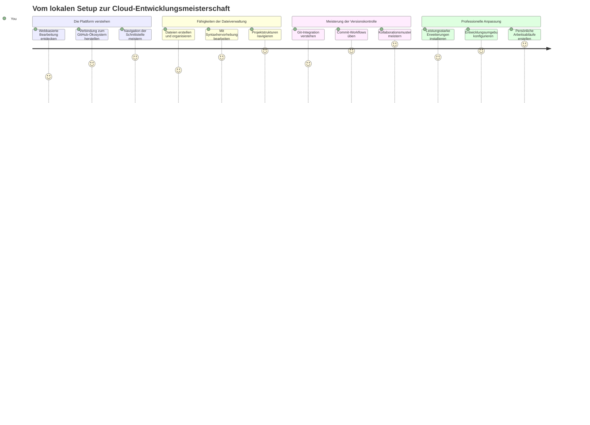
**Dein Reiseziel**: Am Ende dieser Lektion beherrschst du eine professionelle Cloud-Entwicklungsumgebung, die auf jedem Gerät funktioniert und es dir ermöglicht, mit denselben Tools zu programmieren, die Entwickler bei großen Tech-Unternehmen verwenden.

## Was du lernen wirst

Nachdem wir das gemeinsam durchgegangen sind, wirst du in der Lage sein:

- VSCode.dev zu navigieren, als wäre es dein zweites Zuhause – alles findest du ohne dich zu verlaufen
- Jedes GitHub-Repository im Browser zu öffnen und sofort zu bearbeiten (das ist ziemlich magisch!)
- Git zu verwenden, um deine Änderungen zu verfolgen und deinen Fortschritt professionell zu speichern
- Deinen Editor mit Erweiterungen aufzurüsten, die das Coden schneller und spaßiger machen
- Projektdateien sicher zu erstellen und zu organisieren

## Was du brauchst

Die Voraussetzungen sind einfach:

- Ein kostenloses [GitHub-Konto](https://github.com) (wir helfen dir bei der Erstellung, falls nötig)
- Grundlegende Kenntnisse im Umgang mit Webbrowsern
- Die Lektion „GitHub Basics“ bietet hilfreichen Hintergrund, ist aber nicht zwingend erforderlich

> 💡 **Neu bei GitHub?** Ein Konto zu erstellen ist kostenlos und dauert nur wenige Minuten. So wie eine Bibliothekskarte dir Zugang zu Büchern weltweit verschafft, öffnet ein GitHub-Konto Türen zu Code-Repositories im Internet.

## 🧠 Überblick über das Ökosystem cloudbasierter Entwicklung

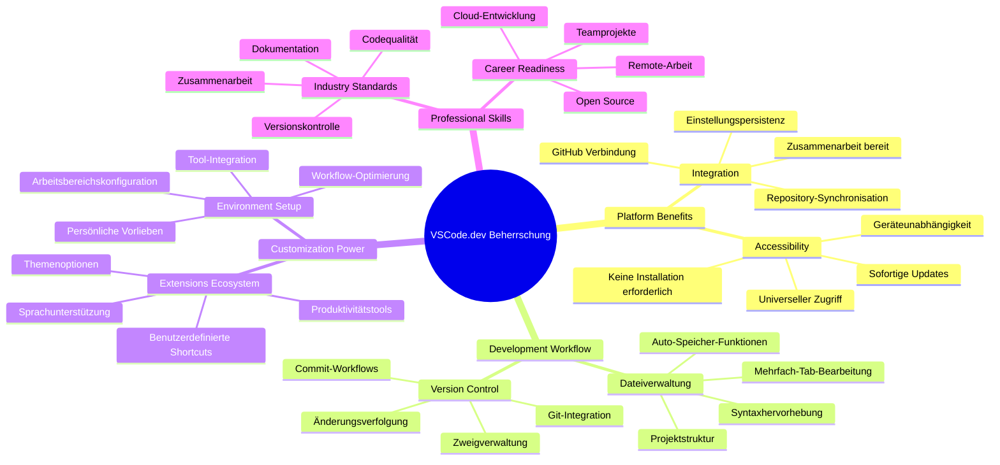
**Kernprinzip**: Cloudbasierte Entwicklungsumgebungen sind die Zukunft des Programmierens – sie bieten professionelle Werkzeuge, die zugänglich, kollaborativ und plattformunabhängig sind.

## Warum webbasierte Code-Editoren wichtig sind

Vor dem Internet konnten Wissenschaftler an verschiedenen Universitäten ihre Forschung nur schwer teilen. Dann kam in den 1960er Jahren ARPANET, das Computer über Entfernungen verband. Webbasierte Code-Editoren folgen demselben Prinzip – sie machen mächtige Werkzeuge unabhängig von deinem physischen Standort oder Gerät zugänglich.

Ein Code-Editor ist dein Arbeitsbereich zum Entwickeln, in dem du Code-Dateien schreibst, bearbeitest und organisierst. Im Gegensatz zu einfachen Texteditoren bieten professionelle Code-Editoren Syntaxhervorhebung, Fehlermeldungen und Projektmanagementfunktionen.

VSCode.dev bringt diese Fähigkeiten in deinen Browser:

**Vorteile der webbasierten Bearbeitung:**

| Feature | Beschreibung | Praktischer Nutzen |
|---------|-------------|-------------------|
| **Plattformunabhängigkeit** | Läuft auf jedem Gerät mit Browser | Arbeite nahtlos von verschiedenen Computern aus |
| **Keine Installation nötig** | Zugriff über eine Web-URL | Umgehung von Software-Installationsbeschränkungen |
| **Automatische Updates** | Läuft immer in der aktuellsten Version | Neue Features ohne manuelle Updates nutzen |
| **Repository-Integration** | Direkte Verbindung zu GitHub | Code bearbeiten ohne lokale Dateiverwaltung |

**Praktische Auswirkungen:**  
- Arbeitskontinuität über verschiedene Umgebungen hinweg  
- Einheitliche Oberfläche unabhängig vom Betriebssystem  
- Sofortige Kollaborationsfunktionen  
- Geringere Anforderungen an lokalen Speicherplatz  

## VSCode.dev erkunden

So wie Marie Curies Laboratorium in einem relativ einfachen Raum hochentwickelte Geräte enthielt, bringt VSCode.dev professionelle Entwicklungstools in eine Browser-Oberfläche. Diese Webanwendung bietet dieselben Kernfunktionen wie Desktop-Code-Editoren.

Beginne, indem du [vscode.dev](https://vscode.dev) im Browser öffnest. Die Oberfläche lädt ohne Downloads oder Systeminstallationen – eine direkte Anwendung der Cloud-Computing-Prinzipien.

### Verbindung mit deinem GitHub-Konto

Wie Alexander Graham Bells Telefon entfernte Orte verband, verbindet dein GitHub-Konto VSCode.dev mit deinen Code-Repositories. Wenn du aufgefordert wirst, dich mit GitHub anzumelden, wird empfohlen, diese Verbindung anzunehmen.

**Die GitHub-Integration bietet:**  
- Direkten Zugriff auf deine Repositories im Editor  
- Synchronisierte Einstellungen und Erweiterungen auf allen Geräten  
- Vereinfachte Speicherabläufe mit GitHub  
- Personalisierte Entwicklungsumgebung  

### Deinen neuen Arbeitsbereich kennenlernen

Sobald alles geladen ist, siehst du einen schön aufgeräumten Arbeitsbereich, der dich auf das Wesentliche – deinen Code – fokussieren lässt!

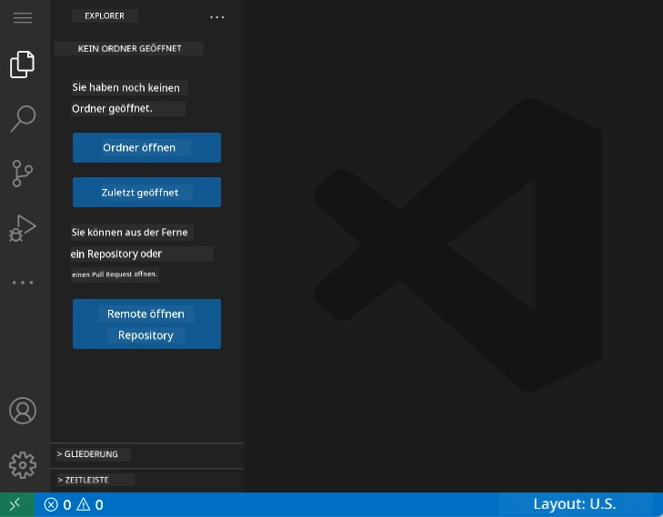

**Hier deine Tour durch die Nachbarschaft:**  
- **Activity Bar** (die Leiste links): Deine Hauptnavigation mit Explorer 📁, Suche 🔍, Source Control 🌿, Erweiterungen 🧩 und Einstellungen ⚙️  
- **Sidebar** (das Panel daneben): Zeigt je nach Auswahl relevante Informationen an  
- **Editor-Bereich** (der große mittlere Bereich): Hier passiert die Magie – dein Hauptarbeitsbereich zum Coden  

**Nimm dir einen Moment zum Erkunden:**  
- Klicke die Icons in der Activity Bar an und sieh, was sie tun  
- Beachte, wie sich die Sidebar anpasst und unterschiedliche Informationen anzeigt – ziemlich clever, oder?  
- Die Explorer-Ansicht (📁) ist wahrscheinlich dein Hauptarbeitsplatz, also mach dich damit vertraut  

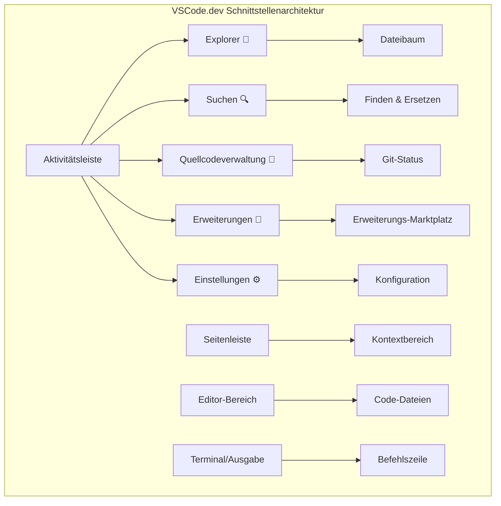
## GitHub-Repositories öffnen

Vor dem Internet mussten Forschende physisch zu Bibliotheken reisen, um Dokumente zu nutzen. GitHub-Repositories funktionieren ähnlich – sie sind Sammlungen von Code, die remote gespeichert sind. VSCode.dev eliminiert den traditionellen Schritt, Repositories vor dem Bearbeiten lokal herunterzuladen.

Diese Funktion ermöglicht den sofortigen Zugriff auf jedes öffentliche Repository zum Anzeigen, Bearbeiten oder Mitwirken. Hier sind zwei Möglichkeiten, Repositories zu öffnen:

### Methode 1: Point-and-Click

Perfekt, wenn du frisch mit VSCode.dev startest und ein bestimmtes Repository öffnen möchtest. Einfach und anfängerfreundlich:

**So funktioniert’s:**

1. Gehe zu [vscode.dev](https://vscode.dev), falls du nicht schon dort bist  
2. Suche auf dem Willkommensbildschirm die Schaltfläche „Open Remote Repository“ und klicke sie an  

   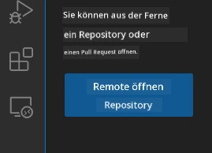  

3. Füge eine beliebige GitHub-Repository-URL ein (probier diese: `https://github.com/microsoft/Web-Dev-For-Beginners`)  
4. Drücke Enter und sieh zu, wie die Magie passiert!

**Profi-Tipp – Tastenkombination für die Kommando-Palette:**  

Willst du dich wie ein Programmierzauberer fühlen? Probiere diese Tastenkombination: Ctrl+Shift+P (oder Cmd+Shift+P auf Mac), um die Kommando-Palette zu öffnen:  

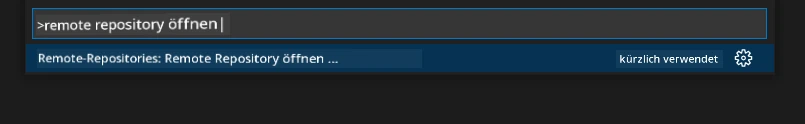  

**Die Kommando-Palette ist wie eine Suchmaschine für alles, was du tun kannst:**  
- Tippe „open remote“ und sie findet den Repository-Öffner für dich  
- Sie merkt sich die zuletzt geöffneten Repositories (super praktisch!)  
- Sobald du dich daran gewöhnt hast, fühlst du dich wie ein Blitz-Programmierer  
- Im Grunde das „Hey Siri“ von VSCode.dev, aber fürs Programmieren  

### Methode 2: URL-Änderung

Wie HTTP und HTTPS unterschiedliche Protokolle nutzen, aber dieselbe Domain-Struktur haben, verwendet VSCode.dev ein URL-Muster, das GitHubs Adressierungssystem spiegelt. Jede GitHub-Repository-URL kann so angepasst werden, dass sie direkt in VSCode.dev geöffnet wird.

**URL-Transformationsmuster:**

| Repository-Typ | GitHub-URL | VSCode.dev-URL |
|----------------|----------------------------|----------------------|
| **Öffentliches Repository** | `github.com/microsoft/Web-Dev-For-Beginners` | `vscode.dev/github/microsoft/Web-Dev-For-Beginners` |
| **Persönliches Projekt** | `github.com/dein-benutzername/mein-projekt` | `vscode.dev/github/dein-benutzername/mein-projekt` |
| **Beliebiges zugängliches Repo** | `github.com/deren-benutzername/tolles-repo` | `vscode.dev/github/deren-benutzername/tolles-repo` |

**Anwendung:**  
- Ersetze `github.com` durch `vscode.dev/github`  
- Alle anderen URL-Komponenten bleiben unverändert  
- Funktioniert mit jedem öffentlich zugänglichen Repository  
- Bietet sofortigen Bearbeitungszugang  

> 💡 **Lebensverändernder Tipp**: Lege Lesezeichen mit den VSCode.dev-Versionen deiner Lieblingsrepositories an. Ich habe Lesezeichen wie „Edit My Portfolio“ und „Fix Documentation“, die mich direkt in den Bearbeitungsmodus bringen!  

**Welche Methode solltest du verwenden?**  
- **Die Schnittstellen-Methode**: Ideal, wenn du erkundest oder dich an genaue Repository-Namen nicht erinnerst  
- **Der URL-Trick**: Perfekt für superschnellen Zugriff, wenn du genau weißt, wo du hinwillst  

### 🎯 Pädagogischer Check-in: Zugriff auf Cloud-Entwicklung

**Pause und Reflektion**: Du hast gerade zwei Methoden kennengelernt, wie man Code-Repositories über einen Webbrowser öffnet. Das ist ein grundlegender Wandel, wie Entwicklung funktioniert.

**Kurze Selbstüberprüfung:**  
- Kannst du erklären, warum webbasierte Bearbeitung die traditionelle „Entwicklungsumgebung einrichten“ überflüssig macht?  
- Welche Vorteile bietet die URL-Änderungsmethode gegenüber lokalem Git-Klonen?  
- Wie ändert dieser Ansatz, wie du zu Open-Source-Projekten beitragen könntest?  

**Verbindung zur echten Welt**: Große Firmen wie GitHub, GitLab und Replit haben ihre Entwicklungsplattformen auf diesen Cloud-First-Prinzipien aufgebaut. Du lernst dieselben Workflows, die professionelle Entwicklungsteams weltweit verwenden.

**Fachliche Herausforderung**: Wie könnte cloudbasierte Entwicklung das Programmierenlernen in Schulen verändern? Denke an Geräteanforderungen, Softwareverwaltung und Kollaborationsmöglichkeiten.

## Arbeit mit Dateien und Projekten

Jetzt, wo du ein Repository offen hast, lass uns mit dem Bauen beginnen! VSCode.dev gibt dir alles, was du brauchst, um deine Code-Dateien zu erstellen, zu bearbeiten und zu organisieren. Denk daran wie an deine digitale Werkstatt – jedes Werkzeug ist genau dort, wo du es brauchst.

Lass uns die alltäglichen Aufgaben ansehen, die den größten Teil deines täglichen Workflows ausmachen.

### Neue Dateien erstellen

Wie Architekten ihre Pläne organisieren, folgt das Erstellen von Dateien in VSCode.dev einer strukturierten Vorgehensweise. Das System unterstützt alle gängigen Web-Entwicklungsdateitypen.

**Dateierstellung:**

1. Navigiere im Explorer-Seitenpanel zum Zielordner  
2. Fahre mit der Maus über den Ordnernamen, um das Symbol „Neue Datei“ (📄+) zu sehen  
3. Gib den Dateinamen einschließlich der passenden Endung ein (`style.css`, `script.js`, `index.html`)  
4. Drücke Enter, um die Datei zu erstellen  

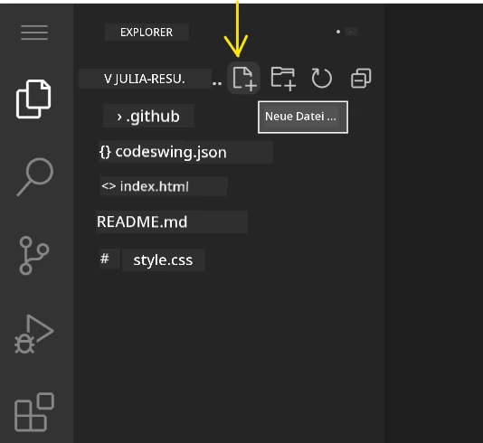

**Benennungskonventionen:**  
- Verwende aussagekräftige Namen, die den Zweck der Datei anzeigen  
- Schließe Dateiendungen für korrekte Syntaxhervorhebung ein  
- Folge konsistenten Namensmustern innerhalb von Projekten  
- Nutze Kleinbuchstaben und Bindestriche statt Leerzeichen  

### Dateien bearbeiten und speichern

Jetzt beginnt der richtige Spaß! Der Editor von VSCode.dev ist vollgepackt mit hilfreichen Features, die das Coden geschmeidig und intuitiv machen. Es ist wie ein wirklich schlauer Schreibassistent, nur für Code.

**Dein Bearbeitungsablauf:**  

1. Klicke eine Datei im Explorer an, um sie im Hauptbereich zu öffnen  
2. Fang an zu tippen und sieh zu, wie VSCode.dev dich mit Farben, Vorschlägen und Fehlererkennung unterstützt  
3. Speichere deine Arbeit mit Ctrl+S (Windows/Linux) oder Cmd+S (Mac) – allerdings gibt es auch eine Auto-Save-Funktion!  

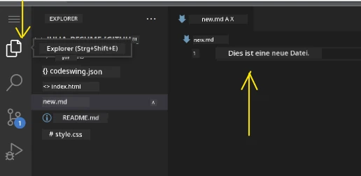

**Coole Dinge, die beim Coden passieren:**  
- Dein Code wird farblich ansprechend hervorgehoben und ist dadurch leichter lesbar  
- VSCode.dev schlägt dir während des Tippens Ergänzungen vor (wie Autokorrektur, nur viel intelligenter)  
- Fehler und Tippfehler werden erkannt, bevor du speicherst  
- Du kannst mehrere Dateien als Tabs gleichzeitig offen haben – wie in einem Browser  
- Alles wird automatisch im Hintergrund gespeichert  

> ⚠️ **Schneller Tipp**: Auch wenn Auto-Save aktiv ist, ist es eine gute Gewohnheit, Ctrl+S bzw. Cmd+S zu drücken. So wird sofort alles gespeichert und einige hilfreiche Funktionen wie Fehlerprüfung ausgelöst.

### Versionskontrolle mit Git

Wie Archäologen sorgfältige Aufzeichnungen von Ausgrabungsschichten anlegen, verfolgt Git die Änderungen in deinem Code über die Zeit. Dieses System bewahrt die Projektgeschichte und ermöglicht es dir, bei Bedarf zu älteren Versionen zurückzukehren. VSCode.dev integriert Git-Funktionalität.

**Source-Control-Oberfläche:**

1. Öffne das Source-Control-Panel über das 🌿-Symbol in der Activity Bar  
2. Geänderte Dateien erscheinen im Bereich „Changes“  
3. Farblich gekennzeichnete Änderungstypen: grün für Hinzufügungen, rot für Löschungen  

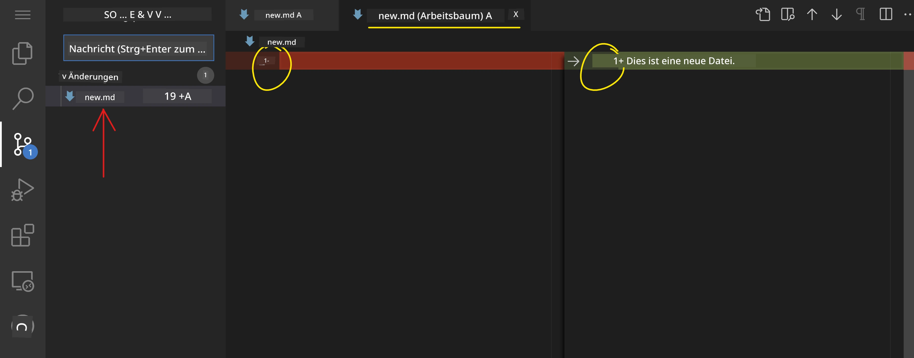

**So speicherst du deine Arbeit (Commit-Workflow):**

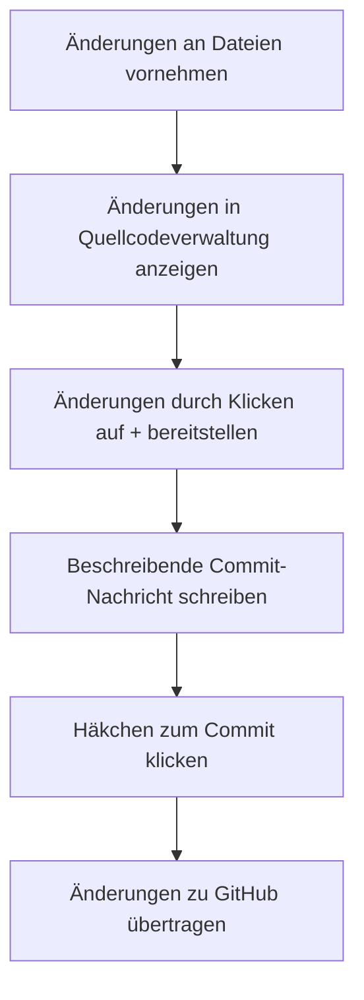
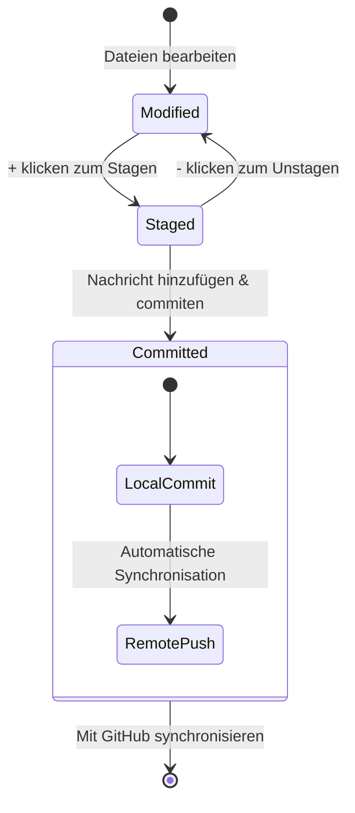
**Dein Schritt-für-Schritt-Prozess:**  
- Klicke das „+“-Symbol neben den Dateien, die du speichern möchtest (das heißt, sie werden „gestaged“)
- Überprüfen Sie noch einmal, ob Sie mit allen Ihren vorgemerkten Änderungen zufrieden sind  
- Schreiben Sie eine kurze Notiz, die erklärt, was Sie getan haben (das ist Ihre „Commit-Nachricht“)  
- Klicken Sie auf die Häkchen-Schaltfläche, um alles auf GitHub zu speichern  
- Wenn Sie Ihre Meinung ändern, können Sie das Rückgängig-Symbol verwenden, um Änderungen zu verwerfen  

**Gute Commit-Nachrichten schreiben (das ist leichter als Sie denken!):**  
- Beschreiben Sie einfach, was Sie getan haben, z. B. „Kontaktformular hinzufügen“ oder „Fehler in der Navigation beheben“  
- Halten Sie es kurz und bündig – denken Sie an Tweet-Länge, nicht an einen Aufsatz  
- Beginnen Sie mit Aktionswörtern wie „Hinzufügen“, „Beheben“, „Aktualisieren“ oder „Entfernen“  
- **Gute Beispiele**: „Responsives Navigationsmenü hinzufügen“, „Probleme im mobilen Layout beheben“, „Farben für bessere Barrierefreiheit aktualisieren“  

> 💡 **Schneller Navigationstipp**: Verwenden Sie das Hamburger-Menü (☰) oben links, um zurück zu Ihrem GitHub-Repository zu springen und Ihre committeten Änderungen online anzusehen. Es ist wie ein Portal zwischen Ihrer Bearbeitungsumgebung und dem Zuhause Ihres Projekts auf GitHub!  

## Funktionalität mit Erweiterungen erweitern

So wie eine Werkstatt eines Handwerkers spezielle Werkzeuge für verschiedene Aufgaben bereithält, kann VSCode.dev mit Erweiterungen angepasst werden, die bestimmte Fähigkeiten hinzufügen. Diese von der Community entwickelten Plugins adressieren häufige Entwicklungsanforderungen wie Codeformatierung, Live-Vorschau und verbesserte Git-Integration.

Der Erweiterungs-Marktplatz beherbergt Tausende kostenlose Tools, die von Entwicklern weltweit erstellt wurden. Jede Erweiterung löst bestimmte Herausforderungen im Arbeitsablauf, sodass Sie eine personalisierte Entwicklungsumgebung erstellen können, die genau auf Ihre Bedürfnisse und Vorlieben abgestimmt ist.

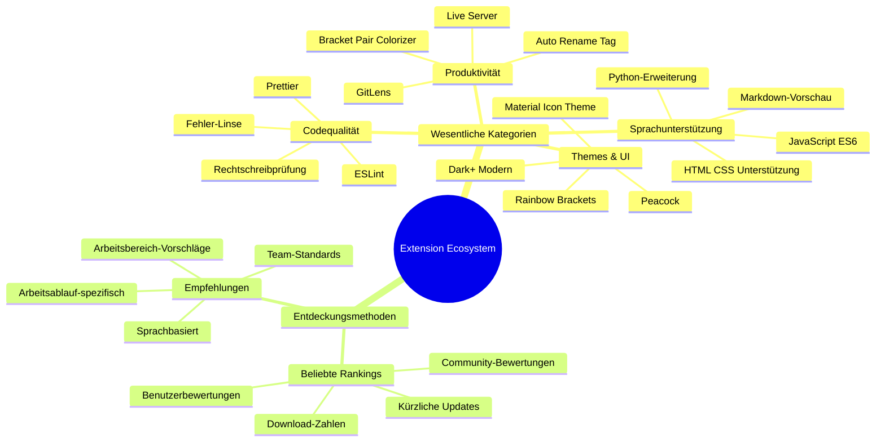
### Die perfekten Erweiterungen finden

Der Erweiterungs-Marktplatz ist wirklich gut organisiert, so dass Sie sich nicht verirren, wenn Sie suchen, was Sie brauchen. Er wurde so gestaltet, dass Sie sowohl spezielle Werkzeuge als auch coole Dinge entdecken können, von denen Sie nicht einmal wussten, dass sie existieren!

**So gelangen Sie zum Marktplatz:**  

1. Klicken Sie auf das Erweiterungssymbol (🧩) in der Aktivitätsleiste  
2. Stöbern Sie oder suchen Sie gezielt nach etwas  
3. Klicken Sie auf alles, was interessant aussieht, um mehr darüber zu erfahren  

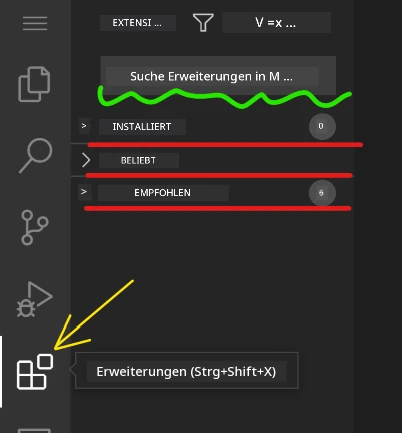  

**Das finden Sie dort:**  

| Abschnitt        | Inhalt                                    | Warum es hilfreich ist                   |  
|------------------|------------------------------------------|-----------------------------------------|  
| **Installiert**  | Erweiterungen, die Sie bereits hinzugefügt haben | Ihr persönliches Codetoolkit            |  
| **Beliebt**      | Die Favoriten der Masse                   | Worauf die meisten Entwickler schwören |  
| **Empfohlen**    | Intelligente Vorschläge für Ihr Projekt  | Hilfreiche Empfehlungen von VSCode.dev |  

**Was das Browsen einfach macht:**  
- Jede Erweiterung zeigt Bewertungen, Downloadzahlen und echte Nutzerrezensionen  
- Es gibt Screenshots und klare Beschreibungen dessen, was jede macht  
- Alles ist mit Kompatibilitätsinformationen klar gekennzeichnet  
- Ähnliche Erweiterungen werden vorgeschlagen, so dass Sie Optionen vergleichen können  

### Erweiterungen installieren (super einfach!)

Neue Funktionen zu Ihrem Editor hinzuzufügen ist so einfach wie ein Klick auf einen Button. Erweiterungen werden in Sekunden installiert und arbeiten sofort – kein Neustart, kein Warten.

**So geht’s:**  

1. Suchen Sie nach dem, was Sie wollen (versuchen Sie „live server“ oder „prettier“)  
2. Klicken Sie auf eine Erweiterung, die interessant aussieht, um mehr Details zu sehen  
3. Lesen Sie, was sie macht, und sehen Sie sich die Bewertungen an  
4. Drücken Sie den blauen „Installieren“-Button und fertig!  

  

**Was hinter den Kulissen passiert:**  
- Die Erweiterung lädt herunter und richtet sich automatisch ein  
- Neue Funktionen erscheinen sofort in Ihrer Benutzeroberfläche  
- Alles funktioniert augenblicklich (ernsthaft, so schnell ist es!)  
- Wenn Sie angemeldet sind, synchronisiert sich die Erweiterung auf all Ihren Geräten  

**Einige Erweiterungen, die ich zum Start empfehlen würde:**  
- **Live Server**: Sehen Sie Ihre Website in Echtzeit aktualisiert, während Sie coden (das ist magisch!)  
- **Prettier**: Macht Ihren Code automatisch sauber und professionell  
- **Auto Rename Tag**: Ändern Sie ein HTML-Tag, und sein Gegenstück wird mitaktualisiert  
- **Bracket Pair Colorizer**: Farbige Klammern, damit Sie nie den Überblick verlieren  
- **GitLens**: Erweitert Ihre Git-Funktionalität mit vielen hilfreichen Infos  

### Erweiterungen anpassen

Die meisten Erweiterungen besitzen Einstellungen, die Sie anpassen können, damit sie genau so funktionieren, wie Sie es mögen. Denken Sie daran wie beim Einstellen von Sitz und Spiegeln im Auto – jeder hat seine eigenen Vorlieben!

**Erweiterungseinstellungen anpassen:**  

1. Finden Sie Ihre installierte Erweiterung im Erweiterungen-Panel  
2. Suchen Sie nach dem kleinen Zahnrad-Symbol (⚙️) neben ihrem Namen und klicken Sie darauf  
3. Wählen Sie im Dropdown „Erweiterungseinstellungen“  
4. Passen Sie alles an, bis es perfekt zu Ihrem Arbeitsablauf passt  

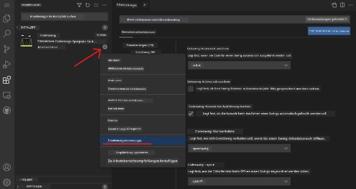  

**Häufige Dinge, die Sie anpassen möchten:**  
- Wie Ihr Code formatiert wird (Tabs vs. Leerzeichen, Zeilenlänge, etc.)  
- Welche Tastenkombinationen verschiedene Aktionen auslösen  
- Mit welchen Dateitypen die Erweiterung arbeiten soll  
- Bestimmte Funktionen an- oder abschalten, um die Oberfläche übersichtlich zu halten  

### Ihre Erweiterungen organisiert halten

Je mehr interessante Erweiterungen Sie entdecken, desto mehr wollen Sie Ihre Sammlung sauber und performant halten. VSCode.dev macht das sehr einfach.

**Optionen zum Verwalten Ihrer Erweiterungen:**  

| Was Sie tun können  | Wann es hilfreich ist                     | Profi-Tipp                                          |  
|--------------------|------------------------------------------|----------------------------------------------------|  
| **Deaktivieren**   | Wenn Sie testen wollen, ob eine Erweiterung Probleme verursacht | Besser als Deinstallieren, falls Sie sie zurückhaben wollen |  
| **Deinstallieren** | Komplettes Entfernen nicht mehr benötigter Erweiterungen         | Hält Ihre Umgebung sauber und schnell              |  
| **Aktualisieren**  | Die neuesten Features und Bugfixes erhalten                      | Passiert meistens automatisch, aber lohnt sich zu prüfen |  

**So verwalte ich meine Erweiterungen:**  
- Alle paar Monate überprüfe ich, was ich installiert habe, und entferne nichts Benutztes  
- Ich halte Erweiterungen aktuell, um Verbesserungen und Sicherheitsupdates zu bekommen  
- Wenn etwas langsam wirkt, deaktiviere ich Erweiterungen für einen Moment, um den Übeltäter zu finden  
- Ich lese die Update-Notes bei großen Erweiterungs-Updates – oft gibt’s coole neue Features!  

> ⚠️ **Performance-Tipp**: Erweiterungen sind toll, aber zu viele können verlangsamen. Konzentrieren Sie sich auf die, die Ihr Leben wirklich leichter machen, und scheuen Sie sich nicht, ungenutzte zu deinstallieren.  

### 🎯 Pädagogische Zwischenfrage: Entwicklungsumgebung anpassen

**Architekturverständnis**: Sie haben gelernt, eine professionelle Entwicklungsumgebung mit Community-erstellten Erweiterungen anzupassen. Das spiegelt wider, wie professionelle Entwicklungsteams standardisierte Toolchains aufbauen.

**Beherrschte Kernkonzepte**:  
- **Erweiterungsfindung**: Werkzeuge finden, die spezifische Entwicklungsprobleme lösen  
- **Umgebungskonfiguration**: Werkzeuge anpassen, damit sie zu persönlichen oder Team-Vorlieben passen  
- **Performanceoptimierung**: Funktionalität mit Systemleistung ausbalancieren  
- **Community-Zusammenarbeit**: Werkzeuge nutzen, die von der globalen Entwickler-Community erstellt wurden  

**Branchenbezug**: Erweiterungsökosysteme treiben große Entwicklungsplattformen wie VS Code, Chrome DevTools und moderne IDEs an. Zu wissen, wie man Erweiterungen bewertet, installiert und konfiguriert, ist essenziell für professionelle Entwicklungs-Workflows.

**Reflexionsfrage**: Wie würden Sie vorgehen, um eine standardisierte Entwicklungsumgebung für ein Team von 10 Entwicklern einzurichten? Berücksichtigen Sie dabei Konsistenz, Performance und individuelle Präferenzen.  

## 📈 Ihr Zeitplan für Cloud-Entwicklungsbeherrschung

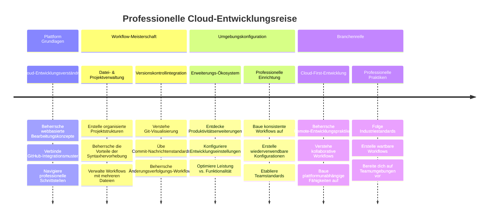
**🎓 Abschlussmeilenstein**: Sie haben erfolgreich cloudbasiertes Entwickeln gemeistert, mit den gleichen Tools und Workflows, die professionelle Entwickler in großen Tech-Unternehmen nutzen. Diese Fähigkeiten repräsentieren die Zukunft der Softwareentwicklung.

**🔄 Fähigkeiten auf dem nächsten Level**:  
- Bereit, fortgeschrittene Cloud-Entwicklungsplattformen (Codespaces, GitPod) zu erkunden  
- Vorbereitet für Arbeit in verteilten Entwicklerteams  
- Ausgestattet, um weltweit zu Open-Source-Projekten beizutragen  
- Fundament gelegt für moderne DevOps- und Continuous-Integration-Praktiken  

## GitHub Copilot Agent Challenge 🚀

Wie die strukturierte Vorgehensweise der NASA bei Weltraummissionen beinhaltet diese Challenge die systematische Anwendung von VSCode.dev-Fähigkeiten in einem umfassenden Workflow-Szenario.

**Ziel:** Demonstrieren Sie Ihre VSCode.dev-Kompetenz, indem Sie einen umfassenden Webentwicklungs-Workflow aufbauen.

**Projektanforderungen:** Erledigen Sie mit Hilfe des Agent-Modus folgende Aufgaben:  
1. Forken Sie ein bestehendes Repository oder erstellen Sie ein neues  
2. Richten Sie eine funktionale Projektstruktur mit HTML-, CSS- und JavaScript-Dateien ein  
3. Installieren und konfigurieren Sie drei entwicklungserleichternde Erweiterungen  
4. Üben Sie Versionskontrolle mit beschreibenden Commit-Nachrichten  
5. Experimentieren Sie mit der Erstellung und Änderung von Feature-Branches  
6. Dokumentieren Sie den Prozess und Ihre Erkenntnisse in einer README.md-Datei  

Diese Übung konsolidiert alle VSCode.dev-Konzepte in einem praktischen Workflow, den Sie bei zukünftigen Entwicklungsprojekten anwenden können.

Erfahren Sie mehr über [den Agent-Modus](https://code.visualstudio.com/blogs/2025/02/24/introducing-copilot-agent-mode).

## Aufgabe

Zeit, diese Fähigkeiten im Praxistest anzuwenden! Ich habe ein praktisches Projekt für Sie, das Ihnen erlaubt, alles Gelernte zu üben: [Erstellen Sie eine Lebenslauf-Website mit VSCode.dev](./assignment.md)

Diese Aufgabe führt Sie durch den Aufbau einer professionellen Lebenslauf-Website, komplett im Browser. Sie nutzen alle VSCode.dev-Features, die wir erkundet haben, und am Ende haben Sie sowohl eine großartige Website als auch fundiertes Vertrauen in Ihren neuen Workflow.

## Weiter entdecken und Fähigkeiten ausbauen

Sie haben jetzt eine solide Grundlage, aber es gibt noch viel mehr coole Sachen zu entdecken! Hier sind einige Ressourcen und Ideen, um Ihre VSCode.dev-Fähigkeiten aufs nächste Level zu bringen:

**Offizielle Dokumentation zum Speichern als Lesezeichen:**  
- [VSCode Web-Dokumentation](https://code.visualstudio.com/docs/editor/vscode-web?WT.mc_id=academic-0000-alfredodeza) – Der vollständige Leitfaden zur browserbasierten Bearbeitung  
- [GitHub Codespaces](https://docs.github.com/en/codespaces) – Für noch mehr Power in der Cloud  

**Coole Features zum Ausprobieren:**  
- **Tastenkombinationen**: Lernen Sie die Kürzel, die Sie zum Coding-Ninja machen  
- **Workspace-Einstellungen**: Richten Sie verschiedene Umgebungen für unterschiedliche Projektarten ein  
- **Multi-Root-Workspaces**: Arbeiten Sie gleichzeitig an mehreren Repositories (super praktisch!)  
- **Terminal-Integration**: Greifen Sie direkt im Browser auf Kommandozeilentools zu  

**Übungsideen:**  
- Tauchen Sie in Open-Source-Projekte ein und tragen Sie mit VSCode.dev bei – eine tolle Möglichkeit, etwas zurückzugeben!  
- Probieren Sie verschiedene Erweiterungen aus, um Ihre perfekte Konfiguration zu finden  
- Erstellen Sie Projektvorlagen für die Art von Websites, die Sie am häufigsten bauen  
- Üben Sie Git-Workflows wie Branching und Merging – diese Fähigkeiten sind Gold wert in Teamprojekten  

---

**Sie beherrschen browserbasiertes Entwickeln!** 🎉 So wie die Erfindung tragbarer Instrumente Wissenschaftlern ermöglichte, Forschung an entfernten Orten durchzuführen, erlaubt VSCode.dev professionelles Coden von jedem internetfähigen Gerät aus.

Diese Fähigkeiten reflektieren aktuelle Branchenpraktiken – viele professionelle Entwickler nutzen cloudbasierte Entwicklungsumgebungen wegen ihrer Flexibilität und Zugänglichkeit. Sie haben einen Workflow gelernt, der von Einzelprojekten bis zu großen Teamzusammenarbeiten skaliert.

Setzen Sie diese Techniken bei Ihrem nächsten Entwicklungsprojekt ein! 🚀

---

<!-- CO-OP TRANSLATOR DISCLAIMER START -->
**Haftungsausschluss**:  
Dieses Dokument wurde mithilfe des KI-Übersetzungsdienstes [Co-op Translator](https://github.com/Azure/co-op-translator) übersetzt. Obwohl wir uns um Genauigkeit bemühen, beachten Sie bitte, dass automatisierte Übersetzungen Fehler oder Ungenauigkeiten enthalten können. Das Originaldokument in seiner Ursprungssprache gilt als maßgebliche Quelle. Für wichtige Informationen wird eine professionelle menschliche Übersetzung empfohlen. Wir übernehmen keine Haftung für Missverständnisse oder Fehlinterpretationen, die aus der Nutzung dieser Übersetzung entstehen.
<!-- CO-OP TRANSLATOR DISCLAIMER END -->