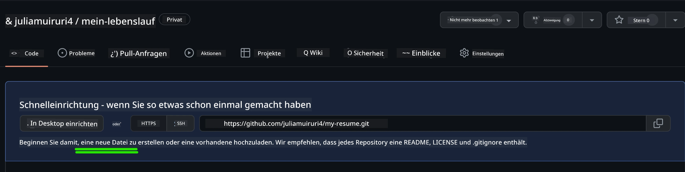
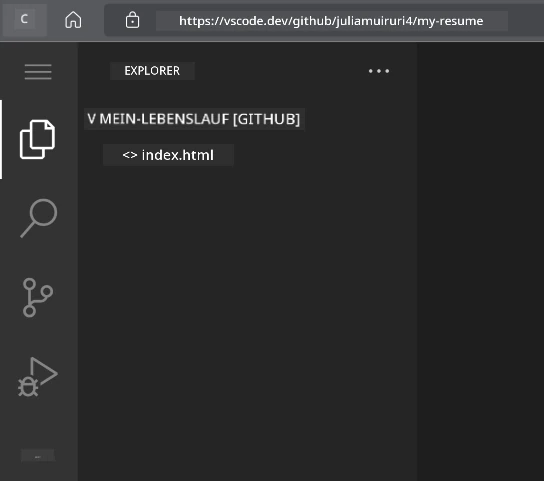
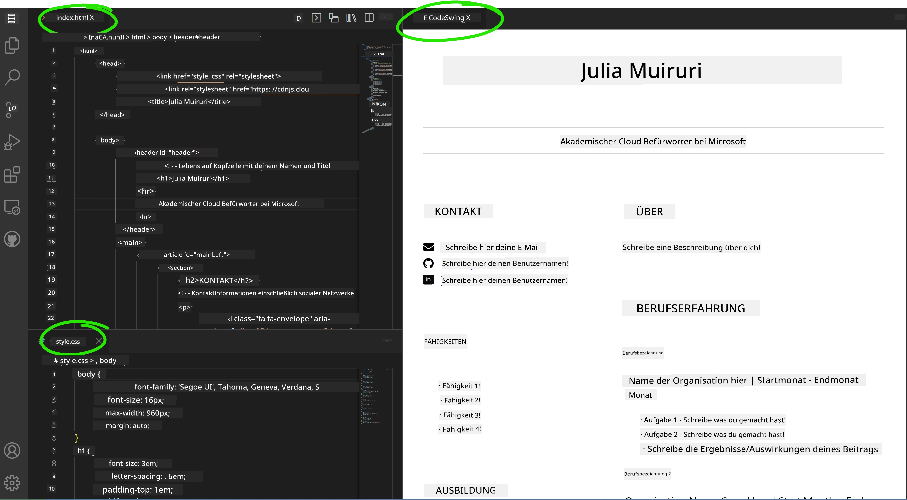

# Erstelle eine Lebenslauf-Website mit VSCode.dev

Verwandle deine Karrierechancen, indem du eine professionelle Lebenslauf-Website erstellst, die deine Fähigkeiten und Erfahrungen in einem interaktiven, modernen Format präsentiert. Statt traditionelle PDFs zu verschicken, stelle dir vor, du bietest Personalverantwortlichen eine schlanke, responsive Website an, die sowohl deine Qualifikationen als auch deine Webentwicklungsfähigkeiten demonstriert.

Diese praktische Aufgabe setzt all deine VSCode.dev-Kenntnisse ein, während du etwas wirklich Nützliches für deine Karriere erstellst. Du durchläufst den kompletten Webentwicklungsablauf – von der Repository-Erstellung bis zur Bereitstellung – alles innerhalb deines Browsers.

Durch den Abschluss dieses Projekts verfügst du über eine professionelle Online-Präsenz, die sich einfach mit potenziellen Arbeitgebern teilen lässt, aktualisiert werden kann, wenn deine Fähigkeiten wachsen, und individuell an deine persönliche Marke angepasst werden kann. Genau solche praktischen Projekte zeigen reale Webentwicklungsfähigkeiten.

## Lernziele

Nach Abschluss dieser Aufgabe wirst du in der Lage sein:

- **Ein vollständiges Webentwicklungsprojekt mit VSCode.dev zu erstellen** und zu verwalten
- **Eine professionelle Website mit semantischen HTML-Elementen zu strukturieren**
- **Responsive Layouts mit modernen CSS-Techniken zu gestalten**
- **Interaktive Funktionen mit grundlegenden Webtechnologien zu implementieren**
- **Eine Live-Website bereitzustellen, die über eine teilbare URL erreichbar ist**
- **Best Practices der Versionsverwaltung im Entwicklungsprozess anzuwenden**

## Voraussetzungen

Bevor du mit dieser Aufgabe beginnst, solltest du sicherstellen, dass du:

- Ein GitHub-Konto hast (erstelle eines unter [github.com](https://github.com/), falls nötig)
- Die VSCode.dev-Lektion zur Benutzeroberflächen-Navigation und Grundbedienung abgeschlossen hast
- Grundkenntnisse in HTML-Struktur und CSS-Styling-Konzepten besitzt

## Projektsetup und Repository-Erstellung

Beginnen wir mit der Einrichtung deiner Projektbasis. Dieser Prozess spiegelt reale Entwicklungsabläufe wider, bei denen Projekte mit einer ordnungsgemäßen Repository-Initialisierung und Strukturplanung starten.

### Schritt 1: Erstelle dein GitHub-Repository

Ein dediziertes Repository sorgt dafür, dass dein Projekt von Anfang an richtig organisiert und versioniert wird.

1. **Gehe** zu [GitHub.com](https://github.com) und melde dich an
2. **Klicke** auf den grünen Button "New" oder das "+"-Symbol oben rechts
3. **Benenne** dein Repository `my-resume` (oder wähle einen personalisierten Namen wie `john-smith-resume`)
4. **Füge** eine kurze Beschreibung hinzu: "Professionelle Lebenslauf-Website erstellt mit HTML und CSS"
5. **Wähle** "Public", damit dein Lebenslauf für potenzielle Arbeitgeber zugänglich ist
6. **Aktiviere** "Add a README file" für eine erste Projektbeschreibung
7. **Klicke** auf "Create repository", um die Einrichtung abzuschließen

> 💡 **Tipp zur Repository-Benennung**: Verwende beschreibende, professionelle Namen, die den Zweck des Projekts klar machen. Das verbessert die Verständlichkeit beim Teilen mit Arbeitgebern oder beim Portfolio-Review.

### Schritt 2: Initialisiere die Projektstruktur

Da VSCode.dev mindestens eine Datei im Repository zum Öffnen benötigt, erstellen wir die Haupt-HTML-Datei direkt auf GitHub, bevor wir in den Webeditor wechseln.

1. **Klicke** im neuen Repository auf den Link „creating a new file“
2. **Gib** als Dateinamen `index.html` ein
3. **Füge** folgende initiale HTML-Struktur ein:

```html
<!DOCTYPE html>
<html lang="en">
<head>
    <meta charset="UTF-8">
    <meta name="viewport" content="width=device-width, initial-scale=1.0">
    <title>Your Name - Professional Resume</title>
</head>
<body>
    <h1>Your Name</h1>
    <p>Professional Resume Website</p>
</body>
</html>
```

4. **Schreibe** eine Commit-Botschaft: "Add initial HTML structure"
5. **Klicke** auf "Commit new file", um deine Änderungen zu speichern



**Folgendes erreicht diese initiale Einrichtung:**
- **Stellt** eine korrekte HTML5-Dokumentenstruktur mit semantischen Elementen bereit
- **Beinhaltet** den Viewport-Meta-Tag für responsive Design-Kompatibilität
- **Setzt** einen beschreibenden Seitentitel, der im Browser-Tab angezeigt wird
- **Schafft** die Basis für eine professionelle Inhaltsorganisation


## Arbeiten in VSCode.dev

Jetzt, wo dein Repository-Grundgerüst steht, wechseln wir zu VSCode.dev für die Hauptentwicklung. Dieser webbasierte Editor bietet alle Werkzeuge für professionelle Webentwicklung.

### Schritt 3: Öffne dein Projekt in VSCode.dev

1. **Rufe** [vscode.dev](https://vscode.dev) in einem neuen Browser-Tab auf
2. **Klicke** auf „Open Remote Repository“ auf dem Willkommensbildschirm
3. **Kopiere** die URL deines GitHub-Repositories und füge sie ins Eingabefeld ein

   Format: `https://github.com/dein-benutzername/my-resume`
   
   *Ersetze `dein-benutzername` durch deinen tatsächlichen GitHub-Benutzernamen*

4. **Drücke** Enter, um dein Projekt zu laden

✅ **Erfolgsanzeige**: Du solltest deine Projektdateien in der Explorer-Seitenleiste sehen und `index.html` im Haupteditor-Bereich zur Bearbeitung verfügbar haben.



**Das siehst du in der Benutzeroberfläche:**
- **Explorer-Seitenleiste**: Zeigt deine Repository-Dateien und Ordnerstruktur an
- **Editorbereich**: Zeigt den Inhalt der ausgewählten Dateien zur Bearbeitung
- **Aktivitätsleiste**: Bietet Zugang zu Funktionen wie Quellcodeverwaltung und Erweiterungen
- **Statusleiste**: Zeigt Verbindungsstatus und aktuelle Branch-Informationen an

### Schritt 4: Erstelle deinen Lebenslauf-Inhalt

Ersetze die Platzhalterinhalte in `index.html` mit einer vollständigen Lebenslaufstruktur. Dieses HTML bildet die Grundlage für eine professionelle Darstellung deiner Qualifikationen.

<details>
<summary><b>Komplette HTML-Lebenslaufstruktur</b></summary>

```html
<!DOCTYPE html>
<html lang="en">
<head>
    <meta charset="UTF-8">
    <meta name="viewport" content="width=device-width, initial-scale=1.0">
    <link href="style.css" rel="stylesheet">
    <link rel="stylesheet" href="https://cdnjs.cloudflare.com/ajax/libs/font-awesome/5.15.4/css/all.min.css">
    <title>Your Name - Professional Resume</title>
</head>
<body>
    <header id="header">
        <h1>Your Full Name</h1>
        <hr>
        <p class="role">Your Professional Title</p>
        <hr>
    </header>
    
    <main>
        <article id="mainLeft">
            <section>
                <h2>CONTACT</h2>
                <p>
                    <i class="fa fa-envelope" aria-hidden="true"></i>
                    <a href="mailto:your.email@domain.com">your.email@domain.com</a>
                </p>
                <p>
                    <i class="fab fa-github" aria-hidden="true"></i>
                    <a href="https://github.com/your-username">github.com/your-username</a>
                </p>
                <p>
                    <i class="fab fa-linkedin" aria-hidden="true"></i>
                    <a href="https://linkedin.com/in/your-profile">linkedin.com/in/your-profile</a>
                </p>
            </section>
            
            <section>
                <h2>SKILLS</h2>
                <ul>
                    <li>HTML5 & CSS3</li>
                    <li>JavaScript (ES6+)</li>
                    <li>Responsive Web Design</li>
                    <li>Version Control (Git)</li>
                    <li>Problem Solving</li>
                </ul>
            </section>
            
            <section>
                <h2>EDUCATION</h2>
                <h3>Your Degree or Certification</h3>
                <p>Institution Name</p>
                <p>Start Date - End Date</p>
            </section>
        </article>
        
        <article id="mainRight">
            <section>
                <h2>ABOUT</h2>
                <p>Write a compelling summary that highlights your passion for web development, key achievements, and career goals. This section should give employers insight into your personality and professional approach.</p>
            </section>
            
            <section>
                <h2>WORK EXPERIENCE</h2>
                <div class="job">
                    <h3>Job Title</h3>
                    <p class="company">Company Name | Start Date – End Date</p>
                    <ul>
                        <li>Describe a key accomplishment or responsibility</li>
                        <li>Highlight specific skills or technologies used</li>
                        <li>Quantify impact where possible (e.g., "Improved efficiency by 25%")</li>
                    </ul>
                </div>
                
                <div class="job">
                    <h3>Previous Job Title</h3>
                    <p class="company">Previous Company | Start Date – End Date</p>
                    <ul>
                        <li>Focus on transferable skills and achievements</li>
                        <li>Demonstrate growth and learning progression</li>
                        <li>Include any leadership or collaboration experiences</li>
                    </ul>
                </div>
            </section>
            
            <section>
                <h2>PROJECTS</h2>
                <div class="project">
                    <h3>Project Name</h3>
                    <p>Brief description of what the project accomplishes and technologies used.</p>
                    <a href="#" target="_blank">View Project</a>
                </div>
            </section>
        </article>
    </main>
</body>
</html>
```
</details>

**Anpassungshinweise:**
- **Ersetze** alle Platzhaltertexte durch deine tatsächlichen Informationen
- **Passe** die Sektionen je nach Erfahrungsniveau und Karriereziel an
- **Füge** bei Bedarf Sektionen hinzu oder entferne sie (z. B. Zertifikate, Ehrenamt, Sprachen)
- **Beziehe** Links zu deinen Profilen und Projekten mit ein

### Schritt 5: Erstelle unterstützende Dateien

Professionelle Websites benötigen eine organisierte Dateistruktur. Erstelle die CSS-Stildatei und Konfigurationsdateien für ein vollständiges Projekt.

1. **Fahre** mit der Maus über deinen Projektordner in der Explorer-Seitenleiste
2. **Klicke** auf das Symbol „Neue Datei“ (📄+), das erscheint
3. **Erstelle** diese Dateien nacheinander:
   - `style.css` (für Styling und Layout)
   - `codeswing.json` (für die Preview-Erweiterungskonfiguration)

**Erstellung der CSS-Datei (`style.css`):**

<details>
<summary><b>Professionelles CSS-Styling</b></summary>

```css
/* Modern Resume Styling */
body {
    font-family: 'Segoe UI', Tahoma, Geneva, Verdana, sans-serif;
    font-size: 16px;
    line-height: 1.6;
    max-width: 960px;
    margin: 0 auto;
    padding: 20px;
    color: #333;
    background-color: #f9f9f9;
}

/* Header Styling */
header {
    text-align: center;
    margin-bottom: 3em;
    padding: 2em;
    background: linear-gradient(135deg, #667eea 0%, #764ba2 100%);
    color: white;
    border-radius: 10px;
    box-shadow: 0 4px 6px rgba(0, 0, 0, 0.1);
}

h1 {
    font-size: 3em;
    letter-spacing: 0.1em;
    margin-bottom: 0.2em;
    font-weight: 300;
}

.role {
    font-size: 1.3em;
    font-weight: 300;
    margin: 1em 0;
}

/* Main Content Layout */
main {
    display: grid;
    grid-template-columns: 35% 65%;
    gap: 3em;
    margin-top: 3em;
    background: white;
    padding: 2em;
    border-radius: 10px;
    box-shadow: 0 2px 10px rgba(0, 0, 0, 0.1);
}

/* Typography */
h2 {
    font-size: 1.4em;
    font-weight: 600;
    margin-bottom: 1em;
    color: #667eea;
    border-bottom: 2px solid #667eea;
    padding-bottom: 0.3em;
}

h3 {
    font-size: 1.1em;
    font-weight: 600;
    margin-bottom: 0.5em;
    color: #444;
}

/* Section Styling */
section {
    margin-bottom: 2.5em;
}

#mainLeft {
    border-right: 1px solid #e0e0e0;
    padding-right: 2em;
}

/* Contact Links */
section a {
    color: #667eea;
    text-decoration: none;
    transition: color 0.3s ease;
}

section a:hover {
    color: #764ba2;
    text-decoration: underline;
}

/* Icons */
i {
    margin-right: 0.8em;
    width: 20px;
    text-align: center;
    color: #667eea;
}

/* Lists */
ul {
    list-style: none;
    padding-left: 0;
}

li {
    margin: 0.5em 0;
    padding: 0.3em 0;
    position: relative;
}

li:before {
    content: "▸";
    color: #667eea;
    margin-right: 0.5em;
}

/* Work Experience */
.job, .project {
    margin-bottom: 2em;
    padding-bottom: 1.5em;
    border-bottom: 1px solid #f0f0f0;
}

.company {
    font-style: italic;
    color: #666;
    margin-bottom: 0.5em;
}

/* Responsive Design */
@media (max-width: 768px) {
    main {
        grid-template-columns: 1fr;
        gap: 2em;
    }
    
    #mainLeft {
        border-right: none;
        border-bottom: 1px solid #e0e0e0;
        padding-right: 0;
        padding-bottom: 2em;
    }
    
    h1 {
        font-size: 2.2em;
    }
    
    body {
        padding: 10px;
    }
}

/* Print Styles */
@media print {
    body {
        background: white;
        color: black;
        font-size: 12pt;
    }
    
    header {
        background: none;
        color: black;
        box-shadow: none;
    }
    
    main {
        box-shadow: none;
    }
}
```
</details>

**Erstellung der Konfigurationsdatei (`codeswing.json`):**

```json
{
    "scripts": [],
    "styles": []
}
```

**Verständnis der CSS-Features:**
- **Verwendet** CSS Grid für ein responsives, professionelles Layout
- **Setzt** moderne Farbschemata mit Farbverlaufsköpfen ein
- **Enthält** Hover-Effekte und sanfte Übergänge für Interaktivität
- **Bietet** responsives Design für alle Gerätetypen
- **Fügt** druckfreundliche Styles für PDF-Generierung hinzu


### Schritt 6: Installiere und konfiguriere Erweiterungen

Erweiterungen verbessern dein Entwicklungserlebnis, indem sie Live-Preview-Funktionen und optimierte Workflows bieten. Die CodeSwing-Erweiterung ist besonders nützlich für Webentwicklungsprojekte.

**Installation der CodeSwing-Erweiterung:**

1. **Klicke** auf das Erweiterungs-Icon (🧩) in der Aktivitätsleiste
2. **Suche** nach „CodeSwing“ im Marktplatz-Suchfeld
3. **Wähle** die CodeSwing-Erweiterung aus den Suchergebnissen
4. **Klicke** auf den blauen Button „Install“


**Was CodeSwing bietet:**
- **Ermöglicht** eine Live-Vorschau deiner Website während der Bearbeitung
- **Zeigt** Änderungen in Echtzeit ohne manuelles Aktualisieren
- **Unterstützt** verschiedene Dateitypen wie HTML, CSS und JavaScript
- **Bietet** ein integriertes Entwicklungsumfeld-Erlebnis

**Sofortige Ergebnisse nach Installation:**
Sobald CodeSwing installiert ist, erscheint eine Live-Vorschau deiner Lebenslauf-Website im Editor. So siehst du genau, wie deine Seite während der Bearbeitung aussieht.



**Verständnis der erweiterten Oberfläche:**
- **Split-Ansicht**: Zeigt deinen Code auf einer Seite und die Live-Vorschau auf der anderen
- **Echtzeit-Updates**: Reflektiert Änderungen sofort beim Tippen
- **Interaktive Vorschau**: Ermöglicht das Testen von Links und Interaktionen
- **Mobile Simulation**: Bietet Funktionen zum Testen responsiver Designs

### Schritt 7: Versionsverwaltung und Veröffentlichen

Nachdem deine Lebenslauf-Website fertig ist, verwende Git, um deine Arbeit zu speichern und sie online verfügbar zu machen.

**Committ deine Änderungen:**

1. **Klicke** auf das Quellcodeverwaltungs-Icon (🌿) in der Aktivitätsleiste
2. **Überprüfe** alle erstellten und geänderten Dateien im Bereich „Changes“
3. **Stage** deine Änderungen, indem du auf das „+“-Symbol neben jeder Datei klickst
4. **Schreibe** eine aussagekräftige Commit-Nachricht, z.B.:
   - „Add complete resume website with responsive design“
   - „Implement professional styling and content structure“
5. **Klicke** auf das Häkchen (✓), um die Änderungen zu committen und zu pushen

**Beispiele für effektive Commit-Nachrichten:**
- „Add professional resume content and styling“
- „Implement responsive design for mobile compatibility“
- „Update contact information and project links“

> 💡 **Professioneller Tipp**: Gute Commit-Nachrichten helfen, die Entwicklung deines Projekts nachzuvollziehen und zeigen Liebe zum Detail – Eigenschaften, die Arbeitgeber schätzen.

**Zugriff auf deine veröffentlichte Website:**
Nach dem Commit kannst du über das Hamburger-Menü (☰) oben links zu deinem GitHub-Repository zurückkehren. Deine Lebenslauf-Website ist jetzt versioniert und bereit für die Bereitstellung oder zum Teilen.

## Ergebnisse und nächste Schritte

**Herzlichen Glückwunsch! 🎉** Du hast erfolgreich eine professionelle Lebenslauf-Website mit VSCode.dev erstellt. Dein Projekt zeigt:

**Demonstrierte technische Fähigkeiten:**
- **Repository-Management**: Erstellen und Organisieren einer kompletten Projektstruktur
- **Webentwicklung**: Aufbau einer responsiven Website mit modernem HTML5 und CSS3
- **Versionsverwaltung**: Umsetzung eines gut strukturierten Git-Workflows mit sinnvollen Commits
- **Werkzeugkompetenz**: Effektive Nutzung der VSCode.dev-Oberfläche und Erweiterungssysteme

**Erreichte professionelle Ergebnisse:**
- **Online-Präsenz**: Eine teilbare URL, die deine Qualifikationen präsentiert
- **Modernes Format**: Eine interaktive Alternative zu herkömmlichen PDF-Lebensläufen
- **Nachweisbare Fähigkeiten**: Konkreter Beleg deiner Webentwicklungs-Kenntnisse
- **Einfache Aktualisierung**: Eine Basis, die du kontinuierlich verbessern und anpassen kannst

### Bereitstellungsoptionen

Um deinen Lebenslauf für Arbeitgeber zugänglich zu machen, erwäge diese Hosting-Optionen:

**GitHub Pages (empfohlen):**
1. Gehe in deinem GitHub-Repository zu den Einstellungen (Settings)
2. Scrolle zum Bereich „Pages“
3. Wähle „Deploy from a branch“ und wähle „main“ als Branch aus
4. Deine Seite ist unter `https://dein-benutzername.github.io/my-resume` erreichbar

**Alternative Plattformen:**
- **Netlify**: Automatische Bereitstellung mit eigenen Domains
- **Vercel**: Schnelle Bereitstellung mit modernen Hosting-Features
- **GitHub Codespaces**: Entwicklungsumgebung mit integrierter Vorschau

### Verbesserungsvorschläge

Entwickle deine Fähigkeiten weiter, indem du folgende Features ergänzt:

**Technische Verbesserungen:**
- **JavaScript-Interaktivität**: Füge sanftes Scrollen oder interaktive Elemente hinzu
- **Dark-Mode-Schalter**: Implementiere ein Umschalten zwischen Hell- und Dunkelmodus mit sanften Übergängen
- **Kontaktformular**: Erstelle ein Formular mit Validierung für direkte Kommunikation
- **Projektportfolio**: Zeige Projekte mit Hover-Effekten und modalen Popups
- **Blog-Abschnitt**: Füge mindestens 3 Beispielbeiträge über deinen Lernweg hinzu
- **SEO-Optimierung**: Verbessere die Sichtbarkeit durch Meta-Tags, strukturierte Daten und Performance-Optimierung
- **Bereitstellung**: Hoste die erweiterte Seite mit GitHub Pages oder Netlify
- **Dokumentation**: Beschreibe alle neuen Funktionen in deiner README.md mit Screenshots

Deine erweiterte Website sollte den souveränen Umgang mit moderner Webentwicklung demonstrieren, einschließlich responsivem Design, JavaScript-Interaktivität und professionellen Bereitstellungsprozessen.

## Erweiterung der Challenge

Willst du deine Fähigkeiten weiter vertiefen? Probiere diese fortgeschrittenen Herausforderungen:

**📱 Mobile-First-Neuentwurf:** Baue deine Website komplett neu mit mobile-first-Ansatz unter Verwendung von CSS Grid und Flexbox

**🔍 SEO-Optimierung:** Implementiere umfassende SEO-Maßnahmen mit Meta-Tags, strukturierten Daten und Performance-Optimierung

**🌐 Mehrsprachige Unterstützung:** Füge Internationalisierungsfunktionen für verschiedene Sprachen hinzu

**📊 Analytics-Integration:** Integriere Google Analytics, um Besucheraktivitäten zu verfolgen und deinen Inhalt zu optimieren

**🚀 Performance-Optimierung:** Erziele perfekte Ergebnisse mit Lighthouse in allen Kategorien

## Review & Selbststudium

Erweitere dein Wissen mit diesen Ressourcen:

**Fortgeschrittene VSCode.dev-Funktionen:**
- [VSCode.dev Dokumentation](https://code.visualstudio.com/docs/editor/vscode-web?WT.mc_id=academic-0000-alfredodeza) – Komplettanleitung zur webbasierten Bearbeitung
- [GitHub Codespaces](https://docs.github.com/en/codespaces) – Cloud-Entwicklungsumgebungen

**Best Practices der Webentwicklung:**
- **Responsive Design**: Studiere CSS Grid und Flexbox für moderne Layouts
- **Barrierefreiheit**: Lernen Sie die WCAG-Richtlinien für inklusives Webdesign kennen
- **Leistung**: Erkunden Sie Tools wie Lighthouse zur Optimierung
- **SEO**: Verstehen Sie die Grundlagen der Suchmaschinenoptimierung

**Berufliche Weiterentwicklung:**
- **Portfolio-Erstellung**: Erstellen Sie zusätzliche Projekte, um vielfältige Fähigkeiten zu präsentieren
- **Open Source**: Tragen Sie zu bestehenden Projekten bei, um Erfahrung in der Zusammenarbeit zu sammeln
- **Networking**: Teilen Sie Ihre Lebenslauf-Website in Entwickler-Communities für Feedback
- **Kontinuierliches Lernen**: Bleiben Sie über Trends und Technologien der Webentwicklung informiert

---

**Ihre nächsten Schritte:** Teilen Sie Ihre Lebenslauf-Website mit Freunden, Familie oder Mentoren, um Feedback zu erhalten. Nutzen Sie deren Vorschläge, um Ihr Design zu iterieren und zu verbessern. Denken Sie daran, dieses Projekt ist nicht nur ein Lebenslauf – es ist ein Nachweis Ihres Wachstums als Webentwickler!

---

<!-- CO-OP TRANSLATOR DISCLAIMER START -->
**Haftungsausschluss**:  
Dieses Dokument wurde mit dem KI-Übersetzungsdienst [Co-op Translator](https://github.com/Azure/co-op-translator) übersetzt. Obwohl wir uns um Genauigkeit bemühen, beachten Sie bitte, dass automatisierte Übersetzungen Fehler oder Ungenauigkeiten enthalten können. Das Originaldokument in seiner Ursprungssprache ist als maßgebliche Quelle zu betrachten. Für kritische Informationen wird eine professionelle menschliche Übersetzung empfohlen. Wir übernehmen keine Haftung für Missverständnisse oder Fehlinterpretationen, die aus der Nutzung dieser Übersetzung entstehen.
<!-- CO-OP TRANSLATOR DISCLAIMER END -->