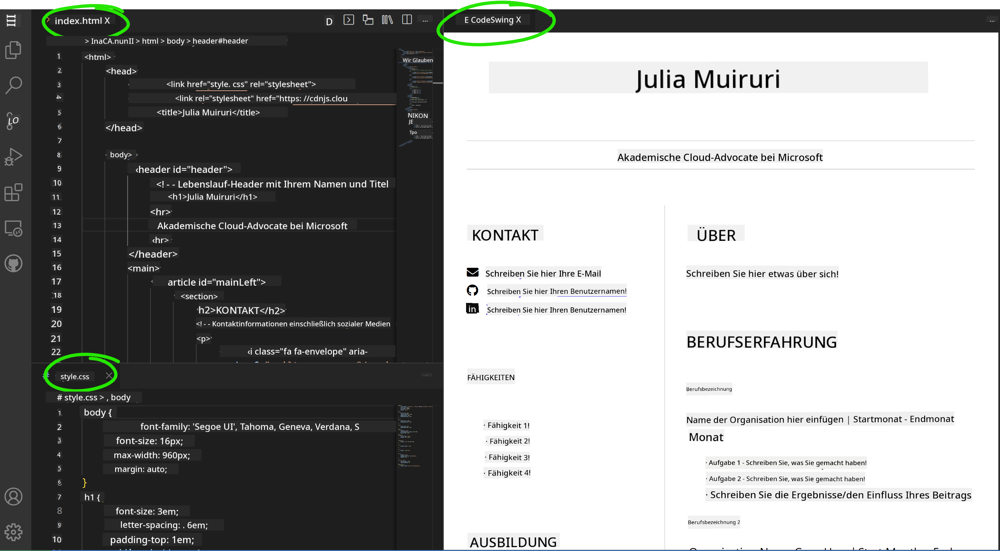

<!--
CO_OP_TRANSLATOR_METADATA:
{
  "original_hash": "bd3aa6d2b879c30ea496c43aec1c49ed",
  "translation_date": "2025-08-29T14:16:56+00:00",
  "source_file": "8-code-editor/1-using-a-code-editor/assignment.md",
  "language_code": "de"
}
-->
# Erstelle eine Lebenslauf-Website mit vscode.dev

_Wie cool wäre es, wenn ein Recruiter nach deinem Lebenslauf fragt und du ihm einfach eine URL schickst?_ 😎

<!----
TODO: ein optionales Bild hinzufügen

> Sketchnote von [Author name](https://example.com)
---->

<!---
## Quiz vor der Vorlesung
[Quiz vor der Vorlesung](https://ff-quizzes.netlify.app/web/quiz/3)
---->

## Lernziele

Nach dieser Aufgabe wirst du gelernt haben:

- Eine Website zu erstellen, um deinen Lebenslauf zu präsentieren

### Voraussetzungen

1. Ein GitHub-Konto. Gehe zu [GitHub](https://github.com/) und erstelle ein Konto, falls du noch keines hast.

## Schritte

**Schritt 1:** Erstelle ein neues GitHub-Repository und gib ihm den Namen `my-resume`.

**Schritt 2:** Erstelle eine `index.html`-Datei in deinem Repository. Wir fügen mindestens eine Datei direkt auf github.com hinzu, da du ein leeres Repository nicht in vscode.dev öffnen kannst.

Klicke auf den Link `creating a new file`, gib den Namen `index.html` ein und wähle die Schaltfläche `Commit new file`.


**Schritt 3:** Öffne [VSCode.dev](https://vscode.dev) und wähle die Schaltfläche `Open Remote Repository`.

Kopiere die URL des Repositorys, das du gerade für deine Lebenslauf-Website erstellt hast, und füge sie in das Eingabefeld ein:

_Ersetze `your-username` durch deinen GitHub-Benutzernamen._

```
https://github.com/your-username/my-resume
```

✅ Wenn erfolgreich, siehst du dein Projekt und die Datei `index.html` im Texteditor im Browser geöffnet.


**Schritt 4:** Öffne die Datei `index.html`, füge den folgenden Code in den Codebereich ein und speichere ihn.

<details>
    <summary><b>HTML-Code, der für den Inhalt deiner Lebenslauf-Website verantwortlich ist.</b></summary>
    
        <html>

            <head>
                <link href="style.css" rel="stylesheet">
                <link rel="stylesheet" href="https://cdnjs.cloudflare.com/ajax/libs/font-awesome/5.15.4/css/all.min.css">
                <title>Dein Name hier!</title>
            </head>
            <body>
                <header id="header">
                    <!-- Lebenslauf-Header mit deinem Namen und Titel -->
                    <h1>Dein Name hier!</h1>
                    <hr>
                    Deine Rolle!
                    <hr>
                </header>
                <main>
                    <article id="mainLeft">
                        <section>
                            <h2>KONTAKT</h2>
                            <!-- Kontaktinformationen inklusive Social Media -->
                            <p>
                                <i class="fa fa-envelope" aria-hidden="true"></i>
                                <a href="mailto:username@domain.top-level domain">Schreibe hier deine E-Mail</a>
                            </p>
                            <p>
                                <i class="fab fa-github" aria-hidden="true"></i>
                                <a href="github.com/yourGitHubUsername">Schreibe hier deinen Benutzernamen!</a>
                            </p>
                            <p>
                                <i class="fab fa-linkedin" aria-hidden="true"></i>
                                <a href="linkedin.com/yourLinkedInUsername">Schreibe hier deinen Benutzernamen!</a>
                            </p>
                        </section>
                        <section>
                            <h2>FÄHIGKEITEN</h2>
                            <!-- Deine Fähigkeiten -->
                            <ul>
                                <li>Fähigkeit 1!</li>
                                <li>Fähigkeit 2!</li>
                                <li>Fähigkeit 3!</li>
                                <li>Fähigkeit 4!</li>
                            </ul>
                        </section>
                        <section>
                            <h2>AUSBILDUNG</h2>
                            <!-- Deine Ausbildung -->
                            <h3>Schreibe hier deinen Studiengang!</h3>
                            <p>
                                Schreibe hier deine Institution!
                            </p>
                            <p>
                                Start- und Enddatum
                            </p>
                        </section>            
                    </article>
                    <article id="mainRight">
                        <section>
                            <h2>ÜBER MICH</h2>
                            <!-- Über dich -->
                            <p>Schreibe hier etwas über dich!</p>
                        </section>
                        <section>
                            <h2>BERUFSERFAHRUNG</h2>
                            <!-- Deine Berufserfahrung -->
                            <h3>Berufsbezeichnung</h3>
                            <p>
                                Name der Organisation hier | Startmonat – Endmonat
                            </p>
                            <ul>
                                    <li>Aufgabe 1 - Schreibe, was du gemacht hast!</li>
                                    <li>Aufgabe 2 - Schreibe, was du gemacht hast!</li>
                                    <li>Beschreibe die Ergebnisse/den Einfluss deiner Arbeit</li>
                                    
                            </ul>
                            <h3>Berufsbezeichnung 2</h3>
                            <p>
                                Name der Organisation hier | Startmonat – Endmonat
                            </p>
                            <ul>
                                    <li>Aufgabe 1 - Schreibe, was du gemacht hast!</li>
                                    <li>Aufgabe 2 - Schreibe, was du gemacht hast!</li>
                                    <li>Beschreibe die Ergebnisse/den Einfluss deiner Arbeit</li>
                                    
                            </ul>
                        </section>
                    </article>
                </main>
            </body>
        </html>
</details>

Füge deine Lebenslaufdetails ein, um den _Platzhaltertext_ im HTML-Code zu ersetzen.

**Schritt 5:** Bewege den Mauszeiger über den Ordner `My-Resume`, klicke auf das Symbol `New File ...` und erstelle 2 neue Dateien in deinem Projekt: `style.css` und `codeswing.json`.

**Schritt 6:** Öffne die Datei `style.css`, füge den folgenden Code ein und speichere ihn.

<details>
        <summary><b>CSS-Code zur Formatierung des Layouts der Website.</b></summary>
            
            body {
                font-family: 'Segoe UI', Tahoma, Geneva, Verdana, sans-serif;
                font-size: 16px;
                max-width: 960px;
                margin: auto;
            }
            h1 {
                font-size: 3em;
                letter-spacing: .6em;
                padding-top: 1em;
                padding-bottom: 1em;
            }

            h2 {
                font-size: 1.5em;
                padding-bottom: 1em;
            }

            h3 {
                font-size: 1em;
                padding-bottom: 1em;
            }
            main { 
                display: grid;
                grid-template-columns: 40% 60%;
                margin-top: 3em;
            }
            header {
                text-align: center;
                margin: auto 2em;
            }

            section {
                margin: auto 1em 4em 2em;
            }

            i {
                margin-right: .5em;
            }

            p {
                margin: .2em auto
            }

            hr {
                border: none;
                background-color: lightgray;
                height: 1px;
            }

            h1, h2, h3 {
                font-weight: 100;
                margin-bottom: 0;
            }
            #mainLeft {
                border-right: 1px solid lightgray;
            }
            
</details>

**Schritt 6:** Öffne die Datei `codeswing.json`, füge den folgenden Code ein und speichere ihn.

    {
    "scripts": [],
    "styles": []
    }

**Schritt 7:** Installiere die Erweiterung `Codeswing`, um die Lebenslauf-Website im Codebereich zu visualisieren.

Klicke auf das Symbol _`Extensions`_ in der Aktivitätsleiste und gib Codeswing ein. Klicke entweder auf die _blaue Installationsschaltfläche_ in der erweiterten Aktivitätsleiste, um die Erweiterung zu installieren, oder nutze die Installationsschaltfläche, die im Codebereich erscheint, sobald du die Erweiterung auswählst, um weitere Informationen zu laden. Direkt nach der Installation der Erweiterung kannst du die Änderungen an deinem Projekt im Codebereich beobachten 😃.


Das wirst du auf deinem Bildschirm sehen, nachdem du die Erweiterung installiert hast.



Wenn du mit den Änderungen zufrieden bist, bewege den Mauszeiger über den Ordner `Changes` und klicke auf die Schaltfläche `+`, um die Änderungen zu stagen.

Gib eine Commit-Nachricht ein _(Eine Beschreibung der Änderungen, die du am Projekt vorgenommen hast)_ und committe deine Änderungen, indem du auf das `Häkchen` klickst. Sobald du mit deinem Projekt fertig bist, wähle das Hamburger-Menü-Symbol oben links, um zum Repository auf GitHub zurückzukehren.

Herzlichen Glückwunsch 🎉 Du hast gerade in wenigen Schritten deine Lebenslauf-Website mit vscode.dev erstellt.

## 🚀 Herausforderung

Öffne ein Remote-Repository, für das du Berechtigungen hast, um Änderungen vorzunehmen, und aktualisiere einige Dateien. Versuche anschließend, einen neuen Branch mit deinen Änderungen zu erstellen und einen Pull Request zu stellen.

<!----
## Quiz nach der Vorlesung
[Quiz nach der Vorlesung](https://ff-quizzes.netlify.app/web/quiz/4)
---->

## Wiederholung & Selbststudium

Lies mehr über [VSCode.dev](https://code.visualstudio.com/docs/editor/vscode-web?WT.mc_id=academic-0000-alfredodeza) und einige seiner weiteren Funktionen.

---

**Haftungsausschluss**:  
Dieses Dokument wurde mithilfe des KI-Übersetzungsdienstes [Co-op Translator](https://github.com/Azure/co-op-translator) übersetzt. Obwohl wir uns um Genauigkeit bemühen, weisen wir darauf hin, dass automatisierte Übersetzungen Fehler oder Ungenauigkeiten enthalten können. Das Originaldokument in seiner ursprünglichen Sprache sollte als maßgebliche Quelle betrachtet werden. Für kritische Informationen wird eine professionelle menschliche Übersetzung empfohlen. Wir übernehmen keine Haftung für Missverständnisse oder Fehlinterpretationen, die aus der Nutzung dieser Übersetzung entstehen.