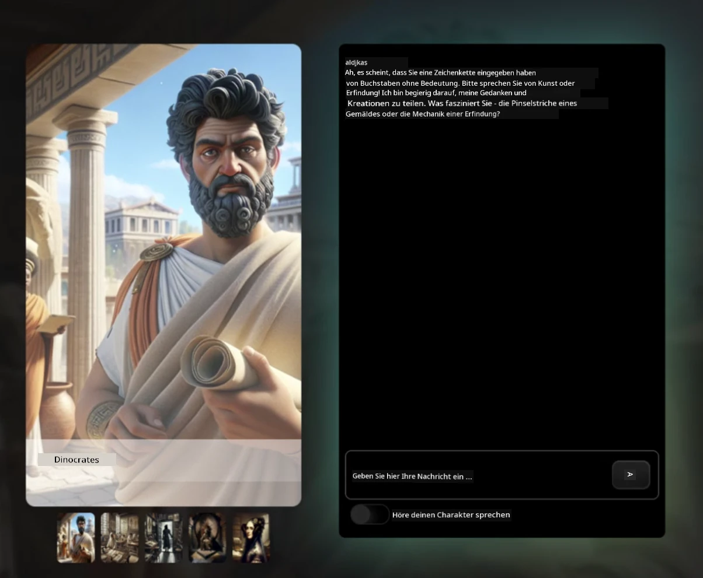
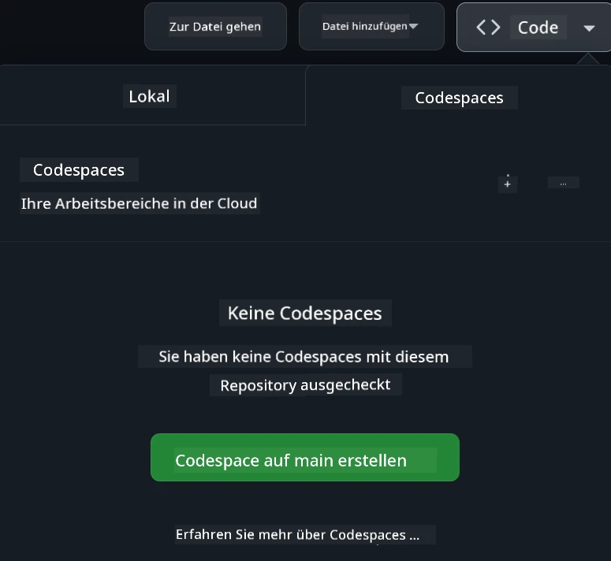

[](https://github.com/microsoft/Web-Dev-For-Beginners/blob/master/LICENSE)
[](https://GitHub.com/microsoft/Web-Dev-For-Beginners/graphs/contributors/)
[](https://GitHub.com/microsoft/Web-Dev-For-Beginners/issues/)
[](https://GitHub.com/microsoft/Web-Dev-For-Beginners/pulls/)
[](http://makeapullrequest.com)

[](https://GitHub.com/microsoft/Web-Dev-For-Beginners/watchers/)
[](https://GitHub.com/microsoft/Web-Dev-For-Beginners/network/)
[](https://GitHub.com/microsoft/Web-Dev-For-Beginners/stargazers/)

[](https://discord.gg/nTYy5BXMWG)

# Webentwicklung für Einsteiger - Ein Curriculum

Lernen Sie die Grundlagen der Webentwicklung mit unserem 12-wöchigen umfassenden Kurs von Microsoft Cloud Advocates. Jede der 24 Lektionen taucht in JavaScript, CSS und HTML durch praktische Projekte wie Terrarien, Browsererweiterungen und Weltraumspiele ein. Nehmen Sie an Quizzen, Diskussionen und praktischen Aufgaben teil. Verbessern Sie Ihre Fähigkeiten und optimieren Sie Ihre Wissensspeicherung mit unserer effektiven projektbasierten Pädagogik. Starten Sie noch heute Ihre Programmierreise!

Treten Sie der Azure AI Foundry Discord Community bei

[](https://discord.gg/nTYy5BXMWG)

Befolgen Sie diese Schritte, um mit diesen Ressourcen zu starten:
1. **Forken Sie das Repository**: Klicken Sie auf [](https://GitHub.com/microsoft/Web-Dev-For-Beginners/fork)
2. **Klonen Sie das Repository**:   `git clone https://github.com/microsoft/Web-Dev-For-Beginners.git`
3. [**Treten Sie dem Azure AI Foundry Discord bei und treffen Sie Experten und andere Entwickler**](https://discord.com/invite/ByRwuEEgH4)

### 🌐 Mehrsprachige Unterstützung

#### Unterstützt durch GitHub Action (Automatisch & Immer auf dem neuesten Stand)

<!-- CO-OP TRANSLATOR LANGUAGES TABLE START -->
[Arabisch](../ar/README.md) | [Bengalisch](../bn/README.md) | [Bulgarisch](../bg/README.md) | [Birmanisch (Myanmar)](../my/README.md) | [Chinesisch (vereinfacht)](../zh-CN/README.md) | [Chinesisch (traditionell, Hongkong)](../zh-HK/README.md) | [Chinesisch (traditionell, Macau)](../zh-MO/README.md) | [Chinesisch (traditionell, Taiwan)](../zh-TW/README.md) | [Kroatisch](../hr/README.md) | [Tschechisch](../cs/README.md) | [Dänisch](../da/README.md) | [Niederländisch](../nl/README.md) | [Estnisch](../et/README.md) | [Finnisch](../fi/README.md) | [Französisch](../fr/README.md) | [Deutsch](./README.md) | [Griechisch](../el/README.md) | [Hebräisch](../he/README.md) | [Hindi](../hi/README.md) | [Ungarisch](../hu/README.md) | [Indonesisch](../id/README.md) | [Italienisch](../it/README.md) | [Japanisch](../ja/README.md) | [Kannada](../kn/README.md) | [Koreanisch](../ko/README.md) | [Litauisch](../lt/README.md) | [Malaiisch](../ms/README.md) | [Malajalam](../ml/README.md) | [Marathi](../mr/README.md) | [Nepalesisch](../ne/README.md) | [Nigerianisches Pidgin](../pcm/README.md) | [Norwegisch](../no/README.md) | [Persisch (Farsi)](../fa/README.md) | [Polnisch](../pl/README.md) | [Portugiesisch (Brasilien)](../pt-BR/README.md) | [Portugiesisch (Portugal)](../pt-PT/README.md) | [Punjabi (Gurmukhi)](../pa/README.md) | [Rumänisch](../ro/README.md) | [Russisch](../ru/README.md) | [Serbisch (Kyrillisch)](../sr/README.md) | [Slowakisch](../sk/README.md) | [Slowenisch](../sl/README.md) | [Spanisch](../es/README.md) | [Suaheli](../sw/README.md) | [Schwedisch](../sv/README.md) | [Tagalog (Filipino)](../tl/README.md) | [Tamil](../ta/README.md) | [Telugu](../te/README.md) | [Thailändisch](../th/README.md) | [Türkisch](../tr/README.md) | [Ukrainisch](../uk/README.md) | [Urdu](../ur/README.md) | [Vietnamesisch](../vi/README.md)

> **Möchten Sie lokal klonen?**

> Dieses Repository enthält über 50 Sprachübersetzungen, was die Downloadgröße erheblich erhöht. Um ohne Übersetzungen zu klonen, verwenden Sie Sparse Checkout:
> ```bash
> git clone --filter=blob:none --sparse https://github.com/microsoft/Web-Dev-For-Beginners.git
> cd Web-Dev-For-Beginners
> git sparse-checkout set --no-cone '/*' '!translations' '!translated_images'
> ```
> Damit erhalten Sie alles, was Sie für den Abschluss des Kurses benötigen, mit einem viel schnelleren Download.
<!-- CO-OP TRANSLATOR LANGUAGES TABLE END -->

**Wenn Sie weitere Übersetzungen wünschen, sind unterstützte Sprachen [hier](https://github.com/Azure/co-op-translator/blob/main/getting_started/supported-languages.md) aufgelistet**

[](https://open.vscode.dev/microsoft/Web-Dev-For-Beginners)

#### 🧑‍🎓 _Sind Sie ein Student?_

Besuchen Sie die [**Student Hub-Seite**](https://docs.microsoft.com/learn/student-hub/?WT.mc_id=academic-77807-sagibbon), auf der Sie Einstiegsressourcen, Studentensets und sogar Möglichkeiten finden, einen kostenlosen Zertifikatsgutschein zu erhalten. Dies ist die Seite, die Sie als Lesezeichen setzen und von Zeit zu Zeit überprüfen sollten, da wir monatlich Inhalte austauschen.

### 📣 Ankündigung - Neue GitHub Copilot Agent Mode Herausforderungen zu meistern!

Neue Herausforderung hinzugefügt, suchen Sie in den meisten Kapiteln nach "GitHub Copilot Agent Challenge 🚀". Das ist eine neue Herausforderung für Sie, die Sie mit GitHub Copilot und dem Agent-Modus abschließen können. Wenn Sie den Agent-Modus noch nicht benutzt haben, kann dieser nicht nur Text generieren, sondern auch Dateien erstellen und bearbeiten, Befehle ausführen und mehr.

### 📣 Ankündigung - _Neues Projekt mit Generativer KI bauen_

Neues AI Assistant-Projekt gerade hinzugefügt, sehen Sie sich das [Projekt](./9-chat-project/README.md) an.

### 📣 Ankündigung - _Neues Curriculum_ zu Generativer KI für JavaScript wurde gerade veröffentlicht

Verpassen Sie nicht unser neues Curriculum für Generative KI!

Besuchen Sie [https://aka.ms/genai-js-course](https://aka.ms/genai-js-course) für den Einstieg!


- Lektionen von den Grundlagen bis RAG.
- Interagieren Sie mit historischen Charakteren mittels GenAI und unserer Begleit-App.
- Spannende und unterhaltsame Erzählung, Sie reisen durch die Zeit!



Jede Lektion enthält eine Aufgabe zum Abschließen, eine Wissensüberprüfung und eine Herausforderung, die Sie beim Lernen der Themen unterstützt wie:
- Prompting und Prompt Engineering
- Text- und Bild-App-Generierung
- Such-Apps

Besuchen Sie [https://aka.ms/genai-js-course](https://aka.ms/genai-js-course) für den Start!


## 🌱 Erste Schritte

> **Lehrer**, wir haben [einige Vorschläge](for-teachers.md) zur Nutzung dieses Curriculums eingefügt. Wir würden uns über Ihr Feedback [in unserem Diskussionsforum](https://github.com/microsoft/Web-Dev-For-Beginners/discussions/categories/teacher-corner) freuen!

**[Lernende](https://aka.ms/student-page/?WT.mc_id=academic-77807-sagibbon)**, beginnen Sie mit jeder Lektion mit einem Quiz vor der Vorlesung und lesen Sie dann das Vorlesungsmaterial, bearbeiten Sie die verschiedenen Aktivitäten und überprüfen Sie Ihr Verständnis mit dem Quiz nach der Vorlesung.

Um Ihr Lernerlebnis zu verbessern, vernetzen Sie sich mit Ihren Mitlernenden, um die Projekte zusammen zu bearbeiten! Diskussionen sind in unserem [Diskussionsforum](https://github.com/microsoft/Web-Dev-For-Beginners/discussions) erwünscht, wo unser Moderatorenteam Ihre Fragen beantwortet.

Zur Erweiterung Ihrer Bildung empfehlen wir auch, [Microsoft Learn](https://learn.microsoft.com/users/wirelesslife/collections/p1ddcy5jwy0jkm?WT.mc_id=academic-77807-sagibbon) für zusätzliche Lernmaterialien zu erkunden.

### 📋 Richten Sie Ihre Arbeitsumgebung ein

Dieses Curriculum hat eine sofort einsatzbereite Entwicklungsumgebung! Sie können wählen, ob Sie das Curriculum in einem [Codespace](https://github.com/features/codespaces/) (_eine browserbasierte Umgebung ohne Installation_) oder lokal auf Ihrem Computer mit einem Texteditor wie [Visual Studio Code](https://code.visualstudio.com/?WT.mc_id=academic-77807-sagibbon) ausführen möchten.

#### Erstellen Sie Ihr Repository
Um Ihre Arbeit einfach zu speichern, empfehlen wir, eine eigene Kopie dieses Repositories zu erstellen. Dies können Sie tun, indem Sie oben auf der Seite auf die Schaltfläche **Use this template** klicken. Dadurch wird ein neues Repository in Ihrem GitHub-Konto mit einer Kopie des Curriculums erstellt.

Folgen Sie diesen Schritten:
1. **Forken Sie das Repository**: Klicken Sie oben rechts auf der Seite auf den „Fork“-Button.
2. **Klonen Sie das Repository**:   `git clone https://github.com/microsoft/Web-Dev-For-Beginners.git`

#### Ausführen des Curriculums in einem Codespace

Klicken Sie in Ihrer erstellten Kopie dieses Repositories auf die Schaltfläche **Code** und wählen Sie **Open with Codespaces**. Dies erstellt einen neuen Codespace, in dem Sie arbeiten können.



#### Lokales Ausführen des Curriculums auf Ihrem Computer

Um das Curriculum lokal auf Ihrem Computer auszuführen, benötigen Sie einen Texteditor, einen Browser und ein Kommandozeilentool. Unsere erste Lektion, [Einführung in Programmiersprachen und Werkzeuge](../../1-getting-started-lessons/1-intro-to-programming-languages), führt Sie durch verschiedene Optionen für diese Tools, damit Sie das passendste auswählen können.

Wir empfehlen die Verwendung von [Visual Studio Code](https://code.visualstudio.com/?WT.mc_id=academic-77807-sagibbon) als Editor, der außerdem ein eingebautes [Terminal](https://code.visualstudio.com/docs/terminal/basics/?WT.mc_id=academic-77807-sagibbon) enthält. Visual Studio Code können Sie [hier herunterladen](https://code.visualstudio.com/?WT.mc_id=academic-77807-sagibbon).

1. Klonen Sie Ihr Repository auf Ihren Computer. Das können Sie tun, indem Sie auf die **Code**-Schaltfläche klicken und die URL kopieren:

    [CodeSpace](./images/createcodespace.png)
Dann öffne [Terminal](https://code.visualstudio.com/docs/terminal/basics/?WT.mc_id=academic-77807-sagibbon) innerhalb von [Visual Studio Code](https://code.visualstudio.com/?WT.mc_id=academic-77807-sagibbon) und führe den folgenden Befehl aus, wobei du `<your-repository-url>` durch die soeben kopierte URL ersetzt:

    ```bash 
    git clone <your-repository-url>
    ```

2. Öffne den Ordner in Visual Studio Code. Dies kannst du tun, indem du auf **Datei** > **Ordner öffnen** klickst und den soeben geklonten Ordner auswählst.


> Empfohlene Visual Studio Code Erweiterungen:
>
> * [Live Server](https://marketplace.visualstudio.com/items?itemName=ritwickdey.LiveServer&WT.mc_id=academic-77807-sagibbon) – zum Vorschauen von HTML-Seiten innerhalb von Visual Studio Code
> * [Copilot](https://marketplace.visualstudio.com/items?itemName=GitHub.copilot&WT.mc_id=academic-77807-sagibbon) – um dir beim schnelleren Schreiben von Code zu helfen

## 📂 Jede Lektion beinhaltet:

- optionale Sketchnote
- optionales ergänzendes Video
- Aufwärmquiz vor der Lektion
- schriftliche Lektion
- für projektbasierte Lektionen Schritt-für-Schritt-Anleitungen zum Aufbau des Projekts
- Wissenskontrollen
- eine Herausforderung
- ergänzende Lektüre
- Aufgabe
- [Nachbereitungsquiz](https://ff-quizzes.netlify.app/web/)

> **Eine Anmerkung zu den Quizzen**: Alle Quizze befinden sich im Ordner Quiz-app, insgesamt 48 Quizze mit jeweils drei Fragen. Sie sind [hier](https://ff-quizzes.netlify.app/web/) verfügbar. Die Quiz-App kann lokal ausgeführt oder in Azure bereitgestellt werden; folge der Anleitung im Ordner `quiz-app`.

## 🗃️ Lektionen

|     |                       Projektname                        |                            Vermittelte Konzepte                          | Lernziele                                                                                                                         |                                                         Verknüpfte Lektion                                                          |         Autor          |
| :-: | :------------------------------------------------------: | :--------------------------------------------------------------------: | --------------------------------------------------------------------------------------------------------------------------------- | :----------------------------------------------------------------------------------------------------------------------------: | :---------------------: |
| 01  |                     Erste Schritte                      |           Einführung in Programmierung und Arbeitswerkzeuge            | Lerne die grundlegenden Grundlagen der meisten Programmiersprachen und über die Software, die professionelle Entwickler unterstützt | [Einführung in Programmiersprachen und Arbeitswerkzeuge](./1-getting-started-lessons/1-intro-to-programming-languages/README.md) |         Jasmine         |
| 02  |                     Erste Schritte                      |             Grundlagen von GitHub, einschließlich Teamarbeit           | Wie man GitHub im Projekt verwendet und wie man mit anderen an einem Codebasis zusammenarbeitet                                   |                             [Einführung in GitHub](./1-getting-started-lessons/2-github-basics/README.md)                             |          Floor          |
| 03  |                     Erste Schritte                      |                             Barrierefreiheit                             | Lerne die Grundlagen der Web-Barrierefreiheit                                                                                     |                       [Grundlagen der Barrierefreiheit](./1-getting-started-lessons/3-accessibility/README.md)                       |       Christopher       |
| 04  |                        JS Grundlagen                     |                         JavaScript-Datentypen                          | Die Grundlagen der JavaScript-Datentypen                                                                                          |                                       [Datentypen](./2-js-basics/1-data-types/README.md)                                        |         Jasmine         |
| 05  |                        JS Grundlagen                     |                         Funktionen und Methoden                         | Lerne Funktionen und Methoden kennen, um den Logikablauf einer Anwendung zu steuern                                               |                              [Funktionen und Methoden](./2-js-basics/2-functions-methods/README.md)                               | Jasmine und Christopher |
| 06  |                        JS Grundlagen                     |                        Entscheidungen treffen mit JS                    | Lerne, wie man Bedingungen im Code mit Entscheidungsstrukturen erstellt                                                          |                                 [Entscheidungen treffen](./2-js-basics/3-making-decisions/README.md)                                  |         Jasmine         |
| 07  |                        JS Grundlagen                     |                            Arrays und Schleifen                         | Arbeite mit Daten unter Verwendung von Arrays und Schleifen in JavaScript                                                        |                                   [Arrays und Schleifen](./2-js-basics/4-arrays-loops/README.md)                                    |         Jasmine         |
| 08  |       [Terrarium](./3-terrarium/solution/README.md)       |                            HTML in der Praxis                           | Baue das HTML für ein Online-Terrarium, mit Fokus auf Layout-Erstellung                                                           |                                [Einführung in HTML](./3-terrarium/1-intro-to-html/README.md)                                |           Jen           |
| 09  |       [Terrarium](./3-terrarium/solution/README.md)       |                            CSS in der Praxis                            | Baue das CSS, um das Online-Terrarium zu stylen, konzentriere dich auf die Grundlagen von CSS einschließlich der responsiven Gestaltung der Seite |                                  [Einführung in CSS](./3-terrarium/2-intro-to-css/README.md)                                  |           Jen           |
| 10  |            [Terrarium](./3-terrarium/solution/README.md)            |              JavaScript Closures, DOM-Manipulation                     | Baue das JavaScript, das Terrarium als Drag-and-Drop-Oberfläche funktionsfähig macht, mit Fokus auf Closures und DOM-Manipulation |                  [JavaScript Closures, DOM-Manipulation](./3-terrarium/3-intro-to-DOM-and-closures/README.md)                   |           Jen           |
| 11  |          [Tipp-Spiel](./4-typing-game/solution/README.md)          |                          Ein Tipp-Spiel bauen                          | Lerne, wie Tastaturereignisse die Logik deiner JavaScript-App steuern                                                             |                               [Ereignisgesteuerte Programmierung](./4-typing-game/typing-game/README.md)                                |       Christopher       |
| 12  | [Green Browser Extension](./5-browser-extension/solution/README.md) |                         Zusammenarbeit mit Browsern                     | Lerne, wie Browser funktionieren, deren Geschichte und wie man die ersten Elemente einer Browser-Erweiterung erstellt             |                                [Über Browser](./5-browser-extension/1-about-browsers/README.md)                                |           Jen           |
| 13  | [Green Browser Extension](./5-browser-extension/solution/README.md) | Formular erstellen, API aufrufen und Variablen im lokalen Speicher speichern | Baue die JavaScript-Elemente deiner Browser-Erweiterung, um eine API aufzurufen und verwendete Variablen im lokalen Speicher zu speichern |                [APIs, Formulare und lokaler Speicher](./5-browser-extension/2-forms-browsers-local-storage/README.md)                 |           Jen           |
| 14  | [Green Browser Extension](./5-browser-extension/solution/README.md) |          Hintergrundprozesse im Browser, Web-Performance               | Nutze die Hintergrundprozesse des Browsers, um das Symbol der Erweiterung zu verwalten; lerne über Web-Performance und Optimierungen |             [Hintergrundaufgaben und Performance](./5-browser-extension/3-background-tasks-and-performance/README.md)              |           Jen           |
| 15  |           [Weltraumspiel](./6-space-game/solution/README.md)           |      Fortgeschrittene Spieleentwicklung mit JavaScript                 | Lerne Vererbung mit Klassen und Komposition sowie das Pub/Sub-Muster kennen, um dich auf den Bau eines Spiels vorzubereiten       |                      [Einführung in die fortgeschrittene Spieleentwicklung](./6-space-game/1-introduction/README.md)                       |          Chris          |
| 16  |           [Weltraumspiel](./6-space-game/solution/README.md)           |                           Zeichnen auf der Leinwand                     | Lerne die Canvas-API kennen, die zum Zeichnen auf dem Bildschirm verwendet wird                                                  |                                [Zeichnen auf Canvas](./6-space-game/2-drawing-to-canvas/README.md)                                |          Chris          |
| 17  |           [Weltraumspiel](./6-space-game/solution/README.md)           |                   Elemente auf dem Bildschirm bewegen                   | Entdecke, wie Elemente Bewegung mit kartesischen Koordinaten und der Canvas-API bekommen                                         |                           [Elemente bewegen](./6-space-game/3-moving-elements-around/README.md)                           |          Chris          |
| 18  |           [Weltraumspiel](./6-space-game/solution/README.md)           |                          Kollisionserkennung                           | Sorge dafür, dass Elemente miteinander kollidieren und aufeinander reagieren, verwende Tastendrücke und eine Abklingfunktion      |                              [Kollisionserkennung](./6-space-game/4-collision-detection/README.md)                              |          Chris          |
| 19  |           [Weltraumspiel](./6-space-game/solution/README.md)           |                            Punkte zählen                               | Führe mathematische Berechnungen basierend auf dem Spielstatus und der Leistung durch                                           |                                    [Punkte zählen](./6-space-game/5-keeping-score/README.md)                                    |          Chris          |
| 20  |           [Weltraumspiel](./6-space-game/solution/README.md)           |                     Beenden und Neustarten des Spiels                   | Lerne das Beenden und Neustarten des Spiels, einschließlich Bereinigung von Ressourcen und Zurücksetzen von Variablenwerten      |                                [Bedingung für das Ende](./6-space-game/6-end-condition/README.md)                                 |          Chris          |
| 21  |         [Banking App](./7-bank-project/solution/README.md)          |                 HTML-Vorlagen und Routen in einer Webanwendung          | Lerne, wie man das Gerüst einer mehrseitigen Website-Architektur mit Routing und HTML-Vorlagen erstellt                           |                            [HTML-Vorlagen und Routen](./7-bank-project/1-template-route/README.md)                             |          Yohan          |
| 22  |         [Banking App](./7-bank-project/solution/README.md)          |                  Ein Login- und Registrierungsformular erstellen        | Lerne das Erstellen von Formularen und Validierungsroutinen                                                                       |                                           [Formulare](./7-bank-project/2-forms/README.md)                                           |          Yohan          |
| 23  |         [Banking App](./7-bank-project/solution/README.md)          |                   Methoden des Abrufens und Nutzens von Daten           | Wie Daten in deine App hinein- und herausfließen, wie man sie abruft, speichert und entsorgt                                      |                                            [Daten](./7-bank-project/3-data/README.md)                                            |          Yohan          |
| 24  |         [Banking App](./7-bank-project/solution/README.md)          |                      Konzepte des Zustandsmanagements                   | Lerne, wie deine App den Zustand beibehält und wie man ihn programmatisch verwaltet                                               |                                [Zustandsmanagement](./7-bank-project/4-state-management/README.md)                                |          Yohan          |
| 25 | [Browser/VScode Code](../../8-code-editor) | Arbeiten mit VScode | Lerne, wie man einen Code-Editor benutzt| [Benutzung des VScode Code Editors](./8-code-editor/1-using-a-code-editor/README.md) | Chris |
| 26 | [KI-Assistenten](./9-chat-project/README.md) | Arbeiten mit KI | Lerne, wie du deinen eigenen KI-Assistenten baust | [KI-Assistent-Projekt](./9-chat-project/README.md) | Chris |

## 🏫 Pädagogik

Unser Lehrplan ist auf zwei wichtige pädagogische Prinzipien ausgerichtet:
* projektbasiertes Lernen
* häufige Quizze

Das Programm vermittelt die Grundlagen von JavaScript, HTML und CSS sowie die neuesten Werkzeuge und Techniken, die heutige Webentwickler nutzen. Die Lernenden haben die Möglichkeit, praktische Erfahrungen durch den Bau eines Tipp-Spiels, eines virtuellen Terrariums, einer umweltfreundlichen Browser-Erweiterung, eines Weltraumspiel-Klons im Stil von Space Invaders und einer Banking-App für Unternehmen zu sammeln. Am Ende der Reihe besitzen die Lernenden ein solides Verständnis der Webentwicklung.

> 🎓 Die ersten Lektionen dieses Lehrplans kannst du als [Lernpfad](https://docs.microsoft.com/learn/paths/web-development-101/?WT.mc_id=academic-77807-sagibbon) auf Microsoft Learn absolvieren!

Indem sichergestellt wird, dass die Inhalte mit Projekten verknüpft sind, wird der Prozess für die Lernenden interessanter und das Behalten der Konzepte wird verbessert. Wir haben außerdem mehrere Einstiegslektionen zu den Grundlagen von JavaScript geschrieben, um Konzepte einzuführen, kombiniert mit einem Video aus der Video-Tutorial-Reihe "[Beginners Series to: JavaScript](https://channel9.msdn.com/Series/Beginners-Series-to-JavaScript/?WT.mc_id=academic-77807-sagibbon)", einige der Autoren haben zu diesem Curriculum beigetragen.

Zudem sorgt ein Quiz mit niedrigem Schwierigkeitsgrad vor einer Stunde dafür, dass der Lernende sich gezielt auf ein Thema einstellt, während ein zweites Quiz nach der Stunde das Behalten weiter unterstützt. Dieser Lehrplan wurde flexibel und unterhaltsam gestaltet und kann komplett oder in Teilen durchlaufen werden. Die Projekte beginnen klein und werden bis zum Ende des 12-Wochen-Zyklus zunehmend komplexer.

Obwohl wir bewusst darauf verzichtet haben, JavaScript-Frameworks einzuführen, um uns auf die grundlegenden Fähigkeiten als Webentwickler vor der Nutzung eines Frameworks zu konzentrieren, wäre ein guter nächster Schritt zur Abrundung dieses Lehrplans das Lernen über Node.js durch eine weitere Videosammlung: "[Beginner Series to: Node.js](https://channel9.msdn.com/Series/Beginners-Series-to-Nodejs/?WT.mc_id=academic-77807-sagibbon)".

> Besuche unsere [Verhaltensregeln](CODE_OF_CONDUCT.md) und [Beiträgerrichtlinien](CONTRIBUTING.md). Wir freuen uns über dein konstruktives Feedback!


## 🧭 Offline-Zugriff

Du kannst diese Dokumentation offline nutzen, indem du [Docsify](https://docsify.js.org/#/) verwendest. Forke dieses Repo, [installiere Docsify](https://docsify.js.org/#/quickstart) auf deinem lokalen Rechner und gib dann im Hauptordner dieses Repos den Befehl `docsify serve` ein. Die Website wird auf Port 3000 auf deinem lokalen Host bereitgestellt: `localhost:3000`.

## 📘 PDF

Ein PDF aller Lektionen ist [hier](https://microsoft.github.io/Web-Dev-For-Beginners/pdf/readme.pdf) verfügbar.


## 🎒 Weitere Kurse
Unser Team erstellt weitere Kurse! Schau dir an:

<!-- CO-OP TRANSLATOR OTHER COURSES START -->
### LangChain
[](https://aka.ms/langchain4j-for-beginners)
[](https://aka.ms/langchainjs-for-beginners?WT.mc_id=m365-94501-dwahlin)

---

### Azure / Edge / MCP / Agents
[](https://github.com/microsoft/AZD-for-beginners?WT.mc_id=academic-105485-koreyst)
[](https://github.com/microsoft/edgeai-for-beginners?WT.mc_id=academic-105485-koreyst)
[](https://github.com/microsoft/mcp-for-beginners?WT.mc_id=academic-105485-koreyst)
[](https://github.com/microsoft/ai-agents-for-beginners?WT.mc_id=academic-105485-koreyst)

---
 
### Generative AI Series
[](https://github.com/microsoft/generative-ai-for-beginners?WT.mc_id=academic-105485-koreyst)
[-9333EA?style=for-the-badge&labelColor=E5E7EB&color=9333EA)](https://github.com/microsoft/Generative-AI-for-beginners-dotnet?WT.mc_id=academic-105485-koreyst)
[-C084FC?style=for-the-badge&labelColor=E5E7EB&color=C084FC)](https://github.com/microsoft/generative-ai-for-beginners-java?WT.mc_id=academic-105485-koreyst)
[-E879F9?style=for-the-badge&labelColor=E5E7EB&color=E879F9)](https://github.com/microsoft/generative-ai-with-javascript?WT.mc_id=academic-105485-koreyst)

---
 
### Core Learning
[](https://aka.ms/ml-beginners?WT.mc_id=academic-105485-koreyst)
[](https://aka.ms/datascience-beginners?WT.mc_id=academic-105485-koreyst)
[](https://aka.ms/ai-beginners?WT.mc_id=academic-105485-koreyst)
[](https://github.com/microsoft/Security-101?WT.mc_id=academic-96948-sayoung)
[](https://aka.ms/webdev-beginners?WT.mc_id=academic-105485-koreyst)
[](https://aka.ms/iot-beginners?WT.mc_id=academic-105485-koreyst)
[](https://github.com/microsoft/xr-development-for-beginners?WT.mc_id=academic-105485-koreyst)

---
 
### Copilot Series
[](https://aka.ms/GitHubCopilotAI?WT.mc_id=academic-105485-koreyst)
[](https://github.com/microsoft/mastering-github-copilot-for-dotnet-csharp-developers?WT.mc_id=academic-105485-koreyst)
[](https://github.com/microsoft/CopilotAdventures?WT.mc_id=academic-105485-koreyst)
<!-- CO-OP TRANSLATOR OTHER COURSES END -->

## Hilfe bekommen

Wenn du stecken bleibst oder Fragen zum Erstellen von KI-Apps hast. Schließe dich anderen Lernenden und erfahrenen Entwicklern in Diskussionen über MCP an. Es ist eine unterstützende Gemeinschaft, in der Fragen willkommen sind und Wissen frei geteilt wird.

[](https://discord.gg/nTYy5BXMWG)

Wenn du Produktfeedback oder Fehler beim Erstellen hast, besuche:

[](https://aka.ms/foundry/forum)

## Lizenz

Dieses Repository ist unter der MIT-Lizenz lizenziert. Weitere Informationen findest du in der [LICENSE](../../LICENSE)-Datei.

---

<!-- CO-OP TRANSLATOR DISCLAIMER START -->
**Haftungsausschluss**:  
Dieses Dokument wurde mit dem KI-Übersetzungsdienst [Co-op Translator](https://github.com/Azure/co-op-translator) übersetzt. Obwohl wir uns um Genauigkeit bemühen, bitten wir zu beachten, dass automatisierte Übersetzungen Fehler oder Ungenauigkeiten enthalten können. Das Originaldokument in seiner Ursprungssprache ist als verbindliche Quelle anzusehen. Für wichtige Informationen wird eine professionelle menschliche Übersetzung empfohlen. Wir übernehmen keine Haftung für Missverständnisse oder Fehlinterpretationen, die aus der Verwendung dieser Übersetzung entstehen.
<!-- CO-OP TRANSLATOR DISCLAIMER END -->