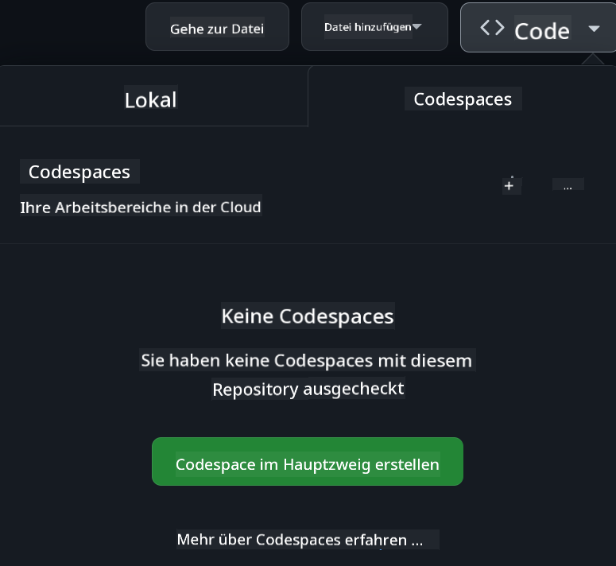

<!--
CO_OP_TRANSLATOR_METADATA:
{
  "original_hash": "3bea83a071750b68d3c8755f1155f805",
  "translation_date": "2025-10-03T08:29:14+00:00",
  "source_file": "README.md",
  "language_code": "de"
}
-->
[](https://github.com/microsoft/Web-Dev-For-Beginners/blob/master/LICENSE)
[](https://GitHub.com/microsoft/Web-Dev-For-Beginners/graphs/contributors/)
[](https://GitHub.com/microsoft/Web-Dev-For-Beginners/issues/)
[](https://GitHub.com/microsoft/Web-Dev-For-Beginners/pulls/)
[](http://makeapullrequest.com)

[](https://GitHub.com/microsoft/Web-Dev-For-Beginners/watchers/)
[](https://GitHub.com/microsoft/Web-Dev-For-Beginners/network/)
[](https://GitHub.com/microsoft/Web-Dev-For-Beginners/stargazers/)

[](https://discord.gg/zxKYvhSnVp?WT.mc_id=academic-000002-leestott)

[](https://open.vscode.dev/microsoft/Web-Dev-For-Beginners)

[](https://discord.com/invite/ByRwuEEgH4)

Folgen Sie diesen Schritten, um mit diesen Ressourcen zu beginnen:
1. **Repository forken**: Klicken Sie auf [](https://GitHub.com/microsoft/Web-Dev-For-Beginners/fork)
2. **Repository klonen**:   `git clone https://github.com/microsoft/Web-Dev-For-Beginners.git`
3. [**Treten Sie dem Azure AI Foundry Discord bei und treffen Sie Experten und andere Entwickler**](https://discord.com/invite/ByRwuEEgH4)

# Webentwicklung für Anfänger – Ein Lehrplan

Lernen Sie die Grundlagen der Webentwicklung mit unserem 12-wöchigen umfassenden Kurs von Microsoft Cloud Advocates. Jede der 24 Lektionen behandelt JavaScript, CSS und HTML durch praktische Projekte wie Terrarien, Browser-Erweiterungen und Weltraumspiele. Nehmen Sie an Quizfragen, Diskussionen und praktischen Aufgaben teil. Verbessern Sie Ihre Fähigkeiten und optimieren Sie Ihr Wissen mit unserer effektiven projektbasierten Pädagogik. Starten Sie noch heute Ihre Programmierreise!

### 🌐 Mehrsprachige Unterstützung

#### Unterstützt durch GitHub Action (Automatisiert & Immer aktuell)

[Französisch](../fr/README.md) | [Spanisch](../es/README.md) | [Deutsch](./README.md) | [Russisch](../ru/README.md) | [Arabisch](../ar/README.md) | [Persisch (Farsi)](../fa/README.md) | [Urdu](../ur/README.md) | [Chinesisch (vereinfacht)](../zh/README.md) | [Chinesisch (traditionell, Macau)](../mo/README.md) | [Chinesisch (traditionell, Hongkong)](../hk/README.md) | [Chinesisch (traditionell, Taiwan)](../tw/README.md) | [Japanisch](../ja/README.md) | [Koreanisch](../ko/README.md) | [Hindi](../hi/README.md) | [Bengalisch](../bn/README.md) | [Marathi](../mr/README.md) | [Nepalesisch](../ne/README.md) | [Punjabi (Gurmukhi)](../pa/README.md) | [Portugiesisch (Portugal)](../pt/README.md) | [Portugiesisch (Brasilien)](../br/README.md) | [Italienisch](../it/README.md) | [Polnisch](../pl/README.md) | [Türkisch](../tr/README.md) | [Griechisch](../el/README.md) | [Thailändisch](../th/README.md) | [Schwedisch](../sv/README.md) | [Dänisch](../da/README.md) | [Norwegisch](../no/README.md) | [Finnisch](../fi/README.md) | [Niederländisch](../nl/README.md) | [Hebräisch](../he/README.md) | [Vietnamesisch](../vi/README.md) | [Indonesisch](../id/README.md) | [Malaiisch](../ms/README.md) | [Tagalog (Filipino)](../tl/README.md) | [Swahili](../sw/README.md) | [Ungarisch](../hu/README.md) | [Tschechisch](../cs/README.md) | [Slowakisch](../sk/README.md) | [Rumänisch](../ro/README.md) | [Bulgarisch](../bg/README.md) | [Serbisch (kyrillisch)](../sr/README.md) | [Kroatisch](../hr/README.md) | [Slowenisch](../sl/README.md) | [Ukrainisch](../uk/README.md) | [Birmanisch (Myanmar)](../my/README.md)

**Falls Sie zusätzliche Übersetzungen wünschen, finden Sie unterstützte Sprachen [hier](https://github.com/Azure/co-op-translator/blob/main/getting_started/supported-languages.md)**

#### 🧑‍🎓 _Sind Sie ein Student?_

Besuchen Sie die [**Student Hub Seite**](https://docs.microsoft.com/learn/student-hub/?WT.mc_id=academic-77807-sagibbon), wo Sie Ressourcen für Anfänger, Studentenpakete und sogar Möglichkeiten finden, einen kostenlosen Zertifikatsgutschein zu erhalten. Diese Seite sollten Sie sich als Lesezeichen speichern und regelmäßig besuchen, da wir den Inhalt monatlich aktualisieren.

### 📣 Ankündigung - _Neues Projekt mit Generativer KI_

Ein neues Projekt für einen KI-Assistenten wurde gerade hinzugefügt, schauen Sie es sich [hier](./09-chat-project/README.md) an.

### 📣 Ankündigung - _Neuer Lehrplan_ zu Generativer KI für JavaScript wurde gerade veröffentlicht

Verpassen Sie nicht unseren neuen Lehrplan zur Generativen KI!

Besuchen Sie [https://aka.ms/genai-js-course](https://aka.ms/genai-js-course), um loszulegen!


- Lektionen, die alles von den Grundlagen bis zu RAG abdecken.
- Interagieren Sie mit historischen Charakteren mithilfe von GenAI und unserer Begleit-App.
- Eine unterhaltsame und spannende Erzählung – Sie werden durch die Zeit reisen!


Jede Lektion enthält eine Aufgabe, ein Wissensquiz und eine Herausforderung, um Themen wie folgende zu erlernen:
- Prompting und Prompt-Engineering
- Text- und Bild-App-Generierung
- Suchanwendungen

Besuchen Sie [https://aka.ms/genai-js-course](../../[https:/aka.ms/genai-js-course), um loszulegen!

## 🌱 Erste Schritte

> **Lehrer**, wir haben [einige Vorschläge](for-teachers.md) hinzugefügt, wie Sie diesen Lehrplan nutzen können. Wir freuen uns über Ihr Feedback [in unserem Diskussionsforum](https://github.com/microsoft/Web-Dev-For-Beginners/discussions/categories/teacher-corner)!

**[Lernende](https://aka.ms/student-page/?WT.mc_id=academic-77807-sagibbon)**, beginnen Sie jede Lektion mit einem Quiz vor der Vorlesung und arbeiten Sie sich durch das Vorlesungsmaterial, die verschiedenen Aktivitäten und überprüfen Sie Ihr Verständnis mit dem Quiz nach der Vorlesung.

Um Ihr Lernerlebnis zu verbessern, verbinden Sie sich mit Ihren Mitlernenden, um gemeinsam an den Projekten zu arbeiten! Diskussionen sind in unserem [Diskussionsforum](https://github.com/microsoft/Web-Dev-For-Beginners/discussions) willkommen, wo unser Team von Moderatoren Ihre Fragen beantworten wird.

Um Ihre Ausbildung weiterzuführen, empfehlen wir Ihnen dringend, [Microsoft Learn](https://learn.microsoft.com/users/wirelesslife/collections/p1ddcy5jwy0jkm?WT.mc_id=academic-77807-sagibbon) für zusätzliche Lernmaterialien zu erkunden.

### 📋 Einrichten Ihrer Umgebung

Dieser Lehrplan hat eine einsatzbereite Entwicklungsumgebung! Zu Beginn können Sie den Lehrplan entweder in einem [Codespace](https://github.com/features/codespaces/) (_eine browserbasierte Umgebung, keine Installationen erforderlich_) oder lokal auf Ihrem Computer mit einem Texteditor wie [Visual Studio Code](https://code.visualstudio.com/?WT.mc_id=academic-77807-sagibbon) ausführen.

#### Erstellen Sie Ihr Repository
Um Ihre Arbeit einfach zu speichern, wird empfohlen, eine eigene Kopie dieses Repositorys zu erstellen. Sie können dies tun, indem Sie auf die Schaltfläche **Use this template** oben auf der Seite klicken. Dadurch wird ein neues Repository in Ihrem GitHub-Konto mit einer Kopie des Lehrplans erstellt.

Folgen Sie diesen Schritten:
1. **Repository forken**: Klicken Sie auf die Schaltfläche "Fork" oben rechts auf dieser Seite.
2. **Repository klonen**:   `git clone https://github.com/microsoft/Web-Dev-For-Beginners.git`

#### Den Lehrplan in einem Codespace ausführen

In Ihrer Kopie dieses Repositorys, die Sie erstellt haben, klicken Sie auf die Schaltfläche **Code** und wählen **Open with Codespaces**. Dadurch wird ein neuer Codespace für Sie erstellt, in dem Sie arbeiten können.



#### Den Lehrplan lokal auf Ihrem Computer ausführen

Um diesen Lehrplan lokal auf Ihrem Computer auszuführen, benötigen Sie einen Texteditor, einen Browser und ein Befehlszeilentool. Unsere erste Lektion, [Einführung in Programmiersprachen und Werkzeuge](../../1-getting-started-lessons/1-intro-to-programming-languages), führt Sie durch verschiedene Optionen für jedes dieser Werkzeuge, damit Sie auswählen können, was am besten für Sie funktioniert.

Unsere Empfehlung ist die Verwendung von [Visual Studio Code](https://code.visualstudio.com/?WT.mc_id=academic-77807-sagibbon) als Editor, der auch ein integriertes [Terminal](https://code.visualstudio.com/docs/terminal/basics/?WT.mc_id=academic-77807-sagibbon) enthält. Sie können Visual Studio Code [hier](https://code.visualstudio.com/?WT.mc_id=academic-77807-sagibbon) herunterladen.

1. Klonen Sie Ihr Repository auf Ihren Computer. Sie können dies tun, indem Sie auf die Schaltfläche **Code** klicken und die URL kopieren:

    [CodeSpace](./images/createcodespace.png)

    Öffnen Sie dann [Terminal](https://code.visualstudio.com/docs/terminal/basics/?WT.mc_id=academic-77807-sagibbon) innerhalb von [Visual Studio Code](https://code.visualstudio.com/?WT.mc_id=academic-77807-sagibbon) und führen Sie den folgenden Befehl aus, wobei Sie `<your-repository-url>` durch die gerade kopierte URL ersetzen:

    ```bash 
    git clone <your-repository-url>
    ```

2. Öffnen Sie den Ordner in Visual Studio Code. Sie können dies tun, indem Sie auf **Datei** > **Ordner öffnen** klicken und den gerade geklonten Ordner auswählen.

> Empfohlene Visual Studio Code-Erweiterungen:
>
> * [Live Server](https://marketplace.visualstudio.com/items?itemName=ritwickdey.LiveServer&WT.mc_id=academic-77807-sagibbon) - um HTML-Seiten direkt in Visual Studio Code anzuzeigen
> * [Copilot](https://marketplace.visualstudio.com/items?itemName=GitHub.copilot&WT.mc_id=academic-77807-sagibbon) - um schneller Code zu schreiben

## 📂 Jede Lektion enthält:

- optionales Sketchnote
- optionales ergänzendes Video
- Quiz vor der Lektion
- schriftliche Lektion
- für projektbasierte Lektionen Schritt-für-Schritt-Anleitungen zum Erstellen des Projekts
- Wissensüberprüfungen
- eine Herausforderung
- ergänzende Lektüre
- Aufgabe
- [Quiz nach der Lektion](https://ff-quizzes.netlify.app/web/)
> **Eine Anmerkung zu den Quiz**: Alle Quiz befinden sich im Ordner Quiz-app, insgesamt 48 Quiz mit jeweils drei Fragen. Sie sind [hier](https://ff-quizzes.netlify.app/web/) verfügbar. Die Quiz-App kann lokal ausgeführt oder auf Azure bereitgestellt werden; folgen Sie den Anweisungen im Ordner `quiz-app`.

## 🗃️ Lektionen

|     |                       Projektname                       |                            Vermittelte Konzepte                             | Lernziele                                                                                                                 |                                                         Verlinkte Lektion                                                          |         Autor          |
| :-: | :------------------------------------------------------: | :--------------------------------------------------------------------------: | ------------------------------------------------------------------------------------------------------------------------- | :----------------------------------------------------------------------------------------------------------------------------: | :---------------------: |
| 01  |                     Erste Schritte                      |           Einführung in die Programmierung und Werkzeuge der Branche         | Lernen Sie die grundlegenden Prinzipien der meisten Programmiersprachen und die Software kennen, die professionelle Entwickler nutzen | [Einführung in Programmiersprachen und Werkzeuge der Branche](./1-getting-started-lessons/1-intro-to-programming-languages/README.md) |         Jasmine         |
| 02  |                     Erste Schritte                      |             Grundlagen von GitHub, einschließlich Teamarbeit                | Erfahren Sie, wie Sie GitHub in Ihrem Projekt nutzen und mit anderen an einer Codebasis zusammenarbeiten können             |                            [Einführung in GitHub](./1-getting-started-lessons/2-github-basics/README.md)                             |          Floor          |
| 03  |                     Erste Schritte                      |                             Barrierefreiheit                                | Lernen Sie die Grundlagen der Barrierefreiheit im Web                                                                     |                       [Grundlagen der Barrierefreiheit](./1-getting-started-lessons/3-accessibility/README.md)                       |       Christopher       |
| 04  |                        JS-Grundlagen                    |                         JavaScript-Datentypen                               | Die Grundlagen der JavaScript-Datentypen                                                                                  |                                       [Datentypen](./2-js-basics/1-data-types/README.md)                                        |         Jasmine         |
| 05  |                        JS-Grundlagen                    |                         Funktionen und Methoden                             | Lernen Sie Funktionen und Methoden kennen, um den Logikfluss einer Anwendung zu steuern                                    |                              [Funktionen und Methoden](./2-js-basics/2-functions-methods/README.md)                               | Jasmine und Christopher |
| 06  |                        JS-Grundlagen                    |                        Entscheidungen mit JS treffen                        | Lernen Sie, wie Sie Bedingungen in Ihrem Code mit Entscheidungsfindungsmethoden erstellen können                           |                                 [Entscheidungen treffen](./2-js-basics/3-making-decisions/README.md)                                  |         Jasmine         |
| 07  |                        JS-Grundlagen                    |                            Arrays und Schleifen                             | Arbeiten Sie mit Daten mithilfe von Arrays und Schleifen in JavaScript                                                     |                                   [Arrays und Schleifen](./2-js-basics/4-arrays-loops/README.md)                                    |         Jasmine         |
| 08  |       [Terrarium](./3-terrarium/solution/README.md)       |                            HTML in der Praxis                               | Erstellen Sie das HTML, um ein Online-Terrarium zu bauen, mit Fokus auf Layoutgestaltung                                    |                                 [Einführung in HTML](./3-terrarium/1-intro-to-html/README.md)                                 |           Jen           |
| 09  |       [Terrarium](./3-terrarium/solution/README.md)       |                            CSS in der Praxis                                | Erstellen Sie das CSS, um das Online-Terrarium zu gestalten, mit Fokus auf die Grundlagen von CSS und responsivem Design   |                                  [Einführung in CSS](./3-terrarium/2-intro-to-css/README.md)                                  |           Jen           |
| 10  |            [Terrarium](./3-terrarium/solution/README.md)            |                 JavaScript Closures, DOM-Manipulation                       | Erstellen Sie das JavaScript, um das Terrarium als Drag-and-Drop-Oberfläche funktionsfähig zu machen, mit Fokus auf Closures und DOM-Manipulation |                  [JavaScript Closures, DOM-Manipulation](./3-terrarium/3-intro-to-DOM-and-closures/README.md)                   |           Jen           |
| 11  |          [Tipp-Spiel](./4-typing-game/solution/README.md)          |                          Ein Tipp-Spiel erstellen                           | Lernen Sie, wie Sie Tastaturereignisse nutzen können, um die Logik Ihrer JavaScript-App zu steuern                          |                                [Ereignisgesteuerte Programmierung](./4-typing-game/typing-game/README.md)                                |       Christopher       |
| 12  | [Grüne Browser-Erweiterung](./5-browser-extension/solution/README.md) |                         Arbeiten mit Browsern                               | Lernen Sie, wie Browser funktionieren, ihre Geschichte und wie Sie die ersten Elemente einer Browser-Erweiterung erstellen |                               [Über Browser](./5-browser-extension/1-about-browsers/README.md)                                |           Jen           |
| 13  | [Grüne Browser-Erweiterung](./5-browser-extension/solution/README.md) | Ein Formular erstellen, eine API aufrufen und Variablen im lokalen Speicher speichern | Erstellen Sie die JavaScript-Elemente Ihrer Browser-Erweiterung, um eine API mit Variablen aus dem lokalen Speicher aufzurufen |                [APIs, Formulare und lokaler Speicher](./5-browser-extension/2-forms-browsers-local-storage/README.md)                 |           Jen           |
| 14  | [Grüne Browser-Erweiterung](./5-browser-extension/solution/README.md) |          Hintergrundprozesse im Browser, Web-Performance                   | Nutzen Sie die Hintergrundprozesse des Browsers, um das Symbol der Erweiterung zu verwalten; lernen Sie Optimierungen für die Web-Performance kennen |             [Hintergrundaufgaben und Performance](./5-browser-extension/3-background-tasks-and-performance/README.md)              |           Jen           |
| 15  |           [Weltraum-Spiel](./6-space-game/solution/README.md)           |             Fortgeschrittene Spieleentwicklung mit JavaScript              | Lernen Sie Vererbung mit Klassen und Komposition sowie das Pub/Sub-Muster kennen, um ein Spiel vorzubereiten                |                      [Einführung in fortgeschrittene Spieleentwicklung](./6-space-game/1-introduction/README.md)                       |          Chris          |
| 16  |           [Weltraum-Spiel](./6-space-game/solution/README.md)           |                           Zeichnen auf Canvas                              | Lernen Sie die Canvas-API kennen, die verwendet wird, um Elemente auf einem Bildschirm zu zeichnen                          |                                [Zeichnen auf Canvas](./6-space-game/2-drawing-to-canvas/README.md)                                |          Chris          |
| 17  |           [Weltraum-Spiel](./6-space-game/solution/README.md)           |                   Elemente auf dem Bildschirm bewegen                      | Entdecken Sie, wie Elemente mit kartesischen Koordinaten und der Canvas-API Bewegung erhalten können                        |                           [Elemente bewegen](./6-space-game/3-moving-elements-around/README.md)                           |          Chris          |
| 18  |           [Weltraum-Spiel](./6-space-game/solution/README.md)           |                          Kollisionserkennung                               | Lassen Sie Elemente miteinander kollidieren und aufeinander reagieren, nutzen Sie Tasteneingaben und implementieren Sie eine Abkühlfunktion für die Spielperformance |                              [Kollisionserkennung](./6-space-game/4-collision-detection/README.md)                              |          Chris          |
| 19  |           [Weltraum-Spiel](./6-space-game/solution/README.md)           |                             Punkte zählen                                  | Führen Sie mathematische Berechnungen basierend auf dem Spielstatus und der Performance durch                              |                                    [Punkte zählen](./6-space-game/5-keeping-score/README.md)                                    |          Chris          |
| 20  |           [Weltraum-Spiel](./6-space-game/solution/README.md)           |                     Spiel beenden und neu starten                          | Lernen Sie, wie Sie das Spiel beenden und neu starten, einschließlich der Bereinigung von Assets und dem Zurücksetzen von Variablen |                                [Endbedingung](./6-space-game/6-end-condition/README.md)                                 |          Chris          |
| 21  |         [Banking-App](./7-bank-project/solution/README.md)          |                 HTML-Vorlagen und Routen in einer Web-App                  | Lernen Sie, wie Sie die Architektur einer mehrseitigen Website mit Routing und HTML-Vorlagen erstellen können              |                            [HTML-Vorlagen und Routen](./7-bank-project/1-template-route/README.md)                             |          Yohan          |
| 22  |         [Banking-App](./7-bank-project/solution/README.md)          |                  Ein Login- und Registrierungsformular erstellen           | Lernen Sie, wie Sie Formulare erstellen und Validierungsroutinen handhaben können                                          |                                           [Formulare](./7-bank-project/2-forms/README.md)                                           |          Yohan          |
| 23  |         [Banking-App](./7-bank-project/solution/README.md)          |                   Methoden zum Abrufen und Verwenden von Daten             | Lernen Sie, wie Daten in Ihre App fließen, wie Sie sie abrufen, speichern und entsorgen können                              |                                            [Daten](./7-bank-project/3-data/README.md)                                            |          Yohan          |
| 24  |         [Banking-App](./7-bank-project/solution/README.md)          |                      Konzepte des Zustandsmanagements                      | Lernen Sie, wie Ihre App den Zustand beibehält und wie Sie ihn programmatisch verwalten können                              |                                [Zustandsmanagement](./7-bank-project/4-state-management/README.md)                                |          Yohan          |
| 25 | [Browser/VScode Code](../../8-code-editor) | Arbeiten mit VScode | Lernen Sie, wie Sie einen Code-Editor verwenden | [VScode Code-Editor verwenden](./8-code-editor/1-using-a-code-editor/README.md) | Chris |
| 26 | [KI-Assistenten](./9-chat-project/README.md) | Arbeiten mit KI | Lernen Sie, wie Sie Ihren eigenen KI-Assistenten erstellen | [KI-Assistent-Projekt](./9-chat-project/README.md) | Chris |

## 🏫 Pädagogik

Unser Lehrplan basiert auf zwei zentralen pädagogischen Prinzipien:
* projektbasiertes Lernen
* häufige Quiz

Das Programm vermittelt die Grundlagen von JavaScript, HTML und CSS sowie die neuesten Werkzeuge und Techniken, die von heutigen Webentwicklern verwendet werden. Die Studierenden haben die Möglichkeit, praktische Erfahrungen zu sammeln, indem sie ein Tipp-Spiel, ein virtuelles Terrarium, eine umweltfreundliche Browser-Erweiterung, ein Weltraum-Spiel im Stil von Space Invaders und eine Banking-App für Unternehmen entwickeln. Am Ende der Serie haben die Studierenden ein solides Verständnis für Webentwicklung erlangt.

> 🎓 Sie können die ersten Lektionen dieses Lehrplans als [Lernpfad](https://docs.microsoft.com/learn/paths/web-development-101/?WT.mc_id=academic-77807-sagibbon) auf Microsoft Learn absolvieren!

Indem sichergestellt wird, dass die Inhalte mit Projekten übereinstimmen, wird der Lernprozess für die Studierenden ansprechender gestaltet und die Behaltensrate der Konzepte erhöht. Wir haben auch mehrere Einführungslektionen zu JavaScript-Grundlagen geschrieben, die mit einem Video aus der Sammlung "[Beginners Series to: JavaScript](https://channel9.msdn.com/Series/Beginners-Series-to-JavaScript/?WT.mc_id=academic-77807-sagibbon)" kombiniert sind, deren Autoren teilweise zu diesem Lehrplan beigetragen haben.

Darüber hinaus setzt ein niedrigschwelliges Quiz vor einer Klasse die Absicht der Studierenden, ein Thema zu lernen, während ein zweites Quiz nach der Klasse die Behaltensrate weiter erhöht. Dieser Lehrplan wurde so gestaltet, dass er flexibel und unterhaltsam ist und entweder vollständig oder teilweise absolviert werden kann. Die Projekte beginnen klein und werden im Laufe des 12-wöchigen Zyklus zunehmend komplexer.

Obwohl wir bewusst darauf verzichtet haben, JavaScript-Frameworks einzuführen, um uns auf die grundlegenden Fähigkeiten zu konzentrieren, die ein Webentwickler vor der Einführung eines Frameworks benötigt, wäre ein guter nächster Schritt nach Abschluss dieses Lehrplans das Lernen über Node.js durch eine weitere Videosammlung: "[Beginner Series to: Node.js](https://channel9.msdn.com/Series/Beginners-Series-to-Nodejs/?WT.mc_id=academic-77807-sagibbon)".

> Besuchen Sie unsere [Verhaltensregeln](CODE_OF_CONDUCT.md) und [Richtlinien für Beiträge](CONTRIBUTING.md). Wir freuen uns über Ihr konstruktives Feedback!


## 🧭 Offline-Zugriff

Sie können diese Dokumentation offline mit [Docsify](https://docsify.js.org/#/) ausführen. Forken Sie dieses Repository, [installieren Sie Docsify](https://docsify.js.org/#/quickstart) auf Ihrem lokalen Rechner und geben Sie dann im Stammordner dieses Repos `docsify serve` ein. Die Website wird auf Port 3000 auf Ihrem localhost bereitgestellt: `localhost:3000`.

## 📘 PDF

Ein PDF mit allen Lektionen finden Sie [hier](https://microsoft.github.io/Web-Dev-For-Beginners/pdf/readme.pdf).


## 🎒 Weitere Kurse

Unser Team erstellt weitere Kurse! Schauen Sie sich an:

- [Generative KI für Anfänger](https://aka.ms/genai-beginners)
- [Generative KI für Anfänger .NET](https://github.com/microsoft/Generative-AI-for-beginners-dotnet)
- [Generative KI mit JavaScript](https://github.com/microsoft/generative-ai-with-javascript)
- [Generative KI mit Java](https://github.com/microsoft/Generative-AI-for-beginners-java)
- [KI für Anfänger](https://aka.ms/ai-beginners)
- [Datenwissenschaft für Anfänger](https://aka.ms/datascience-beginners)
- [Maschinelles Lernen für Anfänger](https://aka.ms/ml-beginners)
- [Cybersicherheit für Anfänger](https://github.com/microsoft/Security-101)
- [Webentwicklung für Anfänger](https://aka.ms/webdev-beginners)
- [IoT für Anfänger](https://aka.ms/iot-beginners)
- [XR-Entwicklung für Anfänger](https://github.com/microsoft/xr-development-for-beginners)
- [GitHub Copilot für Agentic-Nutzung meistern](https://github.com/microsoft/Mastering-GitHub-Copilot-for-Paired-Programming)
- [GitHub Copilot für C#/.NET-Entwickler meistern](https://github.com/microsoft/mastering-github-copilot-for-dotnet-csharp-developers)
- [Wähle dein eigenes Copilot-Abenteuer](https://github.com/microsoft/CopilotAdventures)

## Hilfe erhalten

Falls du feststeckst oder Fragen zum Erstellen von KI-Anwendungen hast, tritt bei:

[](https://aka.ms/foundry/discord)

Falls du Produktfeedback geben möchtest oder Fehler beim Erstellen auftreten, besuche:

[](https://aka.ms/foundry/forum)

## Lizenz

Dieses Repository ist unter der MIT-Lizenz lizenziert. Siehe die [LICENSE](../../LICENSE)-Datei für weitere Informationen.

---

**Haftungsausschluss**:  
Dieses Dokument wurde mit dem KI-Übersetzungsdienst [Co-op Translator](https://github.com/Azure/co-op-translator) übersetzt. Obwohl wir uns um Genauigkeit bemühen, beachten Sie bitte, dass automatisierte Übersetzungen Fehler oder Ungenauigkeiten enthalten können. Das Originaldokument in seiner ursprünglichen Sprache sollte als maßgebliche Quelle betrachtet werden. Für kritische Informationen wird eine professionelle menschliche Übersetzung empfohlen. Wir übernehmen keine Haftung für Missverständnisse oder Fehlinterpretationen, die sich aus der Nutzung dieser Übersetzung ergeben.