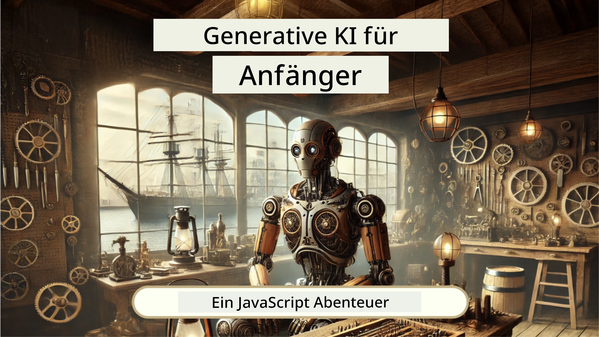
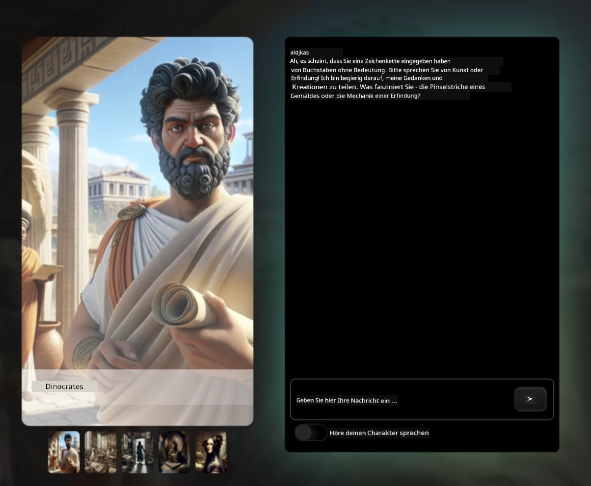
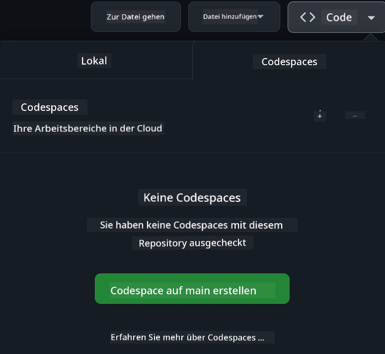

[](https://github.com/microsoft/Web-Dev-For-Beginners/blob/master/LICENSE)
[](https://GitHub.com/microsoft/Web-Dev-For-Beginners/graphs/contributors/)
[](https://GitHub.com/microsoft/Web-Dev-For-Beginners/issues/)
[](https://GitHub.com/microsoft/Web-Dev-For-Beginners/pulls/)
[](http://makeapullrequest.com) 

[](https://GitHub.com/microsoft/Web-Dev-For-Beginners/watchers/)
[](https://GitHub.com/microsoft/Web-Dev-For-Beginners/network/)
[](https://GitHub.com/microsoft/Web-Dev-For-Beginners/stargazers/)

[](https://discord.gg/nTYy5BXMWG)

# Webentwicklung für Anfänger - Ein Lehrplan

Lerne die Grundlagen der Webentwicklung mit unserem 12-wöchigen umfassenden Kurs von Microsoft Cloud Advocates. Jede der 24 Lektionen taucht durch praktische Projekte wie Terrarien, Browser-Erweiterungen und Weltraumspiele in JavaScript, CSS und HTML ein. Engagiere dich mit Quizzen, Diskussionen und praktischen Aufgaben. Verbessere deine Fähigkeiten und optimiere dein Wissensspeicherung mit unserer effektiven projektbasierten Pädagogik. Beginne noch heute deine Programmierreise!

Tritt der Azure AI Foundry Discord-Community bei

[](https://discord.gg/nTYy5BXMWG)

Folge diesen Schritten, um mit diesen Ressourcen zu starten:
1. **Forke das Repository**: Klicke [](https://GitHub.com/microsoft/Web-Dev-For-Beginners/fork)
2. **Klone das Repository**:   `git clone https://github.com/microsoft/Web-Dev-For-Beginners.git`
3. [**Tritt der Azure AI Foundry Discord bei und triff Experten sowie andere Entwickler**](https://discord.com/invite/ByRwuEEgH4)

### 🌐 Mehrsprachige Unterstützung

#### Unterstützt durch GitHub Action (Automatisiert & Immer Aktuell)

<!-- CO-OP TRANSLATOR LANGUAGES TABLE START -->
[Arabisch](../ar/README.md) | [Bengalisch](../bn/README.md) | [Bulgarisch](../bg/README.md) | [Birmanisch (Myanmar)](../my/README.md) | [Chinesisch (vereinfacht)](../zh-CN/README.md) | [Chinesisch (traditionell, Hongkong)](../zh-HK/README.md) | [Chinesisch (traditionell, Macau)](../zh-MO/README.md) | [Chinesisch (traditionell, Taiwan)](../zh-TW/README.md) | [Kroatisch](../hr/README.md) | [Tschechisch](../cs/README.md) | [Dänisch](../da/README.md) | [Niederländisch](../nl/README.md) | [Estnisch](../et/README.md) | [Finnisch](../fi/README.md) | [Französisch](../fr/README.md) | [Deutsch](./README.md) | [Griechisch](../el/README.md) | [Hebräisch](../he/README.md) | [Hindi](../hi/README.md) | [Ungarisch](../hu/README.md) | [Indonesisch](../id/README.md) | [Italienisch](../it/README.md) | [Japanisch](../ja/README.md) | [Kannada](../kn/README.md) | [Khmer](../km/README.md) | [Koreanisch](../ko/README.md) | [Litauisch](../lt/README.md) | [Malaiisch](../ms/README.md) | [Malayalam](../ml/README.md) | [Marathisch](../mr/README.md) | [Nepalesisch](../ne/README.md) | [Nigerianisches Pidgin](../pcm/README.md) | [Norwegisch](../no/README.md) | [Persisch (Farsi)](../fa/README.md) | [Polnisch](../pl/README.md) | [Portugiesisch (Brasilien)](../pt-BR/README.md) | [Portugiesisch (Portugal)](../pt-PT/README.md) | [Punjabi (Gurmukhi)](../pa/README.md) | [Rumänisch](../ro/README.md) | [Russisch](../ru/README.md) | [Serbisch (Kyrillisch)](../sr/README.md) | [Slowakisch](../sk/README.md) | [Slowenisch](../sl/README.md) | [Spanisch](../es/README.md) | [Suaheli](../sw/README.md) | [Schwedisch](../sv/README.md) | [Tagalog (Filipino)](../tl/README.md) | [Tamil](../ta/README.md) | [Telugu](../te/README.md) | [Thailändisch](../th/README.md) | [Türkisch](../tr/README.md) | [Ukrainisch](../uk/README.md) | [Urdu](../ur/README.md) | [Vietnamesisch](../vi/README.md)

> **Bevorzugst du das lokale Klonen?**
>
> Dieses Repository enthält über 50 Sprachübersetzungen, die die Downloadgröße erheblich erhöhen. Um ohne Übersetzungen zu klonen, nutze Sparse Checkout:
>
> **Bash / macOS / Linux:**
> ```bash
> git clone --filter=blob:none --sparse https://github.com/microsoft/Web-Dev-For-Beginners.git
> cd Web-Dev-For-Beginners
> git sparse-checkout set --no-cone '/*' '!translations' '!translated_images'
> ```
>
> **CMD (Windows):**
> ```cmd
> git clone --filter=blob:none --sparse https://github.com/microsoft/Web-Dev-For-Beginners.git
> cd Web-Dev-For-Beginners
> git sparse-checkout set --no-cone "/*" "!translations" "!translated_images"
> ```
>
> Dies gibt dir alles, was du brauchst, um den Kurs mit einem viel schnelleren Download abzuschließen.
<!-- CO-OP TRANSLATOR LANGUAGES TABLE END -->

**Wenn du zusätzliche Übersetzungen möchtest, findest du unterstützte Sprachen [hier](https://github.com/Azure/co-op-translator/blob/main/getting_started/supported-languages.md)**

[](https://open.vscode.dev/microsoft/Web-Dev-For-Beginners)

#### 🧑‍🎓 _Bist du Student?_

Besuche die [**Student Hub-Seite**](https://docs.microsoft.com/learn/student-hub/?WT.mc_id=academic-77807-sagibbon), wo du Anfängerressourcen, Studentenkits und sogar Möglichkeiten findest, einen kostenlosen Zertifikatsgutschein zu erhalten. Dies ist die Seite, die du bookmarken solltest und von Zeit zu Zeit überprüfst, da der Inhalt monatlich aktualisiert wird.

### 📣 Ankündigung – Neue Herausforderungen im GitHub Copilot Agent-Modus zum Abschließen!

Neue Herausforderung hinzugefügt, suche nach „GitHub Copilot Agent Challenge 🚀“ in den meisten Kapiteln. Das ist eine neue Herausforderung für dich, die du mit GitHub Copilot und dem Agent-Modus abschließen kannst. Falls du den Agent-Modus noch nicht benutzt hast: Er kann nicht nur Text generieren, sondern auch Dateien erstellen und bearbeiten, Befehle ausführen und mehr.

### 📣 Ankündigung – _Neues Projekt zum Erstellen mit generativer KI_

Neues AI Assistant-Projekt gerade hinzugefügt, schau es dir an [Projekt](./9-chat-project/README.md)

### 📣 Ankündigung – _Neuer Lehrplan_ zu generativer KI für JavaScript wurde gerade veröffentlicht

Verpasse nicht unseren neuen Lehrplan zur generativen KI!

Besuche [https://aka.ms/genai-js-course](https://aka.ms/genai-js-course), um loszulegen!



- Lektionen, die alles von den Grundlagen bis zu RAG abdecken.
- Interagiere mit historischen Persönlichkeiten mit GenAI und unserer Begleit-App.
- Spaßige und spannende Erzählung, du wirst durch die Zeit reisen!




Jede Lektion enthält eine Aufgabe, eine Wissensüberprüfung und eine Herausforderung, die dir beim Lernen von Themen wie:
- Prompting und Prompt-Engineering
- Text- und Bild-App-Generierung
- Such-Apps helfen

Besuche [https://aka.ms/genai-js-course](https://aka.ms/genai-js-course), um loszulegen!


## 🌱 Erste Schritte

> **Lehrer**, wir haben [einige Vorschläge](for-teachers.md) aufgenommen, wie dieser Lehrplan verwendet werden kann. Wir freuen uns auf dein Feedback [in unserem Diskussionsforum](https://github.com/microsoft/Web-Dev-For-Beginners/discussions/categories/teacher-corner)!

**[Lernende](https://aka.ms/student-page/?WT.mc_id=academic-77807-sagibbon)**, beginne jede Lektion mit einem Pre-Lecture-Quiz, arbeite dich durch die Vorlesungsmaterialien, erledige die verschiedenen Aktivitäten und überprüfe dein Verständnis mit dem Post-Lecture-Quiz.

Um dein Lernerlebnis zu verbessern, verbinde dich mit deinen Mitlernenden, um gemeinsam an den Projekten zu arbeiten! Diskussionen sind in unserem [Diskussionsforum](https://github.com/microsoft/Web-Dev-For-Beginners/discussions) erwünscht, wo unser Moderatoren-Team deine Fragen beantwortet.

Zur Vertiefung empfehlen wir dir, [Microsoft Learn](https://learn.microsoft.com/users/wirelesslife/collections/p1ddcy5jwy0jkm?WT.mc_id=academic-77807-sagibbon) für zusätzliche Lernmaterialien zu erkunden.

### 📋 Einrichtung deiner Entwicklungsumgebung

Dieser Lehrplan bietet eine sofort einsatzbereite Entwicklungsumgebung! Du kannst das Curriculum in einem [Codespace](https://github.com/features/codespaces/) (_einer browserbasierten, installationsfreien Umgebung_) oder lokal auf deinem Rechner mit einem Texteditor wie [Visual Studio Code](https://code.visualstudio.com/?WT.mc_id=academic-77807-sagibbon) ausführen.

#### Erstelle dein eigenes Repository
Damit du deine Arbeit einfach speichern kannst, wird empfohlen, eine eigene Kopie dieses Repositorys zu erstellen. Klicke dazu auf die Schaltfläche **Use this template** oben auf der Seite. Dadurch wird ein neues Repository in deinem GitHub-Konto mit einer Kopie des Lehrplans erstellt.

Folge diesen Schritten:
1. **Forke das Repository**: Klicke oben rechts auf dieser Seite auf die Schaltfläche „Fork“.
2. **Klone das Repository**:   `git clone https://github.com/microsoft/Web-Dev-For-Beginners.git`

#### Ausführen des Lehrplans in einem Codespace

Klicke in deiner kopierten Version dieses Repositorys auf die Schaltfläche **Code** und wähle **Open with Codespaces**. Dadurch wird ein neuer Codespace für dich erstellt, in dem du arbeiten kannst.



#### Lokal auf deinem Computer ausführen

Um diesen Lehrplan lokal auf deinem Computer auszuführen, benötigst du einen Texteditor, einen Browser und ein Kommandozeilentool. Unsere erste Lektion, [Einführung in Programmiersprachen und Tools](../../1-getting-started-lessons/1-intro-to-programming-languages), führt dich durch verschiedene Optionen für jedes dieser Werkzeuge, damit du das Beste für dich auswählen kannst.

Wir empfehlen die Verwendung von [Visual Studio Code](https://code.visualstudio.com/?WT.mc_id=academic-77807-sagibbon) als Editor, das auch ein integriertes [Terminal](https://code.visualstudio.com/docs/terminal/basics/?WT.mc_id=academic-77807-sagibbon) bietet. Du kannst Visual Studio Code [hier herunterladen](https://code.visualstudio.com/?WT.mc_id=academic-77807-sagibbon).
1. Klonen Sie Ihr Repository auf Ihren Computer. Sie können dies tun, indem Sie auf die Schaltfläche **Code** klicken und die URL kopieren:

    [CodeSpace](./images/createcodespace.png)

    Öffnen Sie dann das [Terminal](https://code.visualstudio.com/docs/terminal/basics/?WT.mc_id=academic-77807-sagibbon) innerhalb von [Visual Studio Code](https://code.visualstudio.com/?WT.mc_id=academic-77807-sagibbon) und führen Sie den folgenden Befehl aus, wobei Sie `<your-repository-url>` durch die gerade kopierte URL ersetzen:

    ```bash 
    git clone <your-repository-url>
    ```

2. Öffnen Sie den Ordner in Visual Studio Code. Sie können dies tun, indem Sie **Datei** > **Ordner öffnen** klicken und den gerade geklonten Ordner auswählen.


>  Empfohlene Erweiterungen für Visual Studio Code:
>
> * [Live Server](https://marketplace.visualstudio.com/items?itemName=ritwickdey.LiveServer&WT.mc_id=academic-77807-sagibbon) - zum Vorschau von HTML-Seiten innerhalb von Visual Studio Code
> * [Copilot](https://marketplace.visualstudio.com/items?itemName=GitHub.copilot&WT.mc_id=academic-77807-sagibbon) - um Ihnen zu helfen, Code schneller zu schreiben

## 📂 Jede Lektion beinhaltet:

- optionale Sketchnote
- optionales ergänzendes Video
- Aufwärmquiz vor der Lektion
- schriftliche Lektion
- für projektbasierte Lektionen Schritt-für-Schritt-Anleitungen zum Erstellen des Projekts
- Wissenschecks
- eine Herausforderung
- ergänzende Lektüre
- Aufgabe
- [Quiz nach der Lektion](https://ff-quizzes.netlify.app/web/)

> **Ein Hinweis zu den Quizzen**: Alle Quizze befinden sich im Ordner Quiz-app, insgesamt 48 Quizze mit jeweils drei Fragen. Sie sind [hier](https://ff-quizzes.netlify.app/web/) verfügbar, die Quiz-App kann lokal ausgeführt oder auf Azure bereitgestellt werden; folgen Sie den Anweisungen im Ordner `quiz-app`.

## 🗃️ Lektionen

|     |                       Projektname                       |                            Vermittelte Konzepte                             | Lernziele                                                                                                                 |                                                         Verknüpfte Lektion                                                          |         Autor          |
| :-: | :------------------------------------------------------: | :--------------------------------------------------------------------: | ----------------------------------------------------------------------------------------------------------------------------------- | :----------------------------------------------------------------------------------------------------------------------------: | :---------------------: |
| 01  |                     Einstieg                             |           Einführung in Programmierung und Werkzeuge der Branche           | Lernen Sie die Grundlagen der meisten Programmiersprachen und Software kennen, die professionelle Entwickler bei ihrer Arbeit unterstützt | [Einführung in Programmiersprachen und Werkzeuge der Branche](./1-getting-started-lessons/1-intro-to-programming-languages/README.md) |         Jasmine         |
| 02  |                     Einstieg                             |             Grundlagen von GitHub, inklusive Teamarbeit             | Wie man GitHub im eigenen Projekt verwendet, wie man mit anderen an einer Codebasis zusammenarbeitet                                                    |                            [Einführung in GitHub](./1-getting-started-lessons/2-github-basics/README.md)                             |          Floor          |
| 03  |                     Einstieg                             |                             Zugänglichkeit                              | Lernen Sie die Grundlagen der Barrierefreiheit im Web                                                                                               |                       [Grundlagen der Zugänglichkeit](./1-getting-started-lessons/3-accessibility/README.md)                       |       Christopher       |
| 04  |                        JS Grundlagen                         |                         JavaScript-Datentypen                          | Die Grundlagen von JavaScript-Datentypen                                                                                                 |                                       [Datentypen](./2-js-basics/1-data-types/README.md)                                        |         Jasmine         |
| 05  |                        JS Grundlagen                         |                         Funktionen und Methoden                          | Lernen Sie Funktionen und Methoden kennen, um den Anwendungslogikfluss zu steuern                                                             |                              [Funktionen und Methoden](./2-js-basics/2-functions-methods/README.md)                               | Jasmine und Christopher |
| 06  |                        JS Grundlagen                         |                        Entscheidungen treffen mit JS                        | Lernen Sie, wie Sie Bedingungen in Ihrem Code mit Entscheidungsstrukturen erstellen                                                           |                                 [Entscheidungen treffen](./2-js-basics/3-making-decisions/README.md)                                  |         Jasmine         |
| 07  |                        JS Grundlagen                         |                            Arrays und Schleifen                            | Arbeiten Sie mit Daten unter Verwendung von Arrays und Schleifen in JavaScript                                                                                 |                                   [Arrays und Schleifen](./2-js-basics/4-arrays-loops/README.md)                                    |         Jasmine         |
| 08  |       [Terrarium](./3-terrarium/solution/README.md)       |                            HTML in der Praxis                            | Erstellen Sie das HTML, um ein Online-Terrarium zu bauen, mit Fokus auf das Layout                                                         |                                 [Einführung in HTML](./3-terrarium/1-intro-to-html/README.md)                                 |           Jen           |
| 09  |       [Terrarium](./3-terrarium/solution/README.md)       |                            CSS in der Praxis                             | Erstellen Sie das CSS, um das Online-Terrarium zu stylen, mit Fokus auf grundlegendes CSS einschließlich responsivem Design                     |                                  [Einführung in CSS](./3-terrarium/2-intro-to-css/README.md)                                  |           Jen           |
| 10  |            [Terrarium](./3-terrarium/solution/README.md)            |                 JavaScript Closures, DOM-Manipulation                  | Erstellen Sie das JavaScript, um das Terrarium als Drag & Drop-Schnittstelle funktionsfähig zu machen, mit Fokus auf Closures und DOM-Manipulation             |                  [JavaScript Closures, DOM-Manipulation](./3-terrarium/3-intro-to-DOM-and-closures/README.md)                   |           Jen           |
| 11  |          [Tipp-Spiel](./4-typing-game/solution/README.md)          |                          Erstellen eines Tipp-Spiels                           | Lernen Sie, wie Sie Tastaturereignisse verwenden, um die Logik Ihrer JavaScript-App zu steuern                                                          |                                [Ereignisgesteuerte Programmierung](./4-typing-game/typing-game/README.md)                                |       Christopher       |
| 12  | [Grünes Browser-Addon](./5-browser-extension/solution/README.md) |                         Arbeiten mit Browsern                          | Lernen Sie, wie Browser funktionieren, deren Geschichte und wie Sie die ersten Elemente eines Browser-Addons vorbereiten                               |                               [Über Browser](./5-browser-extension/1-about-browsers/README.md)                                |           Jen           |
| 13  | [Grünes Browser-Addon](./5-browser-extension/solution/README.md) | Formularerstellung, API-Aufrufe und lokale Speicherung von Variablen | Erstellen Sie die JavaScript-Elemente Ihres Browser-Addons, um eine API über in localStorage gespeicherte Variablen aufzurufen                      |                [APIs, Formulare und lokale Speicherung](./5-browser-extension/2-forms-browsers-local-storage/README.md)                 |           Jen           |
| 14  | [Grünes Browser-Addon](./5-browser-extension/solution/README.md) |          Hintergrundprozesse im Browser, Web-Performance          | Verwenden Sie die Hintergrundprozesse des Browsers zur Verwaltung des Erweiterungssymbols; lernen Sie Web-Performance und Optimierungen kennen   |             [Hintergrundaufgaben und Performance](./5-browser-extension/3-background-tasks-and-performance/README.md)              |           Jen           |
| 15  |           [Weltraumspiel](./6-space-game/solution/README.md)           |             Fortgeschrittene Spieleentwicklung mit JavaScript             | Lernen Sie Vererbung anhand von Klassen und Komposition sowie das Pub/Sub-Muster kennen, als Vorbereitung auf die Spieleentwicklung              |                      [Einführung in die fortgeschrittene Spieleentwicklung](./6-space-game/1-introduction/README.md)                       |          Chris          |
| 16  |           [Weltraumspiel](./6-space-game/solution/README.md)           |                           Zeichnen auf der Leinwand                            | Lernen Sie die Canvas-API kennen, die zum Zeichnen von Elementen auf einem Bildschirm verwendet wird                                                                       |                                [Zeichnen auf der Leinwand](./6-space-game/2-drawing-to-canvas/README.md)                                |          Chris          |
| 17  |           [Weltraumspiel](./6-space-game/solution/README.md)           |                   Bewegungen von Elementen auf dem Bildschirm                    | Entdecken Sie, wie Elemente durch kartesische Koordinaten und die Canvas-API Bewegung erhalten                                            |                           [Bewegung von Elementen](./6-space-game/3-moving-elements-around/README.md)                           |          Chris          |
| 18  |           [Weltraumspiel](./6-space-game/solution/README.md)           |                          Kollisions-Erkennung                           | Lassen Sie Elemente kollidieren und aufeinander reagieren, verwenden Sie Tastendrücke und eine Cooldown-Funktion, um die Performance des Spiels sicherzustellen    |                              [Kollisionserkennung](./6-space-game/4-collision-detection/README.md)                              |          Chris          |
| 19  |           [Weltraumspiel](./6-space-game/solution/README.md)           |                             Punktestand führen                              | Führen Sie mathematische Berechnungen basierend auf dem Spielstatus und der Performance durch                                                                |                                    [Punktestand führen](./6-space-game/5-keeping-score/README.md)                                    |          Chris          |
| 20  |           [Weltraumspiel](./6-space-game/solution/README.md)           |                     Spiel beenden und neu starten                     | Lernen Sie, wie man ein Spiel beendet und neu startet, einschließlich Aufräumen von Assets und Zurücksetzen von Variablen                              |                                [Die Endbedingung](./6-space-game/6-end-condition/README.md)                                 |          Chris          |
| 21  |         [Banking App](./7-bank-project/solution/README.md)          |                 HTML-Vorlagen und Routen in einer Web-App                 | Lernen Sie, wie das Grundgerüst einer mehrseitigen Website mit Routing und HTML-Vorlagen erstellt wird                             |                            [HTML-Vorlagen und Routing](./7-bank-project/1-template-route/README.md)                             |          Yohan          |
| 22  |         [Banking App](./7-bank-project/solution/README.md)          |                  Login- und Registrierungsformular erstellen                   | Lernen Sie, wie man Formulare erstellt und Validierungsroutinen handhabt                                                                          |                                           [Formulare](./7-bank-project/2-forms/README.md)                                           |          Yohan          |
| 23  |         [Banking App](./7-bank-project/solution/README.md)          |                   Methoden zum Abrufen und Verwenden von Daten                   | Wie Daten in die App hinein- und herausfließen, wie sie abgerufen, gespeichert und entsorgt werden                                                 |                                            [Daten](./7-bank-project/3-data/README.md)                                            |          Yohan          |
| 24  |         [Banking App](./7-bank-project/solution/README.md)          |                      Konzepte des Zustandsmanagements                      | Lernen Sie, wie Ihre App den Zustand beibehält und diesen programmatisch verwaltet                                                              |                                [Zustandsmanagement](./7-bank-project/4-state-management/README.md)                                |          Yohan          |
| 25 | [Browser/VScode Code](../../8-code-editor) | Arbeiten mit VScode | Lernen Sie, wie man einen Code-Editor benutzt | [VScode Code Editor verwenden](./8-code-editor/1-using-a-code-editor/README.md) | Chris |
| 26 | [KI-Assistenten](./9-chat-project/README.md) | Arbeiten mit KI | Lernen Sie, wie Sie Ihren eigenen KI-Assistenten bauen | [KI-Assistenten-Projekt](./9-chat-project/README.md) | Chris |

## 🏫 Pädagogik

Unser Lehrplan basiert auf zwei wichtigen pädagogischen Prinzipien:
* projektbasiertes Lernen
* häufige Quizze

Das Programm vermittelt die Grundlagen von JavaScript, HTML und CSS sowie die neuesten Werkzeuge und Techniken, die heutige Webentwickler verwenden. Die Lernenden haben die Möglichkeit, praktische Erfahrungen zu sammeln, indem sie ein Tipp-Spiel, ein virtuelles Terrarium, eine umweltfreundliche Browsererweiterung, ein Weltraum-Invasoren-Spiel und eine Banking-App für Unternehmen erstellen. Am Ende der Reihe verfügen die Lernenden über ein solides Verständnis der Webentwicklung.

> 🎓 Sie können die ersten Lektionen dieses Lehrplans als [Lernpfad](https://docs.microsoft.com/learn/paths/web-development-101/?WT.mc_id=academic-77807-sagibbon) bei Microsoft Learn absolvieren!

Durch die Ausrichtung der Inhalte an Projekten wird der Prozess für die Lernenden ansprechender gestaltet und das Behalten der Konzepte verbessert. Wir haben auch mehrere Einstiegslektionen zu den Grundlagen von JavaScript geschrieben, um Konzepte vorzustellen, begleitet von einem Video aus der "[Beginners Series to: JavaScript](https://channel9.msdn.com/Series/Beginners-Series-to-JavaScript/?WT.mc_id=academic-77807-sagibbon)" Video-Tutorial-Sammlung, zu dessen Autoren einige zum Lehrplan beigetragen haben.

Zudem setzt ein niedrigschwelliges Quiz vor der Lektion die Lernabsicht der Teilnehmer und ein zweites Quiz nach der Lektion sorgt für vertiefte Behaltensleistung. Dieser Lehrplan wurde so gestaltet, dass er flexibel und unterhaltsam ist und ganz oder teilweise absolviert werden kann. Die Projekte beginnen klein und werden bis zum Ende des 12-Wochen-Zyklus zunehmend komplexer.

Während wir bewusst darauf verzichtet haben, JavaScript-Frameworks einzuführen, um die grundlegenden Fähigkeiten als Webentwickler vor der Einführung eines Frameworks zu vermitteln, wäre ein guter nächster Schritt nach Abschluss dieses Lehrplans das Lernen über Node.js mittels einer weiteren Videosammlung: "[Beginner Series to: Node.js](https://channel9.msdn.com/Series/Beginners-Series-to-Nodejs/?WT.mc_id=academic-77807-sagibbon)".

> Besuchen Sie unsere [Verhaltensrichtlinien](CODE_OF_CONDUCT.md) und [Beitragsrichtlinien](CONTRIBUTING.md). Wir freuen uns über Ihr konstruktives Feedback!


## 🧭 Offline-Zugriff

Sie können diese Dokumentation offline mit [Docsify](https://docsify.js.org/#/) ausführen. Forken Sie dieses Repository, [installieren Sie Docsify](https://docsify.js.org/#/quickstart) auf Ihrem lokalen Rechner und geben Sie dann im Stammverzeichnis dieses Repos `docsify serve` ein. Die Website wird lokal auf Port 3000 bereitgestellt: `localhost:3000`.

## 📘 PDF
Ein PDF aller Lektionen kann [hier](https://microsoft.github.io/Web-Dev-For-Beginners/pdf/readme.pdf) gefunden werden.


## 🎒 Andere Kurse

Unser Team produziert weitere Kurse! Schau dir an:

<!-- CO-OP TRANSLATOR OTHER COURSES START -->
### LangChain
[](https://aka.ms/langchain4j-for-beginners)
[](https://aka.ms/langchainjs-for-beginners?WT.mc_id=m365-94501-dwahlin)
[](https://github.com/microsoft/langchain-for-beginners?WT.mc_id=m365-94501-dwahlin)
---

### Azure / Edge / MCP / Agents
[](https://github.com/microsoft/AZD-for-beginners?WT.mc_id=academic-105485-koreyst)
[](https://github.com/microsoft/edgeai-for-beginners?WT.mc_id=academic-105485-koreyst)
[](https://github.com/microsoft/mcp-for-beginners?WT.mc_id=academic-105485-koreyst)
[](https://github.com/microsoft/ai-agents-for-beginners?WT.mc_id=academic-105485-koreyst)

---
 
### Generative AI Serie
[](https://github.com/microsoft/generative-ai-for-beginners?WT.mc_id=academic-105485-koreyst)
[-9333EA?style=for-the-badge&labelColor=E5E7EB&color=9333EA)](https://github.com/microsoft/Generative-AI-for-beginners-dotnet?WT.mc_id=academic-105485-koreyst)
[-C084FC?style=for-the-badge&labelColor=E5E7EB&color=C084FC)](https://github.com/microsoft/generative-ai-for-beginners-java?WT.mc_id=academic-105485-koreyst)
[-E879F9?style=for-the-badge&labelColor=E5E7EB&color=E879F9)](https://github.com/microsoft/generative-ai-with-javascript?WT.mc_id=academic-105485-koreyst)

---
 
### Kernlernen
[](https://aka.ms/ml-beginners?WT.mc_id=academic-105485-koreyst)
[](https://aka.ms/datascience-beginners?WT.mc_id=academic-105485-koreyst)
[](https://aka.ms/ai-beginners?WT.mc_id=academic-105485-koreyst)
[](https://github.com/microsoft/Security-101?WT.mc_id=academic-96948-sayoung)
[](https://aka.ms/webdev-beginners?WT.mc_id=academic-105485-koreyst)
[](https://aka.ms/iot-beginners?WT.mc_id=academic-105485-koreyst)
[](https://github.com/microsoft/xr-development-for-beginners?WT.mc_id=academic-105485-koreyst)

---
 
### Copilot Serie
[](https://aka.ms/GitHubCopilotAI?WT.mc_id=academic-105485-koreyst)
[](https://github.com/microsoft/mastering-github-copilot-for-dotnet-csharp-developers?WT.mc_id=academic-105485-koreyst)
[](https://github.com/microsoft/CopilotAdventures?WT.mc_id=academic-105485-koreyst)
<!-- CO-OP TRANSLATOR OTHER COURSES END -->

## Hilfe erhalten

Wenn du feststeckst oder Fragen zum Erstellen von KI-Apps hast. Tritt mit anderen Lernenden und erfahrenen Entwicklern in Diskussionen über MCP ein. Es ist eine unterstützende Gemeinschaft, in der Fragen willkommen sind und Wissen frei geteilt wird.

[](https://discord.gg/nTYy5BXMWG)

Wenn du Produktfeedback oder Fehler beim Erstellen hast, besuche:

[](https://aka.ms/foundry/forum)

## Lizenz

Dieses Repository ist unter der MIT-Lizenz lizenziert. Siehe die [LICENSE](../../LICENSE)-Datei für weitere Informationen.

---

<!-- CO-OP TRANSLATOR DISCLAIMER START -->
**Haftungsausschluss**:  
Dieses Dokument wurde mithilfe des KI-Übersetzungsdienstes [Co-op Translator](https://github.com/Azure/co-op-translator) übersetzt. Obwohl wir auf Genauigkeit achten, beachten Sie bitte, dass automatisierte Übersetzungen Fehler oder Ungenauigkeiten enthalten können. Das Originaldokument in seiner Ursprungssprache ist als maßgebliche Quelle zu betrachten. Für kritische Informationen wird eine professionelle menschliche Übersetzung empfohlen. Wir übernehmen keine Haftung für Missverständnisse oder Fehlinterpretationen, die aus der Verwendung dieser Übersetzung entstehen.
<!-- CO-OP TRANSLATOR DISCLAIMER END -->