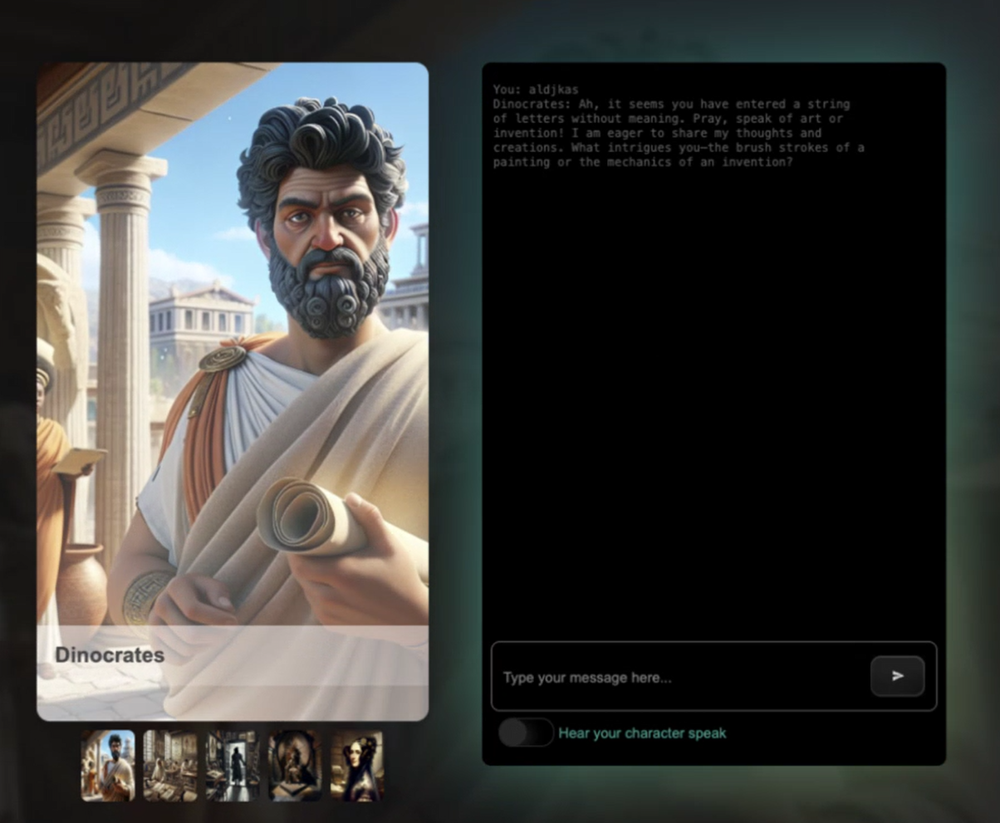

<!--
CO_OP_TRANSLATOR_METADATA:
{
  "original_hash": "efa251c5fc089367f0a81c572874afca",
  "translation_date": "2025-08-28T10:58:58+00:00",
  "source_file": "README.md",
  "language_code": "de"
}
-->
[](https://github.com/microsoft/Web-Dev-For-Beginners/blob/master/LICENSE)  
[](https://GitHub.com/microsoft/Web-Dev-For-Beginners/graphs/contributors/)  
[](https://GitHub.com/microsoft/Web-Dev-For-Beginners/issues/)  
[](https://GitHub.com/microsoft/Web-Dev-For-Beginners/pulls/)  
[](http://makeapullrequest.com)  

[](https://GitHub.com/microsoft/Web-Dev-For-Beginners/watchers/)  
[](https://GitHub.com/microsoft/Web-Dev-For-Beginners/network/)  
[](https://GitHub.com/microsoft/Web-Dev-For-Beginners/stargazers/)  

[](https://discord.gg/zxKYvhSnVp?WT.mc_id=academic-000002-leestott)  

[](https://open.vscode.dev/microsoft/Web-Dev-For-Beginners)  

[](https://discord.com/invite/ByRwuEEgH4)  

Folgen Sie diesen Schritten, um mit diesen Ressourcen zu beginnen:  
1. **Repository forken**: Klicken Sie [](https://GitHub.com/microsoft/Web-Dev-For-Beginners/fork)  
2. **Repository klonen**:   `git clone https://github.com/microsoft/Web-Dev-For-Beginners.git`  
3. [**Treten Sie dem Azure AI Foundry Discord bei und treffen Sie Experten und andere Entwickler**](https://discord.com/invite/ByRwuEEgH4)  

# Webentwicklung für Anfänger – Ein Lehrplan  

Lernen Sie die Grundlagen der Webentwicklung mit unserem 12-wöchigen umfassenden Kurs von Microsoft Cloud Advocates. Jede der 24 Lektionen behandelt JavaScript, CSS und HTML durch praktische Projekte wie Terrarien, Browser-Erweiterungen und Weltraumspiele. Nehmen Sie an Quizfragen, Diskussionen und praktischen Aufgaben teil. Verbessern Sie Ihre Fähigkeiten und optimieren Sie Ihr Wissen mit unserer effektiven projektbasierten Pädagogik. Beginnen Sie Ihre Programmierreise noch heute!  

#### 🧑‍🎓 _Sind Sie ein Student?_  

Besuchen Sie die [**Student Hub Seite**](https://docs.microsoft.com/learn/student-hub/?WT.mc_id=academic-77807-sagibbon), auf der Sie Ressourcen für Anfänger, Studentenpakete und sogar Möglichkeiten finden, einen kostenlosen Zertifikatsgutschein zu erhalten. Dies ist die Seite, die Sie als Lesezeichen speichern und regelmäßig besuchen sollten, da wir den Inhalt monatlich wechseln.  

### 📣 Ankündigung - _Neuer Lehrplan_ zu Generativer KI für JavaScript wurde gerade veröffentlicht  

Verpassen Sie nicht unseren neuen Lehrplan zur Generativen KI!  

Besuchen Sie [https://aka.ms/genai-js-course](https://aka.ms/genai-js-course), um loszulegen!  

  

- Lektionen, die alles von den Grundlagen bis zu RAG abdecken.  
- Interagieren Sie mit historischen Charakteren mithilfe von GenAI und unserer Begleit-App.  
- Spaßige und fesselnde Erzählung – Sie werden durch die Zeit reisen!  

  

Jede Lektion enthält eine Aufgabe, ein Wissensquiz und eine Herausforderung, um Themen wie folgende zu lernen:  
- Prompting und Prompt-Engineering  
- Text- und Bild-App-Generierung  
- Such-Apps  

Besuchen Sie [https://aka.ms/genai-js-course](../../[https:/aka.ms/genai-js-course), um loszulegen!  

## 🌱 Erste Schritte  

> **Lehrer**, wir haben [einige Vorschläge](for-teachers.md) hinzugefügt, wie Sie diesen Lehrplan nutzen können. Wir freuen uns über Ihr Feedback [in unserem Diskussionsforum](https://github.com/microsoft/Web-Dev-For-Beginners/discussions/categories/teacher-corner)!  

**[Lernende](https://aka.ms/student-page/?WT.mc_id=academic-77807-sagibbon)**, beginnen Sie jede Lektion mit einem Quiz vor der Vorlesung und fahren Sie mit dem Lesen des Vorlesungsmaterials fort, indem Sie die verschiedenen Aktivitäten abschließen und Ihr Verständnis mit dem Quiz nach der Vorlesung überprüfen.  

Um Ihr Lernerlebnis zu verbessern, verbinden Sie sich mit Ihren Mitlernenden, um gemeinsam an den Projekten zu arbeiten! Diskussionen sind in unserem [Diskussionsforum](https://github.com/microsoft/Web-Dev-For-Beginners/discussions) willkommen, wo unser Team von Moderatoren Ihre Fragen beantworten wird.  

Um Ihre Ausbildung weiterzuführen, empfehlen wir Ihnen dringend, [Microsoft Learn](https://learn.microsoft.com/users/wirelesslife/collections/p1ddcy5jwy0jkm?WT.mc_id=academic-77807-sagibbon) für zusätzliche Lernmaterialien zu erkunden.  

### 📋 Einrichten Ihrer Umgebung  

Dieser Lehrplan hat eine einsatzbereite Entwicklungsumgebung! Wenn Sie beginnen, können Sie den Lehrplan entweder in einem [Codespace](https://github.com/features/codespaces/) (_eine browserbasierte Umgebung, die keine Installationen erfordert_) oder lokal auf Ihrem Computer mit einem Texteditor wie [Visual Studio Code](https://code.visualstudio.com/?WT.mc_id=academic-77807-sagibbon) ausführen.  

#### Erstellen Sie Ihr Repository  
Um Ihre Arbeit einfach zu speichern, wird empfohlen, eine eigene Kopie dieses Repositorys zu erstellen. Sie können dies tun, indem Sie oben auf der Seite die Schaltfläche **Use this template** klicken. Dadurch wird ein neues Repository in Ihrem GitHub-Konto mit einer Kopie des Lehrplans erstellt.  

Folgen Sie diesen Schritten:  
1. **Repository forken**: Klicken Sie auf die Schaltfläche "Fork" oben rechts auf dieser Seite.  
2. **Repository klonen**:   `git clone https://github.com/microsoft/Web-Dev-For-Beginners.git`  

#### Ausführen des Lehrplans in einem Codespace  

In Ihrer Kopie dieses Repositorys, die Sie erstellt haben, klicken Sie auf die Schaltfläche **Code** und wählen **Open with Codespaces**. Dadurch wird ein neuer Codespace erstellt, in dem Sie arbeiten können.  

[!Codespace](../..)./images/createcodespace.png)  

#### Ausführen des Lehrplans lokal auf Ihrem Computer  

Um diesen Lehrplan lokal auf Ihrem Computer auszuführen, benötigen Sie einen Texteditor, einen Browser und ein Befehlszeilentool. Unsere erste Lektion, [Einführung in Programmiersprachen und Werkzeuge](../../1-getting-started-lessons/1-intro-to-programming-languages), führt Sie durch verschiedene Optionen für jedes dieser Werkzeuge, damit Sie auswählen können, was am besten für Sie funktioniert.  

Unsere Empfehlung ist die Verwendung von [Visual Studio Code](https://code.visualstudio.com/?WT.mc_id=academic-77807-sagibbon) als Editor, der auch ein integriertes [Terminal](https://code.visualstudio.com/docs/terminal/basics/?WT.mc_id=academic-77807-sagibbon) enthält. Sie können Visual Studio Code [hier herunterladen](https://code.visualstudio.com/?WT.mc_id=academic-77807-sagibbon).  

1. Klonen Sie Ihr Repository auf Ihren Computer. Sie können dies tun, indem Sie auf die Schaltfläche **Code** klicken und die URL kopieren:  

    [!CodeSpace](./images/createcodespace.png)  

    Öffnen Sie dann [Terminal](https://code.visualstudio.com/docs/terminal/basics/?WT.mc_id=academic-77807-sagibbon) innerhalb von [Visual Studio Code](https://code.visualstudio.com/?WT.mc_id=academic-77807-sagibbon) und führen Sie den folgenden Befehl aus, wobei Sie `<your-repository-url>` durch die gerade kopierte URL ersetzen:  

    ```bash 
    git clone <your-repository-url>
    ```  

2. Öffnen Sie den Ordner in Visual Studio Code. Sie können dies tun, indem Sie auf **Datei** > **Ordner öffnen** klicken und den gerade geklonten Ordner auswählen.  

>  Empfohlene Visual Studio Code-Erweiterungen:  
>  
> * [Live Server](https://marketplace.visualstudio.com/items?itemName=ritwickdey.LiveServer&WT.mc_id=academic-77807-sagibbon) - um HTML-Seiten direkt in Visual Studio Code anzuzeigen  
> * [Copilot](https://marketplace.visualstudio.com/items?itemName=GitHub.copilot&WT.mc_id=academic-77807-sagibbon) - um schneller Code zu schreiben  

## 📂 Jede Lektion enthält:  

- optionale Sketchnote  
- optionales ergänzendes Video  
- Quiz zur Vorbereitung auf die Lektion  
- schriftliche Lektion  
- für projektbasierte Lektionen, Schritt-für-Schritt-Anleitungen zum Erstellen des Projekts  
- Wissensüberprüfungen  
- eine Herausforderung  
- ergänzende Lektüre  
- Aufgabe  
- [Quiz nach der Lektion](https://ff-quizzes.netlify.app/)  

> **Hinweis zu den Quizfragen**: Alle Quizfragen befinden sich im Ordner Quiz-app, insgesamt 48 Quizfragen mit jeweils drei Fragen. Sie sind [hier](https://ff-quizzes.netlify.app/) verfügbar. Die Quiz-App kann lokal ausgeführt oder auf Azure bereitgestellt werden; folgen Sie den Anweisungen im `quiz-app`-Ordner.  

## 🗃️ Lektionen  

|     |                       Projektname                       |                            Vermittelte Konzepte                            | Lernziele                                                                                                                           |                                                         Verlinkte Lektion                                                          |         Autor          |  
| :-: | :------------------------------------------------------: | :-----------------------------------------------------------------------: | ----------------------------------------------------------------------------------------------------------------------------------- | :----------------------------------------------------------------------------------------------------------------------------: | :---------------------: |  
| 01  |                     Erste Schritte                      |           Einführung in Programmiersprachen und Werkzeuge                  | Lernen Sie die grundlegenden Prinzipien der meisten Programmiersprachen und über Software, die professionelle Entwickler nutzen      | [Einführung in Programmiersprachen und Werkzeuge](./1-getting-started-lessons/1-intro-to-programming-languages/README.md)        |         Jasmine         |  
| 02  |                     Erste Schritte                      |             Grundlagen von GitHub, einschließlich Teamarbeit               | Wie man GitHub in einem Projekt verwendet und mit anderen an einem Code-Basis zusammenarbeitet                                      |                            [Einführung in GitHub](./1-getting-started-lessons/2-github-basics/README.md)                          |          Floor          |  
| 03  |                     Erste Schritte                      |                             Barrierefreiheit                              | Lernen Sie die Grundlagen der Barrierefreiheit im Web                                                                               |                       [Grundlagen der Barrierefreiheit](./1-getting-started-lessons/3-accessibility/README.md)                   |       Christopher       |  
| 04  |                        JS Grundlagen                    |                         JavaScript-Datentypen                             | Die Grundlagen der JavaScript-Datentypen                                                                                           |                                       [Datentypen](./2-js-basics/1-data-types/README.md)                                          |         Jasmine         |  
| 05  |                        JS Grundlagen                    |                         Funktionen und Methoden                           | Lernen Sie Funktionen und Methoden kennen, um den Logikfluss einer Anwendung zu steuern                                             |                              [Funktionen und Methoden](./2-js-basics/2-functions-methods/README.md)                               | Jasmine und Christopher |  
| 06  |                        JS Grundlagen                    |                        Entscheidungen mit JS treffen                      | Lernen Sie, wie Sie Bedingungen in Ihrem Code mit Entscheidungsfindungsmethoden erstellen                                          |                                 [Entscheidungen treffen](./2-js-basics/3-making-decisions/README.md)                              |         Jasmine         |  
| 07  |                        JS Grundlagen                    |                            Arrays und Schleifen                           | Arbeiten Sie mit Daten mithilfe von Arrays und Schleifen in JavaScript                                                              |                                   [Arrays und Schleifen](./2-js-basics/4-arrays-loops/README.md)                                  |         Jasmine         |  
| 08  |       [Terrarium](./3-terrarium/solution/README.md)       |                            HTML in der Praxis                             | Erstellen Sie das HTML, um ein Online-Terrarium zu bauen, mit Fokus auf das Layout                                                  |                                 [Einführung in HTML](./3-terrarium/1-intro-to-html/README.md)                                     |           Jen           |  
| 09  |       [Terrarium](./3-terrarium/solution/README.md)       |                            CSS in der Praxis                              | Erstellen Sie das CSS, um das Online-Terrarium zu gestalten, mit Fokus auf die Grundlagen von CSS, einschließlich responsivem Design |                                  [Einführung in CSS](./3-terrarium/2-intro-to-css/README.md)                                      |           Jen           |  
| 10  |            [Terrarium](./3-terrarium/solution/README.md)            |                 JavaScript Closures, DOM-Manipulation                  | Entwickle das JavaScript, um das Terrarium als Drag-and-Drop-Oberfläche funktionsfähig zu machen, mit Fokus auf Closures und DOM-Manipulation             |                  [JavaScript Closures, DOM-Manipulation](./3-terrarium/3-intro-to-DOM-and-closures/README.md)                   |           Jen           |
| 11  |          [Typing Game](./4-typing-game/solution/README.md)          |                          Ein Schreibspiel erstellen                           | Lerne, wie man Tastaturereignisse nutzt, um die Logik deiner JavaScript-App zu steuern                                                          |                                [Eventgesteuerte Programmierung](./4-typing-game/typing-game/README.md)                                |       Christopher       |
| 12  | [Green Browser Extension](./5-browser-extension/solution/README.md) |                         Arbeiten mit Browsern                          | Lerne, wie Browser funktionieren, ihre Geschichte und wie man die ersten Elemente einer Browser-Erweiterung erstellt                               |                               [Über Browser](./5-browser-extension/1-about-browsers/README.md)                                |           Jen           |
| 13  | [Green Browser Extension](./5-browser-extension/solution/README.md) | Ein Formular erstellen, eine API aufrufen und Variablen im lokalen Speicher speichern | Entwickle die JavaScript-Elemente deiner Browser-Erweiterung, um eine API mit Variablen aus dem lokalen Speicher aufzurufen                      |                [APIs, Formulare und lokaler Speicher](./5-browser-extension/2-forms-browsers-local-storage/README.md)                 |           Jen           |
| 14  | [Green Browser Extension](./5-browser-extension/solution/README.md) |          Hintergrundprozesse im Browser, Web-Performance          | Nutze die Hintergrundprozesse des Browsers, um das Symbol der Erweiterung zu verwalten; lerne über Web-Performance und einige Optimierungen   |             [Hintergrundaufgaben und Performance](./5-browser-extension/3-background-tasks-and-performance/README.md)              |           Jen           |
| 15  |           [Space Game](./6-space-game/solution/README.md)           |             Fortgeschrittene Spieleentwicklung mit JavaScript             | Lerne über Vererbung mit Klassen und Komposition sowie das Pub/Sub-Muster, als Vorbereitung auf die Entwicklung eines Spiels              |                      [Einführung in die fortgeschrittene Spieleentwicklung](./6-space-game/1-introduction/README.md)                       |          Chris          |
| 16  |           [Space Game](./6-space-game/solution/README.md)           |                           Zeichnen auf Canvas                            | Lerne über die Canvas-API, die verwendet wird, um Elemente auf einem Bildschirm zu zeichnen                                                                       |                                [Zeichnen auf Canvas](./6-space-game/2-drawing-to-canvas/README.md)                                |          Chris          |
| 17  |           [Space Game](./6-space-game/solution/README.md)           |                   Elemente auf dem Bildschirm bewegen                    | Entdecke, wie Elemente mit kartesischen Koordinaten und der Canvas-API Bewegung erhalten können                                            |                           [Elemente bewegen](./6-space-game/3-moving-elements-around/README.md)                           |          Chris          |
| 18  |           [Space Game](./6-space-game/solution/README.md)           |                          Kollisionserkennung                           | Lass Elemente miteinander kollidieren und aufeinander reagieren, indem du Tasteneingaben nutzt, und implementiere eine Abkühlfunktion, um die Leistung des Spiels sicherzustellen    |                              [Kollisionserkennung](./6-space-game/4-collision-detection/README.md)                              |          Chris          |
| 19  |           [Space Game](./6-space-game/solution/README.md)           |                             Punkte zählen                              | Führe mathematische Berechnungen basierend auf dem Status und der Leistung des Spiels durch                                                                |                                    [Punkte zählen](./6-space-game/5-keeping-score/README.md)                                    |          Chris          |
| 20  |           [Space Game](./6-space-game/solution/README.md)           |                     Das Spiel beenden und neu starten                     | Lerne, wie man ein Spiel beendet und neu startet, einschließlich der Bereinigung von Assets und dem Zurücksetzen von Variablenwerten                              |                                [Die Endbedingung](./6-space-game/6-end-condition/README.md)                                 |          Chris          |
| 21  |         [Banking App](./7-bank-project/solution/README.md)          |                 HTML-Vorlagen und Routen in einer Web-App                 | Lerne, wie man das Gerüst der Architektur einer mehrseitigen Website mit Routing und HTML-Vorlagen erstellt                             |                            [HTML-Vorlagen und Routen](./7-bank-project/1-template-route/README.md)                             |          Yohan          |
| 22  |         [Banking App](./7-bank-project/solution/README.md)          |                  Ein Login- und Registrierungsformular erstellen                   | Lerne, wie man Formulare erstellt und Validierungsroutinen handhabt                                                                          |                                           [Formulare](./7-bank-project/2-forms/README.md)                                           |          Yohan          |
| 23  |         [Banking App](./7-bank-project/solution/README.md)          |                   Methoden zum Abrufen und Verwenden von Daten                   | Wie Daten in deine App fließen, wie man sie abruft, speichert und entsorgt                                                 |                                            [Daten](./7-bank-project/3-data/README.md)                                            |          Yohan          |
| 24  |         [Banking App](./7-bank-project/solution/README.md)          |                      Konzepte des Zustandsmanagements                      | Lerne, wie deine App den Zustand beibehält und wie man ihn programmatisch verwaltet                                                              |                                [Zustandsmanagement](./7-bank-project/4-state-management/README.md)                                |          Yohan          |


## 🏫 Pädagogik

Unser Lehrplan basiert auf zwei wichtigen pädagogischen Prinzipien:
* projektbasiertes Lernen
* häufige Quizfragen

Das Programm vermittelt die Grundlagen von JavaScript, HTML und CSS sowie die neuesten Tools und Techniken, die von heutigen Webentwicklern verwendet werden. Die Studierenden haben die Möglichkeit, praktische Erfahrungen zu sammeln, indem sie ein Schreibspiel, ein virtuelles Terrarium, eine umweltfreundliche Browser-Erweiterung, ein Space-Invader-ähnliches Spiel und eine Banking-App für Unternehmen entwickeln. Am Ende der Serie haben die Studierenden ein solides Verständnis für Webentwicklung erlangt.


> 🎓 Du kannst die ersten Lektionen dieses Lehrplans als [Learn Path](https://docs.microsoft.com/learn/paths/web-development-101/?WT.mc_id=academic-77807-sagibbon) auf Microsoft Learn absolvieren!

Indem sichergestellt wird, dass die Inhalte mit Projekten übereinstimmen, wird der Lernprozess für die Studierenden ansprechender gestaltet und die Behaltensquote der Konzepte erhöht. Wir haben auch mehrere Starter-Lektionen zu JavaScript-Grundlagen geschrieben, um Konzepte einzuführen, begleitet von einem Video aus der "[Beginners Series to: JavaScript](https://channel9.msdn.com/Series/Beginners-Series-to-JavaScript/?WT.mc_id=academic-77807-sagibbon)"-Sammlung von Video-Tutorials, zu denen einige der Autoren dieses Lehrplans beigetragen haben.

Darüber hinaus setzt ein niedrigschwelliges Quiz vor einer Klasse die Absicht des Studierenden auf das Lernen eines Themas, während ein zweites Quiz nach der Klasse die Behaltensquote weiter erhöht. Dieser Lehrplan wurde flexibel und unterhaltsam gestaltet und kann ganz oder teilweise absolviert werden. Die Projekte beginnen klein und werden am Ende des 12-Wochen-Zyklus zunehmend komplexer.

Obwohl wir bewusst darauf verzichtet haben, JavaScript-Frameworks einzuführen, um uns auf die grundlegenden Fähigkeiten zu konzentrieren, die als Webentwickler vor der Einführung eines Frameworks benötigt werden, wäre ein guter nächster Schritt nach Abschluss dieses Lehrplans das Lernen über Node.js durch eine weitere Sammlung von Videos: "[Beginner Series to: Node.js](https://channel9.msdn.com/Series/Beginners-Series-to-Nodejs/?WT.mc_id=academic-77807-sagibbon)".

> Besuche unsere [Verhaltensregeln](CODE_OF_CONDUCT.md) und [Richtlinien für Beiträge](CONTRIBUTING.md). Wir freuen uns über dein konstruktives Feedback!


## 🧭 Offline-Zugriff

Du kannst diese Dokumentation offline mit [Docsify](https://docsify.js.org/#/) ausführen. Forke dieses Repository, [installiere Docsify](https://docsify.js.org/#/quickstart) auf deinem lokalen Rechner und gib dann im Stammordner dieses Repos `docsify serve` ein. Die Website wird auf Port 3000 auf deinem localhost bereitgestellt: `localhost:3000`.

## 📘 PDF

Eine PDF-Version aller Lektionen findest du [hier](https://microsoft.github.io/Web-Dev-For-Beginners/pdf/readme.pdf).


## 🎒 Weitere Kurse

Unser Team erstellt weitere Kurse! Schau dir an:

- [Generative AI for Beginners](https://aka.ms/genai-beginners)
- [Generative AI for Beginners .NET](https://github.com/microsoft/Generative-AI-for-beginners-dotnet)
- [Generative AI with JavaScript](https://github.com/microsoft/generative-ai-with-javascript)
- [Generative AI with Java](https://github.com/microsoft/Generative-AI-for-beginners-java)
- [AI for Beginners](https://aka.ms/ai-beginners)
- [Data Science for Beginners](https://aka.ms/datascience-beginners)
- [ML for Beginners](https://aka.ms/ml-beginners)
- [Cybersecurity for Beginners](https://github.com/microsoft/Security-101)
- [Web Dev for Beginners](https://aka.ms/webdev-beginners)
- [IoT for Beginners](https://aka.ms/iot-beginners)
- [XR Development for Beginners](https://github.com/microsoft/xr-development-for-beginners)
- [Mastering GitHub Copilot for Agentic use](https://github.com/microsoft/Mastering-GitHub-Copilot-for-Paired-Programming)
- [Mastering GitHub Copilot for C#/.NET Developers](https://github.com/microsoft/mastering-github-copilot-for-dotnet-csharp-developers)
- [Choose Your Own Copilot Adventure](https://github.com/microsoft/CopilotAdventures)

## Lizenz

Dieses Repository ist unter der MIT-Lizenz lizenziert. Siehe die [LICENSE](../../LICENSE)-Datei für weitere Informationen.

---

**Haftungsausschluss**:  
Dieses Dokument wurde mit dem KI-Übersetzungsdienst [Co-op Translator](https://github.com/Azure/co-op-translator) übersetzt. Obwohl wir uns um Genauigkeit bemühen, beachten Sie bitte, dass automatisierte Übersetzungen Fehler oder Ungenauigkeiten enthalten können. Das Originaldokument in seiner ursprünglichen Sprache sollte als maßgebliche Quelle betrachtet werden. Für kritische Informationen wird eine professionelle menschliche Übersetzung empfohlen. Wir übernehmen keine Haftung für Missverständnisse oder Fehlinterpretationen, die sich aus der Nutzung dieser Übersetzung ergeben.