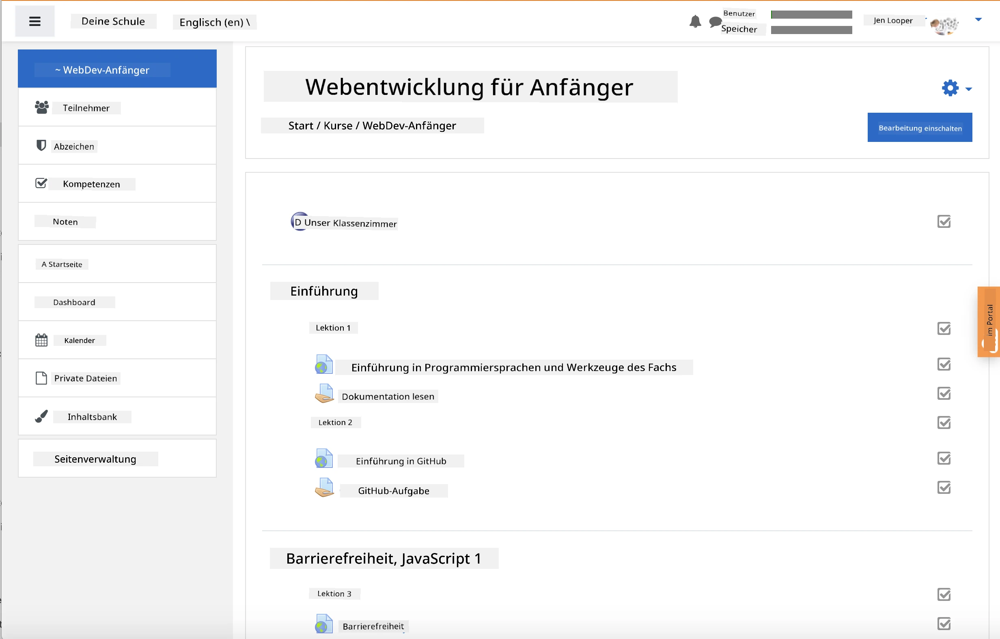
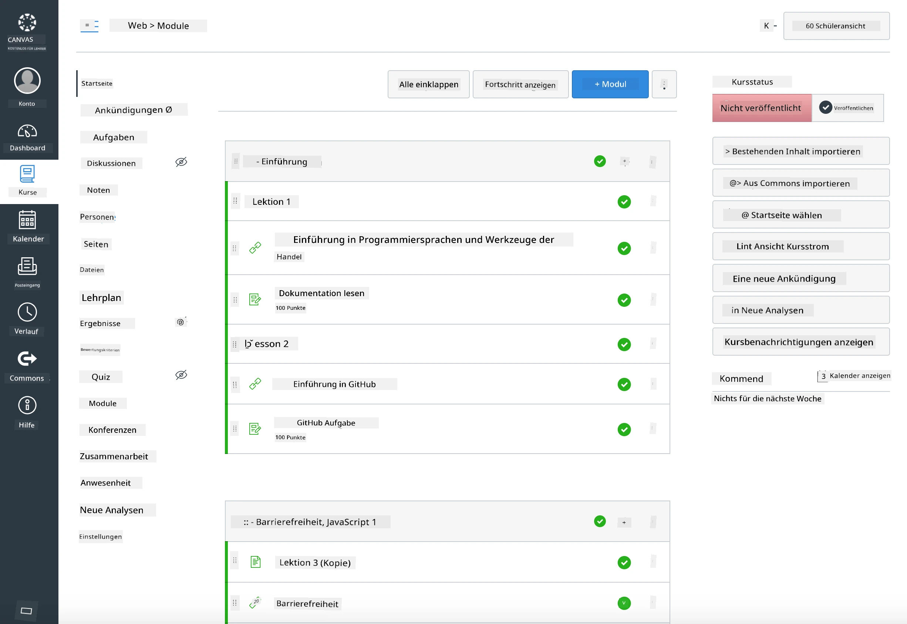

### Für Lehrkräfte

Sie können dieses Curriculum gerne in Ihrem Unterricht verwenden. Es funktioniert nahtlos mit GitHub Classroom und führenden LMS-Plattformen und kann auch als eigenständiges Repository mit Ihren Schülern genutzt werden.

### Verwendung mit GitHub Classroom

Um Lektionen und Aufgaben pro Kohorte zu verwalten, erstellen Sie ein Repository pro Lektion, damit GitHub Classroom jede Aufgabe unabhängig verknüpfen kann.

- Forken Sie dieses Repository in Ihre Organisation.
- Erstellen Sie ein separates Repository für jede Lektion, indem Sie jeden Lektionen-Ordner in ein eigenes Repository extrahieren.
  - Option A: Erstellen Sie leere Repositories (eines pro Lektion) und kopieren Sie die Inhalte des Lektionen-Ordners in jedes.
  - Option B: Verwenden Sie einen Ansatz, der den Git-Verlauf beibehält (z. B. einen Ordner in ein neues Repository aufteilen), falls Sie die Herkunft benötigen.
- Erstellen Sie in GitHub Classroom eine Aufgabe pro Lektion und verweisen Sie auf das entsprechende Lektionen-Repository.
- Empfohlene Einstellungen:
  - Repository-Sichtbarkeit: privat für die Arbeit der Schüler.
  - Verwenden Sie Starter-Code aus dem Standard-Branch des Lektionen-Repositories.
  - Fügen Sie Issue- und Pull-Request-Vorlagen für Quizfragen und Einreichungen hinzu.
  - Konfigurieren Sie optional Autograding und Tests, falls Ihre Lektionen diese enthalten.
- Hilfreiche Konventionen:
  - Repository-Namen wie lesson-01-intro, lesson-02-html usw.
  - Labels: quiz, assignment, needs-review, late, resubmission.
  - Tags/Releases pro Kohorte (z. B. v2025-term1).

Tipp: Vermeiden Sie es, Repositories in synchronisierten Ordnern (z. B. OneDrive/Google Drive) zu speichern, um Git-Konflikte unter Windows zu verhindern.

### Verwendung mit Moodle, Canvas oder Blackboard

Dieses Curriculum enthält importierbare Pakete für gängige LMS-Workflows.

- Moodle: Verwenden Sie die Moodle-Upload-Datei [Moodle upload file](../../../../../../../teaching-files/webdev-moodle.mbz), um den gesamten Kurs zu laden.
- Common Cartridge: Verwenden Sie die Common-Cartridge-Datei [Common Cartridge file](../../../../../../../teaching-files/webdev-common-cartridge.imscc) für eine breitere LMS-Kompatibilität.
- Hinweise:
  - Moodle Cloud unterstützt Common Cartridge nur eingeschränkt. Bevorzugen Sie die oben genannte Moodle-Datei, die auch in Canvas hochgeladen werden kann.
  - Überprüfen Sie nach dem Import die Module, Fälligkeitsdaten und Quiz-Einstellungen, um sie an Ihren Semesterplan anzupassen.

> Das Curriculum in einem Moodle-Klassenzimmer

> Das Curriculum in Canvas

### Direkte Nutzung des Repositories (ohne Classroom)

Wenn Sie GitHub Classroom nicht verwenden möchten, können Sie den Kurs direkt aus diesem Repository durchführen.

- Synchrone/Online-Formate (Zoom/Teams):
  - Führen Sie kurze mentorengeleitete Warm-ups durch; nutzen Sie Breakout-Räume für Quizfragen.
  - Geben Sie ein Zeitfenster für Quizfragen bekannt; Schüler reichen Antworten als GitHub-Issues ein.
  - Für kollaborative Aufgaben arbeiten Schüler in öffentlichen Lektionen-Repositories und öffnen Pull-Requests.
- Private/asynchrone Formate:
  - Schüler forken jede Lektion in ihre eigenen **privaten** Repositories und fügen Sie als Kollaborator hinzu.
  - Sie reichen Quizfragen über Issues und Aufgaben über Pull-Requests in Ihrem Classroom-Repository oder ihren privaten Forks ein.

### Best Practices

- Bieten Sie eine Orientierungslektion zu den Grundlagen von Git/GitHub, Issues und PRs an.
- Verwenden Sie Checklisten in Issues für mehrstufige Quizfragen/Aufgaben.
- Fügen Sie CONTRIBUTING.md und CODE_OF_CONDUCT.md hinzu, um Klassennormen festzulegen.
- Fügen Sie Barrierefreiheitshinweise (Alt-Text, Untertitel) hinzu und bieten Sie druckbare PDFs an.
- Versionieren Sie Ihre Inhalte pro Semester und frieren Sie Lektionen-Repositories nach der Veröffentlichung ein.

### Feedback und Unterstützung

Wir möchten, dass dieses Curriculum für Sie und Ihre Schüler funktioniert. Bitte öffnen Sie ein neues Issue in diesem Repository für Fehler, Anfragen oder Verbesserungen, oder starten Sie eine Diskussion in der Teacher Corner.

---

**Haftungsausschluss**:  
Dieses Dokument wurde mit dem KI-Übersetzungsdienst [Co-op Translator](https://github.com/Azure/co-op-translator) übersetzt. Obwohl wir uns um Genauigkeit bemühen, beachten Sie bitte, dass automatisierte Übersetzungen Fehler oder Ungenauigkeiten enthalten können. Das Originaldokument in seiner ursprünglichen Sprache sollte als maßgebliche Quelle betrachtet werden. Für kritische Informationen wird eine professionelle menschliche Übersetzung empfohlen. Wir übernehmen keine Haftung für Missverständnisse oder Fehlinterpretationen, die sich aus der Nutzung dieser Übersetzung ergeben.