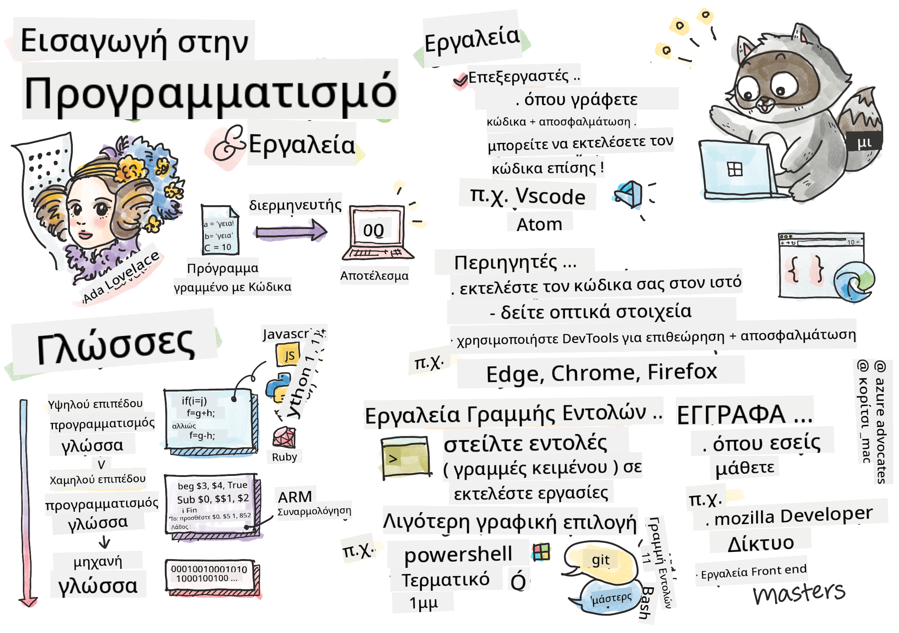

<!--
CO_OP_TRANSLATOR_METADATA:
{
  "original_hash": "c63675cfaf1d223b37bb9fecbfe7c252",
  "translation_date": "2025-08-26T22:21:46+00:00",
  "source_file": "1-getting-started-lessons/1-intro-to-programming-languages/README.md",
  "language_code": "el"
}
-->
# Εισαγωγή στις Γλώσσες Προγραμματισμού και τα Εργαλεία του Επαγγέλματος

Αυτό το μάθημα καλύπτει τις βασικές αρχές των γλωσσών προγραμματισμού. Τα θέματα που καλύπτονται εδώ ισχύουν για τις περισσότερες σύγχρονες γλώσσες προγραμματισμού. Στην ενότητα "Εργαλεία του Επαγγέλματος", θα μάθετε για χρήσιμο λογισμικό που σας βοηθά ως προγραμματιστή.

  
> Σκίτσο από την [Tomomi Imura](https://twitter.com/girlie_mac)

## Ερωτηματολόγιο Πριν το Μάθημα  
[Ερωτηματολόγιο Πριν το Μάθημα](https://forms.office.com/r/dru4TE0U9n?origin=lprLink)

## Εισαγωγή

Σε αυτό το μάθημα, θα καλύψουμε:

- Τι είναι ο προγραμματισμός;  
- Τύποι γλωσσών προγραμματισμού  
- Βασικά στοιχεία ενός προγράμματος  
- Χρήσιμο λογισμικό και εργαλεία για τον επαγγελματία προγραμματιστή  

> Μπορείτε να παρακολουθήσετε αυτό το μάθημα στο [Microsoft Learn](https://docs.microsoft.com/learn/modules/web-development-101/introduction-programming/?WT.mc_id=academic-77807-sagibbon)!

## Τι είναι ο Προγραμματισμός;

Ο προγραμματισμός (γνωστός και ως κωδικοποίηση) είναι η διαδικασία συγγραφής οδηγιών για μια συσκευή, όπως ένας υπολογιστής ή μια κινητή συσκευή. Γράφουμε αυτές τις οδηγίες με μια γλώσσα προγραμματισμού, η οποία στη συνέχεια ερμηνεύεται από τη συσκευή. Αυτά τα σύνολα οδηγιών μπορεί να αναφέρονται με διάφορα ονόματα, όπως *πρόγραμμα*, *υπολογιστικό πρόγραμμα*, *εφαρμογή (app)* και *εκτελέσιμο αρχείο*.

Ένα *πρόγραμμα* μπορεί να είναι οτιδήποτε έχει γραφτεί με κώδικα: ιστοσελίδες, παιχνίδια και εφαρμογές κινητών είναι προγράμματα. Αν και είναι δυνατό να δημιουργηθεί ένα πρόγραμμα χωρίς να γραφτεί κώδικας, η υποκείμενη λογική ερμηνεύεται από τη συσκευή και αυτή η λογική πιθανότατα έχει γραφτεί με κώδικα. Ένα πρόγραμμα που *τρέχει* ή *εκτελεί* κώδικα εκτελεί οδηγίες. Η συσκευή με την οποία διαβάζετε αυτό το μάθημα τρέχει ένα πρόγραμμα για να το εμφανίσει στην οθόνη σας.

✅ Κάντε λίγη έρευνα: Ποιος θεωρείται ότι ήταν ο πρώτος προγραμματιστής υπολογιστών στον κόσμο;

## Γλώσσες Προγραμματισμού

Οι γλώσσες προγραμματισμού επιτρέπουν στους προγραμματιστές να γράφουν οδηγίες για μια συσκευή. Οι συσκευές μπορούν να κατανοήσουν μόνο δυαδικό κώδικα (1 και 0), και για *τους περισσότερους* προγραμματιστές αυτός δεν είναι ένας αποδοτικός τρόπος επικοινωνίας. Οι γλώσσες προγραμματισμού είναι το μέσο επικοινωνίας μεταξύ ανθρώπων και υπολογιστών.

Οι γλώσσες προγραμματισμού έχουν διαφορετικές μορφές και μπορεί να εξυπηρετούν διαφορετικούς σκοπούς. Για παράδειγμα, η JavaScript χρησιμοποιείται κυρίως για εφαρμογές ιστού, ενώ η Bash χρησιμοποιείται κυρίως για λειτουργικά συστήματα.

*Γλώσσες χαμηλού επιπέδου* συνήθως απαιτούν λιγότερα βήματα για να ερμηνεύσει μια συσκευή τις οδηγίες σε σύγκριση με *γλώσσες υψηλού επιπέδου*. Ωστόσο, αυτό που κάνει τις γλώσσες υψηλού επιπέδου δημοφιλείς είναι η αναγνωσιμότητα και η υποστήριξή τους. Η JavaScript θεωρείται γλώσσα υψηλού επιπέδου.

Ο παρακάτω κώδικας δείχνει τη διαφορά μεταξύ μιας γλώσσας υψηλού επιπέδου (JavaScript) και μιας γλώσσας χαμηλού επιπέδου (ARM assembly code).

```javascript
let number = 10
let n1 = 0, n2 = 1, nextTerm;

for (let i = 1; i <= number; i++) {
    console.log(n1);
    nextTerm = n1 + n2;
    n1 = n2;
    n2 = nextTerm;
}
```

```c
 area ascen,code,readonly
 entry
 code32
 adr r0,thumb+1
 bx r0
 code16
thumb
 mov r0,#00
 sub r0,r0,#01
 mov r1,#01
 mov r4,#10
 ldr r2,=0x40000000
back add r0,r1
 str r0,[r2]
 add r2,#04
 mov r3,r0
 mov r0,r1
 mov r1,r3
 sub r4,#01
 cmp r4,#00
 bne back
 end
```

Πιστέψτε το ή όχι, *κάνουν το ίδιο πράγμα*: εκτυπώνουν μια ακολουθία Fibonacci μέχρι το 10.

✅ Μια ακολουθία Fibonacci [ορίζεται](https://en.wikipedia.org/wiki/Fibonacci_number) ως ένα σύνολο αριθμών όπου κάθε αριθμός είναι το άθροισμα των δύο προηγούμενων, ξεκινώντας από το 0 και το 1. Οι πρώτοι 10 αριθμοί της ακολουθίας Fibonacci είναι 0, 1, 1, 2, 3, 5, 8, 13, 21 και 34.

## Στοιχεία ενός Προγράμματος

Μια μεμονωμένη οδηγία σε ένα πρόγραμμα ονομάζεται *δήλωση* και συνήθως έχει έναν χαρακτήρα ή διάστημα γραμμής που υποδεικνύει πού τελειώνει ή *τερματίζει*. Ο τρόπος τερματισμού ενός προγράμματος διαφέρει ανάλογα με τη γλώσσα.

Οι δηλώσεις μέσα σε ένα πρόγραμμα μπορεί να βασίζονται σε δεδομένα που παρέχονται από έναν χρήστη ή από αλλού για να εκτελέσουν οδηγίες. Τα δεδομένα μπορούν να αλλάξουν τη συμπεριφορά ενός προγράμματος, γι' αυτό οι γλώσσες προγραμματισμού διαθέτουν έναν τρόπο προσωρινής αποθήκευσης δεδομένων για μελλοντική χρήση. Αυτά ονομάζονται *μεταβλητές*. Οι μεταβλητές είναι δηλώσεις που δίνουν εντολή σε μια συσκευή να αποθηκεύσει δεδομένα στη μνήμη της. Οι μεταβλητές στα προγράμματα είναι παρόμοιες με τις μεταβλητές στα μαθηματικά, όπου έχουν ένα μοναδικό όνομα και η τιμή τους μπορεί να αλλάξει με την πάροδο του χρόνου.

Υπάρχει πιθανότητα ορισμένες δηλώσεις να μην εκτελεστούν από μια συσκευή. Αυτό συνήθως συμβαίνει σκόπιμα από τον προγραμματιστή ή κατά λάθος όταν προκύψει ένα απρόσμενο σφάλμα. Αυτός ο τύπος ελέγχου σε μια εφαρμογή την καθιστά πιο ανθεκτική και ευκολότερη στη συντήρηση. Συνήθως, αυτές οι αλλαγές στον έλεγχο συμβαίνουν όταν πληρούνται ορισμένες συνθήκες. Μια κοινή δήλωση που χρησιμοποιείται στον σύγχρονο προγραμματισμό για τον έλεγχο της εκτέλεσης ενός προγράμματος είναι η δήλωση `if..else`.

✅ Θα μάθετε περισσότερα για αυτόν τον τύπο δήλωσης σε επόμενα μαθήματα.

## Εργαλεία του Επαγγέλματος

[](https://youtube.com/watch?v=69WJeXGBdxg "Εργαλεία του Επαγγέλματος")

> 🎥 Κάντε κλικ στην παραπάνω εικόνα για ένα βίντεο σχετικά με τα εργαλεία

Σε αυτή την ενότητα, θα μάθετε για κάποιο λογισμικό που μπορεί να σας φανεί πολύ χρήσιμο καθώς ξεκινάτε το επαγγελματικό σας ταξίδι στον προγραμματισμό.

Ένα **περιβάλλον ανάπτυξης** είναι ένα μοναδικό σύνολο εργαλείων και χαρακτηριστικών που χρησιμοποιεί συχνά ένας προγραμματιστής κατά τη συγγραφή λογισμικού. Μερικά από αυτά τα εργαλεία έχουν προσαρμοστεί για τις συγκεκριμένες ανάγκες ενός προγραμματιστή και μπορεί να αλλάξουν με την πάροδο του χρόνου αν ο προγραμματιστής αλλάξει προτεραιότητες στη δουλειά, στα προσωπικά του έργα ή όταν χρησιμοποιεί διαφορετική γλώσσα προγραμματισμού. Τα περιβάλλοντα ανάπτυξης είναι τόσο μοναδικά όσο και οι προγραμματιστές που τα χρησιμοποιούν.

### Επεξεργαστές Κώδικα

Ένα από τα πιο κρίσιμα εργαλεία για την ανάπτυξη λογισμικού είναι ο επεξεργαστής κώδικα. Οι επεξεργαστές είναι το μέρος όπου γράφετε τον κώδικά σας και μερικές φορές όπου τον εκτελείτε.

Οι προγραμματιστές βασίζονται στους επεξεργαστές για μερικούς επιπλέον λόγους:

- Το *Debugging* βοηθά στον εντοπισμό σφαλμάτων και λαθών, εξετάζοντας τον κώδικα γραμμή προς γραμμή. Μερικοί επεξεργαστές διαθέτουν δυνατότητες debugging, οι οποίες μπορούν να προσαρμοστούν και να προστεθούν για συγκεκριμένες γλώσσες προγραμματισμού.  
- Η *επισήμανση σύνταξης* προσθέτει χρώματα και μορφοποίηση κειμένου στον κώδικα, καθιστώντας τον πιο ευανάγνωστο. Οι περισσότεροι επεξεργαστές επιτρέπουν προσαρμοσμένη επισήμανση σύνταξης.  
- Οι *επεκτάσεις και οι ενσωματώσεις* είναι εξειδικευμένα εργαλεία για προγραμματιστές, φτιαγμένα από προγραμματιστές. Αυτά τα εργαλεία δεν περιλαμβάνονται στον βασικό επεξεργαστή. Για παράδειγμα, πολλοί προγραμματιστές τεκμηριώνουν τον κώδικά τους για να εξηγήσουν πώς λειτουργεί. Μπορεί να εγκαταστήσουν μια επέκταση ορθογραφικού ελέγχου για να εντοπίσουν τυπογραφικά λάθη μέσα στην τεκμηρίωση. Οι περισσότερες επεκτάσεις προορίζονται για χρήση σε έναν συγκεκριμένο επεξεργαστή και οι περισσότεροι επεξεργαστές διαθέτουν έναν τρόπο αναζήτησης διαθέσιμων επεκτάσεων.  
- Η *προσαρμογή* επιτρέπει στους προγραμματιστές να δημιουργήσουν ένα μοναδικό περιβάλλον ανάπτυξης που να ταιριάζει στις ανάγκες τους. Οι περισσότεροι επεξεργαστές είναι εξαιρετικά προσαρμόσιμοι και μπορεί επίσης να επιτρέπουν στους προγραμματιστές να δημιουργούν προσαρμοσμένες επεκτάσεις.  

#### Δημοφιλείς Επεξεργαστές και Επεκτάσεις για Ανάπτυξη Ιστού

- [Visual Studio Code](https://code.visualstudio.com/?WT.mc_id=academic-77807-sagibbon)  
  - [Code Spell Checker](https://marketplace.visualstudio.com/items?itemName=streetsidesoftware.code-spell-checker)  
  - [Live Share](https://marketplace.visualstudio.com/items?itemName=MS-vsliveshare.vsliveshare)  
  - [Prettier - Code formatter](https://marketplace.visualstudio.com/items?itemName=esbenp.prettier-vscode)  
- [Atom](https://atom.io/)  
  - [spell-check](https://atom.io/packages/spell-check)  
  - [teletype](https://atom.io/packages/teletype)  
  - [atom-beautify](https://atom.io/packages/atom-beautify)  
- [Sublimetext](https://www.sublimetext.com/)  
  - [emmet](https://emmet.io/)  
  - [SublimeLinter](http://www.sublimelinter.com/en/stable/)  

### Περιηγητές

Ένα άλλο κρίσιμο εργαλείο είναι ο περιηγητής. Οι προγραμματιστές ιστού βασίζονται στον περιηγητή για να δουν πώς εκτελείται ο κώδικάς τους στον ιστό. Χρησιμοποιείται επίσης για την εμφάνιση των οπτικών στοιχείων μιας ιστοσελίδας που έχουν γραφτεί στον επεξεργαστή, όπως το HTML.

Πολλοί περιηγητές διαθέτουν *εργαλεία προγραμματιστή* (DevTools) που περιέχουν ένα σύνολο χρήσιμων χαρακτηριστικών και πληροφοριών για να βοηθήσουν τους προγραμματιστές να συλλέξουν και να καταγράψουν σημαντικές πληροφορίες σχετικά με την εφαρμογή τους. Για παράδειγμα: Εάν μια ιστοσελίδα έχει σφάλματα, είναι μερικές φορές χρήσιμο να γνωρίζουμε πότε συνέβησαν. Τα DevTools σε έναν περιηγητή μπορούν να ρυθμιστούν για να καταγράψουν αυτές τις πληροφορίες.

#### Δημοφιλείς Περιηγητές και DevTools

- [Edge](https://docs.microsoft.com/microsoft-edge/devtools-guide-chromium/?WT.mc_id=academic-77807-sagibbon)  
- [Chrome](https://developers.google.com/web/tools/chrome-devtools/)  
- [Firefox](https://developer.mozilla.org/docs/Tools)  

### Εργαλεία Γραμμής Εντολών

Μερικοί προγραμματιστές προτιμούν μια λιγότερο γραφική προσέγγιση για τις καθημερινές τους εργασίες και βασίζονται στη γραμμή εντολών για να το πετύχουν αυτό. Η συγγραφή κώδικα απαιτεί σημαντική ποσότητα πληκτρολόγησης και μερικοί προγραμματιστές προτιμούν να μην διακόπτουν τη ροή τους στο πληκτρολόγιο. Χρησιμοποιούν συντομεύσεις πληκτρολογίου για να εναλλάσσονται μεταξύ παραθύρων επιφάνειας εργασίας, να εργάζονται σε διαφορετικά αρχεία και να χρησιμοποιούν εργαλεία. Οι περισσότερες εργασίες μπορούν να ολοκληρωθούν με το ποντίκι, αλλά ένα πλεονέκτημα της γραμμής εντολών είναι ότι πολλά μπορούν να γίνουν με εργαλεία γραμμής εντολών χωρίς την ανάγκη εναλλαγής μεταξύ ποντικιού και πληκτρολογίου. Ένα άλλο πλεονέκτημα της γραμμής εντολών είναι ότι είναι παραμετροποιήσιμη και μπορείτε να αποθηκεύσετε μια προσαρμοσμένη διαμόρφωση, να την αλλάξετε αργότερα και να την εισαγάγετε σε άλλες μηχανές ανάπτυξης. Επειδή τα περιβάλλοντα ανάπτυξης είναι τόσο μοναδικά για κάθε προγραμματιστή, μερικοί αποφεύγουν τη γραμμή εντολών, άλλοι βασίζονται αποκλειστικά σε αυτήν, ενώ άλλοι προτιμούν έναν συνδυασμό των δύο.

### Δημοφιλείς Επιλογές Γραμμής Εντολών

Οι επιλογές για τη γραμμή εντολών διαφέρουν ανάλογα με το λειτουργικό σύστημα που χρησιμοποιείτε.

*💻 = προεγκατεστημένο στο λειτουργικό σύστημα.*

#### Windows

- [Powershell](https://docs.microsoft.com/powershell/scripting/overview?view=powershell-7/?WT.mc_id=academic-77807-sagibbon) 💻  
- [Command Line](https://docs.microsoft.com/windows-server/administration/windows-commands/windows-commands/?WT.mc_id=academic-77807-sagibbon) (γνωστό και ως CMD) 💻  
- [Windows Terminal](https://docs.microsoft.com/windows/terminal/?WT.mc_id=academic-77807-sagibbon)  
- [mintty](https://mintty.github.io/)  

#### MacOS

- [Terminal](https://support.apple.com/guide/terminal/open-or-quit-terminal-apd5265185d-f365-44cb-8b09-71a064a42125/mac) 💻  
- [iTerm](https://iterm2.com/)  
- [Powershell](https://docs.microsoft.com/powershell/scripting/install/installing-powershell-core-on-macos?view=powershell-7/?WT.mc_id=academic-77807-sagibbon)  

#### Linux

- [Bash](https://www.gnu.org/software/bash/manual/html_node/index.html) 💻  
- [KDE Konsole](https://docs.kde.org/trunk5/en/konsole/konsole/index.html)  
- [Powershell](https://docs.microsoft.com/powershell/scripting/install/installing-powershell-core-on-linux?view=powershell-7/?WT.mc_id=academic-77807-sagibbon)  

#### Δημοφιλή Εργαλεία Γραμμής Εντολών

- [Git](https://git-scm.com/) (💻 στα περισσότερα λειτουργικά συστήματα)  
- [NPM](https://www.npmjs.com/)  
- [Yarn](https://classic.yarnpkg.com/en/docs/cli/)  

### Τεκμηρίωση

Όταν ένας προγραμματιστής θέλει να μάθει κάτι νέο, πιθανότατα θα στραφεί στην τεκμηρίωση για να μάθει πώς να το χρησιμοποιεί. Οι προγραμματιστές συχνά βασίζονται στην τεκμηρίωση για να τους καθοδηγήσει σχετικά με τη σωστή χρήση εργαλείων και γλωσσών, αλλά και για να αποκτήσουν βαθύτερη γνώση για το πώς λειτουργούν.

#### Δημοφιλείς Πηγές Τεκμηρίωσης για Ανάπτυξη Ιστού

- [Mozilla Developer Network (MDN)](https://developer.mozilla.org/docs/Web), από τη Mozilla, τους εκδότες του περιηγητή [Firefox](https://www.mozilla.org/firefox/)  
- [Frontend Masters](https://frontendmasters.com/learn/)  
- [Web.dev](https://web.dev), από τη Google, εκδότες του [Chrome](https://www

---

**Αποποίηση ευθύνης**:  
Αυτό το έγγραφο έχει μεταφραστεί χρησιμοποιώντας την υπηρεσία αυτόματης μετάφρασης [Co-op Translator](https://github.com/Azure/co-op-translator). Παρόλο που καταβάλλουμε προσπάθειες για ακρίβεια, παρακαλούμε να έχετε υπόψη ότι οι αυτοματοποιημένες μεταφράσεις ενδέχεται να περιέχουν λάθη ή ανακρίβειες. Το πρωτότυπο έγγραφο στη μητρική του γλώσσα θα πρέπει να θεωρείται η αυθεντική πηγή. Για κρίσιμες πληροφορίες, συνιστάται επαγγελματική ανθρώπινη μετάφραση. Δεν φέρουμε ευθύνη για τυχόν παρεξηγήσεις ή εσφαλμένες ερμηνείες που προκύπτουν από τη χρήση αυτής της μετάφρασης.