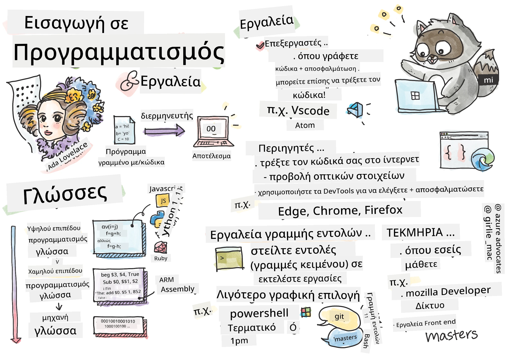
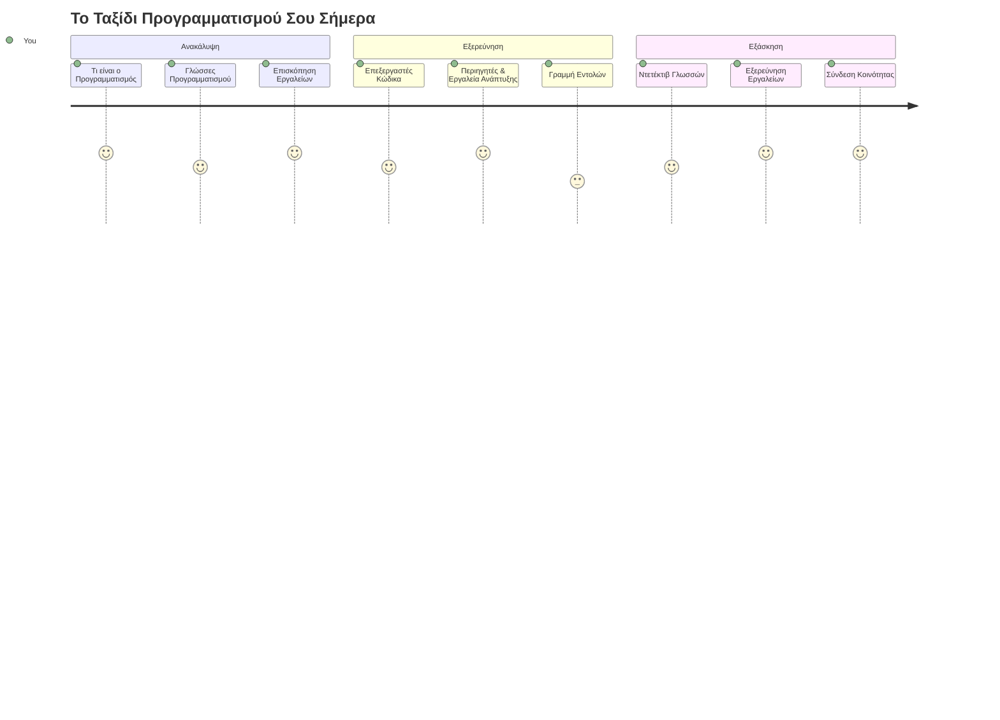
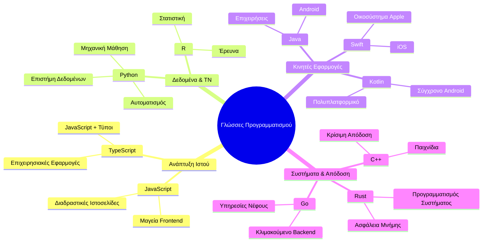
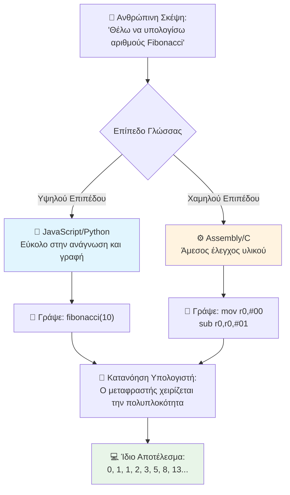
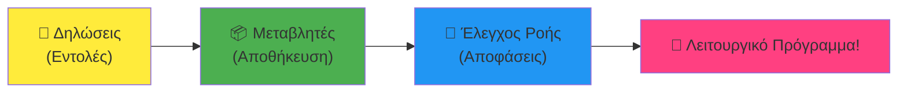
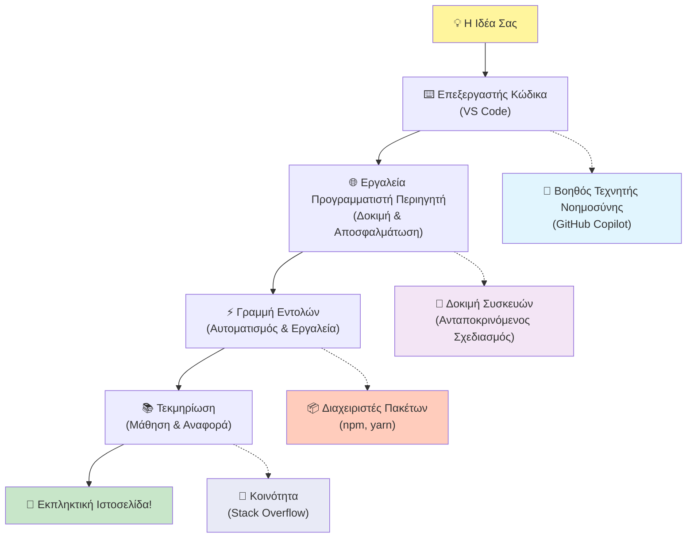
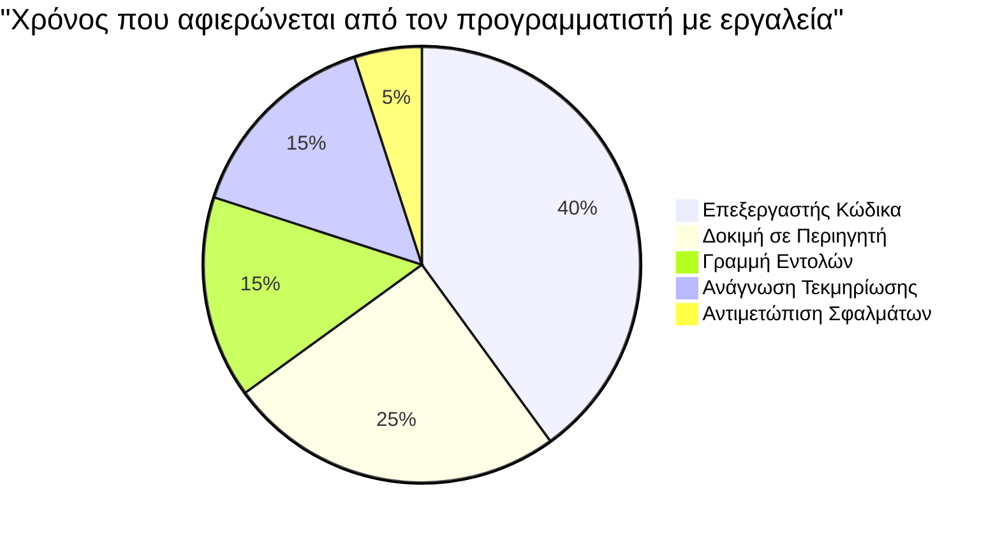
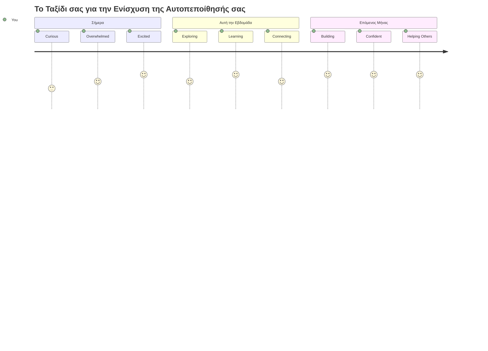

<!--
CO_OP_TRANSLATOR_METADATA:
{
  "original_hash": "d45ddcc54eb9232a76d08328b09d792e",
  "translation_date": "2026-01-06T21:16:19+00:00",
  "source_file": "1-getting-started-lessons/1-intro-to-programming-languages/README.md",
  "language_code": "el"
}
-->
# Εισαγωγή στις Γλώσσες Προγραμματισμού και τα Σύγχρονα Εργαλεία Ανάπτυξης

Γεια σου, μελλοντικέ προγραμματιστή! 👋 Μπορώ να σου πω κάτι που ακόμα με συγκλονίζει κάθε μέρα; Είσαι έτοιμος να ανακαλύψεις ότι ο προγραμματισμός δεν αφορά μόνο τους υπολογιστές – αφορά το να έχεις πραγματικές υπερδυνάμεις για να ζωντανέψεις τις πιο τρελές σου ιδέες!

Ξέρεις εκείνη τη στιγμή που χρησιμοποιείς την αγαπημένη σου εφαρμογή και όλα απλά συνδυάζονται τέλεια; Όταν πατάς ένα κουμπί και συμβαίνει κάτι μαγικό που σε κάνει να πεις "ουάου, πώς ΤΟ ΕΚΑΝΑΝ αυτό;" Λοιπόν, κάποιος ακριβώς σαν κι εσένα – πιθανόν να είναι καθισμένος στο αγαπημένο του καφέ στις 2 τα ξημερώματα με τον τρίτο του εσπρέσο – έγραψε τον κώδικα που δημιούργησε αυτή τη μαγεία. Και να τι θα σε εντυπωσιάσει: στο τέλος αυτού του μαθήματος, όχι μόνο θα καταλάβεις πώς το έκαναν, αλλά θα θέλεις κι εσύ να το δοκιμάσεις!

Κοίτα, καταλαβαίνω αν ο προγραμματισμός σου φαίνεται τρομακτικός αυτή τη στιγμή. Όταν ξεκίνησα, πίστευα ειλικρινά ότι έπρεπε να είσαι κάποιος μαθηματικός ιδιοφυής ή να προγραμματίζεις από τότε που ήσουν πέντε χρονών. Αλλά αυτό που άλλαξε εντελώς την οπτική μου ήταν: ο προγραμματισμός είναι ακριβώς όπως να μαθαίνεις να κάνεις συζητήσεις σε μια νέα γλώσσα. Ξεκινάς με το "γεια" και το "ευχαριστώ", μετά μαθαίνεις να παραγγέλνεις καφέ, και πριν το καταλάβεις κάνεις βαθιές φιλοσοφικές συζητήσεις! Μόνο που εδώ, κάνεις συζητήσεις με υπολογιστές, και ειλικρινά; Είναι οι πιο υπομονετικοί συνομιλητές που θα έχεις ποτέ – ποτέ δεν κρίνουν τα λάθη σου και πάντα ενθουσιάζονται να προσπαθήσουν ξανά!

Σήμερα, θα εξερευνήσουμε τα απίστευτα εργαλεία που κάνουν την σύγχρονη ανάπτυξη ιστοσελίδων όχι μόνο δυνατή, αλλά και σοβαρά εθιστική. Μιλάω για τους ίδιους ακριβώς επεξεργαστές, προγράμματα περιήγησης και ροές εργασίας που χρησιμοποιούν οι προγραμματιστές στη Netflix, Spotify και το αγαπημένο σου indie studio εφαρμογών κάθε μέρα. Και να το μέρος που θα σε κάνει να χορέψεις από χαρά: τα περισσότερα από αυτά τα επαγγελματικά, βιομηχανικά πρότυπα εργαλεία είναι εντελώς δωρεάν!


> Σκέτς από [Tomomi Imura](https://twitter.com/girlie_mac)


## Ας Δούμε Τι Ξέρεις Ήδη!

Πριν βουτήξουμε στα διασκεδαστικά, έχω περιέργεια – τι ξέρεις ήδη για αυτόν τον κόσμο του προγραμματισμού; Και άκου, αν κοιτάς αυτές τις ερωτήσεις και σκέφτεσαι "Δεν έχω απολύτως καμία ιδέα για τίποτα από αυτά", αυτό δεν είναι απλώς εντάξει, είναι τέλειο! Σημαίνει ότι είσαι στο ακριβώς σωστό μέρος. Σκέψου αυτό το κουίζ σαν τέντωμα πριν την άσκηση – απλώς ζεσταίνουμε τους μυς του εγκεφάλου!

[Κάνε το προ-μάθημα κουίζ](https://forms.office.com/r/dru4TE0U9n?origin=lprLink)

## Η Περιπέτεια που Ετοιμαζόμαστε να Κάνουμε Μαζί

Εντάξει, είμαι πραγματικά γεμάτος ενθουσιασμό για όσα θα εξερευνήσουμε σήμερα! Σοβαρά, εύχομαι να μπορούσα να δω το πρόσωπό σου όταν καταλάβεις μερικές από αυτές τις έννοιες. Να το απίστευτο ταξίδι που θα κάνουμε μαζί:

- **Τι είναι ο προγραμματισμός πραγματικά (και γιατί είναι το πιο κουλ πράγμα στον κόσμο!)** – Θα ανακαλύψουμε πώς ο κώδικας είναι στην ουσία η αόρατη μαγεία που κινεί τα πάντα γύρω σου, από το ξυπνητήρι που ξαφνικά ξέρει ότι είναι Δευτέρα το πρωί, μέχρι τον αλγόριθμο που επιμελεί τέλεια τις Netflix προτάσεις σου  
- **Γλώσσες προγραμματισμού και οι εκπληκτικές προσωπικότητές τους** – Φαντάσου να μπαίνεις σε ένα πάρτι όπου ο καθένας έχει τελείως διαφορετικές υπερδυνάμεις και τρόπους να λύνει προβλήματα. Έτσι είναι ο κόσμος των γλωσσών προγραμματισμού, και θα λατρέψεις να τις γνωρίσεις!  
- **Τα βασικά δομικά στοιχεία που κάνουν τη ψηφιακή μαγεία να συμβαίνει** – Σκέψου τα σαν το απόλυτο δημιουργικό σετ LEGO. Μόλις καταλάβεις πώς ενώνονται αυτά τα κομμάτια, θα συνειδητοποιήσεις ότι μπορείς να φτιάξεις κυριολεκτικά οτιδήποτε ονειρευτεί το μυαλό σου  
- **Επαγγελματικά εργαλεία που θα σε κάνουν να νιώσεις σαν να σου έδωσαν το ραβδί ενός μάγου** – Δεν υπερβάλλω εδώ – αυτά τα εργαλεία θα σε κάνουν πραγματικά να νιώσεις ότι έχεις υπερδυνάμεις, και το καλύτερο; Είναι τα ίδια που χρησιμοποιούν οι επαγγελματίες!

> 💡 **Να το θυμάσαι**: Μην προσπαθήσεις καν να απομνημονεύσεις τα πάντα σήμερα! Τώρα απλώς θέλω να νιώσεις αυτήν την σπίθα ενθουσιασμού για το τι είναι δυνατό. Οι λεπτομέρειες θα κολλήσουν φυσικά καθώς θα εξασκούμαστε μαζί – έτσι συμβαίνει η αληθινή μάθηση!

> Μπορείς να κάνεις αυτό το μάθημα στο [Microsoft Learn](https://docs.microsoft.com/learn/modules/web-development-101/introduction-programming/?WT.mc_id=academic-77807-sagibbon)!

## Τι Είναι Ακριβώς ο Προγραμματισμός;

Εντάξει, ας απαντήσουμε στην ερώτηση του εκατομμυρίου: τι είναι πραγματικά ο προγραμματισμός;

Θα σου πω μια ιστορία που άλλαξε εντελώς τον τρόπο που το σκέφτομαι. Την προηγούμενη εβδομάδα, προσπαθούσα να εξηγήσω στη μαμά μου πώς να χρησιμοποιήσει το νέο έξυπνο τηλεχειριστήριο της τηλεόρασης. Έπιασα τον εαυτό μου να λέει πράγματα όπως "Πάτα το κόκκινο κουμπί, αλλά όχι το μεγάλο κόκκινο κουμπί, το μικρό κόκκινο κουμπί στα αριστερά... όχι, το άλλο αριστερά σου... καλά, τώρα κράτα το για δύο δευτερόλεπτα, όχι ένα, όχι τρία..." Σου θυμίζει κάτι; 😅

Αυτός είναι ο προγραμματισμός! Είναι η τέχνη να δίνεις απίστευτα λεπτομερείς, βήμα προς βήμα οδηγίες σε κάτι που είναι πανίσχυρο αλλά χρειάζεται τα πάντα να του εξηγηθούν τέλεια. Μόνο που αντί να εξηγείς στη μαμά σου (που μπορεί να ρωτήσει "ποιο κόκκινο κουμπί;!"), εξηγείς σε έναν υπολογιστή (που κάνει ακριβώς ό,τι λες, ακόμα κι αν αυτό που είπες δεν είναι ακριβώς αυτό που ήθελες).

Αυτό που με εντυπωσίασε όταν το έμαθα πρώτη φορά: οι υπολογιστές είναι στην ουσία απλοί στον πυρήνα τους. Καταλαβαίνουν κυριολεκτικά μόνο δύο πράγματα – 1 και 0, που είναι βασικά "ναι" και "όχι" ή "αναμμένο" και "σβηστό". Αυτό είναι όλο! Αλλά εδώ γίνεται η μαγεία – δεν χρειάζεται να μιλάμε σε 1 και 0 σαν να είμαστε μέσα στο Matrix. Εκεί έρχονται οι **γλώσσες προγραμματισμού** να σώσουν την κατάσταση. Είναι σαν να έχεις τον καλύτερο μεταφραστή στον κόσμο που παίρνει τις απλές ανθρώπινες σκέψεις σου και τις μετατρέπει στη γλώσσα των υπολογιστών.

Και αυτό που ακόμα με συγκλονίζει κάθε πρωί όταν ξυπνάω: κυριολεκτικά *όλα* τα ψηφιακά πράγματα στη ζωή σου ξεκίνησαν από κάποιον ακριβώς σαν κι εσένα, πιθανώς καθισμένο σε πυζάμες με ένα φλιτζάνι καφέ, να γράφει κώδικα στον φορητό υπολογιστή του. Αυτό το φίλτρο του Instagram που σε κάνει να δείχνεις άψογος; Κάποιος το κωδικοποίησε. Η πρόταση που σου έφερε το νέο αγαπημένο τραγούδι; Ένας προγραμματιστής έφτιαξε αυτόν τον αλγόριθμο. Η εφαρμογή που σε βοηθά να μοιράζεσαι τους λογαριασμούς του δείπνου με φίλους; Ναι, κάποιος σκέφτηκε "αυτό είναι ενοχλητικό, μάλλον μπορώ να το διορθώσω" και… το έκανε!

Όταν μαθαίνεις να προγραμματίζεις, δεν αποκτάς απλώς μια νέα δεξιότητα – γίνεσαι μέρος μιας απίστευτης κοινότητας ανθρώπων που λύνουν προβλήματα και περνούν τις μέρες τους σκεπτόμενοι, "Τι θα γινόταν αν μπορούσα να φτιάξω κάτι που κάνει τη μέρα κάποιου λίγο καλύτερη;" Ειλικρινά, υπάρχει κάτι πιο κουλ από αυτό;

✅ **Κυνήγι Διασκεδαστικού Γεγονότος**: Να κάτι πολύ ωραίο για να κοιτάξεις όταν έχεις λίγο ελεύθερο χρόνο – ποιος νομίζεις ότι ήταν ο πρώτος προγραμματιστής υπολογιστή στον κόσμο; Θα σου δώσω μια υπόδειξη: δεν είναι απαραίτητα αυτός που περιμένεις! Η ιστορία πίσω από αυτό το άτομο είναι απολύτως συναρπαστική και δείχνει ότι ο προγραμματισμός πάντα είχε να κάνει με τη δημιουργική επίλυση προβλημάτων και το να σκέφτεσαι έξω από το κουτί.

### 🧠 **Ώρα Ελέγχου: Πώς Νιώθεις;**

**Πάρε μια στιγμή να σκεφτείς:**
- Σου βγάζει νόημα τώρα η ιδέα του "να δίνεις οδηγίες στους υπολογιστές";  
- Μπορείς να σκεφτείς μια καθημερινή εργασία που θα ήθελες να αυτοματοποιήσεις με προγραμματισμό;  
- Ποιες ερωτήσεις σου έρχονται στο μυαλό για όλο αυτό τον προγραμματισμό;

> **Να θυμάσαι**: Είναι απόλυτα φυσιολογικό αν μερικές έννοιες σου φαίνονται ασαφείς τώρα. Ο προγραμματισμός είναι σαν να μαθαίνεις μια νέα γλώσσα – χρειάζεται χρόνος για να δημιουργηθούν οι νευρωνικές διαδρομές στον εγκέφαλο. Πάς πολύ καλά!

## Οι Γλώσσες Προγραμματισμού Είναι Σαν Διάφορες Γεύσεις Μαγείας

Εντάξει, αυτό ίσως ακουστεί περίεργο, αλλά μείνε μαζί μου – οι γλώσσες προγραμματισμού είναι πολύ σαν διαφορετικά είδη μουσικής. Σκέψου το: έχεις jazz, που είναι ομαλή και αυτοσχεδιαστική, rock που είναι δυνατή και απλή, κλασική μουσική που είναι κομψή και δομημένη, και hip-hop που είναι δημιουργική και εκφραστική. Κάθε στυλ έχει τη δική του ατμόσφαιρα, τη δική του κοινότητα παθιασμένων θαυμαστών και το καθένα είναι τέλειο για διαφορετικές διαθέσεις και περιστάσεις.

Οι γλώσσες προγραμματισμού λειτουργούν ακριβώς έτσι! Δεν θα έγραφες το ίδιο παιχνίδι για κινητά με γλώσσα που χρησιμοποιείς για να επεξεργαστείς τεράστια κλιματικά δεδομένα, όπως δεν θα άκουγες death metal σε τάξη γιόγκα (τουλάχιστον σε περισσότερες τάξεις γιόγκα! 😄).

Αλλά κάνε μου την χάρη, κάθε φορά που το σκέφτομαι με εκπλήσσει: αυτές οι γλώσσες είναι σαν να έχεις τον πιο υπομονετικό, λαμπρό διερμηνέα στον κόσμο καθισμένο δίπλα σου. Μπορείς να εκφράσεις τις ιδέες σου με τρόπο φυσικό στον ανθρώπινο εγκέφαλό σου και αυτοί αναλαμβάνουν όλη την πολύπλοκη δουλειά της μετάφρασης σε 1 και 0 που μιλάνε οι υπολογιστές. Είναι σαν να έχεις έναν φίλο που μιλάει τέλεια και τις δύο γλώσσες, "ανθρώπινης δημιουργικότητας" και "λογικής υπολογιστή" – και δεν κουράζεται ποτέ, δεν χρειάζεται διαλείμματα για καφέ και ποτέ δεν σε κρίνει αν ρωτήσεις ξανά την ίδια ερώτηση!

### Δημοφιλείς Γλώσσες Προγραμματισμού και Χρήσεις τους


| Γλώσσα | Καλύτερα για | Γιατί είναι δημοφιλής |
|----------|----------|------------------|
| **JavaScript** | Ανάπτυξη ιστοσελίδων, διεπαφές χρήστη | Τρέχει στους περιηγητές και υποστηρίζει διαδραστικές ιστοσελίδες |
| **Python** | Επιστήμη δεδομένων, αυτοματοποίηση, AI | Εύκολη στην ανάγνωση και μάθηση, ισχυρές βιβλιοθήκες |
| **Java** | Επιχειρησιακές εφαρμογές, εφαρμογές Android | Ανεξάρτητη πλατφόρμα, ανθεκτική σε μεγάλα συστήματα |
| **C#** | Εφαρμογές Windows, ανάπτυξη παιχνιδιών | Ισχυρή υποστήριξη από το οικοσύστημα της Microsoft |
| **Go** | Υπηρεσίες νέφους, συστήματα backend | Γρήγορη, απλή, σχεδιασμένη για σύγχρονους υπολογιστές |

### Γλώσσες Υψηλού Επίπέδου έναντι Χαμηλού Επίπεδου

Εντάξει, αυτή ήταν ειλικρινά η έννοια που "έσπασε" το μυαλό μου όταν ξεκίνησα, οπότε θα μοιραστώ την αναλογία που τελικά μου έκανε κλικ – και ελπίζω να σε βοηθήσει και εσένα!

Φαντάσου ότι επισκέπτεσαι μια χώρα όπου δεν μιλάς τη γλώσσα και απελπισμένα πρέπει να βρεις την πλησιέστερη τουαλέτα (έχουμε περάσει όλοι από αυτό, σωστά; 😅):

- **Ο προγραμματισμός χαμηλού επιπέδου** είναι σαν να μαθαίνεις τόσο καλά τη τοπική διάλεκτο που μπορείς να μιλήσεις με την γιαγιά που πουλάει φρούτα στη γωνία, χρησιμοποιώντας πολιτισμικές αναφορές, τοπική αργκό και αστεία που καταλαβαίνει μόνο κάποιος που μεγάλωσε εκεί. Πολύ εντυπωσιακό και απίστευτα αποδοτικό... αν είσαι άπταιστος! Αλλά αρκετά συντριπτικό όταν απλά ψάχνεις για τουαλέτα.

- **Ο προγραμματισμός υψηλού επιπέδου** είναι σαν να έχεις αυτόν τον υπέροχο ντόπιο φίλο που απλά σε καταλαβαίνει. Μπορείς να πεις "Πραγματικά πρέπει να βρω μια τουαλέτα" στα απλά αγγλικά και εκείνος να μεταφράσει όλη την πολιτισμική γλώσσα και να σου δώσει οδηγίες που βγάζουν απόλυτο νόημα στον εγκέφαλό σου που δεν είναι ντόπιος.

Σε όρους προγραμματισμού:
- **Οι γλώσσες χαμηλού επιπέδου** (όπως Assembly ή C) σου επιτρέπουν να έχεις απίστευτα λεπτομερείς συζητήσεις με το πραγματικό υλικό του υπολογιστή, αλλά πρέπει να σκέφτεσαι σαν μηχανή, που είναι... ας το πούμε, μεγάλη πνευματική αλλαγή!  
- **Οι γλώσσες υψηλού επιπέδου** (όπως JavaScript, Python ή C#) σε αφήνουν να σκέφτεσαι σαν άνθρωπος ενώ αυτές διαχειρίζονται όλη τη μηχανική ορολογία στα παρασκήνια. Επιπλέον, έχουν αυτές τις απίστευτα φιλόξενες κοινότητες γεμάτες ανθρώπους που θυμούνται πώς ήταν να είσαι αρχάριος και πραγματικά θέλουν να βοηθήσουν!

Μαντέψτε με ποια θα σε προτείνω να ξεκινήσεις; 😉 Οι γλώσσες υψηλού επιπέδου είναι σαν τις βοηθητικές ρόδες που δεν θέλεις να βγάλεις ποτέ γιατί κάνουν όλη την εμπειρία πολύ πιο απολαυστική!


### Άφησέ Με να Σου Δείξω Γιατί Οι Γλώσσες Υψηλού Επίπεδου Είναι Πολύ Φιλικές

Εντάξει, πρόκειται να σου δείξω κάτι που δείχνει τέλεια γιατί αγάπησα τις γλώσσες υψηλού επιπέδου, αλλά πρώτα – πρέπει να μου υποσχεθείς κάτι. Όταν δεις το πρώτο παράδειγμα κώδικα, μην πανικοβληθείς! Προορίζεται να φαίνεται τρομακτικό. Αυτό είναι το σημείο που θέλω να κάνω!

Θα δούμε το ίδιο ακριβώς έργο γραμμένο σε δύο τελείως διαφορετικά στυλ. Και τα δύο δημιουργούν την ακολουθία Fibonacci – αυτό το όμορφο μαθηματικό μοτίβο όπου κάθε αριθμός είναι το άθροισμα των δύο προηγούμενων: 0, 1, 1, 2, 3, 5, 8, 13... (Διασκεδαστικό γεγονός: θα βρεις αυτό το μοτίβο κυριολεκτικά παντού στη φύση – στις σπείρες σπόρων ηλίανθου, στα μοτίβα κουκουναριών, ακόμα και στο πώς σχηματίζονται οι γαλαξίες!)

Έτοιμος να δεις τη διαφορά; Πάμε!

**Γλώσσα υψηλού επιπέδου (JavaScript) – Ανθρώπινη φιλική:**

```javascript
// Βήμα 1: Βασική ρύθμιση Fibonacci
const fibonacciCount = 10;
let current = 0;
let next = 1;

console.log('Fibonacci sequence:');
```

**Αυτό κάνει ο κώδικας:**
- **Δηλώνει** μια σταθερά για να καθορίσει πόσους αριθμούς Fibonacci θέλουμε να δημιουργήσουμε  
- **Αρχικοποιεί** δύο μεταβλητές για να παρακολουθεί τους τρέχοντες και επόμενους αριθμούς στην ακολουθία  
- **Ορίζει** τις αρχικές τιμές (0 και 1) που καθορίζουν το μοτίβο Fibonacci  
- **Εμφανίζει** ένα μήνυμα κεφαλίδας για να ταυτοποιήσει την έξοδο μας

```javascript
// Βήμα 2: Δημιουργήστε τη σειρά με έναν βρόχο
for (let i = 0; i < fibonacciCount; i++) {
  console.log(`Position ${i + 1}: ${current}`);
  
  // Υπολογίστε τον επόμενο αριθμό στη σειρά
  const sum = current + next;
  current = next;
  next = sum;
}
```

**Αναλύοντας τι συμβαίνει εδώ:**
- **Επαναλαμβάνει** μέσω κάθε θέσης στην ακολουθία μας χρησιμοποιώντας έναν βρόχο `for`  
- **Εμφανίζει** κάθε αριθμό με τη θέση του χρησιμοποιώντας τη μορφοποίηση προτύπου συμβολοσειράς  
- **Υπολογίζει** τον επόμενο αριθμό Fibonacci προσθέτοντας τις τρέχουσες και επόμενες τιμές  
- **Ενημερώνει** τις μεταβλητές παρακολούθησης για να προχωρήσει στην επόμενη επανάληψη

```javascript
// Βήμα 3: Σύγχρονη λειτουργική προσέγγιση
const generateFibonacci = (count) => {
  const sequence = [0, 1];
  
  for (let i = 2; i < count; i++) {
    sequence[i] = sequence[i - 1] + sequence[i - 2];
  }
  
  return sequence;
};

// Παράδειγμα χρήσης
const fibSequence = generateFibonacci(10);
console.log(fibSequence);
```

**Στο παραπάνω έχουμε:**
- **Δημιουργήσει** μια επαναχρησιμοποιήσιμη συνάρτηση χρησιμοποιώντας τη σύγχρονη σύνταξη βέλους  
- **Κατασκευάσει** έναν πίνακα για να αποθηκεύσουμε την πλήρη ακολουθία αντί να εμφανίζουμε έναν-έναν  
- **Χρησιμοποιήσει** δεικτοδότηση πίνακα για να υπολογίσουμε κάθε νέο αριθμό από τις προηγούμενες τιμές  
- **Επιστρέψει** την πλήρη ακολουθία για ευέλικτη χρήση σε άλλα μέρη του προγράμματος

**Γλώσσα χαμηλού επιπέδου (ARM Assembly) – Φιλική στον υπολογιστή:**

```assembly
 area ascen,code,readonly
 entry
 code32
 adr r0,thumb+1
 bx r0
 code16
thumb
 mov r0,#00
 sub r0,r0,#01
 mov r1,#01
 mov r4,#10
 ldr r2,=0x40000000
back add r0,r1
 str r0,[r2]
 add r2,#04
 mov r3,r0
 mov r0,r1
 mov r1,r3
 sub r4,#01
 cmp r4,#00
 bne back
 end
```

Παρατήρησε πώς η έκδοση JavaScript διαβάζεται σχεδόν σαν αγγλικές οδηγίες, ενώ η έκδοση Assembly χρησιμοποιεί κρυπτογραφημένες εντολές που ελέγχουν άμεσα τον επεξεργαστή του υπολογιστή. Και οι δύο πραγματοποιούν το ίδιο έργο, αλλά η γλώσσα υψηλού επιπέδου είναι πολύ πιο εύκολη για τους ανθρώπους να καταλάβουν, να γράψουν και να διατηρήσουν.

**Κύριες διαφορές που θα παρατηρήσεις:**
- **Αναγνωσιμότητα**: Η JavaScript χρησιμοποιεί περιγραφικά ονόματα όπως `fibonacciCount` ενώ η Assembly χρησιμοποιεί κρυπτογραφικές ετικέτες όπως `r0`, `r1`
- **Σχόλια**: Οι γλώσσες υψηλού επιπέδου ενθαρρύνουν επεξηγηματικά σχόλια που κάνουν τον κώδικα αυτο-τεκμηριωμένο  
- **Δομή**: Η λογική ροή του JavaScript ταιριάζει με τον τρόπο που οι άνθρωποι σκέφτονται για τα προβλήματα βήμα προς βήμα  
- **Συντήρηση**: Η ενημέρωση της έκδοσης JavaScript για διάφορες απαιτήσεις είναι απλή και καθαρή  

✅ **Σχετικά με την ακολουθία Fibonacci**: Αυτό το απολύτως υπέροχο μοτίβο αριθμών (όπου κάθε αριθμός ισούται με το άθροισμα των δύο προηγούμενων: 0, 1, 1, 2, 3, 5, 8...) εμφανίζεται κυριολεκτικά *παντού* στη φύση! Θα το βρείτε στις σπείρες των ηλιοτροπίων, στα μοτίβα των κουκουναριών, στον τρόπο που καμπυλώνουν τα κοχύλια ναυτίλου, και ακόμα και στο πώς μεγαλώνουν τα κλαδιά των δέντρων. Είναι πραγματικά εντυπωσιακό το πώς τα μαθηματικά και ο κώδικας μπορούν να μας βοηθήσουν να κατανοήσουμε και να αναπαράγουμε τα μοτίβα που χρησιμοποιεί η φύση για να δημιουργήσει ομορφιά!

## Τα Θεμελιώδη Στοιχεία Που Δημιουργούν Τη Μαγεία

Εντάξει, τώρα που είδες πώς μοιάζουν οι γλώσσες προγραμματισμού σε δράση, ας αναλύσουμε τα βασικά κομμάτια που αποτελούν κυριολεκτικά κάθε πρόγραμμα που έχει γράψει ποτέ άνθρωπος. Σκέψου τα σαν τα απαραίτητα υλικά στην αγαπημένη σου συνταγή – μόλις καταλάβεις τι κάνει το καθένα, θα μπορείς να διαβάζεις και να γράφεις κώδικα σε σχεδόν οποιαδήποτε γλώσσα!

Αυτό είναι κάπως σαν να μαθαίνεις τη γραμματική του προγραμματισμού. Θυμάσαι στο σχολείο όταν μάθαινες για ουσιαστικά, ρήματα και πώς να σχηματίζεις προτάσεις; Ο προγραμματισμός έχει τη δική του έκδοση γραμματικής, και ειλικρινά, είναι πολύ πιο λογική και συγχωρητική από τη γραμματική της Αγγλικής γλώσσας! 😄

### Δηλώσεις: Οι Οδηγίες Βήμα προς Βήμα

Ας ξεκινήσουμε με τις **δηλώσεις** – αυτές είναι σαν μεμονωμένες προτάσεις σε μια συνομιλία με τον υπολογιστή σου. Κάθε δήλωση λέει στον υπολογιστή να κάνει ένα συγκεκριμένο πράγμα, σαν να δίνεις οδηγίες: "Στρίψε αριστερά εδώ", "Σταμάτα στο κόκκινο φανάρι", "Πάρκαρε εκεί".

Αυτό που λατρεύω στις δηλώσεις είναι πόσο ευανάγνωστες είναι συνήθως. Δες αυτό:

```javascript
// Βασικές δηλώσεις που εκτελούν μεμονωμένες ενέργειες
const userName = "Alex";                    
console.log("Hello, world!");              
const sum = 5 + 3;                         
```
  
**Αυτό που κάνει αυτός ο κώδικας:**  
- **Δηλώνει** μια σταθερή μεταβλητή για να αποθηκεύσει το όνομα χρήστη  
- **Εμφανίζει** ένα μήνυμα χαιρετισμού στην κονσόλα  
- **Υπολογίζει** και αποθηκεύει το αποτέλεσμα μιας μαθηματικής λειτουργίας  

```javascript
// Δηλώσεις που αλληλεπιδρούν με ιστοσελίδες
document.title = "My Awesome Website";      
document.body.style.backgroundColor = "lightblue";
```
  
**Βήμα προς βήμα, αυτό συμβαίνει:**  
- **Τροποποιεί** τον τίτλο της ιστοσελίδας που εμφανίζεται στην καρτέλα του προγράμματος περιήγησης  
- **Αλλάζει** το χρώμα φόντου ολόκληρης της σελίδας  

### Μεταβλητές: Το Σύστημα Μνήμης Του Προγράμματός Σου

Εντάξει, οι **μεταβλητές** είναι ειλικρινά μία από τις αγαπημένες μου έννοιες για διδασκαλία επειδή είναι τόσο παρόμοιες με πράγματα που ήδη χρησιμοποιείς κάθε μέρα!

Σκέψου για λίγο τη λίστα επαφών του τηλεφώνου σου. Δεν απομνημονεύεις όλους τους αριθμούς τηλεφώνου – αντίθετα, αποθηκεύεις "Μαμά", "Καλύτερος Φίλος" ή "Το Πιτσαρία Που Παραδίδει Έως Τις 2 ΠΜ" και αφήνεις το τηλέφωνό σου να θυμάται τους πραγματικούς αριθμούς. Οι μεταβλητές λειτουργούν ακριβώς με τον ίδιο τρόπο! Είναι σαν ετικετοποιημένα δοχεία όπου το πρόγραμμα μπορεί να αποθηκεύει πληροφορίες και να τις ανακαλεί αργότερα χρησιμοποιώντας ένα όνομα που βγάζει νόημα.

Αυτό που είναι πραγματικά κουλ: οι μεταβλητές μπορούν να αλλάζουν καθώς τρέχει το πρόγραμμα (γι' αυτό και λέγονται "μεταβλητές" – κατάλαβες τι έκαναν εκεί;). Ακριβώς όπως μπορείς να ενημερώνεις την επαφή ενός πιτσαρία όταν ανακαλύπτεις κάπου ακόμα καλύτερο, οι μεταβλητές μπορούν να ενημερώνονται καθώς το πρόγραμμα μαθαίνει νέα δεδομένα ή όταν οι καταστάσεις αλλάζουν!

Άσε με να σου δείξω πόσο απλό και όμορφο μπορεί να είναι αυτό:

```javascript
// Βήμα 1: Δημιουργία βασικών μεταβλητών
const siteName = "Weather Dashboard";        
let currentWeather = "sunny";               
let temperature = 75;                       
let isRaining = false;                      
```
  
**Κατανόηση αυτών των εννοιών:**  
- **Αποθήκευση** αμετάβλητων τιμών σε μεταβλητές `const` (όπως το όνομα του ιστότοπου)  
- **Χρήση** `let` για τιμές που μπορούν να αλλάζουν μέσα στο πρόγραμμα  
- **Ανάθεση** διαφορετικών τύπων δεδομένων: συμβολοσειρές (κείμενο), αριθμοί, και boolean (αληθές/ψευδές)  
- **Επιλογή** περιγραφικών ονομάτων που εξηγούν τι αποθηκεύει κάθε μεταβλητή  

```javascript
// Βήμα 2: Εργασία με αντικείμενα για ομαδοποίηση σχετικών δεδομένων
const weatherData = {                       
  location: "San Francisco",
  humidity: 65,
  windSpeed: 12
};
```
  
**Στο παραπάνω έχουμε:**  
- **Δημιουργήσει** ένα αντικείμενο για να ομαδοποιήσουμε σχετικές πληροφορίες καιρού  
- **Οργανώσει** πολλά δεδομένα κάτω από ένα όνομα μεταβλητής  
- **Χρησιμοποιήσει** ζεύγη κλειδί-τιμή για να ετικετοποιήσουμε κάθε πληροφορία ξεκάθαρα  

```javascript
// Βήμα 3: Χρήση και ενημέρωση μεταβλητών
console.log(`${siteName}: Today is ${currentWeather} and ${temperature}°F`);
console.log(`Wind speed: ${weatherData.windSpeed} mph`);

// Ενημέρωση μεταβλητών που μπορούν να αλλάξουν
currentWeather = "cloudy";                  
temperature = 68;                          
```
  
**Ας κατανοήσουμε κάθε μέρος:**  
- **Εμφάνιση** πληροφοριών χρησιμοποιώντας template literals με σύνταξη `${}`  
- **Πρόσβαση** σε ιδιότητες αντικειμένων με τελεία (`weatherData.windSpeed`)  
- **Ενημέρωση** μεταβλητών δηλωμένων με `let` για να αντανακλούν μεταβαλλόμενες συνθήκες  
- **Συνδυασμός** πολλών μεταβλητών για δημιουργία νοημάτων μηνυμάτων  

```javascript
// Βήμα 4: Σύγχρονο αποδόμημα για πιο καθαρό κώδικα
const { location, humidity } = weatherData; 
console.log(`${location} humidity: ${humidity}%`);
```
  
**Τι πρέπει να ξέρεις:**  
- **Εξαγωγή** συγκεκριμένων ιδιοτήτων από αντικείμενα με αποδομητική ανάθεση  
- **Δημιουργία** νέων μεταβλητών αυτόματα με τα ίδια ονόματα όπως τα κλειδιά των αντικειμένων  
- **Απλοποίηση** του κώδικα αποφεύγοντας επαναλαμβανόμενη χρήση τελείας  

### Ροή Ελέγχου: Διδάσκοντας Το Πρόγραμμά Σου Να Σκέφτεται

Εντάξει, εδώ ο προγραμματισμός γίνεται απολύτως εκπληκτικός! Η **ροή ελέγχου** ουσιαστικά μαθαίνει στο πρόγραμμα πώς να παίρνει έξυπνες αποφάσεις, ακριβώς όπως το κάνεις κι εσύ κάθε μέρα χωρίς καν να το συνειδητοποιείς.

Φαντάσου το εξής: σήμερα το πρωί μάλλον πέρασες από κάτι σαν "Αν βρέχει, θα πάρω ομπρέλα. Αν κάνει κρύο, θα φορέσω μπουφάν. Αν αργώ, θα παραλείψω το πρωινό και θα πάρω καφέ στο δρόμο." Ο εγκέφαλός σου ακολουθεί αυτή την if-then λογική δεκάδες φορές κάθε μέρα!

Αυτό είναι που κάνει τα προγράμματα να φαίνονται έξυπνα και ζωντανά, αντί να απλώς ακολουθούν κάποιο βαρετό και προβλέψιμο σενάριο. Μπορούν να δουν μια κατάσταση, να αξιολογήσουν τι συμβαίνει, και να ανταποκριθούν κατάλληλα. Είναι σαν να δίνεις στο πρόγραμμα ένα μυαλό που μπορεί να προσαρμοστεί και να κάνει επιλογές!

Θες να δεις πόσο όμορφα λειτουργεί αυτό; Άσε με να σου δείξω:

```javascript
// Βήμα 1: Βασική συνθήκη λογικής
const userAge = 17;

if (userAge >= 18) {
  console.log("You can vote!");
} else {
  const yearsToWait = 18 - userAge;
  console.log(`You'll be able to vote in ${yearsToWait} year(s).`);
}
```
  
**Αυτό που κάνει ο κώδικας:**  
- **Ελέγχει** αν η ηλικία χρήστη πληροί την προϋπόθεση για ψήφο  
- **Εκτελεί** διαφορετικά μπλοκ κώδικα με βάση το αποτέλεσμα της συνθήκης  
- **Υπολογίζει** και εμφανίζει πόσος χρόνος μένει μέχρι να μπορεί να ψηφίσει αν είναι κάτω των 18  
- **Προσφέρει** συγκεκριμένη, χρήσιμη ανατροφοδότηση για κάθε σενάριο  

```javascript
// Βήμα 2: Πολλαπλές συνθήκες με λογικούς τελεστές
const userAge = 17;
const hasPermission = true;

if (userAge >= 18 && hasPermission) {
  console.log("Access granted: You can enter the venue.");
} else if (userAge >= 16) {
  console.log("You need parent permission to enter.");
} else {
  console.log("Sorry, you must be at least 16 years old.");
}
```
  
**Ανάλυση τι συμβαίνει εδώ:**  
- **Συνδυάζει** πολλαπλές συνθήκες με τον τελεστή `&&` (και)  
- **Δημιουργεί** ιεραρχία συνθηκών με `else if` για πολλαπλά σενάρια  
- **Χειρίζεται** όλες τις πιθανές περιπτώσεις με μια τελική δήλωση `else`  
- **Παρέχει** σαφή και πράξημο ανατροφοδότηση για κάθε διαφορετική κατάσταση  

```javascript
// Βήμα 3: Συνοπτική συνθήκη με τον τριμερικό τελεστή
const votingStatus = userAge >= 18 ? "Can vote" : "Cannot vote yet";
console.log(`Status: ${votingStatus}`);
```
  
**Τι πρέπει να θυμάσαι:**  
- **Χρησιμοποίησε** τον τριαδικό τελεστή (`? :`) για απλές συνθήκες με δύο επιλογές  
- **Γράψε** πρώτα τη συνθήκη, μετά `?`, μετά την αληθή περίπτωση, μετά `:`, και μετά την ψευδή περίπτωση  
- **Εφάρμοσε** αυτό το μοτίβο όταν χρειάζεσαι να αναθέσεις τιμές βάσει συνθηκών  

```javascript
// Βήμα 4: Διαχείριση πολλαπλών συγκεκριμένων περιπτώσεων
const dayOfWeek = "Tuesday";

switch (dayOfWeek) {
  case "Monday":
  case "Tuesday":
  case "Wednesday":
  case "Thursday":
  case "Friday":
    console.log("It's a weekday - time to work!");
    break;
  case "Saturday":
  case "Sunday":
    console.log("It's the weekend - time to relax!");
    break;
  default:
    console.log("Invalid day of the week");
}
```
  
**Αυτός ο κώδικας πετυχαίνει τα εξής:**  
- **Ταιριάζει** την τιμή μιας μεταβλητής σε πολλές συγκεκριμένες περιπτώσεις  
- **Ομαδοποιεί** παρόμοιες περιπτώσεις μαζί (εργάσιμες ημέρες έναντι σαββατοκύριακων)  
- **Εκτελεί** το κατάλληλο μπλοκ κώδικα όταν βρεθεί ταύτιση  
- **Περιλαμβάνει** μια `default` περίπτωση για την αντιμετώπιση απρόβλεπτων τιμών  
- **Χρησιμοποιεί** δηλώσεις `break` για να εμποδίσει τον κώδικα να συνεχίσει στην επόμενη περίπτωση  

> 💡 **Αναλογία από την πραγματική ζωή**: Σκέψου τη ροή ελέγχου σαν το πιο υπομονετικό GPS στον κόσμο που σου δίνει οδηγίες. Μπορεί να σου πει "Αν υπάρχει κίνηση στην Οδό Κεντρικής, πάρε τον αυτοκινητόδρομο. Αν ο δρόμος μπλοκάρεται από έργα, δοκίμασε τη διαδρομή με θέα." Τα προγράμματα χρησιμοποιούν ακριβώς αυτό το είδος λογικής για να ανταποκρίνονται έξυπνα σε διαφορετικές καταστάσεις και πάντα να προσφέρουν την καλύτερη δυνατή εμπειρία στους χρήστες.

### 🎯 **Έλεγχος Έννοιας: Κυριαρχία Στα Θεμελιώδη Στοιχεία**

**Ας δούμε πώς τα πας με τα βασικά:**  
- Μπορείς να εξηγήσεις τη διαφορά ανάμεσα σε μεταβλητή και δήλωση με δικά σου λόγια;  
- Σκέψου ένα πραγματικό παράδειγμα όπου θα χρησιμοποιούσες μια απόφαση τύπου if-then (όπως στο παράδειγμα της ψήφου)  
- Ποιο είναι κάτι στην λογική του προγραμματισμού που σε εξέπληξε;  

**Γρήγορο ενισχυτικό αυτοπεποίθησης:**  

✅ **Τι θα ακολουθήσει**: Θα περάσουμε υπέροχα εξερευνώντας πιο βαθιά αυτές τις έννοιες καθώς θα συνεχίζουμε μαζί αυτό το απίστευτο ταξίδι! Τώρα απλώς εστίασε στο να νιώθεις τον ενθουσιασμό για όλες τις εκπληκτικές δυνατότητες που έχεις μπροστά σου. Οι συγκεκριμένες δεξιότητες και τεχνικές θα έρθουν φυσικά καθώς θα εξασκούμαστε μαζί – υπόσχομαι πως αυτό θα είναι πολύ πιο διασκεδαστικό από όσο πιθανώς φαντάζεσαι!

## Εργαλεία Του Εμπορίου

Εντάξει, εδώ πραγματικά ενθουσιάζομαι τόσο που σχεδόν δεν μπορώ να το συγκρατήσω! 🚀 Ετοιμαζόμαστε να μιλήσουμε για τα απίστευτα εργαλεία που θα σε κάνουν να νιώσεις σαν να σου έδωσαν τα κλειδιά ενός ψηφιακού διαστημικού σκάφους.

Ξέρεις πώς ένας σεφ έχει τα τέλεια ισορροπημένα μαχαίρια που νιώθεις σαν προέκταση των χεριών του; Ή πώς ένας μουσικός έχει την κιθάρα που μοιάζει να τραγουδά τη στιγμή που την αγγίζει; Λοιπόν, οι προγραμματιστές έχουμε τη δική μας εκδοχή αυτών των μαγικών εργαλείων, και εδώ είναι το πιο εκπληκτικό που θα σου αλλάξει το μυαλό – τα περισσότερα είναι εντελώς δωρεάν!

Πραγματικά χοροπηδάω στην καρέκλα μου σκεπτόμενος να τα μοιραστώ μαζί σου, γιατί έχουν επαναστατικοποιήσει τον τρόπο που φτιάχνουμε λογισμικό. Μιλάμε για βοηθούς προγραμματισμού με τεχνητή νοημοσύνη που μπορούν να σε βοηθήσουν να γράψεις τον κώδικά σου (σοβαρά τώρα!), περιβάλλοντα στην cloud όπου μπορείς να δημιουργήσεις ολόκληρες εφαρμογές από κυριολεκτικά οπουδήποτε υπάρχει Wi-Fi και εργαλεία debugging τόσο προηγμένα που είναι σαν να έχεις ακτίνες Χ για τα προγράμματά σου.

Και να το κομμάτι που ακόμα μου προκαλεί ανατριχίλα: αυτά δεν είναι «εργαλεία για αρχάριους» που θα ξεπεράσεις αργότερα. Αυτά είναι τα ίδια επαγγελματικού επιπέδου εργαλεία που χρησιμοποιούν προγραμματιστές στη Google, το Netflix, και στο indie στούντιο εφαρμογών που αγαπάς ακριβώς αυτή τη στιγμή. Θα νιώθεις τεράστιος επαγγελματίας όταν τα χρησιμοποιείς!


### Επεξεργαστές Κώδικα και IDEs: Οι Νέοι Ψηφιακοί Καλύτεροι Φίλοι Σου

Ας μιλήσουμε για επεξεργαστές κώδικα – αυτοί σοβαρά πρόκειται να γίνουν τα νέα αγαπημένα σου μέρη για να περάσεις χρόνο! Σκέψου τους σαν το προσωπικό σου καταφύγιο κωδικοποίησης όπου θα περνάς το μεγαλύτερο μέρος του χρόνου σου δημιουργώντας και ολοκληρώνοντας τις ψηφιακές σου δημιουργίες.

Αλλά να τι είναι μαγικό στους σύγχρονους επεξεργαστές: δεν είναι απλά ένα ωραίο πρόγραμμα επεξεργασίας κειμένου. Είναι σαν να έχεις τον πιο έξυπνο, υποστηρικτικό μέντορα προγραμματισμού καθισμένο δίπλα σου 24/7. Σου βρίσκουν τα λάθη πριν καν τα παρατηρήσεις, προτείνουν βελτιώσεις που σε κάνουν να φαίνεσαι ιδιοφυΐα, σε βοηθούν να καταλάβεις τι κάνει κάθε κομμάτι κώδικα, και κάποιοι μπορούν ακόμα να προβλέψουν τι πρόκειται να γράψεις και να προσφέρουν να ολοκληρώσουν τις σκέψεις σου!

Θυμάμαι όταν ανακάλυψα για πρώτη φορά το auto-completion – ένιωσα κυριολεκτικά σαν να ζω στο μέλλον. Ξεκινάς να γράφεις κάτι και ο επεξεργαστής σου λέει, "Ρε συ, μήπως σκεφτόσουν αυτή τη συνάρτηση που κάνει ακριβώς αυτό που χρειάζεσαι;" Είναι σαν να έχεις έναν τηλεπαθητικό φίλο προγραμματισμού!

**Τι κάνει αυτούς τους επεξεργαστές τόσο απίθανους;**  

Οι σύγχρονοι επεξεργαστές κώδικα προσφέρουν μια εντυπωσιακή γκάμα δυνατοτήτων για να αυξήσουν την παραγωγικότητά σου:

| Δυνατότητα | Τι Κάνει | Γιατί Βοηθάει |  
|------------|----------|---------------|  
| **Έγχρωμη Ανάδειξη Συντακτικού** | Χρωματίζει διαφορετικά μέρη του κώδικά σου | Κάνει τον κώδικα πιο εύκολο στην ανάγνωση και εύρεση λαθών |  
| **Αυτόματη Συμπλήρωση** | Προτείνει κώδικα καθώς πληκτρολογείς | Επιταχύνει τον προγραμματισμό και μειώνει τα τυπογραφικά λάθη |  
| **Εργαλεία Εντοπισμού Σφαλμάτων** | Σε βοηθάει να βρεις και να διορθώσεις λάθη | Εξοικονομεί ώρες δυσκολιών και αναζητήσεων λαθών |  
| **Πρόσθετα** | Προσθέτουν εξειδικευμένες λειτουργίες | Προσαρμόζουν τον επεξεργαστή σου για οποιαδήποτε τεχνολογία |  
| **Βοηθοί Τεχνητής Νοημοσύνης** | Προτείνουν κώδικα και εξηγήσεις | Επιταχύνουν τη μάθηση και την παραγωγικότητα |

> 🎥 **Βίντεο Πόρος**: Θέλεις να δεις αυτά τα εργαλεία σε δράση; Δες αυτό το [βίντεο Tools of the Trade](https://youtube.com/watch?v=69WJeXGBdxg) για μια ολοκληρωμένη επισκόπηση.

#### Συνιστώμενοι Επεξεργαστές για Web Development

**[Visual Studio Code](https://code.visualstudio.com/?WT.mc_id=academic-77807-sagibbon)** (Δωρεάν)  
- Ο πιο δημοφιλής μεταξύ των web developers  
- Εξαιρετικό οικοσύστημα προσθέτων  
- Ενσωματωμένο τερματικό και ολοκλήρωση με Git  
- **Απαραίτητα πρόσθετα**:  
  - [GitHub Copilot](https://marketplace.visualstudio.com/items?itemName=GitHub.copilot) - Προτάσεις κώδικα με τεχνητή νοημοσύνη  
  - [Live Share](https://marketplace.visualstudio.com/items?itemName=MS-vsliveshare.vsliveshare) - Συνεργασία σε πραγματικό χρόνο  
  - [Prettier](https://marketplace.visualstudio.com/items?itemName=esbenp.prettier-vscode) - Αυτόματη μορφοποίηση κώδικα  
  - [Code Spell Checker](https://marketplace.visualstudio.com/items?itemName=streetsidesoftware.code-spell-checker) - Ανίχνευση ορθογραφικών λαθών στον κώδικα  

**[JetBrains WebStorm](https://www.jetbrains.com/webstorm/)** (Επί πληρωμή, δωρεάν για φοιτητές)  
- Προηγμένα εργαλεία debugging και testing  
- Έξυπνη αυτόματη συμπλήρωση κώδικα  
- Ενσωματωμένος έλεγχος έκδοσης  

**Cloud-Based IDEs** (Διάφορες τιμές)  
- [GitHub Codespaces](https://github.com/features/codespaces) - Ολόκληρο VS Code μέσα στον browser σου  
- [Replit](https://replit.com/) - Ιδανικό για μάθηση και κοινή χρήση κώδικα  
- [StackBlitz](https://stackblitz.com/) - Άμεση ανάπτυξη web εφαρμογών πλήρους στοίβας  

> 💡 **Συμβουλή για να ξεκινήσεις**: Ξεκίνα με το Visual Studio Code – είναι δωρεάν, ευρέως χρησιμοποιούμενο στη βιομηχανία, και έχει μια τεράστια κοινότητα που δημιουργεί χρήσιμα tutorials και πρόσθετα.

### Περιηγητές Ιστού: Το Μυστικό Σου Εργαστήριο Ανάπτυξης

Εντάξει, ετοιμάσου να σοκαριστείς τελείως! Ξέρεις πώς χρησιμοποιείς τους περιηγητές για να σκρολάρεις στα social media και να βλέπεις βίντεο; Λοιπόν, αποδεικνύεται πως έκρυβαν αυτό το απίστευτο μυστικό εργαστήριο προγραμματισμού όλον αυτόν τον καιρό, περιμένοντας απλά να το ανακαλύψεις!

Κάθε φορά που κάνεις δεξί κλικ σε μια ιστοσελίδα και επιλέγεις "Επιθεώρηση στοιχείου" ανοίγεις έναν κρυφό κόσμο εργαλείων προγραμματιστή που είναι ειλικρινά πιο ισχυρά από μερικά ακριβά λογισμικά που πληρωνόμουν εκατοντάδες ευρώ παλιότερα. Είναι σαν να ανακαλύπτεις ότι η παλιά σου κουζίνα έκρυβε ένα επαγγελματικό εργαστήριο σεφ πίσω από ένα κρυφό πάνελ!
Την πρώτη φορά που μου έδειξε κάποιος τα DevTools του browser, πέρασα περίπου τρεις ώρες απλώς κάνοντας κλικ και λέγοντας «ΠΕΡΙΜΕΝΕ, ΜΠΟΡΕΙ ΝΑ ΚΑΝΕΙ ΚΙ ΑΥΤΟ;!» Μπορείς κυριολεκτικά να επεξεργαστείς οποιαδήποτε ιστοσελίδα σε πραγματικό χρόνο, να δεις ακριβώς πόσο γρήγορα φορτώνει τα πάντα, να δοκιμάσεις πώς φαίνεται ο ιστότοπός σου σε διαφορετικές συσκευές, και ακόμα να αποσφαλματώσεις JavaScript σαν απόλυτος επαγγελματίας. Είναι πραγματικά απίστευτο!

**Γιατί οι browsers είναι το μυστικό σου όπλο:**

Όταν δημιουργείς μια ιστοσελίδα ή μια web εφαρμογή, χρειάζεται να δεις πώς φαίνεται και πώς συμπεριφέρεται στον πραγματικό κόσμο. Οι browsers όχι μόνο εμφανίζουν τη δουλειά σου, αλλά παρέχουν και λεπτομερή ανατροφοδότηση για την απόδοση, την προσβασιμότητα και πιθανά προβλήματα.

#### Εργαλεία Ανάπτυξης Browser (DevTools)

Οι σύγχρονοι browsers περιλαμβάνουν ολοκληρωμένες σουίτες ανάπτυξης:

| Κατηγορία Εργαλείου | Τι Κάνει | Παράδειγμα Χρήσης |
|---------------------|----------|-------------------|
| **Επιθεωρητής Στοιχείων** | Προβολή και επεξεργασία HTML/CSS σε πραγματικό χρόνο | Προσαρμογή στυλ για άμεσα αποτελέσματα |
| **Κονσόλα** | Προβολή μηνυμάτων σφαλμάτων και δοκιμή JavaScript | Αποσφαλμάτωση προβλημάτων και πειραματισμός με κώδικα |
| **Παρακολούθηση Δικτύου** | Παρακολούθηση φόρτωσης πόρων | Βελτιστοποίηση απόδοσης και χρόνων φόρτωσης |
| **Έλεγχος Προσβασιμότητας** | Δοκιμή για συμπεριληπτικό σχεδιασμό | Εξασφάλιση λειτουργικότητας για όλους τους χρήστες |
| **Προσομοιωτής Συσκευών** | Προεπισκόπηση σε διαφορετικά μεγέθη οθόνης | Δοκιμή responsive σχεδιασμού χωρίς πολλές συσκευές |

#### Προτεινόμενοι Browsers για Ανάπτυξη

- **[Chrome](https://developers.google.com/web/tools/chrome-devtools/)** - Πρότυπα DevTools με εκτενή τεκμηρίωση
- **[Firefox](https://developer.mozilla.org/docs/Tools)** - Εξαιρετικά εργαλεία CSS Grid και προσβασιμότητας
- **[Edge](https://docs.microsoft.com/microsoft-edge/devtools-guide-chromium/?WT.mc_id=academic-77807-sagibbon)** - Βασισμένος σε Chromium με πόρους ανάπτυξης της Microsoft

> ⚠️ **Σημαντική Συμβουλή Δοκιμών**: Πάντα να δοκιμάζεις τους ιστότοπούς σου σε πολλαπλούς browsers! Αυτό που λειτουργεί τέλεια στο Chrome μπορεί να φαίνεται διαφορετικό στο Safari ή στο Firefox. Οι επαγγελματίες προγραμματιστές δοκιμάζουν σε όλους τους μεγάλους browsers για να εξασφαλίσουν συνεπή εμπειρία χρήστη.


### Εργαλεία Γραμμής Εντολών: Η Πύλη σου σε Υπερδυνάμεις Προγραμματιστή

Εντάξει, ας έχουμε μια εντελώς ειλικρινή στιγμή εδώ για τη γραμμή εντολών, γιατί θέλω να το ακούσεις από κάποιον που το καταλαβαίνει πραγματικά. Την πρώτη φορά που την είδα – αυτήν την τρομακτική μαύρη οθόνη με το αναβοσβήσιμο κείμενο – σκέφτηκα κυριολεκτικά, «Όχι, ούτε καν! Φαίνεται κάτι από ταινία χάκερ των 1980s, και σίγουρα δεν είμαι αρκετά έξυπνος γι’ αυτό!» 😅

Αλλά εδώ είναι τι θα ήθελα να μου είχε πει κάποιος τότε, και τι σου λέω τώρα: η γραμμή εντολών δεν είναι τρομακτική – είναι σαν να έχεις μια άμεση συνομιλία με τον υπολογιστή σου. Σκέψου την ως τη διαφορά μεταξύ της παραγγελίας φαγητού μέσω μιας κομψής εφαρμογής με εικόνες και μενού (που είναι ωραίο και εύκολο) και της εισόδου στο αγαπημένο σου τοπικό εστιατόριο, όπου ο σεφ ξέρει ακριβώς τι σου αρέσει και μπορεί να σου ετοιμάσει κάτι τέλειο απλώς λέγοντας «έκπληξέ με με κάτι καταπληκτικό.»

Η γραμμή εντολών είναι το μέρος όπου οι προγραμματιστές νιώθουν σαν απόλυτοι μάγοι. Πληκτρολογείς μερικές λέξεις που μοιάζουν μαγικές (εντάξει, είναι απλές εντολές, αλλά νιώθουν μαγικές!), πατάς enter και ΜΠΑΜ – δημιούργησες ολόκληρες δομές έργων, εγκατέστησες ισχυρά εργαλεία από όλο τον κόσμο, ή ανέβασες την εφαρμογή σου στο διαδίκτυο για εκατομμύρια ανθρώπους να τη δουν. Μόλις δοκιμάσεις αυτή τη δύναμη, είναι εθιστικό!

**Γιατί η γραμμή εντολών θα γίνει το αγαπημένο σου εργαλείο:**

Ενώ οι γραφικές διεπαφές είναι υπέροχες για πολλές εργασίες, η γραμμή εντολών υπερισχύει στον αυτοματισμό, την ακρίβεια και την ταχύτητα. Πολλά εργαλεία ανάπτυξης δουλεύουν κυρίως μέσω διεπαφής γραμμής εντολών, και η εκμάθησή τους μπορεί να βελτιώσει δραματικά την παραγωγικότητά σου.

```bash
# Βήμα 1: Δημιουργήστε και μεταβείτε στον κατάλογο του έργου
mkdir my-awesome-website
cd my-awesome-website
```

**Αυτό που κάνει ο κώδικας:**
- **Δημιουργεί** έναν νέο φάκελο "my-awesome-website" για το έργο σου
- **Μετακινείσαι** στον νεοδημιουργημένο φάκελο για να ξεκινήσεις να δουλεύεις

```bash
# Βήμα 2: Αρχικοποιήστε το έργο με το package.json
npm init -y

# Εγκαταστήστε σύγχρονα εργαλεία ανάπτυξης
npm install --save-dev vite prettier eslint
npm install --save-dev @eslint/js
```

**Βήμα βήμα, τι συμβαίνει:**
- **Αρχικοποιεί** ένα νέο έργο Node.js με τις προεπιλεγμένες ρυθμίσεις χρησιμοποιώντας `npm init -y`
- **Εγκαθιστά** το Vite ως σύγχρονο εργαλείο κατασκευής για γρήγορη ανάπτυξη και παραγωγή
- **Προσθέτει** το Prettier για αυτόματο φορμάρισμα κώδικα και το ESLint για έλεγχο ποιότητας κώδικα
- **Χρησιμοποιεί** τη σημαία `--save-dev` για να δηλώσει αυτές τις εξαρτήσεις ως μόνο για ανάπτυξη

```bash
# Βήμα 3: Δημιουργήστε τη δομή και τα αρχεία του έργου
mkdir src assets
echo '<!DOCTYPE html><html><head><title>My Site</title></head><body><h1>Hello World</h1></body></html>' > index.html

# Εκκινήστε τον διακομιστή ανάπτυξης
npx vite
```

**Στο παραπάνω έχουμε:**
- **Οργανώσει** το έργο μας δημιουργώντας ξεχωριστούς φακέλους για τον κώδικα πηγής και τα αρχεία
- **Παράγει** ένα βασικό αρχείο HTML με σωστή δομή εγγράφου
- **Ξεκίνησε** τον διακομιστή ανάπτυξης Vite για live-reloading και hot module replacement

#### Απαραίτητα Εργαλεία Γραμμής Εντολών για Web Ανάπτυξη

| Εργαλείο | Σκοπός | Γιατί το Χρειάζεσαι |
|----------|---------|---------------------|
| **[Git](https://git-scm.com/)** | Έλεγχος έκδοσης | Παρακολούθηση αλλαγών, συνεργασία με άλλους, backup της δουλειάς σου |
| **[Node.js & npm](https://nodejs.org/)** | Εκτέλεση JavaScript & διαχείριση πακέτων | Εκτέλεση JavaScript εκτός browser, εγκατάσταση σύγχρονων εργαλείων ανάπτυξης |
| **[Vite](https://vitejs.dev/)** | Εργαλείο κατασκευής & dev server | Αστραπιαία ανάπτυξη με hot module replacement |
| **[ESLint](https://eslint.org/)** | Ποιότητα κώδικα | Αυτόματη εύρεση και διόρθωση προβλημάτων στον κώδικα JavaScript |
| **[Prettier](https://prettier.io/)** | Μορφοποίηση κώδικα | Κρατά τον κώδικά σου συνεπή και εύκολο στην ανάγνωση |

#### Επιλογές ανά Πλατφόρμα

**Windows:**
- **[Windows Terminal](https://docs.microsoft.com/windows/terminal/?WT.mc_id=academic-77807-sagibbon)** - Σύγχρονο, πλήρες τερματικό
- **[PowerShell](https://docs.microsoft.com/powershell/?WT.mc_id=academic-77807-sagibbon)** 💻 - Ισχυρό περιβάλλον scripting
- **[Command Prompt](https://docs.microsoft.com/windows-server/administration/windows-commands/?WT.mc_id=academic-77807-sagibbon)** 💻 - Παραδοσιακή γραμμή εντολών των Windows

**macOS:**
- **[Terminal](https://support.apple.com/guide/terminal/)** 💻 - Ενσωματωμένη εφαρμογή τερματικού
- **[iTerm2](https://iterm2.com/)** - Βελτιωμένο τερματικό με προηγμένες δυνατότητες

**Linux:**
- **[Bash](https://www.gnu.org/software/bash/)** 💻 - Τυπικό shell του Linux
- **[KDE Konsole](https://docs.kde.org/trunk5/en/konsole/konsole/index.html)** - Προηγμένος τερματικός εξομοιωτής

> 💻 = Προεγκατεστημένο στο λειτουργικό σύστημα

> 🎯 **Μονοπάτι Εκμάθησης**: Ξεκίνα με βασικές εντολές όπως `cd` (αλλαγή φακέλου), `ls` ή `dir` (λίστα αρχείων), και `mkdir` (δημιουργία φακέλου). Εξασκήσου με σύγχρονες εντολές ροής εργασίας όπως `npm install`, `git status`, και `code .` (άνοιγμα τρέχοντος φακέλου στο VS Code). Καθώς νιώθεις πιο άνετα, θα μαθαίνεις φυσικά πιο προχωρημένες εντολές και τεχνικές αυτοματισμού.


### Τεκμηρίωση: Ο Πάντα Διαθέσιμος Μέντοράς σου στη Μάθηση

Εντάξει, άσε με να μοιραστώ ένα μικρό μυστικό που θα σε κάνει να αισθανθείς πολύ καλύτερα ως αρχάριος: ακόμα και οι πιο έμπειροι προγραμματιστές περνάνε μεγάλο μέρος του χρόνου τους διαβάζοντας τεκμηρίωση. Και αυτό δεν είναι επειδή δεν ξέρουν τι κάνουν – είναι σημάδι σοφίας!

Σκέψου την τεκμηρίωση ως την πρόσβαση στους πιο υπομονετικούς και γνώστες εκπαιδευτές του κόσμου που είναι διαθέσιμοι 24/7. Είσαι κολλημένος με ένα πρόβλημα στις 2 το ξημέρωμα; Η τεκμηρίωση είναι εκεί με έναν ζεστό εικονικό αγκαλιά και ακριβώς την απάντηση που χρειάζεσαι. Θέλεις να μάθεις για κάποια νέα δροσερή λειτουργία που όλοι συζητούν; Η τεκμηρίωση σε υποστηρίζει με βήμα-βήμα παραδείγματα. Προσπαθείς να καταλάβεις γιατί κάτι λειτουργεί όπως λειτουργεί; Το μάντεψες – η τεκμηρίωση είναι έτοιμη να το εξηγήσει με τρόπο που τελικά να βγάζει νόημα!

Κάτι που άλλαξε εντελώς την οπτική μου είναι το εξής: ο κόσμος της web ανάπτυξης αλλάζει αστραπιαία, και κανείς (εννοώ ΚΑΝΕΙΣ!) δεν θυμάται τα πάντα από μνήμης. Έχω δει έμπειρους προγραμματιστές με πάνω από 15 χρόνια εμπειρίας να ψάχνουν βασική σύνταξη, και ξέρεις τι; Αυτό δεν είναι ντροπή – είναι έξυπνο! Δεν πρόκειται για τέλεια μνήμη, αλλά για το να ξέρεις πού θα βρεις γρήγορα αξιόπιστες απαντήσεις και πώς να τις εφαρμόσεις.

**Εδώ συμβαίνει η πραγματική μαγεία:**

Οι επαγγελματίες προγραμματιστές ξοδεύουν σημαντικό μέρος του χρόνου τους διαβάζοντας τεκμηρίωση – όχι επειδή δεν ξέρουν τι κάνουν, αλλά επειδή το τοπίο της web ανάπτυξης εξελίσσεται τόσο γρήγορα που η συνεχής μάθηση είναι απαραίτητη. Η καλή τεκμηρίωση σε βοηθάει να κατανοήσεις όχι μόνο *πώς* να χρησιμοποιήσεις κάτι, αλλά *γιατί* και *πότε* να το χρησιμοποιήσεις.

#### Βασικοί Πόροι Τεκμηρίωσης

**[Mozilla Developer Network (MDN)](https://developer.mozilla.org/docs/Web)**
- Το πρότυπο χρυσού για την τεκμηρίωση τεχνολογιών web
- Αναλυτικοί οδηγοί για HTML, CSS, και JavaScript
- Περιλαμβάνει πληροφορίες συμβατότητας browsers
- Δείχνει πρακτικά παραδείγματα και διαδραστικές επίδειξεις

**[Web.dev](https://web.dev)** (από την Google)
- Σύγχρονες βέλτιστες πρακτικές ανάπτυξης web
- Οδηγοί για βελτιστοποίηση απόδοσης
- Αρχές προσβασιμότητας και συμπεριληπτικού σχεδιασμού
- Μελέτες περίπτωσης από πραγματικά έργα

**[Microsoft Developer Documentation](https://docs.microsoft.com/microsoft-edge/#microsoft-edge-for-developers)**
- Πόροι ανάπτυξης για τον Edge browser
- Οδηγοί για Progressive Web Apps
- Ενημερώσεις για cross-platform ανάπτυξη

**[Frontend Masters Learning Paths](https://frontendmasters.com/learn/)**
- Δομημένα προγράμματα εκμάθησης
- Βίντεο μαθήματα από ειδικούς του κλάδου
- Πρακτικές ασκήσεις κώδικα

> 📚 **Στρατηγική Μελέτης**: Μην προσπαθείς να απομνημονεύσεις την τεκμηρίωση – μάθε να την περιηγείσαι αποτελεσματικά. Αποθήκευσε στις σελιδοδείκτες συχνά χρησιμοποιούμενους πόρους και εξασκήσου στη χρήση της αναζήτησης για να βρίσκεις πληροφορίες γρήγορα.

### 🔧 **Έλεγχος Εμπειρίας Εργαλείων: Τι Σου Κάθεται Καλά;**

**Πάρε μια στιγμή να σκεφτείς:**
- Ποιο εργαλείο ανυπομονείς να δοκιμάσεις πρώτο; (Δεν υπάρχει λάθος απάντηση!)
- Η γραμμή εντολών εξακολουθεί να φαίνεται τρομακτική ή είσαι περίεργος για αυτήν;
- Μπορείς να φανταστείς να χρησιμοποιείς τα DevTools του browser για να ρίξεις μια ματιά πίσω από το παρασκήνιο των αγαπημένων σου ιστοσελίδων;


> **Αστεία παρατήρηση**: Οι περισσότεροι προγραμματιστές περνούν περίπου το 40% του χρόνου τους στον επεξεργαστή κώδικα, αλλά πρόσεξε πόσος χρόνος αφιερώνεται στο testing, τη μάθηση και την επίλυση προβλημάτων. Ο προγραμματισμός δεν είναι απλώς γραφή κώδικα – είναι κατασκευή εμπειριών!

✅ **Θέμα για σκέψη**: Να κάτι ενδιαφέρον να σκεφτείς – πώς νομίζεις ότι τα εργαλεία για την κατασκευή ιστοσελίδων (ανάπτυξη) μπορεί να διαφέρουν από τα εργαλεία για το σχεδιασμό της εμφάνισής τους (design); Είναι σαν τη διαφορά μεταξύ ενός αρχιτέκτονα που σχεδιάζει ένα όμορφο σπίτι και ενός εργολάβου που το κατασκευάζει. Και οι δύο είναι κρίσιμοι, αλλά χρειάζονται διαφορετικά κουτιά εργαλείων! Αυτός ο τρόπος σκέψης θα σε βοηθήσει πραγματικά να δεις τη μεγαλύτερη εικόνα του πώς ζωντανεύουν οι ιστοσελίδες.

## Πρόκληση GitHub Copilot Agent 🚀

Χρησιμοποίησε τη λειτουργία Agent για να ολοκληρώσεις την παρακάτω πρόκληση:

**Περιγραφή:** Ερεύνησε τα χαρακτηριστικά ενός μοντέρνου επεξεργαστή κώδικα ή IDE και δείξε πώς μπορεί να βελτιώσει τη ροή εργασίας σου ως web developer.

**Προτροπή:** Επίλεξε έναν επεξεργαστή κώδικα ή IDE (όπως Visual Studio Code, WebStorm, ή ένα cloud-based IDE). Κατάγραψε τρία χαρακτηριστικά ή επεκτάσεις που σε βοηθούν να γράφεις, αποσφαλματώνεις, ή να διατηρείς τον κώδικα πιο αποτελεσματικά. Για κάθε ένα, δώσε μια σύντομη εξήγηση για το πώς ωφελεί τη ροή εργασίας σου.

---

## 🚀 Πρόκληση

**Εντάξει, ντετέκτιβ, έτοιμος για την πρώτη σου υπόθεση;**

Τώρα που έχεις αυτή τη φοβερή βάση, έχω μια περιπέτεια που θα σε βοηθήσει να δεις πόσο απίστευτα διαφορετικός και συναρπαστικός είναι ο κόσμος του προγραμματισμού. Και πρόσεχε – δεν πρόκειται ακόμα για γραφή κώδικα, οπότε κανένα άγχος! Σκέψου τον εαυτό σου ως ντετέκτιβ γλωσσών προγραμματισμού στην πρώτη σου συναρπαστική υπόθεση!

**Η αποστολή σου, αν την αποδεχθείς:**
1. **Γίνε εξερευνητής γλωσσών**: Διάλεξε τρεις γλώσσες προγραμματισμού από εντελώς διαφορετικά σύμπαντα – ίσως μία που φτιάχνει ιστοσελίδες, μία που δημιουργεί εφαρμογές κινητών, και μία που επεξεργάζεται δεδομένα για επιστήμονες. Βρες παραδείγματα της ίδιας απλής εργασίας γραμμένα σε κάθε γλώσσα. Σου υπόσχομαι ότι θα εντυπωσιαστείς από το πόσο διαφορετικά μπορεί να φαίνονται ενώ κάνουν ακριβώς το ίδιο!

2. **Αποκάλυψε τις ιστορίες προέλευσής τους**: Τι κάνει κάθε γλώσσα ξεχωριστή; Ένα ωραίο γεγονός – κάθε γλώσσα προγραμματισμού δημιουργήθηκε γιατί κάποιος σκέφτηκε, «Ξέρεις κάτι; Πρέπει να υπάρχει καλύτερος τρόπος να λυθεί αυτό το συγκεκριμένο πρόβλημα.» Μπορείς να καταλάβεις ποια ήταν αυτά τα προβλήματα; Μερικές από αυτές τις ιστορίες είναι πραγματικά συναρπαστικές!

3. **Γνώρισε τις κοινότητες**: Δες πώς είναι φιλόξενες και παθιασμένες οι κοινότητες κάθε γλώσσας. Κάποιες έχουν εκατομμύρια προγραμματιστές που μοιράζονται γνώση και βοηθούν ο ένας τον άλλον, άλλες είναι μικρότερες αλλά απίστευτα δεμένες και υποστηρικτικές. Θα λατρέψεις να δεις τις διαφορετικές προσωπικότητες που έχουν αυτές οι κοινότητες!

4. **Άκου το ένστικτό σου**: Ποια γλώσσα σου φαίνεται πιο προσβάσιμη τώρα; Μην αγχωθείς για την «τέλεια» επιλογή – απλώς άκου το ένστικτό σου! Δεν υπάρχει λάθος απάντηση εδώ, και πάντα μπορείς να εξερευνήσεις άλλες αργότερα.

**Επιπλέον ντετέκτιβ εργασία**: Μάθε αν μπορείς ποια μεγάλα sites ή εφαρμογές είναι φτιαγμένα με κάθε γλώσσα. Σου εγγυώμαι ότι θα σοκαριστείς μαθαίνοντας τι τροφοδοτεί Instagram, Netflix ή εκείνο το κινητό παιχνίδι που δεν μπορείς να σταματήσεις να παίζεις!

> 💡 **Θυμήσου**: Δεν προσπαθείς να γίνεις ειδικός σε καμία από αυτές τις γλώσσες σήμερα. Απλώς γνωρίζεις τη γειτονιά πριν αποφασίσεις πού θέλεις να στήσεις μαγαζί. Πάρε τον χρόνο σου, διασκέδασε και άσε την περιέργεια να σε οδηγήσει!

## Ας Γιορτάσουμε Ό,τι Ανακάλυψες!

Θεέ μου, έχουμε απορροφήσει τόσες απίστευτες πληροφορίες σήμερα! Είμαι πραγματικά ενθουσιασμένος να δω πόσο από αυτό το καταπληκτικό ταξίδι έχει μείνει μέσα σου. Και να θυμάσαι – δεν είναι διαγώνισμα που πρέπει να πετύχεις απόλυτα. Είναι περισσότερο μια γιορτή για όλα τα ωραία πράγματα που έμαθες για αυτόν τον συναρπαστικό κόσμο στον οποίο πρόκειται να βουτήξεις!

[Κάνε το κουίζ μετά το μάθημα](https://ff-quizzes.netlify.app/web/)
## Ανασκόπηση & Αυτομελέτη

**Πάρε το χρόνο σου να εξερευνήσεις και να το διασκεδάσεις!**

Κάλυψες πολύ υλικό σήμερα, και αυτό είναι κάτι να νιώθεις περήφανος! Τώρα έρχεται το διασκεδαστικό κομμάτι – να εξερευνήσεις τα θέματα που κέντρισαν την περιέργειά σου. Θυμήσου, αυτό δεν είναι εργασία για το σπίτι – είναι μια περιπέτεια!

**Βυθίσου πιο βαθιά σε ό,τι σε ενθουσιάζει:**

**Πάρε πρακτική με γλώσσες προγραμματισμού:**
- Επισκέψου τις επίσημες ιστοσελίδες 2-3 γλωσσών που τράβηξαν την προσοχή σου. Η κάθε μία έχει τη δική της προσωπικότητα και ιστορία!
- Δοκίμασε κάποια διαδικτυακά προγραμματιστικά περιβάλλοντα όπως το [CodePen](https://codepen.io/), [JSFiddle](https://jsfiddle.net/), ή [Replit](https://replit.com/). Μην φοβηθείς να πειραματιστείς – δεν θα σπάσεις τίποτα!
- Διάβασε για το πώς γεννήθηκε η αγαπημένη σου γλώσσα. Σοβαρά, μερικές από αυτές τις ιστορίες προέλευσης είναι συναρπαστικές και θα σε βοηθήσουν να καταλάβεις γιατί οι γλώσσες λειτουργούν όπως λειτουργούν.

**Νιώσε άνετα με τα νέα σου εργαλεία:**
- Κατέβασε το Visual Studio Code αν δεν το έχεις ήδη – είναι δωρεάν και θα το λατρέψεις!
- Περάσε λίγα λεπτά εξερευνώντας την αγορά επεκτάσεων (Extensions marketplace). Είναι σαν ένα κατάστημα εφαρμογών για τον κώδικά σου!
- Άνοιξε τα Εργαλεία Προγραμματιστή (Developer Tools) του browser σου και κάνε κλικ εδώ κι εκεί. Μην ανησυχείς αν δεν καταλαβαίνεις τα πάντα – απλώς εξοικειώσου με το τι υπάρχει.

**Γίνε μέρος της κοινότητας:**
- Ακολούθησε κάποιες κοινότητες προγραμματιστών στο [Dev.to](https://dev.to/), [Stack Overflow](https://stackoverflow.com/), ή [GitHub](https://github.com/). Η κοινότητα προγραμματιστών είναι απίστευτα φιλόξενη προς τους νέους!
- Δες βίντεο με μαθήματα για αρχάριους στο YouTube. Υπάρχουν τόσοι πολλοί υπέροχοι δημιουργοί που θυμούνται πώς είναι να ξεκινάς.
- Σκέψου να συμμετάσχεις σε τοπικές συναντήσεις ή διαδικτυακές κοινότητες. Πίστεψέ με, οι προγραμματιστές αγαπούν να βοηθούν τους νεοεισερχόμενους!

> 🎯 **Άκου, αυτό θέλω να θυμάσαι**: Δεν περιμένουμε να γίνεις μάγος του κώδικα μέσα σε μια νύχτα! Τώρα απλώς γνωρίζεις αυτόν τον απίθανο νέο κόσμο που πρόκειται να γίνεις μέρος του. Πάρε το χρόνο σου, απόλαυσε το ταξίδι, και θυμήσου – κάθε προγραμματιστής που θαυμάζεις κάθονταν ακριβώς εκεί που είσαι τώρα, νιώθοντας ενθουσιασμό και ίσως λίγο υπερφορτωμένος. Είναι απόλυτα φυσιολογικό, και αυτό σημαίνει ότι τα πας πολύ καλά!


## Εργασία

[Reading the Docs](assignment.md)

> 💡 **Μικρή παρότρυνση για την εργασία σου**: Θα ήθελα πολύ να σε δω να εξερευνήσεις εργαλεία που δεν έχουμε καλύψει ακόμα! Άφησε για λίγο στην άκρη τους επεξεργαστές, browsers και εργαλεία γραμμής εντολών που έχουμε ήδη αναφέρει – υπάρχει ένας ολόκληρος καταπληκτικός κόσμος με απίθανα εργαλεία ανάπτυξης που περιμένουν να τα ανακαλύψεις. Ψάξε για αυτά που συντηρούνται ενεργά και έχουν ζωντανές, φιλικές κοινότητες (συνήθως έχουν τα καλύτερα tutorials και τους πιο υποστηρικτικούς ανθρώπους όταν κολλήσεις και χρειαστείς βοήθεια).

---

## 🚀 Το Χρονοδιάγραμμα του Ταξιδιού σου στον Προγραμματισμό

### ⚡ **Τι μπορείς να κάνεις στα επόμενα 5 λεπτά**
- [ ] Αποθήκευσε σελιδοδείκτες 2-3 ιστοσελίδες γλωσσών προγραμματισμού που τράβηξαν την προσοχή σου
- [ ] Κατέβασε το Visual Studio Code αν δεν το έχεις ήδη
- [ ] Άνοιξε τα DevTools του browser σου (F12) και κάνε κλικ σε οποιαδήποτε ιστοσελίδα
- [ ] Γίνε μέλος σε μια κοινότητα προγραμματιστών (Dev.to, Reddit r/webdev, ή Stack Overflow)

### ⏰ **Τι μπορείς να πετύχεις αυτήν την ώρα**
- [ ] Ολοκλήρωσε το quiz μετά το μάθημα και σκέψου τις απαντήσεις σου
- [ ] Ρύθμισε το VS Code με την επέκταση GitHub Copilot
- [ ] Δοκίμασε ένα παράδειγμα "Hello World" σε 2 διαφορετικές γλώσσες προγραμματισμού online
- [ ] Δες ένα βίντεο "Μια μέρα στη ζωή ενός προγραμματιστή" στο YouTube
- [ ] Ξεκίνα την έρευνα σου για τις γλώσσες προγραμματισμού (από την πρόκληση)

### 📅 **Η περιπέτεια της εβδομάδας σου**
- [ ] Ολοκλήρωσε την εργασία και εξερεύνησε 3 νέα εργαλεία ανάπτυξης
- [ ] Ακολούθησε 5 προγραμματιστές ή λογαριασμούς προγραμματισμού στα social media
- [ ] Δοκίμασε να φτιάξεις κάτι μικρό στο CodePen ή Replit (ακόμα και μόνο "Hello, [Το Όνομά Σου]!")
- [ ] Διάβασε ένα άρθρο προγραμματιστή για το ταξίδι κάποιου με τον κώδικα
- [ ] Συμμετέχει σε ένα εικονικό meetup ή δες μια ομιλία για προγραμματισμό
- [ ] Άρχισε να μαθαίνεις τη γλώσσα που διάλεξες με online tutorials

### 🗓️ **Η μεταμόρφωση του μήνα σου**
- [ ] Φτιάξε το πρώτο σου μικρό project (ακόμα και μια απλή ιστοσελίδα μετράει!)
- [ ] Συνεισφέρε σε ένα ανοιχτού κώδικα project (ξεκίνα με διορθώσεις τεκμηρίωσης)
- [ ] Γίνε μέντορας σε κάποιον που μόλις ξεκινάει το ταξίδι στον προγραμματισμό
- [ ] Δημιούργησε την προσωπική σου ιστοσελίδα-πορτφόλιο προγραμματιστή
- [ ] Συνδέσου με τοπικές κοινότητες προγραμματιστών ή ομάδες μελέτης
- [ ] Ξεκίνα να σχεδιάζεις τον επόμενο στόχο μάθησής σου

### 🎯 **Τελικός έλεγχος αναστοχασμού**

**Πριν προχωρήσεις, πάρε μια στιγμή να γιορτάσεις:**
- Ποιο ήταν το ένα πράγμα για τον προγραμματισμό σήμερα που σε ενθουσίασε;
- Ποιο εργαλείο ή έννοια θέλεις να εξερευνήσεις πρώτα;
- Πώς αισθάνεσαι που ξεκινάς αυτό το ταξίδι στον προγραμματισμό;
- Ποια είναι μια ερώτηση που θα ήθελες να κάνεις σε έναν προγραμματιστή τώρα;


> 🌟 **Θυμήσου**: Κάθε ειδικός ήταν κάποτε αρχάριος. Κάθε έμπειρος προγραμματιστής ένιωσε κάποτε ακριβώς όπως νιώθεις τώρα – ενθουσιασμό, ίσως λίγη υπερφόρτωση, και σίγουρα περιέργεια για το τι είναι δυνατό. Είσαι σε καταπληκτική παρέα, και αυτό το ταξίδι πρόκειται να είναι απίθανο. Καλώς ήρθες στον υπέροχο κόσμο του προγραμματισμού! 🎉

---

<!-- CO-OP TRANSLATOR DISCLAIMER START -->
**Αποποίηση ευθυνών**:  
Το παρόν έγγραφο έχει μεταφραστεί χρησιμοποιώντας την υπηρεσία αυτόματης μετάφρασης AI [Co-op Translator](https://github.com/Azure/co-op-translator). Παρόλο που επιδιώκουμε την ακρίβεια, παρακαλούμε να έχετε υπόψη σας ότι οι αυτόματες μεταφράσεις ενδέχεται να περιέχουν λάθη ή ανακρίβειες. Το πρωτότυπο έγγραφο στη γλώσσα προέλευσής του πρέπει να θεωρείται η έγκυρη πηγή. Για κρίσιμες πληροφορίες, συνιστάται επαγγελματική ανθρώπινη μετάφραση. Δεν φέρουμε ευθύνη για τυχόν παρεξηγήσεις ή λανθασμένες ερμηνείες που προκύπτουν από τη χρήση αυτής της μετάφρασης.
<!-- CO-OP TRANSLATOR DISCLAIMER END -->