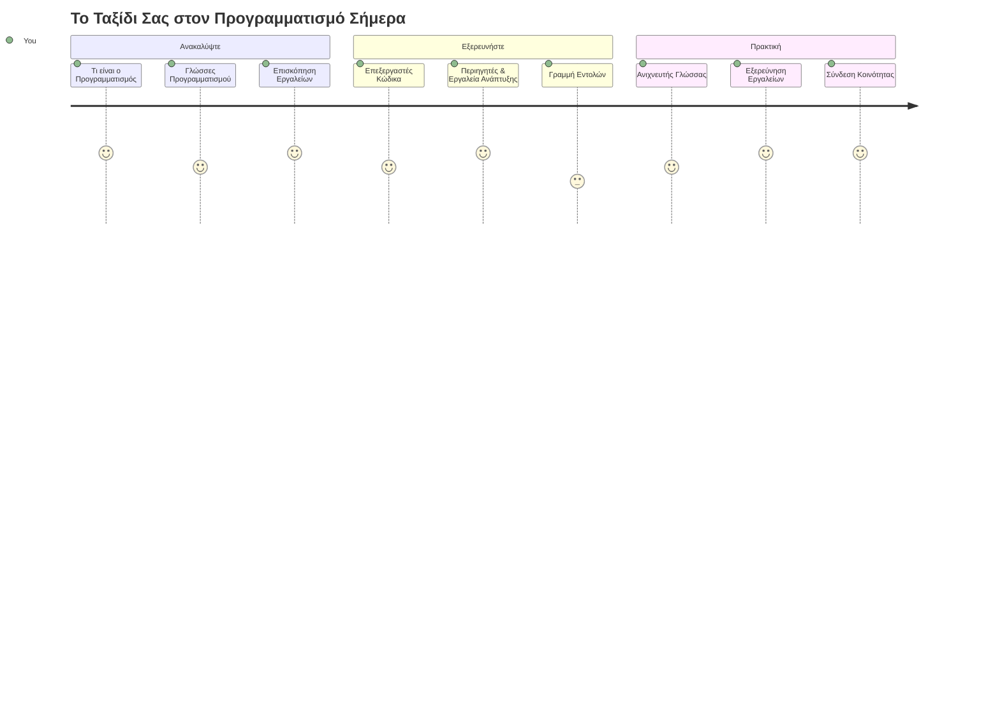
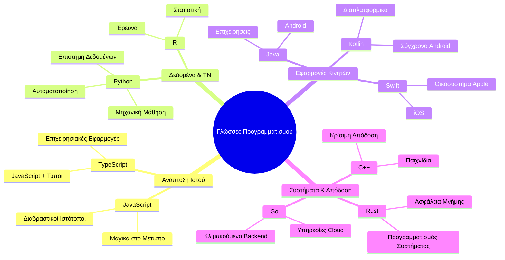
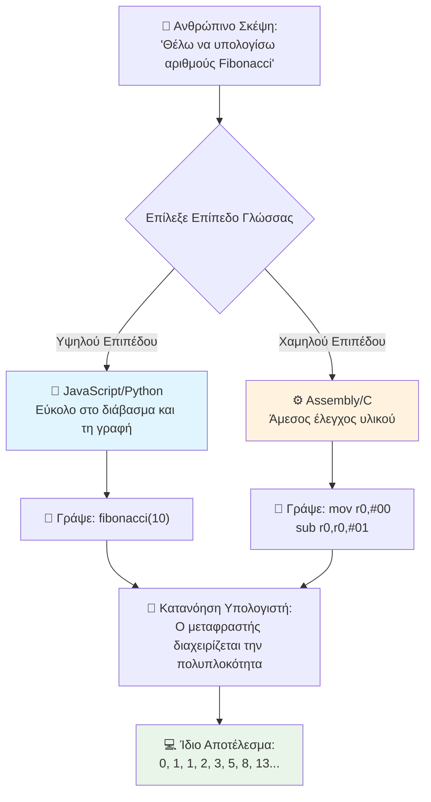
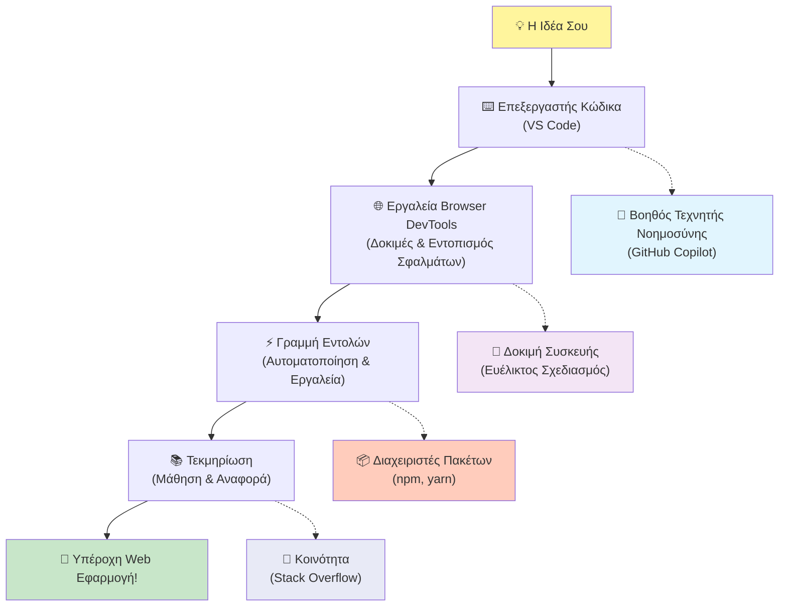
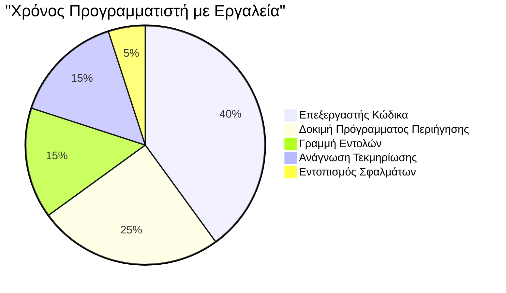
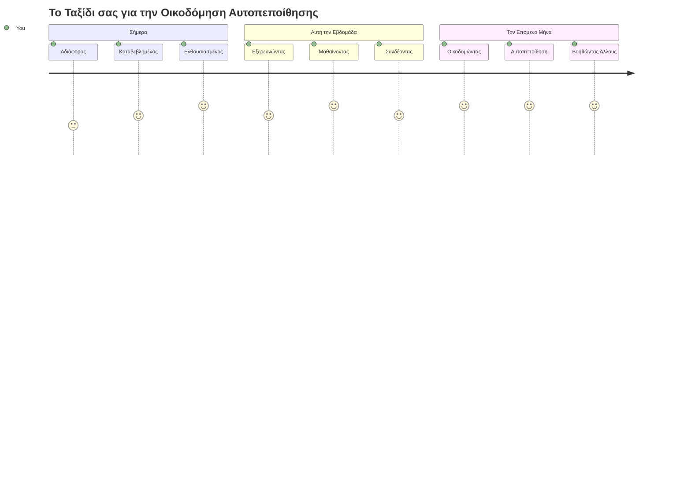

# Εισαγωγή στις Γλώσσες Προγραμματισμού και τα Σύγχρονα Εργαλεία Προγραμματιστών

Γεια σου, μέλλον developer! 👋 Μπορώ να σου πω κάτι που ακόμα με ανατριχιάζει κάθε μέρα; Είσαι έτοιμος να ανακαλύψεις πως ο προγραμματισμός δεν έχει να κάνει μόνο με τους υπολογιστές – έχει να κάνει με το να έχεις πραγματικές υπερδυνάμεις για να ζωντανέψεις τις πιο τρελές σου ιδέες!

Ξέρεις εκείνη τη στιγμή που χρησιμοποιείς την αγαπημένη σου εφαρμογή και όλα λειτουργούν τέλεια; Όταν πατάς ένα κουμπί και συμβαίνει κάτι μαγικό που σε κάνει να λες "ουάου, πώς ΤΟ ΕΚΑΝΑΝ;" Λοιπόν, κάποιος ακριβώς σαν κι εσένα – πιθανότατα καθισμένος στο αγαπημένο του καφέ στις 2 τα ξημερώματα με τον τρίτο εσπρέσο του – έγραψε τον κώδικα που δημιούργησε αυτή τη μαγεία. Και εδώ είναι αυτό που θα σε συναρπάσει: μέχρι το τέλος αυτού του μαθήματος, όχι μόνο θα καταλάβεις πώς το έκαναν, αλλά θα είσαι ανυπόμονος να το δοκιμάσεις μόνος σου!

Κοίτα, καταλαβαίνω απόλυτα αν ο προγραμματισμός σου φαίνεται τρομακτικός τώρα. Όταν ξεκίνησα, πίστευα ειλικρινά πως έπρεπε να είσαι κάποιο είδος μαθηματικού ιδιοφυούς ή να κωδικοποιείς από τότε που ήσουν πέντε χρονών. Αλλά εδώ είναι τι άλλαξε εντελώς την οπτική μου: ο προγραμματισμός είναι ακριβώς σαν να μαθαίνεις να κάνεις συζητήσεις σε μια νέα γλώσσα. Αρχίζεις με "γεια" και "ευχαριστώ," μετά φτάνεις στο να παραγγέλνεις καφέ, και πριν το καταλάβεις, κάνεις βαθιές φιλοσοφικές συζητήσεις! Εκτός που σε αυτήν την περίπτωση, κάνεις συζητήσεις με υπολογιστές, και ειλικρινά; Είναι οι πιο υπομονετικοί συνομιλητές που θα έχεις ποτέ – ποτέ δεν κρίνουν τα λάθη σου και πάντα ανυπομονούν να προσπαθήσουν ξανά!

Σήμερα, θα εξερευνήσουμε τα απίστευτα εργαλεία που κάνουν τη σύγχρονη ανάπτυξη ιστοσελίδων όχι μόνο δυνατή, αλλά σοβαρά εθιστική. Μιλάω για τους ίδιους ακριβώς επεξεργαστές, browsers και ροές εργασίας που χρησιμοποιούν καθημερινά προγραμματιστές στη Netflix, Spotify και στο αγαπημένο σου indie στούντιο εφαρμογών. Και εδώ είναι το μέρος που θα σε κάνει να χορέψεις από χαρά: τα περισσότερα από αυτά τα επαγγελματικά, βιομηχανικού επιπέδου εργαλεία είναι εντελώς δωρεάν!


> Σχεδιάγραμμα από [Tomomi Imura](https://twitter.com/girlie_mac)


```mermaid
journey
    title Το Ταξίδι Σας στον Προγραμματισμό Σήμερα
    section Ανακαλύψτε
      Τι είναι ο Προγραμματισμός: 5: You
      Γλώσσες Προγραμματισμού: 4: You
      Επισκόπηση Εργαλείων: 5: You
    section Εξερευνήστε
      Επεξεργαστές Κώδικα: 4: You
      Περιηγητές & Εργαλεία Ανάπτυξης: 5: You
      Γραμμή Εντολών: 3: You
    section Πρακτική
      Ανιχνευτής Γλώσσας: 4: You
      Εξερεύνηση Εργαλείων: 5: You
      Σύνδεση Κοινότητας: 5: You
```
## Ας Δούμε Τι Γνωρίζεις Ήδη!

Πριν πηδήξουμε στα διασκεδαστικά πράγματα, είμαι περίεργος – τι γνωρίζεις ήδη για αυτόν τον κόσμο του προγραμματισμού; Και άκου, αν κοιτάς αυτές τις ερωτήσεις σκεπτόμενος "δεν έχω απολύτως καμία ιδέα για τίποτα από αυτά," αυτό δεν είναι απλώς οκ, είναι τέλειο! Σημαίνει πως βρίσκεσαι ακριβώς στο σωστό μέρος. Σκέψου αυτό το κουίζ σαν ζέσταμα πριν τη γυμναστική – απλώς ζεσταίνουμε τους εγκεφαλικούς μύες!

[Κάνε το προκαταρκτικό κουίζ](https://ff-quizzes.netlify.app/web/)


## Η Περιπέτεια Που Θα Ζήσουμε Μαζί

Εντάξει, είμαι πραγματικά γεμάτος ενθουσιασμό για αυτά που θα εξερευνήσουμε σήμερα! Σοβαρά, θα ήθελα να δω το πρόσωπό σου όταν κάποιες από αυτές τις έννοιες σου "κάνουν κλικ". Να το απίστευτο ταξίδι που θα κάνουμε μαζί:

- **Τι είναι πραγματικά ο προγραμματισμός (και γιατί είναι το πιο απίθανο πράγμα ποτέ!)** – Θα ανακαλύψουμε πώς ο κώδικας είναι κυριολεκτικά η αόρατη μαγεία που κινεί τα πάντα γύρω σου, από αυτό το ξυπνητήρι που κατά κάποιον τρόπο ξέρει ότι είναι Δευτέρα πρωί μέχρι τον αλγόριθμο που επιμελεί τέλεια τις προτάσεις στο Netflix σου
- **Γλώσσες προγραμματισμού και οι υπέροχες προσωπικότητές τους** – Φαντάσου πως μπαίνεις σε ένα πάρτι όπου ο καθένας έχει εντελώς διαφορετικές υπερδυνάμεις και τρόπους επίλυσης προβλημάτων. Έτσι είναι ο κόσμος των γλωσσών προγραμματισμού, και θα λατρέψεις να τις γνωρίσεις!
- **Τα βασικά δομικά στοιχεία που κάνουν τη ψηφιακή μαγεία να συμβαίνει** – Σκέψου τα σαν το απόλυτο δημιουργικό σετ LEGO. Μόλις καταλάβεις πώς ταιριάζουν αυτά τα κομμάτια, θα συνειδητοποιήσεις πως μπορείς κυριολεκτικά να κατασκευάσεις οτιδήποτε ονειρεύεται η φαντασία σου
- **Επαγγελματικά εργαλεία που θα σε κάνουν να νιώθεις σα να σου έδωσαν το ραβδί ενός μάγου** – Δεν είμαι δραματικός εδώ – αυτά τα εργαλεία θα σε κάνουν πραγματικά να νιώθεις ότι έχεις υπερδυνάμεις, και το καλύτερο; Είναι τα ίδια που χρησιμοποιούν οι επαγγελματίες!

> 💡 **Να το θυμάσαι**: Μην προσπαθήσεις καν να απομνημονεύσεις τα πάντα σήμερα! Τώρα, απλώς θέλω να νιώσεις αυτή τη σπίθα ενθουσιασμού για το τι είναι δυνατόν. Οι λεπτομέρειες θα κολλήσουν φυσικά καθώς εξασκουμαστε μαζί – έτσι μαθαίνει κανείς πραγματικά!

> Μπορείς να πάρεις αυτό το μάθημα στο [Microsoft Learn](https://learn.microsoft.com/en-us/learn/modules/web-development-101/introduction-programming/?WT.mc_id=academic-77807-sagibbon)!

## Λοιπόν Τι Ακριβώς *Είναι* Ο Προγραμματισμός;

Εντάξει, ας αντιμετωπίσουμε την ερώτηση του εκατομμυρίου: τι είναι πραγματικά ο προγραμματισμός;

Θα σου πω μια ιστορία που άλλαξε εντελώς την οπτική μου για αυτό. Την προηγούμενη εβδομάδα, προσπαθούσα να εξηγήσω στη μαμά μου πώς να χρησιμοποιεί το νέο έξυπνο τηλεχειριστήριο της τηλεόρασης. Πιάστηκα να λέω πράγματα όπως "πάτα το κόκκινο κουμπί, αλλά όχι το μεγάλο κόκκινο, το μικρό κόκκινο στα αριστερά... όχι, το άλλο σου αριστερά... εντάξει, κράτα το για δύο δευτερόλεπτα, όχι ένα, όχι τρία..." Σου θυμίζει κάτι; 😅

Αυτός είναι ο προγραμματισμός! Είναι η τέχνη του να δίνεις απίστευτα λεπτομερείς, βήμα-βήμα οδηγίες σε κάτι που είναι πολύ ισχυρό αλλά χρειάζεται να του εξηγείς τα πάντα τέλεια. Αλλά αντί να εξηγείς στη μαμά σου (που μπορεί να ρωτήσει "ποιο κόκκινο κουμπί;"), εξηγείς σε έναν υπολογιστή (που απλώς κάνει ακριβώς ό,τι του λες, ακόμα κι αν αυτό που είπες δεν είναι ακριβώς αυτό που εννοούσες).

Εδώ είναι τι με άφησε άφωνο όταν το έμαθα: οι υπολογιστές είναι στην ουσία πολύ απλοί στην καρδιά τους. Καταλαβαίνουν κυριολεκτικά μόνο δύο πράγματα – το 1 και το 0, που είναι βασικά "ναι" και "όχι" ή "αναμμένο" και "σβηστό". Αυτό είναι όλο! Αλλά εδώ μπαίνει η μαγεία – δεν χρειάζεται να μιλάμε μόνο σε 1 και 0 σαν να είμαστε στη "Μάτριξ". Εκεί έρχονται να βοηθήσουν **οι γλώσσες προγραμματισμού**. Είναι σαν να έχεις τον καλύτερο μεταφραστή στον κόσμο που παίρνει τις κανονικές σου ανθρώπινες σκέψεις και τις μετατρέπει σε γλώσσα υπολογιστή.

Και εδώ είναι τι ακόμα με κάνει να ανατριχιάζω κάθε πρωί που ξυπνάω: κυριολεκτικά *όλα* τα ψηφιακά πράγματα στη ζωή σου ξεκίνησαν από κάποιον ακριβώς σαν κι εσένα, πιθανώς καθισμένο με τις πιτζάμες του με ένα φλιτζάνι καφέ, να γράφει κώδικα στον φορητό του υπολογιστή. Αυτό το φίλτρο του Instagram που σε κάνει να φαίνεσαι τέλειος; Κάποιος το κωδικοποίησε. Η πρόταση που σε οδήγησε στο νέο σου αγαπημένο τραγούδι; Ένας προγραμματιστής έφτιαξε αυτόν τον αλγόριθμο. Η εφαρμογή που σε βοηθά να χωρίσεις το λογαριασμό του δείπνου με φίλους; Ναι, κάποιος σκέφτηκε "αυτό ενοχλεί, σίγουρα μπορώ να το διορθώσω" και μετά... το έκανε!

Όταν μαθαίνεις να προγραμματίζεις, δεν απλώς μαθαίνεις μια νέα δεξιότητα – γίνεσαι μέρος αυτής της απίστευτης κοινότητας ανθρώπων που λύνουν προβλήματα και περνούν τις μέρες τους σκεπτόμενοι, "Τι θα γινόταν αν μπορούσα να φτιάξω κάτι που να κάνει την μέρα κάποιου λίγο καλύτερη;" Ειλικρινά, υπάρχει κάτι πιο φοβερό από αυτό;

✅ **Εύρεση Διασκεδαστικού Στοιχείου**: Να κάτι πολύ ωραίο να ψάξεις όταν έχεις λίγο χρόνο – ποιος πιστεύεις πως ήταν ο πρώτος προγραμματιστής υπολογιστών στον κόσμο; Θα σου δώσω μια υπόδειξη: μπορεί να μην είναι αυτός που περιμένεις! Η ιστορία αυτού του ανθρώπου είναι απολύτως συναρπαστική και δείχνει πως ο προγραμματισμός πάντα είχε να κάνει με δημιουργική επίλυση προβλημάτων και σκέψη έξω από τα συνηθισμένα.

### 🧠 **Έλεγχος Κατάστασης: Πώς νιώθεις;**

**Πάρε μια στιγμή να συλλογιστείς:**
- Σε βοηθάει τώρα η ιδέα του "να δίνεις οδηγίες σε υπολογιστές";
- Μπορείς να σκεφτείς μια καθημερινή εργασίας που θα ήθελες να αυτοματοποιήσεις με προγραμματισμό;
- Ποιες ερωτήσεις σού έρχονται στο μυαλό για αυτό το όλο θέμα του προγραμματισμού;

> **Να θυμάσαι**: Είναι τελείως φυσιολογικό αν κάποιες έννοιες σου φαίνονται θολές τώρα. Ο προγραμματισμός είναι σαν να μαθαίνεις μια καινούρια γλώσσα – χρειάζεται χρόνο ο εγκέφαλός σου να χτίσει αυτά τα νευρωνικά μονοπάτια. Τα πας τέλεια!

## Οι Γλώσσες Προγραμματισμού Είναι Σαν Διάφορες Γεύσεις Μαγείας

Εντάξει, αυτό θα ακούγεται περίεργο, αλλά μείνε μαζί μου – οι γλώσσες προγραμματισμού είναι πολύ σαν διαφορετικά είδη μουσικής. Σκέψου το: έχεις jazz, που είναι ομαλή και αυτοσχεδιαστική, rock που είναι δυνατή και ευθεία, κλασική που είναι κομψή και δομημένη, και hip-hop που είναι δημιουργική και εκφραστική. Κάθε στυλ έχει τη δική του αίσθηση, τη δική του κοινότητα παθιασμένων θαυμαστών, και κάθε ένα είναι τέλειο για διαφορετικές διαθέσεις και περιστάσεις.

Οι γλώσσες προγραμματισμού λειτουργούν ακριβώς το ίδιο! Δεν θα χρησιμοποιούσες την ίδια γλώσσα για να φτιάξεις ένα διασκεδαστικό παιχνίδι κινητού με αυτή που θα χρησιμοποιούσες για να επεξεργαστείς τεράστια δεδομένα κλίματος, όπως δεν θα έβαζες death metal σε μάθημα γιόγκα (τουλάχιστον στα περισσότερα μαθήματα γιόγκα! 😄).

Αλλά εδώ είναι τι με εντυπωσιάζει κάθε φορά που το σκέφτομαι: αυτές οι γλώσσες είναι σαν να έχεις τον πιο υπομονετικό, λαμπρό διερμηνέα στον κόσμο που κάθεται δίπλα σου. Μπορείς να εκφράσεις τις ιδέες σου με τρόπο που να νιώθει φυσικός για το ανθρώπινο μυαλό σου, κι εκείνες αναλαμβάνουν όλη την απίστευτα πολύπλοκη δουλειά της μετάφρασης σε 1 και 0 που μιλούν οι υπολογιστές. Είναι σαν να έχεις έναν φίλο που μιλάει τέλεια και τις δύο γλώσσες, "ανθρώπινη δημιουργικότητα" και "λογική υπολογιστή" – και ποτέ δεν κουράζεται, δεν χρειάζεται διαλείμματα καφέ, και δεν σου κάνει κριτική αν ρωτάς την ίδια ερώτηση δυο φορές!

### Δημοφιλείς Γλώσσες Προγραμματισμού και Χρήσεις τους


```mermaid
mindmap
  root((Γλώσσες Προγραμματισμού))
    Ανάπτυξη Ιστού
      JavaScript
        Μαγικά στο Μέτωπο
        Διαδραστικοί Ιστότοποι
      TypeScript
        JavaScript + Τύποι
        Επιχειρησιακές Εφαρμογές
    Δεδομένα & ΤΝ
      Python
        Επιστήμη Δεδομένων
        Μηχανική Μάθηση
        Αυτοματοποίηση
      R
        Στατιστική
        Έρευνα
    Εφαρμογές Κινητών
      Java
        Android
        Επιχειρήσεις
      Swift
        iOS
        Οικοσύστημα Apple
      Kotlin
        Σύγχρονο Android
        Διαπλατφορμικό
    Συστήματα & Απόδοση
      C++
        Παιχνίδια
        Κρίσιμη Απόδοση
      Rust
        Ασφάλεια Μνήμης
        Προγραμματισμός Συστήματος
      Go
        Υπηρεσίες Cloud
        Κλιμακούμενο Backend
```
| Γλώσσα | Καλύτερη για | Γιατί είναι δημοφιλής |
|--------|--------------|---------------------|
| **JavaScript** | Ανάπτυξη ιστού, διεπαφές χρήστη | Τρέχει σε browsers και υποστηρίζει διαδραστικές ιστοσελίδες |
| **Python** | Επιστήμη δεδομένων, αυτοματοποίηση, ΤΝ | Εύκολη στην ανάγνωση και εκμάθηση, ισχυρές βιβλιοθήκες |
| **Java** | Εταιρικές εφαρμογές, εφαρμογές Android | Ανεξάρτητη πλατφόρμα, ανθεκτική σε μεγάλα συστήματα |
| **C#** | Εφαρμογές Windows, ανάπτυξη παιχνιδιών | Ισχυρή υποστήριξη οικοσυστήματος της Microsoft |
| **Go** | Υπηρεσίες cloud, backend συστήματα | Γρήγορη, απλή, σχεδιασμένη για σύγχρονο υπολογισμό |

### Γλώσσες Υψηλού Επίπεδου vs. Χαμηλού Επίπεδου

Εντάξει, αυτή ήταν ειλικρινά η έννοια που μου "έσπασε" το μυαλό όταν ξεκίνησα, οπότε θα μοιραστώ την αναλογία που τελικά την έκανε να "κλικάρει" μέσα μου – και ελπίζω να βοηθήσει και εσένα!

Φαντάσου ότι επισκέπτεσαι μια χώρα όπου δεν μιλάς τη γλώσσα, και χρειάζεσαι απεγνωσμένα να βρεις την πιο κοντινή τουαλέτα (όλοι το έχουμε περάσει, σωστά; 😅):

- **Χαμηλού επιπέδου προγραμματισμός** είναι σαν να μαθαίνεις τόσο καλά το τοπικό ιδίωμα ώστε να μπορείς να μιλάς με τη γιαγιά που πουλάει φρούτα στη γωνία χρησιμοποιώντας πολιτισμικές αναφορές, τοπική σλανγκ και εσωτερικά αστεία που μόνο κάποιος που μεγάλωσε εκεί θα καταλάβαινε. Πολύ εντυπωσιακό και απίστευτα αποτελεσματικό... αν μιλάς άπταιστα! Αλλά αρκετά δύσκολο όταν απλώς ψάχνεις ένα μπάνιο.

- **Υψηλού επιπέδου προγραμματισμός** είναι σαν να έχεις εκείνον τον φανταστικό ντόπιο φίλο που απλά σε καταλαβαίνει. Μπορείς να πεις "Πραγματικά χρειάζομαι να βρω μια τουαλέτα" στα αγγλικά, και εκείνος αναλαμβάνει όλη τη μετάφραση και σου δίνει οδηγίες με τρόπο που κάνει τέλεια λογική για το μη ντόπιο μυαλό σου.

Σε όρους προγραμματισμού:
- **Γλώσσες χαμηλού επιπέδου** (όπως Assembly ή C) σου επιτρέπουν να έχεις απίστευτα λεπτομερείς συνομιλίες με το υλικό του υπολογιστή (hardware), αλλά πρέπει να σκέφτεσαι σαν μηχανή, κάτι που... ας πούμε είναι μια μεγάλη νοητική αλλαγή!
- **Γλώσσες υψηλού επιπέδου** (όπως JavaScript, Python ή C#) σε αφήνουν να σκέφτεσαι σαν άνθρωπος ενώ εκείνες διαχειρίζονται όλη τη γλώσσα της μηχανής στο παρασκήνιο. Επιπλέον, έχουν αυτές τις απίστευτα φιλόξενες κοινότητες γεμάτες με ανθρώπους που θυμούνται πώς είναι να είσαι αρχάριος και πραγματικά θέλουν να βοηθήσουν!

Μάντεψε με ποια θα σου προτείνω να ξεκινήσεις; 😉 Οι γλώσσες υψηλού επιπέδου είναι σαν να φοράς βοηθητικές ρόδες που δεν θέλεις ποτέ να βγάλεις γιατί κάνουν όλη την εμπειρία πολύ πιο ευχάριστη!


```mermaid
flowchart TB
    A["👤 Ανθρώπινο Σκέψη:<br/>'Θέλω να υπολογίσω αριθμούς Fibonacci'"] --> B{Επίλεξε Επίπεδο Γλώσσας}
    
    B -->|Υψηλού Επιπέδου| C["🌟 JavaScript/Python<br/>Εύκολο στο διάβασμα και τη γραφή"]
    B -->|Χαμηλού Επιπέδου| D["⚙️ Assembly/C<br/>Άμεσος έλεγχος υλικού"]
    
    C --> E["📝 Γράψε: fibonacci(10)"]
    D --> F["📝 Γράψε: mov r0,#00<br/>sub r0,r0,#01"]
    
    E --> G["🤖 Κατανόηση Υπολογιστή:<br/>Ο μεταφραστής διαχειρίζεται την πολυπλοκότητα"]
    F --> G
    
    G --> H["💻 Ίδιο Αποτέλεσμα:<br/>0, 1, 1, 2, 3, 5, 8, 13..."]
    
    style C fill:#e1f5fe
    style D fill:#fff3e0
    style H fill:#e8f5e8
```
### Άφησέ με να σου Δείξω Γιατί Οι Γλώσσες Υψηλού Επίπεδου Είναι Πιο Φιλικές

Εντάξει, πρόκειται να σου δείξω κάτι που δείχνει τέλεια γιατί ερωτεύτηκα τις γλώσσες υψηλού επιπέδου, αλλά πρώτα – θέλω να μου υποσχεθείς κάτι. Όταν δεις το πρώτο παράδειγμα κώδικα, μην πανικοβληθείς! Είναι φτιαγμένο να φαίνεται λίγο τρομακτικό. Αυτό είναι ακριβώς το σημείο που θέλω να κάνω!

Θα δούμε την ίδια ακριβώς εργασία γραμμένη με δύο εντελώς διαφορετικά στυλ. Και τα δύο δημιουργούν αυτό που λέγεται ακολουθία Fibonacci – είναι αυτό το όμορφο μαθηματικό μοτίβο όπου κάθε αριθμός είναι το άθροισμα των δύο προηγούμενων: 0, 1, 1, 2, 3, 5, 8, 13... (Διασκεδαστικό στοιχείο: θα βρεις αυτό το μοτίβο κυριολεκτικά παντού στη φύση – στις σπείρες των ηλίανθων, στα σχέδια των κουκουναριών, ακόμα και στον τρόπο που σχηματίζονται οι γαλαξίες!)

Έτοιμος να δεις τη διαφορά; Πάμε!

**Γλώσσα υψηλού επιπέδου (JavaScript) – Φιλική προς τον άνθρωπο:**

```javascript
// Βήμα 1: Βασική ρύθμιση Fibonacci
const fibonacciCount = 10;
let current = 0;
let next = 1;

console.log('Fibonacci sequence:');
```

**Αυτός ο κώδικας κάνει:**
- **Δηλώνει** μια σταθερά για να καθορίσει πόσους αριθμούς Fibonacci θέλουμε να παράγουμε
- **Αρχικοποιεί** δύο μεταβλητές για να παρακολουθεί τους τρέχοντες και επόμενους αριθμούς στην ακολουθία
- **Ορίζει** τις αρχικές τιμές (0 και 1) που ορίζουν το μοτίβο Fibonacci
- **Εμφανίζει** ένα μήνυμα κεφαλίδας για να αναγνωρίζει την έξοδο μας

```javascript
// Βήμα 2: Δημιουργήστε την ακολουθία με βρόχο
for (let i = 0; i < fibonacciCount; i++) {
  console.log(`Position ${i + 1}: ${current}`);
  
  // Υπολογίστε τον επόμενο αριθμό στην ακολουθία
  const sum = current + next;
  current = next;
  next = sum;
}
```

**Ανάλυση για το τι συμβαίνει εδώ:**
- **Επαναλαμβάνει** κάθε θέση στην ακολουθία μας χρησιμοποιώντας ένα βρόχο `for`
- **Εμφανίζει** κάθε αριθμό με τη θέση του χρησιμοποιώντας μορφοποίηση με template literals
- **Υπολογίζει** τον επόμενο αριθμό Fibonacci προσθέτοντας τους τρέχοντες και τους επόμενους αριθμούς
- **Ενημερώνει** τις μεταβλητές παρακολούθησης για να προχωρήσει στην επόμενη επανάληψη

```javascript
// Βήμα 3: Σύγχρονη λειτουργική προσέγγιση
const generateFibonacci = (count) => {
  const sequence = [0, 1];
  
  for (let i = 2; i < count; i++) {
    sequence[i] = sequence[i - 1] + sequence[i - 2];
  }
  
  return sequence;
};

// Παράδειγμα χρήσης
const fibSequence = generateFibonacci(10);
console.log(fibSequence);
```

**Στον παραπάνω κώδικα:**
- **Δημιουργήσαμε** μια επαναχρησιμοποιήσιμη συνάρτηση χρησιμοποιώντας τη σύγχρονη σύνταξη βέλους (arrow function)
- **Έχτισε** έναν πίνακα για να αποθηκεύσει ολόκληρη την ακολουθία αντί να την εμφανίζει έναν-έναν
- **Χρησιμοποίησε** ευρετήριο πίνακα (array indexing) για να υπολογίσει κάθε νέο αριθμό από προηγούμενες τιμές
- **Επέστρεψε** ολόκληρη την ακολουθία για ευέλικτη χρήση σε άλλα μέρη του προγράμματος

**Γλώσσα χαμηλού επιπέδου (ARM Assembly) – Φιλική προς τον υπολογιστή:**

```assembly
 area ascen,code,readonly
 entry
 code32
 adr r0,thumb+1
 bx r0
 code16
thumb
 mov r0,#00
 sub r0,r0,#01
 mov r1,#01
 mov r4,#10
 ldr r2,=0x40000000
back add r0,r1
 str r0,[r2]
 add r2,#04
 mov r3,r0
 mov r0,r1
 mov r1,r3
 sub r4,#01
 cmp r4,#00
 bne back
 end
```

Παρατήρησε πώς η έκδοση σε JavaScript διαβάζεται σχεδόν σαν οδηγίες στα αγγλικά, ενώ η έκδοση σε Assembly χρησιμοποιεί κρυπτογραφικές εντολές που ελέγχουν απευθείας τον επεξεργαστή του υπολογιστή. Και οι δύο εκτελούν την ίδια εργασία, αλλά η γλώσσα υψηλού επιπέδου είναι πολύ πιο εύκολη για τους ανθρώπους να καταλάβουν, να γράψουν και να συντηρήσουν.

**Κύριες διαφορές που θα παρατηρήσεις:**
- **Αναγνωσιμότητα**: Η JavaScript χρησιμοποιεί περιγραφικά ονόματα όπως `fibonacciCount`, ενώ η Assembly χρησιμοποιεί αινιγματικές ετικέτες όπως `r0`, `r1`
- **Σχόλια**: Οι γλώσσες υψηλού επιπέδου ενθαρρύνουν επεξηγηματικά σχόλια που καθιστούν τον κώδικα αυτο-επεξηγηματικό
- **Δομή**: Η λογική ροή της JavaScript αντιστοιχεί στο πώς οι άνθρωποι σκέφτονται τα προβλήματα βήμα-βήμα
- **Συντήρηση**: Η ενημέρωση της έκδοσης της JavaScript για διαφορετικές απαιτήσεις είναι απλή και καθαρή

✅ **Σχετικά με την ακολουθία Fibonacci**: Αυτό το απολύτως πανέμορφο μοτίβο αριθμών (όπου κάθε αριθμός ισούται με το άθροισμα των δύο προηγούμενων: 0, 1, 1, 2, 3, 5, 8...) εμφανίζεται κυριολεκτικά *παντού* στη φύση! Το βρίσκεις στα σπιράλ του ηλιοτρόπιου, στα μοτίβα των κουκουναριών, στον τρόπο που καμπυλώνουν τα κοχύλια ναυτίλου και ακόμη και στον τρόπο που αναπτύσσονται τα κλαδιά των δέντρων. Είναι πραγματικά εκπληκτικό το πώς τα μαθηματικά και ο κώδικας μπορούν να μας βοηθήσουν να κατανοήσουμε και να αναπαραστήσουμε τα μοτίβα που χρησιμοποιεί η φύση για να δημιουργήσει ομορφιά!


## Οι Βασικοί Λίθοι που Δημιουργούν τη Μαγεία

Εντάξει, τώρα που είδες πώς μοιάζουν οι γλώσσες προγραμματισμού στην πράξη, ας αναλύσουμε τα θεμελιώδη κομμάτια που συνθέτουν κυριολεκτικά κάθε πρόγραμμα που έχει γραφτεί ποτέ. Σκέψου τα ως τα βασικά συστατικά στην αγαπημένη σου συνταγή – μόλις καταλάβεις τι κάνει το καθένα, θα μπορείς να διαβάζεις και να γράφεις κώδικα σε σχεδόν κάθε γλώσσα!

Αυτό είναι κάπως σαν να μαθαίνεις τη γραμματική του προγραμματισμού. Θυμάσαι στο σχολείο όταν μάθαινες για ουσιαστικά, ρήματα και πώς φτιάχνεις προτάσεις; Ο προγραμματισμός έχει τη δική του εκδοχή γραμματικής, και ειλικρινά, είναι πολύ πιο λογική και επιεικής από τη γραμματική της Αγγλικής γλώσσας! 😄

### Δηλώσεις: Οι Οδηγίες Βήμα-Βήμα

Ας ξεκινήσουμε με τις **δηλώσεις** – αυτές είναι σαν ξεχωριστές προτάσεις σε μια συνομιλία με τον υπολογιστή σου. Κάθε δήλωση λέει στον υπολογιστή να κάνει ένα συγκεκριμένο πράγμα, σαν να δίνεις οδηγίες: "Στρίψε αριστερά εδώ," "Στάσου στο κόκκινο φανάρι," "Πάρκαρε σε αυτή τη θέση."

Αυτό που λατρεύω στις δηλώσεις είναι πόσο εύκολα αναγνώσιμες είναι συνήθως. Ρίξε μια ματιά:

```javascript
// Βασικές δηλώσεις που εκτελούν μεμονωμένες ενέργειες
const userName = "Alex";                    
console.log("Hello, world!");              
const sum = 5 + 3;                         
```

**Αυτό κάνει ο κώδικας:**
- **Δήλωση** μιας σταθερής μεταβλητής για να αποθηκευτεί το όνομα ενός χρήστη
- **Εμφάνιση** μηνύματος χαιρετισμού στην κονσόλα
- **Υπολογισμός** και αποθήκευση του αποτελέσματος μιας μαθηματικής πράξης

```javascript
// Δηλώσεις που αλληλεπιδρούν με ιστοσελίδες
document.title = "My Awesome Website";      
document.body.style.backgroundColor = "lightblue";
```

**Βήμα-βήμα, αυτό συμβαίνει:**
- **Τροποποίηση** του τίτλου της ιστοσελίδας που εμφανίζεται στην καρτέλα του προγράμματος περιήγησης
- **Αλλαγή** του χρώματος φόντου ολόκληρου του σώματος της σελίδας

### Μεταβλητές: Το Σύστημα Μνήμης του Προγράμματός Σου

Εντάξει, οι **μεταβλητές** είναι ειλικρινά μία από τις αγαπημένες μου έννοιες για να διδάξω επειδή μοιάζουν πολύ με πράγματα που ήδη χρησιμοποιείς καθημερινά!

Σκέψου για μια στιγμή τη λίστα επαφών στο τηλέφωνό σου. Δεν απομνημονεύεις όλους τους αριθμούς τηλεφώνου – αντίθετα, αποθηκεύεις "Μαμά," "Καλός Φίλος" ή "Πιτσαρία που Παραδίδει ως τις 2 το πρωί" και αφήνεις το τηλέφωνό σου να θυμάται τους πραγματικούς αριθμούς. Οι μεταβλητές λειτουργούν ακριβώς έτσι! Είναι σαν ετικετοποιημένα δοχεία όπου το πρόγραμμά σου μπορεί να αποθηκεύσει πληροφορίες και να τις ανακτήσει αργότερα χρησιμοποιώντας ένα όνομα που έχει νόημα.

Το πραγματικά ωραίο είναι: οι μεταβλητές μπορούν να αλλάζουν όσο τρέχει το πρόγραμμά σου (γι’ αυτό και λέγονται "μεταβλητές" – βλέπεις τι έκαναν εκεί;). Όπως μπορείς να ενημερώσεις την επαφή της πιτσαρίας όταν βρεις κάτι ακόμα καλύτερο, έτσι και οι μεταβλητές μπορούν να ενημερώνονται καθώς το πρόγραμμά σου μαθαίνει νέα στοιχεία ή οι καταστάσεις μεταβάλλονται!

Άσε με να σου δείξω πόσο όμορφα απλό μπορεί να είναι αυτό:

```javascript
// Βήμα 1: Δημιουργία βασικών μεταβλητών
const siteName = "Weather Dashboard";        
let currentWeather = "sunny";               
let temperature = 75;                       
let isRaining = false;                      
```

**Κατανόηση αυτών των εννοιών:**
- **Αποθήκευση** αμετάβλητων τιμών σε `const` μεταβλητές (όπως το όνομα του ιστότοπου)
- **Χρήση** `let` για τιμές που μπορεί να αλλάζουν σε όλο το πρόγραμμα
- **Ανάθεση** διαφορετικών τύπων δεδομένων: συμβολοσειρές (κείμενο), αριθμοί, και boolean (true/false)
- **Επιλογή** περιγραφικών ονομάτων που εξηγούν τι περιέχει κάθε μεταβλητή

```javascript
// Βήμα 2: Εργασία με αντικείμενα για ομαδοποίηση σχετικών δεδομένων
const weatherData = {                       
  location: "San Francisco",
  humidity: 65,
  windSpeed: 12
};
```

**Στο παραπάνω, έχουμε:**
- **Δημιουργήσει** ένα αντικείμενο για να ομαδοποιήσουμε σχετικές πληροφορίες καιρού
- **Οργανώσει** πολλαπλά δεδομένα κάτω από ένα όνομα μεταβλητής
- **Χρησιμοποιήσει** ζεύγη κλειδιών-τιμών για να επισημάνουμε καθαρά κάθε κομμάτι πληροφορίας

```javascript
// Βήμα 3: Χρήση και ενημέρωση μεταβλητών
console.log(`${siteName}: Today is ${currentWeather} and ${temperature}°F`);
console.log(`Wind speed: ${weatherData.windSpeed} mph`);

// Ενημέρωση μεταβλητών που μπορούν να αλλάξουν
currentWeather = "cloudy";                  
temperature = 68;                          
```

**Ας κατανοήσουμε κάθε μέρος:**
- **Εμφάνιση** πληροφοριών χρησιμοποιώντας template literals με σύνταξη `${}`
- **Πρόσβαση** στις ιδιότητες αντικειμένων με σημειογραφία τελείας (`weatherData.windSpeed`)
- **Ενημέρωση** μεταβλητών δηλωμένων με `let` για να αντικατοπτρίζουν τις μεταβαλλόμενες συνθήκες
- **Συνδυασμός** πολλαπλών μεταβλητών για τη δημιουργία νοημάτων μηνυμάτων

```javascript
// Βήμα 4: Σύγχρονη αποσύνθεση για πιο καθαρό κώδικα
const { location, humidity } = weatherData; 
console.log(`${location} humidity: ${humidity}%`);
```

**Τι πρέπει να γνωρίζεις:**
- **Εξαγωγή** συγκεκριμένων ιδιοτήτων από αντικείμενα χρησιμοποιώντας ανασύνθεση (destructuring assignment)
- **Δημιουργία** νέων μεταβλητών αυτόματα με τα ίδια ονόματα όπως τα κλειδιά του αντικειμένου
- **Απλοποίηση** του κώδικα αποφεύγοντας την επαναλαμβανόμενη σημειογραφία τελείας

### Ροή Ελέγχου: Διδάσκοντας στο Πρόγραμμά Σου να Σκέφτεται

Εντάξει, εδώ είναι που ο προγραμματισμός γίνεται πραγματικά συναρπαστικός! Η **ροή ελέγχου** ουσιαστικά μαθαίνει στο πρόγραμμά σου πώς να παίρνει έξυπνες αποφάσεις, ακριβώς όπως κάνεις εσύ κάθε μέρα χωρίς καν να το σκέφτεσαι.

Φαντάσου το εξής: σήμερα το πρωί πιθανώς σκέφτηκες κάτι σαν "Αν βρέχει, θα πάρω ομπρέλα. Αν είναι κρύο, θα φορέσω μπουφάν. Αν αργώ, θα παραλείψω το πρωινό και θα πάρω καφέ στο δρόμο." Ο εγκέφαλός σου ακολουθεί φυσικά αυτή τη λογική "αν-τότε" δεκάδες φορές την ημέρα!

Αυτό είναι που κάνει τα προγράμματα να μοιάζουν έξυπνα και ζωντανά, αντί να ακολουθούν απλά έναν βαρετό, προβλέψιμο σενάριο. Μπορούν πραγματικά να κοιτάξουν μια κατάσταση, να αξιολογήσουν τι συμβαίνει και να ανταποκριθούν κατάλληλα. Είναι σαν να δίνεις στο πρόγραμμά σου έναν εγκέφαλο που μπορεί να προσαρμοστεί και να πάρει αποφάσεις!

Θες να δεις πόσο όμορφα δουλεύει αυτό; Άσε με να σου δείξω:

```javascript
// Βήμα 1: Βασική λογική υπό συνθήκη
const userAge = 17;

if (userAge >= 18) {
  console.log("You can vote!");
} else {
  const yearsToWait = 18 - userAge;
  console.log(`You'll be able to vote in ${yearsToWait} year(s).`);
}
```

**Αυτό κάνει ο κώδικας:**
- **Ελέγχει** αν η ηλικία του χρήστη πληροί την προϋπόθεση ψήφου
- **Εκτελεί** διαφορετικά μπλοκ κώδικα ανάλογα με το αποτέλεσμα της συνθήκης
- **Υπολογίζει** και εμφανίζει πόσος χρόνος απομένει μέχρι την επιλεξιμότητα ψήφου αν είναι κάτω των 18
- **Παρέχει** συγκεκριμένες, χρήσιμες ανατροφοδοτήσεις για κάθε σενάριο

```javascript
// Βήμα 2: Πολλαπλές συνθήκες με λογικούς τελεστές
const userAge = 17;
const hasPermission = true;

if (userAge >= 18 && hasPermission) {
  console.log("Access granted: You can enter the venue.");
} else if (userAge >= 16) {
  console.log("You need parent permission to enter.");
} else {
  console.log("Sorry, you must be at least 16 years old.");
}
```

**Ανάλυση του τι συμβαίνει εδώ:**
- **Συνδυασμός** πολλαπλών συνθηκών με τη χρήση του τελεστή `&&` (και)
- **Δημιουργία** ιεραρχίας συνθηκών με το `else if` για πολλαπλά σενάρια
- **Διαχείριση** όλων των πιθανών περιπτώσεων με τελικό `else`
- **Παροχή** σαφούς και πρακτικής ανατροφοδότησης για κάθε περίπτωση

```javascript
// Βήμα 3: Συνοπτική συνθήκη με τριμερές τελεστή
const votingStatus = userAge >= 18 ? "Can vote" : "Cannot vote yet";
console.log(`Status: ${votingStatus}`);
```

**Τι πρέπει να θυμάσαι:**
- **Χρήση** του τριαδικού τελεστή (`? :`) για απλές επιλογές δύο επιλογών
- **Γράψε** πρώτα τη συνθήκη, ακολουθούμενη από `?`, μετά το αποτέλεσμα αν αληθεύει και μετά `:`, και το αποτέλεσμα αν είναι ψευδές
- **Εφάρμοσε** αυτό το μοτίβο όταν χρειάζεται να αναθέσεις τιμές βάσει συνθηκών

```javascript
// Βήμα 4: Διαχείριση πολλαπλών συγκεκριμένων περιπτώσεων
const dayOfWeek = "Tuesday";

switch (dayOfWeek) {
  case "Monday":
  case "Tuesday":
  case "Wednesday":
  case "Thursday":
  case "Friday":
    console.log("It's a weekday - time to work!");
    break;
  case "Saturday":
  case "Sunday":
    console.log("It's the weekend - time to relax!");
    break;
  default:
    console.log("Invalid day of the week");
}
```

**Αυτός ο κώδικας επιτυγχάνει:**
- **Αντιστοίχιση** της τιμής μιας μεταβλητής με πολλαπλές συγκεκριμένες περιπτώσεις
- **Ομαδοποίηση** παρόμοιων περιπτώσεων (εργάσιμες ημέρες έναντι σαββατοκύριακων)
- **Εκτέλεση** του κατάλληλου μπλοκ κώδικα όταν βρεθεί ταύτιση
- **Συμπερίληψη** `default` περίπτωσης για απρόβλεπτες τιμές
- **Χρήση** εντολών `break` για να εμποδίσει τη συνέχεια στον επόμενο κώδικα περίπτωσης

> 💡 **Αναλογία από την πραγματική ζωή**: Σκέψου τη ροή ελέγχου σαν ένα απόλυτα υπομονετικό GPS που σου δίνει οδηγίες. Μπορεί να πει "Αν υπάρχει κίνηση στην Κεντρική Οδό, πάρε την εθνική οδό. Αν η εθνική οδός έχει έργα, δοκίμασε τη γραφική διαδρομή." Τα προγράμματα χρησιμοποιούν ακριβώς την ίδια λογική υπό συνθήκη για να ανταποκριθούν έξυπνα σε διαφορετικές καταστάσεις και να προσφέρουν πάντα την καλύτερη δυνατή εμπειρία στους χρήστες.

### 🎯 **Έλεγχος Εννοιών: Κυριαρχία στους Βασικούς Λίθους**

**Ας δούμε πώς τα πας με τα βασικά:**
- Μπορείς να εξηγήσεις τη διαφορά ανάμεσα σε μια μεταβλητή και μια δήλωση με δικά σου λόγια;
- Σκέψου ένα αληθινό σενάριο όπου θα χρησιμοποιούσες μια απόφαση "αν-τότε" (όπως το παράδειγμα της ψήφου)
- Ποιο είναι ένα πράγμα για τη λογική του προγραμματισμού που σε εξέπληξε;

**Γρήγορη ενίσχυση αυτοπεποίθησης:**

```mermaid
flowchart LR
    A["📝 Δηλώσεις<br/>(Εντολές)"] --> B["📦 Μεταβλητές<br/>(Αποθήκευση)"] --> C["🔀 Ροή Ελέγχου<br/>(Αποφάσεις)"] --> D["🎉 Λειτουργικό Πρόγραμμα!"]
    
    style A fill:#ffeb3b
    style B fill:#4caf50
    style C fill:#2196f3
    style D fill:#ff4081
```
✅ **Τι ακολουθεί**: Θα διασκεδάσουμε πολύ εξερευνώντας πιο βαθιά αυτές τις έννοιες καθώς συνεχίζουμε αυτό το απίστευτο ταξίδι μαζί! Τώρα, απλώς εστίασε στην ενθουσιασμό για όλες τις καταπληκτικές δυνατότητες που έχεις μπροστά σου. Οι συγκεκριμένες δεξιότητες και τεχνικές θα κολλήσουν φυσικά καθώς εξασκούμαστε μαζί – υπόσχομαι ότι αυτό θα είναι πολύ πιο διασκεδαστικό απ’ ό,τι φαντάζεσαι!

## Εργαλεία της Επαγγελματικής Κατασκευής

Εντάξει, ειλικρινά εδώ είμαι τόσο ενθουσιασμένος που δεν μπορώ να το συγκρατήσω! 🚀 Θα μιλήσουμε για τα απίστευτα εργαλεία που θα σου δώσουν την αίσθηση πως μόλις σου έδωσαν τα κλειδιά ενός ψηφιακού διαστημοπλοίου.

Ξέρεις πώς ένας σεφ έχει αυτά τα τέλεια ισορροπημένα μαχαίρια που νιώθεις ότι είναι προέκταση των χεριών του; Ή πώς ένας μουσικός έχει αυτή την κιθάρα που μοιάζει να τραγουδά τη στιγμή που την αγγίζει; Λοιπόν, οι προγραμματιστές έχουμε τη δική μας εκδοχή αυτών των μαγικών εργαλείων, και να σου πω τι θα σε αφήσει άφωνο – τα περισσότερα από αυτά είναι εντελώς δωρεάν!

Καθόμουν αναπηδώντας στην καρέκλα μου σκεπτόμενος να τα μοιραστώ μαζί σου γιατί έχουν αλλάξει ολοκληρωτικά τον τρόπο που κατασκευάζουμε λογισμικό. Μιλάμε για βοηθούς κωδικοποίησης με τεχνητή νοημοσύνη που μπορούν να γράψουν τον κώδικά σου (δεν αστειεύομαι!), περιβάλλοντα cloud όπου μπορείς να φτιάχνεις ολόκληρες εφαρμογές κυριολεκτικά από οπουδήποτε με Wi-Fi, και εργαλεία εντοπισμού σφαλμάτων τόσο εξελιγμένα που μοιάζουν με ακτινογραφία για τα προγράμματά σου.

Και να το μέρος που ακόμα μου προκαλεί ανατριχίλα: αυτά δεν είναι εργαλεία "για αρχάριους" που θα ξεπεράσεις γρήγορα. Είναι ακριβώς τα ίδια επαγγελματικού επιπέδου εργαλεία που χρησιμοποιούν οι προγραμματιστές στην Google, το Netflix και εκείνο το indie στούντιο εφαρμογών που αγαπάς αυτή τη στιγμή. Θα νιώσεις επαγγελματίας χρησιμοποιώντας τα!


```mermaid
graph TD
    A["💡 Η Ιδέα Σου"] --> B["⌨️ Επεξεργαστής Κώδικα<br/>(VS Code)"] 
    B --> C["🌐 Εργαλεία Browser DevTools<br/>(Δοκιμές & Εντοπισμός Σφαλμάτων)"]
    C --> D["⚡ Γραμμή Εντολών<br/>(Αυτοματοποίηση & Εργαλεία)"]
    D --> E["📚 Τεκμηρίωση<br/>(Μάθηση & Αναφορά)"]
    E --> F["🚀 Υπέροχη Web Εφαρμογή!"]
    
    B -.-> G["🤖 Βοηθός Τεχνητής Νοημοσύνης<br/>(GitHub Copilot)"]
    C -.-> H["📱 Δοκιμή Συσκευής<br/>(Ευέλικτος Σχεδιασμός)"]
    D -.-> I["📦 Διαχειριστές Πακέτων<br/>(npm, yarn)"]
    E -.-> J["👥 Κοινότητα<br/>(Stack Overflow)"]
    
    style A fill:#fff59d
    style F fill:#c8e6c9
    style G fill:#e1f5fe
    style H fill:#f3e5f5
    style I fill:#ffccbc
    style J fill:#e8eaf6
```
### Επεξεργαστές Κώδικα και IDEs: Οι Νέοι σου Ψηφιακοί Καλύτεροι Φίλοι

Ας μιλήσουμε για τους επεξεργαστές κώδικα – σοβαρά, πρόκειται να γίνουν τα νέα αγαπημένα σου μέρη για να περνάς τον χρόνο σου! Σκέψου τους ως το προσωπικό σου καταφύγιο κωδικοποίησης όπου θα περνάς το μεγαλύτερο μέρος του χρόνου σου δημιουργώντας και τελειοποιώντας τις ψηφιακές σου δημιουργίες.

Αλλά να τι είναι πραγματικά μαγικό στους σύγχρονους επεξεργαστές: δεν είναι απλά απλοί επεξεργαστές κειμένου. Είναι σαν να έχεις τον πιο έξυπνο, υποστηρικτικό μέντορα κωδικοποίησης καθισμένο δίπλα σου 24/7. Εντοπίζουν τα λάθη σου πριν καν τα παρατηρήσεις, προτείνουν βελτιώσεις που σε κάνουν να φαίνεσαι γεννημένος, σε βοηθούν να καταλάβεις τι κάνει κάθε κομμάτι κώδικα, και μερικοί μπορούν ακόμα να προβλέψουν τι πρόκειται να γράψεις και να σου προσφέρουν να ολοκληρώσουν τις σκέψεις σου!

Θυμάμαι όταν πρωτοανακάλυψα την αυτόματη συμπλήρωση – ένιωσα ότι ζούσα στο μέλλον. Αρχίζεις να γράφεις κάτι, και ο επεξεργαστής σου λέει, "Έλεγες για αυτή τη συνάρτηση που κάνει ακριβώς αυτό που χρειάζεσαι;" Είναι σαν να έχεις έναν νοητικό αναγνώστη φίλο στον προγραμματισμό σου!

**Τι κάνει αυτούς τους επεξεργαστές τόσο απίθανους;**

Οι σύγχρονοι επεξεργαστές κώδικα προσφέρουν ένα εντυπωσιακό πλήθος δυνατοτήτων που αυξάνουν την παραγωγικότητά σου:

| Δυνατότητα | Τι Κάνει | Γιατί Βοηθάει |
|------------|----------|---------------|
| **Επισήμανση Συντακτικού** | Χρωματίζει διαφορετικά μέρη του κώδικά σου | Κάνει τον κώδικα πιο εύκολο στην ανάγνωση και εντοπισμό σφαλμάτων |
| **Αυτόματη Συμπλήρωση** | Προτείνει κώδικα καθώς πληκτρολογείς | Επιταχύνει την κωδικοποίηση και μειώνει τα λάθη |
| **Εργαλεία Εντοπισμού Σφαλμάτων** | Σε βοηθούν να βρεις και να διορθώσεις λάθη | Εξοικονομεί ώρες αντιμετώπισης προβλημάτων |
| **Επεκτάσεις** | Προσθέτουν ειδικές λειτουργίες | Προσαρμόζουν τον επεξεργαστή σου για κάθε τεχνολογία |
| **Βοηθοί ΤΝ** | Προτείνουν κώδικα και εξηγήσεις | Επιταχύνουν τη μάθηση και την παραγωγικότητα |

> 🎥 **Βίντεο Πόρος**: Θες να δεις αυτά τα εργαλεία σε δράση; Δες αυτό το [βίντεο Εργαλεία Επαγγελματία](https://youtube.com/watch?v=69WJeXGBdxg) για μια ολοκληρωμένη επισκόπηση.

#### Συνιστώμενοι Επεξεργαστές για Ανάπτυξη Ιστού

**[Visual Studio Code](https://code.visualstudio.com/?WT.mc_id=academic-77807-sagibbon)** (Δωρεάν)
- Πιο δημοφιλής μεταξύ των web developers
- Εξαιρετικό οικοσύστημα επεκτάσεων
- Ολοκληρωμένο τερματικό και ενσωμάτωση Git
- **Απαραίτητες επεκτάσεις**:
  - [GitHub Copilot](https://marketplace.visualstudio.com/items?itemName=GitHub.copilot) - Προτάσεις κώδικα με τεχνητή νοημοσύνη
  - [Live Share](https://marketplace.visualstudio.com/items?itemName=MS-vsliveshare.vsliveshare) - Συνεργασία σε πραγματικό χρόνο
  - [Prettier](https://marketplace.visualstudio.com/items?itemName=esbenp.prettier-vscode) - Αυτόματη μορφοποίηση κώδικα
  - [Code Spell Checker](https://marketplace.visualstudio.com/items?itemName=streetsidesoftware.code-spell-checker) - Εντοπισμός ορθογραφικών λαθών στον κώδικα

**[JetBrains WebStorm](https://www.jetbrains.com/webstorm/)** (Επί πληρωμή, δωρεάν για φοιτητές)
- Προηγμένα εργαλεία εντοπισμού σφαλμάτων και δοκιμών
- Έξυπνη συμπλήρωση κώδικα
- Ενσωματωμένος έλεγχος εκδόσεων

**IDE με βάση το Cloud** (Διάφορες τιμές)
- [GitHub Codespaces](https://github.com/features/codespaces) - Πλήρης VS Code μέσα στο πρόγραμμα περιήγησής σου
- [Replit](https://replit.com/) - Ιδανικό για μάθηση και κοινή χρήση κώδικα
- [StackBlitz](https://stackblitz.com/) - Άμεση, full-stack ανάπτυξη web

> 💡 **Συμβουλή για αρχή**: Ξεκίνα με το Visual Studio Code – είναι δωρεάν, ευρέως διαδεδομένο στη βιομηχανία και έχει μια τεράστια κοινότητα που δημιουργεί χρήσιμα tutorials και επεκτάσεις.


### Προγράμματα Περιήγησης Ιστού: Το Μυστικό σου Εργαστήριο Ανάπτυξης

Εντάξει, ετοιμάσου να ξετρελαθείς! Ξέρεις πώς χρησιμοποιείς τα προγράμματα περιήγησης για να σερφάρεις στα social media και να βλέπεις βίντεο; Λοιπόν, αποδεικνύεται ότι έκρυβαν αυτό το απίστευτο μυστικό εργαστήριο προγραμματισμού όλο αυτόν τον καιρό, περιμένοντας απλώς να το ανακαλύψεις!

Κάθε φορά που κάνεις δεξί κλικ σε μια ιστοσελίδα και επιλέγεις "Επιθεώρηση στοιχείου," ανοίγεις έναν κρυφό κόσμο εργαλείων προγραμματιστών που είναι ειλικρινά πιο ισχυρός από κάποια ακριβά λογισμικά για τα οποία πλήρωνα εκατοντάδες ευρώ. Είναι σαν να ανακαλύπτεις πως η απλή κουζίνα σου έκρυβε πίσω από ένα μυστικό πάνελ ένα εργαστήριο επαγγελματία σεφ!
Την πρώτη φορά που κάποιος μου έδειξε τα DevTools του browser, πέρασα περίπου τρεις ώρες απλά κάνοντας κλικ εδώ κι εκεί και λέγοντας «ΠΕΡΙΜΕΝΕ, ΜΠΟΡΕΙ ΝΑ ΚΑΝΕΙ ΚΙ ΑΥΤΟ;!» Μπορείς κυριολεκτικά να επεξεργαστείς οποιαδήποτε ιστοσελίδα σε πραγματικό χρόνο, να δεις ακριβώς πόσο γρήγορα φορτώνει τα πάντα, να δοκιμάσεις πώς φαίνεται η ιστοσελίδα σου σε διαφορετικές συσκευές, και να εντοπίσεις σφάλματα JavaScript σαν απόλυτος επαγγελματίας. Είναι απλά εκπληκτικό!

**Ορίστε γιατί οι browsers είναι το μυστικό σου όπλο:**

Όταν δημιουργείς μια ιστοσελίδα ή μια διαδικτυακή εφαρμογή, πρέπει να δεις πώς φαίνεται και πώς συμπεριφέρεται στον πραγματικό κόσμο. Οι browsers όχι μόνο εμφανίζουν τη δουλειά σου αλλά παρέχουν και λεπτομερή ανατροφοδότηση σχετικά με την απόδοση, την προσβασιμότητα, και πιθανά προβλήματα.

#### Εργαλεία Ανάπτυξης Browser (DevTools)

Οι σύγχρονοι browsers περιλαμβάνουν ολοκληρωμένες σουίτες ανάπτυξης:

| Κατηγορία Εργαλείου | Τι Κάνει | Παράδειγμα Χρήσης |
|---------------------|-----------|--------------------|
| **Επιθεωρητής Στοιχείων** | Προβολή και επεξεργασία HTML/CSS σε πραγματικό χρόνο | Προσαρμογή στυλ για άμεσο αποτέλεσμα |
| **Κονσόλα** | Προβολή μηνυμάτων σφάλματος και δοκιμή JavaScript | Εντοπισμός σφαλμάτων και πειραματισμός με κώδικα |
| **Παρακολούθηση Δικτύου** | Παρακολούθηση του πώς φορτώνουν οι πόροι | Βελτιστοποίηση απόδοσης και χρόνων φόρτωσης |
| **Έλεγχος Προσβασιμότητας** | Δοκιμή για σχεδιασμό χωρίς αποκλεισμούς | Εξασφάλιση λειτουργικότητας για όλους τους χρήστες |
| **Προσομοιωτής Συσκευών** | Προεπισκόπηση σε διαφορετικά μεγέθη οθονών | Δοκιμή responsive σχεδιασμού χωρίς πολλές συσκευές |

#### Προτεινόμενοι Browsers για Ανάπτυξη

- **[Chrome](https://developers.google.com/web/tools/chrome-devtools/)** - Πρότυπο στην αγορά DevTools με εκτενή τεκμηρίωση
- **[Firefox](https://developer.mozilla.org/docs/Tools)** - Εξαιρετικά εργαλεία για CSS Grid και προσβασιμότητα
- **[Edge](https://docs.microsoft.com/microsoft-edge/devtools-guide-chromium/?WT.mc_id=academic-77807-sagibbon)** - Βασισμένος στο Chromium με πόρους ανάπτυξης από τη Microsoft

> ⚠️ **Σημαντική Συμβουλή Δοκιμών**: Πάντα να δοκιμάζεις τις ιστοσελίδες σου σε πολλούς browsers! Αυτό που λειτουργεί τέλεια στο Chrome μπορεί να δείχνει διαφορετικά στο Safari ή Firefox. Οι επαγγελματίες προγραμματιστές ελέγχουν σε όλους τους βασικούς browsers για να διασφαλίσουν συνεπή εμπειρία χρήστη.

### Εργαλεία Γραμμής Εντολών: Η Πύλη σου σε Υπερδυνάμεις Ανάπτυξης

Εντάξει, ας είμαστε απολύτως ειλικρινείς για τη γραμμή εντολών, γιατί θέλω να το ακούσεις από κάποιον που πραγματικά το καταλαβαίνει. Όταν την είδα πρώτη φορά – αυτήν την τρομακτική μαύρη οθόνη με το αναβοσβήσιμο κείμενο – σκέφτηκα κυριολεκτικά, «Όχι, καθόλου! Αυτό μοιάζει με κάτι από ταινία χάκερ της δεκαετίας του ’80, και σίγουρα δεν είμαι αρκετά έξυπνος για αυτό!» 😅

Αλλά ορίστε τι θα ήθελα να μου είχε πει κάποιος τότε, και τι σου λέω τώρα: η γραμμή εντολών δεν είναι τρομακτική – είναι σαν να έχεις μια άμεση συνομιλία με τον υπολογιστή σου. Σκέψου τη διαφορά ανάμεσα στο να παραγγείλεις φαγητό μέσα από μια κομψή εφαρμογή με εικόνες και μενού (που είναι ωραίο και απλό) και στο να περπατήσεις στο αγαπημένο σου τοπικό εστιατόριο όπου ο σεφ ξέρει ακριβώς τι σου αρέσει και μπορεί να φτιάξει κάτι τέλειο απλά με το «ξάφνιασε με με κάτι υπέροχο».

Η γραμμή εντολών είναι το μέρος όπου οι προγραμματιστές νιώθουν σαν απόλυτοι μάγοι. Πληκτρολογείς μερικές φαινομενικά μαγικές λέξεις (εντάξει, είναι απλά εντολές, αλλά μοιάζουν μαγικές!), πατάς enter, και ΜΠΑΜ – έχεις δημιουργήσει ολόκληρες δομές έργου, εγκαταστήσει πανίσχυρα εργαλεία απ’ όλο τον κόσμο, ή αναπτύξει την εφαρμογή σου στο διαδίκτυο για εκατομμύρια να δουν. Μόλις δοκιμάσεις αυτή τη δύναμη, είναι πραγματικά εθιστικό!

**Γιατί η γραμμή εντολών θα γίνει το αγαπημένο σου εργαλείο:**

Ενώ τα γραφικά περιβάλλοντα είναι εξαιρετικά για πολλές εργασίες, η γραμμή εντολών υπερέχει στην αυτοματοποίηση, την ακρίβεια και την ταχύτητα. Πολλά εργαλεία ανάπτυξης λειτουργούν κυρίως μέσω γραμμής εντολών, και η εκμάθηση της χρήσης τους αποδοτικά μπορεί να βελτιώσει δραστικά την παραγωγικότητά σου.

```bash
# Βήμα 1: Δημιουργήστε και μεταβείτε στον φάκελο του έργου
mkdir my-awesome-website
cd my-awesome-website
```
  
**Τι κάνει αυτός ο κώδικας:**  
- **Δημιουργεί** έναν νέο φάκελο με όνομα "my-awesome-website" για το έργο σου  
- **Πηγαίνει** μέσα στο νέο φάκελο για να ξεκινήσεις την εργασία

```bash
# Βήμα 2: Αρχικοποίηση έργου με package.json
npm init -y

# Εγκατάσταση σύγχρονων εργαλείων ανάπτυξης
npm install --save-dev vite prettier eslint
npm install --save-dev @eslint/js
```
  
**Βήμα προς βήμα, τι συμβαίνει:**  
- **Αρχικοποιεί** ένα νέο έργο Node.js με τις προεπιλεγμένες ρυθμίσεις μέσω `npm init -y`  
- **Εγκαθιστά** το Vite ως σύγχρονο εργαλείο κατασκευής για γρήγορη ανάπτυξη και παραγωγή  
- **Προσθέτει** το Prettier για αυτόματη μορφοποίηση κώδικα και το ESLint για έλεγχο ποιότητας κώδικα  
- **Χρησιμοποιεί** τη σημαία `--save-dev` για να δηλώσει αυτές τις εξαρτήσεις μόνο για ανάπτυξη

```bash
# Βήμα 3: Δημιουργία δομής έργου και αρχείων
mkdir src assets
echo '<!DOCTYPE html><html><head><title>My Site</title></head><body><h1>Hello World</h1></body></html>' > index.html

# Εκκίνηση διακομιστή ανάπτυξης
npx vite
```
  
**Πάνω απ’ όλα, έχουμε:**  
- **Οργανώσει** το έργο μας δημιουργώντας ξεχωριστούς φακέλους για τον πηγαίο κώδικα και τα αρχεία  
- **Γεννήσει** ένα βασικό αρχείο HTML με σωστή δομή εγγράφου  
- **Ξεκινήσει** τον server ανάπτυξης του Vite για ζωντανή φόρτωση και ανταλλαγή modules

#### Απαραίτητα Εργαλεία Γραμμής Εντολών για Ανάπτυξη Ιστού

| Εργαλείο | Σκοπός | Γιατί το Χρειάζεσαι |
|----------|---------|---------------------|
| **[Git](https://git-scm.com/)** | Διαχείριση εκδόσεων | Παρακολούθηση αλλαγών, συνεργασία, δημιουργία αντιγράφων ασφαλείας |
| **[Node.js & npm](https://nodejs.org/)** | Περιβάλλον εκτέλεσης JavaScript & διαχείριση πακέτων | Εκτέλεση JavaScript εκτός browser, εγκατάσταση εργαλείων ανάπτυξης |
| **[Vite](https://vitejs.dev/)** | Εργαλείο κατασκευής & server ανάπτυξης | Αστραπιαία ανάπτυξη με hot module replacement |
| **[ESLint](https://eslint.org/)** | Ποιότητα κώδικα | Αυτόματος εντοπισμός και διόρθωση προβλημάτων JS |
| **[Prettier](https://prettier.io/)** | Μορφοποίηση κώδικα | Διατήρηση συνεπούς και ευανάγνωστου κώδικα |

#### Επιλογές ανά Πλατφόρμα

**Windows:**  
- **[Windows Terminal](https://docs.microsoft.com/windows/terminal/?WT.mc_id=academic-77807-sagibbon)** - Σύγχρονο, γεμάτο χαρακτηριστικά terminal  
- **[PowerShell](https://docs.microsoft.com/powershell/?WT.mc_id=academic-77807-sagibbon)** 💻 - Ισχυρό περιβάλλον scripting  
- **[Command Prompt](https://learn.microsoft.com/windows-server/administration/windows-commands/windows-commands)** 💻 - Παραδοσιακή γραμμή εντολών των Windows

**macOS:**  
- **[Terminal](https://support.apple.com/guide/terminal/)** 💻 - Εγγενής εφαρμογή terminal  
- **[iTerm2](https://iterm2.com/)** - Ενισχυμένο terminal με προηγμένα χαρακτηριστικά

**Linux:**  
- **[Bash](https://www.gnu.org/software/bash/)** 💻 - Πρότυπο shell Linux  
- **[KDE Konsole](https://docs.kde.org/trunk5/en/konsole/konsole/index.html)** - Προηγμένος εξομοιωτής terminal

> 💻 = Προεγκατεστημένο στο λειτουργικό σύστημα

> 🎯 **Μονοπάτι Μάθησης**: Ξεκίνα με βασικές εντολές όπως `cd` (αλλαγή φακέλου), `ls` ή `dir` (λίστα αρχείων), και `mkdir` (δημιουργία φακέλου). Πρακτική με εντολές μοντέρνης ροής εργασίας όπως `npm install`, `git status`, και `code .` (άνοιγμα τρέχοντος φακέλου στο VS Code). Όσο εξοικειώνεσαι, θα μάθεις πιο σύνθετες εντολές και τεχνικές αυτοματοποίησης.

### Τεκμηρίωση: Ο Πάντα Διαθέσιμος Μέντορας Μάθησής σου

Εντάξει, άσε με να μοιραστώ ένα μικρό μυστικό που θα σε κάνει να νιώσεις πολύ καλύτερα σχετικά με το ότι είσαι αρχάριος: ακόμα και οι πιο έμπειροι προγραμματιστές περνούν πολύ μεγάλο μέρος του χρόνου τους διαβάζοντας τεκμηρίωση. Και αυτό δεν είναι επειδή δεν ξέρουν τι κάνουν – είναι στην πραγματικότητα σημάδι σοφίας!

Σκέψου την τεκμηρίωση σαν να έχεις πρόσβαση στους πιο υπομονετικούς και γνώστες δασκάλους του κόσμου, διαθέσιμους 24/7. Έχεις κολλήσει σε ένα πρόβλημα στις 2 το πρωί; Η τεκμηρίωση είναι εκεί με μια ζεστή εικονική αγκαλιά και ακριβώς την απάντηση που χρειάζεσαι. Θέλεις να μάθεις για κάποιο νέο ενδιαφέρον χαρακτηριστικό που μιλάνε όλοι; Η τεκμηρίωση σε στηρίζει με παραδείγματα βήμα-βήμα. Προσπαθείς να καταλάβεις γιατί κάτι λειτουργεί όπως λειτουργεί; Μάντεψε – η τεκμηρίωση είναι έτοιμη να στο εξηγήσει με τρόπο που επιτέλους να το καταλάβεις!

Ορίστε κάτι που άλλαξε τελείως την οπτική μου: ο κόσμος της ανάπτυξης ιστού κινείται απίστευτα γρήγορα, και κανείς (εννοώ απολύτως κανείς!) δεν τα θυμάται όλα απ’ έξω. Έχω δει ανώτερους προγραμματιστές με 15+ χρόνια εμπειρίας να ψάχνουν βασική σύνταξη, και ξέρεις τι; Αυτό δεν είναι ντροπή – είναι έξυπνο! Δεν πρόκειται για τέλειο μνημονικό, αλλά για το να γνωρίζεις πού να βρεις αξιόπιστες απαντήσεις γρήγορα και πώς να τις εφαρμόσεις.

**Εδώ συμβαίνει η πραγματική μαγεία:**

Οι επαγγελματίες προγραμματιστές περνούν μεγάλο μέρος του χρόνου τους διαβάζοντας τεκμηρίωση – όχι επειδή δεν ξέρουν τι κάνουν, αλλά επειδή το τοπίο της ανάπτυξης ιστού εξελίσσεται τόσο γρήγορα που η διαρκής μάθηση είναι απαραίτητη. Η καλή τεκμηρίωση σε βοηθά να καταλάβεις όχι μόνο *πώς* να χρησιμοποιήσεις κάτι, αλλά και *γιατί* και *πότε* να το χρησιμοποιήσεις.

#### Βασικοί Πόροι Τεκμηρίωσης

**[Mozilla Developer Network (MDN)](https://developer.mozilla.org/docs/Web)**  
- Το χρυσό πρότυπο για τεκμηρίωση τεχνολογιών ιστού  
- Αναλυτικοί οδηγοί για HTML, CSS, και JavaScript  
- Περιλαμβάνει πληροφορίες συμβατότητας browsers  
- Διαθέτει πρακτικά παραδείγματα και διαδραστικές επίδειξεις

**[Web.dev](https://web.dev)** (από τη Google)  
- Σύγχρονες βέλτιστες πρακτικές ανάπτυξης ιστού  
- Οδηγοί βελτιστοποίησης απόδοσης  
- Αρχές προσβασιμότητας και συμπεριληπτικού σχεδιασμού  
- Μελέτες περιπτώσεων από πραγματικά έργα

**[Microsoft Developer Documentation](https://docs.microsoft.com/microsoft-edge/#microsoft-edge-for-developers)**  
- Πόροι ανάπτυξης για τον browser Edge  
- Οδηγοί για Progressive Web Apps  
- Ενημερώσεις για ανάπτυξη πολλαπλών πλατφορμών

**[Frontend Masters Learning Paths](https://frontendmasters.com/learn/)**  
- Δομημένα εκπαιδευτικά προγράμματα  
- Βίντεο μαθήματα από ειδικούς της βιομηχανίας  
- Πρακτικές ασκήσεις κωδικοποίησης

> 📚 **Στρατηγική Μελέτης**: Μην προσπαθείς να απομνημονεύσεις την τεκμηρίωση – μάθε να την πλοηγείσαι αποδοτικά. Αποθήκευσε συχνά χρησιμοποιούμενες αναφορές και εξασκήσου στη χρήση της αναζήτησης για να βρίσκεις γρήγορα συγκεκριμένες πληροφορίες.

### 🔧 **Έλεγχος Εμπειρίας στα Εργαλεία: Τι σου κάνει Κλικ;**

**Πάρε μια στιγμή να σκεφτείς:**  
- Ποιο εργαλείο είσαι πιο ενθουσιασμένος να δοκιμάσεις πρώτο; (Δεν υπάρχει λάθος απάντηση!)  
- Η γραμμή εντολών εξακολουθεί να σου φαίνεται τρομακτική ή σε ενδιαφέρει;  
- Μπορείς να φανταστείς να χρησιμοποιείς τα DevTools του browser για να ρίξεις μια ματιά πίσω από τη σκηνή στις αγαπημένες σου ιστοσελίδες;


```mermaid
pie title "Χρόνος Προγραμματιστή με Εργαλεία"
    "Επεξεργαστής Κώδικα" : 40
    "Δοκιμή Πρόγραμματος Περιήγησης" : 25
    "Γραμμή Εντολών" : 15
    "Ανάγνωση Τεκμηρίωσης" : 15
    "Εντοπισμός Σφαλμάτων" : 5
```  
> **Διασκεδαστικό insight**: Οι περισσότεροι προγραμματιστές περνούν περίπου το 40% του χρόνου τους στον κώδικα, αλλά παρατήρησε πόσος χρόνος πηγαίνει σε δοκιμές, μάθηση και επίλυση προβλημάτων. Ο προγραμματισμός δεν είναι απλά γράψιμο κώδικα – είναι δημιουργία εμπειριών!

✅ **Τροφή για σκέψη**: Ορίστε κάτι ενδιαφέρον να αναλογιστείς – πώς νομίζεις ότι τα εργαλεία για την κατασκευή ιστοσελίδων (ανάπτυξη) διαφέρουν από τα εργαλεία για το σχεδιασμό της εμφάνισής τους (design); Είναι σαν τη διαφορά ανάμεσα σε έναν αρχιτέκτονα που σχεδιάζει ένα όμορφο σπίτι και έναν εργολάβο που το χτίζει πραγματικά. Και οι δύο είναι κρίσιμοι, αλλά χρειάζονται διαφορετικά εργαλεία! Αυτού του είδους η σκέψη θα σε βοηθήσει να καταλάβεις καλύτερα πώς ζωντανεύουν οι ιστοσελίδες.

## Πρόκληση GitHub Copilot Agent 🚀

Χρησιμοποίησε τη λειτουργία Agent για να ολοκληρώσεις την παρακάτω πρόκληση:

**Περιγραφή:** Εξέτασε τις λειτουργίες ενός σύγχρονου επεξεργαστή κώδικα ή IDE και δείξε πώς μπορεί να βελτιώσει τη ροή εργασίας σου ως web developer.

**Ερώτημα:** Επέλεξε έναν επεξεργαστή κώδικα ή IDE (όπως Visual Studio Code, WebStorm ή ένα cloud-based IDE). Καταχώρησε τρία χαρακτηριστικά ή επεκτάσεις που σε βοηθούν να γράφεις, να εντοπίζεις σφάλματα ή να συντηρείς κώδικα πιο αποδοτικά. Για κάθε ένα, δώσε μια σύντομη εξήγηση για το πώς ωφελεί τη ροή εργασίας σου.

---

## 🚀 Πρόκληση

**Εντάξει, ντετέκτιβ, έτοιμος για την πρώτη σου υπόθεση;**

Τώρα που έχεις αυτή την υπέροχη βάση, έχω μια περιπέτεια που θα σε βοηθήσει να δεις πόσο απίστευτα διαφορετικός και συναρπαστικός είναι ο κόσμος του προγραμματισμού. Και άκου – δεν πρόκειται ακόμα για γραφή κώδικα, οπότε μην πιέζεσαι! Σκέψου τον εαυτό σου ως ντετέκτιβ γλωσσών προγραμματισμού στην πρώτη σου συναρπαστική υπόθεση!

**Η αποστολή σου, αν αποφασίσεις να τη δεχτείς:**  
1. **Γίνε εξερευνητής γλωσσών:** Επίλεξε τρεις γλώσσες προγραμματισμού από εντελώς διαφορετικούς κόσμους – ίσως μία που φτιάχνει ιστοσελίδες, μία που δημιουργεί εφαρμογές για κινητά, και μία που αναλύει δεδομένα για επιστήμονες. Βρες παραδείγματα της ίδιας απλής εργασίας σε κάθε γλώσσα. Υπόσχομαι ότι θα εντυπωσιαστείς πόσο διαφορετικά μπορεί να φαίνονται ενώ κάνουν ακριβώς το ίδιο!  
2. **Ανακάλυψε την ιστορία τους:** Τι κάνει κάθε γλώσσα ιδιαίτερη; Να ένα ωραίο γεγονός – κάθε γλώσσα προγραμματισμού δημιουργήθηκε επειδή κάποιος σκέφτηκε, «Ξέρεις τι; Πρέπει να υπάρχει καλύτερος τρόπος για να λυθεί αυτό το συγκεκριμένο πρόβλημα.» Μπορείς να καταλάβεις ποια ήταν αυτά τα προβλήματα; Κάποιες από αυτές τις ιστορίες είναι πραγματικά συναρπαστικές!  
3. **Γνώρισε τις κοινότητες:** Δες πόσο φιλική και παθιασμένη είναι η κοινότητα κάθε γλώσσας. Κάποιες έχουν εκατομμύρια προγραμματιστές που μοιράζονται γνώσεις και βοηθούν ο ένας τον άλλον, άλλες είναι μικρότερες αλλά πολύ δεμένες και υποστηρικτικές. Θα λατρέψεις να δεις τις διαφορετικές προσωπικότητες που έχουν αυτές οι κοινότητες!  
4. **Άκου το ένστικτό σου:** Ποια γλώσσα σου φαίνεται πιο προσιτή αυτή τη στιγμή; Μην αγχώνεσαι για την «τέλεια» επιλογή – απλά άκου τα ένστικτά σου! Δεν υπάρχει λάθος απάντηση και μπορείς πάντα να εξερευνήσεις άλλες αργότερα.

**Επιπλέον ντετέκτιβ δουλειά:** Δες αν μπορείς να ανακαλύψεις ποια μεγάλα websites ή εφαρμογές είναι φτιαγμένα με κάθε γλώσσα. Σου εγγυώμαι ότι θα σοκαριστείς όταν μάθεις τι τροφοδοτεί το Instagram, το Netflix, ή αυτό το κινητό παιχνίδι που δεν μπορείς να σταματήσεις να παίζεις!

> 💡 **Να θυμάσαι:** Δεν προσπαθείς να γίνεις ειδικός σε καμία γλώσσα σήμερα. Απλά γνωρίζεις τη γειτονιά πριν αποφασίσεις πού θέλεις να εγκατασταθείς. Πάρε τον χρόνο σου, διασκέδασε και άφησε την περιέργειά σου να σε καθοδηγήσει!

## Ας Γιορτάσουμε Όσα Ανακάλυψες!

Ω χριστέ μου, απορρόφησες τόσες απίστευτες πληροφορίες σήμερα! Είμαι πραγματικά ενθουσιασμένος να δω πόσα από αυτό το φανταστικό ταξίδι έχουν «κολλήσει» μέσα σου. Και να θυμάσαι – δεν είναι εξετάσεις όπου πρέπει να τα κάνεις όλα τέλεια. Είναι πιο πολύ ένας εορτασμός για όλα τα ωραία πράγματα που έμαθες γι’ αυτό τον μαγικό κόσμο που ετοιμάζεσαι να βουτήξεις!

[Κάνε το κουίζ μετά το μάθημα](https://ff-quizzes.netlify.app/web/)

## Ανασκόπηση & Αυτομάθηση

**Πάρε το χρόνο σου να εξερευνήσεις και να διασκεδάσεις με αυτό!**
Έχεις καλύψει πολλά σήμερα, και αυτό είναι κάτι που πρέπει να νιώθεις περήφανος! Τώρα έρχεται το διασκεδαστικό μέρος – να εξερευνήσεις τα θέματα που ξύπνησαν την περιέργειά σου. Θυμήσου, αυτό δεν είναι εργασία για το σπίτι – είναι μια περιπέτεια!

**Βυθίσου πιο βαθιά σε όσα σε συναρπάζουν:**

**Δοκίμασε πρακτικά με γλώσσες προγραμματισμού:**
- Επισκέψου τις επίσημες ιστοσελίδες 2-3 γλωσσών που τράβηξαν την προσοχή σου. Καθεμία έχει τη δική της προσωπικότητα και ιστορία!
- Δοκίμασε κάποια online πλαίσια για κώδικα όπως τα [CodePen](https://codepen.io/), [JSFiddle](https://jsfiddle.net/), ή [Replit](https://replit.com/). Μην φοβάσαι να πειραματιστείς – δεν μπορείς να χαλάσεις τίποτα!
- Διάβασε πώς δημιουργήθηκε η αγαπημένη σου γλώσσα. Σοβαρά, μερικές από αυτές τις ιστορίες προέλευσης είναι συναρπαστικές και θα σε βοηθήσουν να καταλάβεις γιατί οι γλώσσες λειτουργούν έτσι όπως λειτουργούν.

**Γίνε άνετος με τα νέα σου εργαλεία:**
- Κατέβασε το Visual Studio Code αν δεν το έχεις ήδη – είναι δωρεάν και θα το λατρέψεις!
- Περάσε μερικά λεπτά περιηγούμενος στην αγορά επεκτάσεων. Είναι σαν ένα κατάστημα εφαρμογών για τον κειμενογράφο σου!
- Άνοιξε τα Εργαλεία Προγραμματιστή του περιηγητή σου και κάνε κλικ εδώ κι εκεί. Μην ανησυχείς αν δεν καταλαβαίνεις τα πάντα – απλώς εξοικειώσου με το τι υπάρχει.

**Μπες στην κοινότητα:**
- Ακολούθησε κάποιες κοινότητες προγραμματιστών στο [Dev.to](https://dev.to/), [Stack Overflow](https://stackoverflow.com/), ή [GitHub](https://github.com/). Η κοινότητα του προγραμματισμού είναι απίστευτα φιλόξενη προς τους νέους!
- Παρακολούθησε κάποια βίντεο προγραμματισμού για αρχάριους στο YouTube. Υπάρχουν τόσοι καταπληκτικοί δημιουργοί που θυμούνται πώς είναι να ξεκινάς.
- Σκέψου να συμμετάσχεις σε τοπικές συγκεντρώσεις ή διαδικτυακές κοινότητες. Πίστεψέ με, οι προγραμματιστές αγαπούν να βοηθούν τους νέους!

> 🎯 **Άκου, αυτό θέλω να θυμάσαι**: Δεν αναμένεται να γίνεις μάγος του προγραμματισμού μέσα σε μια νύχτα! Τώρα απλώς γνωρίζεις αυτόν τον εκπληκτικό νέο κόσμο που πρόκειται να γίνεις μέρος του. Πάρε το χρόνο σου, απόλαυσε το ταξίδι, και θυμήσου – κάθε προγραμματιστής που θαυμάζεις καθόταν ακριβώς εκεί που βρίσκεσαι τώρα, νιώθοντας ενθουσιασμό και ίσως λίγο μπερδεμένος. Αυτό είναι εντελώς φυσιολογικό και σημαίνει ότι τα πας καλά!


## Άσκηση

[Reading the Docs](assignment.md)

> 💡 **Μικρή προτροπή για την άσκησή σου**: Θα ήθελα πολύ να δω να εξερευνάς κάποια εργαλεία που δεν έχουμε καλύψει ακόμα! Παράλειψε τους επεξεργαστές, τους περιηγητές και τα εργαλεία εντολών που έχουμε ήδη συζητήσει – υπάρχει όλο αυτό το απίστευτο σύμπαν εκπληκτικών εργαλείων ανάπτυξης που περιμένει να το ανακαλύψεις. Αναζήτησε αυτά που συντηρούνται ενεργά και έχουν ζωντανές, βοηθητικές κοινότητες (αυτά συνήθως έχουν τα καλύτερα μαθήματα και τους πιο υποστηρικτικούς ανθρώπους όταν αναπόφευκτα κολλήσεις και χρειαστείς ένα φιλικό χέρι).

---

## 🚀 Το Χρονοδιάγραμμα του Ταξιδιού σου στον Προγραμματισμό

### ⚡ **Τι Μπορείς να Κάνεις στα Επόμενα 5 Λεπτά**
- [ ] Αποθήκευσε 2-3 ιστοσελίδες γλωσσών προγραμματισμού που τράβηξαν την προσοχή σου
- [ ] Κατέβασε το Visual Studio Code αν δεν το έχεις ήδη
- [ ] Άνοιξε τα Εργαλεία Προγραμματιστή (F12) του περιηγητή σου και κάνε κλικ σε οποιαδήποτε ιστοσελίδα
- [ ] Μπες σε κάποια κοινότητα προγραμματιστών (Dev.to, Reddit r/webdev, ή Stack Overflow)

### ⏰ **Τι Μπορείς να Καταφέρεις Αυτή την Ώρα**
- [ ] Ολοκλήρωσε το κουίζ μετά το μάθημα και αναλογίσου τις απαντήσεις σου
- [ ] Ρύθμισε το VS Code με την επέκταση GitHub Copilot
- [ ] Δοκίμασε ένα παράδειγμα "Hello World" σε 2 διαφορετικές γλώσσες προγραμματισμού online
- [ ] Δες ένα βίντεο "Μια Μέρα στη Ζωή ενός Προγραμματιστή" στο YouTube
- [ ] Ξεκίνα τη δουλειά σου ως ντετέκτιβ γλωσσών προγραμματισμού (από την πρόκληση)

### 📅 **Η Περιπέτεια Εβδομάδας σου**
- [ ] Ολοκλήρωσε την άσκηση και εξερεύνησε 3 νέα εργαλεία ανάπτυξης
- [ ] Ακολούθησε 5 προγραμματιστές ή λογαριασμούς προγραμματισμού στα κοινωνικά δίκτυα
- [ ] Δοκίμασε να φτιάξεις κάτι μικρό στο CodePen ή Replit (ακόμη και απλά "Hello, [Το Όνομά σου]!")
- [ ] Διάβασε ένα blog post προγραμματιστή για το ταξίδι κάποιου στον προγραμματισμό
- [ ] Μπες σε μια διαδικτυακή συνάντηση ή δες μια ομιλία για προγραμματισμό
- [ ] Ξεκίνα να μαθαίνεις τη γλώσσα που διάλεξες με online μαθήματα

### 🗓️ **Η Μεταμόρφωση Μήνα σου**
- [ ] Φτιάξε το πρώτο σου μικρό έργο (ακόμη και μια απλή ιστοσελίδα μετράει!)
- [ ] Συνεισφέρεις σε ένα έργο ανοικτού κώδικα (ξεκίνα με διορθώσεις τεκμηρίωσης)
- [ ] Περνάς τη γνώση: σύμβουλος σε κάποιον που μόλις ξεκίνησε τον προγραμματισμό
- [ ] Δημιούργησε την προσωπική σου ιστοσελίδα portfolio για προγραμματιστές
- [ ] Συνδέσου με τοπικές κοινότητες προγραμματιστών ή ομάδες μελέτης
- [ ] Ξεκίνα να σχεδιάζεις το επόμενο εκπαιδευτικό σου ορόσημο

### 🎯 **Τελικός Έλεγχος Αναστοχασμού**

**Πριν προχωρήσεις, πάρε μια στιγμή να το γιορτάσεις:**
- Ποιο ήταν ένα πράγμα για τον προγραμματισμό που σε ενθουσίασε σήμερα;
- Ποιο εργαλείο ή έννοια θες να εξερευνήσεις πρώτα;
- Πώς νιώθεις για το ξεκίνημα αυτού του ταξιδιού στον προγραμματισμό;
- Ποια ερώτηση θα ήθελες να κάνεις τώρα σε έναν προγραμματιστή;


```mermaid
journey
    title Το Ταξίδι σας για την Οικοδόμηση Αυτοπεποίθησης
    section Σήμερα
      Αδιάφορος: 3: You
      Καταβεβλημένος: 4: You
      Ενθουσιασμένος: 5: You
    section Αυτή την Εβδομάδα
      Εξερευνώντας: 4: You
      Μαθαίνοντας: 5: You
      Συνδέοντας: 4: You
    section Τον Επόμενο Μήνα
      Οικοδομώντας: 5: You
      Αυτοπεποίθηση: 5: You
      Βοηθώντας Άλλους: 5: You
```
> 🌟 **Θυμήσου**: Κάθε ειδικός ήταν κάποτε αρχάριος. Κάθε ανώτερος προγραμματιστής ένιωθε ακριβώς όπως εσύ αυτή τη στιγμή – ενθουσιασμένος, ίσως λίγο μπερδεμένος και σίγουρα περίεργος για το τι είναι δυνατόν. Βρίσκεσαι σε υπέροχη παρέα, και αυτό το ταξίδι θα είναι εκπληκτικό. Καλώς ήρθες στον υπέροχο κόσμο του προγραμματισμού! 🎉

---

<!-- CO-OP TRANSLATOR DISCLAIMER START -->
**Αποποίηση ευθυνών**:  
Αυτό το έγγραφο έχει μεταφραστεί χρησιμοποιώντας την υπηρεσία αυτόματης μετάφρασης AI [Co-op Translator](https://github.com/Azure/co-op-translator). Παρόλο που επιδιώκουμε την ακρίβεια, παρακαλούμε να λάβετε υπόψη ότι οι αυτόματες μεταφράσεις μπορεί να περιέχουν λάθη ή ανακρίβειες. Το πρωτότυπο έγγραφο στη γλώσσα του θεωρείται η αυθεντική πηγή. Για κρίσιμες πληροφορίες συνιστάται επαγγελματική ανθρώπινη μετάφραση. Δεν φέρουμε ευθύνη για τυχόν παρεξηγήσεις ή λανθασμένες ερμηνείες που προκύπτουν από τη χρήση αυτής της μετάφρασης.
<!-- CO-OP TRANSLATOR DISCLAIMER END -->