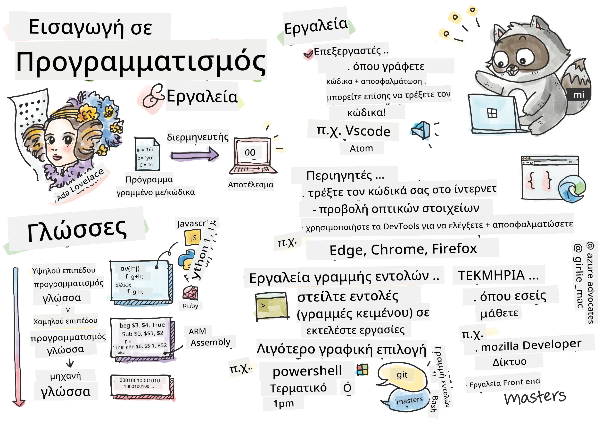
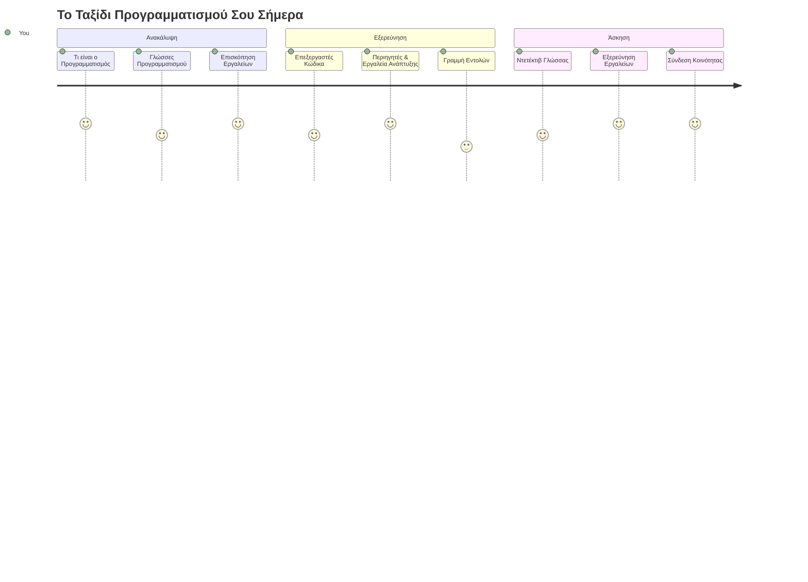
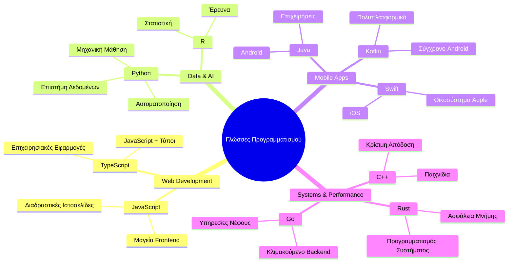
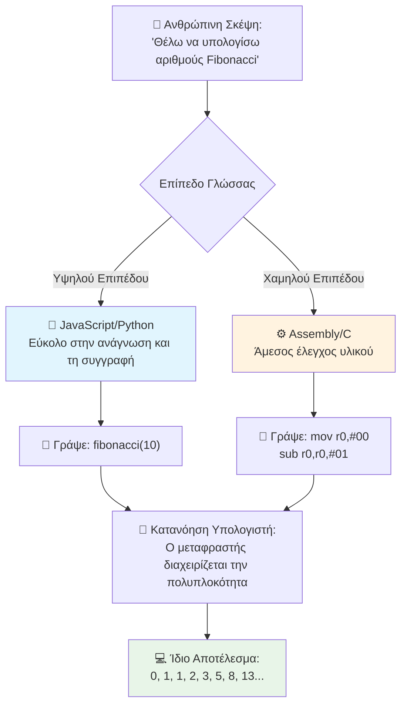
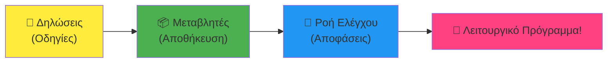
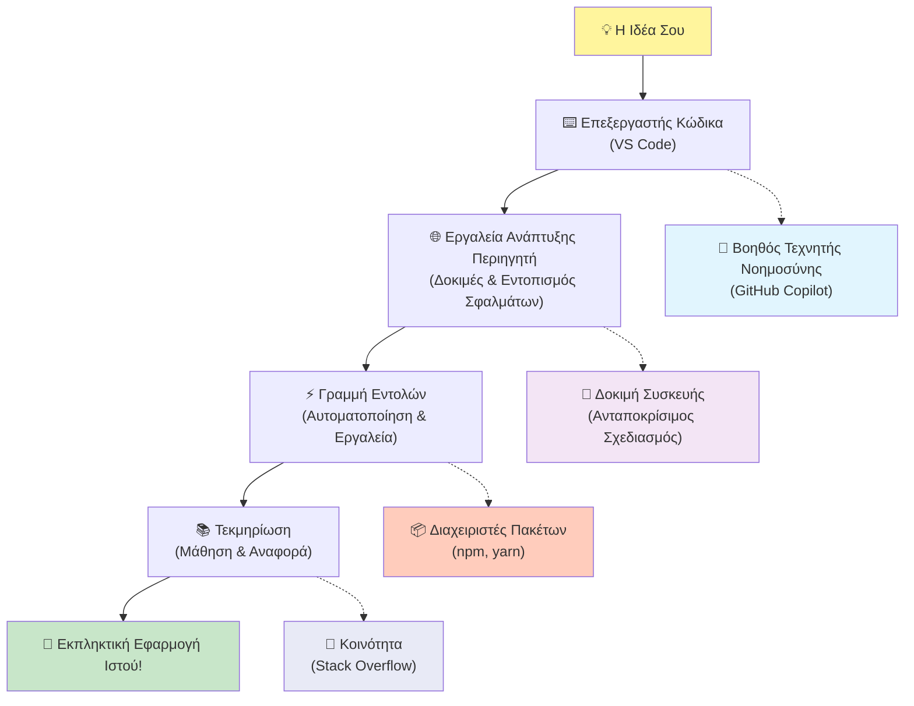
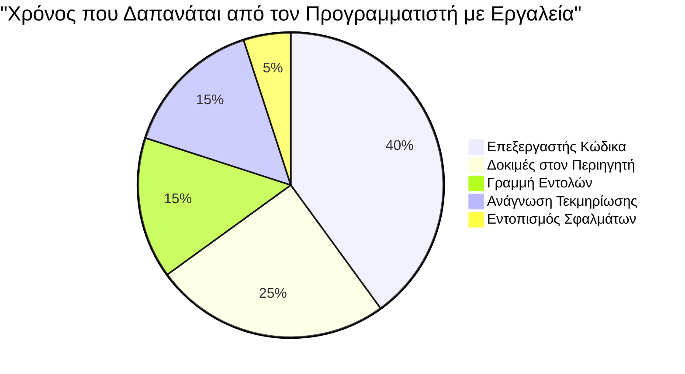
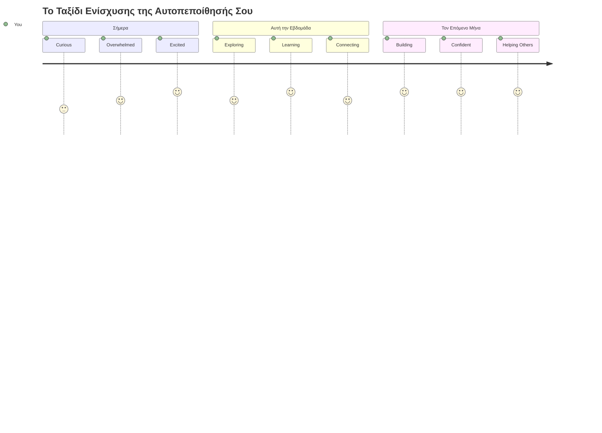

# Εισαγωγή στις Γλώσσες Προγραμματισμού και τα Σύγχρονα Εργαλεία Ανάπτυξης

Γεια σου, μελλοντικέ προγραμματιστή! 👋 Μπορώ να σου πω κάτι που ακόμα μου προκαλεί ρίγος κάθε μέρα; Είσαι έτοιμος να ανακαλύψεις ότι ο προγραμματισμός δεν είναι απλώς για υπολογιστές – είναι σαν να έχεις πραγματικές υπερδυνάμεις για να ζωντανέψεις τις πιο τρελές σου ιδέες!

Ξέρεις εκείνη τη στιγμή που χρησιμοποιείς την αγαπημένη σου εφαρμογή και όλα ταιριάζουν τέλεια; Όταν πατάς ένα κουμπί και συμβαίνει κάτι μαγικό που σε κάνει να λες "ουάου, πώς το ΕΚΑΝΑΝ αυτό;" Λοιπόν, κάποιος σαν εσένα – πιθανώς καθισμένος στο αγαπημένο του καφέ στις 2 το πρωί με τον τρίτο εσπρέσο του – έγραψε τον κώδικα που δημιούργησε αυτή τη μαγεία. Και αυτό που θα σε αφήσει άφωνο: στο τέλος αυτού του μαθήματος, όχι μόνο θα καταλάβεις πώς το έκαναν, αλλά θα ανυπομονείς να το δοκιμάσεις ο ίδιος!

Κοίτα, καταλαβαίνω απόλυτα αν ο προγραμματισμός σου φαίνεται τρομακτικός τώρα. Όταν άρχισα, πίστευα ειλικρινά ότι χρειάζεται να είσαι κάποιο είδος μαθηματικού ιδιοφυΐα ή να προγραμματίζεις από πέντε χρονών. Αλλά αυτό που άλλαξε τελείως την οπτική μου: ο προγραμματισμός είναι ακριβώς σαν να μαθαίνεις να κάνεις συζητήσεις σε μια νέα γλώσσα. Ξεκινάς με "γεια" και "ευχαριστώ", μετά μαθαίνεις να παραγγέλνεις καφέ, και προτού το καταλάβεις, κάνεις βαθιές φιλοσοφικές συζητήσεις! Εκτός από το ότι σε αυτή την περίπτωση κάνεις συζητήσεις με υπολογιστές, και ειλικρινά; Είναι οι πιο υπομονετικοί συνομιλητές που θα έχεις ποτέ – δεν κρίνουν ποτέ τα λάθη σου και πάντα ενθουσιάζονται να προσπαθήσουν ξανά!

Σήμερα, θα εξερευνήσουμε τα απίστευτα εργαλεία που κάνουν τη σύγχρονη ανάπτυξη ιστοσελίδων όχι απλά εφικτή, αλλά σοβαρά εθιστική. Μιλάω για τους ίδιους επεξεργαστές κώδικα, φυλλομετρητές και ροές εργασίας που χρησιμοποιούν οι προγραμματιστές της Netflix, της Spotify και του αγαπημένου σου ανεξάρτητου στούντιο εφαρμογών κάθε μέρα. Και εδώ είναι το κομμάτι που θα σε κάνει να χορέψεις από χαρά: τα περισσότερα από αυτά τα επαγγελματικά, βιομηχανικά αναγνωρισμένα εργαλεία είναι εντελώς δωρεάν!


> Σημείωση σκίτσου από την [Tomomi Imura](https://twitter.com/girlie_mac)


```mermaid
journey
    title Το Ταξίδι Προγραμματισμού Σου Σήμερα
    section Ανακάλυψη
      Τι είναι ο Προγραμματισμός: 5: You
      Γλώσσες Προγραμματισμού: 4: You
      Επισκόπηση Εργαλείων: 5: You
    section Εξερεύνηση
      Επεξεργαστές Κώδικα: 4: You
      Περιηγητές & Εργαλεία Ανάπτυξης: 5: You
      Γραμμή Εντολών: 3: You
    section Άσκηση
      Ντετέκτιβ Γλώσσας: 4: You
      Εξερεύνηση Εργαλείων: 5: You
      Σύνδεση Κοινότητας: 5: You
```
## Ας Δούμε Τι Ξέρεις Ήδη!

Πριν βουτήξουμε στα διασκεδαστικά, είμαι περίεργος – τι ήδη ξέρεις για αυτόν τον κόσμο του προγραμματισμού; Και άκου, αν κοιτάς αυτές τις ερωτήσεις και σκέφτεσαι "Δεν έχω απολύτως καμία ιδέα για τίποτα από όλα αυτά," αυτό δεν είναι απλά εντάξει, είναι τέλειο! Αυτό σημαίνει ότι βρίσκεσαι ακριβώς στο σωστό μέρος. Σκέψου αυτό το κουίζ σαν ένα ζέσταμα πριν την προπόνηση – απλώς "ζεσταίνουμε" τους μυς του εγκεφάλου!

[Κάνε το προκαταρκτικό κουίζ](https://ff-quizzes.netlify.app/web/)


## Η Περιπέτεια που Θα Ζήσουμε Μαζί

Εντάξει, είμαι πραγματικά γεμάτος ενθουσιασμό για αυτά που θα ανακαλύψουμε σήμερα! Σοβαρά, θα ήθελα να σου δω το πρόσωπο όταν μερικές από αυτές τις έννοιες "κουμπώσουν." Αυτή είναι η απίστευτη διαδρομή που θα πάρουμε μαζί:

- **Τι ακριβώς είναι ο προγραμματισμός (και γιατί είναι το πιο κουλ πράγμα!)** – Θα ανακαλύψουμε πώς ο κώδικας είναι κυριολεκτικά η αόρατη μαγεία που τροφοδοτεί τα πάντα γύρω σου, από αυτό το ξυπνητήρι που με κάποιον τρόπο ξέρει ότι είναι Δευτέρα πρωί μέχρι τον αλγόριθμο που επιμελείται τέλεια τις προτάσεις σου στο Netflix
- **Οι γλώσσες προγραμματισμού και οι υπέροχες προσωπικότητές τους** – Φαντάσου να πηγαίνεις σε ένα πάρτυ όπου κάθε άτομο έχει εντελώς διαφορετικές υπερδυνάμεις και τρόπους επίλυσης προβλημάτων. Έτσι είναι ο κόσμος των γλωσσών προγραμματισμού, και θα λατρέψεις να τις γνωρίσεις!
- **Τα βασικά δομικά στοιχεία που κάνουν την ψηφιακή μαγεία να συμβαίνει** – Σκέψου τα σαν το απόλυτο δημιουργικό σετ LEGO. Μόλις καταλάβεις πώς ταιριάζουν αυτά τα κομμάτια, θα καταλάβεις ότι μπορείς κυριολεκτικά να φτιάξεις οτιδήποτε ονειρεύεται το μυαλό σου
- **Επαγγελματικά εργαλεία που θα σε κάνουν να νιώσεις σαν να σου έδωσαν το ξύλο ενός μάγου** – Δεν υπερβάλλω εδώ – αυτά τα εργαλεία θα σε κάνουν πραγματικά να νιώσεις ότι έχεις υπερδυνάμεις, και το καλύτερο; Είναι τα ίδια που χρησιμοποιούν οι επαγγελματίες!

> 💡 **Να θυμάσαι το εξής**: Μην προσπαθήσεις καν να τα αποστηθίσεις όλα σήμερα! Αυτή τη στιγμή, θέλω απλώς να νιώσεις αυτόν τον σπινθήρα ενθουσιασμού για το τι είναι δυνατό. Οι λεπτομέρειες θα μείνουν φυσικά όσο εξασκούμαστε μαζί – έτσι μαθαίνει κανείς πραγματικά!

> Μπορείς να παρακολουθήσεις αυτό το μάθημα στο [Microsoft Learn](https://learn.microsoft.com/en-us/learn/modules/web-development-101/introduction-programming/?WT.mc_id=academic-77807-sagibbon)!

## Λοιπόν, Τι Ακριβώς *ΕΙΝΑΙ* ο Προγραμματισμός;

Εντάξει, ας καταπιαστούμε με την ερώτηση του εκατομμυρίου: τι είναι πραγματικά ο προγραμματισμός;

Θα σου πω μια ιστορία που άλλαξε τελείως το πώς το σκέφτομαι. Την προηγούμενη εβδομάδα, προσπαθούσα να εξηγήσω στη μητέρα μου πώς να χρησιμοποιήσει το νέο μας έξυπνο τηλεχειριστήριο της τηλεόρασης. Έπιασα τον εαυτό μου να λέει πράγματα όπως "Πάτα το κόκκινο κουμπί, όχι το μεγάλο κόκκινο, το μικρό κόκκινο αριστερά… όχι, το άλλο αριστερά σου… εντάξει, τώρα κράτα το για δύο δευτερόλεπτα, όχι ένα, όχι τρία…" Σου θυμίζει κάτι; 😅

Αυτός είναι ο προγραμματισμός! Η τέχνη να δίνεις εξαιρετικά λεπτομερείς, βήμα-βήμα οδηγίες σε κάτι που είναι πολύ ισχυρό αλλά χρειάζεται τα πάντα να του λέγονται ακριβώς. Εκτός από το ότι η εξήγηση δεν πηγαίνει στη μητέρα σου (που μπορεί να ρωτήσει "ποιο κόκκινο κουμπί;"), αλλά σε έναν υπολογιστή (που απλώς κάνει ακριβώς ό,τι του λες, ακόμα και αν αυτό που είπες δεν είναι ακριβώς αυτό που ήθελες).

Αυτό που μου προκάλεσε δέος όταν το έμαθα πρώτα: οι υπολογιστές στην ουσία είναι αρκετά απλοί στη βάση τους. Καταλαβαίνουν κυριολεκτικά μόνο δύο πράγματα – 1 και 0, που είναι βασικά "ναι" και "όχι" ή "αναμμένο" και "σβηστό". Αυτό είναι! Αλλά εδώ γίνεται μαγικό – δεν χρειάζεται να μιλάμε σε 1 και 0 σαν να είμαστε στη Μήτρα. Εδώ μπαίνουν τα **γλώσσες προγραμματισμού**. Είναι σαν να έχεις τον καλύτερο μεταφραστή στον κόσμο που μετατρέπει τις κανονικές ανθρώπινες σκέψεις σου σε γλώσσα υπολογιστή.

Και αυτό που ακόμα μου προκαλεί πραγματικά ρίγη κάθε πρωί όταν ξυπνάω: κυριολεκτικά τα *πάντα* ψηφιακά στη ζωή σου ξεκίνησαν από κάποιον σαν εσένα, πιθανώς καθισμένο με τις πιτζάμες και ένα φλιτζάνι καφέ, να πληκτρολογεί κώδικα στο λάπτοπ του. Αυτό το φίλτρο του Instagram που σε κάνει να φαίνεσαι άψογος; Κάποιος το κωδικοποίησε. Η πρόταση που σε οδήγησε στο νέο αγαπημένο σου τραγούδι; Ένας προγραμματιστής έφτιαξε αυτόν τον αλγόριθμο. Η εφαρμογή που σε βοηθά να μοιράζεις τους λογαριασμούς του δείπνου με φίλους; Ναι, κάποιος σκέφτηκε "αυτό είναι εκνευριστικό, σίγουρα μπορώ να το διορθώσω" και μετά... το έκανε!

Όταν μάθεις να προγραμματίζεις, δεν μαθαίνεις απλά μια νέα δεξιότητα – γίνεσαι μέρος αυτής της απίστευτης κοινότητας ανθρώπων που λύνουν προβλήματα και περνούν τις μέρες τους σκεπτόμενοι, "τι θα γινόταν αν μπορούσα να φτιάξω κάτι που κάνει τη μέρα κάποιου λίγο καλύτερη;" Ειλικρινά, υπάρχει κάτι πιο κουλ από αυτό;

✅ **Κυνήγι Διασκεδαστικού Γεγονότος**: Εδώ είναι κάτι πολύ ενδιαφέρον για να ψάξεις όταν έχεις λίγο χρόνο – ποιος νομίζεις ότι ήταν ο πρώτος προγραμματιστής υπολογιστών στον κόσμο; Θα σου δώσω μια υπόδειξη: ίσως να μην είναι αυτό που περιμένεις! Η ιστορία αυτής της προσωπικότητας είναι απολύτως συναρπαστική και δείχνει ότι ο προγραμματισμός πάντα είχε να κάνει με τη δημιουργική επίλυση προβλημάτων και το να σκέφτεσαι έξω από τα συνηθισμένα.

### 🧠 **Ώρα Ελέγχου: Πώς Νιώθεις;**

**Πάρε μια στιγμή να σκεφτείς:**
- Καταλαβαίνεις τώρα την ιδέα του "δίνοντας οδηγίες σε υπολογιστές";
- Μπορείς να σκεφτείς μια καθημερινή δουλειά που θα ήθελες να αυτοματοποιήσεις με προγραμματισμό;
- Ποιες ερωτήσεις σου έρχονται στο μυαλό σχετικά με αυτόν τον προγραμματισμό;

> **Να θυμάσαι**: Είναι απόλυτα φυσιολογικό αν μερικές έννοιες φαίνονται θολές τώρα. Το να μαθαίνεις προγραμματισμό είναι σαν να μαθαίνεις μια νέα γλώσσα – παίρνει χρόνο για να δημιουργήσει ο εγκέφαλός σου αυτές τις νευρωνικές διαδρομές. Τα καταφέρνεις υπέροχα!

## Οι Γλώσσες Προγραμματισμού Είναι Σαν Διάφορες Γεύσεις Μαγείας

Εντάξει, αυτό θα ακούγεται παράξενο, αλλά μείνε μαζί μου – οι γλώσσες προγραμματισμού μοιάζουν πολύ με διαφορετικά είδη μουσικής. Σκέψου το: έχεις τζαζ, που είναι ομαλή και αυτοσχεδιαστική, ροκ που είναι δυναμική και απλή, κλασική που είναι κομψή και δομημένη, και χιπ-χοπ που είναι δημιουργική και εκφραστική. Κάθε στυλ έχει τη δική του ατμόσφαιρα, τη δική του κοινότητα παθιασμένων θαυμαστών, και το καθένα είναι τέλειο για διαφορετικές διαθέσεις και περιστάσεις.

Οι γλώσσες προγραμματισμού λειτουργούν ακριβώς έτσι! Δεν θα χρησιμοποιούσες την ίδια γλώσσα για να φτιάξεις ένα διασκεδαστικό παιχνίδι για κινητά που θα χρησιμοποιούσες για να επεξεργαστείς μεγάλα ποσά δεδομένων για το κλίμα, όπως δεν θα άκουγες ντεθ μέταλ σε μάθημα γιόγκα (εντάξει, στις περισσότερες γιόγκα! 😄).

Αλλά αυτό που με αφήνει έκπληκτο κάθε φορά που το σκέφτομαι: αυτές οι γλώσσες είναι σαν να έχεις τον πιο υπομονετικό, λαμπρό διερμηνέα στον κόσμο δίπλα σου. Μπορείς να εκφράσεις τις ιδέες σου με τρόπο που νιώθεις φυσικός για τον ανθρώπινο εγκέφαλό σου, και αυτοί αναλαμβάνουν όλη τη πολύπλοκη δουλειά του να το μεταφράσουν στα 1 και 0 που μιλάνε οι υπολογιστές. Είναι σαν να έχεις έναν φίλο που μιλά άπταιστα και τις δύο "ανθρώπινη δημιουργικότητα" και "λογική υπολογιστή" – και ποτέ δεν κουράζεται, δεν χρειάζεται διάλειμμα για καφέ και δεν σε κρίνει αν ρωτήσεις την ίδια ερώτηση δύο φορές!

### Δημοφιλείς Γλώσσες Προγραμματισμού και Χρήσεις τους


```mermaid
mindmap
  root((Γλώσσες Προγραμματισμού))
    Web Development
      JavaScript
        Μαγεία Frontend
        Διαδραστικές Ιστοσελίδες
      TypeScript
        JavaScript + Τύποι
        Επιχειρησιακές Εφαρμογές
    Data & AI
      Python
        Επιστήμη Δεδομένων
        Μηχανική Μάθηση
        Αυτοματοποίηση
      R
        Στατιστική
        Έρευνα
    Mobile Apps
      Java
        Android
        Επιχειρήσεις
      Swift
        iOS
        Οικοσύστημα Apple
      Kotlin
        Σύγχρονο Android
        Πολυπλατφορμικό
    Systems & Performance
      C++
        Παιχνίδια
        Κρίσιμη Απόδοση
      Rust
        Ασφάλεια Μνήμης
        Προγραμματισμός Συστήματος
      Go
        Υπηρεσίες Νέφους
        Κλιμακούμενο Backend
```
| Γλώσσα | Καλύτερη για | Γιατί Είναι Δημοφιλής |
|---------|-----------|----------------------|
| **JavaScript** | Ανάπτυξη ιστοσελίδων, διεπαφές χρήστη | Τρέχει στους φυλλομετρητές και τροφοδοτεί διαδραστικές ιστοσελίδες |
| **Python** | Επιστήμη δεδομένων, αυτοματοποίηση, AI | Εύκολη στην ανάγνωση και εκμάθηση, ισχυρές βιβλιοθήκες |
| **Java** | Επιχειρησιακές εφαρμογές, εφαρμογές Android | Ανεξάρτητη πλατφόρμα, ανθεκτική σε μεγάλα συστήματα |
| **C#** | Εφαρμογές Windows, ανάπτυξη παιχνιδιών | Ισχυρή υποστήριξη από το οικοσύστημα της Microsoft |
| **Go** | Υπηρεσίες cloud, backend συστήματα | Γρήγορη, απλή, σχεδιασμένη για σύγχρονη πληροφορική |

### Γλώσσες Υψηλού Επίπεδου vs. Χαμηλού Επίπεδου

Εντάξει, αυτή ήταν ειλικρινά η έννοια που μου έσπασε το μυαλό όταν ξεκίνησα, οπότε θα μοιραστώ την αναλογία που τελικά με βοήθησε να την καταλάβω – και ελπίζω να σε βοηθήσει κι εσένα!

Φαντάσου ότι βρίσκεσαι σε μια χώρα όπου δεν μιλάς τη γλώσσα, και χρειάζεσαι απεγνωσμένα να βρεις την πιο κοντινή τουαλέτα (όλοι έχουμε βρεθεί εκεί, σωστά; 😅):

- **Ο προγραμματισμός χαμηλού επιπέδου** είναι σαν να μαθαίνεις τη ντόπια διάλεκτο τόσο καλά που μπορείς να συνομιλήσεις με τη γιαγιά που πουλάει φρούτα στη γωνία χρησιμοποιώντας πολιτισμικές αναφορές, τοπικά ιδιώματα και αστεία που μόνο κάποιος που μεγάλωσε εκεί θα καταλάβαινε. Πολύ εντυπωσιακό και απίστευτα αποδοτικό... αν τυχαίνει να μιλάς την γλώσσα! Αλλά αρκετά συντριπτικό όταν απλώς προσπαθείς να βρεις ένα μπάνιο.

- **Ο προγραμματισμός υψηλού επιπέδου** είναι σαν να έχεις αυτόν τον εκπληκτικό ντόπιο φίλο που σε καταλαβαίνει. Μπορείς να πεις "Πραγματικά χρειάζομαι να βρω μια τουαλέτα" στα απλά αγγλικά, και αυτοί αναλαμβάνουν όλη τη μετάφραση στην κουλτούρα και σου δίνουν οδηγίες με τρόπο που έχει απόλυτο νόημα για το μη-ντόπιο μυαλό σου.

Σε όρους προγραμματισμού:
- Οι **γλώσσες χαμηλού επιπέδου** (όπως Assembly ή C) σου επιτρέπουν να έχεις απίστευτα λεπτομερείς συνομιλίες με το υλικό του υπολογιστή, αλλά πρέπει να σκέφτεσαι σαν μηχανή, το οποίο... ας πούμε ότι είναι αρκετά μεγάλο άλμα νοητικά!
- Οι **γλώσσες υψηλού επιπέδου** (όπως JavaScript, Python ή C#) σου επιτρέπουν να σκέφτεσαι σαν άνθρωπος ενώ αυτοί αναλαμβάνουν όλη τη "μηχανική γλώσσα" πίσω από τα παρασκήνια. Επιπλέον, έχουν απίστευτες, φιλόξενες κοινότητες γεμάτες ανθρώπους που θυμούνται πώς ήταν να είσαι νέος και πραγματικά θέλουν να βοηθήσουν!

Μάντεψε με ποιο ξεκινάω να προτείνω; 😉 Οι γλώσσες υψηλού επιπέδου είναι σαν να έχεις βοηθητικές ρόδες που δεν θέλεις ποτέ να αφαιρέσεις γιατί κάνουν όλη την εμπειρία πολύ πιο ευχάριστη!


```mermaid
flowchart TB
    A["👤 Ανθρώπινη Σκέψη:<br/>'Θέλω να υπολογίσω αριθμούς Fibonacci'"] --> B{Επίπεδο Γλώσσας}
    
    B -->|Υψηλού Επιπέδου| C["🌟 JavaScript/Python<br/>Εύκολο στην ανάγνωση και τη συγγραφή"]
    B -->|Χαμηλού Επιπέδου| D["⚙️ Assembly/C<br/>Άμεσος έλεγχος υλικού"]
    
    C --> E["📝 Γράψε: fibonacci(10)"]
    D --> F["📝 Γράψε: mov r0,#00<br/>sub r0,r0,#01"]
    
    E --> G["🤖 Κατανόηση Υπολογιστή:<br/>Ο μεταφραστής διαχειρίζεται την πολυπλοκότητα"]
    F --> G
    
    G --> H["💻 Ίδιο Αποτέλεσμα:<br/>0, 1, 1, 2, 3, 5, 8, 13..."]
    
    style C fill:#e1f5fe
    style D fill:#fff3e0
    style H fill:#e8f5e8
```
### Άσε Με Να Σου Δείξω Γιατί οι Γλώσσες Υψηλού Επιπέδου Είναι Πιο Φιλικές

Εντάξει, θα σου δείξω κάτι που αναδεικνύει τέλεια γιατί ερωτεύτηκα τις γλώσσες υψηλού επιπέδου, αλλά πρώτα – θέλω να μου υποσχεθείς κάτι. Όταν δεις το πρώτο παράδειγμα κώδικα, μην πανικοβληθείς! Είναι φυσιολογικό να φαίνεται λίγο τρομακτικό. Αυτό ακριβώς τονίζω!

Θα δούμε την ίδια ακριβώς εργασία γραμμένη σε δύο εντελώς διαφορετικά στυλ. Και τα δύο δημιουργούν την ακολουθία Fibonacci – είναι ένα όμορφο μαθηματικό μοτίβο όπου κάθε αριθμός είναι το άθροισμα των δύο προηγουμένων: 0, 1, 1, 2, 3, 5, 8, 13... (Διασκεδαστικό γεγονός: θα βρεις αυτό το μοτίβο κυριολεκτικά παντού στη φύση – στο σπείρωμα των ηλιόσπορων, στα μοτίβα των κουκουναριών, ακόμα και στον τρόπο σχηματισμού των γαλαξιών!)

Έτοιμος να δεις τη διαφορά; Ας πάμε!

**Γλώσσα υψηλού επιπέδου (JavaScript) – Φιλική στον άνθρωπο:**

```javascript
// Βήμα 1: Βασική ρύθμιση Fibonacci
const fibonacciCount = 10;
let current = 0;
let next = 1;

console.log('Fibonacci sequence:');
```

**Αυτό κάνει αυτός ο κώδικας:**
- **Δηλώνει** μια σταθερά που καθορίζει πόσους αριθμούς Fibonacci θέλουμε να παράγουμε
- **Αρχικοποιεί** δύο μεταβλητές για να παρακολουθεί τους τρέχοντες και τους επόμενους αριθμούς της σειράς
- **Ορίζει** τις αρχικές τιμές (0 και 1) που καθορίζουν το μοτίβο Fibonacci
- **Εμφανίζει** ένα επικεφαλίδα μήνυμα για να αναγνωρίσουμε την έξοδο μας

```javascript
// Βήμα 2: Δημιουργήστε την ακολουθία με έναν βρόχο
for (let i = 0; i < fibonacciCount; i++) {
  console.log(`Position ${i + 1}: ${current}`);
  
  // Υπολογίστε τον επόμενο αριθμό στην ακολουθία
  const sum = current + next;
  current = next;
  next = sum;
}
```

**Αναλύοντας τι συμβαίνει εδώ:**
- **Κάνει βρόχο** μέσα από κάθε θέση στη σειρά μας χρησιμοποιώντας έναν `for` βρόχο
- **Εμφανίζει** κάθε αριθμό με τη θέση του χρησιμοποιώντας μορφοποίηση template literal
- **Υπολογίζει** τον επόμενο αριθμό Fibonacci προσθέτοντας την τρέχουσα με την επόμενη τιμή
- **Ενημερώνει** τις μεταβλητές παρακολούθησης για να μετακινηθεί στον επόμενο γύρο

```javascript
// Βήμα 3: Σύγχρονη λειτουργική προσέγγιση
const generateFibonacci = (count) => {
  const sequence = [0, 1];
  
  for (let i = 2; i < count; i++) {
    sequence[i] = sequence[i - 1] + sequence[i - 2];
  }
  
  return sequence;
};

// Παράδειγμα χρήσης
const fibSequence = generateFibonacci(10);
console.log(fibSequence);
```

**Στο παραπάνω έχουμε:**
- **Δημιουργήσει** μια επαναχρησιμοποιήσιμη συνάρτηση χρησιμοποιώντας σύγχρονη σύνταξη arrow function
- **Κατασκευάσει** έναν πίνακα για να αποθηκεύσουμε όλη τη σειρά αντί να την εμφανίζουμε έναν έναν
- **Χρησιμοποιήσει** δείκτες πίνακα για να υπολογίσουμε κάθε νέο αριθμό από τις προηγούμενες τιμές
- **Επιστρέψει** όλη τη σειρά για ευέλικτη χρήση σε άλλα μέρη του προγράμματός μας

**Γλώσσα χαμηλού επιπέδου (ARM Assembly) – Φιλική στον υπολογιστή:**

```assembly
 area ascen,code,readonly
 entry
 code32
 adr r0,thumb+1
 bx r0
 code16
thumb
 mov r0,#00
 sub r0,r0,#01
 mov r1,#01
 mov r4,#10
 ldr r2,=0x40000000
back add r0,r1
 str r0,[r2]
 add r2,#04
 mov r3,r0
 mov r0,r1
 mov r1,r3
 sub r4,#01
 cmp r4,#00
 bne back
 end
```

Παρατήρησε πώς η έκδοση JavaScript διαβάζεται σχεδόν σαν οδηγίες στα Αγγλικά, ενώ η έκδοση Assembly χρησιμοποιεί κρυπτογραφικές εντολές που ελέγχουν απευθείας τον επεξεργαστή του υπολογιστή. Και οι δύο εκτελούν την ίδια ακριβώς εργασία, αλλά η γλώσσα υψηλού επιπέδου είναι πολύ πιο εύκολη για τους ανθρώπους να καταλάβουν, να γράψουν και να συντηρήσουν.

**Κύριες διαφορές που θα παρατηρήσεις:**
- **Αναγνωσιμότητα**: Η JavaScript χρησιμοποιεί περιγραφικά ονόματα όπως `fibonacciCount` ενώ η Assembly χρησιμοποιεί κρυπτικά ετικέτες όπως `r0`, `r1`
- **Σχόλια**: Οι γλώσσες υψηλού επιπέδου ενθαρρύνουν επεξηγηματικά σχόλια που κάνουν τον κώδικα αυτο-τεκμηριούμενο
- **Δομή**: Η λογική ροή της JavaScript ταιριάζει με τον τρόπο που οι άνθρωποι σκέφτονται τα προβλήματα βήμα-βήμα
- **Συντήρηση**: Η ενημέρωση της έκδοσης JavaScript για διαφορετικές απαιτήσεις είναι απλή και ξεκάθαρη

✅ **Σχετικά με τη σειρά Fibonacci**: Αυτό το απόλυτα υπέροχο αριθμητικό μοτίβο (όπου κάθε αριθμός ισούται με το άθροισμα των δύο προηγούμενων: 0, 1, 1, 2, 3, 5, 8...) εμφανίζεται κυριολεκτικά *παντού* στη φύση! Θα το βρείτε στις σπείρες των ηλίανθων, στα μοτίβα των πετάλων πεύκου, στον τρόπο που καμπυλώνουν τα κελύφη του ναυτίλου, και ακόμα στον τρόπο που αναπτύσσονται τα κλαδιά των δέντρων. Είναι πραγματικά εντυπωσιακό το πώς τα μαθηματικά και ο κώδικας μπορούν να μας βοηθήσουν να κατανοήσουμε και να αναπαράγουμε τα μοτίβα που η φύση χρησιμοποιεί για να δημιουργεί ομορφιά!


## Τα Τούβλα που Δημιουργούν τη Μαγεία

Εντάξει, τώρα που είδατε πώς μοιάζουν οι γλώσσες προγραμματισμού στην πράξη, ας αναλύσουμε τα θεμελιώδη κομμάτια που απαρτίζουν κυριολεκτικά κάθε πρόγραμμα που έχει γραφτεί ποτέ. Σκεφτείτε τα σαν τα βασικά υλικά στην αγαπημένη σας συνταγή – μόλις καταλάβετε τι κάνει το καθένα, θα μπορείτε να διαβάζετε και να γράφετε κώδικα σχεδόν σε οποιαδήποτε γλώσσα!

Αυτό μοιάζει κάπως με το να μαθαίνεις τη γραμματική του προγραμματισμού. Θυμηθείτε όταν στο σχολείο μάθατε για ουσιαστικά, ρήματα και πώς να φτιάχνετε προτάσεις; Ο προγραμματισμός έχει τη δική του έκδοση γραμματικής και ειλικρινά, είναι πολύ πιο λογική και επιεικής από ό,τι ήταν η αγγλική γραμματική! 😄

### Δηλώσεις: Οι Οδηγίες Βήμα-Βήμα

Ας ξεκινήσουμε με τις **δηλώσεις** – είναι σαν μεμονωμένες προτάσεις σε μια συζήτηση με τον υπολογιστή σας. Κάθε δήλωση λέει στον υπολογιστή να κάνει ένα συγκεκριμένο πράγμα, κάπως σαν να δίνετε οδηγίες: "Στρίψε αριστερά εδώ," "Σταμάτα στο κόκκινο φανάρι," "Παρκάρισε εκεί."

Αυτό που μου αρέσει στις δηλώσεις είναι το πόσο αναγνώσιμες είναι συνήθως. Ρίξτε μια ματιά:

```javascript
// Βασικές δηλώσεις που εκτελούν μεμονωμένες ενέργειες
const userName = "Alex";                    
console.log("Hello, world!");              
const sum = 5 + 3;                         
```

**Αυτό που κάνει ο κώδικας:**
- **Δηλώνει** μια σταθερά μεταβλητή για να αποθηκεύσει το όνομα ενός χρήστη
- **Εμφανίζει** ένα μήνυμα χαιρετισμού στην κονσόλα
- **Υπολογίζει** και αποθηκεύει το αποτέλεσμα μιας μαθηματικής πράξης

```javascript
// Δηλώσεις που αλληλεπιδρούν με ιστοσελίδες
document.title = "My Awesome Website";      
document.body.style.backgroundColor = "lightblue";
```

**Βήμα-βήμα, αυτό συμβαίνει:**
- **Τροποποιεί** τον τίτλο της ιστοσελίδας που εμφανίζεται στην καρτέλα του προγράμματος περιήγησης
- **Αλλάζει** το χρώμα φόντου ολόκληρου του σώματος της σελίδας

### Μεταβλητές: Το Σύστημα Μνήμης του Προγράμματός Σας

Εντάξει, οι **μεταβλητές** είναι ειλικρινά από τις αγαπημένες μου έννοιες για διδασκαλία επειδή μοιάζουν τόσο πολύ με πράγματα που ήδη χρησιμοποιείτε καθημερινά!

Σκεφτείτε για μια στιγμή τη λίστα επαφών στο τηλέφωνό σας. Δεν απομνημονεύετε όλα τα τηλέφωνα – αντίθετα, αποθηκεύετε "Μαμά," "Καλύτερος Φίλος," ή "Εστιατόριο που Παραδίδει ως τις 2 π.μ." και αφήνετε το τηλέφωνο να θυμάται τους πραγματικούς αριθμούς. Οι μεταβλητές δουλεύουν ακριβώς το ίδιο! Είναι σαν δοχεία με ετικέτες όπου το πρόγραμμα μπορεί να αποθηκεύει πληροφορίες και να τις ανακτά αργότερα με ένα όνομα που έχει νόημα.

Αυτό που είναι πραγματικά ωραίο: οι μεταβλητές μπορούν να αλλάξουν καθώς τρέχει το πρόγραμμα (γι’ αυτό λέγονται "μεταβλητές" – καταλαβαίνετε το λογοπαίγνιο;). Ακριβώς όπως μπορεί να ενημερώσετε την επαφή του εστιατορίου πίτσας όταν βρείτε κάτι καλύτερο, έτσι και οι μεταβλητές μπορούν να ενημερώνονται καθώς το πρόγραμμα μαθαίνει νέα πράγματα ή αλλάζουν οι συνθήκες!

Ας δείξω πόσο όμορφα απλό μπορεί να είναι αυτό:

```javascript
// Βήμα 1: Δημιουργία βασικών μεταβλητών
const siteName = "Weather Dashboard";        
let currentWeather = "sunny";               
let temperature = 75;                       
let isRaining = false;                      
```

**Κατανόηση αυτών των εννοιών:**
- **Αποθηκεύει** αμετάβλητες τιμές σε `const` μεταβλητές (π.χ. όνομα ιστοσελίδας)
- **Χρησιμοποιεί** `let` για τιμές που μπορεί να αλλάζουν κατά τη διάρκεια του προγράμματος
- **Αναθέτει** διαφορετικούς τύπους δεδομένων: αλφαριθμητικά (κείμενο), αριθμούς και boolean (true/false)
- **Επιλέγει** περιγραφικά ονόματα που εξηγούν τι περιέχει κάθε μεταβλητή

```javascript
// Βήμα 2: Εργασία με αντικείμενα για την ομαδοποίηση σχετικών δεδομένων
const weatherData = {                       
  location: "San Francisco",
  humidity: 65,
  windSpeed: 12
};
```

**Πάνω απ’ όλα, έχουμε:**
- **Δημιουργήσει** ένα αντικείμενο για να ομαδοποιήσουμε σχετικές πληροφορίες καιρού
- **Οργανώσει** πολλαπλές πληροφορίες κάτω από ένα όνομα μεταβλητής
- **Χρησιμοποιήσει** ζεύγη κλειδί-τιμής για να ετικετοποιήσουμε καθαρά κάθε κομμάτι πληροφορίας

```javascript
// Βήμα 3: Χρήση και ενημέρωση μεταβλητών
console.log(`${siteName}: Today is ${currentWeather} and ${temperature}°F`);
console.log(`Wind speed: ${weatherData.windSpeed} mph`);

// Ενημέρωση μεταβλητών που μπορούν να αλλάξουν
currentWeather = "cloudy";                  
temperature = 68;                          
```

**Ας κατανοήσουμε κάθε μέρος:**
- **Εμφανίζει** πληροφορίες χρησιμοποιώντας template literals με τη σύνταξη `${}`
- **Προσπελαύνει** τις ιδιότητες του αντικειμένου με σημειογραφία τελείας (`weatherData.windSpeed`)
- **Ενημερώνει** μεταβλητές δηλωμένες με `let` για να αντανακλούν αλλαγές στις συνθήκες
- **Συνδυάζει** πολλαπλές μεταβλητές για να δημιουργήσει νοηματικά μηνύματα

```javascript
// Βήμα 4: Σύγχρονη αποδόμηση για πιο καθαρό κώδικα
const { location, humidity } = weatherData; 
console.log(`${location} humidity: ${humidity}%`);
```

**Τι πρέπει να ξέρετε:**
- **Εξάγει** συγκεκριμένες ιδιότητες από αντικείμενα με την κατανομή (destructuring assignment)
- **Δημιουργεί** νέες μεταβλητές αυτόματα με τα ίδια ονόματα των κλειδιών του αντικειμένου
- **Απλοποιεί** τον κώδικα αποφεύγοντας την επαναλαμβανόμενη σημειογραφία τελείας

### Έλεγχος Ροής: Διδάσκοντας το Πρόγραμμά Σας να Σκέφτεται

Εντάξει, εδώ γίνεται πραγματικά συναρπαστικό! Ο **έλεγχος ροής** είναι βασικά το να διδάσκεις το πρόγραμμα πώς να παίρνει έξυπνες αποφάσεις, ακριβώς όπως κάνετε εσείς κάθε μέρα χωρίς να το σκέφτεστε.

Φανταστείτε το εξής: σήμερα το πρωί πιθανόν κάνατε κάτι σαν "Αν βρέχει, θα πάρω ομπρέλα. Αν κάνει κρύο, θα φορέσω μπουφάν. Αν αργώ, θα παραλείψω το πρωινό και θα πάρω καφέ στο δρόμο." Ο εγκέφαλός σας ακολουθεί φυσικά αυτήν τη λογική αν-τότε δεκάδες φορές κάθε μέρα!

Αυτό κάνει τα προγράμματα να φαίνονται έξυπνα και ζωντανά, αντί απλά να ακολουθούν κάποιο βαρετό, προβλέψιμο σενάριο. Μπορούν πραγματικά να κοιτάξουν την κατάσταση, να αξιολογήσουν τι συμβαίνει και να ανταποκριθούν κατάλληλα. Σαν να δίνετε στο πρόγραμμά σας έναν εγκέφαλο που μπορεί να προσαρμοστεί και να παίρνει αποφάσεις!

Θέλετε να δείτε πόσο όμορφα λειτουργεί; Ας δείξω:

```javascript
// Βήμα 1: Βασική λογική υπό συνθήκη
const userAge = 17;

if (userAge >= 18) {
  console.log("You can vote!");
} else {
  const yearsToWait = 18 - userAge;
  console.log(`You'll be able to vote in ${yearsToWait} year(s).`);
}
```

**Αυτό που κάνει ο κώδικας:**
- **Ελέγχει** αν η ηλικία του χρήστη πληροί την προϋπόθεση ψήφου
- **Εκτελεί** διαφορετικά μπλοκ κώδικα ανάλογα με το αποτέλεσμα της συνθήκης
- **Υπολογίζει** και εμφανίζει πόσος χρόνος απομένει μέχρι την ικανότητα ψήφου αν είναι κάτω των 18
- **Προσφέρει** συγκεκριμένη και χρήσιμη ανατροφοδότηση για κάθε περίπτωση

```javascript
// Βήμα 2: Πολλαπλές συνθήκες με λογικούς τελεστές
const userAge = 17;
const hasPermission = true;

if (userAge >= 18 && hasPermission) {
  console.log("Access granted: You can enter the venue.");
} else if (userAge >= 16) {
  console.log("You need parent permission to enter.");
} else {
  console.log("Sorry, you must be at least 16 years old.");
}
```

**Ανάλυση όσων συμβαίνουν εδώ:**
- **Συνδυάζει** πολλαπλές προϋποθέσεις με τον τελεστή `&&` (και)
- **Δημιουργεί** ιεραρχία συνθηκών με `else if` για πολλαπλά σενάρια
- **Χειρίζεται** όλες τις πιθανές περιπτώσεις με μια τελευταία δήλωση `else`
- **Προσφέρει** σαφή και εφαρμόσιμη ανατροφοδότηση για κάθε διαφορετική κατάσταση

```javascript
// Βήμα 3: Συνοπτική συνθήκη με τριαδικό τελεστή
const votingStatus = userAge >= 18 ? "Can vote" : "Cannot vote yet";
console.log(`Status: ${votingStatus}`);
```

**Τι πρέπει να θυμάστε:**
- **Χρησιμοποιείστε** τον τελεστή ternary (`? :`) για απλές συνθήκες με δύο επιλογές
- **Γράψτε** πρώτα τη συνθήκη, μετά το `?`, μετά το αποτέλεσμα αν αληθές, μετά το `:`, και τέλος το αποτέλεσμα αν ψευδές
- **Εφαρμόστε** αυτό το μοτίβο όταν χρειάζεται να αναθέσετε τιμές βάσει συνθηκών

```javascript
// Βήμα 4: Διαχείριση πολλαπλών συγκεκριμένων περιπτώσεων
const dayOfWeek = "Tuesday";

switch (dayOfWeek) {
  case "Monday":
  case "Tuesday":
  case "Wednesday":
  case "Thursday":
  case "Friday":
    console.log("It's a weekday - time to work!");
    break;
  case "Saturday":
  case "Sunday":
    console.log("It's the weekend - time to relax!");
    break;
  default:
    console.log("Invalid day of the week");
}
```

**Αυτός ο κώδικας επιτυγχάνει:**
- **Ταιριάζει** την τιμή της μεταβλητής με πολλαπλές συγκεκριμένες περιπτώσεις
- **Ομαδοποιεί** παρόμοιες περιπτώσεις μαζί (εργάσιμες ημέρες έναντι σαββατοκύριακων)
- **Εκτελεί** το αντίστοιχο μπλοκ κώδικα όταν βρεθεί ταίριασμα
- **Περιλαμβάνει** μια περίπτωση `default` για να χειριστεί απρόβλεπτες τιμές
- **Χρησιμοποιεί** δηλώσεις `break` για να αποτρέψει τη συνέχεια στον επόμενο case

> 💡 **Πραγματικό παράδειγμα**: Σκεφτείτε τον έλεγχο ροής σαν να έχετε το πιο υπομονετικό GPS στον κόσμο που σας δίνει οδηγίες. Μπορεί να πει "Αν έχει κίνηση στη Λεωφόρο Κύρια, πάρε τον αυτοκινητόδρομο. Αν οι εργασίες κλείνουν τον αυτοκινητόδρομο, δοκίμασε τη γραφική διαδρομή." Τα προγράμματα χρησιμοποιούν ακριβώς αυτόν τον τύπο λογικής για να ανταποκρίνονται έξυπνα σε διάφορες καταστάσεις και πάντα να προσφέρουν την καλύτερη δυνατή εμπειρία στους χρήστες.

### 🎯 **Έλεγχος Εννοιών: Κατανόηση των Βασικών**

**Ας δούμε πώς τα πάτε με τα βασικά:**
- Μπορείτε να εξηγήσετε τη διαφορά μεταξύ μεταβλητής και δήλωσης με δικά σας λόγια;
- Σκεφτείτε ένα παράδειγμα της καθημερινότητας όπου θα χρησιμοποιούσατε μια απόφαση αν-τότε (όπως το παράδειγμα της ψήφου)
- Ποιο είναι ένα πράγμα για τη λογική προγραμματισμού που σας εξέπληξε;

**Γρήγορο κίνητρο αυτοπεποίθησης:**

```mermaid
flowchart LR
    A["📝 Δηλώσεις<br/>(Οδηγίες)"] --> B["📦 Μεταβλητές<br/>(Αποθήκευση)"] --> C["🔀 Ροή Ελέγχου<br/>(Αποφάσεις)"] --> D["🎉 Λειτουργικό Πρόγραμμα!"]
    
    style A fill:#ffeb3b
    style B fill:#4caf50
    style C fill:#2196f3
    style D fill:#ff4081
```
✅ **Τι ακολουθεί**: Θα διασκεδάσουμε απίστευτα εξερευνώντας βαθύτερα αυτές τις έννοιες καθώς προχωρούμε σε αυτό το απίστευτο ταξίδι μαζί! Αυτή τη στιγμή, απλά συγκεντρωθείτε στο να νιώσετε τον ενθουσιασμό για όλες τις εκπληκτικές δυνατότητες που έρχονται. Οι συγκεκριμένες δεξιότητες και τεχνικές θα αποτυπωθούν φυσικά καθώς εξασκούμαστε – υπόσχομαι ότι θα είναι πολύ πιο διασκεδαστικό απ’ όσο φαντάζεστε!

## Εργαλεία της Τέχνης

Εντάξει, εδώ πραγματικά ενθουσιάζομαι τόσο που σχεδόν δεν μπορώ να συγκρατηθώ! 🚀 Ετοιμαζόμαστε να μιλήσουμε για τα απίστευτα εργαλεία που θα σας κάνουν να νιώσετε σαν να κρατάτε τα κλειδιά ενός ψηφιακού διαστημόπλοιου.

Ξέρετε πώς ένας σεφ έχει αυτά τα απόλυτα ισορροπημένα μαχαίρια που νιώθουν σαν προέκταση των χεριών του; Ή πώς ένας μουσικός έχει εκείνη την κιθάρα που μοιάζει να τραγουδάει τη στιγμή που την αγγίζει; Ε, οι προγραμματιστές έχουμε τη δική μας έκδοση αυτών των μαγικών εργαλείων, και εδώ είναι κάτι που θα σας αφήσει άφωνους – τα περισσότερα από αυτά είναι εντελώς δωρεάν!

Σχεδόν σκαρφαλώνω στην καρέκλα μου από ενθουσιασμό όταν σκέφτομαι να τα μοιραστώ μαζί σας γιατί έχουν αλλάξει ολοκληρωτικά τον τρόπο που δημιουργούμε λογισμικό. Μιλάμε για βοηθούς κωδικοποίησης με τεχνητή νοημοσύνη που μπορούν να γράφουν κώδικα για εσάς (δεν αστειεύομαι!), περιβάλλοντα στο cloud όπου μπορείτε να φτιάξετε ολόκληρες εφαρμογές από οπουδήποτε με Wi-Fi, και εργαλεία εντοπισμού σφαλμάτων τόσο εξελιγμένα που μοιάζουν να έχουν ακτίνες Χ στα προγράμματά σας.

Και το κομμάτι που πάντα μου δίνει ρίγος: αυτά δεν είναι εργαλεία «για αρχάριους» που θα ξεπεράσετε. Αυτά είναι ακριβώς τα ίδια επαγγελματικά εργαλεία που χρησιμοποιούν προγραμματιστές στην Google, στο Netflix, και σε εκείνο το indie στούντιο που λατρεύετε, αυτή ακριβώς τη στιγμή. Θα νιώθετε επαγγελματίες όταν τα χρησιμοποιείτε!


```mermaid
graph TD
    A["💡 Η Ιδέα Σου"] --> B["⌨️ Επεξεργαστής Κώδικα<br/>(VS Code)"] 
    B --> C["🌐 Εργαλεία Ανάπτυξης Περιηγητή<br/>(Δοκιμές & Εντοπισμός Σφαλμάτων)"]
    C --> D["⚡ Γραμμή Εντολών<br/>(Αυτοματοποίηση & Εργαλεία)"]
    D --> E["📚 Τεκμηρίωση<br/>(Μάθηση & Αναφορά)"]
    E --> F["🚀 Εκπληκτική Εφαρμογή Ιστού!"]
    
    B -.-> G["🤖 Βοηθός Τεχνητής Νοημοσύνης<br/>(GitHub Copilot)"]
    C -.-> H["📱 Δοκιμή Συσκευής<br/>(Ανταποκρίσιμος Σχεδιασμός)"]
    D -.-> I["📦 Διαχειριστές Πακέτων<br/>(npm, yarn)"]
    E -.-> J["👥 Κοινότητα<br/>(Stack Overflow)"]
    
    style A fill:#fff59d
    style F fill:#c8e6c9
    style G fill:#e1f5fe
    style H fill:#f3e5f5
    style I fill:#ffccbc
    style J fill:#e8eaf6
```
### Επεξεργαστές Κώδικα και IDEs: Οι Νέοι Σχεδόν Φίλοι Σας στον Ψηφιακό Κόσμο

Ας μιλήσουμε για επεξεργαστές κώδικα – αυτοί πρόκειται σοβαρά να γίνουν τα νέα σας αγαπημένα μέρη για να περνάτε τον χρόνο σας! Σκεφτείτε τους σαν το προσωπικό σας καταφύγιο κωδικοποίησης όπου θα περνάτε το μεγαλύτερο μέρος του χρόνου σας δημιουργώντας και τελειοποιώντας τις ψηφιακές σας δημιουργίες.

Αλλά εδώ είναι το μαγικό με τους σύγχρονους επεξεργαστές: δεν είναι απλά καλοφτιαγμένοι επεξεργαστές κειμένου. Είναι σαν να έχετε τον πιο λαμπρό, υποστηρικτικό μέντορα κώδικα δίπλα σας 24/7. Διόρθωνουν τα τυπογραφικά σας λάθη πριν τα προσέξετε, προτείνουν βελτιώσεις που σας κάνουν να φαίνεστε ιδιοφυΐες, σας βοηθούν να καταλάβετε τι κάνει κάθε κομμάτι κώδικα, και μερικοί μπορούν ακόμα να προβλέψουν τι θα γράψετε και να προσφέρουν να ολοκληρώσουν τις σκέψεις σας!

Θυμάμαι όταν ανακάλυψα για πρώτη φορά την αυτόματη συμπλήρωση – ένιωσα κυριολεκτικά σαν να ζω στο μέλλον. Αρχίζεις να πληκτρολογείς κάτι και ο επεξεργαστής λέει, "Έλεγες αυτή τη συνάρτηση που κάνει ακριβώς ό,τι χρειάζεσαι;" Είναι σαν να έχεις έναν τηλεπαθητικό φίλο στο κωδικογράφημα!

**Τι κάνει αυτούς τους επεξεργαστές τόσο εκπληκτικούς;**

Οι σύγχρονοι επεξεργαστές κώδικα προσφέρουν μια εντυπωσιακή ποικιλία χαρακτηριστικών για να αυξήσουν την παραγωγικότητά σας:

| Χαρακτηριστικό | Τι Κάνει | Γιατί Βοηθάει |
|---------|--------------|--------------|
| **Επισήμανση Συντακτικού** | Βαφτίζει διαφορετικά μέρη του κώδικα | Κάνει τον κώδικα πιο εύκολο στην ανάγνωση και στην εύρεση λαθών |
| **Αυτόματη Συμπλήρωση** | Προτείνει κώδικα καθώς πληκτρολογείτε | Επιταχύνει τον προγραμματισμό και μειώνει τα τυπογραφικά λάθη |
| **Εργαλεία Αποσφαλμάτωσης** | Βοηθά να βρείτε και να διορθώσετε λάθη | Εξοικονομεί ώρες στην ανεύρεση σφαλμάτων |
| **Επεκτάσεις** | Προσθέτουν εξειδικευμένες λειτουργίες | Προσαρμόζουν τον επεξεργαστή για οποιαδήποτε τεχνολογία |
| **Βοηθοί AI** | Προτείνουν κώδικα και εξηγήσεις | Επιταχύνουν τη μάθηση και την παραγωγικότητα |

> 🎥 **Βίντεο Πόρος**: Θέλετε να δείτε αυτά τα εργαλεία σε δράση; Δείτε αυτό το [βίντεο Εργαλεία της Τέχνης](https://youtube.com/watch?v=69WJeXGBdxg) για μια ολοκληρωμένη επισκόπηση.

#### Προτεινόμενοι Επεξεργαστές για Ανάπτυξη Ιστού

**[Visual Studio Code](https://code.visualstudio.com/?WT.mc_id=academic-77807-sagibbon)** (Δωρεάν)
- Πιο δημοφιλής στους προγραμματιστές ιστού
- Εξαιρετικό οικοσύστημα επεκτάσεων
- Ενσωματωμένο τερματικό και υποστήριξη Git
- **Επιβεβλημένες επεκτάσεις**:
  - [GitHub Copilot](https://marketplace.visualstudio.com/items?itemName=GitHub.copilot) - Προτάσεις κώδικα με AI
  - [Live Share](https://marketplace.visualstudio.com/items?itemName=MS-vsliveshare.vsliveshare) - Συνεργασία σε πραγματικό χρόνο
  - [Prettier](https://marketplace.visualstudio.com/items?itemName=esbenp.prettier-vscode) - Αυτόματη μορφοποίηση κώδικα
  - [Code Spell Checker](https://marketplace.visualstudio.com/items?itemName=streetsidesoftware.code-spell-checker) - Εντοπίζει τυπογραφικά λάθη στον κώδικα

**[JetBrains WebStorm](https://www.jetbrains.com/webstorm/)** (Επί πληρωμή, δωρεάν για φοιτητές)
- Προηγμένα εργαλεία αποσφαλμάτωσης και δοκιμών
- Έξυπνη ολοκλήρωση κώδικα
- Ενσωματωμένος έλεγχος έκδοσης

**IDEs βάσει Cloud** (Διάφορες τιμές)
- [GitHub Codespaces](https://github.com/features/codespaces) - Πλήρες VS Code σε πρόγραμμα περιήγησης
- [Replit](https://replit.com/) - Ιδανικό για μάθηση και κοινή χρήση κώδικα
- [StackBlitz](https://stackblitz.com/) - Άμεση ανάπτυξη web full-stack

> 💡 **Συμβουλή για ξεκίνημα**: Ξεκινήστε με το Visual Studio Code – είναι δωρεάν, ευρέως χρησιμοποιούμενο στη βιομηχανία και έχει μια τεράστια κοινότητα που δημιουργεί χρήσιμα μαθήματα και επεκτάσεις.


### Προγράμματα Περιήγησης: Το Μυστικό Εργαστήριο Ανάπτυξής Σας

Εντάξει, ετοιμαστείτε να σας φύγει το μυαλό! Ξέρετε πώς χρησιμοποιείτε τα προγράμματα περιήγησης για να σκρολάρετε στα κοινωνικά δίκτυα και να βλέπετε βίντεο; Λοιπόν, αποδείχτηκε ότι κρύβουν αυτό το απίστευτο μυστικό εργαστήριο προγραμματιστών όλη αυτή την ώρα, απλά περιμένοντας να το ανακαλύψετε!

Κάθε φορά που κάνετε δεξί κλικ σε μια ιστοσελίδα και επιλέγετε "Επιθεώρηση στοιχείου", ανοίγετε έναν κρυφό κόσμο εργαλείων ανάπτυξης που είναι ειλικρινά πιο ισχυρά από ορισμένα ακριβά προγράμματα που πλήρωνα εκατοντάδες ευρώ. Είναι σαν να ανακαλύπτετε ότι η συνηθισμένη σας κουζίνα έκρυβε ένα επαγγελματικό εργαστήριο σεφ πίσω από μια μυστική πόρτα!
Την πρώτη φορά που κάποιος μου έδειξε τα DevTools του browser, πέρασα περίπου τρεις ώρες απλώς κάνοντας κλικ και λέγοντας «ΠΕΡΙΜΕΝΕ, ΜΠΟΡΕΙ ΝΑ ΚΑΝΕΙ ΚΙ ΑΥΤΟ;!» Μπορείς κυριολεκτικά να επεξεργαστείς οποιαδήποτε ιστοσελίδα σε πραγματικό χρόνο, να δεις ακριβώς πόσο γρήγορα φορτώνει το κάθε τι, να δοκιμάσεις πώς φαίνεται ο ιστότοπός σου σε διαφορετικές συσκευές, και ακόμα να κάνεις αποσφαλμάτωση JavaScript σαν απόλυτος επαγγελματίας. Είναι πραγματικά εκπληκτικό!

**Αυτός είναι ο λόγος που οι browsers είναι το μυστικό σου όπλο:**

Όταν δημιουργείς έναν ιστότοπο ή μια διαδικτυακή εφαρμογή, χρειάζεται να δεις πώς φαίνεται και πώς συμπεριφέρεται σε πραγματικές συνθήκες. Οι browsers όχι μόνο εμφανίζουν τη δουλειά σου, αλλά παρέχουν και λεπτομερή ανατροφοδότηση σχετικά με τις επιδόσεις, την προσβασιμότητα και πιθανά προβλήματα.

#### Εργαλεία Ανάπτυξης Browser (DevTools)

Οι σύγχρονοι browsers περιλαμβάνουν ολοκληρωμένες σουίτες ανάπτυξης:

| Κατηγορία Εργαλείων | Τι Κάνει | Παράδειγμα Χρήσης |
|---------------------|----------|-------------------|
| **Επιθεωρητής Στοιχείων** | Προβολή και επεξεργασία HTML/CSS σε πραγματικό χρόνο | Προσαρμογή στυλ για άμεσο αποτέλεσμα |
| **Κονσόλα** | Προβολή μηνυμάτων σφάλματος και δοκιμή JavaScript | Αποσφαλμάτωση προβλημάτων και πειραματισμός με κώδικα |
| **Παρακολούθηση Δικτύου** | Παρακολούθηση του πώς φορτώνουν οι πόροι | Βελτιστοποίηση επιδόσεων και χρόνων φόρτωσης |
| **Έλεγχος Προσβασιμότητας** | Δοκιμή για συμπεριληπτικό σχεδιασμό | Διασφάλιση λειτουργίας του ιστότοπου για όλους τους χρήστες |
| **Προσομοιωτής Συσκευών** | Προεπισκόπηση σε διαφορετικά μεγέθη οθόνης | Δοκιμή responsive σχεδιασμού χωρίς πολλές συσκευές |

#### Συνιστώμενοι Browsers για Ανάπτυξη

- **[Chrome](https://developers.google.com/web/tools/chrome-devtools/)** - Βιομηχανικό πρότυπο DevTools με εκτενή τεκμηρίωση
- **[Firefox](https://developer.mozilla.org/docs/Tools)** - Εξαιρετικά εργαλεία για CSS Grid και προσβασιμότητα
- **[Edge](https://docs.microsoft.com/microsoft-edge/devtools-guide-chromium/?WT.mc_id=academic-77807-sagibbon)** - Βασισμένος στο Chromium με πόρους ανάπτυξης από την Microsoft

> ⚠️ **Σημαντική Συμβουλή Δοκιμών**: Δοκίμασε πάντα τις ιστοσελίδες σου σε πολλούς browsers! Ό,τι λειτουργεί τέλεια στο Chrome μπορεί να φαίνεται διαφορετικό στο Safari ή Firefox. Οι επαγγελματίες προγραμματιστές ελέγχουν σε όλους τους μεγάλους browsers για να εξασφαλίσουν συνεπείς εμπειρίες χρήστη.


### Εργαλεία Γραμμής Εντολών: Η Πύλη σου προς Υπερδυνάμεις Προγραμματιστή

Εντάξει, ας έχουμε μια εντελώς ειλικρινή στιγμή εδώ για τη γραμμή εντολών, γιατί θέλω να το ακούσεις από κάποιον που το καταλαβαίνει πραγματικά. Όταν την πρωτοείδα – αυτή την τρομακτική μαύρη οθόνη με το αναβοσβήσιμο κείμενο – πραγματικά σκέφτηκα, «Όχι, καθόλου! Αυτό μοιάζει με κάτι από μια ταινία χάκερ της δεκαετίας του 1980, και σίγουρα δεν είμαι αρκετά έξυπνος για αυτό!» 😅

Αλλά αυτό που θα ήθελα να μου είχε πει κάποιος τότε, και αυτό που σου λέω τώρα, είναι: η γραμμή εντολών δεν είναι τρομακτική – είναι πραγματικά σαν να έχεις μια άμεση συνομιλία με τον υπολογιστή σου. Φαντάσου τη διαφορά μεταξύ παραγγελίας φαγητού μέσω μιας κομψής εφαρμογής με εικόνες και μενού (που είναι ωραία και εύκολη), και του να μπεις στο αγαπημένο σου τοπικό εστιατόριο όπου ο σεφ ξέρει ακριβώς τι σου αρέσει και μπορεί να φτιάξει κάτι τέλειο, απλώς λέγοντας «έκπληξέ με με κάτι υπέροχο».

Η γραμμή εντολών είναι το μέρος όπου πηγαίνουν οι προγραμματιστές για να νιώσουν σαν απόλυτοι μάγοι. Πληκτρολογείς μερικές φαινομενικά μαγικές λέξεις (εντάξει, είναι απλώς εντολές, αλλά νιώθουν μαγικές!), πατάς enter, και ΜΠΟΥΜ – έχεις δημιουργήσει ολόκληρες δομές έργου, εγκατέστησες πανίσχυρα εργαλεία από όλο τον κόσμο, ή ανέβασες την εφαρμογή σου στο διαδίκτυο για να τη δουν εκατομμύρια άνθρωποι. Μόλις πάρεις μια πρώτη γεύση αυτής της δύναμης, ειλικρινά γίνεται εθιστικό!

**Γιατί η γραμμή εντολών θα γίνει το αγαπημένο σου εργαλείο:**

Ενώ οι γραφικές διεπαφές είναι υπέροχες για πολλές εργασίες, η γραμμή εντολών ξεχωρίζει στην αυτοματοποίηση, την ακρίβεια και την ταχύτητα. Πολλά εργαλεία ανάπτυξης λειτουργούν κυρίως μέσω της γραμμής εντολών, και η εκμάθηση της αποδοτικής χρήσης τους μπορεί να βελτιώσει δραματικά την παραγωγικότητά σου.

```bash
# Βήμα 1: Δημιουργήστε και μεταβείτε στον φάκελο του έργου
mkdir my-awesome-website
cd my-awesome-website
```

**Αυτός ο κώδικας κάνει τα εξής:**
- **Δημιουργεί** έναν νέο φάκελο με το όνομα "my-awesome-website" για το έργο σου
- **Μπαίνει** μέσα στον νέο φάκελο για να ξεκινήσεις να δουλεύεις

```bash
# Βήμα 2: Αρχικοποιήστε το έργο με package.json
npm init -y

# Εγκαταστήστε σύγχρονα εργαλεία ανάπτυξης
npm install --save-dev vite prettier eslint
npm install --save-dev @eslint/js
```

**Βήμα προς βήμα, εδώ συμβαίνει:**
- **Αρχικοποιεί** νέο έργο Node.js με προεπιλεγμένες ρυθμίσεις χρησιμοποιώντας `npm init -y`
- **Εγκαθιστά** το Vite ως μοντέρνο εργαλείο κατασκευής για γρήγορη ανάπτυξη και παραγωγή
- **Προσθέτει** το Prettier για αυτόματο format κώδικα και το ESLint για έλεγχο ποιότητας κώδικα
- **Χρησιμοποιεί** τη σημαία `--save-dev` για να τα ορίσει ως εξαρτήσεις μόνο ανάπτυξης

```bash
# Βήμα 3: Δημιουργήστε τη δομή του έργου και τα αρχεία
mkdir src assets
echo '<!DOCTYPE html><html><head><title>My Site</title></head><body><h1>Hello World</h1></body></html>' > index.html

# Εκκίνηση διακομιστή ανάπτυξης
npx vite
```

**Στο παραπάνω, έχουμε:**
- **Οργανώσει** το έργο μας δημιουργώντας ξεχωριστούς φακέλους για τον πηγαίο κώδικα και τα assets
- **Δημιουργήσει** ένα βασικό αρχείο HTML με σωστή δομή εγγράφου
- **Ξεκινήσει** τον διακομιστή ανάπτυξης Vite για ζωντανή ανανέωση και hot module replacement

#### Απαραίτητα Εργαλεία Γραμμής Εντολών για Ανάπτυξη Ιστού

| Εργαλείο | Σκοπός | Γιατί το Χρειάζεσαι |
|----------|--------|---------------------|
| **[Git](https://git-scm.com/)** | Έλεγχος εκδόσεων | Παρακολούθηση αλλαγών, συνεργασία με άλλους, δημιουργία αντιγράφων ασφαλείας |
| **[Node.js & npm](https://nodejs.org/)** | Εκτέλεση JavaScript & διαχείριση πακέτων | Εκτέλεση JavaScript εκτός browser, εγκατάσταση σύγχρονων εργαλείων ανάπτυξης |
| **[Vite](https://vitejs.dev/)** | Εργαλείο κατασκευής & dev server | Αστραπιαία ανάπτυξη με hot module replacement |
| **[ESLint](https://eslint.org/)** | Ποιότητα κώδικα | Αυτόματη εύρεση και διόρθωση προβλημάτων στον JavaScript κώδικα |
| **[Prettier](https://prettier.io/)** | Μορφοποίηση κώδικα | Κρατάει τον κώδικα συνεπή μορφοποιημένο και ευανάγνωστο |

#### Επιλογές Ανά Πλατφόρμα

**Windows:**
- **[Windows Terminal](https://docs.microsoft.com/windows/terminal/?WT.mc_id=academic-77807-sagibbon)** - Σύγχρονο, πλούσιο σε λειτουργίες τερματικό
- **[PowerShell](https://docs.microsoft.com/powershell/?WT.mc_id=academic-77807-sagibbon)** 💻 - Δυνατό περιβάλλον scripting
- **[Command Prompt](https://docs.microsoft.com/windows-server/administration/windows-commands/?WT.mc_id=academic-77807-sagibbon)** 💻 - Παραδοσιακή γραμμή εντολών Windows

**macOS:**
- **[Terminal](https://support.apple.com/guide/terminal/)** 💻 - Ενσωματωμένη εφαρμογή τερματικού
- **[iTerm2](https://iterm2.com/)** - Ενισχυμένο τερματικό με προχωρημένες λειτουργίες

**Linux:**
- **[Bash](https://www.gnu.org/software/bash/)** 💻 - Πρότυπο Linux shell
- **[KDE Konsole](https://docs.kde.org/trunk5/en/konsole/konsole/index.html)** - Προηγμένος εξομοιωτής τερματικού

> 💻 = Προεγκατεστημένο στο λειτουργικό σύστημα

> 🎯 **Μονοπάτι Μάθησης:** Ξεκίνα με βασικές εντολές όπως `cd` (αλλαγή φακέλου), `ls` ή `dir` (λίστα αρχείων), και `mkdir` (δημιουργία φακέλου). Πρακτική με μοντέρνες εντολές ροής εργασίας όπως `npm install`, `git status`, και `code .` (ανοίγει τον τρέχοντα φάκελο στο VS Code). Καθώς νιώθεις πιο άνετα, θα μάθεις φυσικά πιο προχωρημένες εντολές και τεχνικές αυτοματοποίησης.


### Τεκμηρίωση: Ο Πάντα Διαθέσιμος Μέντορας Μάθησης σου

Εντάξει, άσε με να μοιραστώ ένα μικρό μυστικό που θα σε κάνει να νιώσεις πολύ καλύτερα για το ότι είσαι αρχάριος: ακόμα και οι πιο έμπειροι προγραμματιστές περνούν τεράστιο μέρος του χρόνου τους διαβάζοντας τεκμηρίωση. Και αυτό δεν είναι επειδή δεν ξέρουν τι κάνουν – είναι στην πραγματικότητα σημάδι σοφίας!

Σκέψου την τεκμηρίωση σαν να έχεις πρόσβαση στους πιο υπομονετικούς και γνώστες δασκάλους του κόσμου, διαθέσιμους 24/7. Έμεινες μπλοκαρισμένος σε ένα πρόβλημα στις 2 π.μ.; Η τεκμηρίωση είναι εκεί με μια ζεστή εικονική αγκαλιά και ακριβώς την απάντηση που χρειάζεσαι. Θέλεις να μάθεις για κάποια νέα φοβερή λειτουργία για την οποία μιλάνε όλοι; Η τεκμηρίωση σε στηρίζει με παραδείγματα βήμα-βήμα. Προσπαθείς να καταλάβεις γιατί κάτι λειτουργεί όπως λειτουργεί; Μάντεψε – η τεκμηρίωση είναι έτοιμη να το εξηγήσει με τρόπο που επιτέλους να "κολλάει"!

Κάτι που άλλαξε ολοκληρωτικά την προοπτική μου: ο κόσμος της ανάπτυξης web κινείται απίστευτα γρήγορα, και κανείς (εννοώ καθόλου κανείς!) δεν κρατάει τα πάντα απομνημονευμένα. Έχω δει κορυφαίους προγραμματιστές με πάνω από 15 χρόνια εμπειρίας να ψάχνουν απλή σύνταξη, και ξέρεις κάτι; Αυτό δεν είναι ντροπιαστικό – είναι έξυπνο! Δεν είναι θέμα τέλειας μνήμης, αλλά το να ξέρεις πού να βρεις αξιόπιστες απαντήσεις γρήγορα και πώς να τις εφαρμόσεις.

**Εδώ γίνεται η πραγματική μαγεία:**

Οι επαγγελματίες προγραμματιστές αφιερώνουν μεγάλο μέρος του χρόνου τους διαβάζοντας τεκμηρίωση – όχι επειδή δεν ξέρουν τι κάνουν, αλλά επειδή το τοπίο της ανάπτυξης ιστού εξελίσσεται τόσο γρήγορα που η παραμονή ενημερωμένος απαιτεί συνεχή μάθηση. Η καλή τεκμηρίωση σε βοηθά να καταλάβεις όχι μόνο *πώς* να χρησιμοποιήσεις κάτι, αλλά *γιατί* και *πότε* να το χρησιμοποιήσεις.

#### Απαραίτητοι Πόροι Τεκμηρίωσης

**[Mozilla Developer Network (MDN)](https://developer.mozilla.org/docs/Web)**
- Το χρυσό πρότυπο για τεκμηρίωση τεχνολογιών web
- Αναλυτικοί οδηγοί για HTML, CSS και JavaScript
- Περιλαμβάνει πληροφορίες συμβατότητας browser
- Προσφέρει πρακτικά παραδείγματα και διαδραστικές επιδείξεις

**[Web.dev](https://web.dev)** (από την Google)
- Σύγχρονες βέλτιστες πρακτικές ανάπτυξης web
- Οδηγοί βελτιστοποίησης επιδόσεων
- Αρχές προσβασιμότητας και συμπεριληπτικού σχεδιασμού
- Μελέτες περιπτώσεων από πραγματικά έργα

**[Microsoft Developer Documentation](https://docs.microsoft.com/microsoft-edge/#microsoft-edge-for-developers)**
- Πόροι ανάπτυξης browser Edge
- Οδηγοί για Progressive Web Apps
- Γνώσεις για ανάπτυξη πολλαπλών πλατφορμών

**[Frontend Masters Learning Paths](https://frontendmasters.com/learn/)**
- Διαρθρωμένα προγράμματα μάθησης
- Βίντεο μαθήματα από ειδικούς του κλάδου
- Πρακτικές ασκήσεις κωδικοποίησης

> 📚 **Στρατηγική Μελέτης:** Μην προσπαθείς να απομνημονεύεις την τεκμηρίωση – μάθε αντ' αυτού πώς να την περιηγείσαι αποδοτικά. Αποθήκευσε σελιδοδείκτες τα συχνά χρησιμοποιούμενα αναφορικά σημεία και εξασκήσου να χρησιμοποιείς λειτουργίες αναζήτησης για να βρίσκεις γρήγορα συγκεκριμένες πληροφορίες.

### 🔧 **Έλεγχος Εμπειρίας στα Εργαλεία: Τι Σου Αρέσει;**

**Κάνε ένα διάλειμμα να σκεφτείς:**
- Ποιο εργαλείο είσαι πιο ενθουσιασμένος να δοκιμάσεις πρώτα; (Δεν υπάρχει λάθος απάντηση!)
- Η γραμμή εντολών ακόμα φαίνεται τρομακτική ή σε ενδιαφέρει να τη μάθεις;
- Μπορείς να φανταστείς να χρησιμοποιείς τα DevTools του browser για να ρίξεις μια ματιά πίσω από την κουρτίνα των αγαπημένων σου ιστοσελίδων;


```mermaid
pie title "Χρόνος που Δαπανάται από τον Προγραμματιστή με Εργαλεία"
    "Επεξεργαστής Κώδικα" : 40
    "Δοκιμές στον Περιηγητή" : 25
    "Γραμμή Εντολών" : 15
    "Ανάγνωση Τεκμηρίωσης" : 15
    "Εντοπισμός Σφαλμάτων" : 5
```
> **Ενδιαφέρον στοιχείο:** Οι περισσότεροι προγραμματιστές περνούν περίπου το 40% του χρόνου τους στον επεξεργαστή κώδικα, αλλά παρατήρησε πόσος χρόνος πηγαίνει σε δοκιμές, μάθηση, και επίλυση προβλημάτων. Ο προγραμματισμός δεν είναι απλώς να γράφεις κώδικα – είναι να δημιουργείς εμπειρίες!

✅ **Θέμα για σκέψη:** Να κάτι ενδιαφέρον για να το σκεφτείς – πώς νομίζεις ότι τα εργαλεία για την κατασκευή ιστοσελίδων (ανάπτυξη) μπορεί να διαφέρουν από τα εργαλεία για τον σχεδιασμό της εμφάνισής τους (σχεδιασμός); Είναι σαν τη διαφορά μεταξύ ενός αρχιτέκτονα που σχεδιάζει ένα όμορφο σπίτι και ενός εργολάβου που το χτίζει πραγματικά. Και τα δύο είναι κρίσιμα, αλλά χρειάζονται διαφορετικά εργαλειοθήκες! Αυτός ο τρόπος σκέψης θα σε βοηθήσει να δεις τη μεγαλύτερη εικόνα του πώς ζωντανεύουν οι ιστοσελίδες.

## Πρόκληση GitHub Copilot Agent 🚀

Χρησιμοποίησε τη λειτουργία Agent για να ολοκληρώσεις την παρακάτω πρόκληση:

**Περιγραφή:** Εξερεύνησε τα χαρακτηριστικά ενός σύγχρονου επεξεργαστή κώδικα ή IDE και δείξε πώς μπορεί να βελτιώσει τη ροή εργασίας σου ως web developer.

**Οδηγία:** Επέλεξε έναν επεξεργαστή κώδικα ή IDE (όπως Visual Studio Code, WebStorm ή ένα cloud-based IDE). Κατάγραψε τρία χαρακτηριστικά ή επεκτάσεις που σε βοηθούν να γράφεις, να αποσφαλματώνεις ή να διατηρείς κώδικα πιο αποδοτικά. Για κάθε ένα, δώσε μια σύντομη εξήγηση πώς ωφελεί τη ροή εργασίας σου.

---

## 🚀 Πρόκληση

**Λοιπόν, ντετέκτιβ, έτοιμος για την πρώτη σου υπόθεση;**

Τώρα που έχεις αυτή την υπέροχη βάση, έχω μια περιπέτεια που θα σε βοηθήσει να δεις πόσο απίστευτα διαφορετικός και συναρπαστικός είναι ο κόσμος του προγραμματισμού. Και άκου – δεν πρόκειται ακόμα για γραφή κώδικα, οπότε μη νιώθεις πίεση! Φαντάσου τον εαυτό σου ως ντετέκτιβ γλωσσών προγραμματισμού στην πρώτη σου συναρπαστική υπόθεση!

**Η αποστολή σου, αν αρνηθείς να την αποδεχτείς:**
1. **Γίνε εξερευνητής γλωσσών:** Διάλεξε τρεις γλώσσες προγραμματισμού από τελείως διαφορετικούς κόσμους – ίσως μία που φτιάχνει ιστοσελίδες, μία που δημιουργεί κινητές εφαρμογές, και μία που επεξεργάζεται δεδομένα για επιστήμονες. Βρες παραδείγματα για το ίδιο απλό έργο γραμμένα σε κάθε γλώσσα. Υπόσχομαι ότι θα εντυπωσιαστείς πόσο διαφορετικά μπορούν να φαίνονται, παρόλο που κάνουν το ίδιο ακριβώς πράγμα!

2. **Αποκάλυψε την προέλευσή τους:** Τι κάνει κάθε γλώσσα ξεχωριστή; Ιδού ένα ωραίο γεγονός – κάθε γλώσσα προγραμματισμού δημιουργήθηκε γιατί κάποιος σκέφτηκε, «Ξέρεις κάτι; Πρέπει να υπάρχει καλύτερος τρόπος να λυθεί αυτό το συγκεκριμένο πρόβλημα.» Μπορείς να καταλάβεις ποια ήταν αυτά τα προβλήματα; Μερικές από αυτές τις ιστορίες είναι πραγματικά συναρπαστικές!

3. **Γνώρισε τις κοινότητες:** Δες πόσο φιλόξενες και παθιασμένες είναι οι κοινότητες κάθε γλώσσας. Κάποιες έχουν εκατομμύρια προγραμματιστών που μοιράζονται γνώση και βοηθούν ο ένας τον άλλον, άλλες είναι μικρότερες αλλά απίστευτα δεμένες και υποστηρικτικές. Θα λατρέψεις να δεις τις διαφορετικές προσωπικότητες αυτών των κοινοτήτων!

4. **Ακολούθησε το ένστικτό σου:** Ποια γλώσσα σου φαίνεται πιο προσιτή αυτή τη στιγμή; Μην αγχώνεσαι για την «τέλεια» επιλογή – απλά άκου το ένστικτό σου! Ειλικρινά δεν υπάρχει λάθος απάντηση εδώ, και μπορείς πάντα να εξερευνήσεις άλλες αργότερα.

**Μπόνους για τον ντετέκτιβ:** Δες αν μπορείς να ανακαλύψεις ποιοι μεγάλοι ιστότοποι ή εφαρμογές είναι χτισμένοι με κάθε γλώσσα. Σου εγγυώμαι ότι θα σοκαριστείς να μάθεις τι τροφοδοτεί το Instagram, το Netflix ή εκείνο το κινητό παιχνίδι που δεν μπορείς να σταματήσεις να παίζεις!

> 💡 **Θυμήσου:** Δεν προσπαθείς να γίνεις ειδικός σε καμία από αυτές τις γλώσσες σήμερα. Απλώς γνωρίζεις τη γειτονιά πριν αποφασίσεις πού θέλεις να στήσεις το μαγαζί σου. Πάρε το χρόνο σου, διασκέδασε, και άφησε την περιέργειά σου να σε καθοδηγήσει!

## Ας Γιορτάσουμε Όσα Ανακάλυψες!

Ω Θεέ μου, έχεις απορροφήσει τόσο απίστευτες πληροφορίες σήμερα! Είμαι πραγματικά ενθουσιασμένος να δω πόσα από αυτό το υπέροχο ταξίδι έχεις κρατήσει μαζί σου. Και θυμήσου – αυτό δεν είναι ένα τεστ όπου πρέπει να τα κάνεις όλα τέλεια. Είναι περισσότερο ένας εορτασμός όλων των φοβερών πραγμάτων που έμαθες για αυτόν τον συναρπαστικό κόσμο που πρόκειται να βυθιστείς!

[Κάνε το κουίζ μετά το μάθημα](https://ff-quizzes.netlify.app/web/)

## Ανασκόπηση & Αυτομάθηση

**Πάρε το χρόνο σου να εξερευνήσεις και να διασκεδάσεις!**
Έχεις καλύψει πολλή ύλη σήμερα, και αυτό είναι κάτι για το οποίο μπορείς να είσαι περήφανος! Τώρα ξεκινά το διασκεδαστικό μέρος – να εξερευνήσεις τα θέματα που προκάλεσαν την περιέργειά σου. Θυμήσου, αυτό δεν είναι σπίτι – είναι μια περιπέτεια!

**Βυθίσου πιο βαθιά σε ό,τι σε ενθουσιάζει:**

**Δοκίμασε πρακτικά τις γλώσσες προγραμματισμού:**
- Επισκέψου τις επίσημες ιστοσελίδες 2-3 γλωσσών που τράβηξαν την προσοχή σου. Η κάθε μία έχει τη δική της προσωπικότητα και ιστορία!
- Δοκίμασε κάποια διαδικτυακά playgrounds κώδικα όπως το [CodePen](https://codepen.io/), [JSFiddle](https://jsfiddle.net/), ή [Replit](https://replit.com/). Μην φοβηθείς να πειραματιστείς – δεν μπορείς να σπάσεις τίποτα!
- Διάβασε για το πώς δημιουργήθηκε η αγαπημένη σου γλώσσα. Σοβαρά τώρα, μερικές από αυτές τις ιστορίες προέλευσης είναι συναρπαστικές και θα σε βοηθήσουν να καταλάβεις γιατί οι γλώσσες λειτουργούν όπως λειτουργούν.

**Γίνε άνετος με τα νέα σου εργαλεία:**
- Κατέβασε το Visual Studio Code αν δεν το έχεις κάνει ήδη – είναι δωρεάν και θα το λατρέψεις!
- Περάστε μερικά λεπτά περιηγούμενος στην αγορά επεκτάσεων. Είναι σαν ένα app store για τον επεξεργαστή κώδικά σου!
- Άνοιξε τα Developer Tools του browser σου και κάνε κλικ ανάμεσα. Μην ανησυχείς αν δεν καταλαβαίνεις τα πάντα – απλά εξοικειώσου με όσα υπάρχουν εκεί.

**Γίνε μέλος της κοινότητας:**
- Ακολούθησε μερικές κοινότητες προγραμματιστών στο [Dev.to](https://dev.to/), [Stack Overflow](https://stackoverflow.com/), ή [GitHub](https://github.com/). Η κοινότητα προγραμματιστών είναι εξαιρετικά φιλόξενη για τους νεοεισερχόμενους!
- Δες μερικά βίντεο για αρχάριους στο YouTube. Υπάρχουν πολλοί εξαιρετικοί δημιουργοί εκεί έξω που θυμούνται πώς είναι να ξεκινάς.
- Σκέψου να συμμετάσχεις σε τοπικές συναντήσεις ή διαδικτυακές κοινότητες. Πίστεψέ με, οι προγραμματιστές αγαπούν να βοηθούν τους νεοεισερχόμενους!

> 🎯 **Άκου, αυτό θέλω να θυμάσαι**: Δεν αναμένεται να γίνεις μάγος του κώδικα μέσα σε μία νύχτα! Αυτή τη στιγμή, απλώς γνωρίζεις αυτόν τον καταπληκτικό νέο κόσμο που πρόκειται να γίνεις μέρος του. Πάρε τον χρόνο σου, απόλαυσε το ταξίδι, και θυμήσου – κάθε προγραμματιστής που θαυμάζεις κάποτε καθότανε ακριβώς εκεί που είσαι τώρα, νιώθοντας ενθουσιασμό και ίσως λίγο μπερδεμένος. Αυτό είναι τελείως φυσιολογικό, και σημαίνει ότι τα πας καλά!

## Ανάθεση

[Reading the Docs](assignment.md)

> 💡 **Μικρή ώθηση για την ανάθεσή σου**: Θα ήθελα πάρα πολύ να σε δω να εξερευνάς κάποια εργαλεία που δεν έχουμε καλύψει ακόμα! Παράβλεψε τους επεξεργαστές, browsers και εργαλεία γραμμής εντολών που έχουμε ήδη αναφέρει – υπάρχει όλο αυτό το απίστευτο σύμπαν εκπληκτικών εργαλείων ανάπτυξης που περιμένει να ανακαλυφθεί. Ψάξε για αυτά που συντηρούνται ενεργά και έχουν ζωντανές, βοηθητικές κοινότητες (αυτά έχουν τις καλύτερες οδηγίες και τα πιο υποστηρικτικά άτομα όταν κολλήσεις και χρειαστείς ένα φιλικό χέρι).

---

## 🚀 Το Χρονοδιάγραμμα του Ταξιδιού σου στον Προγραμματισμό

### ⚡ **Τι Μπορείς να Κάνεις στα Επόμενα 5 Λεπτά**
- [ ] Κράτα σελιδοδείκτη σε ιστοσελίδες 2-3 γλωσσών προγραμματισμού που τράβηξαν το ενδιαφέρον σου
- [ ] Κατέβασε το Visual Studio Code αν δεν το έχεις ήδη κάνει
- [ ] Άνοιξε τα DevTools του browser σου (F12) και κλίκαρε σε οποιαδήποτε ιστοσελίδα
- [ ] Γίνε μέλος σε μία κοινότητα προγραμματισμού (Dev.to, Reddit r/webdev, ή Stack Overflow)

### ⏰ **Τι Μπορείς να Ολοκληρώσεις Αυτή την Ώρα**
- [ ] Ολοκλήρωσε το κουίζ μετά το μάθημα και σκέψου τις απαντήσεις σου
- [ ] Ρύθμισε το VS Code με την επέκταση GitHub Copilot
- [ ] Δοκίμασε ένα παράδειγμα "Hello World" σε 2 διαφορετικές γλώσσες προγραμματισμού online
- [ ] Δες ένα βίντεο "Μια μέρα στη ζωή ενός προγραμματιστή" στο YouTube
- [ ] Ξεκίνα την ερευνητική σου δουλειά για τις γλώσσες προγραμματισμού (από την πρόκληση)

### 📅 **Η Περιπέτεια της Εβδομάδας σου**
- [ ] Ολοκλήρωσε την ανάθεση και εξερεύνησε 3 νέα εργαλεία ανάπτυξης
- [ ] Ακολούθησε 5 προγραμματιστές ή λογαριασμούς προγραμματισμού στα social media
- [ ] Προσπάθησε να φτιάξεις κάτι μικρό στο CodePen ή Replit (ακόμα και απλά "Hello, [Το Όνομά σου]!")
- [ ] Διάβασε ένα post σε blog προγραμματιστή σχετικά με το ταξίδι κάποιου στον κώδικα
- [ ] Συμμετάσχετε σε μια διαδικτυακή συνάντηση ή παρακολούθησε μια ομιλία προγραμματισμού
- [ ] Ξεκίνα να μαθαίνεις τη γλώσσα που επέλεξες με διαδικτυακά μαθήματα

### 🗓️ **Η Μεταμόρφωσή σου Μέσα στον Μήνα**
- [ ] Φτιάξε το πρώτο σου μικρό project (ακόμα και μια απλή ιστοσελίδα μετράει!)
- [ ] Συνεισφέρε σε ένα open-source project (ξεκίνα με διορθώσεις τεκμηρίωσης)
- [ ] Μέντορας σε κάποιον που μόλις ξεκινά το ταξίδι προγραμματισμού
- [ ] Δημιούργησε την προσωπική σου ιστοσελίδα-χαρτοφυλάκιο προγραμματιστή
- [ ] Συνδέσου με τοπικές κοινότητες προγραμματιστών ή ομάδες μελέτης
- [ ] Ξεκίνα να σχεδιάζεις το επόμενο εκπαιδευτικό σου ορόσημο

### 🎯 **Τελικός Απολογισμός**

**Πριν προχωρήσεις, πάρε μια στιγμή για να γιορτάσεις:**
- Ποιο είναι ένα πράγμα για τον προγραμματισμό που σε ενθουσίασε σήμερα;
- Ποιο εργαλείο ή έννοια θέλεις να εξερευνήσεις πρώτο;
- Πώς νιώθεις που ξεκινάς αυτό το ταξίδι στον προγραμματισμό;
- Ποια είναι μια ερώτηση που θα ήθελες να κάνεις σε έναν προγραμματιστή αυτή τη στιγμή;


```mermaid
journey
    title Το Ταξίδι Ενίσχυσης της Αυτοπεποίθησής Σου
    section Σήμερα
      Curious: 3: You
      Overwhelmed: 4: You
      Excited: 5: You
    section Αυτή την Εβδομάδα
      Exploring: 4: You
      Learning: 5: You
      Connecting: 4: You
    section Τον Επόμενο Μήνα
      Building: 5: You
      Confident: 5: You
      Helping Others: 5: You
```
> 🌟 **Θυμήσου**: Κάθε ειδικός ήταν κάποτε αρχάριος. Κάθε ανώτερος προγραμματιστής ένιωθε ακριβώς όπως εσύ τώρα – ενθουσιασμένος, ίσως λίγο μπερδεμένος, και σίγουρα περίεργος για το τι είναι δυνατόν. Βρίσκεσαι σε καταπληκτική παρέα, και αυτό το ταξίδι θα είναι απίστευτο. Καλωσόρισες στον υπέροχο κόσμο του προγραμματισμού! 🎉

---

<!-- CO-OP TRANSLATOR DISCLAIMER START -->
**Αποποίηση ευθυνών**:  
Αυτό το έγγραφο έχει μεταφραστεί χρησιμοποιώντας την υπηρεσία μετάφρασης με τεχνητή νοημοσύνη [Co-op Translator](https://github.com/Azure/co-op-translator). Παρόλο που καταβάλλουμε προσπάθεια για ακρίβεια, παρακαλούμε να γνωρίζετε ότι οι αυτόματες μεταφράσεις ενδέχεται να περιέχουν λάθη ή ανακρίβειες. Το πρωτότυπο έγγραφο στη γλώσσα του πρέπει να θεωρείται η αξιόπιστη πηγή. Για κρίσιμες πληροφορίες, συνιστάται η επαγγελματική ανθρώπινη μετάφραση. Δεν φέρουμε ευθύνη για τυχόν παρεξηγήσεις ή λανθασμένες ερμηνείες που προκύπτουν από τη χρήση αυτής της μετάφρασης.
<!-- CO-OP TRANSLATOR DISCLAIMER END -->