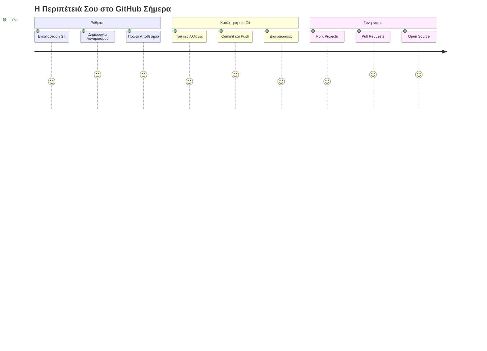
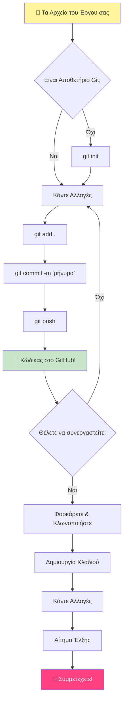
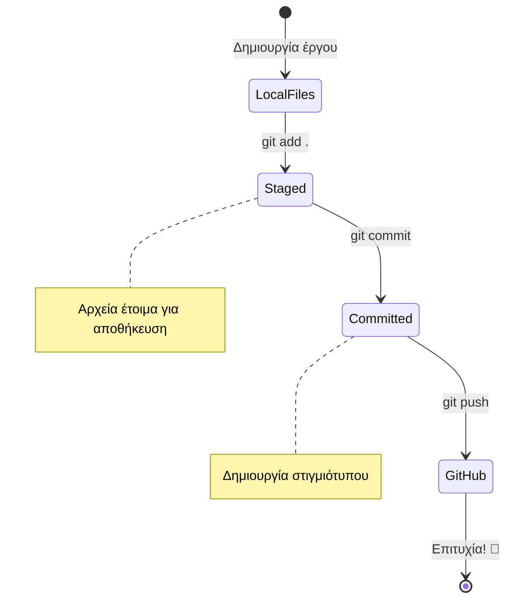
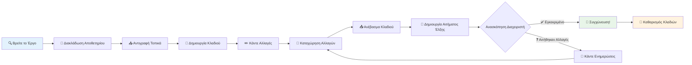
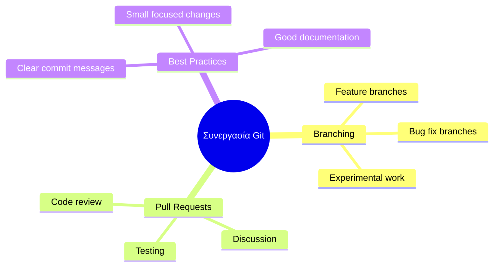
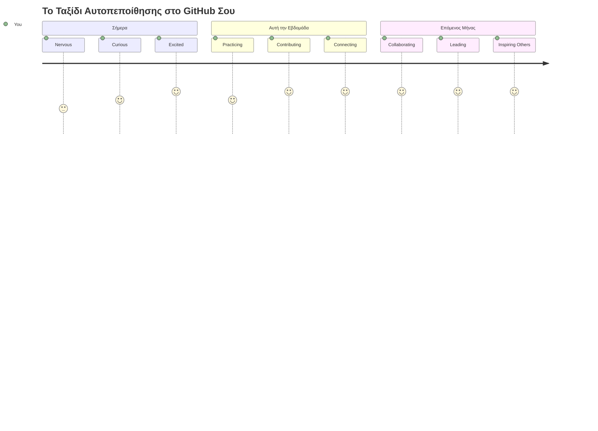

<!--
CO_OP_TRANSLATOR_METADATA:
{
  "original_hash": "5c383cc2cc23bb164b06417d1c107a44",
  "translation_date": "2026-01-06T21:20:07+00:00",
  "source_file": "1-getting-started-lessons/2-github-basics/README.md",
  "language_code": "el"
}
-->
# Εισαγωγή στο GitHub

Γεια σου, μελλοντικέ προγραμματιστή! 👋 Έτοιμος να ενταχθείς σε εκατομμύρια προγραμματιστές σε όλο τον κόσμο; Είμαι πραγματικά ενθουσιασμένος που σου παρουσιάζω το GitHub – σκέψου το σαν την πλατφόρμα κοινωνικής δικτύωσης για προγραμματιστές, εκτός από το ότι αντί για φωτογραφίες του γεύματός σου, μοιραζόμαστε κώδικα και δημιουργούμε απίστευτα πράγματα μαζί!

Αυτό που πραγματικά με εντυπωσιάζει είναι το εξής: κάθε εφαρμογή στο τηλέφωνό σου, κάθε ιστοσελίδα που επισκέπτεσαι και τα περισσότερα εργαλεία που θα μάθεις να χρησιμοποιείς δημιουργήθηκαν από ομάδες προγραμματιστών που συνεργάζονται σε πλατφόρμες όπως το GitHub. Αυτή η εφαρμογή μουσικής που αγαπάς; Κάποιος σαν εσένα συνέβαλλε σε αυτήν. Αυτό το παιχνίδι που δεν μπορείς να αφήσεις κάτω; Ναι, πιθανότατα δημιουργήθηκε με συνεργασία στο GitHub. Και τώρα ΕΣΥ θα μάθεις πώς να είσαι μέρος αυτής της καταπληκτικής κοινότητας!

Ξέρω ότι μπορεί να φαίνεται πολύ στην αρχή – ρε παιδί μου, θυμάμαι που κοίταζα την πρώτη μου σελίδα GitHub και σκεφτόμουν «Τι στο καλό σημαίνει όλο αυτό;» Αλλά να το ένα: κάθε προγραμματιστής ξεκίνησε ακριβώς από εκεί που είσαι τώρα. Μέχρι το τέλος αυτού του μαθήματος, θα έχεις το δικό σου αποθετήριο GitHub (σκέψου το σαν τη προσωπική σου έκθεση έργων στο σύννεφο), και θα ξέρεις πώς να αποθηκεύεις τη δουλειά σου, να τη μοιράζεσαι με άλλους και ακόμα να συμβάλλεις σε έργα που χρησιμοποιούν εκατομμύρια άνθρωποι.

Θα κάνουμε αυτό το ταξίδι μαζί, βήμα-βήμα. Χωρίς βιασύνη, χωρίς πίεση – απλά εσύ, εγώ, και κάποια πολύ ωραία εργαλεία που σύντομα θα γίνουν οι νέοι σου καλύτεροι φίλοι!


> Σκιτσάκι από [Tomomi Imura](https://twitter.com/girlie_mac)


## Quiz πριν από τη διάλεξη
[Pre-lecture quiz](https://ff-quizzes.netlify.app)

## Εισαγωγή

Πριν βουτήξουμε στα πραγματικά συναρπαστικά θέματα, ας ετοιμάσουμε τον υπολογιστή σου για λίγη μαγεία GitHub! Σκέψου το σαν να οργανώνεις τα υλικά τέχνης σου πριν δημιουργήσεις ένα αριστούργημα – το να έχεις τα σωστά εργαλεία έτοιμα κάνει τα πάντα πολύ πιο ομαλά και διασκεδαστικά.

Θα σε περπατήσω προσωπικά μέσα από κάθε βήμα της ρύθμισης, και υπόσχομαι πως δεν είναι τόσο τρομακτικό όσο ίσως φαίνεται στην αρχή. Αν κάτι δεν καταλάβεις αμέσως, είναι απόλυτα φυσιολογικό! Θυμάμαι όταν έστηνα το πρώτο μου περιβάλλον ανάπτυξης και ένιωθα σαν να προσπαθώ να διαβάσω αρχαίους ιερογλυφικούς. Κάθε προγραμματιστής ήταν ακριβώς εκεί που είσαι τώρα, αναρωτώμενος αν τα κάνει σωστά. Μικρή ενημέρωση: αν είσαι εδώ και μαθαίνεις, ήδη τα κάνεις σωστά! 🌟

Σε αυτό το μάθημα, θα καλύψουμε:

- παρακολούθηση της δουλειάς που κάνεις στον υπολογιστή σου
- εργασία σε έργα με άλλους
- πώς να συμβάλλεις σε λογισμικό ανοιχτού κώδικα

### Προαπαιτούμενα

Ας ετοιμάσουμε τον υπολογιστή σου για λίγη μαγεία GitHub! Μην ανησυχείς – αυτή η ρύθμιση πρέπει να γίνει μόνο μία φορά, και μετά θα είσαι έτοιμος για όλο το ταξίδι σου στον προγραμματισμό.

Εντάξει, ας ξεκινήσουμε από τα βασικά! Πρώτα, πρέπει να δούμε αν το Git είναι ήδη εγκατεστημένο στον υπολογιστή σου. Το Git είναι βασικά σαν να έχεις έναν πανέξυπνο βοηθό που θυμάται κάθε αλλαγή που κάνεις στον κώδικά σου – πολύ καλύτερο από το να πατάς με μανία Ctrl+S κάθε δύο δευτερόλεπτα (έχουμε περάσει όλοι από αυτό!).

Ας δούμε αν είναι ήδη εγκατεστημένο πληκτρολογώντας αυτή την μαγική εντολή στο τερματικό σου:
`git --version`

Αν το Git δεν είναι ακόμα εκεί, μην ανησυχείς! Απλά πήγαινε στο [download Git](https://git-scm.com/downloads) και κατέβασέ το. Μόλις το εγκαταστήσεις, πρέπει να συστηθείς καλά με το Git:

> 💡 **Πρώτη Ρύθμιση**: Αυτές οι εντολές λένε στο Git ποιος είσαι. Αυτή η πληροφορία θα συνδεθεί με κάθε δέσμευση (commit) που κάνεις, οπότε διάλεξε όνομα και email που αισθάνεσαι άνετα να μοιραστείς δημόσια.

```bash
git config --global user.name "your-name"
git config --global user.email "your-email"
```

Για να ελέγξεις αν το Git είναι ήδη ρυθμισμένο μπορείς να πληκτρολογήσεις:
```bash
git config --list
```

Θα χρειαστείς επίσης έναν λογαριασμό στο GitHub, έναν επεξεργαστή κώδικα (όπως το Visual Studio Code) και θα πρέπει να ανοίξεις το τερματικό σου (ή: command prompt).

Πήγαινε στο [github.com](https://github.com/) και δημιούργησε λογαριασμό αν δεν έχεις ήδη, ή συνδέσου και συμπλήρωσε το προφίλ σου.

💡 **Σύγχρονη συμβουλή**: Σκέψου να ρυθμίσεις [SSH keys](https://docs.github.com/en/authentication/connecting-to-github-with-ssh) ή να χρησιμοποιήσεις [GitHub CLI](https://cli.github.com/) για πιο εύκολη αυθεντικοποίηση χωρίς κωδικούς.

✅ Το GitHub δεν είναι το μόνο αποθετήριο κώδικα στον κόσμο· υπάρχουν και άλλα, αλλά το GitHub είναι το πιο γνωστό

### Προετοιμασία

Θα χρειαστείς και έναν φάκελο με κάποιο πρότζεκτ κώδικα στον τοπικό σου υπολογιστή (laptop ή PC), και ένα δημόσιο αποθετήριο στο GitHub, που θα χρησιμεύσει ως παράδειγμα για το πώς να συμβάλλεις στα έργα άλλων.

### Προστασία του Κώδικά σου

Ας μιλήσουμε λίγο για ασφάλεια – μη φοβηθείς, δεν θα σε πνίξουμε με τρομακτικά πράγματα! Σκέψου αυτές τις πρακτικές ασφαλείας σαν να κλειδώνεις το αυτοκίνητο ή το σπίτι σου. Είναι απλές συνήθειες που γίνονται δεύτερη φύση και κρατούν τη δουλειά σου προστατευμένη.

Θα σου δείξουμε τους σύγχρονους, ασφαλείς τρόπους για να δουλεύεις με το GitHub από την αρχή. Έτσι, θα αναπτύξεις καλές συνήθειες που θα σε βοηθήσουν σε όλη την καριέρα σου στον προγραμματισμό.

Όταν δουλεύεις με το GitHub, είναι σημαντικό να τηρείς τις βέλτιστες πρακτικές ασφαλείας:

| Περιοχή Ασφαλείας | Βέλτιστη Πρακτική | Γιατί Είναι Σημαντικό |
|---------------|---------------|----------------|
| **Ταυτοποίηση** | Χρήση SSH keys ή Διακριτικών Προσωπικής Πρόσβασης | Οι κωδικοί είναι λιγότερο ασφαλείς και σταδιακά καταργούνται |
| **Δυο-παράγοντες Ταυτοποίηση** | Ενεργοποίηση 2FA στον λογαριασμό σου στο GitHub | Προσθέτει ένα επιπλέον επίπεδο προστασίας στον λογαριασμό |
| **Ασφάλεια Αποθετηρίου** | Μην δέχεσαι ποτέ ευαίσθητες πληροφορίες | Κλειδιά API και κωδικοί δεν πρέπει ποτέ να είναι σε δημόσια αποθετήρια |
| **Διαχείριση Εξαρτήσεων** | Ενεργοποίηση Dependabot για ενημερώσεις | Κρατά τις εξαρτήσεις σου ασφαλείς και ενημερωμένες |

> ⚠️ **Κρίσιμη Υπόμνηση Ασφαλείας**: Μην δεσμεύεις ποτέ κλειδιά API, κωδικούς ή άλλες ευαίσθητες πληροφορίες σε οποιοδήποτε αποθετήριο. Χρησιμοποίησε μεταβλητές περιβάλλοντος και αρχεία `.gitignore` για να προστατεύσεις ευαίσθητα δεδομένα.

**Ρύθμιση σύγχρονης ταυτοποίησης:**

```bash
# Δημιουργήστε κλειδί SSH (σύγχρονος αλγόριθμος ed25519)
ssh-keygen -t ed25519 -C "your_email@example.com"

# Ρυθμίστε το Git να χρησιμοποιεί SSH
git remote set-url origin git@github.com:username/repository.git
```

> 💡 **Επαγγελματική Συμβουλή**: Τα SSH keys εξαλείφουν την ανάγκη να εισάγεις κωδικούς πολλές φορές και είναι πιο ασφαλή από τις παραδοσιακές μεθόδους ταυτοποίησης.

---

## Διαχείριση του Κώδικά σου σαν Επαγγελματίας

Εντάξει, ΕΔΩ είναι που τα πράγματα γίνονται πραγματικά συναρπαστικά! 🎉 Είμαστε έτοιμοι να μάθουμε πώς να παρακολουθείς και να διαχειρίζεσαι τον κώδικά σου όπως κάνουν οι επαγγελματίες, και ειλικρινά, αυτό είναι ένα από τα αγαπημένα μου θέματα για διδασκαλία γιατί αλλάζει τελείως τα δεδομένα.

Φαντάσου το εξής: γράφεις μια καταπληκτική ιστορία, και θέλεις να κρατάς αρχείο κάθε προσχέδιου, κάθε έξυπνης διόρθωσης, και κάθε στιγμή που λες «περίμενε, αυτό είναι ιδιοφυές!» κατά μήκος της διαδρομής. Αυτό ακριβώς κάνει το Git για τον κώδικά σου! Είναι σαν να έχεις το πιο απίθανο ταξιδιωτικό ημερολόγιο που θυμάται ΤΑ ΠΑΝΤΑ – κάθε πάτημα πλήκτρου, κάθε αλλαγή, κάθε «ουπς, αυτό χάλασε τα πάντα» στιγμή που μπορείς να αναιρέσεις αμέσως.

Θα είμαι ειλικρινής – στην αρχή μπορεί να σου φανεί περίπλοκο. Όταν ξεκίνησα, σκεφτόμουν «Γιατί δεν μπορώ απλώς να αποθηκεύω τα αρχεία μου όπως συνήθως;» Αλλά πίστεψέ με: μόλις το καταλάβεις (και θα το κάνεις!), θα έχεις μία από αυτές τις στιγμές που λες «Πώς ΔΙΚΑΙΑ κωδικοποιούσα χωρίς αυτό;» Είναι σαν να ανακαλύπτεις ότι μπορείς να πετάξεις αφού περπατούσες όλη σου τη ζωή!

Ας πούμε ότι έχεις έναν φάκελο τοπικά με κάποιο πρότζεκτ κώδικα και θέλεις να αρχίσεις να παρακολουθείς την πρόοδό σου με το git - το σύστημα ελέγχου εκδόσεων. Κάποιοι το συγκρίνουν με το να γράφεις ένα ερωτικό γράμμα στον μελλοντικό εαυτό σου. Διαβάζοντας τα μηνύματά σου κάποια μέρα ή εβδομάδες ή μήνες αργότερα, θα μπορείς να θυμηθείς γιατί πήρες μια απόφαση ή να «γυρίσεις πίσω» μια αλλαγή – αρκεί να γράφεις καλά «μηνύματα commit».


### Εργασία: Δημιούργησε το Πρώτο σου Αποθετήριο!

> 🎯 **Η αποστολή σου (και είμαι πολύ ενθουσιασμένος για σένα!)**: Θα δημιουργήσουμε μαζί το πρώτο σου αποθετήριο στο GitHub! Μέχρι να τελειώσουμε εδώ, θα έχεις τη δική σου μικρή γωνιά στο διαδίκτυο όπου ζει ο κώδικάς σου, και θα έχεις κάνει την πρώτη σου «commit» (αυτό σημαίνει αποθήκευση της δουλειάς σου με πολύ έξυπνο τρόπο).  
>
> Είναι πραγματικά μια τόσο ιδιαίτερη στιγμή – είσαι έτοιμος να γίνεις επίσημα μέρος της παγκόσμιας κοινότητας προγραμματιστών! Ακόμα θυμάμαι τον ενθουσιασμό όταν δημιούργησα το πρώτο μου repo και σκέφτηκα «Ουάου, το κάνω στ’ αλήθεια!»

Ας κάνουμε αυτή την περιπέτεια μαζί, βήμα-βήμα. Πάρε το χρόνο σου σε κάθε μέρος – δεν υπάρχει βραβείο για βιασύνη, και υπόσχομαι ότι κάθε βήμα θα έχει νόημα. Θυμήσου, κάθε προγραμματιστικός σταρ που θαυμάζεις καθόταν ακριβώς εκεί που είσαι εσύ τώρα, έτοιμος να δημιουργήσει το πρώτο του αποθετήριο. Πόσο κουλ είναι αυτό;

> Δες το βίντεο
> 
> [](https://www.youtube.com/watch?v=9R31OUPpxU4)

**Ας το κάνουμε μαζί:**

1. **Δημιούργησε το αποθετήριό σου στο GitHub**. Πήγαινε στο GitHub.com και βρες το λαμπερό πράσινο κουμπί **New** (ή το σημάδι **+** πάνω δεξιά). Κλίκαρέ το και επίλεξε **New repository**.

   Να τι πρέπει να κάνεις:
   1. Δώσε ένα όνομα στο αποθετήριό σου – διάλεξε κάτι που έχει νόημα για σένα!
   1. Πρόσθεσε μια περιγραφή αν θέλεις (βοηθά τους άλλους να καταλάβουν τι κάνει το πρότζεκτ σου)
   1. Απόφασέ αν θέλεις να είναι δημόσιο (όλοι μπορούν να το δουν) ή ιδιωτικό (μόνο για σένα)
   1. Προτείνω να τσεκάρεις το κουτί για να προσθέσεις ένα αρχείο README – είναι σαν το πρωτοσέλιδο του πρότζεκτ σου
   1. Κλίκαρε **Create repository** και γιορτάστε – μόλις δημιούργησες το πρώτο σου repo! 🎉

2. **Πήγαινε στον φάκελο του πρότζεκτ σου**. Τώρα άνοιξε το τερματικό σου (μη στεναχωριέσαι, δεν είναι τόσο τρομακτικό όσο φαίνεται!). Πρέπει να πεις στον υπολογιστή που βρίσκονται τα αρχεία του πρότζεκτ σου. Πληκτρολόγησε αυτή την εντολή:

   ```bash
   cd [name of your folder]
   ```

   **Τι κάνουμε εδώ:**
   - Στην ουσία λέμε «Ε, υπολογιστή, πάμε στον φάκελο του πρότζεκτ μου»
   - Είναι σαν να ανοίγεις έναν συγκεκριμένο φάκελο στην επιφάνεια εργασίας, αλλά το κάνουμε με εντολές κειμένου
   - Αντικατέστησε το `[name of your folder]` με το πραγματικό όνομα του φακέλου του πρότζεκτ σου

3. **Μεταμόρφωσε τον φάκελό σου σε αποθετήριο Git**. Εδώ γίνεται η μαγεία! Πληκτρολόγησε:

   ```bash
   git init
   ```

   **Τι έγινε μόλις (πολύ ωραία πράγματα!):**
   - Το Git μόλις δημιούργησε έναν κρυφό φάκελο `.git` μέσα στο πρότζεκτ σου – δεν θα τον δεις, αλλά είναι εκεί!
   - Ο φάκελος σου έγινε «αποθετήριο» που μπορεί να παρακολουθεί κάθε αλλαγή που κάνεις
   - Σκέψου το σαν να δίνεις στον φάκελό σου υπερδυνάμεις να θυμάται τα πάντα

4. **Δες τι γίνεται**. Ας δούμε τι λέει το Git για το πρότζεκτ σου τώρα:

   ```bash
   git status
   ```

   **Κατανόηση τι σου λέει το Git:**
   
   Μπορεί να δεις κάτι που μοιάζει έτσι:

   ```output
   Changes not staged for commit:
   (use "git add <file>..." to update what will be committed)
   (use "git restore <file>..." to discard changes in working directory)

        modified:   file.txt
        modified:   file2.txt
   ```

   **Μην πανικοβάλλεσαι! Αυτό σημαίνει:**
   - Τα αρχεία με **κόκκινο** είναι αυτά που έχουν αλλαγές αλλά δεν είναι έτοιμα για αποθήκευση ακόμα
   - Τα αρχεία με **πράσινο** (όταν τα βλέπεις) είναι έτοιμα να αποθηκευτούν
   - Το Git σε βοηθά λέγοντάς σου ακριβώς τι μπορείς να κάνεις στη συνέχεια

   > 💡 **Επαγγελματική συμβουλή**: Η εντολή `git status` είναι ο καλύτερός σου φίλος! Χρησιμοποίησέ την κάθε φορά που μπερδεύεσαι. Είναι σαν να ρωτάς το Git «Ε, τι γίνεται τώρα;»

5. **Ετοίμασε τα αρχεία σου για αποθήκευση** (αυτό λέγεται "staging"):

   ```bash
   git add .
   ```

   **Τι μόλις κάναμε:**
   - Είπαμε στο Git «Ε, θέλω να συμπεριλάβω ΟΛΑ τα αρχεία μου στην επόμενη αποθήκευση»
   - Το `.` σημαίνει «όλα όσα είναι σε αυτόν τον φάκελο»
   - Τώρα τα αρχεία σου είναι «staged» και έτοιμα για το επόμενο βήμα

   **Θέλεις να είσαι πιο επιλεκτικός;** Μπορείς να προσθέσεις μόνο συγκεκριμένα αρχεία:

   ```bash
   git add [file or folder name]
   ```

   **Γιατί μπορεί να θες να το κάνεις αυτό;**
   - Μερικές φορές θέλεις να αποθηκεύσεις σχετικές αλλαγές μαζί
   - Σε βοηθά να οργανώνεις τη δουλειά σου σε λογικά κομμάτια
   - Κάνει πιο εύκολο το να καταλάβεις τι άλλαξε και πότε

   **Άλλαξες γνώμη;** Μην ανησυχείς! Μπορείς να αφαιρέσεις αρχεία από το στάδιο έτσι:

   ```bash
   # Αποστάδιοποιήστε τα πάντα
   git reset
   
   # Αποστάδιοποιήστε μόνο ένα αρχείο
   git reset [file name]
   ```

   Μην ανησυχείς – αυτό δεν διαγράφει τη δουλειά σου, απλά βγάζει τα αρχεία από το «έτοιμα για αποθήκευση» σωρό.

6. **Αποθήκευσε τη δουλειά σου οριστικά** (κάνε την πρώτη σου commit!):

   ```bash
   git commit -m "first commit"
   ```

   **🎉 Συγχαρητήρια! Μόλις έκανες το πρώτο σου commit!**
   
   **Τι μόλις έγινε:**
   - Το Git πήρε ένα «στιγμιότυπο» όλων των «staged» αρχείων αυτή ακριβώς τη στιγμή
   - Το μήνυμα commit «first commit» εξηγεί τι είναι αυτό το σημείο αποθήκευσης
   - Το Git έδωσε σε αυτό το στιγμιότυπο μια μοναδική ταυτότητα ώστε να το βρίσκεις πάντα αργότερα
   - Επίσημα ξεκίνησες να παρακολουθείς την ιστορία του πρότζεκτ σου!

   > 💡 **Μηνύματα για μελλοντικά commits**: Για τις επόμενες commits σου, γίνε πιο περιγραφικός! Αντί για «updated stuff», δοκίμασε «Προσθήκη φόρμας επικοινωνίας στην αρχική σελίδα» ή «Διόρθωση σφάλματος στο μενού πλοήγησης». Ο μελλοντικός εαυτός σου θα σε ευχαριστήσει!

7. **Σύνδεσε το τοπικό πρότζεκτ σου με το GitHub**. Προς το παρόν, το πρότζεκτ σου υπάρχει μόνο στον υπολογιστή σου. Ας το συνδέσουμε με το αποθετήριο GitHub για να μπορείς να το μοιραστείς με τον κόσμο!

   Πάμε πρώτα στη σελίδα του αποθετηρίου σου στο GitHub και αντίγραψε το URL. Μετά έλα πίσω εδώ και πληκτρολόγησε:

   ```bash
   git remote add origin https://github.com/username/repository_name.git
   ```
   
   (Αντικατέστησε αυτό το URL με το πραγματικό URL του αποθετηρίου σου!)

   **Τι μόλις κάναμε:**
   - Δημιουργήσαμε μια σύνδεση μεταξύ του τοπικού σου έργου και του αποθετηρίου σου στο GitHub
   - Το "Origin" είναι απλώς ένα ψευδώνυμο για το αποθετήριο σου στο GitHub – είναι σαν να προσθέτεις μια επαφή στο τηλέφωνό σου
   - Τώρα το τοπικό σου Git ξέρει πού να στείλει τον κώδικά σου όταν είσαι έτοιμος να τον μοιραστείς

   💡 **Πιο εύκολος τρόπος**: Αν έχεις εγκατεστημένο το GitHub CLI, μπορείς να το κάνεις με μία εντολή:
   ```bash
   gh repo create my-repo --public --push --source=.
   ```

8. **Στείλε τον κώδικά σου στο GitHub** (η μεγάλη στιγμή!):

   ```bash
   git push -u origin main
   ```

   **🚀 Αυτό είναι! Μεταφορτώνεις τον κώδικά σου στο GitHub!**
   
   **Τι συμβαίνει:**
   - Οι αλλαγές σου ταξιδεύουν από τον υπολογιστή σου στο GitHub
   - Η σημαία `-u` δημιουργεί μια μόνιμη σύνδεση ώστε τα μελλοντικά push να είναι πιο εύκολα
   - Το "main" είναι το όνομα του κύριου κλάδου σου (σαν ο βασικός φάκελος)
   - Μετά από αυτό, μπορείς απλά να πληκτρολογείς `git push` για μελλοντικές αποστολές!

   💡 **Γρήγορη σημείωση**: Αν ο κλάδος σου ονομάζεται διαφορετικά (πχ "master"), χρησιμοποίησε αυτό το όνομα. Μπορείς να το δεις με `git branch --show-current`.

9. **Ο νέος καθημερινός ρυθμός κωδικοποίησης σου** (εδώ γίνεται εθιστικό!):

   Από εδώ και πέρα, κάθε φορά που κάνεις αλλαγές στο έργο σου, ακολουθείς αυτόν τον απλό τριπλό χορό:

   ```bash
   git add .
   git commit -m "describe what you changed"
   git push
   ```

   **Αυτή γίνεται η καρδιά του κώδικά σου:**
   - Κάνε μερικές φανταστικές αλλαγές στον κώδικά σου ✨
   - Πρόσθεσέ τες με `git add` ("Hey Git, δώσε προσοχή σε αυτές τις αλλαγές!")
   - Αποθήκευσέ τες με `git commit` και ένα περιγραφικό μήνυμα (το μελλοντικό εσύ θα σε ευχαριστεί!)
   - Μοιράσου τις με τον κόσμο χρησιμοποιώντας `git push` 🚀
   - Επανάλαβε – σοβαρά, γίνεται τόσο φυσικό όσο το να αναπνέεις!

   Αγαπώ αυτή τη ροή εργασίας γιατί είναι σαν να έχεις πολλαπλά σημεία αποθήκευσης σε ένα βιντεοπαιχνίδι. Έκανες μια αλλαγή που σου αρέσει; Κάνε commit! Θέλεις να δοκιμάσεις κάτι ριψοκίνδυνο; Κανένα πρόβλημα – μπορείς πάντα να γυρίσεις στο τελευταίο commit σου αν τυχόν κάτι πάει στραβά!

   > 💡 **Συμβουλή**: Ίσως να θέλεις επίσης να χρησιμοποιήσεις ένα αρχείο `.gitignore` για να εμποδίσεις αρχεία που δεν θέλεις να παρακολουθείς να εμφανίζονται στο GitHub - όπως αυτό το αρχείο σημειώσεων που κρατάς στον ίδιο φάκελο αλλά δεν έχει θέση σε ένα δημόσιο αποθετήριο. Μπορείς να βρεις πρότυπα για αρχεία `.gitignore` στο [.gitignore templates](https://github.com/github/gitignore) ή να δημιουργήσεις ένα με το [gitignore.io](https://www.toptal.com/developers/gitignore).

### 🧠 **Πρώτο Check-in Αποθετηρίου: Πώς Ένιωσες;**

**Πάρε μια στιγμή να γιορτάσεις και να αναλογιστείς:**
- Πώς ένιωσες όταν είδες τον κώδικά σου να εμφανίζεται στο GitHub για πρώτη φορά;
- Ποιο βήμα φάνηκε το πιο μπερδεμένο και ποιο το πιο εύκολο;
- Μπορείς να εξηγήσεις τη διαφορά μεταξύ `git add`, `git commit`, και `git push` με δικά σου λόγια;


> **Θυμήσου**: Ακόμα και έμπειροι προγραμματιστές ξεχνάνε κάποιες εντολές. Το να γίνει αυτή η ροή εργασίας μυϊκή μνήμη χρειάζεται εξάσκηση – τα πας πολύ καλά!

#### Σύγχρονες ροές εργασίας με Git

Σκέψου να υιοθετήσεις αυτές τις σύγχρονες πρακτικές:

- **Conventional Commits**: Χρησιμοποίησε ένα τυποποιημένο φορμά μηνύματος commit όπως `feat:`, `fix:`, `docs:`, κλπ. Μάθε περισσότερα στο [conventionalcommits.org](https://www.conventionalcommits.org/)
- **Atomic commits**: Κάνε κάθε commit να αναπαριστά μια μόνο λογική αλλαγή
- **Συχνά commits**: Κάνε συχνά commits με περιγραφικά μηνύματα αντί για μεγάλα και σπάνια

#### Μηνύματα commit

Ένας καλός τίτλος commit συμπληρώνει την εξής πρόταση:
Αν εφαρμοστεί, αυτή η αλλαγή θα <ο τίτλος σου εδώ>

Για τον τίτλο, χρησιμοποίησε την προστακτική, σε ενεστώτα: "change" όχι "changed" ή "changes". 
Όπως στον τίτλο, στο σώμα (προαιρετικό) χρησιμοποίησε επίσης προστακτική, ενεστώτα. Το σώμα πρέπει να περιλαμβάνει το κίνητρο της αλλαγής και να συγκρίνει με την προηγούμενη συμπεριφορά. Εξηγείς το `γιατί`, όχι το `πώς`.

✅ Πάρε λίγα λεπτά για να περιηγηθείς στο GitHub. Μπορείς να βρεις ένα πολύ καλό μήνυμα commit; Μπορείς να βρεις ένα πολύ μικρό; Ποια πληροφορία θεωρείς πιο σημαντική και χρήσιμη να περάσει ένα μήνυμα commit;

## Συνεργασία με Άλλους (Το Διασκεδαστικό Μέρος!)

Πάρε βαθιά αναπνοή γιατί ΕΔΩ το GitHub γίνεται μαγικό! 🪄 Έχεις μάθει να διαχειρίζεσαι τον δικό σου κώδικα, αλλά τώρα βουτάμε στο αγαπημένο μου μέρος – τη συνεργασία με υπέροχους ανθρώπους από όλο τον κόσμο.

Φαντάσου το εξής: ξυπνάς αύριο και βλέπεις ότι κάποιος στο Τόκιο βελτίωσε τον κώδικά σου όσο κοιμόσουν. Μετά κάποιος στο Βερολίνο διορθώνει ένα σφάλμα που κολλούσες. Το απόγευμα, ένας προγραμματιστής στο Σάο Πάολο προσθέτει μια λειτουργία που δεν είχες καν φανταστεί. Αυτό δεν είναι επιστημονική φαντασία – είναι απλά Τρίτη στο σύμπαν του GitHub!

Αυτό που με ενθουσιάζει πραγματικά είναι ότι οι δεξιότητες συνεργασίας που πρόκειται να μάθεις; Αυτές είναι ακριβώς οι ίδιες ροές εργασίας που χρησιμοποιούν ομάδες σε Google, Microsoft, και τις αγαπημένες σου startups κάθε μέρα. Δεν μαθαίνεις απλώς ένα κουλ εργαλείο – μαθαίνεις τη μυστική γλώσσα που κάνει όλο τον κόσμο του λογισμικού να συνεργάζεται.

Σοβαρά, μόλις νιώσεις την ώθηση του να συγχωνεύσεις το πρώτο σου pull request, θα καταλάβεις γιατί οι προγραμματιστές λατρεύουν το open source. Είναι σαν να συμμετέχεις στο μεγαλύτερο, πιο δημιουργικό ομαδικό έργο του κόσμου!

> Δες το βίντεο
>
> [](https://www.youtube.com/watch?v=bFCM-PC3cu8)

Ο κύριος λόγος του να βάζεις πράγματα σε GitHub ήταν για να είναι δυνατή η συνεργασία με άλλους προγραμματιστές.


Στο αποθετήριό σου, πήγαινε στο `Insights > Community` για να δεις πώς συγκρίνεται το έργο σου με τα προτεινόμενα πρότυπα κοινότητας.

Θέλεις το αποθετήριό σου να δείχνει επαγγελματικό και φιλόξενο; Πήγαινε στο αποθετήριό σου και κάνε κλικ στο `Insights > Community`. Αυτή η ωραία λειτουργία σου δείχνει πώς το έργο σου συγκρίνεται με αυτά που η κοινότητα του GitHub θεωρεί "καλές πρακτικές αποθετηρίου".

> 🎯 **Κάνε το έργο σου να λάμψει**: Ένα καλοοργανωμένο αποθετήριο με καλή τεκμηρίωση είναι σαν να έχεις μια καθαρή, φιλόξενη βιτρίνα. Λέει στους ανθρώπους ότι νοιάζεσαι για τη δουλειά σου και τους κάνει να θέλουν να συνεισφέρουν!

**Αυτά κάνουν ένα αποθετήριο υπέροχο:**

| Τι να Προσθέσεις | Γιατί Είναι Σημαντικό | Τι Σου Κάνει |
|------------------|-----------------------|--------------|
| **Περιγραφή** | Η πρώτη εντύπωση μετράει! | Οι άνθρωποι καταλαβαίνουν αμέσως τι κάνει το έργο σου |
| **README** | Η κεντρική σελίδα του έργου σου | Σαν ένας φιλικός ξεναγός για τους νέους επισκέπτες |
| **Οδηγίες Συνεισφοράς** | Δείχνει ότι υποδέχεσαι βοήθεια | Οι άνθρωποι ξέρουν ακριβώς πώς μπορούν να βοηθήσουν |
| **Κώδικας Συμπεριφοράς** | Δημιουργεί ένα φιλικό χώρο | Όλοι αισθάνονται ευπρόσδεκτοι να συμμετέχουν |
| **Άδεια Χρήσης** | Νομική σαφήνεια | Οι άλλοι ξέρουν πώς μπορούν να χρησιμοποιούν τον κώδικά σου |
| **Πολιτική Ασφαλείας** | Δείχνει υπευθυνότητα | Δείχνει επαγγελματικές πρακτικές |

> 💡 **Επαγγελματική Συμβουλή**: Το GitHub παρέχει πρότυπα για όλα αυτά τα αρχεία. Κατά τη δημιουργία νέου αποθετηρίου, τσέκαρε τα κουτάκια για να δημιουργηθούν αυτόματα αυτά τα αρχεία.

**Σύγχρονες λειτουργίες GitHub για να εξερευνήσεις:**

🤖 **Αυτοματοποίηση & CI/CD:**
- **GitHub Actions** για αυτοματοποιημένες δοκιμές και ανάπτυξη
- **Dependabot** για αυτόματες ενημερώσεις εξαρτήσεων

💬 **Κοινότητα & Διαχείριση Έργου:**
- **GitHub Discussions** για συζητήσεις κοινότητας πέρα από ζητήματα
- **GitHub Projects** για διαχείριση έργου με κανμπάν
- **Κανόνες προστασίας κλάδων** για επιβολή προτύπων ποιότητας κώδικα


Όλοι αυτοί οι πόροι βοηθούν την ένταξη νέων μελών στην ομάδα. Και αυτά είναι συνήθως τα πράγματα που κοιτάνε οι νέοι συνεισφέροντες πριν καν δουν τον κώδικά σου, για να καταλάβουν αν το έργο σου είναι το σωστό μέρος για να αφιερώσουν τον χρόνο τους.

✅ Τα αρχεία README, αν και παίρνουν χρόνο να προετοιμαστούν, συχνά παραμελούνται από τους φορτωμένους διαχειριστές. Μπορείς να βρεις ένα παράδειγμα ιδιαίτερα περιγραφικού; Σημείωση: υπάρχουν μερικά [εργαλεία που βοηθούν στη δημιουργία καλών README](https://www.makeareadme.com/) που μπορεί να θέλεις να δοκιμάσεις.

### Εργασία: Συγχώνευση κώδικα

Τα έγγραφα συνεισφοράς βοηθούν τους ανθρώπους να συμβάλουν στο έργο. Εξηγούν τους τύπους των συνεισφορών που αναζητάς και πώς λειτουργεί η διαδικασία. Οι συνεισφέροντες θα χρειαστεί να περάσουν από μια σειρά βημάτων για να μπορέσουν να συμβάλουν στο αποθετήριό σου στο GitHub:


1. **Fork του αποθετηρίου σου** Πιθανόν να θέλεις οι άνθρωποι να κάνουν _fork_ του έργου σου. Forking σημαίνει να δημιουργούν ένα αντίγραφο του αποθετηρίου σου στο προφίλ τους στο GitHub.
1. **Κλωνοποίηση**. Από εκεί θα κλωνοποιήσουν το έργο στον τοπικό τους υπολογιστή. 
1. **Δημιουργία κλάδου**. Θα θελήσεις να τους ζητήσεις να δημιουργήσουν έναν _κλάδο_ για τη δουλειά τους. 
1. **Εστίαση της αλλαγής σε μια περιοχή**. Ζήτα από τους συνεισφέροντες να συγκεντρώσουν τις αλλαγές τους σε ένα θέμα κάθε φορά - έτσι οι πιθανότητες να μπορέσεις να _συγχωνεύσεις_ τη δουλειά τους είναι μεγαλύτερες. Φαντάσου να γράφουν μια διόρθωση σφάλματος, να προσθέτουν μια νέα λειτουργία, και να ενημερώνουν διάφορα τεστ - τι γίνεται αν θες ή μπορείς να υλοποιήσεις μόνο 2 από τα 3, ή 1 από τα 3;

✅ Φαντάσου μια κατάσταση όπου οι κλάδοι είναι ιδιαίτερα κρίσιμοι για το να γράφεις και να παραδίδεις καλό κώδικα. Τι περιπτώσεις χρήσης μπορείς να σκεφτείς;

> Σημείωση, να είσαι η αλλαγή που θέλεις να δεις στον κόσμο, και δημιούργησε κλάδους και για τη δική σου δουλειά. Οποιαδήποτε commits κάνεις θα γίνουν στον κλάδο που είσαι "checked out" αυτή τη στιγμή. Χρησιμοποίησε `git status` για να δεις ποιος είναι αυτός ο κλάδος.

Ας δούμε μια ροή εργασίας συνεισφέροντα. Υποθέτουμε ότι ο συνεισφέροντας έχει ήδη _fork-άρει_ και _κλωνοποιήσει_ το αποθετήριο, οπότε έχει ένα Git repo έτοιμο για δουλειά στον τοπικό του υπολογιστή:

1. **Δημιουργία κλάδου**. Χρησιμοποίησε την εντολή `git branch` για να δημιουργήσεις έναν κλάδο που θα περιέχει τις αλλαγές που θέλουν να συνεισφέρουν:

   ```bash
   git branch [branch-name]
   ```

   > 💡 **Σύγχρονη Προσέγγιση**: Μπορείς επίσης να δημιουργήσεις και να μεταβείς στον νέο κλάδο με μια εντολή:
   ```bash
   git switch -c [branch-name]
   ```

1. **Μετάβαση στον κλάδο εργασίας**. Μετακινήσου στον καθορισμένο κλάδο και ενημέρωσε το φάκελο εργασίας με `git switch`:

   ```bash
   git switch [branch-name]
   ```

   > 💡 **Σύγχρονη Σημείωση**: Το `git switch` είναι η σύγχρονη αντικατάσταση του `git checkout` για αλλαγές κλάδων. Είναι πιο σαφές και ασφαλές για αρχάριους.

1. **Κάνε δουλειά**. Σε αυτό το σημείο θέλεις να προσθέσεις τις αλλαγές σου. Μην ξεχνάς να ενημερώνεις το Git με τις παρακάτω εντολές:

   ```bash
   git add .
   git commit -m "my changes"
   ```

   > ⚠️ **Ποιότητα Μηνύματος Commit**: Βεβαιώσου ότι δίνεις ένα καλό όνομα στο commit σου, τόσο για δικό σου όφελος όσο και για τον διαχειριστή του αποθετηρίου που βοηθάς. Να είσαι συγκεκριμένος σε τι άλλαξες!

1. **Συνένωσε τη δουλειά σου με τον κλάδο `main`**. Κάποια στιγμή τελειώνεις τη δουλειά και θέλεις να τη συνενώσεις με τον κλάδο `main`. Ο κλάδος `main` μπορεί να έχει αλλάξει στο μεταξύ, οπότε βεβαιώσου πρώτα ότι τον ενημερώνεις με τις παρακάτω εντολές:

   ```bash
   git switch main
   git pull
   ```

   Σε αυτό το σημείο θέλεις να βεβαιωθείς ότι οποιεσδήποτε _συγκρούσεις_, καταστάσεις όπου το Git δεν μπορεί εύκολα να _συνενώσει_ τις αλλαγές, συμβαίνουν στον κλάδο εργασίας σου. Επομένως τρέξε τις παρακάτω εντολές:

   ```bash
   git switch [branch_name]
   git merge main
   ```

   Η εντολή `git merge main` θα φέρει όλες τις αλλαγές από τον `main` στον κλάδο σου. Ελπίζουμε να μπορείς να συνεχίσεις απλά. Αν όχι, το VS Code θα σου δείξει πού το Git είναι _μπλεγμένο_ και απλώς τροποποιείς τα επηρεασμένα αρχεία για να πεις ποιο περιεχόμενο είναι το πιο σωστό.

   💡 **Σύγχρονη εναλλακτική**: Σκέψου να χρησιμοποιήσεις το `git rebase` για καθαρότερο ιστορικό:
   ```bash
   git rebase main
   ```
   Αυτό αναπαράγει τα commits σου πάνω από τον τελευταίο κλάδο main, δημιουργώντας μια γραμμική ιστορία.

1. **Στείλε τη δουλειά σου στο GitHub**. Το να στείλεις τη δουλειά σου στο GitHub σημαίνει δύο πράγματα. Να στείλεις τον κλάδο σου στο αποθετήριο σου και μετά να ανοίξεις ένα PR, Pull Request.

   ```bash
   git push --set-upstream origin [branch-name]
   ```

   Η παραπάνω εντολή δημιουργεί τον κλάδο στο fork που έκανες.

### 🤝 **Έλεγχος Δεξιοτήτων Συνεργασίας: Έτοιμος να Συνεργαστείς με Άλλους;**

**Ας δούμε πώς νιώθεις σχετικά με τη συνεργασία:**
- Σε κάνει πια νόημα η ιδέα του forking και των pull requests;
- Ποιο είναι το ένα πράγμα σχετικά με τη δουλειά με κλάδους που θέλεις να εξασκήσεις περισσότερο;
- Πόσο άνετα νιώθεις να συνεισφέρεις σε έργο κάποιου άλλου;


> **Ενίσχυση αυτοπεποίθησης**: Κάθε προγραμματιστής που θαυμάζεις ήταν κάποτε αγχωμένος για το πρώτο του pull request. Η κοινότητα του GitHub είναι απίστευτα φιλόξενη για τους νέους!

1. **Άνοιξε ένα PR**. Έπειτα, θες να ανοίξεις ένα PR. Το κάνεις πηγαίνοντας στο forked αποθετήριο στο GitHub. Θα δεις μια ένδειξη που θα ρωτάει αν θες να δημιουργήσεις νέο PR, πατάς εκεί και ανοίγει μια διεπαφή όπου μπορείς να αλλάξεις τον τίτλο του μηνύματος commit, να δώσεις μια πιο κατάλληλη περιγραφή. Τώρα ο διαχειριστής του αποθετηρίου που έκανες fork θα δει αυτό το PR και _σταυρωμένα δάχτυλα_ θα το εκτιμήσει και θα το _συγχωνεύσει_. Είσαι πια συνεισφέρων, γεια σου :)

   💡 **Σύγχρονη συμβουλή**: Μπορείς επίσης να δημιουργήσεις PRs χρησιμοποιώντας το GitHub CLI:
   ```bash
   gh pr create --title "Your PR title" --body "Description of changes"
   ```

   🔧 **Καλές πρακτικές για PRs**:
   - Σύνδεση με σχετικά issues χρησιμοποιώντας λέξεις κλειδιά όπως "Fixes #123"
   - Πρόσθεσε στιγμιότυπα για αλλαγές στην διεπαφή χρήστη
   - Ζήτα συγκεκριμένους reviewers
   - Χρησιμοποίησε draft PRs για δουλειά σε εξέλιξη
   - Βεβαιώσου ότι όλα τα CI checks περάσαν πριν ζητήσεις ανασκόπηση
1. **Καθάρισμα**. Θεωρείται καλή πρακτική να _καθαρίζετε_ μετά από μια επιτυχημένη συγχώνευση ενός PR. Θέλετε να καθαρίσετε τόσο το τοπικό σας branch όσο και το branch που στείλατε στο GitHub. Πρώτα ας το διαγράψουμε τοπικά με την ακόλουθη εντολή:

   ```bash
   git branch -d [branch-name]
   ```

   Βεβαιωθείτε ότι θα πάτε στη σελίδα του forked repo στο GitHub στη συνέχεια και θα αφαιρέσετε το απομακρυσμένο branch που μόλις στείλατε.

`Pull request` φαίνεται ένας αστείος όρος γιατί στην πραγματικότητα θέλετε να στείλετε τις αλλαγές σας στο έργο. Αλλά ο διαχειριστής (ιδιοκτήτης του έργου) ή η βασική ομάδα πρέπει να εξετάσουν τις αλλαγές σας πριν τις συγχωνεύσουν με το "main" branch του έργου, οπότε στην πραγματικότητα ζητάτε μια απόφαση αλλαγής από έναν διαχειριστή.

Ένα pull request είναι το μέρος όπου συγκρίνετε και συζητάτε τις διαφορές που εισάγονται σε ένα branch με αναθεωρήσεις, σχόλια, ενσωματωμένα τεστ και άλλα. Ένα καλό pull request ακολουθεί περίπου τους ίδιους κανόνες με ένα μήνυμα commit. Μπορείτε να προσθέσετε αναφορά σε ένα θέμα στο issue tracker, όταν η δουλειά σας για παράδειγμα διορθώνει ένα θέμα. Αυτό γίνεται με τη χρήση `#` ακολουθούμενο από τον αριθμό του θέματος σας. Για παράδειγμα `#97`.

🤞 Σταυρώστε τα δάχτυλα να περάσουν όλοι οι έλεγχοι και ο ιδιοκτήτης(οι) του έργου να συγχωνεύσουν τις αλλαγές σας στο έργο 🤞

Ενημερώστε το τρέχον τοπικό σας branch εργασίας με όλες τις νέες καταχωρίσεις από το αντίστοιχο απομακρυσμένο branch στο GitHub:

`git pull`

## Συνεισφορά στο Open Source (Η Ευκαιρία σας να Κάνετε Διαφορά!)

Είστε έτοιμοι για κάτι που θα σας μείνει πραγματικά αξέχαστο; 🤯 Ας μιλήσουμε για το πώς να συνεισφέρετε σε έργα ανοικτού κώδικα – και νιώθω ρίγος μόνο που το σκέφτομαι και το μοιράζομαι μαζί σας!

Αυτή είναι η ευκαιρία σας να γίνετε μέρος κάτι πραγματικά εξαιρετικού. Φανταστείτε να βελτιώνετε τα εργαλεία που χρησιμοποιούν εκατομμύρια προγραμματιστές καθημερινά, ή να διορθώνετε ένα σφάλμα σε μια εφαρμογή που αγαπούν οι φίλοι σας. Αυτό δεν είναι απλά ένα όνειρο – αυτή είναι η ουσία της συνεισφοράς στο open source!

Αυτό που με συγκινεί κάθε φορά που το σκέφτομαι είναι το εξής: κάθε εργαλείο που μαθαίνετε – ο κειμενογράφος κώδικα σας, τα πλαίσια που θα εξερευνήσουμε, ακόμα και ο περιηγητής που διαβάζετε αυτό το κείμενο – ξεκίνησε με κάποιον ακριβώς όπως εσείς να κάνει την πρώτη του συνεισφορά. Ο έξυπνος developer που έφτιαξε το αγαπημένο σας extension για το VS Code; Ήταν κάποτε ένας αρχάριος που πάτησε το "create pull request" με τρεμάμενα χέρια, ακριβώς όπως πρόκειται να κάνετε κι εσείς.

Και το πιο όμορφο είναι: η κοινότητα του open source είναι σαν τη μεγαλύτερη αγκαλιά στο διαδίκτυο. Τα περισσότερα έργα ψάχνουν ενεργά για νέους συμμετέχοντες και έχουν ζητήματα με την ετικέτα "good first issue" ειδικά για ανθρώπους σαν εσάς! Οι διαχειριστές πραγματικά ενθουσιάζονται όταν βλέπουν νέους συνεισφέροντες, γιατί θυμούνται τα πρώτα τους βήματα.

```mermaid
flowchart TD
    A[🔍 Εξερευνήστε το GitHub] --> B[🏷️ Βρείτε "καλό πρώτο θέμα"]
    B --> C[📖 Διαβάστε Οδηγίες Συμβολής]
    C --> D[🍴 Fork Αποθετηρίου]
    D --> E[💻 Ρυθμίστε το Τοπικό Περιβάλλον]
    E --> F[🌿 Δημιουργήστε Κλάδο Χαρακτηριστικού]
    F --> G[✨ Κάντε τη Συμβολή σας]
    G --> H[🧪 Δοκιμάστε τις Αλλαγές σας]
    H --> I[📝 Γράψτε Καθαρό Commit]
    I --> J[📤 Push & Δημιουργία PR]
    J --> K[💬 Αλληλεπιδράστε με τα Σχόλια]
    K --> L[🎉 Συγχωνεύτηκε! Είστε Συνεργάτης!]
    L --> M[🌟 Βρείτε το Επόμενο Θέμα]
    
    style A fill:#e1f5fe
    style L fill:#c8e6c9
    style M fill:#fff59d
```  
Δεν μαθαίνετε απλά να κωδικοποιείτε εδώ – ετοιμάζεστε να γίνετε μέλη μιας παγκόσμιας οικογένειας δημιουργών που ξυπνάνε κάθε μέρα σκεπτόμενοι "Πώς μπορούμε να κάνουμε τον ψηφιακό κόσμο λίγο καλύτερο;" Καλώς ήρθατε στην παρέα! 🌟

Πρώτα, βρείτε ένα αποθετήριο (ή **repo**) στο GitHub που σας ενδιαφέρει και στο οποίο θέλετε να συνεισφέρετε μια αλλαγή. Θα θέλετε να αντιγράψετε τα περιεχόμενά του στον υπολογιστή σας.

✅ Ένας καλός τρόπος να βρείτε repos φιλικά για αρχάριους είναι να [αναζητήσετε με την ετικέτα 'good-first-issue'](https://github.blog/2020-01-22-browse-good-first-issues-to-start-contributing-to-open-source/).


Υπάρχουν διάφοροι τρόποι για να αντιγράψετε κώδικα. Ένας τρόπος είναι να "κλωνοποιήσετε" τα περιεχόμενα του αποθετηρίου, χρησιμοποιώντας HTTPS, SSH ή το GitHub CLI (Διεπαφή Γραμμής Εντολών).

Ανοίξτε το τερματικό σας και κλωνοποιήστε το αποθετήριο ως εξής:  
```bash
# Χρήση HTTPS
git clone https://github.com/ProjectURL

# Χρήση SSH (απαιτεί ρύθμιση κλειδιού SSH)
git clone git@github.com:username/repository.git

# Χρήση GitHub CLI
gh repo clone username/repository
```
  
Για να εργαστείτε στο έργο, μεταβείτε στον σωστό φάκελο:  
`cd ProjectURL`

Μπορείτε επίσης να ανοίξετε ολόκληρο το έργο χρησιμοποιώντας:  
- **[GitHub Codespaces](https://github.com/features/codespaces)** - Το περιβάλλον ανάπτυξης στο cloud του GitHub με VS Code στον περιηγητή  
- **[GitHub Desktop](https://desktop.github.com/)** - Μια εφαρμογή GUI για εργασίες Git  
- **[GitHub.dev](https://github.dev)** - Πατήστε το πλήκτρο `.` σε οποιοδήποτε repo στο GitHub για να ανοίξετε το VS Code μέσα στον περιηγητή  
- **VS Code** με την επέκταση GitHub Pull Requests

Τέλος, μπορείτε να κατεβάσετε τον κώδικα σε συμπιεσμένο φάκελο.

### Μερικά ακόμα ενδιαφέροντα για το GitHub

Μπορείτε να βάλετε αστέρι, να παρακολουθείτε και/ή να "fork" οποιοδήποτε δημόσιο αποθετήριο στο GitHub. Μπορείτε να βρείτε τα αποθετήρια με αστέρι στο μενού επάνω δεξιά. Είναι σαν σελιδοδείκτης, αλλά για κώδικα.

Τα έργα έχουν σύστημα αναφοράς θεμάτων (issue tracker), κυρίως στο GitHub στην καρτέλα "Issues" εκτός αν αναφέρεται διαφορετικά, όπου συζητούνται θέματα σχετικά με το έργο. Η καρτέλα Pull Requests είναι το μέρος όπου συζητούν και ελέγχουν τις αλλαγές που βρίσκονται σε εξέλιξη.

Τα έργα μπορεί επίσης να έχουν συζητήσεις σε φόρουμ, λίστες αλληλογραφίας, ή κανάλια συνομιλίας όπως Slack, Discord ή IRC.

🔧 **Μοντέρνα χαρακτηριστικά του GitHub**:  
- **GitHub Discussions** - Ενσωματωμένο φόρουμ για συζητήσεις κοινοτήτων  
- **GitHub Sponsors** - Οικονομική υποστήριξη διαχειριστών  
- **Καρτέλα Security** - Αναφορές ευπαθειών και συμβουλές ασφάλειας  
- **Καρτέλα Actions** - Δείτε αυτοματοποιημένες ροές εργασιών και pipelines CI/CD  
- **Καρτέλα Insights** - Αναλύσεις για τους συνεισφέροντες, τα commits και την υγεία του έργου  
- **Καρτέλα Projects** - Τα ενσωματωμένα εργαλεία διαχείρισης έργου του GitHub

✅ Ρίξτε μια ματιά στο νέο σας αποθετήριο στο GitHub και δοκιμάστε μερικά πράγματα, όπως να επεξεργαστείτε ρυθμίσεις, να προσθέσετε πληροφορίες στο repo σας, να δημιουργήσετε ένα project (π.χ. πίνακα Kanban) και να ρυθμίσετε GitHub Actions για αυτοματοποίηση. Μπορείτε να κάνετε πολλά!

---

## 🚀 Πρόκληση

Εντάξει, ήρθε η ώρα να δοκιμάσετε τις φανταστικές νέες δυνατότητες του GitHub σας! 🚀 Ιδού μια πρόκληση που θα κάνει τα πάντα να «κουμπώσουν» με τον πιο ικανοποιητικό τρόπο:

Πάρτε έναν φίλο (ή κάποιον από την οικογένεια που πάντα ρωτά τι κάνετε με όλα αυτά τα "πράγματα με τους υπολογιστές") και ξεκινήστε μια συνεργατική περιπέτεια κωδικοποίησης μαζί! Εδώ συμβαίνει η πραγματική μαγεία – δημιουργήστε ένα project, αφήστε να το «forkάρει» ο φίλος σας, κάντε μερικά branches και συγχωνεύστε αλλαγές σαν επαγγελματίες που γίνεστε.

Δεν θα πω ψέματα – πιθανότατα θα γελάσετε κάποια στιγμή (ειδικά όταν προσπαθείτε και οι δύο να αλλάξετε την ίδια γραμμή), μπορεί να ξύνουν το κεφάλι σας από σύγχυση, αλλά σίγουρα θα ζήσετε αυτές τις καταπληκτικές στιγμές «α, τώρα!» που κάνουν όλη τη μάθηση να αξίζει. Επιπλέον, υπάρχει κάτι ξεχωριστό στο να μοιράζεστε την πρώτη επιτυχημένη συγχώνευση με κάποιον άλλο – είναι σαν μικρός εορτασμός για την πορεία σας!

Δεν έχετε ακόμα παρέα για κώδικα; Κανένα πρόβλημα! Η κοινότητα του GitHub είναι γεμάτη από απίστευτα φιλικούς ανθρώπους που θυμούνται πώς ήταν να είσαι νέος. Ψάξτε για αποθετήρια με ετικέτες "good first issue" – βασικά σημαίνουν «Ελάτε αρχάριοι, μάθετε μαζί μας!» Πόσο τέλειο είναι αυτό;

## Quiz μετά το μάθημα  
[Post-lecture quiz](https://ff-quizzes.netlify.app/web/en/)

## Επανεξέταση & Συνέχεια Μάθησης

Ουφ! 🎉 Κοίτα τι κατάφερες – μόλις κυριάρχησες στα βασικά του GitHub σαν απόλυτος πρωταθλητής! Αν το μυαλό σου νιώθει λίγο γεμάτο αυτή τη στιγμή, είναι απόλυτα φυσιολογικό και ειλικρινά καλό σημάδι. Μόλις έμαθες εργαλεία που μου πήραν εβδομάδες για να νιώσω άνετα όταν ξεκίνησα.

Το Git και το GitHub είναι απίστευτα ισχυρά (εντελώς σοβαρά ισχυρά), και κάθε προγραμματιστής που ξέρω – ακόμα κι αυτοί που τώρα μοιάζουν μάγοι – έπρεπε να εξασκηθεί και να σκοντάψει λίγο προτού καταλάβει όλα όσα χρειάζεται. Το γεγονός ότι πέρασες αυτό το μάθημα σημαίνει ότι είσαι ήδη καθ’ οδόν να κυριαρχήσεις σε μερικά από τα πιο σημαντικά εργαλεία στο οπλοστάσιο ενός developer.

Να μερικοί φανταστικοί πόροι για να κάνεις πρακτική και να γίνεις ακόμη πιο καταπληκτικός:

- [Οδηγός συνεισφοράς σε λογισμικό ανοικτού κώδικα](https://opensource.guide/how-to-contribute/#how-to-submit-a-contribution) – Ο χάρτης πορείας σου για να κάνεις τη διαφορά  
- [Git cheatsheet](https://training.github.com/downloads/github-git-cheat-sheet/) – Κράτα το κοντά σου για γρήγορη αναφορά!

Και θυμήσου: η εξάσκηση φέρνει πρόοδο, όχι τελειότητα! Όσο περισσότερο χρησιμοποιείς το Git και το GitHub, τόσο πιο φυσικό γίνεται. Το GitHub έχει δημιουργήσει μερικά εκπληκτικά διαδραστικά μαθήματα που σε αφήνουν να κάνεις πρακτική σε ασφαλές περιβάλλον:

- [Εισαγωγή στο GitHub](https://github.com/skills/introduction-to-github)  
- [Επικοινωνία με χρήση Markdown](https://github.com/skills/communicate-using-markdown)  
- [GitHub Pages](https://github.com/skills/github-pages)  
- [Διαχείριση συγκρούσεων συγχώνευσης](https://github.com/skills/resolve-merge-conflicts)

**Νιώθεις περιπετειώδης; Δες αυτά τα μοντέρνα εργαλεία:**  
- [Τεκμηρίωση GitHub CLI](https://cli.github.com/manual/) – Για όταν θέλεις να νιώσεις μάγος της γραμμής εντολών  
- [Τεκμηρίωση GitHub Codespaces](https://docs.github.com/en/codespaces) – Κάνε κώδικα στο cloud!  
- [Τεκμηρίωση GitHub Actions](https://docs.github.com/en/actions) – Αυτοματοποιήστε τα πάντα  
- [Καλές πρακτικές Git](https://www.atlassian.com/git/tutorials/comparing-workflows) – Ανεβάστε το επίπεδο του workflow σας

## Πρόκληση GitHub Copilot Agent 🚀

Χρησιμοποίησε τη λειτουργία Agent για να ολοκληρώσεις την παρακάτω πρόκληση:

**Περιγραφή:** Δημιούργησε ένα συνεργατικό έργο ανάπτυξης ιστοσελίδας που να παρουσιάζει πλήρως το workflow του GitHub που έμαθες σε αυτό το μάθημα. Αυτή η πρόκληση θα σε βοηθήσει να εξασκηθείς στη δημιουργία αποθετηρίου, τις δυνατότητες συνεργασίας και τα σύγχρονα workflows του Git σε ένα πραγματικό σενάριο.

**Προτροπή:** Δημιούργησε ένα νέο δημόσιο αποθετήριο GitHub για ένα απλό έργο "Web Development Resources". Το αποθετήριο πρέπει να περιλαμβάνει ένα καλά δομημένο αρχείο README.md που να απαριθμεί χρήσιμα εργαλεία και πόρους για ανάπτυξη ιστοσελίδων, οργανωμένα κατά κατηγορίες (HTML, CSS, JavaScript κλπ). Ρύθμισε το αποθετήριο με τα κατάλληλα πρότυπα κοινότητας, συμπεριλαμβανομένης άδειας, κατευθυντήριων γραμμών συνεισφοράς και κώδικα δεοντολογίας. Δημιούργησε τουλάχιστον δύο feature branches: ένα για προσθήκη πόρων CSS και ένα για πόρους JavaScript. Κάνε commits σε κάθε branch με περιγραφικά μηνύματα commit, και μετά δημιούργησε pull requests για να συγχωνεύσεις τις αλλαγές πίσω στο main. Ενεργοποίησε λειτουργίες GitHub όπως Issues, Discussions και ρύθμισε μια βασική ροή εργασίας GitHub Actions για αυτοματοποιημένους ελέγχους.

## Ανάθεση

Η αποστολή σου, αν επιλέξεις να την δεχτείς: Ολοκλήρωσε το μάθημα [Introduction to GitHub](https://github.com/skills/introduction-to-github) στο GitHub Skills. Αυτό το διαδραστικό μάθημα θα σε αφήσει να εξασκηθείς σε όλα όσα έμαθες σε ένα ασφαλές, καθοδηγούμενο περιβάλλον. Επιπλέον, θα κερδίσεις ένα ωραίο σήμα όταν το τελειώσεις! 🏅

**Νιώθεις έτοιμος για περισσότερες προκλήσεις;**  
- Ρύθμισε αυθεντικοποίηση SSH για τον λογαριασμό σου στο GitHub (τέλος οι κωδικοί!)  
- Δοκίμασε να χρησιμοποιήσεις το GitHub CLI για τις καθημερινές λειτουργίες Git  
- Δημιούργησε ένα αποθετήριο με ροή εργασίας GitHub Actions  
- Εξερεύνησε το GitHub Codespaces ανοίγοντας αυτό ακριβώς το αποθετήριο σε έναν επεξεργαστή στο cloud

---

## 🚀 Το Χρονοδιάγραμμά σου για την Ικανότητα στο GitHub

### ⚡ **Τι Μπορείς να Κάνεις στα Επόμενα 5 Λεπτά**  
- [ ] Βάλε αστέρι σε αυτό το αποθετήριο και σε 3 άλλα έργα που σε ενδιαφέρουν  
- [ ] Ρύθμισε τον έλεγχο ταυτότητας δύο παραγόντων στο λογαριασμό σου στο GitHub  
- [ ] Δημιούργησε ένα απλό README για το πρώτο σου αποθετήριο  
- [ ] Ακολούθησε 5 προγραμματιστές που σε εμπνέουν

### 🎯 **Τι Μπορείς να Επιτύχεις Αυτή την Ώρα**  
- [ ] Ολοκλήρωσε το quiz μετά το μάθημα και σκέψου το ταξίδι σου στο GitHub  
- [ ] Ρύθμισε κλειδιά SSH για αυθεντικοποίηση χωρίς κωδικό  
- [ ] Κάνε το πρώτο σου ουσιαστικό commit με εξαιρετικό μήνυμα  
- [ ] Εξερεύνησε την καρτέλα "Explore" του GitHub για να ανακαλύψεις τάσεις  
- [ ] Πρακτική στο forkάρισμα ενός αποθετηρίου και στην αλλαγή ενός μικρού κομματιού κώδικα

### 📅 **Η Περιπέτειά σου στο GitHub για Μία Εβδομάδα**  
- [ ] Ολοκλήρωσε τα μαθήματα GitHub Skills (Introduction to GitHub, Markdown)  
- [ ] Κάνε το πρώτο σου pull request σε ένα έργο ανοικτού κώδικα  
- [ ] Ρύθμισε έναν ιστότοπο GitHub Pages για να παρουσιάσεις τη δουλειά σου  
- [ ] Συμμετοχή στις συζητήσεις GitHub Discussions για έργα που σε ενδιαφέρουν  
- [ ] Δημιούργησε ένα αποθετήριο με σωστά πρότυπα κοινότητας (README, Άδεια κλπ)  
- [ ] Δοκίμασε το GitHub Codespaces για ανάπτυξη στο cloud

### 🌟 **Η Μεταμόρφωσή σου σε Έναν Μήνα**  
- [ ] Συνεισφέρε σε 3 διαφορετικά έργα ανοικτού κώδικα  
- [ ] Γίνε μέντορας σε έναν νέο χρήστη του GitHub (δώσε πίσω!)  
- [ ] Ρύθμισε αυτοματοποιημένες ροές εργασίας με GitHub Actions  
- [ ] Δημιούργησε ένα portfolio που να δείχνει τις συνεισφορές σου στο GitHub  
- [ ] Συμμετοχή σε Hacktoberfest ή παρόμοια κοινοτικά events  
- [ ] Γίνε διαχειριστής δικού σου έργου στο οποίο συμβάλλουν και άλλοι

### 🎓 **Τελικός Έλεγχος Ικανότητας στο GitHub**

**Γιόρτασε το πόσο μακριά έφτασες:**  
- Ποιο είναι το αγαπημένο σου χαρακτηριστικό στο GitHub;  
- Ποια λειτουργία συνεργασίας σε ενθουσιάζει περισσότερο;  
- Πόσο σίγουρος νιώθεις για τη συνεισφορά σου στο open source τώρα;  
- Ποιο είναι το πρώτο έργο που θέλεις να συνεισφέρεις;


> 🌍 **Καλώς ήρθες στην παγκόσμια κοινότητα προγραμματιστών!** Τώρα έχεις τα εργαλεία για να συνεργαστείς με εκατομμύρια προγραμματιστές παγκοσμίως. Η πρώτη σου συνεισφορά μπορεί να φαίνεται μικρή, αλλά θυμήσου – κάθε μεγάλο έργο ανοικτού κώδικα ξεκίνησε με κάποιον να κάνει το πρώτο του commit. Το ζήτημα δεν είναι αν θα αφήσεις το στίγμα σου, αλλά ποιο εκπληκτικό έργο θα ωφεληθεί πρώτα από τη μοναδική σου οπτική! 🚀

Θυμήσου: κάθε εμπειρογνώμονας ήταν κάποτε αρχάριος. Μπορείς! 💪

---

<!-- CO-OP TRANSLATOR DISCLAIMER START -->
**Αποποίηση Ευθυνών**:  
Αυτό το έγγραφο έχει μεταφραστεί χρησιμοποιώντας την υπηρεσία αυτόματης μετάφρασης AI [Co-op Translator](https://github.com/Azure/co-op-translator). Παρότι προσπαθούμε για ακρίβεια, παρακαλούμε να σημειώσετε ότι οι αυτοματοποιημένες μεταφράσεις ενδέχεται να περιέχουν λάθη ή ανακρίβειες. Το πρωτότυπο έγγραφο στη μητρική του γλώσσα θα πρέπει να θεωρείται η επίσημη πηγή. Για κρίσιμες πληροφορίες συνιστάται επαγγελματική ανθρώπινη μετάφραση. Δεν φέρουμε ευθύνη για τυχόν παρεξηγήσεις ή λανθασμένες ερμηνείες που προκύπτουν από τη χρήση αυτής της μετάφρασης.
<!-- CO-OP TRANSLATOR DISCLAIMER END -->