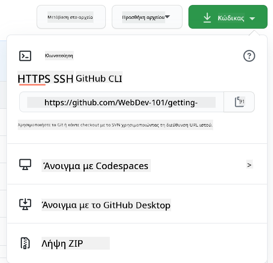

<!--
CO_OP_TRANSLATOR_METADATA:
{
  "original_hash": "ea65b75e488aa33a3cc5cb1c6c3f047a",
  "translation_date": "2025-10-03T13:58:08+00:00",
  "source_file": "1-getting-started-lessons/2-github-basics/README.md",
  "language_code": "el"
}
-->
# Εισαγωγή στο GitHub

Αυτό το μάθημα καλύπτει τα βασικά του GitHub, μιας πλατφόρμας για φιλοξενία και διαχείριση αλλαγών στον κώδικά σας.


> Σκίτσο από την [Tomomi Imura](https://twitter.com/girlie_mac)

## Ερωτηματολόγιο πριν το μάθημα
[Ερωτηματολόγιο πριν το μάθημα](https://ff-quizzes.netlify.app)

## Εισαγωγή

Σε αυτό το μάθημα θα καλύψουμε:

- την παρακολούθηση της δουλειάς που κάνετε στον υπολογιστή σας
- τη συνεργασία σε έργα με άλλους
- πώς να συνεισφέρετε σε λογισμικό ανοιχτού κώδικα

### Προαπαιτούμενα

Πριν ξεκινήσετε, θα πρέπει να ελέγξετε αν το Git είναι εγκατεστημένο. Στο τερματικό πληκτρολογήστε: 
`git --version`

Αν το Git δεν είναι εγκατεστημένο, [κατεβάστε το Git](https://git-scm.com/downloads). Στη συνέχεια, ρυθμίστε το τοπικό προφίλ Git στο τερματικό:
* `git config --global user.name "your-name"`
* `git config --global user.email "your-email"`

Για να ελέγξετε αν το Git είναι ήδη ρυθμισμένο, μπορείτε να πληκτρολογήσετε:
`git config --list`

Θα χρειαστείτε επίσης έναν λογαριασμό GitHub, έναν επεξεργαστή κώδικα (όπως το Visual Studio Code) και να ανοίξετε το τερματικό σας (ή: command prompt).

Μεταβείτε στο [github.com](https://github.com/) και δημιουργήστε έναν λογαριασμό αν δεν έχετε ήδη, ή συνδεθείτε και συμπληρώστε το προφίλ σας.

✅ Το GitHub δεν είναι το μοναδικό αποθετήριο κώδικα στον κόσμο· υπάρχουν και άλλα, αλλά το GitHub είναι το πιο γνωστό.

### Προετοιμασία

Θα χρειαστείτε έναν φάκελο με ένα έργο κώδικα στον τοπικό σας υπολογιστή (laptop ή PC) και ένα δημόσιο αποθετήριο στο GitHub, το οποίο θα χρησιμεύσει ως παράδειγμα για το πώς να συνεισφέρετε στα έργα άλλων.

---

## Διαχείριση κώδικα

Ας πούμε ότι έχετε έναν φάκελο τοπικά με κάποιο έργο κώδικα και θέλετε να αρχίσετε να παρακολουθείτε την πρόοδό σας χρησιμοποιώντας το git - το σύστημα ελέγχου εκδόσεων. Μερικοί άνθρωποι συγκρίνουν τη χρήση του git με το να γράφετε ένα ερωτικό γράμμα στον μελλοντικό σας εαυτό. Διαβάζοντας τα μηνύματα των commit σας μέρες, εβδομάδες ή μήνες αργότερα, θα μπορείτε να θυμηθείτε γιατί πήρατε μια απόφαση ή να "αναιρέσετε" μια αλλαγή - δηλαδή, όταν γράφετε καλά μηνύματα commit.

### Εργασία: Δημιουργία αποθετηρίου και commit κώδικα  

> Δείτε το βίντεο
> 
> [](https://www.youtube.com/watch?v=9R31OUPpxU4)

1. **Δημιουργία αποθετηρίου στο GitHub**. Στο GitHub.com, στην καρτέλα αποθετηρίων ή από τη γραμμή πλοήγησης πάνω δεξιά, βρείτε το κουμπί **new repo**.

   1. Δώστε στο αποθετήριο σας (φάκελο) ένα όνομα.
   1. Επιλέξτε **create repository**.

1. **Μεταβείτε στον φάκελο εργασίας σας**. Στο τερματικό σας, μεταβείτε στον φάκελο (γνωστό και ως directory) που θέλετε να αρχίσετε να παρακολουθείτε. Πληκτρολογήστε:

   ```bash
   cd [name of your folder]
   ```

1. **Αρχικοποίηση αποθετηρίου git**. Στο έργο σας πληκτρολογήστε:

   ```bash
   git init
   ```

1. **Έλεγχος κατάστασης**. Για να ελέγξετε την κατάσταση του αποθετηρίου σας, πληκτρολογήστε:

   ```bash
   git status
   ```

   η έξοδος μπορεί να μοιάζει κάπως έτσι:

   ```output
   Changes not staged for commit:
   (use "git add <file>..." to update what will be committed)
   (use "git checkout -- <file>..." to discard changes in working directory)

        modified:   file.txt
        modified:   file2.txt
   ```

   Συνήθως η εντολή `git status` σας λέει πράγματα όπως ποια αρχεία είναι έτοιμα να _αποθηκευτούν_ στο αποθετήριο ή έχουν αλλαγές που ίσως θέλετε να διατηρήσετε.

1. **Προσθήκη όλων των αρχείων για παρακολούθηση**
   Αυτό ονομάζεται επίσης σταδιοποίηση αρχείων/προσθήκη αρχείων στην περιοχή σταδιοποίησης.

   ```bash
   git add .
   ```

   Το `git add` μαζί με το επιχείρημα `.` υποδεικνύει ότι όλα τα αρχεία και οι αλλαγές σας είναι για παρακολούθηση.

1. **Προσθήκη επιλεγμένων αρχείων για παρακολούθηση**

   ```bash
   git add [file or folder name]
   ```

   Αυτό μας βοηθά να προσθέσουμε μόνο επιλεγμένα αρχεία στην περιοχή σταδιοποίησης όταν δεν θέλουμε να κάνουμε commit όλα τα αρχεία ταυτόχρονα.

1. **Αφαίρεση όλων των αρχείων από τη σταδιοποίηση**

   ```bash
   git reset
   ```

   Αυτή η εντολή μας βοηθά να αφαιρέσουμε όλα τα αρχεία από τη σταδιοποίηση ταυτόχρονα.

1. **Αφαίρεση ενός συγκεκριμένου αρχείου από τη σταδιοποίηση**

   ```bash
   git reset [file or folder name]
   ```

   Αυτή η εντολή μας βοηθά να αφαιρέσουμε μόνο ένα συγκεκριμένο αρχείο από τη σταδιοποίηση που δεν θέλουμε να συμπεριλάβουμε στο επόμενο commit.

1. **Διατήρηση της δουλειάς σας**. Σε αυτό το σημείο έχετε προσθέσει τα αρχεία σε μια λεγόμενη _περιοχή σταδιοποίησης_. Ένα μέρος όπου το Git παρακολουθεί τα αρχεία σας. Για να κάνετε την αλλαγή μόνιμη, πρέπει να _δεσμεύσετε_ τα αρχεία. Για να το κάνετε αυτό, δημιουργείτε ένα _commit_ με την εντολή `git commit`. Ένα _commit_ αντιπροσωπεύει ένα σημείο αποθήκευσης στην ιστορία του αποθετηρίου σας. Πληκτρολογήστε την παρακάτω εντολή για να δημιουργήσετε ένα _commit_:

   ```bash
   git commit -m "first commit"
   ```

   Αυτό δεσμεύει όλα τα αρχεία σας, προσθέτοντας το μήνυμα "first commit". Για μελλοντικά μηνύματα commit, θα θέλετε να είστε πιο περιγραφικοί στην περιγραφή σας για να μεταφέρετε τι είδους αλλαγή έχετε κάνει.

1. **Σύνδεση του τοπικού αποθετηρίου Git με το GitHub**. Ένα αποθετήριο Git είναι καλό στον υπολογιστή σας, αλλά κάποια στιγμή θέλετε να έχετε αντίγραφο ασφαλείας των αρχείων σας κάπου και επίσης να προσκαλέσετε άλλους να συνεργαστούν μαζί σας στο αποθετήριο σας. Ένα τέτοιο εξαιρετικό μέρος για να το κάνετε αυτό είναι το GitHub. Θυμηθείτε ότι έχουμε ήδη δημιουργήσει ένα αποθετήριο στο GitHub, οπότε το μόνο που χρειάζεται να κάνουμε είναι να συνδέσουμε το τοπικό αποθετήριο Git με το GitHub. Η εντολή `git remote add` θα το κάνει αυτό. Πληκτρολογήστε την παρακάτω εντολή:

   > Σημείωση, πριν πληκτρολογήσετε την εντολή, μεταβείτε στη σελίδα του αποθετηρίου σας στο GitHub για να βρείτε το URL του αποθετηρίου. Θα το χρησιμοποιήσετε στην παρακάτω εντολή. Αντικαταστήστε ```https://github.com/username/repository_name.git``` με το URL του GitHub σας.

   ```bash
   git remote add origin https://github.com/username/repository_name.git
   ```

   Αυτό δημιουργεί μια _απομακρυσμένη σύνδεση_, που ονομάζεται "origin", η οποία δείχνει στο αποθετήριο GitHub που δημιουργήσατε νωρίτερα.

1. **Αποστολή τοπικών αρχείων στο GitHub**. Μέχρι στιγμής έχετε δημιουργήσει μια _σύνδεση_ μεταξύ του τοπικού αποθετηρίου και του αποθετηρίου GitHub. Ας στείλουμε αυτά τα αρχεία στο GitHub με την παρακάτω εντολή `git push`, όπως φαίνεται: 
   
   > Σημείωση, το όνομα του branch σας μπορεί να είναι διαφορετικό από το ```main```.

   ```bash
   git push -u origin main
   ```

   Αυτό στέλνει τα commits σας στο branch "main" στο GitHub. Η ρύθμιση του branch `upstream` συμπεριλαμβανομένου του `-u` στην εντολή δημιουργεί έναν σύνδεσμο μεταξύ του τοπικού branch και του απομακρυσμένου branch, ώστε να μπορείτε απλά να χρησιμοποιείτε git push ή git pull χωρίς να καθορίζετε το όνομα του branch στο μέλλον. Το Git θα χρησιμοποιεί αυτόματα το upstream branch και δεν θα χρειάζεται να καθορίζετε το όνομα του branch ρητά σε μελλοντικές εντολές.

2. **Προσθήκη περισσότερων αλλαγών**. Αν θέλετε να συνεχίσετε να κάνετε αλλαγές και να τις στέλνετε στο GitHub, θα χρειαστεί να χρησιμοποιήσετε τις παρακάτω τρεις εντολές:

   ```bash
   git add .
   git commit -m "type your commit message here"
   git push
   ```

   > Συμβουλή, ίσως θέλετε επίσης να υιοθετήσετε ένα αρχείο `.gitignore` για να αποτρέψετε αρχεία που δεν θέλετε να παρακολουθούνται από το να εμφανίζονται στο GitHub - όπως το αρχείο σημειώσεων που αποθηκεύετε στον ίδιο φάκελο αλλά δεν έχει θέση σε ένα δημόσιο αποθετήριο. Μπορείτε να βρείτε πρότυπα για αρχεία `.gitignore` στο [.gitignore templates](https://github.com/github/gitignore).

#### Μηνύματα commit

Ένα εξαιρετικό θέμα γραμμής μηνύματος commit στο Git ολοκληρώνει την παρακάτω πρόταση:
Αν εφαρμοστεί, αυτό το commit θα <το θέμα σας εδώ>

Για το θέμα χρησιμοποιήστε την προστακτική, ενεστώτα: "αλλάζω" αντί για "άλλαξα" ή "αλλαγές". 
Όπως στο θέμα, στο σώμα (προαιρετικό) χρησιμοποιήστε επίσης την προστακτική, ενεστώτα. Το σώμα θα πρέπει να περιλαμβάνει το κίνητρο για την αλλαγή και να το συγκρίνει με την προηγούμενη συμπεριφορά. Εξηγείτε το `γιατί`, όχι το `πώς`.

✅ Αφιερώστε λίγα λεπτά για να περιηγηθείτε στο GitHub. Μπορείτε να βρείτε ένα πραγματικά εξαιρετικό μήνυμα commit; Μπορείτε να βρείτε ένα πραγματικά ελάχιστο; Ποια πληροφορία πιστεύετε ότι είναι η πιο σημαντική και χρήσιμη να μεταφέρετε σε ένα μήνυμα commit;

### Εργασία: Συνεργασία

Ο κύριος λόγος για να βάλετε πράγματα στο GitHub ήταν να κάνετε δυνατή τη συνεργασία με άλλους προγραμματιστές.

## Εργασία σε έργα με άλλους

> Δείτε το βίντεο
>
> [](https://www.youtube.com/watch?v=bFCM-PC3cu8)

Στο αποθετήριο σας, μεταβείτε στο `Insights > Community` για να δείτε πώς συγκρίνεται το έργο σας με τα προτεινόμενα πρότυπα κοινότητας.

   Εδώ είναι μερικά πράγματα που μπορούν να βελτιώσουν το αποθετήριο σας στο GitHub:
   - **Περιγραφή**. Προσθέσατε μια περιγραφή για το έργο σας;
   - **README**. Προσθέσατε ένα README; Το GitHub παρέχει καθοδήγηση για τη συγγραφή ενός [README](https://docs.github.com/articles/about-readmes/?WT.mc_id=academic-77807-sagibbon).
   - **Οδηγίες συνεισφοράς**. Έχει το έργο σας [οδηγίες συνεισφοράς](https://docs.github.com/articles/setting-guidelines-for-repository-contributors/?WT.mc_id=academic-77807-sagibbon); 
   - **Κώδικας Δεοντολογίας**. Ένας [Κώδικας Δεοντολογίας](https://docs.github.com/articles/adding-a-code-of-conduct-to-your-project/); 
   - **Άδεια Χρήσης**. Ίσως το πιο σημαντικό, μια [άδεια χρήσης](https://docs.github.com/articles/adding-a-license-to-a-repository/);

Όλοι αυτοί οι πόροι θα ωφελήσουν την ένταξη νέων μελών στην ομάδα. Και αυτά είναι συνήθως τα πράγματα που οι νέοι συνεισφέροντες κοιτάζουν πριν καν δουν τον κώδικά σας, για να διαπιστώσουν αν το έργο σας είναι το κατάλληλο μέρος για να αφιερώσουν τον χρόνο τους.

✅ Τα αρχεία README, αν και απαιτούν χρόνο για να προετοιμαστούν, συχνά παραμελούνται από πολυάσχολους συντηρητές. Μπορείτε να βρείτε ένα παράδειγμα ενός ιδιαίτερα περιγραφικού; Σημείωση: υπάρχουν μερικά [εργαλεία για τη δημιουργία καλών README](https://www.makeareadme.com/) που ίσως θέλετε να δοκιμάσετε.

### Εργασία: Συγχώνευση κώδικα

Τα έγγραφα συνεισφοράς βοηθούν τους ανθρώπους να συνεισφέρουν στο έργο. Εξηγούν τι είδους συνεισφορές αναζητάτε και πώς λειτουργεί η διαδικασία. Οι συνεισφέροντες θα χρειαστεί να περάσουν από μια σειρά βημάτων για να μπορέσουν να συνεισφέρουν στο αποθετήριο σας στο GitHub:

1. **Forking του αποθετηρίου σας**. Πιθανότατα θα θέλετε οι άνθρωποι να κάνουν _fork_ στο έργο σας. Το Forking σημαίνει τη δημιουργία ενός αντιγράφου του αποθετηρίου σας στο προφίλ τους στο GitHub.
1. **Κλωνοποίηση**. Από εκεί θα κλωνοποιήσουν το έργο στον τοπικό τους υπολογιστή.
1. **Δημιουργία branch**. Θα θέλετε να τους ζητήσετε να δημιουργήσουν ένα _branch_ για τη δουλειά τους.
1. **Εστίαση της αλλαγής σε μία περιοχή**. Ζητήστε από τους συνεισφέροντες να επικεντρώσουν τις συνεισφορές τους σε ένα πράγμα τη φορά - έτσι οι πιθανότητες να μπορέσετε να _συγχωνεύσετε_ τη δουλειά τους είναι μεγαλύτερες. Φανταστείτε ότι γράφουν μια διόρθωση σφάλματος, προσθέτουν μια νέα λειτουργία και ενημερώνουν αρκετές δοκιμές - τι γίνεται αν θέλετε ή μπορείτε να εφαρμόσετε μόνο 2 από τις 3 ή 1 από τις 3 αλλαγές;

✅ Φανταστείτε μια κατάσταση όπου τα branches είναι ιδιαίτερα κρίσιμα για τη συγγραφή και την αποστολή καλού κώδικα. Ποιες περιπτώσεις χρήσης μπορείτε να σκεφτείτε;

> Σημείωση, γίνετε η αλλαγή που θέλετε να δείτε στον κόσμο και δημιουργήστε branches για τη δική σας δουλειά επίσης. Οποιαδήποτε commits κάνετε θα γίνονται στο branch που έχετε "επιλέξει". Χρησιμοποιήστε `git status` για να δείτε ποιο branch είναι αυτό.

Ας περάσουμε από τη ροή εργασίας ενός συνεισφέροντα. Υποθέστε ότι ο συνεισφέρων έχει ήδη κάνει _fork_ και _clone_ το αποθετήριο, ώστε να έχει ένα αποθετήριο Git έτοιμο για εργασία στον τοπικό του υπολογιστή:

1. **Δημιουργία branch**. Χρησιμοποιήστε την εντολή `git branch` για να δημιουργήσετε ένα branch που θα περιέχει τις αλλαγές που σκοπεύουν να συνεισφέρουν:

   ```bash
   git branch [branch-name]
   ```

1. **Μετάβαση στο branch εργασίας**. Μεταβείτε στο συγκεκριμένο branch και ενημερώστε τον φάκελο εργασίας με την εντολή `git switch`:

   ```bash
   git switch [branch-name]
   ```

1. **Εργασία**. Σε αυτό το σημείο θέλετε να προσθέσετε τις αλλαγές σας. Μην ξεχάσετε να ενημερώσετε το Git γι' αυτό με τις παρακάτω εντολές:

   ```bash
   git add .
   git commit -m "my changes"
   ```

   Βεβαιωθείτε ότι δίνετε στο commit σας ένα καλό όνομα, για το δικό σας καλό καθώς και για τον συντηρητή του αποθετηρίου που βοηθάτε.

1. **Συνδυασμός της δουλειάς σας με το branch `main`**. Σε κάποιο σημείο τελειώνετε τη δουλειά σας και θέλετε να τη συνδυάσετε με αυτή του branch `main`. Το branch `main` μπορεί να
1. **Άνοιγμα PR**. Στη συνέχεια, θέλετε να ανοίξετε ένα PR. Αυτό γίνεται πηγαίνοντας στο forked repo στο GitHub. Θα δείτε μια ένδειξη στο GitHub που σας ρωτά αν θέλετε να δημιουργήσετε ένα νέο PR. Κάνετε κλικ εκεί και μεταφέρεστε σε μια διεπαφή όπου μπορείτε να αλλάξετε τον τίτλο του μηνύματος commit και να δώσετε μια πιο κατάλληλη περιγραφή. Τώρα ο maintainer του repo που κάνατε fork θα δει αυτό το PR και _με λίγη τύχη_ θα το εκτιμήσει και θα το _ενσωματώσει_. Είστε πλέον συνεισφέρων, μπράβο! :)

1. **Καθαρισμός**. Θεωρείται καλή πρακτική να _καθαρίζετε_ μετά την επιτυχή ενσωμάτωση ενός PR. Θέλετε να καθαρίσετε τόσο το τοπικό branch σας όσο και το branch που ανεβάσατε στο GitHub. Πρώτα, ας το διαγράψουμε τοπικά με την εξής εντολή:

   ```bash
   git branch -d [branch-name]
   ```
  
   Στη συνέχεια, πηγαίνετε στη σελίδα του GitHub για το forked repo και αφαιρέστε το απομακρυσμένο branch που μόλις ανεβάσατε.

Ο όρος `Pull request` μπορεί να φαίνεται λίγο περίεργος, γιατί στην πραγματικότητα θέλετε να σπρώξετε τις αλλαγές σας στο project. Αλλά ο maintainer (ιδιοκτήτης του project) ή η βασική ομάδα πρέπει να εξετάσει τις αλλαγές σας πριν τις ενσωματώσει στο "main" branch του project, οπότε στην ουσία ζητάτε μια απόφαση αλλαγής από τον maintainer.

Ένα pull request είναι ο χώρος όπου συγκρίνετε και συζητάτε τις διαφορές που εισάγονται σε ένα branch, με κριτικές, σχόλια, ενσωματωμένα τεστ και άλλα. Ένα καλό pull request ακολουθεί περίπου τους ίδιους κανόνες με ένα commit message. Μπορείτε να προσθέσετε μια αναφορά σε ένα issue στο issue tracker, όταν η δουλειά σας, για παράδειγμα, διορθώνει ένα πρόβλημα. Αυτό γίνεται χρησιμοποιώντας ένα `#` ακολουθούμενο από τον αριθμό του issue σας. Για παράδειγμα `#97`.

🤞Με λίγη τύχη, όλα τα checks θα περάσουν και ο ιδιοκτήτης του project θα ενσωματώσει τις αλλαγές σας στο project🤞

Ενημερώστε το τρέχον τοπικό branch εργασίας σας με όλα τα νέα commits από το αντίστοιχο απομακρυσμένο branch στο GitHub:

`git pull`

## Πώς να συνεισφέρετε σε open source

Πρώτα, ας βρούμε ένα repository (ή **repo**) στο GitHub που σας ενδιαφέρει και στο οποίο θέλετε να συνεισφέρετε μια αλλαγή. Θα θέλετε να αντιγράψετε το περιεχόμενό του στον υπολογιστή σας.

✅ Ένας καλός τρόπος να βρείτε repos φιλικά προς αρχάριους είναι να [αναζητήσετε με την ετικέτα 'good-first-issue'](https://github.blog/2020-01-22-browse-good-first-issues-to-start-contributing-to-open-source/).



Υπάρχουν διάφοροι τρόποι αντιγραφής κώδικα. Ένας τρόπος είναι να "κλωνοποιήσετε" το περιεχόμενο του repository, χρησιμοποιώντας HTTPS, SSH ή το GitHub CLI (Command Line Interface).

Ανοίξτε το τερματικό σας και κλωνοποιήστε το repository όπως παρακάτω:  
`git clone https://github.com/ProjectURL`

Για να εργαστείτε στο project, μεταβείτε στον σωστό φάκελο:  
`cd ProjectURL`

Μπορείτε επίσης να ανοίξετε ολόκληρο το project χρησιμοποιώντας [Codespaces](https://github.com/features/codespaces), τον ενσωματωμένο επεξεργαστή κώδικα / περιβάλλον ανάπτυξης cloud του GitHub, ή το [GitHub Desktop](https://desktop.github.com/).

Τέλος, μπορείτε να κατεβάσετε τον κώδικα σε έναν συμπιεσμένο φάκελο.

### Μερικά ακόμα ενδιαφέροντα πράγματα για το GitHub

Μπορείτε να κάνετε star, watch και/ή "fork" οποιοδήποτε δημόσιο repository στο GitHub. Μπορείτε να βρείτε τα repos που έχετε κάνει star στο drop-down μενού πάνω δεξιά. Είναι σαν να κάνετε bookmarking, αλλά για κώδικα.

Τα projects έχουν ένα issue tracker, συνήθως στο GitHub στην καρτέλα "Issues", εκτός αν αναφέρεται διαφορετικά, όπου οι άνθρωποι συζητούν θέματα που σχετίζονται με το project. Και η καρτέλα Pull Requests είναι εκεί όπου οι άνθρωποι συζητούν και αξιολογούν αλλαγές που βρίσκονται σε εξέλιξη.

Τα projects μπορεί επίσης να έχουν συζητήσεις σε φόρουμ, λίστες αλληλογραφίας ή κανάλια συνομιλίας όπως Slack, Discord ή IRC.

✅ Ρίξτε μια ματιά στο νέο σας GitHub repo και δοκιμάστε μερικά πράγματα, όπως να επεξεργαστείτε ρυθμίσεις, να προσθέσετε πληροφορίες στο repo σας και να δημιουργήσετε ένα project (όπως έναν πίνακα Kanban). Υπάρχουν πολλά που μπορείτε να κάνετε!

---

## 🚀 Πρόκληση

Συνεργαστείτε με έναν φίλο για να δουλέψετε στον κώδικα του άλλου. Δημιουργήστε ένα project συνεργατικά, κάντε fork τον κώδικα, δημιουργήστε branches και ενσωματώστε αλλαγές.

## Κουίζ μετά το μάθημα  
[Κουίζ μετά το μάθημα](https://ff-quizzes.netlify.app/web/en/)

## Ανασκόπηση & Αυτομελέτη

Διαβάστε περισσότερα για [τη συνεισφορά σε λογισμικό ανοιχτού κώδικα](https://opensource.guide/how-to-contribute/#how-to-submit-a-contribution).

[Git cheatsheet](https://training.github.com/downloads/github-git-cheat-sheet/).

Εξασκηθείτε, εξασκηθείτε, εξασκηθείτε. Το GitHub διαθέτει εξαιρετικά μονοπάτια μάθησης μέσω του [skills.github.com](https://skills.github.com):

- [Πρώτη Εβδομάδα στο GitHub](https://skills.github.com/#first-week-on-github)

Θα βρείτε επίσης πιο προχωρημένα μαθήματα.

## Εργασία

Ολοκληρώστε [το μάθημα Πρώτη Εβδομάδα στο GitHub](https://skills.github.com/#first-week-on-github)

---

**Αποποίηση ευθύνης**:  
Αυτό το έγγραφο έχει μεταφραστεί χρησιμοποιώντας την υπηρεσία αυτόματης μετάφρασης [Co-op Translator](https://github.com/Azure/co-op-translator). Παρόλο που καταβάλλουμε προσπάθειες για ακρίβεια, παρακαλούμε να έχετε υπόψη ότι οι αυτοματοποιημένες μεταφράσεις ενδέχεται να περιέχουν λάθη ή ανακρίβειες. Το πρωτότυπο έγγραφο στη μητρική του γλώσσα θα πρέπει να θεωρείται η αυθεντική πηγή. Για κρίσιμες πληροφορίες, συνιστάται επαγγελματική ανθρώπινη μετάφραση. Δεν φέρουμε ευθύνη για τυχόν παρεξηγήσεις ή εσφαλμένες ερμηνείες που προκύπτουν από τη χρήση αυτής της μετάφρασης.