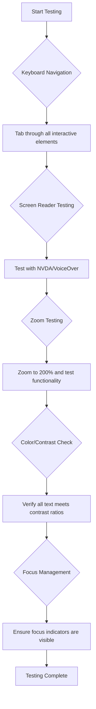
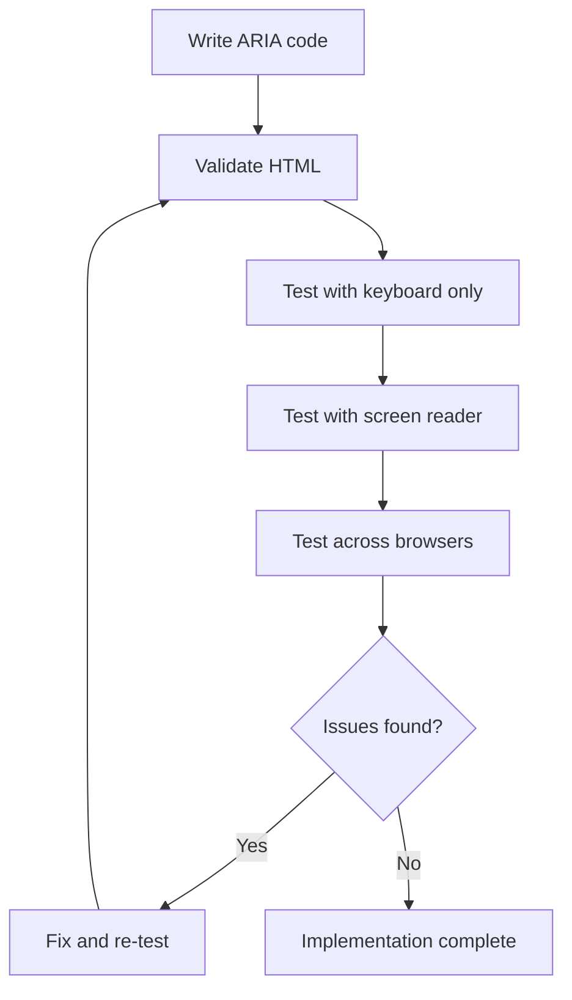

<!--
CO_OP_TRANSLATOR_METADATA:
{
  "original_hash": "90b19cde5b79b29e91babd3138cd8035",
  "translation_date": "2025-10-23T20:04:20+00:00",
  "source_file": "1-getting-started-lessons/3-accessibility/README.md",
  "language_code": "el"
}
-->
# Δημιουργία Προσβάσιμων Ιστοσελίδων


> Σκίτσο από την [Tomomi Imura](https://twitter.com/girlie_mac)

## Ερωτηματολόγιο πριν το μάθημα
[Ερωτηματολόγιο πριν το μάθημα](https://ff-quizzes.netlify.app/web/)

> Η δύναμη του Ιστού βρίσκεται στην καθολικότητά του. Η πρόσβαση από όλους, ανεξαρτήτως αναπηρίας, είναι μια ουσιώδης πτυχή.
>
> \- Sir Timothy Berners-Lee, Διευθυντής του W3C και εφευρέτης του Παγκόσμιου Ιστού

Κάτι που ίσως σας εκπλήξει: όταν δημιουργείτε προσβάσιμες ιστοσελίδες, δεν βοηθάτε μόνο άτομα με αναπηρίες—στην πραγματικότητα κάνετε τον Ιστό καλύτερο για όλους!

Έχετε παρατηρήσει ποτέ εκείνες τις ράμπες στις γωνίες των δρόμων; Αρχικά σχεδιάστηκαν για αναπηρικά αμαξίδια, αλλά τώρα βοηθούν άτομα με καροτσάκια, εργαζόμενους με καρότσια, ταξιδιώτες με βαλίτσες και ποδηλάτες. Έτσι ακριβώς λειτουργεί ο προσβάσιμος σχεδιασμός ιστοσελίδων—λύσεις που βοηθούν μια ομάδα συχνά καταλήγουν να ωφελούν όλους. Εντυπωσιακό, έτσι;

Σε αυτό το μάθημα, θα εξερευνήσουμε πώς να δημιουργούμε ιστοσελίδες που πραγματικά λειτουργούν για όλους, ανεξάρτητα από τον τρόπο που περιηγούνται στον Ιστό. Θα ανακαλύψετε πρακτικές τεχνικές που ήδη περιλαμβάνονται στα πρότυπα του Ιστού, θα εξασκηθείτε με εργαλεία δοκιμών και θα δείτε πώς η προσβασιμότητα κάνει τις ιστοσελίδες σας πιο εύχρηστες για όλους τους χρήστες.

Μέχρι το τέλος αυτού του μαθήματος, θα έχετε την αυτοπεποίθηση να ενσωματώσετε την προσβασιμότητα στη ροή εργασίας σας ως προγραμματιστής. Έτοιμοι να εξερευνήσετε πώς οι προσεκτικές επιλογές σχεδιασμού μπορούν να ανοίξουν τον Ιστό σε δισεκατομμύρια χρήστες; Πάμε!

> Μπορείτε να παρακολουθήσετε αυτό το μάθημα στο [Microsoft Learn](https://docs.microsoft.com/learn/modules/web-development-101/accessibility/?WT.mc_id=academic-77807-sagibbon)!

## Κατανόηση των Τεχνολογιών Υποβοήθησης

Πριν ξεκινήσουμε τον προγραμματισμό, ας αφιερώσουμε λίγο χρόνο για να κατανοήσουμε πώς οι άνθρωποι με διαφορετικές ικανότητες βιώνουν τον Ιστό. Δεν είναι απλώς θεωρία—η κατανόηση αυτών των πραγματικών μοτίβων πλοήγησης θα σας κάνει πολύ καλύτερο προγραμματιστή!

Οι τεχνολογίες υποβοήθησης είναι εκπληκτικά εργαλεία που βοηθούν άτομα με αναπηρίες να αλληλεπιδρούν με ιστοσελίδες με τρόπους που ίσως σας εκπλήξουν. Μόλις κατανοήσετε πώς λειτουργούν αυτές οι τεχνολογίες, η δημιουργία προσβάσιμων εμπειριών στον Ιστό γίνεται πολύ πιο διαισθητική. Είναι σαν να μαθαίνετε να βλέπετε τον κώδικά σας μέσα από τα μάτια κάποιου άλλου.

### Αναγνώστες οθόνης

[Οι αναγνώστες οθόνης](https://en.wikipedia.org/wiki/Screen_reader) είναι αρκετά εξελιγμένες τεχνολογίες που μετατρέπουν το ψηφιακό κείμενο σε φωνή ή έξοδο σε σύστημα Braille. Ενώ χρησιμοποιούνται κυρίως από άτομα με προβλήματα όρασης, είναι επίσης πολύ χρήσιμοι για χρήστες με μαθησιακές δυσκολίες όπως η δυσλεξία.

Μου αρέσει να σκέφτομαι έναν αναγνώστη οθόνης σαν έναν πολύ έξυπνο αφηγητή που διαβάζει ένα βιβλίο για εσάς. Διαβάζει το περιεχόμενο δυνατά με λογική σειρά, ανακοινώνει διαδραστικά στοιχεία όπως "κουμπί" ή "σύνδεσμος" και παρέχει συντομεύσεις πληκτρολογίου για να περιηγηθείτε σε μια σελίδα. Αλλά εδώ είναι το θέμα—οι αναγνώστες οθόνης μπορούν να κάνουν τη μαγεία τους μόνο αν δημιουργούμε ιστοσελίδες με σωστή δομή και ουσιαστικό περιεχόμενο. Εδώ μπαίνετε εσείς ως προγραμματιστής!

**Δημοφιλείς αναγνώστες οθόνης σε διάφορες πλατφόρμες:**
- **Windows**: [NVDA](https://www.nvaccess.org/about-nvda/) (δωρεάν και πιο δημοφιλής), [JAWS](https://webaim.org/articles/jaws/), [Narrator](https://support.microsoft.com/windows/complete-guide-to-narrator-e4397a0d-ef4f-b386-d8ae-c172f109bdb1/?WT.mc_id=academic-77807-sagibbon) (ενσωματωμένος)
- **macOS/iOS**: [VoiceOver](https://support.apple.com/guide/voiceover/welcome/10) (ενσωματωμένος και πολύ ικανός)
- **Android**: [TalkBack](https://support.google.com/accessibility/android/answer/6283677) (ενσωματωμένος)
- **Linux**: [Orca](https://wiki.gnome.org/Projects/Orca) (δωρεάν και ανοιχτού κώδικα)

**Πώς οι αναγνώστες οθόνης πλοηγούνται στο περιεχόμενο του Ιστού:**

Οι αναγνώστες οθόνης παρέχουν πολλαπλές μεθόδους πλοήγησης που κάνουν την περιήγηση αποτελεσματική για έμπειρους χρήστες:
- **Σειριακή ανάγνωση**: Διαβάζει το περιεχόμενο από πάνω προς τα κάτω, όπως ακολουθώντας ένα βιβλίο
- **Πλοήγηση με σημεία αναφοράς**: Μεταπήδηση μεταξύ τμημάτων της σελίδας (κεφαλίδα, πλοήγηση, κύριο μέρος, υποσέλιδο)
- **Πλοήγηση με επικεφαλίδες**: Παράκαμψη μεταξύ επικεφαλίδων για κατανόηση της δομής της σελίδας
- **Λίστες συνδέσμων**: Δημιουργία λίστας όλων των συνδέσμων για γρήγορη πρόσβαση
- **Έλεγχοι φόρμας**: Πλοήγηση απευθείας μεταξύ πεδίων εισαγωγής και κουμπιών

> 💡 **Κάτι που με εντυπωσίασε**: Το 68% των χρηστών αναγνωστών οθόνης πλοηγούνται κυρίως μέσω επικεφαλίδων ([Έρευνα WebAIM](https://webaim.org/projects/screenreadersurvey9/#finding)). Αυτό σημαίνει ότι η δομή των επικεφαλίδων σας είναι σαν ένας χάρτης για τους χρήστες—όταν το κάνετε σωστά, βοηθάτε κυριολεκτικά τους ανθρώπους να βρουν τον δρόμο τους γύρω από το περιεχόμενό σας πιο γρήγορα!

### Δημιουργία της ροής εργασίας δοκιμών σας

Έχουμε καλά νέα—η αποτελεσματική δοκιμή προσβασιμότητας δεν χρειάζεται να είναι συντριπτική! Θα θέλετε να συνδυάσετε αυτοματοποιημένα εργαλεία (είναι φανταστικά για να εντοπίζουν προφανή προβλήματα) με κάποιες χειροκίνητες δοκιμές. Ακολουθεί μια συστηματική προσέγγιση που, κατά τη γνώμη μου, εντοπίζει τα περισσότερα προβλήματα χωρίς να καταναλώνει όλη σας την ημέρα:

**Βασική ροή εργασίας χειροκίνητων δοκιμών:**



**Λίστα ελέγχου βήμα προς βήμα για δοκιμές:**
1. **Πλοήγηση με πληκτρολόγιο**: Χρησιμοποιήστε μόνο Tab, Shift+Tab, Enter, Space και πλήκτρα βέλους
2. **Δοκιμή με αναγνώστη οθόνης**: Ενεργοποιήστε το NVDA, VoiceOver ή Narrator και πλοηγηθείτε με κλειστά μάτια
3. **Δοκιμή ζουμ**: Δοκιμάστε σε επίπεδα ζουμ 200% και 400%
4. **Επαλήθευση αντίθεσης χρωμάτων**: Ελέγξτε όλο το κείμενο και τα στοιχεία διεπαφής χρήστη
5. **Δοκιμή ένδειξης εστίασης**: Βεβαιωθείτε ότι όλα τα διαδραστικά στοιχεία έχουν ορατές καταστάσεις εστίασης

✅ **Ξεκινήστε με το Lighthouse**: Ανοίξτε τα DevTools του προγράμματος περιήγησης σας, εκτελέστε έναν έλεγχο προσβασιμότητας Lighthouse και χρησιμοποιήστε τα αποτελέσματα για να καθοδηγήσετε τις περιοχές εστίασης των χειροκίνητων δοκιμών σας.

### Εργαλεία ζουμ και μεγέθυνσης

Ξέρετε πώς μερικές φορές κάνετε ζουμ στο τηλέφωνό σας όταν το κείμενο είναι πολύ μικρό ή στραβώνετε τα μάτια σας στην οθόνη του φορητού υπολογιστή σας σε έντονο φως; Πολλοί χρήστες βασίζονται σε εργαλεία μεγέθυνσης για να κάνουν το περιεχόμενο ευανάγνωστο κάθε μέρα. Αυτό περιλαμβάνει άτομα με χαμηλή όραση, ηλικιωμένους και οποιονδήποτε έχει προσπαθήσει να διαβάσει μια ιστοσελίδα σε εξωτερικό χώρο.

Οι σύγχρονες τεχνολογίες ζουμ έχουν εξελιχθεί πέρα από το απλό μεγάλωμα. Η κατανόηση του τρόπου λειτουργίας αυτών των εργαλείων θα σας βοηθήσει να δημιουργήσετε ευέλικτα σχέδια που παραμένουν λειτουργικά και ελκυστικά σε οποιοδήποτε επίπεδο μεγέθυνσης.

**Σύγχρονες δυνατότητες ζουμ προγραμμάτων περιήγησης:**
- **Ζουμ σελίδας**: Μεγέθυνση όλου του περιεχομένου αναλογικά (κείμενο, εικόνες, διάταξη) - αυτή είναι η προτιμώμενη μέθοδος
- **Ζουμ μόνο κειμένου**: Αύξηση μεγέθους γραμματοσειράς διατηρώντας την αρχική διάταξη
- **Ζουμ με τσίμπημα**: Υποστήριξη χειρονομιών κινητών για προσωρινή μεγέθυνση
- **Υποστήριξη προγραμμάτων περιήγησης**: Όλα τα σύγχρονα προγράμματα περιήγησης υποστηρίζουν ζουμ έως 500% χωρίς να διακόπτεται η λειτουργικότητα

**Εξειδικευμένο λογισμικό μεγέθυνσης:**
- **Windows**: [Magnifier](https://support.microsoft.com/windows/use-magnifier-to-make-things-on-the-screen-easier-to-see-414948ba-8b1c-d3bd-8615-0e5e32204198) (ενσωματωμένο), [ZoomText](https://www.freedomscientific.com/training/zoomtext/getting-started/)
- **macOS/iOS**: [Zoom](https://www.apple.com/accessibility/mac/vision/) (ενσωματωμένο με προηγμένες λειτουργίες)

> ⚠️ **Σχεδιαστική Σκέψη**: Οι οδηγίες WCAG απαιτούν το περιεχόμενο να παραμένει λειτουργικό όταν μεγεθύνεται έως 200%. Σε αυτό το επίπεδο, η οριζόντια κύλιση πρέπει να είναι ελάχιστη και όλα τα διαδραστικά στοιχεία πρέπει να παραμένουν προσβάσιμα.

✅ **Δοκιμάστε τον ευέλικτο σχεδιασμό σας**: Μεγεθύνετε το πρόγραμμα περιήγησής σας στο 200% και 400%. Προσαρμόζεται ομαλά η διάταξή σας; Μπορείτε ακόμα να έχετε πρόσβαση σε όλη τη λειτουργικότητα χωρίς υπερβολική κύλιση;

## Σύγχρονα Εργαλεία Δοκιμής Προσβασιμότητας

Τώρα που κατανοείτε πώς οι άνθρωποι πλοηγούνται στον Ιστό με τεχνολογίες υποβοήθησης, ας εξερευνήσουμε τα εργαλεία που σας βοηθούν να δημιουργήσετε και να δοκιμάσετε προσβάσιμες ιστοσελίδες.

Σκεφτείτε το έτσι: τα αυτοματοποιημένα εργαλεία είναι εξαιρετικά για να εντοπίζουν προφανή προβλήματα (όπως η έλλειψη εναλλακτικού κειμένου), ενώ οι χειροκίνητες δοκιμές σας βοηθούν να διασφαλίσετε ότι η ιστοσελίδα σας είναι ευχάριστη στη χρήση στην πραγματική ζωή. Μαζί, σας δίνουν την αυτοπεποίθηση ότι οι ιστοσελίδες σας λειτουργούν για όλους.

### Δοκιμή αντίθεσης χρωμάτων

Έχουμε καλά νέα: η αντίθεση χρωμάτων είναι ένα από τα πιο κοινά προβλήματα προσβασιμότητας, αλλά είναι επίσης ένα από τα πιο εύκολα να διορθωθούν. Η καλή αντίθεση ωφελεί όλους—από χρήστες με προβλήματα όρασης μέχρι άτομα που προσπαθούν να διαβάσουν το τηλέφωνό τους στην παραλία.

**Απαιτήσεις αντίθεσης WCAG:**

| Τύπος Κειμένου | WCAG AA (Ελάχιστο) | WCAG AAA (Ενισχυμένο) |
|----------------|---------------------|-----------------------|
| **Κανονικό κείμενο** (κάτω από 18pt) | Αναλογία αντίθεσης 4.5:1 | Αναλογία αντίθεσης 7:1 |
| **Μεγάλο κείμενο** (18pt+ ή 14pt+ έντονο) | Αναλογία αντίθεσης 3:1 | Αναλογία αντίθεσης 4.5:1 |
| **Στοιχεία διεπαφής χρήστη** (κουμπιά, περιγράμματα φόρμας) | Αναλογία αντίθεσης 3:1 | Αναλογία αντίθεσης 3:1 |

**Απαραίτητα εργαλεία δοκιμής:**
- [Colour Contrast Analyser](https://www.tpgi.com/color-contrast-checker/) - Εφαρμογή για υπολογιστές με επιλογέα χρωμάτων
- [WebAIM Contrast Checker](https://webaim.org/resources/contrastchecker/) - Βασισμένο στον Ιστό με άμεση ανατροφοδότηση
- [Stark](https://www.getstark.co/) - Πρόσθετο εργαλείου σχεδίασης για Figma, Sketch, Adobe XD
- [Accessible Colors](https://accessible-colors.com/) - Βρείτε προσβάσιμες παλέτες χρωμάτων

✅ **Δημιουργήστε καλύτερες παλέτες χρωμάτων**: Ξεκινήστε με τα χρώματα της επωνυμίας σας και χρησιμοποιήστε ελέγχους αντίθεσης για να δημιουργήσετε προσβάσιμες παραλλαγές. Καταγράψτε αυτές ως προσβάσιμα χρωματικά tokens του συστήματος σχεδίασής σας.

### Ολοκληρωμένος έλεγχος προσβασιμότητας

Η πιο αποτελεσματική δοκιμή προσβασιμότητας συνδυάζει πολλαπλές προσεγγίσεις. Κανένα εργαλείο δεν εντοπίζει τα πάντα, οπότε η δημιουργία μιας ρουτίνας δοκιμών με διάφορες μεθόδους εξασφαλίζει πλήρη κάλυψη.

**Δοκιμές μέσω προγράμματος περιήγησης (ενσωματωμένες στα DevTools):**
- **Chrome/Edge**: Έλεγχος προσβασιμότητας Lighthouse + Πάνελ προσβασιμότητας
- **Firefox**: Επιθεωρητής προσβασιμότητας με λεπτομερή προβολή δέντρου
- **Safari**: Καρτέλα ελέγχου στο Web Inspector με προσομοίωση VoiceOver

**Επαγγελματικές επεκτάσεις δοκιμών:**
- [axe DevTools](https://www.deque.com/axe/devtools/) - Αυτοματοποιημένη δοκιμή βιομηχανικού προτύπου
- [WAVE](https://wave.webaim.org/extension/) - Οπτική ανατροφοδότηση με επισήμανση σφαλμάτων
- [Accessibility Insights](https://accessibilityinsights.io/) - Ολοκληρωμένη σουίτα δοκιμών της Microsoft

**Ενσωμάτωση γραμμής εντολών και CI/CD:**
- [axe-core](https://github.com/dequelabs/axe-core) - Βιβλιοθήκη JavaScript για αυτοματοποιημένες δοκιμές
- [Pa11y](https://pa11y.org/) - Εργαλείο δοκιμής προσβασιμότητας γραμμής εντολών
- [Lighthouse CI](
Το χρώμα είναι ένα ισχυρό μέσο επικοινωνίας, αλλά δεν πρέπει ποτέ να είναι ο μόνος τρόπος για να μεταφέρετε σημαντικές πληροφορίες. Ο σχεδιασμός πέρα από το χρώμα δημιουργεί πιο ανθεκτικές, συμπεριληπτικές εμπειρίες που λειτουργούν σε περισσότερες καταστάσεις.

**Σχεδιάστε για διαφορές στην αντίληψη χρωμάτων:**

Περίπου το 8% των ανδρών και το 0,5% των γυναικών έχουν κάποια μορφή διαφοράς στην αντίληψη χρωμάτων (συχνά αποκαλείται "αχρωματοψία"). Οι πιο κοινές τύποι είναι:
- **Δευτερανωπία**: Δυσκολία στη διάκριση κόκκινου και πράσινου
- **Πρωτανωπία**: Το κόκκινο φαίνεται πιο σκοτεινό
- **Τριτανωπία**: Δυσκολία με μπλε και κίτρινο (σπάνιο)

**Στρατηγικές συμπεριληπτικού χρώματος:**

```css
/* ❌ Bad: Using only color to indicate status */
.error { color: red; }
.success { color: green; }

/* ✅ Good: Color plus icons and context */
.error {
  color: #d32f2f;
  border-left: 4px solid #d32f2f;
}
.error::before {
  content: "⚠️";
  margin-right: 8px;
}

.success {
  color: #2e7d32;
  border-left: 4px solid #2e7d32;
}
.success::before {
  content: "✅";
  margin-right: 8px;
}
```

**Πέρα από τις βασικές απαιτήσεις αντίθεσης:**
- Δοκιμάστε τις επιλογές χρωμάτων σας με προσομοιωτές αχρωματοψίας
- Χρησιμοποιήστε μοτίβα, υφές ή σχήματα μαζί με την κωδικοποίηση χρωμάτων
- Βεβαιωθείτε ότι οι διαδραστικές καταστάσεις παραμένουν διακριτές χωρίς χρώμα
- Σκεφτείτε πώς φαίνεται ο σχεδιασμός σας σε λειτουργία υψηλής αντίθεσης

✅ **Δοκιμάστε την προσβασιμότητα χρωμάτων σας**: Χρησιμοποιήστε εργαλεία όπως το [Coblis](https://www.color-blindness.com/coblis-color-blindness-simulator/) για να δείτε πώς εμφανίζεται ο ιστότοπός σας σε χρήστες με διαφορετικούς τύπους αντίληψης χρωμάτων.

### Δείκτες εστίασης και σχεδιασμός αλληλεπίδρασης

Οι δείκτες εστίασης είναι το ψηφιακό ισοδύναμο του δείκτη του ποντικιού—δείχνουν στους χρήστες του πληκτρολογίου πού βρίσκονται στη σελίδα. Καλά σχεδιασμένοι δείκτες εστίασης βελτιώνουν την εμπειρία για όλους, κάνοντας τις αλληλεπιδράσεις σαφείς και προβλέψιμες.

**Σύγχρονες βέλτιστες πρακτικές για δείκτες εστίασης:**

```css
/* Enhanced focus styles that work across browsers */
button:focus-visible {
  outline: 2px solid #0066cc;
  outline-offset: 2px;
  box-shadow: 0 0 0 4px rgba(0, 102, 204, 0.25);
}

/* Remove focus outline for mouse users, preserve for keyboard users */
button:focus:not(:focus-visible) {
  outline: none;
}

/* Focus-within for complex components */
.card:focus-within {
  box-shadow: 0 0 0 3px rgba(74, 144, 164, 0.5);
  border-color: #4A90A4;
}

/* Ensure focus indicators meet contrast requirements */
.custom-focus:focus-visible {
  outline: 3px solid #ffffff;
  outline-offset: 2px;
  box-shadow: 0 0 0 6px #000000;
}
```

**Απαιτήσεις για δείκτες εστίασης:**
- **Ορατότητα**: Πρέπει να έχουν τουλάχιστον αναλογία αντίθεσης 3:1 με τα γύρω στοιχεία
- **Πλάτος**: Ελάχιστο πάχος 2px γύρω από ολόκληρο το στοιχείο
- **Επιμονή**: Πρέπει να παραμένουν ορατοί μέχρι να μετακινηθεί η εστίαση αλλού
- **Διακριτικότητα**: Πρέπει να είναι οπτικά διαφορετικοί από άλλες καταστάσεις UI

> 💡 **Συμβουλή Σχεδιασμού**: Εξαιρετικοί δείκτες εστίασης συχνά χρησιμοποιούν συνδυασμό περιγράμματος, σκιάς κουτιού και αλλαγών χρώματος για να εξασφαλίσουν ορατότητα σε διαφορετικά φόντα και περιβάλλοντα.

✅ **Ελέγξτε τους δείκτες εστίασης**: Περιηγηθείτε στον ιστότοπό σας με το πλήκτρο Tab και σημειώστε ποια στοιχεία έχουν σαφείς δείκτες εστίασης. Υπάρχουν κάποια που είναι δύσκολο να δει κανείς ή λείπουν εντελώς;

### Σημασιολογική HTML: Το θεμέλιο της προσβασιμότητας

Η σημασιολογική HTML είναι σαν να δίνετε στις τεχνολογίες υποβοήθησης ένα GPS για τον ιστότοπό σας. Όταν χρησιμοποιείτε τα σωστά στοιχεία HTML για τον προορισμό τους, ουσιαστικά παρέχετε στους αναγνώστες οθόνης, τα πληκτρολόγια και άλλα εργαλεία έναν λεπτομερή χάρτη για να βοηθήσετε τους χρήστες να πλοηγηθούν αποτελεσματικά.

Μια αναλογία που πραγματικά με βοήθησε να καταλάβω: η σημασιολογική HTML είναι η διαφορά μεταξύ μιας καλά οργανωμένης βιβλιοθήκης με σαφείς κατηγορίες και χρήσιμες πινακίδες και μιας αποθήκης όπου τα βιβλία είναι διάσπαρτα τυχαία. Και τα δύο μέρη έχουν τα ίδια βιβλία, αλλά πού θα προτιμούσατε να προσπαθήσετε να βρείτε κάτι; Ακριβώς!

**Βασικά στοιχεία δομής προσβάσιμης σελίδας:**

```html
<!-- Landmark elements provide page navigation structure -->
<header>
  <h1>Your Site Name</h1>
  <nav aria-label="Main navigation">
    <ul>
      <li><a href="/home">Home</a></li>
      <li><a href="/about">About</a></li>
      <li><a href="/services">Services</a></li>
    </ul>
  </nav>
</header>

<main>
  <article>
    <header>
      <h1>Article Title</h1>
      <p>Published on <time datetime="2024-10-14">October 14, 2024</time></p>
    </header>
    
    <section>
      <h2>First Section</h2>
      <p>Content that relates to this section...</p>
    </section>
    
    <section>
      <h2>Second Section</h2>
      <p>More related content...</p>
    </section>
  </article>
  
  <aside>
    <h2>Related Links</h2>
    <nav aria-label="Related articles">
      <ul>
        <li><a href="/related-1">First related article</a></li>
        <li><a href="/related-2">Second related article</a></li>
      </ul>
    </nav>
  </aside>
</main>

<footer>
  <p>&copy; 2024 Your Site Name. All rights reserved.</p>
  <nav aria-label="Footer links">
    <ul>
      <li><a href="/privacy">Privacy Policy</a></li>
      <li><a href="/contact">Contact Us</a></li>
    </ul>
  </nav>
</footer>
```

**Γιατί η σημασιολογική HTML μεταμορφώνει την προσβασιμότητα:**

| Σημασιολογικό Στοιχείο | Σκοπός | Όφελος για Αναγνώστες Οθόνης |
|------------------|---------|----------------------|
| `<header>` | Κεφαλίδα σελίδας ή ενότητας | "Σημείο αναφοράς banner" - γρήγορη πλοήγηση στην κορυφή |
| `<nav>` | Συνδέσεις πλοήγησης | "Σημείο αναφοράς πλοήγησης" - λίστα τμημάτων πλοήγησης |
| `<main>` | Κύριο περιεχόμενο σελίδας | "Σημείο αναφοράς κύριο" - άμεση μετάβαση στο περιεχόμενο |
| `<article>` | Αυτοτελές περιεχόμενο | Ανακοινώνει τα όρια του άρθρου |
| `<section>` | Ομαδοποιήσεις θεματικού περιεχομένου | Παρέχει δομή περιεχομένου |
| `<aside>` | Σχετικό περιεχόμενο πλευρικής στήλης | "Συμπληρωματικό σημείο αναφοράς" |
| `<footer>` | Υποσέλιδο σελίδας ή ενότητας | "Σημείο αναφοράς πληροφοριών περιεχομένου" |

**Υπερδυνάμεις αναγνωστών οθόνης με σημασιολογική HTML:**
- **Πλοήγηση σημείων αναφοράς**: Μεταπήδηση μεταξύ κύριων τμημάτων σελίδας άμεσα
- **Περίγραμμα επικεφαλίδων**: Δημιουργία πίνακα περιεχομένων από τη δομή επικεφαλίδων
- **Λίστες στοιχείων**: Δημιουργία λιστών όλων των συνδέσεων, κουμπιών ή ελέγχων φόρμας
- **Επίγνωση περιεχομένου**: Κατανόηση σχέσεων μεταξύ τμημάτων περιεχομένου

> 🎯 **Γρήγορη Δοκιμή**: Δοκιμάστε να πλοηγηθείτε στον ιστότοπό σας με έναν αναγνώστη οθόνης χρησιμοποιώντας συντομεύσεις σημείων αναφοράς (D για σημείο αναφοράς, H για επικεφαλίδα, K για σύνδεση στο NVDA/JAWS). Η πλοήγηση έχει νόημα;

✅ **Ελέγξτε τη σημασιολογική σας δομή**: Χρησιμοποιήστε τον πίνακα προσβασιμότητας στα DevTools του προγράμματος περιήγησής σας για να δείτε το δέντρο προσβασιμότητας και να βεβαιωθείτε ότι η σήμανσή σας δημιουργεί μια λογική δομή.

### Ιεραρχία επικεφαλίδων: Δημιουργία λογικής διάταξης περιεχομένου

Οι επικεφαλίδες είναι απολύτως κρίσιμες για προσβάσιμο περιεχόμενο—είναι σαν τη σπονδυλική στήλη που κρατά τα πάντα μαζί. Οι χρήστες αναγνωστών οθόνης βασίζονται πολύ στις επικεφαλίδες για να κατανοήσουν και να πλοηγηθούν στο περιεχόμενο. Σκεφτείτε το σαν να παρέχετε έναν πίνακα περιεχομένων για τη σελίδα σας.

**Ο χρυσός κανόνας για τις επικεφαλίδες:**
Ποτέ μην παραλείπετε επίπεδα. Προχωρήστε πάντα λογικά από `<h1>` σε `<h2>` σε `<h3>` και ούτω καθεξής. Θυμάστε όταν φτιάχνατε περιγράμματα στο σχολείο; Είναι ακριβώς η ίδια αρχή—δεν θα πηδούσατε από "Ι. Κύριο Σημείο" κατευθείαν στο "Γ. Υπο-υποσημείο" χωρίς ένα "Α. Υποσημείο" ενδιάμεσα, σωστά;

**Παράδειγμα τέλειας δομής επικεφαλίδων:**

```html
<!-- ✅ Excellent: Logical, hierarchical progression -->
<main>
  <h1>Complete Guide to Web Accessibility</h1>
  
  <section>
    <h2>Understanding Screen Readers</h2>
    <p>Introduction to screen reader technology...</p>
    
    <h3>Popular Screen Reader Software</h3>
    <p>NVDA, JAWS, and VoiceOver comparison...</p>
    
    <h3>Testing with Screen Readers</h3>
    <p>Step-by-step testing instructions...</p>
  </section>
  
  <section>
    <h2>Color and Contrast Guidelines</h2>
    <p>Designing with sufficient contrast...</p>
    
    <h3>WCAG Contrast Requirements</h3>
    <p>Understanding the different contrast levels...</p>
    
    <h3>Testing Tools and Techniques</h3>
    <p>Tools for verifying contrast ratios...</p>
  </section>
</main>
```

```html
<!-- ❌ Problematic: Skipping levels, inconsistent structure -->
<h1>Page Title</h1>
<h3>Subsection</h3> <!-- Skipped h2 -->
<h2>This should come before h3</h2>
<h1>Another main heading?</h1> <!-- Multiple h1s -->
```

**Βέλτιστες πρακτικές για επικεφαλίδες:**
- **Μία `<h1>` ανά σελίδα**: Συνήθως ο κύριος τίτλος της σελίδας ή η κύρια επικεφαλίδα περιεχομένου
- **Λογική πρόοδος**: Ποτέ μην παραλείπετε επίπεδα (h1 → h2 → h3, όχι h1 → h3)
- **Περιγραφικό περιεχόμενο**: Κάντε τις επικεφαλίδες κατανοητές όταν διαβάζονται εκτός πλαισίου
- **Οπτική μορφοποίηση με CSS**: Χρησιμοποιήστε CSS για εμφάνιση, επίπεδα HTML για δομή

**Στατιστικά πλοήγησης αναγνωστών οθόνης:**
- Το 68% των χρηστών αναγνωστών οθόνης πλοηγούνται μέσω επικεφαλίδων ([Έρευνα WebAIM](https://webaim.org/projects/screenreadersurvey9/#finding))
- Οι χρήστες αναμένουν να βρουν μια λογική διάταξη επικεφαλίδων
- Οι επικεφαλίδες παρέχουν τον ταχύτερο τρόπο για να κατανοήσουν τη δομή της σελίδας

> 💡 **Επαγγελματική Συμβουλή**: Χρησιμοποιήστε επεκτάσεις προγράμματος περιήγησης όπως το "HeadingsMap" για να οπτικοποιήσετε τη δομή των επικεφαλίδων σας. Πρέπει να διαβάζεται σαν ένας καλά οργανωμένος πίνακας περιεχομένων.

✅ **Δοκιμάστε τη δομή των επικεφαλίδων σας**: Χρησιμοποιήστε την πλοήγηση επικεφαλίδων ενός αναγνώστη οθόνης (πλήκτρο H στο NVDA) για να μεταπηδήσετε στις επικεφαλίδες σας. Η πρόοδος αφηγείται λογικά την ιστορία του περιεχομένου σας;

### Προχωρημένες τεχνικές οπτικής προσβασιμότητας

Πέρα από τα βασικά της αντίθεσης και του χρώματος, υπάρχουν εξελιγμένες τεχνικές που βοηθούν στη δημιουργία πραγματικά συμπεριληπτικών οπτικών εμπειριών. Αυτές οι μέθοδοι εξασφαλίζουν ότι το περιεχόμενό σας λειτουργεί σε διαφορετικές συνθήκες προβολής και τεχνολογίες υποβοήθησης.

**Βασικές στρατηγικές οπτικής επικοινωνίας:**

- **Πολυτροπική ανατροφοδότηση**: Συνδυάστε οπτικά, κειμενικά και μερικές φορές ηχητικά στοιχεία
- **Προοδευτική αποκάλυψη**: Παρουσιάστε πληροφορίες σε εύπεπτα κομμάτια
- **Συνεπείς μοτίβα αλληλεπίδρασης**: Χρησιμοποιήστε γνωστές συμβάσεις UI
- **Ανταποκρινόμενη τυπογραφία**: Κλιμακώστε το κείμενο κατάλληλα σε όλες τις συσκευές
- **Καταστάσεις φόρτωσης και σφαλμάτων**: Παρέχετε σαφή ανατροφοδότηση για όλες τις ενέργειες χρηστών

**Χρησιμότητες CSS για βελτιωμένη προσβασιμότητα:**

```css
/* Screen reader only text - visually hidden but accessible */
.sr-only {
  position: absolute;
  width: 1px;
  height: 1px;
  padding: 0;
  margin: -1px;
  overflow: hidden;
  clip: rect(0, 0, 0, 0);
  white-space: nowrap;
  border: 0;
}

/* Skip link for keyboard navigation */
.skip-link {
  position: absolute;
  top: -40px;
  left: 6px;
  background: #000000;
  color: #ffffff;
  padding: 8px 16px;
  text-decoration: none;
  border-radius: 4px;
  font-weight: bold;
  transition: top 0.3s ease;
  z-index: 1000;
}

.skip-link:focus {
  top: 6px;
}

/* Reduced motion respect */
@media (prefers-reduced-motion: reduce) {
  .skip-link {
    transition: none;
  }
  
  * {
    animation-duration: 0.01ms !important;
    animation-iteration-count: 1 !important;
    transition-duration: 0.01ms !important;
  }
}

/* High contrast mode support */
@media (prefers-contrast: high) {
  .button {
    border: 2px solid;
  }
}
```

> 🎯 **Πρότυπο Προσβασιμότητας**: Ο "σύνδεσμος παράκαμψης" είναι απαραίτητος για χρήστες πληκτρολογίου. Πρέπει να είναι το πρώτο στοιχείο που μπορεί να εστιάσει στη σελίδα σας και να μεταπηδά απευθείας στην κύρια περιοχή περιεχομένου.

✅ **Εφαρμόστε παράκαμψη πλοήγησης**: Προσθέστε συνδέσμους παράκαμψης στις σελίδες σας και δοκιμάστε τους πατώντας Tab μόλις φορτώσει η σελίδα. Πρέπει να εμφανίζονται και να σας επιτρέπουν να μεταπηδήσετε στο κύριο περιεχόμενο.

## Δημιουργία Σημαντικού Κειμένου Συνδέσμων

Οι σύνδεσμοι είναι ουσιαστικά οι αυτοκινητόδρομοι του ιστού, αλλά το κακογραμμένο κείμενο συνδέσμων είναι σαν να έχετε πινακίδες που απλά λένε "Μέρος" αντί για "Κέντρο Σικάγο". Δεν είναι πολύ χρήσιμο, σωστά;

Κάτι που με εντυπωσίασε όταν το έμαθα: οι αναγνώστες οθόνης μπορούν να εξάγουν όλους τους συνδέσμους από μια σελίδα και να τους εμφανίσουν ως μία μεγάλη λίστα. Φανταστείτε αν κάποιος σας έδινε έναν κατάλογο με κάθε σύνδεσμο στη σελίδα σας. Θα είχε νόημα ο καθένας από μόνος του; Αυτό είναι το τεστ που πρέπει να περάσει το κείμενο των συνδέσμων σας!

### Κατανόηση μοτίβων πλοήγησης συνδέσμων

Οι αναγνώστες οθόνης προσφέρουν ισχυρές δυνατότητες πλοήγησης συνδέσμων που βασίζονται σε καλά γραμμένο κείμενο συνδέσμων:

**Μέθοδοι πλοήγησης συνδέσμων:**
- **Σειριακή ανάγνωση**: Οι σύνδεσμοι διαβάζονται στο πλαίσιο ως μέρος της ροής περιεχομένου
- **Δημιουργία λίστας συνδέσμων**: Όλοι οι σύνδεσμοι της σελίδας συγκεντρώνονται σε έναν κατάλογο
- **Γρήγορη πλοήγηση**: Μεταπήδηση μεταξύ συνδέσμων χρησιμοποιώντας συντομεύσεις πληκτρολογίου (K στο NVDA)
- **Λειτουργία αναζήτησης**: Εύρεση συγκεκριμένων συνδέσμων πληκτρολογώντας μέρος του κειμένου

**Γιατί έχει σημασία το πλαίσιο:**
Όταν οι χρήστες αναγνωστών οθόνης δημιουργούν μια λίστα συνδέσμων, βλέπουν κάτι σαν αυτό:
- "Λήψη αναφοράς"
- "Μάθετε περισσότερα"
- "Κάντε κλικ εδώ"
- "Πολιτική απορρήτου"
- "Κάντε κλικ εδώ"

Μόνο δύο από αυτούς τους συνδέσμους παρέχουν χρήσιμες πληροφορίες όταν διαβάζονται εκτός πλαισίου!

> 📊 **Επίδραση στους Χρήστες**: Οι χρήστες αναγνωστών οθόνης σαρώνουν λίστες συνδέσμων για να κατανοήσουν γρήγορα το περιεχόμενο της σελίδας. Το γενικό κείμενο συνδέσμων τους αναγκάζει να επιστρέψουν στο πλαίσιο κάθε συνδέσμου, επιβραδύνοντας σημαντικά την εμπειρία περιήγησης.

### Συνηθισμένα λάθη στο κείμενο συνδέσμων που πρέπει να αποφεύγετε

Η κατανόηση του τι δεν λειτουργεί σας βοηθά να αναγνωρίσετε και να διορθώσετε προβλήματα προσβασιμότητας στο υπάρχον περιεχόμενο.

**❌ Γενικό κείμενο συνδέσμων που δεν παρέχει πλαίσιο:**

```html
<!-- Meaningless when read from a link list -->
<p>Our sustainability efforts are detailed in our recent report. 
   <a href="/sustainability-2024.pdf">Click here</a> to view it.</p>

<!-- Repeated generic text throughout the page -->
<div class="article-card">
  <h3>Web Accessibility Guide</h3>
  <p>Learn the fundamentals...</p>
  <a href="/accessibility-guide">Read more</a>
</div>
<div class="article-card">
  <h3>Color Contrast Tips</h3>
  <p>Improve your design...</p>
  <a href="/color-contrast">Read more</a>
</div>

<!-- URLs as link text (difficult for screen readers to announce) -->
<p>Visit https://www.w3.org/WAI/WCAG21/quickref/ for WCAG guidelines.</p>

<!-- Vague action words -->
<a href="/contact">Go</a> | <a href="/about">See</a> | <a href="/help">View</a>
```

**Γιατί αυτά τα μοτίβα αποτυγχάνουν:**
- **"Κάντε κλικ εδώ"** δεν λέει τίποτα για τον προορισμό
- **"Διαβάστε περισσότερα"** επαναλαμβανόμενο πολλές φορές δημιουργεί σύγχυση
- **Ακατέργαστες διευθύνσεις URL** είναι δύσκολο να προφερθούν καθαρά από τους αναγνώστες οθόνης
- **Μονολεκτικές λέξεις** όπως "Πηγαίνετε" ή "Δείτε" στερούνται περιγραφικού πλαισίου

### Γράφοντας εξαιρετικό κείμενο συνδέσμων

Το περιγραφικό κείμενο συνδέσμων ωφελεί όλους—οι χρήστες με όραση μπορούν να σαρώσουν γρήγορα τους συνδέσμους, και οι χρήστες αναγνωστών οθόνης κατανοούν άμεσα τους προορισμούς.

**✅ Παραδείγματα σαφούς, περιγραφικού κειμένου συνδέσμων:**

```html
<!-- Descriptive text that explains the destination -->
<p>Our comprehensive <a href="/sustainability-2024.pdf">2024 sustainability report (PDF, 2.1MB)</a> details our environmental initiatives.</p>

<!-- Specific, unique link text for each card -->
<div class="article-card">
  <h3>Web Accessibility Guide</h3>
  <p>Learn the fundamentals of inclusive design...</p>
  <a href="/accessibility-guide">Read our complete web accessibility guide</a>
</div>
<div class="article-card">
  <h3>Color Contrast Tips</h3>
  <p>Improve your design with better color choices...</p>
  <a href="/color-contrast">Explore color contrast best practices</a>
</div>

<!-- Meaningful text instead of raw URLs -->
<p>The <a href="https://www.w3.org/WAI/WCAG21/quickref/">WCAG 2.1 Quick Reference guide</a> provides comprehensive accessibility guidelines.</p>

<!-- Descriptive action links -->
<a href="/contact">Contact our support team</a> | 
<a href="/about">About our company</a> | 
<a href="/help">Get help with your account</a>
```

**Βέλτιστες πρακτικές για κείμενο συνδέ
5. **Ξεκινήστε απλά**: Οι σύνθετες υλοποιήσεις ARIA είναι πιο πιθανό να περιέχουν λάθη

**🔍 Ροή δοκιμών:**



**🚫 Συνηθισμένα λάθη ARIA που πρέπει να αποφεύγονται:**

- **Αντικρουόμενες πληροφορίες**: Μην αντιφάσκετε με τη σημασιολογία του HTML
- **Υπερβολική επισήμανση**: Πολύ πολλές πληροφορίες ARIA μπερδεύουν τους χρήστες
- **Στατική ARIA**: Ξεχνώντας να ενημερώσετε τις καταστάσεις ARIA όταν αλλάζει το περιεχόμενο
- **Μη δοκιμασμένες υλοποιήσεις**: ARIA που λειτουργεί θεωρητικά αλλά αποτυγχάνει στην πράξη
- **Έλλειψη υποστήριξης πληκτρολογίου**: Ρόλοι ARIA χωρίς αντίστοιχες αλληλεπιδράσεις πληκτρολογίου

> 💡 **Πόροι δοκιμών**: Χρησιμοποιήστε εργαλεία όπως το [accessibility-checker](https://www.npmjs.com/package/accessibility-checker) για αυτοματοποιημένη επαλήθευση ARIA, αλλά πάντα δοκιμάστε με πραγματικούς αναγνώστες οθόνης για την πλήρη εμπειρία.

✅ **Μάθετε από ειδικούς**: Μελετήστε τον [Οδηγό Πρακτικών Συγγραφής ARIA](https://w3c.github.io/aria-practices/) για δοκιμασμένα μοτίβα και υλοποιήσεις σύνθετων διαδραστικών widgets.

## Κάνοντας τις Εικόνες και τα Μέσα Προσβάσιμα

Το οπτικό και ηχητικό περιεχόμενο είναι βασικά στοιχεία των σύγχρονων διαδικτυακών εμπειριών, αλλά μπορούν να δημιουργήσουν εμπόδια αν δεν υλοποιηθούν με προσοχή. Ο στόχος είναι να διασφαλιστεί ότι οι πληροφορίες και η συναισθηματική επίδραση των μέσων σας φτάνουν σε κάθε χρήστη. Μόλις το κατανοήσετε, γίνεται δεύτερη φύση.

Διαφορετικοί τύποι μέσων χρειάζονται διαφορετικές προσεγγίσεις προσβασιμότητας. Είναι σαν το μαγείρεμα—δεν θα αντιμετωπίζατε ένα ευαίσθητο ψάρι με τον ίδιο τρόπο που θα αντιμετωπίζατε μια δυνατή μπριζόλα. Η κατανόηση αυτών των διαφορών σας βοηθά να επιλέξετε τη σωστή λύση για κάθε περίπτωση.

### Στρατηγική προσβασιμότητας εικόνων

Κάθε εικόνα στον ιστότοπό σας εξυπηρετεί έναν σκοπό. Η κατανόηση αυτού του σκοπού σας βοηθά να γράψετε καλύτερο εναλλακτικό κείμενο και να δημιουργήσετε πιο περιεκτικές εμπειρίες.

**Οι τέσσερις τύποι εικόνων και οι στρατηγικές alt text τους:**

**Ενημερωτικές εικόνες** - μεταφέρουν σημαντικές πληροφορίες:
```html

```

**Διακοσμητικές εικόνες** - καθαρά οπτικές χωρίς πληροφοριακή αξία:
```html

```

**Λειτουργικές εικόνες** - λειτουργούν ως κουμπιά ή χειριστήρια:
```html
<button>
  
</button>
```

**Σύνθετες εικόνες** - γραφήματα, διαγράμματα, πληροφοριακά γραφικά:
```html

<div id="chart-description">
  <p>Detailed description: Sales data shows a steady increase across all quarters...</p>
</div>
```

### Προσβασιμότητα βίντεο και ήχου

**Απαιτήσεις βίντεο:**
- **Υπότιτλοι**: Κείμενο που αντιστοιχεί στο περιεχόμενο ομιλίας και ηχητικά εφέ
- **Ηχητικές περιγραφές**: Αφήγηση οπτικών στοιχείων για τυφλούς χρήστες
- **Απομαγνητοφωνήσεις**: Πλήρης κείμενο όλων των ηχητικών και οπτικών περιεχομένων

```html
<video controls>
  <source src="video.mp4" type="video/mp4">
  <track kind="captions" src="captions.vtt" srclang="en" label="English">
  <track kind="descriptions" src="descriptions.vtt" srclang="en" label="Audio descriptions">
</video>
```

**Απαιτήσεις ήχου:**
- **Απομαγνητοφωνήσεις**: Κείμενο όλων των ομιλητικών περιεχομένων
- **Οπτικοί δείκτες**: Για περιεχόμενο μόνο ήχου, παρέχετε οπτικά στοιχεία

### Σύγχρονες τεχνικές εικόνων

**Χρήση CSS για διακοσμητικές εικόνες:**
```css
.hero-section {
  background-image: url('decorative-hero.jpg');
  /* Decorative images in CSS don't need alt text */
}
```

**Ανταποκρινόμενες εικόνες με προσβασιμότητα:**
```html
<picture>
  <source media="(min-width: 800px)" srcset="large-chart.png">
  <source media="(min-width: 400px)" srcset="medium-chart.png">
  
</picture>
```

✅ **Δοκιμάστε την προσβασιμότητα εικόνων**: Χρησιμοποιήστε έναν αναγνώστη οθόνης για να περιηγηθείτε σε μια σελίδα με εικόνες. Λαμβάνετε αρκετές πληροφορίες για να κατανοήσετε το περιεχόμενο;

## Πλοήγηση με πληκτρολόγιο και διαχείριση εστίασης

Πολλοί χρήστες περιηγούνται στον ιστό αποκλειστικά με τα πληκτρολόγιά τους. Αυτό περιλαμβάνει άτομα με κινητικές αναπηρίες, έμπειρους χρήστες που βρίσκουν τα πληκτρολόγια πιο γρήγορα από τα ποντίκια και οποιονδήποτε του οποίου το ποντίκι έχει σταματήσει να λειτουργεί. Η διασφάλιση ότι ο ιστότοπός σας λειτουργεί καλά με την εισαγωγή πληκτρολογίου είναι απαραίτητη και συχνά κάνει τον ιστότοπό σας πιο αποτελεσματικό για όλους.

### Βασικά μοτίβα πλοήγησης με πληκτρολόγιο

**Τυπικές αλληλεπιδράσεις πληκτρολογίου:**
- **Tab**: Μετακίνηση εστίασης προς τα εμπρός μέσω διαδραστικών στοιχείων
- **Shift + Tab**: Μετακίνηση εστίασης προς τα πίσω
- **Enter**: Ενεργοποίηση κουμπιών και συνδέσμων
- **Space**: Ενεργοποίηση κουμπιών, επιλογή πλαισίων ελέγχου
- **Πλήκτρα βέλους**: Πλοήγηση μέσα σε ομάδες στοιχείων (κουμπιά επιλογής, μενού)
- **Escape**: Κλείσιμο παραθύρων, αναδιπλούμενων μενού ή ακύρωση λειτουργιών

### Βέλτιστες πρακτικές διαχείρισης εστίασης

**Ορατοί δείκτες εστίασης:**
```css
/* Ensure focus is always visible */
button:focus-visible {
  outline: 2px solid #4A90A4;
  outline-offset: 2px;
}

/* Custom focus styles for different components */
.card:focus-within {
  box-shadow: 0 0 0 3px rgba(74, 144, 164, 0.5);
}
```

**Σύνδεσμοι παράκαμψης για αποτελεσματική πλοήγηση:**
```html
<a href="#main-content" class="skip-link">Skip to main content</a>
<a href="#navigation" class="skip-link">Skip to navigation</a>

<nav id="navigation">
  <!-- navigation content -->
</nav>
<main id="main-content">
  <!-- main content -->
</main>
```

**Σωστή σειρά Tab:**
```html
<!-- Use semantic HTML for natural tab order -->
<form>
  <label for="name">Name:</label>
  <input type="text" id="name" tabindex="0">
  
  <label for="email">Email:</label>
  <input type="email" id="email" tabindex="0">
  
  <button type="submit" tabindex="0">Submit</button>
</form>
```

### Παγίδευση εστίασης σε διαλόγους

Κατά το άνοιγμα διαλόγων, η εστίαση πρέπει να παγιδεύεται μέσα στον διάλογο:

```javascript
// Modern focus trap implementation
function trapFocus(element) {
  const focusableElements = element.querySelectorAll(
    'button, [href], input, select, textarea, [tabindex]:not([tabindex="-1"])'
  );
  
  const firstElement = focusableElements[0];
  const lastElement = focusableElements[focusableElements.length - 1];

  element.addEventListener('keydown', (e) => {
    if (e.key === 'Tab') {
      if (e.shiftKey && document.activeElement === firstElement) {
        e.preventDefault();
        lastElement.focus();
      } else if (!e.shiftKey && document.activeElement === lastElement) {
        e.preventDefault();
        firstElement.focus();
      }
    }
    
    if (e.key === 'Escape') {
      closeModal();
    }
  });
  
  // Focus first element when modal opens
  firstElement.focus();
}
```

✅ **Δοκιμάστε την πλοήγηση με πληκτρολόγιο**: Προσπαθήστε να περιηγηθείτε στον ιστότοπό σας χρησιμοποιώντας μόνο το πλήκτρο Tab. Μπορείτε να φτάσετε σε όλα τα διαδραστικά στοιχεία; Είναι η σειρά εστίασης λογική; Είναι οι δείκτες εστίασης σαφώς ορατοί;

## Προσβασιμότητα φορμών

Οι φόρμες είναι κρίσιμες για την αλληλεπίδραση των χρηστών και απαιτούν ιδιαίτερη προσοχή στην προσβασιμότητα.

### Συσχέτιση ετικετών και ελέγχων φόρμας

**Κάθε έλεγχος φόρμας χρειάζεται μια ετικέτα:**
```html
<!-- Explicit labeling (preferred) -->
<label for="username">Username:</label>
<input type="text" id="username" name="username" required>

<!-- Implicit labeling -->
<label>
  Password:
  <input type="password" name="password" required>
</label>

<!-- Using aria-label when visual label isn't desired -->
<input type="search" aria-label="Search products" placeholder="Search...">
```

### Διαχείριση σφαλμάτων και επαλήθευση

**Προσβάσιμα μηνύματα σφαλμάτων:**
```html
<label for="email">Email Address:</label>
<input type="email" id="email" name="email" 
       aria-describedby="email-error" 
       aria-invalid="true" required>
<div id="email-error" role="alert">
  Please enter a valid email address
</div>
```

**Βέλτιστες πρακτικές επαλήθευσης φόρμας:**
- Χρησιμοποιήστε `aria-invalid` για να υποδείξετε μη έγκυρα πεδία
- Παρέχετε σαφή, συγκεκριμένα μηνύματα σφαλμάτων
- Χρησιμοποιήστε `role="alert"` για σημαντικές ανακοινώσεις σφαλμάτων
- Εμφανίστε σφάλματα τόσο άμεσα όσο και κατά την υποβολή της φόρμας

### Πεδία και ομαδοποίηση

**Ομαδοποιήστε σχετικούς ελέγχους φόρμας:**
```html
<fieldset>
  <legend>Shipping Address</legend>
  <label for="street">Street Address:</label>
  <input type="text" id="street" name="street">
  
  <label for="city">City:</label>
  <input type="text" id="city" name="city">
</fieldset>

<fieldset>
  <legend>Preferred Contact Method</legend>
  <input type="radio" id="contact-email" name="contact" value="email">
  <label for="contact-email">Email</label>
  
  <input type="radio" id="contact-phone" name="contact" value="phone">
  <label for="contact-phone">Phone</label>
</fieldset>
```

## Το Ταξίδι σας στην Προσβασιμότητα: Βασικά Συμπεράσματα

Συγχαρητήρια! Μόλις αποκτήσατε τις βασικές γνώσεις για να δημιουργήσετε πραγματικά περιεκτικές διαδικτυακές εμπειρίες. Είναι αρκετά συναρπαστικό! Η προσβασιμότητα στον ιστό δεν αφορά μόνο την τήρηση κανόνων συμμόρφωσης—αφορά την αναγνώριση των διαφορετικών τρόπων με τους οποίους οι άνθρωποι αλληλεπιδρούν με το ψηφιακό περιεχόμενο και τον σχεδιασμό για αυτήν την εκπληκτική πολυπλοκότητα.

Είστε πλέον μέρος μιας αυξανόμενης κοινότητας προγραμματιστών που κατανοούν ότι ο καλός σχεδιασμός λειτουργεί για όλους. Καλώς ήρθατε στην ομάδα!

**🎯 Το εργαλείο προσβασιμότητάς σας περιλαμβάνει πλέον:**

| Βασική Αρχή | Υλοποίηση | Επίδραση |
|-------------|-----------|----------|
| **Βάση Σημασιολογικού HTML** | Χρησιμοποιήστε σωστά στοιχεία HTML για τον προορισμό τους | Οι αναγνώστες οθόνης μπορούν να περιηγηθούν αποτελεσματικά, τα πληκτρολόγια λειτουργούν αυτόματα |
| **Περιεκτικός Οπτικός Σχεδιασμός** | Επαρκής αντίθεση, ουσιαστική χρήση χρωμάτων, ορατοί δείκτες εστίασης | Καθαρό για όλους σε οποιαδήποτε συνθήκη φωτισμού |
| **Περιγραφικό Περιεχόμενο** | Ουσιαστικό κείμενο συνδέσμων, alt text, επικεφαλίδες | Οι χρήστες κατανοούν το περιεχόμενο χωρίς οπτικό πλαίσιο |
| **Προσβασιμότητα Πληκτρολογίου** | Σειρά Tab, συντομεύσεις πληκτρολογίου, διαχείριση εστίασης | Προσβασιμότητα για κινητικές αναπηρίες και αποτελεσματικότητα για έμπειρους χρήστες |
| **Ενίσχυση ARIA** | Στρατηγική χρήση για κάλυψη σημασιολογικών κενών | Σύνθετες εφαρμογές λειτουργούν με τεχνολογίες υποβοήθησης |
| **Ολοκληρωμένη Δοκιμή** | Αυτοματοποιημένα εργαλεία + χειροκίνητη επαλήθευση + δοκιμές πραγματικών χρηστών | Εντοπισμός προβλημάτων πριν επηρεάσουν τους χρήστες |

**🚀 Τα επόμενα βήματά σας:**

1. **Ενσωματώστε την προσβασιμότητα στη ροή εργασίας σας**: Κάντε τις δοκιμές φυσικό μέρος της διαδικασίας ανάπτυξης
2. **Μάθετε από πραγματικούς χρήστες**: Αναζητήστε σχόλια από άτομα που χρησιμοποιούν τεχνολογίες υποβοήθησης
3. **Μείνετε ενημερωμένοι**: Οι τεχνικές προσβασιμότητας εξελίσσονται με νέες τεχνολογίες και πρότυπα
4. **Υποστηρίξτε την ένταξη**: Μοιραστείτε τις γνώσεις σας και κάντε την προσβασιμότητα προτεραιότητα της ομάδας σας

> 💡 **Θυμηθείτε**: Οι περιορισμοί προσβασιμότητας συχνά οδηγούν σε καινοτόμες, κομψές λύσεις που ωφελούν όλους. Οι ράμπες, οι υπότιτλοι και οι φωνητικοί έλεγχοι ξεκίνησαν ως χαρακτηριστικά προσβασιμότητας και έγιναν βελτιώσεις για όλους.

**Η επιχειρηματική περίπτωση είναι ξεκάθαρη**: Οι προσβάσιμοι ιστότοποι φτάνουν σε περισσότερους χρήστες, κατατάσσονται καλύτερα στις μηχανές αναζήτησης, έχουν χαμηλότερα κόστη συντήρησης και αποφεύγουν νομικούς κινδύνους. Αλλά ειλικρινά; Ο πραγματικός λόγος για να ενδιαφέρεστε για την προσβασιμότητα είναι πολύ βαθύτερος. Οι προσβάσιμοι ιστότοποι ενσωματώνουν τις καλύτερες αξίες του ιστού—ανοιχτότητα, ένταξη και την ιδέα ότι όλοι αξίζουν ίση πρόσβαση στην πληροφορία.

Είστε πλέον εξοπλισμένοι για να δημιουργήσετε τον περιεκτικό ιστό του μέλλοντος. Κάθε προσβάσιμος ιστότοπος που δημιουργείτε κάνει το διαδίκτυο έναν πιο φιλόξενο χώρο για όλους. Αυτό είναι πραγματικά εκπληκτικό όταν το σκέφτεστε!

## Πρόσθετοι Πόροι

Συνεχίστε το ταξίδι σας στην προσβασιμότητα με αυτούς τους βασικούς πόρους:

**📚 Επίσημα Πρότυπα και Οδηγίες:**
- [WCAG 2.1 Guidelines](https://www.w3.org/WAI/WCAG21/quickref/) - Το επίσημο πρότυπο προσβασιμότητας με γρήγορη αναφορά
- [ARIA Authoring Practices Guide](https://w3c.github.io/aria-practices/) - Ολοκληρωμένα μοτίβα για διαδραστικά widgets
- [WebAIM Guidelines](https://webaim.org/) - Πρακτικές, φιλικές προς αρχάριους οδηγίες προσβασιμότητας

**🛠️ Εργαλεία και Πόροι Δοκιμών:**
- [axe DevTools](https://www.deque.com/axe/devtools/) - Πρότυπο βιομηχανίας για δοκιμές προσβασιμότητας
- [A11y Project Checklist](https://www.a11yproject.com/checklist/) - Βήμα προς βήμα επαλήθευση προσβασιμότητας
- [Accessibility Insights](https://accessibilityinsights.io/) - Ολοκληρωμένη σουίτα δοκιμών της Microsoft
- [Color Oracle](https://colororacle.org/) - Προσομοιωτής αχρωματοψίας για δοκιμές σχεδίασης

**🎓 Μάθηση και Κοινότητα:**
- [WebAIM Screen Reader Survey](https://webaim.org/projects/screenreadersurvey9/) - Προτιμήσεις και συμπεριφορές πραγματικών χρηστών
- [Inclusive Components](https://inclusive-components.design/) - Σύγχρονα προσβάσιμα μοτίβα στοιχείων
- [A11y Coffee](https://a11y.coffee/) - Γρήγορες συμβουλές και πληροφορίες προσβασιμότητας
- [Web Accessibility Initiative (WAI)](https://www.w3.org/WAI/) - Ολοκληρωμένοι πόροι προσβασιμότητας του W3C

**🎥 Πρακτική Μάθηση:**
- [Accessibility Developer Guide](https://www.accessibility-developer-guide.com/) - Πρακτική καθοδήγηση υλοποίησης
- [Deque University](https://dequeuniversity.com/) - Επαγγελματικά μαθήματα προσβασιμότητας

## Πρόκληση GitHub Copilot Agent 🚀

Χρησιμοποιήστε τη λειτουργία Agent για να ολοκληρώσετε την παρακάτω πρόκληση:

**Περιγραφή:** Δημιουργήστε ένα προσβάσιμο στοιχείο διαλόγου modal που να επιδεικνύει σωστή διαχείριση εστίασης, χαρακτηριστικά ARIA και μοτίβα πλοήγησης με πληκτρολόγιο.

**Προτροπή:** Δημιουργήστε ένα πλήρες στοιχείο διαλόγου modal με HTML, CSS και JavaScript που περιλαμβάνει: σωστή παγίδευση εστίασης, πλήκτρο ESC για κλείσιμο, κλικ εκτός για κλείσιμο, χαρακτηριστικά ARIA για αναγνώστες οθόνης και ορατούς δείκτες εστίασης. Το modal πρέπει να περιέχει μια φόρμα με σωστές ετικέτες και διαχείριση σφαλμάτων. Βεβαιωθείτε ότι το στοιχείο πληροί τα πρότυπα WCAG 2.1 AA.

## 🚀 Πρόκληση

Πάρτε αυτό το HTML και ξαναγράψτε το ώστε να είναι όσο το δυνατόν πιο προσβάσιμο, σύμφωνα με τις στρατηγικές που μάθατε.

```html
<!DOCTYPE html>
<html lang="en">
  <head>
    <meta charset="UTF-8">
    <meta name="viewport" content="width=device-width, initial-scale=1.0">
    <title>Turtle Ipsum - The World's Premier Turtle Fan Club</title>
    <link href='../assets/style.css' rel='stylesheet' type='text/css'>
  </head>
  <body>
    <header class="site-header">
      <h1 class="site-title">Turtle Ipsum</h1>
      <p class="site-subtitle">The World's Premier Turtle Fan Club</p>
    </header>
    
    <nav class="main-nav" aria-label="Main navigation">
      <h2 class="nav-header">Resources</h2>
      <ul class="nav-list">
        <li><a href="https://www.youtube.com/watch?v=CMNry4PE93Y">"I like turtles" video</a></li>
        <li><a href="https://en.wikipedia.org/wiki/Turtle">Basic turtle information</a></li>
        <li><a href="https://en.wikipedia.org/wiki/Turtles_(chocolate)">Chocolate turtles candy</a></li>
      </ul>
    </nav>
    
    <main class="main-content">
      <article>
        <h1>Welcome to Turtle Ipsum</h1>
        <p class="intro">
          <a href="/about">Learn more about our turtle community</a> and discover fascinating facts about these amazing creatures.
        </p>
        <p class="article-text">
          Turtle ipsum dolor sit amet, consectetur adipiscing elit, sed do eiusmod tempor incididunt ut labore et dolore magna aliqua. Ut enim ad minim veniam, quis nostrud exercitation ullamco laboris nisi ut aliquip ex ea commodo consequat. Duis aute irure dolor in reprehenderit in voluptate velit esse cillum dolore eu fugiat nulla pariatur. Excepteur sint occaecat cupidatat non proident, sunt in culpa qui officia deserunt mollit anim id est laborum.
        </p>
      </article>
    </main>
    
    <footer class="footer">
      <section class="newsletter-signup">
        <h2>Stay Updated</h2>
        <button type="button" onclick="showNewsletterForm()">Sign up for turtle news</button>
      </section>
      
      <nav class="footer-nav" aria-label="Footer navigation">
        <h2>Site Pages</h2>
        <ul>
          <li><a href="../">Home</a></li>
          <li><a href="../semantic">Semantic HTML example</a></li>
        </ul>
      </nav>
      
      <p class="footer-copyright">&copy; 2024 Instrument. All rights reserved.</p>
    </footer>
  </body>
</html>
```

**Βασικές βελτιώσεις που έγιναν:**
- Προστέθηκε σωστή σημασιολογική δομή HTML
- Διορθώθηκε η ιεραρχία επικεφαλίδων (μία h1, λογική ακολουθία)
- Προστέθηκε ουσιαστικό κείμενο συνδέσμων αντί για "click here"
- Συμπεριλήφθηκαν σωστές ετικέτες ARIA για πλοήγηση
- Προστέθηκε το χαρακτηριστικό lang και σωστά meta tags
- Χρησιμοποιήθηκε το στοιχείο button για διαδραστικά στοιχεία
- Δομήθηκε το

---

**Αποποίηση ευθύνης**:  
Αυτό το έγγραφο έχει μεταφραστεί χρησιμοποιώντας την υπηρεσία αυτόματης μετάφρασης [Co-op Translator](https://github.com/Azure/co-op-translator). Παρόλο που καταβάλλουμε προσπάθειες για ακρίβεια, παρακαλούμε να έχετε υπόψη ότι οι αυτόματες μεταφράσεις ενδέχεται να περιέχουν λάθη ή ανακρίβειες. Το πρωτότυπο έγγραφο στη μητρική του γλώσσα θα πρέπει να θεωρείται η αυθεντική πηγή. Για κρίσιμες πληροφορίες, συνιστάται επαγγελματική ανθρώπινη μετάφραση. Δεν φέρουμε ευθύνη για τυχόν παρεξηγήσεις ή εσφαλμένες ερμηνείες που προκύπτουν από τη χρήση αυτής της μετάφρασης.