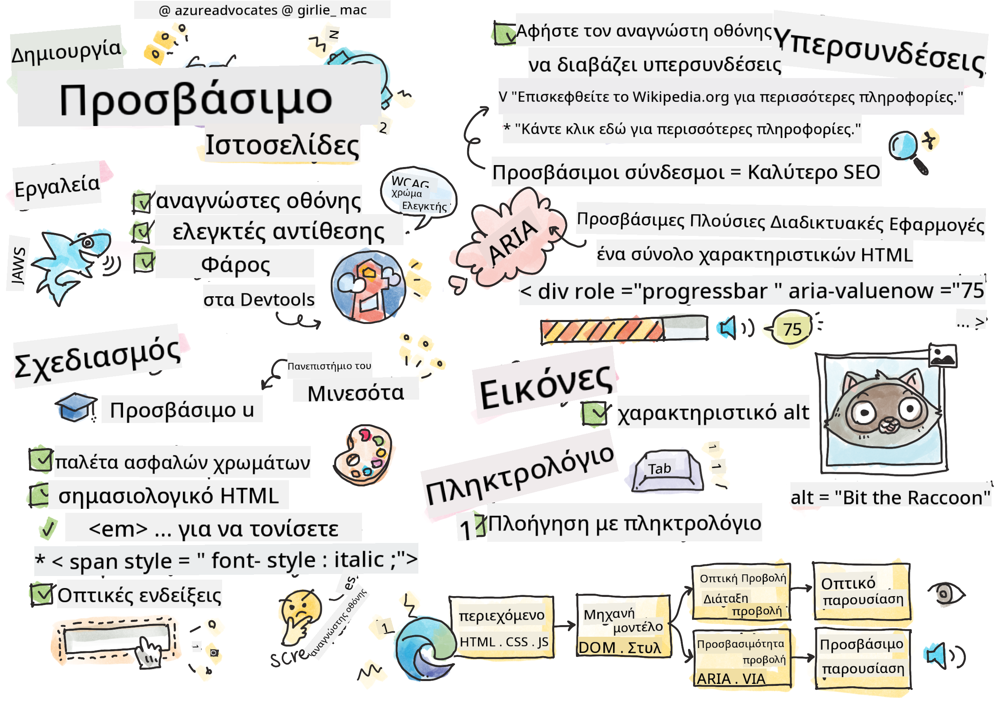

<!--
CO_OP_TRANSLATOR_METADATA:
{
  "original_hash": "f0c88c3e2cefa8952d356f802b1e47ca",
  "translation_date": "2025-08-29T07:22:42+00:00",
  "source_file": "1-getting-started-lessons/3-accessibility/README.md",
  "language_code": "el"
}
-->
# Δημιουργία Προσβάσιμων Ιστοσελίδων

> Σκίτσο από [Tomomi Imura](https://twitter.com/girlie_mac)

## Ερωτηματολόγιο πριν το μάθημα
[Ερωτηματολόγιο πριν το μάθημα](https://ff-quizzes.netlify.app/web/)

> Η δύναμη του Ιστού βρίσκεται στην καθολικότητά του. Η πρόσβαση από όλους, ανεξαρτήτως αναπηρίας, είναι μια ουσιώδης πτυχή.
>
> \- Sir Timothy Berners-Lee, Διευθυντής του W3C και εφευρέτης του Παγκόσμιου Ιστού

Αυτό το απόφθεγμα υπογραμμίζει τέλεια τη σημασία της δημιουργίας προσβάσιμων ιστοσελίδων. Μια εφαρμογή που δεν είναι προσβάσιμη από όλους είναι εξ ορισμού αποκλειστική. Ως προγραμματιστές ιστού, πρέπει πάντα να έχουμε την προσβασιμότητα στο μυαλό μας. Εστιάζοντας σε αυτό από την αρχή, θα είστε σε καλό δρόμο για να διασφαλίσετε ότι όλοι μπορούν να έχουν πρόσβαση στις σελίδες που δημιουργείτε. Σε αυτό το μάθημα, θα μάθετε για τα εργαλεία που μπορούν να σας βοηθήσουν να διασφαλίσετε ότι τα διαδικτυακά σας στοιχεία είναι προσβάσιμα και πώς να δημιουργείτε με γνώμονα την προσβασιμότητα.

> Μπορείτε να παρακολουθήσετε αυτό το μάθημα στο [Microsoft Learn](https://docs.microsoft.com/learn/modules/web-development-101/accessibility/?WT.mc_id=academic-77807-sagibbon)!

## Εργαλεία που μπορείτε να χρησιμοποιήσετε

### Αναγνώστες οθόνης

Ένα από τα πιο γνωστά εργαλεία προσβασιμότητας είναι οι αναγνώστες οθόνης.

[Οι αναγνώστες οθόνης](https://en.wikipedia.org/wiki/Screen_reader) είναι συνήθως χρησιμοποιούμενοι πελάτες από άτομα με προβλήματα όρασης. Όπως αφιερώνουμε χρόνο για να διασφαλίσουμε ότι ένας περιηγητής μεταφέρει σωστά τις πληροφορίες που θέλουμε να μοιραστούμε, πρέπει επίσης να διασφαλίσουμε ότι ένας αναγνώστης οθόνης κάνει το ίδιο.

Στην πιο βασική του μορφή, ένας αναγνώστης οθόνης θα διαβάσει μια σελίδα από πάνω προς τα κάτω ακουστικά. Αν η σελίδα σας είναι μόνο κείμενο, ο αναγνώστης θα μεταφέρει τις πληροφορίες με παρόμοιο τρόπο όπως ένας περιηγητής. Φυσικά, οι ιστοσελίδες σπάνια είναι καθαρά κείμενο· περιέχουν συνδέσμους, γραφικά, χρώματα και άλλα οπτικά στοιχεία. Πρέπει να ληφθεί μέριμνα ώστε αυτές οι πληροφορίες να διαβάζονται σωστά από έναν αναγνώστη οθόνης.

Κάθε προγραμματιστής ιστού πρέπει να εξοικειωθεί με έναν αναγνώστη οθόνης. Όπως τονίστηκε παραπάνω, είναι ο πελάτης που θα χρησιμοποιήσουν οι χρήστες σας. Με τον ίδιο τρόπο που είστε εξοικειωμένοι με τη λειτουργία ενός περιηγητή, πρέπει να μάθετε πώς λειτουργεί ένας αναγνώστης οθόνης. Ευτυχώς, οι αναγνώστες οθόνης είναι ενσωματωμένοι στα περισσότερα λειτουργικά συστήματα.

Ορισμένοι περιηγητές διαθέτουν επίσης ενσωματωμένα εργαλεία και επεκτάσεις που μπορούν να διαβάσουν κείμενο δυνατά ή ακόμα και να παρέχουν κάποιες βασικές λειτουργίες πλοήγησης, όπως [αυτά τα εργαλεία προσβασιμότητας του περιηγητή Edge](https://support.microsoft.com/help/4000734/microsoft-edge-accessibility-features). Αυτά είναι επίσης σημαντικά εργαλεία προσβασιμότητας, αλλά λειτουργούν πολύ διαφορετικά από τους αναγνώστες οθόνης και δεν πρέπει να συγχέονται με εργαλεία δοκιμής αναγνωστών οθόνης.

✅ Δοκιμάστε έναν αναγνώστη οθόνης και έναν περιηγητή που διαβάζει κείμενο. Στα Windows, το [Narrator](https://support.microsoft.com/windows/complete-guide-to-narrator-e4397a0d-ef4f-b386-d8ae-c172f109bdb1/?WT.mc_id=academic-77807-sagibbon) περιλαμβάνεται από προεπιλογή, ενώ το [JAWS](https://webaim.org/articles/jaws/) και το [NVDA](https://www.nvaccess.org/about-nvda/) μπορούν επίσης να εγκατασταθούν. Στο macOS και το iOS, το [VoiceOver](https://support.apple.com/guide/voiceover/welcome/10) είναι εγκατεστημένο από προεπιλογή.

### Μεγέθυνση

Ένα άλλο εργαλείο που χρησιμοποιείται συχνά από άτομα με προβλήματα όρασης είναι η μεγέθυνση. Ο πιο βασικός τύπος μεγέθυνσης είναι η στατική μεγέθυνση, που ελέγχεται μέσω του `Control + σύμβολο συν (+)` ή με τη μείωση της ανάλυσης της οθόνης. Αυτός ο τύπος μεγέθυνσης προκαλεί την αλλαγή μεγέθους ολόκληρης της σελίδας, επομένως η χρήση [ανταποκρινόμενου σχεδιασμού](https://developer.mozilla.org/docs/Learn/CSS/CSS_layout/Responsive_Design) είναι σημαντική για την παροχή καλής εμπειρίας χρήστη σε αυξημένα επίπεδα μεγέθυνσης.

Ένας άλλος τύπος μεγέθυνσης βασίζεται σε εξειδικευμένο λογισμικό για μεγέθυνση μιας περιοχής της οθόνης και μετακίνηση, όπως με τη χρήση ενός πραγματικού μεγεθυντικού φακού. Στα Windows, το [Magnifier](https://support.microsoft.com/windows/use-magnifier-to-make-things-on-the-screen-easier-to-see-414948ba-8b1c-d3bd-8615-0e5e32204198) είναι ενσωματωμένο, ενώ το [ZoomText](https://www.freedomscientific.com/training/zoomtext/getting-started/) είναι ένα λογισμικό μεγέθυνσης τρίτου μέρους με περισσότερες δυνατότητες και μεγαλύτερη βάση χρηστών. Τόσο το macOS όσο και το iOS διαθέτουν ενσωματωμένο λογισμικό μεγέθυνσης που ονομάζεται [Zoom](https://www.apple.com/accessibility/mac/vision/).

### Ελεγκτές αντίθεσης

Τα χρώματα στις ιστοσελίδες πρέπει να επιλέγονται προσεκτικά για να καλύπτουν τις ανάγκες των χρηστών με αχρωματοψία ή ατόμων που δυσκολεύονται να δουν χρώματα χαμηλής αντίθεσης.

✅ Δοκιμάστε μια ιστοσελίδα που σας αρέσει για τη χρήση χρωμάτων με μια επέκταση περιηγητή όπως [ο ελεγκτής χρωματικής αντίθεσης του WCAG](https://microsoftedge.microsoft.com/addons/detail/wcag-color-contrast-check/idahaggnlnekelhgplklhfpchbfdmkjp?hl=en-US&WT.mc_id=academic-77807-sagibbon). Τι μαθαίνετε;

### Lighthouse

Στην περιοχή εργαλείων προγραμματιστή του περιηγητή σας, θα βρείτε το εργαλείο Lighthouse. Αυτό το εργαλείο είναι σημαντικό για να αποκτήσετε μια πρώτη εικόνα της προσβασιμότητας (καθώς και άλλων αναλύσεων) μιας ιστοσελίδας. Ενώ είναι σημαντικό να μην βασίζεστε αποκλειστικά στο Lighthouse, ένα σκορ 100% είναι πολύ χρήσιμο ως βάση.

✅ Βρείτε το Lighthouse στον πίνακα εργαλείων προγραμματιστή του περιηγητή σας και εκτελέστε μια ανάλυση σε οποιαδήποτε ιστοσελίδα. Τι ανακαλύπτετε;

## Σχεδιασμός με γνώμονα την προσβασιμότητα

Η προσβασιμότητα είναι ένα σχετικά μεγάλο θέμα. Για να σας βοηθήσουμε, υπάρχουν διαθέσιμοι πολλοί πόροι.

- [Accessible U - Πανεπιστήμιο της Μινεσότα](https://accessibility.umn.edu/your-role/web-developers)

Παρόλο που δεν θα μπορέσουμε να καλύψουμε κάθε πτυχή της δημιουργίας προσβάσιμων ιστοσελίδων, παρακάτω παρατίθενται ορισμένες βασικές αρχές που θα θέλετε να εφαρμόσετε. Ο σχεδιασμός μιας προσβάσιμης σελίδας από την αρχή είναι **πάντα** ευκολότερος από το να επιστρέψετε σε μια υπάρχουσα σελίδα για να την κάνετε προσβάσιμη.

## Καλές αρχές εμφάνισης

### Ασφαλείς παλέτες χρωμάτων

Οι άνθρωποι βλέπουν τον κόσμο με διαφορετικούς τρόπους, και αυτό περιλαμβάνει τα χρώματα. Όταν επιλέγετε ένα χρωματικό σχήμα για την ιστοσελίδα σας, πρέπει να διασφαλίσετε ότι είναι προσβάσιμο σε όλους. Ένα εξαιρετικό [εργαλείο για τη δημιουργία παλετών χρωμάτων είναι το Color Safe](http://colorsafe.co/).

✅ Εντοπίστε μια ιστοσελίδα που είναι πολύ προβληματική στη χρήση χρωμάτων. Γιατί;

### Χρησιμοποιήστε το σωστό HTML

Με CSS και JavaScript είναι δυνατό να κάνετε οποιοδήποτε στοιχείο να μοιάζει με οποιονδήποτε τύπο ελέγχου. Το `` θα μπορούσε να χρησιμοποιηθεί για να δημιουργήσει ένα `<button>`, και το `<b>` θα μπορούσε να γίνει υπερσύνδεσμος. Παρόλο που αυτό μπορεί να θεωρηθεί ευκολότερο για στυλιζάρισμα, δεν μεταφέρει τίποτα σε έναν αναγνώστη οθόνης. Χρησιμοποιήστε το κατάλληλο HTML όταν δημιουργείτε ελέγχους σε μια σελίδα. Αν θέλετε έναν υπερσύνδεσμο, χρησιμοποιήστε `<a>`. Η χρήση του σωστού HTML για τον σωστό έλεγχο ονομάζεται χρήση Σημασιολογικού HTML.

✅ Μεταβείτε σε οποιαδήποτε ιστοσελίδα και δείτε αν οι σχεδιαστές και οι προγραμματιστές χρησιμοποιούν σωστά το HTML. Μπορείτε να βρείτε ένα κουμπί που θα έπρεπε να είναι σύνδεσμος; Υπόδειξη: κάντε δεξί κλικ και επιλέξτε 'Προβολή Πηγαίου Κώδικα Σελίδας' στον περιηγητή σας για να δείτε τον υποκείμενο κώδικα.

### Δημιουργήστε μια περιγραφική ιεραρχία επικεφαλίδων

Οι χρήστες αναγνωστών οθόνης [βασίζονται πολύ στις επικεφαλίδες](https://webaim.org/projects/screenreadersurvey8/#finding) για να βρουν πληροφορίες και να πλοηγηθούν σε μια σελίδα. Η συγγραφή περιγραφικού περιεχομένου επικεφαλίδων και η χρήση σημασιολογικών ετικετών επικεφαλίδων είναι σημαντική για τη δημιουργία μιας εύκολα πλοηγήσιμης σελίδας για χρήστες αναγνωστών οθόνης.

### Χρησιμοποιήστε καλά οπτικά στοιχεία

Το CSS προσφέρει πλήρη έλεγχο στην εμφάνιση οποιουδήποτε στοιχείου σε μια σελίδα. Μπορείτε να δημιουργήσετε πλαίσια κειμένου χωρίς περίγραμμα ή υπερσυνδέσμους χωρίς υπογράμμιση. Δυστυχώς, η αφαίρεση αυτών των στοιχείων μπορεί να δυσκολέψει κάποιον που εξαρτάται από αυτά να αναγνωρίσει τον τύπο του ελέγχου.

## Η σημασία του κειμένου συνδέσμων

Οι υπερσύνδεσμοι είναι βασικοί για την πλοήγηση στον ιστό. Ως αποτέλεσμα, η διασφάλιση ότι ένας αναγνώστης οθόνης μπορεί να διαβάσει σωστά τους συνδέσμους επιτρέπει σε όλους τους χρήστες να πλοηγηθούν στην ιστοσελίδα σας.

### Αναγνώστες οθόνης και σύνδεσμοι

Όπως θα περιμένατε, οι αναγνώστες οθόνης διαβάζουν το κείμενο των συνδέσμων με τον ίδιο τρόπο που θα διάβαζαν οποιοδήποτε άλλο κείμενο στη σελίδα. Με αυτό στο μυαλό, το κείμενο που φαίνεται παρακάτω μπορεί να φαίνεται απολύτως αποδεκτό.

> Ο μικρός πιγκουίνος, γνωστός και ως νεραϊδοπιγκουίνος, είναι ο μικρότερος πιγκουίνος στον κόσμο. [Κάντε κλικ εδώ](https://en.wikipedia.org/wiki/Little_penguin) για περισσότερες πληροφορίες.

> Ο μικρός πιγκουίνος, γνωστός και ως νεραϊδοπιγκουίνος, είναι ο μικρότερος πιγκουίνος στον κόσμο. Επισκεφθείτε https://en.wikipedia.org/wiki/Little_penguin για περισσότερες πληροφορίες.

> **NOTE** Όπως πρόκειται να διαβάσετε, δεν πρέπει **ποτέ** να δημιουργείτε συνδέσμους που μοιάζουν με τους παραπάνω.

Θυμηθείτε, οι αναγνώστες οθόνης είναι μια διαφορετική διεπαφή από τους περιηγητές με διαφορετικό σύνολο λειτουργιών.

### Το πρόβλημα με τη χρήση της διεύθυνσης URL

Οι αναγνώστες οθόνης διαβάζουν το κείμενο. Αν μια διεύθυνση URL εμφανίζεται στο κείμενο, ο αναγνώστης οθόνης θα διαβάσει τη διεύθυνση URL. Γενικά, η διεύθυνση URL δεν μεταφέρει ουσιαστικές πληροφορίες και μπορεί να ακούγεται ενοχλητική. Ίσως το έχετε βιώσει αν το τηλέφωνό σας έχει διαβάσει δυνατά ένα μήνυμα κειμένου με μια διεύθυνση URL.

### Το πρόβλημα με το "κάντε κλικ εδώ"

Οι αναγνώστες οθόνης έχουν επίσης τη δυνατότητα να διαβάζουν μόνο τους υπερσυνδέσμους σε μια σελίδα, όπως ακριβώς ένας βλέποντας χρήστης θα σάρωσε μια σελίδα για συνδέσμους. Αν το κείμενο των συνδέσμων είναι πάντα "κάντε κλικ εδώ", το μόνο που θα ακούσει ο χρήστης είναι "κάντε κλικ εδώ, κάντε κλικ εδώ, κάντε κλικ εδώ, κάντε κλικ εδώ, κάντε κλικ εδώ, ..." Όλοι οι σύνδεσμοι είναι πλέον αδιάκριτοι μεταξύ τους.

### Καλό κείμενο συνδέσμων

Το καλό κείμενο συνδέσμων περιγράφει σύντομα τι υπάρχει στην άλλη πλευρά του συνδέσμου. Στο παραπάνω παράδειγμα που μιλάει για μικρούς πιγκουίνους, ο σύνδεσμος οδηγεί στη σελίδα της Wikipedia για το είδος. Η φράση *μικροί πιγκουίνοι* θα ήταν ιδανικό κείμενο συνδέσμου καθώς καθιστά σαφές τι θα μάθει κάποιος αν κάνει κλικ στον σύνδεσμο - μικρούς πιγκουίνους.

> Ο [μικρός πιγκουίνος](https://en.wikipedia.org/wiki/Little_penguin), γνωστός και ως νεραϊδοπιγκουίνος, είναι ο μικρότερος πιγκουίνος στον κόσμο.

✅ Περιηγηθείτε στον ιστό για λίγα λεπτά για να βρείτε σελίδες που χρησιμοποιούν ασαφείς στρατηγικές σύνδεσης. Συγκρίνετέ τις με άλλες, καλύτερα συνδεδεμένες σελίδες. Τι μαθαίνετε;

#### Σημειώσεις για τις μηχανές αναζήτησης

Ως πρόσθετο πλεονέκτημα για τη διασφάλιση ότι η ιστοσελίδα σας είναι προσβάσιμη σε όλους, θα βοηθήσετε τις μηχανές αναζήτησης να πλοηγηθούν στην ιστοσελίδα σας επίσης. Οι μηχανές αναζήτησης χρησιμοποιούν το κείμενο των συνδέσμων για να μάθουν τα θέματα των σελίδων. Έτσι, η χρήση καλού κειμένου συνδέσμων βοηθάει όλους!

### ARIA

Φανταστείτε την παρακάτω σελίδα:

| Προϊόν       | Περιγραφή          | Παραγγελία   |
| ------------ | ------------------ | ------------ |
| Widget       | [Περιγραφή](../../../../1-getting-started-lessons/3-accessibility/')   | [Παραγγελία](../../../../1-getting-started-lessons/3-accessibility/') |
| Super widget | [Περιγραφή](../../../../1-getting-started-lessons/3-accessibility/')   | [Παραγγελία](../../../../1-getting-started-lessons/3-accessibility/') |

Σε αυτό το παράδειγμα, η επανάληψη του κειμένου "περιγραφή" και "παραγγελία" έχει νόημα για κάποιον που χρησιμοποιεί περιηγητή. Ωστόσο, κάποιος που χρησιμοποιεί αναγνώστη οθόνης θα ακούσει μόνο τις λέξεις *περιγραφή* και *παραγγελία* επαναλαμβανόμενες χωρίς πλαίσιο.

Για να υποστηρίξετε αυτούς τους τύπους σεναρίων, το HTML υποστηρίζει ένα σύνολο χαρακτηριστικών γνωστό ως [Accessible Rich Internet Applications (ARIA)](https://developer.mozilla.org/docs/Web/Accessibility/ARIA
Πολλές κυβερνήσεις έχουν νόμους σχετικά με τις απαιτήσεις προσβασιμότητας. Ενημερωθείτε για τους νόμους προσβασιμότητας της χώρας σας. Τι καλύπτεται και τι όχι; Ένα παράδειγμα είναι [αυτός ο κυβερνητικός ιστότοπος](https://accessibility.blog.gov.uk/).

## Ανάθεση

[Αναλύστε έναν μη προσβάσιμο ιστότοπο](assignment.md)

Πιστώσεις: [Turtle Ipsum](https://github.com/Instrument/semantic-html-sample) από Instrument

---

**Αποποίηση Ευθύνης**:  
Αυτό το έγγραφο έχει μεταφραστεί χρησιμοποιώντας την υπηρεσία αυτόματης μετάφρασης [Co-op Translator](https://github.com/Azure/co-op-translator). Παρόλο που καταβάλλουμε προσπάθειες για ακρίβεια, παρακαλούμε να έχετε υπόψη ότι οι αυτόματες μεταφράσεις ενδέχεται να περιέχουν σφάλματα ή ανακρίβειες. Το πρωτότυπο έγγραφο στη μητρική του γλώσσα θα πρέπει να θεωρείται η αυθεντική πηγή. Για κρίσιμες πληροφορίες, συνιστάται επαγγελματική ανθρώπινη μετάφραση. Δεν φέρουμε ευθύνη για τυχόν παρεξηγήσεις ή εσφαλμένες ερμηνείες που προκύπτουν από τη χρήση αυτής της μετάφρασης.