<!--
CO_OP_TRANSLATOR_METADATA:
{
  "original_hash": "7f2c48e04754724123ea100a822765e5",
  "translation_date": "2026-01-06T21:12:22+00:00",
  "source_file": "1-getting-started-lessons/3-accessibility/README.md",
  "language_code": "el"
}
-->
# Δημιουργία Προσβάσιμων Ιστοσελίδων


> Σχεδιάγραμμα από [Tomomi Imura](https://twitter.com/girlie_mac)

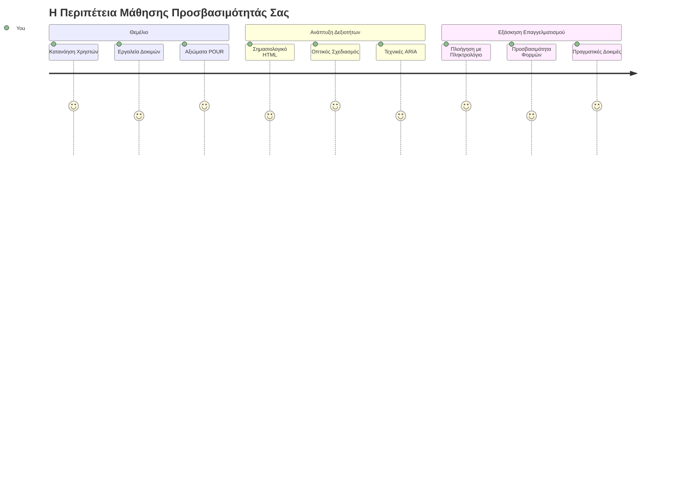
## Προ-διάλεξη Κουίζ
[Προ-διάλεξη κουίζ](https://ff-quizzes.netlify.app/web/)

> Η δύναμη του Διαδικτύου έγκειται στην καθολικότητά του. Η πρόσβαση από όλους ανεξαρτήτως αναπηρίας αποτελεί ουσιώδες ζήτημα.
>
> \- Sir Timothy Berners-Lee, Διευθυντής W3C και εφευρέτης του Παγκόσμιου Ιστού

Ιδού κάτι που μπορεί να σας εκπλήξει: όταν δημιουργείτε προσβάσιμες ιστοσελίδες, δεν βοηθάτε μόνο άτομα με αναπηρίες—στην πραγματικότητα κάνετε τον ιστό καλύτερο για όλους!

Έχετε ποτέ προσέξει εκείνες τις ράμπες σε γωνίες δρόμων; Αρχικά σχεδιάστηκαν για αναπηρικά αμαξίδια, αλλά τώρα βοηθούν ανθρώπους με καρότσια μωρού, διανομείς με καροτσάκια, ταξιδιώτες με ρόδες αποσκευών και ποδηλάτες. Έτσι ακριβώς λειτουργεί ο σχεδιασμός προσβάσιμου ιστού—οι λύσεις που βοηθούν μια ομάδα συχνά ωφελούν όλους. Πολύ ωραίο, έτσι δεν είναι;

Σε αυτό το μάθημα, θα εξερευνήσουμε πώς να δημιουργούμε ιστοσελίδες που πραγματικά δουλεύουν για όλους, ανεξάρτητα από τον τρόπο που περιηγούνται στο διαδίκτυο. Θα ανακαλύψετε πρακτικές τεχνικές που είναι ήδη ενσωματωμένες στα πρότυπα του ιστού, θα δουλέψετε με εργαλεία δοκιμών, και θα δείτε πώς η προσβασιμότητα κάνει τις ιστοσελίδες σας πιο εύχρηστες για όλους τους χρήστες.

Στο τέλος αυτού του μαθήματος, θα έχετε την αυτοπεποίθηση να κάνετε την προσβασιμότητα φυσικό κομμάτι της ροής εργασίας σας. Έτοιμοι να εξερευνήσετε πώς οι προσεκτικές επιλογές σχεδιασμού μπορούν να ανοίξουν τον ιστό σε δισεκατομμύρια χρήστες; Ας ξεκινήσουμε!

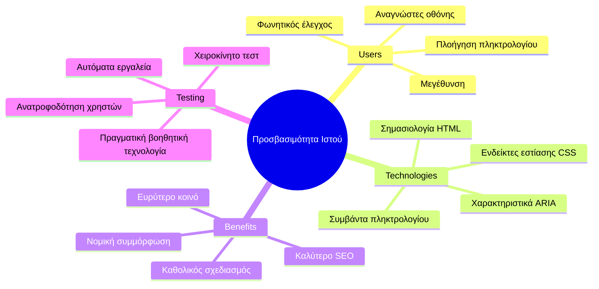
> Μπορείτε να παρακολουθήσετε αυτό το μάθημα στο [Microsoft Learn](https://docs.microsoft.com/learn/modules/web-development-101/accessibility/?WT.mc_id=academic-77807-sagibbon)!

## Κατανόηση Τεχνολογιών Βοήθειας

Πριν περάσουμε στον κώδικα, ας αφιερώσουμε λίγο χρόνο για να καταλάβουμε πώς τα άτομα με διαφορετικές ικανότητες βιώνουν τον ιστό. Δεν είναι μόνο θεωρία—η κατανόηση αυτών των πραγματικών προτύπων πλοήγησης θα σας κάνει καλύτερο προγραμματιστή!

Οι τεχνολογίες βοήθειας είναι εντυπωσιακά εργαλεία που βοηθούν άτομα με αναπηρίες να αλληλεπιδράσουν με ιστοσελίδες με τρόπους που μπορεί να σας εκπλήξουν. Μόλις μάθετε πώς λειτουργούν αυτές οι τεχνολογίες, η δημιουργία προσβάσιμων εμπειριών γίνεται πολύ πιο διαισθητική. Είναι σαν να μαθαίνετε να βλέπετε τον κώδικά σας μέσα από τα μάτια κάποιου άλλου.

### Ανάγνωστες οθόνης

[Οι ανάγνωστες οθόνης](https://en.wikipedia.org/wiki/Screen_reader) είναι αρκετά προηγμένα τεχνολογικά εργαλεία που μετατρέπουν ψηφιακό κείμενο σε ομιλία ή έξοδο Braille. Αν και χρησιμοποιούνται κυρίως από άτομα με οπτικές αναπηρίες, είναι επίσης πολύ χρήσιμοι για χρήστες με μαθησιακές δυσκολίες όπως η δυσλεξία.

Μου αρέσει να φαντάζομαι έναν ανάγνωστη οθόνης ως έναν πολύ έξυπνο αφηγητή που σας διαβάζει ένα βιβλίο. Διαβάζει το περιεχόμενο δυνατά με λογική σειρά, ανακοινώνει αλληλεπιδραστικά στοιχεία όπως "κουμπί" ή "σύνδεσμος," και παρέχει συντομεύσεις πληκτρολογίου για γρήγορη μετακίνηση στη σελίδα. Αλλά το θέμα είναι—οι ανάγνωστες οθόνης μπορούν να λειτουργήσουν μόνο αν κατασκευάσουμε ιστοσελίδες με σωστή δομή και ουσιαστικό περιεχόμενο. Κι εκεί μπαίνετε εσείς ως προγραμματιστής!

**Δημοφιλείς ανάγνωστες οθόνης σε πλατφόρμες:**
- **Windows**: [NVDA](https://www.nvaccess.org/about-nvda/) (δωρεάν και πιο δημοφιλής), [JAWS](https://webaim.org/articles/jaws/), [Narrator](https://support.microsoft.com/windows/complete-guide-to-narrator-e4397a0d-ef4f-b386-d8ae-c172f109bdb1/?WT.mc_id=academic-77807-sagibbon) (ενσωματωμένος)
- **macOS/iOS**: [VoiceOver](https://support.apple.com/guide/voiceover/welcome/10) (ενσωματωμένος και πολύ ικανός)
- **Android**: [TalkBack](https://support.google.com/accessibility/android/answer/6283677) (ενσωματωμένος)
- **Linux**: [Orca](https://wiki.gnome.org/Projects/Orca) (δωρεάν και ανοιχτού κώδικα)

**Πώς οι ανάγνωστες οθόνης πλοηγούνται στο web:**

Οι ανάγνωστες οθόνης παρέχουν πολλαπλές μεθόδους πλοήγησης που κάνουν την περιήγηση αποτελεσματική για έμπειρους χρήστες:
- **Σειριακή ανάγνωση**: Διαβάζει το περιεχόμενο από πάνω προς τα κάτω, όπως ένα βιβλίο
- **Πλοήγηση με Landmarks**: Μεταπήδηση ανάμεσα σε τμήματα σελίδας (επικεφαλίδα, πλοήγηση, κύριο περιεχόμενο, υποσέλιδο)
- **Πλοήγηση ανά τίτλους**: Παράλειψη μεταξύ επικεφαλίδων για κατανόηση της δομής της σελίδας
- **Λίστες συνδέσμων**: Δημιουργία λίστας με όλους τους συνδέσμους για γρήγορη πρόσβαση
- **Έλεγχοι φορμών**: Πλοήγηση απευθείας μεταξύ πεδίων εισόδου και κουμπιών

> 💡 **Κάτι που με εντυπωσίασε**: Το 68% των χρηστών ανάγνωσης οθόνης πλοηγούνται κυρίως μέσω των επικεφαλίδων ([WebAIM Survey](https://webaim.org/projects/screenreadersurvey9/#finding)). Αυτό σημαίνει ότι η δομή των επικεφαλίδων σας είναι σαν χάρτης για τους χρήστες—όταν την κάνετε σωστά, βοηθάτε κυριολεκτικά τους ανθρώπους να βρουν πιο γρήγορα το δρόμο στο περιεχόμενό σας!

### Δημιουργία ροής εργασίας δοκιμών

Έχω καλά νέα—η αποτελεσματική δοκιμή προσβασιμότητας δεν χρειάζεται να είναι συντριπτική! Θα θέλετε να συνδυάσετε αυτοματοποιημένα εργαλεία (είναι φανταστικά στο να εντοπίζουν προφανή προβλήματα) με λίγες πρακτικές δοκιμές. Να μια συστηματική προσέγγιση που έχω βρει ότι πιάνει τα περισσότερα ζητήματα χωρίς να σας τρώει όλη την ημέρα:

**Βασική ροή εργασίας χειροκίνητης δοκιμής:**

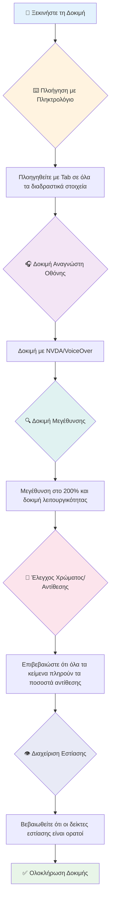
**Λίστα ελέγχου βήμα προς βήμα:**
1. **Πλοήγηση με πληκτρολόγιο**: Χρησιμοποιήστε μόνο Tab, Shift+Tab, Enter, Space και τα βελάκια
2. **Δοκιμή με ανάγνωση οθόνης**: Ενεργοποιήστε NVDA, VoiceOver ή Narrator και πλοηγηθείτε με κλειστά μάτια
3. **Δοκιμή μεγέθυνσης**: Δοκιμάστε στα επίπεδα μεγέθυνσης 200% και 400%
4. **Έλεγχος αντίθεσης χρωμάτων**: Ελέγξτε όλο το κείμενο και τα στοιχεία UI
5. **Δοκιμή εμφάνισης εστίασης**: Βεβαιωθείτε ότι όλα τα διαδραστικά στοιχεία έχουν ορατές καταστάσεις εστίασης

✅ **Ξεκινήστε με το Lighthouse**: Ανοίξτε τα DevTools του προγράμματος περιήγησής σας, εκτελέστε έλεγχο προσβασιμότητας με το Lighthouse και μετά χρησιμοποιήστε τα αποτελέσματα για να καθοδηγήσετε τις χειροκίνητες δοκιμές σας.

### Εργαλεία μεγέθυνσης και ζουμ

Ξέρετε πώς μερικές φορές τσιμπάτε με τα δάχτυλα στο κινητό σας για να μεγεθύνετε όταν το κείμενο είναι πολύ μικρό, ή σφίγγεστε για να διαβάσετε την οθόνη του λάπτοπ σε έντονο φως; Πολλοί χρήστες βασίζονται σε εργαλεία μεγέθυνσης για να κάνουν το περιεχόμενο αναγνώσιμο καθημερινά. Αυτό συμπεριλαμβάνει ανθρώπους με μειωμένη όραση, ηλικιωμένους και οποιονδήποτε έχει προσπαθήσει να διαβάσει μια ιστοσελίδα σε εξωτερικούς χώρους.

Οι σύγχρονες τεχνολογίες ζουμ έχουν εξελιχθεί πέρα από το απλό μεγάλωμα. Η κατανόηση του πώς λειτουργούν αυτά τα εργαλεία θα σας βοηθήσει να δημιουργήσετε ευέλικτα σχέδια που παραμένουν λειτουργικά και όμορφα σε οποιοδήποτε επίπεδο μεγέθυνσης.

**Δυνατότητες μεγέθυνσης σύγχρονων προγραμμάτων περιήγησης:**
- **Μεγέθυνση σελίδας**: Κλιμακώνει όλα τα περιεχόμενα αναλογικά (κείμενο, εικόνες, διάταξη) - αυτή είναι η προτιμώμενη μέθοδος
- **Ζουμ μόνο κειμένου**: Αυξάνει το μέγεθος γραμματοσειράς διατηρώντας την αρχική διάταξη
- **Pinch-to-zoom**: Υποστήριξη χειρονομιών σε κινητές συσκευές για προσωρινή μεγέθυνση
- **Υποστήριξη προγραμμάτων περιήγησης**: Όλα τα σύγχρονα προγράμματα περιήγησης υποστηρίζουν ζουμ μέχρι 500% χωρίς να διακόπτουν τη λειτουργία

**Εξειδικευμένο λογισμικό μεγέθυνσης:**
- **Windows**: [Μεγεθυντικός φακός](https://support.microsoft.com/windows/use-magnifier-to-make-things-on-the-screen-easier-to-see-414948ba-8b1c-d3bd-8615-0e5e32204198) (ενσωματωμένος), [ZoomText](https://www.freedomscientific.com/training/zoomtext/getting-started/)
- **macOS/iOS**: [Zoom](https://www.apple.com/accessibility/mac/vision/) (ενσωματωμένος με προηγμένες λειτουργίες)

> ⚠️ **Σκέψη στο Σχεδιασμό**: Τα WCAG απαιτούν το περιεχόμενο να παραμένει λειτουργικό όταν το ζουμ φτάνει το 200%. Σε αυτό το επίπεδο, η οριζόντια κύλιση πρέπει να είναι ελάχιστη και όλα τα διαδραστικά στοιχεία να παραμένουν προσβάσιμα.

✅ **Δοκιμάστε το ευέλικτο σχέδιό σας**: Μεγεθύνετε τον περιηγητή σας στο 200% και 400%. Αντιδρά η διάταξη με ευελιξία; Μπορείτε ακόμα να αποκτήσετε πρόσβαση σε όλη τη λειτουργικότητα χωρίς υπερβολική κύλιση;

## Σύγχρονα Εργαλεία Δοκιμής Προσβασιμότητας

Τώρα που καταλαβαίνετε πώς οι χρήστες με τεχνολογίες βοήθειας πλοηγούνται στον ιστό, ας εξερευνήσουμε τα εργαλεία που σας βοηθούν να δημιουργήσετε και να δοκιμάσετε προσβάσιμες ιστοσελίδες.

Σκεφτείτε το ως εξής: τα αυτοματοποιημένα εργαλεία πιάνουν καλά τα προφανή προβλήματα (όπως η έλλειψη alt κειμένου), ενώ οι χειροκίνητες δοκιμές βοηθούν να βεβαιωθείτε ότι ο ιστότοπός σας είναι ευχάριστος στη χρήση στην πραγματική ζωή. Μαζί, σας δίνουν την αυτοπεποίθηση ότι οι ιστότοποι λειτουργούν για όλους.

### Έλεγχος αντίθεσης χρωμάτων

Έχω καλά νέα: η αντίθεση χρωμάτων είναι ένα από τα πιο συνηθισμένα ζητήματα προσβασιμότητας, αλλά και από τα πιο εύκολα να διορθωθούν. Η καλή αντίθεση ωφελεί όλους—από χρήστες με οπτικές αναπηρίες μέχρι ανθρώπους που προσπαθούν να διαβάσουν το κινητό τους στην παραλία.

**Απαιτήσεις αντίθεσης WCAG:**

| Τύπος Κειμένου | WCAG AA (Ελάχιστο) | WCAG AAA (Βελτιωμένο) |
|-----------|-------------------|---------------------|
| **Κανονικό κείμενο** (κάτω των 18pt) | Αναλογία αντίθεσης 4.5:1 | Αναλογία αντίθεσης 7:1 |
| **Μεγάλο κείμενο** (18pt+ ή 14pt+ έντονη γραφή) | Αναλογία αντίθεσης 3:1 | Αναλογία αντίθεσης 4.5:1 |
| **Στοιχεία UI** (κουμπιά, περιγράμματα φορμών) | Αναλογία αντίθεσης 3:1 | Αναλογία αντίθεσης 3:1 |

**Βασικά εργαλεία δοκιμής:**
- [Colour Contrast Analyser](https://www.tpgi.com/color-contrast-checker/) - Εφαρμογή desktop με επιλογέα χρωμάτων
- [WebAIM Contrast Checker](https://webaim.org/resources/contrastchecker/) - Ιστότοπος με άμεση ανατροφοδότηση
- [Stark](https://www.getstark.co/) - Plugin σχεδίασης για Figma, Sketch, Adobe XD
- [Accessible Colors](https://accessible-colors.com/) - Βρείτε προσβάσιμες παλέτες χρωμάτων

✅ **Δημιουργήστε καλύτερες παλέτες χρωμάτων**: Ξεκινήστε με τα χρώματα της επωνυμίας σας και χρησιμοποιήστε ελεγκτές αντίθεσης για να φτιάξετε προσβάσιμες παραλλαγές. Τεκμηριώστε αυτές ως τα προσβάσιμα χρώματα του συστήματος σχεδιασμού σας.

### Ολοκληρωμένος έλεγχος προσβασιμότητας

Η πιο αποτελεσματική δοκιμή προσβασιμότητας συνδυάζει πολλούς τρόπους. Κανένα εργαλείο δεν πιάνει τα πάντα, οπότε η δημιουργία ρουτίνας δοκιμών με διάφορες μεθόδους εξασφαλίζει πλήρη κάλυψη.

**Δοκιμές μέσω προγράμματος περιήγησης (ενσωματωμένες στα DevTools):**
- **Chrome/Edge**: Έλεγχος προσβασιμότητας Lighthouse + Πίνακας Προσβασιμότητας
- **Firefox**: Επιθεωρητής προσβασιμότητας με λεπτομερή προβολή δέντρου
- **Safari**: Καρτέλα ελέγχου μέσα στο Web Inspector με προσομοίωση VoiceOver

**Επαγγελματικές επεκτάσεις δοκιμών:**
- [axe DevTools](https://www.deque.com/axe/devtools/) - Πρότυπο αυτοματοποιημένης δοκιμής
- [WAVE](https://wave.webaim.org/extension/) - Οπτική ανατροφοδότηση με επισημάνσεις λαθών
- [Accessibility Insights](https://accessibilityinsights.io/) - Ολοκληρωμένη σουίτα δοκιμών της Microsoft

**Εργαλεία γραμμής εντολών και ενσωμάτωση CI/CD:**
- [axe-core](https://github.com/dequelabs/axe-core) - Βιβλιοθήκη JavaScript για αυτοματοποιημένες δοκιμές
- [Pa11y](https://pa11y.org/) - Εργαλείο δοκιμής προσβασιμότητας γραμμής εντολών
- [Lighthouse CI](https://github.com/GoogleChrome/lighthouse-ci) - Αυτοματοποιημένη βαθμολογία προσβασιμότητας

> 🎯 **Στόχος δοκιμών**: Στοχεύστε σε σκορ προσβασιμότητας Lighthouse 95+ ως βασική γραμμή. Να θυμάστε, τα αυτοματοποιημένα εργαλεία πιάνουν μόλις το 30-40% των ζητημάτων—η χειροκίνητη δοκιμή παραμένει απαραίτητη!

### 🧠 **Έλεγχος Δεξιοτήτων Δοκιμής: Έτοιμοι να βρείτε προβλήματα;**

**Ας δούμε πώς νιώθετε για τις δοκιμές προσβασιμότητας:**
- Ποια μέθοδος δοκιμής σας φαίνεται πιο προσιτή αυτή τη στιγμή;
- Μπορείτε να φανταστείτε να χρησιμοποιείτε μόνο πληκτρολόγιο για μια ολόκληρη μέρα;
- Ποιο είναι ένα εμπόδιο προσβασιμότητας που έχετε βιώσει προσωπικά online;

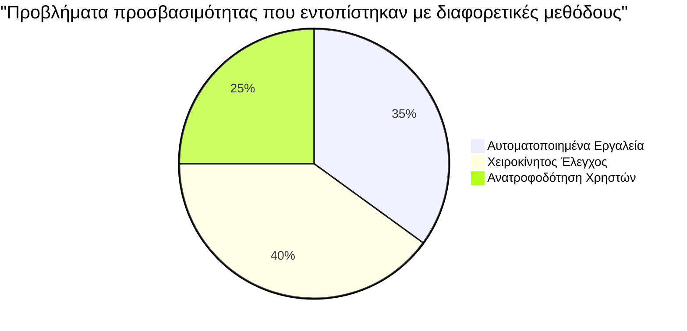
> **Ενίσχυση αυτοπεποίθησης**: Επαγγελματίες δοκιμαστές προσβασιμότητας χρησιμοποιούν ακριβώς αυτόν τον συνδυασμό μεθόδων. Μαθαίνετε τεχνικές βιομηχανικού επιπέδου!

## Δημιουργώντας την Προσβασιμότητα από τη Βάση

Το κλειδί για την επιτυχία στην προσβασιμότητα είναι να την ενσωματώσετε από την αρχή. Ξέρω πως είναι δελεαστικό να σκεφτείτε "θα προσθέσω την προσβασιμότητα αργότερα," αλλά αυτό είναι σαν να προσπαθείτε να βάλετε ράμπα σε ένα σπίτι αφού έχει ήδη χτιστεί. Εφικτό; Ναι. Εύκολο; Όχι πραγματικά.

Σκεφτείτε την προσβασιμότητα σαν να σχεδιάζετε ένα σπίτι—είναι πολύ πιο εύκολο να συμπεριλάβετε την προσβασιμότητα σε αναπηρικό αμαξίδιο στα αρχικά αρχιτεκτονικά σας σχέδια παρά να κάνετε προσαρμογές μετά.

### Οι αρχές POUR: Το θεμέλιο της προσβασιμότητας σας

Οι Οδηγίες Περιεχομένου Ιστού Προσβασιμότητας (WCAG) βασίζονται σε τέσσερις θεμελιώδεις αρχές που σχηματίζουν το ακρωνύμιο POUR. Μην ανησυχείτε—δεν είναι ξεπερασμένες ακαδημαϊκές έννοιες! Είναι πρακτικές οδηγίες για τη δημιουργία περιεχομένου που λειτουργεί για όλους.

Μόλις μάθετε το POUR, η λήψη αποφάσεων για την προσβασιμότητα γίνεται πολύ πιο διαισθητική. Είναι σαν να έχετε μια νοητική λίστα ελέγχου που καθοδηγεί τις επιλογές σχεδιασμού σας. Ας τις αναλύσουμε:

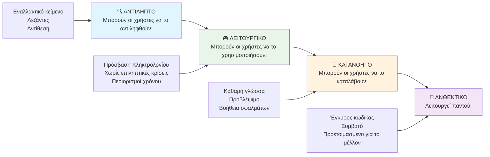
**🔍 Αντιληπτό**: Η πληροφορία πρέπει να παρουσιάζεται με τρόπους που οι χρήστες μπορούν να αντιληφθούν μέσω των διαθέσιμων αισθήσεών τους

- Παρέχετε εναλλακτικό κείμενο για μη κειμενικό περιεχόμενο (εικόνες, βίντεο, ήχο)
- Διασφαλίστε επαρκή αντίθεση χρωμάτων για όλο το κείμενο και τα στοιχεία UI
- Προσφέρετε υπότιτλους και απομαγνητοφωνήσεις για πολυμέσα
- Σχεδιάστε περιεχόμενο που παραμένει λειτουργικό όταν μεγεθύνεται έως 200%
- Χρησιμοποιήστε πολλαπλά αισθητηριακά χαρακτηριστικά (όχι μόνο χρώμα) για την μετάδοση πληροφοριών

**🎮 Λειτουργικό**: Όλα τα στοιχεία διεπαφής πρέπει να λειτουργούν μέσω των διαθέσιμων μεθόδων εισόδου

- Κάντε όλη τη λειτουργικότητα προσβάσιμη μέσω πλοήγησης με πληκτρολόγιο
- Δώστε στους χρήστες επαρκή χρόνο για ανάγνωση και αλληλεπίδραση με το περιεχόμενο
- Αποφύγετε περιεχόμενο που προκαλεί κρίσεις ή προβλήματα ισορροπίας
- Βοηθήστε τους χρήστες να περιηγηθούν αποτελεσματικά με καθαρή δομή και landmarks
- Διασφαλίστε ότι τα διαδραστικά στοιχεία έχουν επαρκές μέγεθος στόχου (τουλάχιστον 44px)

**📖 Κατανοητό**: Οι πληροφορίες και η λειτουργία του UI πρέπει να είναι σαφείς και εύκολα κατανοητές

- Χρησιμοποιήστε καθαρή, απλή γλώσσα κατάλληλη για το κοινό σας
- Διασφαλίστε ότι το περιεχόμενο εμφανίζεται και λειτουργεί με προβλέψιμους και συνεπείς τρόπους
- Παρέχετε σαφείς οδηγίες και μηνύματα σφάλματος για την εισαγωγή δεδομένων
- Βοηθήστε τους χρήστες να κατανοήσουν και να διορθώσουν λάθη στις φόρμες
- Οργανώστε το περιεχόμενο με λογική σειρά ανάγνωσης και ιεραρχία πληροφοριών

**💪 Ανθεκτικό**: Το περιεχόμενο πρέπει να λειτουργεί αξιόπιστα σε διαφορετικές τεχνολογίες και συσκευές βοηθείας

- **Χρησιμοποιήστε έγκυρο, σημασιολογικό HTML ως βάση σας**
- **Διασφαλίστε συμβατότητα με τρέχουσες και μελλοντικές τεχνολογίες βοήθειας**
- **Ακολουθείτε τα πρότυπα του ιστού και τις βέλτιστες πρακτικές για τη σήμανση**
- **Δοκιμάστε σε διαφορετικούς περιηγητές, συσκευές και βοηθητικά εργαλεία**
- **Δομήστε το περιεχόμενο έτσι ώστε να υποβαθμίζεται ομαλά όταν δεν υποστηρίζονται προχωρημένες δυνατότητες**

### 🎯 **Έλεγχος Αρχών POUR: Κάντε το να Μείνει**

**Γρήγορη αναστοχαστική εξέταση των θεμελίων:**
- Μπορείτε να σκεφτείτε μια λειτουργία ιστοσελίδας που αποτυγχάνει σε κάθε αρχή POUR;
- Ποια αρχή σας φαίνεται πιο φυσική ως προγραμματιστής;
- Πώς θα μπορούσαν αυτές οι αρχές να βελτιώσουν τον σχεδιασμό για όλους, όχι μόνο για τα άτομα με αναπηρίες;

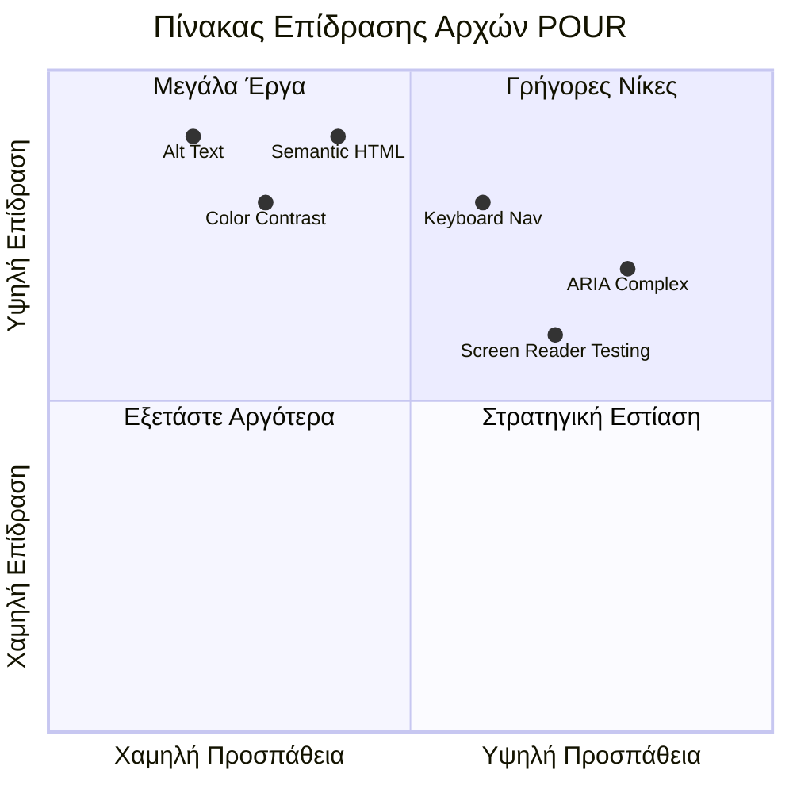
> **Θυμηθείτε**: Ξεκινήστε με βελτιώσεις υψηλής επίπτωσης και χαμηλής προσπάθειας. Το σημασιολογικό HTML και το εναλλακτικό κείμενο παρέχουν τη μεγαλύτερη ώθηση προσβασιμότητας με τη μικρότερη προσπάθεια!

## Δημιουργία Προσβάσιμου Οπτικού Σχεδιασμού

Ο καλός οπτικός σχεδιασμός και η προσβασιμότητα πάνε χέρι-χέρι. Όταν σχεδιάζετε έχοντας κατά νου την προσβασιμότητα, συχνά ανακαλύπτετε ότι αυτοί οι περιορισμοί οδηγούν σε καθαρότερες, πιο κομψές λύσεις που ωφελούν όλους τους χρήστες.

Ας εξερευνήσουμε πώς να δημιουργήσουμε οπτικά ελκυστικούς σχεδιασμούς που λειτουργούν για όλους, ανεξαρτήτως των οπτικών τους ικανοτήτων ή των συνθηκών υπό τις οποίες παρακολουθούν το περιεχόμενό σας.

### Στρατηγικές χρώματος και οπτικής προσβασιμότητας

Το χρώμα είναι ισχυρό για την επικοινωνία, αλλά ποτέ δεν πρέπει να είναι ο μόνος τρόπος με τον οποίο μεταδίδετε σημαντικές πληροφορίες. Ο σχεδιασμός πέρα από το χρώμα δημιουργεί πιο ανθεκτικές, περιεκτικές εμπειρίες που λειτουργούν σε περισσότερες καταστάσεις.

**Σχεδιάστε για διαφορές στην έγχρωμη όραση:**

Περίπου το 8% των ανδρών και το 0.5% των γυναικών έχουν κάποια μορφή διαφοράς στην έγχρωμη όραση (συχνά ονομάζεται "τυφλότητα στα χρώματα"). Οι πιο κοινές μορφές είναι:
- **Δευτερανοπία**: Δυσκολία διάκρισης κόκκινου και πράσινου
- **Πρωτανοπία**: Το κόκκινο φαίνεται πιο θαμπό
- **Τριτανοπία**: Δυσκολία με το μπλε και το κίτρινο (σπάνιο)

**Συμπεριληπτικές στρατηγικές χρώματος:**

```css
/* ❌ Bad: Using only color to indicate status */
.error { color: red; }
.success { color: green; }

/* ✅ Good: Color plus icons and context */
.error {
  color: #d32f2f;
  border-left: 4px solid #d32f2f;
}
.error::before {
  content: "⚠️";
  margin-right: 8px;
}

.success {
  color: #2e7d32;
  border-left: 4px solid #2e7d32;
}
.success::before {
  content: "✅";
  margin-right: 8px;
}
```

**Πέρα από τις βασικές απαιτήσεις αντίθεσης:**
- Δοκιμάστε τις επιλογές χρώματος με προσομοιωτές αχρωματοψίας
- Χρησιμοποιήστε μοτίβα, υφές ή σχήματα παράλληλα με την κωδικοποίηση χρώματος
- Διασφαλίστε ότι οι διαδραστικές καταστάσεις παραμένουν διακριτές χωρίς χρώμα
- Σκεφτείτε πώς φαίνεται ο σχεδιασμός σας σε λειτουργία υψηλής αντίθεσης

✅ **Δοκιμάστε την προσβασιμότητα των χρωμάτων σας**: Χρησιμοποιήστε εργαλεία όπως το [Coblis](https://www.color-blindness.com/coblis-color-blindness-simulator/) για να δείτε πώς εμφανίζεται ο ιστότοπός σας σε χρήστες με διαφορετικούς τύπους χρωματικής όρασης.

### Δείκτες εστίασης και σχεδιασμός αλληλεπίδρασης

Οι δείκτες εστίασης είναι το ψηφιακό ισοδύναμο ενός δείκτη κειμένου — δείχνουν στους χρήστες πληκτρολογίου πού βρίσκονται στη σελίδα. Οι καλοσχεδιασμένοι δείκτες εστίασης βελτιώνουν την εμπειρία για όλους κάνοντας τις αλληλεπιδράσεις σαφείς και προβλέψιμες.

**Καλές πρακτικές σύγχρονων δεικτών εστίασης:**

```css
/* Enhanced focus styles that work across browsers */
button:focus-visible {
  outline: 2px solid #0066cc;
  outline-offset: 2px;
  box-shadow: 0 0 0 4px rgba(0, 102, 204, 0.25);
}

/* Remove focus outline for mouse users, preserve for keyboard users */
button:focus:not(:focus-visible) {
  outline: none;
}

/* Focus-within for complex components */
.card:focus-within {
  box-shadow: 0 0 0 3px rgba(74, 144, 164, 0.5);
  border-color: #4A90A4;
}

/* Ensure focus indicators meet contrast requirements */
.custom-focus:focus-visible {
  outline: 3px solid #ffffff;
  outline-offset: 2px;
  box-shadow: 0 0 0 6px #000000;
}
```

**Απαιτήσεις δείκτη εστίασης:**
- **Ορατότητα**: Πρέπει να έχει αναλογία αντίθεσης τουλάχιστον 3:1 με τα περιβάλλοντα στοιχεία
- **Πλάτος**: Ελάχιστο πάχος 2px γύρω από ολόκληρο το στοιχείο
- **Επιμονή**: Πρέπει να παραμένει ορατός μέχρι να μετακινηθεί η εστίαση αλλού
- **Διάκριση**: Πρέπει να είναι οπτικά διαφορετικός από άλλες καταστάσεις UI

> 💡 **Συμβουλή σχεδιασμού**: Οι εξαιρετικοί δείκτες εστίασης συχνά χρησιμοποιούν συνδυασμό περιγράμματος, σκιάς κουτιού και αλλαγές χρώματος για να εξασφαλίσουν ορατότητα σε διαφορετικά φόντα και περιβάλλοντα.

✅ **Ελέγξτε τους δείκτες εστίασης**: Πλοηγηθείτε με το Tab στον ιστότοπό σας και σημειώστε ποια στοιχεία έχουν καθαρούς δείκτες εστίασης. Υπάρχουν κάποιοι δύσκολοι στην όραση ή που λείπουν εντελώς;

### Σημασιολογικό HTML: Το θεμέλιο της προσβασιμότητας

Το σημασιολογικό HTML είναι σαν να δίνετε στα βοηθητικά τεχνολογικά εργαλεία ένα σύστημα GPS για τον ιστότοπό σας. Όταν χρησιμοποιείτε τα σωστά στοιχεία HTML για τον προορισμό τους, ουσιαστικά παρέχετε σε οθόνες ανάγνωσης, πληκτρολόγια και άλλα εργαλεία έναν λεπτομερή οδικό χάρτη για να βοηθήσουν τους χρήστες να περιηγηθούν αποτελεσματικά.

Ορίστε μια αναλογία που με εντυπωσίασε: το σημασιολογικό HTML είναι η διαφορά ανάμεσα σε μια καλά οργανωμένη βιβλιοθήκη με σαφείς κατηγορίες και χρήσιμες πινακίδες έναντι μιας αποθήκης όπου τα βιβλία είναι πεταμένα τυχαία. Και τα δύο μέρη έχουν τα ίδια βιβλία, αλλά ποιο θα θέλατε να προσπαθήσετε να βρείτε κάτι; Ακριβώς!

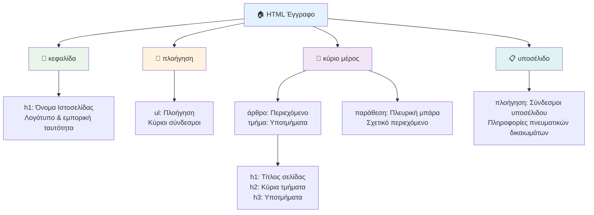
**Τα δομικά στοιχεία της προσβάσιμης δομής σελίδας:**

```html
<!-- Landmark elements provide page navigation structure -->
<header>
  <h1>Your Site Name</h1>
  <nav aria-label="Main navigation">
    <ul>
      <li><a href="/home">Home</a></li>
      <li><a href="/about">About</a></li>
      <li><a href="/services">Services</a></li>
    </ul>
  </nav>
</header>

<main>
  <article>
    <header>
      <h1>Article Title</h1>
      <p>Published on <time datetime="2024-10-14">October 14, 2024</time></p>
    </header>
    
    <section>
      <h2>First Section</h2>
      <p>Content that relates to this section...</p>
    </section>
    
    <section>
      <h2>Second Section</h2>
      <p>More related content...</p>
    </section>
  </article>
  
  <aside>
    <h2>Related Links</h2>
    <nav aria-label="Related articles">
      <ul>
        <li><a href="/related-1">First related article</a></li>
        <li><a href="/related-2">Second related article</a></li>
      </ul>
    </nav>
  </aside>
</main>

<footer>
  <p>&copy; 2024 Your Site Name. All rights reserved.</p>
  <nav aria-label="Footer links">
    <ul>
      <li><a href="/privacy">Privacy Policy</a></li>
      <li><a href="/contact">Contact Us</a></li>
    </ul>
  </nav>
</footer>
```

**Γιατί το σημασιολογικό HTML μεταμορφώνει την προσβασιμότητα:**

| Σημασιολογικό Στοιχείο | Σκοπός | Όφελος για οθόνη ανάγνωσης |
|------------------------|--------|----------------------------|
| `<header>` | Κεφαλίδα σελίδας ή ενότητας | "Μνημείο μπάνερ" - γρήγορη πλοήγηση στην κορυφή |
| `<nav>` | Σύνδεσμοι πλοήγησης | "Μνημείο πλοήγησης" - λίστα ενοτήτων πλοήγησης |
| `<main>` | Κύριο περιεχόμενο σελίδας | "Κύριο μνημείο" - άμεση μετάβαση στο περιεχόμενο |
| `<article>` | Αυτοτελές περιεχόμενο | Αναγγέλλει όρια άρθρου |
| `<section>` | Θεματικές ομάδες περιεχομένου | Παρέχει δομή περιεχομένου |
| `<aside>` | Σχετικό πλαϊνό περιεχόμενο | "Συμπληρωματικό μνημείο" |
| `<footer>` | Υποσέλιδο σελίδας ή ενότητας | "Μνημείο πληροφοριών περιεχομένου" |

**Ξεχωριστές δυνατότητες οθόνης ανάγνωσης με σημασιολογικό HTML:**
- **Πλοήγηση με μνημεία**: Άμεση μετακίνηση μεταξύ βασικών τμημάτων σελίδας
- **Περιγράμματα κεφαλίδων**: Δημιουργία πίνακα περιεχομένων από τη δομή κεφαλίδων
- **Λίστες στοιχείων**: Δημιουργία λιστών όλων των συνδέσμων, κουμπιών ή στοιχείων φορμών
- **Επίγνωση συμφραζομένων**: Κατανόηση σχέσεων μεταξύ τμημάτων περιεχομένου

> 🎯 **Γρήγορο τεστ**: Δοκιμάστε να πλοηγηθείτε στον ιστότοπό σας με οθόνη ανάγνωσης χρησιμοποιώντας συντομεύσεις μνημείων (D για μνημείο, H για κεφαλίδα, K για σύνδεσμο σε NVDA/JAWS). Έχει νόημα η πλοήγηση;

### 🏗️ **Έλεγχος Επάρκειας Σημασιολογικού HTML: Δόμηση Ισχυρών Θεμελίων**

**Ας αξιολογήσουμε την σημασιολογική σας κατανόηση:**
- Μπορείτε να εντοπίσετε τα μνημεία σε μια ιστοσελίδα μόνο κοιτάζοντας το HTML;
- Πώς θα εξηγούσατε τη διαφορά μεταξύ `<section>` και `<div>` σε έναν φίλο;
- Ποιο είναι το πρώτο πράγμα που θα ελέγχατε αν ένας χρήστης οθόνης ανάγνωσης ανέφερε προβλήματα πλοήγησης;

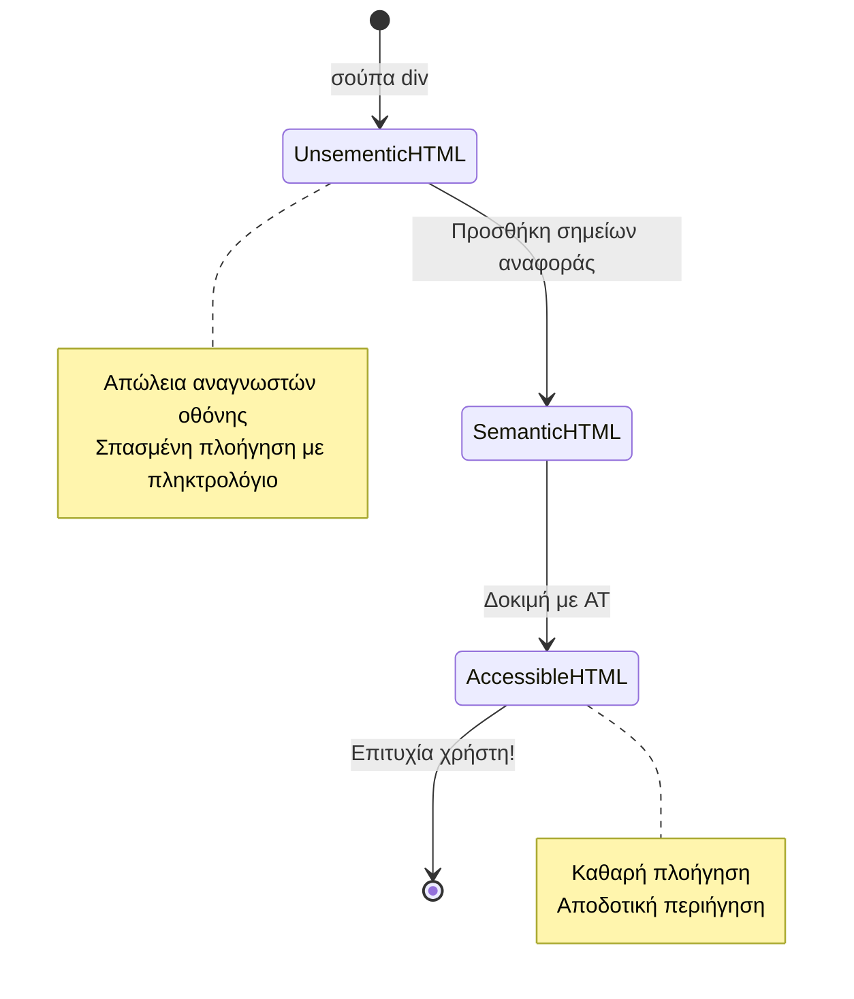
> **Επαγγελματική συμβουλή**: Το καλό σημασιολογικό HTML λύνει περίπου το 70% των θεμάτων προσβασιμότητας αυτόματα. Κατακτήστε αυτό το θεμέλιο και είστε στο σωστό δρόμο!

✅ **Ελέγξτε τη σημασιολογική σας δομή**: Χρησιμοποιήστε το πάνελ προσβασιμότητας στα DevTools του περιηγητή σας για να δείτε το δέντρο προσβασιμότητας και βεβαιωθείτε ότι το markup σας δημιουργεί μια λογική δομή.

### Ιεραρχία κεφαλίδων: Δημιουργία λογικής περίληψης περιεχομένου

Οι κεφαλίδες είναι απολύτως κρίσιμες για το προσβάσιμο περιεχόμενο — είναι σαν η σπονδυλική στήλη που κρατάει τα πάντα ενωμένα. Οι χρήστες οθονών ανάγνωσης βασίζονται πολύ στις κεφαλίδες για να κατανοήσουν και να πλοηγηθούν στο περιεχόμενό σας. Σκεφτείτε το σαν να παρέχετε ένα πίνακα περιεχομένων για τη σελίδα σας.

**Ο χρυσός κανόνας για τις κεφαλίδες:**
Μην παραλείπετε επίπεδα. Προχωρήστε πάντα λογικά από `<h1>` σε `<h2>` σε `<h3>`, κ.ο.κ. Θυμάστε πώς φτιάχνατε περιλήψεις στο σχολείο; Είναι ακριβώς η ίδια αρχή — δεν θα μεταπηδούσατε από "I. Κύριο Σημείο" απευθείας στο "C. Υπουποσημείο" χωρίς να υπάρχει πρώτα το "A. Υποσημείο", σωστά;

**Παράδειγμα τέλειας δομής κεφαλίδων:**

```html
<!-- ✅ Excellent: Logical, hierarchical progression -->
<main>
  <h1>Complete Guide to Web Accessibility</h1>
  
  <section>
    <h2>Understanding Screen Readers</h2>
    <p>Introduction to screen reader technology...</p>
    
    <h3>Popular Screen Reader Software</h3>
    <p>NVDA, JAWS, and VoiceOver comparison...</p>
    
    <h3>Testing with Screen Readers</h3>
    <p>Step-by-step testing instructions...</p>
  </section>
  
  <section>
    <h2>Color and Contrast Guidelines</h2>
    <p>Designing with sufficient contrast...</p>
    
    <h3>WCAG Contrast Requirements</h3>
    <p>Understanding the different contrast levels...</p>
    
    <h3>Testing Tools and Techniques</h3>
    <p>Tools for verifying contrast ratios...</p>
  </section>
</main>
```

```html
<!-- ❌ Problematic: Skipping levels, inconsistent structure -->
<h1>Page Title</h1>
<h3>Subsection</h3> <!-- Skipped h2 -->
<h2>This should come before h3</h2>
<h1>Another main heading?</h1> <!-- Multiple h1s -->
```

**Καλές πρακτικές για κεφαλίδες:**
- **Μία `<h1>` ανά σελίδα**: Συνήθως ο κύριος τίτλος σελίδας ή η κύρια κεφαλίδα περιεχομένου
- **Λογική πρόοδος**: Μην παραλείπετε επίπεδα (h1 → h2 → h3, όχι h1 → h3)
- **Περιγραφικό περιεχόμενο**: Κάντε τις κεφαλίδες σημαντικές όταν διαβάζονται εκτός συμφραζομένων
- **Οπτικό στυλ με CSS**: Χρησιμοποιήστε CSS για την εμφάνιση, τα επίπεδα HTML για τη δομή

**Στατιστικά πλοήγησης οθόνης ανάγνωσης:**
- Το 68% των χρηστών οθόνης ανάγνωσης πλοηγούνται με κεφαλίδες ([Έρευνα WebAIM](https://webaim.org/projects/screenreadersurvey9/#finding))
- Οι χρήστες αναμένουν να βρουν μια λογική περίληψη κεφαλίδων
- Οι κεφαλίδες παρέχουν τον ταχύτερο τρόπο κατανόησης της δομής της σελίδας

> 💡 **Συμβουλή επαγγελματία**: Χρησιμοποιήστε επεκτάσεις περιηγητή όπως το "HeadingsMap" για να οπτικοποιήσετε τη δομή των κεφαλίδων σας. Θα πρέπει να διαβάζεται σαν ένας καλά οργανωμένος πίνακας περιεχομένων.

✅ **Δοκιμάστε τη δομή των κεφαλίδων σας**: Χρησιμοποιήστε την πλοήγηση κεφαλίδων οθόνης ανάγνωσης (πλήκτρο H στο NVDA) για να μετακινηθείτε στις κεφαλίδες σας. Η πρόοδος διηγείται λογικά την ιστορία του περιεχομένου σας;

### Προχωρημένες τεχνικές οπτικής προσβασιμότητας

Πέρα από τα βασικά της αντίθεσης και του χρώματος, υπάρχουν σύνθετες τεχνικές που βοηθούν στη δημιουργία πραγματικά περιεκτικών οπτικών εμπειριών. Αυτές οι μέθοδοι διασφαλίζουν ότι το περιεχόμενό σας λειτουργεί σε διαφορετικές συνθήκες προβολής και βοηθητικές τεχνολογίες.

**Απαραίτητες στρατηγικές οπτικής επικοινωνίας:**

- **Πολύτροπη ανάδραση**: Συνδυάστε οπτικά, κειμενικά και μερικές φορές ηχητικά ερεθίσματα
- **Προοδευτική αποκάλυψη**: Παρουσιάστε πληροφορίες σε εύπεπτα τμήματα
- **Συνεπείς προτύπους αλληλεπίδρασης**: Χρησιμοποιήστε γνωστές συμβάσεις UI
- **Ανταποκρινόμενη τυπογραφία**: Κλιμάκωση κειμένου κατάλληλα σε συσκευές
- **Καταστάσεις φόρτωσης και σφάλματος**: Παρέχετε σαφή ανάδραση για όλες τις ενέργειες χρηστών

**Εργαλεία CSS για αυξημένη προσβασιμότητα:**

```css
/* Screen reader only text - visually hidden but accessible */
.sr-only {
  position: absolute;
  width: 1px;
  height: 1px;
  padding: 0;
  margin: -1px;
  overflow: hidden;
  clip: rect(0, 0, 0, 0);
  white-space: nowrap;
  border: 0;
}

/* Skip link for keyboard navigation */
.skip-link {
  position: absolute;
  top: -40px;
  left: 6px;
  background: #000000;
  color: #ffffff;
  padding: 8px 16px;
  text-decoration: none;
  border-radius: 4px;
  font-weight: bold;
  transition: top 0.3s ease;
  z-index: 1000;
}

.skip-link:focus {
  top: 6px;
}

/* Reduced motion respect */
@media (prefers-reduced-motion: reduce) {
  .skip-link {
    transition: none;
  }
  
  * {
    animation-duration: 0.01ms !important;
    animation-iteration-count: 1 !important;
    transition-duration: 0.01ms !important;
  }
}

/* High contrast mode support */
@media (prefers-contrast: high) {
  .button {
    border: 2px solid;
  }
}
```

> 🎯 **Πρότυπο προσβασιμότητας**: Ο "σύνδεσμος παράκαμψης" είναι απαραίτητος για χρήστες πληκτρολογίου. Πρέπει να είναι το πρώτο εστιασμένο στοιχείο στη σελίδα σας και να πηδά κατευθείαν στο κύριο περιεχόμενο.

✅ **Εφαρμόστε παράκαμψη πλοήγησης**: Προσθέστε συνδέσμους παράκαμψης στις σελίδες σας και δοκιμάστε τους πατώντας Tab αμέσως μετά τη φόρτωση της σελίδας. Πρέπει να εμφανίζονται και να σας επιτρέπουν να πηδάτε στο κύριο περιεχόμενο.

## Δημιουργώντας Σημαντικό Κείμενο Συνδέσμου

Οι σύνδεσμοι είναι ουσιαστικά οι δρόμοι του διαδικτύου, αλλά το κακογραμμένο κείμενο συνδέσμου είναι σαν να έχεις πινακίδες δρόμου που απλά λένε "Μέρος" αντί για "Κέντρο του Σικάγο". Όχι πολύ βοηθητικό, σωστά;

Να κάτι που με εντυπωσίασε όταν το έμαθα για πρώτη φορά: οι οθόνες ανάγνωσης μπορούν να εξαγάγουν όλους τους συνδέσμους μιας σελίδας και να τους δείξουν ως μια μεγάλη λίστα. Φανταστείτε αν κάποιος σας έδινε ένα κατάλογο με κάθε σύνδεσμο στη σελίδα σας. Θα είχε νόημα ο καθένας ξεχωριστά; Αυτό είναι το τεστ που πρέπει να περάσει το κείμενο του συνδέσμου σας!

### Κατανόηση προτύπων πλοήγησης συνδέσμων

Οι οθόνες ανάγνωσης προσφέρουν ισχυρές δυνατότητες πλοήγησης συνδέσμων που βασίζονται σε καλά γραμμένο κείμενο συνδέσμου:

**Μέθοδοι πλοήγησης συνδέσμων:**
- **Αλληλουχία ανάγνωσης**: Οι σύνδεσμοι διαβάζονται στο πλαίσιο ροής περιεχομένου
- **Δημιουργία λίστας συνδέσμων**: Όλοι οι σύνδεσμοι της σελίδας συνδυάζονται σε αναζητήσιμο κατάλογο
- **Γρήγορη πλοήγηση**: Μετακίνηση μεταξύ συνδέσμων με συντομεύσεις πληκτρολογίου (K στο NVDA)
- **Λειτουργία αναζήτησης**: Βρείτε συγκεκριμένους συνδέσμους πληκτρολογώντας μερικό κείμενο

**Γιατί είναι σημαντικό το πλαίσιο:**
Όταν οι χρήστες οθόνης ανάγνωσης δημιουργούν λίστα συνδέσμων, βλέπουν κάτι σαν αυτό:
- "Κατεβάστε την αναφορά"
- "Μάθετε περισσότερα"
- "Κάντε κλικ εδώ"
- "Πολιτική απορρήτου"
- "Κάντε κλικ εδώ"

Μόνο δύο από αυτούς τους συνδέσμους παρέχουν χρήσιμες πληροφορίες όταν διαβάζονται εκτός συγκειμένου!

> 📊 **Επίδραση στον χρήστη**: Οι χρήστες οθόνης ανάγνωσης σαρώνουν τις λίστες συνδέσμων για να κατανοήσουν γρήγορα το περιεχόμενο της σελίδας. Το γενικό κείμενο συνδέσμων τους αναγκάζει να επιστρέφουν στο πλαίσιο κάθε συνδέσμου, επιβραδύνοντας σημαντικά την περιήγηση.

### Συνηθισμένα λάθη κειμένου συνδέσμου προς αποφυγή

Η κατανόηση του τι δεν λειτουργεί σας βοηθά να αναγνωρίσετε και να διορθώσετε θέματα προσβασιμότητας στο υπάρχον περιεχόμενο.

**❌ Γενικό κείμενο συνδέσμου που δεν παρέχει πλαίσιο:**

```html
<!-- Meaningless when read from a link list -->
<p>Our sustainability efforts are detailed in our recent report. 
   <a href="/sustainability-2024.pdf">Click here</a> to view it.</p>

<!-- Repeated generic text throughout the page -->
<div class="article-card">
  <h3>Web Accessibility Guide</h3>
  <p>Learn the fundamentals...</p>
  <a href="/accessibility-guide">Read more</a>
</div>
<div class="article-card">
  <h3>Color Contrast Tips</h3>
  <p>Improve your design...</p>
  <a href="/color-contrast">Read more</a>
</div>

<!-- URLs as link text (difficult for screen readers to announce) -->
<p>Visit https://www.w3.org/WAI/WCAG21/quickref/ for WCAG guidelines.</p>

<!-- Vague action words -->
<a href="/contact">Go</a> | <a href="/about">See</a> | <a href="/help">View</a>
```

**Γιατί αποτυγχάνουν αυτά τα μοτίβα:**
- **"Κάντε κλικ εδώ"** δεν λέει στους χρήστες τίποτα για τον προορισμό
- **"Διαβάστε περισσότερα"** επαναλαμβανόμενο πολλές φορές προκαλεί σύγχυση
- **Οι ακατέργαστες διευθύνσεις URL** είναι δύσκολες για τις οθόνες ανάγνωσης να προφέρουν καθαρά
- **Μονές λέξεις** όπως "Πηγαίνετε" ή "Δείτε" δεν έχουν περιγραφικό πλαίσιο

### Γράφοντας εξαιρετικό κείμενο συνδέσμου

Το περιγραφικό κείμενο συνδέσμου ωφελεί όλους — οι χρήστες με όραση μπορούν να σκανάρουν γρήγορα τους συνδέσμους και οι χρήστες οθόνης ανάγνωσης κατανοούν αμέσως τους προορισμούς.

**✅ Παραδείγματα σαφούς, περιγραφικού κειμένου συνδέσμου:**

```html
<!-- Descriptive text that explains the destination -->
<p>Our comprehensive <a href="/sustainability-2024.pdf">2024 sustainability report (PDF, 2.1MB)</a> details our environmental initiatives.</p>

<!-- Specific, unique link text for each card -->
<div class="article-card">
  <h3>Web Accessibility Guide</h3>
  <p>Learn the fundamentals of inclusive design...</p>
  <a href="/accessibility-guide">Read our complete web accessibility guide</a>
</div>
<div class="article-card">
  <h3>Color Contrast Tips</h3>
  <p>Improve your design with better color choices...</p>
  <a href="/color-contrast">Explore color contrast best practices</a>
</div>

<!-- Meaningful text instead of raw URLs -->
<p>The <a href="https://www.w3.org/WAI/WCAG21/quickref/">WCAG 2.1 Quick Reference guide</a> provides comprehensive accessibility guidelines.</p>

<!-- Descriptive action links -->
<a href="/contact">Contact our support team</a> | 
<a href="/about">About our company</a> | 
<a href="/help">Get help with your account</a>
```

**Καλές πρακτικές κειμένου συνδέσμου:**
- **Να είστε συγκεκριμένοι**: "Κατεβάστε την τριμηνιαία οικονομική έκθεση" αντί για "Κατεβάστε"
- **Περιλάβετε τύπο και μέγεθος αρχείου**: "(PDF, 1.2MB)" για αρχεία προς λήψη
- **Αναφέρετε αν οι σύνδεσμοι ανοίγουν εξωτερικά**: "(ανοίγει σε νέο παράθυρο)" όταν είναι κατάλληλο
- **Χρησιμοποιήστε ενεργητική γλώσσα**: "Επικοινωνήστε μαζί μας" αντί για "Σελίδα επικοινωνίας"
- **Κρατήστε το συνοπτικό**: Στόχος 2-8 λέξεις όπου είναι δυνατόν

### Προχωρημένα πρότυπα προσβασιμότητας συνδέσμου

Μερικές φορές οι περιορισμοί οπτικού σχεδιασμού ή τεχνικές απαιτήσεις χρειάζονται ειδικές λύσεις. Εδώ είναι σύνθετες τεχνικές για συνηθισμένα δύσκολα σενάρια:

**Χρήση ARIA για εμπλουτισμένο πλαίσιο:**

```html
<!-- When button text must be short but needs more context -->
<a href="/report.pdf" 
   aria-label="Download 2024 annual financial report, PDF format, 2.3MB">
  Download Report
</a>

<!-- When the full context comes from surrounding content -->
<h3 id="sustainability-heading">Sustainability Initiative</h3>
<p>Our efforts to reduce environmental impact...</p>
<a href="/sustainability-details" 
   aria-labelledby="sustainability-heading"
   aria-describedby="sustainability-summary">
  Learn more
</a>
<p id="sustainability-summary">Detailed breakdown of our 2024 environmental goals and achievements</p>
```

**Επισήμανση τύπων αρχείων και εξωτερικών προορισμών:**

```html
<!-- Method 1: Include information in visible link text -->
<a href="/annual-report.pdf">
  Download our 2024 annual report (PDF, 2.3MB)
</a>

<!-- Method 2: Use screen reader-only text for file details -->
<a href="/annual-report.pdf">
  Download our 2024 annual report
  <span class="sr-only">(PDF format, 2.3MB)</span>
</a>

<!-- Method 3: External link indication -->
<a href="https://example.com" 
   target="_blank" 
   aria-describedby="external-link-warning">
  Visit external resource
</a>
<span id="external-link-warning" class="sr-only">
  (opens in new window)
</span>

<!-- Method 4: Using CSS for visual indicators -->
<a href="https://example.com" class="external-link">
  External resource
</a>
```

```css
/* Visual indicator for external links */
.external-link::after {
  content: " ↗";
  font-size: 0.8em;
  color: #666;
}

/* Screen reader announcement for external links */
.external-link::before {
  content: "External link: ";
  position: absolute;
  left: -10000px;
  width: 1px;
  height: 1px;
  overflow: hidden;
}
```

> ⚠️ **Σημαντικό**: Όταν χρησιμοποιείτε το `target="_blank"`, ενημερώνετε πάντα τους χρήστες ότι ο σύνδεσμος ανοίγει σε νέο παράθυρο ή καρτέλα. Οι απρόσμενες αλλαγές πλοήγησης μπορούν να προκαλέσουν σύγχυση.

✅ **Δοκιμάστε το πλαίσιο των συνδέσμων σας**: Χρησιμοποιήστε τα εργαλεία προγραμματιστή του περιηγητή σας για να δημιουργήσετε λίστα με όλους τους συνδέσμους στη σελίδα σας. Μπορείτε να κατανοήσετε τον σκοπό κάθε συνδέσμου χωρίς κανένα περιβάλλον;

## ARIA: Ενίσχυση της Προσβασιμότητας HTML

[Οι Προσβάσιμες Πλούσιες Διαδικτυακές Εφαρμογές (ARIA)](https://developer.mozilla.org/docs/Web/Accessibility/ARIA) είναι σαν να έχετε έναν καθολικό μεταφραστή μεταξύ των πολύπλοκων διαδικτυακών εφαρμογών σας και των βοηθητικών τεχνολογιών. Όταν το HTML μόνο δεν μπορεί να εκφράσει όλα όσα κάνουν τα διαδραστικά σας στοιχεία, το ARIA επεμβαίνει για να γεμίσει αυτά τα κενά.

Μου αρέσει να σκέφτομαι το ARIA σαν να προσθέτει χρήσιμες σημειώσεις στο HTML σας — κάπως σαν κατευθύνσεις σκηνής σε ένα θεατρικό σενάριο που βοηθούν τους ηθοποιούς να κατανοήσουν τους ρόλους και τις σχέσεις τους.

**Ο πιο σημαντικός κανόνας για το ARIA**: Χρησιμοποιήστε πάντα πρώτα σημασιολογικό HTML, μετά προσθέστε ARIA για να το ενισχύσετε. Σκεφτείτε το ARIA ως καρύκευμα, όχι το βασικό πιάτο. Πρέπει να διευκρινίζει και να βελτιώνει τη δομή HTML σας, ποτέ να την αντικαθιστά. Πρώτα βεβαιωθείτε ότι έχετε το σωστό θεμέλιο!

### Στρατηγική εφαρμογή ARIA

Το ARIA είναι ισχυρό, αλλά με τη δύναμη έρχεται και η ευθύνη. Λάθος χρήση του ARIA μπορεί να χειροτερέψει την προσβασιμότητα αντί να τη βελτιώσει. Δείτε πότε και πώς να το χρησιμοποιείτε αποτελεσματικά:

**✅ Χρησιμοποιήστε ARIA όταν:**
- Δημιουργείτε προσαρμοσμένα διαδραστικά γραφικά στοιχεία (ακορντεόν, καρτέλες, καρουζέλ)
- Δημιουργείτε δυναμικό περιεχόμενο που αλλάζει χωρίς φόρτωση σελίδας
- Παρέχετε επιπλέον πλαίσιο για πολύπλοκες σχέσεις UI
- Δηλώνετε καταστάσεις φόρτωσης ή ζωντανές ενημερώσεις περιεχομένου
- Δημιουργείτε περιβάλλοντα εφαρμογής με προσαρμοσμένους ελέγχους

**❌ Αποφύγετε το ARIA όταν:**
- Τα τυπικά στοιχεία HTML παρέχουν ήδη τα απαραίτητα σημασιολογικά στοιχεία
- Δεν είστε σίγουροι πώς να το εφαρμόσετε σωστά
- Διπλασιάζει πληροφορίες που παρέχονται ήδη από σημασιολογικό HTML
- Δεν έχετε δοκιμάσει με πραγματική βοηθητική τεχνολογία

> 🎯 **Ο Χρυσός Κανόνας ARIA**: "Μην αλλάζετε σημασιολογία εκτός αν είναι απολύτως αναγκαίο, διασφαλίστε πάντα την προσβασιμότητα με πληκτρολόγιο, και δοκιμάστε με πραγματική βοηθητική τεχνολογία."
**Οι πέντε κατηγορίες του ARIA:**

1. **Ρόλοι**: Τι είναι αυτό το στοιχείο; (`button`, `tab`, `dialog`)
2. **Ιδιότητες**: Ποια είναι τα χαρακτηριστικά του; (`aria-required`, `aria-haspopup`)
3. **Καταστάσεις**: Ποια είναι η τρέχουσα κατάσταση του; (`aria-expanded`, `aria-checked`)
4. **Ορόσημα**: Πού βρίσκεται στη δομή της σελίδας; (`banner`, `navigation`, `main`)
5. **Ζωντανές περιοχές**: Πώς πρέπει να ανακοινώνονται οι αλλαγές; (`aria-live`, `aria-atomic`)

### Βασικά πρότυπα ARIA για σύγχρονες διαδικτυακές εφαρμογές

Αυτά τα πρότυπα λύνουν τις πιο κοινές προκλήσεις προσβασιμότητας σε διαδραστικές διαδικτυακές εφαρμογές:

**Ονομασία και περιγραφή στοιχείων:**

```html
<!-- aria-label: Provides accessible name when visible text isn't sufficient -->
<button aria-label="Close newsletter subscription dialog">×</button>

<!-- aria-labelledby: References existing text as the accessible name -->
<section aria-labelledby="news-heading">
  <h2 id="news-heading">Latest News</h2>
  <!-- news content -->
</section>

<!-- aria-describedby: Links to additional descriptive text -->
<input type="password" 
       aria-describedby="pwd-requirements pwd-strength"
       required>
<div id="pwd-requirements">
  Password must contain at least 8 characters, including uppercase, lowercase, and numbers.
</div>
<div id="pwd-strength" aria-live="polite">
  <!-- Dynamic password strength indicator -->
</div>
```

**Ζωντανές περιοχές για δυναμικό περιεχόμενο:**

```html
<!-- Polite announcements (don't interrupt current speech) -->
<div aria-live="polite" id="status-updates">
  <!-- Status messages appear here -->
</div>

<!-- Assertive announcements (interrupt and announce immediately) -->
<div aria-live="assertive" id="urgent-alerts">
  <!-- Error messages and critical alerts -->
</div>

<!-- Loading states with live regions -->
<button id="submit-btn" aria-describedby="loading-status">
  Submit Application
</button>
<div id="loading-status" aria-live="polite" aria-atomic="true">
  <!-- "Processing your application..." appears here -->
</div>
```

**Παράδειγμα διαδραστικού widget (ακορντεόν):**

```html
<div class="accordion">
  <h3>
    <button aria-expanded="false" 
            aria-controls="panel-1" 
            id="accordion-trigger-1"
            class="accordion-trigger">
      Accessibility Guidelines
    </button>
  </h3>
  <div id="panel-1" 
       role="region"
       aria-labelledby="accordion-trigger-1" 
       hidden>
    <p>WCAG 2.1 provides comprehensive guidelines...</p>
  </div>
</div>
```

```javascript
// JavaScript για τη διαχείριση της κατάστασης του ακκορντεόν
function toggleAccordion(trigger) {
  const panel = document.getElementById(trigger.getAttribute('aria-controls'));
  const isExpanded = trigger.getAttribute('aria-expanded') === 'true';
  
  // Εναλλαγή καταστάσεων
  trigger.setAttribute('aria-expanded', !isExpanded);
  panel.hidden = isExpanded;
  
  // Ανακοίνωση αλλαγής σε αναγνώστες οθόνης
  const status = document.getElementById('status-updates');
  status.textContent = isExpanded ? 'Section collapsed' : 'Section expanded';
}
```

### Καλές πρακτικές υλοποίησης ARIA

Το ARIA είναι ισχυρό αλλά απαιτεί προσεκτική υλοποίηση. Η τήρηση αυτών των κατευθυντήριων γραμμών βοηθά να διασφαλίσετε ότι το ARIA βελτιώνει και όχι ότι εμποδίζει την προσβασιμότητα:

**🛡️ Βασικές αρχές:**

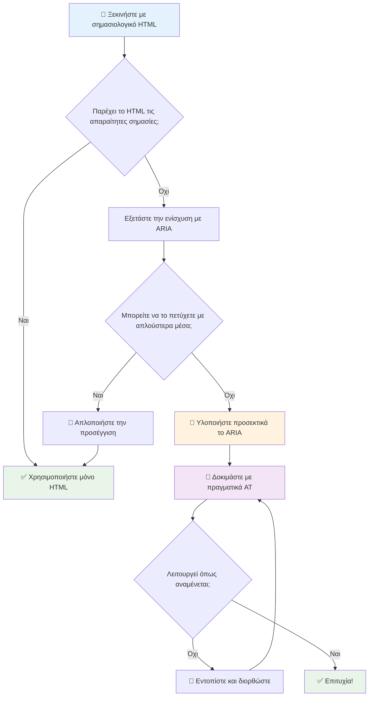
1. **Προτίμηση σημασιολογικού HTML πρώτα**: Πάντα να προτιμάτε το `<button>` αντί για `<div role="button">`
2. **Μην σπάζετε τη σημασιολογία**: Ποτέ μην παρακάμπτετε το υπάρχον νόημα του HTML (αποφύγετε το `<h1 role="button">`)
3. **Διατηρήστε την προσβασιμότητα με το πληκτρολόγιο**: Όλα τα διαδραστικά στοιχεία ARIA πρέπει να είναι πλήρως προσβάσιμα με το πληκτρολόγιο
4. **Δοκιμάστε με πραγματικούς χρήστες**: Η υποστήριξη ARIA διαφέρει σημαντικά ανάμεσα σε βοηθητικές τεχνολογίες
5. **Ξεκινήστε απλά**: Οι πολύπλοκες υλοποιήσεις ARIA έχουν μεγαλύτερη πιθανότητα να έχουν λάθη

**🔍 Ροή εργασίας δοκιμών:**

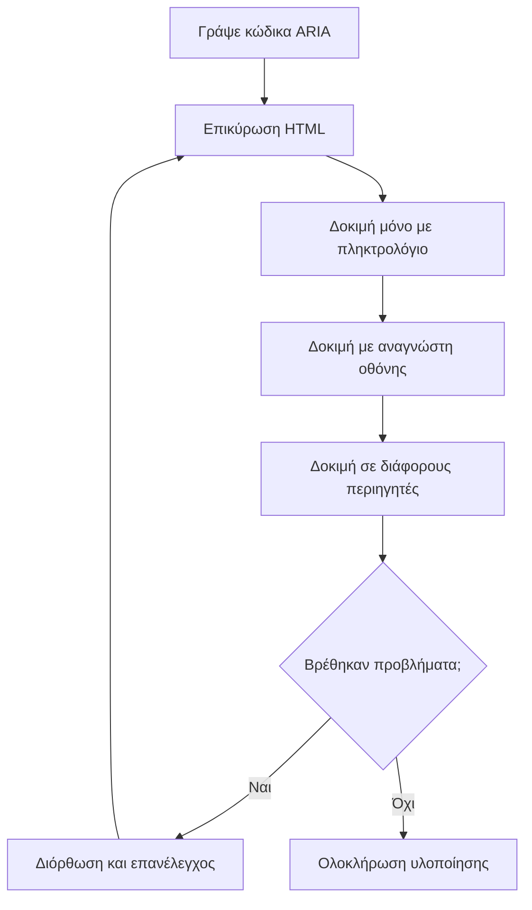
**🚫 Συχνά λάθη ARIA που πρέπει να αποφεύγετε:**

- **Αντιφατικές πληροφορίες**: Μην αντιφάσκετε με την σημασιολογία του HTML
- **Υπερβολική επισήμανση**: Πάρα πολλές πληροφορίες ARIA υπερφορτώνουν τους χρήστες
- **Στατικό ARIA**: Ξεχνώντας να ενημερώσετε τις καταστάσεις ARIA όταν το περιεχόμενο αλλάζει
- **Μη δοκιμασμένες υλοποιήσεις**: ARIA που λειτουργεί στη θεωρία αλλά αποτυγχάνει στην πράξη
- **Έλλειψη υποστήριξης πληκτρολογίου**: Ρόλοι ARIA χωρίς αντίστοιχες λειτουργίες πληκτρολογίου

> 💡 **Πόροι δοκιμών**: Χρησιμοποιήστε εργαλεία όπως το [accessibility-checker](https://www.npmjs.com/package/accessibility-checker) για αυτόματη επαλήθευση ARIA, αλλά πάντα δοκιμάστε με πραγματικούς αναγνώστες οθόνης για την πλήρη εμπειρία.

### 🎭 **Έλεγχος δεξιοτήτων ARIA: Είστε έτοιμοι για πολύπλοκες αλληλεπιδράσεις;**

**Αξιολογήστε την αυτοπεποίθησή σας με το ARIA:**
- Πότε θα επιλέγατε ARIA αντί για σημασιολογικό HTML; (Υπόδειξη: σχεδόν ποτέ!)
- Μπορείτε να εξηγήσετε γιατί το `<div role="button">` είναι συνήθως χειρότερο από το `<button>`;
- Ποιο είναι το πιο σημαντικό που πρέπει να θυμάστε για τις δοκιμές ARIA;

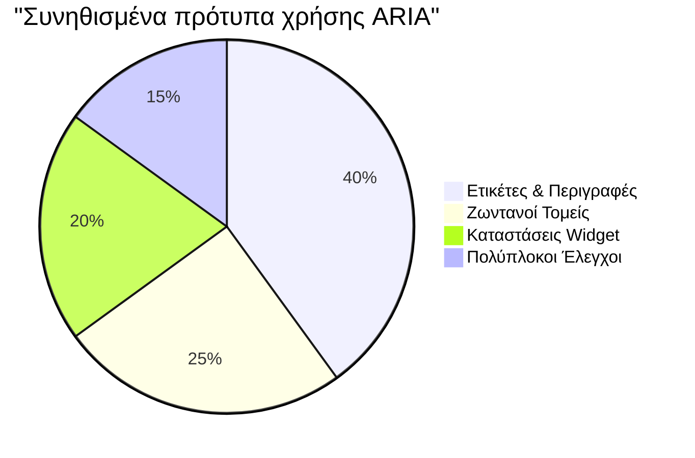
> **Κύρια διαπίστωση**: Η μεγαλύτερη χρήση του ARIA αφορά την επισήμανση και την περιγραφή στοιχείων. Τα πολύπλοκα μοτίβα widget είναι πολύ λιγότερο συνηθισμένα απ' ό,τι νομίζετε!

✅ **Μάθετε από τους ειδικούς**: Μελετήστε τον [Οδηγό Πρακτικών Συντακτών ARIA](https://w3c.github.io/aria-practices/) για δοκιμασμένα μοτίβα και υλοποιήσεις πολύπλοκων διαδραστικών widgets.

## Κάντε τις εικόνες και τα μέσα προσβάσιμα

Το οπτικό και ακουστικό περιεχόμενο είναι βασικά μέρη των σύγχρονων διαδικτυακών εμπειριών, αλλά μπορούν να δημιουργήσουν εμπόδια αν δεν υλοποιηθούν με σκέψη. Ο στόχος είναι να διασφαλιστεί ότι οι πληροφορίες και η συναισθηματική επίδραση των μέσων σας φτάνουν σε κάθε χρήστη. Μόλις το καταλάβετε, γίνεται δεύτερη φύση.

Διαφορετικοί τύποι μέσων χρειάζονται διαφορετικές προσεγγίσεις προσβασιμότητας. Είναι σαν το μαγείρεμα—δεν θα φέρνετε ένα ευαίσθητο ψάρι το ίδιο όπως μια χορταστική μπριζόλα. Η κατανόηση αυτών των διαφορών βοηθά να επιλέξετε τη σωστή λύση για κάθε περίπτωση.

### Στρατηγική προσβασιμότητας εικόνων

Κάθε εικόνα στον ιστότοπό σας έχει έναν σκοπό. Η κατανόηση αυτού του σκοπού βοηθά να γράψετε καλύτερο εναλλακτικό κείμενο και να δημιουργήσετε πιο περιεκτικές εμπειρίες.

**Οι τέσσερις τύποι εικόνων και οι στρατηγικές για το alt κείμενο:**

**Ενημερωτικές εικόνες** - μεταφέρουν σημαντικές πληροφορίες:
```html

```

**Διακοσμητικές εικόνες** - καθαρά οπτικές χωρίς πληροφοριακή αξία:
```html

```

**Λειτουργικές εικόνες** - λειτουργούν ως κουμπιά ή ελεγκτικά:
```html
<button>
  
</button>
```

**Πολύπλοκες εικόνες** - διαγράμματα, γραφήματα, ενημερωτικά γραφικά:
```html

<div id="chart-description">
  <p>Detailed description: Sales data shows a steady increase across all quarters...</p>
</div>
```

### Προσβασιμότητα βίντεο και ήχου

**Απαιτήσεις βίντεο:**
- **Λεζάντες**: Κείμενο για το προφορικό περιεχόμενο και τα ηχητικά εφέ
- **Ηχητικές περιγραφές**: Αφήγηση οπτικών στοιχείων για τυφλούς χρήστες
- **Μεταγραφές**: Πλήρες κείμενο για όλο το ηχητικό και οπτικό περιεχόμενο

```html
<video controls>
  <source src="video.mp4" type="video/mp4">
  <track kind="captions" src="captions.vtt" srclang="en" label="English">
  <track kind="descriptions" src="descriptions.vtt" srclang="en" label="Audio descriptions">
</video>
```

**Απαιτήσεις ήχου:**
- **Μεταγραφές**: Κείμενο για όλο το προφορικό περιεχόμενο
- **Οπτικοί δείκτες**: Για απλά ακουστικό περιεχόμενο, παρέχετε οπτικά στοιχεία

### Σύγχρονες τεχνικές εικόνων

**Χρήση CSS για διακοσμητικές εικόνες:**
```css
.hero-section {
  background-image: url('decorative-hero.jpg');
  /* Decorative images in CSS don't need alt text */
}
```

**Ανταποκρινόμενες εικόνες με προσβασιμότητα:**
```html
<picture>
  <source media="(min-width: 800px)" srcset="large-chart.png">
  <source media="(min-width: 400px)" srcset="medium-chart.png">
  
</picture>
```

✅ **Δοκιμάστε την προσβασιμότητα εικόνων**: Χρησιμοποιήστε έναν αναγνώστη οθόνης για να πλοηγηθείτε σε μια σελίδα με εικόνες. Λαμβάνετε αρκετές πληροφορίες για να κατανοήσετε το περιεχόμενο;

## Πλοήγηση με πληκτρολόγιο και διαχείριση εστίασης

Πολλοί χρήστες πλοηγούνται στο διαδίκτυο αποκλειστικά με το πληκτρολόγιο. Αυτό περιλαμβάνει άτομα με κινητικές αναπηρίες, προχωρημένους χρήστες που βρίσκουν το πληκτρολόγιο ταχύτερο από το ποντίκι, καθώς και όποιον το ποντίκι του σταμάτησε να λειτουργεί. Η διασφάλιση ότι ο ιστότοπός σας λειτουργεί καλά με πληκτρολόγιο είναι απαραίτητη και συχνά καθιστά τον ιστότοπο πιο αποτελεσματικό για όλους.

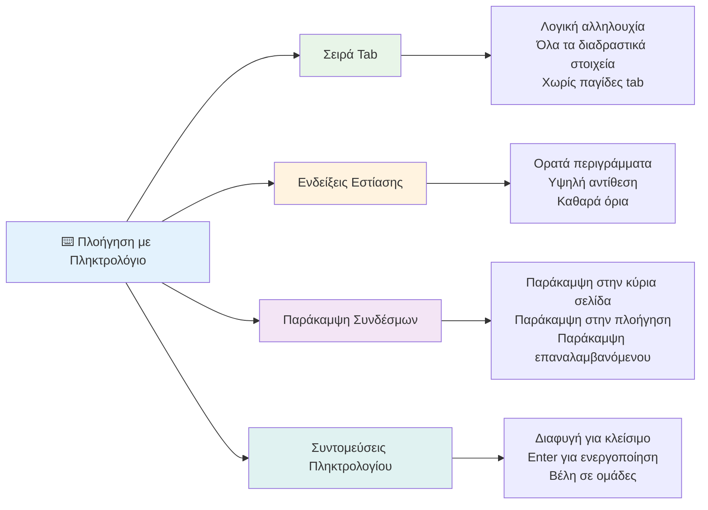
### Βασικά πρότυπα πλοήγησης με πληκτρολόγιο

**Τυπικές αλληλεπιδράσεις πληκτρολογίου:**
- **Tab**: Μετακίνηση εστίασης μπροστά στα διαδραστικά στοιχεία
- **Shift + Tab**: Μετακίνηση εστίασης πίσω
- **Enter**: Ενεργοποίηση κουμπιών και συνδέσμων
- **Space**: Ενεργοποίηση κουμπιών, επιλογή κουτιών ελέγχου
- **Πλήκτρα βελών**: Πλοήγηση εντός ομάδων συστατικών (ραδιοκουμπιά, μενού)
- **Escape**: Κλείσιμο παραθύρων modals, αναδυόμενων ή ακύρωση ενεργειών

### Καλές πρακτικές διαχείρισης εστίασης

**Ορατοί δείκτες εστίασης:**
```css
/* Ensure focus is always visible */
button:focus-visible {
  outline: 2px solid #4A90A4;
  outline-offset: 2px;
}

/* Custom focus styles for different components */
.card:focus-within {
  box-shadow: 0 0 0 3px rgba(74, 144, 164, 0.5);
}
```

**Σύνδεσμοι παράκαμψης για αποτελεσματική πλοήγηση:**
```html
<a href="#main-content" class="skip-link">Skip to main content</a>
<a href="#navigation" class="skip-link">Skip to navigation</a>

<nav id="navigation">
  <!-- navigation content -->
</nav>
<main id="main-content">
  <!-- main content -->
</main>
```

**Σωστή σειρά Tab:**
```html
<!-- Use semantic HTML for natural tab order -->
<form>
  <label for="name">Name:</label>
  <input type="text" id="name" tabindex="0">
  
  <label for="email">Email:</label>
  <input type="email" id="email" tabindex="0">
  
  <button type="submit" tabindex="0">Submit</button>
</form>
```

### Παγίδευση εστίασης σε modals

Όταν ανοίγετε διαλόγους modal, η εστίαση θα πρέπει να παγιδεύεται μέσα στο modal:

```javascript
// Σύγχρονη υλοποίηση παγίδας εστίασης
function trapFocus(element) {
  const focusableElements = element.querySelectorAll(
    'button, [href], input, select, textarea, [tabindex]:not([tabindex="-1"])'
  );
  
  const firstElement = focusableElements[0];
  const lastElement = focusableElements[focusableElements.length - 1];

  element.addEventListener('keydown', (e) => {
    if (e.key === 'Tab') {
      if (e.shiftKey && document.activeElement === firstElement) {
        e.preventDefault();
        lastElement.focus();
      } else if (!e.shiftKey && document.activeElement === lastElement) {
        e.preventDefault();
        firstElement.focus();
      }
    }
    
    if (e.key === 'Escape') {
      closeModal();
    }
  });
  
  // Εστίαση στο πρώτο στοιχείο όταν ανοίγει το modal
  firstElement.focus();
}
```

✅ **Δοκιμάστε την πλοήγηση πληκτρολογίου**: Προσπαθήστε να πλοηγηθείτε στον ιστότοπό σας χρησιμοποιώντας μόνο το πλήκτρο Tab. Μπορείτε να φτάσετε όλα τα διαδραστικά στοιχεία; Είναι η σειρά εστίασης λογική; Είναι οι δείκτες εστίασης ορατοί;

## Προσβασιμότητα φορμών

Οι φόρμες είναι κρίσιμες για την αλληλεπίδραση του χρήστη και απαιτούν ειδική προσοχή στην προσβασιμότητα.

### Συσχέτιση ετικετών και ελέγχων φόρμας

**Κάθε έλεγχος φόρμας χρειάζεται ετικέτα:**
```html
<!-- Explicit labeling (preferred) -->
<label for="username">Username:</label>
<input type="text" id="username" name="username" required>

<!-- Implicit labeling -->
<label>
  Password:
  <input type="password" name="password" required>
</label>

<!-- Using aria-label when visual label isn't desired -->
<input type="search" aria-label="Search products" placeholder="Search...">
```

### Διαχείριση σφαλμάτων και επικύρωση

**Προσβάσιμα μηνύματα σφάλματος:**
```html
<label for="email">Email Address:</label>
<input type="email" id="email" name="email" 
       aria-describedby="email-error" 
       aria-invalid="true" required>
<div id="email-error" role="alert">
  Please enter a valid email address
</div>
```

**Καλές πρακτικές επικύρωσης φόρμας:**
- Χρησιμοποιήστε το `aria-invalid` για να δείξετε άκυρα πεδία
- Παρέχετε σαφή, συγκεκριμένα μηνύματα σφάλματος
- Χρησιμοποιήστε `role="alert"` για σημαντικές ανακοινώσεις σφαλμάτων
- Δείξτε τα σφάλματα άμεσα και κατά την υποβολή φόρμας

### Fieldsets και ομαδοποίηση

**Ομαδοποιήστε σχετικούς ελέγχους φόρμας:**
```html
<fieldset>
  <legend>Shipping Address</legend>
  <label for="street">Street Address:</label>
  <input type="text" id="street" name="street">
  
  <label for="city">City:</label>
  <input type="text" id="city" name="city">
</fieldset>

<fieldset>
  <legend>Preferred Contact Method</legend>
  <input type="radio" id="contact-email" name="contact" value="email">
  <label for="contact-email">Email</label>
  
  <input type="radio" id="contact-phone" name="contact" value="phone">
  <label for="contact-phone">Phone</label>
</fieldset>
```

## Το ταξίδι σας στην προσβασιμότητα: Κύρια σημεία

Συγχαρητήρια! Μόλις αποκτήσατε τη βασική γνώση για να δημιουργήσετε πραγματικά περιεκτικές διαδικτυακές εμπειρίες. Αυτό είναι συναρπαστικό! Η προσβασιμότητα στο διαδίκτυο δεν αφορά απλώς τη συμμόρφωση με κανόνες — αφορά την αναγνώριση των ποικίλων τρόπων με τους οποίους οι άνθρωποι αλληλεπιδρούν με το ψηφιακό περιεχόμενο και το σχεδιασμό γι’ αυτήν την εκπληκτική πολυπλοκότητα.

Τώρα ανήκετε σε μια αυξανόμενη κοινότητα προγραμματιστών που κατανοούν ότι ο εξαιρετικός σχεδιασμός λειτουργεί για όλους. Καλώς ήρθατε στην ομάδα!

**🎯 Το κιτ εργαλείων προσβασιμότητας σας περιλαμβάνει τώρα:**

| Βασική Αρχή | Υλοποίηση | Επίδραση |
|----------------|----------------|---------|
| **Βάση σημασιολογικού HTML** | Χρήση κατάλληλων στοιχείων HTML για τον προορισμό τους | Οι αναγνώστες οθόνης πλοηγούνται αποτελεσματικά, τα πληκτρολόγια δουλεύουν αυτόματα |
| **Περιεκτικός οπτικός σχεδιασμός** | Επαρκής αντίθεση, ουσιαστική χρήση χρωμάτων, ορατοί δείκτες εστίασης | Σαφές για όλους σε κάθε φωτισμό |
| **Περιγραφικό περιεχόμενο** | Ουσιαστικό κείμενο συνδέσμων, alt κείμενο, επικεφαλίδες | Οι χρήστες κατανοούν το περιεχόμενο χωρίς οπτικό πλαίσιο |
| **Προσβασιμότητα με το πληκτρολόγιο** | Σειρά Tab, συντομεύσεις πληκτρολογίου, διαχείριση εστίασης | Προσβασιμότητα κινητικών αναπηριών και αποδοτικότητα προχωρημένων χρηστών |
| **Ενίσχυση ARIA** | Στρατηγική χρήση για κάλυψη σημασιολογικών κενών | Οι πολύπλοκες εφαρμογές συνεργάζονται με βοηθητικές τεχνολογίες |
| **Ολοκληρωμένη δοκιμή** | Αυτόματα εργαλεία + χειροκίνητη επαλήθευση + δοκιμές με πραγματικούς χρήστες | Εντοπισμός προβλημάτων πριν επηρεάσουν τους χρήστες |

**🚀 Επόμενα βήματα:**

1. **Ενσωματώστε την προσβασιμότητα στη ροή εργασίας σας**: Κάντε τις δοκιμές φυσικό μέρος της διαδικασίας ανάπτυξης
2. **Μάθετε από πραγματικούς χρήστες**: Αναζητήστε ανατροφοδότηση από ανθρώπους που χρησιμοποιούν βοηθητικές τεχνολογίες
3. **Μείνετε ενημερωμένοι**: Οι τεχνικές προσβασιμότητας εξελίσσονται με νέες τεχνολογίες και προδιαγραφές
4. **Υποστηρίξτε την ένταξη**: Μοιραστείτε τις γνώσεις σας και κάντε την προσβασιμότητα προτεραιότητα στην ομάδα σας

> 💡 **Θυμηθείτε**: Οι περιορισμοί προσβασιμότητας συχνά οδηγούν σε καινοτόμες, κομψές λύσεις που ωφελούν όλους. Οι ράμπες σε πεζοδρόμια, οι λεζάντες και οι φωνητικοί έλεγχοι ξεκίνησαν ως χαρακτηριστικά προσβασιμότητας και έγιναν γενικευμένες βελτιώσεις.

**Η επιχειρηματική υπόθεση είναι απόλυτα ξεκάθαρη**: Οι προσβάσιμοι ιστότοποι προσεγγίζουν περισσότερους χρήστες, έχουν καλύτερη κατάταξη στις μηχανές αναζήτησης, χαμηλότερο κόστος συντήρησης και αποφεύγουν νομικούς κινδύνους. Αλλά ειλικρινά; Ο πραγματικός λόγος να νοιάζεστε για την προσβασιμότητα πηγαίνει πολύ πιο βαθιά. Οι προσβάσιμοι ιστότοποι ενσαρκώνουν τις καλύτερες αξίες του διαδικτύου—τη διαφάνεια, την ένταξη και την ιδέα ότι όλοι αξίζουν ίση πρόσβαση στην πληροφορία.

Τώρα είστε εξοπλισμένοι να δημιουργήσετε το περιεκτικό διαδίκτυο του μέλλοντος. Κάθε προσβάσιμη ιστοσελίδα που δημιουργείτε κάνει το διαδίκτυο πιο φιλόξενο μέρος για όλους. Αυτό είναι πραγματικά συναρπαστικό όταν το σκεφτείτε!

## Πρόσθετοι Πόροι

Συνεχίστε το ταξίδι μάθησης για την προσβασιμότητα με αυτούς τους βασικούς πόρους:

**📚 Επίσημα Πρότυπα και Οδηγίες:**
- [WCAG 2.1 Guidelines](https://www.w3.org/WAI/WCAG21/quickref/) - Το επίσημο πρότυπο προσβασιμότητας με σύντομη αναφορά
- [ARIA Authoring Practices Guide](https://w3c.github.io/aria-practices/) - Ολοκληρωμένα πρότυπα για διαδραστικά widgets
- [WebAIM Guidelines](https://webaim.org/) - Πρακτικές, φιλικές προς αρχάριους κατευθυντήριες γραμμές προσβασιμότητας

**🛠️ Εργαλεία και Πόροι Δοκιμών:**
- [axe DevTools](https://www.deque.com/axe/devtools/) - Βιομηχανικό πρότυπο δοκιμών προσβασιμότητας
- [A11y Project Checklist](https://www.a11yproject.com/checklist/) - Βήμα-βήμα επαλήθευση προσβασιμότητας
- [Accessibility Insights](https://accessibilityinsights.io/) - Η ολοκληρωμένη σουίτα δοκιμών της Microsoft
- [Color Oracle](https://colororacle.org/) - Προσομοιωτής αχρωματοψίας για δοκιμή σχεδίασης

**🎓 Μάθηση και Κοινότητα:**
- [WebAIM Screen Reader Survey](https://webaim.org/projects/screenreadersurvey9/) - Προτιμήσεις και συμπεριφορές πραγματικών χρηστών
- [Inclusive Components](https://inclusive-components.design/) - Σύγχρονα προτύπα προσβάσιμων συστατικών
- [A11y Coffee](https://a11y.coffee/) - Γρήγορες συμβουλές και ιδέες για προσβασιμότητα
- [Web Accessibility Initiative (WAI)](https://www.w3.org/WAI/) - Ολοκληρωμένοι πόροι προσβασιμότητας του W3C

**🎥 Πρακτική Μάθηση:**
- [Accessibility Developer Guide](https://www.accessibility-developer-guide.com/) - Οδηγίες πρακτικής υλοποίησης
- [Deque University](https://dequeuniversity.com/) - Επαγγελματικά μαθήματα προσβασιμότητας

## Πρόκληση GitHub Copilot Agent 🚀

Χρησιμοποιήστε τον τρόπο Agent για να ολοκληρώσετε την ακόλουθη πρόκληση:

**Περιγραφή:** Δημιουργήστε ένα προσβάσιμο συστατικό διαλόγου modal που να δείχνει σωστή διαχείριση εστίασης, χαρακτηριστικά ARIA και πρότυπα πλοήγησης με πληκτρολόγιο.

**Προτροπή:** Δημιουργήστε ένα ολοκληρωμένο συστατικό διαλόγου modal με HTML, CSS και JavaScript που να περιλαμβάνει: σωστή παγίδευση εστίασης, κλείσιμο με το πλήκτρο ESC, κλείσιμο με κλικ εκτός του modal, χαρακτηριστικά ARIA για αναγνώστες οθόνης και ορατούς δείκτες εστίασης. Το modal πρέπει να περιέχει φόρμα με κατάλληλες ετικέτες και διαχείριση σφαλμάτων. Εξασφαλίστε ότι το συστατικό συμμορφώνεται με τα πρότυπα WCAG 2.1 AA.

## 🚀 Πρόκληση

Πάρτε αυτό το HTML και ξαναγράψτε το ώστε να είναι όσο το δυνατόν πιο προσβάσιμο, σύμφωνα με τις στρατηγικές που μάθατε.

```html
<!DOCTYPE html>
<html lang="en">
  <head>
    <meta charset="UTF-8">
    <meta name="viewport" content="width=device-width, initial-scale=1.0">
    <title>Turtle Ipsum - The World's Premier Turtle Fan Club</title>
    <link href='../assets/style.css' rel='stylesheet' type='text/css'>
  </head>
  <body>
    <header class="site-header">
      <h1 class="site-title">Turtle Ipsum</h1>
      <p class="site-subtitle">The World's Premier Turtle Fan Club</p>
    </header>
    
    <nav class="main-nav" aria-label="Main navigation">
      <h2 class="nav-header">Resources</h2>
      <ul class="nav-list">
        <li><a href="https://www.youtube.com/watch?v=CMNry4PE93Y">"I like turtles" video</a></li>
        <li><a href="https://en.wikipedia.org/wiki/Turtle">Basic turtle information</a></li>
        <li><a href="https://en.wikipedia.org/wiki/Turtles_(chocolate)">Chocolate turtles candy</a></li>
      </ul>
    </nav>
    
    <main class="main-content">
      <article>
        <h1>Welcome to Turtle Ipsum</h1>
        <p class="intro">
          <a href="/about">Learn more about our turtle community</a> and discover fascinating facts about these amazing creatures.
        </p>
        <p class="article-text">
          Turtle ipsum dolor sit amet, consectetur adipiscing elit, sed do eiusmod tempor incididunt ut labore et dolore magna aliqua. Ut enim ad minim veniam, quis nostrud exercitation ullamco laboris nisi ut aliquip ex ea commodo consequat. Duis aute irure dolor in reprehenderit in voluptate velit esse cillum dolore eu fugiat nulla pariatur. Excepteur sint occaecat cupidatat non proident, sunt in culpa qui officia deserunt mollit anim id est laborum.
        </p>
      </article>
    </main>
    
    <footer class="footer">
      <section class="newsletter-signup">
        <h2>Stay Updated</h2>
        <button type="button" onclick="showNewsletterForm()">Sign up for turtle news</button>
      </section>
      
      <nav class="footer-nav" aria-label="Footer navigation">
        <h2>Site Pages</h2>
        <ul>
          <li><a href="../">Home</a></li>
          <li><a href="../semantic">Semantic HTML example</a></li>
        </ul>
      </nav>
      
      <p class="footer-copyright">&copy; 2024 Instrument. All rights reserved.</p>
    </footer>
  </body>
</html>
```

**Κύριες βελτιώσεις που έγιναν:**
- Προστέθηκε σωστή σημασιολογική δομή HTML
- Διορθώθηκε η ιεραρχία των επικεφαλίδων (μοναδικό h1, λογική σειρά)
- Προστέθηκε ουσιαστικό κείμενο συνδέσμων αντί για "κάντε κλικ εδώ"
- Περιλήφθηκαν σωστές ARIA ετικέτες για την πλοήγηση
- Προστέθηκε όρισμα lang και κατάλληλες meta ετικέτες
- Χρησιμοποιήθηκε το HTML στοιχείο button για διαδραστικά στοιχεία
- Δομήθηκε το περιεχόμενο του υποσέλιδου με σωστά ορόσημα

## Τελική εξέταση μετά το μάθημα
[Post-lecture quiz](https://ff-quizzes.netlify.app/web/en/)

## Ανασκόπηση & Αυτομελέτη

Πολλές κυβερνήσεις έχουν νόμους σχετικά με τις απαιτήσεις προσβασιμότητας. Μελετήστε τους νόμους προσβασιμότητας της χώρας σας. Τι καλύπτεται και τι όχι; Ένα παράδειγμα είναι [αυτός ο κυβερνητικός ιστότοπος](https://accessibility.blog.gov.uk/).

## Ανάθεση

[Ανάλυση μη προσβάσιμου ιστοτόπου](assignment.md)

Credits: [Turtle Ipsum](https://github.com/Instrument/semantic-html-sample) από την Instrument

---

## 🚀 Η χρονογραμμή της κυριαρχίας σας στην προσβασιμότητα

### ⚡ **Τι μπορείτε να κάνετε στα επόμενα 5 λεπτά**
- [ ] Εγκαταστήστε την επέκταση axe DevTools στον περιηγητή σας
- [ ] Εκτελέστε έλεγχο προσβασιμότητας Lighthouse στον αγαπημένο σας ιστότοπο
- [ ] Δοκιμάστε την πλοήγηση σε οποιονδήποτε ιστότοπο χρησιμοποιώντας μόνο το πλήκτρο Tab
- [ ] Δοκιμάστε τον ενσωματωμένο αναγνώστη οθόνης του περιηγητή σας (Narrator/VoiceOver)

### 🎯 **Τι μπορείτε να πετύχετε αυτήν την ώρα**
- [ ] Ολοκληρώστε το κουίζ μετά το μάθημα και σκεφτείτε τις διαπιστώσεις προσβασιμότητας
- [ ] Εξασκηθείτε στο να γράφετε ουσιαστικό alt κείμενο για 10 διαφορετικές εικόνες
- [ ] Εκτελέστε έλεγχο της δομής επικεφαλίδων μιας ιστοσελίδας με την επέκταση HeadingsMap
- [ ] Διορθώστε θέματα προσβασιμότητας που βρέθηκαν στο challenges HTML
- [ ] Δοκιμάστε την αντίθεση χρωμάτων στο τρέχον project με το εργαλείο του WebAIM

### 📅 **Το εβδομαδιαίο ταξίδι προσβασιμότητας σας**
- [ ] Ολοκληρώστε την ανάθεση ανάλυσης μη προσβάσιμου ιστότοπου
- [ ] Διαμορφώστε το περιβάλλον ανάπτυξής σας με εργαλεία δοκιμών προσβασιμότητας
- [ ] Εξασκηθείτε στην πλοήγηση με το πληκτρολόγιο σε 5 διαφορετικές πολύπλοκες ιστοσελίδες  
- [ ] Δημιουργήστε μια απλή φόρμα με σωστές ετικέτες, διαχείριση σφαλμάτων και ARIA  
- [ ] Ενταχθείτε σε μια κοινότητα προσβασιμότητας (A11y Slack, WebAIM φόρουμ)  
- [ ] Παρακολουθήστε πραγματικούς χρήστες με αναπηρίες να πλοηγούνται σε ιστοσελίδες (το YouTube έχει υπέροχα παραδείγματα)  

### 🌟 **Η Μεταμόρφωσή Σας Διαρκείας Μιας Εβδομάδας**  
- [ ] Ενσωματώστε τον έλεγχο προσβασιμότητας στη ροή εργασίας ανάπτυξής σας  
- [ ] Συνεισφέρετε σε ένα έργο ανοιχτού κώδικα διορθώνοντας προβλήματα προσβασιμότητας  
- [ ] Πραγματοποιήστε δοκιμές χρηστικότητας με κάποιον που χρησιμοποιεί βοηθητική τεχνολογία  
- [ ] Δημιουργήστε μια βιβλιοθήκη προσβάσιμων στοιχείων για την ομάδα σας  
- [ ] Προωθήστε την προσβασιμότητα στον χώρο εργασίας ή την κοινότητά σας  
- [ ] Καθοδηγήστε κάποιον νέο στις έννοιες της προσβασιμότητας  

### 🏆 **Τελικός Έλεγχος Πρωταθλητή Προσβασιμότητας**

**Γιορτάστε το ταξίδι σας στην προσβασιμότητα:**  
- Ποιο είναι το πιο απροσδόκητο πράγμα που μάθατε για το πώς οι άνθρωποι χρησιμοποιούν τον ιστό;  
- Ποια αρχή προσβασιμότητας σας εκφράζει περισσότερο στον τρόπο ανάπτυξής σας;  
- Πώς έχει αλλάξει η μάθηση περί προσβασιμότητας την οπτική σας για τον σχεδιασμό;  
- Ποια είναι η πρώτη βελτίωση προσβασιμότητας που θέλετε να κάνετε σε ένα πραγματικό έργο;  

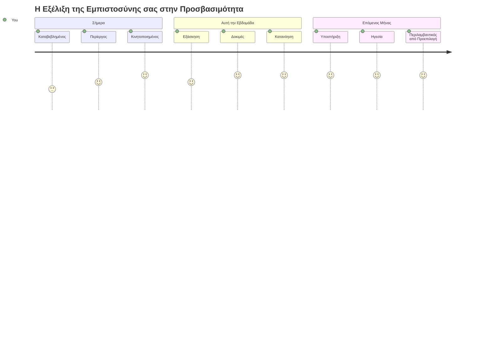
> 🌍 **Είστε τώρα πρωταθλητής προσβασιμότητας!** Κατανοείτε ότι οι εξαιρετικές διαδικτυακές εμπειρίες λειτουργούν για όλους, ανεξάρτητα από το πώς έχουν πρόσβαση στο διαδίκτυο. Κάθε προσβάσιμη λειτουργία που δημιουργείτε κάνει το διαδίκτυο πιο περιεκτικό. Ο ιστός χρειάζεται προγραμματιστές σαν εσάς που βλέπουν την προσβασιμότητα όχι ως περιορισμό, αλλά ως ευκαιρία να δημιουργήσουν καλύτερες εμπειρίες για όλους τους χρήστες. Καλώς ήρθατε στο κίνημα! 🎉

---

<!-- CO-OP TRANSLATOR DISCLAIMER START -->
**Αποποίηση ευθυνών**:  
Αυτό το έγγραφο έχει μεταφραστεί χρησιμοποιώντας υπηρεσία αυτόματης μετάφρασης AI [Co-op Translator](https://github.com/Azure/co-op-translator). Παρόλο που καταβάλλουμε προσπάθειες για ακρίβεια, παρακαλώ λάβετε υπόψη ότι οι αυτόματες μεταφράσεις μπορεί να περιέχουν λάθη ή ανακρίβειες. Το πρωτότυπο έγγραφο στην γλώσσα του θεωρείται η επίσημη πηγή. Για κρίσιμες πληροφορίες, συνιστάται η επαγγελματική ανθρώπινη μετάφραση. Δεν φέρουμε ευθύνη για τυχόν παρεξηγήσεις ή λανθασμένες ερμηνείες που προκύπτουν από τη χρήση αυτής της μετάφρασης.
<!-- CO-OP TRANSLATOR DISCLAIMER END -->