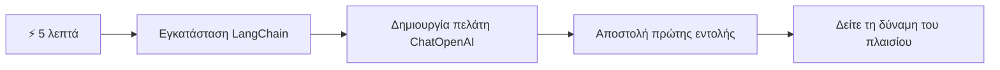
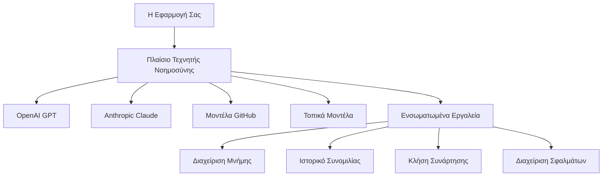
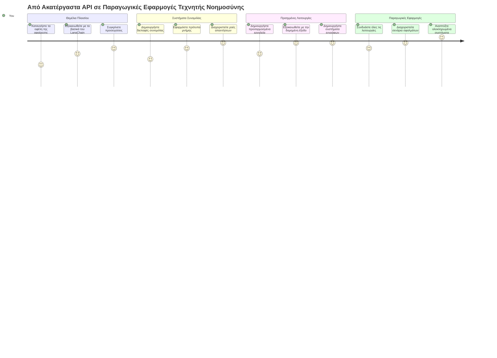
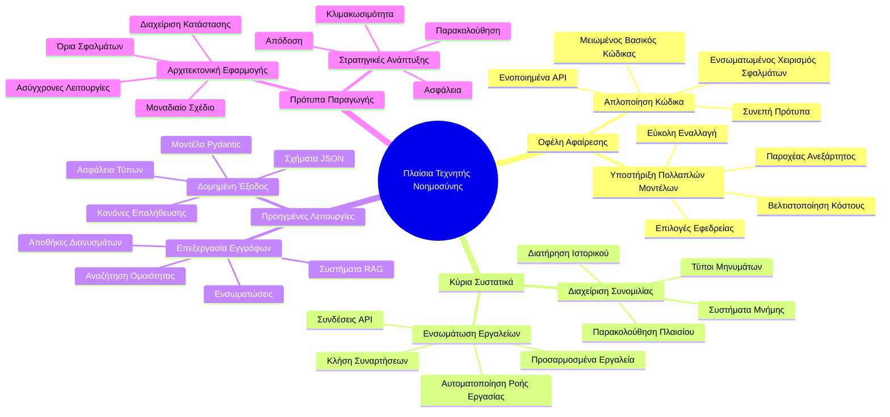
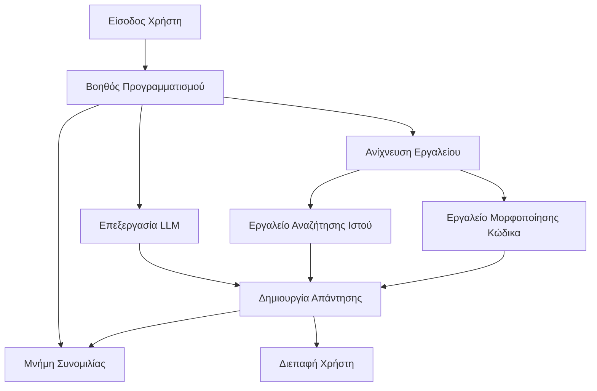
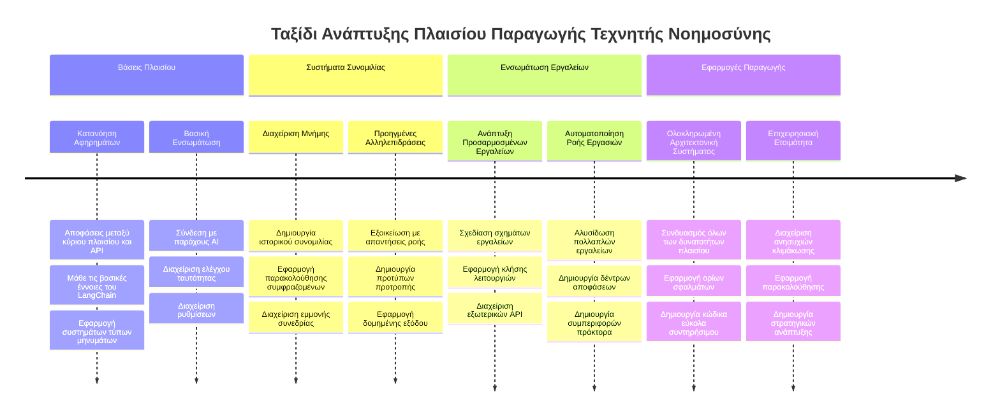
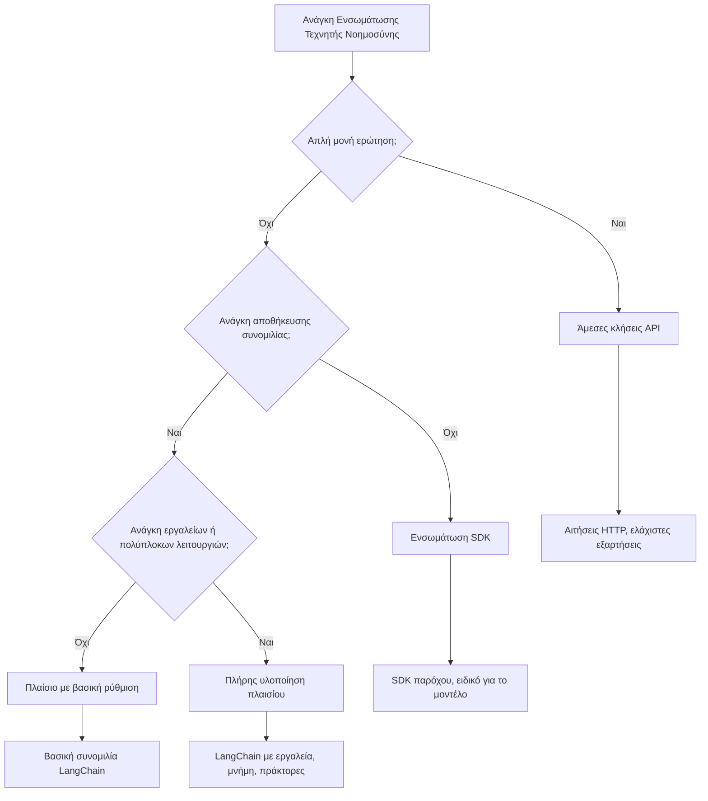

<!--
CO_OP_TRANSLATOR_METADATA:
{
  "original_hash": "3925b6a1c31c60755eaae4d578232c25",
  "translation_date": "2026-01-06T20:08:35+00:00",
  "source_file": "10-ai-framework-project/README.md",
  "language_code": "el"
}
-->
# Πλαίσιο Τεχνητής Νοημοσύνης

Έχετε νιώσει ποτέ καταβεβλημένοι προσπαθώντας να δημιουργήσετε εφαρμογές τεχνητής νοημοσύνης από το μηδέν; Δεν είστε μόνοι! Τα πλαίσια τεχνητής νοημοσύνης είναι σαν να έχετε ένα ελβετικό μαχαίρι για την ανάπτυξη AI - είναι ισχυρά εργαλεία που μπορούν να σας εξοικονομήσουν χρόνο και πονοκεφάλους όταν χτίζετε ευφυείς εφαρμογές. Σκεφτείτε ένα πλαίσιο AI ως μια καλά οργανωμένη βιβλιοθήκη: παρέχει προ-κατασκευασμένα στοιχεία, τυποποιημένα API και έξυπνες αφαιρέσεις ώστε να μπορείτε να εστιάσετε στην επίλυση προβλημάτων αντί να παλεύετε με λεπτομέρειες υλοποίησης.

Σε αυτό το μάθημα, θα εξερευνήσουμε πώς πλαίσια όπως το LangChain μπορούν να μετατρέψουν εργασίες πολύπλοκης ενσωμάτωσης AI σε καθαρό, αναγνώσιμο κώδικα. Θα ανακαλύψετε πώς να αντιμετωπίσετε πραγματικές προκλήσεις όπως η παρακολούθηση συνομιλιών, η υλοποίηση κλήσης εργαλείων και ο χειρισμός διαφόρων μοντέλων AI μέσω μιας ενιαίας διεπαφής.

Μέχρι να ολοκληρώσουμε, θα ξέρετε πότε να προτιμάτε τα πλαίσια αντί για άμεσες κλήσεις API, πώς να χρησιμοποιείτε αποτελεσματικά τις αφαιρέσεις τους και πώς να δημιουργείτε εφαρμογές AI έτοιμες για πραγματική χρήση. Ας εξερευνήσουμε τι μπορούν να κάνουν τα πλαίσια AI για τα έργα σας.

## ⚡ Τι Μπορείτε Να Κάνετε Σε 5 Λεπτά

**Γρήγορος Οδηγός Εκκίνησης για Απασχολημένους Προγραμματιστές**


- **Λεπτό 1**: Εγκαταστήστε το LangChain: `pip install langchain langchain-openai`
- **Λεπτό 2**: Ρυθμίστε το διακριτικό GitHub και εισάγετε τον πελάτη ChatOpenAI
- **Λεπτό 3**: Δημιουργήστε μια απλή συνομιλία με μηνύματα συστήματος και ανθρώπου
- **Λεπτό 4**: Προσθέστε ένα βασικό εργαλείο (όπως μια συνάρτηση πρόσθεσης) και δείτε κλήση εργαλείου AI
- **Λεπτό 5**: Ζήστε τη διαφορά μεταξύ ακατέργαστων κλήσεων API και αφαιρέσεων πλαισίου

**Γρήγορος Κώδικας Δοκιμής**:
```python
from langchain_openai import ChatOpenAI
from langchain_core.messages import SystemMessage, HumanMessage

llm = ChatOpenAI(
    api_key=os.environ["GITHUB_TOKEN"],
    base_url="https://models.github.ai/inference",
    model="openai/gpt-4o-mini"
)

response = llm.invoke([
    SystemMessage(content="You are a helpful coding assistant"),
    HumanMessage(content="Explain Python functions briefly")
])
print(response.content)
```

**Γιατί Αυτό Μετράει**: Σε 5 λεπτά, θα δείτε πώς τα πλαίσια AI μεταμορφώνουν την πολύπλοκη ενσωμάτωση AI σε απλές κλήσεις μεθόδων. Αυτή είναι η βάση που τροφοδοτεί παραγωγικές εφαρμογές AI.

## Γιατί να επιλέξετε πλαίσιο;

Λοιπόν, είστε έτοιμοι να δημιουργήσετε μια εφαρμογή AI - υπέροχα! Αλλά να το θέμα: έχετε διάφορες διαφορετικές διαδρομές που μπορείτε να ακολουθήσετε, και κάθε μία έχει τα δικά της πλεονεκτήματα και μειονεκτήματα. Είναι σαν να διαλέγετε μεταξύ περπατήματος, ποδηλασίας ή οδήγησης για να πάτε κάπου - θα φτάσετε εκεί, αλλά η εμπειρία (και η προσπάθεια) θα είναι εντελώς διαφορετική.

Ας αναλύσουμε τους τρεις βασικούς τρόπους που μπορείτε να ενσωματώσετε AI στα έργα σας:

| Προσέγγιση | Πλεονεκτήματα | Καλύτερα Για | Σκέψεις |
|------------|--------------|--------------|---------|
| **Άμεσες Κλήσεις HTTP** | Πλήρης έλεγχος, χωρίς εξαρτήσεις | Απλές ερωτήσεις, εκμάθηση θεμελίων | Περισσότερος κώδικας, χειροκίνητη διαχείριση σφαλμάτων |
| **Ενσωμάτωση SDK** | Λιγότερο μπούσουλα, βελτιστοποίηση ανά μοντέλο | Εφαρμογές με μονό μοντέλο | Περιορισμένη σε συγκεκριμένους παρόχους |
| **Πλαίσια AI** | Ενοποιημένο API, ενσωματωμένες αφαιρέσεις | Εφαρμογές με πολλά μοντέλα, σύνθετες ροές εργασίας | Καμπύλη μάθησης, πιθανή υπερ-αφαίρεση |

### Οφέλη Πλαισίων στην Πράξη


**Γιατί μετράνε τα πλαίσια:**
- **Ενοποιούν** πολλούς παρόχους AI υπό μία διεπαφή
- **Διαχειρίζονται** αυτόματα τη μνήμη συνομιλίας
- **Παρέχουν** έτοιμα εργαλεία για κοινές εργασίες όπως ενθεματικά και κλήση συναρτήσεων
- **Διαχειρίζονται** τη διαχείριση σφαλμάτων και τη λογική επανάληψης
- **Μετατρέπουν** τις σύνθετες ροές εργασίας σε αναγνώσιμες κλήσεις μεθόδων

> 💡 **Επαγγελματική Συμβουλή**: Χρησιμοποιήστε πλαίσια όταν εναλλάσσεστε μεταξύ διαφορετικών μοντέλων AI ή δημιουργείτε σύνθετες λειτουργίες όπως πράκτορες, μνήμη ή κλήση εργαλείων. Μείνετε στις άμεσες κλήσεις API όταν μαθαίνετε τα βασικά ή δημιουργείτε απλές, εστιασμένες εφαρμογές.

**Εν κατακλείδι**: Όπως διαλέγετε μεταξύ των εξειδικευμένων εργαλείων ενός τεχνίτη και ενός πλήρους εργαστηρίου, το θέμα είναι να ταιριάξετε το εργαλείο με την εργασία. Τα πλαίσια διαπρέπουν σε σύνθετες εφαρμογές με πλούσια χαρακτηριστικά, ενώ τα άμεσα API λειτουργούν καλά για απλές χρήσεις.

## 🗺️ Το Ταξίδι Μάθησης Σας Μέσα από την Εξειδίκευση στα Πλαίσια AI


**Προορισμός Ταξιδιού**: Μέχρι το τέλος αυτού του μαθήματος, θα έχετε κυριαρχήσει στην ανάπτυξη πλαισίων AI και θα μπορείτε να δημιουργείτε εξελιγμένες, παραγωγικές εφαρμογές AI που ανταγωνίζονται τους εμπορικούς βοηθούς AI.

## Εισαγωγή

Σε αυτό το μάθημα, θα μάθουμε να:

- Χρησιμοποιούμε ένα κοινό πλαίσιο AI.
- Αντιμετωπίζουμε κοινά προβλήματα όπως συνομιλίες, χρήση εργαλείων, μνήμη και πλαίσιο.
- Αξιοποιούμε αυτά για να χτίσουμε εφαρμογές AI.

## 🧠 Οικοσύστημα Ανάπτυξης Πλαισίων AI


**Κεντρική Αρχή**: Τα πλαίσια AI αφαιρούν την πολυπλοκότητα ενώ παρέχουν ισχυρές αφαιρέσεις για διαχείριση συνομιλιών, ενσωμάτωση εργαλείων και επεξεργασία εγγράφων, επιτρέποντας στους προγραμματιστές να δημιουργούν εξελιγμένες εφαρμογές AI με καθαρό, συντηρήσιμο κώδικα.

## Η πρώτη σας εντολή AI

Ας ξεκινήσουμε με τα βασικά δημιουργώντας την πρώτη AI εφαρμογή που στέλνει μια ερώτηση και παίρνει μια απάντηση πίσω. Όπως ο Αρχιμήδης που ανακάλυψε την αρχή της άντωσης στο μπανιέρα του, μερικές φορές οι πιο απλές παρατηρήσεις οδηγούν στις πιο ισχυρές ιδέες - και τα πλαίσια κάνουν αυτές τις ιδέες προσβάσιμες.

### Ρύθμιση LangChain με Μοντέλα GitHub

Θα χρησιμοποιήσουμε το LangChain για να συνδεθούμε με Μοντέλα GitHub, που είναι πολύ ωραίο γιατί σας δίνει δωρεάν πρόσβαση σε διάφορα μοντέλα AI. Το καλύτερο; Χρειάζεστε μόνο μερικές απλές παραμέτρους ρύθμισης για να ξεκινήσετε:

```python
from langchain_openai import ChatOpenAI
import os

llm = ChatOpenAI(
    api_key=os.environ["GITHUB_TOKEN"],
    base_url="https://models.github.ai/inference",
    model="openai/gpt-4o-mini",
)

# Στείλτε μια απλή προτροπή
response = llm.invoke("What's the capital of France?")
print(response.content)
```

**Ας αναλύσουμε τι συμβαίνει εδώ:**
- **Δημιουργεί** έναν πελάτη LangChain χρησιμοποιώντας την κλάση `ChatOpenAI` - αυτή είναι η πύλη σας προς το AI!
- **Ρυθμίζει** τη σύνδεση με τα Μοντέλα GitHub με το διακριτικό πρόσβασης σας
- **Καθορίζει** ποιο μοντέλο AI να χρησιμοποιηθεί (`gpt-4o-mini`) - σκεφτείτε το σαν να επιλέγετε τον βοηθό AI σας
- **Στέλνει** την ερώτησή σας χρησιμοποιώντας τη μέθοδο `invoke()` - εδώ γίνεται η μαγεία
- **Εξάγει** και εμφανίζει την απάντηση - και voilà, συνομιλείτε με το AI!

> 🔧 **Σημείωση Ρύθμισης**: Αν χρησιμοποιείτε GitHub Codespaces, είστε τυχεροί - το `GITHUB_TOKEN` έχει ήδη ρυθμιστεί για εσάς! Εργάζεστε τοπικά; Μην ανησυχείτε, απλά χρειάζεται να δημιουργήσετε ένα προσωπικό διακριτικό πρόσβασης με τα κατάλληλα δικαιώματα.

**Αναμενόμενη έξοδος:**
```text
The capital of France is Paris.
```

```mermaid
sequenceDiagram
    participant App as Η Εφαρμογή Python Σας
    participant LC as LangChain
    participant GM as GitHub Models
    participant AI as GPT-4o-mini
    
    App->>LC: llm.invoke("Ποιά είναι η πρωτεύουσα της Γαλλίας;")
    LC->>GM: Αίτημα HTTP με προτροπή
    GM->>AI: Επεξεργασία προτροπής
    AI->>GM: Παραγόμενη απάντηση
    GM->>LC: Επιστροφή απάντησης
    LC->>App: response.content
```
## Δημιουργία συνομιλητικής τεχνητής νοημοσύνης

Το πρώτο παράδειγμα δείχνει τα βασικά, αλλά είναι απλώς μια μονή ανταλλαγή - ρωτάτε μια ερώτηση, παίρνετε μια απάντηση, και τελειώσατε. Σε πραγματικές εφαρμογές, θέλετε το AI σας να θυμάται τι έχετε συζητήσει, όπως ο Watson και ο Holmes που έχτιζαν τις ερευνητικές τους συνομιλίες με την πάροδο του χρόνου.

Εδώ είναι που το LangChain γίνεται ιδιαίτερα χρήσιμο. Παρέχει διαφορετικούς τύπους μηνυμάτων που βοηθούν στη δομή των συνομιλιών και σας επιτρέπουν να δώσετε στο AI σας προσωπικότητα. Θα δημιουργείτε εμπειρίες συνομιλίας που διατηρούν το πλαίσιο και τον χαρακτήρα.

### Κατανόηση των τύπων μηνυμάτων

Σκεφτείτε αυτούς τους τύπους μηνυμάτων ως διαφορετικά «καπέλα» που φοράνε οι συμμετέχοντες σε μια συνομιλία. Το LangChain χρησιμοποιεί διαφορετικές κλάσεις μηνυμάτων για να παρακολουθεί ποιος λέει τι:

| Τύπος Μηνύματος | Σκοπός | Παράδειγμα Χρήσης |
|-----------------|---------|-------------------|
| `SystemMessage` | Ορίζει την προσωπικότητα και συμπεριφορά του AI | "Είστε ένας βοηθητικός βοηθός προγραμματισμού" |
| `HumanMessage` | Αναπαριστά την είσοδο χρήστη | "Εξήγησε πώς δουλεύουν οι συναρτήσεις" |
| `AIMessage` | Αποθηκεύει τις απαντήσεις AI | Προηγούμενες απαντήσεις AI στη συζήτηση |

### Δημιουργία της πρώτης σας συνομιλίας

Ας δημιουργήσουμε μια συνομιλία όπου το AI υποδύεται έναν συγκεκριμένο ρόλο. Θα το κάνουμε να ενσαρκώνει τον Καπετάνιο Πικάρντ - έναν χαρακτήρα γνωστό για τη διπλωματική του σοφία και ηγεσία:

```python
messages = [
    SystemMessage(content="You are Captain Picard of the Starship Enterprise"),
    HumanMessage(content="Tell me about you"),
]
```

**Ανάλυση αυτής της ρύθμισης συνομιλίας:**
- **Καθορίζει** το ρόλο και την προσωπικότητα του AI μέσω του `SystemMessage`
- **Παρέχει** την αρχική ερώτηση χρήστη μέσω του `HumanMessage`
- **Δημιουργεί** θεμέλιο για μια συνομιλία πολλαπλών γύρων

Ο πλήρης κώδικας για αυτό το παράδειγμα είναι ο εξής:

```python
from langchain_core.messages import HumanMessage, SystemMessage
from langchain_openai import ChatOpenAI
import os

llm = ChatOpenAI(
    api_key=os.environ["GITHUB_TOKEN"],
    base_url="https://models.github.ai/inference",
    model="openai/gpt-4o-mini",
)

messages = [
    SystemMessage(content="You are Captain Picard of the Starship Enterprise"),
    HumanMessage(content="Tell me about you"),
]


# λειτουργεί
response  = llm.invoke(messages)
print(response.content)
```

Θα πρέπει να δείτε ένα αποτέλεσμα παρόμοιο με:

```text
I am Captain Jean-Luc Picard, the commanding officer of the USS Enterprise (NCC-1701-D), a starship in the United Federation of Planets. My primary mission is to explore new worlds, seek out new life and new civilizations, and boldly go where no one has gone before. 

I believe in the importance of diplomacy, reason, and the pursuit of knowledge. My crew is diverse and skilled, and we often face challenges that test our resolve, ethics, and ingenuity. Throughout my career, I have encountered numerous species, grappled with complex moral dilemmas, and have consistently sought peaceful solutions to conflicts.

I hold the ideals of the Federation close to my heart, believing in the importance of cooperation, understanding, and respect for all sentient beings. My experiences have shaped my leadership style, and I strive to be a thoughtful and just captain. How may I assist you further?
```

Για να διατηρήσετε τη συνέχεια της συνομιλίας (αντί να επαναφέρετε το πλαίσιο κάθε φορά), πρέπει να συνεχίζετε να προσθέτετε απαντήσεις στη λίστα μηνυμάτων σας. Όπως οι προφορικές παραδόσεις που διατήρησαν ιστορίες ανά γενιές, αυτή η προσέγγιση χτίζει μακροχρόνια μνήμη:

```python
from langchain_core.messages import HumanMessage, SystemMessage
from langchain_openai import ChatOpenAI
import os

llm = ChatOpenAI(
    api_key=os.environ["GITHUB_TOKEN"],
    base_url="https://models.github.ai/inference",
    model="openai/gpt-4o-mini",
)

messages = [
    SystemMessage(content="You are Captain Picard of the Starship Enterprise"),
    HumanMessage(content="Tell me about you"),
]


# λειτουργεί
response  = llm.invoke(messages)

print(response.content)

print("---- Next ----")

messages.append(response)
messages.append(HumanMessage(content="Now that I know about you, I'm Chris, can I be in your crew?"))

response  = llm.invoke(messages)

print(response.content)

```

Πολύ ωραίο, σωστά; Αυτό που συμβαίνει εδώ είναι ότι καλούμε το LLM δύο φορές - πρώτα με τα δύο αρχικά μηνύματά μας, και μετά ξανά με όλο το ιστορικό συνομιλίας. Είναι σαν το AI να παρακολουθεί πραγματικά τη συνομιλία μας!

Όταν τρέξετε αυτόν τον κώδικα, θα πάρετε μια δεύτερη απάντηση που ακούγεται περίπου έτσι:

```text
Welcome aboard, Chris! It's always a pleasure to meet those who share a passion for exploration and discovery. While I cannot formally offer you a position on the Enterprise right now, I encourage you to pursue your aspirations. We are always in need of talented individuals with diverse skills and backgrounds. 

If you are interested in space exploration, consider education and training in the sciences, engineering, or diplomacy. The values of curiosity, resilience, and teamwork are crucial in Starfleet. Should you ever find yourself on a starship, remember to uphold the principles of the Federation: peace, understanding, and respect for all beings. Your journey can lead you to remarkable adventures, whether in the stars or on the ground. Engage!
```

```mermaid
sequenceDiagram
    participant User
    participant App
    participant LangChain
    participant AI
    
    User->>App: "Πες μου για εσένα"
    App->>LangChain: [SystemMessage, HumanMessage]
    LangChain->>AI: Formatted conversation
    AI->>LangChain: Captain Picard response
    LangChain->>App: AIMessage object
    App->>User: Εμφάνιση απάντησης
    
    Note over App: Προσθήκη AIMessage στη συνομιλία
    
    User->>App: "Μπορώ να γίνω μέλος στο πλήρωμά σου;"
    App->>LangChain: [SystemMessage, HumanMessage, AIMessage, HumanMessage]
    LangChain->>AI: Full conversation context
    AI->>LangChain: Contextual response
    LangChain->>App: New AIMessage
    App->>User: Εμφάνιση συμφραζόμενης απάντησης
```
Το παίρνω σαν ένα "ίσως" ;)

## Ροή απαντήσεων (Streaming)

Έχετε παρατηρήσει ποτέ πώς το ChatGPT φαίνεται να «γράφει» τις απαντήσεις του σε πραγματικό χρόνο; Αυτή είναι η ροή σε δράση. Σαν να βλέπετε έναν έμπειρο καλλιγράφο να εργάζεται - βλέποντας τους χαρακτήρες να εμφανίζονταιπάσο πα λογο - αντί να εμφανίζονται στιγμιαία - η ροή κάνει την αλληλεπίδραση πιο φυσική και παρέχει άμεση ανατροφοδότηση.

### Υλοποίηση ροής με LangChain

```python
from langchain_openai import ChatOpenAI
import os

llm = ChatOpenAI(
    api_key=os.environ["GITHUB_TOKEN"],
    base_url="https://models.github.ai/inference",
    model="openai/gpt-4o-mini",
    streaming=True
)

# Ροή της απόκρισης
for chunk in llm.stream("Write a short story about a robot learning to code"):
    print(chunk.content, end="", flush=True)
```

**Γιατί η ροή είναι υπέροχη:**
- **Εμφανίζει** το περιεχόμενο καθώς δημιουργείται - τέλος η αμήχανη αναμονή!
- **Κάνει** τους χρήστες να αισθάνονται ότι κάτι συμβαίνει πραγματικά
- **Φαίνεται** πιο γρήγορο, ακόμα κι αν τεχνικά δεν είναι
- **Αφήνει** τους χρήστες να αρχίσουν να διαβάζουν ενώ το AI «σκέφτεται»

> 💡 **Συμβουλή Εμπειρίας Χρήστη**: Η ροή ξεχωρίζει πραγματικά όταν έχετε να κάνετε με απαντήσεις μεγαλύτερου μήκους όπως εξηγήσεις κώδικα, δημιουργική γραφή ή λεπτομερή εκπαιδευτικά. Οι χρήστες σας θα λατρέψουν να βλέπουν πρόοδο αντί να κοιτάζουν μια κενή οθόνη!

### 🎯 Παιδαγωγικός Έλεγχος: Οφέλη Αφαίρεσης Πλαισίου

**Σταματήστε και Αναλογιστείτε**: Μόλις βιώσατε τη δύναμη των αφαιρέσεων πλαισίων AI. Συγκρίνετε αυτά που μάθατε με τις ακατέργαστες κλήσεις API από προηγούμενα μαθήματα.

**Γρήγορη Αυτο-Αξιολόγηση**:
- Μπορείτε να εξηγήσετε πώς το LangChain απλοποιεί τη διαχείριση συνομιλίας σε σύγκριση με την χειροκίνητη παρακολούθηση μηνυμάτων;
- Ποια είναι η διαφορά μεταξύ των μεθόδων `invoke()` και `stream()` και πότε θα χρησιμοποιούσατε καθεμία;
- Πώς βελτιώνει το σύστημα τύπων μηνυμάτων του πλαισίου την οργάνωση του κώδικα;

**Σύνδεση με τον Πραγματικό Κόσμο**: Τα πρότυπα αφαιρέσεων που μάθατε (τύποι μηνυμάτων, διεπαφές ροής, μνήμη συνομιλίας) χρησιμοποιούνται σε κάθε μεγάλη εφαρμογή AI - από τη διεπαφή του ChatGPT μέχρι τη βοήθεια κώδικα του GitHub Copilot. Κατακτάτε τα ίδια αρχιτεκτονικά πρότυπα που χρησιμοποιούν οι επαγγελματικές ομάδες ανάπτυξης AI.

**Ερώτηση Προκλήσης**: Πώς θα σχεδίαζατε μια αφαίρεση πλαισίου για τη διαχείριση διαφορετικών παρόχων μοντέλων AI (OpenAI, Anthropic, Google) με μια ενιαία διεπαφή; Σκεφτείτε τα οφέλη και τους συμβιβασμούς.

## Πρότυπα προτροπής

Τα πρότυπα προτροπής λειτουργούν όπως οι ρητορικές δομές που χρησιμοποιούνται στην κλασική ρητορική - σκεφτείτε πώς ο Κικέρων προσαρμοζόταν στα πρότυπα ομιλιών για διαφορετικά ακροατήρια διατηρώντας το ίδιο πειστικό πλαίσιο. Σας επιτρέπουν να δημιουργήσετε επαναχρησιμοποιήσιμες προτροπές όπου μπορείτε να εναλλάσσετε διάφορα κομμάτια πληροφορίας χωρίς να ξαναγράφετε τα πάντα από την αρχή. Μόλις ρυθμίσετε το πρότυπο, απλώς συμπληρώνετε τις μεταβλητές με τις τιμές που χρειάζεστε.

### Δημιουργία επαναχρησιμοποιήσιμων προτροπών

```python
from langchain_core.prompts import ChatPromptTemplate

# Ορίστε ένα πρότυπο για τις εξηγήσεις κώδικα
template = ChatPromptTemplate.from_messages([
    ("system", "You are an expert programming instructor. Explain concepts clearly with examples."),
    ("human", "Explain {concept} in {language} with a practical example for {skill_level} developers")
])

# Χρησιμοποιήστε το πρότυπο με διαφορετικές τιμές
questions = [
    {"concept": "functions", "language": "JavaScript", "skill_level": "beginner"},
    {"concept": "classes", "language": "Python", "skill_level": "intermediate"},
    {"concept": "async/await", "language": "JavaScript", "skill_level": "advanced"}
]

for question in questions:
    prompt = template.format_messages(**question)
    response = llm.invoke(prompt)
    print(f"Topic: {question['concept']}\n{response.content}\n---\n")
```

**Γιατί θα λατρέψετε τη χρήση προτύπων:**
- **Διατηρεί** τις προτροπές σας συνεπείς σε όλη την εφαρμογή
- **Τέλος στη** χαοτική σύνδεση συμβολοσειρών - μόνο καθαρές, απλές μεταβλητές
- **Το AI σας** συμπεριφέρεται προβλέψιμα επειδή η δομή παραμένει ίδια
- **Οι ενημερώσεις** είναι παιχνιδάκι - αλλάξτε το πρότυπο μια φορά και διορθώνεται παντού

## Δομημένη έξοδος

Έχετε ποτέ απογοητευτεί προσπαθώντας να αναλύσετε απαντήσεις AI που έρχονται ως αδόμητο κείμενο; Η δομημένη έξοδος είναι σαν να διδάσκετε το AI σας να ακολουθεί τη συστηματική προσέγγιση που χρησιμοποίησε ο Linnaeus για τη βιολογική ταξινόμηση - οργανωμένη, προβλέψιμη και εύκολη στη χρήση. Μπορείτε να ζητήσετε JSON, συγκεκριμένες δομές δεδομένων ή όποια μορφή χρειάζεστε.

### Ορισμός σχημάτων εξόδου

```python
from langchain_core.prompts import ChatPromptTemplate
from langchain_core.output_parsers import JsonOutputParser
from pydantic import BaseModel, Field

class CodeReview(BaseModel):
    score: int = Field(description="Code quality score from 1-10")
    strengths: list[str] = Field(description="List of code strengths")
    improvements: list[str] = Field(description="List of suggested improvements")
    overall_feedback: str = Field(description="Summary feedback")

# Ρυθμίστε τον αναλυτή
parser = JsonOutputParser(pydantic_object=CodeReview)

# Δημιουργήστε το προτροπή με οδηγίες μορφοποίησης
prompt = ChatPromptTemplate.from_messages([
    ("system", "You are a code reviewer. {format_instructions}"),
    ("human", "Review this code: {code}")
])

# Μορφοποιήστε το προτροπή με οδηγίες
chain = prompt | llm | parser

# Λάβετε δομημένη απόκριση
code_sample = """
def calculate_average(numbers):
    return sum(numbers) / len(numbers)
"""

result = chain.invoke({
    "code": code_sample,
    "format_instructions": parser.get_format_instructions()
})

print(f"Score: {result['score']}")
print(f"Strengths: {', '.join(result['strengths'])}")
```

**Γιατί η δομημένη έξοδος κάνει τη διαφορά:**
- **Τέλος στη** μαντεψιά για το σε ποια μορφή θα επιστρέψει - είναι συνεπής κάθε φορά
- **Συνδέεται** απευθείας με τις βάσεις δεδομένων και τα API σας χωρίς επιπλέον δουλειά
- **Εντοπίζει** παράξενες απαντήσεις AI πριν σπάσουν την εφαρμογή σας
- **Κάνει** τον κώδικά σας πιο καθαρό γιατί ξέρετε ακριβώς με τι δουλεύετε

## Κλήση εργαλείων

Τώρα φτάνουμε σε ένα από τα πιο ισχυρά χαρακτηριστικά: τα εργαλεία. Έτσι δίνετε στο AI σας πρακτικές δυνατότητες πέρα από τη συνομιλία. Όπως οι μεσαιωνικές συντεχνίες ανέπτυξαν εξειδικευμένα εργαλεία για συγκεκριμένες τέχνες, μπορείτε να εξοπλίσετε το AI σας με στοχευμένα όργανα. Περιγράφετε ποια εργαλεία είναι διαθέσιμα, και όταν κάποιος ζητήσει κάτι που ταιριάζει, το AI σας μπορεί να δράσει.

### Χρήση Python

Ας προσθέσουμε μερικά εργαλεία έτσι:

```python
from typing_extensions import Annotated, TypedDict

class add(TypedDict):
    """Add two integers."""

    # Οι υποσημειώσεις πρέπει να έχουν τύπο και προαιρετικά μπορούν να περιλαμβάνουν μια προεπιλεγμένη τιμή και περιγραφή (με αυτή τη σειρά).
    a: Annotated[int, ..., "First integer"]
    b: Annotated[int, ..., "Second integer"]

tools = [add]

functions = {
    "add": lambda a, b: a + b
}
```

Τι συμβαίνει εδώ; Δημιουργούμε ένα πρότυπο για ένα εργαλείο που ονομάζεται `add`. Κληρονομώντας από `TypedDict` και χρησιμοποιώντας αυτούς τους κομψούς τύπους `Annotated` για το `a` και το `b`, δίνουμε στο LLM μια σαφή εικόνα τι κάνει αυτό το εργαλείο και τι χρειάζεται. Το λεξικό `functions` είναι σαν το κουτί εργαλείων μας - λέει στον κώδικά μας ακριβώς τι να κάνει όταν το AI αποφασίσει να χρησιμοποιήσει ένα συγκεκριμένο εργαλείο.

Ας δούμε πώς καλούμε το LLM με αυτό το εργαλείο στη συνέχεια:

```python
llm = ChatOpenAI(
    api_key=os.environ["GITHUB_TOKEN"],
    base_url="https://models.github.ai/inference",
    model="openai/gpt-4o-mini",
)

llm_with_tools = llm.bind_tools(tools)
```

Εδώ καλούμε τη `bind_tools` με τον πίνακα `tools` και έτσι το LLM `llm_with_tools` έχει πλέον γνώση αυτού του εργαλείου.

Για να χρησιμοποιήσουμε αυτό το νέο LLM, μπορούμε να γράψουμε τον παρακάτω κώδικα:

```python
query = "What is 3 + 12?"

res = llm_with_tools.invoke(query)
if(res.tool_calls):
    for tool in res.tool_calls:
        print("TOOL CALL: ", functions[tool["name"]](../../../10-ai-framework-project/**tool["args"]))
print("CONTENT: ",res.content)
```

Τώρα που καλούμε το `invoke` σε αυτό το νέο llm που έχει εργαλεία, ίσως η ιδιότητα `tool_calls` είναι γεμάτη. Αν ναι, οποιοδήποτε εντοπισμένο εργαλείο έχει την ιδιότητα `name` και `args` που προσδιορίζουν ποιο εργαλείο πρέπει να κληθεί και με τι ορίσματα. Ο πλήρης κώδικας είναι ο εξής:

```python
from langchain_core.messages import HumanMessage, SystemMessage
from langchain_openai import ChatOpenAI
import os
from typing_extensions import Annotated, TypedDict

class add(TypedDict):
    """Add two integers."""

    # Οι επεξηγήσεις πρέπει να έχουν το τύπο και προαιρετικά μπορούν να περιλαμβάνουν μια προεπιλεγμένη τιμή και περιγραφή (με αυτή τη σειρά).
    a: Annotated[int, ..., "First integer"]
    b: Annotated[int, ..., "Second integer"]

tools = [add]

functions = {
    "add": lambda a, b: a + b
}

llm = ChatOpenAI(
    api_key=os.environ["GITHUB_TOKEN"],
    base_url="https://models.github.ai/inference",
    model="openai/gpt-4o-mini",
)

llm_with_tools = llm.bind_tools(tools)

query = "What is 3 + 12?"

res = llm_with_tools.invoke(query)
if(res.tool_calls):
    for tool in res.tool_calls:
        print("TOOL CALL: ", functions[tool["name"]](../../../10-ai-framework-project/**tool["args"]))
print("CONTENT: ",res.content)
```

Τρέχοντας αυτόν τον κώδικα, θα δείτε έξοδο παρόμοια με:

```text
TOOL CALL:  15
CONTENT: 
```

Το AI εξέτασε το "Τι είναι 3 + 12" και αναγνώρισε αυτό ως εργασία για το εργαλείο `add`. Όπως ένας έμπειρος βιβλιοθηκάριος ξέρει ποια παραπομπή να συμβουλευτεί ανάλογα με τον τύπο της ερώτησης, έκανε αυτή την εκτίμηση από το όνομα, την περιγραφή και τις προδιαγραφές πεδίου του εργαλείου. Το αποτέλεσμα 15 προέρχεται από το λεξικό `functions` που εκτελεί το εργαλείο:

```python
print("TOOL CALL: ", functions[tool["name"]](../../../10-ai-framework-project/**tool["args"]))
```

### Ένα πιο ενδιαφέρον εργαλείο που καλεί ένα web API
Η προσθήκη αριθμών δείχνει την ιδέα, αλλά τα πραγματικά εργαλεία συνήθως εκτελούν πιο σύνθετες εργασίες, όπως η κλήση web APIs. Ας επεκτείνουμε το παράδειγμά μας ώστε το AI να ανακτά περιεχόμενο από το διαδίκτυο - παρόμοια με το πώς οι τηλεγραφητές κάποτε συνέδεαν μακρινές τοποθεσίες:

```python
class joke(TypedDict):
    """Tell a joke."""

    # Οι επεξηγήσεις πρέπει να έχουν τύπο και προαιρετικά μπορούν να περιλαμβάνουν προεπιλεγμένη τιμή και περιγραφή (με αυτήν τη σειρά).
    category: Annotated[str, ..., "The joke category"]

def get_joke(category: str) -> str:
    response = requests.get(f"https://api.chucknorris.io/jokes/random?category={category}", headers={"Accept": "application/json"})
    if response.status_code == 200:
        return response.json().get("value", f"Here's a {category} joke!")
    return f"Here's a {category} joke!"

functions = {
    "add": lambda a, b: a + b,
    "joke": lambda category: get_joke(category)
}

query = "Tell me a joke about animals"

# ο υπόλοιπος κώδικας είναι ο ίδιος
```
  
Τώρα αν τρέξετε αυτόν τον κώδικα θα πάρετε μια απάντηση που λέει κάτι τέτοιο:

```text
TOOL CALL:  Chuck Norris once rode a nine foot grizzly bear through an automatic car wash, instead of taking a shower.
CONTENT:  
```
  
```mermaid
flowchart TD
    A[Ερώτημα Χρήστη: "Πες μου ένα αστείο για ζώα"] --> B[Ανάλυση LangChain]
    B --> C{Διαθέσιμο Εργαλείο;}
    C -->|Ναι| D[Επιλογή εργαλείου αστείου]
    C -->|Όχι| E[Δημιουργία άμεσης απάντησης]
    
    D --> F[Εξαγωγή Παραμέτρων]
    F --> G[Κλήση αστείου(κατηγορία="ζώα")]
    G --> H[Αίτημα API στο chucknorris.io]
    H --> I[Επιστροφή περιεχομένου αστείου]
    I --> J[Εμφάνιση στον χρήστη]
    
    E --> K[Απάντηση που δημιουργείται από AI]
    K --> J
    
    subgraph "Επίπεδο Ορισμού Εργαλείου"
        L[TypedDict Σχήμα]
        M[Υλοποίηση Συνάρτησης]
        N[Επικύρωση Παραμέτρων]
    end
    
    D --> L
    F --> N
    G --> M
```  
Να ο κώδικας στο σύνολό του:

```python
from langchain_openai import ChatOpenAI
import requests
import os
from typing_extensions import Annotated, TypedDict

class add(TypedDict):
    """Add two integers."""

    # Οι σημειώσεις πρέπει να έχουν τον τύπο και μπορούν προαιρετικά να περιλαμβάνουν μια προεπιλεγμένη τιμή και περιγραφή (με αυτή τη σειρά).
    a: Annotated[int, ..., "First integer"]
    b: Annotated[int, ..., "Second integer"]

class joke(TypedDict):
    """Tell a joke."""

    # Οι σημειώσεις πρέπει να έχουν τον τύπο και μπορούν προαιρετικά να περιλαμβάνουν μια προεπιλεγμένη τιμή και περιγραφή (με αυτή τη σειρά).
    category: Annotated[str, ..., "The joke category"]

tools = [add, joke]

def get_joke(category: str) -> str:
    response = requests.get(f"https://api.chucknorris.io/jokes/random?category={category}", headers={"Accept": "application/json"})
    if response.status_code == 200:
        return response.json().get("value", f"Here's a {category} joke!")
    return f"Here's a {category} joke!"

functions = {
    "add": lambda a, b: a + b,
    "joke": lambda category: get_joke(category)
}

llm = ChatOpenAI(
    api_key=os.environ["GITHUB_TOKEN"],
    base_url="https://models.github.ai/inference",
    model="openai/gpt-4o-mini",
)

llm_with_tools = llm.bind_tools(tools)

query = "Tell me a joke about animals"

res = llm_with_tools.invoke(query)
if(res.tool_calls):
    for tool in res.tool_calls:
        # print("ΚΛΗΣΗ ΕΡΓΑΛΕΙΟΥ: ", tool)
        print("TOOL CALL: ", functions[tool["name"]](../../../10-ai-framework-project/**tool["args"]))
print("CONTENT: ",res.content)
```
  
## Ενσωματώσεις και επεξεργασία εγγράφων

Οι ενσωματώσεις (embeddings) αντιπροσωπεύουν μία από τις πιο κομψές λύσεις στη σύγχρονη AI. Φανταστείτε να μπορούσατε να πάρετε οποιοδήποτε κείμενο και να το μετατρέψετε σε αριθμητικές συντεταγμένες που αποτυπώνουν το νόημά του. Αυτό ακριβώς κάνουν οι ενσωματώσεις - μετατρέπουν το κείμενο σε σημεία σε πολυδιάστατο χώρο όπου οι παρόμοιες έννοιες συσσωρεύονται μαζί. Είναι σαν να έχετε ένα σύστημα συντεταγμένων για ιδέες, παρόμοιο με το πώς ο Μεντελέγιεφ οργάνωσε τον περιοδικό πίνακα βάσει ατομικών ιδιοτήτων.

### Δημιουργία και χρήση ενσωματώσεων

```python
from langchain_openai import OpenAIEmbeddings
from langchain_community.vectorstores import FAISS
from langchain_community.document_loaders import TextLoader
from langchain.text_splitter import CharacterTextSplitter

# Αρχικοποίηση ενσωματώσεων
embeddings = OpenAIEmbeddings(
    api_key=os.environ["GITHUB_TOKEN"],
    base_url="https://models.github.ai/inference",
    model="text-embedding-3-small"
)

# Φόρτωση και διαχωρισμός εγγράφων
loader = TextLoader("documentation.txt")
documents = loader.load()

text_splitter = CharacterTextSplitter(chunk_size=1000, chunk_overlap=0)
texts = text_splitter.split_documents(documents)

# Δημιουργία αποθήκης διανυσμάτων
vectorstore = FAISS.from_documents(texts, embeddings)

# Εκτέλεση αναζήτησης ομοιότητας
query = "How do I handle user authentication?"
similar_docs = vectorstore.similarity_search(query, k=3)

for doc in similar_docs:
    print(f"Relevant content: {doc.page_content[:200]}...")
```
  
### Φορτωτές εγγράφων για διάφορες μορφές

```python
from langchain_community.document_loaders import (
    PyPDFLoader,
    CSVLoader,
    JSONLoader,
    WebBaseLoader
)

# Φόρτωση διαφορετικών τύπων εγγράφων
pdf_loader = PyPDFLoader("manual.pdf")
csv_loader = CSVLoader("data.csv")
json_loader = JSONLoader("config.json")
web_loader = WebBaseLoader("https://example.com/docs")

# Επεξεργασία όλων των εγγράφων
all_documents = []
for loader in [pdf_loader, csv_loader, json_loader, web_loader]:
    docs = loader.load()
    all_documents.extend(docs)
```
  
**Τι μπορείτε να κάνετε με τις ενσωματώσεις:**
- **Κατασκευάστε** αναζητήσεις που πραγματικά καταλαβαίνουν τι εννοείτε, όχι απλά αντιστοίχιση λέξεων-κλειδιών  
- **Δημιουργήστε** AI που μπορεί να απαντά σε ερωτήσεις για τα έγγραφά σας  
- **Φτιάξτε** συστήματα προτάσεων που προτείνουν πραγματικά σχετικό περιεχόμενο  
- **Αυτόματη** οργάνωση και κατηγοριοποίηση του περιεχομένου σας  

```mermaid
flowchart LR
    A[Έγγραφα] --> B[Διαχωριστής Κειμένου]
    B --> C[Δημιουργία Ενσωματώσεων]
    C --> D[Αποθήκη Διανυσμάτων]
    
    E[Ερώτημα Χρήστη] --> F[Ενσωμάτωση Ερωτήματος]
    F --> G[Αναζήτηση Ομοιότητας]
    G --> D
    D --> H[Σχετικά Έγγραφα]
    H --> I[Απάντηση ΤΝ]
    
    subgraph "Διανυσματικός Χώρος"
        J[Έγγραφο A: [0.1, 0.8, 0.3...]]
        K[Έγγραφο B: [0.2, 0.7, 0.4...]]
        L[Ερώτημα: [0.15, 0.75, 0.35...]]
    end
    
    C --> J
    C --> K
    F --> L
    G --> J
    G --> K
```  
## Δημιουργία μίας ολοκληρωμένης εφαρμογής AI

Τώρα θα ενσωματώσουμε όλα όσα μάθατε σε μια ολοκληρωμένη εφαρμογή - έναν βοηθό προγραμματισμού που μπορεί να απαντά σε ερωτήσεις, να χρησιμοποιεί εργαλεία και να διατηρεί μνήμη συνομιλίας. Όπως ο τυπογραφικός μηχανισμός συνδύασε υπάρχουσες τεχνολογίες (κινητά στοιχεία, μελάνι, χαρτί, πίεση) σε κάτι μεταμορφωτικό, έτσι θα συνδυάσουμε τα AI στοιχεία μας σε κάτι πρακτικό και χρήσιμο.

### Παράδειγμα ολοκληρωμένης εφαρμογής

```python
from langchain_openai import ChatOpenAI, OpenAIEmbeddings
from langchain_core.prompts import ChatPromptTemplate
from langchain_core.messages import HumanMessage, SystemMessage, AIMessage
from langchain_community.vectorstores import FAISS
from typing_extensions import Annotated, TypedDict
import os
import requests

class CodingAssistant:
    def __init__(self):
        self.llm = ChatOpenAI(
            api_key=os.environ["GITHUB_TOKEN"],
            base_url="https://models.github.ai/inference",
            model="openai/gpt-4o-mini"
        )
        
        self.conversation_history = [
            SystemMessage(content="""You are an expert coding assistant. 
            Help users learn programming concepts, debug code, and write better software.
            Use tools when needed and maintain a helpful, encouraging tone.""")
        ]
        
        # Ορισμός εργαλείων
        self.setup_tools()
    
    def setup_tools(self):
        class web_search(TypedDict):
            """Search for programming documentation or examples."""
            query: Annotated[str, "Search query for programming help"]
        
        class code_formatter(TypedDict):
            """Format and validate code snippets."""
            code: Annotated[str, "Code to format"]
            language: Annotated[str, "Programming language"]
        
        self.tools = [web_search, code_formatter]
        self.llm_with_tools = self.llm.bind_tools(self.tools)
    
    def chat(self, user_input: str):
        # Προσθήκη μηνύματος χρήστη στη συνομιλία
        self.conversation_history.append(HumanMessage(content=user_input))
        
        # Λήψη απάντησης AI
        response = self.llm_with_tools.invoke(self.conversation_history)
        
        # Διαχείριση κλήσεων εργαλείων αν υπάρχουν
        if response.tool_calls:
            for tool_call in response.tool_calls:
                tool_result = self.execute_tool(tool_call)
                print(f"🔧 Tool used: {tool_call['name']}")
                print(f"📊 Result: {tool_result}")
        
        # Προσθήκη απάντησης AI στη συνομιλία
        self.conversation_history.append(response)
        
        return response.content
    
    def execute_tool(self, tool_call):
        tool_name = tool_call['name']
        args = tool_call['args']
        
        if tool_name == 'web_search':
            return f"Found documentation for: {args['query']}"
        elif tool_name == 'code_formatter':
            return f"Formatted {args['language']} code: {args['code'][:50]}..."
        
        return "Tool execution completed"

# Παράδειγμα χρήσης
assistant = CodingAssistant()

print("🤖 Coding Assistant Ready! Type 'quit' to exit.\n")

while True:
    user_input = input("You: ")
    if user_input.lower() == 'quit':
        break
    
    response = assistant.chat(user_input)
    print(f"🤖 Assistant: {response}\n")
```
  
**Αρχιτεκτονική εφαρμογής:**


**Κύρια χαρακτηριστικά που υλοποιήσαμε:**
- **Θυμάται** ολόκληρη την συνομιλία σας για συνεχή πλαισίωση  
- **Εκτελεί ενέργειες** μέσω κλήσης εργαλείων, όχι μόνο συνομιλία  
- **Ακολουθεί** προβλέψιμα μοτίβα αλληλεπίδρασης  
- **Διαχειρίζεται** αυτόματα τη διαχείριση σφαλμάτων και σύνθετες διαδικασίες  

### 🎯 Παιδαγωγικός Έλεγχος: Αρχιτεκτονική Παραγωγικού AI

**Κατανόηση Αρχιτεκτονικής**: Έχετε δημιουργήσει μια ολοκληρωμένη εφαρμογή AI που συνδυάζει διαχείριση συνομιλίας, κλήση εργαλείων και δομημένες ροές εργασίας. Αυτό αντιπροσωπεύει την ανάπτυξη εφαρμογών AI σε επίπεδο παραγωγής.

**Κυριότερες Έννοιες που Έχετε Κατακτήσει**:  
- **Αρχιτεκτονική με Βάση Κλάσεις**: Οργανωμένη, διαχειρίσιμη δομή εφαρμογής AI  
- **Ενσωμάτωση Εργαλείων**: Προσαρμοσμένη λειτουργικότητα πέρα από τη συνομιλία  
- **Διαχείριση Μνήμης**: Διαρκές πλαίσιο συνομιλίας  
- **Διαχείριση Σφαλμάτων**: Ανθεκτική συμπεριφορά εφαρμογής  

**Σύνδεση με τη Βιομηχανία**: Τα πρότυπα αρχιτεκτονικής που υλοποιήσατε (κλάσεις συνομιλίας, συστήματα εργαλείων, διαχείριση μνήμης) είναι τα ίδια που χρησιμοποιούνται σε εταιρικές εφαρμογές AI όπως ο βοηθός AI του Slack, το GitHub Copilot, και το Microsoft Copilot. Δημιουργείτε με επαγγελματική προσέγγιση αρχιτεκτονικής.

**Ερώτηση Αναστοχασμού**: Πώς θα επεκτείνατε αυτή την εφαρμογή για να διαχειριστεί πολλούς χρήστες, επίμονη αποθήκευση ή ενσωμάτωση με εξωτερικές βάσεις δεδομένων; Σκεφτείτε ζητήματα κλιμάκωσης και διαχείρισης καταστάσεων.

## Εργασία: Δημιουργήστε το δικό σας βοηθό με AI για σπουδές

**Στόχος**: Δημιουργήστε μια εφαρμογή AI που βοηθά τους φοιτητές να μαθαίνουν έννοιες προγραμματισμού παρέχοντας εξηγήσεις, παραδείγματα κώδικα και διαδραστικά κουίζ.

### Απαιτήσεις

**Βασικά Χαρακτηριστικά (Απαραίτητα):**  
1. **Διαδραστικό Περιβάλλον**: Υλοποιήστε σύστημα συνομιλίας που διατηρεί πλαίσιο σε πολλές ερωτήσεις  
2. **Εκπαιδευτικά Εργαλεία**: Δημιουργήστε τουλάχιστον δύο εργαλεία που βοηθούν στην μάθηση:  
   - Εργαλείο εξήγησης κώδικα  
   - Γεννήτρια κουίζ για έννοιες  
3. **Προσωποποιημένη Μάθηση**: Χρησιμοποιήστε μηνύματα συστήματος για να προσαρμόζετε απαντήσεις σε διαφορετικά επίπεδα δεξιοτήτων  
4. **Μορφοποίηση Απαντήσεων**: Υλοποιήστε δομημένη έξοδο για τις ερωτήσεις των κουίζ  

### Βήματα Υλοποίησης

**Βήμα 1: Ρυθμίστε το περιβάλλον σας**  
```bash
pip install langchain langchain-openai
```
  
**Βήμα 2: Βασική λειτουργικότητα συνομιλίας**  
- Δημιουργήστε την κλάση `StudyAssistant`  
- Υλοποιήστε μνήμη συνομιλίας  
- Προσθέστε ρύθμιση προσωπικότητας για εκπαιδευτική υποστήριξη  

**Βήμα 3: Προσθέστε εκπαιδευτικά εργαλεία**  
- **Αναλυτής Κώδικα**: Αναλύει κώδικα σε κατανοητά μέρη  
- **Δημιουργός Κουίζ**: Δημιουργεί ερωτήσεις για έννοιες προγραμματισμού  
- **Παρακολούθηση Προόδου**: Καταγράφει τα καλυφθέντα θέματα  

**Βήμα 4: Βελτιωμένα χαρακτηριστικά (Προαιρετικά)**  
- Υλοποίηση ροής απαντήσεων για καλύτερη εμπειρία χρήστη  
- Φόρτωση εγγράφων για ένταξη υλικού μαθήματος  
- Δημιουργία ενσωματώσεων για ανάκτηση περιεχομένου βάσει ομοιότητας  

### Κριτήρια Αξιολόγησης

| Χαρακτηριστικό | Εξαιρετικό (4) | Καλό (3) | Επαρκές (2) | Χρειάζεται Βελτίωση (1) |  
|----------------|----------------|----------|-------------|------------------------|  
| **Ροή Συνομιλίας** | Φυσικές, με επίγνωση πλαισίου απαντήσεις | Καλή διατήρηση πλαισίου | Βασική συνομιλία | Χωρίς μνήμη μεταξύ ανταλλαγών |  
| **Ενσωμάτωση Εργαλείων** | Πολλαπλά χρήσιμα εργαλεία που λειτουργούν απρόσκοπτα | 2+ εργαλεία σωστά υλοποιημένα | 1-2 βασικά εργαλεία | Μη λειτουργικά εργαλεία |  
| **Ποιότητα Κώδικα** | Καθαρός, καλά τεκμηριωμένος, με διαχείριση σφαλμάτων | Καλή δομή, μερική τεκμηρίωση | Βασική λειτουργικότητα | Κακή δομή, χωρίς διαχείριση σφαλμάτων |  
| **Εκπαιδευτική Αξία** | Πραγματικά βοηθητικό για μάθηση, προσαρμοστικό | Καλή υποστήριξη μάθησης | Βασικές εξηγήσεις | Περιορισμένο εκπαιδευτικό όφελος |  

### Δείγμα δομής κώδικα

```python
class StudyAssistant:
    def __init__(self, skill_level="beginner"):
        # Αρχικοποίηση LLM, εργαλείων και μνήμης συνομιλίας
        pass
    
    def explain_code(self, code, language):
        # Εργαλείο: Εξηγήστε πώς λειτουργεί ο κώδικας
        pass
    
    def generate_quiz(self, topic, difficulty):
        # Εργαλείο: Δημιουργία ερωτήσεων εξάσκησης
        pass
    
    def chat(self, user_input):
        # Κύριο περιβάλλον συνομιλίας
        pass

# Παράδειγμα χρήσης
assistant = StudyAssistant(skill_level="intermediate")
response = assistant.chat("Explain how Python functions work")
```
  
**Πρόσθετες Προκλήσεις:**  
- Προσθέστε δυνατότητες φωνητικής εισόδου/εξόδου  
- Υλοποιήστε web interface με Streamlit ή Flask  
- Δημιουργήστε βάση γνώσεων από υλικά μαθήματος χρησιμοποιώντας ενσωματώσεις  
- Προσθέστε παρακολούθηση προόδου και προσωποποιημένες μαθησιακές διαδρομές  

## 📈 Χρονοδιάγραμμα Εξέλιξης Δεξιοτήτων Ανάπτυξης Framework AI


**🎓 Ορόσημο Αποφοίτησης**: Έχετε κατακτήσει την ανάπτυξη πλαισίων AI χρησιμοποιώντας τα ίδια εργαλεία και πρότυπα που τροφοδοτούν τις σύγχρονες εφαρμογές AI. Αυτές οι δεξιότητες αντιπροσωπεύουν την αιχμή της ανάπτυξης εφαρμογών AI και σας προετοιμάζουν για τη δημιουργία συστημάτων ευφυΐας επιπέδου επιχειρήσεων.

**🔄 Δυνατότητες Επόμενου Επιπέδου**:  
- Έτοιμοι να εξερευνήσετε προηγμένες αρχιτεκτονικές AI (agents, multi-agent συστήματα)  
- Προετοιμασμένοι να φτιάξετε RAG συστήματα με βάσεις δεδομένων vector  
- Εξοπλισμένοι για τη δημιουργία πολυμορφικών εφαρμογών AI  
- Θεμέλια για κλιμάκωση και βελτιστοποίηση εφαρμογών AI  

## Περίληψη

🎉 Έχετε πλέον μάθει τα βασικά της ανάπτυξης πλαισίων AI και πώς να δημιουργείτε εξελιγμένες εφαρμογές AI με το LangChain. Όπως η ολοκλήρωση μιας εκτενούς μαθητείας, έχετε αποκτήσει ένα πλούσιο σετ ικανοτήτων. Ας κάνουμε μια ανασκόπηση όσων πετύχατε.

### Τι μάθατε

**Κεντρικές Έννοιες Πλαισίου:**  
- **Οφέλη Πλαισίου**: Κατανόηση πότε να επιλέγουμε frameworks αντί για άμεσες κλήσεις API  
- **Βασικά LangChain**: Ρύθμιση και διαμόρφωση συνδέσεων με AI μοντέλα  
- **Τύποι Μηνυμάτων**: Χρήση `SystemMessage`, `HumanMessage`, και `AIMessage` για δομημένες συνομιλίες  

**Προχωρημένα Χαρακτηριστικά:**  
- **Κλήση Εργαλείων**: Δημιουργία και ενσωμάτωση προσαρμοσμένων εργαλείων για βελτιωμένες λειτουργίες AI  
- **Μνήμη Συνομιλίας**: Διατήρηση πλαισίου σε πολλαπλούς γύρους συνομιλίας  
- **Ροή Απαντήσεων**: Υλοποίηση παροχής απαντήσεων σε πραγματικό χρόνο  
- **Prompt Templates**: Δημιουργία επαναχρησιμοποιήσιμων, δυναμικών προτροπών  
- **Δομημένη Έξοδος**: Εξασφάλιση συνεπούς, αναλυτής-φιλικών απαντήσεων  
- **Ενσωματώσεις**: Δημιουργία λειτουργιών σημασιολογικής αναζήτησης και επεξεργασίας εγγράφων  

**Πρακτικές Εφαρμογές:**  
- **Κατασκευή Ολοκληρωμένων Εφαρμογών**: Συνδυασμός πολλαπλών χαρακτηριστικών σε εφαρμογές έτοιμες για παραγωγή  
- **Διαχείριση Σφαλμάτων**: Υλοποίηση ανθεκτικής διαχείρισης και επαλήθευσης  
- **Ενσωμάτωση Εργαλείων**: Δημιουργία προσαρμοσμένων εργαλείων που επεκτείνουν τις δυνατότητες AI  

### Κύρια συμπεράσματα

> 🎯 **Να θυμάστε**: Τα frameworks AI όπως το LangChain είναι ουσιαστικά οι πολύτιμοι βοηθοί που κρύβουν την πολυπλοκότητα και είναι γεμάτοι δυνατότητες. Είναι τέλεια όταν χρειάζεστε μνήμη συνομιλίας, κλήση εργαλείων ή θέλετε να δουλέψετε με πολλαπλά AI μοντέλα χωρίς να χάσετε την ψυχραιμία σας.

**Πλαίσιο απόφασης για ενσωμάτωση AI:**


### Πού να πάτε από εδώ;

**Ξεκινήστε να φτιάχνετε τώρα:**  
- Πάρτε αυτές τις έννοιες και φτιάξτε κάτι που σας ενθουσιάζει!  
- Παίξτε με διάφορα AI μοντέλα μέσω LangChain - είναι σαν παιδότοπος μοντέλων AI  
- Δημιουργήστε εργαλεία που λύνουν πραγματικά προβλήματα που συναντάτε στη δουλειά ή τα έργα σας  

**Έτοιμοι για το επόμενο επίπεδο;**  
- **AI Agents**: Δημιουργήστε συστήματα AI που μπορούν πραγματικά να σχεδιάζουν και να εκτελούν σύνθετες εργασίες μόνα τους  
- **RAG (Retrieval-Augmented Generation)**: Συνδυάστε AI με τις δικές σας βάσεις γνώσης για υπερδυναμικές εφαρμογές  
- **Πολυμορφικό AI**: Δουλέψτε με κείμενο, εικόνες, ήχο μαζί - οι δυνατότητες είναι ατελείωτες!  
- **Παραγωγική Ανάπτυξη**: Μάθετε πώς να κλιμακώνετε τις εφαρμογές AI σας και να τις παρακολουθείτε στο πραγματικό περιβάλλον  

**Ενταχθείτε στην κοινότητα:**  
- Η κοινότητα LangChain είναι εξαιρετική για να παραμένετε ενημερωμένοι και να μαθαίνετε βέλτιστες πρακτικές  
- Το GitHub Models σας δίνει πρόσβαση σε αιχμής δυνατότητες AI - τέλειο για πειραματισμούς  
- Συνεχίστε να εξασκείστε με διαφορετικές περιπτώσεις χρήσης - κάθε έργο θα σας μάθει κάτι καινούργιο  

Τώρα έχετε τη γνώση να κατασκευάσετε ευφυείς, συνομιλιακές εφαρμογές που βοηθούν ανθρώπους να λύσουν πραγματικά προβλήματα. Όπως οι τεχνίτες της Αναγέννησης που συνδύασαν καλλιτεχνικό όραμα με τεχνική δεξιότητα, έτσι μπορείτε τώρα να συνδυάσετε δυνατότητες AI με πρακτική εφαρμογή. Η ερώτηση είναι: τι θα δημιουργήσετε; 🚀

## Πρόκληση GitHub Copilot Agent 🚀

Χρησιμοποιήστε τη λειτουργία Agent για να ολοκληρώσετε την ακόλουθη πρόκληση:

**Περιγραφή:** Δημιουργήστε έναν προηγμένο βοηθό ανασκόπησης κώδικα με AI που συνδυάζει πολλαπλά χαρακτηριστικά LangChain, συμπεριλαμβανομένης της κλήσης εργαλείων, δομημένης εξόδου και μνήμης συνομιλίας, για να παρέχει ολοκληρωμένη ανατροφοδότηση σε υποβολές κώδικα.

**Προτροπή:** Δημιουργήστε την κλάση CodeReviewAssistant που υλοποιεί:  
1. Εργαλείο ανάλυσης πολυπλοκότητας κώδικα και προτάσεων βελτίωσης  
2. Εργαλείο ελέγχου κώδικα με βάση βέλτιστες πρακτικές  
3. Δομημένη έξοδο χρησιμοποιώντας Pydantic μοντέλα για συνεπή μορφή ανασκόπησης  
4. Μνήμη συνομιλίας για παρακολούθηση συνεδριών ανασκόπησης  
5. Κύριο περιβάλλον συνομιλίας που διαχειρίζεται υποβολές κώδικα και παρέχει λεπτομερείς, εφαρμόσιμες ανατροφοδοτήσεις  

Ο βοηθός πρέπει να μπορεί να ανασκοπεί κώδικα σε πολλαπλές γλώσσες προγραμματισμού, να διατηρεί το πλαίσιο σε πολλαπλές υποβολές κατά τη διάρκεια συνεδρίας και να παρέχει τόσο συνοπτικές βαθμολογίες όσο και λεπτομερείς προτάσεις βελτίωσης.

Μάθετε περισσότερα για το [agent mode](https://code.visualstudio.com/blogs/2025/02/24/introducing-copilot-agent-mode) εδώ.

---

<!-- CO-OP TRANSLATOR DISCLAIMER START -->
**Αποποίηση ευθυνών**:  
Αυτό το έγγραφο έχει μεταφραστεί χρησιμοποιώντας την υπηρεσία μετάφρασης με τεχνητή νοημοσύνη [Co-op Translator](https://github.com/Azure/co-op-translator). Παρόλο που προσπαθούμε για ακρίβεια, παρακαλούμε να λάβετε υπόψη ότι οι αυτόματες μεταφράσεις ενδέχεται να περιέχουν σφάλματα ή ανακρίβειες. Το πρωτότυπο έγγραφο στη μητρική του γλώσσα πρέπει να θεωρείται η αυθεντική πηγή. Για κρίσιμες πληροφορίες, συνιστάται η επαγγελματική ανθρώπινη μετάφραση. Δεν φέρουμε ευθύνη για οποιεσδήποτε παρεξηγήσεις ή λανθασμένες ερμηνείες που προκύπτουν από τη χρήση αυτής της μετάφρασης.
<!-- CO-OP TRANSLATOR DISCLAIMER END -->