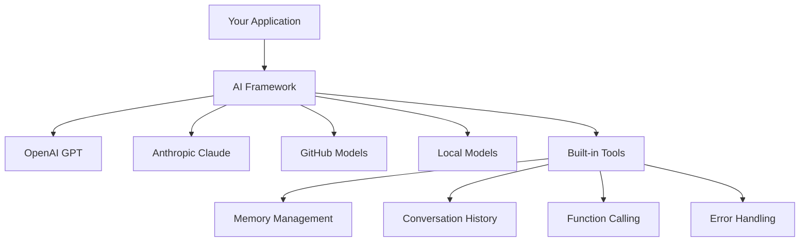
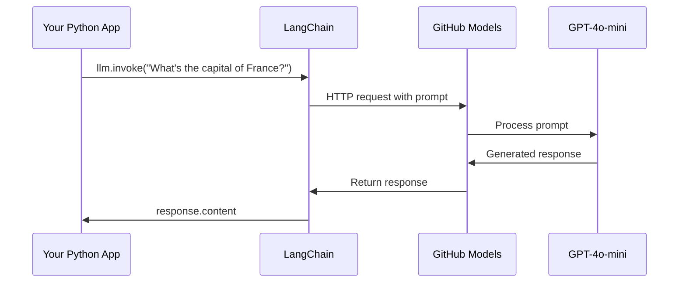
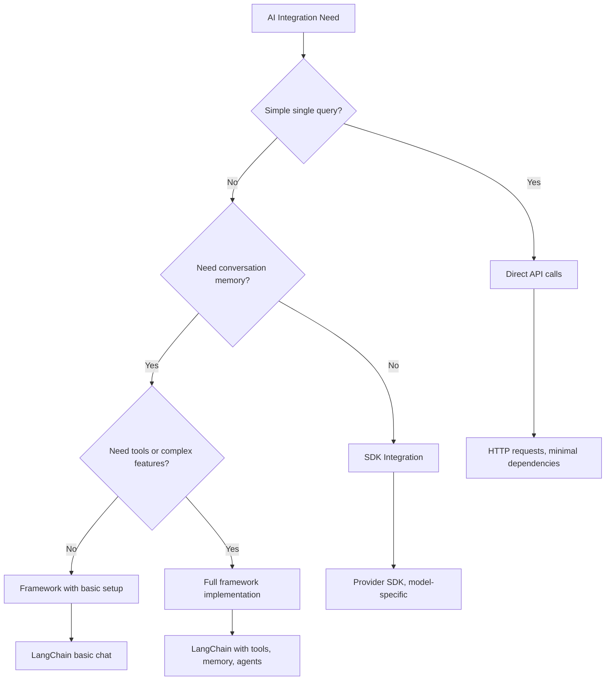

<!--
CO_OP_TRANSLATOR_METADATA:
{
  "original_hash": "e2c4ae5688e34b4b8b09d52aec56c79e",
  "translation_date": "2025-10-23T20:10:11+00:00",
  "source_file": "10-ai-framework-project/README.md",
  "language_code": "el"
}
-->
# Πλαίσιο AI

Έχετε νιώσει ποτέ ότι σας κατακλύζει η προσπάθεια να δημιουργήσετε εφαρμογές AI από την αρχή; Δεν είστε μόνοι! Τα πλαίσια AI είναι σαν να έχετε έναν πολυλειτουργικό σουγιά για την ανάπτυξη AI - είναι ισχυρά εργαλεία που μπορούν να σας εξοικονομήσουν χρόνο και πονοκεφάλους όταν δημιουργείτε έξυπνες εφαρμογές. Σκεφτείτε ένα πλαίσιο AI σαν μια καλά οργανωμένη βιβλιοθήκη: παρέχει προκατασκευασμένα στοιχεία, τυποποιημένα APIs και έξυπνες αφαιρέσεις, ώστε να μπορείτε να εστιάσετε στην επίλυση προβλημάτων αντί να παλεύετε με τις λεπτομέρειες υλοποίησης.

Σε αυτό το μάθημα, θα εξερευνήσουμε πώς πλαίσια όπως το LangChain μπορούν να μετατρέψουν τις πολύπλοκες εργασίες ενσωμάτωσης AI σε καθαρό, ευανάγνωστο κώδικα. Θα ανακαλύψετε πώς να αντιμετωπίσετε προκλήσεις του πραγματικού κόσμου, όπως η παρακολούθηση συνομιλιών, η υλοποίηση κλήσεων εργαλείων και η διαχείριση διαφορετικών μοντέλων AI μέσω μιας ενιαίας διεπαφής.

Μέχρι να τελειώσουμε, θα ξέρετε πότε να χρησιμοποιείτε πλαίσια αντί για απλές κλήσεις API, πώς να χρησιμοποιείτε αποτελεσματικά τις αφαιρέσεις τους και πώς να δημιουργείτε εφαρμογές AI έτοιμες για χρήση στον πραγματικό κόσμο. Ας εξερευνήσουμε τι μπορούν να κάνουν τα πλαίσια AI για τα έργα σας.

## Γιατί να επιλέξετε ένα πλαίσιο;

Είστε έτοιμοι να δημιουργήσετε μια εφαρμογή AI - υπέροχα! Αλλά να το θέμα: έχετε αρκετές διαφορετικές επιλογές και η καθεμία έχει τα δικά της πλεονεκτήματα και μειονεκτήματα. Είναι σαν να επιλέγετε μεταξύ περπατήματος, ποδηλασίας ή οδήγησης για να φτάσετε κάπου - όλες θα σας φτάσουν εκεί, αλλά η εμπειρία (και η προσπάθεια) θα είναι εντελώς διαφορετική.

Ας αναλύσουμε τους τρεις κύριους τρόπους με τους οποίους μπορείτε να ενσωματώσετε το AI στα έργα σας:

| Προσέγγιση | Πλεονεκτήματα | Καλύτερο για | Σκέψεις |
|-----------|---------------|--------------|---------|
| **Άμεσες αιτήσεις HTTP** | Πλήρης έλεγχος, χωρίς εξαρτήσεις | Απλά ερωτήματα, εκμάθηση βασικών | Περισσότερος κώδικας, χειροκίνητος χειρισμός σφαλμάτων |
| **Ενσωμάτωση SDK** | Λιγότερος κώδικας, βελτιστοποίηση για συγκεκριμένα μοντέλα | Εφαρμογές με ένα μοντέλο | Περιορισμένο σε συγκεκριμένους παρόχους |
| **Πλαίσια AI** | Ενιαίο API, ενσωματωμένες αφαιρέσεις | Εφαρμογές πολλαπλών μοντέλων, σύνθετες ροές εργασίας | Καμπύλη εκμάθησης, πιθανή υπερβολική αφαίρεση |

### Οφέλη των πλαισίων στην πράξη



**Γιατί είναι σημαντικά τα πλαίσια:**
- **Ενοποιούν** πολλούς παρόχους AI κάτω από μία διεπαφή
- **Διαχειρίζονται** αυτόματα τη μνήμη συνομιλίας
- **Παρέχουν** έτοιμα εργαλεία για κοινές εργασίες όπως embeddings και κλήσεις λειτουργιών
- **Διαχειρίζονται** τον χειρισμό σφαλμάτων και τη λογική επαναπροσπάθειας
- **Μετατρέπουν** σύνθετες ροές εργασίας σε ευανάγνωστες κλήσεις μεθόδων

> 💡 **Συμβουλή**: Χρησιμοποιήστε πλαίσια όταν εναλλάσσεστε μεταξύ διαφορετικών μοντέλων AI ή δημιουργείτε σύνθετες λειτουργίες όπως agents, μνήμη ή κλήσεις εργαλείων. Επιμείνετε στις άμεσες κλήσεις API όταν μαθαίνετε τα βασικά ή δημιουργείτε απλές, εστιασμένες εφαρμογές.

**Συμπέρασμα**: Όπως η επιλογή μεταξύ εξειδικευμένων εργαλείων ενός τεχνίτη και ενός πλήρους εργαστηρίου, όλα εξαρτώνται από την εργασία. Τα πλαίσια υπερέχουν για σύνθετες, πλούσιες σε λειτουργίες εφαρμογές, ενώ οι άμεσες κλήσεις API λειτουργούν καλά για απλές περιπτώσεις χρήσης.

## Εισαγωγή

Σε αυτό το μάθημα, θα μάθουμε να:

- Χρησιμοποιούμε ένα κοινό πλαίσιο AI.
- Αντιμετωπίζουμε κοινά προβλήματα όπως συνομιλίες, χρήση εργαλείων, μνήμη και πλαίσιο.
- Εκμεταλλευόμαστε αυτά για να δημιουργήσουμε εφαρμογές AI.

## Η πρώτη σας προτροπή AI

Ας ξεκινήσουμε με τα βασικά δημιουργώντας την πρώτη σας εφαρμογή AI που στέλνει μια ερώτηση και λαμβάνει μια απάντηση. Όπως ο Αρχιμήδης που ανακάλυψε την αρχή της άνωσης στο μπάνιο του, μερικές φορές οι πιο απλές παρατηρήσεις οδηγούν στις πιο ισχυρές ιδέες - και τα πλαίσια κάνουν αυτές τις ιδέες προσβάσιμες.

### Ρύθμιση του LangChain με μοντέλα GitHub

Θα χρησιμοποιήσουμε το LangChain για να συνδεθούμε με μοντέλα GitHub, κάτι που είναι αρκετά ωραίο γιατί σας δίνει δωρεάν πρόσβαση σε διάφορα μοντέλα AI. Το καλύτερο μέρος; Χρειάζεστε μόνο μερικές απλές παραμέτρους διαμόρφωσης για να ξεκινήσετε:

```python
from langchain_openai import ChatOpenAI
import os

llm = ChatOpenAI(
    api_key=os.environ["GITHUB_TOKEN"],
    base_url="https://models.github.ai/inference",
    model="openai/gpt-4o-mini",
)

# Send a simple prompt
response = llm.invoke("What's the capital of France?")
print(response.content)
```

**Ας αναλύσουμε τι συμβαίνει εδώ:**
- **Δημιουργεί** έναν πελάτη LangChain χρησιμοποιώντας την κλάση `ChatOpenAI` - αυτή είναι η πύλη σας προς το AI!
- **Διαμορφώνει** τη σύνδεση με τα μοντέλα GitHub με το διακριτικό πιστοποίησης σας
- **Καθορίζει** ποιο μοντέλο AI θα χρησιμοποιηθεί (`gpt-4o-mini`) - σκεφτείτε το σαν να επιλέγετε τον βοηθό σας AI
- **Στέλνει** την ερώτησή σας χρησιμοποιώντας τη μέθοδο `invoke()` - εδώ συμβαίνει η μαγεία
- **Εξάγει** και εμφανίζει την απάντηση - και voilà, συνομιλείτε με το AI!

> 🔧 **Σημείωση Ρύθμισης**: Αν χρησιμοποιείτε το GitHub Codespaces, είστε τυχεροί - το `GITHUB_TOKEN` έχει ήδη ρυθμιστεί για εσάς! Εργάζεστε τοπικά; Μην ανησυχείτε, απλά θα χρειαστεί να δημιουργήσετε ένα προσωπικό διακριτικό πρόσβασης με τις σωστές άδειες.

**Αναμενόμενο αποτέλεσμα:**
```text
The capital of France is Paris.
```



## Δημιουργία συνομιλητικού AI

Το πρώτο παράδειγμα δείχνει τα βασικά, αλλά είναι μόνο μια απλή ανταλλαγή - κάνετε μια ερώτηση, λαμβάνετε μια απάντηση, και αυτό είναι όλο. Στις πραγματικές εφαρμογές, θέλετε το AI σας να θυμάται τι συζητάτε, όπως ο Watson και ο Holmes που έχτιζαν τις ερευνητικές τους συνομιλίες με την πάροδο του χρόνου.

Εδώ το LangChain γίνεται ιδιαίτερα χρήσιμο. Παρέχει διαφορετικούς τύπους μηνυμάτων που βοηθούν στη δομή των συνομιλιών και σας επιτρέπουν να δώσετε στο AI σας μια προσωπικότητα. Θα δημιουργείτε εμπειρίες συνομιλίας που διατηρούν το πλαίσιο και τον χαρακτήρα.

### Κατανόηση τύπων μηνυμάτων

Σκεφτείτε αυτούς τους τύπους μηνυμάτων σαν διαφορετικά "καπέλα" που φορούν οι συμμετέχοντες σε μια συνομιλία. Το LangChain χρησιμοποιεί διαφορετικές κλάσεις μηνυμάτων για να παρακολουθεί ποιος λέει τι:

| Τύπος Μηνύματος | Σκοπός | Παράδειγμα Χρήσης |
|-----------------|--------|------------------|
| `SystemMessage` | Ορίζει την προσωπικότητα και τη συμπεριφορά του AI | "Είστε ένας βοηθητικός βοηθός προγραμματισμού" |
| `HumanMessage` | Αντιπροσωπεύει την είσοδο του χρήστη | "Εξήγησε πώς λειτουργούν οι συναρτήσεις" |
| `AIMessage` | Αποθηκεύει τις απαντήσεις του AI | Προηγούμενες απαντήσεις AI στη συνομιλία |

### Δημιουργία της πρώτης σας συνομιλίας

Ας δημιουργήσουμε μια συνομιλία όπου το AI μας αναλαμβάνει έναν συγκεκριμένο ρόλο. Θα το κάνουμε να ενσαρκώσει τον Captain Picard - έναν χαρακτήρα γνωστό για τη διπλωματική σοφία και την ηγεσία του:

```python
messages = [
    SystemMessage(content="You are Captain Picard of the Starship Enterprise"),
    HumanMessage(content="Tell me about you"),
]
```

**Ανάλυση αυτής της ρύθμισης συνομιλίας:**
- **Καθορίζει** τον ρόλο και την προσωπικότητα του AI μέσω του `SystemMessage`
- **Παρέχει** το αρχικό ερώτημα του χρήστη μέσω του `HumanMessage`
- **Δημιουργεί** μια βάση για συνομιλία πολλαπλών γύρων

Ο πλήρης κώδικας για αυτό το παράδειγμα μοιάζει με τον εξής:

```python
from langchain_core.messages import HumanMessage, SystemMessage
from langchain_openai import ChatOpenAI
import os

llm = ChatOpenAI(
    api_key=os.environ["GITHUB_TOKEN"],
    base_url="https://models.github.ai/inference",
    model="openai/gpt-4o-mini",
)

messages = [
    SystemMessage(content="You are Captain Picard of the Starship Enterprise"),
    HumanMessage(content="Tell me about you"),
]


# works
response  = llm.invoke(messages)
print(response.content)
```

Θα δείτε ένα αποτέλεσμα παρόμοιο με:

```text
I am Captain Jean-Luc Picard, the commanding officer of the USS Enterprise (NCC-1701-D), a starship in the United Federation of Planets. My primary mission is to explore new worlds, seek out new life and new civilizations, and boldly go where no one has gone before. 

I believe in the importance of diplomacy, reason, and the pursuit of knowledge. My crew is diverse and skilled, and we often face challenges that test our resolve, ethics, and ingenuity. Throughout my career, I have encountered numerous species, grappled with complex moral dilemmas, and have consistently sought peaceful solutions to conflicts.

I hold the ideals of the Federation close to my heart, believing in the importance of cooperation, understanding, and respect for all sentient beings. My experiences have shaped my leadership style, and I strive to be a thoughtful and just captain. How may I assist you further?
```

Για να διατηρήσετε τη συνέχεια της συνομιλίας (αντί να επαναφέρετε το πλαίσιο κάθε φορά), πρέπει να συνεχίσετε να προσθέτετε απαντήσεις στη λίστα μηνυμάτων σας. Όπως οι προφορικές παραδόσεις που διατηρούσαν ιστορίες ανά τις γενιές, αυτή η προσέγγιση δημιουργεί μνήμη που διαρκεί:

```python
from langchain_core.messages import HumanMessage, SystemMessage
from langchain_openai import ChatOpenAI
import os

llm = ChatOpenAI(
    api_key=os.environ["GITHUB_TOKEN"],
    base_url="https://models.github.ai/inference",
    model="openai/gpt-4o-mini",
)

messages = [
    SystemMessage(content="You are Captain Picard of the Starship Enterprise"),
    HumanMessage(content="Tell me about you"),
]


# works
response  = llm.invoke(messages)

print(response.content)

print("---- Next ----")

messages.append(response)
messages.append(HumanMessage(content="Now that I know about you, I'm Chris, can I be in your crew?"))

response  = llm.invoke(messages)

print(response.content)

```

Αρκετά εντυπωσιακό, σωστά; Αυτό που συμβαίνει εδώ είναι ότι καλούμε το LLM δύο φορές - πρώτα με μόνο τα αρχικά δύο μηνύματα, αλλά μετά ξανά με όλο το ιστορικό συνομιλίας. Είναι σαν το AI να παρακολουθεί πραγματικά τη συνομιλία μας!

Όταν εκτελέσετε αυτόν τον κώδικα, θα λάβετε μια δεύτερη απάντηση που ακούγεται κάπως έτσι:

```text
Welcome aboard, Chris! It's always a pleasure to meet those who share a passion for exploration and discovery. While I cannot formally offer you a position on the Enterprise right now, I encourage you to pursue your aspirations. We are always in need of talented individuals with diverse skills and backgrounds. 

If you are interested in space exploration, consider education and training in the sciences, engineering, or diplomacy. The values of curiosity, resilience, and teamwork are crucial in Starfleet. Should you ever find yourself on a starship, remember to uphold the principles of the Federation: peace, understanding, and respect for all beings. Your journey can lead you to remarkable adventures, whether in the stars or on the ground. Engage!
```

Θα το θεωρήσω ως ίσως ;)

## Ροές απαντήσεων

Έχετε παρατηρήσει ποτέ πώς το ChatGPT φαίνεται να "πληκτρολογεί" τις απαντήσεις του σε πραγματικό χρόνο; Αυτή είναι η ροή σε δράση. Σαν να παρακολουθείτε έναν επιδέξιο καλλιγράφο να εργάζεται - βλέποντας τους χαρακτήρες να εμφανίζονται χτύπημα προς χτύπημα αντί να υλοποιούνται στιγμιαία - η ροή κάνει την αλληλεπίδραση να φαίνεται πιο φυσική και παρέχει άμεση ανατροφοδότηση.

### Υλοποίηση ροής με το LangChain

```python
from langchain_openai import ChatOpenAI
import os

llm = ChatOpenAI(
    api_key=os.environ["GITHUB_TOKEN"],
    base_url="https://models.github.ai/inference",
    model="openai/gpt-4o-mini",
    streaming=True
)

# Stream the response
for chunk in llm.stream("Write a short story about a robot learning to code"):
    print(chunk.content, end="", flush=True)
```

**Γιατί η ροή είναι καταπληκτική:**
- **Εμφανίζει** περιεχόμενο καθώς δημιουργείται - τέλος η αμήχανη αναμονή!
- **Κάνει** τους χρήστες να αισθάνονται ότι κάτι συμβαίνει πραγματικά
- **Φαίνεται** πιο γρήγορη, ακόμα κι αν τεχνικά δεν είναι
- **Επιτρέπει** στους χρήστες να αρχίσουν να διαβάζουν ενώ το AI ακόμα "σκέφτεται"

> 💡 **Συμβουλή Εμπειρίας Χρήστη**: Η ροή πραγματικά λάμπει όταν ασχολείστε με μεγαλύτερες απαντήσεις όπως εξηγήσεις κώδικα, δημιουργική γραφή ή λεπτομερή μαθήματα. Οι χρήστες σας θα λατρέψουν να βλέπουν πρόοδο αντί να κοιτάζουν μια κενή οθόνη!

## Πρότυπα προτροπών

Τα πρότυπα προτροπών λειτουργούν σαν τις ρητορικές δομές που χρησιμοποιούνται στην κλασική ρητορική - σκεφτείτε πώς ο Κικέρων θα προσαρμόζε
3. **Εξατομικευμένη Μάθηση**: Χρησιμοποιήστε μηνύματα συστήματος για να προσαρμόσετε τις απαντήσεις σε διαφορετικά επίπεδα δεξιοτήτων  
4. **Μορφοποίηση Απαντήσεων**: Εφαρμόστε δομημένη έξοδο για ερωτήσεις κουίζ  

### Βήματα Υλοποίησης  

**Βήμα 1: Ρύθμιση του περιβάλλοντος σας**  
```bash
pip install langchain langchain-openai
```
  
**Βήμα 2: Βασική λειτουργικότητα συνομιλίας**  
- Δημιουργήστε μια κλάση `StudyAssistant`  
- Υλοποιήστε μνήμη συνομιλίας  
- Προσθέστε διαμόρφωση προσωπικότητας για εκπαιδευτική υποστήριξη  

**Βήμα 3: Προσθέστε εκπαιδευτικά εργαλεία**  
- **Επεξήγηση Κώδικα**: Αναλύει τον κώδικα σε κατανοητά μέρη  
- **Δημιουργός Κουίζ**: Δημιουργεί ερωτήσεις για έννοιες προγραμματισμού  
- **Παρακολούθηση Προόδου**: Παρακολουθεί τα θέματα που έχουν καλυφθεί  

**Βήμα 4: Ενισχυμένες δυνατότητες (Προαιρετικό)**  
- Υλοποιήστε ροή απαντήσεων για καλύτερη εμπειρία χρήστη  
- Προσθέστε φόρτωση εγγράφων για ενσωμάτωση εκπαιδευτικού υλικού  
- Δημιουργήστε embeddings για ανάκτηση περιεχομένου βάσει ομοιότητας  

### Κριτήρια Αξιολόγησης  

| Δυνατότητα | Εξαιρετική (4) | Καλή (3) | Ικανοποιητική (2) | Χρειάζεται Βελτίωση (1) |  
|------------|----------------|----------|-------------------|-------------------------|  
| **Ροή Συνομιλίας** | Φυσικές, ευαισθητοποιημένες απαντήσεις | Καλή διατήρηση του πλαισίου | Βασική συνομιλία | Καμία μνήμη μεταξύ ανταλλαγών |  
| **Ενσωμάτωση Εργαλείων** | Πολλαπλά χρήσιμα εργαλεία που λειτουργούν άψογα | 2+ εργαλεία υλοποιημένα σωστά | 1-2 βασικά εργαλεία | Εργαλεία μη λειτουργικά |  
| **Ποιότητα Κώδικα** | Καθαρός, καλά τεκμηριωμένος, με χειρισμό σφαλμάτων | Καλή δομή, κάποια τεκμηρίωση | Βασική λειτουργικότητα | Κακή δομή, χωρίς χειρισμό σφαλμάτων |  
| **Εκπαιδευτική Αξία** | Πραγματικά χρήσιμο για μάθηση, προσαρμοστικό | Καλή υποστήριξη μάθησης | Βασικές εξηγήσεις | Περιορισμένο εκπαιδευτικό όφελος |  

### Δομή παραδείγματος κώδικα  

```python
class StudyAssistant:
    def __init__(self, skill_level="beginner"):
        # Initialize LLM, tools, and conversation memory
        pass
    
    def explain_code(self, code, language):
        # Tool: Explain how code works
        pass
    
    def generate_quiz(self, topic, difficulty):
        # Tool: Create practice questions
        pass
    
    def chat(self, user_input):
        # Main conversation interface
        pass

# Example usage
assistant = StudyAssistant(skill_level="intermediate")
response = assistant.chat("Explain how Python functions work")
```
  
**Προαιρετικές Προκλήσεις:**  
- Προσθέστε δυνατότητες φωνητικής εισόδου/εξόδου  
- Υλοποιήστε μια διαδικτυακή διεπαφή χρησιμοποιώντας Streamlit ή Flask  
- Δημιουργήστε μια βάση γνώσεων από εκπαιδευτικό υλικό χρησιμοποιώντας embeddings  
- Προσθέστε παρακολούθηση προόδου και εξατομικευμένα μονοπάτια μάθησης  

## Περίληψη  

🎉 Τώρα έχετε κατακτήσει τα βασικά της ανάπτυξης πλαισίων AI και μάθατε πώς να δημιουργείτε εξελιγμένες εφαρμογές AI χρησιμοποιώντας το LangChain. Όπως η ολοκλήρωση μιας ολοκληρωμένης μαθητείας, έχετε αποκτήσει ένα σημαντικό σύνολο δεξιοτήτων. Ας ανακεφαλαιώσουμε τι έχετε πετύχει.  

### Τι έχετε μάθει  

**Βασικές Έννοιες Πλαισίου:**  
- **Οφέλη Πλαισίου**: Κατανόηση του πότε να επιλέξετε πλαίσια αντί για άμεσες κλήσεις API  
- **Βασικά του LangChain**: Ρύθμιση και διαμόρφωση συνδέσεων μοντέλων AI  
- **Τύποι Μηνυμάτων**: Χρήση `SystemMessage`, `HumanMessage` και `AIMessage` για δομημένες συνομιλίες  

**Προχωρημένες Δυνατότητες:**  
- **Κλήση Εργαλείων**: Δημιουργία και ενσωμάτωση προσαρμοσμένων εργαλείων για ενισχυμένες δυνατότητες AI  
- **Μνήμη Συνομιλίας**: Διατήρηση πλαισίου σε πολλαπλές ανταλλαγές συνομιλίας  
- **Ροή Απαντήσεων**: Υλοποίηση παράδοσης απαντήσεων σε πραγματικό χρόνο  
- **Πρότυπα Προτροπών**: Δημιουργία επαναχρησιμοποιήσιμων, δυναμικών προτροπών  
- **Δομημένη Έξοδος**: Εξασφάλιση συνεπών, αναλύσιμων απαντήσεων AI  
- **Embeddings**: Δημιουργία δυνατοτήτων αναζήτησης και επεξεργασίας εγγράφων βάσει σημασιολογίας  

**Πρακτικές Εφαρμογές:**  
- **Δημιουργία Ολοκληρωμένων Εφαρμογών**: Συνδυασμός πολλαπλών δυνατοτήτων σε εφαρμογές έτοιμες για παραγωγή  
- **Χειρισμός Σφαλμάτων**: Υλοποίηση ισχυρής διαχείρισης σφαλμάτων και επικύρωσης  
- **Ενσωμάτωση Εργαλείων**: Δημιουργία προσαρμοσμένων εργαλείων που επεκτείνουν τις δυνατότητες AI  

### Βασικά Σημεία  

> 🎯 **Θυμηθείτε**: Τα πλαίσια AI όπως το LangChain είναι ουσιαστικά οι φίλοι σας που κρύβουν την πολυπλοκότητα και είναι γεμάτοι δυνατότητες. Είναι ιδανικά όταν χρειάζεστε μνήμη συνομιλίας, κλήση εργαλείων ή θέλετε να δουλέψετε με πολλαπλά μοντέλα AI χωρίς να χάσετε την ψυχραιμία σας.  

**Πλαίσιο αποφάσεων για ενσωμάτωση AI:**  


  
### Πού να πάτε από εδώ;  

**Ξεκινήστε να δημιουργείτε τώρα:**  
- Πάρτε αυτές τις έννοιες και δημιουργήστε κάτι που σας ενθουσιάζει!  
- Πειραματιστείτε με διαφορετικά μοντέλα AI μέσω του LangChain - είναι σαν να έχετε μια παιδική χαρά με μοντέλα AI  
- Δημιουργήστε εργαλεία που λύνουν πραγματικά προβλήματα που αντιμετωπίζετε στη δουλειά ή στα έργα σας  

**Έτοιμοι για το επόμενο επίπεδο;**  
- **AI Agents**: Δημιουργήστε συστήματα AI που μπορούν πραγματικά να σχεδιάσουν και να εκτελέσουν σύνθετες εργασίες από μόνα τους  
- **RAG (Ανάκτηση-Ενισχυμένη Γενιά)**: Συνδυάστε AI με τις δικές σας βάσεις γνώσεων για εφαρμογές με υπερδυνάμεις  
- **Πολυτροπικό AI**: Εργαστείτε με κείμενο, εικόνες και ήχο όλα μαζί - οι δυνατότητες είναι ατελείωτες!  
- **Ανάπτυξη Παραγωγής**: Μάθετε πώς να κλιμακώνετε τις εφαρμογές AI σας και να τις παρακολουθείτε στον πραγματικό κόσμο  

**Γίνετε μέλος της κοινότητας:**  
- Η κοινότητα του LangChain είναι φανταστική για να μένετε ενημερωμένοι και να μαθαίνετε βέλτιστες πρακτικές  
- Το GitHub Models σας δίνει πρόσβαση σε προηγμένες δυνατότητες AI - ιδανικό για πειραματισμό  
- Συνεχίστε να εξασκείστε με διαφορετικές περιπτώσεις χρήσης - κάθε έργο θα σας διδάξει κάτι νέο  

Τώρα έχετε τη γνώση να δημιουργήσετε έξυπνες, συνομιλητικές εφαρμογές που μπορούν να βοηθήσουν τους ανθρώπους να λύσουν πραγματικά προβλήματα. Όπως οι τεχνίτες της Αναγέννησης που συνδύαζαν καλλιτεχνικό όραμα με τεχνική δεξιότητα, μπορείτε τώρα να συνδυάσετε τις δυνατότητες AI με πρακτική εφαρμογή. Η ερώτηση είναι: τι θα δημιουργήσετε; 🚀  

## Πρόκληση GitHub Copilot Agent 🚀  

Χρησιμοποιήστε τη λειτουργία Agent για να ολοκληρώσετε την παρακάτω πρόκληση:  

**Περιγραφή:** Δημιουργήστε έναν προηγμένο βοηθό αναθεώρησης κώδικα με δυνατότητες AI που συνδυάζει πολλαπλές λειτουργίες του LangChain, συμπεριλαμβανομένων της κλήσης εργαλείων, της δομημένης εξόδου και της μνήμης συνομιλίας, για να παρέχει ολοκληρωμένη ανατροφοδότηση για υποβολές κώδικα.  

**Προτροπή:** Δημιουργήστε μια κλάση CodeReviewAssistant που υλοποιεί:  
1. Ένα εργαλείο για ανάλυση της πολυπλοκότητας του κώδικα και προτάσεις βελτίωσης  
2. Ένα εργαλείο για έλεγχο του κώδικα βάσει βέλτιστων πρακτικών  
3. Δομημένη έξοδο χρησιμοποιώντας μοντέλα Pydantic για συνεπή μορφή αναθεώρησης  
4. Μνήμη συνομιλίας για παρακολούθηση συνεδριών αναθεώρησης  
5. Μια κύρια διεπαφή συνομιλίας που μπορεί να χειριστεί υποβολές κώδικα και να παρέχει λεπτομερή, εφαρμόσιμη ανατροφοδότηση  

Ο βοηθός θα πρέπει να μπορεί να αναθεωρεί κώδικα σε πολλές γλώσσες προγραμματισμού, να διατηρεί το πλαίσιο σε πολλαπλές υποβολές κώδικα σε μια συνεδρία και να παρέχει τόσο συνοπτικές βαθμολογίες όσο και λεπτομερείς προτάσεις βελτίωσης.  

Μάθετε περισσότερα για τη [λειτουργία agent](https://code.visualstudio.com/blogs/2025/02/24/introducing-copilot-agent-mode) εδώ.  

---

**Αποποίηση ευθύνης**:  
Αυτό το έγγραφο έχει μεταφραστεί χρησιμοποιώντας την υπηρεσία αυτόματης μετάφρασης [Co-op Translator](https://github.com/Azure/co-op-translator). Παρόλο που καταβάλλουμε προσπάθειες για ακρίβεια, παρακαλούμε να έχετε υπόψη ότι οι αυτόματες μεταφράσεις ενδέχεται να περιέχουν λάθη ή ανακρίβειες. Το πρωτότυπο έγγραφο στη μητρική του γλώσσα θα πρέπει να θεωρείται η αυθεντική πηγή. Για κρίσιμες πληροφορίες, συνιστάται επαγγελματική ανθρώπινη μετάφραση. Δεν φέρουμε ευθύνη για τυχόν παρεξηγήσεις ή εσφαλμένες ερμηνείες που προκύπτουν από τη χρήση αυτής της μετάφρασης.