<!--
CO_OP_TRANSLATOR_METADATA:
{
  "original_hash": "672b0bb6e8b431075f3bdb7130590d2d",
  "translation_date": "2026-01-06T20:20:47+00:00",
  "source_file": "2-js-basics/1-data-types/README.md",
  "language_code": "el"
}
-->
# Βασικά στοιχεία JavaScript: Τύποι Δεδομένων

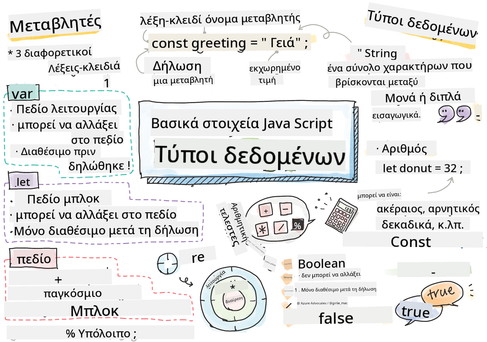
> Σημείωση από [Tomomi Imura](https://twitter.com/girlie_mac)

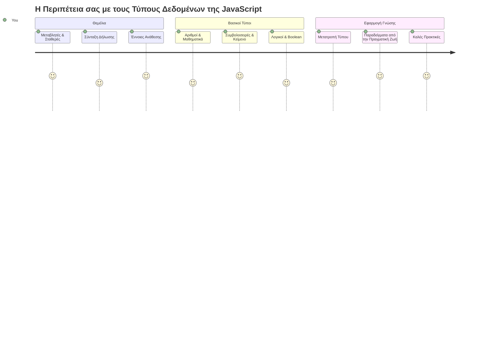
Οι τύποι δεδομένων είναι μία από τις βασικές έννοιες στην JavaScript που θα συναντάτε σε κάθε πρόγραμμα που γράφετε. Σκεφτείτε τους τύπους δεδομένων σαν το σύστημα αρχειοθέτησης που χρησιμοποιούσαν οι αρχαίοι βιβλιοθηκάριοι στην Αλεξάνδρεια – είχαν συγκεκριμένες θέσεις για παπύρους που περιείχαν ποίηση, μαθηματικά και ιστορικά αρχεία. Η JavaScript οργανώνει τις πληροφορίες με παρόμοιο τρόπο, με διαφορετικές κατηγορίες για διαφορετικούς τύπους δεδομένων.

Σε αυτό το μάθημα, θα εξερευνήσουμε τους βασικούς τύπους δεδομένων που κάνουν την JavaScript να λειτουργεί. Θα μάθετε πώς να χειρίζεστε αριθμούς, κείμενο, τιμές true/false, και θα καταλάβετε γιατί η σωστή επιλογή τύπου είναι ουσιώδης για τα προγράμματά σας. Αυτές οι έννοιες μπορεί να φαίνονται αφηρημένες στην αρχή, αλλά με την εξάσκηση θα γίνουν δεύτερη φύση.

Η κατανόηση των τύπων δεδομένων θα κάνει τα πάντα στην JavaScript πολύ πιο κατανοητά. Όπως οι αρχιτέκτονες χρειάζεται να καταλάβουν τα διαφορετικά υλικά πριν χτίσουν έναν καθεδρικό ναό, έτσι και αυτές οι βασικές αρχές θα στηρίξουν ό,τι κατασκευάσετε στο μέλλον.

## Προ-διάλεξη κουίζ
[Προ-διάλεξη κουίζ](https://ff-quizzes.netlify.app/web/)

Αυτό το μάθημα καλύπτει τα βασικά της JavaScript, της γλώσσας που παρέχει διαδραστικότητα στο διαδίκτυο.

> Μπορείτε να παρακολουθήσετε αυτό το μάθημα στο [Microsoft Learn](https://docs.microsoft.com/learn/modules/web-development-101-variables/?WT.mc_id=academic-77807-sagibbon)!

[](https://youtube.com/watch?v=JNIXfGiDWM8 "Variables in JavaScript")

[](https://youtube.com/watch?v=AWfA95eLdq8 "Data Types in JavaScript")

> 🎥 Κάντε κλικ στις παραπάνω εικόνες για βίντεο σχετικά με τις μεταβλητές και τους τύπους δεδομένων

Ας ξεκινήσουμε με τις μεταβλητές και τους τύπους δεδομένων που τις γεμίζουν!

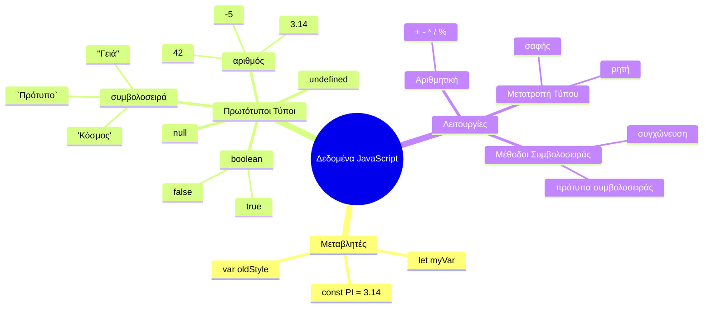
## Μεταβλητές

Οι μεταβλητές είναι βασικά δομικά στοιχεία στον προγραμματισμό. Όπως τα βαζάκια με ετικέτες που χρησιμοποιούσαν οι μεσαιωνικοί αλχημιστές για να φυλάσσουν διαφορετικές ουσίες, οι μεταβλητές σας επιτρέπουν να αποθηκεύετε πληροφορίες και να τους δίνετε ένα περιγραφικό όνομα για να τις αναφέρετε αργότερα. Θέλετε να θυμάστε την ηλικία κάποιου; Αποθηκεύστε την σε μια μεταβλητή που ονομάζεται `age`. Θέλετε να παρακολουθείτε το όνομα ενός χρήστη; Κρατήστε το σε μια μεταβλητή που ονομάζεται `userName`.

Θα επικεντρωθούμε στη σύγχρονη προσέγγιση δημιουργίας μεταβλητών στην JavaScript. Οι τεχνικές που θα μάθετε εδώ εκπροσωπούν χρόνια εξέλιξης της γλώσσας και βέλτιστες πρακτικές που ανέπτυξε η κοινότητα προγραμματιστών.

Η δημιουργία και **δήλωση** μιας μεταβλητής ακολουθεί την εξής σύνταξη **[λέξη-κλειδί] [όνομα]**. Αποτελείται από δύο μέρη:

- **Λέξη-κλειδί**. Χρησιμοποιήστε `let` για μεταβλητές που μπορούν να αλλάξουν, ή `const` για τιμές που παραμένουν σταθερές.
- **Το όνομα της μεταβλητής**, αυτό είναι ένα περιγραφικό όνομα που επιλέγετε εσείς.

✅ Η λέξη-κλειδί `let` εισήχθη στην ES6 και δίνει στη μεταβλητή σας ένα λεγόμενο _block scope_ (πεδίο ορατότητας μπλοκ). Συνιστάται να χρησιμοποιείτε `let` ή `const` αντί της παλαιότερης λέξης-κλειδί `var`. Θα καλύψουμε τα block scopes πιο αναλυτικά σε επόμενα μέρη.

### Άσκηση - εργασία με μεταβλητές

1. **Δηλώστε μια μεταβλητή**. Ας ξεκινήσουμε δημιουργώντας την πρώτη μας μεταβλητή:

    ```javascript
    let myVariable;
    ```

   **Τι επιτυγχάνει αυτό:**
   - Ενημερώνει τη JavaScript να δημιουργήσει μια θέση αποθήκευσης που ονομάζεται `myVariable`
   - Η JavaScript δεσμεύει μνήμη για αυτή τη μεταβλητή
   - Η μεταβλητή αυτή τη στιγμή δεν έχει τιμή (undefined)

2. **Δώστε της μια τιμή**. Τώρα βάλτε κάτι μέσα στη μεταβλητή μας:

    ```javascript
    myVariable = 123;
    ```

   **Πώς λειτουργεί η ανάθεση:**
   - Ο τελεστής `=` αναθέτει την τιμή 123 στη μεταβλητή μας
   - Η μεταβλητή πλέον περιέχει αυτή την τιμή αντί για undefined
   - Μπορείτε να αναφερθείτε σε αυτή την τιμή σε όλο τον κώδικα χρησιμοποιώντας `myVariable`

   > Σημείωση: Η χρήση του `=` σε αυτό το μάθημα σημαίνει ότι χρησιμοποιούμε έναν "τελεστή ανάθεσης", που χρησιμοποιείται για να ορίσουμε μια τιμή σε μια μεταβλητή. Δεν δηλώνει ισότητα.

3. **Κάντε το έξυπνα**. Στην πραγματικότητα, ας συνδυάσουμε τα δύο αυτά βήματα:

    ```javascript
    let myVariable = 123;
    ```

    **Αυτή η προσέγγιση είναι πιο αποτελεσματική:**
    - Δηλώνετε τη μεταβλητή και αναθέτετε τιμή σε μία δήλωση
    - Αυτή είναι η συνήθης πρακτική μεταξύ των προγραμματιστών
    - Μειώνει το μήκος του κώδικα ενώ διατηρεί την σαφήνεια

4. **Αλλάξτε γνώμη**. Τι γίνεται αν θέλουμε να αποθηκεύσουμε έναν διαφορετικό αριθμό;

   ```javascript
   myVariable = 321;
   ```

   **Κατανόηση της επαναανάθεσης:**
   - Η μεταβλητή τώρα περιέχει 321 αντί για 123
   - Η προηγούμενη τιμή αντικαθίσταται – οι μεταβλητές αποθηκεύουν μόνο μία τιμή κάθε φορά
   - Αυτή η μεταβλητότητα είναι το κύριο χαρακτηριστικό των μεταβλητών που δηλώνονται με `let`

   ✅ Δοκιμάστε το! Μπορείτε να γράψετε JavaScript απευθείας στον browser σας. Ανοίξτε το παράθυρο Developer Tools. Στην κονσόλα, θα βρείτε ένα prompt· πληκτρολογήστε `let myVariable = 123`, πατήστε enter, και μετά πληκτρολογήστε `myVariable`. Τι συμβαίνει; Σημειώστε ότι θα μάθετε περισσότερα για αυτές τις έννοιες σε επόμενα μαθήματα.

### 🧠 **Εξέταση Επάρκειας στις Μεταβλητές: Να νιώσετε άνεση**

**Ας δούμε πώς νιώθετε για τις μεταβλητές:**
- Μπορείτε να εξηγήσετε τη διαφορά μεταξύ δήλωσης και ανάθεσης σε μια μεταβλητή;
- Τι συμβαίνει αν προσπαθήσετε να χρησιμοποιήσετε μια μεταβλητή πριν την δηλώσετε;
- Πότε θα επιλέγατε `let` αντί για `const` για μια μεταβλητή;

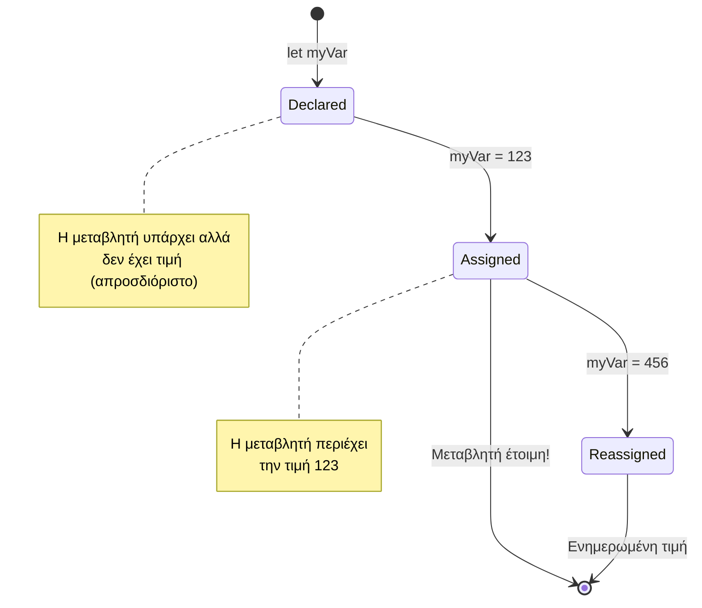
> **Γρήγορη συμβουλή**: Σκεφτείτε τις μεταβλητές σαν κουτιά αποθήκευσης με ετικέτες. Δημιουργείτε το κουτί (`let`), βάζετε κάτι μέσα (`=`), και αργότερα μπορείτε να αλλάξετε το περιεχόμενο αν χρειαστεί!

## Σταθερές

Μερικές φορές χρειάζεται να αποθηκεύσετε πληροφορίες που δεν πρέπει ποτέ να αλλάξουν κατά την εκτέλεση του προγράμματος. Σκεφτείτε τις σταθερές σαν τις μαθηματικές αρχές που καθιέρωσε ο Ευκλείδης στην αρχαία Ελλάδα – μόλις αποδειχθούν και καταγραφούν, παρέμεναν σταθερές για πάντα.

Οι σταθερές λειτουργούν παρόμοια με τις μεταβλητές, αλλά με έναν σημαντικό περιορισμό: μόλις τους ανατεθεί μια τιμή, δεν μπορεί να αλλάξει. Αυτή η αμεταβλητότητα βοηθά στην αποφυγή τυχαίων αλλαγών σε κρίσιμες τιμές μέσα στο πρόγραμμα σας.

Η δήλωση και η αρχικοποίηση μιας σταθεράς ακολουθεί τις ίδιες αρχές με μια μεταβλητή, με εξαίρεση τη λέξη-κλειδί `const`. Οι σταθερές συνήθως δηλώνονται με κεφαλαία γράμματα.

```javascript
const MY_VARIABLE = 123;
```

**Αυτό που κάνει ο κώδικας:**
- **Δημιουργεί** μια σταθερά με όνομα `MY_VARIABLE` με τιμή 123
- **Χρησιμοποιεί** σύμβαση ονοματοδοσίας με κεφαλαία αναφορικά με τις σταθερές
- **Αποτρέπει** μελλοντικές αλλαγές σε αυτή την τιμή

Οι σταθερές έχουν δύο βασικούς κανόνες:

- **Πρέπει να τους δώσετε τιμή αμέσως** – δεν επιτρέπονται κενές σταθερές!
- **Δεν μπορείτε ποτέ να αλλάξετε αυτή την τιμή** – η JavaScript θα εκτοξεύσει σφάλμα αν το προσπαθήσετε. Ας δούμε τι εννοώ:

   **Απλή τιμή** - Το παρακάτω ΔΕΝ επιτρέπεται:
   
      ```javascript
      const PI = 3;
      PI = 4; // δεν επιτρέπεται
      ```

   **Τι να θυμάστε:**
   - **Οι προσπάθειες** για ανακαθορισμό μίας σταθεράς προκαλούν σφάλμα
   - **Προστατεύει** σημαντικές τιμές από τυχαίες αλλαγές
   - **Εξασφαλίζει** ότι η τιμή παραμένει σταθερή σε όλο το πρόγραμμα
 
   **Προστασία αναφοράς αντικειμένου** - Το παρακάτω ΔΕΝ επιτρέπεται:
   
      ```javascript
      const obj = { a: 3 };
      obj = { b: 5 } // δεν επιτρέπεται
      ```

   **Κατανόηση αυτών των εννοιών:**
   - **Αποτρέπει** την αντικατάσταση ολόκληρου του αντικειμένου με ένα νέο
   - **Προστατεύει** την αναφορά στο αρχικό αντικείμενο
   - **Διατηρεί** την ταυτότητα του αντικειμένου στη μνήμη

    **Η τιμή του αντικειμένου δεν προστατεύεται** - Το παρακάτω ΕΠΙΤΡΕΠΕΤΑΙ:
    
      ```javascript
      const obj = { a: 3 };
      obj.a = 5;  // επιτρέπεται
      ```

      **Ανάλυση των γεγονότων:**
      - **Τροποποιεί** την τιμή ιδιότητας μέσα στο αντικείμενο
      - **Διατηρεί** την ίδια αναφορά αντικειμένου
      - **Δείχνει** ότι το περιεχόμενο ενός αντικειμένου μπορεί να αλλάξει ενώ η αναφορά παραμένει σταθερή

   > Σημειώστε ότι το `const` σημαίνει ότι η αναφορά προστατεύεται από ανακαθορισμό. Η τιμή δεν είναι απαραίτητα _αμετάβλητη_ και μπορεί να αλλάξει, ειδικά αν πρόκειται για σύνθετη δομή όπως ένα αντικείμενο.

## Τύποι Δεδομένων

Η JavaScript οργανώνει τις πληροφορίες σε διαφορετικές κατηγορίες που ονομάζονται τύποι δεδομένων. Αυτή η έννοια αντανακλά το πώς οι αρχαίοι λόγιοι κατηγοριοποιούσαν τη γνώση – ο Αριστοτέλης διέκρινε μεταξύ διαφόρων τύπων λογικής σκέψης, γνωρίζοντας ότι οι λογικές αρχές δεν μπορούν να εφαρμοστούν ομοιόμορφα σε ποίηση, μαθηματικά και φυσική φιλοσοφία.

Οι τύποι δεδομένων έχουν σημασία επειδή διαφορετικές λειτουργίες λειτουργούν με διαφορετικά είδη πληροφοριών. Όπως δεν μπορείτε να κάνετε αριθμητικές πράξεις στο όνομα ενός ατόμου ή να ταξινομήσετε αλφαβητικά μια μαθηματική εξίσωση, έτσι και η JavaScript απαιτεί τον κατάλληλο τύπο δεδομένων για κάθε λειτουργία. Η κατανόηση αυτού αποτρέπει λάθη και καθιστά τον κώδικά σας πιο αξιόπιστο.

Οι μεταβλητές μπορούν να αποθηκεύσουν πολλά διαφορετικά είδη τιμών, όπως αριθμούς και κείμενο. Αυτοί οι διάφοροι τύποι τιμών είναι γνωστοί ως **τύποι δεδομένων**. Οι τύποι δεδομένων είναι σημαντικό μέρος της ανάπτυξης λογισμικού επειδή βοηθούν τους προγραμματιστές να λαμβάνουν αποφάσεις σχετικά με το πώς πρέπει να γράφεται ο κώδικας και πώς πρέπει να εκτελείται το λογισμικό. Επιπλέον, ορισμένοι τύποι δεδομένων έχουν μοναδικά χαρακτηριστικά που βοηθούν στη μετατροπή ή εξαγωγή επιπλέον πληροφορίας μέσα από μια τιμή.

✅ Οι Τύποι Δεδομένων αναφέρονται επίσης ως πρωτόγονοι τύποι δεδομένων της JavaScript, καθώς είναι οι πιο χαμηλού επιπέδου τύποι που παρέχει η γλώσσα. Υπάρχουν 7 πρωτόγονοι τύποι: string, number, bigint, boolean, undefined, null και symbol. Πάρτε ένα λεπτό να οπτικοποιήσετε τι μπορεί να αναπαριστά ο καθένας από αυτούς τους πρωτόγονους. Τι είναι ένα `zebra`; Τι γίνεται με το `0`; Το `true`;

### Αριθμοί

Οι αριθμοί είναι ο πιο άμεσος τύπος δεδομένων στην JavaScript. Είτε εργάζεστε με ακέραιους αριθμούς όπως το 42, δεκαδικούς όπως το 3.14, είτε με αρνητικούς αριθμούς όπως το -5, η JavaScript τους χειρίζεται ομοιόμορφα.

Θυμάστε τη μεταβλητή μας από πριν; Το 123 που αποθηκεύσαμε ήταν στην πραγματικότητα ένας τύπος δεδομένων αριθμού:

```javascript
let myVariable = 123;
```

**Κύρια χαρακτηριστικά:**
- Η JavaScript αναγνωρίζει αυτόματα τις αριθμητικές τιμές
- Μπορείτε να εκτελέσετε μαθηματικές πράξεις με αυτές τις μεταβλητές
- Δεν απαιτείται ρητή δήλωση τύπου

Οι μεταβλητές μπορούν να αποθηκεύουν όλους τους τύπους αριθμών, συμπεριλαμβανομένων δεκαδικών ή αρνητικών αριθμών. Οι αριθμοί μπορούν επίσης να χρησιμοποιηθούν με αριθμητικούς τελεστές, που καλύπτονται στην [επόμενη ενότητα](../../../../2-js-basics/1-data-types).

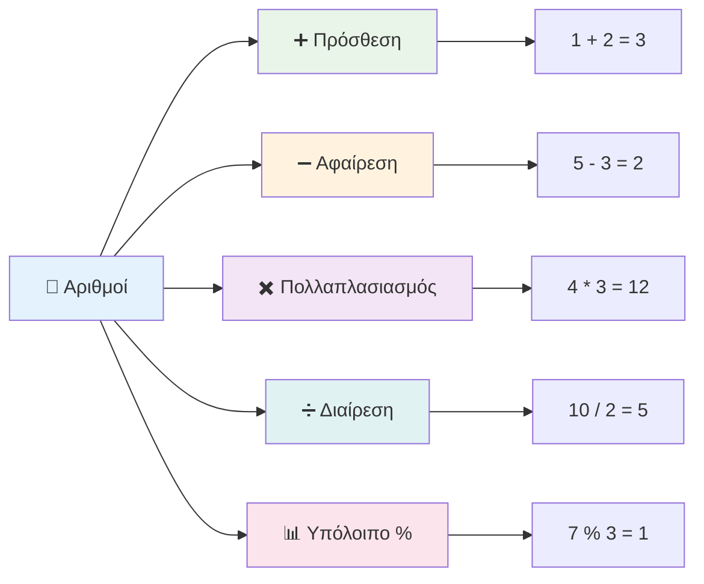
### Αριθμητικοί Τελεστές

Οι αριθμητικοί τελεστές σας επιτρέπουν να εκτελείτε μαθηματικούς υπολογισμούς στην JavaScript. Αυτοί οι τελεστές ακολουθούν τις ίδιες αρχές που χρησιμοποιούν οι μαθηματικοί εδώ και αιώνες – τα ίδια σύμβολα που εμφανίστηκαν στα έργα λόγιων όπως ο Αλ-Χουαρισμί, που ανέπτυξε τη συμβολική αναπαράσταση της άλγεβρας.

Οι τελεστές λειτουργούν όπως θα περιμένατε από τα παραδοσιακά μαθηματικά: το συν για πρόσθεση, το μείον για αφαίρεση, και ούτω καθεξής.

Υπάρχουν διάφοροι τύποι τελεστών που μπορείτε να χρησιμοποιήσετε όταν εκτελείτε αριθμητικές λειτουργίες, μερικοί από αυτούς παρατίθενται παρακάτω:

| Σύμβολο | Περιγραφή                                                                | Παράδειγμα                         |
| ------- | ------------------------------------------------------------------------ | --------------------------------- |
| `+`     | **Πρόσθεση**: Υπολογίζει το άθροισμα δύο αριθμών                        | `1 + 2 //αναμενόμενη απάντηση 3` |
| `-`     | **Αφαίρεση**: Υπολογίζει τη διαφορά μεταξύ δύο αριθμών                   | `1 - 2 //αναμενόμενη απάντηση -1`|
| `*`     | **Πολλαπλασιασμός**: Υπολογίζει το γινόμενο δύο αριθμών                 | `1 * 2 //αναμενόμενη απάντηση 2` |
| `/`     | **Διαίρεση**: Υπολογίζει το πηλίκο δύο αριθμών                          | `1 / 2 //αναμενόμενη απάντηση 0.5`|
| `%`     | **Υπόλοιπο**: Υπολογίζει το υπόλοιπο της διαίρεσης δύο αριθμών           | `1 % 2 //αναμενόμενη απάντηση 1` |

✅ Δοκιμάστε το! Δοκιμάστε μια αριθμητική πράξη στην κονσόλα του browser σας. Τα αποτελέσματα σας εκπλήσσουν;

### 🧮 **Έλεγχος Μαθηματικών Ικανοτήτων: Υπολογίζοντας με Αυτοπεποίθηση**

**Δοκιμάστε την κατανόησή σας στα μαθηματικά:**
- Ποια είναι η διαφορά μεταξύ του `/` (διαίρεση) και του `%` (υπόλοιπο);
- Μπορείτε να προβλέψετε ποιο είναι το αποτέλεσμα του `10 % 3`; (Υπόδειξη: δεν είναι 3,33...)
- Γιατί μπορεί να είναι χρήσιμος ο τελεστής υπολοίπου στον προγραμματισμό;

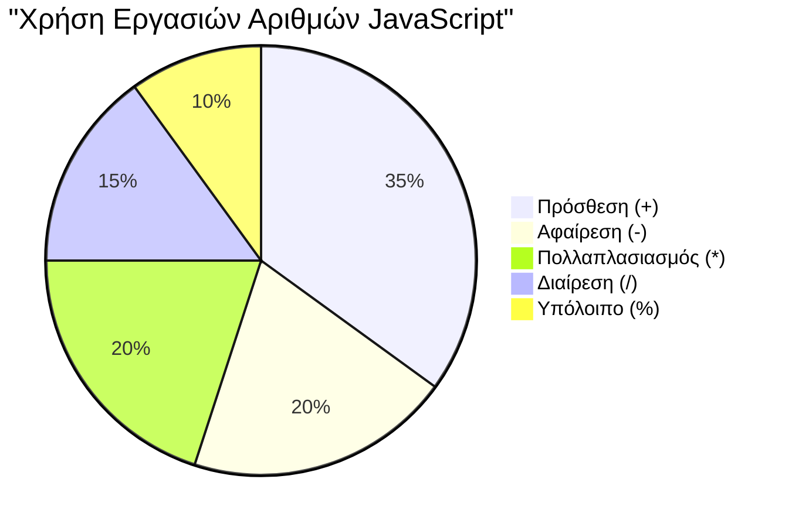
> **Πρακτική συμβουλή**: Ο τελεστής υπολοίπου (%) είναι πολύ χρήσιμος για έλεγχο αν οι αριθμοί είναι ζυγοί ή μονάδες, για τη δημιουργία προτύπων ή για τη δραστηριότητα μέσα σε πίνακες!

### Συμβολοσειρές (Strings)

Στην JavaScript, τα δεδομένα κειμένου αναπαριστώνται ως συμβολοσειρές. Ο όρος "string" προέρχεται από την έννοια χαρακτήρων που συνδέονται διαδοχικά, όπως οι γραφείς στα μεσαιωνικά μοναστήρια, που ένωναν γράμματα για να σχηματίσουν λέξεις και προτάσεις στα χειρόγραφά τους.

Οι συμβολοσειρές είναι θεμελιώδεις για την ανάπτυξη ιστοσελίδων. Κάθε κομμάτι κειμένου που εμφανίζεται σε μια ιστοσελίδα – ονόματα χρηστών, ετικέτες κουμπιών, μηνύματα λάθους, περιεχόμενο – χειρίζεται ως δεδομένα τύπου συμβολοσειράς. Η κατανόηση των συμβολοσειρών είναι απαραίτητη για τη δημιουργία λειτουργικών διεπαφών χρήστη.

Οι συμβολοσειρές είναι σύνολα χαρακτήρων που περικλείονται μέσα σε μονά `'` ή διπλά `"` εισαγωγικά.

```javascript
'This is a string'
"This is also a string"
let myString = 'This is a string value stored in a variable';
```

**Κατανόηση αυτών των εννοιών:**
- **Χρησιμοποιεί** είτε απλά εισαγωγικά `'` είτε διπλά εισαγωγικά `"` για να ορίσει συμβολοσειρές
- **Αποθηκεύει** κείμενο που μπορεί να περιλαμβάνει γράμματα, αριθμούς και σύμβολα
- **Αναθέτει** τιμές συμβολοσειρών σε μεταβλητές για μελλοντική χρήση
- **Απαιτεί** εισαγωγικά για να διαχωρίσει το κείμενο από ονόματα μεταβλητών

Θυμηθείτε να χρησιμοποιείτε εισαγωγικά όταν γράφετε μια συμβολοσειρά, διαφορετικά η JavaScript θα υποθέσει ότι πρόκειται για όνομα μεταβλητής.

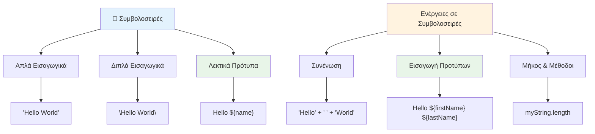
### Μορφοποίηση Συμβολοσειρών

Η χειραγώγηση συμβολοσειρών σας επιτρέπει να συνδυάζετε στοιχεία κειμένου, να ενσωματώνετε μεταβλητές και να δημιουργείτε δυναμικό περιεχόμενο που αντιδρά στην κατάσταση του προγράμματος. Αυτή η τεχνική σας δίνει τη δυνατότητα να δημιουργείτε κείμενο προγραμματιστικά.

Συχνά χρειάζεται να ενώσετε πολλές συμβολοσειρές μεταξύ τους – αυτή η διαδικασία ονομάζεται συνένωση (concatenation).
Για να **συνδυάσετε** δύο ή περισσότερες συμβολοσειρές, ή να τις ενώσετε μαζί, χρησιμοποιήστε τον τελεστή `+`.

```javascript
let myString1 = "Hello";
let myString2 = "World";

myString1 + myString2 + "!"; //Γεια σου Κόσμε!
myString1 + " " + myString2 + "!"; //Γεια σου Κόσμε!
myString1 + ", " + myString2 + "!"; //Γεια σου, Κόσμε!
```

**Βήμα προς βήμα, να τι συμβαίνει:**
- **Συνδυάζει** πολλαπλές συμβολοσειρές χρησιμοποιώντας τον τελεστή `+`
- **Ενώνει** τις συμβολοσειρές απευθείας χωρίς κενά στο πρώτο παράδειγμα
- **Προσθέτει** χαρακτήρες κενών `" "` μεταξύ συμβολοσειρών για ευαναγνωσιμότητα
- **Εισάγει** σημεία στίξης όπως κόμματα για σωστή μορφοποίηση

✅ Γιατί το `1 + 1 = 2` στη JavaScript, αλλά `'1' + '1' = 11;` Σκέψου το. Τι γίνεται με το `'1' + 1`;

Τα **template literals** είναι ένας άλλος τρόπος μορφοποίησης συμβολοσειρών, εκτός από τα εισαγωγικά χρησιμοποιείται το backtick. Οτιδήποτε δεν είναι απλό κείμενο πρέπει να τοποθετείται μέσα σε δείκτες `${ }`. Αυτό περιλαμβάνει και μεταβλητές που μπορεί να είναι συμβολοσειρές.

```javascript
let myString1 = "Hello";
let myString2 = "World";

`${myString1} ${myString2}!` //Γειά σου Κόσμε!
`${myString1}, ${myString2}!` //Γειά σου, Κόσμε!
```

**Ας κατανοήσουμε κάθε μέρος:**
- **Χρησιμοποιεί** backticks `` ` `` αντί για κανονικά εισαγωγικά για τη δημιουργία template literals
- **Ενσωματώνει** μεταβλητές απευθείας χρησιμοποιώντας τη σύνταξη `${}`
- **Διατηρεί** ακριβώς τα κενά και τη μορφοποίηση όπως έχουν γραφτεί
- **Παρέχει** έναν πιο καθαρό τρόπο δημιουργίας σύνθετων συμβολοσειρών με μεταβλητές

Μπορείτε να πετύχετε τους στόχους μορφοποίησής σας με οποιαδήποτε μέθοδο, αλλά τα template literals σέβονται οποιαδήποτε κενά και αλλαγές γραμμών.

✅ Πότε θα χρησιμοποιούσατε ένα template literal αντί για μια απλή συμβολοσειρά;

### 🔤 **Έλεγχος Επάρκειας Συμβολοσειρών: Αυτοπεποίθηση στην Επεξεργασία Κειμένου**

**Αξιολογήστε τις δεξιότητές σας στις συμβολοσειρές:**
- Μπορείτε να εξηγήσετε γιατί `'1' + '1'` ισούται με `'11'` αντί για `2`;
- Ποια μέθοδο συμβολοσειράς βρίσκετε πιο κατανοητή: η συγκόλληση ή τα template literals;
- Τι συμβαίνει αν ξεχάσετε τα εισαγωγικά γύρω από μια συμβολοσειρά;

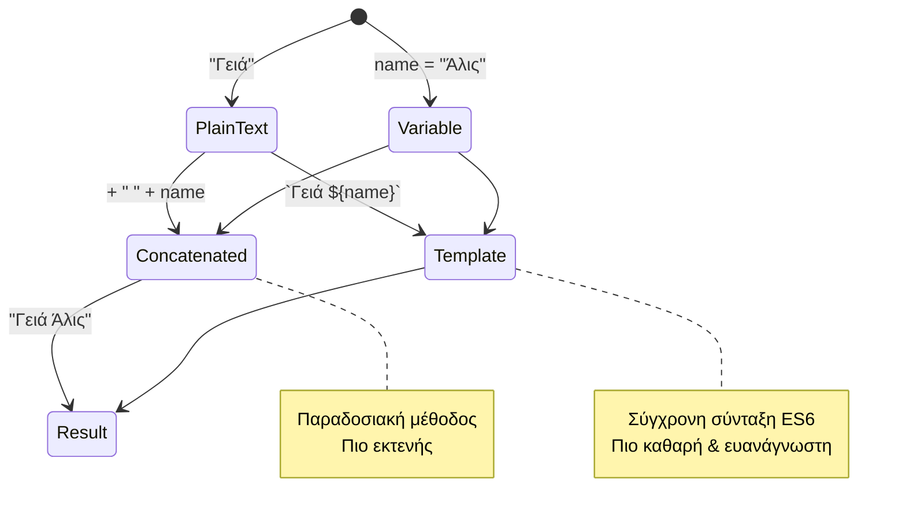
> **Επαγγελματική συμβουλή**: Τα template literals προτιμώνται γενικά για σύνθετο οικοδόμημα συμβολοσειρών γιατί είναι πιο κατανοητά και χειρίζονται όμορφα συμβολοσειρές πολλών γραμμών!

### Booleans

Οι Booleans αντιπροσωπεύουν την απλούστερη μορφή δεδομένων: μπορούν να έχουν μόνο δύο τιμές – `true` ή `false`. Αυτό το δυαδικό σύστημα λογικής προέρχεται από το έργο του George Boole, μαθηματικού του 19ου αιώνα που ανέπτυξε τη Boolean άλγεβρα.

Παρά την απλότητά τους, οι boolean είναι απαραίτητοι για τη λογική προγράμματος. Δίνουν στον κώδικά σας τη δυνατότητα να παίρνει αποφάσεις βάσει συνθηκών – αν ένας χρήστης έχει συνδεθεί, αν πατήθηκε ένα κουμπί, ή αν πληρούνται ορισμένα κριτήρια.

Οι Booleans μπορούν να έχουν μόνο δύο τιμές: `true` ή `false`. Μπορούν να βοηθήσουν στο να γίνονται αποφάσεις για το ποιοι κώδικες πρέπει να εκτελεστούν όταν πληρούνται συγκεκριμένες συνθήκες. Σε πολλές περιπτώσεις, [οι τελεστές](../../../../2-js-basics/1-data-types) βοηθούν στον καθορισμό της τιμής ενός Boolean και συχνά θα παρατηρήσετε ή θα γράψετε μεταβλητές να αρχικοποιούνται ή να ενημερώνουν τις τιμές τους με έναν τελεστή.

```javascript
let myTrueBool = true;
let myFalseBool = false;
```

**Στο παραπάνω, έχουμε:**
- **Δημιουργήσει** μια μεταβλητή που αποθηκεύει την Boolean τιμή `true`
- **Επιδείξει** πώς να αποθηκεύσουμε την Boolean τιμή `false`
- **Χρησιμοποιήσει** τις ακριβείς λέξεις-κλειδιά `true` και `false` (χωρίς εισαγωγικά)
- **Προετοιμάσει** αυτές τις μεταβλητές για χρήση σε συνθήκες

✅ Μια μεταβλητή θεωρείται 'truthy' αν αξιολογηθεί ως boolean `true`. Είναι ενδιαφέρον ότι στη JavaScript [όλες οι τιμές είναι truthy εκτός αν οριστούν ως falsy](https://developer.mozilla.org/docs/Glossary/Truthy).

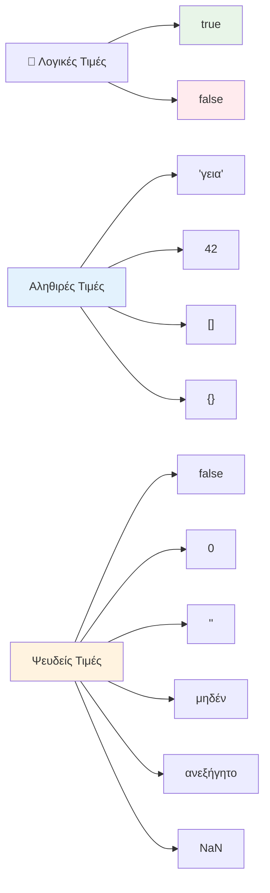
### 🎯 **Έλεγχος Λογικής Booleans: Δεξιότητες Λήψης Αποφάσεων**

**Δοκιμάστε την κατανόησή σας στα booleans:**
- Γιατί νομίζετε ότι η JavaScript έχει "truthy" και "falsy" τιμές πέρα από το απλό `true` και `false`;
- Μπορείτε να προβλέψετε ποια από τις παρακάτω είναι falsy: `0`, `"0"`, `[]`, `"false"`;
- Πώς μπορεί να βοηθήσουν οι booleans στον έλεγχο ροής προγράμματος;

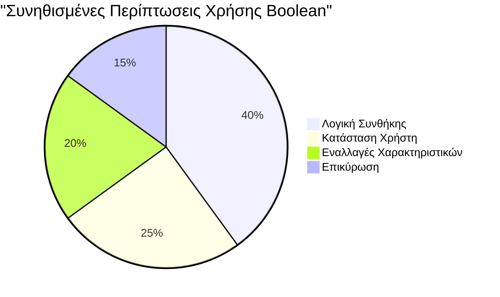
> **Να θυμάστε**: Στη JavaScript, μόνο 6 τιμές είναι falsy: `false`, `0`, `""`, `null`, `undefined` και `NaN`. Όλα τα υπόλοιπα είναι truthy!

---

## 📊 **Σύνοψη Εργαλειοθήκης Τύπων Δεδομένων**

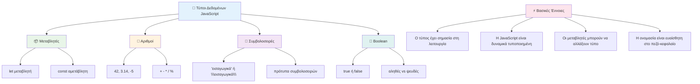
## Πρόκληση GitHub Copilot Agent 🚀

Χρησιμοποιήστε τη λειτουργία Agent για να ολοκληρώσετε την παρακάτω πρόκληση:

**Περιγραφή:** Δημιουργήστε έναν διαχειριστή προσωπικών πληροφοριών που να επιδεικνύει όλους τους τύπους δεδομένων της JavaScript που μάθατε σε αυτό το μάθημα, διαχειριζόμενος πραγματικά σενάρια δεδομένων.

**Οδηγία:** Δημιουργήστε ένα πρόγραμμα JavaScript που δημιουργεί ένα αντικείμενο προφίλ χρήστη που περιέχει: το όνομα του ατόμου (συμβολοσειρά), ηλικία (αριθμός), κατάσταση φοιτητή (boolean), αγαπημένα χρώματα ως πίνακα, και ένα αντικείμενο διεύθυνσης με ιδιότητες δρόμο, πόλη και ταχυδρομικό κώδικα. Συμπεριλάβετε συναρτήσεις εμφάνισης των πληροφοριών προφίλ και ενημέρωσης ξεχωριστών πεδίων. Βεβαιωθείτε ότι επιδεικνύετε συγκόλληση συμβολοσειρών, template literals, αριθμητικές πράξεις με την ηλικία, και λογική boolean για την κατάσταση φοιτητή.

Μάθετε περισσότερα για τη [λειτουργία agent](https://code.visualstudio.com/blogs/2025/02/24/introducing-copilot-agent-mode) εδώ.

## 🚀 Πρόκληση

Η JavaScript έχει ορισμένες συμπεριφορές που μπορούν να εκπλήξουν τους προγραμματιστές. Εδώ είναι ένα κλασικό παράδειγμα για διερεύνηση: δοκιμάστε να γράψετε στην κονσόλα του browser: `let age = 1; let Age = 2; age == Age` και παρατηρήστε το αποτέλεσμα. Επιστρέφει `false` – μπορείτε να προσδιορίσετε γιατί;

Αυτή είναι μία από τις πολλές συμπεριφορές της JavaScript που αξίζει να κατανοήσετε. Η γνώση αυτών των ιδιαιτεροτήτων θα σας βοηθήσει να γράφετε πιο αξιόπιστο κώδικα και να εντοπίζετε σφάλματα πιο αποτελεσματικά.

## Τεστ Μετά το Μάθημα
[Τεστ μετά το μάθημα](https://ff-quizzes.netlify.app)

## Ανασκόπηση & Αυτοεκπαίδευση

Δείτε [αυτήν τη λίστα με ασκήσεις JavaScript](https://css-tricks.com/snippets/javascript/) και δοκιμάστε μία. Τι μάθατε;

## Εργασία

[Εξάσκηση Τύπων Δεδομένων](assignment.md)

## 🚀 Χρονοδιάγραμμα Επάρκειας Τύπων Δεδομένων JavaScript

### ⚡ **Τι Μπορείτε να Κάνετε στα Επόμενα 5 Λεπτά**
- [ ] Ανοίξτε την κονσόλα του browser και δημιουργήστε 3 μεταβλητές με διαφορετικούς τύπους δεδομένων
- [ ] Δοκιμάστε την πρόκληση: `let age = 1; let Age = 2; age == Age` και βρείτε γιατί είναι ψευδής
- [ ] Πρακτική στη συγκόλληση συμβολοσειρών με το όνομά σας και αγαπημένο αριθμό
- [ ] Δοκιμάστε τι συμβαίνει όταν προσθέτετε έναν αριθμό σε μια συμβολοσειρά

### 🎯 **Τι Μπορείτε να Πετύχετε Αυτήν την Ώρα**
- [ ] Ολοκληρώστε το τεστ με τις ερωτήσεις μετά το μάθημα και ανασκοπήστε όποια συγκεχυμένα θέματα
- [ ] Δημιουργήστε έναν μίνι υπολογιστή που προσθέτει, αφαιρεί, πολλαπλασιάζει και διαιρεί δύο αριθμούς
- [ ] Φτιάξτε έναν απλό μορφοποιητή ονόματος χρησιμοποιώντας template literals
- [ ] Εξερευνήστε τις διαφορές μεταξύ τελεστών σύγκρισης `==` και `===`
- [ ] Πρακτική στη μετατροπή μεταξύ διαφορετικών τύπων δεδομένων

### 📅 **Η Εβδομάδα σας με Βάση τη JavaScript**
- [ ] Ολοκληρώστε την εργασία με αυτοπεποίθηση και δημιουργικότητα
- [ ] Δημιουργήστε ένα αντικείμενο προσωπικού προφίλ χρησιμοποιώντας όλους τους τύπους δεδομένων που μάθατε
- [ ] Πρακτική με [ασκήσεις JavaScript από το CSS-Tricks](https://css-tricks.com/snippets/javascript/)
- [ ] Φτιάξτε έναν απλό έλεγχο εγκυρότητας φόρμας χρησιμοποιώντας λογική boolean
- [ ] Πειραματιστείτε με τύπους δεδομένων πίνακα και αντικειμένου (προεπισκόπηση των επόμενων μαθημάτων)
- [ ] Ενταχθείτε σε μια κοινότητα JavaScript και ρωτήστε ερωτήσεις σχετικά με τύπους δεδομένων

### 🌟 **Η Μεταμόρφωσή σας μέσα σε Ένα Μήνα**
- [ ] Ενσωματώστε τις γνώσεις τύπων δεδομένων σε μεγαλύτερα προγραμματιστικά έργα
- [ ] Κατανοήστε πότε και γιατί να χρησιμοποιείτε κάθε τύπο δεδομένων σε πραγματικές εφαρμογές
- [ ] Βοηθήστε άλλους αρχάριους να καταλάβουν τα θεμελιώδη της JavaScript
- [ ] Δημιουργήστε μια μικρή εφαρμογή που διαχειρίζεται διαφορετικούς τύπους δεδομένων χρήστη
- [ ] Εξερευνήστε προχωρημένες έννοιες τύπων δεδομένων όπως μετατροπή τύπων και αυστηρή ισότητα
- [ ] Συνεισφέρετε σε έργα ανοιχτού κώδικα JavaScript με βελτιώσεις στην τεκμηρίωση

### 🧠 **Τελικός Έλεγχος Επάρκειας Τύπων Δεδομένων**

**Γιορτάστε τα θεμέλια της JavaScript:**
- Ποιος τύπος δεδομένων σας εξέπληξε περισσότερο όσον αφορά τη συμπεριφορά του;
- Πόσο άνετα νιώθετε να εξηγείτε μεταβλητές έναντι σταθερών σε έναν φίλο;
- Ποιο είναι το πιο ενδιαφέρον πράγμα που ανακαλύψατε για το σύστημα τύπων της JavaScript;
- Ποια πραγματική εφαρμογή μπορείτε να φανταστείτε να δημιουργείτε με αυτά τα θεμελιώδη;

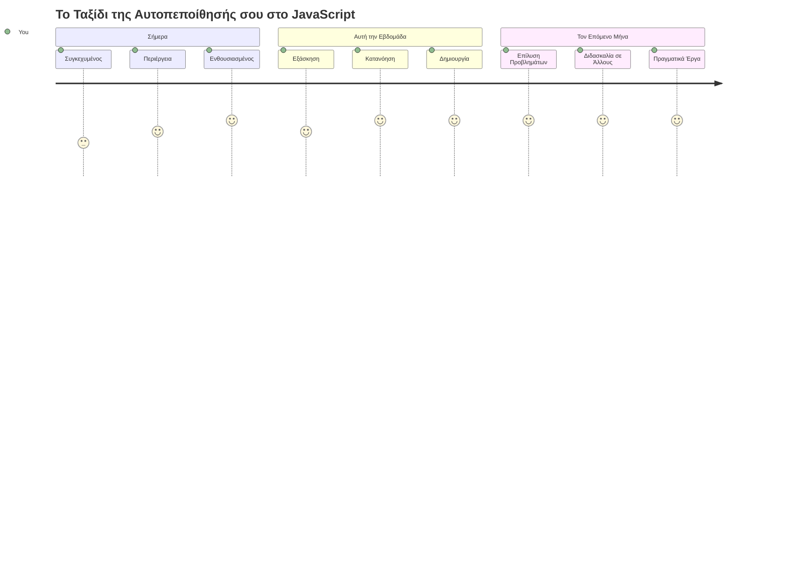
> 💡 **Έχετε χτίσει τα θεμέλια!** Η κατανόηση των τύπων δεδομένων είναι σαν να μαθαίνεις το αλφάβητο πριν γράψεις ιστορίες. Κάθε πρόγραμμα JavaScript που θα γράψετε ποτέ θα χρησιμοποιεί αυτές τις βασικές έννοιες. Τώρα έχετε τα δομικά στοιχεία για να δημιουργήσετε διαδραστικές ιστοσελίδες, δυναμικές εφαρμογές, και να λύσετε πραγματικά προβλήματα με κώδικα. Καλώς ορίσατε στον υπέροχο κόσμο της JavaScript! 🎉

---

<!-- CO-OP TRANSLATOR DISCLAIMER START -->
**Αποποίηση ευθυνών**:  
Αυτό το έγγραφο έχει μεταφραστεί χρησιμοποιώντας την υπηρεσία αυτόματης μετάφρασης με τεχνητή νοημοσύνη [Co-op Translator](https://github.com/Azure/co-op-translator). Ενώ επιδιώκουμε την ακρίβεια, παρακαλούμε να λάβετε υπόψη ότι οι αυτοματοποιημένες μεταφράσεις ενδέχεται να περιέχουν λάθη ή ανακρίβειες. Το πρωτότυπο έγγραφο στη μητρική του γλώσσα θα πρέπει να θεωρείται η αυθεντική πηγή. Για κρίσιμες πληροφορίες, συνιστάται η επαγγελματική μετάφραση από ανθρώπινο μεταφραστή. Δεν φέρουμε ευθύνη για οποιεσδήποτε παρεξηγήσεις ή λανθασμένες ερμηνείες προκύψουν από τη χρήση αυτής της μετάφρασης.
<!-- CO-OP TRANSLATOR DISCLAIMER END -->