<!--
CO_OP_TRANSLATOR_METADATA:
{
  "original_hash": "71f7d7dafa1c7194d79ddac87f669ff9",
  "translation_date": "2026-01-06T20:18:45+00:00",
  "source_file": "2-js-basics/2-functions-methods/README.md",
  "language_code": "el"
}
-->
# JavaScript Basics: Μέθοδοι και Συναρτήσεις

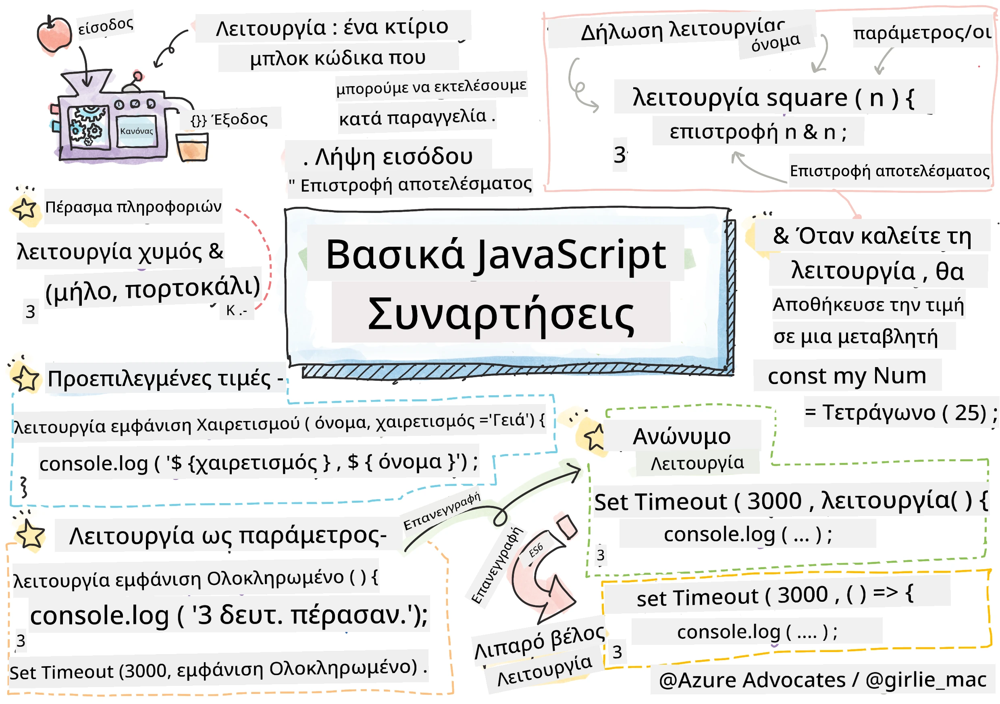
> Σημείωση από [Tomomi Imura](https://twitter.com/girlie_mac)

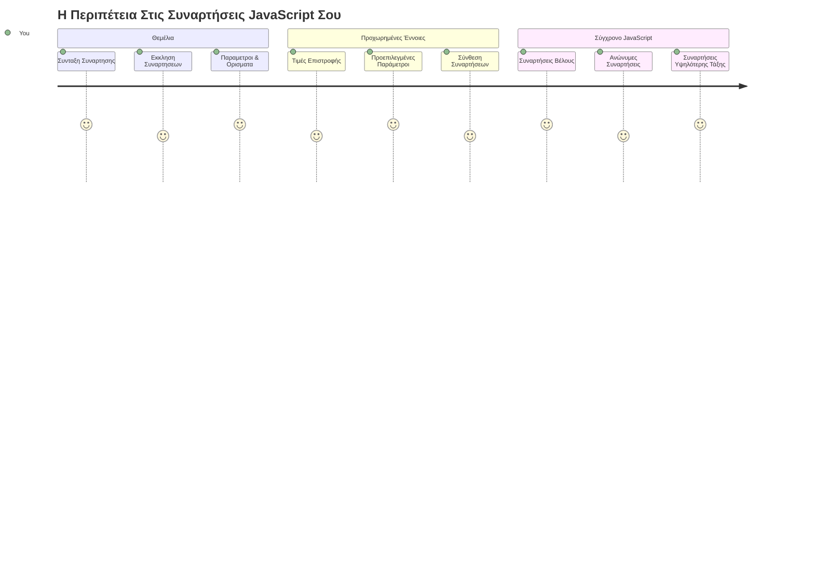
## Προ-Διάλεξη Κουίζ
[Προ-διάλεξη κουίζ](https://ff-quizzes.netlify.app)

Η επανάληψη του ίδιου κώδικα ξανά και ξανά είναι μία από τις πιο συχνές απογοητεύσεις στον προγραμματισμό. Οι συναρτήσεις λύουν αυτό το πρόβλημα επιτρέποντάς σας να πακετάρετε τον κώδικα σε επαναχρησιμοποιούμενες μονάδες. Σκεφτείτε τις συναρτήσεις σαν τα τυποποιημένα μέρη που έκαναν τη γραμμή συναρμολόγησης του Henry Ford επαναστατική – μόλις δημιουργήσετε ένα αξιόπιστο συστατικό, μπορείτε να το χρησιμοποιήσετε όπου χρειάζεται χωρίς να το ξαναδημιουργήσετε από την αρχή.

Οι συναρτήσεις σας επιτρέπουν να δένετε κομμάτια κώδικα ώστε να μπορείτε να τα χρησιμοποιείτε ξανά και ξανά σε όλο το πρόγραμμα σας. Αντί να αντιγράφετε και να επικολλάτε την ίδια λογική παντού, μπορείτε να δημιουργήσετε μια συνάρτηση μία φορά και να την καλείτε όποτε χρειάζεται. Αυτή η προσέγγιση κρατάει τον κώδικά σας οργανωμένο και κάνει τις ενημερώσεις πολύ πιο εύκολες.

Σε αυτό το μάθημα, θα μάθετε πώς να δημιουργείτε τις δικές σας συναρτήσεις, να περνάτε πληροφορίες σε αυτές και να παίρνετε χρήσιμα αποτελέσματα πίσω. Θα ανακαλύψετε τη διαφορά μεταξύ συναρτήσεων και μεθόδων, θα μάθετε σύγχρονες συντακτικές προσεγγίσεις, και θα δείτε πώς οι συναρτήσεις μπορούν να λειτουργούν με άλλες συναρτήσεις. Θα χτίσουμε αυτές τις έννοιες βήμα προς βήμα.

[](https://youtube.com/watch?v=XgKsD6Zwvlc "Methods and Functions")

> 🎥 Κλικάρετε την εικόνα παραπάνω για ένα βίντεο σχετικά με τις μεθόδους και τις συναρτήσεις.

> Μπορείτε να παρακολουθήσετε αυτό το μάθημα στο [Microsoft Learn](https://docs.microsoft.com/learn/modules/web-development-101-functions/?WT.mc_id=academic-77807-sagibbon)!

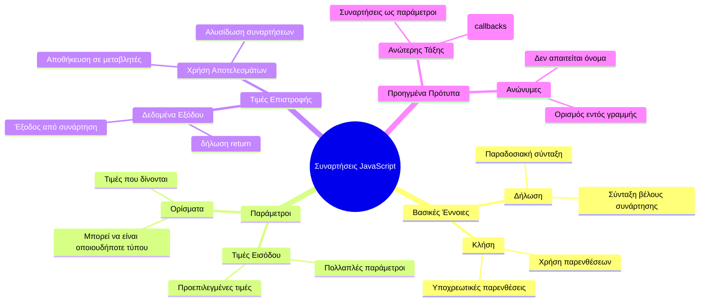
## Συναρτήσεις

Μια συνάρτηση είναι ένα αυτόνομο μπλοκ κώδικα που εκτελεί μια συγκεκριμένη εργασία. Περιλαμβάνει λογική που μπορείτε να εκτελέσετε όποτε χρειάζεται.

Αντί να γράφετε τον ίδιο κώδικα πολλές φορές σε όλο το πρόγραμμα σας, μπορείτε να τον πακετάρετε σε μια συνάρτηση και να την καλείτε όποτε τη χρειάζεστε. Αυτή η προσέγγιση κρατάει τον κώδικά σας καθαρό και κάνει τις ενημερώσεις πιο εύκολες. Σκεφτείτε την πρόκληση συντήρησης αν έπρεπε να αλλάξετε λογική που εκτείνεται σε 20 διαφορετικές θέσεις στη βάση κώδικά σας.

Η ονομασία των συναρτήσεών σας με περιγραφικό τρόπο είναι κρίσιμη. Μια καλοορισμένη συνάρτηση επικοινωνεί καθαρά τον σκοπό της – όταν βλέπετε `cancelTimer()`, καταλαβαίνετε αμέσως τι κάνει, ακριβώς όπως ένα κουμπί με ξεκάθαρη ετικέτα σας δείχνει τι ακριβώς θα συμβεί όταν το πατήσετε.

## Δημιουργία και κλήση μιας συνάρτησης

Ας εξετάσουμε πώς να δημιουργήσουμε μια συνάρτηση. Η σύνταξη ακολουθεί ένα σταθερό μοτίβο:

```javascript
function nameOfFunction() { // ορισμός συνάρτησης
 // ορισμός/σώμα συνάρτησης
}
```

Αναλύοντας:

- Η λέξη-κλειδί `function` λέει στη JavaScript "Ε, δημιουργώ μια συνάρτηση!"
- Το `nameOfFunction` είναι όπου δίνετε στη συνάρτηση σας ένα περιγραφικό όνομα
- Οι παρενθέσεις `()` είναι εκεί όπου μπορείτε να προσθέσετε παραμέτρους (θα φτάσουμε σε αυτό σύντομα)
- Οι αγκύλες `{}` περιέχουν τον κώδικα που εκτελείται όταν καλείτε τη συνάρτηση

Ας δημιουργήσουμε μια απλή συνάρτηση χαιρετισμού για να το δούμε στην πράξη:

```javascript
function displayGreeting() {
  console.log('Hello, world!');
}
```

Αυτή η συνάρτηση τυπώνει "Hello, world!" στην κονσόλα. Μόλις την ορίσετε, μπορείτε να τη χρησιμοποιήσετε όσες φορές χρειάζεται.

Για να εκτελέσετε (ή να "καλέσετε") τη συνάρτηση σας, γράψτε το όνομά της ακολουθούμενο από παρενθέσεις. Η JavaScript επιτρέπει να ορίσετε τη συνάρτηση πριν ή μετά την κλήση της – η μηχανή της JavaScript θα χειριστεί τη σειρά εκτέλεσης.

```javascript
// καλώντας τη συνάρτησή μας
displayGreeting();
```

Όταν τρέχετε αυτή τη γραμμή, εκτελεί όλο τον κώδικα μέσα στη συνάρτηση `displayGreeting`, εμφανίζοντας "Hello, world!" στην κονσόλα του browser σας. Μπορείτε να καλέσετε αυτή τη συνάρτηση επανειλημμένα.

### 🧠 **Έλεγχος Βασικών Συναρτήσεων: Δημιουργία Πρώτων Συναρτήσεων**

**Ας δούμε πώς νιώθετε σχετικά με τις βασικές συναρτήσεις:**
- Μπορείτε να εξηγήσετε γιατί χρησιμοποιούμε αγκύλες `{}` στον ορισμό συναρτήσεων;
- Τι συμβαίνει αν γράψετε `displayGreeting` χωρίς τις παρενθέσεις;
- Γιατί μπορεί να θέλετε να καλέσετε την ίδια συνάρτηση πολλές φορές;

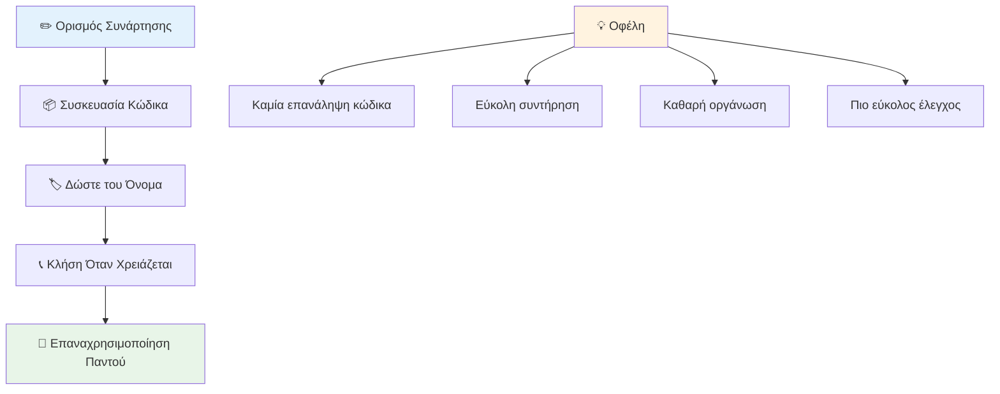
> **Σημείωση:** Έχετε χρησιμοποιήσει **μεθόδους** καθ’ όλη τη διάρκεια αυτών των μαθημάτων. Η `console.log()` είναι μέθοδος – ουσιαστικά μια συνάρτηση που ανήκει στο αντικείμενο `console`. Η βασική διαφορά είναι ότι οι μέθοδοι συνδέονται με αντικείμενα, ενώ οι συναρτήσεις λειτουργούν ανεξάρτητα. Πολλοί προγραμματιστές χρησιμοποιούν αυτούς τους όρους εναλλακτικά σε μη επίσημες συζητήσεις.

### Καλές πρακτικές για συναρτήσεις

Εδώ είναι μερικές συμβουλές για να γράφετε καλές συναρτήσεις:

- Δώστε στις συναρτήσεις σας σαφή, περιγραφικά ονόματα – το μελλοντικό σας εγώ θα σας ευχαριστεί!
- Χρησιμοποιήστε **camelCase** για ονόματα πολλών λέξεων (π.χ., `calculateTotal` αντί για `calculate_total`)
- Κρατήστε κάθε συνάρτηση εστιασμένη στο να κάνει καλά ένα πράγμα

## Περνώντας πληροφορίες σε μια συνάρτηση

Η συνάρτηση `displayGreeting` μας είναι περιορισμένη – μπορεί μόνο να εμφανίζει "Hello, world!" για όλους. Οι παράμετροι μας επιτρέπουν να κάνουμε τις συναρτήσεις πιο ευέλικτες και χρήσιμες.

Οι **παράμετροι** λειτουργούν σαν θέσεις όπου μπορείτε να εισάγετε διαφορετικές τιμές κάθε φορά που χρησιμοποιείτε τη συνάρτηση. Έτσι, η ίδια συνάρτηση μπορεί να δουλεύει με διαφορετικές πληροφορίες σε κάθε κλήση.

Καταχωρείτε τις παραμέτρους μέσα στις παρενθέσεις όταν ορίζετε τη συνάρτηση, χωρίζοντας πολλαπλές παραμέτρους με κόμμα:

```javascript
function name(param, param2, param3) {

}
```

Κάθε παράμετρος λειτουργεί σαν θέση – όταν κάποιος καλεί τη συνάρτησή σας, παρέχει πραγματικές τιμές που τοποθετούνται σε αυτές τις θέσεις.

Ας ενημερώσουμε τη συνάρτηση χαιρετισμού ώστε να δέχεται ένα όνομα:

```javascript
function displayGreeting(name) {
  const message = `Hello, ${name}!`;
  console.log(message);
}
```

Παρατηρήστε πώς χρησιμοποιούμε το χαρακτήρα backticks (`` ` ``) και `${}` για να εισάγουμε το όνομα κατευθείαν στο μήνυμα – αυτό ονομάζεται πρότυπο συμβολοσειράς (template literal) και είναι πολύ βολικός τρόπος να δημιουργείτε συμβολοσειρές με μεταβλητές ενωμένες.

Τώρα όταν καλούμε τη συνάρτηση, μπορούμε να περάσουμε οποιοδήποτε όνομα:

```javascript
displayGreeting('Christopher');
// εμφανίζει "Γεια σου, Christopher!" όταν εκτελείται
```

Η JavaScript παίρνει τη συμβολοσειρά `'Christopher'`, την αναθέτει στην παράμετρο `name`, και δημιουργεί το προσωποποιημένο μήνυμα "Hello, Christopher!"

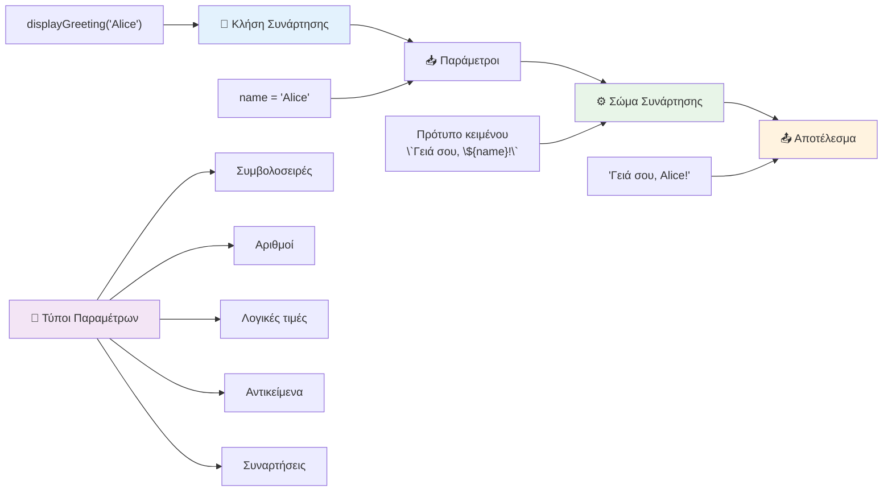
## Προεπιλεγμένες τιμές

Τι γίνεται αν θέλουμε μερικές παραμέτρους να είναι προαιρετικές; Εκεί έρχονται οι προεπιλεγμένες τιμές!

Ας πούμε ότι θέλουμε οι χρήστες να μπορούν να προσαρμόζουν τον χαιρετισμό, αλλά αν δεν καθορίσουν κάποιο, θα χρησιμοποιούμε το "Hello" ως εναλλακτική λύση. Μπορείτε να ορίσετε προεπιλεγμένες τιμές με το σύμβολο ισότητας, ακριβώς όπως καθορίζετε μια μεταβλητή:

```javascript
function displayGreeting(name, salutation='Hello') {
  console.log(`${salutation}, ${name}`);
}
```

Εδώ, το `name` είναι ακόμα απαιτούμενο, αλλά το `salutation` έχει εφεδρική τιμή `'Hello'` αν κανείς δεν δώσει διαφορετικό χαιρετισμό.

Τώρα μπορούμε να καλέσουμε τη συνάρτηση με δύο τρόπους:

```javascript
displayGreeting('Christopher');
// εμφανίζει "Γεια σου, Christopher"

displayGreeting('Christopher', 'Hi');
// εμφανίζει "Γεια, Christopher"
```

Στην πρώτη κλήση, η JavaScript χρησιμοποιεί το προεπιλεγμένο "Hello" αφού δεν καθορίσαμε χαιρετισμό. Στη δεύτερη κλήση, χρησιμοποιεί το δικό μας "Hi" αντί γι’ αυτό. Αυτή η ευελιξία κάνει τις συναρτήσεις προσαρμόσιμες σε διαφορετικά σενάρια.

### 🎛️ **Έλεγχος Παραμέτρων: Κάνοντας τις Συναρτήσεις Ευέλικτες**

**Δοκιμάστε την κατανόηση σας για τις παραμέτρους:**
- Ποια είναι η διαφορά μεταξύ παραμέτρου και ορίσματος;
- Γιατί οι προεπιλεγμένες τιμές είναι χρήσιμες στον πραγματικό προγραμματισμό;
- Μπορείτε να προβλέψετε τι συμβαίνει αν δώσετε περισσότερα ορίσματα από παραμέτρους;

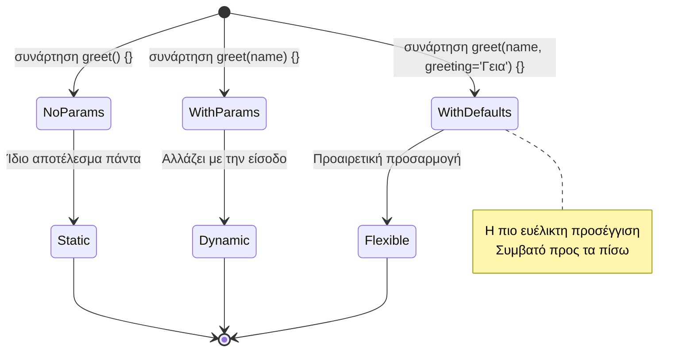
> **Επαγγελματική συμβουλή**: Οι προεπιλεγμένες παράμετροι κάνουν τις συναρτήσεις σας πιο φιλικές προς τον χρήστη. Οι χρήστες μπορούν να ξεκινήσουν γρήγορα με λογικές προεπιλογές, αλλά και να προσαρμόσουν όταν χρειάζεται!

## Τιμές επιστροφής

Μέχρι τώρα οι συναρτήσεις μας απλώς τύπωναν μηνύματα στην κονσόλα, αλλά τι γίνεται αν θέλετε μια συνάρτηση να υπολογίζει κάτι και να σας επιστρέφει το αποτέλεσμα;

Εκεί έρχονται οι **τιμές επιστροφής**. Αντί να εμφανίζει κάτι απλά, μια συνάρτηση μπορεί να σας δώσει πίσω μια τιμή που μπορείτε να αποθηκεύσετε σε μια μεταβλητή ή να χρησιμοποιήσετε σε άλλα μέρη του κώδικα.

Για να επιστρέψετε μια τιμή, χρησιμοποιείτε τη λέξη-κλειδί `return`, ακολουθούμενη από ό,τι θέλετε να επιστρέψετε:

```javascript
return myVariable;
```

Να κάτι σημαντικό: όταν μια συνάρτηση φτάσει σε μια δήλωση `return`, σταματά άμεσα την εκτέλεση και στέλνει αυτή την τιμή πίσω σε όποιον την κάλεσε.

Ας τροποποιήσουμε τη συνάρτηση χαιρετισμού ώστε να επιστρέφει το μήνυμα αντί να το τυπώνει:

```javascript
function createGreetingMessage(name) {
  const message = `Hello, ${name}`;
  return message;
}
```

Τώρα αντί να εκτυπώνει τον χαιρετισμό, αυτή η συνάρτηση δημιουργεί το μήνυμα και το επιστρέφει σε εμάς.

Για να χρησιμοποιήσουμε την επιστρεφόμενη τιμή, μπορούμε να την αποθηκεύσουμε σε μια μεταβλητή όπως οποιαδήποτε άλλη τιμή:

```javascript
const greetingMessage = createGreetingMessage('Christopher');
```

Τώρα η `greetingMessage` περιέχει το "Hello, Christopher" και μπορούμε να το χρησιμοποιήσουμε οπουδήποτε στον κώδικα – για να το εμφανίσουμε σε μια ιστοσελίδα, να το συμπεριλάβουμε σε ένα email ή να το περάσουμε σε άλλη συνάρτηση.

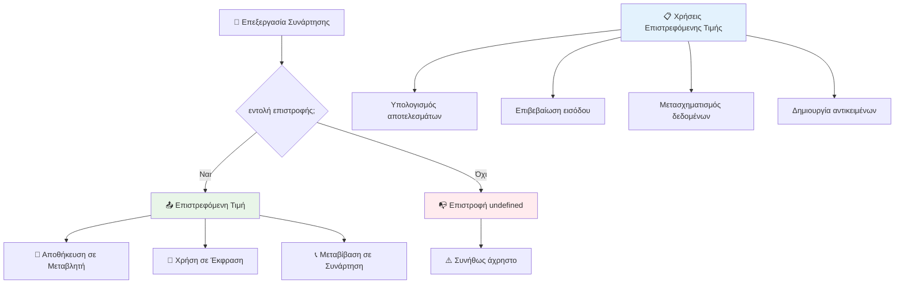
### 🔄 **Έλεγχος Τιμών Επιστροφής: Λαμβάνοντας Αποτελέσματα**

**Αξιολογήστε την κατανόηση σας στις τιμές επιστροφής:**
- Τι συμβαίνει στον κώδικα μετά από μια δήλωση `return` σε μια συνάρτηση;
- Γιατί η επιστροφή τιμών συχνά είναι καλύτερη από το απλό τύπωμα στην κονσόλα;
- Μπορεί μια συνάρτηση να επιστρέφει διαφορετικούς τύπους τιμών (συμβολοσειρά, αριθμό, boolean);

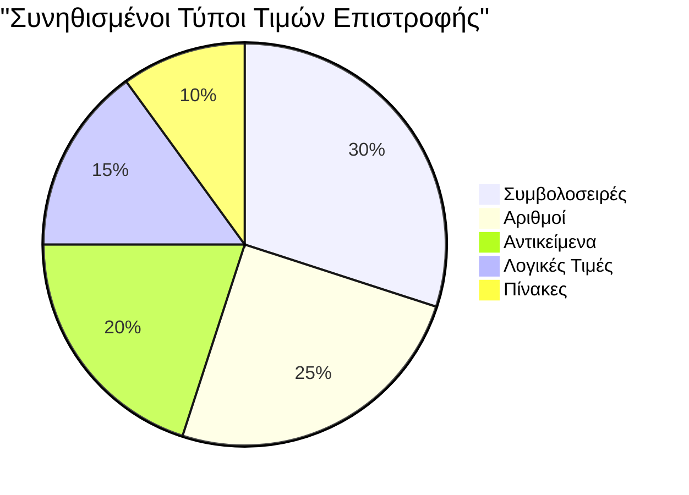
> **Κεντρική ιδέα**: Οι συναρτήσεις που επιστρέφουν τιμές είναι πιο ευέλικτες επειδή ο καλών αποφασίζει τι θα κάνει με το αποτέλεσμα. Αυτό κάνει τον κώδικα σας πιο αρθρωτό και επαναχρησιμοποιήσιμο!

## Συναρτήσεις ως παράμετροι σε συναρτήσεις

Μπορείτε να περάσετε συναρτήσεις ως παραμέτρους σε άλλες συναρτήσεις. Αν και αυτή η ιδέα μπορεί αρχικά να φαίνεται περίπλοκη, είναι μια ισχυρή δυνατότητα που επιτρέπει ευέλικτα προγραμματιστικά πρότυπα.

Αυτή η μορφή είναι πολύ συνήθης όταν θέλετε να πείτε "όταν κάτι συμβεί, κάνε αυτό το άλλο πράγμα". Για παράδειγμα, "όταν τελειώσει ο χρονοδιακόπτης, εκτέλεσε αυτόν τον κώδικα" ή "όταν ο χρήστης πατήσει το κουμπί, κάλεσε αυτή τη συνάρτηση."

Ας δούμε το `setTimeout`, μια ενσωματωμένη συνάρτηση που περιμένει ένα χρονικό διάστημα και στη συνέχεια εκτελεί έναν κώδικα. Πρέπει να της πούμε ποιον κώδικα να τρέξει – τέλειο παράδειγμα για να περάσουμε μια συνάρτηση!

Δοκιμάστε αυτόν τον κώδικα – μετά από 3 δευτερόλεπτα, θα δείτε ένα μήνυμα:

```javascript
function displayDone() {
  console.log('3 seconds has elapsed');
}
// η τιμή του χρονόμετρου είναι σε milliseconds
setTimeout(displayDone, 3000);
```

Παρατηρήστε πως περνάμε τη `displayDone` (χωρίς παρενθέσεις) στο `setTimeout`. Δεν καλούμε εμείς τη συνάρτηση – την παραδίδουμε στο `setTimeout` και του λέμε "κάνε κλήση σε 3 δευτερόλεπτα."

### Ανώνυμες συναρτήσεις

Μερικές φορές χρειάζεστε μια συνάρτηση για ένα και μόνο πράγμα και δεν θέλετε να της δώσετε όνομα. Σκεφτείτε το – αν χρησιμοποιείτε μια συνάρτηση μόνο μία φορά, γιατί να γεμίσετε τον κώδικά σας με ένα επιπλέον όνομα;

Η JavaScript σας επιτρέπει να δημιουργήσετε **ανώνυμες συναρτήσεις** – συναρτήσεις χωρίς όνομα που μπορείτε να ορίσετε ακριβώς εκεί που τις χρειάζεστε.

Ας ξαναγράψουμε το παράδειγμα με το χρονόμετρο χρησιμοποιώντας ανώνυμη συνάρτηση:

```javascript
setTimeout(function() {
  console.log('3 seconds has elapsed');
}, 3000);
```

Αυτό πετυχαίνει το ίδιο αποτέλεσμα, αλλά η συνάρτηση ορίζεται απευθείας μέσα στην κλήση του `setTimeout`, εξαλείφοντας την ανάγκη για ξεχωριστή δήλωση συνάρτησης.

### Συναρτήσεις βέλους (arrow functions)

Η σύγχρονη JavaScript έχει έναν ακόμη πιο σύντομο τρόπο να γράφετε συναρτήσεις που ονομάζονται **συναρτήσεις βέλους**. Χρησιμοποιούν το `=>` (που μοιάζει με βέλος – καταλαβαίνετε;) και είναι πολύ δημοφιλείς στους προγραμματιστές.

Οι συναρτήσεις βέλους σας επιτρέπουν να παραλείψετε τη λέξη-κλειδί `function` και να γράψετε πιο συμπαγή κώδικα.

Εδώ είναι το παράδειγμά μας με το χρονόμετρο χρησιμοποιώντας συνάρτηση βέλους:

```javascript
setTimeout(() => {
  console.log('3 seconds has elapsed');
}, 3000);
```

Οι `()` είναι το σημείο όπου θα πήγαιναν οι παράμετροι (άδειο σε αυτή την περίπτωση), ακολουθεί το βέλος `=>`, και τέλος το σώμα της συνάρτησης μέσα σε αγκύλες. Αυτό παρέχει την ίδια λειτουργικότητα με πιο συνοπτική σύνταξη.

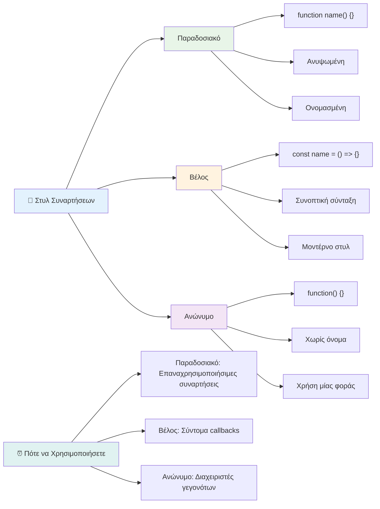
### Πότε να χρησιμοποιείτε κάθε στρατηγική

Πότε πρέπει να χρησιμοποιείτε κάθε προσέγγιση; Μια πρακτική οδηγία: αν πρόκειται να χρησιμοποιήσετε τη συνάρτηση πολλές φορές, δώστε της όνομα και ορίστε την ξεχωριστά. Αν είναι για μια συγκεκριμένη χρήση, σκεφτείτε ανώνυμη συνάρτηση. Και οι δύο – οι συναρτήσεις βέλους και η παραδοσιακή σύνταξη – είναι έγκυρες επιλογές, αν και οι συναρτήσεις βέλους είναι διαδεδομένες σε σύγχρονα codebases JavaScript.

### 🎨 **Έλεγχος Στυλ Συναρτήσεων: Επιλογή της Κατάλληλης Σύνταξης**

**Εξετάστε την κατανόηση σας στη σύνταξη:**
- Πότε μπορεί να προτιμάτε τις συναρτήσεις βέλους έναντι της παραδοσιακής σύνταξης;
- Ποιο είναι το βασικό πλεονέκτημα των ανώνυμων συναρτήσεων;
- Μπορείτε να σκεφτείτε μια κατάσταση όπου μια ονοματισμένη συνάρτηση είναι καλύτερη από μια ανώνυμη;

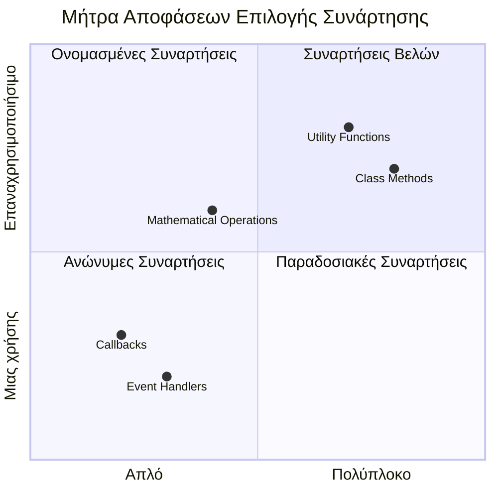
> **Σύγχρονη τάση**: Οι συναρτήσεις βέλους γίνονται η προεπιλογή για πολλούς προγραμματιστές λόγω της συμπαγούς σύνταξης, αλλά οι παραδοσιακές συναρτήσεις έχουν ακόμα τη θέση τους!

---


## 🚀 Πρόκληση

Μπορείτε να αποτυπώσετε με μια πρόταση τη διαφορά μεταξύ συναρτήσεων και μεθόδων; Δοκιμάστε το!

## Πρόκληση GitHub Copilot Agent 🚀

Χρησιμοποιήστε τη λειτουργία Agent για ολοκλήρωση της παρακάτω πρόκλησης:

**Περιγραφή:** Δημιουργήστε μια βιβλιοθήκη βοηθητικών μαθηματικών συναρτήσεων που να δείχνει διάφορες έννοιες συναρτήσεων που καλύφθηκαν σε αυτό το μάθημα, συμπεριλαμβανομένων των παραμέτρων, προεπιλεγμένων τιμών, τιμών επιστροφής και συναρτήσεων βέλους.

**Πρόταση:** Δημιουργήστε ένα αρχείο JavaScript με όνομα `mathUtils.js` που περιέχει τις ακόλουθες συναρτήσεις:
1. Μια συνάρτηση `add` που παίρνει δύο παραμέτρους και επιστρέφει το άθροισμά τους
2. Μια συνάρτηση `multiply` με προεπιλεγμένες παραμέτρους (δεύτερη παράμετρος με προεπιλογή την 1)
3. Μια συνάρτηση βέλους `square` που παίρνει έναν αριθμό και επιστρέφει το τετράγωνό του
4. Μια συνάρτηση `calculate` που δέχεται μια άλλη συνάρτηση ως παράμετρο και δύο αριθμούς, και εφαρμόζει τη συνάρτηση σε αυτούς τους αριθμούς
5. Επιδείξτε κλήσεις κάθε συνάρτησης με κατάλληλες δοκιμαστικές περιπτώσεις

Μάθετε περισσότερα για τη [λειτουργία agent](https://code.visualstudio.com/blogs/2025/02/24/introducing-copilot-agent-mode) εδώ.

## Μετά-Διάλεξη Κουίζ
[Μετά-διάλεξη κουίζ](https://ff-quizzes.netlify.app)

## Ανασκόπηση & Αυτο-Μελέτη

Αξίζει να [διαβάσετε λίγο παραπάνω για τις συναρτήσεις βέλους](https://developer.mozilla.org/docs/Web/JavaScript/Reference/Functions/Arrow_functions), καθώς χρησιμοποιούνται όλο και περισσότερο στα codebases. Πρακτική στη σύνταξη μιας συνάρτησης και στη συνέχεια ξαναγράψτε την χρησιμοποιώντας αυτή τη σύνταξη.

## Εργασία

[Διασκέδαση με Συναρτήσεις](assignment.md)

---

## 🧰 **Περίληψη Εργαλείων για τις JavaScript Συναρτήσεις σας**

```mermaid
graph TD
    A["🎯 Συναρτήσεις JavaScript"] --> B["📋 Δήλωση Συνάρτησης"]
    A --> C["📥 Παράμετροι"]
    A --> D["📤 Τιμές Επιστροφής"]
    A --> E["🎨 Σύγχρονη Σύνταξη"]
    
    B --> B1["function name() {}"]
    B --> B2["Περιγραφική ονομασία"]
    B --> B3["Επαναχρησιμοποιούμενα μπλοκ κώδικα"]
    
    C --> C1["Εισαγωγή δεδομένων"]
    C --> C2["Προεπιλεγμένες τιμές"]
    C --> C3["Πολλαπλοί παράμετροι"]
    
    D --> D1["εντολή return"]
    D --> D2["Έξοδος από συνάρτηση"]
    D --> D3["Επιστροφή δεδομένων"]
    
    E --> E1["Συναρτήσεις βέλους: () =>"]
    E --> E2["Ανώνυμες συναρτήσεις"]
    E --> E3["Συναρτήσεις υψηλότερης τάξης"]
    
    F["⚡ Κύρια Οφέλη"] --> F1["Επαναχρησιμοποίηση κώδικα"]
    F --> F2["Καλύτερη οργάνωση"]
    F --> F3["Ευκολότερος έλεγχος"]
    F --> F4["Μοναδικός σχεδιασμός"]
    
    style A fill:#e3f2fd
    style B fill:#e8f5e8
    style C fill:#fff3e0
    style D fill:#f3e5f5
    style E fill:#e0f2f1
    style F fill:#fce4ec
```
---

## 🚀 Χρονοδιάγραμμα Εξοικείωσής σας με τις Συναρτήσεις JavaScript

### ⚡ **Τι μπορείτε να κάνετε στα επόμενα 5 λεπτά**
- [ ] Γράψτε μια απλή συνάρτηση που επιστρέφει τον αγαπημένο σας αριθμό
- [ ] Δημιουργήστε μια συνάρτηση με δύο παραμέτρους που τις προσθέτει μαζί
- [ ] Δοκίμασε να μετατρέψεις μια παραδοσιακή συνάρτηση σε σύνταξη arrow function  
- [ ] Πρακτική στην πρόκληση: εξήγησε τη διαφορά μεταξύ συναρτήσεων και μεθόδων  

### 🎯 **Τι Μπορείς να Πετύχεις αυτή την Ώρα**  
- [ ] Ολοκλήρωσε το κουίζ μετά το μάθημα και ανασκόπησε οποιεσδήποτε συγκεχυμένες έννοιες  
- [ ] Δημιούργησε τη βιβλιοθήκη μαθηματικών βοηθητικών από την πρόκληση GitHub Copilot  
- [ ] Δημιούργησε μια συνάρτηση που χρησιμοποιεί άλλη συνάρτηση ως παράμετρο  
- [ ] Πρακτική στη συγγραφή συναρτήσεων με προεπιλεγμένες παραμέτρους  
- [ ] Πειραματίσου με template literals στις τιμές επιστροφής των συναρτήσεων  

### 📅 **Η Εβδομάδα σου για Κυριαρχία στις Συναρτήσεις**  
- [ ] Ολοκλήρωσε την εργασία "Διασκέδαση με Συναρτήσεις" με δημιουργικότητα  
- [ ] Αναδιάρθρωσε κομμάτια επαναλαμβανόμενου κώδικα που έχεις γράψει σε επαναχρησιμοποιήσιμες συναρτήσεις  
- [ ] Δημιούργησε έναν μικρό υπολογιστή χρησιμοποιώντας μόνο συναρτήσεις (χωρίς παγκόσμιες μεταβλητές)  
- [ ] Πρακτική στις arrow functions με μεθόδους πίνακα όπως `map()` και `filter()`  
- [ ] Δημιούργησε μια συλλογή βοηθητικών συναρτήσεων για κοινές εργασίες  
- [ ] Μελέτησε συναρτήσεις υψηλότερης τάξης και έννοιες λειτουργικού προγραμματισμού  

### 🌟 **Η Μεταμόρφωσή σου Μέσα στον Μήνα**  
- [ ] Κατάκτησε προχωρημένες έννοιες συναρτήσεων όπως οι κλεισίματα και το scope  
- [ ] Δημιούργησε ένα έργο που χρησιμοποιεί έντονα τη σύνθεση συναρτήσεων  
- [ ] Συνεισέφερε σε open source βελτιώνοντας την τεκμηρίωση συναρτήσεων  
- [ ] Δίδαξε κάποιον άλλον για τις συναρτήσεις και τις διαφορετικές συντακτικές μορφές  
- [ ] Εξέρευνησε παραδείγματα λειτουργικού προγραμματισμού σε JavaScript  
- [ ] Δημιούργησε μια προσωπική βιβλιοθήκη επαναχρησιμοποιήσιμων συναρτήσεων για μελλοντικά έργα  

### 🏆 **Τελικός Έλεγχος Πρωταθλητή Συναρτήσεων**  

**Γιόρτασε την κυριαρχία σου στις συναρτήσεις:**  
- Ποια είναι η πιο χρήσιμη συνάρτηση που έχεις δημιουργήσει μέχρι τώρα;  
- Πώς έχει αλλάξει ο τρόπος που σκέφτεσαι για την οργάνωση του κώδικα η εκμάθηση για τις συναρτήσεις;  
- Ποια σύνταξη συναρτήσεων προτιμάς και γιατί;  
- Ποιο πραγματικό πρόβλημα θα έλυνες γράφοντας μια συνάρτηση;  

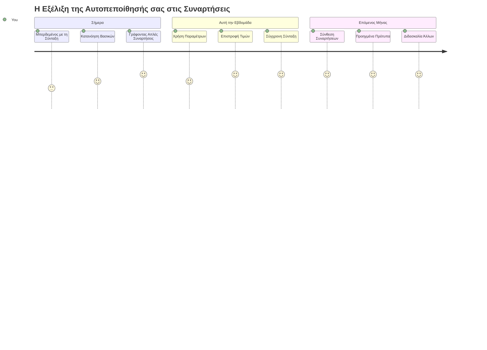
> 🎉 **Έχεις κατακτήσει μία από τις πιο ισχυρές έννοιες του προγραμματισμού!** Οι συναρτήσεις είναι τα δομικά στοιχεία των μεγαλύτερων προγραμμάτων. Κάθε εφαρμογή που θα δημιουργήσεις θα χρησιμοποιεί συναρτήσεις για να οργανώσει, να επαναχρησιμοποιήσει και να δομήσει τον κώδικα. Τώρα κατανοείς πώς να πακετάρεις τη λογική σε επαναχρησιμοποιήσιμα στοιχεία, κάνοντάς σε πιο αποδοτικό και αποτελεσματικό προγραμματιστή. Καλώς ήρθες στον κόσμο του modular προγραμματισμού! 🚀

---

<!-- CO-OP TRANSLATOR DISCLAIMER START -->
**Αποποίηση Ευθυνών**:  
Αυτό το έγγραφο έχει μεταφραστεί χρησιμοποιώντας την υπηρεσία αυτόματης μετάφρασης AI [Co-op Translator](https://github.com/Azure/co-op-translator). Παρόλο που προσπαθούμε για ακρίβεια, παρακαλούμε να έχετε υπόψη πως οι αυτοματοποιημένες μεταφράσεις ενδέχεται να περιέχουν λάθη ή ανακρίβειες. Το πρωτότυπο έγγραφο στη μητρική του γλώσσα πρέπει να θεωρείται ως η αυθεντική πηγή. Για κρίσιμες πληροφορίες, συνιστάται επαγγελματική μετάφραση από ανθρώπους. Δεν φέρουμε ευθύνη για οποιεσδήποτε παρεξηγήσεις ή λανθασμένες ερμηνείες προκύψουν από τη χρήση αυτής της μετάφρασης.
<!-- CO-OP TRANSLATOR DISCLAIMER END -->