<!--
CO_OP_TRANSLATOR_METADATA:
{
  "original_hash": "c688385d15dd3645e924ea0ffee8967f",
  "translation_date": "2026-01-06T20:23:06+00:00",
  "source_file": "2-js-basics/3-making-decisions/README.md",
  "language_code": "el"
}
-->
# Βασικά JavaScript: Λήψη Αποφάσεων

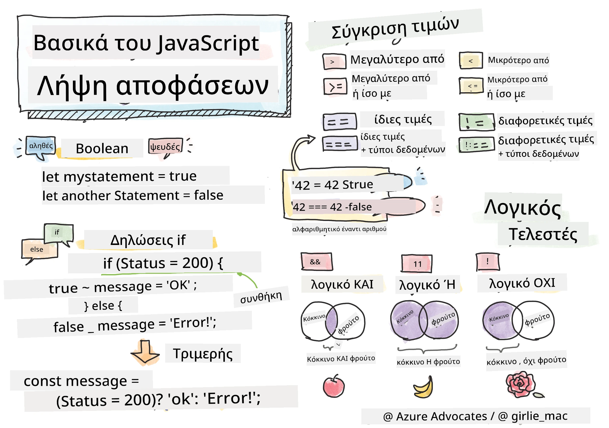

> Σκέτς από [Tomomi Imura](https://twitter.com/girlie_mac)

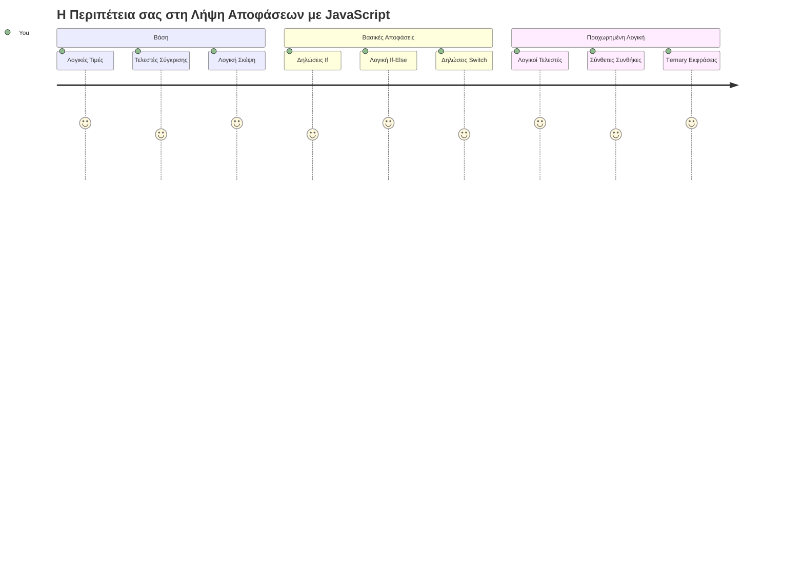
Έχετε αναρωτηθεί πώς οι εφαρμογές παίρνουν έξυπνες αποφάσεις; Όπως πώς ένα σύστημα πλοήγησης επιλέγει τη γρηγορότερη διαδρομή, ή πώς ένας θερμοστάτης αποφασίζει πότε να ανάψει τη θέρμανση; Αυτή είναι η βασική έννοια της λήψης αποφάσεων στον προγραμματισμό.

Όπως η Αναλυτική Μηχανή του Charles Babbage σχεδιάστηκε να ακολουθεί διαφορετικές ακολουθίες λειτουργιών βάσει συνθηκών, έτσι και τα σύγχρονα προγράμματα JavaScript πρέπει να παίρνουν επιλογές βάσει μεταβαλλόμενων περιστάσεων. Αυτή η ικανότητα να διακλαδίζονται και να παίρνουν αποφάσεις είναι που μετατρέπει τον στατικό κώδικα σε ευέλικτες, έξυπνες εφαρμογές.

Σε αυτό το μάθημα, θα μάθετε πώς να υλοποιείτε λογική υπό συνθήκες στα προγράμματά σας. Θα εξερευνήσουμε τις συνθήκες, τους τελεστές σύγκρισης και τις λογικές εκφράσεις που επιτρέπουν στον κώδικά σας να αξιολογεί καταστάσεις και να αντιδρά κατάλληλα.

## Πρότυπο Quiz πριν το Μάθημα

[Πρότυπο quiz πριν το μάθημα](https://ff-quizzes.netlify.app/web/quiz/11)

Η ικανότητα να παίρνεις αποφάσεις και να ελέγχεις τη ροή του προγράμματος είναι ένα θεμελιώδες στοιχείο του προγραμματισμού. Αυτή η ενότητα καλύπτει πώς να ελέγχεις τη διαδρομή εκτέλεσης των προγραμμάτων JavaScript χρησιμοποιώντας λογικές τιμές και λογική υπό συνθήκη.

[](https://youtube.com/watch?v=SxTp8j-fMMY "Making Decisions")

> 🎥 Κάντε κλικ στην εικόνα παραπάνω για ένα βίντεο για τη λήψη αποφάσεων.

> Μπορείτε να πάρετε αυτό το μάθημα στο [Microsoft Learn](https://docs.microsoft.com/learn/modules/web-development-101-if-else/?WT.mc_id=academic-77807-sagibbon)!

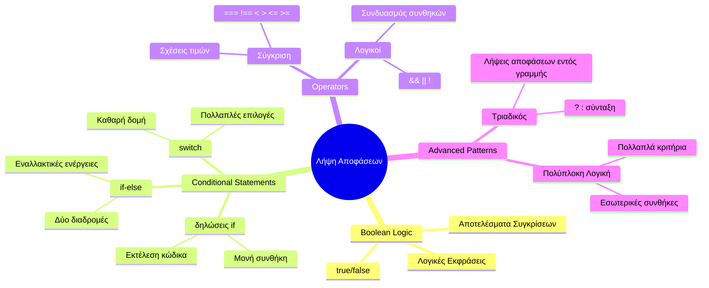
## Μια Σύντομη Επανεξέταση των Booleans

Πριν εξερευνήσουμε τη λήψη αποφάσεων, ας επανεξετάσουμε τις λογικές τιμές από το προηγούμενο μάθημά μας. Ονομάζονται από τον μαθηματικό George Boole και αυτές οι τιμές αντιπροσωπεύουν δυαδικές καταστάσεις - είτε `true` είτε `false`. Δεν υπάρχει ασάφεια, ούτε ενδιάμεση κατάσταση.

Αυτές οι δυαδικές τιμές αποτελούν τη βάση όλων των υπολογιστικών λογικών. Κάθε απόφαση που παίρνει το πρόγραμμα σας τελικά καταλήγει σε αξιολόγηση Boolean.

Η δημιουργία Boolean μεταβλητών είναι απλή:

```javascript
let myTrueBool = true;
let myFalseBool = false;
```

Αυτό δημιουργεί δύο μεταβλητές με ρητές λογικές τιμές.

✅ Τα Booleans πήραν το όνομά τους από τον Άγγλο μαθηματικό, φιλόσοφο και λογικό George Boole (1815–1864).

## Τελεστές Σύγκρισης και Booleans

Στην πράξη, σπάνια θα ορίσετε χειροκίνητα τιμές Boolean. Αντίθετα, θα τις παράγετε αξιολογώντας συνθήκες: "Είναι αυτός ο αριθμός μεγαλύτερος από εκείνον;" ή "Είναι αυτές οι τιμές ίσες;"

Οι τελεστές σύγκρισης επιτρέπουν αυτές τις αξιολογήσεις. Συγκρίνουν τιμές και επιστρέφουν λογικά αποτελέσματα με βάση τη σχέση μεταξύ των τελεστέων.

| Σύμβολο | Περιγραφή                                                                                                                                               | Παράδειγμα         |
| ------ | -------------------------------------------------------------------------------------------------------------------------------------------------------- | ------------------ |
| `<`    | **Μικρότερο από**: Συγκρίνει δύο τιμές και επιστρέφει την Boolean τιμή `true` αν η τιμή στα αριστερά είναι μικρότερη από την δεξιά                      | `5 < 6 // true`    |
| `<=`   | **Μικρότερο ή ίσο με**: Συγκρίνει δύο τιμές και επιστρέφει την Boolean τιμή `true` αν η τιμή στα αριστερά είναι μικρότερη ή ίση με την δεξιά             | `5 <= 6 // true`   |
| `>`    | **Μεγαλύτερο από**: Συγκρίνει δύο τιμές και επιστρέφει την Boolean τιμή `true` αν η τιμή στα αριστερά είναι μεγαλύτερη από την δεξιά                     | `5 > 6 // false`   |
| `>=`   | **Μεγαλύτερο ή ίσο με**: Συγκρίνει δύο τιμές και επιστρέφει την Boolean τιμή `true` αν η τιμή στα αριστερά είναι μεγαλύτερη ή ίση με την δεξιά            | `5 >= 6 // false`  |
| `===`  | **Αυστηρή ισότητα**: Συγκρίνει δύο τιμές και επιστρέφει την Boolean τιμή `true` αν οι τιμές στα δεξιά και αριστερά είναι ίσες ΚΑΙ είναι του ίδιου τύπου   | `5 === 6 // false` |
| `!==`  | **Διαφορά**: Συγκρίνει δύο τιμές και επιστρέφει την αντίθετη Boolean τιμή από αυτή που θα επέστρεφε ο τελεστής αυστηρής ισότητας                            | `5 !== 6 // true`  |

✅ Ελέγξτε τις γνώσεις σας γράφοντας μερικές συγκρίσεις στην κονσόλα του προγράμματος περιήγησής σας. Σας εκπλήσσει κάποιο από τα επιστρεφόμενα δεδομένα;

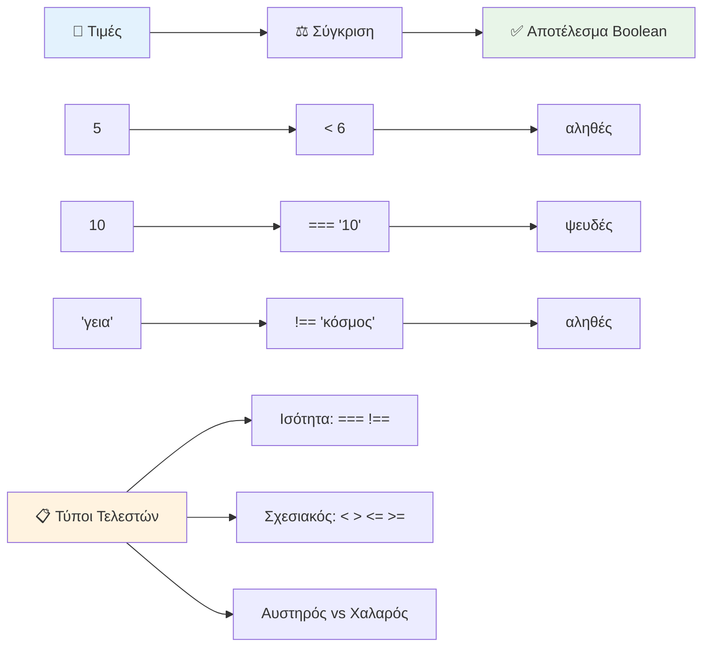
### 🧠 **Έλεγχος Επάρκειας στη Σύγκριση: Κατανόηση της Λογικής Boolean**

**Δοκιμάστε την κατανόησή σας στις συγκρίσεις:**
- Γιατί νομίζετε ότι το `===` (αυστηρή ισότητα) προτιμάται γενικά από το `==` (χαλαρή ισότητα);
- Μπορείτε να προβλέψετε τι επιστρέφει το `5 === '5'`; Τι γίνεται με το `5 == '5'`;
- Ποια είναι η διαφορά μεταξύ `!==` και `!=`;

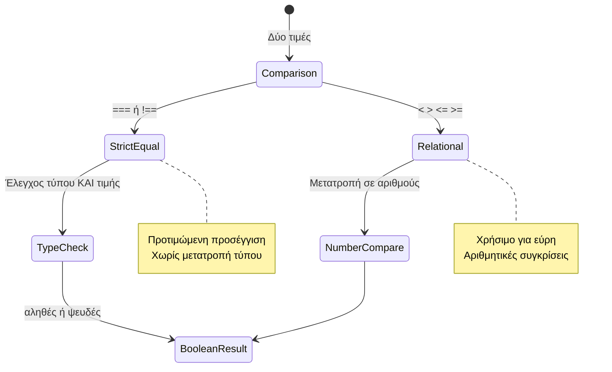
> **Επαγγελματική συμβουλή**: Χρησιμοποιείτε πάντα `===` και `!==` για ελέγχους ισότητας εκτός αν χρειάζεστε συγκεκριμένα μετατροπή τύπου. Αυτό αποτρέπει απρόβλεπτες συμπεριφορές!

## Δήλωση If

Η δήλωση `if` είναι σαν να κάνετε μια ερώτηση στον κώδικά σας. "Αν αυτή η συνθήκη είναι αληθής, τότε κάνε αυτό το πράγμα." Είναι πιθανώς το πιο σημαντικό εργαλείο που θα χρησιμοποιήσετε για να παίρνετε αποφάσεις στο JavaScript.

Δείτε πώς λειτουργεί:

```javascript
if (condition) {
  // Η συνθήκη είναι αληθής. Ο κώδικας σε αυτό το μπλοκ θα εκτελεστεί.
}
```

Η συνθήκη μπαίνει μέσα στις παρενθέσεις, και αν είναι `true`, το JavaScript εκτελεί τον κώδικα μέσα στις αγκύλες. Αν είναι `false`, το JavaScript παρακάμπτει ολόκληρο αυτό το μπλοκ.

Θα χρησιμοποιείτε συχνά τους τελεστές σύγκρισης για να δημιουργήσετε αυτές τις συνθήκες. Ας δούμε ένα πρακτικό παράδειγμα:

```javascript
let currentMoney = 1000;
let laptopPrice = 800;

if (currentMoney >= laptopPrice) {
  // Η συνθήκη είναι αληθής. Ο κώδικας σε αυτό το μπλοκ θα εκτελεστεί.
  console.log("Getting a new laptop!");
}
```

Καθώς το `1000 >= 800` αξιολογείται ως `true`, ο κώδικας μέσα στο μπλοκ εκτελείται, εμφανίζοντας "Getting a new laptop!" στην κονσόλα.

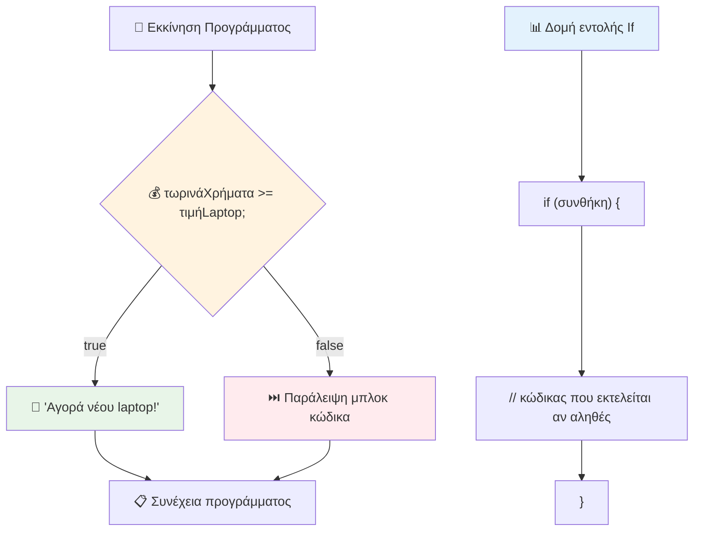
## Δήλωση If..Else

Αλλά τι γίνεται αν θέλετε το πρόγραμμα να κάνει κάτι διαφορετικό όταν η συνθήκη είναι ψευδής; Εκεί μπαίνει το `else` - είναι σαν να έχετε εναλλακτικό σχέδιο.

Η δήλωση `else` σας δίνει έναν τρόπο να πείτε "αν αυτή η συνθήκη δεν είναι αληθής, κάνε αυτό το άλλο πράγμα αντί γι' αυτό."

```javascript
let currentMoney = 500;
let laptopPrice = 800;

if (currentMoney >= laptopPrice) {
  // Η συνθήκη είναι αληθής. Ο κώδικας σε αυτό το μπλοκ θα εκτελεστεί.
  console.log("Getting a new laptop!");
} else {
  // Η συνθήκη είναι ψευδής. Ο κώδικας σε αυτό το μπλοκ θα εκτελεστεί.
  console.log("Can't afford a new laptop, yet!");
}
```

Τώρα, επειδή το `500 >= 800` είναι `false`, το JavaScript παρακάμπτει το πρώτο μπλοκ και εκτελεί το μπλοκ `else` αντί γι' αυτό. Θα δείτε "Can't afford a new laptop, yet!" στην κονσόλα.

✅ Δοκιμάστε να κατανοήσετε αυτόν τον κώδικα και τον επόμενο τρέχοντάς τους στην κονσόλα ενός προγράμματος περιήγησης. Αλλάξτε τις τιμές των μεταβλητών currentMoney και laptopPrice για να δείτε την αλλαγή στο `console.log()` που επιστρέφεται.

### 🎯 **Έλεγχος Λογικής If-Else: Διακλαδώσεις**

**Αξιολογήστε την κατανόηση της λογικής υπό συνθήκη:**
- Τι συμβαίνει αν το `currentMoney` ισούται ακριβώς με το `laptopPrice`;
- Μπορείτε να σκεφτείτε ένα ρεαλιστικό σενάριο όπου η λογική if-else θα ήταν χρήσιμη;
- Πώς θα μπορούσατε να το επεκτείνετε για να διαχειρίζεται πολλαπλές τιμές τιμών;

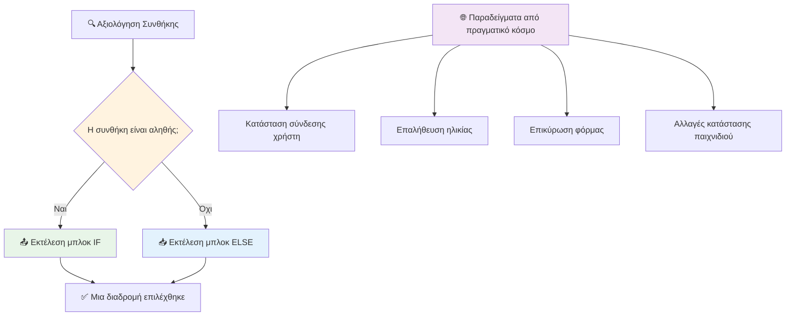
> **Βασική ιδέα**: Η if-else εξασφαλίζει ότι ακολουθείται ακριβώς μία διαδρομή. Αυτό εγγυάται ότι το πρόγραμμά σας πάντα έχει απάντηση για οποιαδήποτε συνθήκη!

## Δήλωση Switch

Μερικές φορές χρειάζεται να συγκρίνουμε μία τιμή με πολλαπλές επιλογές. Αν και θα μπορούσατε να αλυσιδωθείτε με πολλές δηλώσεις `if..else`, αυτή η προσέγγιση γίνεται δύσκολη στη διαχείριση. Η δήλωση `switch` παρέχει καθαρότερη δομή για την διαχείριση πολλαπλών διακριτών τιμών.

Η έννοια είναι παρόμοια με τα μηχανικά συστήματα εναλλαγής που χρησιμοποιούνταν στις πρώτες τηλεφωνικές κέντρα - μια τιμή εισόδου καθορίζει ποια συγκεκριμένη διαδρομή ακολουθεί η εκτέλεση.

```javascript
switch (expression) {
  case x:
    // μπλοκ κώδικα
    break;
  case y:
    // μπλοκ κώδικα
    break;
  default:
    // μπλοκ κώδικα
}
```

Δείτε πώς είναι δομημένο:
- Η JavaScript αξιολογεί την έκφραση μία φορά
- Ψάχνει κάθε `case` για να βρει μια αντιστοιχία
- Όταν βρίσκει αντιστοιχία, εκτελεί αυτόν τον κώδικα
- Το `break` λέει στη JavaScript να σταματήσει και να βγει από το switch
- Αν δεν ταιριάζει κανένα case, εκτελεί το μπλοκ `default` (αν υπάρχει)

```javascript
// Πρόγραμμα που χρησιμοποιεί δήλωση switch για την ημέρα της εβδομάδας
let dayNumber = 2;
let dayName;

switch (dayNumber) {
  case 1:
    dayName = "Monday";
    break;
  case 2:
    dayName = "Tuesday";
    break;
  case 3:
    dayName = "Wednesday";
    break;
  default:
    dayName = "Unknown day";
    break;
}
console.log(`Today is ${dayName}`);
```

Σε αυτό το παράδειγμα, η JavaScript βλέπει ότι το `dayNumber` είναι `2`, βρίσκει το κατάλληλο `case 2`, ορίζει το `dayName` σε "Tuesday" και μετά διακόπτει το switch. Το αποτέλεσμα; "Today is Tuesday" εμφανίζεται στην κονσόλα.

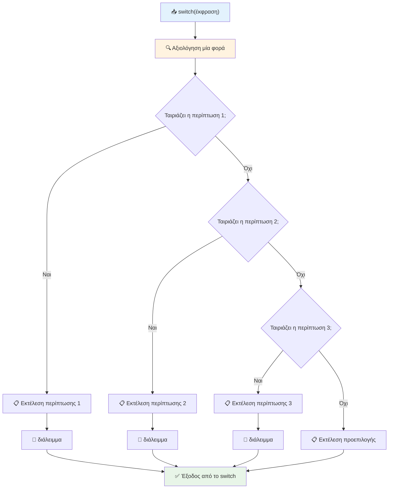
✅ Δοκιμάστε να κατανοήσετε αυτόν τον κώδικα και τον επόμενο τρέχοντάς τον στην κονσόλα ενός προγράμματος περιήγησης. Αλλάξτε την τιμή της μεταβλητής a για να δείτε την αλλαγή στο `console.log()` που επιστρέφεται.

### 🔄 **Αριστεία στη Δήλωση Switch: Πολλαπλές Επιλογές**

**Δοκιμάστε την κατανόηση του switch:**
- Τι συμβαίνει αν ξεχάσετε μια δήλωση `break`;
- Πότε θα χρησιμοποιούσατε `switch` αντί για πολλαπλές δηλώσεις `if-else`;
- Γιατί είναι χρήσιμο το case `default` ακόμα κι αν φαίνεται ότι έχετε καλύψει όλες τις πιθανότητες;

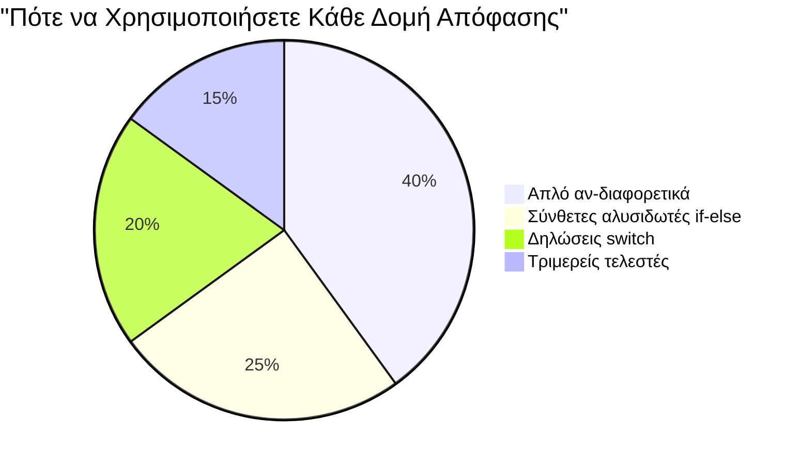
> **Καλύτερη πρακτική**: Χρησιμοποιήστε το `switch` όταν συγκρίνετε μια μεταβλητή με πολλαπλές συγκεκριμένες τιμές. Χρησιμοποιήστε το `if-else` για ελέγχους εύρους ή πολύπλοκες συνθήκες!

## Λογικοί Τελεστές και Booleans

Σύνθετες αποφάσεις συχνά απαιτούν την αξιολόγηση πολλαπλών συνθηκών ταυτόχρονα. Όπως η λογική άλγεβρα επιτρέπει στους μαθηματικούς να συνδυάζουν λογικές εκφράσεις, έτσι και ο προγραμματισμός προσφέρει λογικούς τελεστές για να συνδέσετε πολλαπλές λογικές συνθήκες.

Αυτοί οι τελεστές επιτρέπουν την προχωρημένη λογική υπό συνθήκη, συνδυάζοντας απλές αξιολογήσεις αληθούς/ψευδούς.

| Σύμβολο | Περιγραφή                                                                                      | Παράδειγμα                                                               |
| ------ | ---------------------------------------------------------------------------------------------- | ----------------------------------------------------------------------- |
| `&&`   | **Λογικό ΚΑΙ**: Συγκρίνει δύο λογικές εκφράσεις. Επιστρέφει `true` **μόνο αν** και οι δύο είναι αληθείς | `(5 > 3) && (5 < 10) // ΚΑΙ οι δύο είναι αληθείς. Επιστρέφει true`        |
| `\|\|` | **Λογικό 'Ή'**: Συγκρίνει δύο λογικές εκφράσεις. Επιστρέφει `true` αν τουλάχιστον μία είναι αληθής | `(5 > 10) \|\| (5 < 10) // Μία πλευρά είναι false, η άλλη true. Επιστρέφει true` |
| `!`    | **Λογικό ΟΧΙ**: Επιστρέφει την αντίθετη τιμή μιας λογικής έκφρασης                               | `!(5 > 10) // Το 5 δεν είναι μεγαλύτερο από 10, άρα το "!" το κάνει true` |

Αυτοί οι τελεστές σας επιτρέπουν να συνδυάζετε συνθήκες με χρήσιμους τρόπους:
- AND (`&&`) σημαίνει και οι δύο συνθήκες πρέπει να είναι αληθείς
- OR (`||`) σημαίνει η τουλάχιστον μία συνθήκη πρέπει να είναι αληθής  
- NOT (`!`) αντιστρέφει το true σε false (και το αντίστροφο)

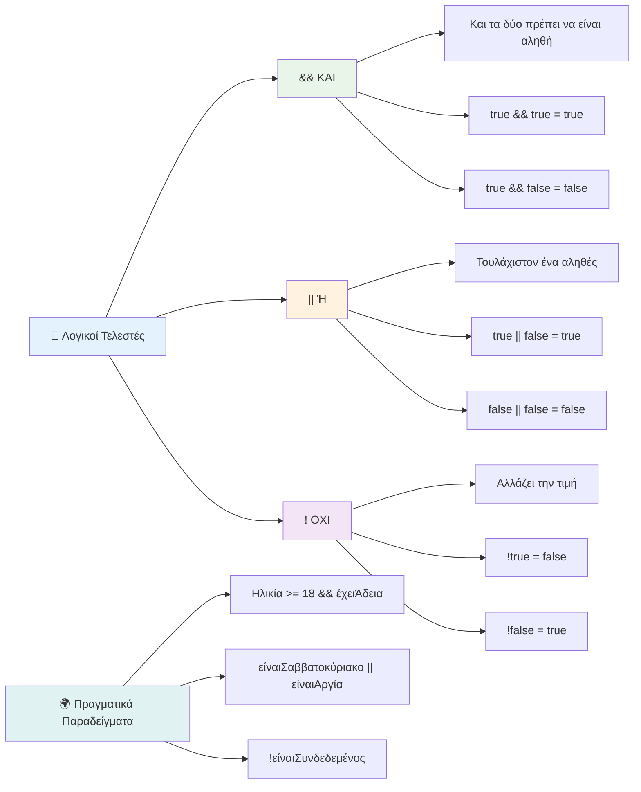
## Συνθήκες και Αποφάσεις με Λογικούς Τελεστές

Ας δούμε αυτούς τους λογικούς τελεστές σε δράση με ένα πιο ρεαλιστικό παράδειγμα:

```javascript
let currentMoney = 600;
let laptopPrice = 800;
let laptopDiscountPrice = laptopPrice - (laptopPrice * 0.2); // Τιμή laptop με έκπτωση 20 τοις εκατό

if (currentMoney >= laptopPrice || currentMoney >= laptopDiscountPrice) {
  // Η συνθήκη ισχύει. Ο κώδικας σε αυτό το μπλοκ θα εκτελεστεί.
  console.log("Getting a new laptop!");
} else {
  // Η συνθήκη δεν ισχύει. Ο κώδικας σε αυτό το μπλοκ θα εκτελεστεί.
  console.log("Can't afford a new laptop, yet!");
}
```

Σε αυτό το παράδειγμα: υπολογίζουμε μια τιμή έκπτωσης 20% (640), έπειτα αξιολογούμε αν τα διαθέσιμα χρήματά μας καλύπτουν είτε την πλήρη τιμή Ή την τιμή με έκπτωση. Καθώς τα 600 πληρούν το όριο της τιμής με έκπτωση των 640, η συνθήκη αξιολογείται ως αληθής.

### 🧮 **Έλεγχος Λογικών Τελεστών: Συνδυασμός Συνθηκών**

**Δοκιμάστε την κατανόησή σας στους λογικούς τελεστές:**
- Στην έκφραση `A && B`, τι συμβαίνει αν το A είναι false; Αξιολογείται καν το B;
- Μπορείτε να σκεφτείτε σενάριο όπου θα χρειαστείτε τους τρεις τελεστές (&&, ||, !) μαζί;
- Ποια είναι η διαφορά μεταξύ `!user.isActive` και `user.isActive !== true`;

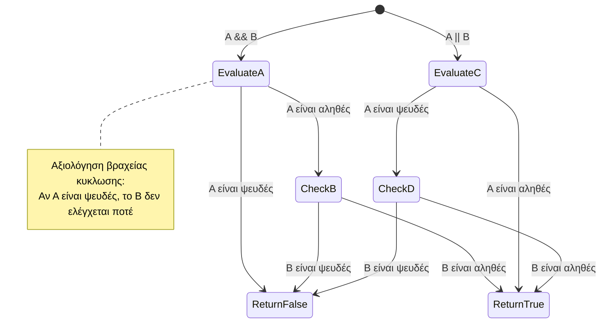
> **Συμβουλή απόδοσης**: Η JavaScript χρησιμοποιεί "σύντομη αξιολόγηση" - στο `A && B`, αν το A είναι false, το B δεν αξιολογείται καν. Χρησιμοποιήστε το προς όφελός σας!

### Τελεστής Άρνησης

Μερικές φορές είναι πιο εύκολο να σκεφτείτε πότε κάτι **δεν** είναι αληθές. Όπως αντί να ρωτήσετε "Είναι ο χρήστης συνδεδεμένος;", μπορεί να θέλετε να ρωτήσετε "Δεν είναι ο χρήστης συνδεδεμένος;" Ο τελεστής θαυμαστικού (`!`) αντιστρέφει για εσάς τη λογική.

```javascript
if (!condition) {
  // εκτελείται αν η συνθήκη είναι ψευδής
} else {
  // εκτελείται αν η συνθήκη είναι αληθής
}
```

Ο τελεστής `!` είναι σαν να λέτε "το αντίθετο του..." – αν κάτι είναι `true`, το `!` το κάνει `false`, και το αντίστροφο.

### Τριμερής Έκφραση (Ternary Expressions)

Για απλές συνθήκες ανάθεσης τιμής, το JavaScript παρέχει τον **τριμερή τελεστή**. Αυτή η συνοπτική σύνταξη σας επιτρέπει να γράψετε μια λογική υπό συνθήκη σε μία γραμμή, χρήσιμη όταν χρειάζεται να αναθέσετε μία από δύο τιμές βάσει μιας συνθήκης.

```javascript
let variable = condition ? returnThisIfTrue : returnThisIfFalse;
```

Διαβάζεται σαν ερώτηση: "Είναι αυτή η συνθήκη αληθής; Αν ναι, χρησιμοποίησε αυτή την τιμή. Αν όχι, χρησιμοποίησε εκείνη την τιμή."

Παρακάτω υπάρχει ένα πιο απτό παράδειγμα:

```javascript
let firstNumber = 20;
let secondNumber = 10;
let biggestNumber = firstNumber > secondNumber ? firstNumber : secondNumber;
```

✅ Πάρτε λίγο χρόνο να διαβάσετε αυτόν τον κώδικα μερικές φορές. Καταλαβαίνετε πώς λειτουργούν αυτοί οι τελεστές;

Αυτή η γραμμή λέει: "Είναι ο `firstNumber` μεγαλύτερος από τον `secondNumber`; Αν ναι, βάλε το `firstNumber` στο `biggestNumber`. Αν όχι, βάλε το `secondNumber` στο `biggestNumber`."

Ο τριμερής τελεστής είναι απλά ένας πιο σύντομος τρόπος να γράψετε την παραδοσιακή δήλωση `if..else`:

```javascript
let biggestNumber;
if (firstNumber > secondNumber) {
  biggestNumber = firstNumber;
} else {
  biggestNumber = secondNumber;
}
```

Και οι δύο προσεγγίσεις παράγουν τα ίδια αποτελέσματα. Ο τριμερής τελεστής προσφέρει συνοπτικότητα, ενώ η παραδοσιακή δομή if-else μπορεί να είναι πιο ευανάγνωστη για πολύπλοκες συνθήκες.

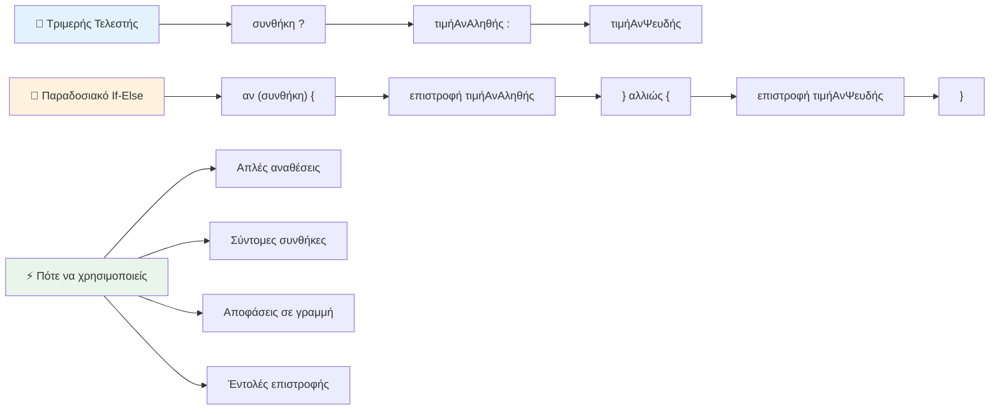
---


## 🚀 Πρόκληση

Δημιουργήστε ένα πρόγραμμα που γράφεται πρώτα με λογικούς τελεστές, και στη συνέχεια ξαναγράψτε το χρησιμοποιώντας μια τριμερή έκφραση. Ποια σύνταξη προτιμάτε;

---

## Πρόκληση GitHub Copilot Agent 🚀

Χρησιμοποιήστε τη λειτουργία Agent για να ολοκληρώσετε την παρακάτω πρόκληση:

**Περιγραφή:** Δημιουργήστε έναν ολοκληρωμένο υπολογιστή βαθμολογίας που να δείχνει πολλαπλές έννοιες λήψης αποφάσεων από αυτό το μάθημα, συμπεριλαμβανομένων των δηλώσεων if-else, των δηλώσεων switch, των λογικών τελεστών και των τριμερών εκφράσεων.

**Προτροπή:** Γράψτε ένα πρόγραμμα JavaScript που παίρνει τον αριθμητικό βαθμό ενός μαθητή (0-100) και καθορίζει το γράμμα βαθμού σύμφωνα με τα ακόλουθα κριτήρια:
- A: 90-100
- B: 80-89  
- C: 70-79
- D: 60-69
- F: Κάτω από 60

Απαιτήσεις:
1. Χρησιμοποιήστε μια δήλωση if-else για να καθορίσετε το γράμμα βαθμού
2. Χρησιμοποιήστε λογικούς τελεστές για να ελέγξετε εάν ο μαθητής περνάει (βαθμός >= 60) ΚΑΙ έχει τιμητική διάκριση (βαθμός >= 90)  
3. Χρησιμοποιήστε μια δήλωση switch για να παρέχετε συγκεκριμένη ανατροφοδότηση για κάθε γράμμα βαθμού  
4. Χρησιμοποιήστε έναν τριαδικό τελεστή για να καθορίσετε αν ο μαθητής είναι επιλέξιμος για το επόμενο μάθημα (βαθμός >= 70)  
5. Συμπεριλάβετε έλεγχο εισόδου για να βεβαιωθείτε ότι η βαθμολογία είναι μεταξύ 0 και 100  

Δοκιμάστε το πρόγραμμά σας με διάφορες βαθμολογίες, συμπεριλαμβανομένων ακραίων περιπτώσεων όπως 59, 60, 89, 90, και μη έγκυρης εισόδου.

Μάθετε περισσότερα για το [agent mode](https://code.visualstudio.com/blogs/2025/02/24/introducing-copilot-agent-mode) εδώ.


## Post-Lecture Quiz

[Post-lecture quiz](https://ff-quizzes.netlify.app/web/quiz/12)

## Review & Self Study

Διαβάστε περισσότερα για τους πολλούς τελεστές που είναι διαθέσιμοι στον χρήστη [στο MDN](https://developer.mozilla.org/docs/Web/JavaScript/Reference/Operators).

Περιηγηθείτε στην υπέροχη [αναζήτηση τελεστών](https://joshwcomeau.com/operator-lookup/) του Josh Comeau!

## Assignment

[Operators](assignment.md)

---

## 🧠 **Περίληψη του Εργαλείου Λήψης Αποφάσεων Σας**

```mermaid
graph TD
    A["🎯 Αποφάσεις JavaScript"] --> B["🔍 Λογική Boolean"]
    A --> C["📊 Συνθήκες"]
    A --> D["🔗 Λογικοί Τελεστές"]
    A --> E["⚡ Προχωρημένα Σχέδια"]
    
    B --> B1["τιμές true/false"]
    B --> B2["Τελεστές σύγκρισης"]
    B --> B3["Έννοιες αλήθειας"]
    
    C --> C1["εντολές if"]
    C --> C2["αλυσίδες if-else"]
    C --> C3["εντολές switch"]
    
    D --> D1["&& (ΚΑΙ)"]
    D --> D2["|| (Ή)"]
    D --> D3["! (ΟΧΙ)"]
    
    E --> E1["Τριμερής τελεστής"]
    E --> E2["Αξιολόγηση συντομεύσεων"]
    E --> E3["Σύνθετες συνθήκες"]
    
    F["💡 Κύριες Αρχές"] --> F1["Καθαρές αναγνώσιμες συνθήκες"]
    F --> F2["Συνεπής στυλ σύγκρισης"]
    F --> F3["Σωστή προτεραιότητα τελεστών"]
    F --> F4["Αποδοτική σειρά αξιολόγησης"]
    
    style A fill:#e3f2fd
    style B fill:#e8f5e8
    style C fill:#fff3e0
    style D fill:#f3e5f5
    style E fill:#e0f2f1
    style F fill:#fce4ec
```
---

## 🚀 Η Χρονογραμμή Εμπειρίας σας στη Λήψη Αποφάσεων με JavaScript

### ⚡ **Τι Μπορείτε να Κάνετε στα Επόμενα 5 Λεπτά**
- [ ] Εξασκηθείτε στους τελεστές σύγκρισης στην κονσόλα του προγράμματος περιήγησής σας
- [ ] Γράψτε μια απλή δήλωση if-else που ελέγχει την ηλικία σας
- [ ] Δοκιμάστε την πρόκληση: ξαναγράψτε ένα if-else χρησιμοποιώντας έναν τριαδικό τελεστή
- [ ] Δοκιμάστε τι συμβαίνει με διαφορετικές "αληθείς" και "ψευδείς" τιμές

### 🎯 **Τι Μπορείτε να Επιτύχετε Αυτήν την Ώρα**
- [ ] Ολοκληρώστε το κουίζ μετά το μάθημα και αναθεωρήστε τυχόν συγκεχυμένες έννοιες
- [ ] Δημιουργήστε τον ολοκληρωμένο υπολογιστή βαθμολογίας από την πρόκληση GitHub Copilot
- [ ] Δημιουργήστε ένα απλό δέντρο αποφάσεων για ένα πραγματικό σενάριο (όπως να επιλέξετε τι να φορέσετε)
- [ ] Εξασκηθείτε στον συνδυασμό πολλαπλών συνθηκών με λογικούς τελεστές
- [ ] Πειραματιστείτε με δηλώσεις switch για διαφορετικές περιπτώσεις χρήσης

### 📅 **Η Εβδομαδιαία Μάστερ Λογικής Σας**
- [ ] Ολοκληρώστε την ανάθεση για τους τελεστές με δημιουργικά παραδείγματα
- [ ] Κατασκευάστε μια μικρή εφαρμογή κουίζ χρησιμοποιώντας διάφορες δομές συνθηκών
- [ ] Δημιουργήστε έναν επικυρωτή φόρμας που ελέγχει πολλαπλές συνθήκες εισόδου
- [ ] Εξασκηθείτε στις ασκήσεις του Josh Comeau για [αναζήτηση τελεστών](https://joshwcomeau.com/operator-lookup/)
- [ ] Αναδιαρθρώστε υπάρχοντα κώδικα για να χρησιμοποιεί πιο κατάλληλες δομές συνθηκών
- [ ] Μελετήστε την εκτίμηση βραχυκυκλωμάτων και τις επιπτώσεις στην απόδοση

### 🌟 **Η Μηνιαία Μεταμόρφωσή σας**
- [ ] Κυριαρχήστε σε σύνθετες εμφωλευμένες συνθήκες και διατηρήστε την αναγνωσιμότητα του κώδικα
- [ ] Δημιουργήστε μια εφαρμογή με εξελιγμένη λογική λήψης αποφάσεων
- [ ] Συμβάλετε στο ανοιχτό λογισμικό βελτιώνοντας τη λογική συνθηκών σε υπάρχοντα έργα
- [ ] Διδάξτε κάποιον άλλο για τις διαφορετικές δομές συνθηκών και πότε να χρησιμοποιούνται
- [ ] Εξερευνήστε τις λειτουργικές προσεγγίσεις στη λογική συνθηκών
- [ ] Δημιουργήστε έναν προσωπικό οδηγό αναφοράς για τις βέλτιστες πρακτικές συνθηκών

### 🏆 **Έλεγχος Τελικού Πρωταθλητή στη Λήψη Αποφάσεων**

**Γιορτάστε την κυριαρχία της λογικής σας σκέψης:**  
- Ποια είναι η πιο σύνθετη λογική απόφασης που έχετε υλοποιήσει επιτυχώς;  
- Ποια δομή συνθηκών σας φαίνεται πιο φυσική και γιατί;  
- Πώς η εκμάθηση των λογικών τελεστών άλλαξε τον τρόπο επίλυσης προβλημάτων σας;  
- Ποια πραγματική εφαρμογή θα ωφελούνταν από εξελιγμένη λογική λήψης αποφάσεων;  

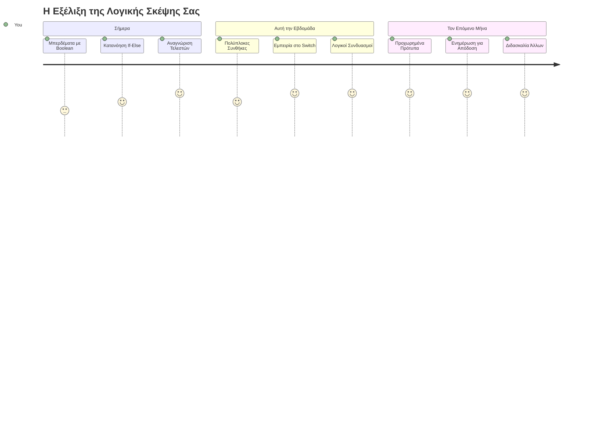
> 🧠 **Έχετε κυριαρχήσει στην τέχνη της ψηφιακής λήψης αποφάσεων!** Κάθε διαδραστική εφαρμογή βασίζεται σε λογική συνθηκών για να ανταποκριθεί έξυπνα στις ενέργειες του χρήστη και τις μεταβαλλόμενες συνθήκες. Τώρα καταλαβαίνετε πώς να κάνετε τα προγράμματά σας να σκέφτονται, να αξιολογούν και να επιλέγουν κατάλληλες απαντήσεις. Αυτό το λογικό θεμέλιο θα υποστηρίξει κάθε δυναμική εφαρμογή που δημιουργείτε! 🎉

---

<!-- CO-OP TRANSLATOR DISCLAIMER START -->
**Αποποίηση ευθυνών**:  
Αυτό το έγγραφο έχει μεταφραστεί χρησιμοποιώντας την υπηρεσία αυτόματης μετάφρασης AI [Co-op Translator](https://github.com/Azure/co-op-translator). Παρότι καταβάλλουμε προσπάθειες για ακρίβεια, παρακαλούμε να έχετε υπόψη ότι οι αυτοματοποιημένες μεταφράσεις ενδέχεται να περιέχουν λάθη ή ανακρίβειες. Το πρωτότυπο έγγραφο στη γλώσσα του θεωρείται η επίσημη πηγή. Για κρίσιμες πληροφορίες συνιστάται επαγγελματική ανθρωπογενής μετάφραση. Δεν φέρουμε ευθύνη για τυχόν παρεξηγήσεις ή λανθασμένες ερμηνείες που προκύπτουν από τη χρήση αυτής της μετάφρασης.
<!-- CO-OP TRANSLATOR DISCLAIMER END -->