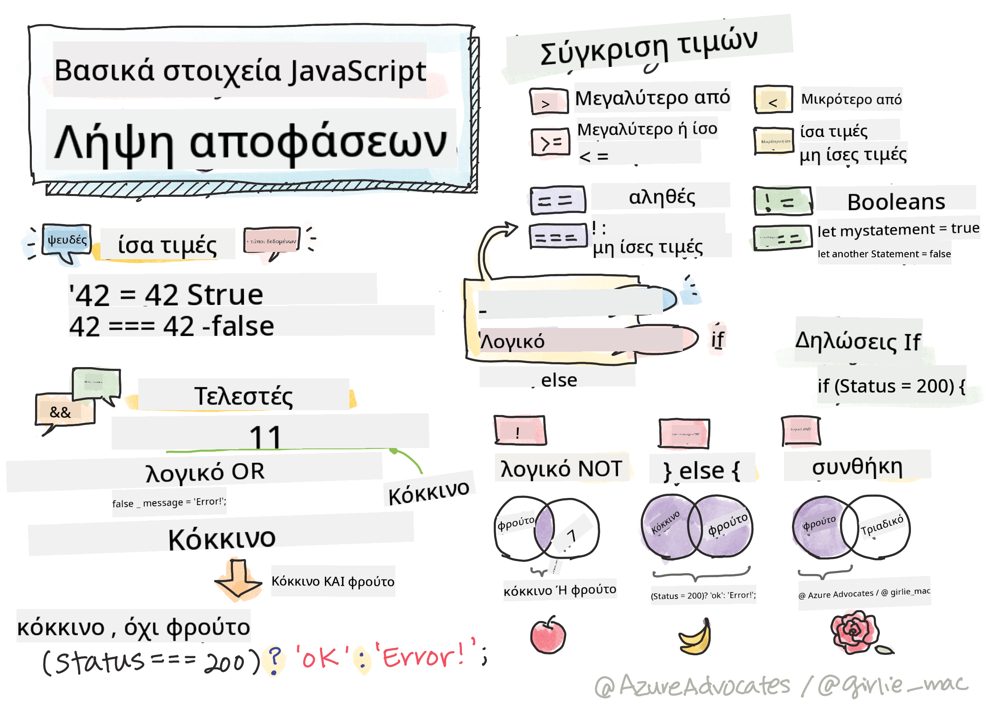

<!--
CO_OP_TRANSLATOR_METADATA:
{
  "original_hash": "90a3c32c3377f83ab750c2447c77ab98",
  "translation_date": "2025-10-23T19:56:18+00:00",
  "source_file": "2-js-basics/3-making-decisions/README.md",
  "language_code": "el"
}
-->
# Βασικά στοιχεία JavaScript: Λήψη αποφάσεων



> Σημειώσεις από [Tomomi Imura](https://twitter.com/girlie_mac)

Έχετε ποτέ αναρωτηθεί πώς οι εφαρμογές παίρνουν έξυπνες αποφάσεις; Όπως πώς ένα σύστημα πλοήγησης επιλέγει τη γρηγορότερη διαδρομή ή πώς ένας θερμοστάτης αποφασίζει πότε να ενεργοποιήσει τη θέρμανση; Αυτή είναι η θεμελιώδης έννοια της λήψης αποφάσεων στον προγραμματισμό.

Όπως η Αναλυτική Μηχανή του Charles Babbage σχεδιάστηκε για να ακολουθεί διαφορετικές ακολουθίες λειτουργιών βάσει συνθηκών, έτσι και τα σύγχρονα προγράμματα JavaScript πρέπει να κάνουν επιλογές βάσει διαφορετικών περιστάσεων. Αυτή η δυνατότητα διακλάδωσης και λήψης αποφάσεων είναι που μετατρέπει τον στατικό κώδικα σε ευέλικτες, έξυπνες εφαρμογές.

Σε αυτό το μάθημα, θα μάθετε πώς να εφαρμόζετε λογική συνθηκών στα προγράμματά σας. Θα εξερευνήσουμε τις συνθήκες, τους τελεστές σύγκρισης και τις λογικές εκφράσεις που επιτρέπουν στον κώδικά σας να αξιολογεί καταστάσεις και να ανταποκρίνεται κατάλληλα.

## Ερωτηματολόγιο πριν το μάθημα

[Ερωτηματολόγιο πριν το μάθημα](https://ff-quizzes.netlify.app/web/quiz/11)

Η δυνατότητα λήψης αποφάσεων και ελέγχου της ροής του προγράμματος είναι μια θεμελιώδης πτυχή του προγραμματισμού. Αυτή η ενότητα καλύπτει πώς να ελέγχετε τη διαδρομή εκτέλεσης των προγραμμάτων JavaScript χρησιμοποιώντας Boolean τιμές και λογική συνθηκών.

[](https://youtube.com/watch?v=SxTp8j-fMMY "Λήψη αποφάσεων")

> 🎥 Κάντε κλικ στην εικόνα παραπάνω για ένα βίντεο σχετικά με τη λήψη αποφάσεων.

> Μπορείτε να παρακολουθήσετε αυτό το μάθημα στο [Microsoft Learn](https://docs.microsoft.com/learn/modules/web-development-101-if-else/?WT.mc_id=academic-77807-sagibbon)!

## Μια σύντομη ανακεφαλαίωση για τα Booleans

Πριν εξερευνήσουμε τη λήψη αποφάσεων, ας επανεξετάσουμε τις Boolean τιμές από το προηγούμενο μάθημα. Ονομάστηκαν από τον μαθηματικό George Boole και αντιπροσωπεύουν δυαδικές καταστάσεις – είτε `true` είτε `false`. Δεν υπάρχει αμφιβολία, ούτε ενδιάμεση κατάσταση.

Αυτές οι δυαδικές τιμές αποτελούν τη βάση όλης της υπολογιστικής λογικής. Κάθε απόφαση που παίρνει το πρόγραμμά σας τελικά μειώνεται σε μια Boolean αξιολόγηση.

Η δημιουργία Boolean μεταβλητών είναι απλή:

```javascript
let myTrueBool = true;
let myFalseBool = false;
```

Αυτό δημιουργεί δύο μεταβλητές με ρητές Boolean τιμές.

✅ Τα Booleans πήραν το όνομά τους από τον Άγγλο μαθηματικό, φιλόσοφο και λογικό George Boole (1815–1864).

## Τελεστές σύγκρισης και Booleans

Στην πράξη, σπάνια θα ορίσετε Boolean τιμές χειροκίνητα. Αντίθετα, θα τις δημιουργείτε αξιολογώντας συνθήκες: "Είναι αυτός ο αριθμός μεγαλύτερος από εκείνον;" ή "Είναι αυτές οι τιμές ίσες;"

Οι τελεστές σύγκρισης επιτρέπουν αυτές τις αξιολογήσεις. Συγκρίνουν τιμές και επιστρέφουν Boolean αποτελέσματα βάσει της σχέσης μεταξύ των τελεστών.

| Σύμβολο | Περιγραφή                                                                                                                                                   | Παράδειγμα         |
| ------ | ------------------------------------------------------------------------------------------------------------------------------------------------------------- | ------------------ |
| `<`    | **Μικρότερο από**: Συγκρίνει δύο τιμές και επιστρέφει την Boolean τιμή `true` αν η τιμή στην αριστερή πλευρά είναι μικρότερη από τη δεξιά                      | `5 < 6 // true`    |
| `<=`   | **Μικρότερο ή ίσο με**: Συγκρίνει δύο τιμές και επιστρέφει την Boolean τιμή `true` αν η τιμή στην αριστερή πλευρά είναι μικρότερη ή ίση με τη δεξιά           | `5 <= 6 // true`   |
| `>`    | **Μεγαλύτερο από**: Συγκρίνει δύο τιμές και επιστρέφει την Boolean τιμή `true` αν η τιμή στην αριστερή πλευρά είναι μεγαλύτερη από τη δεξιά                   | `5 > 6 // false`   |
| `>=`   | **Μεγαλύτερο ή ίσο με**: Συγκρίνει δύο τιμές και επιστρέφει την Boolean τιμή `true` αν η τιμή στην αριστερή πλευρά είναι μεγαλύτερη ή ίση με τη δεξιά         | `5 >= 6 // false`  |
| `===`  | **Αυστηρή ισότητα**: Συγκρίνει δύο τιμές και επιστρέφει την Boolean τιμή `true` αν οι τιμές στην αριστερή και δεξιά πλευρά είναι ίσες ΚΑΙ έχουν τον ίδιο τύπο | `5 === 6 // false` |
| `!==`  | **Ανισότητα**: Συγκρίνει δύο τιμές και επιστρέφει την αντίθετη Boolean τιμή από αυτή που θα επέστρεφε ο τελεστής αυστηρής ισότητας                            | `5 !== 6 // true`  |

✅ Ελέγξτε τις γνώσεις σας γράφοντας μερικές συγκρίσεις στην κονσόλα του προγράμματος περιήγησης. Σας εκπλήσσει κάποιο από τα δεδομένα που επιστρέφονται;

## Η δήλωση If

Η δήλωση `if` είναι σαν να κάνετε μια ερώτηση στον κώδικά σας. "Αν αυτή η συνθήκη είναι αληθής, τότε κάνε αυτό." Είναι πιθανώς το πιο σημαντικό εργαλείο που θα χρησιμοποιήσετε για τη λήψη αποφάσεων στη JavaScript.

Να πώς λειτουργεί:

```javascript
if (condition) {
  // Condition is true. Code in this block will run.
}
```

Η συνθήκη μπαίνει μέσα στις παρενθέσεις, και αν είναι `true`, η JavaScript εκτελεί τον κώδικα μέσα στις αγκύλες. Αν είναι `false`, η JavaScript απλώς παραλείπει ολόκληρο το μπλοκ.

Συχνά θα χρησιμοποιείτε τελεστές σύγκρισης για να δημιουργήσετε αυτές τις συνθήκες. Ας δούμε ένα πρακτικό παράδειγμα:

```javascript
let currentMoney = 1000;
let laptopPrice = 800;

if (currentMoney >= laptopPrice) {
  // Condition is true. Code in this block will run.
  console.log("Getting a new laptop!");
}
```

Επειδή το `1000 >= 800` αξιολογείται ως `true`, ο κώδικας μέσα στο μπλοκ εκτελείται, εμφανίζοντας "Αγοράζω νέο λάπτοπ!" στην κονσόλα.

## Η δήλωση If..Else

Αλλά τι γίνεται αν θέλετε το πρόγραμμά σας να κάνει κάτι διαφορετικό όταν η συνθήκη είναι ψευδής; Εκεί μπαίνει το `else` – είναι σαν να έχετε ένα εναλλακτικό σχέδιο.

Η δήλωση `else` σας δίνει έναν τρόπο να πείτε "αν αυτή η συνθήκη δεν είναι αληθής, κάνε αυτό το άλλο πράγμα."

```javascript
let currentMoney = 500;
let laptopPrice = 800;

if (currentMoney >= laptopPrice) {
  // Condition is true. Code in this block will run.
  console.log("Getting a new laptop!");
} else {
  // Condition is false. Code in this block will run.
  console.log("Can't afford a new laptop, yet!");
}
```

Τώρα, επειδή το `500 >= 800` είναι `false`, η JavaScript παραλείπει το πρώτο μπλοκ και εκτελεί το μπλοκ `else`. Θα δείτε "Δεν μπορώ να αγοράσω νέο λάπτοπ, ακόμα!" στην κονσόλα.

✅ Δοκιμάστε την κατανόησή σας για αυτόν τον κώδικα και τον επόμενο κώδικα εκτελώντας τον στην κονσόλα του προγράμματος περιήγησης. Αλλάξτε τις τιμές των μεταβλητών currentMoney και laptopPrice για να αλλάξετε το αποτέλεσμα του `console.log()`.

## Η δήλωση Switch

Μερικές φορές χρειάζεται να συγκρίνετε μια τιμή με πολλές επιλογές. Ενώ θα μπορούσατε να συνδέσετε πολλές δηλώσεις `if..else`, αυτή η προσέγγιση γίνεται δυσκίνητη. Η δήλωση `switch` παρέχει μια καθαρότερη δομή για τη διαχείριση πολλών διακριτών τιμών.

Η έννοια μοιάζει με τα μηχανικά συστήματα εναλλαγής που χρησιμοποιούνταν στις πρώτες τηλεφωνικές ανταλλαγές – μία τιμή εισόδου καθορίζει ποια συγκεκριμένη διαδρομή ακολουθεί η εκτέλεση.

```javascript
switch (expression) {
  case x:
    // code block
    break;
  case y:
    // code block
    break;
  default:
    // code block
}
```

Να πώς είναι δομημένη:
- Η JavaScript αξιολογεί την έκφραση μία φορά
- Κοιτάζει κάθε `case` για να βρει μια αντιστοιχία
- Όταν βρει μια αντιστοιχία, εκτελεί αυτό το μπλοκ κώδικα
- Το `break` λέει στη JavaScript να σταματήσει και να βγει από το switch
- Αν δεν υπάρχει αντιστοιχία, εκτελεί το μπλοκ `default` (αν υπάρχει)

```javascript
// Program using switch statement for day of week
let dayNumber = 2;
let dayName;

switch (dayNumber) {
  case 1:
    dayName = "Monday";
    break;
  case 2:
    dayName = "Tuesday";
    break;
  case 3:
    dayName = "Wednesday";
    break;
  default:
    dayName = "Unknown day";
    break;
}
console.log(`Today is ${dayName}`);
```

Σε αυτό το παράδειγμα, η JavaScript βλέπει ότι το `dayNumber` είναι `2`, βρίσκει το αντίστοιχο `case 2`, ορίζει το `dayName` ως "Τρίτη" και στη συνέχεια βγαίνει από το switch. Το αποτέλεσμα; "Σήμερα είναι Τρίτη" εμφανίζεται στην κονσόλα.

✅ Δοκιμάστε την κατανόησή σας για αυτόν τον κώδικα και τον επόμενο κώδικα εκτελώντας τον στην κονσόλα του προγράμματος περιήγησης. Αλλάξτε τις τιμές της μεταβλητής a για να αλλάξετε το αποτέλεσμα του `console.log()`.

## Λογικοί τελεστές και Booleans

Οι σύνθετες αποφάσεις συχνά απαιτούν την αξιολόγηση πολλών συνθηκών ταυτόχρονα. Όπως η Boolean άλγεβρα επιτρέπει στους μαθηματικούς να συνδυάζουν λογικές εκφράσεις, έτσι και ο προγραμματισμός παρέχει λογικούς τελεστές για τη σύνδεση πολλών Boolean συνθηκών.

Αυτοί οι τελεστές επιτρέπουν σύνθετη λογική συνθηκών συνδυάζοντας απλές αξιολογήσεις true/false.

| Σύμβολο | Περιγραφή                                                                                     | Παράδειγμα                                                                 |
| ------ | ----------------------------------------------------------------------------------------------- | ----------------------------------------------------------------------- |
| `&&`   | **Λογικό AND**: Συγκρίνει δύο Boolean εκφράσεις. Επιστρέφει true **μόνο** αν και οι δύο πλευρές είναι true | `(5 > 3) && (5 < 10) // Και οι δύο πλευρές είναι true. Επιστρέφει true` |
| `\|\|` | **Λογικό OR**: Συγκρίνει δύο Boolean εκφράσεις. Επιστρέφει true αν τουλάχιστον μία πλευρά είναι true     | `(5 > 10) \|\| (5 < 10) // Μία πλευρά είναι false, η άλλη είναι true. Επιστρέφει true` |
| `!`    | **Λογικό NOT**: Επιστρέφει την αντίθετη τιμή μιας Boolean έκφρασης                             | `!(5 > 10) // Το 5 δεν είναι μεγαλύτερο από το 10, οπότε το "!" το κάνει true`         |

Αυτοί οι τελεστές σας επιτρέπουν να συνδυάζετε συνθήκες με χρήσιμους τρόπους:
- AND (`&&`) σημαίνει ότι και οι δύο συνθήκες πρέπει να είναι true
- OR (`||`) σημαίνει ότι τουλάχιστον μία συνθήκη πρέπει να είναι true  
- NOT (`!`) αντιστρέφει το true σε false (και αντίστροφα)

## Συνθήκες και αποφάσεις με λογικούς τελεστές

Ας δούμε αυτούς τους λογικούς τελεστές σε δράση με ένα πιο ρεαλιστικό παράδειγμα:

```javascript
let currentMoney = 600;
let laptopPrice = 800;
let laptopDiscountPrice = laptopPrice - (laptopPrice * 0.2); // Laptop price at 20 percent off

if (currentMoney >= laptopPrice || currentMoney >= laptopDiscountPrice) {
  // Condition is true. Code in this block will run.
  console.log("Getting a new laptop!");
} else {
  // Condition is false. Code in this block will run.
  console.log("Can't afford a new laptop, yet!");
}
```

Σε αυτό το παράδειγμα: υπολογίζουμε μια τιμή έκπτωσης 20% (640), και στη συνέχεια αξιολογούμε αν τα διαθέσιμα χρήματά μας καλύπτουν είτε την πλήρη τιμή είτε την τιμή με έκπτωση. Επειδή τα 600 πληρούν το όριο της τιμής με έκπτωση των 640, η συνθήκη αξιολογείται ως true.

### Τελεστής άρνησης

Μερικές φορές είναι πιο εύκολο να σκεφτείτε πότε κάτι ΔΕΝ είναι αληθές. Όπως αντί να ρωτάτε "Είναι ο χρήστης συνδεδεμένος;", μπορεί να θέλετε να ρωτήσετε "Είναι ο χρήστης ΜΗ συνδεδεμένος;" Ο τελεστής θαυμαστικού (`!`) αντιστρέφει τη λογική για εσάς.

```javascript
if (!condition) {
  // runs if condition is false
} else {
  // runs if condition is true
}
```

Ο τελεστής `!` είναι σαν να λέτε "το αντίθετο του..." – αν κάτι είναι `true`, το `!` το κάνει `false`, και αντίστροφα.

### Τερματικές εκφράσεις

Για απλές συνθήκες ανάθεσης, η JavaScript παρέχει τον **τερματικό τελεστή**. Αυτή η συνοπτική σύνταξη σας επιτρέπει να γράψετε μια συνθήκη σε μία γραμμή, χρήσιμη όταν χρειάζεστε να αναθέσετε μία από δύο τιμές βάσει μιας συνθήκης.

```javascript
let variable = condition ? returnThisIfTrue : returnThisIfFalse;
```

Διαβάζεται σαν ερώτηση: "Είναι αυτή η συνθήκη αληθής; Αν ναι, χρησιμοποίησε αυτή την τιμή. Αν όχι, χρησιμοποίησε εκείνη την τιμή."

Παρακάτω είναι ένα πιο απτό παράδειγμα:

```javascript
let firstNumber = 20;
let secondNumber = 10;
let biggestNumber = firstNumber > secondNumber ? firstNumber : secondNumber;
```

✅ Αφιερώστε ένα λεπτό για να διαβάσετε αυτόν τον κώδικα μερικές φορές. Καταλαβαίνετε πώς λειτουργούν αυτοί οι τελεστές;

Αυτό που λέει αυτή η γραμμή είναι: "Είναι το `firstNumber` μεγαλύτερο από το `secondNumber`; Αν ναι, βάλτε το `firstNumber` στο `biggestNumber`. Αν όχι, βάλτε το `secondNumber` στο `biggestNumber`."

Ο τερματικός τελεστής είναι απλώς ένας πιο σύντομος τρόπος να γράψετε αυτήν την παραδοσιακή δήλωση `if..else`:

```javascript
let biggestNumber;
if (firstNumber > secondNumber) {
  biggestNumber = firstNumber;
} else {
  biggestNumber = secondNumber;
}
```

Και οι δύο προσεγγίσεις παράγουν πανομοιότυπα αποτελέσματα. Ο τερματικός τελεστής προσφέρει συνοπτικότητα, ενώ η παραδοσιακή δομή if-else μπορεί να είναι πιο ευανάγνωστη για σύνθετες συνθήκες.

---


## 🚀 Πρόκληση

Δημιουργήστε ένα πρόγραμμα που γράφεται πρώτα με λογικούς τελεστές και στη συνέχεια ξαναγράψτε το χρησιμοποιώντας μια τερματική έκφραση. Ποια σύνταξη προτιμάτε;

---

## Πρόκληση GitHub Copilot Agent 🚀

Χρησιμοποιήστε τη λειτουργία Agent για να ολοκληρώσετε την παρακάτω πρόκληση:

**Περιγραφή:** Δημιουργήστε έναν ολοκληρωμένο υπολογιστή βαθμολογίας που να δείχνει πολλαπλές έννοιες λήψης αποφάσεων από αυτό το μάθημα, συμπεριλαμβανομένων των δηλώσεων if-else, switch, λογικών τελεστών και τερματικών εκφράσεων.

**Προτροπή:** Γράψτε ένα πρόγραμμα JavaScript που λαμβάνει τη βαθμολογία ενός μαθητή (0-100) και καθορίζει τον βαθμό του γράμματος χρησιμοποιώντας τα ακόλουθα κριτήρια:
- A: 90-100
- B: 80-89  
- C: 70-79
- D: 60-69
- F: Κάτω από 60

Απαιτήσεις:
1. Χρησιμοποιήστε μια δήλωση if-else για να καθορίσετε τον βαθμό γράμματος
2. Χρησιμοποιήστε λογικούς τελεστές για να ελέγξετε αν ο μαθητής περνάει (βαθμός >= 60) ΚΑΙ έχει διακρίσεις (βαθμός >= 90)
3. Χρησιμοποιήστε μια δήλωση switch για να παρέχετε συγκεκριμένα σχόλια για κάθε βαθμό γράμματος
4. Χρησιμοποιήστε έναν τερματικό τελεστή για να καθορίσετε αν ο μαθητής είναι επιλέξιμος για το επόμενο μάθημα (βαθμός >= 70)
5. Συμπεριλάβετε έλεγχο εισόδου για να διασφαλίσετε ότι η βαθμολογία είναι μεταξύ 0 και 100

Δοκιμάστε το πρόγραμμά σας με διάφορες βαθμολογίες, συμπεριλαμβανομένων των οριακών περιπτώσεων όπως 59, 60, 89, 90 και μη έγκυρες εισόδους.

Μάθετε περισσότερα για τη [λειτουργία agent](https://code.visualstudio.com/blogs/2025/02/24/introducing-copilot-agent-mode) εδώ.


## Ερωτηματολόγ

---

**Αποποίηση ευθύνης**:  
Αυτό το έγγραφο έχει μεταφραστεί χρησιμοποιώντας την υπηρεσία μετάφρασης AI [Co-op Translator](https://github.com/Azure/co-op-translator). Παρόλο που καταβάλλουμε προσπάθειες για ακρίβεια, παρακαλούμε να γνωρίζετε ότι οι αυτοματοποιημένες μεταφράσεις ενδέχεται να περιέχουν λάθη ή ανακρίβειες. Το πρωτότυπο έγγραφο στη μητρική του γλώσσα θα πρέπει να θεωρείται η αυθεντική πηγή. Για κρίσιμες πληροφορίες, συνιστάται επαγγελματική ανθρώπινη μετάφραση. Δεν φέρουμε ευθύνη για τυχόν παρεξηγήσεις ή εσφαλμένες ερμηνείες που προκύπτουν από τη χρήση αυτής της μετάφρασης.