<!--
CO_OP_TRANSLATOR_METADATA:
{
  "original_hash": "1710a50a519a6e4a1b40a5638783018d",
  "translation_date": "2026-01-06T20:25:36+00:00",
  "source_file": "2-js-basics/4-arrays-loops/README.md",
  "language_code": "el"
}
-->
# Βασικά JavaScript: Πίνακες και Βρόχοι

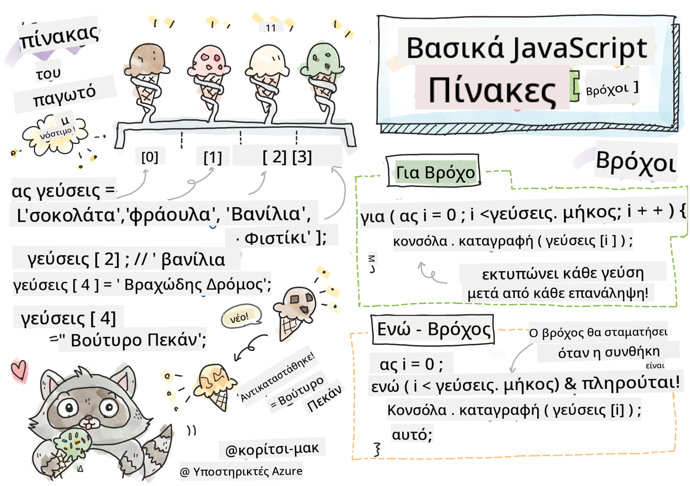
> Σκέτς από τον/την [Tomomi Imura](https://twitter.com/girlie_mac)

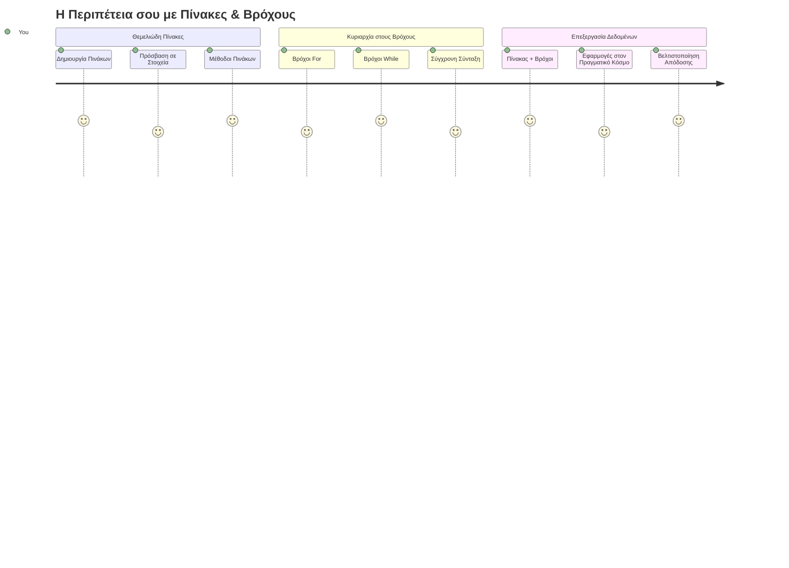
## Quiz πριν την Διάλεξη
[Quiz πριν την διάλεξη](https://ff-quizzes.netlify.app/web/quiz/13)

Έχετε αναρωτηθεί ποτέ πώς οι ιστοσελίδες παρακολουθούν τα αντικείμενα στο καλάθι αγορών ή εμφανίζουν τη λίστα των φίλων σας; Εδώ είναι που μπαίνουν οι πίνακες και οι βρόχοι. Οι πίνακες είναι σαν ψηφιακά δοχεία που κρατούν πολλά κομμάτια πληροφορίας, ενώ οι βρόχοι σας επιτρέπουν να εργάζεστε με όλα αυτά τα δεδομένα αποδοτικά χωρίς επαναλαμβανόμενο κώδικα.

Μαζί, αυτές οι δύο έννοιες σχηματίζουν τα θεμέλια για τη διαχείριση των πληροφοριών στα προγράμματά σας. Θα μάθετε να περνάτε από το να γράφετε χειροκίνητα κάθε βήμα στο να δημιουργείτε έξυπνο, αποδοτικό κώδικα που μπορεί να επεξεργάζεται εκατοντάδες ή ακόμα και χιλιάδες αντικείμενα γρήγορα.

Μέχρι το τέλος αυτού του μαθήματος, θα κατανοείτε πώς να εκτελείτε σύνθετες εργασίες δεδομένων με μερικές μόνο γραμμές κώδικα. Ας εξερευνήσουμε αυτές τις βασικές έννοιες προγραμματισμού.

[](https://youtube.com/watch?v=1U4qTyq02Xw "Πίνακες")

[](https://www.youtube.com/watch?v=Eeh7pxtTZ3k "Βρόχοι")

> 🎥 Κάντε κλικ στις εικόνες παραπάνω για βίντεο σχετικά με πίνακες και βρόχους.

> Μπορείτε να παρακολουθήσετε αυτό το μάθημα στο [Microsoft Learn](https://docs.microsoft.com/learn/modules/web-development-101-arrays/?WT.mc_id=academic-77807-sagibbon)!

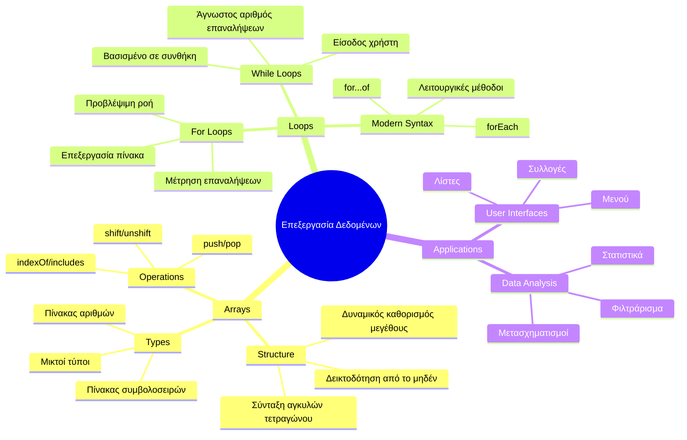
## Πίνακες

Σκεφτείτε τους πίνακες σαν ένα ψηφιακό ντουλάπι αρχειοθέτησης - αντί να αποθηκεύετε ένα έγγραφο ανά συρτάρι, μπορείτε να οργανώσετε πολλά σχετικά αντικείμενα σε ένα μόνο, δομημένο δοχείο. Σε όρους προγραμματισμού, οι πίνακες σας επιτρέπουν να αποθηκεύετε πολλά κομμάτια πληροφορίας σε ένα οργανωμένο πακέτο.

Είτε δημιουργείτε μια γκαλερί φωτογραφιών, διαχειρίζεστε μια λίστα εργασιών, είτε παρακολουθείτε υψηλές βαθμολογίες σε ένα παιχνίδι, οι πίνακες παρέχουν τη βάση για την οργάνωση δεδομένων. Ας δούμε πώς λειτουργούν.

✅ Οι πίνακες είναι παντού γύρω μας! Μπορείτε να σκεφτείτε ένα πραγματικό παράδειγμα πίνακα, όπως μια σειρά ηλιακών πάνελ;

### Δημιουργία Πινάκων

Η δημιουργία ενός πίνακα είναι πολύ απλή - απλώς χρησιμοποιήστε αγκύλες!

```javascript
// Κενός πίνακας - σαν ένα άδειο καλάθι αγορών που περιμένει αντικείμενα
const myArray = [];
```

**Τι συμβαίνει εδώ;**
Έχετε μόλις δημιουργήσει ένα άδειο δοχείο χρησιμοποιώντας αυτές τις αγκύλες `[]`. Σκεφτείτε το σαν ένα άδειο ράφι βιβλιοθήκης - είναι έτοιμο να κρατήσει ό,τι βιβλία θέλετε να οργανώσετε εκεί.

Μπορείτε επίσης να γεμίσετε τον πίνακά σας με αρχικές τιμές από την αρχή:

```javascript
// Το μενού γεύσεων του παγωτατζίδικου σας
const iceCreamFlavors = ["Chocolate", "Strawberry", "Vanilla", "Pistachio", "Rocky Road"];

// Πληροφορίες προφίλ χρήστη (ανάμειξη διαφορετικών τύπων δεδομένων)
const userData = ["John", 25, true, "developer"];

// Βαθμολογίες δοκιμών για το αγαπημένο σας μάθημα
const scores = [95, 87, 92, 78, 85];
```

**Κουλ πράγματα που πρέπει να προσέξετε:**
- Μπορείτε να αποθηκεύσετε κείμενο, αριθμούς ή ακόμα και τιμές αληθούς/ψευδούς στον ίδιο πίνακα
- Απλώς χωρίστε κάθε στοιχείο με κόμμα - εύκολο!
- Οι πίνακες είναι τέλειοι για να κρατούν σχετικές πληροφορίες μαζί

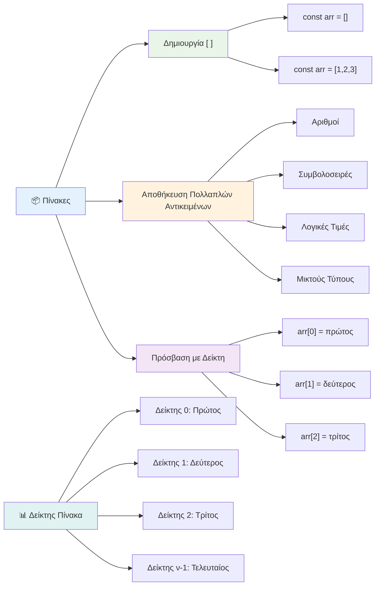
### Δεικτοδότηση Πινάκων

Αυτό που μπορεί να φαίνεται ασυνήθιστο στην αρχή: οι πίνακες αριθμούν τα στοιχεία τους ξεκινώντας από το 0, όχι το 1. Αυτή η δεικτοδότηση που ξεκινά από το μηδέν έχει τις ρίζες της στον τρόπο λειτουργίας της μνήμης του υπολογιστή - είναι μια σύμβαση προγραμματισμού από τις πρώτες μέρες των γλωσσών προγραμματισμού όπως η C. Κάθε θέση στον πίνακα έχει τον δικό της αριθμό διεύθυνσης που ονομάζεται **δείκτης**.

| Δείκτης | Τιμή | Περιγραφή |
|-------|-------|-------------|
| 0 | "Σοκολάτα" | Πρώτο στοιχείο |
| 1 | "Φράουλα" | Δεύτερο στοιχείο |
| 2 | "Βανίλια" | Τρίτο στοιχείο |
| 3 | "Φιστίκι" | Τέταρτο στοιχείο |
| 4 | "Rocky Road" | Πέμπτο στοιχείο |

✅ Σας εκπλήσσει που οι πίνακες ξεκινούν από το μηδενικό δείκτη; Σε μερικές γλώσσες προγραμματισμού, οι δείκτες ξεκινούν από το 1. Υπάρχει μια ενδιαφέρουσα ιστορία γύρω από αυτό, την οποία μπορείτε να [διαβάσετε στη Wikipedia](https://en.wikipedia.org/wiki/Zero-based_numbering).

**Πρόσβαση σε Στοιχεία Πίνακα:**

```javascript
const iceCreamFlavors = ["Chocolate", "Strawberry", "Vanilla", "Pistachio", "Rocky Road"];

// Πρόσβαση σε μεμονωμένα στοιχεία χρησιμοποιώντας τη σημειογραφία αγκύλης
console.log(iceCreamFlavors[0]); // "Σοκολάτα" - πρώτο στοιχείο
console.log(iceCreamFlavors[2]); // "Βανίλια" - τρίτο στοιχείο
console.log(iceCreamFlavors[4]); // "Ρόκι Ρόουντ" - τελευταίο στοιχείο
```

**Ανάλυση του τι συμβαίνει εδώ:**
- **Χρησιμοποιεί** σημειογραφία με αγκύλες και τον αριθμό δείκτη για πρόσβαση στα στοιχεία
- **Επιστρέφει** την τιμή που έχει αποθηκευτεί στη συγκεκριμένη θέση του πίνακα
- **Ξεκινά** την αρίθμηση από 0, καθιστώντας το πρώτο στοιχείο στον δείκτη 0

**Τροποποίηση Στοιχείων Πίνακα:**

```javascript
// Αλλάξτε μια υπάρχουσα τιμή
iceCreamFlavors[4] = "Butter Pecan";
console.log(iceCreamFlavors[4]); // "Butter Pecan"

// Προσθέστε ένα νέο στοιχείο στο τέλος
iceCreamFlavors[5] = "Cookie Dough";
console.log(iceCreamFlavors[5]); // "Cookie Dough"
```

**Στο παραπάνω έχουμε:**
- **Τροποποιήσει** το στοιχείο στον δείκτη 4 από "Rocky Road" σε "Butter Pecan"
- **Προσθέσει** ένα νέο στοιχείο "Cookie Dough" στον δείκτη 5
- **Επεκτείνει** αυτόματα το μήκος του πίνακα όταν προστίθεται πέρα από τα τωρινά όρια

### Μήκος Πίνακα και Συχνές Μέθοδοι

Οι πίνακες φέρουν ενσωματωμένες ιδιότητες και μεθόδους που κάνουν την εργασία με δεδομένα πολύ πιο εύκολη.

**Εύρεση Μήκους Πίνακα:**

```javascript
const iceCreamFlavors = ["Chocolate", "Strawberry", "Vanilla", "Pistachio", "Rocky Road"];
console.log(iceCreamFlavors.length); // 5

// Το μήκος ενημερώνεται αυτόματα καθώς το πίνακας αλλάζει
iceCreamFlavors.push("Mint Chip");
console.log(iceCreamFlavors.length); // 6
```

**Κύρια σημεία που πρέπει να θυμάστε:**
- **Επιστρέφει** τον συνολικό αριθμό των στοιχείων στον πίνακα
- **Ενημερώνεται** αυτόματα όταν προστίθενται ή αφαιρούνται στοιχεία
- **Παρέχει** δυναμικό μετρητή χρήσιμο για βρόχους και επικύρωση

**Βασικές Μέθοδοι Πινάκων:**

```javascript
const fruits = ["apple", "banana", "orange"];

// Προσθήκη στοιχείων
fruits.push("grape");           // Προσθέτει στο τέλος: ["μήλο", "μπανάνα", "πορτοκάλι", "σταφύλι"]
fruits.unshift("strawberry");   // Προσθέτει στην αρχή: ["φράουλα", "μήλο", "μπανάνα", "πορτοκάλι", "σταφύλι"]

// Αφαίρεση στοιχείων
const lastFruit = fruits.pop();        // Αφαιρεί και επιστρέφει "σταφύλι"
const firstFruit = fruits.shift();     // Αφαιρεί και επιστρέφει "φράουλα"

// Εύρεση στοιχείων
const index = fruits.indexOf("banana"); // Επιστρέφει 1 (θέση του "μπανάνα")
const hasApple = fruits.includes("apple"); // Επιστρέφει αληθές
```

**Κατανόηση αυτών των μεθόδων:**
- **Προσθέτει** στοιχεία με `push()` (στο τέλος) και `unshift()` (στην αρχή)
- **Αφαιρεί** στοιχεία με `pop()` (στο τέλος) και `shift()` (στην αρχή)
- **Εντοπίζει** στοιχεία με `indexOf()` και ελέγχει την ύπαρξη με `includes()`
- **Επιστρέφει** χρήσιμες τιμές όπως τα αφαιρούμενα στοιχεία ή τους δείκτες θέσης

✅ Δοκιμάστε το μόνοι σας! Χρησιμοποιήστε την κονσόλα του φυλλομετρητή σας για να δημιουργήσετε και να διαχειριστείτε έναν πίνακα της δικής σας δημιουργίας.

### 🧠 **Έλεγχος Θεμελιωδών Πινάκων: Οργάνωση των Δεδομένων σας**

**Εξετάστε την κατανόησή σας για τους πίνακες:**
- Γιατί νομίζετε ότι οι πίνακες ξεκινούν την αρίθμηση από το 0 αντί για το 1;
- Τι συμβαίνει αν προσπαθήσετε να αποκτήσετε πρόσβαση σε δείκτη που δεν υπάρχει (όπως `arr[100]` σε πίνακα 5 στοιχείων);
- Μπορείτε να σκεφτείτε τρία πραγματικά σενάρια όπου οι πίνακες θα ήταν χρήσιμοι;

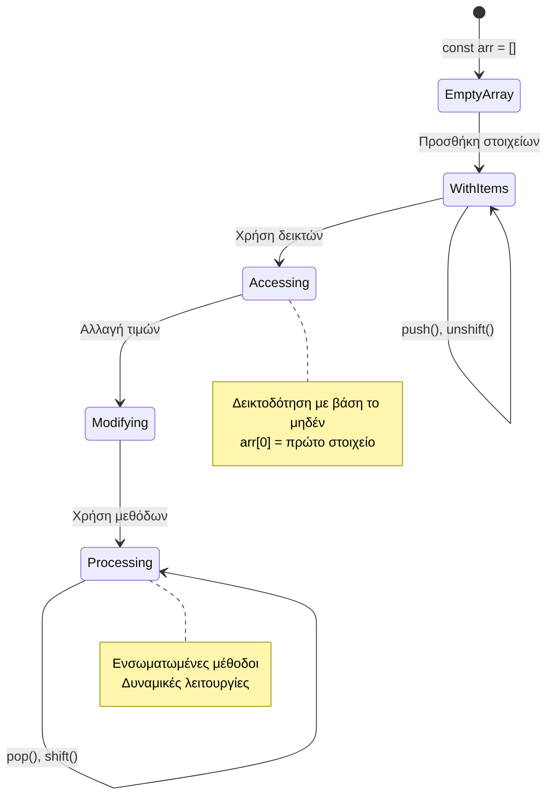
> **Πραγματική εικόνα**: Οι πίνακες είναι παντού στον προγραμματισμό! Τα feeds κοινωνικών δικτύων, τα καλάθια αγορών, οι γκαλερί φωτογραφιών, οι λίστες τραγουδιών - όλα είναι πίνακες στο παρασκήνιο!

## Βρόχοι

Σκεφτείτε τη διάσημη τιμωρία από τα μυθιστορήματα του Charles Dickens, όπου οι μαθητές έπρεπε να γράφουν στίχους επανειλημμένα σε μια τάβλα. Φανταστείτε αν μπορούσατε απλά να πείτε σε κάποιον "γράψε αυτή τη φράση 100 φορές" και να γίνει αυτόματα. Αυτό ακριβώς κάνουν οι βρόχοι για τον κώδικά σας.

Οι βρόχοι είναι σαν να έχετε έναν ακούραστο βοηθό που μπορεί να επαναλαμβάνει εργασίες χωρίς λάθος. Είτε χρειάζεται να ελέγξετε κάθε αντικείμενο σε ένα καλάθι αγορών είτε να εμφανίσετε όλες τις φωτογραφίες σε ένα άλμπουμ, οι βρόχοι χειρίζονται την επανάληψη αποτελεσματικά.

Η JavaScript παρέχει διάφορους τύπους βρόχων για να επιλέξετε. Ας εξετάσουμε τον καθένα και να κατανοήσουμε πότε να τους χρησιμοποιούμε.

```mermaid
flowchart TD
    A["🔄 Τύποι Βρόχων"] --> B["Βρόχος For"]
    A --> C["Βρόχος While"]
    A --> D["Βρόχος For...of"]
    A --> E["Μέθοδος forEach"]
    
    B --> B1["Γνωστές επαναλήψεις"]
    B --> B2["Βασισμένος σε μετρητή"]
    B --> B3["for(init; condition; increment)"]
    
    C --> C1["Άγνωστες επαναλήψεις"]
    C --> C2["Βασισμένος σε συνθήκη"]
    C --> C3["while(condition)"]
    
    D --> D1["Μοντέρνο ES6+"]
    D --> D2["Επανάληψη πίνακα"]
    D --> D3["for(item of array)"]
    
    E --> E1["Στυλ λειτουργικό"]
    E --> E2["Μέθοδος πίνακα"]
    E --> E3["array.forEach(callback)"]
    
    F["⏰ Πότε να Χρησιμοποιήσετε"] --> F1["For: Μέτρηση, δείκτες"]
    F --> F2["While: Εισαγωγή χρήστη, αναζήτηση"]
    F --> F3["For...of: Απλή επανάληψη"]
    F --> F4["forEach: Λειτουργικός προγραμματισμός"]
    
    style A fill:#e3f2fd
    style B fill:#e8f5e8
    style C fill:#fff3e0
    style D fill:#f3e5f5
    style E fill:#e0f2f1
    style F fill:#fce4ec
```
### Βρόχος For

Ο βρόχος `for` είναι σαν να θέτετε ένα χρονόμετρο - ξέρετε ακριβώς πόσες φορές θέλετε κάτι να συμβεί. Είναι πολύ οργανωμένος και προβλέψιμος, κάνοντάς τον τέλειο όταν εργάζεστε με πίνακες ή χρειάζεται να μετρήσετε πράγματα.

**Δομή Βρόχου For:**

| Στοιχείο | Σκοπός | Παράδειγμα |
|-----------|---------|------------|
| **Αρχικοποίηση** | Ορίζει σημείο εκκίνησης | `let i = 0` |
| **Συνθήκη** | Πότε συνεχίζει | `i < 10` |
| **Αύξηση** | Πώς ενημερώνεται | `i++` |

```javascript
// Μέτρηση από το 0 μέχρι το 9
for (let i = 0; i < 10; i++) {
  console.log(`Count: ${i}`);
}

// Πιο πρακτικό παράδειγμα: επεξεργασία βαθμολογιών
const testScores = [85, 92, 78, 96, 88];
for (let i = 0; i < testScores.length; i++) {
  console.log(`Student ${i + 1}: ${testScores[i]}%`);
}
```

**Βήμα προς βήμα, εδώ τι συμβαίνει:**
- **Αρχικοποιεί** τη μεταβλητή μετρητή `i` στο 0 στην αρχή
- **Ελέγχει** τη συνθήκη `i < 10` πριν από κάθε επανάληψη
- **Εκτελεί** το μπλοκ κώδικα όταν η συνθήκη είναι αληθής
- **Αυξάνει** το `i` κατά 1 μετά από κάθε επανάληψη με `i++`
- **Σταματά** όταν η συνθήκη γίνει ψευδής (όταν το `i` φτάσει το 10)

✅ Τρέξτε αυτόν τον κώδικα στην κονσόλα του φυλλομετρητή. Τι συμβαίνει όταν κάνετε μικρές αλλαγές στον μετρητή, τη συνθήκη ή την έκφραση αύξησης; Μπορείτε να το κάνετε να τρέχει αντίστροφα, δημιουργώντας αντίστροφη μέτρηση;

### 🗓️ **Έλεγχος Επάρκειας Βρόχου For: Ελεγχόμενη Επανάληψη**

**Αξιολογήστε την κατανόησή σας για τον βρόχο for:**
- Ποια είναι τα τρία μέρη ενός βρόχου for και τι κάνει το καθένα;
- Πώς θα κάνατε βρόχο σε έναν πίνακα αντίστροφα;
- Τι συμβαίνει αν ξεχάσετε το μέρος της αύξησης (`i++`);

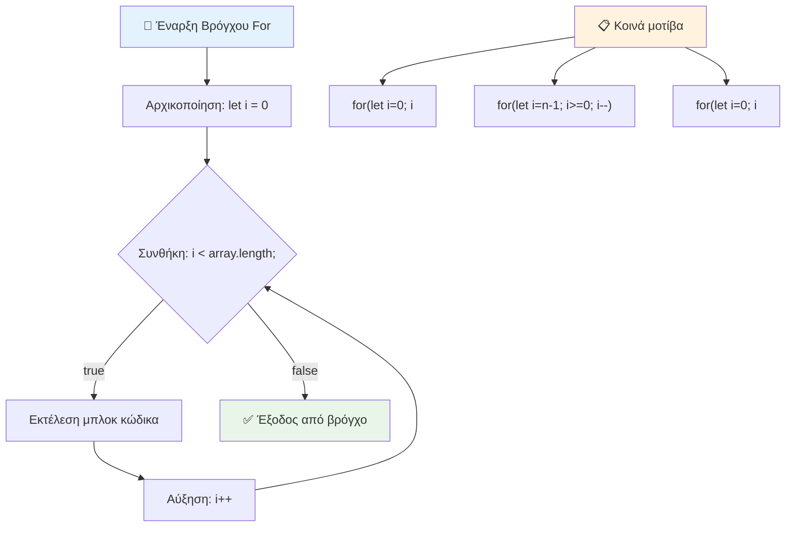
> **Σοφία βρόχου**: Οι βρόχοι for είναι ιδανικοί όταν γνωρίζετε ακριβώς πόσες φορές χρειάζεται να επαναλάβετε κάτι. Είναι η πιο κοινή επιλογή για επεξεργασία πινάκων!

### Βρόχος While

Ο βρόχος `while` είναι σαν να λέτε "συνέχισε να το κάνεις μέχρι..." - μπορεί να μη ξέρετε ακριβώς πόσες φορές θα τρέξει, αλλά ξέρετε πότε να σταματήσει. Είναι ιδανικός για πράγματα όπως να ζητάτε είσοδο από έναν χρήστη μέχρι να σας δώσει αυτό που χρειάζεστε ή να ψάχνετε δεδομένα μέχρι να βρείτε αυτό που αναζητάτε.

**Χαρακτηριστικά Βρόχου While:**
- **Συνεχίζει** την εκτέλεση όσο η συνθήκη είναι αληθής
- **Απαιτεί** χειροκίνητο χειρισμό κάθε μεταβλητής μετρητή
- **Ελέγχει** τη συνθήκη πριν από κάθε επανάληψη
- **Κινδυνεύει** με άπειρους βρόχους αν η συνθήκη δεν γίνει ποτέ ψευδής

```javascript
// Βασικό παράδειγμα μέτρησης
let i = 0;
while (i < 10) {
  console.log(`While count: ${i}`);
  i++; // Μην ξεχάσετε να αυξήσετε!
}

// Πιο πρακτικό παράδειγμα: επεξεργασία εισόδου χρήστη
let userInput = "";
let attempts = 0;
const maxAttempts = 3;

while (userInput !== "quit" && attempts < maxAttempts) {
  userInput = prompt(`Enter 'quit' to exit (attempt ${attempts + 1}):`);
  attempts++;
}

if (attempts >= maxAttempts) {
  console.log("Maximum attempts reached!");
}
```

**Κατανόηση των παραδειγμάτων:**
- **Χειρίζεται** χειροκίνητα τη μεταβλητή μετρητή `i` μέσα στο σώμα του βρόχου
- **Αυξάνει** τον μετρητή για να αποφευχθούν ατέρμονες βρόχοι
- **Δείχνει** πρακτική χρήση με είσοδο χρήστη και περιορισμό προσπαθειών
- **Περιλαμβάνει** μηχανισμούς ασφαλείας για αποφυγή ανεξέλεγκτης εκτέλεσης

### ♾️ **Έλεγχος Σοφίας Βρόχου While: Επανάληψη με Βάση Συνθήκη**

**Δοκιμάστε την κατανόησή σας για τον βρόχο while:**
- Ποιος είναι ο κύριος κίνδυνος με τη χρήση βρόχων while;
- Πότε θα προτιμούσατε βρόχο while αντί για for;
- Πώς μπορείτε να αποτρέψετε ατέρμονους βρόχους;

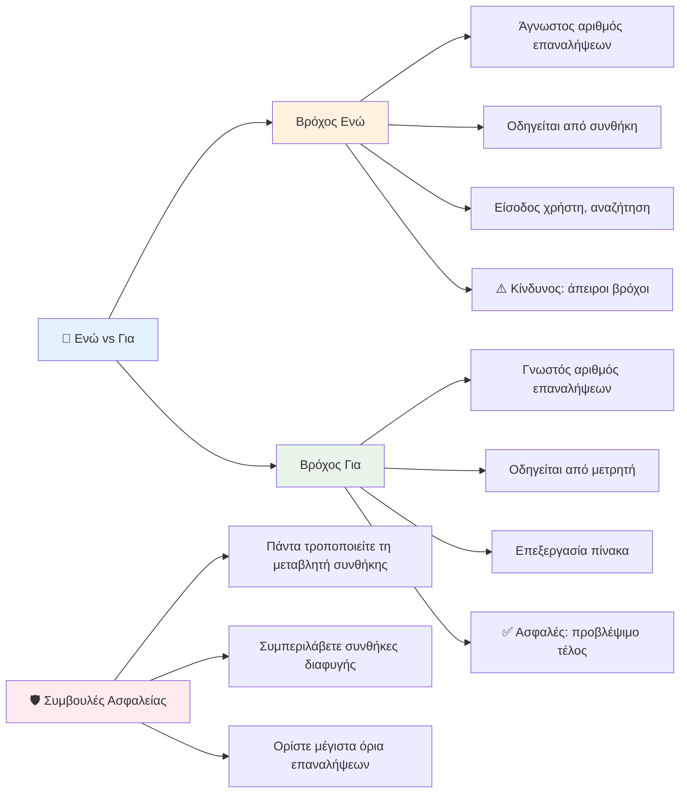
> **Πρώτα η ασφάλεια**: Οι βρόχοι while είναι ισχυροί αλλά απαιτούν προσεκτική διαχείριση της συνθήκης. Πάντα βεβαιωθείτε ότι η συνθήκη του βρόχου σας τελικά θα γίνει ψευδής!

### Σύγχρονες Εναλλακτικές Βρόχων

Η JavaScript προσφέρει σύγχρονη σύνταξη βρόχων που μπορεί να κάνει τον κώδικά σας πιο ευανάγνωστο και λιγότερο επιρρεπή σε λάθη.

**For...of Βρόχος (ES6+):**

```javascript
const colors = ["red", "green", "blue", "yellow"];

// Σύγχρονη προσέγγιση - καθαρότερη και πιο ασφαλής
for (const color of colors) {
  console.log(`Color: ${color}`);
}

// Σύγκρινε με τον παραδοσιακό βρόχο for
for (let i = 0; i < colors.length; i++) {
  console.log(`Color: ${colors[i]}`);
}
```

**Βασικά πλεονεκτήματα του for...of:**
- **Καταργεί** τη διαχείριση δεικτών και πιθανά λάθη off-by-one
- **Παρέχει** άμεση πρόσβαση στα στοιχεία του πίνακα
- **Βελτιώνει** την αναγνωσιμότητα του κώδικα και μειώνει τη σύνταξη

**Μέθοδος forEach:**

```javascript
const prices = [9.99, 15.50, 22.75, 8.25];

// Χρήση του forEach για στυλ λειτουργικού προγραμματισμού
prices.forEach((price, index) => {
  console.log(`Item ${index + 1}: $${price.toFixed(2)}`);
});

// forEach με βελάκια συναρτήσεων για απλές λειτουργίες
prices.forEach(price => console.log(`Price: $${price}`));
```

**Τι πρέπει να ξέρετε για το forEach:**
- **Εκτελεί** μια συνάρτηση για κάθε στοιχείο του πίνακα
- **Παρέχει** τόσο την τιμή στοιχείου όσο και τον δείκτη ως παραμέτρους
- **Δεν μπορεί** να σταματήσει νωρίτερα (σε αντίθεση με τους παραδοσιακούς βρόχους)
- **Επιστρέφει** undefined (δεν δημιουργεί νέο πίνακα)

✅ Γιατί θα επιλέγατε βρόχο for αντί για while; 17.000 θεατές είχαν την ίδια απορία στο StackOverflow, και μερικές απόψεις [μπορεί να σας φανούν ενδιαφέρουσες](https://stackoverflow.com/questions/39969145/while-loops-vs-for-loops-in-javascript).

### 🎨 **Έλεγχος Σύγχρονης Σύνταξης Βρόχων: Υιοθετώντας το ES6+**

**Αξιολογήστε την κατανόησή σας για τη σύγχρονη JavaScript:**
- Ποια είναι τα πλεονεκτήματα του `for...of` έναντι των παραδοσιακών for βρόχων;
- Πότε μπορεί να προτιμάτε ακόμα παραδοσιακούς for βρόχους;
- Ποια είναι η διαφορά μεταξύ `forEach` και `map`;

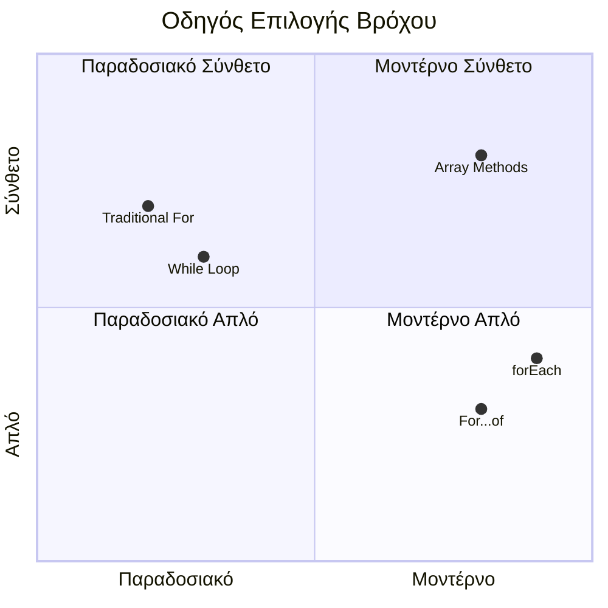
> **Σύγχρονη τάση**: Η σύνταξη ES6+ όπως το `for...of` και το `forEach` γίνεται ο προτιμώμενος τρόπος για επανάληψη σε πίνακες επειδή είναι πιο καθαρή και λιγότερο επιρρεπής σε λάθη!

## Βρόχοι και Πίνακες

Ο συνδυασμός πινάκων με βρόχους δημιουργεί ισχυρές δυνατότητες επεξεργασίας δεδομένων. Αυτός ο συνδυασμός είναι θεμελιώδης για πολλές εργασίες προγραμματισμού, από την εμφάνιση λιστών μέχρι τον υπολογισμό στατιστικών.

**Παραδοσιακή Επεξεργασία Πίνακα:**

```javascript
const iceCreamFlavors = ["Chocolate", "Strawberry", "Vanilla", "Pistachio", "Rocky Road"];

// Κλασική προσέγγιση με βρόχο for
for (let i = 0; i < iceCreamFlavors.length; i++) {
  console.log(`Flavor ${i + 1}: ${iceCreamFlavors[i]}`);
}

// Σύγχρονη προσέγγιση με for...of
for (const flavor of iceCreamFlavors) {
  console.log(`Available flavor: ${flavor}`);
}
```

**Κατανοούμε κάθε προσέγγιση:**
- **Χρησιμοποιεί** την ιδιότητα μήκους του πίνακα για να ορίσει τα όρια του βρόχου
- **Πρόσβαση** στα στοιχεία με δείκτη σε παραδοσιακούς for βρόχους
- **Παρέχει** άμεση πρόσβαση σε στοιχεία σε for...of βρόχους
- **Επεξεργάζεται** κάθε στοιχείο του πίνακα ακριβώς μία φορά

**Πρακτικό Παράδειγμα Επεξεργασίας Δεδομένων:**

```javascript
const studentGrades = [85, 92, 78, 96, 88, 73, 89];
let total = 0;
let highestGrade = studentGrades[0];
let lowestGrade = studentGrades[0];

// Επεξεργαστείτε όλες τις βαθμολογίες με έναν μόνο βρόχο
for (let i = 0; i < studentGrades.length; i++) {
  const grade = studentGrades[i];
  total += grade;
  
  if (grade > highestGrade) {
    highestGrade = grade;
  }
  
  if (grade < lowestGrade) {
    lowestGrade = grade;
  }
}

const average = total / studentGrades.length;
console.log(`Average: ${average.toFixed(1)}`);
console.log(`Highest: ${highestGrade}`);
console.log(`Lowest: ${lowestGrade}`);
```

**Πώς λειτουργεί αυτός ο κώδικας:**
- **Αρχικοποιεί** μεταβλητές παρακολούθησης για άθροισμα και ακραίες τιμές
- **Επεξεργάζεται** κάθε βαθμό με έναν αποδοτικό βρόχο
- **Συσσωρεύει** το σύνολο για τον υπολογισμό μέσου όρου
- **Παρακολουθεί** τις υψηλότερες και χαμηλότερες τιμές κατά την επανάληψη
- **Υπολογίζει** τα τελικά στατιστικά μετά το πέρας του βρόχου

✅ Πειραματιστείτε με βρόχο σε έναν πίνακα δικής σας δημιουργίας στην κονσόλα του φυλλομετρητή.

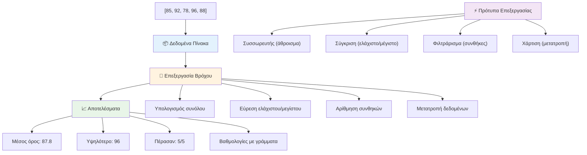
---

## Πρόκληση GitHub Copilot Agent 🚀

Χρησιμοποιήστε τη λειτουργία Agent για να ολοκληρώσετε την ακόλουθη πρόκληση:

**Περιγραφή:** Δημιουργήστε μια ολοκληρωμένη συνάρτηση επεξεργασίας δεδομένων που συνδυάζει πίνακες και βρόχους για να αναλύσει ένα σύνολο δεδομένων και να παράγει ουσιαστικά συμπεράσματα.

**Εντολή:** Δημιουργήστε μια συνάρτηση με όνομα `analyzeGrades` που λαμβάνει έναν πίνακα αντικειμένων βαθμολογιών μαθητών (το καθένα περιέχει ιδιότητες όνομα και βαθμός) και επιστρέφει ένα αντικείμενο με στατιστικά όπως η υψηλότερη βαθμολογία, η χαμηλότερη βαθμολογία, ο μέσος όρος, ο αριθμός των μαθητών που πέρασαν (βαθμός >= 70), και έναν πίνακα με τα ονόματα των μαθητών που πέτυχαν πάνω από το μέσο όρο. Χρησιμοποιήστε τουλάχιστον δύο διαφορετικούς τύπους βρόχων στη λύση σας.

Μάθετε περισσότερα για τη [λειτουργία agent](https://code.visualstudio.com/blogs/2025/02/24/introducing-copilot-agent-mode) εδώ.

## 🚀 Πρόκληση
Η JavaScript προσφέρει πολλές σύγχρονες μεθόδους για πίνακες που μπορούν να αντικαταστήσουν τους παραδοσιακούς βρόχους για συγκεκριμένες εργασίες. Εξερευνήστε τις [forEach](https://developer.mozilla.org/docs/Web/JavaScript/Reference/Global_Objects/Array/forEach), [for-of](https://developer.mozilla.org/docs/Web/JavaScript/Reference/Statements/for...of), [map](https://developer.mozilla.org/docs/Web/JavaScript/Reference/Global_Objects/Array/map), [filter](https://developer.mozilla.org/docs/Web/JavaScript/Reference/Global_Objects/Array/filter) και [reduce](https://developer.mozilla.org/docs/Web/JavaScript/Reference/Global_Objects/Array/reduce). 

**Η πρόκλησή σας:** Ανασχεδιάστε το παράδειγμα με τους βαθμούς των φοιτητών χρησιμοποιώντας τουλάχιστον τρεις διαφορετικές μεθόδους πινάκων. Παρατηρήστε πόσο πιο καθαρός και πιο ευανάγνωστος γίνεται ο κώδικας με τη σύγχρονη σύνταξη της JavaScript.

## Post-Lecture Quiz
[Post-lecture quiz](https://ff-quizzes.netlify.app/web/quiz/14)


## Review & Self Study

Οι πίνακες στην JavaScript έχουν πολλές ενσωματωμένες μεθόδους, που είναι εξαιρετικά χρήσιμες για χειρισμό δεδομένων. [Διαβάστε για αυτές τις μεθόδους](https://developer.mozilla.org/docs/Web/JavaScript/Reference/Global_Objects/Array) και δοκιμάστε μερικές (όπως push, pop, slice και splice) σε έναν πίνακα που θα δημιουργήσετε.

## Assignment

[Loop an Array](assignment.md)

---

## 📊 **Σύνοψη Εργαλείων για Πίνακες & Βρόχους**

```mermaid
graph TD
    A["🎯 Εμπειρία σε Πίνακες & Βρόχους"] --> B["📦 Βασικά Πίνακα"]
    A --> C["🔄 Τύποι Βρόχων"]
    A --> D["🔗 Επεξεργασία Δεδομένων"]
    A --> E["🎨 Σύγχρονες Τεχνικές"]
    
    B --> B1["Δημιουργία: [ ]"]
    B --> B2["Δεικτοδότηση: arr[0]"]
    B --> B3["Μέθοδοι: push, pop"]
    B --> B4["Ιδιότητες: length"]
    
    C --> C1["For: Γνωστές επαναλήψεις"]
    C --> C2["While: Με βάση συνθήκη"]
    C --> C3["For...of: Άμεση πρόσβαση"]
    C --> C4["forEach: Λειτουργικός"]
    
    D --> D1["Υπολογισμός στατιστικών"]
    D --> D2["Μετασχηματισμός δεδομένων"]
    D --> D3["Φιλτράρισμα & αναζήτηση"]
    D --> D4["Επεξεργασία σε πραγματικό χρόνο"]
    
    E --> E1["Συναρτήσεις βέλους"]
    E --> E2["Αλυσίδωση μεθόδων"]
    E --> E3["Κατανομή (destructuring)"]
    E --> E4["Πρότυπα λεκτικά (template literals)"]
    
    F["💡 Κύρια Οφέλη"] --> F1["Αποδοτική διαχείριση δεδομένων"]
    F --> F2["Μείωση επανάληψης κώδικα"]
    F --> F3["Κλιμακούμενες λύσεις"]
    F --> F4["Καθαρότερη σύνταξη"]
    
    style A fill:#e3f2fd
    style B fill:#e8f5e8
    style C fill:#fff3e0
    style D fill:#f3e5f5
    style E fill:#e0f2f1
    style F fill:#fce4ec
```
---

## 🚀 Χρονοδιάγραμμα Εξοικείωσης με Πίνακες & Βρόχους

### ⚡ **Τι Μπορείτε να Κάνετε στα Επόμενα 5 Λεπτά**
- [ ] Δημιουργήστε έναν πίνακα με τις αγαπημένες σας ταινίες και αποκτήστε πρόσβαση σε συγκεκριμένα στοιχεία
- [ ] Γράψτε έναν for βρόχο που μετράει από το 1 ως το 10
- [ ] Δοκιμάστε την πρόκληση με τις σύγχρονες μεθόδους πινάκων από το μάθημα
- [ ] Εξασκηθείτε στον δείκτη πινάκων στην κονσόλα του φυλλομετρητή σας

### 🎯 **Τι Μπορείτε να Καταφέρετε μέσα σε Αυτήν την Ώρα**
- [ ] Ολοκληρώστε το post-lesson quiz και ανασκοπήστε όποιες έννοιες βρείτε δυσκολότερες
- [ ] Δημιουργήστε τον αναλυτή βαθμολογιών από την πρόκληση GitHub Copilot
- [ ] Φτιάξτε ένα απλό καλάθι αγορών που προσθέτει και αφαιρεί αντικείμενα
- [ ] Εξασκηθείτε στη μετατροπή μεταξύ διαφόρων τύπων βρόχων
- [ ] Πειραματιστείτε με μεθόδους πινάκων όπως `push`, `pop`, `slice` και `splice`

### 📅 **Το Ταξίδι Επεξεργασίας Δεδομένων Μιας Εβδομάδας**
- [ ] Ολοκληρώστε την εργασία "Loop an Array" με δημιουργικές βελτιώσεις
- [ ] Δημιουργήστε μια εφαρμογή λίστας εργασιών χρησιμοποιώντας πίνακες και βρόχους
- [ ] Φτιάξτε έναν απλό στατιστικό υπολογιστή για αριθμητικά δεδομένα
- [ ] Εξασκηθείτε με [MDN μεθόδους πινάκων](https://developer.mozilla.org/docs/Web/JavaScript/Reference/Global_Objects/Array)
- [ ] Δημιουργήστε μια γκαλερί φωτογραφιών ή μια διεπαφή λίστας μουσικής
- [ ] Εξερευνήστε τον λειτουργικό προγραμματισμό με `map`, `filter`, και `reduce`

### 🌟 **Ο Μετασχηματισμός ενός Μήνα**
- [ ] Κατακτήστε προχωρημένες λειτουργίες πινάκων και βελτιστοποίηση επιδόσεων
- [ ] Δημιουργήστε έναν πλήρη πίνακα οπτικοποίησης δεδομένων
- [ ] Συνεισφέρετε σε έργα ανοιχτού κώδικα που αφορούν επεξεργασία δεδομένων
- [ ] Διδάξτε σε άλλους για πίνακες και βρόχους με πρακτικά παραδείγματα
- [ ] Δημιουργήστε μια προσωπική βιβλιοθήκη λειτουργιών επεξεργασίας δεδομένων για επαναχρησιμοποίηση
- [ ] Εξερευνήστε αλγορίθμους και δομές δεδομένων βασισμένες σε πίνακες

### 🏆 **Τελικός Έλεγχος Πρωταθλητή Επεξεργασίας Δεδομένων**

**Γιορτάστε τις γνώσεις σας σε πίνακες και βρόχους:**
- Ποια είναι η πιο χρήσιμη λειτουργία πινάκα που μάθατε για εφαρμογές στον πραγματικό κόσμο;
- Ποιος τύπος βρόχου σας φαίνεται πιο φυσικός και γιατί;
- Πώς έχει αλλάξει η κατανόησή σας για τους πίνακες και τους βρόχους τον τρόπο που οργανώνετε δεδομένα;
- Ποια πολύπλοκη εργασία επεξεργασίας δεδομένων θέλετε να αντιμετωπίσετε στη συνέχεια;

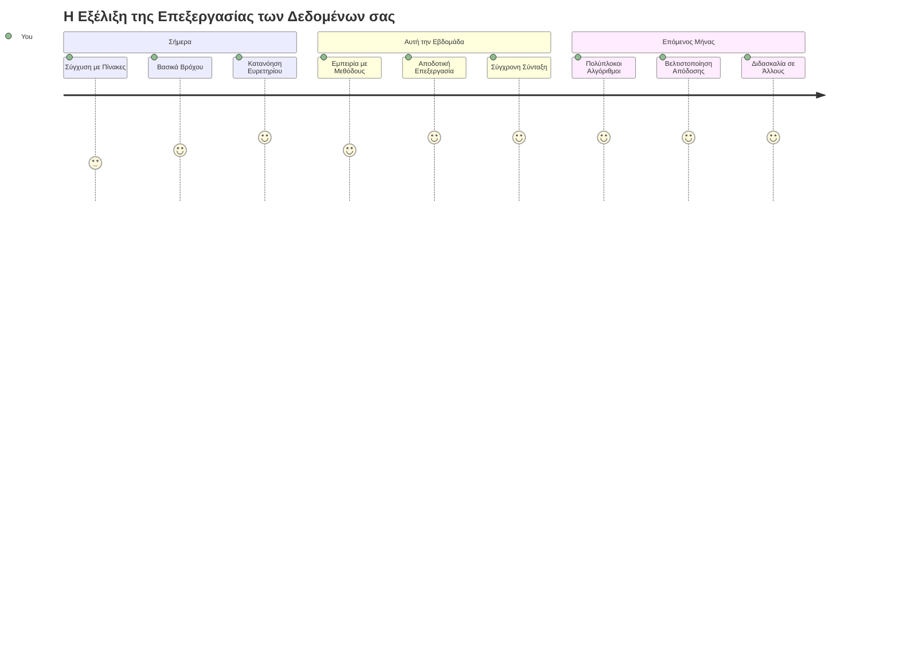
> 📦 **Ξεκλειδώσατε τη δύναμη της οργάνωσης και επεξεργασίας δεδομένων!** Οι πίνακες και οι βρόχοι είναι το θεμέλιο σχεδόν κάθε εφαρμογής που θα δημιουργήσετε. Από απλές λίστες μέχρι πολύπλοκη ανάλυση δεδομένων, τώρα έχετε τα εργαλεία να χειριστείτε την πληροφορία αποτελεσματικά και κομψά. Κάθε δυναμικός ιστότοπος, εφαρμογή κινητού και εφαρμογή με δεδομένα βασίζεται σε αυτές τις θεμελιώδεις έννοιες. Καλώς ήρθατε στον κόσμο της κλιμακούμενης επεξεργασίας δεδομένων! 🎉

---

<!-- CO-OP TRANSLATOR DISCLAIMER START -->
**Αποποίηση Ευθυνών**:  
Αυτό το έγγραφο έχει μεταφραστεί χρησιμοποιώντας την υπηρεσία αυτόματης μετάφρασης AI [Co-op Translator](https://github.com/Azure/co-op-translator). Παρόλο που επιδιώκουμε την ακρίβεια, παρακαλούμε να γνωρίζετε ότι οι αυτόματες μεταφράσεις ενδέχεται να περιέχουν λάθη ή ανακρίβειες. Το πρωτότυπο έγγραφο στη γλώσσα του αποτελεί την αυθεντική πηγή. Για κρίσιμες πληροφορίες, συνιστάται επαγγελματική μετάφραση από ανθρώπους. Δεν φέρουμε ευθύνη για τυχόν παρεξηγήσεις ή λανθασμένες ερμηνείες που προκύπτουν από τη χρήση αυτής της μετάφρασης.
<!-- CO-OP TRANSLATOR DISCLAIMER END -->