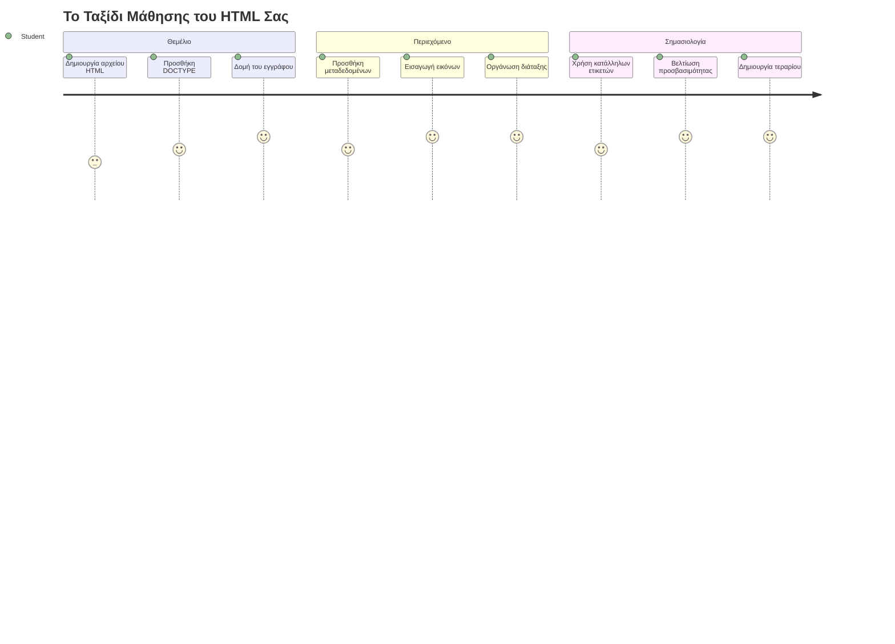
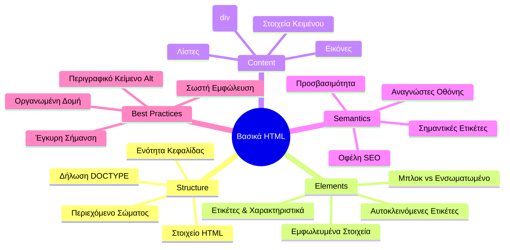
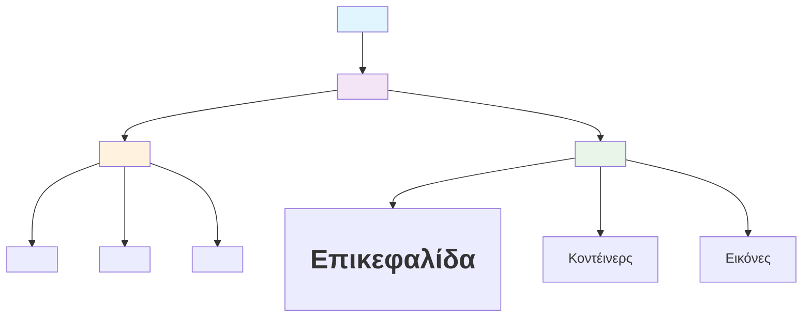
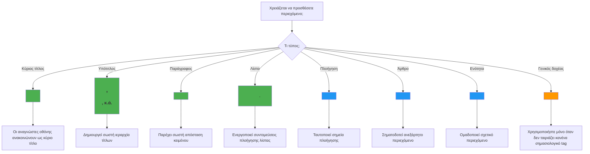
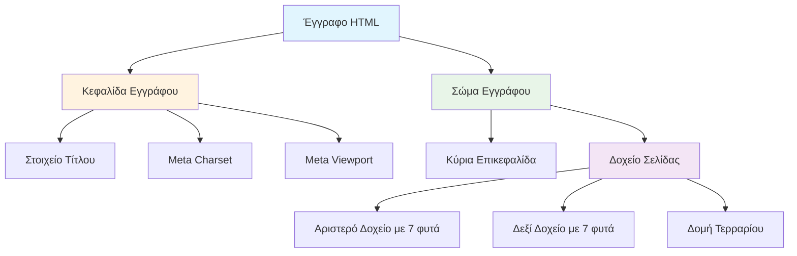
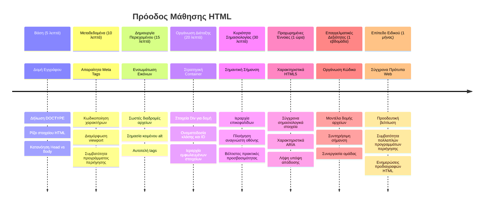

<!--
CO_OP_TRANSLATOR_METADATA:
{
  "original_hash": "3fcfa99c4897e051b558b5eaf1e8cc74",
  "translation_date": "2026-01-06T21:06:10+00:00",
  "source_file": "3-terrarium/1-intro-to-html/README.md",
  "language_code": "el"
}
-->
# Έργο Terrarium Μέρος 1: Εισαγωγή στο HTML



> Σημείωση σκίτσου από την [Tomomi Imura](https://twitter.com/girlie_mac)

Το HTML, ή HyperText Markup Language, είναι το θεμέλιο κάθε ιστότοπου που έχετε επισκεφθεί ποτέ. Σκεφτείτε το HTML ως το σκελετό που δίνει δομή στις ιστοσελίδες – καθορίζει πού πάει το περιεχόμενο, πώς οργανώνεται και τι αντιπροσωπεύει κάθε κομμάτι. Ενώ το CSS αργότερα θα "ντύσει" το HTML σας με χρώματα και διατάξεις, και η JavaScript θα του δώσει ζωή με διαδραστικότητα, το HTML παρέχει την ουσιαστική δομή που κάνει τα πάντα δυνατά.

Σε αυτό το μάθημα, θα δημιουργήσετε τη δομή HTML για μια εικονική διεπαφή terrarium. Αυτό το πρακτικό έργο θα σας διδάξει βασικές έννοιες HTML ενώ χτίζετε κάτι οπτικά ελκυστικό. Θα μάθετε πώς να οργανώνετε το περιεχόμενο χρησιμοποιώντας σημασιολογικά στοιχεία, να δουλεύετε με εικόνες και να δημιουργείτε το θεμέλιο για μια διαδραστική διαδικτυακή εφαρμογή.

Στο τέλος αυτού του μαθήματος, θα έχετε μια λειτουργική σελίδα HTML που εμφανίζει εικόνες φυτών σε οργανωμένες στήλες, έτοιμη για στυλιζάρισμα στο επόμενο μάθημα. Μην ανησυχείτε αν φαίνεται απλή στην αρχή – αυτό ακριβώς πρέπει να κάνει το HTML πριν το CSS προσθέσει την οπτική τελειότητα.


## Προ-Διαλέξη Quiz

[Προ-διάλεξη quiz](https://ff-quizzes.netlify.app/web/quiz/15)

> 📺 **Παρακολούθησε και Μάθε**: Δες αυτή τη χρήσιμη σύντομη επισκόπηση βίντεο
> 
> [](https://www.youtube.com/watch?v=1TvxJKBzhyQ)

## Ρύθμιση του Έργου σου

Πριν βουτήξουμε στον κώδικα HTML, ας ρυθμίσουμε έναν κατάλληλο χώρο εργασίας για το έργο terrarium σου. Η δημιουργία μιας οργανωμένης δομής αρχείων από την αρχή είναι μια κρίσιμη συνήθεια που θα σου φανεί χρήσιμη καθ’ όλη τη διάρκεια του ταξιδιού σου στην ανάπτυξη ιστοσελίδων.

### Εργασία: Δημιουργία Δομής Έργου

Θα δημιουργήσεις έναν αφιερωμένο φάκελο για το έργο terrarium και θα προσθέσεις το πρώτο σου αρχείο HTML. Εδώ είναι δύο προσεγγίσεις που μπορείς να χρησιμοποιήσεις:

**Επιλογή 1: Χρήση Visual Studio Code**
1. Άνοιξε το Visual Studio Code
2. Κάνε κλικ στο "File" → "Open Folder" ή χρησιμοποιήσε `Ctrl+K, Ctrl+O` (Windows/Linux) ή `Cmd+K, Cmd+O` (Mac)
3. Δημιούργησε έναν νέο φάκελο με όνομα `terrarium` και επίλεξέ τον
4. Στο παράθυρο Explorer, κάνε κλικ στο εικονίδιο "New File"
5. Ονόμασε το αρχείο σου `index.html`


**Επιλογή 2: Χρήση Εντολών Τερματικού**
```bash
mkdir terrarium
cd terrarium
touch index.html
code index.html
```

**Τι επιτυγχάνουν αυτές οι εντολές:**
- **Δημιουργεί** έναν νέο κατάλογο με όνομα `terrarium` για το έργο σου
- **Μεταβαίνει** στον κατάλογο terrarium
- **Δημιουργεί** ένα κενό αρχείο `index.html`
- **Ανοίγει** το αρχείο στο Visual Studio Code για επεξεργασία

> 💡 **Προχώρησε έξυπνα**: Το όνομα αρχείου `index.html` είναι ιδιαίτερο στην ανάπτυξη ιστοσελίδων. Όταν κάποιος επισκέπτεται έναν ιστότοπο, τα προγράμματα περιήγησης αναζητούν αυτόματα το `index.html` ως την προεπιλεγμένη σελίδα που θα εμφανίσουν. Αυτό σημαίνει ότι μια διεύθυνση URL όπως `https://mysite.com/projects/` θα σερβίρει αυτόματα το αρχείο `index.html` από τον φάκελο `projects` χωρίς να απαιτείται να οριστεί το όνομα αρχείου στη διεύθυνση URL.

## Κατανόηση της Δομής Εγγράφου HTML

Κάθε έγγραφο HTML ακολουθεί μια συγκεκριμένη δομή που τα προγράμματα περιήγησης χρειάζεται να καταλάβουν και να εμφανίσουν σωστά. Σκεφτείτε αυτή τη δομή σαν μια επίσημη επιστολή – έχει απαιτούμενα στοιχεία με συγκεκριμένη σειρά που βοηθούν τον παραλήπτη (στην προκειμένη περίπτωση το πρόγραμμα περιήγησης) να επεξεργαστεί σωστά το περιεχόμενο.


Ας ξεκινήσουμε προσθέτοντας τα ουσιώδη θεμέλια που χρειάζεται κάθε έγγραφο HTML.

### Η Δήλωση DOCTYPE και το Ριζικό Στοιχείο

Οι πρώτες δύο γραμμές οποιουδήποτε αρχείου HTML λειτουργούν ως η "εισαγωγή" του εγγράφου προς το πρόγραμμα περιήγησης:

```html
<!DOCTYPE html>
<html></html>
```

**Κατανόηση του τι κάνει αυτός ο κώδικας:**
- **Δηλώνει** τον τύπο εγγράφου ως HTML5 με το `<!DOCTYPE html>`
- **Δημιουργεί** το ριζικό στοιχείο `<html>` που θα περιέχει όλο το περιεχόμενο της σελίδας
- **Εδραιώνει** σύγχρονα διαδικτυακά πρότυπα για σωστή απόδοση από τα προγράμματα περιήγησης
- **Εξασφαλίζει** συνεπή εμφάνιση σε διαφορετικά προγράμματα περιήγησης και συσκευές

> 💡 **Συμβουλή VS Code**: Περάστε το ποντίκι πάνω από οποιαδήποτε ετικέτα HTML στο VS Code για να δείτε χρήσιμες πληροφορίες από τα MDN Web Docs, περιλαμβάνοντας παραδείγματα χρήσης και λεπτομέρειες συμβατότητας προγραμμάτων περιήγησης.

> 📚 **Μάθε Περισσότερα**: Η δήλωση DOCTYPE αποτρέπει τα προγράμματα περιήγησης από το να εισέλθουν σε "quirks mode", που χρησιμοποιούνταν για υποστήριξη πολύ παλιών ιστοσελίδων. Η σύγχρονη ανάπτυξη ιστοσελίδων χρησιμοποιεί τη απλή δήλωση `<!DOCTYPE html>` για να εξασφαλίσει [απόδοση σύμφωνα με τα πρότυπα](https://developer.mozilla.org/docs/Web/HTML/Quirks_Mode_and_Standards_Mode).

### 🔄 **Παιδαγωγικός Έλεγχος**
**Παύση και Σκέψη**: Πριν συνεχίσετε, βεβαιωθείτε ότι καταλαβαίνετε:
- ✅ Γιατί κάθε έγγραφο HTML χρειάζεται δήλωση DOCTYPE
- ✅ Τι περιέχει το ριζικό στοιχείο `<html>`
- ✅ Πώς αυτή η δομή βοηθάει τα προγράμματα περιήγησης να αποδώσουν σωστά τις σελίδες

**Γρήγορος Αυτοέλεγχος**: Μπορείτε να εξηγήσετε με δικά σας λόγια τι σημαίνει "απόδοση σύμφωνα με τα πρότυπα";

## Προσθήκη Βασικών Μεταδεδομένων Εγγράφου

Το τμήμα `<head>` ενός εγγράφου HTML περιέχει κρίσιμες πληροφορίες που τα προγράμματα περιήγησης και οι μηχανές αναζήτησης χρειάζονται, αλλά που οι επισκέπτες δεν βλέπουν άμεσα στη σελίδα. Σκεφτείτε το σαν την "πλάτη της σκηνής" πληροφορία που βοηθάει την ιστοσελίδα σας να λειτουργεί σωστά και να εμφανίζεται σωστά σε διαφορετικές συσκευές και πλατφόρμες.

Αυτά τα μεταδεδομένα λένε στα προγράμματα περιήγησης πώς να εμφανίσουν τη σελίδα σας, ποια κωδικοποίηση χαρακτήρων να χρησιμοποιήσουν και πώς να χειριστούν διαφορετικά μεγέθη οθόνης – όλα ουσιώδη για τη δημιουργία επαγγελματικών, προσβάσιμων ιστοσελίδων.

### Εργασία: Πρόσθεσε το Τμήμα Head του Εγγράφου

Εισάγετε αυτό το τμήμα `<head>` ανάμεσα στις ετικέτες ανοίγματος και κλεισίματος `<html>`:

```html
<head>
	<title>Welcome to my Virtual Terrarium</title>
	<meta charset="utf-8" />
	<meta http-equiv="X-UA-Compatible" content="IE=edge" />
	<meta name="viewport" content="width=device-width, initial-scale=1" />
</head>
```

**Ανάλυση του τι επιτυγχάνει κάθε στοιχείο:**
- **Ρυθμίζει** τον τίτλο της σελίδας που εμφανίζεται σε καρτέλες προγραμμάτων περιήγησης και αποτελέσματα αναζήτησης
- **Ορίζει** κωδικοποίηση χαρακτήρων UTF-8 για σωστή εμφάνιση κειμένου παγκοσμίως
- **Εξασφαλίζει** συμβατότητα με σύγχρονες εκδόσεις του Internet Explorer
- **Ρυθμίζει** τον ευαίσθητο σχεδιασμό θέτοντας το viewport να ταιριάζει με το πλάτος της συσκευής
- **Ελέγχει** το αρχικό επίπεδο ζουμ για εμφάνιση περιεχομένου στο φυσιολογικό μέγεθος

> 🤔 **Σκέψου το**: Τι θα συνέβαινε αν ρύθμιζες το meta tag viewport έτσι: `<meta name="viewport" content="width=600">`; Αυτό θα ανάγκαζε τη σελίδα να είναι πάντα 600 pixels πλάτος, καταστρέφοντας το ευαίσθητο σχεδιασμό! Μάθε περισσότερα για [σωστή ρύθμιση viewport](https://developer.mozilla.org/docs/Web/HTML/Viewport_meta_tag).

## Δημιουργία του Σώματος του Εγγράφου

Το στοιχείο `<body>` περιέχει όλο το ορατό περιεχόμενο της ιστοσελίδας σου – όλα όσα οι χρήστες θα δουν και θα αλληλεπιδράσουν. Ενώ το τμήμα `<head>` έδωσε οδηγίες στο πρόγραμμα περιήγησης, το τμήμα `<body>` περιλαμβάνει το πραγματικό περιεχόμενο: κείμενο, εικόνες, κουμπιά και άλλα στοιχεία που δημιουργούν τη διεπαφή χρήστη.

Ας προσθέσουμε τη δομή του σώματος και ας κατανοήσουμε πώς οι ετικέτες HTML συνεργάζονται για να δημιουργήσουν ουσιαστικό περιεχόμενο.

### Κατανόηση Δομής Ετικετών HTML

Το HTML χρησιμοποιεί ζευγάρια ετικετών για τον ορισμό στοιχείων. Οι περισσότερες ετικέτες έχουν μια ανοιχτή ετικέτα όπως `<p>` και μια κλειστή ετικέτα όπως `</p>`, με περιεχόμενο ανάμεσά τους: `<p>Γειά σου, κόσμε!</p>`. Αυτό δημιουργεί ένα στοιχείο παραγράφου που περιέχει το κείμενο "Γειά σου, κόσμε!".

### Εργασία: Πρόσθεσε το Στοιχείο Body

Ενημέρωσε το αρχείο HTML σου για να συμπεριλάβει το στοιχείο `<body>`:

```html
<!DOCTYPE html>
<html>
	<head>
		<title>Welcome to my Virtual Terrarium</title>
		<meta charset="utf-8" />
		<meta http-equiv="X-UA-Compatible" content="IE=edge" />
		<meta name="viewport" content="width=device-width, initial-scale=1" />
	</head>
	<body></body>
</html>
```

**Τι παρέχει αυτή η ολοκληρωμένη δομή:**
- **Εδραιώνει** το βασικό πλαίσιο εγγράφου HTML5
- **Περιλαμβάνει** ουσιώδη μεταδεδομένα για σωστή απόδοση από το πρόγραμμα περιήγησης
- **Δημιουργεί** ένα κενό σώμα έτοιμο για το ορατό σου περιεχόμενο
- **Ακολουθεί** σύγχρονες βέλτιστες πρακτικές ανάπτυξης ιστού

Τώρα είσαι έτοιμος να προσθέσεις τα ορατά στοιχεία του terrarium σου. Θα χρησιμοποιήσουμε στοιχεία `<div>` ως δοχεία για να οργανώσουμε διαφορετικά τμήματα περιεχομένου, και στοιχεία `` για να εμφανίσουμε τις εικόνες των φυτών.

### Εργασία με Εικόνες και Δοχείς Διάταξης

Οι εικόνες είναι ειδικές στο HTML γιατί χρησιμοποιούν "αυτοκλειόμενες" ετικέτες. Σε αντίθεση με στοιχεία όπως `<p></p>` που τυλίγουν περιεχόμενο, η ετικέτα `` περιέχει όλες τις πληροφορίες μέσα στην ίδια την ετικέτα χρησιμοποιώντας ιδιότητες όπως `src` για τη διαδρομή του αρχείου της εικόνας και `alt` για προσβασιμότητα.

Πριν προσθέσεις εικόνες στο HTML σου, πρέπει να οργανώσεις σωστά τα αρχεία του έργου δημιουργώντας έναν φάκελο εικόνων και προσθέτοντας τα γραφικά φυτών.

**Πρώτα, ρύθμισε τις εικόνες σου:**
1. Δημιούργησε ένα φάκελο με όνομα `images` μέσα στο φάκελο του έργου terrarium
2. Κατέβασε τις εικόνες φυτών από το [φάκελο λύσης](../../../../3-terrarium/solution/images) (συνολικά 14 εικόνες φυτών)
3. Αντέγραψε όλες τις εικόνες φυτών στο νέο σου φάκελο `images`

### Εργασία: Δημιουργία Διάταξης Εμφάνισης Φυτών

Τώρα πρόσθεσε τις εικόνες φυτών οργανωμένες σε δύο στήλες ανάμεσα στις ετικέτες `<body></body>`:

```html
<div id="page">
	<div id="left-container" class="container">
		<div class="plant-holder">
			
		</div>
		<div class="plant-holder">
			
		</div>
		<div class="plant-holder">
			
		</div>
		<div class="plant-holder">
			
		</div>
		<div class="plant-holder">
			
		</div>
		<div class="plant-holder">
			
		</div>
		<div class="plant-holder">
			
		</div>
	</div>
	<div id="right-container" class="container">
		<div class="plant-holder">
			
		</div>
		<div class="plant-holder">
			
		</div>
		<div class="plant-holder">
			
		</div>
		<div class="plant-holder">
			
		</div>
		<div class="plant-holder">
			
		</div>
		<div class="plant-holder">
			
		</div>
		<div class="plant-holder">
			
		</div>
	</div>
</div>
```

**Βήμα βήμα, τι συμβαίνει σε αυτόν τον κώδικα:**
- **Δημιουργεί** έναν κύριο δοχέα σελίδας με `id="page"` για να κρατά όλο το περιεχόμενο
- **Εδραιώνει** δύο δοχεία στηλών: `left-container` και `right-container`
- **Οργανώνει** 7 φυτά στην αριστερή στήλη και 7 φυτά στη δεξιά στήλη
- **Τυλίγει** κάθε εικόνα φυτού σε ένα `plant-holder` div για ατομική τοποθέτηση
- **Εφαρμόζει** συνεπή ονόματα κλάσεων για στυλιζάρισμα CSS στο επόμενο μάθημα
- **Αναθέτει** μοναδικά ID σε κάθε εικόνα φυτού για μελλοντική αλληλεπίδραση JavaScript
- **Περιλαμβάνει** σωστές διαδρομές αρχείων προς το φάκελο εικόνων

> 🤔 **Σκέψου το**: Παρατήρησε ότι όλες οι εικόνες έχουν αυτή τη στιγμή το ίδιο alt κείμενο "plant". Αυτό δεν είναι ιδανικό για προσβασιμότητα. Οι χρήστες με αναγνώστες οθόνης θα ακούσουν "φυτό" επαναλαμβανόμενο 14 φορές χωρίς να γνωρίζουν ποιο συγκεκριμένο φυτό δείχνει κάθε εικόνα. Μπορείς να σκεφτείς καλύτερα, πιο περιγραφικά alt κείμενα για κάθε εικόνα;

> 📝 **Τύποι Στοιχείων HTML**: Τα στοιχεία `<div>` είναι "block-level" και καταλαμβάνουν όλο το πλάτος, ενώ τα στοιχεία `<span>` είναι "inline" και καταλαμβάνουν μόνο το απαραίτητο πλάτος. Τι πιστεύεις θα συνέβαινε αν άλλαζες όλες αυτές τις ετικέτες `<div>` σε `<span>`;

### 🔄 **Παιδαγωγικός Έλεγχος**
**Κατανόηση Δομής**: Πάρε μια στιγμή να επανεξετάσεις τη δομή HTML σου:
- ✅ Μπορείς να αναγνωρίσεις τα κύρια δοχεία στη διάταξή σου;
- ✅ Καταλαβαίνεις γιατί κάθε εικόνα έχει μοναδικό ID;
- ✅ Πώς θα περιέγραφες τον σκοπό των στοιχείων `plant-holder`;

**Οπτικός Έλεγχος**: Άνοιξε το αρχείο HTML σε ένα πρόγραμμα περιήγησης. Θα πρέπει να δεις:
- Μια βασική λίστα εικόνων φυτών
- Εικόνες οργανωμένες σε δύο στήλες
- Απλή, χωρίς στυλιζάρισμα διάταξη

**Θυμήσου**: Αυτή η απλή εμφάνιση είναι ακριβώς το πώς θα πρέπει να φαίνεται το HTML πριν το στυλιζάρισμα με CSS!

Με αυτό το markup προστιθέμενο, τα φυτά θα εμφανιστούν στην οθόνη, αν και δεν θα φαίνονται καλοφτιαγμένα ακόμα – γι’ αυτό υπάρχει το CSS στο επόμενο μάθημα! Για τώρα, έχεις ένα σταθερό θεμέλιο HTML που οργανώνει σωστά το περιεχόμενό σου και ακολουθεί τις βέλτιστες πρακτικές προσβασιμότητας.

## Χρήση Σημασιολογικού HTML για Προσβασιμότητα

Σημασιολογικό HTML σημαίνει να επιλέγεις τα HTML στοιχεία βάσει της σημασίας και του σκοπού τους, όχι μόνο της εμφάνισής τους. Όταν χρησιμοποιείς σημασιολογικό markup, επικοινωνείς τη δομή και το νόημα του περιεχομένου σου στα προγράμματα περιήγησης, τις μηχανές αναζήτησης και τις βοηθητικές τεχνολογίες όπως οι αναγνώστες οθόνης.


Αυτή η προσέγγιση κάνει τους ιστότοπους σου πιο προσβάσιμους για άτομα με αναπηρίες και βοηθά τις μηχανές αναζήτησης να κατανοήσουν καλύτερα το περιεχόμενό σου. Είναι μια θεμελιώδης αρχή της σύγχρονης ανάπτυξης ιστοσελίδων που δημιουργεί καλύτερες εμπειρίες για όλους.

### Προσθήκη Σημασιολογικού Τίτλου Σελίδας

Ας προσθέσουμε έναν κατάλληλο τίτλο στη σελίδα terrarium σου. Εισήγαγε αυτή τη γραμμή αμέσως μετά την ετικέτα ανοίγματος `<body>`:

```html
<h1>My Terrarium</h1>
```

**Γιατί έχει σημασία το σημασιολογικό markup:**
- **Βοηθά** τους αναγνώστες οθόνης να πλοηγηθούν και να κατανοήσουν τη δομή της σελίδας
- **Βελτιώνει** την βελτιστοποίηση μηχανών αναζήτησης (SEO) διευκρινίζοντας την ιεραρχία περιεχομένου
- **Ενισχύει** την προσβασιμότητα για χρήστες με οπτικές ή γνωστικές διαφορές
- **Δημιουργεί** καλύτερη εμπειρία χρήστη σε όλες τις συσκευές και πλατφόρμες
- **Ακολουθεί** τα πρότυπα του ιστού και τις βέλτιστες πρακτικές για επαγγελματική ανάπτυξη

**Παραδείγματα σημασιολογικών έναντι μη σημασιολογικών επιλογών:**

| Σκοπός | ✅ Σημασιολογική Επιλογή | ❌ Μη Σημασιολογική Επιλογή |
|---------|-------------------------|-----------------------------|
| Κύριος τίτλος | `<h1>Τίτλος</h1>` | `<div class="big-text">Τίτλος</div>` |
| Πλοήγηση | `<nav><ul><li></li></ul></nav>` | `<div class="menu"><div></div></div>` |
| Κουμπί | `<button>Κλίκ εδώ</button>` | `<span onclick="...">Κλίκ εδώ</span>` |
| Περιεχόμενο άρθρου | `<article><p></p></article>` | `<div class="content"><div></div></div>` |

> 🎥 **Δες το σε δράση**: Παρακολούθησε [πώς οι αναγνώστες οθόνης αλληλεπιδρούν με τις ιστοσελίδες](https://www.youtube.com/watch?v=OUDV1gqs9GA) για να καταλάβεις γιατί το σημασιολογικό markup είναι κρίσιμο για την προσβασιμότητα. Πρόσεξε πώς η σωστή δομή HTML βοηθά τους χρήστες να πλοηγούνται αποτελεσματικά.

## Δημιουργία του Δοχείου Terrarium

Τώρα ας προσθέσουμε τη δομή HTML για το ίδιο το terrarium – το γυάλινο δοχείο όπου τελικά θα τοποθετηθούν τα φυτά. Αυτό το τμήμα παρουσιάζει μια σημαντική έννοια: το HTML παρέχει δομή, αλλά χωρίς στυλιζάρισμα CSS, αυτά τα στοιχεία δεν θα είναι ορατά ακόμη.

Το markup του terrarium χρησιμοποιεί περιγραφικά ονόματα κλάσεων που θα κάνουν το στυλιζάρισμα CSS διαισθητικό και εύκολο στη συντήρηση στο επόμενο μάθημα.

### Εργασία: Πρόσθεσε τη Δομή του Terrarium

Εισήγαγε αυτό το markup πάνω από την τελευταία ετικέτα `</div>` (πριν το κλείσιμο του δοχείου σελίδας):

```html
<div id="terrarium">
	<div class="jar-top"></div>
	<div class="jar-walls">
		<div class="jar-glossy-long"></div>
		<div class="jar-glossy-short"></div>
	</div>
	<div class="dirt"></div>
	<div class="jar-bottom"></div>
</div>
```

**Κατανόηση αυτής της δομής terrarium:**
- **Δημιουργεί** ένα κύριο δοχείο terrarium με μοναδικό ID για στυλιζάρισμα
- **Ορίζει** ξεχωριστά στοιχεία για κάθε οπτικό συστατικό (κορυφή, τοίχοι, χώμα, κάτω μέρος)
- **Περιλαμβάνει** εμφωλευμένα στοιχεία για εφέ αντανάκλασης γυαλιού (γυαλιστερά στοιχεία)
- **Χρησιμοποιεί** περιγραφικά ονόματα κλάσεων που δείχνουν με σαφήνεια τον σκοπό κάθε στοιχείου
- **Ετοιμάζει** τη δομή για το στυλ CSS που θα δημιουργήσει την εμφάνιση γυάλινου τεράριουμ

> 🤔 **Παρατηρείτε κάτι;**: Παρότι προσθέσατε αυτό το markup, δεν βλέπετε κάτι νέο στη σελίδα! Αυτό δείχνει ακριβώς πώς το HTML παρέχει τη δομή ενώ το CSS παρέχει την εμφάνιση. Αυτά τα στοιχεία `<div>` υπάρχουν αλλά δεν έχουν ακόμα οπτικό στυλ – αυτό θα γίνει στο επόμενο μάθημα!


### 🔄 **Παιδαγωγικός Έλεγχος**
**Κατανόηση Δομής HTML**: Πριν προχωρήσετε, βεβαιωθείτε ότι μπορείτε να:
- ✅ Εξηγήσετε τη διαφορά ανάμεσα στη δομή HTML και την οπτική εμφάνιση
- ✅ Αναγνωρίσετε τα σημεία διαφοράς μεταξύ σημασιολογικών και μη σημασιολογικών στοιχείων HTML
- ✅ Περιγράψετε πώς η σωστή σήμανση ωφελεί την προσβασιμότητα
- ✅ Αναγνωρίσετε την ολοκληρωμένη δομή του δέντρου του εγγράφου

**Δοκιμάστε την Κατανόησή Σας**: Προσπαθήστε να ανοίξετε το αρχείο HTML σας σε έναν περιηγητή με απενεργοποιημένη τη JavaScript και αφαιρώντας το CSS. Αυτό σας δείχνει την καθαρή σημασιολογική δομή που έχετε δημιουργήσει!

---

## Πρόκληση GitHub Copilot Agent

Χρησιμοποιήστε τη λειτουργία Agent για να ολοκληρώσετε την παρακάτω πρόκληση:

**Περιγραφή:** Δημιουργήστε μια σημασιολογική δομή HTML για μια ενότητα οδηγού φροντίδας φυτών που θα μπορούσε να προστεθεί στο έργο τεράριουμ.

**Πρόταση:** Δημιουργήστε μια σημασιολογική ενότητα HTML που να περιλαμβάνει έναν κύριο τίτλο "Οδηγός Φροντίδας Φυτών", τρεις υποενότητες με τίτλους "Πότισμα", "Απαιτήσεις Φωτισμού" και "Φροντίδα Εδάφους", κάθε μία να περιέχει μια παράγραφο με πληροφορίες φροντίδας φυτών. Χρησιμοποιήστε σωστές σημασιολογικές ετικέτες HTML όπως `<section>`, `<h2>`, `<h3>`, και `<p>` για να δομήσετε το περιεχόμενο κατάλληλα.

Μάθετε περισσότερα για τη [λειτουργία agent](https://code.visualstudio.com/blogs/2025/02/24/introducing-copilot-agent-mode) εδώ.

## Πρόκληση Εξερεύνησης Ιστορίας HTML

**Μάθετε για την εξέλιξη του Web**

Το HTML έχει εξελιχθεί σημαντικά από τότε που ο Tim Berners-Lee δημιούργησε τον πρώτο περιηγητή στο CERN το 1990. Ορισμένες παλιότερες ετικέτες όπως το `<marquee>` είναι πλέον απαξιωμένες επειδή δεν λειτουργούν καλά με τα σύγχρονα πρότυπα προσβασιμότητας και τις αρχές responsive design.

**Δοκιμάστε αυτό το Πείραμα:**
1. Πρόχειρα βάλτε την ετικέτα `<marquee>` γύρω από τον τίτλο σας `<h1>`: `<marquee><h1>My Terrarium</h1></marquee>`
2. Ανοίξτε τη σελίδα σας σε ένα πρόγραμμα περιήγησης και παρατηρήστε το εφέ κύλισης
3. Σκεφτείτε γιατί αυτή η ετικέτα απαξιώθηκε (υπόδειξη: σκεφτείτε την εμπειρία χρήστη και την προσβασιμότητα)
4. Αφαιρέστε την ετικέτα `<marquee>` και επιστρέψτε σε σημασιολογική σήμανση

**Ερωτήσεις για Σκέψη:**
- Πώς μπορεί ένας κύλινος τίτλος να επηρεάσει χρήστες με προβλήματα όρασης ή ευαισθησία στην κίνηση;
- Ποιες σύγχρονες τεχνικές CSS θα μπορούσαν να πετύχουν παρόμοια οπτικά εφέ με πιο προσβάσιμο τρόπο;
- Γιατί είναι σημαντικό να χρησιμοποιούμε τα τρέχοντα πρότυπα web αντί για απαξιωμένα στοιχεία;

Εξερευνήστε περισσότερα για τα [παρωχημένα και απαξιωμένα στοιχεία HTML](https://developer.mozilla.org/docs/Web/HTML/Element#Obsolete_and_deprecated_elements) για να κατανοήσετε πώς εξελίσσονται τα πρότυπα web για να βελτιώσουν την εμπειρία χρήστη.


## Κουίζ Μετά το Μάθημα

[Κουίζ μετά το μάθημα](https://ff-quizzes.netlify.app/web/quiz/16)

## Ανασκόπηση & Αυτομελέτη

**Εμβαθύνετε στη Γνώση σας για το HTML**

Το HTML αποτελεί τη βάση του web για πάνω από 30 χρόνια, εξελισσόμενο από μια απλή γλώσσα σήμανσης εγγράφων σε μια εξελιγμένη πλατφόρμα για την κατασκευή διαδραστικών εφαρμογών. Η κατανόηση αυτής της εξέλιξης βοηθά να εκτιμήσετε τα σύγχρονα πρότυπα web και να πάρετε καλύτερες αποφάσεις ανάπτυξης.

**Συνιστώμενες Διαδρομές Μάθησης:**

1. **Ιστορία και Εξέλιξη του HTML**
   - Ερευνήστε τη χρονογραμμή από το HTML 1.0 μέχρι το HTML5
   - Εξερευνήστε γιατί ορισμένες ετικέτες απαξιώθηκαν (προσβασιμότητα, φιλικότητα σε κινητά, ευκολία συντήρησης)
   - Μελετήστε τις αναδυόμενες λειτουργίες και προτάσεις HTML

2. **Εμβάθυνση στο Σημασιολογικό HTML**
   - Μελετήστε την πλήρη λίστα των [σημασιολογικών στοιχείων HTML5](https://developer.mozilla.org/docs/Web/HTML/Element)
   - Εξασκηθείτε στο πότε πρέπει να χρησιμοποιείτε `<article>`, `<section>`, `<aside>`, και `<main>`
   - Μάθετε για τα χαρακτηριστικά ARIA για βελτιωμένη προσβασιμότητα

3. **Σύγχρονη Ανάπτυξη Web**
   - Εξερευνήστε [δημιουργία responsive ιστοσελίδων](https://docs.microsoft.com/learn/modules/build-simple-website/?WT.mc_id=academic-77807-sagibbon) στο Microsoft Learn
   - Κατανοήστε πώς το HTML συνεργάζεται με CSS και JavaScript
   - Μάθετε για βέλτιστες πρακτικές απόδοσης και SEO

**Ερωτήσεις για Σκέψη:**
- Ποιες απαξιωμένες ετικέτες HTML ανακαλύψατε και γιατί αφαιρέθηκαν;
- Ποιες νέες λειτουργίες HTML προτείνονται για μελλοντικές εκδόσεις;
- Πώς συμβάλλει το σημασιολογικό HTML στην προσβασιμότητα και στο SEO;

### ⚡ **Τι Μπορείτε να Κάνετε στα Επόμενα 5 Λεπτά**
- [ ] Ανοίξτε τα DevTools (F12) και εξετάστε τη δομή HTML ενός αγαπημένου σας ιστότοπου
- [ ] Δημιουργήστε ένα απλό αρχείο HTML με βασικές ετικέτες: `<h1>`, `<p>`, και ``
- [ ] Επικυρώστε το HTML σας χρησιμοποιώντας τον W3C HTML Validator online
- [ ] Δοκιμάστε να προσθέσετε ένα σχόλιο στο HTML σας με `<!-- comment -->`

### 🎯 **Τι Μπορείτε να Επιτύχετε αυτή την Ώρα**
- [ ] Ολοκληρώστε το κουίζ μετά το μάθημα και μάθετε τις έννοιες του σημασιολογικού HTML
- [ ] Δημιουργήστε μια απλή ιστοσελίδα για εσάς με σωστή δομή HTML
- [ ] Πειραματιστείτε με διαφορετικά επίπεδα επικεφαλίδων και μορφοποίηση κειμένου
- [ ] Προσθέστε εικόνες και συνδέσμους για να εξασκηθείτε στην ενσωμάτωση multimedia
- [ ] Ερευνήστε λειτουργίες HTML5 που δεν έχετε δοκιμάσει ακόμα

### 📅 **Η Εβδομαδιαία Διαδρομή HTML σας**
- [ ] Ολοκληρώστε την εργασία τεράριουμ με σημασιολογική σήμανση
- [ ] Δημιουργήστε μια προσβάσιμη ιστοσελίδα με ετικέτες ARIA και ρόλους
- [ ] Εξασκηθείτε στη δημιουργία φορμών με διάφορους τύπους εισόδου
- [ ] Εξερευνήστε APIs HTML5 όπως το localStorage ή τη γεωεντοπισμό
- [ ] Μελετήστε πρότυπα responsive HTML και κινητά πρώτα σχεδίαση
- [ ] Ανασκοπήστε κώδικα HTML άλλων προγραμματιστών για βέλτιστες πρακτικές

### 🌟 **Η Μηνιαία σας Βάση για το Web**
- [ ] Δημιουργήστε μια ιστοσελίδα portfolio που δείχνει την κυριαρχία σας στο HTML
- [ ] Μάθετε HTML templating με ένα framework όπως το Handlebars
- [ ] Συνεισφέρετε σε έργα ανοιχτού κώδικα βελτιώνοντας την HTML τεκμηρίωση
- [ ] Εξοικειωθείτε με προχωρημένες έννοιες HTML όπως προσαρμοσμένα στοιχεία
- [ ] Ενσωματώστε HTML με CSS frameworks και βιβλιοθήκες JavaScript
- [ ] Καθοδηγήστε άλλους που μαθαίνουν τα βασικά του HTML

## 🎯 Ο Χρονοδιάγραμμα Κατάκτησης του HTML σας


### 🛠️ Περίληψη Εργαλειοθήκης HTML

Μετά την ολοκλήρωση αυτού του μαθήματος, έχετε τώρα:
- **Δομή Εγγράφου**: Πλήρης βάση HTML5 με σωστό DOCTYPE
- **Σημασιολογική Σήμανση**: Σημαντικές ετικέτες που βελτιώνουν την προσβασιμότητα και το SEO
- **Ενσωμάτωση Εικόνας**: Σωστή οργάνωση αρχείων και πρακτικές alt κειμένου
- **Δοχεία Διάταξης**: Στρατηγική χρήση div με περιγραφικά ονόματα κλάσεων
- **Επίγνωση Προσβασιμότητας**: Κατανόηση πλοήγησης με screen reader
- **Σύγχρονα Πρότυπα**: Τρέχουσες πρακτικές HTML5 και γνώση απαξιωμένων ετικετών
- **Βάση Έργου**: Στερεά βάση για στυλ CSS και διαδραστικότητα JavaScript

**Επόμενα Βήματα**: Η δομή HTML σας είναι έτοιμη για στυλ CSS! Η σημασιολογική βάση που χτίσατε θα κάνει το επόμενο μάθημα πολύ πιο εύκολο να κατανοηθεί.


## Εργασία

[Πρακτική HTML: Δημιουργία προσομοίωσης blog](assignment.md)

---

<!-- CO-OP TRANSLATOR DISCLAIMER START -->
**Αποποίηση ευθύνης**:  
Αυτό το έγγραφο έχει μεταφραστεί χρησιμοποιώντας την υπηρεσία αυτόματης μετάφρασης AI [Co-op Translator](https://github.com/Azure/co-op-translator). Παρόλο που προσπαθούμε για ακρίβεια, παρακαλούμε να λάβετε υπόψη ότι οι αυτόματες μεταφράσεις ενδέχεται να περιέχουν λάθη ή ανακρίβειες. Το πρωτότυπο έγγραφο στη μητρική του γλώσσα θα πρέπει να θεωρείται η αυθεντική πηγή. Για κρίσιμες πληροφορίες, συνιστάται επαγγελματική ανθρώπινη μετάφραση. Δεν φέρουμε ευθύνη για τυχόν παρεξηγήσεις ή λανθασμένες ερμηνείες που προκύπτουν από τη χρήση αυτής της μετάφρασης.
<!-- CO-OP TRANSLATOR DISCLAIMER END -->