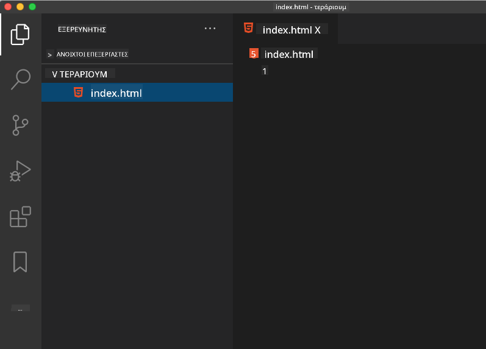

<!--
CO_OP_TRANSLATOR_METADATA:
{
  "original_hash": "46a0639e719b9cf1dfd062aa24cad639",
  "translation_date": "2025-08-26T21:28:38+00:00",
  "source_file": "3-terrarium/1-intro-to-html/README.md",
  "language_code": "el"
}
-->
# Έργο Terrarium Μέρος 1: Εισαγωγή στο HTML


> Σημειώσεις από [Tomomi Imura](https://twitter.com/girlie_mac)

## Ερωτηματολόγιο πριν το μάθημα

[Ερωτηματολόγιο πριν το μάθημα](https://ashy-river-0debb7803.1.azurestaticapps.net/quiz/15)

> Δείτε το βίντεο

> 
> [](https://www.youtube.com/watch?v=1TvxJKBzhyQ)

### Εισαγωγή

Το HTML, ή HyperText Markup Language, είναι ο 'σκελετός' του διαδικτύου. Αν το CSS 'ντύνει' το HTML και το JavaScript του δίνει ζωή, τότε το HTML είναι το σώμα της διαδικτυακής σας εφαρμογής. Η σύνταξη του HTML αντικατοπτρίζει αυτή την ιδέα, καθώς περιλαμβάνει ετικέτες όπως "head", "body" και "footer".

Σε αυτό το μάθημα, θα χρησιμοποιήσουμε το HTML για να σχεδιάσουμε τον 'σκελετό' της διεπαφής του εικονικού terrarium μας. Θα έχει έναν τίτλο και τρεις στήλες: μια δεξιά και μια αριστερή στήλη όπου θα βρίσκονται τα φυτά που μπορούν να μετακινηθούν, και μια κεντρική περιοχή που θα είναι το ίδιο το terrarium που μοιάζει με γυαλί. Μέχρι το τέλος αυτού του μαθήματος, θα μπορείτε να δείτε τα φυτά στις στήλες, αλλά η διεπαφή θα φαίνεται λίγο περίεργη. Μην ανησυχείτε, στην επόμενη ενότητα θα προσθέσετε στυλ CSS για να βελτιώσετε την εμφάνιση της διεπαφής.

### Εργασία

Στον υπολογιστή σας, δημιουργήστε έναν φάκελο με όνομα 'terrarium' και μέσα σε αυτόν ένα αρχείο με όνομα 'index.html'. Μπορείτε να το κάνετε αυτό στο Visual Studio Code αφού δημιουργήσετε τον φάκελο terrarium, ανοίγοντας ένα νέο παράθυρο του VS Code, κάνοντας κλικ στο 'open folder' και πηγαίνοντας στον νέο σας φάκελο. Κάντε κλικ στο μικρό κουμπί 'file' στον πίνακα Explorer και δημιουργήστε το νέο αρχείο:



Ή

Χρησιμοποιήστε αυτές τις εντολές στο git bash:
* `mkdir terrarium`
* `cd terrarium`
* `touch index.html`
* `code index.html` ή `nano index.html`

> Τα αρχεία index.html υποδεικνύουν σε έναν περιηγητή ότι είναι το προεπιλεγμένο αρχείο σε έναν φάκελο. URLs όπως `https://anysite.com/test` μπορεί να δημιουργούνται χρησιμοποιώντας μια δομή φακέλων που περιλαμβάνει έναν φάκελο με όνομα `test` και το `index.html` μέσα σε αυτόν. Το `index.html` δεν χρειάζεται να εμφανίζεται στο URL.

---

## Το DocType και οι ετικέτες html

Η πρώτη γραμμή ενός αρχείου HTML είναι το doctype του. Είναι λίγο παράξενο που πρέπει να υπάρχει αυτή η γραμμή στην κορυφή του αρχείου, αλλά ενημερώνει τους παλαιότερους περιηγητές ότι η σελίδα πρέπει να αποδοθεί σε τυπική λειτουργία, ακολουθώντας την τρέχουσα προδιαγραφή html.

> Συμβουλή: στο VS Code, μπορείτε να περάσετε το ποντίκι πάνω από μια ετικέτα και να λάβετε πληροφορίες για τη χρήση της από τους οδηγούς αναφοράς MDN.

Η δεύτερη γραμμή πρέπει να είναι η ετικέτα `<html>` που ανοίγει, ακολουθούμενη αμέσως από την ετικέτα που κλείνει `</html>`. Αυτές οι ετικέτες είναι τα βασικά στοιχεία της διεπαφής σας.

### Εργασία

Προσθέστε αυτές τις γραμμές στην κορυφή του αρχείου `index.html`:

```HTML
<!DOCTYPE html>
<html></html>
```

✅ Υπάρχουν διάφορες λειτουργίες που μπορούν να καθοριστούν ορίζοντας το DocType με μια συμβολοσειρά ερωτήματος: [Λειτουργία Quirks και Λειτουργία Standards](https://developer.mozilla.org/docs/Web/HTML/Quirks_Mode_and_Standards_Mode). Αυτές οι λειτουργίες χρησιμοποιούνταν για την υποστήριξη πολύ παλιών περιηγητών που δεν χρησιμοποιούνται πλέον (Netscape Navigator 4 και Internet Explorer 5). Μπορείτε να παραμείνετε στη δήλωση του τυπικού doctype.

---

## Η 'κεφαλή' του εγγράφου

Η περιοχή 'head' του εγγράφου HTML περιλαμβάνει κρίσιμες πληροφορίες για τη διαδικτυακή σας σελίδα, γνωστές και ως [μεταδεδομένα](https://developer.mozilla.org/docs/Web/HTML/Element/meta). Στην περίπτωσή μας, ενημερώνουμε τον διαδικτυακό διακομιστή στον οποίο θα σταλεί αυτή η σελίδα για να αποδοθεί, για τα εξής τέσσερα πράγματα:

-   τον τίτλο της σελίδας
-   μεταδεδομένα της σελίδας, συμπεριλαμβανομένων:
    -   του 'character set', που ενημερώνει για την κωδικοποίηση χαρακτήρων που χρησιμοποιείται στη σελίδα
    -   πληροφορίες για τον περιηγητή, συμπεριλαμβανομένου του `x-ua-compatible` που υποδεικνύει ότι υποστηρίζεται ο περιηγητής IE=edge
    -   πληροφορίες για το πώς πρέπει να συμπεριφέρεται το viewport όταν φορτώνεται. Ορίζοντας το viewport να έχει αρχική κλίμακα 1 ελέγχεται το επίπεδο ζουμ όταν η σελίδα φορτώνεται για πρώτη φορά.

### Εργασία

Προσθέστε ένα μπλοκ 'head' στο έγγραφό σας ανάμεσα στις ετικέτες `<html>` που ανοίγουν και κλείνουν.

```html
<head>
	<title>Welcome to my Virtual Terrarium</title>
	<meta charset="utf-8" />
	<meta http-equiv="X-UA-Compatible" content="IE=edge" />
	<meta name="viewport" content="width=device-width, initial-scale=1" />
</head>
```

✅ Τι θα συνέβαινε αν ορίζατε μια ετικέτα meta viewport όπως αυτή: `<meta name="viewport" content="width=600">`; Διαβάστε περισσότερα για το [viewport](https://developer.mozilla.org/docs/Web/HTML/Viewport_meta_tag).

---

## Το `body` του εγγράφου

### Ετικέτες HTML

Στο HTML, προσθέτετε ετικέτες στο αρχείο .html για να δημιουργήσετε στοιχεία μιας διαδικτυακής σελίδας. Κάθε ετικέτα συνήθως έχει μια ετικέτα που ανοίγει και μια που κλείνει, όπως αυτή: `<p>hello</p>` για να υποδείξετε μια παράγραφο. Δημιουργήστε το σώμα της διεπαφής σας προσθέτοντας ένα ζευγάρι ετικετών `<body>` μέσα στο ζευγάρι ετικετών `<html>`; η σήμανσή σας τώρα μοιάζει με αυτή:

### Εργασία

```html
<!DOCTYPE html>
<html>
	<head>
		<title>Welcome to my Virtual Terrarium</title>
		<meta charset="utf-8" />
		<meta http-equiv="X-UA-Compatible" content="IE=edge" />
		<meta name="viewport" content="width=device-width, initial-scale=1" />
	</head>
	<body></body>
</html>
```

Τώρα, μπορείτε να αρχίσετε να δημιουργείτε τη σελίδα σας. Συνήθως, χρησιμοποιείτε ετικέτες `<div>` για να δημιουργήσετε τα ξεχωριστά στοιχεία σε μια σελίδα. Θα δημιουργήσουμε μια σειρά από στοιχεία `<div>` που θα περιέχουν εικόνες.

### Εικόνες

Μια ετικέτα html που δεν χρειάζεται ετικέτα κλεισίματος είναι η ετικέτα ``, επειδή έχει ένα στοιχείο `src` που περιέχει όλες τις πληροφορίες που χρειάζεται η σελίδα για να αποδώσει το αντικείμενο.

Δημιουργήστε έναν φάκελο στην εφαρμογή σας με όνομα `images` και προσθέστε εκεί όλες τις εικόνες από τον [φάκελο πηγαίου κώδικα](../../../../3-terrarium/solution/images); (υπάρχουν 14 εικόνες φυτών).

### Εργασία

Προσθέστε αυτές τις εικόνες φυτών σε δύο στήλες ανάμεσα στις ετικέτες `<body></body>`:

```html
<div id="page">
	<div id="left-container" class="container">
		<div class="plant-holder">
			
		</div>
		<div class="plant-holder">
			
		</div>
		<div class="plant-holder">
			
		</div>
		<div class="plant-holder">
			
		</div>
		<div class="plant-holder">
			
		</div>
		<div class="plant-holder">
			
		</div>
		<div class="plant-holder">
			
		</div>
	</div>
	<div id="right-container" class="container">
		<div class="plant-holder">
			
		</div>
		<div class="plant-holder">
			
		</div>
		<div class="plant-holder">
			
		</div>
		<div class="plant-holder">
			
		</div>
		<div class="plant-holder">
			
		</div>
		<div class="plant-holder">
			
		</div>
		<div class="plant-holder">
			
		</div>
	</div>
</div>
```

> Σημείωση: Spans vs. Divs. Τα Divs θεωρούνται 'block' στοιχεία, ενώ τα Spans είναι 'inline'. Τι θα συνέβαινε αν μετατρέπατε αυτά τα divs σε spans;

Με αυτή τη σήμανση, τα φυτά εμφανίζονται τώρα στην οθόνη. Φαίνεται αρκετά άσχημο, επειδή δεν έχουν ακόμα στυλ χρησιμοποιώντας CSS, και θα το κάνουμε αυτό στο επόμενο μάθημα.

Κάθε εικόνα έχει εναλλακτικό κείμενο που θα εμφανίζεται ακόμα και αν δεν μπορείτε να δείτε ή να αποδώσετε μια εικόνα. Αυτό είναι ένα σημαντικό χαρακτηριστικό για την προσβασιμότητα. Μάθετε περισσότερα για την προσβασιμότητα σε μελλοντικά μαθήματα. Προς το παρόν, θυμηθείτε ότι το χαρακτηριστικό alt παρέχει εναλλακτικές πληροφορίες για μια εικόνα αν ένας χρήστης για κάποιο λόγο δεν μπορεί να τη δει (λόγω αργής σύνδεσης, σφάλματος στο χαρακτηριστικό src ή αν ο χρήστης χρησιμοποιεί αναγνώστη οθόνης).

✅ Παρατηρήσατε ότι κάθε εικόνα έχει το ίδιο alt tag; Είναι αυτή καλή πρακτική; Γιατί ή γιατί όχι; Μπορείτε να βελτιώσετε αυτόν τον κώδικα;

---

## Σημαντική σήμανση

Γενικά, είναι προτιμότερο να χρησιμοποιείτε ουσιαστική 'σημαντική' σήμανση όταν γράφετε HTML. Τι σημαίνει αυτό; Σημαίνει ότι χρησιμοποιείτε ετικέτες HTML για να αντιπροσωπεύσετε τον τύπο δεδομένων ή αλληλεπίδρασης για τον οποίο σχεδιάστηκαν. Για παράδειγμα, το κύριο κείμενο τίτλου σε μια σελίδα πρέπει να χρησιμοποιεί μια ετικέτα `<h1>`.

Προσθέστε την παρακάτω γραμμή ακριβώς κάτω από την ετικέτα `<body>` που ανοίγει:

```html
<h1>My Terrarium</h1>
```

Η χρήση σημαντικής σήμανσης, όπως το να έχετε επικεφαλίδες `<h1>` και μη ταξινομημένες λίστες να αποδίδονται ως `<ul>`, βοηθά τους αναγνώστες οθόνης να πλοηγούνται σε μια σελίδα. Γενικά, τα κουμπιά πρέπει να γράφονται ως `<button>` και οι λίστες ως `<li>`. Ενώ είναι _δυνατό_ να χρησιμοποιήσετε ειδικά στυλιζαρισμένα στοιχεία `<span>` με χειριστές κλικ για να μιμηθείτε κουμπιά, είναι καλύτερο για τους χρήστες με αναπηρίες να χρησιμοποιούν τεχνολογίες για να προσδιορίσουν πού βρίσκεται ένα κουμπί σε μια σελίδα και να αλληλεπιδράσουν με αυτό, αν το στοιχείο εμφανίζεται ως κουμπί. Για αυτόν τον λόγο, προσπαθήστε να χρησιμοποιείτε σημαντική σήμανση όσο το δυνατόν περισσότερο.

✅ Ρίξτε μια ματιά σε έναν αναγνώστη οθόνης και [πώς αλληλεπιδρά με μια διαδικτυακή σελίδα](https://www.youtube.com/watch?v=OUDV1gqs9GA). Μπορείτε να δείτε γιατί η μη σημαντική σήμανση μπορεί να απογοητεύσει τον χρήστη;

## Το terrarium

Το τελευταίο μέρος αυτής της διεπαφής περιλαμβάνει τη δημιουργία σήμανσης που θα στυλιζαριστεί για να δημιουργήσει ένα terrarium.

### Εργασία:

Προσθέστε αυτή τη σήμανση πάνω από την τελευταία ετικέτα `</div>`:

```html
<div id="terrarium">
	<div class="jar-top"></div>
	<div class="jar-walls">
		<div class="jar-glossy-long"></div>
		<div class="jar-glossy-short"></div>
	</div>
	<div class="dirt"></div>
	<div class="jar-bottom"></div>
</div>
```

✅ Παρόλο που προσθέσατε αυτή τη σήμανση στην οθόνη, δεν βλέπετε απολύτως τίποτα να αποδίδεται. Γιατί;

---

## 🚀Πρόκληση

Υπάρχουν μερικές 'παλιές' ετικέτες στο HTML που είναι ακόμα διασκεδαστικές να πειραματιστείτε, αν και δεν πρέπει να χρησιμοποιείτε καταργημένες ετικέτες όπως [αυτές](https://developer.mozilla.org/docs/Web/HTML/Element#Obsolete_and_deprecated_elements) στη σήμανσή σας. Παρ' όλα αυτά, μπορείτε να χρησιμοποιήσετε την παλιά ετικέτα `<marquee>` για να κάνετε τον τίτλο h1 να κυλάει οριζόντια; (αν το κάνετε, μην ξεχάσετε να το αφαιρέσετε μετά)

## Ερωτηματολόγιο μετά το μάθημα

[Ερωτηματολόγιο μετά το μάθημα](https://ashy-river-0debb7803.1.azurestaticapps.net/quiz/16)

## Ανασκόπηση & Αυτομελέτη

Το HTML είναι το 'δοκιμασμένο και αληθινό' σύστημα δομικών στοιχείων που έχει βοηθήσει να χτιστεί το διαδίκτυο όπως το γνωρίζουμε σήμερα. Μάθετε λίγα πράγματα για την ιστορία του μελετώντας μερικές παλιές και νέες ετικέτες. Μπορείτε να καταλάβετε γιατί κάποιες ετικέτες καταργήθηκαν και κάποιες προστέθηκαν; Ποιες ετικέτες μπορεί να εισαχθούν στο μέλλον;

Μάθετε περισσότερα για τη δημιουργία ιστοσελίδων για το διαδίκτυο και κινητές συσκευές στο [Microsoft Learn](https://docs.microsoft.com/learn/modules/build-simple-website/?WT.mc_id=academic-77807-sagibbon).

## Εργασία

[Εξασκηθείτε στο HTML: Δημιουργήστε ένα mockup blog](assignment.md)

---

**Αποποίηση ευθύνης**:  
Αυτό το έγγραφο έχει μεταφραστεί χρησιμοποιώντας την υπηρεσία αυτόματης μετάφρασης [Co-op Translator](https://github.com/Azure/co-op-translator). Παρόλο που καταβάλλουμε προσπάθειες για ακρίβεια, παρακαλούμε να έχετε υπόψη ότι οι αυτοματοποιημένες μεταφράσεις ενδέχεται να περιέχουν σφάλματα ή ανακρίβειες. Το πρωτότυπο έγγραφο στη μητρική του γλώσσα θα πρέπει να θεωρείται η αυθεντική πηγή. Για κρίσιμες πληροφορίες, συνιστάται επαγγελματική ανθρώπινη μετάφραση. Δεν φέρουμε ευθύνη για τυχόν παρεξηγήσεις ή εσφαλμένες ερμηνείες που προκύπτουν από τη χρήση αυτής της μετάφρασης.