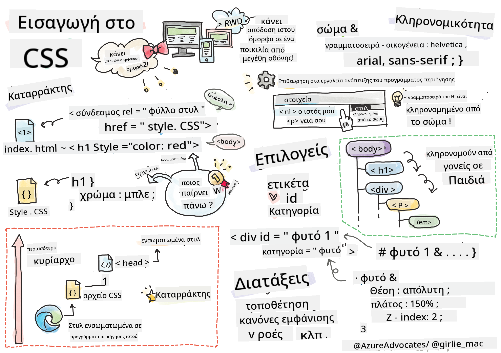
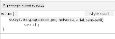
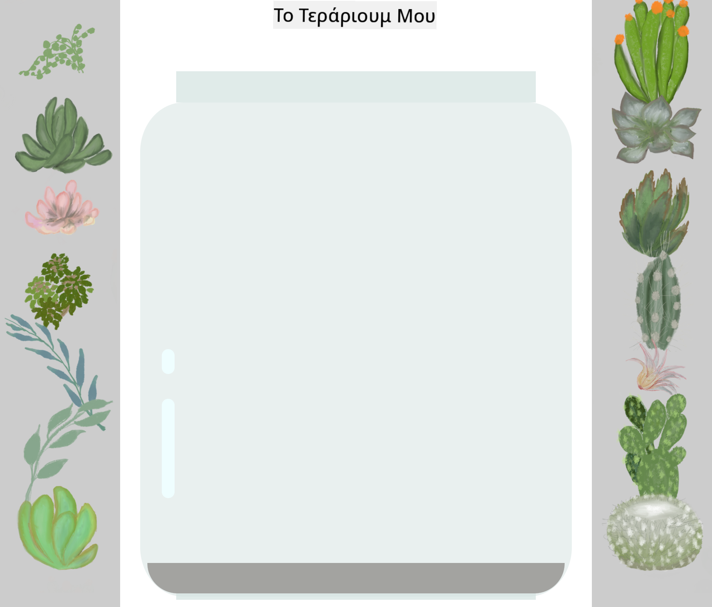

<!--
CO_OP_TRANSLATOR_METADATA:
{
  "original_hash": "92c4431eac70670b0450b02c1d11279a",
  "translation_date": "2025-10-23T20:17:17+00:00",
  "source_file": "3-terrarium/2-intro-to-css/README.md",
  "language_code": "el"
}
-->
# Έργο Terrarium Μέρος 2: Εισαγωγή στο CSS


> Σκίτσο από την [Tomomi Imura](https://twitter.com/girlie_mac)

Θυμάστε πόσο απλό φαινόταν το HTML terrarium σας; Με το CSS μπορούμε να μεταμορφώσουμε αυτήν την απλή δομή σε κάτι οπτικά ελκυστικό.

Αν το HTML είναι σαν να χτίζεις τον σκελετό ενός σπιτιού, τότε το CSS είναι όλα όσα το κάνουν να μοιάζει με σπίτι - τα χρώματα των τοίχων, η διάταξη των επίπλων, ο φωτισμός και η ροή των δωματίων. Σκεφτείτε πώς το Παλάτι των Βερσαλλιών ξεκίνησε ως ένα απλό κυνηγετικό καταφύγιο, αλλά με προσεκτική προσοχή στη διακόσμηση και τη διάταξη μεταμορφώθηκε σε ένα από τα πιο μεγαλοπρεπή κτίρια του κόσμου.

Σήμερα, θα μεταμορφώσουμε το terrarium σας από λειτουργικό σε καλαίσθητο. Θα μάθετε πώς να τοποθετείτε στοιχεία με ακρίβεια, να δημιουργείτε διατάξεις που ανταποκρίνονται σε διαφορετικά μεγέθη οθόνης και να προσθέτετε την οπτική γοητεία που κάνει τις ιστοσελίδες ελκυστικές.

Μέχρι το τέλος αυτού του μαθήματος, θα δείτε πώς η στρατηγική χρήση του CSS μπορεί να βελτιώσει δραματικά το έργο σας. Ας προσθέσουμε στυλ στο terrarium σας.

## Ερωτηματολόγιο πριν το μάθημα

[Ερωτηματολόγιο πριν το μάθημα](https://ff-quizzes.netlify.app/web/quiz/17)

## Ξεκινώντας με το CSS

Το CSS συχνά θεωρείται απλώς ως μέσο για να κάνουμε τα πράγματα "όμορφα", αλλά εξυπηρετεί έναν πολύ ευρύτερο σκοπό. Το CSS είναι σαν να είσαι σκηνοθέτης μιας ταινίας - ελέγχεις όχι μόνο πώς φαίνονται όλα, αλλά και πώς κινούνται, ανταποκρίνονται στην αλληλεπίδραση και προσαρμόζονται σε διαφορετικές καταστάσεις.

Το σύγχρονο CSS είναι εξαιρετικά ικανό. Μπορείτε να γράψετε κώδικα που προσαρμόζει αυτόματα τις διατάξεις για τηλέφωνα, tablet και υπολογιστές. Μπορείτε να δημιουργήσετε ομαλές κινήσεις που καθοδηγούν την προσοχή των χρηστών εκεί που χρειάζεται. Τα αποτελέσματα μπορεί να είναι εντυπωσιακά όταν όλα λειτουργούν αρμονικά.

> 💡 **Συμβουλή**: Το CSS εξελίσσεται συνεχώς με νέες δυνατότητες. Ελέγχετε πάντα το [CanIUse.com](https://caniuse.com) για να επαληθεύσετε την υποστήριξη των browsers για νεότερες δυνατότητες CSS πριν τις χρησιμοποιήσετε σε παραγωγικά έργα.

**Αυτό που θα πετύχουμε σε αυτό το μάθημα:**
- **Δημιουργούμε** έναν πλήρη οπτικό σχεδιασμό για το terrarium σας χρησιμοποιώντας σύγχρονες τεχνικές CSS
- **Εξερευνούμε** βασικές έννοιες όπως η ιεραρχία, η κληρονομικότητα και οι επιλογείς CSS
- **Εφαρμόζουμε** στρατηγικές θέσης και διάταξης που ανταποκρίνονται
- **Κατασκευάζουμε** το δοχείο του terrarium χρησιμοποιώντας σχήματα και στυλ CSS

### Προαπαιτούμενα

Θα πρέπει να έχετε ολοκληρώσει τη δομή HTML για το terrarium σας από το προηγούμενο μάθημα και να την έχετε έτοιμη για στυλιζάρισμα.

> 📺 **Πηγή βίντεο**: Δείτε αυτό το χρήσιμο βίντεο
>
> [](https://www.youtube.com/watch?v=6yIdOIV9p1I)

### Ρύθμιση του αρχείου CSS σας

Πριν ξεκινήσουμε το στυλιζάρισμα, πρέπει να συνδέσουμε το CSS με το HTML μας. Αυτή η σύνδεση λέει στον browser πού να βρει τις οδηγίες στυλ για το terrarium μας.

Στον φάκελο του terrarium σας, δημιουργήστε ένα νέο αρχείο με όνομα `style.css` και συνδέστε το στο τμήμα `<head>` του εγγράφου HTML σας:

```html
<link rel="stylesheet" href="./style.css" />
```

**Αυτός ο κώδικας κάνει τα εξής:**
- **Δημιουργεί** σύνδεση μεταξύ των αρχείων HTML και CSS σας
- **Λέει** στον browser να φορτώσει και να εφαρμόσει τα στυλ από το `style.css`
- **Χρησιμοποιεί** το χαρακτηριστικό `rel="stylesheet"` για να καθορίσει ότι πρόκειται για αρχείο CSS
- **Αναφέρεται** στη διαδρομή του αρχείου με το `href="./style.css"`

## Κατανόηση της Ιεραρχίας του CSS

Έχετε αναρωτηθεί ποτέ γιατί το CSS ονομάζεται "Cascading" Style Sheets; Τα στυλ κατεβαίνουν σαν καταρράκτης και μερικές φορές συγκρούονται μεταξύ τους.

Σκεφτείτε πώς λειτουργούν οι στρατιωτικές εντολές - μια γενική εντολή μπορεί να λέει "όλοι οι στρατιώτες να φορούν πράσινα", αλλά μια συγκεκριμένη εντολή για τη μονάδα σας μπορεί να λέει "φορέστε μπλε για την τελετή". Η πιο συγκεκριμένη οδηγία υπερισχύει. Το CSS ακολουθεί παρόμοια λογική, και η κατανόηση αυτής της ιεραρχίας κάνει την αποσφαλμάτωση πολύ πιο εύκολη.

### Πειραματισμός με την Προτεραιότητα της Ιεραρχίας

Ας δούμε την ιεραρχία σε δράση δημιουργώντας μια σύγκρουση στυλ. Πρώτα, προσθέστε ένα ενσωματωμένο στυλ στην ετικέτα `<h1>`:

```html
<h1 style="color: red">My Terrarium</h1>
```

**Τι κάνει αυτός ο κώδικας:**
- **Εφαρμόζει** ένα κόκκινο χρώμα απευθείας στο στοιχείο `<h1>` χρησιμοποιώντας ενσωματωμένο στυλ
- **Χρησιμοποιεί** το χαρακτηριστικό `style` για να ενσωματώσει το CSS απευθείας στο HTML
- **Δημιουργεί** τον κανόνα στυλ με την υψηλότερη προτεραιότητα για αυτό το συγκεκριμένο στοιχείο

Στη συνέχεια, προσθέστε αυτόν τον κανόνα στο αρχείο `style.css`:

```css
h1 {
  color: blue;
}
```

**Στα παραπάνω:**
- **Ορίζουμε** έναν κανόνα CSS που στοχεύει όλα τα στοιχεία `<h1>`
- **Ρυθμίζουμε** το χρώμα του κειμένου σε μπλε χρησιμοποιώντας εξωτερικό φύλλο στυλ
- **Δημιουργούμε** έναν κανόνα χαμηλότερης προτεραιότητας σε σύγκριση με τα ενσωματωμένα στυλ

✅ **Έλεγχος Γνώσεων**: Ποιο χρώμα εμφανίζεται στην εφαρμογή σας; Γιατί υπερισχύει αυτό το χρώμα; Μπορείτε να σκεφτείτε σενάρια όπου θα θέλατε να παρακάμψετε τα στυλ;

> 💡 **Σειρά Προτεραιότητας CSS (από υψηλότερη σε χαμηλότερη):**
> 1. **Ενσωματωμένα στυλ** (χαρακτηριστικό style)
> 2. **IDs** (#myId)
> 3. **Κλάσεις** (.myClass) και χαρακτηριστικά
> 4. **Επιλογείς στοιχείων** (h1, div, p)
> 5. **Προεπιλογές browser**

## Η Κληρονομικότητα του CSS σε Δράση

Η κληρονομικότητα του CSS λειτουργεί σαν τη γενετική - τα στοιχεία κληρονομούν ορισμένες ιδιότητες από τα γονικά τους στοιχεία. Αν ορίσετε την οικογένεια γραμματοσειράς στο στοιχείο body, όλο το κείμενο μέσα χρησιμοποιεί αυτόματα την ίδια γραμματοσειρά. Είναι παρόμοιο με το πώς η χαρακτηριστική γνάθος της οικογένειας Habsburg εμφανίστηκε σε γενιές χωρίς να καθοριστεί για κάθε άτομο.

Ωστόσο, δεν κληρονομούνται όλα. Στυλ κειμένου όπως γραμματοσειρές και χρώματα κληρονομούνται, αλλά ιδιότητες διάταξης όπως περιθώρια και περιγράμματα δεν κληρονομούνται. Όπως τα παιδιά μπορεί να κληρονομήσουν φυσικά χαρακτηριστικά αλλά όχι τις επιλογές μόδας των γονιών τους.

### Παρατήρηση της Κληρονομικότητας Γραμματοσειράς

Ας δούμε την κληρονομικότητα σε δράση ορίζοντας μια οικογένεια γραμματοσειράς στο στοιχείο `<body>`:

```css
body {
  font-family: 'Segoe UI', Tahoma, Geneva, Verdana, sans-serif;
}
```

**Ανάλυση του τι συμβαίνει εδώ:**
- **Ορίζει** την οικογένεια γραμματοσειράς για ολόκληρη τη σελίδα στοχεύοντας το στοιχείο `<body>`
- **Χρησιμοποιεί** μια στοίβα γραμματοσειρών με εναλλακτικές επιλογές για καλύτερη συμβατότητα browser
- **Εφαρμόζει** σύγχρονες γραμματοσειρές συστήματος που φαίνονται εξαιρετικά σε διαφορετικά λειτουργικά συστήματα
- **Εξασφαλίζει** ότι όλα τα παιδικά στοιχεία κληρονομούν αυτήν τη γραμματοσειρά εκτός αν παρακαμφθεί συγκεκριμένα

Ανοίξτε τα εργαλεία προγραμματιστή του browser σας (F12), μεταβείτε στην καρτέλα Elements και επιθεωρήστε το στοιχείο `<h1>`. Θα δείτε ότι κληρονομεί την οικογένεια γραμματοσειράς από το body:



✅ **Πειραματιστείτε**: Δοκιμάστε να ορίσετε άλλες κληρονομήσιμες ιδιότητες στο `<body>` όπως `color`, `line-height` ή `text-align`. Τι συμβαίνει με την επικεφαλίδα και τα άλλα στοιχεία;

> 📝 **Κληρονομήσιμες Ιδιότητες Περιλαμβάνουν**: `color`, `font-family`, `font-size`, `line-height`, `text-align`, `visibility`
>
> **Μη Κληρονομήσιμες Ιδιότητες Περιλαμβάνουν**: `margin`, `padding`, `border`, `width`, `height`, `position`

## Κατανόηση των Επιλογέων CSS

Οι επιλογείς CSS είναι ο τρόπος σας να στοχεύετε συγκεκριμένα στοιχεία για στυλιζάρισμα. Λειτουργούν σαν να δίνετε ακριβείς οδηγίες - αντί να λέτε "το σπίτι", μπορείτε να πείτε "το μπλε σπίτι με την κόκκινη πόρτα στην οδό Maple".

Το CSS παρέχει διαφορετικούς τρόπους για να είστε συγκεκριμένοι, και η επιλογή του σωστού επιλογέα είναι σαν να επιλέγετε το κατάλληλο εργαλείο για τη δουλειά. Μερικές φορές χρειάζεται να στυλιζάρετε κάθε πόρτα στη γειτονιά, και άλλες φορές μόνο μία συγκεκριμένη πόρτα.

### Επιλογείς Στοιχείων (Ετικέτες)

Οι επιλογείς στοιχείων στοχεύουν στοιχεία HTML με βάση το όνομα της ετικέτας τους. Είναι ιδανικοί για να ορίσετε βασικά στυλ που εφαρμόζονται ευρέως στη σελίδα σας:

```css
body {
  font-family: 'Segoe UI', Tahoma, Geneva, Verdana, sans-serif;
  margin: 0;
  padding: 0;
}

h1 {
  color: #3a241d;
  text-align: center;
  font-size: 2.5rem;
  margin-bottom: 1rem;
}
```

**Κατανόηση αυτών των στυλ:**
- **Ορίζει** συνεπή τυπογραφία σε ολόκληρη τη σελίδα με τον επιλογέα `body`
- **Αφαιρεί** τα προεπιλεγμένα περιθώρια και padding του browser για καλύτερο έλεγχο
- **Στυλιζάρει** όλα τα στοιχεία επικεφαλίδας με χρώμα, ευθυγράμμιση και αποστάσεις
- **Χρησιμοποιεί** μονάδες `rem` για κλιμακούμενο, προσβάσιμο μέγεθος γραμματοσειράς

Ενώ οι επιλογείς στοιχείων λειτουργούν καλά για γενικό στυλιζάρισμα, θα χρειαστείτε πιο συγκεκριμένους επιλογείς για να στυλιζάρετε μεμονωμένα στοιχεία όπως τα φυτά στο terrarium σας.

### Επιλογείς ID για Μοναδικά Στοιχεία

Οι επιλογείς ID χρησιμοποιούν το σύμβολο `#` και στοχεύουν στοιχεία με συγκεκριμένα χαρακτηριστικά `id`. Δεδομένου ότι τα IDs πρέπει να είναι μοναδικά σε μια σελίδα, είναι ιδανικά για στυλιζάρισμα μεμονωμένων, ειδικών στοιχείων όπως τα αριστερά και δεξιά δοχεία φυτών.

Ας δημιουργήσουμε το στυλ για τα πλευρικά δοχεία του terrarium μας όπου θα ζουν τα φυτά:

```css
#left-container {
  background-color: #f5f5f5;
  width: 15%;
  left: 0;
  top: 0;
  position: absolute;
  height: 100vh;
  padding: 1rem;
  box-sizing: border-box;
}

#right-container {
  background-color: #f5f5f5;
  width: 15%;
  right: 0;
  top: 0;
  position: absolute;
  height: 100vh;
  padding: 1rem;
  box-sizing: border-box;
}
```

**Αυτός ο κώδικας επιτυγχάνει τα εξής:**
- **Τοποθετεί** δοχεία στις άκρες αριστερά και δεξιά χρησιμοποιώντας `absolute` θέση
- **Χρησιμοποιεί** μονάδες `vh` (ύψος προβολής) για προσαρμοστικό ύψος που προσαρμόζεται στο μέγεθος της οθόνης
- **Εφαρμόζει** `box-sizing: border-box` ώστε το padding να περιλαμβάνεται στο συνολικό πλάτος
- **Αφαιρεί** περιττές μονάδες `px` από μηδενικές τιμές για καθαρότερο κώδικα
- **Ορίζει** ένα απαλό χρώμα φόντου που είναι πιο ευχάριστο από το έντονο γκρι

✅ **Πρόκληση Ποιότητας Κώδικα**: Παρατηρήστε πώς αυτό το CSS παραβιάζει την αρχή DRY (Don't Repeat Yourself). Μπορείτε να το αναδιαμορφώσετε χρησιμοποιώντας τόσο ID όσο και κλάση;

**Βελτιωμένη προσέγγιση:**
```html
<div id="left-container" class="container"></div>
<div id="right-container" class="container"></div>
```

```css
.container {
  background-color: #f5f5f5;
  width: 15%;
  top: 0;
  position: absolute;
  height: 100vh;
  padding: 1rem;
  box-sizing: border-box;
}

#left-container {
  left: 0;
}

#right-container {
  right: 0;
}
```


### Επιλογείς Κλάσης για Επαναχρησιμοποιήσιμα Στυλ

Οι επιλογείς κλάσης χρησιμοποιούν το σύμβολο `.` και είναι ιδανικοί όταν θέλετε να εφαρμόσετε τα ίδια στυλ σε πολλά στοιχεία. Σε αντίθεση με τα IDs, οι κλάσεις μπορούν να επαναχρησιμοποιηθούν σε όλο το HTML σας, καθιστώντας τις ιδανικές για συνεπείς μοτίβα στυλιζαρίσματος.

Στο terrarium μας, κάθε φυτό χρειάζεται παρόμοιο στυλ αλλά και μοναδική τοποθέτηση. Θα χρησιμοποιήσουμε έναν συνδυασμό κλάσεων για κοινά στυλ και IDs για μοναδική τοποθέτηση.

**Αυτό είναι το HTML για κάθε φυτό:**
```html
<div class="plant-holder">
  
</div>
```

**Βασικά στοιχεία εξηγημένα:**
- **Χρησιμοποιεί** `class="plant-holder"` για συνεπή στυλιζάρισμα δοχείου σε όλα τα φυτά
- **Εφαρμόζει** `class="plant"` για κοινό στυλιζάρισμα και συμπεριφορά εικόνας
- **Περιλαμβάνει** μοναδικό `id="plant1"` για ατομική τοποθέτηση και αλληλεπίδραση με JavaScript
- **Παρέχει** περιγραφικό alt κείμενο για προσβασιμότητα με αναγνώστες οθόνης

Τώρα προσθέστε αυτά τα στυλ στο αρχείο `style.css` σας:

```css
.plant-holder {
  position: relative;
  height: 13%;
  left: -0.6rem;
}

.plant {
  position: absolute;
  max-width: 150%;
  max-height: 150%;
  z-index: 2;
  transition: transform 0.3s ease;
}

.plant:hover {
  transform: scale(1.05);
}
```

**Ανάλυση αυτών των στυλ:**
- **Δημιουργεί** σχετική θέση για το δοχείο φυτών ώστε να καθιερωθεί ένα πλαίσιο θέσης
- **Ορίζει** κάθε δοχείο φυτών σε ύψος 13%, εξασφαλίζοντας ότι όλα τα φυτά χωρούν κάθετα χωρίς κύλιση
- **Μετακινεί** τα δοχεία ελαφρώς αριστερά για καλύτερη κεντράρισμα των φυτών μέσα στα δοχεία
- **Επιτρέπει** στα φυτά να κλιμακώνονται προσαρμοστικά με ιδιότητες `max-width` και `max-height`
- **Χρησιμοποιεί** `z-index` για να τοποθετήσει τα φυτά πάνω από άλλα στοιχεία στο terrarium
- **Προσθέτει** ένα απαλό εφέ hover με μεταβάσεις CSS για καλύτερη αλληλεπίδραση χρήστη

✅ **Κριτική Σκέψη**: Γιατί χρειαζόμαστε τόσο τους επιλογείς `.plant-holder` όσο και `.plant`; Τι θα συνέβαινε αν προσπαθούσαμε να χρησιμοποιήσουμε μόνο έναν;

> 💡 **Μοτίβο Σχεδιασμού**: Το δοχείο (`.plant-holder`) ελέγχει τη διάταξη και τη θέση, ενώ το περιεχόμενο (`.plant`) ελέγχει την
Ας φτιάξουμε το βάζο του terrarium κομμάτι-κομμάτι. Κάθε μέρος χρησιμοποιεί απόλυτη τοποθέτηση και διαστάσεις βασισμένες σε ποσοστά για ευέλικτο σχεδιασμό:

```css
.jar-walls {
  height: 80%;
  width: 60%;
  background: #d1e1df;
  border-radius: 1rem;
  position: absolute;
  bottom: 0.5%;
  left: 20%;
  opacity: 0.5;
  z-index: 1;
  box-shadow: inset 0 0 2rem rgba(0, 0, 0, 0.1);
}

.jar-top {
  width: 50%;
  height: 5%;
  background: #d1e1df;
  position: absolute;
  bottom: 80.5%;
  left: 25%;
  opacity: 0.7;
  z-index: 1;
  border-radius: 0.5rem 0.5rem 0 0;
}

.jar-bottom {
  width: 50%;
  height: 1%;
  background: #d1e1df;
  position: absolute;
  bottom: 0;
  left: 25%;
  opacity: 0.7;
  border-radius: 0 0 0.5rem 0.5rem;
}

.dirt {
  width: 60%;
  height: 5%;
  background: #3a241d;
  position: absolute;
  border-radius: 0 0 1rem 1rem;
  bottom: 1%;
  left: 20%;
  opacity: 0.7;
  z-index: -1;
}
```

**Κατανόηση της κατασκευής του terrarium:**
- **Χρησιμοποιεί** διαστάσεις βασισμένες σε ποσοστά για ευέλικτη κλιμάκωση σε όλες τις οθόνες
- **Τοποθετεί** τα στοιχεία με απόλυτη ακρίβεια για να στοιβάζονται και να ευθυγραμμίζονται σωστά
- **Εφαρμόζει** διαφορετικές τιμές αδιαφάνειας για να δημιουργήσει το εφέ διαφάνειας του γυαλιού
- **Χρησιμοποιεί** στρώσεις `z-index` ώστε τα φυτά να φαίνονται μέσα στο βάζο
- **Προσθέτει** διακριτική σκιά και εκλεπτυσμένη καμπυλότητα στις άκρες για πιο ρεαλιστική εμφάνιση

### Ευέλικτος Σχεδιασμός με Ποσοστά

Παρατηρήστε πώς όλες οι διαστάσεις χρησιμοποιούν ποσοστά αντί για σταθερές τιμές σε pixels:

**Γιατί είναι σημαντικό:**
- **Εξασφαλίζει** ότι το terrarium κλιμακώνεται αναλογικά σε οποιοδήποτε μέγεθος οθόνης
- **Διατηρεί** τις οπτικές σχέσεις μεταξύ των στοιχείων του βάζου
- **Παρέχει** μια συνεπή εμπειρία από κινητά τηλέφωνα έως μεγάλες οθόνες υπολογιστών
- **Επιτρέπει** στο σχέδιο να προσαρμόζεται χωρίς να χαλάει η οπτική διάταξη

### Μονάδες CSS σε Δράση

Χρησιμοποιούμε μονάδες `rem` για την καμπυλότητα των άκρων, οι οποίες κλιμακώνονται σε σχέση με το μέγεθος γραμματοσειράς της ρίζας. Αυτό δημιουργεί πιο προσβάσιμα σχέδια που σέβονται τις προτιμήσεις γραμματοσειράς του χρήστη. Μάθετε περισσότερα για τις [σχετικές μονάδες CSS](https://www.w3.org/TR/css-values-3/#font-relative-lengths) στην επίσημη προδιαγραφή.

✅ **Οπτική Δοκιμή**: Δοκιμάστε να τροποποιήσετε αυτές τις τιμές και παρατηρήστε τα αποτελέσματα:
- Αλλάξτε την αδιαφάνεια του βάζου από 0.5 σε 0.8 – πώς επηρεάζει την εμφάνιση του γυαλιού;
- Ρυθμίστε το χρώμα του χώματος από `#3a241d` σε `#8B4513` – ποια είναι η οπτική επίδραση;
- Τροποποιήστε το `z-index` του χώματος σε 2 – τι συμβαίνει με τη στρώση;

---

## Πρόκληση GitHub Copilot Agent 🚀

Χρησιμοποιήστε τη λειτουργία Agent για να ολοκληρώσετε την παρακάτω πρόκληση:

**Περιγραφή:** Δημιουργήστε μια CSS animation που κάνει τα φυτά του terrarium να κινούνται απαλά μπρος-πίσω, προσομοιώνοντας την επίδραση ενός φυσικού αέρα. Αυτό θα σας βοηθήσει να εξασκηθείτε στις CSS animations, μετασχηματισμούς και keyframes, ενώ θα βελτιώσει την οπτική εμφάνιση του terrarium.

**Πρόκληση:** Προσθέστε CSS keyframe animations για να κάνουν τα φυτά στο terrarium να κινούνται απαλά από τη μία πλευρά στην άλλη. Δημιουργήστε μια animation που περιστρέφει κάθε φυτό ελαφρώς (2-3 μοίρες) αριστερά και δεξιά με διάρκεια 3-4 δευτερόλεπτα και εφαρμόστε την στην κλάση `.plant`. Βεβαιωθείτε ότι η animation επαναλαμβάνεται ασταμάτητα και έχει μια λειτουργία easing για φυσική κίνηση.

Μάθετε περισσότερα για τη [λειτουργία agent](https://code.visualstudio.com/blogs/2025/02/24/introducing-copilot-agent-mode) εδώ.

## 🚀 Πρόκληση: Προσθήκη Αντανακλάσεων Γυαλιού

Έτοιμοι να βελτιώσετε το terrarium σας με ρεαλιστικές αντανακλάσεις γυαλιού; Αυτή η τεχνική θα προσθέσει βάθος και ρεαλισμό στο σχέδιο.

Θα δημιουργήσετε διακριτικά highlights που προσομοιώνουν πώς το φως αντανακλάται στις γυάλινες επιφάνειες. Αυτή η προσέγγιση είναι παρόμοια με το πώς οι ζωγράφοι της Αναγέννησης, όπως ο Jan van Eyck, χρησιμοποιούσαν φως και αντανακλάσεις για να κάνουν το ζωγραφισμένο γυαλί να φαίνεται τρισδιάστατο. Να τι προσπαθείτε να πετύχετε:



**Η πρόκλησή σας:**
- **Δημιουργήστε** διακριτικά λευκά ή ανοιχτόχρωμα οβάλ σχήματα για τις αντανακλάσεις του γυαλιού
- **Τοποθετήστε** τα στρατηγικά στην αριστερή πλευρά του βάζου
- **Εφαρμόστε** κατάλληλες τιμές αδιαφάνειας και εφέ θολώματος για ρεαλιστική αντανακλαστικότητα φωτός
- **Χρησιμοποιήστε** `border-radius` για να δημιουργήσετε οργανικά, φυσαλιδώδη σχήματα
- **Πειραματιστείτε** με gradients ή box-shadows για ενισχυμένο ρεαλισμό

## Κουίζ μετά το μάθημα

[Κουίζ μετά το μάθημα](https://ff-quizzes.netlify.app/web/quiz/18)

## Επεκτείνετε τις Γνώσεις σας για CSS

Το CSS μπορεί να φαίνεται περίπλοκο αρχικά, αλλά η κατανόηση αυτών των βασικών εννοιών παρέχει μια σταθερή βάση για πιο προηγμένες τεχνικές.

**Οι επόμενες περιοχές μάθησης CSS:**
- **Flexbox** - απλοποιεί την ευθυγράμμιση και τη διανομή στοιχείων
- **CSS Grid** - παρέχει ισχυρά εργαλεία για τη δημιουργία σύνθετων διατάξεων
- **CSS Variables** - μειώνει την επανάληψη και βελτιώνει τη συντηρησιμότητα
- **Ευέλικτος σχεδιασμός** - εξασφαλίζει ότι οι ιστότοποι λειτουργούν καλά σε διαφορετικά μεγέθη οθόνης

### Διαδραστικοί Πόροι Μάθησης

Εξασκηθείτε σε αυτές τις έννοιες με αυτά τα διασκεδαστικά, πρακτικά παιχνίδια:
- 🐸 [Flexbox Froggy](https://flexboxfroggy.com/) - Μάθετε το Flexbox μέσα από διασκεδαστικές προκλήσεις
- 🌱 [Grid Garden](https://codepip.com/games/grid-garden/) - Μάθετε CSS Grid καλλιεργώντας εικονικά καρότα
- 🎯 [CSS Battle](https://cssbattle.dev/) - Δοκιμάστε τις δεξιότητές σας στο CSS με προκλήσεις κώδικα

### Πρόσθετη Μάθηση

Για ολοκληρωμένες βασικές γνώσεις CSS, ολοκληρώστε αυτήν τη μονάδα Microsoft Learn: [Style your HTML app with CSS](https://docs.microsoft.com/learn/modules/build-simple-website/4-css-basics/?WT.mc_id=academic-77807-sagibbon)

## Εργασία

[CSS Refactoring](assignment.md)

---

**Αποποίηση ευθύνης**:  
Αυτό το έγγραφο έχει μεταφραστεί χρησιμοποιώντας την υπηρεσία μετάφρασης AI [Co-op Translator](https://github.com/Azure/co-op-translator). Παρόλο που καταβάλλουμε προσπάθειες για ακρίβεια, παρακαλούμε να έχετε υπόψη ότι οι αυτοματοποιημένες μεταφράσεις ενδέχεται να περιέχουν σφάλματα ή ανακρίβειες. Το πρωτότυπο έγγραφο στη μητρική του γλώσσα θα πρέπει να θεωρείται η αυθεντική πηγή. Για κρίσιμες πληροφορίες, συνιστάται επαγγελματική ανθρώπινη μετάφραση. Δεν φέρουμε ευθύνη για τυχόν παρεξηγήσεις ή εσφαλμένες ερμηνείες που προκύπτουν από τη χρήση αυτής της μετάφρασης.