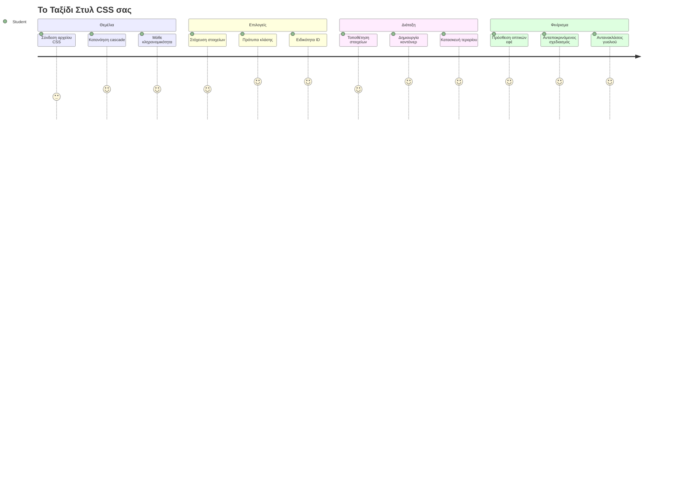
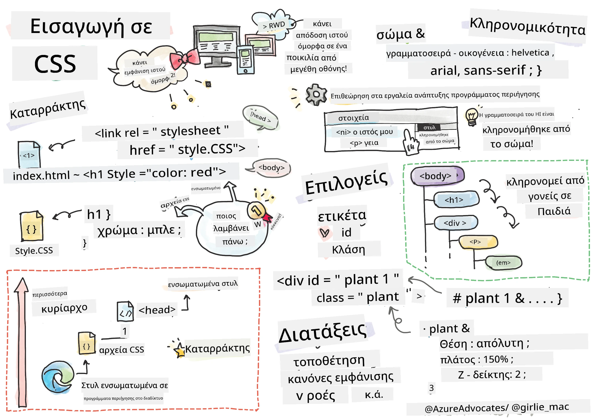
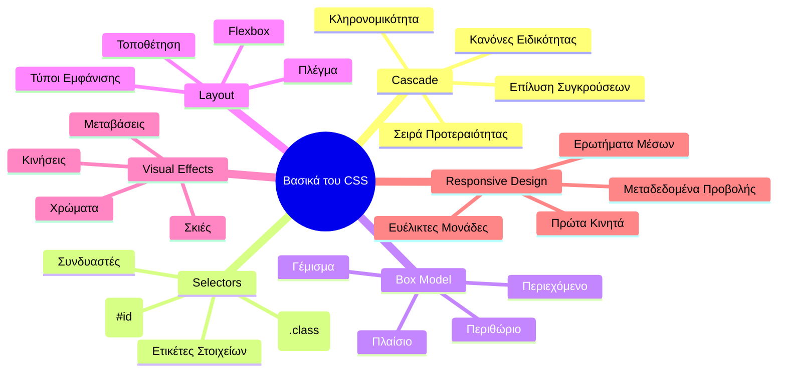
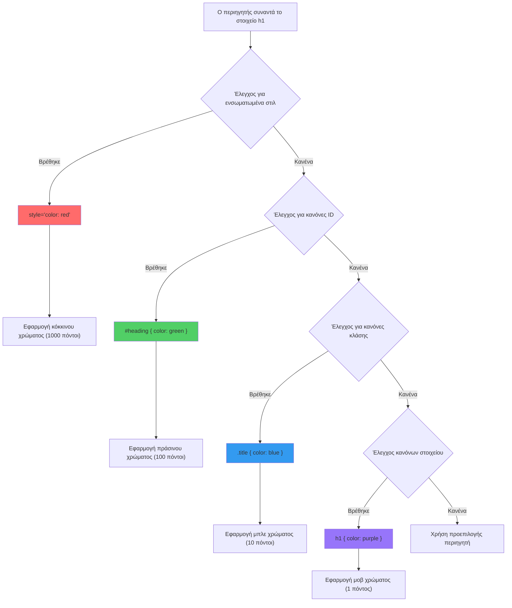
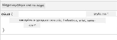
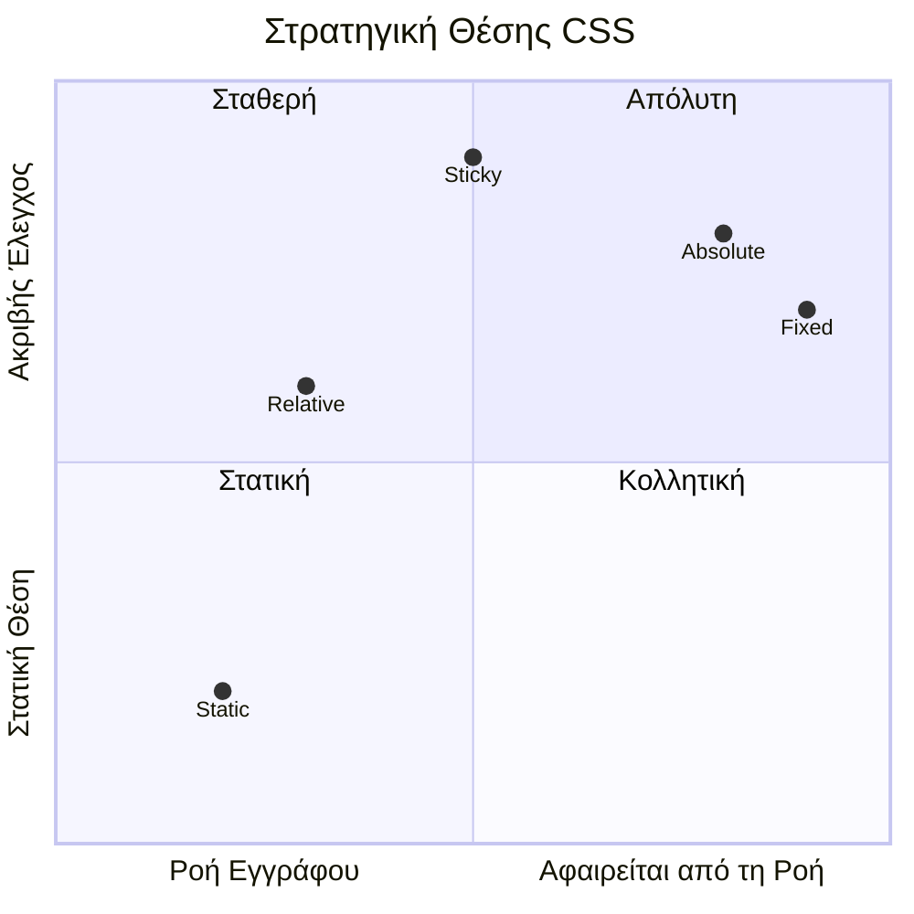
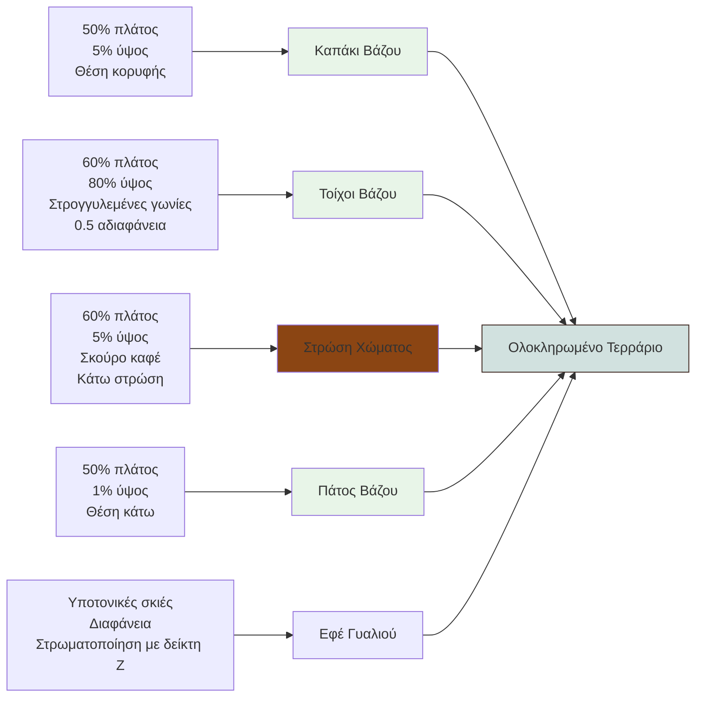
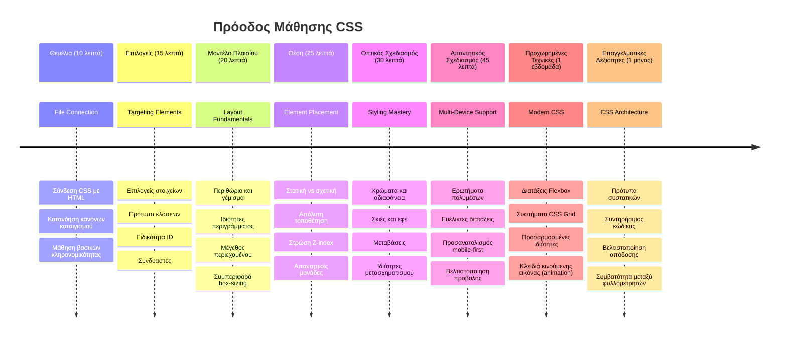

# Έργο Terrarium Μέρος 2: Εισαγωγή στο CSS



> Σχεδιοσημείωση από την [Τομομι Ιμούρα](https://twitter.com/girlie_mac)

Θυμάστε πώς φαινόταν το HTML terrarium σας αρκετά βασικό; Το CSS είναι το εργαλείο όπου μετατρέπουμε αυτήν την απλή δομή σε κάτι οπτικά ελκυστικό.

Αν το HTML είναι σαν το να χτίζεις τον σκελετό ενός σπιτιού, τότε το CSS είναι όλα όσα το κάνουν να νιώθεις σαν σπίτι - τα χρώματα της βαφής, η διάταξη των επίπλων, ο φωτισμός και πώς ρέουν οι χώροι μαζί. Σκεφτείτε πώς το Ανάκτορο των Βερσαλλιών ξεκίνησε ως μια απλή κατοικία κυνηγιού, αλλά η προσεχτική προσοχή στη διακόσμηση και τη διάταξη το μεταμόρφωσε σε ένα από τα πιο μεγαλοπρεπή κτίρια του κόσμου.

Σήμερα, θα μεταμορφώσουμε το terrarium σας από λειτουργικό σε πλήρως διαμορφωμένο. Θα μάθετε πώς να τοποθετείτε στοιχεία με ακρίβεια, να κάνετε τη διάταξη να ανταποκρίνεται σε διαφορετικά μεγέθη οθόνης και να δημιουργήσετε την οπτική γοητεία που καθιστά τους ιστότοπους ελκυστικούς.

Στο τέλος αυτού του μαθήματος, θα δείτε πώς η στρατηγική μορφοποίηση CSS μπορεί να βελτιώσει δραστικά το έργο σας. Ας προσθέσουμε λίγο στυλ στο terrarium σας.


## Πρό-Μαθηματικό Quiz

[Quiz πριν το μάθημα](https://ff-quizzes.netlify.app/web/quiz/17)

## Ξεκινώντας με το CSS

Το CSS συχνά θεωρείται απλώς ως "το να κάνεις τα πράγματα όμορφα," αλλά εξυπηρετεί πολύ ευρύτερο σκοπό. Το CSS είναι σαν να είσαι ο σκηνοθέτης μιας ταινίας - ελέγχεις όχι μόνο πώς φαίνεται το κάθε τι, αλλά και πώς κινείται, αντιδρά στην αλληλεπίδραση και προσαρμόζεται σε διαφορετικές καταστάσεις.

Το σύγχρονο CSS είναι εκπληκτικά ικανό. Μπορείτε να γράψετε κώδικα που ρυθμίζει αυτόματα τις διατάξεις για κινητά, tablet και επιτραπέζιους υπολογιστές. Μπορείτε να δημιουργήσετε ομαλές κινούμενες εικόνες που κατευθύνουν την προσοχή των χρηστών εκεί που χρειάζεται. Τα αποτελέσματα μπορούν να είναι αρκετά εντυπωσιακά όταν όλα λειτουργούν μαζί.

> 💡 **Συμβουλή Επαγγελματία**: Το CSS εξελίσσεται συνεχώς με νέα χαρακτηριστικά και δυνατότητες. Ελέγχετε πάντα το [CanIUse.com](https://caniuse.com) για να επιβεβαιώσετε την υποστήριξη συγκεκριμένων προγραμμάτων περιήγησης για νεότερα χαρακτηριστικά CSS πριν τα χρησιμοποιήσετε σε παραγωγικά έργα.

**Αυτά θα επιτύχουμε σε αυτό το μάθημα:**
- **Δημιουργία** πλήρους οπτικού σχεδιασμού για το terrarium σας χρησιμοποιώντας σύγχρονες τεχνικές CSS
- **Εξερεύνηση** βασικών εννοιών όπως η ιεραρχία (cascade), η κληρονομικότητα και οι επιλογείς CSS
- **Εφαρμογή** στρατηγικών τοποθέτησης και διάταξης για απόκριση
- **Κατασκευή** του περιέκτη terrarium χρησιμοποιώντας σχήματα και στυλ CSS

### Προαπαιτούμενα

Πρέπει να έχετε ολοκληρώσει τη δομή HTML για το terrarium σας από το προηγούμενο μάθημα και να είναι έτοιμη για μορφοποίηση.

> 📺 **Βίντεο Πόρος**: Δείτε αυτό το χρήσιμο βίντεο-περιήγηση
>
> [](https://www.youtube.com/watch?v=6yIdOIV9p1I)

### Εγκατάσταση του Αρχείου CSS σας

Πριν ξεκινήσουμε να μορφοποιούμε, πρέπει να συνδέσουμε το CSS με το HTML. Αυτή η σύνδεση λέει στον περιηγητή πού να βρει τις οδηγίες μορφοποίησης για το terrarium μας.

Στο φάκελο του terrarium σας, δημιουργήστε ένα νέο αρχείο με όνομα `style.css`, και μετά συνδέστε το στην ενότητα `<head>` του εγγράφου HTML σας:

```html
<link rel="stylesheet" href="./style.css" />
```

**Αυτά κάνει ο κώδικας:**
- **Δημιουργεί** μια σύνδεση ανάμεσα στο HTML και στα αρχεία CSS σας
- **Λέει** στον περιηγητή να φορτώσει και να εφαρμόσει τα στυλ από το `style.css`
- **Χρησιμοποιεί** το `rel="stylesheet"` για να καθορίσει ότι πρόκειται για αρχείο CSS
- **Αναφέρεται** στην διαδρομή αρχείου με το `href="./style.css"`

## Κατανόηση της Ιεραρχίας CSS

Πάντοτε αναρωτιόσασταν γιατί το CSS λέγεται "Cascading" Style Sheets; Τα στυλ τρέχουν καταρρέοντας σαν καταρράκτης, και μερικές φορές συγκρούονται μεταξύ τους.

Σκεφτείτε πώς λειτουργούν οι στρατιωτικές δομές εντολής - μια γενική διαταγή μπορεί να λέει "όλοι οι στρατιώτες να φορούν πράσινα," αλλά μια συγκεκριμένη εντολή προς τη μονάδα σας μπορεί να λέει "φορέστε τις στολές για την τελετή". Η πιο συγκεκριμένη οδηγία έχει προτεραιότητα. Το CSS ακολουθεί παρόμοια λογική και η κατανόηση αυτής της ιεραρχίας καθιστά την ανίχνευση σφαλμάτων πολύ πιο διαχειρίσιμη.

### Πειραματισμός με την Προτεραιότητα της Ιεραρχίας

Ας δούμε την ιεραρχία σε δράση δημιουργώντας μια σύγκρουση στυλ. Πρώτα, προσθέστε ένα ενσωματωμένο στυλ (inline) στο `<h1>` σας:

```html
<h1 style="color: red">My Terrarium</h1>
```

**Τι κάνει αυτός ο κώδικας:**
- **Εφαρμόζει** κόκκινο χρώμα απευθείας στο στοιχείο `<h1>` χρησιμοποιώντας ενσωματωμένο στυλ
- **Χρησιμοποιεί** το χαρακτηριστικό `style` για να ενσωματώσει CSS απευθείας στο HTML
- **Δημιουργεί** τον κανόνα στυλ με την υψηλότερη προτεραιότητα γι’ αυτό το συγκεκριμένο στοιχείο

Έπειτα, προσθέστε αυτόν τον κανόνα στο αρχείο `style.css` σας:

```css
h1 {
  color: blue;
}
```

**Σε αυτά, έχουμε:**
- **Ορίσει** έναν κανόνα CSS που στοχεύει όλα τα στοιχεία `<h1>`
- **Ρυθμίσει** το χρώμα του κειμένου σε μπλε χρησιμοποιώντας εξωτερικό φύλλο στυλ
- **Δημιουργήσει** λιγότερο προτεραιότητα σε σχέση με τα ενσωματωμένα στυλ (inline)

✅ **Έλεγχος Γνώσης**: Ποιο χρώμα εμφανίζεται στην εφαρμογή σας; Γιατί κερδίζει αυτό το χρώμα; Μπορείτε να σκεφτείτε περιπτώσεις όπου μπορεί να θέλετε να παρακάμψετε στυλ;


> 💡 **Σειρά Προτεραιότητας CSS (από την υψηλότερη προς την χαμηλότερη):**
> 1. **Ενσωματωμένα στυλ** (χαρακτηριστικό style)
> 2. **IDs** (#myId)
> 3. **Κλάσεις** (.myClass) και χαρακτηριστικά
> 4. **Επιλογείς στοιχείων** (h1, div, p)
> 5. **Προεπιλογές προγράμματος περιήγησης**

## Κληρονομικότητα CSS σε Δράση

Η κληρονομικότητα στο CSS λειτουργεί όπως η γενετική - τα στοιχεία κληρονομούν ορισμένες ιδιότητες από τους γονικούς τους κόμβους. Αν ορίσετε την οικογένεια γραμματοσειράς στο στοιχείο `body`, όλο το κείμενο μέσα χρησιμοποιεί αυτόματα αυτή την γραμματοσειρά. Είναι παρόμοιο με το πώς η χαρακτηριστική γνάθος της οικογένειας Χάμπσμπουργκ εμφανιζόταν σε όλες τις γενιές χωρίς να ορίζεται για κάθε άτομο ξεχωριστά.

Ωστόσο, δεν κληρονομείται τα πάντα. Τα στυλ κειμένου όπως γραμματοσειρές και χρώματα κληρονομούνται, αλλά ιδιότητες διάταξης όπως περιθώρια και περιγράμματα δεν κληρονομούνται. Όπως τα παιδιά μπορεί να κληρονομήσουν φυσικά χαρακτηριστικά αλλά όχι τις επιλογές μόδας των γονέων τους.

### Παρατήρηση της Κληρονομικότητας της Γραμματοσειράς

Ας δούμε την κληρονομικότητα σε δράση ορίζοντας μια οικογένεια γραμματοσειράς στο στοιχείο `<body>`:

```css
body {
  font-family: 'Segoe UI', Tahoma, Geneva, Verdana, sans-serif;
}
```

**Ανάλυση του τι συμβαίνει:**
- **Ορίζει** την οικογένεια γραμματοσειράς για όλη τη σελίδα στοχεύοντας το στοιχείο `<body>`
- **Χρησιμοποιεί** μια στοίβα γραμματοσειρών με εναλλακτικές επιλογές για καλύτερη συμβατότητα μεταξύ προγραμμάτων περιήγησης
- **Εφαρμόζει** σύγχρονες συστημικές γραμματοσειρές που δείχνουν καλά σε διάφορα λειτουργικά συστήματα
- **Εξασφαλίζει** ότι όλα τα παιδιά στοιχεία κληρονομούν αυτή την γραμματοσειρά εκτός αν οριστεί διαφορετικά

Ανοίξτε τα εργαλεία ανάπτυξης του περιηγητή σας (F12), πηγαίνετε στην καρτέλα Elements και επιθεωρήστε το στοιχείο `<h1>`. Θα δείτε ότι κληρονομεί την οικογένεια γραμματοσειράς από το `body`:



✅ **Δοκιμή Πειράματος**: Δοκιμάστε να ορίσετε άλλες κληρονομούμενες ιδιότητες στο `<body>` όπως `color`, `line-height` ή `text-align`. Τι συμβαίνει με τον τίτλο σας και άλλα στοιχεία;

> 📝 **Κληρονομούμενες Ιδιότητες Περιλαμβάνουν**: `color`, `font-family`, `font-size`, `line-height`, `text-align`, `visibility`
>
> **Μη Κληρονομούμενες Ιδιότητες Περιλαμβάνουν**: `margin`, `padding`, `border`, `width`, `height`, `position`

### 🔄 **Παιδαγωγικός Έλεγχος**
**Κατανόηση Βάσεων CSS**: Πριν προχωρήσετε στους επιλογείς, βεβαιωθείτε ότι μπορείτε να:
- ✅ Εξηγήσετε τη διαφορά ανάμεσα στην ιεραρχία (cascade) και την κληρονομικότητα
- ✅ Προβλέψετε ποιο στυλ θα υπερισχύσει σε μια σύγκρουση συγκεκριμενοποίησης
- ✅ Αναγνωρίσετε ποιες ιδιότητες κληρονομούνται από γονικά στοιχεία
- ✅ Συνδέσετε σωστά αρχεία CSS με HTML

**Γρήγορη Δοκιμή**: Αν έχετε αυτά τα στυλ, τι χρώμα θα έχει ένα `<h1>` μέσα σε ένα `<div class="special">`;
```css
div { color: blue; }
.special { color: green; }
h1 { color: red; }
```
*Απάντηση: Κόκκινο (ο επιλογέας στοιχείου στοχεύει απευθείας το h1)*

## Εξοικείωση με τους Επιλογείς CSS

Οι επιλογείς CSS είναι ο τρόπος με τον οποίο στοχεύετε συγκεκριμένα στοιχεία για μορφοποίηση. Λειτουργούν όπως το να δίνετε ακριβείς οδηγίες - αντί να πείτε "το σπίτι," μπορεί να πείτε "το μπλε σπίτι με την κόκκινη πόρτα στην οδό Μέιπλ."

Το CSS παρέχει διαφορετικούς τρόπους για να είστε συγκεκριμένοι, και η επιλογή του σωστού επιλογέα είναι σαν να διαλέγετε το κατάλληλο εργαλείο για τη δουλειά. Μερικές φορές πρέπει να μορφοποιήσετε κάθε πόρτα στη γειτονιά, και μερικές άλλες μόνο μια συγκεκριμένη πόρτα.

### Επιλογείς Στοιχείων (Tags)

Οι επιλογείς στοιχείων στοχεύουν τα HTML στοιχεία με βάση το όνομα ετικέτας τους. Είναι τέλειοι για τη ρύθμιση βασικών στυλ που εφαρμόζονται γενικά σε όλη τη σελίδα σας:

```css
body {
  font-family: 'Segoe UI', Tahoma, Geneva, Verdana, sans-serif;
  margin: 0;
  padding: 0;
}

h1 {
  color: #3a241d;
  text-align: center;
  font-size: 2.5rem;
  margin-bottom: 1rem;
}
```

**Κατανόηση αυτών των στυλ:**
- **Ορίζει** συνεπή τυπογραφία σε όλη τη σελίδα με τον επιλογέα `body`
- **Αφαιρεί** τα προεπιλεγμένα περιθώρια και τα padding του προγράμματος περιήγησης για καλύτερο έλεγχο
- **Μορφοποιεί** όλα τα στοιχεία τίτλων με χρώμα, στοίχιση και απόσταση
- **Χρησιμοποιεί** μονάδες `rem` για κλιμακούμενο, προσβάσιμο μέγεθος γραμματοσειράς

Ενώ οι επιλογείς στοιχείων λειτουργούν καλά για γενική μορφοποίηση, θα χρειαστείτε πιο συγκεκριμένους επιλογείς για να μορφοποιήσετε μεμονωμένα συστατικά όπως τα φυτά στο terrarium σας.

### Επιλογείς ID για Μοναδικά Στοιχεία

Οι επιλογείς ID χρησιμοποιούν το σύμβολο `#` και στοχεύουν στοιχεία με συγκεκριμένο χαρακτηριστικό `id`. Επειδή τα ID πρέπει να είναι μοναδικά σε μια σελίδα, είναι τέλεια για τη μορφοποίηση μοναδικών, ειδικών στοιχείων όπως οι περιέκτες φυτών αριστερά και δεξιά.

Ας δημιουργήσουμε τη μορφοποίηση για τους πλευρικούς περιέκτες terrarium όπου θα ζουν τα φυτά:

```css
#left-container {
  background-color: #f5f5f5;
  width: 15%;
  left: 0;
  top: 0;
  position: absolute;
  height: 100vh;
  padding: 1rem;
  box-sizing: border-box;
}

#right-container {
  background-color: #f5f5f5;
  width: 15%;
  right: 0;
  top: 0;
  position: absolute;
  height: 100vh;
  padding: 1rem;
  box-sizing: border-box;
}
```

**Αυτά επιτυγχάνει ο κώδικας:**
- **Τοποθετεί** τους περιέκτες στις ακραίες αριστερές και δεξιές ακμές χρησιμοποιώντας `absolute` θέση
- **Χρησιμοποιεί** μονάδες `vh` (ύψος οθόνης) για ανταποκρινόμενο ύψος που προσαρμόζεται στο μέγεθος οθόνης
- **Εφαρμόζει** το `box-sizing: border-box` ώστε το padding να συμπεριλαμβάνεται στο συνολικό πλάτος
- **Αφαιρεί** τις περιττές μονάδες `px` από τιμές μηδενικές για καθαρότερο κώδικα
- **Ορίζει** ένα διακριτικό χρώμα φόντου που είναι πιο ευχάριστο στο μάτι από το έντονο γκρι

✅ **Πρόκληση Ποιότητας Κώδικα**: Παρατηρήστε πώς αυτό το CSS παραβιάζει την αρχή DRY (Don’t Repeat Yourself). Μπορείτε να το αναδιαμορφώσετε χρησιμοποιώντας τόσο ένα ID όσο και μια κλάση;

**Βελτιωμένη προσέγγιση:**
```html
<div id="left-container" class="container"></div>
<div id="right-container" class="container"></div>
```

```css
.container {
  background-color: #f5f5f5;
  width: 15%;
  top: 0;
  position: absolute;
  height: 100vh;
  padding: 1rem;
  box-sizing: border-box;
}

#left-container {
  left: 0;
}

#right-container {
  right: 0;
}
```

### Επιλογείς Κλάσεων για Επαναχρησιμοποιήσιμα Στυλ

Οι επιλογείς κλάσεων χρησιμοποιούν το σύμβολο `.` και είναι ιδανικοί όταν θέλετε να εφαρμόσετε τα ίδια στυλ σε πολλαπλά στοιχεία. Σε αντίθεση με τα ID, οι κλάσεις μπορούν να επαναχρησιμοποιούνται σε όλο το HTML σας, καθιστώντας τις ιδανικές για συνεπή πρότυπα μορφοποίησης.

Στο terrarium μας, κάθε φυτό χρειάζεται παρόμοια μορφοποίηση αλλά και ξεχωριστή τοποθέτηση. Θα χρησιμοποιήσουμε συνδυασμό κλάσεων για κοινά στυλ και ID για μοναδική τοποθέτηση.

**Αυτή είναι η δομή HTML για κάθε φυτό:**
```html
<div class="plant-holder">
  
</div>
```

**Κύρια στοιχεία εξηγούνται:**
- **Χρησιμοποιεί** `class="plant-holder"` για συνεπή μορφοποίηση κοντέινερ σε όλα τα φυτά
- **Εφαρμόζει** `class="plant"` για κοινή μορφοποίηση εικόνας και συμπεριφορά
- **Περιλαμβάνει** μοναδικό `id="plant1"` για ατομική τοποθέτηση και αλληλεπίδραση με JavaScript
- **Παρέχει** περιγραφικό alt κείμενο για προσβασιμότητα με οθόνες ανάγνωσης

Τώρα προσθέστε αυτά τα στυλ στο αρχείο `style.css` σας:

```css
.plant-holder {
  position: relative;
  height: 13%;
  left: -0.6rem;
}

.plant {
  position: absolute;
  max-width: 150%;
  max-height: 150%;
  z-index: 2;
  transition: transform 0.3s ease;
}

.plant:hover {
  transform: scale(1.05);
}
```

**Ανάλυση των στυλ αυτών:**
- **Δημιουργεί** σχετική τοποθέτηση για τον κάτοχο του φυτού ώστε να ορίσει πλαίσιο τοποθέτησης
- **Ορίζει** κάθε φυτο-κάτοχο σε ύψος 13%, διασφαλίζοντας ότι όλα τα φυτά χωράνε σε ύψος χωρίς κύλιση
- **Μετακινεί** ελαφρώς τους κάτοχους προς τα αριστερά για καλύτερο κεντράρισμα των φυτών μέσα στους περιέκτες τους
- **Επιτρέπει** στα φυτά να κλιμακώνονται ανταποκρινόμενα με τις ιδιότητες `max-width` και `max-height`
- **Χρησιμοποιεί** `z-index` για να τοποθετεί τα φυτά πάνω από άλλα στοιχεία στο terrarium
- **Προσθέτει** διακριτικό εφέ hover με μεταβάσεις CSS για καλύτερη αλληλεπίδραση χρήστη

✅ **Κριτική Σκέψη**: Γιατί χρειαζόμαστε και τους δύο επιλογείς `.plant-holder` και `.plant`; Τι θα συνέβαινε αν χρησιμοποιούσαμε μόνο έναν;

> 💡 **Σχέδιο Σχεδιασμού**: Ο περιέκτης (`.plant-holder`) ελέγχει τη διάταξη και την τοποθέτηση, ενώ το περιεχόμενο (`.plant`) ελέγχει την εμφάνιση και την κλιμάκωση. Αυτή η διαχωριστική καθιστά τον κώδικα πιο διαχειρίσιμο και ευέλικτο.

## Κατανόηση της Τοποθέτησης CSS

Η τοποθέτηση CSS είναι σαν να είσαι ο σκηνοθέτης για μια θεατρική παράσταση - καθοδηγείς πού στέκεται κάθε ηθοποιός και πώς κινούνται στη σκηνή. Κάποιοι ηθοποιοί ακολουθούν την κανονική διάταξη, ενώ άλλοι χρειάζονται συγκεκριμένη τοποθέτηση για δραματικό αποτέλεσμα.

Μόλις κατανοήσεις την τοποθέτηση, πολλές προκλήσεις διάταξης γίνονται διαχειρίσιμες. Χρειάζεσαι μια γραμμή πλοήγησης που μένει στην κορυφή ενώ οι χρήστες κάνουν κύλιση; Η τοποθέτηση το διαχειρίζεται αυτό. Θέλεις ένα tooltip που εμφανίζεται σε συγκεκριμένη θέση; Αυτή είναι επίσης τοποθέτηση.

### Οι Πέντε Τιμές Τοποθέτησης


| Τιμή Τοποθέτησης | Συμπεριφορά | Περίπτωση Χρήσης |
|-------------------|--------------|------------------|
| `static` | Προεπιλεγμένη ροή, αγνοεί top/left/right/bottom | Κανονική διάταξη εγγράφου |
| `relative` | Τοποθετημένο σχετικά με τη φυσική θέση του | Μικρές προσαρμογές, δημιουργία πλαισίου τοποθέτησης |
| `absolute` | Τοποθετημένο σχετικά με τον πλησιέστερο τοποθετημένο πρόγονο | Ακριβής τοποθέτηση, υπερθέσεις |
| `fixed` | Τοποθετημένο σχετικά με το παράθυρο θέασης | Μπάρες πλοήγησης, αιωρούμενα στοιχεία |
| `sticky` | Εναλλαγή ανάμεσα σε relative και fixed ανάλογα με το κύλισμα | Κεφαλίδες που παραμένουν κολλημένες όταν κυλάτε |

### Τοποθέτηση στο Terrarium μας

Το terrarium μας χρησιμοποιεί έναν στρατηγικό συνδυασμό τύπων τοποθέτησης για να δημιουργήσει τη επιθυμητή διάταξη:

```css
/* Container positioning */
.container {
  position: absolute; /* Removes from normal flow */
  /* ... other styles ... */
}

/* Plant holder positioning */
.plant-holder {
  position: relative; /* Creates positioning context */
  /* ... other styles ... */
}

/* Plant positioning */
.plant {
  position: absolute; /* Allows precise placement within holder */
  /* ... other styles ... */
}
```

**Κατανόηση της στρατηγικής τοποθέτησης:**
- **Οι απόλυτοι κοντέινερ** αφαιρούνται από τον κανονικό ροή εγγράφου και καρφιτσώνονται στις άκρες της οθόνης
- **Οι σχετικοί κάτοχοι φυτών** δημιουργούν πλαίσιο τοποθέτησης ενώ παραμένουν στη ροή εγγράφου
- **Τα απόλυτα φυτά** μπορούν να τοποθετηθούν με ακρίβεια μέσα στους σχετικούς περιέκτες τους
- **Αυτός ο συνδυασμός** επιτρέπει στα φυτά να στοιβάζονται κατακόρυφα ενώ είναι μοναδικά τοποθετήσιμα

> 🎯 **Γιατί έχει σημασία**: Τα στοιχεία `plant` χρειάζονται απόλυτη τοποθέτηση για να γίνουν σύρσιμα στο επόμενο μάθημα. Η απόλυτη τοποθέτηση τα αφαιρεί από τον κανονικό ροή διάταξης, κάνοντας δυνατές τις αλληλεπιδράσεις drag-and-drop.

✅ **Πειραματισμός**: Δοκιμάστε να αλλάξετε τις τιμές τοποθέτησης και παρατηρήστε τα αποτελέσματα:
- Τι συμβαίνει αν αλλάξετε το `.container` από `absolute` σε `relative`;
- Πώς αλλάζει η διάταξη αν το `.plant-holder` χρησιμοποιεί `absolute` αντί για `relative`;
- Τι συμβαίνει όταν αλλάζετε τη θέση του `.plant` σε `relative`;

### 🔄 **Παιδαγωγικός Έλεγχος**
**Κατανόηση Θέσης CSS**: Σταματήστε για να ελέγξετε την κατανόησή σας:
- ✅ Μπορείτε να εξηγήσετε γιατί τα φυτά χρειάζονται απόλυτη θέση για drag-and-drop;
- ✅ Καταλαβαίνετε πώς τα σχετικά containers δημιουργούν πλαίσιο θέσης;
- ✅ Γιατί τα πλευρικά containers χρησιμοποιούν απόλυτη θέση;
- ✅ Τι θα συνέβαινε αν αφαιρούσατε εντελώς τις δηλώσεις θέσης;

**Σύνδεση με τον Πραγματικό Κόσμο**: Σκεφτείτε πώς η τοποθέτηση CSS αντικατοπτρίζει τη διάταξη στον πραγματικό κόσμο:
- **Static**: Βιβλία στο ράφι (φυσική σειρά)
- **Relative**: Μετακινώντας ελαφρώς ένα βιβλίο κρατώντας τη θέση του
- **Absolute**: Τοποθετώντας σελιδοδείκτη σε ακριβή αριθμό σελίδας
- **Fixed**: Μια αυτοκόλλητη σημείωση που μένει ορατή καθώς γυρίζετε τις σελίδες

## Δημιουργία του Τεραρίου με CSS

Τώρα θα δημιουργήσουμε ένα γυάλινο βάζο χρησιμοποιώντας μόνο CSS - χωρίς εικόνες ή λογισμικό γραφικών.

Η δημιουργία ρεαλιστικών γυαλιών, σκιών και εφέ βάθους χρησιμοποιώντας θέση και διαφάνεια δείχνει τις οπτικές δυνατότητες του CSS. Αυτή η τεχνική αντικατοπτρίζει πώς οι αρχιτέκτονες του κινήματος Bauhaus χρησιμοποιούσαν απλές γεωμετρικές μορφές για να δημιουργήσουν σύνθετες, όμορφες δομές. Μόλις κατανοήσετε αυτές τις αρχές, θα αναγνωρίζετε τις τεχνικές CSS πίσω από πολλά διαδικτυακά σχέδια.


### Δημιουργία των Συστατικών του Γυάλινου Βάζου

Ας κατασκευάσουμε το βάζο του τεραρίου τμηματικά. Κάθε μέρος χρησιμοποιεί απόλυτη θέση και διαστάσεις βάσει ποσοστού για σχεδιασμό προσαρμοστικότητας:

```css
.jar-walls {
  height: 80%;
  width: 60%;
  background: #d1e1df;
  border-radius: 1rem;
  position: absolute;
  bottom: 0.5%;
  left: 20%;
  opacity: 0.5;
  z-index: 1;
  box-shadow: inset 0 0 2rem rgba(0, 0, 0, 0.1);
}

.jar-top {
  width: 50%;
  height: 5%;
  background: #d1e1df;
  position: absolute;
  bottom: 80.5%;
  left: 25%;
  opacity: 0.7;
  z-index: 1;
  border-radius: 0.5rem 0.5rem 0 0;
}

.jar-bottom {
  width: 50%;
  height: 1%;
  background: #d1e1df;
  position: absolute;
  bottom: 0;
  left: 25%;
  opacity: 0.7;
  border-radius: 0 0 0.5rem 0.5rem;
}

.dirt {
  width: 60%;
  height: 5%;
  background: #3a241d;
  position: absolute;
  border-radius: 0 0 1rem 1rem;
  bottom: 1%;
  left: 20%;
  opacity: 0.7;
  z-index: -1;
}
```

**Κατανόηση της κατασκευής του τεραρίου:**
- **Χρησιμοποιεί** διαστάσεις με ποσοστά για αναλογική κλιμάκωση σε όλα τα μεγέθη οθόνης
- **Θέτει** τα στοιχεία απόλυτα για στοίβαξη και ακριβή ευθυγράμμιση
- **Εφαρμόζει** διαφορετικές τιμές διαφάνειας για να δημιουργήσει το εφέ διαφάνειας γυαλιού
- **Υλοποιεί** στρώση `z-index` ώστε τα φυτά να εμφανίζονται μέσα στο βάζο
- **Προσθέτει** λεπτό σκίασμα κουτιού και βελτιωμένη ακτίνα περιγράμματος για πιο ρεαλιστική εμφάνιση

### Σχεδιασμός Προσαρμοστικός με Ποσοστά

Παρατηρήστε πώς όλες οι διαστάσεις χρησιμοποιούν ποσοστά αντί για σταθερές τιμές σε pixel:

**Γιατί είναι σημαντικό:**
- **Διασφαλίζει** ότι το τεράριο κλιμακώνεται αναλογικά σε κάθε μέγεθος οθόνης
- **Διατηρεί** τις οπτικές αναλογίες μεταξύ των συστατικών του βαζιού
- **Προσφέρει** ομοιόμορφη εμπειρία από κινητά τηλέφωνα έως μεγάλα desktop monitors
- **Επιτρέπει** στο σχέδιο να προσαρμόζεται χωρίς να σπάει η οπτική διάταξη

### Μονάδες CSS σε Δράση

Χρησιμοποιούμε μονάδες `rem` για το border-radius, που κλιμακώνονται σχετικά με το μέγεθος της ρίζας της γραμματοσειράς. Αυτό δημιουργεί πιο προσβάσιμα σχέδια που σέβονται τις προτιμήσεις των χρηστών. Μάθετε περισσότερα για τις [σχετικές μονάδες CSS](https://www.w3.org/TR/css-values-3/#font-relative-lengths) στην επίσημη προδιαγραφή.

✅ **Οπτικά Πειράματα**: Δοκιμάστε να τροποποιήσετε αυτές τις τιμές και παρατηρήστε τα αποτελέσματα:
- Αλλάξτε τη διαφάνεια του βαζιού από 0.5 σε 0.8 – πώς επηρεάζεται η εμφάνιση του γυαλιού;
- Προσαρμόστε το χρώμα της βρωμιάς από `#3a241d` σε `#8B4513` – ποιο οπτικό αποτέλεσμα έχει αυτό;
- Αλλάξτε το `z-index` της βρωμιάς σε 2 – τι συμβαίνει με την στοίβαξη;

### 🔄 **Παιδαγωγικός Έλεγχος**
**Κατανόηση Οπτικού Σχεδιασμού CSS**: Επιβεβαιώστε την κατανόησή σας στο οπτικό CSS:
- ✅ Πώς δημιουργούν οι διαστάσεις με ποσοστά το responsive design;
- ✅ Γιατί η διαφάνεια δημιουργεί το εφέ γυαλιού;
- ✅ Ποιος ρόλος παίζει το z-index στη στοίβαξη στοιχείων;
- ✅ Πώς οι τιμές border-radius δημιουργούν το σχήμα του βαζιού;

**Αρχή Σχεδιασμού**: Παρατηρήστε πώς κατασκευάζουμε σύνθετα οπτικά από απλά σχήματα:
1. **Ορθογώνια** → **Στρογγυλεμένα ορθογώνια** → **Συστατικά του βάζου**
2. **Επίπεδα χρώματα** → **Διαφάνεια** → **Εφέ γυαλιού**
3. **Ατομικά στοιχεία** → **Στρωματική σύνθεση** → **Τρισδιάστατη εμφάνιση**

---

## Πρόκληση GitHub Copilot Agent 🚀

Χρησιμοποιήστε τη λειτουργία Agent για να ολοκληρώσετε την παρακάτω πρόκληση:

**Περιγραφή:** Δημιουργήστε μια CSS animation που κάνει τα φυτά του τεραρίου να κινούνται απαλά μπρος και πίσω, προσομοιώνοντας το φαινόμενο φυσικού αέρα. Αυτό θα σας βοηθήσει να εξασκηθείτε σε CSS animations, μετασχηματισμούς και keyframes ενώ ενισχύετε την οπτική εμφάνιση του τεραρίου σας.

**Προτροπή:** Προσθέστε CSS keyframe animations που κάνουν τα φυτά στο τεράριο να κινούνται απαλά από τη μία πλευρά στην άλλη. Δημιουργήστε μια κίνηση κλίσης που περιστρέφει κάθε φυτό ελαφρά (2-3 μοίρες) αριστερά και δεξιά με διάρκεια 3-4 δευτερολέπτων, και εφαρμόστε τη στην κλάση `.plant`. Βεβαιωθείτε ότι η κίνηση βρόγχου είναι άπειρη και έχει easing για φυσική κίνηση.

Μάθετε περισσότερα για τη [λειτουργία agent](https://code.visualstudio.com/blogs/2025/02/24/introducing-copilot-agent-mode) εδώ.

## 🚀 Πρόκληση: Προσθήκη Αντανακλάσεων στο Γυαλί

Έτοιμοι να βελτιώσετε το τεράριό σας με ρεαλιστικές αντανακλάσεις γυαλιού; Αυτή η τεχνική θα προσθέσει βάθος και ρεαλισμό στο σχέδιο.

Θα δημιουργήσετε διακριτικά φωτεινά σημεία που προσομοιώνουν πώς το φως αντανακλάται στις γυάλινες επιφάνειες. Αυτή η προσέγγιση είναι παρόμοια με το πώς οι ζωγράφοι της Αναγέννησης όπως ο Jan van Eyck χρησιμοποιούσαν το φως και την αντανάκλαση για να κάνουν το ζωγραφισμένο γυαλί να φαίνεται τρισδιάστατο. Αυτό στοχεύετε:


**Η πρόκλησή σας:**
- **Δημιουργήστε** διακριτικούς λευκούς ή ανοιχτόχρωμους οβάλ σχηματισμούς για τις αντανακλάσεις του γυαλιού
- **Τοποθετήστε** τους στρατηγικά στην αριστερή πλευρά του βαζιού
- **Εφαρμόστε** κατάλληλες τιμές διαφάνειας και θολώματος για ρεαλιστική αντανάκλαση φωτός
- **Χρησιμοποιήστε** `border-radius` για να δημιουργήσετε οργανικά, φυσαλιδωτά σχήματα
- **Πειραματιστείτε** με gradients ή box-shadows για βελτιωμένη ρεαλιστικότητα

## Κουίζ Μετά το Μάθημα

[Post-lecture quiz](https://ff-quizzes.netlify.app/web/quiz/18)

## Επέκταση Γνώσης CSS

Το CSS μπορεί να φαίνεται πολύπλοκο αρχικά, αλλά η κατανόηση αυτών των βασικών εννοιών παρέχει ισχυρή βάση για πιο εξελιγμένες τεχνικές.

**Οι επόμενες περιοχές εκμάθησης CSS:**
- **Flexbox** - απλοποιεί την ευθυγράμμιση και διανομή στοιχείων
- **CSS Grid** - παρέχει ισχυρά εργαλεία για τη δημιουργία σύνθετων διατάξεων
- **Μεταβλητές CSS** - μειώνουν την επανάληψη και βελτιώνουν τη συντηρησιμότητα
- **Responsive design** - εξασφαλίζει ότι τα sites λειτουργούν καλά σε διαφορετικά μεγέθη οθόνης

### Διαδραστικοί Πόροι Μάθησης

Πρακτική σε αυτές τις έννοιες με διασκεδαστικά, διαδραστικά παιχνίδια:
- 🐸 [Flexbox Froggy](https://flexboxfroggy.com/) - Μάθετε Flexbox μέσα από διασκεδαστικές προκλήσεις
- 🌱 [Grid Garden](https://codepip.com/games/grid-garden/) - Μάθετε CSS Grid καλλιεργώντας εικονικά καρότα
- 🎯 [CSS Battle](https://cssbattle.dev/) - Δοκιμάστε τις ικανότητές σας στο CSS με κωδικοπαιχνίδια

### Πρόσθετη Εκμάθηση

Για πλήρη βασικά CSS, ολοκληρώστε το Microsoft Learn module: [Στυλιζάρετε την εφαρμογή HTML σας με CSS](https://docs.microsoft.com/learn/modules/build-simple-website/4-css-basics/?WT.mc_id=academic-77807-sagibbon)

### ⚡ **Τι μπορείτε να κάνετε στα επόμενα 5 λεπτά**
- [ ] Ανοίξτε τα DevTools και επιθεωρήστε στυλ CSS σε οποιαδήποτε ιστοσελίδα χρησιμοποιώντας το Elements panel
- [ ] Δημιουργήστε ένα απλό αρχείο CSS και συνδέστε το σε σελίδα HTML
- [ ] Δοκιμάστε να αλλάξετε χρώματα χρησιμοποιώντας διαφορετικές μεθόδους: hex, RGB, και ονομασμένα χρώματα
- [ ] Εξασκηθείτε στο box model προσθέτοντας padding και margin σε ένα div

### 🎯 **Τι μπορείτε να καταφέρετε αυτή την ώρα**
- [ ] Ολοκληρώστε το κουίζ μετά το μάθημα και εξετάστε τα βασικά του CSS
- [ ] Στυλιζάρετε τη σελίδα HTML με γραμματοσειρές, χρώματα και αποστάσεις
- [ ] Δημιουργήστε μια απλή διάταξη χρησιμοποιώντας flexbox ή grid
- [ ] Πειραματιστείτε με CSS transitions για ομαλά εφέ
- [ ] Εξασκηθείτε σε responsive design με media queries

### 📅 **Η περιπέτειά σας με το CSS για μία εβδομάδα**
- [ ] Ολοκληρώστε την ανάθεση στυλ του τεραρίου με δημιουργική προσέγγιση
- [ ] Κατακτήστε το CSS Grid δημιουργώντας διάταξη φωτογραφικής γκαλερί
- [ ] Μάθετε CSS animations για να ζωντανέψετε τα σχέδιά σας
- [ ] Εξερευνήστε CSS preprocessors όπως Sass ή Less
- [ ] Μελετήστε αρχές σχεδιασμού και εφαρμόστε τις στο CSS σας
- [ ] Αναλύστε και αναπαράγετε ενδιαφέροντα σχέδια που βρήκατε online

### 🌟 **Η καλλιέργεια δεξιοτήτων σχεδιασμού για ένα μήνα**
- [ ] Δημιουργήστε ένα πλήρες σύστημα σχεδιασμού responsive ιστοσελίδας
- [ ] Μάθετε CSS-in-JS ή utility-first frameworks όπως Tailwind
- [ ] Συμβάλετε σε ανοιχτά έργα με βελτιώσεις CSS
- [ ] Κατακτήστε προηγμένες έννοιες CSS όπως custom properties και containment
- [ ] Δημιουργήστε επαναχρησιμοποιήσιμες βιβλιοθήκες components με modular CSS
- [ ] Καθοδηγήστε άλλους που μαθαίνουν CSS και μοιραστείτε τη γνώση σχεδιασμού

## 🎯 Χρονοδιάγραμμα Κατάκτησης CSS


### 🛠️ Περίληψη Εργαλείων CSS

Μετά την ολοκλήρωση αυτού του μαθήματος, διαθέτετε πλέον:
- **Κατανόηση Cascade**: Πώς τα στυλ κληρονομούνται και υπερισχύουν το ένα του άλλου
- **Δεξιότητες επιλογέα**: Ακριβή στόχευση με στοιχεία, κλάσεις και IDs
- **Δεξιότητες τοποθέτησης**: Στρατηγική τοποθέτηση και στρώσεις στοιχείων
- **Οπτικός Σχεδιασμός**: Δημιουργία εφέ γυαλιού, σκιών και διαφάνειας
- **Προσαρμοστικές Τεχνικές**: Διατάξεις με ποσοστά που προσαρμόζονται σε κάθε οθόνη
- **Οργάνωση Κώδικα**: Καθαρή, συντηρήσιμη δομή CSS
- **Σύγχρονες Πρακτικές**: Χρήση σχετικών μονάδων και προσβάσιμων σχεδίων

**Επόμενα Βήματα**: Το τεράριό σας έχει πλέον δομή (HTML) και στυλ (CSS). Το τελικό μάθημα θα προσθέσει διαδραστικότητα με JavaScript!

## Ανάθεση

[CSS Refactoring](assignment.md)

---

<!-- CO-OP TRANSLATOR DISCLAIMER START -->
**Αποποίηση Ευθυνών**:  
Αυτό το έγγραφο έχει μεταφραστεί χρησιμοποιώντας την υπηρεσία μετάφρασης με τεχνητή νοημοσύνη [Co-op Translator](https://github.com/Azure/co-op-translator). Παρόλο που καταβάλλουμε προσπάθεια για ακρίβεια, παρακαλείστε να γνωρίζετε ότι οι αυτοματοποιημένες μεταφράσεις μπορεί να περιέχουν σφάλματα ή ανακρίβειες. Το πρωτότυπο έγγραφο στην μητρική του γλώσσα πρέπει να θεωρείται η αυθεντική πηγή. Για κρίσιμες πληροφορίες συνιστάται επαγγελματική μετάφραση από ανθρώπινο μεταφραστή. Δεν φέρουμε καμία ευθύνη για τυχόν παρανοήσεις ή λανθασμένες ερμηνείες που προκύπτουν από τη χρήση αυτής της μετάφρασης.
<!-- CO-OP TRANSLATOR DISCLAIMER END -->