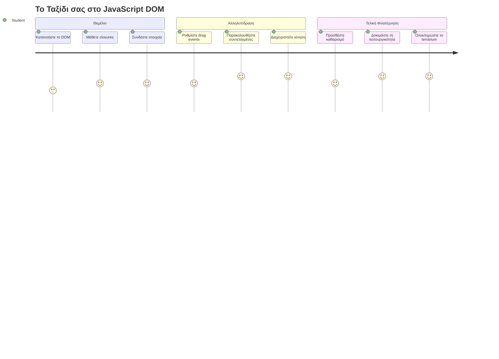
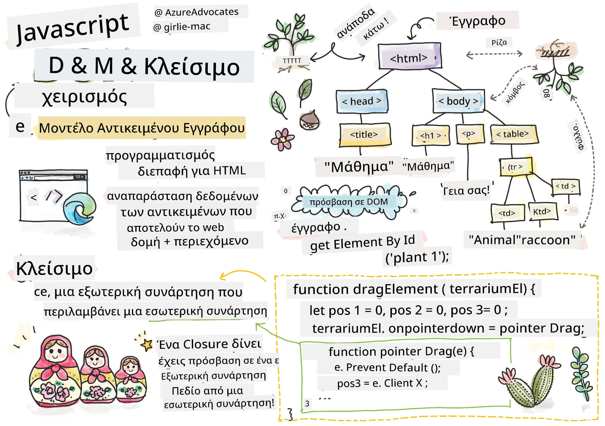
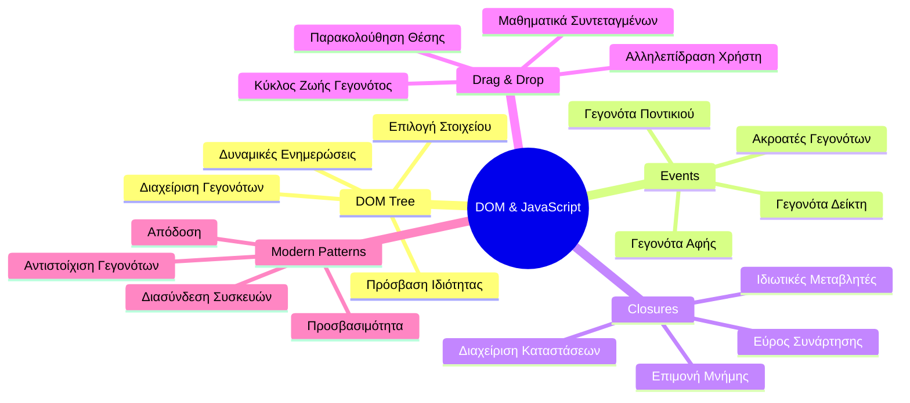
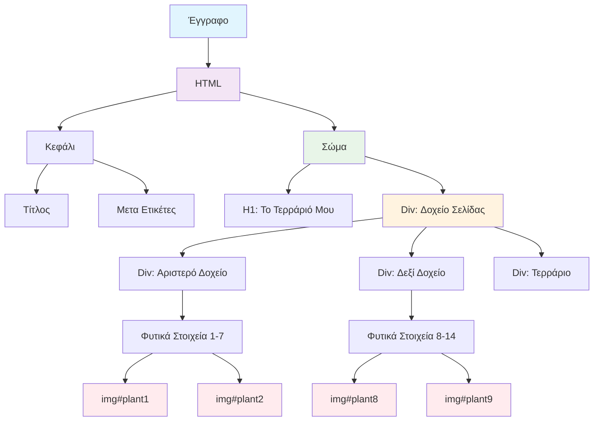
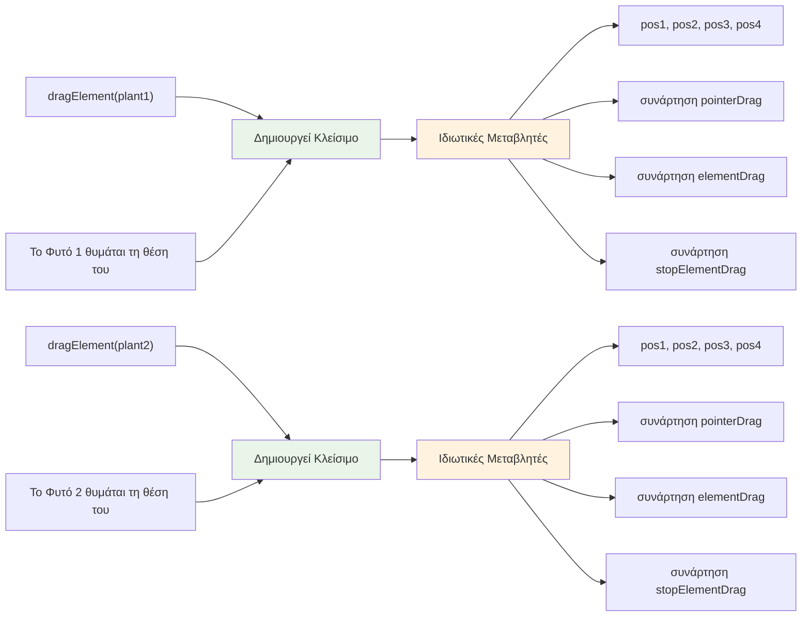
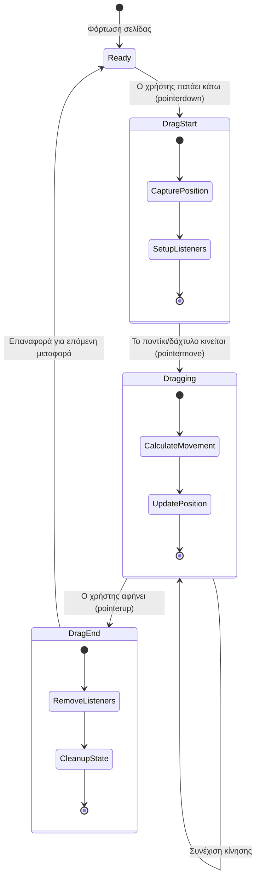
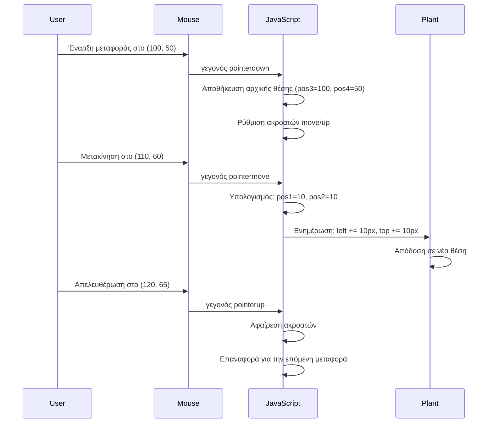
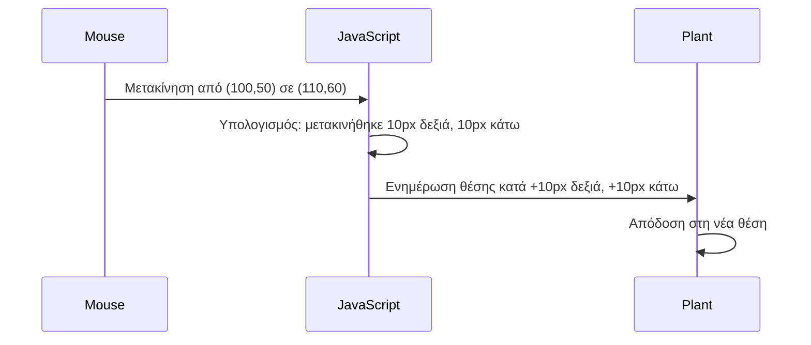
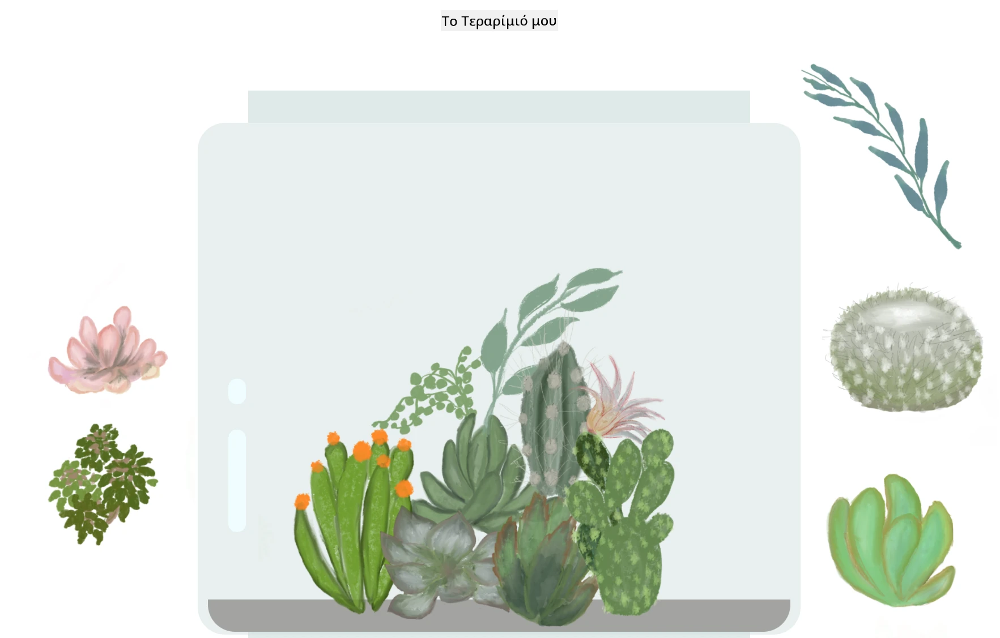
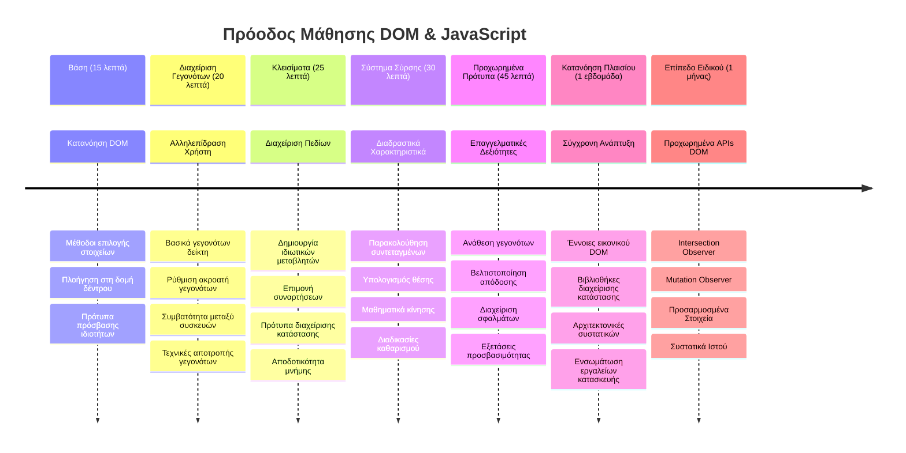

# Έργο Terrarium Μέρος 3: Διαχείριση DOM και Κλεισίματα JavaScript



> Σχεδιάγραμμα από [Tomomi Imura](https://twitter.com/girlie_mac)

Καλώς ήρθατε σε μία από τις πιο συναρπαστικές πτυχές της ανάπτυξης ιστοσελίδων - το να κάνουμε τα πράγματα διαδραστικά! Το Document Object Model (DOM) είναι σαν μια γέφυρα ανάμεσα στο HTML και το JavaScript σας, και σήμερα θα το χρησιμοποιήσουμε για να δώσουμε ζωή στο terrarium σας. Όταν ο Tim Berners-Lee δημιούργησε τον πρώτο περιηγητή διαδικτύου, οραματίστηκε έναν ιστό όπου τα έγγραφα μπορούν να είναι δυναμικά και διαδραστικά - το DOM καθιστά αυτό το όραμα εφικτό.

Θα εξερευνήσουμε επίσης τα closures της JavaScript, που μπορεί αρχικά να ακούγονται εκφοβιστικά. Σκεφτείτε τα closures σαν τη δημιουργία «τσέπες μνήμης» όπου οι συναρτήσεις σας μπορούν να θυμούνται σημαντικές πληροφορίες. Είναι σαν κάθε φυτό στο terrarium σας να έχει το δικό του αρχείο δεδομένων για να παρακολουθεί τη θέση του. Στο τέλος αυτού του μαθήματος, θα καταλάβετε πόσο φυσικά και χρήσιμα είναι.

Να τι χτίζουμε: ένα terrarium όπου οι χρήστες μπορούν να σύρουν και να αποθέτουν φυτά όπου θέλουν. Θα μάθετε τις τεχνικές χειρισμού του DOM που τροφοδοτούν τα πάντα, από μεταφορτώσεις αρχείων με drag-and-drop μέχρι διαδραστικά παιχνίδια. Ας ζωντανέψουμε το terrarium σας.


## Προ-Διάλεξη Κουίζ

[Προ-διάλεξη κουίζ](https://ff-quizzes.netlify.app/web/quiz/19)

## Κατανόηση του DOM: Η Πύλη σας σε Διαδραστικές Ιστοσελίδες

Το Document Object Model (DOM) είναι ο τρόπος με τον οποίο η JavaScript επικοινωνεί με τα στοιχεία HTML σας. Όταν ο περιηγητής σας φορτώνει μια σελίδα HTML, δημιουργεί μια δομημένη αναπαράσταση αυτής της σελίδας στη μνήμη - αυτό είναι το DOM. Σκεφτείτε το σαν ένα οικογενειακό δέντρο όπου κάθε στοιχείο HTML είναι μέλος της οικογένειας που η JavaScript μπορεί να έχει πρόσβαση, να τροποποιήσει ή να αναδιατάξει.

Η διαχείριση του DOM μετατρέπει τις στατικές σελίδες σε διαδραστικές ιστοσελίδες. Κάθε φορά που βλέπετε ένα κουμπί να αλλάζει χρώμα στο hover, περιεχόμενο να ενημερώνεται χωρίς ανανέωση σελίδας ή στοιχεία που μπορείτε να σύρετε, αυτή είναι η διαχείριση DOM σε δράση.




> Αναπαράσταση του DOM και του HTML markup που το αναφέρεται. Από [Olfa Nasraoui](https://www.researchgate.net/publication/221417012_Profile-Based_Focused_Crawler_for_Social_Media-Sharing_Websites)

**Αυτά κάνουν το DOM ισχυρό:**
- **Προσφέρει** έναν δομημένο τρόπο πρόσβασης σε οποιοδήποτε στοιχείο στη σελίδα σας
- **Επιτρέπει** δυναμικές ενημερώσεις περιεχομένου χωρίς ανανεώσεις σελίδας
- **Δίνει** δυνατότητα άμεσης ανταπόκρισης σε αλληλεπιδράσεις χρήστη όπως κλικ και σύρσιμο
- **Δημιουργεί** τη βάση για σύγχρονες διαδραστικές εφαρμογές διαδικτύου

## Κλεισίματα JavaScript: Δημιουργία Οργανωμένου, Ισχυρού Κώδικα

Ένα [JavaScript closure](https://developer.mozilla.org/docs/Web/JavaScript/Closures) είναι σαν να δίνεις σε μια συνάρτηση τον δικό της ιδιωτικό χώρο εργασίας με μόνιμη μνήμη. Σκεφτείτε πώς τα σπουργίτια του Darwin στα νησιά Γκαλαπάγκος ανέπτυξαν εξειδικευμένα ράμφη βάση του περιβάλλοντός τους - τα closures λειτουργούν παρόμοια, δημιουργώντας εξειδικευμένες συναρτήσεις που «θυμούνται» το συγκεκριμένο πλαίσιο τους ακόμα κι αφού η γονική συνάρτηση έχει τελειώσει.

Στο terrarium μας, τα closures βοηθούν κάθε φυτό να θυμάται ανεξάρτητα τη θέση του. Αυτό το μοτίβο εμφανίζεται σε όλη την επαγγελματική ανάπτυξη JavaScript, κάνοντάς το μια πολύτιμη έννοια προς κατανόηση.


> 💡 **Κατανόηση των Closures**: Τα closures είναι ένα σημαντικό θέμα στην JavaScript, και πολλοί προγραμματιστές τα χρησιμοποιούν χρόνια πριν κατανοήσουν πλήρως όλες τις θεωρητικές πτυχές. Σήμερα, εστιάζουμε στην πρακτική εφαρμογή - θα δείτε τα closures να προκύπτουν φυσικά καθώς χτίζουμε τις διαδραστικές λειτουργίες μας. Η κατανόηση θα αναπτυχθεί καθώς βλέπετε πώς λύνουν πραγματικά προβλήματα.


> Αναπαράσταση του DOM και του HTML markup που το αναφέρεται. Από [Olfa Nasraoui](https://www.researchgate.net/publication/221417012_Profile-Based_Focused_Crawler_for_Social_Media-Sharing_Websites)

Σε αυτό το μάθημα, θα ολοκληρώσουμε το διαδραστικό έργο του terrarium δημιουργώντας την JavaScript που θα επιτρέψει στον χρήστη να χειριστεί τα φυτά στη σελίδα.

## Πριν Ξεκινήσουμε: Προετοιμασία για Επιτυχία

Θα χρειαστείτε τα αρχεία HTML και CSS από τα προηγούμενα μαθήματα terrarium - πρόκειται να κάνουμε αυτόν τον στατικό σχεδιασμό διαδραστικό. Αν συμμετέχετε για πρώτη φορά, η ολοκλήρωση αυτών των μαθημάτων πρώτα θα σας δώσει σημαντικό πλαίσιο.

Να τι θα κατασκευάσουμε:
- **Ομαλό σύρσιμο και απόθεση** για όλα τα φυτά στο terrarium
- **Παρακολούθηση συντεταγμένων** ώστε τα φυτά να θυμούνται τις θέσεις τους
- **Πλήρες διαδραστικό περιβάλλον** χρησιμοποιώντας καθαρή JavaScript
- **Καθαρό, οργανωμένο κώδικα** με μοτίβα closure

## Δημιουργία του Αρχείου JavaScript

Ας δημιουργήσουμε το αρχείο JavaScript που θα κάνει το terrarium σας διαδραστικό.

**Βήμα 1: Δημιουργήστε το αρχείο script**

Στο φάκελο terrarium, δημιουργήστε ένα νέο αρχείο που ονομάζεται `script.js`.

**Βήμα 2: Συνδέστε τη JavaScript με το HTML σας**

Προσθέστε το tag script στην ενότητα `<head>` του αρχείου `index.html` σας:

```html
<script src="./script.js" defer></script>
```

**Γιατί το χαρακτηριστικό `defer` είναι σημαντικό:**
- **Εξασφαλίζει** ότι η JavaScript περιμένει μέχρι να φορτωθεί όλο το HTML
- **Αποτρέπει** σφάλματα όπου η JavaScript ψάχνει στοιχεία που δεν είναι ακόμα έτοιμα
- **Εγγυάται** ότι όλα τα στοιχεία φυτών είναι διαθέσιμα για αλληλεπίδραση
- **Παρέχει** καλύτερη απόδοση από το να βάλεις τα scripts στο τέλος της σελίδας

> ⚠️ **Σημαντική Σημείωση**: Το χαρακτηριστικό `defer` αποτρέπει κοινά προβλήματα χρονισμού. Χωρίς αυτό, η JavaScript μπορεί να προσπαθήσει να αποκτήσει πρόσβαση σε στοιχεία HTML πριν φορτωθούν, προκαλώντας σφάλματα.

---

## Σύνδεση JavaScript με Τα Στοιχεία HTML σας

Πριν κάνουμε τα στοιχεία σύρσιμα, η JavaScript πρέπει να τα βρει στο DOM. Σκεφτείτε το σαν ένα σύστημα βιβλιοθήκης - μόλις έχετε τον αριθμό καταλόγου, μπορείτε να βρείτε ακριβώς το βιβλίο που χρειάζεστε και να έχετε πρόσβαση σε όλο το περιεχόμενό του.

Θα χρησιμοποιήσουμε τη μέθοδο `document.getElementById()` για να κάνουμε αυτές τις συνδέσεις. Είναι σαν ένα ακριβές σύστημα αρχειοθέτησης - δίνετε ένα ID και βρίσκει ακριβώς το στοιχείο που χρειάζεστε στο HTML σας.

### Ενεργοποίηση λειτουργίας Σύρσιμου για Όλα τα Φυτά

Προσθέστε αυτόν τον κώδικα στο αρχείο `script.js` σας:

```javascript
// Ενεργοποιήστε τη λειτουργία μεταφοράς για όλα τα 14 φυτά
dragElement(document.getElementById('plant1'));
dragElement(document.getElementById('plant2'));
dragElement(document.getElementById('plant3'));
dragElement(document.getElementById('plant4'));
dragElement(document.getElementById('plant5'));
dragElement(document.getElementById('plant6'));
dragElement(document.getElementById('plant7'));
dragElement(document.getElementById('plant8'));
dragElement(document.getElementById('plant9'));
dragElement(document.getElementById('plant10'));
dragElement(document.getElementById('plant11'));
dragElement(document.getElementById('plant12'));
dragElement(document.getElementById('plant13'));
dragElement(document.getElementById('plant14'));
```

**Αυτά επιτυγχάνει αυτός ο κώδικας:**
- **Εντοπίζει** κάθε στοιχείο φυτού στο DOM χρησιμοποιώντας το μοναδικό του ID
- **Λαμβάνει** μια αναφορά JavaScript σε κάθε στοιχείο HTML
- **Περνά** κάθε στοιχείο σε μια συνάρτηση `dragElement` (που θα δημιουργήσουμε στη συνέχεια)
- **Προετοιμάζει** κάθε φυτό για αλληλεπίδραση drag-and-drop
- **Συνδέει** τη δομή HTML σας με λειτουργικότητα JavaScript

> 🎯 **Γιατί να χρησιμοποιούμε IDs αντί για Κλάσεις;** Τα IDs παρέχουν μοναδικούς αναγνωριστές για συγκεκριμένα στοιχεία, ενώ οι κλάσεις CSS σχεδιάζονται για τη μορφοποίηση ομάδων στοιχείων. Όταν η JavaScript χρειάζεται να χειριστεί μεμονωμένα στοιχεία, τα IDs δίνουν την ακρίβεια και απόδοση που χρειαζόμαστε.

> 💡 **Συμβουλή**: Σημειώστε πώς καλούμε `dragElement()` για κάθε φυτό ξεχωριστά. Αυτή η προσέγγιση εξασφαλίζει ότι κάθε φυτό έχει τη δική του ανεξάρτητη συμπεριφορά σύρσιμου, που είναι απαραίτητη για ομαλή αλληλεπίδραση χρήστη.

### 🔄 **Παιδαγωγικός Έλεγχος**
**Κατανόηση Σύνδεσης DOM**: Πριν προχωρήσετε στη λειτουργία drag, βεβαιωθείτε ότι μπορείτε:
- ✅ Να εξηγήσετε πώς το `document.getElementById()` εντοπίζει στοιχεία HTML
- ✅ Να καταλάβετε γιατί χρησιμοποιούμε μοναδικά IDs για κάθε φυτό
- ✅ Να περιγράψετε τη σημασία του χαρακτηριστικού `defer` στα script tags
- ✅ Να αναγνωρίσετε πώς η JavaScript και το HTML συνδέονται μέσω του DOM

**Γρήγορο Αυτοτεστ**: Τι θα συμβεί αν δύο στοιχεία έχουν το ίδιο ID; Γιατί το `getElementById()` επιστρέφει μόνο ένα στοιχείο;
*Απάντηση: Τα IDs πρέπει να είναι μοναδικά. Αν υπάρχουν διπλότυπα, επιστρέφεται μόνο το πρώτο στοιχείο.*

---

## Δημιουργώντας το Closure dragElement

Τώρα θα δημιουργήσουμε την καρδιά της λειτουργικότητας σύρσιμου: ένα closure που διαχειρίζεται τη συμπεριφορά σύρσιμου για κάθε φυτό. Αυτό το closure θα περιέχει πολλαπλές εσωτερικές συναρτήσεις που συνεργάζονται για να παρακολουθούν τις κινήσεις του ποντικιού και να ενημερώνουν τις θέσεις των στοιχείων.

Τα closures είναι ιδανικά για αυτή την εργασία γιατί μας επιτρέπουν να δημιουργούμε «ιδιωτικές» μεταβλητές που παραμένουν μεταξύ κλήσεων συναρτήσεων, δίνοντας σε κάθε φυτό το δικό του ανεξάρτητο σύστημα παρακολούθησης συντεταγμένων.

### Κατανόηση των Closures με Απλό Παράδειγμα

Αφήστε με να δείξω τα closures με ένα απλό παράδειγμα που απεικονίζει την έννοια:

```javascript
function createCounter() {
    let count = 0; // Αυτό είναι σαν μια ιδιωτική μεταβλητή
    
    function increment() {
        count++; // Η εσωτερική συνάρτηση θυμάται τη μεταβλητή της εξωτερικής
        return count;
    }
    
    return increment; // Επιστρέφουμε την εσωτερική συνάρτηση
}

const myCounter = createCounter();
console.log(myCounter()); // 1
console.log(myCounter()); // 2
```

**Αυτό συμβαίνει σε αυτό το μοτίβο closure:**
- **Δημιουργεί** μια ιδιωτική μεταβλητή `count` που υπάρχει μόνο μέσα σε αυτό το closure
- **Η εσωτερική συνάρτηση** μπορεί να έχει πρόσβαση και να τροποποιεί αυτήν την εξωτερική μεταβλητή (μηχανισμός closure)
- **Όταν επιστρέφουμε** την εσωτερική συνάρτηση, διατηρεί τη σύνδεσή της με τα ιδιωτικά δεδομένα
- **Ακόμα και μετά** το πέρας της εκτέλεσης της `createCounter()`, η `count` παραμένει και θυμάται την τιμή της

### Γιατί τα Closures Είναι Ιδανικά για τη Λειτουργία Drag

Για το terrarium μας, κάθε φυτό πρέπει να θυμάται τις τρέχουσες συντεταγμένες θέσης του. Τα closures παρέχουν την τέλεια λύση:

**Βασικά πλεονεκτήματα για το έργο μας:**
- **Διατηρούν** ιδιωτικές μεταβλητές θέσης για κάθε φυτό ανεξάρτητα
- **Διαφυλάσσουν** τα δεδομένα των συντεταγμένων ανάμεσα στα γεγονότα drag
- **Αποτρέπουν** συγκρούσεις μεταβλητών μεταξύ διαφορετικών στοιχείων που σύρονται
- **Δημιουργούν** καθαρή, οργανωμένη δομή κώδικα

> 🎯 **Στόχος Μάθησης**: Δεν χρειάζεται να κυριαρχήσετε σε κάθε πτυχή των closures τώρα. Επικεντρωθείτε στο πώς βοηθούν να οργανώσουμε τον κώδικα και να διατηρήσουμε την κατάσταση για τη λειτουργία σύρσιμου.


### Δημιουργία της Συνάρτησης dragElement

Τώρα ας χτίσουμε την κύρια συνάρτηση που θα χειριστεί όλη τη λογική σύρσιμου. Προσθέστε αυτή τη συνάρτηση κάτω από τις δηλώσεις των στοιχείων φυτών:

```javascript
function dragElement(terrariumElement) {
    // Αρχικοποίηση μεταβλητών παρακολούθησης θέσης
    let pos1 = 0,  // Προηγούμενη θέση ποντικιού στον άξονα X
        pos2 = 0,  // Προηγούμενη θέση ποντικιού στον άξονα Y
        pos3 = 0,  // Τρέχουσα θέση ποντικιού στον άξονα X
        pos4 = 0;  // Τρέχουσα θέση ποντικιού στον άξονα Y
    
    // Ρύθμιση του αρχικού ακροατή συμβάντος μεταφοράς
    terrariumElement.onpointerdown = pointerDrag;
}
```

**Κατανόηση του συστήματος παρακολούθησης θέσεων:**
- **`pos1` και `pos2`**: Αποθηκεύουν τη διαφορά ανάμεσα στις παλιές και νέες θέσεις του ποντικιού
- **`pos3` και `pos4`**: Παρακολουθούν τις τρέχουσες συντεταγμένες του ποντικιού
- **`terrariumElement`**: Το συγκεκριμένο στοιχείο φυτού που κάνουμε σύρσιμο
- **`onpointerdown`**: Το γεγονός που ενεργοποιείται όταν ο χρήστης ξεκινά το σύρσιμο

**Πώς λειτουργεί το μοτίβο closure:**
- **Δημιουργεί** ιδιωτικές μεταβλητές θέσης για κάθε φυτό
- **Διατηρεί** αυτές τις μεταβλητές καθ' όλη τη διάρκεια του σύρσιμου
- **Εξασφαλίζει** ότι κάθε φυτό παρακολουθεί ανεξάρτητα τις συντεταγμένες του
- **Παρέχει** καθαρή διεπαφή μέσω της συνάρτησης `dragElement`

### Γιατί να Χρησιμοποιούμε Τα Γεγονότα Pointer;

Μπορεί να αναρωτιέστε γιατί χρησιμοποιούμε `onpointerdown` αντί του πιο γνωστού `onclick`. Να η εξήγηση:

| Τύπος Γεγονότος | Καλύτερα Για | Το Πρόβλημα |
|-----------------|--------------|--------------|
| `onclick` | Απλά κλικ σε κουμπιά | Δεν μπορεί να χειριστεί σύρσιμο (μόνο κλικ και απόθεση) |
| `onpointerdown` | Ποντίκι και οθόνες αφής | Νεότερο, αλλά καλά υποστηριζόμενο πια |
| `onmousedown` | Μόνο ποντίκι σε επιτραπέζιους | Αποκλείει κινητές συσκευές |

**Γιατί τα pointer γεγονότα είναι τέλεια για το έργο μας:**
- **Λειτουργούν τέλεια** είτε με ποντίκι, δάχτυλο ή στιλό
- **Αισθάνεστε το ίδιο** σε λάπτοπ, ταμπλέτα ή κινητό
- **Χειρίζονται** την πραγματική κίνηση σύρσιμου (όχι μόνο κλικ)
- **Δημιουργούν** μια ομαλή εμπειρία που οι χρήστες περιμένουν από μοντέρνες εφαρμογές

> 💡 **Εξασφάλιση Μακροζωίας**: Τα pointer γεγονότα είναι ο σύγχρονος τρόπος χειρισμού αλληλεπιδράσεων χρήστη. Αντί να γράφετε ξεχωριστό κώδικα για ποντίκι και αφή, έχετε και τα δύο μαζί δωρεάν. Πολύ έξυπνο, έτσι δεν είναι;

### 🔄 **Παιδαγωγικός Έλεγχος**
**Κατανόηση Διαχείρισης Γεγονότων**: Κάντε μια παύση για να επιβεβαιώσετε την κατανόηση σας:
- ✅ Γιατί χρησιμοποιούμε pointer γεγονότα αντί για mouse γεγονότα;
- ✅ Πώς οι μεταβλητές closure επιμένουν μεταξύ κλήσεων συναρτήσεων;
- ✅ Τι ρόλο παίζει το `preventDefault()` στην ομαλή λειτουργία σύρσιμου;
- ✅ Γιατί επισυνάπτουμε ακροατές γεγονότων στο έγγραφο αντί για μεμονωμένα στοιχεία;

**Σύνδεση με Πραγματικό Κόσμο**: Σκεφτείτε τις drag-and-drop διεπαφές που χρησιμοποιείτε καθημερινά:
- **Μεταφορτώσεις αρχείων**: Σύρετε αρχεία μέσα σε παράθυρο περιηγητή
- **Kanban boards**: Μεταφορά εργασιών μεταξύ στηλών
- **Συλλογές εικόνων**: Αναδιάταξη σειράς φωτογραφιών
- **Κινητές διεπαφές**: Σάρωση και σύρσιμο σε οθόνες αφής

---

## Η Συνάρτηση pointerDrag: Καταγραφή της Έναρξης Σύρσιμου

Όταν ο χρήστης πατάει πάνω σε ένα φυτό (με κλικ ποντικιού ή άγγιγμα), η συνάρτηση `pointerDrag` ενεργοποιείται αμέσως. Αυτή η συνάρτηση καταγράφει τις αρχικές συντεταγμένες και προετοιμάζει το σύστημα σύρσιμου.

Προσθέστε αυτή τη συνάρτηση μέσα στο closure `dragElement`, ακριβώς μετά τη γραμμή `terrariumElement.onpointerdown = pointerDrag;`:

```javascript
function pointerDrag(e) {
    // Αποτροπή της προεπιλεγμένης συμπεριφοράς του προγράμματος περιήγησης (όπως η επιλογή κειμένου)
    e.preventDefault();
    
    // Καταγραφή της αρχικής θέσης του ποντικιού/αφής
    pos3 = e.clientX;  // Συντεταγμένη X όπου ξεκίνησε η μετακίνηση
    pos4 = e.clientY;  // Συντεταγμένη Y όπου ξεκίνησε η μετακίνηση
    
    // Ρύθμιση ακροατών γεγονότων για τη διαδικασία μετακίνησης
    document.onpointermove = elementDrag;
    document.onpointerup = stopElementDrag;
}
```

**Βήμα βήμα, here's τι συμβαίνει:**
- **Αποτρέπει** τις προεπιλεγμένες συμπεριφορές του περιηγητή που θα μπορούσαν να επηρεάσουν το σύρσιμο
- **Καταγράφει** τις ακριβείς συντεταγμένες όπου ο χρήστης ξεκίνησε τη χειρονομία σύρσιμου
- **Εγκαθιστά** ακροατές γεγονότων για τη συνεχιζόμενη κίνηση σύρσιμου
- **Προετοιμάζει** το σύστημα να παρακολουθεί την κίνηση ποντικιού/δάχτυλου σε όλο το έγγραφο

### Κατανόηση της Αποτροπής Γεγονότων

Η γραμμή `e.preventDefault()` είναι κρίσιμη για ομαλό σύρσιμο:

**Χωρίς αυτό, οι περιηγητές μπορεί να:**
- **Επιλέξουν** κείμενο κατά το σύρσιμο στη σελίδα
- **Ενεργοποιήσουν** μενού περιβάλλοντος σε δεξί κλικ σύρσιμο
- **Παρεμποδίσουν** τη δική μας προσαρμοσμένη συμπεριφορά σύρσιμου
- **Δημιουργήσουν** οπτικά σφάλματα κατά τη λειτουργία σύρσιμου

> 🔍 **Πείραμα**: Μετά την ολοκλήρωση αυτού του μαθήματος, δοκιμάστε να αφαιρέσετε το `e.preventDefault()` και δείτε πώς επηρεάζει την εμπειρία σύρσιμου. Θα καταλάβετε γρήγορα γιατί αυτή η γραμμή είναι απαραίτητη!

### Σύστημα Παρακολούθησης Συντεταγμένων

Οι ιδιότητες `e.clientX` και `e.clientY` μας δίνουν ακριβείς συντεταγμένες ποντικιού/αγγίγματος:

| Ιδιότητα  | Τι Μετράει | Περίπτωση Χρήσης |
|-----------|------------|------------------|
| `clientX` | Οριζόντια θέση σε σχέση με το παράθυρο | Παρακολούθηση κίνησης αριστερά-δεξιά |
| `clientY` | Κάθετη θέση σε σχέση με το παράθυρο | Παρακολούθηση κίνησης πάνω-κάτω |
**Κατανόηση αυτών των συντεταγμένων:**
- **Παρέχει** πληροφορίες ακριβούς τοποθέτησης σε pixels
- **Ενημερώνεται** σε πραγματικό χρόνο καθώς ο χρήστης μετακινεί τον δείκτη του
- **Παραμένει** συνεπές σε διαφορετικά μεγέθη οθόνης και επίπεδα ζουμ
- **Επιτρέπει** ομαλές, ευαίσθητες αλληλεπιδράσεις μεταφοράς (drag)

### Ρύθμιση Ακροατών Συμβάντων Επιπέδου Εγγράφου

Παρατηρήστε πώς συσχετίζουμε τα συμβάντα κίνησης και διακοπής στο ολόκληρο έγγραφο (`document`), όχι μόνο στο στοιχείο του φυτού:

```javascript
document.onpointermove = elementDrag;
document.onpointerup = stopElementDrag;
```

**Γιατί συσχετίζουμε στο έγγραφο:**
- **Συνεχίζει** την παρακολούθηση ακόμα και όταν το ποντίκι εγκαταλείπει το στοιχείο του φυτού
- **Αποτρέπει** τη διακοπή της μεταφοράς αν ο χρήστης κινήσει γρήγορα
- **Παρέχει** ομαλή μεταφορά σε ολόκληρη την οθόνη
- **Επεξεργάζεται** περίπτωση όπου ο δείκτης βγαίνει έξω από το παράθυρο του browser

> ⚡ **Σημείωση Απόδοσης**: Θα καθαρίσουμε αυτούς τους ακροατές σε επίπεδο εγγράφου όταν σταματήσει η μεταφορά, για να αποφύγουμε διαρροές μνήμης και προβλήματα απόδοσης.

## Ολοκλήρωση του Συστήματος Μεταφοράς: Κίνηση και Καθαρισμός

Τώρα θα προσθέσουμε τις δύο εναπομείνασες συναρτήσεις που χειρίζονται την πραγματική κίνηση κατά τη μεταφορά και τον καθαρισμό όταν η μεταφορά σταματάει. Αυτές οι συναρτήσεις δουλεύουν μαζί για να δημιουργήσουν ομαλή, ευαίσθητη μετακίνηση του φυτού μέσα στο τεράριουμ σας.

### Η Συνάρτηση elementDrag: Παρακολούθηση Κίνησης

Προσθέστε τη συνάρτηση `elementDrag` αμέσως μετά το κλείσιμο αγκύλης της `pointerDrag`:

```javascript
function elementDrag(e) {
    // Υπολογίστε την απόσταση που διανύθηκε από το τελευταίο συμβάν
    pos1 = pos3 - e.clientX;  // Οριζόντια απόσταση που διανύθηκε
    pos2 = pos4 - e.clientY;  // Κάθετη απόσταση που διανύθηκε
    
    // Ενημερώστε την τρέχουσα παρακολούθηση θέσης
    pos3 = e.clientX;  // Νέα τρέχουσα θέση X
    pos4 = e.clientY;  // Νέα τρέχουσα θέση Y
    
    // Εφαρμόστε την κίνηση στη θέση του στοιχείου
    terrariumElement.style.top = (terrariumElement.offsetTop - pos2) + 'px';
    terrariumElement.style.left = (terrariumElement.offsetLeft - pos1) + 'px';
}
```

**Κατανόηση των μαθηματικών των συντεταγμένων:**
- **`pos1` και `pos2`**: Υπολογίζουν πόσο έχει μετακινηθεί το ποντίκι από την τελευταία ενημέρωση
- **`pos3` και `pos4`**: Αποθηκεύουν τη τρέχουσα θέση του ποντικιού για τον επόμενο υπολογισμό
- **`offsetTop` και `offsetLeft`**: Παίρνουν την τρέχουσα θέση του στοιχείου στη σελίδα
- **Λογική αφαίρεσης**: Μετακινεί το στοιχείο κατά το ίδιο ποσό που μετακινήθηκε το ποντίκι


**Ανάλυση του υπολογισμού κίνησης:**
1. **Μετρά** τη διαφορά ανάμεσα στην παλιά και τη νέα θέση του ποντικιού
2. **Υπολογίζει** πόσο να μετακινηθεί το στοιχείο βάσει της κίνησης του ποντικιού
3. **Ενημερώνει** σε πραγματικό χρόνο τις ιδιότητες CSS θέσης του στοιχείου
4. **Αποθηκεύει** τη νέα θέση ως βάση για τον επόμενο υπολογισμό κίνησης

### Οπτική Αναπαράσταση των Μαθηματικών


### Η Συνάρτηση stopElementDrag: Καθαρισμός

Προσθέστε τη συνάρτηση καθαρισμού μετά το κλείσιμο αγκύλης της `elementDrag`:

```javascript
function stopElementDrag() {
    // Αφαιρέστε τους ακροατές γεγονότων σε επίπεδο εγγράφου
    document.onpointerup = null;
    document.onpointermove = null;
}
```

**Γιατί ο καθαρισμός είναι ουσιώδης:**
- **Αποτρέπει** διαρροές μνήμης από ακροατές συμβάντων που παραμένουν
- **Σταματά** τη συμπεριφορά μεταφοράς όταν ο χρήστης αφήνει το φυτό
- **Επιτρέπει** σε άλλα στοιχεία να μεταφέρονται ανεξάρτητα
- **Επαναφέρει** το σύστημα για την επόμενη λειτουργία μεταφοράς

**Τι συμβαίνει χωρίς καθαρισμό:**
- Οι ακροατές συμβάντων συνεχίζουν να τρέχουν ακόμα και μετά τη διακοπή της μεταφοράς
- Η απόδοση υποβαθμίζεται καθώς συσσωρεύονται αχρησιμοποίητοι ακροατές
- Απρόβλεπτη συμπεριφορά κατά την αλληλεπίδραση με άλλα στοιχεία
- Σπατάλη πόρων του browser σε περιττή διαχείριση συμβάντων

### Κατανόηση των Ιδιοτήτων Θέσης CSS

Το σύστημα μεταφοράς μας χειρίζεται δύο βασικές ιδιότητες CSS:

| Ιδιότητα | Τι Ελέγχει | Πώς τη Χρησιμοποιούμε |
|----------|------------|-----------------------|
| `top` | Απόσταση από το πάνω άκρο | Κατακόρυφη τοποθέτηση κατά τη μεταφορά |
| `left` | Απόσταση από το αριστερό άκρο | Οριζόντια τοποθέτηση κατά τη μεταφορά |

**Βασικές γνώσεις για τις ιδιότητες offset:**
- **`offsetTop`**: Τρέχουσα απόσταση από το πάνω μέρος του τοποθετημένου γονικού στοιχείου
- **`offsetLeft`**: Τρέχουσα απόσταση από το αριστερό μέρος του τοποθετημένου γονικού στοιχείου
- **Πλαίσιο τοποθέτησης**: Αυτές οι τιμές είναι σχετικές με τον πιο κοντινό τοποθετημένο πρόγονο
- **Ενημερώσεις σε πραγματικό χρόνο**: Αλλάζει αμέσως όταν τροποποιούμε τις ιδιότητες CSS

> 🎯 **Φιλοσοφία Σχεδιασμού**: Αυτό το σύστημα μεταφοράς είναι σκόπιμα ευέλικτο – δεν υπάρχουν "ζώνες απόθεσης" ή περιορισμοί. Οι χρήστες μπορούν να τοποθετούν τα φυτά οπουδήποτε, δίνοντάς τους πλήρη δημιουργικό έλεγχο στον σχεδιασμό του τεράριουμ τους.

## Όλα Μαζί: Το Πλήρες Σύστημα Μεταφοράς σου

Συγχαρητήρια! Μόλις δημιούργησες ένα εξελιγμένο σύστημα μεταφοράς με drag-and-drop χρησιμοποιώντας καθαρή JavaScript. Η πλήρης λειτουργία `dragElement` σου τώρα περιέχει ένα ισχυρό closure που διαχειρίζεται:

**Τι επιτυγχάνει το closure σου:**
- **Διατηρεί** ιδιωτικές μεταβλητές θέσης για κάθε φυτό ανεξάρτητα
- **Χειρίζεται** ολόκληρο τον κύκλο ζωής της μεταφοράς από την αρχή μέχρι το τέλος
- **Παρέχει** ομαλή, ευαίσθητη κίνηση σε ολόκληρη την οθόνη
- **Καθαρίζει** πόρους σωστά για αποφυγή διαρροών μνήμης
- **Δημιουργεί** μια διαισθητική, δημιουργική διεπαφή για το σχεδιασμό του τεράριουμ

### Δοκιμάζοντας το Διαδραστικό σου Τεράριουμ

Τώρα δοκίμασε το διαδραστικό τεράριουμ σου! Άνοιξε το αρχείο `index.html` σε έναν web browser και δοκίμασε τη λειτουργικότητα:

1. **Κάνε κλικ και κράτα** οποιοδήποτε φυτό για να ξεκινήσεις τη μεταφορά
2. **Μετακίνησε** το ποντίκι ή το δάχτυλο σου και δες το φυτό να ακολουθεί ομαλά
3. **Άφησε** για να τοποθετήσεις το φυτό στη νέα του θέση
4. **Πειραματίσου** με διάταξεις για να εξερευνήσεις τη διεπαφή

🥇 **Επίτευγμα**: Δημιούργησες μια πλήρως διαδραστική web εφαρμογή χρησιμοποιώντας βασικές έννοιες που οι επαγγελματίες προγραμματιστές χρησιμοποιούν καθημερινά. Αυτή η λειτουργία μεταφοράς χρησιμοποιεί τις ίδιες αρχές που βασίζονται τα συστήματα μεταφόρτωσης αρχείων, kanban boards και πολλά άλλα διαδραστικά interfaces.

### 🔄 **Παιδαγωγικός Έλεγχος**
**Πλήρης Κατανόηση Συστήματος**: Επαλήθευσε την κατανόησή σου για το συνολικό σύστημα μεταφοράς:
- ✅ Πώς τα closures διατηρούν ανεξάρτητη κατάσταση για κάθε φυτό;
- ✅ Γιατί τα μαθηματικά υπολογισμού συντεταγμένων είναι απαραίτητα για ομαλή κίνηση;
- ✅ Τι θα συμβεί αν ξεχάσουμε να καθαρίσουμε τους ακροατές συμβάντων;
- ✅ Πώς κλιμακώνεται αυτό το μοτίβο σε πιο περίπλοκες αλληλεπιδράσεις;

**Αναστοχασμός Ποιότητας Κώδικα**: Ανασκόπησε την ολοκληρωμένη λύση σου:
- **Μοντέρνος σχεδιασμός**: Κάθε φυτό έχει το δικό του παράδειγμα closure
- **Αποδοτικότητα συμβάντων**: Σωστή ρύθμιση και καθαρισμός ακροατών
- **Διαλειτουργικότητα**: Λειτουργεί σε desktop και κινητά
- **Επίγνωση Απόδοσης**: Χωρίς διαρροές μνήμης ή περιττούς υπολογισμούς



---

## Πρόκληση GitHub Copilot Agent 🚀

Χρησιμοποίησε τη λειτουργία Agent για να ολοκληρώσεις την παρακάτω πρόκληση:

**Περιγραφή:** Βελτίωσε το project του τεράριουμ προσθέτοντας λειτουργία επαναφοράς που επαναφέρει όλα τα φυτά στις αρχικές τους θέσεις με ομαλές κινούμενες μεταβάσεις.

**Προτροπή:** Δημιούργησε ένα κουμπί επαναφοράς που, όταν πατιέται, κινεί όλα τα φυτά ομαλά πίσω στις αρχικές θέσεις τους στη πλαϊνή μπάρα χρησιμοποιώντας μεταβάσεις CSS. Η λειτουργία θα πρέπει να αποθηκεύει τις αρχικές θέσεις όταν η σελίδα φορτώνει και να μεταφέρει τα φυτά ομαλά σε αυτές τις θέσεις μέσα σε 1 δευτερόλεπτο όταν πατηθεί το κουμπί επαναφοράς.

Μάθε περισσότερα για τη [λειτουργία agent](https://code.visualstudio.com/blogs/2025/02/24/introducing-copilot-agent-mode) εδώ.

## 🚀 Επιπλέον Πρόκληση: Επέκτεινε τις Δεξιότητές σου

Έτοιμος να ανεβάσεις το τεράριουμ σου στο επόμενο επίπεδο; Δοκίμασε να υλοποιήσεις αυτές τις βελτιώσεις:

**Δημιουργικές Επεκτάσεις:**
- **Διπλό κλικ** σε φυτό για να το φέρεις μπροστά (διαχείριση z-index)
- **Πρόσθεσε οπτικό feedback** όπως διακριτική λάμψη όταν περνάς πάνω από τα φυτά
- **Υλοποίησε όρια** για να εμποδίζεις τα φυτά να μεταφέρονται έξω από το τεράριουμ
- **Δημιούργησε λειτουργία αποθήκευσης** που θυμάται τις θέσεις των φυτών μέσω του localStorage
- **Πρόσθεσε ηχητικά εφέ** για την ανάκτηση και τοποθέτηση των φυτών

> 💡 **Ευκαιρία Μάθησης**: Κάθε μια από αυτές τις προκλήσεις θα σου διδάξει νέα στοιχεία διαχείρισης DOM, χειρισμού συμβάντων και σχεδιασμού εμπειρίας χρήστη.

## Κουίζ Μετά από το Μάθημα

[Κουίζ μετά το μάθημα](https://ff-quizzes.netlify.app/web/quiz/20)

## Ανασκόπηση & Αυτοεκπαίδευση: Βαθύτερη Κατανόηση

Έχεις κυριαρχήσει στα βασικά της διαχείρισης DOM και στα closures, αλλά πάντα υπάρχει κάτι νέο να μάθεις! Ακολουθούν μερικές διαδρομές για να επεκτείνεις τις γνώσεις και τις δεξιότητές σου.

### Εναλλακτικές Προσεγγίσεις Drag and Drop

Χρησιμοποιήσαμε pointer events για μέγιστη ευελιξία, αλλά η ανάπτυξη web προσφέρει πολλές προσεγγίσεις:

| Προσέγγιση | Ιδανικό για | Εκπαιδευτική Αξία |
|------------|-------------|-------------------|
| [HTML Drag and Drop API](https://developer.mozilla.org/docs/Web/API/HTML_Drag_and_Drop_API) | Μεταφορές αρχείων, επίσημες ζώνες μεταφοράς | Κατανόηση εγγενών δυνατοτήτων browser |
| [Touch Events](https://developer.mozilla.org/docs/Web/API/Touch_events) | Διαδραστικές λειτουργίες για κινητά | Ανάπτυξη με mobile-first προσανατολισμό |
| CSS ιδιότητες `transform` | Ομαλές κινήσεις και animations | Τεχνικές βελτιστοποίησης απόδοσης |

### Προχωρημένα Θέματα DOM Manipulation

**Επόμενα βήματα στην εκμάθησή σου:**
- **Εξουσιοδότηση συμβάντων (event delegation)**: Αποτελεσματική διαχείριση πολλαπλών στοιχείων
- **Intersection Observer**: Εντοπισμός εισόδου/εξόδου στοιχείων από το ορατό πεδίο
- **Mutation Observer**: Παρακολούθηση αλλαγών στη δομή DOM
- **Web Components**: Δημιουργία επαναχρησιμοποιήσιμων, ενοποιημένων UI στοιχείων
- **Έννοιες Virtual DOM**: Κατανόηση πώς οι frameworks βελτιστοποιούν τις ενημερώσεις DOM

### Απαραίτητοι Πόροι για Συνεχή Μάθηση

**Τεχνική Τεκμηρίωση:**
- [Οδηγός MDN για τα Pointer Events](https://developer.mozilla.org/docs/Web/API/Pointer_events) - Αναλυτική αναφορά pointer events
- [Προδιαγραφές W3C Pointer Events](https://www.w3.org/TR/pointerevents1/) - Επίσημα πρότυπα
- [Εμβάθυνση σε JavaScript Closures](https://developer.mozilla.org/docs/Web/JavaScript/Closures) - Προχωρημένα μοτίβα closure

**Συμβατότητα Browser:**
- [CanIUse.com](https://caniuse.com/) - Έλεγχος υποστήριξης λειτουργιών σε browsers
- [MDN Browser Compatibility Data](https://github.com/mdn/browser-compat-data) - Λεπτομερής πληροφορία συμβατότητας

**Ευκαιρίες Πρακτικής:**
- **Δημιουργία** ενός παζλ με αντίστοιχες λειτουργίες μεταφοράς
- **Κατασκευή** πίνακα kanban με drag-and-drop διαχείριση εργασιών
- **Σχεδίαση** γκαλερί εικόνων με δυνατότητα μεταφοράς φωτογραφιών
- **Πειραματισμός** με χειρονομίες αφής για κινητές συσκευές

> 🎯 **Στρατηγική Εκμάθησης**: Ο καλύτερος τρόπος να εδραιώσεις τις έννοιες είναι με την πρακτική. Προσπάθησε να δημιουργήσεις παραλλαγές συστημάτων μεταφοράς – κάθε έργο θα σε μάθει κάτι νέο για τη διαχείριση αλληλεπίδρασης χρήστη και DOM.

### ⚡ **Τι Μπορείς να Κάνεις στα Επόμενα 5 Λεπτά**
- [ ] Άνοιξε τα εργαλεία ανάπτυξης (DevTools) του browser και γράψε `document.querySelector('body')` στην κονσόλα
- [ ] Δοκίμασε να αλλάξεις κείμενο σε μια σελίδα με `innerHTML` ή `textContent`
- [ ] Πρόσθεσε ακροατή συμβάντος click σε οποιοδήποτε κουμπί ή σύνδεσμο
- [ ] Επιθεώρησε τη δομή DOM χρησιμοποιώντας το πάνελ Elements

### 🎯 **Τι Μπορείς να Καταφέρεις Αυτήν την Ώρα**
- [ ] Ολοκλήρωσε το κουίζ μετά το μάθημα και ανασκόπησε τις έννοιες DOM manipulation
- [ ] Δημιούργησε μια διαδραστική ιστοσελίδα που αντιδρά σε κλικ χρήστη
- [ ] Εξάσκησε την διαχείριση συμβάντων με διαφορετικούς τύπους (click, mouseover, keypress)
- [ ] Φτιάξε απλή λίστα εργασιών ή μετρητή χρησιμοποιώντας DOM manipulation
- [ ] Εξερεύνησε τη σχέση ανάμεσα σε HTML στοιχεία και JavaScript αντικείμενα

### 📅 **Η Εβδομαδιαία σου Διαδρομή στην JavaScript**
- [ ] Ολοκλήρωσε το project του διαδραστικού τεράριουμ με λειτουργία drag-and-drop
- [ ] Κυριάρχησε στην εξουσιοδότηση συμβάντων για αποδοτική διαχείριση
- [ ] Μάθε για το event loop και ασύγχρονη JavaScript
- [ ] Εξάσκησε τα closures δημιουργώντας modules με ιδιωτική κατάσταση
- [ ] Εξερεύνησε μοντέρνα APIs DOM όπως τον Intersection Observer
- [ ] Δημιούργησε διαδραστικά components χωρίς χρήση frameworks

### 🌟 **Η Μηνιαία σου Εξειδίκευση στην JavaScript**
- [ ] Δημιούργησε μια σύνθετη single-page εφαρμογή με καθαρή JavaScript
- [ ] Μάθε ένα μοντέρνο framework (React, Vue, ή Angular) και σύγκρινέ το με το vanilla DOM
- [ ] Συνεισέφερε σε ανοιχτού κώδικα έργα JavaScript
- [ ] Κυριάρχησε σε προχωρημένες έννοιες όπως web components και custom elements
- [ ] Δημιούργησε επιδόσεις βελτιστοποιημένες web εφαρμογές με κορυφαία μοτίβα DOM
- [ ] Δίδαξε άλλους για τη διαχείριση DOM και τα βασικά της JavaScript

## 🎯 Ο Χρονοδιάγραμμα Κυριαρχίας σου στο JavaScript DOM


### 🛠️ Περίληψη των Εργαλείων JavaScript που Έμαθες

Μετά την ολοκλήρωση αυτού του μαθήματος, τώρα διαθέτεις:
- **Κυριαρχία DOM**: Επιλογή στοιχείων, διαχείριση ιδιοτήτων και πλοήγηση στο δέντρο
- **Εξειδίκευση σε Συμβάντα**: Διαχείριση αλληλεπίδρασης σε συσκευές με pointer events
- **Κατανόηση Closures**: Ιδιωτική διαχείριση κατάστασης και διατήρηση συναρτήσεων
- **Διαδραστικά Συστήματα**: Πλήρης υλοποίηση drag-and-drop από το μηδέν
- **Συνείδηση Απόδοσης**: Σωστή διαχείριση καθαρισμού συμβάντων και μνήμης
- **Μοντέρνα Μοτίβα**: Τεχνικές οργάνωσης κώδικα που χρησιμοποιούνται σε επαγγελματική ανάπτυξη
- **Εμπειρία Χρήστη**: Δημιουργία διαισθητικών, ευαίσθητων διεπαφών

**Επαγγελματικές Δεξιότητες που Απέκτησες**: Έχεις φτιάξει λειτουργίες με τις ίδιες τεχνικές που χρησιμοποιούνται στα:
- **Trello/Kanban boards**: Μεταφορά καρτών ανάμεσα σε στήλες
- **Συστήματα μεταφόρτωσης αρχείων**: Drag-and-drop διαχείριση αρχείων
- **Γκαλερί εικόνων**: Διεπαφές διάταξης φωτογραφιών
- **Εφαρμογές κινητών**: Πρότυπα αλληλεπίδρασης αφής

**Επόμενο Επίπεδο**: Είσαι έτοιμος να εξερευνήσεις μοντέρνα frameworks όπως React, Vue ή Angular που βασίζονται σε αυτές τις θεμελιώδεις έννοιες διαχείρισης DOM!

## Ανάθεση Εργασίας

[Δουλεύοντας περισσότερο με το DOM](assignment.md)

---

<!-- CO-OP TRANSLATOR DISCLAIMER START -->
**Αποποίηση Ευθυνών**:  
Το παρόν έγγραφο έχει μεταφραστεί χρησιμοποιώντας υπηρεσία αυτόματης μετάφρασης με τεχνητή νοημοσύνη [Co-op Translator](https://github.com/Azure/co-op-translator). Παρότι καταβάλλουμε προσπάθειες για ακρίβεια, παρακαλούμε να σημειώσετε ότι οι αυτόματες μεταφράσεις ενδέχεται να περιέχουν σφάλματα ή ανακρίβειες. Το πρωτότυπο έγγραφο στη γλώσσα του θεωρείται η επίσημη και έγκυρη πηγή. Για κρίσιμες πληροφορίες, συνιστάται η επαγγελματική μετάφραση από ανθρώπους. Δεν φέρουμε ευθύνη για τυχόν παρανοήσεις ή λανθασμένες ερμηνείες που προκύπτουν από τη χρήση αυτής της μετάφρασης.
<!-- CO-OP TRANSLATOR DISCLAIMER END -->