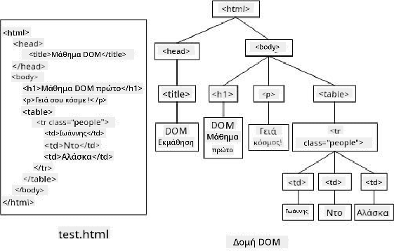
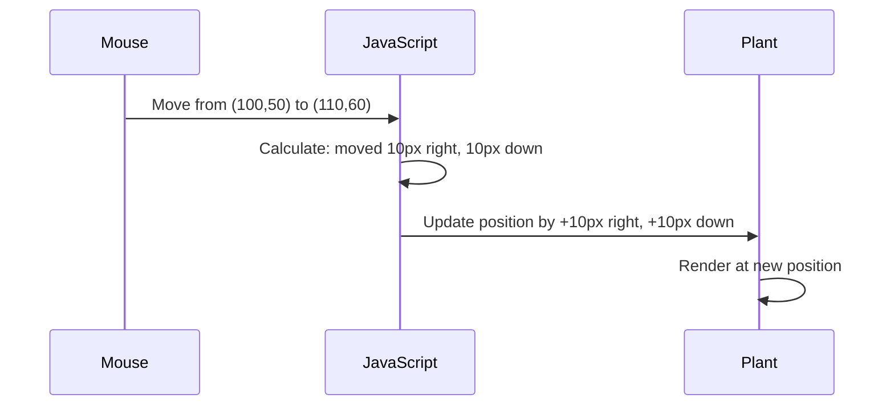
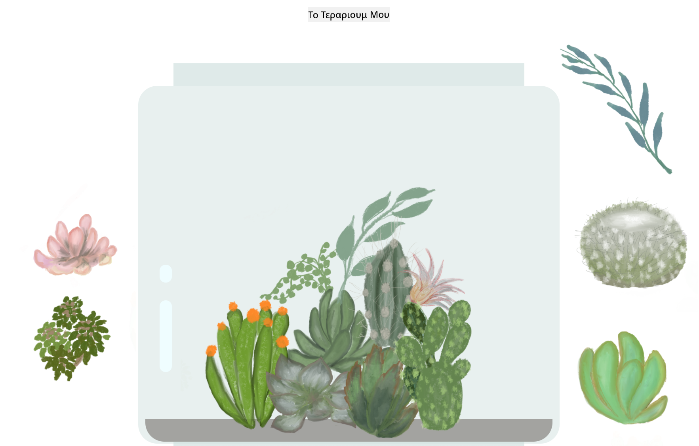

<!--
CO_OP_TRANSLATOR_METADATA:
{
  "original_hash": "bc93f6285423033ebf5b8abeb5282888",
  "translation_date": "2025-10-23T20:15:33+00:00",
  "source_file": "3-terrarium/3-intro-to-DOM-and-closures/README.md",
  "language_code": "el"
}
-->
# Έργο Terrarium Μέρος 3: Χειρισμός DOM και Κλεισίματα JavaScript


> Σκίτσο από [Tomomi Imura](https://twitter.com/girlie_mac)

Καλώς ήρθατε σε μία από τις πιο συναρπαστικές πτυχές της ανάπτυξης ιστοσελίδων - να κάνετε τα πράγματα διαδραστικά! Το Document Object Model (DOM) είναι σαν μια γέφυρα μεταξύ του HTML και του JavaScript σας, και σήμερα θα το χρησιμοποιήσουμε για να δώσουμε ζωή στο terrarium σας. Όταν ο Tim Berners-Lee δημιούργησε τον πρώτο περιηγητή ιστού, οραματίστηκε έναν ιστό όπου τα έγγραφα θα μπορούσαν να είναι δυναμικά και διαδραστικά - το DOM κάνει αυτή την ιδέα πραγματικότητα.

Θα εξερευνήσουμε επίσης τα κλεισίματα JavaScript, τα οποία μπορεί αρχικά να ακούγονται τρομακτικά. Σκεφτείτε τα κλεισίματα σαν να δημιουργούν "τσέπες μνήμης" όπου οι συναρτήσεις σας μπορούν να θυμούνται σημαντικές πληροφορίες. Είναι σαν κάθε φυτό στο terrarium σας να έχει τη δική του καταγραφή δεδομένων για να παρακολουθεί τη θέση του. Μέχρι το τέλος αυτού του μαθήματος, θα κατανοήσετε πόσο φυσικά και χρήσιμα είναι.

Αυτό που θα δημιουργήσουμε: ένα terrarium όπου οι χρήστες μπορούν να σύρουν και να αφήσουν φυτά οπουδήποτε θέλουν. Θα μάθετε τις τεχνικές χειρισμού DOM που υποστηρίζουν τα πάντα, από μεταφορές αρχείων με σύρσιμο και απόθεση έως διαδραστικά παιχνίδια. Ας δώσουμε ζωή στο terrarium σας.

## Ερωτηματολόγιο Πριν το Μάθημα

[Ερωτηματολόγιο πριν το μάθημα](https://ff-quizzes.netlify.app/web/quiz/19)

## Κατανόηση του DOM: Η Πύλη σας για Διαδραστικές Ιστοσελίδες

Το Document Object Model (DOM) είναι ο τρόπος με τον οποίο το JavaScript επικοινωνεί με τα στοιχεία HTML σας. Όταν ο περιηγητής σας φορτώνει μια σελίδα HTML, δημιουργεί μια δομημένη αναπαράσταση αυτής της σελίδας στη μνήμη - αυτό είναι το DOM. Σκεφτείτε το σαν ένα οικογενειακό δέντρο όπου κάθε στοιχείο HTML είναι μέλος της οικογένειας που το JavaScript μπορεί να προσπελάσει, να τροποποιήσει ή να αναδιατάξει.

Ο χειρισμός του DOM μετατρέπει τις στατικές σελίδες σε διαδραστικές ιστοσελίδες. Κάθε φορά που βλέπετε ένα κουμπί να αλλάζει χρώμα όταν τοποθετείτε τον δείκτη πάνω του, περιεχόμενο να ενημερώνεται χωρίς ανανέωση της σελίδας ή στοιχεία που μπορείτε να σύρετε, αυτός είναι ο χειρισμός του DOM σε δράση.



> Μια αναπαράσταση του DOM και της HTML που το αναφέρεται. Από [Olfa Nasraoui](https://www.researchgate.net/publication/221417012_Profile-Based_Focused_Crawler_for_Social_Media-Sharing_Websites)

**Τι κάνει το DOM ισχυρό:**
- **Παρέχει** έναν δομημένο τρόπο πρόσβασης σε οποιοδήποτε στοιχείο στη σελίδα σας
- **Επιτρέπει** δυναμικές ενημερώσεις περιεχομένου χωρίς ανανέωση της σελίδας
- **Ανταποκρίνεται** σε πραγματικό χρόνο στις αλληλεπιδράσεις του χρήστη, όπως κλικ και σύρσιμο
- **Δημιουργεί** τη βάση για σύγχρονες διαδραστικές εφαρμογές ιστού

## Κλεισίματα JavaScript: Δημιουργία Οργανωμένου, Ισχυρού Κώδικα

Ένα [κλείσιμο JavaScript](https://developer.mozilla.org/docs/Web/JavaScript/Closures) είναι σαν να δίνετε σε μια συνάρτηση τον δικό της ιδιωτικό χώρο εργασίας με μνήμη που παραμένει. Σκεφτείτε πώς τα σπίνια του Δαρβίνου στα Νησιά Γκαλαπάγκος ανέπτυξαν εξειδικευμένα ράμφη με βάση το συγκεκριμένο περιβάλλον τους - τα κλεισίματα λειτουργούν παρόμοια, δημιουργώντας εξειδικευμένες συναρτήσεις που "θυμούνται" το συγκεκριμένο πλαίσιο τους ακόμα και μετά την ολοκλήρωση της γονικής συνάρτησης.

Στο terrarium μας, τα κλεισίματα βοηθούν κάθε φυτό να θυμάται τη δική του θέση ανεξάρτητα. Αυτό το μοτίβο εμφανίζεται σε όλη την επαγγελματική ανάπτυξη JavaScript, καθιστώντας το μια πολύτιμη έννοια για κατανόηση.

> 💡 **Κατανόηση Κλεισιμάτων**: Τα κλεισίματα είναι ένα σημαντικό θέμα στη JavaScript, και πολλοί προγραμματιστές τα χρησιμοποιούν για χρόνια πριν κατανοήσουν πλήρως όλες τις θεωρητικές πτυχές. Σήμερα, επικεντρωνόμαστε στην πρακτική εφαρμογή - θα δείτε τα κλεισίματα να εμφανίζονται φυσικά καθώς δημιουργούμε τις διαδραστικές λειτουργίες μας. Η κατανόηση θα αναπτυχθεί καθώς βλέπετε πώς λύνουν πραγματικά προβλήματα.


> Μια αναπαράσταση του DOM και της HTML που το αναφέρεται. Από [Olfa Nasraoui](https://www.researchgate.net/publication/221417012_Profile-Based_Focused_Crawler_for_Social_Media-Sharing_Websites)

Σε αυτό το μάθημα, θα ολοκληρώσουμε το διαδραστικό έργο terrarium μας δημιουργώντας το JavaScript που θα επιτρέπει σε έναν χρήστη να χειρίζεται τα φυτά στη σελίδα.

## Πριν Ξεκινήσουμε: Προετοιμασία για Επιτυχία

Θα χρειαστείτε τα αρχεία HTML και CSS από τα προηγούμενα μαθήματα terrarium - πρόκειται να κάνουμε αυτόν τον στατικό σχεδιασμό διαδραστικό. Αν συμμετέχετε για πρώτη φορά, η ολοκλήρωση αυτών των μαθημάτων πρώτα θα παρέχει σημαντικό πλαίσιο.

Αυτό που θα δημιουργήσουμε:
- **Ομαλό σύρσιμο και απόθεση** για όλα τα φυτά του terrarium
- **Παρακολούθηση συντεταγμένων** ώστε τα φυτά να θυμούνται τις θέσεις τους
- **Πλήρες διαδραστικό περιβάλλον** χρησιμοποιώντας απλό JavaScript
- **Καθαρός, οργανωμένος κώδικας** χρησιμοποιώντας μοτίβα κλεισίματος

## Δημιουργία του Αρχείου JavaScript σας

Ας δημιουργήσουμε το αρχείο JavaScript που θα κάνει το terrarium σας διαδραστικό.

**Βήμα 1: Δημιουργήστε το αρχείο script σας**

Στο φάκελο του terrarium σας, δημιουργήστε ένα νέο αρχείο με όνομα `script.js`.

**Βήμα 2: Συνδέστε το JavaScript με το HTML σας**

Προσθέστε αυτήν την ετικέτα script στην ενότητα `<head>` του αρχείου `index.html` σας:

```html
<script src="./script.js" defer></script>
```

**Γιατί είναι σημαντική η ιδιότητα `defer`:**
- **Εξασφαλίζει** ότι το JavaScript σας περιμένει μέχρι να φορτωθεί όλο το HTML
- **Αποτρέπει** σφάλματα όπου το JavaScript αναζητά στοιχεία που δεν είναι έτοιμα ακόμα
- **Εγγυάται** ότι όλα τα στοιχεία φυτών σας είναι διαθέσιμα για αλληλεπίδραση
- **Παρέχει** καλύτερη απόδοση από την τοποθέτηση των scripts στο κάτω μέρος της σελίδας

> ⚠️ **Σημαντική Σημείωση**: Η ιδιότητα `defer` αποτρέπει κοινά προβλήματα χρονισμού. Χωρίς αυτήν, το JavaScript μπορεί να προσπαθήσει να προσπελάσει στοιχεία HTML πριν φορτωθούν, προκαλώντας σφάλματα.

---

## Σύνδεση JavaScript με τα Στοιχεία HTML σας

Πριν μπορέσουμε να κάνουμε τα στοιχεία μετακινούμενα, το JavaScript πρέπει να τα εντοπίσει στο DOM. Σκεφτείτε το σαν ένα σύστημα καταλογογράφησης βιβλιοθήκης - μόλις έχετε τον αριθμό καταλόγου, μπορείτε να βρείτε ακριβώς το βιβλίο που χρειάζεστε και να έχετε πρόσβαση σε όλο το περιεχόμενό του.

Θα χρησιμοποιήσουμε τη μέθοδο `document.getElementById()` για να κάνουμε αυτές τις συνδέσεις. Είναι σαν να έχετε ένα ακριβές σύστημα αρχειοθέτησης - παρέχετε ένα ID και εντοπίζει ακριβώς το στοιχείο που χρειάζεστε στο HTML σας.

### Ενεργοποίηση Λειτουργίας Σύρσιμο για Όλα τα Φυτά

Προσθέστε αυτόν τον κώδικα στο αρχείο `script.js` σας:

```javascript
// Enable drag functionality for all 14 plants
dragElement(document.getElementById('plant1'));
dragElement(document.getElementById('plant2'));
dragElement(document.getElementById('plant3'));
dragElement(document.getElementById('plant4'));
dragElement(document.getElementById('plant5'));
dragElement(document.getElementById('plant6'));
dragElement(document.getElementById('plant7'));
dragElement(document.getElementById('plant8'));
dragElement(document.getElementById('plant9'));
dragElement(document.getElementById('plant10'));
dragElement(document.getElementById('plant11'));
dragElement(document.getElementById('plant12'));
dragElement(document.getElementById('plant13'));
dragElement(document.getElementById('plant14'));
```

**Τι επιτυγχάνει αυτός ο κώδικας:**
- **Εντοπίζει** κάθε στοιχείο φυτού στο DOM χρησιμοποιώντας το μοναδικό του ID
- **Ανακτά** μια αναφορά JavaScript σε κάθε στοιχείο HTML
- **Περνά** κάθε στοιχείο σε μια συνάρτηση `dragElement` (την οποία θα δημιουργήσουμε στη συνέχεια)
- **Προετοιμάζει** κάθε φυτό για αλληλεπίδραση με σύρσιμο και απόθεση
- **Συνδέει** τη δομή HTML σας με τη λειτουργικότητα JavaScript

> 🎯 **Γιατί Χρησιμοποιούμε IDs Αντί για Classes;** Τα IDs παρέχουν μοναδικούς αναγνωριστές για συγκεκριμένα στοιχεία, ενώ οι κλάσεις CSS προορίζονται για τη μορφοποίηση ομάδων στοιχείων. Όταν το JavaScript χρειάζεται να χειριστεί μεμονωμένα στοιχεία, τα IDs προσφέρουν την ακρίβεια και την απόδοση που χρειαζόμαστε.

> 💡 **Συμβουλή**: Παρατηρήστε πώς καλούμε τη `dragElement()` για κάθε φυτό ξεχωριστά. Αυτή η προσέγγιση εξασφαλίζει ότι κάθε φυτό αποκτά τη δική του ανεξάρτητη συμπεριφορά σύρσιμο, η οποία είναι απαραίτητη για ομαλή αλληλεπίδραση χρήστη.

---

## Δημιουργία του Κλεισίματος dragElement

Τώρα θα δημιουργήσουμε την καρδιά της λειτουργίας σύρσιμο: ένα κλείσιμο που διαχειρίζεται τη συμπεριφορά σύρσιμο για κάθε φυτό.
- **`pos3` και `pos4`**: Αποθηκεύουν την τρέχουσα θέση του ποντικιού για την επόμενη υπολογιστική διαδικασία
- **`offsetTop` και `offsetLeft`**: Λαμβάνουν την τρέχουσα θέση του στοιχείου στη σελίδα
- **Λογική αφαίρεσης**: Μετακινεί το στοιχείο κατά την ίδια απόσταση που μετακινήθηκε το ποντίκι

**Ανάλυση υπολογισμού κίνησης:**
1. **Μετράει** τη διαφορά μεταξύ της παλιάς και της νέας θέσης του ποντικιού
2. **Υπολογίζει** πόσο πρέπει να μετακινηθεί το στοιχείο βάσει της κίνησης του ποντικιού
3. **Ενημερώνει** τις ιδιότητες θέσης CSS του στοιχείου σε πραγματικό χρόνο
4. **Αποθηκεύει** τη νέα θέση ως βάση για τον επόμενο υπολογισμό κίνησης

### Οπτική Αναπαράσταση των Μαθηματικών



### Η συνάρτηση stopElementDrag: Καθαρισμός

Προσθέστε τη συνάρτηση καθαρισμού μετά την κλείουσα αγκύλη του `elementDrag`:

```javascript
function stopElementDrag() {
    // Remove the document-level event listeners
    document.onpointerup = null;
    document.onpointermove = null;
}
```

**Γιατί ο καθαρισμός είναι απαραίτητος:**
- **Αποτρέπει** διαρροές μνήμης από παραμένοντες ακροατές συμβάντων
- **Σταματά** τη συμπεριφορά μετακίνησης όταν ο χρήστης αφήσει το φυτό
- **Επιτρέπει** σε άλλα στοιχεία να μετακινηθούν ανεξάρτητα
- **Επαναφέρει** το σύστημα για την επόμενη λειτουργία μετακίνησης

**Τι συμβαίνει χωρίς καθαρισμό:**
- Οι ακροατές συμβάντων συνεχίζουν να λειτουργούν ακόμα και μετά τη διακοπή της μετακίνησης
- Η απόδοση υποβαθμίζεται καθώς συσσωρεύονται αχρησιμοποίητοι ακροατές
- Απρόσμενη συμπεριφορά κατά την αλληλεπίδραση με άλλα στοιχεία
- Οι πόροι του προγράμματος περιήγησης σπαταλούνται σε περιττό χειρισμό συμβάντων

### Κατανόηση Ιδιοτήτων Θέσης CSS

Το σύστημα μετακίνησης μας χειρίζεται δύο βασικές ιδιότητες CSS:

| Ιδιότητα | Τι Ελέγχει | Πώς Τη Χρησιμοποιούμε |
|----------|------------|-----------------------|
| `top` | Απόσταση από την επάνω άκρη | Κάθετη τοποθέτηση κατά τη μετακίνηση |
| `left` | Απόσταση από την αριστερή άκρη | Οριζόντια τοποθέτηση κατά τη μετακίνηση |

**Βασικές πληροφορίες για τις ιδιότητες offset:**
- **`offsetTop`**: Τρέχουσα απόσταση από την επάνω πλευρά του τοποθετημένου γονικού στοιχείου
- **`offsetLeft`**: Τρέχουσα απόσταση από την αριστερή πλευρά του τοποθετημένου γονικού στοιχείου
- **Πλαίσιο τοποθέτησης**: Αυτές οι τιμές είναι σχετικές με τον πλησιέστερο τοποθετημένο πρόγονο
- **Ενημερώσεις σε πραγματικό χρόνο**: Αλλάζουν άμεσα όταν τροποποιούμε τις ιδιότητες CSS

> 🎯 **Φιλοσοφία Σχεδιασμού**: Αυτό το σύστημα μετακίνησης είναι σκόπιμα ευέλικτο – δεν υπάρχουν "ζώνες πτώσης" ή περιορισμοί. Οι χρήστες μπορούν να τοποθετήσουν τα φυτά οπουδήποτε, δίνοντάς τους πλήρη δημιουργικό έλεγχο στον σχεδιασμό του terrarium.

## Συνδυάζοντας Όλα: Το Πλήρες Σύστημα Μετακίνησης

Συγχαρητήρια! Μόλις δημιουργήσατε ένα εξελιγμένο σύστημα μετακίνησης και απόθεσης χρησιμοποιώντας καθαρό JavaScript. Η πλήρης συνάρτηση `dragElement` περιέχει τώρα ένα ισχυρό closure που διαχειρίζεται:

**Τι επιτυγχάνει το closure σας:**
- **Διατηρεί** ιδιωτικές μεταβλητές θέσης για κάθε φυτό ανεξάρτητα
- **Διαχειρίζεται** ολόκληρο τον κύκλο ζωής της μετακίνησης από την αρχή μέχρι το τέλος
- **Παρέχει** ομαλή, ευαίσθητη κίνηση σε όλη την οθόνη
- **Καθαρίζει** σωστά τους πόρους για να αποτρέψει διαρροές μνήμης
- **Δημιουργεί** ένα διαισθητικό, δημιουργικό περιβάλλον για τον σχεδιασμό του terrarium

### Δοκιμάζοντας το Διαδραστικό Terrarium σας

Τώρα δοκιμάστε το διαδραστικό terrarium σας! Ανοίξτε το αρχείο `index.html` σε έναν web browser και δοκιμάστε τη λειτουργικότητα:

1. **Κάντε κλικ και κρατήστε πατημένο** οποιοδήποτε φυτό για να ξεκινήσετε τη μετακίνηση
2. **Μετακινήστε το ποντίκι ή το δάχτυλό σας** και δείτε το φυτό να ακολουθεί ομαλά
3. **Αφήστε** για να αφήσετε το φυτό στη νέα του θέση
4. **Πειραματιστείτε** με διαφορετικές διατάξεις για να εξερευνήσετε τη διεπαφή

🥇 **Επίτευγμα**: Δημιουργήσατε μια πλήρως διαδραστική εφαρμογή ιστού χρησιμοποιώντας βασικές έννοιες που χρησιμοποιούν καθημερινά οι επαγγελματίες προγραμματιστές. Αυτή η λειτουργικότητα μετακίνησης και απόθεσης χρησιμοποιεί τις ίδιες αρχές πίσω από τις μεταφορές αρχείων, τα kanban boards και πολλές άλλες διαδραστικές διεπαφές.



---

## Πρόκληση GitHub Copilot Agent 🚀

Χρησιμοποιήστε τη λειτουργία Agent για να ολοκληρώσετε την παρακάτω πρόκληση:

**Περιγραφή:** Βελτιώστε το έργο terrarium προσθέτοντας μια λειτουργία επαναφοράς που επιστρέφει όλα τα φυτά στις αρχικές τους θέσεις με ομαλές κινήσεις.

**Προτροπή:** Δημιουργήστε ένα κουμπί επαναφοράς που, όταν πατηθεί, μετακινεί όλα τα φυτά πίσω στις αρχικές θέσεις της πλαϊνής μπάρας με ομαλές μεταβάσεις CSS. Η συνάρτηση πρέπει να αποθηκεύει τις αρχικές θέσεις όταν φορτώνεται η σελίδα και να μετακινεί ομαλά τα φυτά πίσω σε αυτές τις θέσεις μέσα σε 1 δευτερόλεπτο όταν πατηθεί το κουμπί επαναφοράς.

Μάθετε περισσότερα για τη [λειτουργία agent](https://code.visualstudio.com/blogs/2025/02/24/introducing-copilot-agent-mode) εδώ.

## 🚀 Πρόσθετη Πρόκληση: Επεκτείνετε τις Δεξιότητές σας

Έτοιμοι να πάτε το terrarium σας στο επόμενο επίπεδο; Δοκιμάστε να υλοποιήσετε αυτές τις βελτιώσεις:

**Δημιουργικές Επεκτάσεις:**
- **Διπλό κλικ** σε ένα φυτό για να το φέρετε μπροστά (χειρισμός z-index)
- **Προσθέστε οπτική ανατροφοδότηση** όπως ένα απαλό φως όταν περνάτε το ποντίκι πάνω από τα φυτά
- **Υλοποιήστε όρια** για να αποτρέψετε τα φυτά από το να μετακινηθούν εκτός του terrarium
- **Δημιουργήστε μια λειτουργία αποθήκευσης** που θυμάται τις θέσεις των φυτών χρησιμοποιώντας localStorage
- **Προσθέστε ηχητικά εφέ** για την επιλογή και την τοποθέτηση των φυτών

> 💡 **Ευκαιρία Μάθησης**: Κάθε μία από αυτές τις προκλήσεις θα σας διδάξει νέες πτυχές του χειρισμού DOM, της διαχείρισης συμβάντων και του σχεδιασμού εμπειρίας χρήστη.

## Ερωτήσεις Μετά το Μάθημα

[Ερωτήσεις μετά το μάθημα](https://ff-quizzes.netlify.app/web/quiz/20)

## Ανασκόπηση & Αυτοδιδασκαλία: Εμβάθυνση της Κατανόησής σας

Έχετε κατακτήσει τα βασικά της διαχείρισης DOM και των closures, αλλά πάντα υπάρχει χώρος για περισσότερη εξερεύνηση! Ακολουθούν μερικές διαδρομές για να διευρύνετε τις γνώσεις και τις δεξιότητές σας.

### Εναλλακτικές Προσεγγίσεις Μετακίνησης και Απόθεσης

Χρησιμοποιήσαμε pointer events για μέγιστη ευελιξία, αλλά η ανάπτυξη ιστού προσφέρει πολλαπλές προσεγγίσεις:

| Προσέγγιση | Ιδανική Για | Εκπαιδευτική Αξία |
|------------|-------------|-------------------|
| [HTML Drag and Drop API](https://developer.mozilla.org/docs/Web/API/HTML_Drag_and_Drop_API) | Μεταφορές αρχείων, επίσημες ζώνες μετακίνησης | Κατανόηση των εγγενών δυνατοτήτων του προγράμματος περιήγησης |
| [Touch Events](https://developer.mozilla.org/docs/Web/API/Touch_events) | Αλληλεπιδράσεις ειδικά για κινητά | Πρότυπα ανάπτυξης για κινητά |
| Ιδιότητες CSS `transform` | Ομαλές κινήσεις | Τεχνικές βελτιστοποίησης απόδοσης |

### Προχωρημένα Θέματα Διαχείρισης DOM

**Επόμενα βήματα στο ταξίδι μάθησής σας:**
- **Ανάθεση συμβάντων**: Αποτελεσματική διαχείριση συμβάντων για πολλαπλά στοιχεία
- **Intersection Observer**: Εντοπισμός όταν τα στοιχεία εισέρχονται/εξέρχονται από το οπτικό πεδίο
- **Mutation Observer**: Παρακολούθηση αλλαγών στη δομή του DOM
- **Web Components**: Δημιουργία επαναχρησιμοποιήσιμων, απομονωμένων στοιχείων UI
- **Έννοιες εικονικού DOM**: Κατανόηση του τρόπου με τον οποίο τα frameworks βελτιστοποιούν τις ενημερώσεις του DOM

### Βασικοί Πόροι για Συνεχή Μάθηση

**Τεχνική Τεκμηρίωση:**
- [MDN Pointer Events Guide](https://developer.mozilla.org/docs/Web/API/Pointer_events) - Αναλυτική αναφορά για τα pointer events
- [W3C Pointer Events Specification](https://www.w3.org/TR/pointerevents1/) - Επίσημη τεκμηρίωση προτύπων
- [JavaScript Closures Deep Dive](https://developer.mozilla.org/docs/Web/JavaScript/Closures) - Προχωρημένα μοτίβα closures

**Συμβατότητα Προγραμμάτων Περιήγησης:**
- [CanIUse.com](https://caniuse.com/) - Ελέγξτε την υποστήριξη λειτουργιών σε διάφορα προγράμματα περιήγησης
- [MDN Browser Compatibility Data](https://github.com/mdn/browser-compat-data) - Λεπτομερείς πληροφορίες συμβατότητας

**Ευκαιρίες Πρακτικής:**
- **Δημιουργήστε** ένα παιχνίδι παζλ χρησιμοποιώντας παρόμοιους μηχανισμούς μετακίνησης
- **Σχεδιάστε** ένα kanban board με διαχείριση εργασιών μέσω μετακίνησης και απόθεσης
- **Δημιουργήστε** μια γκαλερί εικόνων με δυνατότητα μετακίνησης φωτογραφιών
- **Πειραματιστείτε** με χειρονομίες αφής για διεπαφές κινητών

> 🎯 **Στρατηγική Μάθησης**: Ο καλύτερος τρόπος για να εδραιώσετε αυτές τις έννοιες είναι μέσω της πρακτικής. Δοκιμάστε να δημιουργήσετε παραλλαγές διαδραστικών διεπαφών – κάθε έργο θα σας διδάξει κάτι νέο για την αλληλεπίδραση χρήστη και τη διαχείριση του DOM.

## Εργασία

[Δουλέψτε λίγο περισσότερο με το DOM](assignment.md)

---

**Αποποίηση ευθύνης**:  
Αυτό το έγγραφο έχει μεταφραστεί χρησιμοποιώντας την υπηρεσία μετάφρασης AI [Co-op Translator](https://github.com/Azure/co-op-translator). Παρόλο που καταβάλλουμε προσπάθειες για ακρίβεια, παρακαλούμε να γνωρίζετε ότι οι αυτοματοποιημένες μεταφράσεις ενδέχεται να περιέχουν λάθη ή ανακρίβειες. Το πρωτότυπο έγγραφο στη μητρική του γλώσσα θα πρέπει να θεωρείται η αυθεντική πηγή. Για κρίσιμες πληροφορίες, συνιστάται επαγγελματική ανθρώπινη μετάφραση. Δεν φέρουμε ευθύνη για τυχόν παρεξηγήσεις ή εσφαλμένες ερμηνείες που προκύπτουν από τη χρήση αυτής της μετάφρασης.