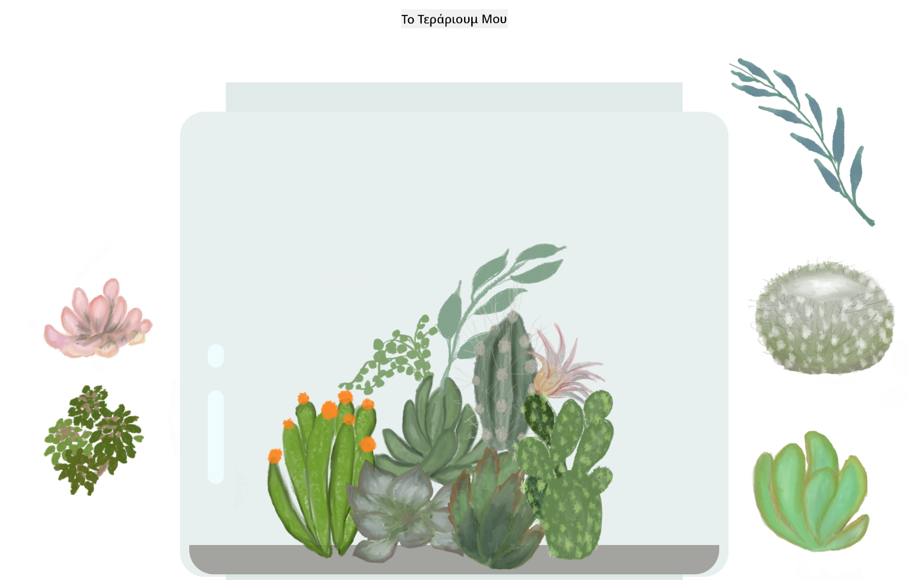

<!--
CO_OP_TRANSLATOR_METADATA:
{
  "original_hash": "7965cd2bc5dc92ad888dc4c6ab2ab70a",
  "translation_date": "2025-08-26T21:27:52+00:00",
  "source_file": "3-terrarium/README.md",
  "language_code": "el"
}
-->
# Το Τεράριουμ μου: Ένα έργο για να μάθετε HTML, CSS και χειρισμό DOM με JavaScript 🌵🌱

Μια μικρή άσκηση drag and drop. Με λίγη HTML, JS και CSS, θα μπορέσετε να δημιουργήσετε μια διαδικτυακή διεπαφή, να τη διαμορφώσετε και να προσθέσετε πολλαπλές αλληλεπιδράσεις της επιλογής σας.

# Μαθήματα

1. [Εισαγωγή στην HTML](./1-intro-to-html/README.md)
2. [Εισαγωγή στην CSS](./2-intro-to-css/README.md)
3. [Εισαγωγή στο DOM και τα JS Closures](./3-intro-to-DOM-and-closures/README.md)

## Ευχαριστίες

Γραμμένο με ♥️ από την [Jen Looper](https://www.twitter.com/jenlooper)

Το τεράριουμ που δημιουργήθηκε μέσω CSS εμπνεύστηκε από το γυάλινο βάζο του Jakub Mandra [codepen](https://codepen.io/Rotarepmi/pen/rjpNZY).

Τα σχέδια είναι χειροποίητα από την [Jen Looper](http://jenlooper.com) με τη βοήθεια του Procreate.

## Ανέβασμα του Τεράριουμ σας

Μπορείτε να ανεβάσετε ή να δημοσιεύσετε το τεράριουμ σας στο διαδίκτυο χρησιμοποιώντας το Azure Static Web Apps.

1. Κάντε fork αυτό το αποθετήριο

2. Πατήστε αυτό το κουμπί

3. Ακολουθήστε τον οδηγό για τη δημιουργία της εφαρμογής σας. Βεβαιωθείτε ότι έχετε ορίσει τη ρίζα της εφαρμογής είτε στο `/solution` είτε στη ρίζα του κώδικά σας. Δεν υπάρχει API σε αυτή την εφαρμογή, οπότε μην ανησυχείτε για αυτό. Ένας φάκελος github θα δημιουργηθεί στο αποθετήριο που κάνατε fork, ο οποίος θα βοηθήσει τις υπηρεσίες build του Azure Static Web Apps να δημιουργήσουν και να δημοσιεύσουν την εφαρμογή σας σε ένα νέο URL.

---

**Αποποίηση ευθύνης**:  
Αυτό το έγγραφο έχει μεταφραστεί χρησιμοποιώντας την υπηρεσία αυτόματης μετάφρασης [Co-op Translator](https://github.com/Azure/co-op-translator). Παρόλο που καταβάλλουμε προσπάθειες για ακρίβεια, παρακαλούμε να έχετε υπόψη ότι οι αυτοματοποιημένες μεταφράσεις ενδέχεται να περιέχουν σφάλματα ή ανακρίβειες. Το πρωτότυπο έγγραφο στη μητρική του γλώσσα θα πρέπει να θεωρείται η αυθεντική πηγή. Για κρίσιμες πληροφορίες, συνιστάται επαγγελματική μετάφραση από άνθρωπο. Δεν φέρουμε ευθύνη για τυχόν παρεξηγήσεις ή εσφαλμένες ερμηνείες που προκύπτουν από τη χρήση αυτής της μετάφρασης.