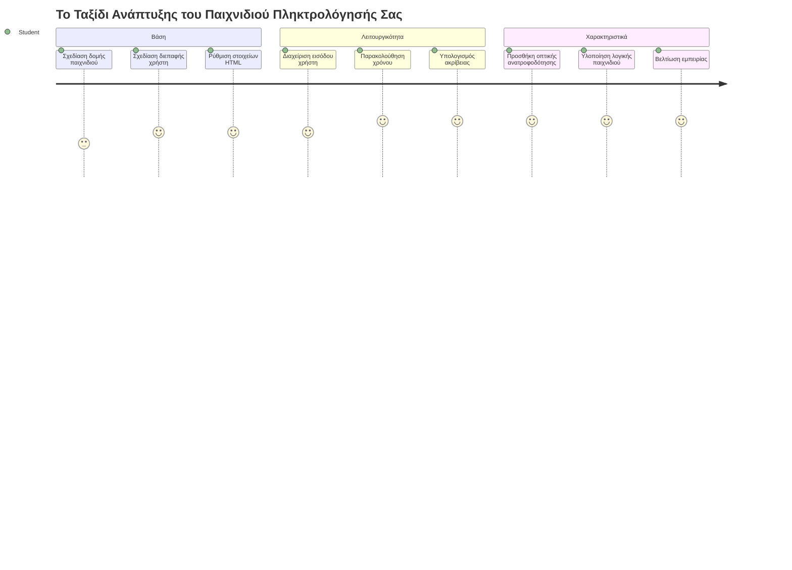
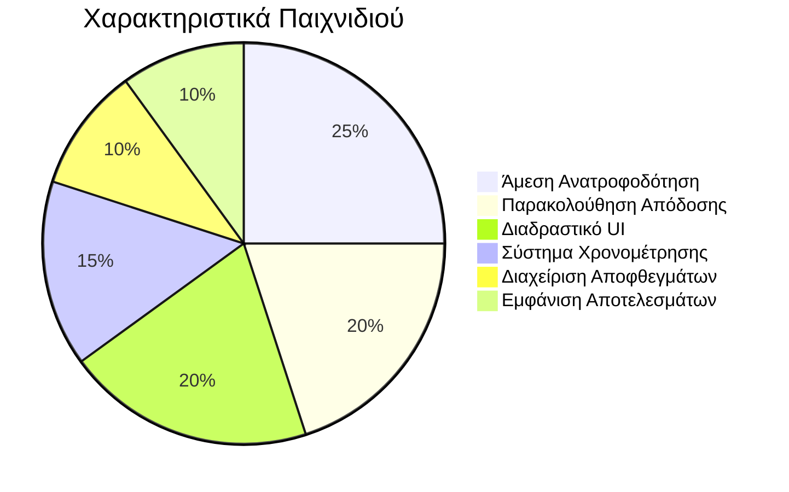
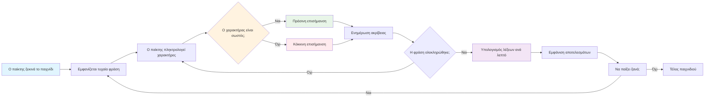
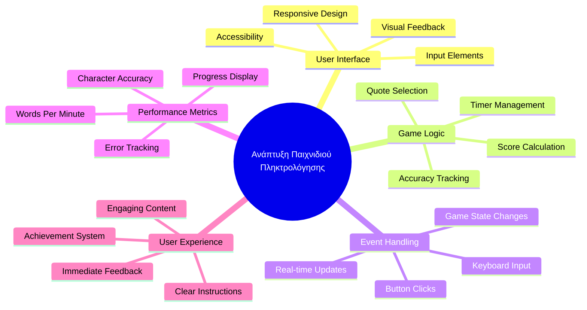
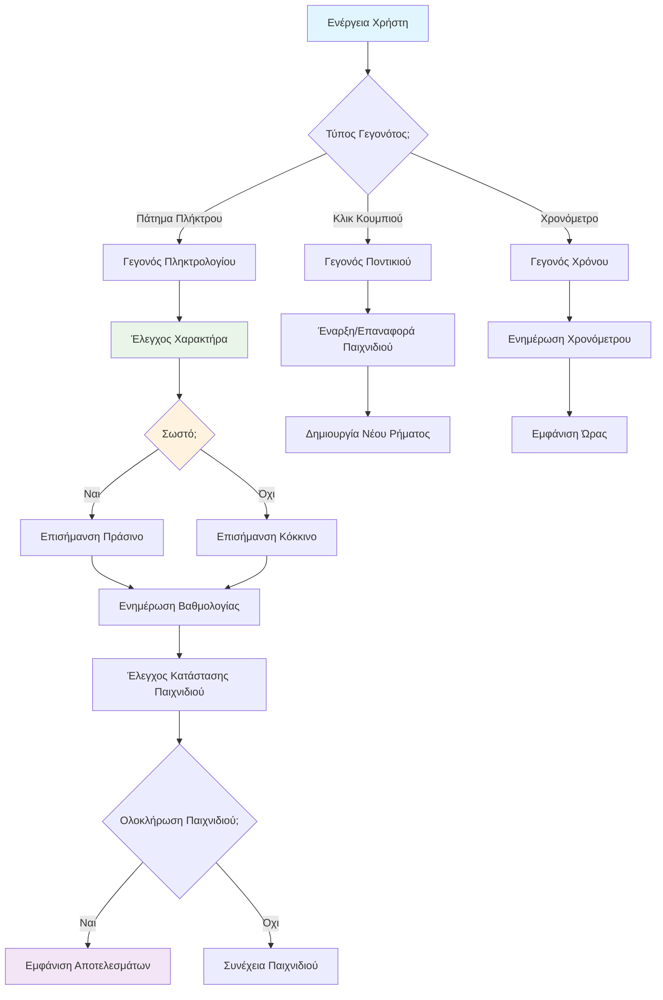
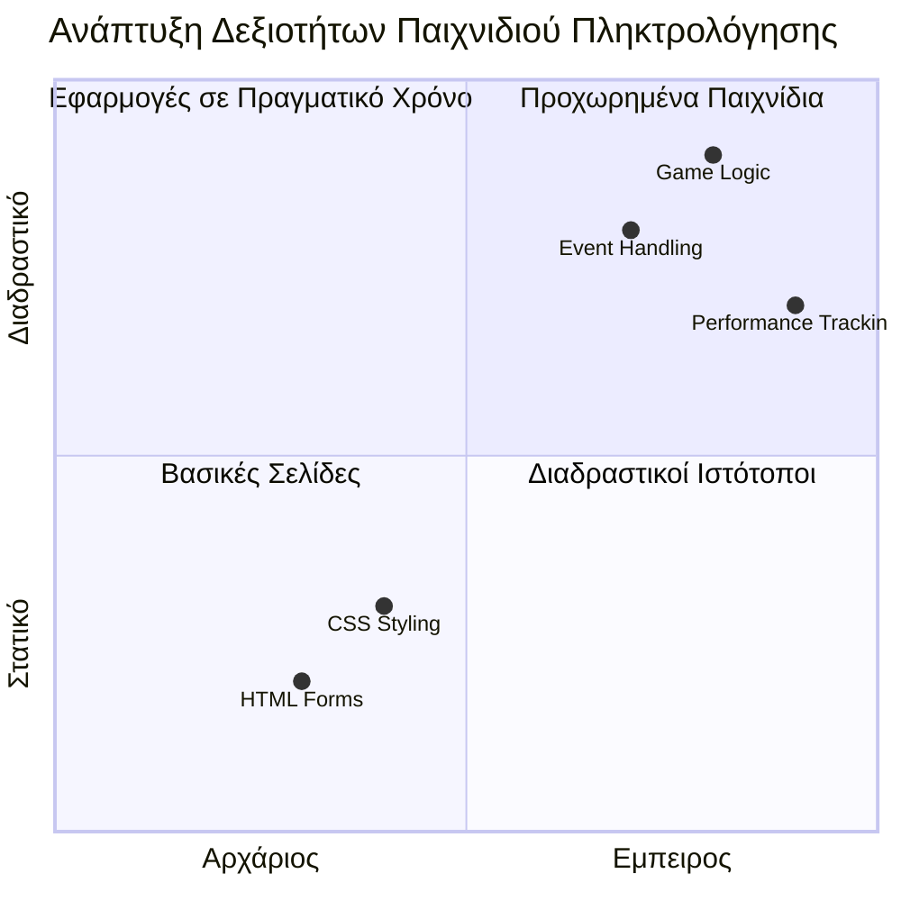
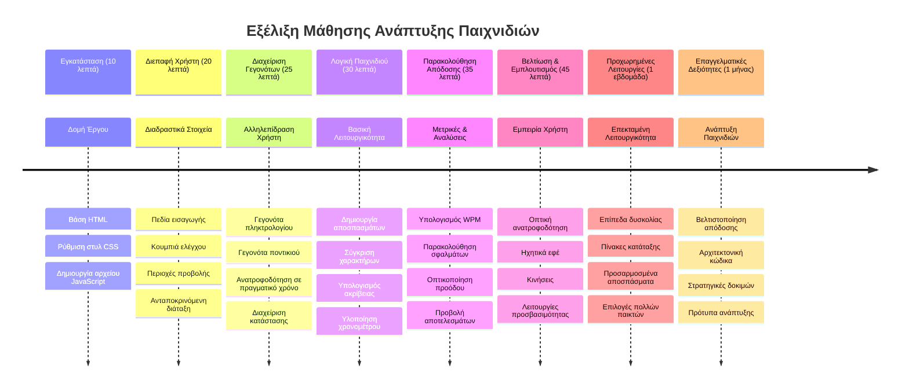

# Προγραμματισμός με Βάση τα Γεγονότα - Δημιουργήστε ένα Παιχνίδι Πληκτρολόγησης

## Εισαγωγή

Να κάτι που ξέρει κάθε προγραμματιστής αλλά σπάνια μιλάει γι’ αυτό: το να πληκτρολογείς γρήγορα είναι μια υπερδύναμη! 🚀 Σκέψου το - όσο πιο γρήγορα μπορείς να περάσεις τις ιδέες από το μυαλό σου στον επεξεργαστή κώδικα, τόσο πιο πολύ μπορεί να ρέει η δημιουργικότητά σου. Είναι σαν να έχεις μια απευθείας σύνδεση μεταξύ των σκέψεών σου και της οθόνης.

Θέλεις να μάθεις έναν από τους καλύτερους τρόπους για να αναβαθμίσεις αυτή την ικανότητα; Το μάντεψες - θα φτιάξουμε ένα παιχνίδι!

> Ας φτιάξουμε μαζί ένα φανταστικό παιχνίδι πληκτρολόγησης!

Έτοιμος να εφαρμόσεις όλες αυτές τις δεξιότητες JavaScript, HTML και CSS που μαθαίνεις; Θα φτιάξουμε ένα παιχνίδι πληκτρολόγησης που θα σε δοκιμάσει με τυχαίες φράσεις από τον θρυλικό ντετέκτιβ [Σέρλοκ Χολμς](https://en.wikipedia.org/wiki/Sherlock_Holmes). Το παιχνίδι θα καταγράφει πόσο γρήγορα και με πόση ακρίβεια μπορείς να πληκτρολογήσεις - και πίστεψέ με, είναι πιο εθιστικό απ’ ό,τι ίσως νομίζεις!

## Τι Πρέπει να Ξέρεις

Πριν ξεκινήσουμε, βεβαιώσου ότι είσαι άνετος με αυτές τις έννοιες (μην ανησυχείς αν χρειάζεσαι μια γρήγορη ανανέωση - το έχουμε περάσει όλοι!):

- Δημιουργία πεδίων κειμένου και κουμπιών
- CSS και ορισμός στυλ με κλάσεις  
- Βασικά JavaScript
  - Δημιουργία πίνακα
  - Δημιουργία τυχαίου αριθμού
  - Λήψη της τρέχουσας ώρας

Αν κάτι από αυτά σου φαίνεται λίγο σκουριασμένο, δεν πειράζει καθόλου! Μερικές φορές ο καλύτερος τρόπος να εδραιώσεις τη γνώση σου είναι να πηδήξεις σε ένα project και να μάθεις στην πορεία.

### 🔄 **Παιδαγωγικός Έλεγχος**
**Αξιολόγηση Βάσης**: Πριν ξεκινήσεις την ανάπτυξη, βεβαιώσου ότι κατανοείς:
- ✅ Πώς λειτουργούν οι HTML φόρμες και τα πεδία εισόδου
- ✅ Κλάσεις CSS και δυναμική μορφοποίηση
- ✅ Ακροατές και χειριστές γεγονότων στη JavaScript
- ✅ Διαχείριση πινάκων και τυχαία επιλογή
- ✅ Μέτρηση χρόνου και υπολογισμοί

**Γρήγορο Αυτο-Τεστ**: Μπορείς να εξηγήσεις πώς αυτές οι έννοιες συνεργάζονται σε ένα διαδραστικό παιχνίδι;
- **Γεγονότα** ενεργοποιούνται όταν οι χρήστες αλληλεπιδρούν με στοιχεία
- **Χειριστές** επεξεργάζονται τα γεγονότα και ενημερώνουν την κατάσταση του παιχνιδιού
- **CSS** δίνει οπτική ανατροφοδότηση για τις ενέργειες των χρηστών
- **Χρονισμός** επιτρέπει τη μέτρηση επιδόσεων και την εξέλιξη του παιχνιδιού

## Ας Φτιάξουμε Αυτό το Πραγματάκι!

[Δημιουργία παιχνιδιού πληκτρολόγησης με προγραμματισμό βάσει γεγονότων](./typing-game/README.md)

### ⚡ **Τι Μπορείς να Κάνεις στα Επόμενα 5 Λεπτά**
- [ ] Άνοιξε την κονσόλα του περιηγητή σου και δοκίμασε να ακούς γεγονότα πληκτρολογίου με `addEventListener`
- [ ] Δημιούργησε μια απλή σελίδα HTML με πεδίο εισόδου και δοκίμασε την ανίχνευση πληκτρολόγησης
- [ ] Πρακτική στη διαχείριση συμβολοσειρών συγκρίνοντας το πληκτρολογημένο κείμενο με το επιθυμητό
- [ ] Πειραματίσου με το `setTimeout` για να καταλάβεις τις συναρτήσεις καθυστέρησης

### 🎯 **Τι Μπορείς να Καταφέρεις σε Αυτή την Ώρα**
- [ ] Ολοκλήρωσε το κουίζ μετά το μάθημα και κατανόησε τον προγραμματισμό βάσει γεγονότων
- [ ] Φτιάξε μια βασική έκδοση του παιχνιδιού πληκτρολόγησης με έλεγχο λέξεων
- [ ] Πρόσθεσε οπτική ανατροφοδότηση για σωστή και λανθασμένη πληκτρολόγηση
- [ ] Εφάρμοσε ένα απλό σύστημα βαθμολόγησης βάσει ταχύτητας και ακρίβειας
- [ ] Στυλιζάρισε το παιχνίδι σου με CSS για να είναι πιο ελκυστικό οπτικά

### 📅 **Η Εβδομαδιαία Ανάπτυξη του Παιχνιδιού σου**
- [ ] Ολοκληρώστε το πλήρες παιχνίδι πληκτρολόγησης με όλες τις λειτουργίες και βελτιώσεις
- [ ] Πρόσθεσε επίπεδα δυσκολίας με μεταβαλλόμενη πολυπλοκότητα λέξεων
- [ ] Εφάρμοσε παρακολούθηση στατιστικών χρηστών (WPM, ακρίβεια με την πάροδο του χρόνου)
- [ ] Δημιούργησε ηχητικά εφέ και κινούμενα σχέδια για καλύτερη εμπειρία χρήστη
- [ ] Κάνε το παιχνίδι σου προσαρμοστικό για κινητές συσκευές αφής
- [ ] Μοιράσου το παιχνίδι σου online και συγκέντρωσε σχόλια από χρήστες

### 🌟 **Η Μηνιαία Διαδραστική Ανάπτυξή σου**
- [ ] Δημιούργησε πολλαπλά παιχνίδια εξερευνώντας διαφορετικά μοτίβα αλληλεπίδρασης
- [ ] Μάθε για game loops, διαχείριση κατάστασης, και βελτιστοποίηση επιδόσεων
- [ ] Συνεισέφερε σε ανοιχτού κώδικα projects ανάπτυξης παιχνιδιών
- [ ] Κατέκτησε προχωρημένες έννοιες χρονισμού και ομαλών animations
- [ ] Δημιούργησε ένα portfolio που παρουσιάζει διάφορες διαδραστικές εφαρμογές
- [ ] Καθοδήγησε άλλους που ενδιαφέρονται για την ανάπτυξη παιχνιδιών και την αλληλεπίδραση με χρήστες

## 🎯 Το Χρονοδιάγραμμά Σοου για την Ικανοποίηση στο Παιχνίδι Πληκτρολόγησης

### 🛠️ Πηγή Εργαλείων Ανάπτυξης Παιχνιδιού

Μετά την ολοκλήρωση αυτού του έργου, θα έχεις μάθει:
- **Προγραμματισμός με Βάση τα Γεγονότα**: Ευσύχναστες διεπαφές χρήστη που αντιδρούν σε εισόδους
- **Άμεση Ανατροφοδότηση**: Απρόσκοπτες οπτικές και επιδόσεις ενημερώσεις
- **Μέτρηση Απόδοσης**: Ακριβείς μετρήσεις χρόνου και συστήματα βαθμολόγησης
- **Διαχείριση Κατάστασης Παιχνιδιού**: Έλεγχος ροής εφαρμογής και εμπειρίας χρήστη
- **Διαδραστικός Σχεδιασμός**: Δημιουργία ελκυστικών, εθιστικών εμπειριών χρήστη
- **Σύγχρονα Web APIs**: Αξιοποίηση δυνατοτήτων περιηγητή για πλούσιες αλληλεπιδράσεις
- **Προτύπα Προσβασιμότητας**: Συμπεριληπτικός σχεδιασμός για όλους τους χρήστες

**Πραγματικές Εφαρμογές**: Αυτές οι ικανότητες εφαρμόζονται άμεσα σε:
- **Διαδικτυακές Εφαρμογές**: Οποιαδήποτε διαδραστική διεπαφή ή πίνακα ελέγχου
- **Εκπαιδευτικό Λογισμικό**: Πλατφόρμες μάθησης και εργαλεία αξιολόγησης δεξιοτήτων
- **Εργαλεία Παραγωγικότητας**: Επεξεργαστές κειμένου, IDEs, και λογισμικό συνεργασίας
- **Βιομηχανία Παιχνιδιών**: Παιχνίδια browser και διαδραστική ψυχαγωγία
- **Κινητή Ανάπτυξη**: Διεπαφές αφής και διαχείριση χειρονομιών

**Επόμενο Επίπεδο**: Είσαι έτοιμος να εξερευνήσεις προηγμένα frameworks παιχνιδιών, συστήματα πολυπαικτών σε πραγματικό χρόνο, ή σύνθετες διαδραστικές εφαρμογές!

## Δημιουργοί

Γραμμένο με ♥️ από τον [Christopher Harrison](http://www.twitter.com/geektrainer)

---

<!-- CO-OP TRANSLATOR DISCLAIMER START -->
**Αποποίηση ευθυνών**:  
Αυτό το έγγραφο έχει μεταφραστεί χρησιμοποιώντας την υπηρεσία αυτόματης μετάφρασης AI [Co-op Translator](https://github.com/Azure/co-op-translator). Παρόλο που καταβάλλουμε προσπάθειες για ακρίβεια, παρακαλούμε να λάβετε υπόψη ότι οι αυτόματες μεταφράσεις ενδέχεται να περιέχουν λάθη ή ανακρίβειες. Το πρωτότυπο έγγραφο στη γλώσσα του θεωρείται η επίσημη πηγή. Για σημαντικές πληροφορίες συνιστάται η επαγγελματική ανθρώπινη μετάφραση. Δεν φέρουμε ευθύνη για τυχόν παρανοήσεις ή λανθασμένες ερμηνείες που προκύπτουν από τη χρήση αυτής της μετάφρασης.
<!-- CO-OP TRANSLATOR DISCLAIMER END -->