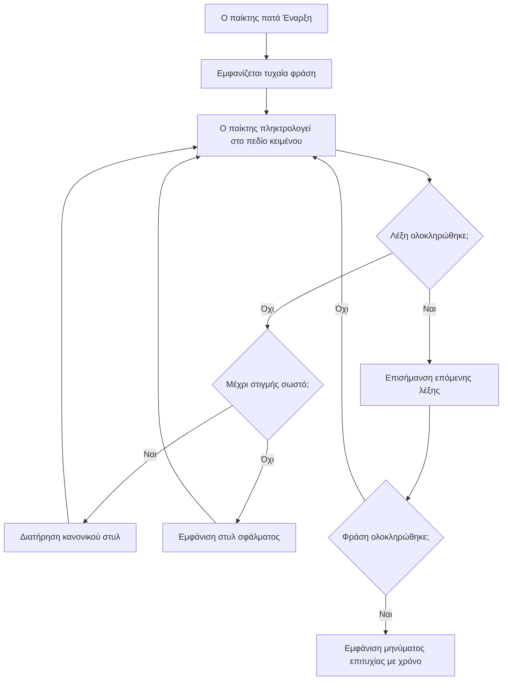
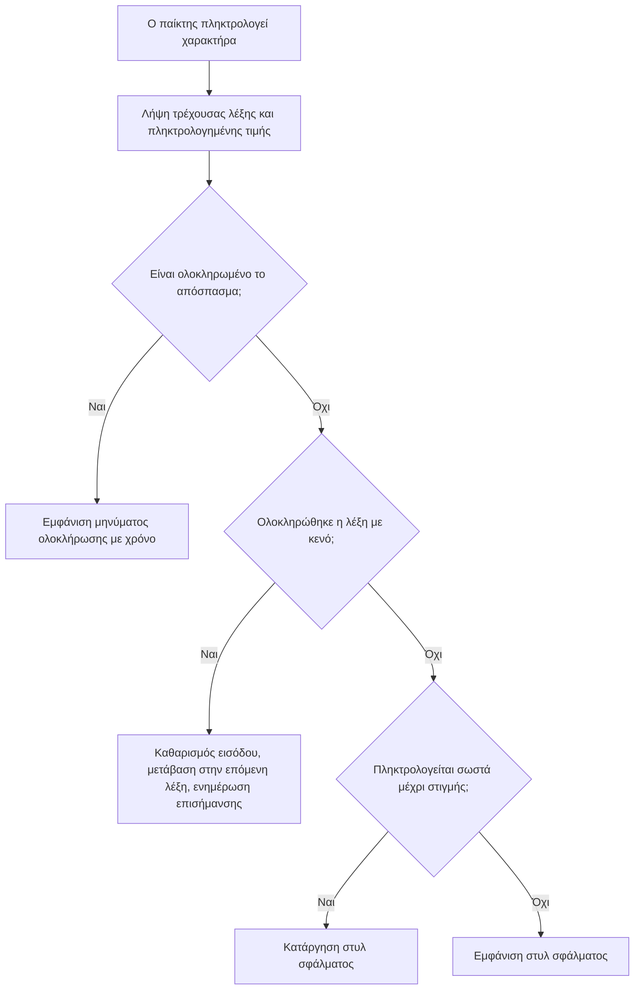
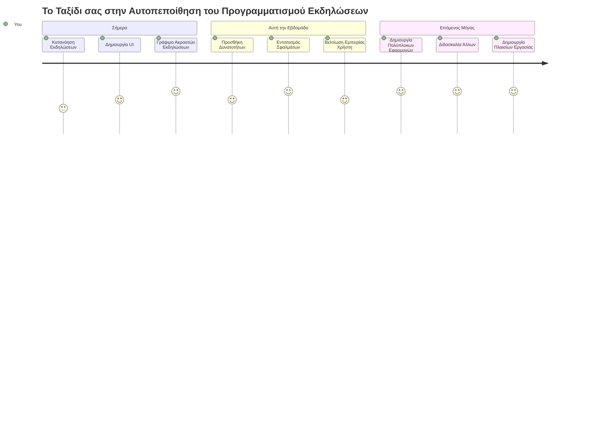

<!--
CO_OP_TRANSLATOR_METADATA:
{
  "original_hash": "da8bc72041a2bb3826a54654ee1a8844",
  "translation_date": "2026-01-06T21:04:04+00:00",
  "source_file": "4-typing-game/typing-game/README.md",
  "language_code": "el"
}
-->
# Δημιουργία ενός παιχνιδιού χρησιμοποιώντας γεγονότα

Έχετε ποτέ αναρωτηθεί πώς οι ιστοσελίδες ξέρουν πότε κάνετε κλικ σε ένα κουμπί ή πληκτρολογείτε σε ένα πεδίο κειμένου; Αυτή είναι η μαγεία του προγραμματισμού που βασίζεται σε γεγονότα! Τι καλύτερος τρόπος να μάθετε αυτήν την βασική δεξιότητα από το να φτιάξετε κάτι χρήσιμο - ένα παιχνίδι ταχύτητας πληκτρολόγησης που αντιδρά σε κάθε πλήκτρο που πατάτε.

Θα δείτε από πρώτο χέρι πώς οι φυλλομετρητές ιστού «συνομιλούν» με τον κώδικα JavaScript σας. Κάθε φορά που κάνετε κλικ, πληκτρολογείτε ή μετακινείτε το ποντίκι σας, ο φυλλομετρητής στέλνει μικρά μηνύματα (τα οποία ονομάζουμε γεγονότα) στον κώδικά σας, και εσείς αποφασίζετε πώς θα ανταποκριθείτε!

Μέχρι να ολοκληρώσουμε εδώ, θα έχετε δημιουργήσει ένα πραγματικό παιχνίδι πληκτρολόγησης που παρακολουθεί την ταχύτητα και την ακρίβειά σας. Το πιο σημαντικό, θα κατανοήσετε τις θεμελιώδεις έννοιες που τροφοδοτούν κάθε διαδραστική ιστοσελίδα που έχετε χρησιμοποιήσει ποτέ. Ας ξεκινήσουμε!

## Προ-διάλεξη Κουίζ

[Προ-διάλεξη κουίζ](https://ff-quizzes.netlify.app/web/quiz/21)

## Προγραμματισμός βασισμένος σε γεγονότα

Σκεφτείτε την αγαπημένη σας εφαρμογή ή ιστοσελίδα - τι την κάνει να φαίνεται ζωντανή και ανταποκρινόμενη; Όλα εξαρτώνται από το πώς αντιδρά σε αυτά που κάνετε! Κάθε πάτημα, κλικ, σάρωμα ή πλήκτρο που πατάτε δημιουργεί αυτό που ονομάζουμε «γεγονός», και εκεί συμβαίνει η πραγματική μαγεία της ανάπτυξης ιστού.

Αυτό που κάνει τον προγραμματισμό για το διαδίκτυο τόσο ενδιαφέρον είναι ότι ποτέ δεν ξέρουμε πότε κάποιος θα κάνει κλικ σε αυτό το κουμπί ή θα αρχίσει να πληκτρολογεί σε ένα πεδίο κειμένου. Μπορεί να κάνει κλικ αμέσως, να περιμένει πέντε λεπτά, ή ίσως να μην κάνει ποτέ κλικ! Αυτή η απρόβλεπτη φύση σημαίνει ότι πρέπει να σκεφτόμαστε διαφορετικά πώς γράφουμε τον κώδικά μας.

Αντί να γράφουμε κώδικα που τρέχει από πάνω προς τα κάτω σαν μια συνταγή, γράφουμε κώδικα που κάθεται υπομονετικά περιμένοντας να συμβεί κάτι. Είναι παρόμοιο με τους τηλεγραφητές του 1800 που κάθονταν δίπλα στις μηχανές τους, έτοιμοι να απαντήσουν τη στιγμή που θα ερχόταν ένα μήνυμα από το καλώδιο.

Τι ακριβώς είναι λοιπόν ένα «γεγονός»; Απλά, είναι κάτι που συμβαίνει! Όταν κάνετε κλικ σε ένα κουμπί - αυτό είναι γεγονός. Όταν πληκτρολογείτε ένα γράμμα - αυτό είναι γεγονός. Όταν μετακινείτε το ποντίκι σας - αυτό είναι άλλο ένα γεγονός.

Ο προγραμματισμός βασισμένος σε γεγονότα μας επιτρέπει να ρυθμίσουμε τον κώδικά μας να ακούει και να ανταποκρίνεται. Δημιουργούμε ειδικές συναρτήσεις που ονομάζονται **listeners γεγονότων** που περιμένουν υπομονετικά να συμβούν συγκεκριμένα πράγματα και μετά ενεργοποιούνται όταν αυτά συμβαίνουν.

Σκεφτείτε τους listeners γεγονότων σαν να έχετε ένα κουδούνι πόρτας για τον κώδικά σας. Το ρυθμίζετε (`addEventListener()`), του λέτε ποιον ήχο να ακούει (π.χ. 'click' ή 'keypress'), και μετά καθορίζετε τι πρέπει να συμβεί όταν κάποιος το χτυπάει (η προσαρμοσμένη συνάρτησή σας).

**Έτσι δουλεύουν οι listeners γεγονότων:**
- **Ακούνε** συγκεκριμένες ενέργειες του χρήστη όπως κλικ, πλήκτρα ή κινήσεις ποντικιού
- **Εκτελούν** τον προσαρμοσμένο σας κώδικα όταν συμβεί το συγκεκριμένο γεγονός
- **Ανταποκρίνονται** άμεσα σε αλληλεπιδράσεις χρήστη, δημιουργώντας μια ομαλή εμπειρία
- **Χειρίζονται** πολλαπλά γεγονότα στο ίδιο στοιχείο χρησιμοποιώντας διαφορετικούς ακροατές

> **ΣΗΜΕΙΩΣΗ:** Αξίζει να σημειωθεί ότι υπάρχουν πολλοί τρόποι για να δημιουργήσετε listeners γεγονότων. Μπορείτε να χρησιμοποιήσετε ανώνυμες συναρτήσεις ή να δημιουργήσετε ονομασμένες. Μπορείτε να χρησιμοποιήσετε διάφορα shortcuts, όπως να ορίσετε την ιδιότητα `click`, ή να χρησιμοποιήσετε `addEventListener()`. Στην άσκησή μας θα επικεντρωθούμε στο `addEventListener()` και τις ανώνυμες συναρτήσεις, καθώς αυτή είναι πιθανότατα η πιο κοινή τεχνική που χρησιμοποιούν οι web developers. Είναι επίσης η πιο ευέλικτη, καθώς το `addEventListener()` δουλεύει για όλα τα γεγονότα και το όνομα του γεγονότος μπορεί να δοθεί ως παράμετρος.

### Συνηθισμένα γεγονότα

Ενώ οι φυλλομετρητές ιστού προσφέρουν δεκάδες διαφορετικά γεγονότα για να ακούσει κανείς, οι περισσότερες διαδραστικές εφαρμογές βασίζονται σε μια μικρή ομάδα βασικών γεγονότων. Η κατανόηση αυτών των βασικών γεγονότων θα σας δώσει το θεμέλιο για να δημιουργήσετε εξελιγμένες αλληλεπιδράσεις με τον χρήστη.

Υπάρχουν [δεκάδες γεγονότα](https://developer.mozilla.org/docs/Web/Events) διαθέσιμα για ακρόαση κατά τη δημιουργία μιας εφαρμογής. Βασικά, ό,τι κάνει ο χρήστης σε μια σελίδα προκαλεί ένα γεγονός, που σας δίνει μεγάλη δύναμη για να εξασφαλίσετε ότι θα έχουν την εμπειρία που επιθυμείτε. Ευτυχώς, συνήθως χρειάζεστε μόνο μια μικρή ομάδα γεγονότων. Εδώ είναι μερικά κοινά (συμπεριλαμβανομένων και των δύο που θα χρησιμοποιήσουμε στο παιχνίδι μας):

| Γεγονός | Περιγραφή | Συνηθισμένες Χρήσεις |
|---------|------------|--------------------|
| `click` | Ο χρήστης έκανε κλικ σε κάτι | Κουμπιά, σύνδεσμοι, διαδραστικά στοιχεία |
| `contextmenu` | Ο χρήστης έκανε κλικ με το δεξί κουμπί ποντικιού | Προσαρμοσμένα μενού δεξί κλικ |
| `select` | Ο χρήστης επισήμανε κάποιο κείμενο | Επεξεργασία κειμένου, λειτουργίες αντιγραφής |
| `input` | Ο χρήστης εισήγαγε κάποιο κείμενο | Επικύρωση φορμών, αναζήτηση σε πραγματικό χρόνο |

**Κατανόηση αυτών των τύπων γεγονότων:**
- **Ενεργοποιούνται** όταν οι χρήστες αλληλεπιδρούν με συγκεκριμένα στοιχεία της σελίδας σας
- **Παρέχουν** λεπτομερείς πληροφορίες για τη δράση του χρήστη μέσω αντικειμένων γεγονότος
- **Επιτρέπουν** τη δημιουργία ευέλικτων, διαδραστικών εφαρμογών ιστού
- **Λειτουργούν** με συνέπεια σε διαφορετικούς φυλλομετρητές και συσκευές

## Δημιουργία του παιχνιδιού

Τώρα που καταλαβαίνετε πώς λειτουργούν τα γεγονότα, ας βάλουμε αυτή τη γνώση σε πράξη δημιουργώντας κάτι χρήσιμο. Θα φτιάξουμε ένα παιχνίδι ταχύτητας πληκτρολόγησης που θα δείχνει το χειρισμό γεγονότων ενώ θα σας βοηθά να αναπτύξετε μια σημαντική δεξιότητα προγραμματιστή.

Θα δημιουργήσουμε ένα παιχνίδι για να εξερευνήσουμε πώς δουλεύουν τα γεγονότα στη JavaScript. Το παιχνίδι μας θα ελέγξει την ικανότητα πληκτρολόγησης ενός παίκτη, η οποία είναι μία από τις πιο υποτιμημένες δεξιότητες που πρέπει να έχουν όλοι οι προγραμματιστές. Ενα διασκεδαστικό γεγονός: η διάταξη πληκτρολογίου QWERTY που χρησιμοποιούμε σήμερα σχεδιάστηκε στην πραγματικότητα τη δεκαετία του 1870 για γραφομηχανές - και οι καλές δεξιότητες πληκτρολόγησης είναι ακόμα εξίσου πολύτιμες για τους προγραμματιστές σήμερα! Η γενική ροή του παιχνιδιού θα είναι η εξής:


**Έτσι θα λειτουργεί το παιχνίδι μας:**
- **Ξεκινάει** όταν ο παίκτης κάνει κλικ στο κουμπί εκκίνησης και εμφανίζει μια τυχαία φράση
- **Παρακολουθεί** την πρόοδο πληκτρολόγησης του παίκτη, λέξη προς λέξη σε πραγματικό χρόνο
- **Επισημαίνει** τη σημερινή λέξη για να καθοδηγήσει την προσοχή του παίκτη
- **Παρέχει** άμεση οπτική ανατροφοδότηση για λάθη στην πληκτρολόγηση
- **Υπολογίζει** και εμφανίζει τον συνολικό χρόνο όταν η φράση ολοκληρωθεί

Ας φτιάξουμε το παιχνίδι μας και ας μάθουμε για τα γεγονότα!

### Δομή αρχείων

Πριν ξεκινήσουμε να γράφουμε κώδικα, ας οργανωθούμε! Η διατήρηση μιας καθαρής δομής αρχείων από την αρχή θα σας γλιτώσει από πονοκεφάλους αργότερα και θα κάνει το έργο σας πιο επαγγελματικό. 😊

Θα κρατήσουμε τα πράγματα απλά με τρία αρχεία: `index.html` για τη δομή της σελίδας, `script.js` για όλη τη λογική του παιχνιδιού, και `style.css` για να κάνουμε τα πάντα να φαίνονται ωραία. Αυτό είναι το κλασικό τρίο που υποστηρίζει το μεγαλύτερο μέρος του διαδικτύου!

**Δημιουργήστε έναν νέο φάκελο για τη δουλειά σας ανοίγοντας μια κονσόλα ή τερματικό και εκτελώντας την ακόλουθη εντολή:**

```bash
# Linux ή macOS
mkdir typing-game && cd typing-game

# Windows
md typing-game && cd typing-game
```

**Αυτές οι εντολές κάνουν:**
- **Δημιουργούν** νέο φάκελο με όνομα `typing-game` για τα αρχεία του έργου σας
- **Μεταβαίνουν** αυτόματα στον νέο φάκελο που δημιουργήθηκε
- **Δημιουργούν** έναν καθαρό χώρο εργασίας για την ανάπτυξη του παιχνιδιού σας

**Ανοίξτε το Visual Studio Code:**

```bash
code .
```

**Αυτή η εντολή:**
- **Εκκινεί** το Visual Studio Code στον τρέχοντα φάκελο
- **Ανοίγει** το φάκελο του έργου σας στον επεξεργαστή
- **Παρέχει** πρόσβαση σε όλα τα εργαλεία ανάπτυξης που θα χρειαστείτε

**Προσθέστε τρία αρχεία στον φάκελο μέσα στο Visual Studio Code με τα εξής ονόματα:**
- `index.html` - Περιέχει τη δομή και το περιεχόμενο του παιχνιδιού σας
- `script.js` - Αναλαμβάνει όλη τη λογική του παιχνιδιού και τους listeners γεγονότων
- `style.css` - Ορίζει την οπτική εμφάνιση και τη μορφοποίηση

## Δημιουργία του περιβάλλοντος χρήστη

Ας φτιάξουμε τη σκηνή όπου θα λαμβάνει χώρα όλη η δράση του παιχνιδιού! Σκεφτείτε το σαν να σχεδιάζετε τον πίνακα ελέγχου ενός διαστημοπλοίου - πρέπει να φροντίσουμε ότι όλα όσα χρειάζονται οι παίκτες μας είναι εκεί που τα περιμένουν.

Ας καταλάβουμε τι χρειάζεται το παιχνίδι μας. Αν παίζατε ένα παιχνίδι πληκτρολόγησης, τι θα θέλατε να βλέπετε στην οθόνη; Εδώ είναι τι θα χρειαστούμε:

| Στοιχείο UI | Σκοπός | Στοιχείο HTML |
|-------------|---------|---------------|
| Εμφάνιση Φράσης | Εμφανίζει το κείμενο προς πληκτρολόγηση | `<p>` με `id="quote"` |
| Περιοχή Μηνυμάτων | Εμφανίζει μηνύματα κατάστασης και επιτυχίας | `<p>` με `id="message"` |
| Πεδίο Κειμένου | Όπου οι παίκτες πληκτρολογούν τη φράση | `<input>` με `id="typed-value"` |
| Κουμπί Έναρξης | Ξεκινάει το παιχνίδι | `<button>` με `id="start"` |

**Κατανόηση της δομής UI:**
- **Οργανώνει** το περιεχόμενο λογικά από πάνω προς τα κάτω
- **Αναθέτει** μοναδικά IDs στα στοιχεία για στόχευση από JavaScript
- **Παρέχει** σαφή οπτική ιεραρχία για καλύτερη εμπειρία χρήστη
- **Περιλαμβάνει** σημασιολογικά στοιχεία HTML για προσβασιμότητα

Κάθε ένα από αυτά θα χρειαστεί ID ώστε να μπορούμε να τα χειριστούμε στον κώδικα JavaScript μας. Επίσης θα προσθέσουμε αναφορές στα αρχεία CSS και JavaScript που θα δημιουργήσουμε.

Δημιουργήστε ένα νέο αρχείο με όνομα `index.html`. Προσθέστε το παρακάτω HTML:

```html
<!-- inside index.html -->
<html>
<head>
  <title>Typing game</title>
  <link rel="stylesheet" href="style.css">
</head>
<body>
  <h1>Typing game!</h1>
  <p>Practice your typing skills with a quote from Sherlock Holmes. Click **start** to begin!</p>
  <p id="quote"></p> <!-- This will display our quote -->
  <p id="message"></p> <!-- This will display any status messages -->
  <div>
    <input type="text" aria-label="current word" id="typed-value" /> <!-- The textbox for typing -->
    <button type="button" id="start">Start</button> <!-- To start the game -->
  </div>
  <script src="script.js"></script>
</body>
</html>
```

**Ανάλυση της δομής αυτού του HTML:**
- **Συνδέει** το φύλλο στυλ CSS μέσα στο `<head>` για το στυλ
- **Δημιουργεί** έναν καθαρό τίτλο και οδηγίες για τους χρήστες
- **Καθορίζει** θέσεις για παραγράφους με συγκεκριμένα IDs για δυναμικό περιεχόμενο
- **Περιλαμβάνει** πεδίο εισαγωγής με χαρακτηριστικά προσβασιμότητας
- **Προσφέρει** κουμπί εκκίνησης για να ενεργοποιήσει το παιχνίδι
- **Φορτώνει** το αρχείο JavaScript στο τέλος για βέλτιστη απόδοση

### Εκκίνηση της εφαρμογής

Το να δοκιμάζετε συχνά την εφαρμογή σας κατά την ανάπτυξη βοηθά να εντοπίζετε προβλήματα νωρίς και να βλέπετε την πρόοδό σας σε πραγματικό χρόνο. Το Live Server είναι ένα ανεκτίμητο εργαλείο που ανανεώνει αυτόματα τον φυλλομετρητή κάθε φορά που αποθηκεύετε αλλαγές, καθιστώντας την ανάπτυξη πολύ πιο αποτελεσματική.

Είναι πάντα καλύτερο να αναπτύσσετε σταδιακά για να δείτε πώς φαίνονται τα πράγματα. Ας ξεκινήσουμε την εφαρμογή μας. Υπάρχει μια καταπληκτική επέκταση για το Visual Studio Code που ονομάζεται [Live Server](https://marketplace.visualstudio.com/items?itemName=ritwickdey.LiveServer&WT.mc_id=academic-77807-sagibbon) η οποία φιλοξενεί τοπικά την εφαρμογή σας και ανανεώνει τον φυλλομετρητή κάθε φορά που αποθηκεύετε.

**Εγκαταστήστε το [Live Server](https://marketplace.visualstudio.com/items?itemName=ritwickdey.LiveServer&WT.mc_id=academic-77807-sagibbon) ακολουθώντας τον σύνδεσμο και πατώντας Εγκατάσταση:**

**Αυτό συμβαίνει κατά την εγκατάσταση:**
- **Ειδοποιεί** τον φυλλομετρητή σας να ανοίξει το Visual Studio Code
- **Καθοδηγεί** τη διαδικασία εγκατάστασης της επέκτασης
- **Ενδέχεται να ζητήσει** επανεκκίνηση του Visual Studio Code για την ολοκλήρωση

**Μόλις εγκατασταθεί, στο Visual Studio Code, πατήστε Ctrl-Shift-P (ή Cmd-Shift-P) για να ανοίξετε την παλέτα εντολών:**

**Κατανόηση της παλέτας εντολών:**
- **Παρέχει** γρήγορη πρόσβαση σε όλες τις εντολές του VS Code
- **Ψάχνει** εντολές καθώς πληκτρολογείτε
- **Προσφέρει** συντομεύσεις πληκτρολογίου για πιο γρήγορη ανάπτυξη

**Πληκτρολογήστε "Live Server: Open with Live Server":**

**Τι κάνει το Live Server:**
- **Ξεκινάει** έναν τοπικό διακομιστή ανάπτυξης για το έργο σας
- **Ανανεώνει αυτόματα** τον φυλλομετρητή όταν αποθηκεύετε αρχεία
- **Σερβίρει** τα αρχεία σας από μια τοπική URL (συνήθως `localhost:5500`)

**Ανοίξτε έναν φυλλομετρητή και πλοηγηθείτε στο `https://localhost:5500`:**

Τώρα θα πρέπει να δείτε τη σελίδα που δημιουργήσατε! Ας προσθέσουμε λίγη λειτουργικότητα.

## Προσθήκη CSS

Τώρα ας κάνουμε τα πράγματα να φαίνονται ωραία! Η οπτική ανατροφοδότηση είναι κρίσιμη για τα περιβάλλοντα χρήστη από τις πρώτες μέρες της πληροφορικής. Τη δεκαετία του 1980, ερευνητές ανακάλυψαν ότι η άμεση οπτική ανατροφοδότηση βελτιώνει δραματικά την απόδοση των χρηστών και μειώνει τα λάθη. Αυτό ακριβώς θα δημιουργήσουμε.

Το παιχνίδι μας πρέπει να είναι απολύτως σαφές για το τι συμβαίνει. Οι παίκτες πρέπει να γνωρίζουν αμέσως ποια λέξη πρέπει να πληκτρολογήσουν, και αν κάνουν λάθος, πρέπει να το δουν αμέσως. Ας δημιουργήσουμε έναν απλό αλλά αποτελεσματικό σχεδιασμό:

Δημιουργήστε ένα νέο αρχείο με όνομα `style.css` και προσθέστε τον παρακάτω κώδικα.

```css
/* inside style.css */
.highlight {
  background-color: yellow;
}

.error {
  background-color: lightcoral;
  border: red;
}
```

**Κατανόηση αυτών των CSS κλάσεων:**
- **Επισημαίνουν** την τρέχουσα λέξη με κίτρινο φόντο για σαφή οπτική καθοδήγηση
- **Σηματοδοτούν** λάθη πληκτρολόγησης με φόντο σε ανοιχτό κοραλί χρώμα
- **Παρέχουν** άμεση ανατροφοδότηση χωρίς να διακόπτουν τη ροή πληκτρολόγησης του χρήστη
- **Χρησιμοποιούν** αντιθετικά χρώματα για προσβασιμότητα και καθαρή οπτική επικοινωνία

✅ Όσον αφορά το CSS, μπορείτε να διαμορφώσετε τη σελίδα όπως θέλετε. Αφιερώστε λίγο χρόνο και κάντε τη σελίδα πιο ελκυστική:

- Επιλέξτε μια διαφορετική γραμματοσειρά
- Βάψτε τους τίτλους
- Αλλάξτε το μέγεθος των στοιχείων

## JavaScript

Εδώ τα πράγματα γίνονται ενδιαφέροντα! 🎉 Έχουμε τη δομή HTML και το στυλ CSS, αλλά τώρα το παιχνίδι μας είναι σαν ένα όμορφο αυτοκίνητο χωρίς κινητήρα. Η JavaScript θα είναι ο κινητήρας - αυτό που κάνει τα πάντα να λειτουργούν πραγματικά και να ανταποκρίνονται σε όσα κάνουν οι παίκτες.

Εδώ θα δείτε τη δημιουργία σας να ζωντανεύει. Θα το αντιμετωπίσουμε βήμα-βήμα για να μη νιώσετε καταβεβλημένοι:

| Βήμα | Σκοπός | Τι θα μάθετε |
|-------|---------|--------------|
| [Δημιουργία των σταθερών μεταβλητών](../../../../4-typing-game/typing-game) | Ορισμός φράσεων και αναφορών DOM | Διαχείριση μεταβλητών και επιλογή DOM |
| [Listener γεγονότος για να ξεκινήσει το παιχνίδι](../../../../4-typing-game/typing-game) | Χειρισμός εκκίνησης παιχνιδιού | Χειρισμός γεγονότων και ενημερώσεις UI |
| [Listener γεγονότος για πληκτρολόγηση](../../../../4-typing-game/typing-game) | Επεξεργασία εισαγωγής χρήστη σε πραγματικό χρόνο | Έλεγχος εισόδου και δυναμική ανατροφοδότηση |

**Αυτή η δομημένη προσέγγιση σας βοηθά:**
- **Να οργανώσετε** τον κώδικά σας σε λογικές, διαχειρίσιμες ενότητες
- **Να δημιουργήσετε** λειτουργικότητα σταδιακά για ευκολότερο debugging
- **Να κατανοήσετε** πώς συνεργάζονται τα διάφορα μέρη της εφαρμογής σας
- **Να δημιουργήσετε** επαναχρησιμοποιήσιμα μοτίβα για μελλοντικά έργα

Αλλά πρώτα, δημιουργήστε ένα νέο αρχείο με όνομα `script.js`.

### Προσθήκη σταθερών μεταβλητών

Πριν περάσουμε στη δράση, ας συγκεντρώσουμε όλους τους πόρους μας! Όπως ο κέντρο ελέγχου αποστολής της NASA στήνει όλα τα συστήματα παρακολούθησης πριν την εκτόξευση, είναι πολύ πιο εύκολο όταν έχετε όλα έτοιμα. Αυτό μας γλιτώνει από το να ψάχνουμε πράγματα αργότερα και βοηθά να αποφύγουμε τα λάθη πληκτρολόγησης.

Ακολουθεί τι πρέπει πρώτα να ορίσουμε:

| Τύπος Δεδομένων | Σκοπός | Παράδειγμα |
| Πίνακας αποσπασμάτων | Αποθήκευση όλων των δυνατών αποσπασμάτων για το παιχνίδι | `['Quote 1', 'Quote 2', ...]` |
| Πίνακας λέξεων | Διάσπαση του τρέχοντος αποσπάσματος σε μεμονωμένες λέξεις | `['When', 'you', 'have', ...]` |
| Δείκτης λέξης | Παρακολούθηση της λέξης που πληκτρολογεί ο παίκτης | `0, 1, 2, 3...` |
| Ώρα έναρξης | Υπολογισμός της περασμένης ώρας για την αξιολόγηση | `Date.now()` |

**Θα χρειαστούμε επίσης αναφορές στα στοιχεία της διεπαφής χρήστη μας:**
| Στοιχείο | ID | Σκοπός |
|---------|----|---------|
| Πεδίου κειμένου | `typed-value` | Όπου πληκτρολογούν οι παίκτες |
| Εμφάνιση αποσπάσματος | `quote` | Εμφανίζει το απόσπασμα προς πληκτρολόγηση |
| Περιοχή μηνύματος | `message` | Εμφανίζει ενημερώσεις κατάστασης |

```javascript
// μέσα στο script.js
// όλα τα αποσπάσματά μας
const quotes = [
    'When you have eliminated the impossible, whatever remains, however improbable, must be the truth.',
    'There is nothing more deceptive than an obvious fact.',
    'I ought to know by this time that when a fact appears to be opposed to a long train of deductions it invariably proves to be capable of bearing some other interpretation.',
    'I never make exceptions. An exception disproves the rule.',
    'What one man can invent another can discover.',
    'Nothing clears up a case so much as stating it to another person.',
    'Education never ends, Watson. It is a series of lessons, with the greatest for the last.',
];
// αποθηκεύστε τη λίστα των λέξεων και το δείκτη της λέξης που πληκτρολογεί αυτή τη στιγμή ο παίκτης
let words = [];
let wordIndex = 0;
// ο χρόνος έναρξης
let startTime = Date.now();
// στοιχεία της σελίδας
const quoteElement = document.getElementById('quote');
const messageElement = document.getElementById('message');
const typedValueElement = document.getElementById('typed-value');
```

**Αναλύοντας τι πετυχαίνει αυτό το αρχικό κομμάτι κώδικα:**
- **Αποθηκεύει** έναν πίνακα με αποσπάσματα από Sherlock Holmes χρησιμοποιώντας `const` καθώς τα αποσπάσματα δεν θα αλλάξουν
- **Αρχικοποιεί** μεταβλητές παρακολούθησης με `let` αφού αυτές οι τιμές θα ενημερώνονται κατά τη διάρκεια του παιχνιδιού
- **Λαμβάνει** αναφορές σε στοιχεία DOM με χρήση της `document.getElementById()` για αποδοτική πρόσβαση
- **Ορίζει** τα θεμέλια για όλη τη λειτουργικότητα του παιχνιδιού με σαφή και περιγραφικά ονόματα μεταβλητών
- **Οργανώνει** τα σχετικά δεδομένα και στοιχεία λογικά για πιο εύκολη συντήρηση κώδικα

✅ Προχωρήστε και προσθέστε περισσότερα αποσπάσματα στο παιχνίδι σας

> 💡 **Συμβουλή:** Μπορούμε να ανακτούμε τα στοιχεία όποτε θέλουμε στον κώδικα χρησιμοποιώντας `document.getElementById()`. Λόγω του ότι θα αναφερόμαστε σε αυτά τα στοιχεία τακτικά, αποφεύγουμε λάθη ορθογραφίας με χρήση σταθερών. Πλαίσια όπως το [Vue.js](https://vuejs.org/) ή το [React](https://reactjs.org/) μπορούν να βοηθήσουν στη καλύτερη διαχείριση και κεντρικοποίηση του κώδικά σας.
>
**Ο λόγος που λειτουργεί τόσο καλά αυτή η προσέγγιση:**
- **Αποτρέπει** λάθη ορθογραφίας κατά τη συχνή αναφορά σε στοιχεία
- **Βελτιώνει** την αναγνωσιμότητα του κώδικα με περιγραφικά ονόματα σταθερών
- **Επιτρέπει** καλύτερη υποστήριξη IDE με αυτόματη συμπλήρωση και έλεγχο σφαλμάτων
- **Κάνει** την αναδιάρθρωση πιο εύκολη αν αλλάξουν τα IDs των στοιχείων αργότερα

Πάρτε ένα λεπτό να παρακολουθήσετε ένα βίντεο για τη χρήση των `const`, `let` και `var`

[](https://youtube.com/watch?v=JNIXfGiDWM8 "Τύποι μεταβλητών")

> 🎥 Κάντε κλικ στην εικόνα παραπάνω για ένα βίντεο σχετικά με τις μεταβλητές.

### Προσθήκη λογικής έναρξης

Εδώ όλα μπαίνουν στη θέση τους! 🚀 Ετοιμάζεστε να γράψετε τον πρώτο σας πραγματικό ακροατή συμβάντων, και υπάρχει κάτι αρκετά ικανοποιητικό στο να βλέπετε τον κώδικά σας να ανταποκρίνεται σε ένα πάτημα κουμπιού.

Σκεφτείτε το: κάπου εκεί έξω, ένας παίκτης θα πατήσει το κουμπί "Έναρξη" και ο κώδικάς σας πρέπει να είναι έτοιμος γι' αυτόν. Δεν ξέρουμε πότε θα το πατήσει – μπορεί αμέσως, μπορεί μετά από έναν καφέ – αλλά όταν το κάνει, το παιχνίδι ζωντανεύει.

Όταν ο χρήστης πατήσει `start`, πρέπει να επιλέξουμε ένα απόσπασμα, να ρυθμίσουμε τη διεπαφή χρήστη, και να ρυθμίσουμε την παρακολούθηση της τρέχουσας λέξης και του χρόνου. Παρακάτω είναι ο JavaScript που πρέπει να προσθέσετε· το συζητάμε αμέσως μετά το μπλοκ του script.

```javascript
// στο τέλος του script.js
document.getElementById('start').addEventListener('click', () => {
  // πάρε μια φράση
  const quoteIndex = Math.floor(Math.random() * quotes.length);
  const quote = quotes[quoteIndex];
  // Βάλε τη φράση σε έναν πίνακα λέξεων
  words = quote.split(' ');
  // επανέφερε το δείκτη λέξης για παρακολούθηση
  wordIndex = 0;

  // ενημερώσεις διεπαφής χρήστη
  // Δημιουργήστε έναν πίνακα με στοιχεία span ώστε να μπορούμε να ορίσουμε μια κλάση
  const spanWords = words.map(function(word) { return `<span>${word} </span>`});
  // Μετατροπή σε συμβολοσειρά και ορισμός ως innerHTML στην εμφάνιση της φράσης
  quoteElement.innerHTML = spanWords.join('');
  // Επισημάνετε την πρώτη λέξη
  quoteElement.childNodes[0].className = 'highlight';
  // Καθαρίστε οποιαδήποτε προηγούμενα μηνύματα
  messageElement.innerText = '';

  // Ρυθμίστε το πεδίο κειμένου
  // Καθαρίστε το πεδίο κειμένου
  typedValueElement.value = '';
  // Ορίστε την εστίαση
  typedValueElement.focus();
  // ορίστε το χειριστή συμβάντων

  // Ξεκινήστε το χρονόμετρο
  startTime = new Date().getTime();
});
```

**Ας χωρίσουμε τον κώδικα σε λογικές ενότητες:**

**📊 Ρύθμιση παρακολούθησης λέξης:**
- **Επιλέγει** τυχαίο απόσπασμα χρησιμοποιώντας `Math.floor()` και `Math.random()` για ποικιλία
- **Μετατρέπει** το απόσπασμα σε πίνακα μεμονωμένων λέξεων με `split(' ')`
- **Επαναφέρει** το `wordIndex` σε 0 καθώς οι παίκτες ξεκινούν με την πρώτη λέξη
- **Προετοιμάζει** την κατάσταση του παιχνιδιού για μια νέα γύρα

**🎨 Ρύθμιση και εμφάνιση διεπαφής:**
- **Δημιουργεί** έναν πίνακα από στοιχεία `<span>`, περικλείοντας κάθε λέξη για ατομικό στιλιζάρισμα
- **Ενώνει** τα στοιχεία span σε ένα ενιαίο string για αποδοτική ενημέρωση DOM
- **Αναδεικνύει** την πρώτη λέξη προσθέτοντας την CSS κλάση `highlight`
- **Καθαρίζει** τυχόν προηγούμενα μηνύματα παιχνιδιού για καθαρή εμφάνιση

**⌨️ Προετοιμασία πεδίου κειμένου:**
- **Καθαρίζει** οποιοδήποτε υπάρχον κείμενο στο πεδίο εισαγωγής
- **Θέτει εστίαση** στο πεδίο κειμένου ώστε οι παίκτες να αρχίσουν αμέσως να πληκτρολογούν
- **Προετοιμάζει** την περιοχή εισαγωγής για τη νέα συνεδρία παιχνιδιού

**⏱️ Εκκίνηση χρονομέτρου:**
- **Λαμβάνει** τον τρέχοντα χρονικό στίγμα με `new Date().getTime()`
- **Επιτρέπει** ακριβή υπολογισμό ταχύτητας πληκτρολόγησης και χρόνου ολοκλήρωσης
- **Ξεκινά** την παρακολούθηση απόδοσης για τη συνεδρία παιχνιδιού

### Προσθήκη λογικής πληκτρολόγησης

Εδώ αντιμετωπίζουμε την καρδιά του παιχνιδιού μας! Μην ανησυχείτε αν φαίνεται πολύ στην αρχή – θα περάσουμε κάθε κομμάτι μαζί, και στο τέλος θα δείτε πόσο λογικό είναι.

Αυτό που χτίζουμε εδώ είναι αρκετά εξελιγμένο: κάθε φορά που κάποιος πληκτρολογεί ένα γράμμα, ο κώδικάς μας θα ελέγχει τι πληκτρολογήθηκε, θα δίνει ανατροφοδότηση, και θα αποφασίζει τι πρέπει να συμβεί μετά. Είναι παρόμοιο με τους πρώιμους επεξεργαστές κειμένου του τύπου WordStar στα 1970 που παρείχαν ανατροφοδότηση σε πραγματικό χρόνο στους πληκτρολόγους.

```javascript
// στο τέλος του script.js
typedValueElement.addEventListener('input', () => {
  // Παίρνει τη τρέχουσα λέξη
  const currentWord = words[wordIndex];
  // πάρτε την τρέχουσα τιμή
  const typedValue = typedValueElement.value;

  if (typedValue === currentWord && wordIndex === words.length - 1) {
    // τέλος πρότασης
    // Εμφάνιση επιτυχίας
    const elapsedTime = new Date().getTime() - startTime;
    const message = `CONGRATULATIONS! You finished in ${elapsedTime / 1000} seconds.`;
    messageElement.innerText = message;
  } else if (typedValue.endsWith(' ') && typedValue.trim() === currentWord) {
    // τέλος λέξης
    // καθαρίστε το typedValueElement για τη νέα λέξη
    typedValueElement.value = '';
    // μετακίνηση στην επόμενη λέξη
    wordIndex++;
    // επαναφορά του ονόματος κλάσης για όλα τα στοιχεία στο απόσπασμα
    for (const wordElement of quoteElement.childNodes) {
      wordElement.className = '';
    }
    // επισημάνετε τη νέα λέξη
    quoteElement.childNodes[wordIndex].className = 'highlight';
  } else if (currentWord.startsWith(typedValue)) {
    // προς το παρόν σωστό
    // επισημάνετε την επόμενη λέξη
    typedValueElement.className = '';
  } else {
    // κατάσταση λάθους
    typedValueElement.className = 'error';
  }
});
```

**Κατανόηση της ροής λογικής πληκτρολόγησης:**

Αυτή η λειτουργία χρησιμοποιεί μια ιεραρχική προσέγγιση, ελέγχοντας τις συνθήκες από τις πλέον συγκεκριμένες προς τις γενικότερες. Ας αναλύσουμε κάθε σενάριο:


**🏁 Ολοκλήρωση αποσπάσματος (Σενάριο 1):**
- **Ελέγχει** αν η πληκτρολογημένη τιμή ταιριάζει με την τρέχουσα λέξη ΚΑΙ βρισκόμαστε στην τελευταία λέξη
- **Υπολογίζει** τον περασμένο χρόνο αφαιρώντας την ώρα έναρξης από την τρέχουσα ώρα
- **Μετατρέπει** τα milliseconds σε δευτερόλεπτα διαιρώντας με 1.000
- **Εμφανίζει** μήνυμα συγχαρητηρίων με το χρόνο ολοκλήρωσης

**✅ Ολοκλήρωση λέξης (Σενάριο 2):**
- **Ανιχνεύει** την ολοκλήρωση λέξης όταν η είσοδος τελειώνει με κενό
- **Επιβεβαιώνει** ότι η περικομμένη είσοδος ταιριάζει ακριβώς με την τρέχουσα λέξη
- **Καθαρίζει** το πεδίο εισαγωγής για την επόμενη λέξη
- **Προωθεί** στον επόμενο δείκτη λέξης αυξάνοντας το `wordIndex`
- **Ενημερώνει** οπτικά την ανάδειξη αφαιρώντας όλες τις κλάσεις και αναδεικνύοντας τη νέα λέξη

**📝 Πληκτρολόγηση σε εξέλιξη (Σενάριο 3):**
- **Επιβεβαιώνει** ότι η τρέχουσα λέξη ξεκινά με το πληκτρολογημένο μέχρι στιγμής κείμενο
- **Αφαιρεί** οποιαδήποτε στυλιζάρισμα λάθους για να δείξει ότι η είσοδος είναι σωστή
- **Επιτρέπει** τη συνέχιση της πληκτρολόγησης χωρίς διακοπή

**❌ Κατάσταση λάθους (Σενάριο 4):**
- **Ενεργοποιείται** όταν το πληκτρολογημένο κείμενο δεν ταιριάζει με την αναμενόμενη αρχή λέξης
- **Εφαρμόζει** την CSS κλάση λάθους για άμεση οπτική ανατροφοδότηση
- **Βοηθά** τους παίκτες να εντοπίσουν γρήγορα και να διορθώσουν λάθη

## Δοκιμάστε την εφαρμογή σας

Δείτε τι καταφέρατε! 🎉 Μόλις δημιουργήσατε ένα πραγματικό, λειτουργικό παιχνίδι πληκτρολόγησης από το μηδέν με προγραμματισμό βασισμένο σε συμβάντα. Πάρτε λίγο χρόνο να το εκτιμήσετε – δεν είναι καθόλου μικρό επίτευγμα!

Τώρα ξεκινά η φάση των δοκιμών! Θα λειτουργήσει όπως αναμένεται; Μήπως ξεχάσαμε κάτι; Ιδού το ζήτημα: αν κάτι δεν δουλέψει άμεσα τέλεια, αυτό είναι απολύτως φυσιολογικό. Ακόμα και έμπειροι προγραμματιστές βρίσκουν σφάλματα στον κώδικά τους τακτικά. Αυτή είναι όλη η διαδικασία ανάπτυξης!

Κάντε κλικ στο `start` και ξεκινήστε την πληκτρολόγηση! Θα μοιάζει λίγο με το animation που είδαμε προηγουμένως.


**Τι να δοκιμάσετε στην εφαρμογή σας:**
- **Επιβεβαιώνει** ότι το πάτημα του Start εμφανίζει τυχαίο απόσπασμα
- **Επαληθεύει** ότι η πληκτρολόγηση αναδεικνύει σωστά την τρέχουσα λέξη
- **Ελέγχει** ότι το στυλ λάθους εμφανίζεται για λάθος πληκτρολόγηση
- **Βεβαιώνει** ότι η ολοκλήρωση λέξεων προωθεί σωστά την ανάδειξη
- **Δοκιμάζει** ότι η ολοκλήρωση του αποσπάσματος εμφανίζει μήνυμα με το χρόνο

**Κοινά tips για debugging:**
- **Ελέγξτε** την κονσόλα του browser (F12) για σφάλματα JavaScript
- **Επαληθεύστε** ότι όλα τα ονόματα αρχείων ταιριάζουν ακριβώς (με ευαισθησία πεζών-κεφαλαίων)
- **Βεβαιωθείτε** ότι ο Live Server τρέχει και ανανεώνει σωστά
- **Δοκιμάστε** διαφορετικά αποσπάσματα για να πιστοποιήσετε ότι η τυχαία επιλογή λειτουργεί

---

## Πρόκληση GitHub Copilot Agent 🎮

Χρησιμοποιήστε τη λειτουργία Agent για να ολοκληρώσετε την παρακάτω πρόκληση:

**Περιγραφή:** Επεκτείνετε το παιχνίδι πληκτρολόγησης υλοποιώντας σύστημα δυσκολίας που προσαρμόζει το παιχνίδι βάσει της απόδοσης του παίκτη. Αυτή η πρόκληση θα σας βοηθήσει να εξασκηθείτε σε προχωρημένη διαχείριση συμβάντων, ανάλυση δεδομένων και δυναμικές ενημερώσεις διεπαφής.

**Προτροπή:** Δημιουργήστε σύστημα ρύθμισης δυσκολίας για το παιχνίδι πληκτρολόγησης που:
1. Παρακολουθεί την ταχύτητα πληκτρολόγησης (λέξεις ανά λεπτό) και το ποσοστό ακρίβειας του παίκτη
2. Προσαρμόζεται αυτόματα σε τρία επίπεδα δυσκολίας: Εύκολο (απλά αποσπάσματα), Μεσαίο (τρέχοντα αποσπάσματα), Δύσκολο (πιο σύνθετα αποσπάσματα με στίξη)
3. Εμφανίζει το τρέχον επίπεδο δυσκολίας και τα στατιστικά του παίκτη στη διεπαφή
4. Υλοποιεί μετρητή συνεχόμενων επιτυχιών που αυξάνει τη δυσκολία μετά από 3 διαδοχικές καλές επιδόσεις
5. Προσθέτει οπτική ανατροφοδότηση (χρώματα, animations) για να δείχνει τις αλλαγές δυσκολίας

Προσθέστε τα απαραίτητα στοιχεία HTML, στυλ CSS και συναρτήσεις JavaScript για να υλοποιήσετε αυτή τη λειτουργία. Περιλάβετε κατάλληλο χειρισμό σφαλμάτων και βεβαιωθείτε ότι το παιχνίδι παραμένει προσβάσιμο με κατάλληλες ετικέτες ARIA.

Μάθετε περισσότερα για [τον agent mode](https://code.visualstudio.com/blogs/2025/02/24/introducing-copilot-agent-mode) εδώ.

## 🚀 Πρόκληση

Έτοιμοι να πάτε το παιχνίδι πληκτρολόγησης στο επόμενο επίπεδο; Δοκιμάστε να υλοποιήσετε αυτές τις προχωρημένες λειτουργίες για να εμβαθύνετε την κατανόησή σας στη διαχείριση συμβάντων και την αλληλεπίδραση DOM:

**Προσθέστε περισσότερη λειτουργικότητα:**

| Λειτουργία | Περιγραφή | Δεξιότητες που θα εξασκηθείτε |
|---------|-------------|------------------------------|
| **Έλεγχος Εισόδου** | Απενεργοποίηση του event listener `input` μετά την ολοκλήρωση και ενεργοποίηση πάλι όταν πατηθεί το κουμπί | Διαχείριση συμβάντων και έλεγχος κατάστασης |
| **Διαχείριση κατάστασης UI** | Απενεργοποίηση του πεδίου κειμένου όταν ο παίκτης ολοκληρώσει το απόσπασμα | Τροποποίηση ιδιοτήτων DOM |
| **Μονάδα διαλόγου (Modal)** | Εμφάνιση ενός modal διαλόγου με το μήνυμα επιτυχίας | Προχωρημένα μοτίβα UI και προσβασιμότητα |
| **Σύστημα Υψηλών Σκορ** | Αποθήκευση υψηλών σκορ χρησιμοποιώντας `localStorage` | APIs αποθήκευσης browser και διατήρηση δεδομένων |

**Συμβουλές υλοποίησης:**
- **Ερευνήστε** τις μεθόδους `localStorage.setItem()` και `localStorage.getItem()` για μόνιμη αποθήκευση
- **Εξασκηθείτε** στην προσθήκη και αφαίρεση ακροατών συμβάντων δυναμικά
- **Διερευνήστε** στοιχεία διαλόγου HTML ή μοτίβα CSS modal
- **Λάβετε υπόψη** την προσβασιμότητα κατά την απενεργοποίηση και ενεργοποίηση στοιχείων φόρμας

## Τεστ μετά το μάθημα

[Τεστ μετά το μάθημα](https://ff-quizzes.netlify.app/web/quiz/22)

---

## 🚀 Χρονοδιάγραμμα Εξοικείωσής σας με το Παιχνίδι Πληκτρολόγησης

### ⚡ **Τι Μπορείτε να Κάνετε στα Επόμενα 5 Λεπτά**
- [ ] Δοκιμάστε το παιχνίδι πληκτρολόγησης με διαφορετικά αποσπάσματα για να βεβαιωθείτε ότι δουλεύει ομαλά
- [ ] Πειραματιστείτε με το CSS – δοκιμάστε να αλλάξετε τα χρώματα ανάδειξης και λάθους
- [ ] Ανοίξτε τα DevTools του browser σας (F12) και παρακολουθήστε την Κονσόλα ενώ παίζετε
- [ ] Προκαλέστε τον εαυτό σας να ολοκληρώσει ένα απόσπασμα όσο το δυνατόν πιο γρήγορα

### ⏰ **Τι Μπορείτε να Πετύχετε Την Επόμενη Ώρα**
- [ ] Προσθέστε περισσότερα αποσπάσματα στον πίνακα (ίσως από τα αγαπημένα σας βιβλία ή ταινίες)
- [ ] Υλοποιήστε το σύστημα υψηλών σκορ `localStorage` από το τμήμα πρόκλησης
- [ ] Δημιουργήστε έναν υπολογιστή λέξεων ανά λεπτό που θα εμφανίζεται μετά από κάθε παιχνίδι
- [ ] Προσθέστε ηχητικά εφέ για σωστή πληκτρολόγηση, λάθη και ολοκλήρωση

### 📅 **Η Περιπέτεια της Εβδομάδας Σας**
- [ ] Δημιουργήστε μια πολυ-παιχνιδική έκδοση όπου φίλοι μπορούν να ανταγωνίζονται παράλληλα
- [ ] Δημιουργήστε διαφορετικά επίπεδα δυσκολίας με ποικιλία στην πολυπλοκότητα των αποσπασμάτων
- [ ] Προσθέστε μπάρα προόδου που δείχνει πόσο έχει ολοκληρωθεί το απόσπασμα
- [ ] Υλοποιήστε λογαριασμούς χρηστών με παρακολούθηση προσωπικών στατιστικών
- [ ] Σχεδιάστε προσαρμοσμένα θέματα και αφήστε τους χρήστες να επιλέγουν το προτιμώμενο στυλ

### 🗓️ **Ο Μηνιαίος Μετασχηματισμός Σας**
- [ ] Δημιουργήστε ένα μάθημα πληκτρολόγησης με μαθήματα που διδάσκουν σταδιακά τη σωστή τοποθέτηση δακτύλων
- [ ] Κατασκευάστε αναλυτικά στατιστικά που δείχνουν ποιες γράμματα ή λέξεις προκαλούν τα περισσότερα λάθη
- [ ] Προσθέστε υποστήριξη για διαφορετικές γλώσσες και πληκτρολόγια
- [ ] Ενσωματώστε με εκπαιδευτικά APIs για λήψη αποσπασμάτων από βάσεις λογοτεχνίας
- [ ] Δημοσιεύστε το βελτιωμένο παιχνίδι πληκτρολόγησης για να το χρησιμοποιούν και άλλοι

### 🎯 **Τελική Αναστοχαστική Ερωτηματολόγηση**

**Πριν προχωρήσετε, αφιερώστε λίγο χρόνο να γιορτάσετε:**
- Ποια ήταν η πιο ικανοποιητική στιγμή κατά τη δημιουργία αυτού του παιχνιδιού;
- Πώς νιώθετε τώρα για τον προγραμματισμό βασισμένο σε συμβάντα σε σύγκριση με όταν ξεκινήσατε;
- Ποια λειτουργία είστε ενθουσιασμένοι να προσθέσετε για να κάνετε το παιχνίδι μοναδικό σας;
- Πώς θα μπορούσατε να εφαρμόσετε τις έννοιες διαχείρισης συμβάντων σε άλλα έργα;


> 🌟 **Θυμηθείτε:** Μόλις κατακτήσατε μία από τις βασικές έννοιες που τροφοδοτούν κάθε διαδραστικό ιστότοπο και εφαρμογή. Ο προγραμματισμός βασισμένος σε συμβάντα είναι αυτό που κάνει τον ιστό να αισθάνεται ζωντανός και ανταποκρινόμενος. Κάθε φορά που βλέπετε ένα αναπτυσσόμενο μενού, μια φόρμα που επικυρώνει καθώς πληκτρολογείτε ή ένα παιχνίδι που αντιδρά στα κλικ σας, πλέον κατανοείτε τη μαγεία πίσω από αυτό. Δεν μαθαίνετε απλώς να κωδικοποιείτε – μαθαίνετε να δημιουργείτε εμπειρίες που είναι διαισθητικές και ελκυστικές! 🎉

---

## Ανασκόπηση & Αυτοδιδασκαλία

Μελετήστε [όλα τα διαθέσιμα συμβάντα](https://developer.mozilla.org/docs/Web/Events) προς τον προγραμματιστή μέσω του browser και σκεφτείτε σε ποια σενάρια θα χρησιμοποιούσατε το κάθε ένα.

## Εργασία

[Δημιουργήστε ένα νέο παιχνίδι με πληκτρολόγιο](assignment.md)

---

<!-- CO-OP TRANSLATOR DISCLAIMER START -->
**Αποποίηση ευθυνών**:  
Αυτό το έγγραφο έχει μεταφραστεί χρησιμοποιώντας την υπηρεσία μετάφρασης με τεχνητή νοημοσύνη [Co-op Translator](https://github.com/Azure/co-op-translator). Παρόλο που επιδιώκουμε την ακρίβεια, παρακαλούμε να έχετε υπόψη ότι οι αυτοματοποιημένες μεταφράσεις ενδέχεται να περιέχουν σφάλματα ή ανακρίβειες. Το πρωτότυπο έγγραφο στη γλώσσα του θεωρείται η επίσημη πηγή. Για κρίσιμες πληροφορίες, συνιστάται επαγγελματική μετάφραση από ανθρώπους. Δεν φέρουμε ευθύνη για οποιεσδήποτε παρεξηγήσεις ή λανθασμένες ερμηνείες που προκύπτουν από τη χρήση αυτής της μετάφρασης.
<!-- CO-OP TRANSLATOR DISCLAIMER END -->