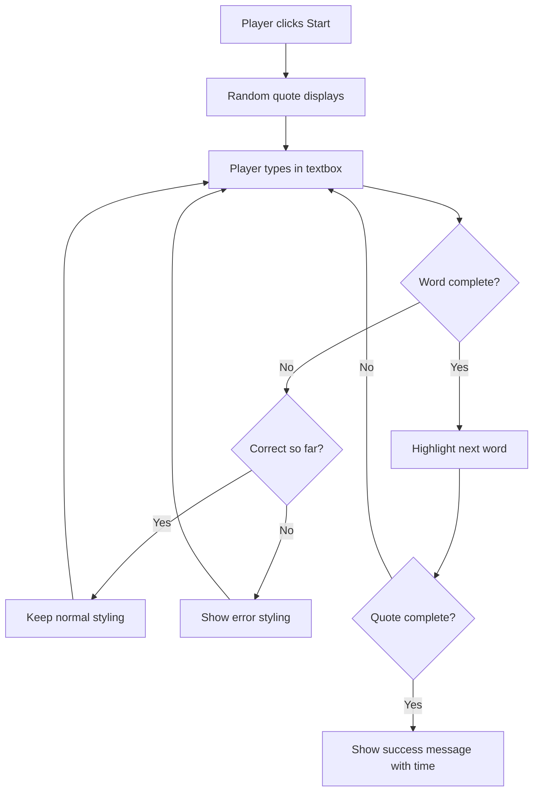
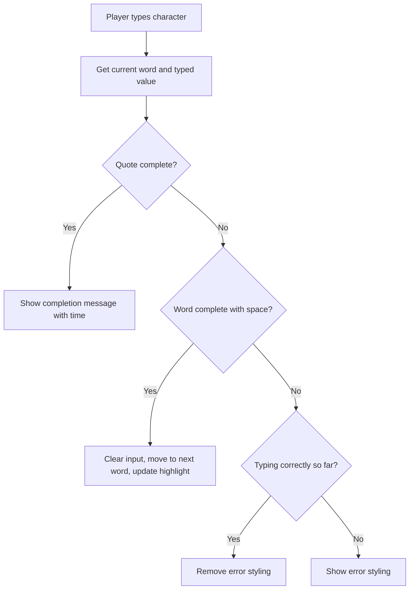

<!--
CO_OP_TRANSLATOR_METADATA:
{
  "original_hash": "e6b75e5b8caae906473a8a09d77b7121",
  "translation_date": "2025-10-23T20:29:43+00:00",
  "source_file": "4-typing-game/typing-game/README.md",
  "language_code": "el"
}
-->
# Δημιουργία παιχνιδιού με χρήση γεγονότων

Έχετε ποτέ αναρωτηθεί πώς οι ιστοσελίδες καταλαβαίνουν όταν κάνετε κλικ σε ένα κουμπί ή πληκτρολογείτε σε ένα πλαίσιο κειμένου; Αυτή είναι η μαγεία του προγραμματισμού που βασίζεται σε γεγονότα! Τι καλύτερος τρόπος να μάθετε αυτήν την απαραίτητη δεξιότητα από το να δημιουργήσετε κάτι χρήσιμο - ένα παιχνίδι ταχύτητας πληκτρολόγησης που αντιδρά σε κάθε πλήκτρο που πατάτε.

Θα δείτε από πρώτο χέρι πώς οι περιηγητές "επικοινωνούν" με τον κώδικα JavaScript σας. Κάθε φορά που κάνετε κλικ, πληκτρολογείτε ή κινείτε το ποντίκι σας, ο περιηγητής στέλνει μικρά μηνύματα (τα αποκαλούμε γεγονότα) στον κώδικά σας, και εσείς αποφασίζετε πώς να ανταποκριθείτε!

Μέχρι να τελειώσουμε εδώ, θα έχετε δημιουργήσει ένα πραγματικό παιχνίδι πληκτρολόγησης που παρακολουθεί την ταχύτητα και την ακρίβειά σας. Πιο σημαντικό, θα κατανοήσετε τις θεμελιώδεις έννοιες που τροφοδοτούν κάθε διαδραστική ιστοσελίδα που έχετε χρησιμοποιήσει ποτέ. Ας ξεκινήσουμε!

## Ερωτηματολόγιο πριν τη διάλεξη

[Ερωτηματολόγιο πριν τη διάλεξη](https://ff-quizzes.netlify.app/web/quiz/21)

## Προγραμματισμός που βασίζεται σε γεγονότα

Σκεφτείτε την αγαπημένη σας εφαρμογή ή ιστοσελίδα - τι την κάνει να φαίνεται ζωντανή και ευαίσθητη; Όλα έχουν να κάνουν με το πώς αντιδρά σε ό,τι κάνετε! Κάθε πάτημα, κλικ, σάρωση ή πληκτρολόγηση δημιουργεί αυτό που αποκαλούμε "γεγονός", και εκεί είναι που συμβαίνει η πραγματική μαγεία του προγραμματισμού για τον ιστό.

Αυτό που κάνει τον προγραμματισμό για τον ιστό τόσο ενδιαφέρον είναι ότι ποτέ δεν ξέρουμε πότε κάποιος θα κάνει κλικ σε αυτό το κουμπί ή θα αρχίσει να πληκτρολογεί σε ένα πλαίσιο κειμένου. Μπορεί να κάνει κλικ αμέσως, να περιμένει πέντε λεπτά ή ίσως να μην κάνει κλικ καθόλου! Αυτή η απρόβλεπτη φύση σημαίνει ότι πρέπει να σκεφτούμε διαφορετικά για το πώς γράφουμε τον κώδικά μας.

Αντί να γράφουμε κώδικα που εκτελείται από πάνω προς τα κάτω σαν συνταγή, γράφουμε κώδικα που περιμένει υπομονετικά να συμβεί κάτι. Είναι παρόμοιο με το πώς οι τηλεγραφικοί χειριστές του 1800 κάθονταν δίπλα στις μηχανές τους, έτοιμοι να ανταποκριθούν τη στιγμή που ένα μήνυμα περνούσε από το σύρμα.

Τι ακριβώς είναι ένα "γεγονός"; Απλά, είναι κάτι που συμβαίνει! Όταν κάνετε κλικ σε ένα κουμπί - αυτό είναι ένα γεγονός. Όταν πληκτρολογείτε ένα γράμμα - αυτό είναι ένα γεγονός. Όταν κινείτε το ποντίκι σας - αυτό είναι άλλο ένα γεγονός.

Ο προγραμματισμός που βασίζεται σε γεγονότα μας επιτρέπει να ρυθμίσουμε τον κώδικά μας να ακούει και να ανταποκρίνεται. Δημιουργούμε ειδικές συναρτήσεις που ονομάζονται **ακροατές γεγονότων** που περιμένουν υπομονετικά για συγκεκριμένα πράγματα να συμβούν και στη συνέχεια ενεργοποιούνται όταν συμβούν.

Σκεφτείτε τους ακροατές γεγονότων σαν να έχετε ένα κουδούνι για τον κώδικά σας. Ρυθμίζετε το κουδούνι (`addEventListener()`), του λέτε ποιον ήχο να ακούσει (όπως 'click' ή 'keypress') και στη συνέχεια καθορίζετε τι πρέπει να συμβεί όταν κάποιος το χτυπήσει (η προσαρμοσμένη σας συνάρτηση).

**Πώς λειτουργούν οι ακροατές γεγονότων:**
- **Ακούνε** συγκεκριμένες ενέργειες χρήστη όπως κλικ, πληκτρολογήσεις ή κινήσεις του ποντικιού
- **Εκτελούν** τον προσαρμοσμένο κώδικά σας όταν συμβεί το καθορισμένο γεγονός
- **Ανταποκρίνονται** άμεσα στις αλληλεπιδράσεις του χρήστη, δημιουργώντας μια απρόσκοπτη εμπειρία
- **Διαχειρίζονται** πολλαπλά γεγονότα στο ίδιο στοιχείο χρησιμοποιώντας διαφορετικούς ακροατές

> **NOTE:** Αξίζει να τονιστεί ότι υπάρχουν πολλοί τρόποι για να δημιουργήσετε ακροατές γεγονότων. Μπορείτε να χρησιμοποιήσετε ανώνυμες συναρτήσεις ή να δημιουργήσετε ονομασμένες. Μπορείτε να χρησιμοποιήσετε διάφορες συντομεύσεις, όπως να ορίσετε την ιδιότητα `click` ή να χρησιμοποιήσετε `addEventListener()`. Στην άσκησή μας θα επικεντρωθούμε στο `addEventListener()` και στις ανώνυμες συναρτήσεις, καθώς είναι πιθανώς η πιο κοινή τεχνική που χρησιμοποιούν οι προγραμματιστές ιστού. Είναι επίσης η πιο ευέλικτη, καθώς το `addEventListener()` λειτουργεί για όλα τα γεγονότα και το όνομα του γεγονότος μπορεί να παρέχεται ως παράμετρος.

### Συνηθισμένα γεγονότα

Ενώ οι περιηγητές ιστού προσφέρουν δεκάδες διαφορετικά γεγονότα που μπορείτε να ακούσετε, οι περισσότερες διαδραστικές εφαρμογές βασίζονται μόνο σε μια χούφτα βασικών γεγονότων. Η κατανόηση αυτών των βασικών γεγονότων θα σας δώσει τη βάση για να δημιουργήσετε εξελιγμένες αλληλεπιδράσεις χρήστη.

Υπάρχουν [δεκάδες γεγονότα](https://developer.mozilla.org/docs/Web/Events) διαθέσιμα για να ακούσετε όταν δημιουργείτε μια εφαρμογή. Ουσιαστικά, οτιδήποτε κάνει ένας χρήστης σε μια σελίδα δημιουργεί ένα γεγονός, το οποίο σας δίνει μεγάλη δύναμη να εξασφαλίσετε ότι θα έχουν την εμπειρία που επιθυμείτε. Ευτυχώς, συνήθως χρειάζεστε μόνο μια μικρή χούφτα γεγονότων. Εδώ είναι μερικά συνηθισμένα (συμπεριλαμβανομένων των δύο που θα χρησιμοποιήσουμε όταν δημιουργούμε το παιχνίδι μας):

| Γεγονός | Περιγραφή | Συνηθισμένες Χρήσεις |
|---------|-----------|----------------------|
| `click` | Ο χρήστης έκανε κλικ σε κάτι | Κουμπιά, συνδέσμους, διαδραστικά στοιχεία |
| `contextmenu` | Ο χρήστης έκανε δεξί κλικ | Προσαρμοσμένα μενού δεξιού κλικ |
| `select` | Ο χρήστης επισήμανε κάποιο κείμενο | Επεξεργασία κειμένου, λειτουργίες αντιγραφής |
| `input` | Ο χρήστης εισήγαγε κάποιο κείμενο | Επικύρωση φόρμας, αναζήτηση σε πραγματικό χρόνο |

**Κατανόηση αυτών των τύπων γεγονότων:**
- **Ενεργοποιούνται** όταν οι χρήστες αλληλεπιδρούν με συγκεκριμένα στοιχεία στη σελίδα σας
- **Παρέχουν** λεπτομερείς πληροφορίες για την ενέργεια του χρήστη μέσω αντικειμένων γεγονότων
- **Επιτρέπουν** τη δημιουργία ευαίσθητων, διαδραστικών εφαρμογών ιστού
- **Λειτουργούν** με συνέπεια σε διαφορετικούς περιηγητές και συσκευές

## Δημιουργία του παιχνιδιού

Τώρα που κατανοείτε πώς λειτουργούν τα γεγονότα, ας εφαρμόσουμε αυτήν τη γνώση δημιουργώντας κάτι χρήσιμο. Θα δημιουργήσουμε ένα παιχνίδι ταχύτητας πληκτρολόγησης που δείχνει τη διαχείριση γεγονότων ενώ σας βοηθά να αναπτύξετε μια σημαντική δεξιότητα προγραμματιστή.

Θα δημιουργήσουμε ένα παιχνίδι για να εξερευνήσουμε πώς λειτουργούν τα γεγονότα στη JavaScript. Το παιχνίδι μας θα δοκιμάσει την ικανότητα πληκτρολόγησης ενός παίκτη, η οποία είναι μία από τις πιο υποτιμημένες δεξιότητες που πρέπει να έχουν όλοι οι προγραμματιστές. Διασκεδαστικό γεγονός: η διάταξη πληκτρολογίου QWERTY που χρησιμοποιούμε σήμερα σχεδιάστηκε τη δεκαετία του 1870 για γραφομηχανές - και οι καλές δεξιότητες πληκτρολόγησης είναι εξίσου πολύτιμες για τους προγραμματιστές σήμερα! Η γενική ροή του παιχνιδιού θα μοιάζει με αυτή:



**Πώς θα λειτουργεί το παιχνίδι μας:**
- **Ξεκινά** όταν ο παίκτης κάνει κλικ στο κουμπί έναρξης και εμφανίζει μια τυχαία φράση
- **Παρακολουθεί** την πρόοδο πληκτρολόγησης του παίκτη λέξη προς λέξη σε πραγματικό χρόνο
- **Επισημαίνει** την τρέχουσα λέξη για να καθοδηγήσει την εστίαση του παίκτη
- **Παρέχει** άμεση οπτική ανατροφοδότηση για λάθη πληκτρολόγησης
- **Υπολογίζει** και εμφανίζει τον συνολικό χρόνο όταν ολοκληρωθεί η φράση

Ας δημιουργήσουμε το παιχνίδι μας και ας μάθουμε για τα γεγονότα!

### Δομή αρχείων

Πριν ξεκινήσουμε την κωδικοποίηση, ας οργανωθούμε! Έχοντας μια καθαρή δομή αρχείων από την αρχή θα σας γλιτώσει από πονοκεφάλους αργότερα και θα κάνει το πρότζεκτ σας πιο επαγγελματικό. 😊

Θα κρατήσουμε τα πράγματα απλά με μόνο τρία αρχεία: `index.html` για τη δομή της σελίδας μας, `script.js` για όλη τη λογική του παιχνιδιού μας και `style.css` για να κάνουμε τα πάντα να φαίνονται υπέροχα. Αυτή είναι η κλασική τριάδα που τροφοδοτεί το μεγαλύτερο μέρος του ιστού!

**Δημιουργήστε έναν νέο φάκελο για τη δουλειά σας ανοίγοντας μια κονσόλα ή παράθυρο τερματικού και εκτελώντας την ακόλουθη εντολή:**

```bash
# Linux or macOS
mkdir typing-game && cd typing-game

# Windows
md typing-game && cd typing-game
```

**Τι κάνουν αυτές οι εντολές:**
- **Δημιουργούν** έναν νέο κατάλογο με το όνομα `typing-game` για τα αρχεία του πρότζεκτ σας
- **Μεταβαίνουν** αυτόματα στον νεοδημιουργημένο κατάλογο
- **Ρυθμίζουν** έναν καθαρό χώρο εργασίας για την ανάπτυξη του παιχνιδιού σας

**Ανοίξτε το Visual Studio Code:**

```bash
code .
```

**Αυτή η εντολή:**
- **Εκκινεί** το Visual Studio Code στον τρέχοντα κατάλογο
- **Ανοίγει** τον φάκελο του πρότζεκτ σας στον επεξεργαστή
- **Παρέχει** πρόσβαση σε όλα τα εργαλεία ανάπτυξης που θα χρειαστείτε

**Προσθέστε τρία αρχεία στον φάκελο στο Visual Studio Code με τα εξής ονόματα:**
- `index.html` - Περιέχει τη δομή και το περιεχόμενο του παιχνιδιού σας
- `script.js` - Διαχειρίζεται όλη τη λογική του παιχνιδιού και τους ακροατές γεγονότων
- `style.css` - Ορίζει την οπτική εμφάνιση και το στυλ

## Δημιουργία του περιβάλλοντος χρήστη

Τώρα ας δημιουργήσουμε τη σκηνή όπου θα συμβεί όλη η δράση του παιχνιδιού μας! Σκεφτείτε το σαν να σχεδιάζετε τον πίνακα ελέγχου για ένα διαστημόπλοιο - πρέπει να βεβαιωθούμε ότι όλα όσα χρειάζονται οι παίκτες μας είναι εκεί που τα περιμένουν.

Ας καταλάβουμε τι χρειάζεται πραγματικά το παιχνίδι μας. Αν παίζατε ένα παιχνίδι πληκτρολόγησης, τι θα θέλατε να δείτε στην οθόνη; Εδώ είναι τι θα χρειαστούμε:

| Στοιχείο UI | Σκοπός | Στοιχείο HTML |
|-------------|--------|---------------|
| Εμφάνιση Φράσης | Εμφανίζει το κείμενο προς πληκτρολόγηση | `<p>` με `id="quote"` |
| Περιοχή Μηνυμάτων | Εμφανίζει μηνύματα κατάστασης και επιτυχίας | `<p>` με `id="message"` |
| Εισαγωγή Κειμένου | Όπου οι παίκτες πληκτρολογούν τη φράση | `<input>` με `id="typed-value"` |
| Κουμπί Έναρξης | Ξεκινά το παιχνίδι | `<button>` με `id="start"` |

**Κατανόηση της δομής του UI:**
- **Οργανώνει** το περιεχόμενο λογικά από πάνω προς τα κάτω
- **Αναθέτει** μοναδικά IDs στα στοιχεία για στόχευση μέσω JavaScript
- **Παρέχει** σαφή οπτική ιεραρχία για καλύτερη εμπειρία χρήστη
- **Περιλαμβάνει** σημασιολογικά στοιχεία HTML για προσβασιμότητα

Καθένα από αυτά θα χρειαστεί IDs ώστε να μπορούμε να δουλέψουμε μαζί τους στη JavaScript μας. Θα προσθέσουμε επίσης αναφορές στα αρχεία CSS και JavaScript που πρόκειται να δημιουργήσουμε.

Δημιουργήστε ένα νέο αρχείο με όνομα `index.html`. Προσθέστε το ακόλουθο HTML:

```html
<!-- inside index.html -->
<html>
<head>
  <title>Typing game</title>
  <link rel="stylesheet" href="style.css">
</head>
<body>
  <h1>Typing game!</h1>
  <p>Practice your typing skills with a quote from Sherlock Holmes. Click **start** to begin!</p>
  <p id="quote"></p> <!-- This will display our quote -->
  <p id="message"></p> <!-- This will display any status messages -->
  <div>
    <input type="text" aria-label="current word" id="typed-value" /> <!-- The textbox for typing -->
    <button type="button" id="start">Start</button> <!-- To start the game -->
  </div>
  <script src="script.js"></script>
</body>
</html>
```

**Ανάλυση του τι επιτυγχάνει αυτή η δομή HTML:**
- **Συνδέει** το CSS stylesheet στο `<head>` για στυλ
- **Δημιουργεί** έναν σαφή τίτλο και οδηγίες για τους χρήστες
- **Καθιερώνει** παραγράφους placeholder με συγκεκριμένα IDs για δυναμικό περιεχόμενο
- **Περιλαμβάνει** ένα πεδίο εισαγωγής με χαρακτηριστικά προσβασιμότητας
- **Παρέχει** ένα κουμπί έναρξης για την ενεργοποίηση του παιχνιδιού
- **Φορτώνει** το αρχείο JavaScript στο τέλος για βέλτιστη απόδοση

### Εκκίνηση της εφαρμογής

Η συχνή δοκιμή της εφαρμογής σας κατά την ανάπτυξη σας βοηθά να εντοπίσετε προβλήματα νωρίς και να δείτε την πρόοδό σας σε πραγματικό χρόνο. Το Live Server είναι ένα ανεκτίμητο εργαλείο που ανανεώνει αυτόματα τον περιηγητή σας κάθε φορά που αποθηκεύετε αλλαγές, κάνοντας την ανάπτυξη πολύ πιο αποτελεσματική.

Είναι πάντα καλύτερο να αναπτύσσετε επαναληπτικά για να δείτε πώς φαίνονται τα πράγματα. Ας εκκινήσουμε την εφαρμογή μας. Υπάρχει μια υπέροχη επέκταση για το Visual Studio Code που ονομάζεται [Live Server](https://marketplace.visualstudio.com/items?itemName=ritwickdey.LiveServer&WT.mc_id=academic-77807-sagibbon) η οποία θα φιλοξενήσει την εφαρμογή σας τοπικά και θα ανανεώσει τον περιηγητή κάθε φορά που αποθηκεύετε.

**Εγκαταστήστε το [Live Server](https://marketplace.visualstudio.com/items?itemName=ritwickdey.LiveServer&WT.mc_id=academic-77807-sagibbon) ακολουθώντας τον σύνδεσμο και κάνοντας κλικ στο Install:**

**Τι συμβαίνει κατά την εγκατάσταση:**
- **Προτρέπει** τον περιηγητή σας να ανοίξει το Visual Studio Code
- **Καθοδηγεί** τη διαδικασία εγκατάστασης της επέκτασης
- **Μπορεί να απαιτεί** επανεκκίνηση του Visual Studio Code για την ολοκλήρωση της εγκατάστασης

**Μόλις εγκατασταθεί, στο Visual Studio Code, κάντε κλικ Ctrl-Shift-P (ή Cmd-Shift-P) για να ανοίξετε την παλέτα εντολών:**

**Κατανόηση της παλέτας εντολών:**
- **Παρέχει** γρήγορη πρόσβαση σε όλες τις εντολές του VS Code
- **Αναζητά** εντολές καθώς πληκτρολογείτε
- **Προσφέρει** συντομεύσεις πληκτρολογίου για ταχύτερη ανάπτυξη

**Πληκτρολογήστε "Live Server: Open with Live Server":**

**Τι κάνει το Live Server:**
- **Εκκινεί** έναν τοπικό διακομιστή ανάπτυξης για το πρότζεκτ σας
- **Ανανεώνει αυτόματα** τον περιηγητή όταν αποθηκεύετε αρχεία
- **Εξυπηρετεί** τα αρχεία σας από μια τοπική διεύθυνση URL (συνήθως `localhost:5500`)

**Ανοίξτε έναν περιηγ
| Πίνακας αποσπασμάτων | Αποθήκευση όλων των πιθανών αποσπασμάτων για το παιχνίδι | `['Απόσπασμα 1', 'Απόσπασμα 2', ...]` |
| Πίνακας λέξεων | Διαχωρισμός του τρέχοντος αποσπάσματος σε μεμονωμένες λέξεις | `['Όταν', 'έχεις', '...']` |
| Δείκτης λέξεων | Παρακολούθηση της λέξης που πληκτρολογεί ο παίκτης | `0, 1, 2, 3...` |
| Ώρα έναρξης | Υπολογισμός του χρόνου που πέρασε για την βαθμολογία | `Date.now()` |

**Θα χρειαστούμε επίσης αναφορές στα στοιχεία του UI μας:**
| Στοιχείο | ID | Σκοπός |
|---------|----|---------|
| Εισαγωγή κειμένου | `typed-value` | Πού πληκτρολογούν οι παίκτες |
| Εμφάνιση αποσπάσματος | `quote` | Εμφανίζει το απόσπασμα για πληκτρολόγηση |
| Περιοχή μηνυμάτων | `message` | Εμφανίζει ενημερώσεις κατάστασης |

```javascript
// inside script.js
// all of our quotes
const quotes = [
    'When you have eliminated the impossible, whatever remains, however improbable, must be the truth.',
    'There is nothing more deceptive than an obvious fact.',
    'I ought to know by this time that when a fact appears to be opposed to a long train of deductions it invariably proves to be capable of bearing some other interpretation.',
    'I never make exceptions. An exception disproves the rule.',
    'What one man can invent another can discover.',
    'Nothing clears up a case so much as stating it to another person.',
    'Education never ends, Watson. It is a series of lessons, with the greatest for the last.',
];
// store the list of words and the index of the word the player is currently typing
let words = [];
let wordIndex = 0;
// the starting time
let startTime = Date.now();
// page elements
const quoteElement = document.getElementById('quote');
const messageElement = document.getElementById('message');
const typedValueElement = document.getElementById('typed-value');
```

**Ανάλυση του τι επιτυγχάνει αυτός ο κώδικας:**
- **Αποθηκεύει** έναν πίνακα αποσπασμάτων του Σέρλοκ Χολμς χρησιμοποιώντας `const`, καθώς τα αποσπάσματα δεν θα αλλάξουν
- **Αρχικοποιεί** μεταβλητές παρακολούθησης με `let`, καθώς αυτές οι τιμές θα ενημερώνονται κατά τη διάρκεια του παιχνιδιού
- **Καταγράφει** αναφορές σε στοιχεία DOM χρησιμοποιώντας `document.getElementById()` για αποτελεσματική πρόσβαση
- **Θέτει** τη βάση για όλη τη λειτουργικότητα του παιχνιδιού με σαφή και περιγραφικά ονόματα μεταβλητών
- **Οργανώνει** σχετικά δεδομένα και στοιχεία λογικά για ευκολότερη συντήρηση του κώδικα

✅ Προσθέστε περισσότερα αποσπάσματα στο παιχνίδι σας

> 💡 **Συμβουλή**: Μπορούμε να ανακτήσουμε τα στοιχεία όποτε θέλουμε στον κώδικα χρησιμοποιώντας `document.getElementById()`. Επειδή θα αναφερόμαστε σε αυτά τα στοιχεία τακτικά, θα αποφύγουμε τα τυπογραφικά λάθη με σταθερές συμβολοσειρές. Πλαίσια όπως το [Vue.js](https://vuejs.org/) ή το [React](https://reactjs.org/) μπορούν να σας βοηθήσουν να διαχειριστείτε καλύτερα την κεντρικοποίηση του κώδικα σας.
>
**Γιατί αυτή η προσέγγιση λειτουργεί τόσο καλά:**
- **Αποτρέπει** ορθογραφικά λάθη όταν αναφερόμαστε σε στοιχεία πολλές φορές
- **Βελτιώνει** την αναγνωσιμότητα του κώδικα με περιγραφικά ονόματα σταθερών
- **Επιτρέπει** καλύτερη υποστήριξη από το IDE με αυτόματη συμπλήρωση και έλεγχο σφαλμάτων
- **Κάνει** την αναδιάρθρωση ευκολότερη αν αλλάξουν τα IDs των στοιχείων αργότερα

Δείτε ένα βίντεο για τη χρήση των `const`, `let` και `var`

[](https://youtube.com/watch?v=JNIXfGiDWM8 "Τύποι μεταβλητών")

> 🎥 Κάντε κλικ στην εικόνα παραπάνω για ένα βίντεο σχετικά με τις μεταβλητές.

### Προσθέστε λογική έναρξης

Εδώ είναι που όλα συνδέονται! 🚀 Ετοιμάζεστε να γράψετε τον πρώτο σας πραγματικό ακροατή συμβάντων, και υπάρχει κάτι πολύ ικανοποιητικό στο να βλέπετε τον κώδικα σας να ανταποκρίνεται σε ένα κλικ κουμπιού.

Σκεφτείτε το: κάπου εκεί έξω, ένας παίκτης θα κάνει κλικ στο κουμπί "Έναρξη", και ο κώδικας σας πρέπει να είναι έτοιμος γι' αυτόν. Δεν έχουμε ιδέα πότε θα το κάνει - μπορεί να είναι αμέσως, μπορεί να είναι αφού πάρει έναν καφέ - αλλά όταν το κάνει, το παιχνίδι σας ζωντανεύει.

Όταν ο χρήστης κάνει κλικ στο `start`, πρέπει να επιλέξουμε ένα απόσπασμα, να ρυθμίσουμε τη διεπαφή χρήστη και να ρυθμίσουμε την παρακολούθηση για την τρέχουσα λέξη και το χρονισμό. Παρακάτω είναι ο JavaScript κώδικας που πρέπει να προσθέσετε. Συζητάμε τον κώδικα αμέσως μετά το μπλοκ του script.

```javascript
// at the end of script.js
document.getElementById('start').addEventListener('click', () => {
  // get a quote
  const quoteIndex = Math.floor(Math.random() * quotes.length);
  const quote = quotes[quoteIndex];
  // Put the quote into an array of words
  words = quote.split(' ');
  // reset the word index for tracking
  wordIndex = 0;

  // UI updates
  // Create an array of span elements so we can set a class
  const spanWords = words.map(function(word) { return `<span>${word} </span>`});
  // Convert into string and set as innerHTML on quote display
  quoteElement.innerHTML = spanWords.join('');
  // Highlight the first word
  quoteElement.childNodes[0].className = 'highlight';
  // Clear any prior messages
  messageElement.innerText = '';

  // Setup the textbox
  // Clear the textbox
  typedValueElement.value = '';
  // set focus
  typedValueElement.focus();
  // set the event handler

  // Start the timer
  startTime = new Date().getTime();
});
```

**Ας αναλύσουμε τον κώδικα σε λογικές ενότητες:**

**📊 Ρύθμιση παρακολούθησης λέξεων:**
- **Επιλέγει** ένα τυχαίο απόσπασμα χρησιμοποιώντας `Math.floor()` και `Math.random()` για ποικιλία
- **Μετατρέπει** το απόσπασμα σε πίνακα μεμονωμένων λέξεων χρησιμοποιώντας `split(' ')`
- **Μηδενίζει** το `wordIndex` καθώς οι παίκτες ξεκινούν με την πρώτη λέξη
- **Προετοιμάζει** την κατάσταση του παιχνιδιού για έναν νέο γύρο

**🎨 Ρύθμιση και εμφάνιση UI:**
- **Δημιουργεί** έναν πίνακα στοιχείων `<span>`, τυλίγοντας κάθε λέξη για μεμονωμένη μορφοποίηση
- **Συνδέει** τα στοιχεία span σε μία συμβολοσειρά για αποτελεσματική ενημέρωση του DOM
- **Τονίζει** την πρώτη λέξη προσθέτοντας την κλάση CSS `highlight`
- **Καθαρίζει** τυχόν προηγούμενα μηνύματα παιχνιδιού για να παρέχει καθαρό ξεκίνημα

**⌨️ Προετοιμασία πεδίου εισαγωγής:**
- **Καθαρίζει** τυχόν υπάρχον κείμενο στο πεδίο εισαγωγής
- **Εστιάζει** στο πεδίο εισαγωγής ώστε οι παίκτες να μπορούν να ξεκινήσουν να πληκτρολογούν αμέσως
- **Προετοιμάζει** την περιοχή εισαγωγής για τη νέα συνεδρία παιχνιδιού

**⏱️ Αρχικοποίηση χρονομέτρου:**
- **Καταγράφει** την τρέχουσα χρονική σήμανση χρησιμοποιώντας `new Date().getTime()`
- **Επιτρέπει** ακριβή υπολογισμό της ταχύτητας πληκτρολόγησης και του χρόνου ολοκλήρωσης
- **Ξεκινά** την παρακολούθηση απόδοσης για τη συνεδρία παιχνιδιού

### Προσθέστε λογική πληκτρολόγησης

Εδώ αντιμετωπίζουμε την καρδιά του παιχνιδιού μας! Μην ανησυχείτε αν αυτό φαίνεται πολύ στην αρχή - θα περάσουμε από κάθε κομμάτι, και στο τέλος θα δείτε πόσο λογικό είναι.

Αυτό που χτίζουμε εδώ είναι αρκετά εξελιγμένο: κάθε φορά που κάποιος πληκτρολογεί ένα γράμμα, ο κώδικας μας θα ελέγχει τι πληκτρολόγησε, θα του δίνει ανατροφοδότηση και θα αποφασίζει τι πρέπει να συμβεί στη συνέχεια. Είναι παρόμοιο με το πώς οι πρώτοι επεξεργαστές κειμένου όπως το WordStar τη δεκαετία του 1970 παρείχαν ανατροφοδότηση σε πραγματικό χρόνο στους δακτυλογράφους.

```javascript
// at the end of script.js
typedValueElement.addEventListener('input', () => {
  // Get the current word
  const currentWord = words[wordIndex];
  // get the current value
  const typedValue = typedValueElement.value;

  if (typedValue === currentWord && wordIndex === words.length - 1) {
    // end of sentence
    // Display success
    const elapsedTime = new Date().getTime() - startTime;
    const message = `CONGRATULATIONS! You finished in ${elapsedTime / 1000} seconds.`;
    messageElement.innerText = message;
  } else if (typedValue.endsWith(' ') && typedValue.trim() === currentWord) {
    // end of word
    // clear the typedValueElement for the new word
    typedValueElement.value = '';
    // move to the next word
    wordIndex++;
    // reset the class name for all elements in quote
    for (const wordElement of quoteElement.childNodes) {
      wordElement.className = '';
    }
    // highlight the new word
    quoteElement.childNodes[wordIndex].className = 'highlight';
  } else if (currentWord.startsWith(typedValue)) {
    // currently correct
    // highlight the next word
    typedValueElement.className = '';
  } else {
    // error state
    typedValueElement.className = 'error';
  }
});
```

**Κατανόηση της ροής λογικής πληκτρολόγησης:**

Αυτή η λειτουργία χρησιμοποιεί μια προσέγγιση καταρράκτη, ελέγχοντας συνθήκες από τις πιο συγκεκριμένες στις πιο γενικές. Ας αναλύσουμε κάθε σενάριο:



**🏁 Ολοκλήρωση αποσπάσματος (Σενάριο 1):**
- **Ελέγχει** αν η πληκτρολογημένη τιμή ταιριάζει με την τρέχουσα λέξη ΚΑΙ αν βρισκόμαστε στην τελευταία λέξη
- **Υπολογίζει** τον χρόνο που πέρασε αφαιρώντας την ώρα έναρξης από την τρέχουσα ώρα
- **Μετατρέπει** τα χιλιοστά του δευτερολέπτου σε δευτερόλεπτα διαιρώντας με το 1.000
- **Εμφανίζει** μήνυμα συγχαρητηρίων με τον χρόνο ολοκλήρωσης

**✅ Ολοκλήρωση λέξης (Σενάριο 2):**
- **Ανιχνεύει** την ολοκλήρωση λέξης όταν η εισαγωγή τελειώνει με ένα κενό
- **Επικυρώνει** ότι η περικομμένη εισαγωγή ταιριάζει ακριβώς με την τρέχουσα λέξη
- **Καθαρίζει** το πεδίο εισαγωγής για την επόμενη λέξη
- **Προχωρά** στην επόμενη λέξη αυξάνοντας το `wordIndex`
- **Ενημερώνει** την οπτική επισήμανση αφαιρώντας όλες τις κλάσεις και τονίζοντας τη νέα λέξη

**📝 Πληκτρολόγηση σε εξέλιξη (Σενάριο 3):**
- **Επαληθεύει** ότι η τρέχουσα λέξη ξεκινά με ό,τι έχει πληκτρολογηθεί μέχρι στιγμής
- **Αφαιρεί** οποιαδήποτε μορφοποίηση σφάλματος για να δείξει ότι η εισαγωγή είναι σωστή
- **Επιτρέπει** τη συνέχιση της πληκτρολόγησης χωρίς διακοπή

**❌ Κατάσταση σφάλματος (Σενάριο 4):**
- **Ενεργοποιείται** όταν το πληκτρολογημένο κείμενο δεν ταιριάζει με την αρχή της αναμενόμενης λέξης
- **Εφαρμόζει** την κλάση CSS σφάλματος για να παρέχει άμεση οπτική ανατροφοδότηση
- **Βοηθά** τους παίκτες να εντοπίσουν και να διορθώσουν γρήγορα τα λάθη

## Δοκιμάστε την εφαρμογή σας

Δείτε τι έχετε καταφέρει! 🎉 Μόλις δημιουργήσατε ένα πραγματικό, λειτουργικό παιχνίδι πληκτρολόγησης από το μηδέν χρησιμοποιώντας προγραμματισμό με βάση τα συμβάντα. Αφιερώστε λίγο χρόνο για να το εκτιμήσετε - αυτό δεν είναι μικρό κατόρθωμα!

Τώρα έρχεται η φάση της δοκιμής! Θα λειτουργήσει όπως αναμένεται; Μήπως χάσαμε κάτι; Να θυμάστε: αν κάτι δεν λειτουργεί τέλεια από την αρχή, αυτό είναι απολύτως φυσιολογικό. Ακόμα και έμπειροι προγραμματιστές βρίσκουν συχνά σφάλματα στον κώδικα τους. Είναι μέρος της διαδικασίας ανάπτυξης!

Κάντε κλικ στο `start` και αρχίστε να πληκτρολογείτε! Θα πρέπει να μοιάζει λίγο με την κινούμενη εικόνα που είδαμε πριν.


**Τι να δοκιμάσετε στην εφαρμογή σας:**
- **Επαληθεύει** ότι το κλικ στο Start εμφανίζει ένα τυχαίο απόσπασμα
- **Επιβεβαιώνει** ότι η πληκτρολόγηση τονίζει σωστά την τρέχουσα λέξη
- **Ελέγχει** ότι η μορφοποίηση σφάλματος εμφανίζεται για λανθασμένη πληκτρολόγηση
- **Εξασφαλίζει** ότι η ολοκλήρωση λέξεων προχωρά σωστά την επισήμανση
- **Δοκιμάζει** ότι η ολοκλήρωση του αποσπάσματος εμφανίζει το μήνυμα ολοκλήρωσης με τον χρόνο

**Συνηθισμένες συμβουλές αποσφαλμάτωσης:**
- **Ελέγξτε** την κονσόλα του προγράμματος περιήγησης (F12) για σφάλματα JavaScript
- **Επαληθεύστε** ότι όλα τα ονόματα αρχείων ταιριάζουν ακριβώς (ευαίσθητα σε πεζά-κεφαλαία)
- **Βεβαιωθείτε** ότι ο Live Server λειτουργεί και ανανεώνεται σωστά
- **Δοκιμάστε** διαφορετικά αποσπάσματα για να επαληθεύσετε ότι η τυχαία επιλογή λειτουργεί

---

## Πρόκληση GitHub Copilot Agent 🎮

Χρησιμοποιήστε τη λειτουργία Agent για να ολοκληρώσετε την παρακάτω πρόκληση:

**Περιγραφή:** Επεκτείνετε το παιχνίδι πληκτρολόγησης προσθέτοντας ένα σύστημα δυσκολίας που προσαρμόζει το παιχνίδι με βάση την απόδοση του παίκτη. Αυτή η πρόκληση θα σας βοηθήσει να εξασκηθείτε σε προηγμένη διαχείριση συμβάντων, ανάλυση δεδομένων και δυναμικές ενημερώσεις UI.

**Προτροπή:** Δημιουργήστε ένα σύστημα προσαρμογής δυσκολίας για το παιχνίδι πληκτρολόγησης που:
1. Παρακολουθεί την ταχύτητα πληκτρολόγησης του παίκτη (λέξεις ανά λεπτό) και το ποσοστό ακρίβειας
2. Προσαρμόζεται αυτόματα σε τρία επίπεδα δυσκολίας: Εύκολο (απλά αποσπάσματα), Μεσαίο (τρέχοντα αποσπάσματα), Δύσκολο (σύνθετα αποσπάσματα με σημεία στίξης)
3. Εμφανίζει το τρέχον επίπεδο δυσκολίας και τα στατιστικά του παίκτη στο UI
4. Εφαρμόζει έναν μετρητή επιτυχιών που αυξάνει τη δυσκολία μετά από 3 συνεχόμενες καλές επιδόσεις
5. Προσθέτει οπτική ανατροφοδότηση (χρώματα, κινούμενα σχέδια) για να υποδεικνύει αλλαγές δυσκολίας

Προσθέστε τα απαραίτητα στοιχεία HTML, στυλ CSS και λειτουργίες JavaScript για να υλοποιήσετε αυτήν τη δυνατότητα. Συμπεριλάβετε σωστή διαχείριση σφαλμάτων και βεβαιωθείτε ότι το παιχνίδι παραμένει προσβάσιμο με κατάλληλες ετικέτες ARIA.

Μάθετε περισσότερα για τη [λειτουργία agent](https://code.visualstudio.com/blogs/2025/02/24/introducing-copilot-agent-mode) εδώ.

## 🚀 Πρόκληση

Έτοιμοι να πάτε το παιχνίδι πληκτρολόγησης σας στο επόμενο επίπεδο; Δοκιμάστε να υλοποιήσετε αυτές τις προηγμένες δυνατότητες για να εμβαθύνετε την κατανόησή σας στη διαχείριση συμβάντων και τη χειραγώγηση του DOM:

**Προσθέστε περισσότερη λειτουργικότητα:**

| Δυνατότητα | Περιγραφή | Δεξιότητες που θα εξασκήσετε |
|---------|-------------|------------------------|
| **Έλεγχος Εισαγωγής** | Απενεργοποιήστε τον ακροατή συμβάντων `input` κατά την ολοκλήρωση και ενεργοποιήστε τον ξανά όταν πατηθεί το κουμπί | Διαχείριση συμβάντων και έλεγχος κατάστασης |
| **Διαχείριση Κατάστασης UI** | Απενεργοποιήστε το πεδίο εισαγωγής όταν ο παίκτης ολοκληρώσει το απόσπασμα | Χειραγώγηση ιδιοτήτων DOM |
| **Πλαίσιο Διαλόγου** | Εμφανίστε ένα πλαίσιο διαλόγου με το μήνυμα επιτυχίας | Προηγμένα μοτίβα UI και προσβασιμότητα |
| **Σύστημα Υψηλής Βαθμολογίας** | Αποθηκεύστε υψηλές βαθμολογίες χρησιμοποιώντας `localStorage` | APIs αποθήκευσης προγράμματος περιήγησης και διατήρηση δεδομένων |

**Συμβουλές υλοποίησης:**
- **Ερευνήστε** το `localStorage.setItem()` και το `localStorage.getItem()` για μόνιμη αποθήκευση
- **Εξασκηθείτε** στην προσθήκη και αφαίρεση ακροατών συμβάντων δυναμικά
- **Εξερευνήστε** στοιχεία διαλόγου HTML ή μοτίβα modal CSS
- **Σκεφτείτε** την προσβασιμότητα κατά την απενεργοποίηση και ενεργοποίηση των στοιχείων φόρμας

## Κουίζ μετά τη διάλεξη

[Κουίζ μετά τη διάλεξη](https://ff-quizzes.netlify.app/web/quiz/22)

## Ανασκόπηση & Αυτομελέτη

Διαβάστε για [όλα τα διαθέσιμα συμβάντα](https://developer.mozilla.org/docs/Web/Events) στον προγραμματιστή

---

**Αποποίηση ευθύνης**:  
Αυτό το έγγραφο έχει μεταφραστεί χρησιμοποιώντας την υπηρεσία αυτόματης μετάφρασης [Co-op Translator](https://github.com/Azure/co-op-translator). Παρόλο που καταβάλλουμε προσπάθειες για ακρίβεια, παρακαλούμε να έχετε υπόψη ότι οι αυτόματες μεταφράσεις ενδέχεται να περιέχουν λάθη ή ανακρίβειες. Το πρωτότυπο έγγραφο στη μητρική του γλώσσα θα πρέπει να θεωρείται η αυθεντική πηγή. Για κρίσιμες πληροφορίες, συνιστάται επαγγελματική ανθρώπινη μετάφραση. Δεν φέρουμε ευθύνη για τυχόν παρεξηγήσεις ή εσφαλμένες ερμηνείες που προκύπτουν από τη χρήση αυτής της μετάφρασης.