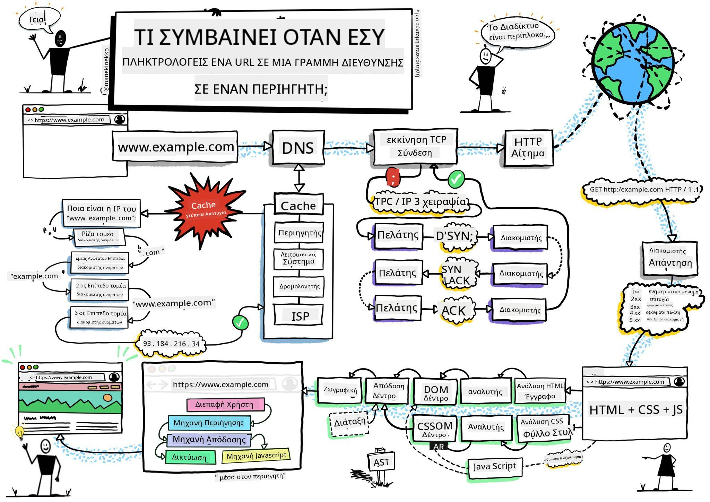
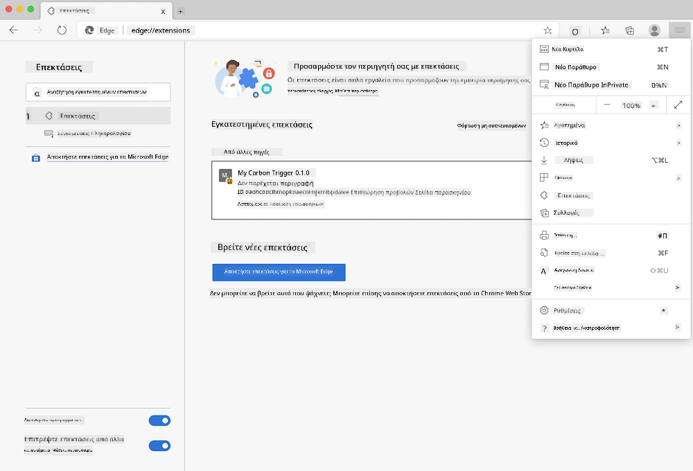
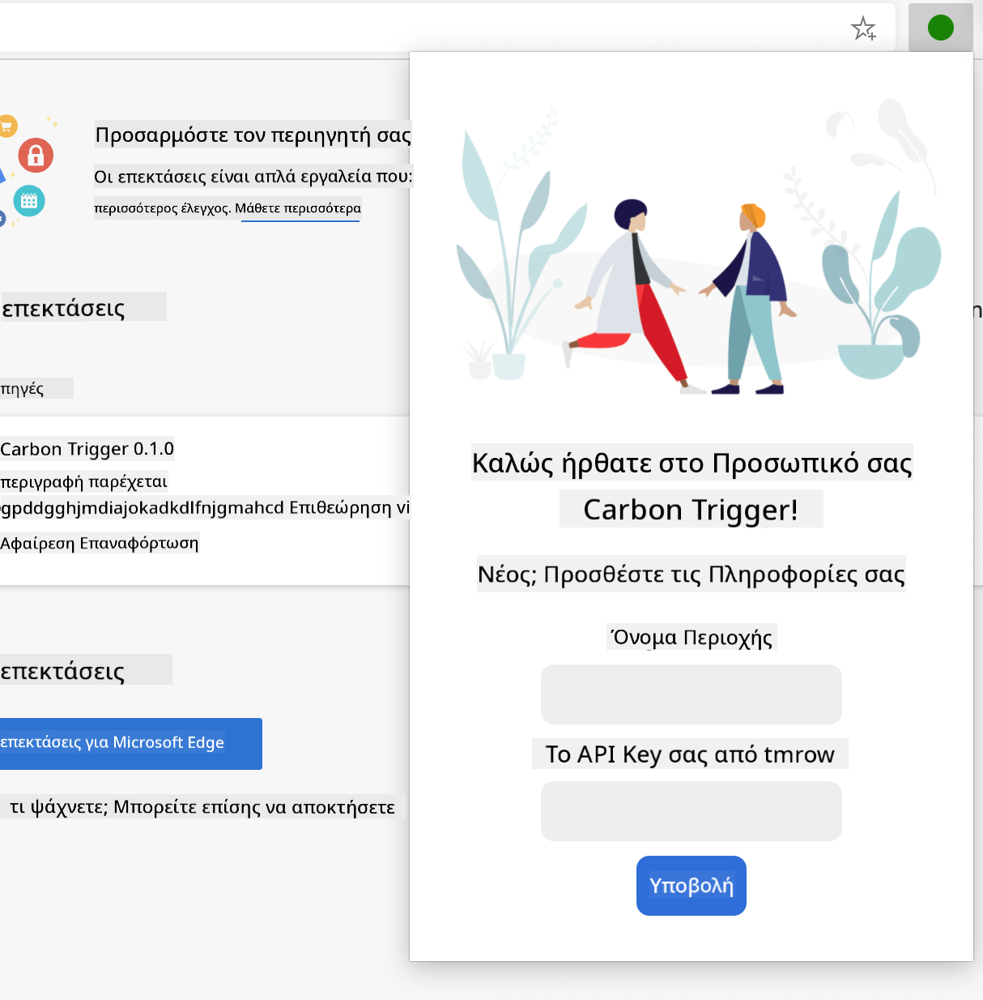
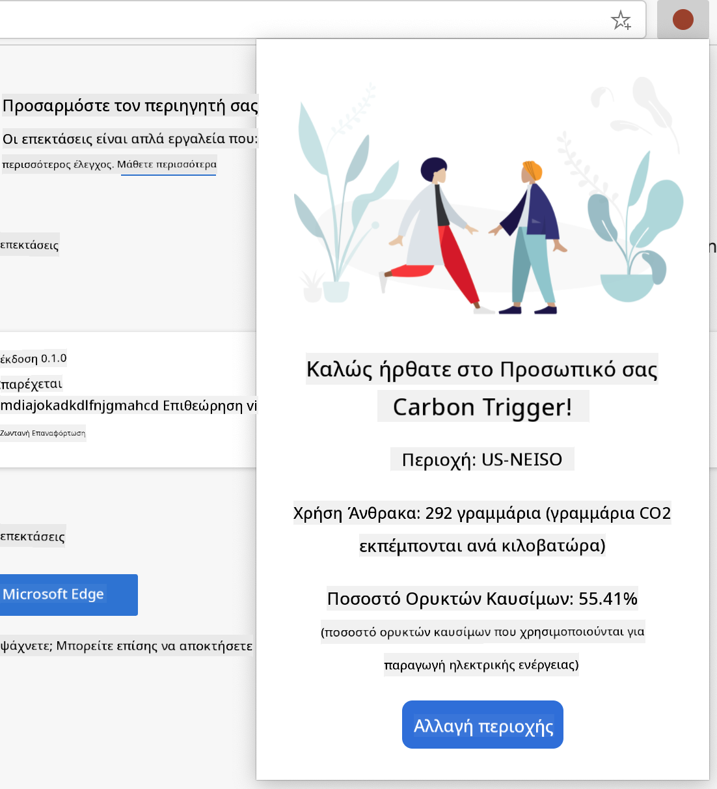

<!--
CO_OP_TRANSLATOR_METADATA:
{
  "original_hash": "2326d04e194a10aa760b51f5e5a1f61d",
  "translation_date": "2025-08-29T07:04:56+00:00",
  "source_file": "5-browser-extension/1-about-browsers/README.md",
  "language_code": "el"
}
-->
# Έργο Επέκτασης Περιηγητή Μέρος 1: Όλα για τους Περιηγητές


> Σημειώσεις από τον [Wassim Chegham](https://dev.to/wassimchegham/ever-wondered-what-happens-when-you-type-in-a-url-in-an-address-bar-in-a-browser-3dob)

## Κουίζ πριν το μάθημα

[Κουίζ πριν το μάθημα](https://ff-quizzes.netlify.app/web/quiz/23)

### Εισαγωγή

Οι επεκτάσεις περιηγητή προσθέτουν επιπλέον λειτουργικότητα σε έναν περιηγητή. Αλλά πριν δημιουργήσετε μία, θα πρέπει να μάθετε λίγα πράγματα για το πώς λειτουργούν οι περιηγητές.

### Σχετικά με τον περιηγητή

Σε αυτή τη σειρά μαθημάτων, θα μάθετε πώς να δημιουργήσετε μια επέκταση περιηγητή που θα λειτουργεί στους περιηγητές Chrome, Firefox και Edge. Σε αυτό το μέρος, θα ανακαλύψετε πώς λειτουργούν οι περιηγητές και θα οργανώσετε τα στοιχεία της επέκτασης περιηγητή.

Αλλά τι είναι ακριβώς ένας περιηγητής; Είναι μια εφαρμογή λογισμικού που επιτρέπει στον τελικό χρήστη να έχει πρόσβαση σε περιεχόμενο από έναν διακομιστή και να το εμφανίζει σε ιστοσελίδες.

✅ Λίγη ιστορία: ο πρώτος περιηγητής ονομαζόταν 'WorldWideWeb' και δημιουργήθηκε από τον Sir Timothy Berners-Lee το 1990.


> Μερικοί πρώιμοι περιηγητές, μέσω της [Karen McGrane](https://www.slideshare.net/KMcGrane/week-4-ixd-history-personal-computing)

Όταν ένας χρήστης συνδέεται στο διαδίκτυο χρησιμοποιώντας μια διεύθυνση URL (Uniform Resource Locator), συνήθως μέσω του Hypertext Transfer Protocol με μια διεύθυνση `http` ή `https`, ο περιηγητής επικοινωνεί με έναν διακομιστή ιστού και ανακτά μια ιστοσελίδα.

Σε αυτό το σημείο, η μηχανή απόδοσης του περιηγητή την εμφανίζει στη συσκευή του χρήστη, η οποία μπορεί να είναι κινητό τηλέφωνο, επιτραπέζιος υπολογιστής ή φορητός υπολογιστής.

Οι περιηγητές έχουν επίσης τη δυνατότητα να αποθηκεύουν προσωρινά περιεχόμενο, ώστε να μην χρειάζεται να ανακτάται από τον διακομιστή κάθε φορά. Μπορούν να καταγράφουν το ιστορικό της δραστηριότητας περιήγησης του χρήστη, να αποθηκεύουν 'cookies', που είναι μικρά κομμάτια δεδομένων που περιέχουν πληροφορίες για την αποθήκευση της δραστηριότητας του χρήστη, και πολλά άλλα.

Ένα πολύ σημαντικό πράγμα που πρέπει να θυμάστε για τους περιηγητές είναι ότι δεν είναι όλοι ίδιοι! Κάθε περιηγητής έχει τα πλεονεκτήματα και τα μειονεκτήματά του, και ένας επαγγελματίας προγραμματιστής ιστού πρέπει να κατανοεί πώς να κάνει τις ιστοσελίδες να λειτουργούν καλά σε διαφορετικούς περιηγητές. Αυτό περιλαμβάνει τη διαχείριση μικρών οθονών, όπως αυτές ενός κινητού τηλεφώνου, καθώς και ενός χρήστη που είναι εκτός σύνδεσης.

Ένας πολύ χρήσιμος ιστότοπος που πιθανότατα θα πρέπει να προσθέσετε στους σελιδοδείκτες σας, όποιον περιηγητή κι αν προτιμάτε να χρησιμοποιείτε, είναι το [caniuse.com](https://www.caniuse.com). Όταν δημιουργείτε ιστοσελίδες, είναι πολύ χρήσιμο να χρησιμοποιείτε τις λίστες υποστηριζόμενων τεχνολογιών του caniuse, ώστε να υποστηρίζετε καλύτερα τους χρήστες σας.

✅ Πώς μπορείτε να καταλάβετε ποιοι περιηγητές είναι πιο δημοφιλείς στη βάση χρηστών του ιστότοπού σας; Ελέγξτε τα αναλυτικά στοιχεία σας - μπορείτε να εγκαταστήσετε διάφορα πακέτα αναλυτικών στοιχείων ως μέρος της διαδικασίας ανάπτυξης ιστού, και αυτά θα σας πουν ποιοι περιηγητές χρησιμοποιούνται περισσότερο από τους διάφορους δημοφιλείς περιηγητές.

## Επεκτάσεις περιηγητή

Γιατί να θέλετε να δημιουργήσετε μια επέκταση περιηγητή; Είναι ένα χρήσιμο εργαλείο που μπορείτε να προσθέσετε στον περιηγητή σας όταν χρειάζεστε γρήγορη πρόσβαση σε εργασίες που τείνετε να επαναλαμβάνετε. Για παράδειγμα, αν χρειάζεται να ελέγχετε χρώματα στις διάφορες ιστοσελίδες με τις οποίες αλληλεπιδράτε, μπορείτε να εγκαταστήσετε μια επέκταση περιηγητή για επιλογή χρωμάτων. Αν δυσκολεύεστε να θυμάστε κωδικούς πρόσβασης, μπορείτε να χρησιμοποιήσετε μια επέκταση περιηγητή για διαχείριση κωδικών πρόσβασης.

Οι επεκτάσεις περιηγητή είναι επίσης διασκεδαστικές για ανάπτυξη. Τείνουν να διαχειρίζονται έναν πεπερασμένο αριθμό εργασιών που εκτελούν καλά.

✅ Ποιες είναι οι αγαπημένες σας επεκτάσεις περιηγητή; Τι εργασίες εκτελούν;

### Εγκατάσταση επεκτάσεων

Πριν ξεκινήσετε την ανάπτυξη, ρίξτε μια ματιά στη διαδικασία δημιουργίας και ανάπτυξης μιας επέκτασης περιηγητή. Ενώ κάθε περιηγητής διαφέρει λίγο στον τρόπο που διαχειρίζεται αυτή την εργασία, η διαδικασία είναι παρόμοια στον Chrome και τον Firefox με αυτό το παράδειγμα στον Edge:



> Σημείωση: Βεβαιωθείτε ότι έχετε ενεργοποιήσει τη λειτουργία προγραμματιστή και επιτρέψτε επεκτάσεις από άλλα καταστήματα.

Στην ουσία, η διαδικασία θα είναι:

- δημιουργήστε την επέκτασή σας χρησιμοποιώντας `npm run build` 
- πλοηγηθείτε στον περιηγητή στο πάνελ επεκτάσεων χρησιμοποιώντας το κουμπί "Ρυθμίσεις και περισσότερα" (το εικονίδιο `...`) πάνω δεξιά
- αν είναι νέα εγκατάσταση, επιλέξτε `load unpacked` για να ανεβάσετε μια νέα επέκταση από τον φάκελο δημιουργίας της (στην περίπτωσή μας είναι `/dist`) 
- ή, κάντε κλικ στο `reload` αν επαναφορτώνετε την ήδη εγκατεστημένη επέκταση

✅ Αυτές οι οδηγίες αφορούν επεκτάσεις που δημιουργείτε μόνοι σας. Για να εγκαταστήσετε επεκτάσεις που έχουν κυκλοφορήσει στο κατάστημα επεκτάσεων του περιηγητή που σχετίζεται με κάθε περιηγητή, θα πρέπει να πλοηγηθείτε σε αυτά τα [καταστήματα](https://microsoftedge.microsoft.com/addons/Microsoft-Edge-Extensions-Home) και να εγκαταστήσετε την επέκταση της επιλογής σας.

### Ξεκινήστε

Θα δημιουργήσετε μια επέκταση περιηγητή που εμφανίζει το αποτύπωμα άνθρακα της περιοχής σας, δείχνοντας τη χρήση ενέργειας της περιοχής σας και την πηγή της ενέργειας. Η επέκταση θα έχει μια φόρμα που συλλέγει ένα κλειδί API ώστε να μπορείτε να έχετε πρόσβαση στο API του CO2 Signal.

**Χρειάζεστε:**

- [ένα κλειδί API](https://www.co2signal.com/); εισάγετε το email σας στο πλαίσιο αυτής της σελίδας και θα σας σταλεί ένα
- τον [κωδικό για την περιοχή σας](http://api.electricitymap.org/v3/zones) που αντιστοιχεί στον [Electricity Map](https://www.electricitymap.org/map) (στη Βοστώνη, για παράδειγμα, χρησιμοποιώ 'US-NEISO').
- τον [αρχικό κώδικα](../../../../5-browser-extension/start). Κατεβάστε τον φάκελο `start`. Θα ολοκληρώσετε τον κώδικα σε αυτόν τον φάκελο.
- [NPM](https://www.npmjs.com) - Το NPM είναι ένα εργαλείο διαχείρισης πακέτων. Εγκαταστήστε το τοπικά και τα πακέτα που αναφέρονται στο αρχείο `package.json` σας θα εγκατασταθούν για χρήση από το web asset σας.

✅ Μάθετε περισσότερα για τη διαχείριση πακέτων σε αυτό το [εξαιρετικό μάθημα Learn](https://docs.microsoft.com/learn/modules/create-nodejs-project-dependencies/?WT.mc_id=academic-77807-sagibbon)

Ρίξτε μια ματιά στη βάση κώδικα:

dist
    -|manifest.json (οι προεπιλογές ορίζονται εδώ)
    -|index.html (το HTML markup του front-end εδώ)
    -|background.js (το background JS εδώ)
    -|main.js (ο δημιουργημένος JS)
src
    -|index.js (ο κώδικας JS σας πηγαίνει εδώ)

✅ Μόλις έχετε το κλειδί API και τον κωδικό περιοχής σας έτοιμα, αποθηκεύστε τα κάπου σε μια σημείωση για μελλοντική χρήση.

### Δημιουργήστε το HTML για την επέκταση

Αυτή η επέκταση έχει δύο προβολές. Μία για τη συλλογή του κλειδιού API και του κωδικού περιοχής:



Και η δεύτερη για την εμφάνιση της χρήσης άνθρακα της περιοχής:



Ας ξεκινήσουμε δημιουργώντας το HTML για τη φόρμα και μορφοποιώντας το με CSS.

Στον φάκελο `/dist`, θα δημιουργήσετε μια φόρμα και μια περιοχή αποτελεσμάτων. Στο αρχείο `index.html`, συμπληρώστε την καθορισμένη περιοχή φόρμας:

```HTML
<form class="form-data" autocomplete="on">
	<div>
		<h2>New? Add your Information</h2>
	</div>
	<div>
		<label for="region">Region Name</label>
		<input type="text" id="region" required class="region-name" />
	</div>
	<div>
		<label for="api">Your API Key from tmrow</label>
		<input type="text" id="api" required class="api-key" />
	</div>
	<button class="search-btn">Submit</button>
</form>	
```
Αυτή είναι η φόρμα όπου οι αποθηκευμένες πληροφορίες σας θα εισαχθούν και θα αποθηκευτούν στην τοπική αποθήκευση.

Στη συνέχεια, δημιουργήστε την περιοχή αποτελεσμάτων. Κάτω από την τελική ετικέτα φόρμας, προσθέστε μερικά divs:

```HTML
<div class="result">
	<div class="loading">loading...</div>
	<div class="errors"></div>
	<div class="data"></div>
	<div class="result-container">
		<p><strong>Region: </strong><span class="my-region"></span></p>
		<p><strong>Carbon Usage: </strong><span class="carbon-usage"></span></p>
		<p><strong>Fossil Fuel Percentage: </strong><span class="fossil-fuel"></span></p>
	</div>
	<button class="clear-btn">Change region</button>
</div>
```
Σε αυτό το σημείο, μπορείτε να δοκιμάσετε μια δημιουργία. Βεβαιωθείτε ότι έχετε εγκαταστήσει τις εξαρτήσεις πακέτων αυτής της επέκτασης:

```
npm install
```

Αυτή η εντολή θα χρησιμοποιήσει το npm, τον Διαχειριστή Πακέτων Node, για να εγκαταστήσει το webpack για τη διαδικασία δημιουργίας της επέκτασής σας. Μπορείτε να δείτε την έξοδο αυτής της διαδικασίας κοιτάζοντας στο `/dist/main.js` - θα δείτε ότι ο κώδικας έχει συγκεντρωθεί.

Προς το παρόν, η επέκταση θα πρέπει να δημιουργηθεί και, αν την αναπτύξετε στον Edge ως επέκταση, θα δείτε μια φόρμα να εμφανίζεται τακτοποιημένα.

Συγχαρητήρια, έχετε κάνει τα πρώτα βήματα για τη δημιουργία μιας επέκτασης περιηγητή. Στα επόμενα μαθήματα, θα την κάνετε πιο λειτουργική και χρήσιμη.

---

## 🚀 Πρόκληση

Ρίξτε μια ματιά σε ένα κατάστημα επεκτάσεων περιηγητή και εγκαταστήστε μία στον περιηγητή σας. Μπορείτε να εξετάσετε τα αρχεία της με ενδιαφέροντες τρόπους. Τι ανακαλύπτετε;

## Κουίζ μετά το μάθημα

[Κουίζ μετά το μάθημα](https://ff-quizzes.netlify.app/web/quiz/24)

## Ανασκόπηση & Αυτομελέτη

Σε αυτό το μάθημα μάθατε λίγα πράγματα για την ιστορία του περιηγητή ιστού. Εκμεταλλευτείτε αυτή την ευκαιρία για να μάθετε πώς οι εφευρέτες του Παγκόσμιου Ιστού οραματίστηκαν τη χρήση του, διαβάζοντας περισσότερα για την ιστορία του. Μερικοί χρήσιμοι ιστότοποι περιλαμβάνουν:

[Η Ιστορία των Περιηγητών Ιστού](https://www.mozilla.org/firefox/browsers/browser-history/)

[Η Ιστορία του Ιστού](https://webfoundation.org/about/vision/history-of-the-web/)

[Συνέντευξη με τον Tim Berners-Lee](https://www.theguardian.com/technology/2019/mar/12/tim-berners-lee-on-30-years-of-the-web-if-we-dream-a-little-we-can-get-the-web-we-want)

## Εργασία 

[Ανασχεδιάστε την επέκτασή σας](assignment.md)

---

**Αποποίηση Ευθύνης**:  
Αυτό το έγγραφο έχει μεταφραστεί χρησιμοποιώντας την υπηρεσία αυτόματης μετάφρασης [Co-op Translator](https://github.com/Azure/co-op-translator). Παρόλο που καταβάλλουμε προσπάθειες για ακρίβεια, παρακαλούμε να έχετε υπόψη ότι οι αυτόματες μεταφράσεις ενδέχεται να περιέχουν σφάλματα ή ανακρίβειες. Το πρωτότυπο έγγραφο στη μητρική του γλώσσα θα πρέπει να θεωρείται η αυθεντική πηγή. Για κρίσιμες πληροφορίες, συνιστάται επαγγελματική ανθρώπινη μετάφραση. Δεν φέρουμε ευθύνη για τυχόν παρεξηγήσεις ή εσφαλμένες ερμηνείες που προκύπτουν από τη χρήση αυτής της μετάφρασης.