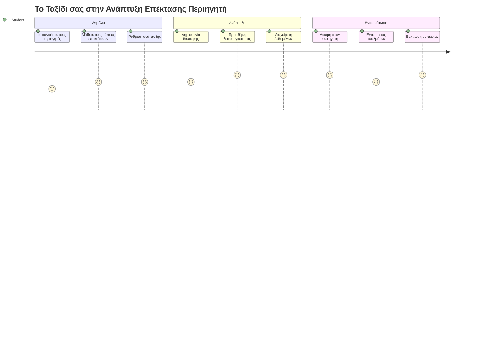
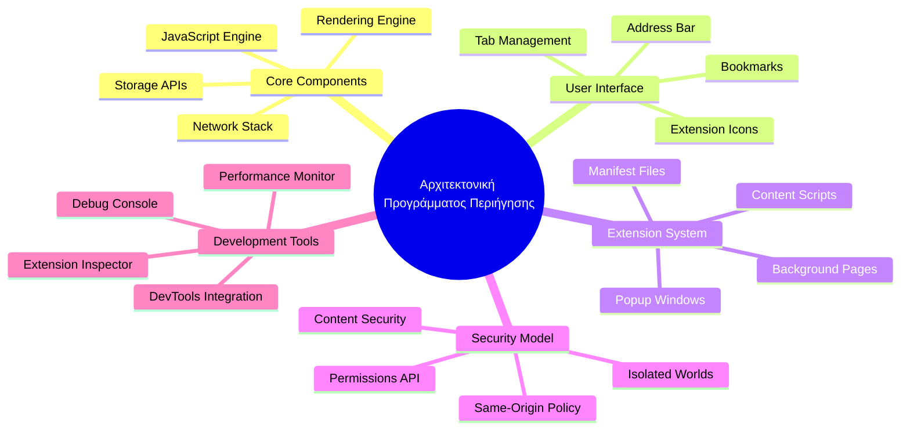
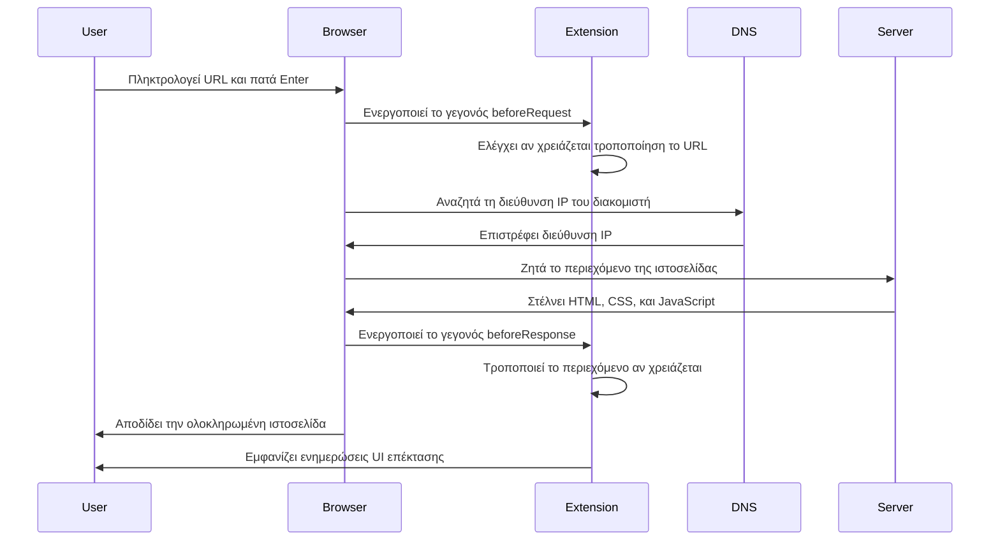
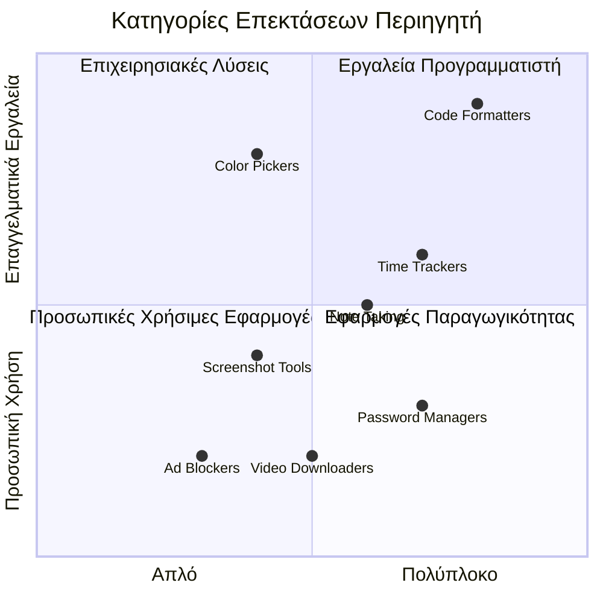
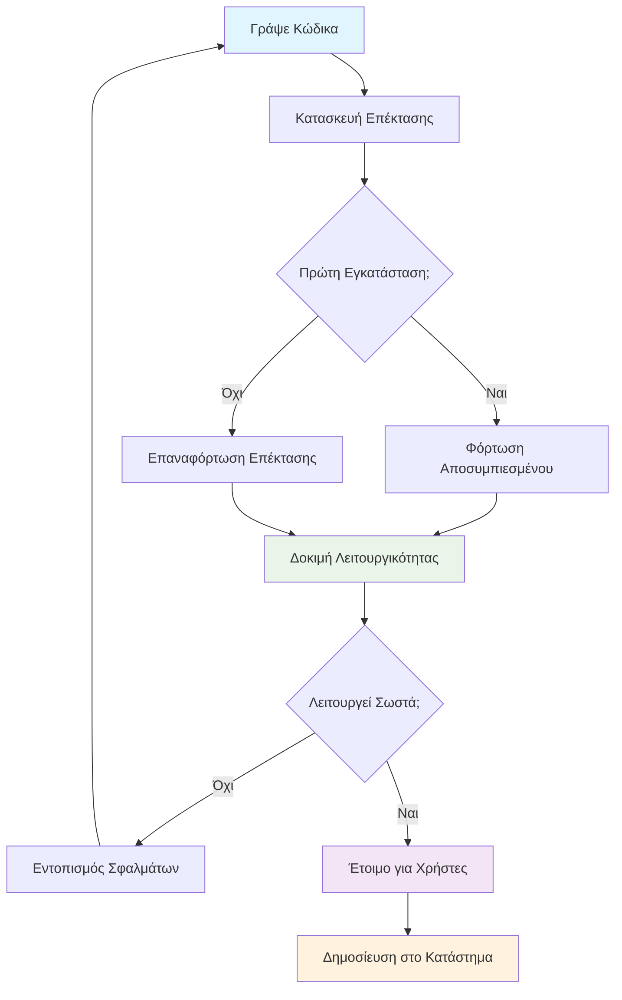
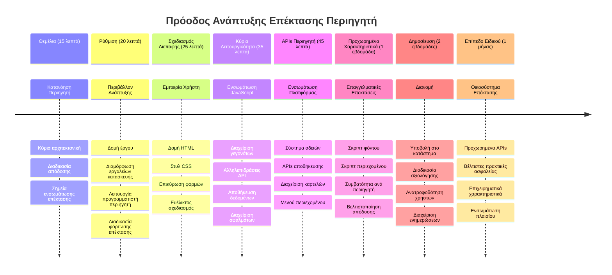

<!--
CO_OP_TRANSLATOR_METADATA:
{
  "original_hash": "00aa85715e1efd4930c17a23e3012e69",
  "translation_date": "2026-01-06T20:48:49+00:00",
  "source_file": "5-browser-extension/1-about-browsers/README.md",
  "language_code": "el"
}
-->
# Πρότζεκτ Επέκτασης Περιηγητή Μέρος 1: Όλα για τους Περιηγητές



> Σημειώσεις σκίτσου από τον [Wassim Chegham](https://dev.to/wassimchegham/ever-wondered-what-happens-when-you-type-in-a-url-in-an-address-bar-in-a-browser-3dob)

## Προ-Διάλεξη Κουίζ

[Προ-διάλεξη κουίζ](https://ff-quizzes.netlify.app/web/quiz/23)

### Εισαγωγή

Οι επεκτάσεις περιηγητών είναι μικρές εφαρμογές που βελτιώνουν την εμπειρία περιήγησής σας στο διαδίκτυο. Όπως το αρχικό όραμα του Tim Berners-Lee για έναν διαδραστικό ιστό, οι επεκτάσεις επεκτείνουν τις δυνατότητες του περιηγητή πέρα από την απλή προβολή εγγράφων. Από διαχειριστές κωδικών που κρατούν τους λογαριασμούς σας ασφαλείς έως επιλογείς χρωμάτων που βοηθούν τους σχεδιαστές να πάρουν τέλειες αποχρώσεις, οι επεκτάσεις επιλύουν καθημερινές προκλήσεις περιήγησης.

Πριν κατασκευάσουμε την πρώτη σας επέκταση, ας καταλάβουμε πώς λειτουργούν οι περιηγητές. Όπως ο Alexander Graham Bell έπρεπε να κατανοήσει τη μετάδοση του ήχου πριν εφεύρει το τηλέφωνο, η γνώση των βασικών του περιηγητή θα σας βοηθήσει να δημιουργήσετε επεκτάσεις που ενσωματώνονται απρόσκοπτα στα υπάρχοντα συστήματα περιηγητών.

Μέχρι το τέλος αυτού του μαθήματος, θα κατανοήσετε την αρχιτεκτονική των περιηγητών και θα έχετε ξεκινήσει την κατασκευή της πρώτης σας επέκτασης.


## Κατανόηση των Περιηγητών Ιστού

Ένας περιηγητής ιστού είναι ουσιαστικά ένας εξελιγμένος ερμηνευτής εγγράφων. Όταν πληκτρολογείτε "google.com" στη γραμμή διευθύνσεων, ο περιηγητής εκτελεί μια σύνθετη σειρά ενεργειών - ζητά περιεχόμενο από διακομιστές παγκοσμίως, στη συνέχεια αναλύει και αποδίδει αυτόν τον κώδικα στις διαδραστικές ιστοσελίδες που βλέπετε.

Αυτή η διαδικασία αντικατοπτρίζει πώς ο πρώτος περιηγητής ιστού, WorldWideWeb, σχεδιάστηκε από τον Tim Berners-Lee το 1990 για να κάνει τα υπερσυνδεδεμένα έγγραφα προσβάσιμα σε όλους.

✅ **Λίγη ιστορία**: Ο πρώτος περιηγητής ονομαζόταν 'WorldWideWeb' και δημιουργήθηκε από τον Sir Timothy Berners-Lee το 1990.


> Μερικοί πρώιμοι περιηγητές, μέσω της [Karen McGrane](https://www.slideshare.net/KMcGrane/week-4-ixd-history-personal-computing)

### Πώς οι Περιηγητές Επεξεργάζονται Περιεχόμενο Ιστού

Η διαδικασία μεταξύ της εισαγωγής μιας διεύθυνσης URL και της εμφάνισης μιας ιστοσελίδας περιλαμβάνει αρκετά συντονισμένα βήματα που συμβαίνουν μέσα σε δευτερόλεπτα:


**Αυτό που επιτυγχάνει αυτή η διαδικασία είναι:**
- **Μεταφράζει** τη διεύθυνση URL που είναι κατανοητή από τον άνθρωπο σε διεύθυνση IP διακομιστή μέσω της αναζήτησης DNS
- **Καθιερώνει** μια ασφαλή σύνδεση με τον διακομιστή ιστού χρησιμοποιώντας πρωτόκολλα HTTP ή HTTPS
- **Ζητά** το συγκεκριμένο περιεχόμενο της ιστοσελίδας από τον διακομιστή
- **Λαμβάνει** HTML markup, CSS styling και κώδικα JavaScript από τον διακομιστή
- **Αποδίδει** όλο το περιεχόμενο στην διαδραστική ιστοσελίδα που βλέπετε

### Κύρια Χαρακτηριστικά του Περιηγητή

Οι σύγχρονοι περιηγητές προσφέρουν πολυάριθμα χαρακτηριστικά που οι προγραμματιστές επεκτάσεων μπορούν να αξιοποιήσουν:

| Χαρακτηριστικό | Σκοπός | Ευκαιρίες Επέκτασης |
|---------|---------|------------------------|
| **Μηχανή Απόδοσης** | Εμφανίζει HTML, CSS, και JavaScript | Τροποποίηση περιεχομένου, εισαγωγή στυλ |
| **JavaScript Engine** | Εκτελεί κώδικα JavaScript | Προσαρμοσμένα scripts, αλληλεπιδράσεις API |
| **Τοπική Αποθήκευση** | Αποθηκεύει δεδομένα τοπικά | Προτιμήσεις χρήστη, αποθηκευμένα δεδομένα |
| **Δικτυακός Στοίβας** | Χειρίζεται αιτήσεις ιστού | Παρακολούθηση αιτήσεων, ανάλυση δεδομένων |
| **Μοντέλο Ασφαλείας** | Προστατεύει τους χρήστες από κακόβουλο περιεχόμενο | Φιλτράρισμα περιεχομένου, βελτιώσεις ασφαλείας |

**Η κατανόηση αυτών των χαρακτηριστικών σας βοηθά:**
- **Να αναγνωρίζετε** πού η επέκτασή σας μπορεί να προσθέσει τη μεγαλύτερη αξία
- **Να επιλέγετε** τα κατάλληλα API του περιηγητή για τη λειτουργικότητα της επέκτασής σας
- **Να σχεδιάζετε** επεκτάσεις που λειτουργούν αποδοτικά με τα συστήματα περιηγητών
- **Να διασφαλίζετε** ότι η επέκταση ακολουθεί τις βέλτιστες πρακτικές ασφαλείας του περιηγητή

### Προβληματισμοί Ανάπτυξης Διασταυρούμενων Περιηγητών

Διαφορετικοί περιηγητές υλοποιούν τα πρότυπα με μικρές διαφοροποιήσεις, παρόμοια με το πώς διαφορετικές γλώσσες προγραμματισμού μπορεί να χειρίζονται τον ίδιο αλγόριθμο διαφορετικά. Το Chrome, Firefox, και Safari έχουν μοναδικά χαρακτηριστικά που οι προγραμματιστές πρέπει να λάβουν υπόψη κατά την ανάπτυξη επεκτάσεων.

> 💡 **Χρήσιμη Συμβουλή**: Χρησιμοποιήστε το [caniuse.com](https://www.caniuse.com) για να ελέγξετε ποιες τεχνολογίες ιστού υποστηρίζονται από διαφορετικούς περιηγητές. Αυτό είναι ανεκτίμητο όταν σχεδιάζετε τα χαρακτηριστικά της επέκτασής σας!

**Βασικοί προβληματισμοί στην ανάπτυξη επεκτάσεων:**
- **Δοκιμάστε** την επέκταση σας σε Chrome, Firefox και Edge
- **Προσαρμοστείτε** σε διαφορετικά API επεκτάσεων και μορφές manifets των περιηγητών
- **Διαχειριστείτε** διαφορετικές επιδόσεις και περιορισμούς
- **Παρέχετε** εναλλακτικές για χαρακτηριστικά ειδικά για κάποιο περιηγητή που μπορεί να μην είναι διαθέσιμα

✅ **Στοιχεία Ανάλυσης**: Μπορείτε να προσδιορίσετε ποιοι περιηγητές προτιμώνται από τους χρήστες σας εγκαθιστώντας πακέτα ανάλυσης στα έργα ανάπτυξης ιστού σας. Αυτά τα δεδομένα βοηθούν να δώσετε προτεραιότητα στους περιηγητές που πρέπει να υποστηρίζονται πρώτα.

## Κατανόηση των Επεκτάσεων Περιηγητών

Οι επεκτάσεις περιηγητών λύνουν κοινά προβλήματα περιήγησης προσθέτοντας λειτουργίες απευθείας στη διεπαφή του περιηγητή. Αντί να απαιτούν ξεχωριστές εφαρμογές ή σύνθετες ροές εργασίας, οι επεκτάσεις παρέχουν άμεση πρόσβαση σε εργαλεία και χαρακτηριστικά.

Αυτή η ιδέα αντανακλά πώς οι πρώιμοι πρωτοπόροι του υπολογιστή, όπως ο Douglas Engelbart, οραμάτιζαν την αύξηση των ικανοτήτων του ανθρώπου μέσω της τεχνολογίας - οι επεκτάσεις αυξάνουν τη βασική λειτουργικότητα του περιηγητή σας.


**Δημοφιλείς κατηγορίες επεκτάσεων και τα οφέλη τους:**
- **Εργαλεία Παραγωγικότητας**: Διαχειριστές εργασιών, εφαρμογές σημειώσεων και χρονόμετρα που σας βοηθούν να παραμένετε οργανωμένοι
- **Βελτιώσεις Ασφαλείας**: Διαχειριστές κωδικών, μπλοκαριστές διαφημίσεων και εργαλεία ιδιωτικότητας που προστατεύουν τα δεδομένα σας
- **Εργαλεία Προγραμματιστών**: Μορφοποιητές κώδικα, επιλογείς χρωμάτων και εργαλεία αποσφαλμάτωσης που επιταχύνουν την ανάπτυξη
- **Βελτίωση Περιεχομένου**: Λειτουργίες ανάγνωσης, λήψη βίντεο και εργαλεία στιγμιοτύπων που βελτιώνουν την εμπειρία σας στον ιστό

✅ **Ερώτηση Σκέψης**: Ποιες είναι οι αγαπημένες σας επεκτάσεις περιηγητών; Ποιες συγκεκριμένες εργασίες εκτελούν και πώς βελτιώνουν την εμπειρία περιήγησής σας;

### 🔄 **Παιδαγωγικός Έλεγχος**
**Κατανόηση Αρχιτεκτονικής Περιηγητή**: Πριν προχωρήσετε στην ανάπτυξη επεκτάσεων, βεβαιωθείτε ότι μπορείτε:
- ✅ Να εξηγείτε πώς οι περιηγητές επεξεργάζονται αιτήσεις ιστού και αποδίδουν περιεχόμενο
- ✅ Να αναγνωρίζετε τα βασικά συστατικά της αρχιτεκτονικής του περιηγητή
- ✅ Να κατανοείτε πώς οι επεκτάσεις ενσωματώνονται στη λειτουργικότητα του περιηγητή
- ✅ Να αναγνωρίζετε το μοντέλο ασφαλείας που προστατεύει τους χρήστες

**Γρήγορο Τεστ Αυτοαξιολόγησης**: Μπορείτε να ακολουθήσετε την πορεία από την πληκτρολόγηση μιας URL μέχρι την εμφάνιση μιας ιστοσελίδας;
1. **Αναζήτηση DNS** μετατρέπει το URL σε διεύθυνση IP
2. **Αίτηση HTTP** ζητά περιεχόμενο από τον διακομιστή
3. **Ανάλυση** επεξεργάζεται HTML, CSS, και JavaScript
4. **Απόδοση** εμφανίζει την τελική ιστοσελίδα
5. **Επεκτάσεις** μπορούν να τροποποιήσουν το περιεχόμενο σε πολλά βήματα

## Εγκατάσταση και Διαχείριση Επεκτάσεων

Η κατανόηση της διαδικασίας εγκατάστασης επέκτασης σας βοηθά να προβλέψετε την εμπειρία του χρήστη όταν κάποιος εγκαθιστά την επέκτασή σας. Η διαδικασία εγκατάστασης είναι στάνταρ για τους σύγχρονους περιηγητές, με μικρές διαφοροποιήσεις στο σχεδιασμό διεπαφής.


> **Σημαντικό**: Φροντίστε να ενεργοποιήσετε τη λειτουργία προγραμματιστή και να επιτρέψετε επεκτάσεις από άλλα καταστήματα όταν δοκιμάζετε τις δικές σας επεκτάσεις.

### Διαδικασία Εγκατάστασης Επεκτάσεων Ανάπτυξης

Όταν αναπτύσσετε και δοκιμάζετε τις δικές σας επεκτάσεις, ακολουθήστε αυτήν τη ροή εργασίας:


```bash
# Βήμα 1: Δημιουργήστε την επέκτασή σας
npm run build
```

**Αυτό που επιτυγχάνει αυτή η εντολή:**
- **Μεταγλωττίζει** τον πηγαίο κώδικά σας σε αρχεία έτοιμα για τον περιηγητή
- **Δένεται** οι μονάδες JavaScript σε βελτιστοποιημένα πακέτα
- **Παράγει** τα τελικά αρχεία επέκτασης στον φάκελο `/dist`
- **Προετοιμάζει** την επέκταση για εγκατάσταση και δοκιμή

**Βήμα 2: Πλοηγηθείτε στις Επεκτάσεις Περιηγητή**
1. **Ανοίξτε** τη σελίδα διαχείρισης επεκτάσεων του περιηγητή σας
2. **Κάντε κλικ** στο κουμπί "Ρυθμίσεις και άλλα" (εικονίδιο `...`) επάνω δεξιά
3. **Επιλέξτε** "Επεκτάσεις" από το αναδυόμενο μενού

**Βήμα 3: Φορτώστε την Επέκτασή σας**
- **Για νέες εγκαταστάσεις**: Επιλέξτε `load unpacked` και διαλέξτε τον φάκελο `/dist`
- **Για ενημερώσεις**: Κάντε κλικ στο `reload` δίπλα στην ήδη εγκατεστημένη επέκτασή σας
- **Για δοκιμές**: Ενεργοποιήστε τη "Λειτουργία προγραμματιστή" για πρόσβαση σε επιπλέον εργαλεία αποσφαλμάτωσης

### Εγκατάσταση Επέκτασης Παραγωγής

> ✅ **Σημείωση**: Οι οδηγίες ανάπτυξης αφορούν αποκλειστικά τις επεκτάσεις που δημιουργείτε εσείς οι ίδιοι. Για εγκατάσταση δημοσιευμένων επεκτάσεων, επισκεφτείτε τα επίσημα καταστήματα επεκτάσεων περιηγητή όπως το [Microsoft Edge Add-ons store](https://microsoftedge.microsoft.com/addons/Microsoft-Edge-Extensions-Home).

**Κατανόηση της διαφοράς:**
- **Εγκαταστάσεις ανάπτυξης** σας επιτρέπουν να δοκιμάζετε μη δημοσιευμένες επεκτάσεις κατά την ανάπτυξη
- **Εγκαταστάσεις καταστήματος** προσφέρουν ελεγμένες, δημοσιευμένες επεκτάσεις με αυτόματες ενημερώσεις
- **Sideloading** επιτρέπει την εγκατάσταση επεκτάσεων από εκτός των επίσημων καταστημάτων (απαιτεί λειτουργία προγραμματιστή)

## Κατασκευή της Επέκτασης Carbon Footprint

Θα δημιουργήσουμε μια επέκταση περιηγητή που εμφανίζει το ανθρακικό αποτύπωμα της ενεργειακής χρήσης της περιοχής σας. Αυτό το πρότζεκτ δείχνει βασικές έννοιες ανάπτυξης επεκτάσεων ενώ δημιουργεί ένα πρακτικό εργαλείο για περιβαλλοντική ευαισθητοποίηση.

Αυτή η προσέγγιση ακολουθεί την αρχή του "μαθαίνω κάνοντας" που έχει αποδειχθεί αποτελεσματική από τις παιδαγωγικές θεωρίες του John Dewey - συνδυάζοντας τεχνικές δεξιότητες με ουσιαστικές εφαρμογές στην πραγματική ζωή.

### Απαιτήσεις Πρότζεκτ

Πριν ξεκινήσουμε την ανάπτυξη, ας συγκεντρώσουμε τους απαραίτητους πόρους και εξαρτήματα:

**Απαραίτητη Πρόσβαση API:**
- **[Κλειδί API CO2 Signal](https://www.co2signal.com/)**: Εισάγετε τη διεύθυνση email σας για να λάβετε το δωρεάν κλειδί API
- **[Κωδικός περιοχής](http://api.electricitymap.org/v3/zones)**: Βρείτε τον κωδικό της περιοχής σας χρησιμοποιώντας το [Electricity Map](https://www.electricitymap.org/map) (για παράδειγμα, η Βοστόνη χρησιμοποιεί 'US-NEISO')

**Εργαλεία Ανάπτυξης:**
- **[Node.js και NPM](https://www.npmjs.com)**: Εργαλείο διαχείρισης πακέτων για εγκατάσταση εξαρτημάτων πρότζεκτ
- **[Αρχικός κώδικας](../../../../5-browser-extension/start)**: Κατεβάστε τον φάκελο `start` για να ξεκινήσετε την ανάπτυξη

✅ **Μάθετε Περισσότερα**: Ενισχύστε τις δεξιότητες διαχείρισης πακέτων σας με αυτό το [εκτενές μάθημα Learn](https://docs.microsoft.com/learn/modules/create-nodejs-project-dependencies/?WT.mc_id=academic-77807-sagibbon)

### Κατανόηση της Δομής του Πρότζεκτ

Η κατανόηση της δομής του πρότζεκτ βοηθά στην αποδοτική οργάνωση της ανάπτυξης. Όπως η Βιβλιοθήκη της Αλεξάνδρειας οργανωνόταν για εύκολη ανάκτηση γνώσης, μια καλά οργανωμένη βάση κώδικα κάνει την ανάπτυξη πιο αποτελεσματική:

```
project-root/
├── dist/                    # Built extension files
│   ├── manifest.json        # Extension configuration
│   ├── index.html           # User interface markup
│   ├── background.js        # Background script functionality
│   └── main.js              # Compiled JavaScript bundle
├── src/                     # Source development files
│   └── index.js             # Your main JavaScript code
├── package.json             # Project dependencies and scripts
└── webpack.config.js        # Build configuration
```

**Ανάλυση αυτού που επιτυγχάνει κάθε αρχείο:**
- **`manifest.json`**: **Ορίζει** τα μεταδεδομένα της επέκτασης, δικαιώματα, και σημεία εισόδου
- **`index.html`**: **Δημιουργεί** τη διεπαφή χρήστη που εμφανίζεται όταν οι χρήστες κάνουν κλικ στην επέκτασή σας
- **`background.js`**: **Διαχειρίζεται** εργασίες παρασκηνίου και ακροατές συμβάντων περιηγητή
- **`main.js`**: **Περιέχει** τον τελικό δέσμη κώδικα JavaScript μετά τη διαδικασία build
- **`src/index.js`**: **Φιλοξενεί** τον βασικό κώδικα ανάπτυξής σας που μεταγλωττίζεται σε `main.js`

> 💡 **Συμβουλή Οργάνωσης**: Αποθηκεύστε το κλειδί API και τον κωδικό περιοχής σε ένα ασφαλές σημείωμα για εύκολη αναφορά κατά την ανάπτυξη. Θα χρειαστείτε αυτές τις τιμές για να δοκιμάσετε τη λειτουργικότητα της επέκτασής σας.

✅ **Σημείωση Ασφαλείας**: Μην δεσμεύετε ποτέ κλειδιά API ή ευαίσθητα διαπιστευτήρια στο αποθετήριο κώδικά σας. Θα σας δείξουμε πώς να τα διαχειρίζεστε με ασφάλεια στα επόμενα βήματα.

## Δημιουργία της Διεπαφής Επέκτασης

Τώρα θα κατασκευάσουμε τα στοιχειά της διεπαφής χρήστη. Η επέκταση χρησιμοποιεί μια προσέγγιση με δύο οθόνες: μια οθόνη ρυθμίσεων για την αρχική διαμόρφωση και μια οθόνη αποτελεσμάτων για την εμφάνιση δεδομένων.

Αυτό ακολουθεί την αρχή της προοδευτικής αποκάλυψης που χρησιμοποιείται στο σχεδιασμό διεπαφής από τις πρώιμες ημέρες της πληροφορικής - αποκαλύπτοντας πληροφορίες και επιλογές με λογική σειρά για να αποφεύγεται η υπερφόρτωση των χρηστών.

### Επισκόπηση Προβολών Επέκτασης

**Προβολή Ρυθμίσεων** - Ρύθμιση χρήστη για πρώτη φορά:


**Προβολή Αποτελεσμάτων** - Εμφάνιση δεδομένων ανθρακικού αποτυπώματος:


### Κατασκευή της Φόρμας Ρυθμίσεων

Η φόρμα ρυθμίσεων συλλέγει τα δεδομένα διαμόρφωσης χρήστη κατά την αρχική χρήση. Μόλις ρυθμιστεί, αυτή η πληροφορία παραμένει στην αποθήκευση του περιηγητή για μελλοντικές συνεδρίες.

Στο αρχείο `/dist/index.html`, προσθέστε αυτή τη δομή φόρμας:

```html
<form class="form-data" autocomplete="on">
    <div>
        <h2>New? Add your Information</h2>
    </div>
    <div>
        <label for="region">Region Name</label>
        <input type="text" id="region" required class="region-name" />
    </div>
    <div>
        <label for="api">Your API Key from tmrow</label>
        <input type="text" id="api" required class="api-key" />
    </div>
    <button class="search-btn">Submit</button>
</form>
```

**Αυτό που επιτυγχάνει αυτή η φόρμα:**
- **Δημιουργεί** μια σημασιολογική δομή φόρμας με σωστές ετικέτες και συσχετισμούς πεδίων
- **Ενεργοποιεί** τη λειτουργία συμπλήρωσης από τον περιηγητή για βελτιωμένη εμπειρία χρήστη
- **Απαιτεί** να συμπληρωθούν και τα δύο πεδία πριν την υποβολή με τη χρήση του χαρακτηριστικού `required`
- **Οργανώνει** τα πεδία εισαγωγής με περιγραφικά ονόματα κλάσεων για εύκολο στυλ και στόχευση JavaScript
- **Παρέχει** σαφείς οδηγίες για τους χρήστες που ρυθμίζουν την επέκταση για πρώτη φορά

### Κατασκευή της Εμφάνισης Αποτελεσμάτων

Στη συνέχεια, δημιουργήστε την περιοχή αποτελεσμάτων που θα δείχνει τα δεδομένα ανθρακικού αποτυπώματος. Προσθέστε αυτό το HTML κάτω από τη φόρμα:

```html
<div class="result">
    <div class="loading">loading...</div>
    <div class="errors"></div>
    <div class="data"></div>
    <div class="result-container">
        <p><strong>Region: </strong><span class="my-region"></span></p>
        <p><strong>Carbon Usage: </strong><span class="carbon-usage"></span></p>
        <p><strong>Fossil Fuel Percentage: </strong><span class="fossil-fuel"></span></p>
    </div>
    <button class="clear-btn">Change region</button>
</div>
```

**Ανάλυση αυτού που παρέχει αυτή η δομή:**
- **`loading`**: **Εμφανίζει** μήνυμα φόρτωσης ενώ φορτώνονται τα δεδομένα API
- **`errors`**: **Εμφανίζει** μηνύματα σφάλματος αν οι κλήσεις API αποτύχουν ή τα δεδομένα είναι άκυρα
- **`data`**: **Φιλοξενεί** ακατέργαστα δεδομένα για ανάγκες αποσφαλμάτωσης κατά την ανάπτυξη
- **`result-container`**: **Παρουσιάζει** μορφοποιημένες πληροφορίες ανθρακικού αποτυπώματος στους χρήστες
- **`clear-btn`**: **Επιτρέπει** στους χρήστες να αλλάξουν την περιοχή τους και να επαναρυθμίσουν την επέκταση

### Ρύθμιση της Διαδικασίας Build

Τώρα ας εγκαταστήσουμε τα εξαρτήματα του πρότζεκτ και να δοκιμάσουμε τη διαδικασία build:

```bash
npm install
```

**Αυτή η διαδικασία εγκατάστασης επιτυγχάνει:**
- **Κατεβάζει** το Webpack και άλλα εξαρτήματα ανάπτυξης που ορίζονται στο `package.json`
- **Ρυθμίζει** το build toolchain για τη μεταγλώττιση σύγχρονης JavaScript
- **Προετοιμάζει** το περιβάλλον ανάπτυξης για κατασκευή και δοκιμή επεκτάσεων
- **Ενεργοποιεί** δέσιμο κώδικα, βελτιστοποίηση, και χαρακτηριστικά συμβατότητας διασταυρούμενων περιηγητών

> 💡 **Επισήμανση Διαδικασίας Build**: Το Webpack δένει τον πηγαίο κώδικά σας από το `/src/index.js` στο `/dist/main.js`. Αυτή η διαδικασία βελτιστοποιεί τον κώδικά σας για παραγωγή και εξασφαλίζει συμβατότητα με περιηγητές.

### Δοκιμάζοντας την Πρόοδό σας

Σε αυτό το σημείο, μπορείτε να δοκιμάσετε την επέκτασή σας:
1. **Τρέξτε** την εντολή build για να μεταγλωττίσετε τον κώδικά σας  
2. **Φορτώστε** την επέκταση στον περιηγητή σας χρησιμοποιώντας τη λειτουργία προγραμματιστή  
3. **Επαληθεύστε** ότι η φόρμα εμφανίζεται σωστά και έχει επαγγελματική όψη  
4. **Ελέγξτε** ότι όλα τα στοιχεία της φόρμας είναι σωστά ευθυγραμμισμένα και λειτουργικά  

**Τι έχετε καταφέρει:**  
- **Δημιουργήσατε** τη βασική HTML δομή για την επέκτασή σας  
- **Κατασκευάσατε** διεπαφές ρύθμισης και αποτελεσμάτων με σωστή σημασιολογική σήμανση  
- **Ρυθμίσατε** μια σύγχρονη ροή εργασίας ανάπτυξης χρησιμοποιώντας εργαλεία βιομηχανικού επιπέδου  
- **Ετοιμάσατε** τη βάση για την προσθήκη διαδραστικής λειτουργικότητας με JavaScript  

### 🔄 **Παιδαγωγικός Έλεγχος**  
**Πρόοδος Ανάπτυξης Επέκτασης**: Επαληθεύστε την κατανόησή σας πριν συνεχίσετε:  
- ✅ Μπορείτε να εξηγήσετε το σκοπό κάθε αρχείου στη δομή του έργου;  
- ✅ Κατανοείτε πώς η διαδικασία build μετασχηματίζει τον πηγαίο κώδικα;  
- ✅ Γιατί διαχωρίζουμε τη ρύθμιση και τα αποτελέσματα σε διαφορετικές ενότητες διεπαφής;  
- ✅ Πώς η δομή της φόρμας υποστηρίζει τόσο την ευχρηστία όσο και την προσβασιμότητα;  

**Κατανόηση Ροής Εργασίας Ανάπτυξης**: Τώρα θα πρέπει να μπορείτε να:  
1. **Τροποποιείτε** HTML και CSS για τη διεπαφή της επέκτασής σας  
2. **Τρέχετε** την εντολή build για να μεταγλωττίσετε τις αλλαγές σας  
3. **Επαναφορτώνετε** την επέκταση στον περιηγητή σας για να δοκιμάσετε ενημερώσεις  
4. **Εντοπίζετε σφάλματα** χρησιμοποιώντας τα εργαλεία προγραμματιστή του περιηγητή  

Έχετε ολοκληρώσει το πρώτο στάδιο ανάπτυξης επέκτασης περιηγητή. Όπως οι αδερφοί Ράιτ χρειάστηκαν να κατανοήσουν την αεροδυναμική πριν την πρώτη πτήση, έτσι και η κατανόηση αυτών των βασικών εννοιών σας προετοιμάζει να αναπτύξετε πιο πολύπλοκες διαδραστικές λειτουργίες στο επόμενο μάθημα.  

## Πρόκληση GitHub Copilot Agent 🚀  

Χρησιμοποιήστε τη λειτουργία Agent για να ολοκληρώσετε την παρακάτω πρόκληση:  

**Περιγραφή:** Ενισχύστε την επέκταση περιηγητή προσθέτοντας έλεγχο εγκυρότητας φόρμας και λειτουργίες ανατροφοδότησης χρήστη για βελτίωση της εμπειρίας εισαγωγής κλειδιών API και κωδικών περιοχής.  

**Οδηγία:** Δημιουργήστε συναρτήσεις JavaScript που ελέγχουν εάν το πεδίο κλειδιού API περιέχει τουλάχιστον 20 χαρακτήρες και αν ο κωδικός περιοχής ακολουθεί τη σωστή μορφή (π.χ. 'US-NEISO'). Προσθέστε οπτική ανατροφοδότηση αλλάζοντας το χρώμα των περιθωρίων εισόδου σε πράσινο για έγκυρες τιμές και κόκκινο για μη έγκυρες. Επίσης, προσθέστε λειτουργία εναλλαγής εμφάνισης/απόκρυψης του κλειδιού API για λόγους ασφάλειας.  

Μάθετε περισσότερα σχετικά με τη [λειτουργία agent](https://code.visualstudio.com/blogs/2025/02/24/introducing-copilot-agent-mode) εδώ.  

## 🚀 Πρόκληση  

Ρίξτε μια ματιά σε ένα κατάστημα επεκτάσεων περιηγητή και εγκαταστήστε μία στον περιηγητή σας. Μπορείτε να εξετάσετε τα αρχεία με ενδιαφέροντες τρόπους. Τι ανακαλύπτετε;  

## Κουίζ Μετά το Μάθημα  

[Κουίζ μετά το μάθημα](https://ff-quizzes.netlify.app/web/quiz/24)  

## Ανασκόπηση & Αυτομελέτη  

Σε αυτό το μάθημα μάθατε λίγα για την ιστορία του web browser. Εκμεταλλευτείτε την ευκαιρία να μάθετε πώς οι εφευρέτες του World Wide Web φαντάστηκαν τη χρήση του διαβάζοντας περισσότερα για την ιστορία του. Μερικές χρήσιμες σελίδες περιλαμβάνουν:  

[Η Ιστορία των Web Browsers](https://www.mozilla.org/firefox/browsers/browser-history/)  

[Ιστορία του Web](https://webfoundation.org/about/vision/history-of-the-web/)  

[Συνέντευξη με τον Tim Berners-Lee](https://www.theguardian.com/technology/2019/mar/12/tim-berners-lee-on-30-years-of-the-web-if-we-dream-a-little-we-can-get-the-web-we-want)  

### ⚡ **Τι Μπορείτε να Κάνετε στα Επόμενα 5 Λεπτά**  
- [ ] Ανοίξτε τη σελίδα επεκτάσεων Chrome/Edge (chrome://extensions) και εξερευνήστε αυτά που έχετε εγκαταστήσει  
- [ ] Κοιτάξτε την καρτέλα Δικτύου (Network) στα DevTools του περιηγητή σας ενώ φορτώνετε μια ιστοσελίδα  
- [ ] Δοκιμάστε να δείτε την πηγή της σελίδας (Ctrl+U) για να δείτε τη δομή HTML  
- [ ] Επισκοπήστε οποιοδήποτε στοιχείο της σελίδας και τροποποιήστε το CSS του στα DevTools  

### 🎯 **Τι Μπορείτε να Καταφέρετε Αυτή την Ώρα**  
- [ ] Ολοκληρώστε το κουίζ μετά το μάθημα και κατανοήστε τα βασικά του περιηγητή  
- [ ] Δημιουργήστε ένα βασικό αρχείο manifest.json για μια επέκταση περιηγητή  
- [ ] Φτιάξτε μια απλή επέκταση "Hello World" που εμφανίζει ένα αναδυόμενο παράθυρο  
- [ ] Δοκιμάστε το φόρτωμα της επέκτασής σας σε λειτουργία προγραμματιστή  
- [ ] Εξερευνήστε την τεκμηρίωση επεκτάσεων για τον περιηγητή στόχο σας  

### 📅 **Το Μεγάλο Ταξίδι Ανάπτυξης Επέκτασης της Εβδομάδας Σας**  
- [ ] Ολοκληρώστε μια λειτουργική επέκταση περιηγητή με πραγματική χρησιμότητα  
- [ ] Μάθετε για τα content scripts, background scripts και τις αλληλεπιδράσεις popup  
- [ ] Εξειδικευτείτε στα API του περιηγητή όπως αποθήκευση, καρτέλες και μηνύματα  
- [ ] Σχεδιάστε φιλικά προς τον χρήστη interfaces για την επέκτασή σας  
- [ ] Δοκιμάστε την επέκτασή σας σε διάφορες ιστοσελίδες και σενάρια  
- [ ] Δημοσιεύστε την επέκτασή σας στο κατάστημα επεκτάσεων του περιηγητή  

### 🌟 **Η Μηνιαία Εξάσκηση Ανάπτυξης Περιηγητή**  
- [ ] Δημιουργήστε πολλές επεκτάσεις που λύνουν διαφορετικά προβλήματα χρηστών  
- [ ] Μάθετε προχωρημένα API περιηγητών και βέλτιστες πρακτικές ασφαλείας  
- [ ] Συνεισφέρετε σε ανοιχτού κώδικα έργα επεκτάσεων περιηγητή  
- [ ] Κατακτήστε την πολυ-περιηγητική συμβατότητα και την προοδευτική βελτίωση  
- [ ] Δημιουργήστε εργαλεία και προτύπα ανάπτυξης επεκτάσεων για άλλους  
- [ ] Γίνετε ειδικός επεκτάσεων περιηγητή που βοηθά άλλους προγραμματιστές  

## 🎯 Χρονοδιάγραμμα Εμπειρίας στην Ανάπτυξη Επέκτασης Περιηγητή  


### 🛠️ Περίληψη Εργαλείων Ανάπτυξης Επέκτασης  

Μετά την ολοκλήρωση αυτού του μαθήματος, έχετε πλέον:  
- **Γνώσεις Αρχιτεκτονικής Περιηγητή**: Κατανόηση μηχανών απόδοσης, μοντέλων ασφαλείας και ενσωμάτωσης επεκτάσεων  
- **Περιβάλλον Ανάπτυξης**: Σύγχρονο εργαλειακό σύνολο με Webpack, NPM και δυνατότητες εντοπισμού σφαλμάτων  
- **Βάση UI/UX**: Σημασιολογική HTML δομή με πρότυπα προοδευτικής αποκάλυψης  
- **Επίγνωση Ασφαλείας**: Κατανόηση αδειών περιηγητή και ασφαλών πρακτικών ανάπτυξης  
- **Έννοιες Διαλειτουργικότητας**: Γνώσεις συμβατότητας και προσεγγίσεις δοκιμών  
- **Ενσωμάτωση API**: Βάση για εργασία με εξωτερικές πηγές δεδομένων  
- **Επαγγελματική Ροή Εργασίας**: Πρακτικές ανάπτυξης και δοκιμών σε βιομηχανικό επίπεδο  

**Εφαρμογές στον Πραγματικό Κόσμο**: Αυτές οι δεξιότητες εφαρμόζονται άμεσα σε:  
- **Ανάπτυξη Ιστού**: Εφαρμογές μίας σελίδας και προοδευτικές web εφαρμογές  
- **Επιτραπέζιες Εφαρμογές**: Electron και web-based επιτραπέζιο λογισμικό  
- **Κινητή Ανάπτυξη**: Υβριδικές εφαρμογές και web mobile λύσεις  
- **Εργαλεία Επιχειρήσεων**: Εσωτερικές εφαρμογές παραγωγικότητας και αυτοματοποίηση εργασιών  
- **Ανοιχτός Κώδικας**: Συνεισφορά σε έργα επεκτάσεων και πρότυπα web  

**Επόμενο Επίπεδο**: Είστε έτοιμοι να προσθέσετε διαδραστικές λειτουργίες, να δουλέψετε με API περιηγητών και να δημιουργήσετε επεκτάσεις που επιλύουν πραγματικά προβλήματα χρηστών!  

## Ανάθεση  

[Ανασχεδιάστε την επέκτασή σας](assignment.md)

---

<!-- CO-OP TRANSLATOR DISCLAIMER START -->
**Αποποίηση ευθυνών**:  
Αυτό το έγγραφο έχει μεταφραστεί χρησιμοποιώντας την υπηρεσία αυτόματης μετάφρασης AI [Co-op Translator](https://github.com/Azure/co-op-translator). Παρόλο που επιδιώκουμε την ακρίβεια, παρακαλούμε να έχετε υπόψη ότι οι αυτοματοποιημένες μεταφράσεις ενδέχεται να περιέχουν λάθη ή ανακρίβειες. Το πρωτότυπο έγγραφο στη μητρική του γλώσσα θεωρείται η επίσημη πηγή. Για κρίσιμες πληροφορίες, συνιστάται επαγγελματική μετάφραση από άνθρωπο. Δεν φέρουμε ευθύνη για παρεξηγήσεις ή λανθασμένες ερμηνείες που προκύπτουν από τη χρήση αυτής της μετάφρασης.
<!-- CO-OP TRANSLATOR DISCLAIMER END -->