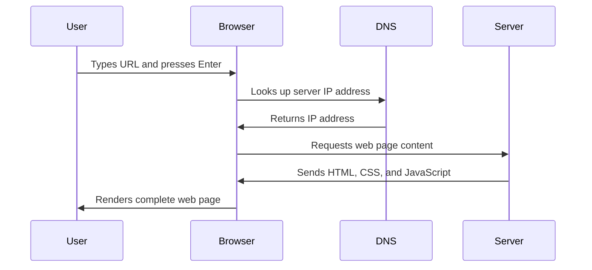

<!--
CO_OP_TRANSLATOR_METADATA:
{
  "original_hash": "33a875c522f237a2026e4653240dfc07",
  "translation_date": "2025-10-23T20:40:55+00:00",
  "source_file": "5-browser-extension/1-about-browsers/README.md",
  "language_code": "el"
}
-->
# Έργο Επέκτασης Περιηγητή Μέρος 1: Όλα για τους Περιηγητές


> Σημειώσεις από τον [Wassim Chegham](https://dev.to/wassimchegham/ever-wondered-what-happens-when-you-type-in-a-url-in-an-address-bar-in-a-browser-3dob)

## Κουίζ πριν τη διάλεξη

[Κουίζ πριν τη διάλεξη](https://ff-quizzes.netlify.app/web/quiz/23)

### Εισαγωγή

Οι επεκτάσεις περιηγητή είναι μικροεφαρμογές που βελτιώνουν την εμπειρία περιήγησης στο διαδίκτυο. Όπως το αρχικό όραμα του Tim Berners-Lee για έναν διαδραστικό ιστό, οι επεκτάσεις επεκτείνουν τις δυνατότητες του περιηγητή πέρα από την απλή προβολή εγγράφων. Από διαχειριστές κωδικών πρόσβασης που διατηρούν τους λογαριασμούς σας ασφαλείς μέχρι εργαλεία επιλογής χρωμάτων που βοηθούν τους σχεδιαστές να βρουν τις τέλειες αποχρώσεις, οι επεκτάσεις λύνουν καθημερινές προκλήσεις περιήγησης.

Πριν δημιουργήσουμε την πρώτη σας επέκταση, ας κατανοήσουμε πώς λειτουργούν οι περιηγητές. Όπως ο Alexander Graham Bell έπρεπε να κατανοήσει τη μετάδοση ήχου πριν εφεύρει το τηλέφωνο, η γνώση των βασικών αρχών του περιηγητή θα σας βοηθήσει να δημιουργήσετε επεκτάσεις που ενσωματώνονται ομαλά στα υπάρχοντα συστήματα περιηγητών.

Μέχρι το τέλος αυτού του μαθήματος, θα κατανοήσετε την αρχιτεκτονική του περιηγητή και θα έχετε ξεκινήσει να δημιουργείτε την πρώτη σας επέκταση.

## Κατανόηση των Περιηγητών Ιστού

Ένας περιηγητής ιστού είναι ουσιαστικά ένας εξελιγμένος διερμηνέας εγγράφων. Όταν πληκτρολογείτε "google.com" στη γραμμή διευθύνσεων, ο περιηγητής εκτελεί μια σύνθετη σειρά λειτουργιών - ζητώντας περιεχόμενο από διακομιστές παγκοσμίως, και στη συνέχεια αναλύοντας και αποδίδοντας αυτόν τον κώδικα στις διαδραστικές ιστοσελίδες που βλέπετε.

Αυτή η διαδικασία αντικατοπτρίζει τον τρόπο με τον οποίο σχεδιάστηκε ο πρώτος περιηγητής ιστού, το WorldWideWeb, από τον Tim Berners-Lee το 1990 για να κάνει τα υπερσυνδεδεμένα έγγραφα προσβάσιμα σε όλους.

✅ **Λίγη ιστορία**: Ο πρώτος περιηγητής ονομαζόταν 'WorldWideWeb' και δημιουργήθηκε από τον Sir Timothy Berners-Lee το 1990.


> Μερικοί από τους πρώτους περιηγητές, μέσω της [Karen McGrane](https://www.slideshare.net/KMcGrane/week-4-ixd-history-personal-computing)

### Πώς οι Περιηγητές Επεξεργάζονται Περιεχόμενο Ιστού

Η διαδικασία μεταξύ της εισαγωγής μιας διεύθυνσης URL και της προβολής μιας ιστοσελίδας περιλαμβάνει αρκετά συντονισμένα βήματα που συμβαίνουν μέσα σε δευτερόλεπτα:



**Τι επιτυγχάνει αυτή η διαδικασία:**
- **Μεταφράζει** την ανθρώπινα αναγνώσιμη διεύθυνση URL σε διεύθυνση IP διακομιστή μέσω αναζήτησης DNS
- **Εγκαθιδρύει** μια ασφαλή σύνδεση με τον διακομιστή ιστού χρησιμοποιώντας πρωτόκολλα HTTP ή HTTPS
- **Ζητά** το συγκεκριμένο περιεχόμενο της ιστοσελίδας από τον διακομιστή
- **Λαμβάνει** HTML markup, CSS styling και JavaScript κώδικα από τον διακομιστή
- **Αποδίδει** όλο το περιεχόμενο στην διαδραστική ιστοσελίδα που βλέπετε

### Βασικά Χαρακτηριστικά Περιηγητών

Οι σύγχρονοι περιηγητές παρέχουν πολυάριθμα χαρακτηριστικά που μπορούν να αξιοποιήσουν οι προγραμματιστές επεκτάσεων:

| Χαρακτηριστικό | Σκοπός | Ευκαιρίες για Επεκτάσεις |
|----------------|--------|--------------------------|
| **Μηχανή Απόδοσης** | Εμφανίζει HTML, CSS και JavaScript | Τροποποίηση περιεχομένου, εισαγωγή στυλ |
| **Μηχανή JavaScript** | Εκτελεί JavaScript κώδικα | Προσαρμοσμένα scripts, αλληλεπιδράσεις API |
| **Τοπική Αποθήκευση** | Αποθηκεύει δεδομένα τοπικά | Προτιμήσεις χρήστη, προσωρινά δεδομένα |
| **Δίκτυο** | Διαχειρίζεται αιτήματα ιστού | Παρακολούθηση αιτημάτων, ανάλυση δεδομένων |
| **Μοντέλο Ασφαλείας** | Προστατεύει τους χρήστες από κακόβουλο περιεχόμενο | Φιλτράρισμα περιεχομένου, βελτιώσεις ασφαλείας |

**Η κατανόηση αυτών των χαρακτηριστικών σας βοηθά:**
- **Να εντοπίσετε** πού η επέκτασή σας μπορεί να προσθέσει τη μεγαλύτερη αξία
- **Να επιλέξετε** τα σωστά APIs περιηγητή για τη λειτουργικότητα της επέκτασής σας
- **Να σχεδιάσετε** επεκτάσεις που λειτουργούν αποτελεσματικά με τα συστήματα περιηγητών
- **Να διασφαλίσετε** ότι η επέκτασή σας ακολουθεί τις βέλτιστες πρακτικές ασφαλείας του περιηγητή

### Σκέψεις για Ανάπτυξη Δια-Περιηγητικών Επεκτάσεων

Διαφορετικοί περιηγητές εφαρμόζουν πρότυπα με μικρές παραλλαγές, όπως ακριβώς διαφορετικές γλώσσες προγραμματισμού μπορεί να χειρίζονται τον ίδιο αλγόριθμο διαφορετικά. Το Chrome, το Firefox και το Safari έχουν μοναδικά χαρακτηριστικά που πρέπει να λάβουν υπόψη οι προγραμματιστές κατά την ανάπτυξη επεκτάσεων.

> 💡 **Συμβουλή**: Χρησιμοποιήστε το [caniuse.com](https://www.caniuse.com) για να ελέγξετε ποιες τεχνολογίες ιστού υποστηρίζονται σε διαφορετικούς περιηγητές. Αυτό είναι ανεκτίμητο όταν σχεδιάζετε τις λειτουργίες της επέκτασής σας!

**Βασικές σκέψεις για την ανάπτυξη επεκτάσεων:**
- **Δοκιμάστε** την επέκτασή σας σε περιηγητές Chrome, Firefox και Edge
- **Προσαρμόστε** τις διαφορετικές APIs επεκτάσεων περιηγητή και μορφές manifest
- **Διαχειριστείτε** διαφορετικά χαρακτηριστικά απόδοσης και περιορισμούς
- **Παρέχετε** εναλλακτικές λύσεις για χαρακτηριστικά που μπορεί να μην είναι διαθέσιμα σε συγκεκριμένους περιηγητές

✅ **Ανάλυση Δεδομένων**: Μπορείτε να προσδιορίσετε ποιοι περιηγητές προτιμούν οι χρήστες σας εγκαθιστώντας πακέτα ανάλυσης στα έργα ανάπτυξης ιστού σας. Αυτά τα δεδομένα σας βοηθούν να δώσετε προτεραιότητα στους περιηγητές που θα υποστηρίξετε πρώτα.

## Κατανόηση των Επεκτάσεων Περιηγητή

Οι επεκτάσεις περιηγητή λύνουν κοινές προκλήσεις περιήγησης στο διαδίκτυο προσθέτοντας λειτουργικότητα απευθείας στη διεπαφή του περιηγητή. Αντί να απαιτούν ξεχωριστές εφαρμογές ή σύνθετες ροές εργασίας, οι επεκτάσεις παρέχουν άμεση πρόσβαση σε εργαλεία και λειτουργίες.

Αυτή η ιδέα αντικατοπτρίζει τον τρόπο που οι πρώτοι πρωτοπόροι υπολογιστών όπως ο Douglas Engelbart οραματίστηκαν την ενίσχυση των ανθρώπινων δυνατοτήτων με την τεχνολογία - οι επεκτάσεις ενισχύουν τη βασική λειτουργικότητα του περιηγητή σας.

**Δημοφιλείς κατηγορίες επεκτάσεων και τα οφέλη τους:**
- **Εργαλεία Παραγωγικότητας**: Διαχειριστές εργασιών, εφαρμογές σημειώσεων και χρονομετρητές που σας βοηθούν να παραμένετε οργανωμένοι
- **Βελτιώσεις Ασφαλείας**: Διαχειριστές κωδικών πρόσβασης, αποκλειστές διαφημίσεων και εργαλεία προστασίας προσωπικών δεδομένων που προστατεύουν τα δεδομένα σας
- **Εργαλεία Προγραμματιστών**: Διαμορφωτές κώδικα, εργαλεία επιλογής χρωμάτων και βοηθήματα αποσφαλμάτωσης που απλοποιούν την ανάπτυξη
- **Βελτίωση Περιεχομένου**: Λειτουργίες ανάγνωσης, λήψη βίντεο και εργαλεία στιγμιότυπων που βελτιώνουν την εμπειρία σας στο διαδίκτυο

✅ **Ερώτηση Αναστοχασμού**: Ποιες είναι οι αγαπημένες σας επεκτάσεις περιηγητή; Ποιες συγκεκριμένες εργασίες εκτελούν και πώς βελτιώνουν την εμπειρία περιήγησής σας;

## Εγκατάσταση και Διαχείριση Επεκτάσεων

Η κατανόηση της διαδικασίας εγκατάστασης επεκτάσεων σας βοηθά να προβλέψετε την εμπειρία χρήστη όταν οι άνθρωποι εγκαθιστούν την επέκτασή σας. Η διαδικασία εγκατάστασης είναι τυποποιημένη στους σύγχρονους περιηγητές, με μικρές παραλλαγές στον σχεδιασμό της διεπαφής.


> **Σημαντικό**: Βεβαιωθείτε ότι έχετε ενεργοποιήσει τη λειτουργία προγραμματιστή και επιτρέψτε επεκτάσεις από άλλα καταστήματα κατά τη δοκιμή των δικών σας επεκτάσεων.

### Διαδικασία Εγκατάστασης Επεκτάσεων Ανάπτυξης

Όταν αναπτύσσετε και δοκιμάζετε τις δικές σας επεκτάσεις, ακολουθήστε αυτήν τη διαδικασία:

```bash
# Step 1: Build your extension
npm run build
```

**Τι επιτυγχάνει αυτή η εντολή:**
- **Μεταγλωττίζει** τον πηγαίο κώδικα σε αρχεία έτοιμα για περιηγητή
- **Δημιουργεί** βελτιστοποιημένα πακέτα JavaScript
- **Παράγει** τα τελικά αρχεία επέκτασης στον φάκελο `/dist`
- **Προετοιμάζει** την επέκτασή σας για εγκατάσταση και δοκιμή

**Βήμα 2: Μεταβείτε στις Επεκτάσεις Περιηγητή**
1. **Ανοίξτε** τη σελίδα διαχείρισης επεκτάσεων του περιηγητή σας
2. **Κάντε κλικ** στο κουμπί "Ρυθμίσεις και περισσότερα" (το εικονίδιο `...`) πάνω δεξιά
3. **Επιλέξτε** "Επεκτάσεις" από το αναπτυσσόμενο μενού

**Βήμα 3: Φορτώστε την Επέκτασή σας**
- **Για νέες εγκαταστάσεις**: Επιλέξτε `load unpacked` και επιλέξτε τον φάκελο `/dist`
- **Για ενημερώσεις**: Κάντε κλικ στο `reload` δίπλα στην ήδη εγκατεστημένη επέκταση
- **Για δοκιμές**: Ενεργοποιήστε τη "Λειτουργία προγραμματιστή" για πρόσβαση σε πρόσθετες δυνατότητες αποσφαλμάτωσης

### Εγκατάσταση Επέκτασης Παραγωγής

> ✅ **Σημείωση**: Αυτές οι οδηγίες ανάπτυξης είναι ειδικά για επεκτάσεις που δημιουργείτε εσείς. Για να εγκαταστήσετε δημοσιευμένες επεκτάσεις, επισκεφθείτε τα επίσημα καταστήματα επεκτάσεων περιηγητή όπως το [Microsoft Edge Add-ons store](https://microsoftedge.microsoft.com/addons/Microsoft-Edge-Extensions-Home).

**Κατανόηση της διαφοράς:**
- **Εγκαταστάσεις ανάπτυξης** σας επιτρέπουν να δοκιμάσετε μη δημοσιευμένες επεκτάσεις κατά την ανάπτυξη
- **Εγκαταστάσεις από καταστήματα** παρέχουν ελεγμένες, δημοσιευμένες επεκτάσεις με αυτόματες ενημερώσεις
- **Sideloading** επιτρέπει την εγκατάσταση επεκτάσεων από έξω από τα επίσημα καταστήματα (απαιτεί λειτουργία προγραμματιστή)

## Δημιουργία Επέκτασης Αποτυπώματος Άνθρακα

Θα δημιουργήσουμε μια επέκταση περιηγητή που εμφανίζει το αποτύπωμα άνθρακα της ενεργειακής χρήσης της περιοχής σας. Αυτό το έργο δείχνει βασικές έννοιες ανάπτυξης επεκτάσεων ενώ δημιουργεί ένα πρακτικό εργαλείο για περιβαλλοντική ευαισθητοποίηση.

Αυτή η προσέγγιση ακολουθεί την αρχή της "μάθησης μέσω πράξης" που έχει αποδειχθεί αποτελεσματική από τις εκπαιδευτικές θεωρίες του John Dewey - συνδυάζοντας τεχνικές δεξιότητες με ουσιαστικές εφαρμογές στον πραγματικό κόσμο.

### Απαιτήσεις Έργου

Πριν ξεκινήσετε την ανάπτυξη, ας συγκεντρώσουμε τους απαιτούμενους πόρους και εξαρτήσεις:

**Απαιτούμενη Πρόσβαση API:**
- **[CO2 Signal API key](https://www.co2signal.com/)**: Εισάγετε τη διεύθυνση email σας για να λάβετε το δωρεάν API key σας
- **[Κωδικός περιοχής](http://api.electricitymap.org/v3/zones)**: Βρείτε τον κωδικό περιοχής σας χρησιμοποιώντας τον [Electricity Map](https://www.electricitymap.org/map) (για παράδειγμα, η Βοστώνη χρησιμοποιεί 'US-NEISO')

**Εργαλεία Ανάπτυξης:**
- **[Node.js και NPM](https://www.npmjs.com)**: Εργαλείο διαχείρισης πακέτων για την εγκατάσταση εξαρτήσεων έργου
- **[Κώδικας εκκίνησης](../../../../5-browser-extension/start)**: Κατεβάστε τον φάκελο `start` για να ξεκινήσετε την ανάπτυξη

✅ **Μάθετε Περισσότερα**: Βελτιώστε τις δεξιότητές σας στη διαχείριση πακέτων με αυτήν την [εκτενή ενότητα μάθησης](https://docs.microsoft.com/learn/modules/create-nodejs-project-dependencies/?WT.mc_id=academic-77807-sagibbon)

### Κατανόηση της Δομής του Έργου

Η κατανόηση της δομής του έργου βοηθά στην αποτελεσματική οργάνωση της ανάπτυξης. Όπως η Βιβλιοθήκη της Αλεξάνδρειας οργανώθηκε για εύκολη ανάκτηση γνώσης, μια καλά οργανωμένη βάση κώδικα κάνει την ανάπτυξη πιο αποτελεσματική:

```
project-root/
├── dist/                    # Built extension files
│   ├── manifest.json        # Extension configuration
│   ├── index.html           # User interface markup
│   ├── background.js        # Background script functionality
│   └── main.js              # Compiled JavaScript bundle
└── src/                     # Source development files
    └── index.js             # Your main JavaScript code
```

**Ανάλυση του τι επιτυγχάνει κάθε αρχείο:**
- **`manifest.json`**: **Ορίζει** μεταδεδομένα επέκτασης, δικαιώματα και σημεία εισόδου
- **`index.html`**: **Δημιουργεί** τη διεπαφή χρήστη που εμφανίζεται όταν οι χρήστες κάνουν κλικ στην επέκτασή σας
- **`background.js`**: **Διαχειρίζεται** εργασίες παρασκηνίου και ακροατές συμβάντων περιηγητή
- **`main.js`**: **Περιέχει** τον τελικό JavaScript κώδικα μετά τη διαδικασία κατασκευής
- **`src/index.js`**: **Περιλαμβάνει** τον κύριο κώδικα ανάπτυξης που μεταγλωττίζεται σε `main.js`

> 💡 **Συμβουλή Οργάνωσης**: Αποθηκεύστε το API key και τον κωδικό περιοχής σας σε μια ασφαλή σημείωση για εύκολη αναφορά κατά την ανάπτυξη. Θα χρειαστείτε αυτές τις τιμές για να δοκιμάσετε τη λειτουργικότητα της επέκτασής σας.

✅ **Σημείωση Ασφαλείας**: Ποτέ μην δεσμεύετε API keys ή ευαίσθητα διαπιστευτήρια στο αποθετήριο κώδικα σας. Θα σας δείξουμε πώς να τα διαχειριστείτε με ασφάλ
**Περιγραφή:** Βελτιώστε την επέκταση του προγράμματος περιήγησης προσθέτοντας λειτουργίες επαλήθευσης φόρμας και ανατροφοδότησης χρήστη για να βελτιώσετε την εμπειρία χρήστη κατά την εισαγωγή κλειδιών API και κωδικών περιοχής.

**Προτροπή:** Δημιουργήστε λειτουργίες επαλήθευσης JavaScript που ελέγχουν αν το πεδίο του κλειδιού API περιέχει τουλάχιστον 20 χαρακτήρες και αν ο κωδικός περιοχής ακολουθεί τη σωστή μορφή (όπως 'US-NEISO'). Προσθέστε οπτική ανατροφοδότηση αλλάζοντας τα χρώματα των περιγραμμάτων των πεδίων εισαγωγής σε πράσινο για έγκυρες εισαγωγές και κόκκινο για μη έγκυρες. Επίσης, προσθέστε μια λειτουργία εναλλαγής για εμφάνιση/απόκρυψη του κλειδιού API για λόγους ασφαλείας.

Μάθετε περισσότερα για [agent mode](https://code.visualstudio.com/blogs/2025/02/24/introducing-copilot-agent-mode) εδώ.

## 🚀 Πρόκληση

Ρίξτε μια ματιά σε ένα κατάστημα επεκτάσεων προγράμματος περιήγησης και εγκαταστήστε μία στον περιηγητή σας. Μπορείτε να εξετάσετε τα αρχεία της με ενδιαφέροντες τρόπους. Τι ανακαλύπτετε;

## Κουίζ μετά το μάθημα

[Κουίζ μετά το μάθημα](https://ff-quizzes.netlify.app/web/quiz/24)

## Ανασκόπηση & Αυτομελέτη

Σε αυτό το μάθημα μάθατε λίγα πράγματα για την ιστορία του προγράμματος περιήγησης. Εκμεταλλευτείτε αυτή την ευκαιρία για να μάθετε πώς οι εφευρέτες του Παγκόσμιου Ιστού οραματίστηκαν τη χρήση του, διαβάζοντας περισσότερα για την ιστορία του. Μερικές χρήσιμες ιστοσελίδες περιλαμβάνουν:

[Η Ιστορία των Προγραμμάτων Περιήγησης](https://www.mozilla.org/firefox/browsers/browser-history/)

[Η Ιστορία του Ιστού](https://webfoundation.org/about/vision/history-of-the-web/)

[Συνέντευξη με τον Tim Berners-Lee](https://www.theguardian.com/technology/2019/mar/12/tim-berners-lee-on-30-years-of-the-web-if-we-dream-a-little-we-can-get-the-web-we-want)

## Εργασία 

[Ανασχεδιάστε την επέκτασή σας](assignment.md)

---

**Αποποίηση ευθύνης**:  
Αυτό το έγγραφο έχει μεταφραστεί χρησιμοποιώντας την υπηρεσία μετάφρασης AI [Co-op Translator](https://github.com/Azure/co-op-translator). Παρόλο που καταβάλλουμε προσπάθειες για ακρίβεια, παρακαλούμε να έχετε υπόψη ότι οι αυτοματοποιημένες μεταφράσεις ενδέχεται να περιέχουν λάθη ή ανακρίβειες. Το πρωτότυπο έγγραφο στη μητρική του γλώσσα θα πρέπει να θεωρείται η αυθεντική πηγή. Για κρίσιμες πληροφορίες, συνιστάται επαγγελματική ανθρώπινη μετάφραση. Δεν φέρουμε ευθύνη για τυχόν παρεξηγήσεις ή εσφαλμένες ερμηνείες που προκύπτουν από τη χρήση αυτής της μετάφρασης.