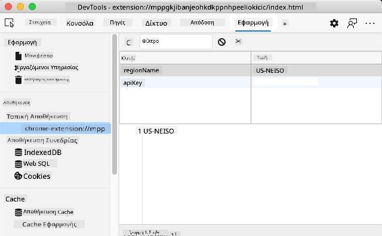

<!--
CO_OP_TRANSLATOR_METADATA:
{
  "original_hash": "8c8cd4af6086cc1d47e1d43aa4983d20",
  "translation_date": "2025-10-23T20:39:32+00:00",
  "source_file": "5-browser-extension/2-forms-browsers-local-storage/README.md",
  "language_code": "el"
}
-->
# Έργο Επέκτασης Περιηγητή Μέρος 2: Κλήση API, χρήση Τοπικής Αποθήκευσης

## Ερωτηματολόγιο πριν τη διάλεξη

[Ερωτηματολόγιο πριν τη διάλεξη](https://ff-quizzes.netlify.app/web/quiz/25)

## Εισαγωγή

Θυμάστε την επέκταση περιηγητή που ξεκινήσατε να δημιουργείτε; Αυτή τη στιγμή έχετε μια όμορφη φόρμα, αλλά είναι ουσιαστικά στατική. Σήμερα θα της δώσουμε ζωή συνδέοντάς την με πραγματικά δεδομένα και προσθέτοντας μνήμη.

Σκεφτείτε τους υπολογιστές ελέγχου της αποστολής Apollo - δεν έδειχναν απλώς σταθερές πληροφορίες. Επικοινωνούσαν συνεχώς με το διαστημόπλοιο, ενημερώνονταν με δεδομένα τηλεμετρίας και θυμούνταν κρίσιμες παραμέτρους της αποστολής. Αυτό το είδος δυναμικής συμπεριφοράς θα δημιουργήσουμε σήμερα. Η επέκτασή σας θα συνδεθεί με το διαδίκτυο, θα συλλέξει πραγματικά δεδομένα για το περιβάλλον και θα θυμάται τις ρυθμίσεις σας για την επόμενη φορά.

Η ενσωμάτωση API μπορεί να φαίνεται περίπλοκη, αλλά στην πραγματικότητα είναι απλώς η εκμάθηση του πώς να διδάξετε τον κώδικά σας να επικοινωνεί με άλλες υπηρεσίες. Είτε λαμβάνετε δεδομένα καιρού, ροές κοινωνικών μέσων ή πληροφορίες για το αποτύπωμα άνθρακα όπως θα κάνουμε σήμερα, όλα έχουν να κάνουν με τη δημιουργία αυτών των ψηφιακών συνδέσεων. Θα εξερευνήσουμε επίσης πώς οι περιηγητές μπορούν να διατηρούν πληροφορίες - παρόμοια με το πώς οι βιβλιοθήκες χρησιμοποιούσαν καταλόγους καρτών για να θυμούνται πού ανήκουν τα βιβλία.

Μέχρι το τέλος αυτού του μαθήματος, θα έχετε μια επέκταση περιηγητή που θα λαμβάνει πραγματικά δεδομένα, θα αποθηκεύει τις προτιμήσεις του χρήστη και θα παρέχει μια ομαλή εμπειρία. Ας ξεκινήσουμε!

✅ Ακολουθήστε τα αριθμημένα τμήματα στα αντίστοιχα αρχεία για να ξέρετε πού να τοποθετήσετε τον κώδικά σας.

## Ρύθμιση των στοιχείων για χειρισμό στην επέκταση

Πριν ο κώδικας JavaScript σας μπορέσει να χειριστεί τη διεπαφή, χρειάζεται αναφορές σε συγκεκριμένα στοιχεία HTML. Σκεφτείτε το σαν ένα τηλεσκόπιο που πρέπει να στραφεί σε συγκεκριμένα αστέρια - πριν ο Γαλιλαίος μπορέσει να μελετήσει τα φεγγάρια του Δία, έπρεπε να εντοπίσει και να εστιάσει στον ίδιο τον Δία.

Στο αρχείο σας `index.js`, θα δημιουργήσουμε μεταβλητές `const` που θα καταγράφουν αναφορές σε κάθε σημαντικό στοιχείο της φόρμας. Αυτό είναι παρόμοιο με το πώς οι επιστήμονες επισημαίνουν τον εξοπλισμό τους - αντί να ψάχνουν σε ολόκληρο το εργαστήριο κάθε φορά, μπορούν να έχουν άμεση πρόσβαση σε αυτό που χρειάζονται.

```javascript
// form fields
const form = document.querySelector('.form-data');
const region = document.querySelector('.region-name');
const apiKey = document.querySelector('.api-key');

// results
const errors = document.querySelector('.errors');
const loading = document.querySelector('.loading');
const results = document.querySelector('.result-container');
const usage = document.querySelector('.carbon-usage');
const fossilfuel = document.querySelector('.fossil-fuel');
const myregion = document.querySelector('.my-region');
const clearBtn = document.querySelector('.clear-btn');
```

**Τι κάνει αυτός ο κώδικας:**
- **Καταγράφει** στοιχεία της φόρμας χρησιμοποιώντας το `document.querySelector()` με επιλεγμένα CSS class selectors
- **Δημιουργεί** αναφορές σε πεδία εισαγωγής για το όνομα της περιοχής και το API key
- **Εγκαθιδρύει** συνδέσεις με στοιχεία εμφάνισης αποτελεσμάτων για δεδομένα χρήσης άνθρακα
- **Ρυθμίζει** την πρόσβαση σε στοιχεία της διεπαφής χρήστη όπως δείκτες φόρτωσης και μηνύματα σφάλματος
- **Αποθηκεύει** κάθε αναφορά στοιχείου σε μια μεταβλητή `const` για εύκολη επαναχρησιμοποίηση στον κώδικα

## Προσθήκη ακροατών συμβάντων

Τώρα θα κάνουμε την επέκτασή σας να ανταποκρίνεται στις ενέργειες του χρήστη. Οι ακροατές συμβάντων είναι ο τρόπος του κώδικα σας να παρακολουθεί τις αλληλεπιδράσεις του χρήστη. Σκεφτείτε τους σαν τους χειριστές στα πρώιμα τηλεφωνικά κέντρα - άκουγαν για εισερχόμενες κλήσεις και συνέδεαν τα σωστά κυκλώματα όταν κάποιος ήθελε να κάνει μια σύνδεση.

```javascript
form.addEventListener('submit', (e) => handleSubmit(e));
clearBtn.addEventListener('click', (e) => reset(e));
init();
```

**Κατανόηση αυτών των εννοιών:**
- **Προσθέτει** έναν ακροατή υποβολής στη φόρμα που ενεργοποιείται όταν οι χρήστες πατούν Enter ή κάνουν κλικ στο υποβολή
- **Συνδέει** έναν ακροατή κλικ στο κουμπί εκκαθάρισης για επαναφορά της φόρμας
- **Περνά** το αντικείμενο συμβάντος `(e)` στις συναρτήσεις χειρισμού για επιπλέον έλεγχο
- **Καλεί** τη συνάρτηση `init()` αμέσως για να ρυθμίσει την αρχική κατάσταση της επέκτασής σας

✅ Παρατηρήστε τη συντομευμένη σύνταξη με βέλος που χρησιμοποιείται εδώ. Αυτή η σύγχρονη προσέγγιση της JavaScript είναι πιο καθαρή από τις παραδοσιακές εκφράσεις συναρτήσεων, αλλά και οι δύο λειτουργούν εξίσου καλά!

## Δημιουργία των συναρτήσεων αρχικοποίησης και επαναφοράς

Ας δημιουργήσουμε τη λογική αρχικοποίησης για την επέκτασή σας. Η συνάρτηση `init()` είναι σαν το σύστημα πλοήγησης ενός πλοίου που ελέγχει τα όργανά του - καθορίζει την τρέχουσα κατάσταση και προσαρμόζει τη διεπαφή ανάλογα. Ελέγχει αν κάποιος έχει χρησιμοποιήσει την επέκτασή σας πριν και φορτώνει τις προηγούμενες ρυθμίσεις του.

Η συνάρτηση `reset()` παρέχει στους χρήστες μια νέα αρχή - παρόμοια με το πώς οι επιστήμονες επαναφέρουν τα όργανά τους μεταξύ πειραμάτων για να εξασφαλίσουν καθαρά δεδομένα.

```javascript
function init() {
	// Check if user has previously saved API credentials
	const storedApiKey = localStorage.getItem('apiKey');
	const storedRegion = localStorage.getItem('regionName');

	// Set extension icon to generic green (placeholder for future lesson)
	// TODO: Implement icon update in next lesson

	if (storedApiKey === null || storedRegion === null) {
		// First-time user: show the setup form
		form.style.display = 'block';
		results.style.display = 'none';
		loading.style.display = 'none';
		clearBtn.style.display = 'none';
		errors.textContent = '';
	} else {
		// Returning user: load their saved data automatically
		displayCarbonUsage(storedApiKey, storedRegion);
		results.style.display = 'none';
		form.style.display = 'none';
		clearBtn.style.display = 'block';
	}
}

function reset(e) {
	e.preventDefault();
	// Clear stored region to allow user to choose a new location
	localStorage.removeItem('regionName');
	// Restart the initialization process
	init();
}
```

**Ανάλυση του τι συμβαίνει εδώ:**
- **Ανακτά** αποθηκευμένο API key και περιοχή από την τοπική αποθήκευση του περιηγητή
- **Ελέγχει** αν πρόκειται για νέο χρήστη (χωρίς αποθηκευμένα στοιχεία) ή για επαναλαμβανόμενο χρήστη
- **Εμφανίζει** τη φόρμα ρύθμισης για νέους χρήστες και κρύβει άλλα στοιχεία της διεπαφής
- **Φορτώνει** αυτόματα αποθηκευμένα δεδομένα για επαναλαμβανόμενους χρήστες και εμφανίζει την επιλογή επαναφοράς
- **Διαχειρίζεται** την κατάσταση της διεπαφής χρήστη με βάση τα διαθέσιμα δεδομένα

**Βασικές έννοιες για την Τοπική Αποθήκευση:**
- **Διατηρεί** δεδομένα μεταξύ των συνεδριών του περιηγητή (σε αντίθεση με την προσωρινή αποθήκευση)
- **Αποθηκεύει** δεδομένα ως ζεύγη κλειδιού-τιμής χρησιμοποιώντας `getItem()` και `setItem()`
- **Επιστρέφει** `null` όταν δεν υπάρχουν δεδομένα για ένα συγκεκριμένο κλειδί
- **Παρέχει** έναν απλό τρόπο για να θυμάται τις προτιμήσεις και τις ρυθμίσεις του χρήστη

> 💡 **Κατανόηση της Αποθήκευσης στον Περιηγητή**: Η [Τοπική Αποθήκευση](https://developer.mozilla.org/docs/Web/API/Window/localStorage) είναι σαν να δίνετε στην επέκτασή σας μνήμη που διαρκεί. Σκεφτείτε πώς η αρχαία Βιβλιοθήκη της Αλεξάνδρειας αποθήκευε παπύρους - οι πληροφορίες παρέμεναν διαθέσιμες ακόμα και όταν οι μελετητές έφευγαν και επέστρεφαν.
>
> **Βασικά χαρακτηριστικά:**
> - **Διατηρεί** δεδομένα ακόμα και μετά το κλείσιμο του περιηγητή
> - **Επιβιώνει** επανεκκινήσεις υπολογιστή και καταρρεύσεις του περιηγητή
> - **Παρέχει** σημαντικό χώρο αποθήκευσης για τις προτιμήσεις του χρήστη
> - **Προσφέρει** άμεση πρόσβαση χωρίς καθυστερήσεις δικτύου

Μπορείτε να δείτε τα αποθηκευμένα δεδομένα σας ανοίγοντας τα Εργαλεία Προγραμματιστή του περιηγητή (F12), πηγαίνοντας στην καρτέλα **Εφαρμογή** και επεκτείνοντας την ενότητα **Τοπική Αποθήκευση**.



> ⚠️ **Σκέψη Ασφάλειας**: Στις εφαρμογές παραγωγής, η αποθήκευση API keys στην Τοπική Αποθήκευση ενέχει κινδύνους ασφαλείας, καθώς η JavaScript μπορεί να έχει πρόσβαση σε αυτά τα δεδομένα. Για εκπαιδευτικούς σκοπούς, αυτή η προσέγγιση λειτουργεί καλά, αλλά οι πραγματικές εφαρμογές πρέπει να χρησιμοποιούν ασφαλή αποθήκευση στον διακομιστή για ευαίσθητα διαπιστευτήρια.

## Χειρισμός υποβολής φόρμας

Τώρα θα χειριστούμε τι συμβαίνει όταν κάποιος υποβάλει τη φόρμα σας. Από προεπιλογή, οι περιηγητές ανανεώνουν τη σελίδα όταν υποβάλλονται φόρμες, αλλά θα αναχαιτίσουμε αυτή τη συμπεριφορά για να δημιουργήσουμε μια πιο ομαλή εμπειρία.

Αυτή η προσέγγιση μοιάζει με το πώς το κέντρο ελέγχου χειρίζεται τις επικοινωνίες με τα διαστημόπλοια - αντί να επαναφέρει ολόκληρο το σύστημα για κάθε μετάδοση, διατηρούν συνεχή λειτουργία ενώ επεξεργάζονται νέες πληροφορίες.

Δημιουργήστε μια συνάρτηση που καταγράφει το συμβάν υποβολής φόρμας και εξάγει την είσοδο του χρήστη:

```javascript
function handleSubmit(e) {
	e.preventDefault();
	setUpUser(apiKey.value, region.value);
}
```

**Στα παραπάνω, έχουμε:**
- **Αποτρέπει** την προεπιλεγμένη συμπεριφορά υποβολής φόρμας που θα ανανέωνε τη σελίδα
- **Εξάγει** τις τιμές εισόδου του χρήστη από τα πεδία API key και περιοχής
- **Περνά** τα δεδομένα της φόρμας στη συνάρτηση `setUpUser()` για επεξεργασία
- **Διατηρεί** τη συμπεριφορά εφαρμογής μιας σελίδας αποφεύγοντας την ανανέωση της σελίδας

✅ Θυμηθείτε ότι τα πεδία φόρμας HTML σας περιλαμβάνουν το χαρακτηριστικό `required`, οπότε ο περιηγητής ελέγχει αυτόματα ότι οι χρήστες παρέχουν τόσο το API key όσο και την περιοχή πριν εκτελεστεί αυτή η συνάρτηση.

## Ρύθμιση προτιμήσεων χρήστη

Η συνάρτηση `setUpUser` είναι υπεύθυνη για την αποθήκευση των διαπιστευτηρίων του χρήστη και την έναρξη της πρώτης κλήσης API. Αυτό δημιουργεί μια ομαλή μετάβαση από τη ρύθμιση στην εμφάνιση αποτελεσμάτων.

```javascript
function setUpUser(apiKey, regionName) {
	// Save user credentials for future sessions
	localStorage.setItem('apiKey', apiKey);
	localStorage.setItem('regionName', regionName);
	
	// Update UI to show loading state
	loading.style.display = 'block';
	errors.textContent = '';
	clearBtn.style.display = 'block';
	
	// Fetch carbon usage data with user's credentials
	displayCarbonUsage(apiKey, regionName);
}
```

**Βήμα προς βήμα, τι συμβαίνει εδώ:**
- **Αποθηκεύει** το API key και το όνομα της περιοχής στην τοπική αποθήκευση για μελλοντική χρήση
- **Εμφανίζει** έναν δείκτη φόρτωσης για να ενημερώσει τους χρήστες ότι τα δεδομένα ανακτώνται
- **Καθαρίζει** τυχόν προηγούμενα μηνύματα σφάλματος από την οθόνη
- **Αποκαλύπτει** το κουμπί εκκαθάρισης για να επαναφέρουν οι χρήστες τις ρυθμίσεις τους αργότερα
- **Ξεκινά** την κλήση API για την ανάκτηση πραγματικών δεδομένων χρήσης άνθρακα

Αυτή η συνάρτηση δημιουργεί μια ομαλή εμπειρία χρήστη διαχειριζόμενη τόσο την αποθήκευση δεδομένων όσο και τις ενημερώσεις της διεπαφής χρήστη σε μια συντονισμένη ενέργεια.

## Εμφάνιση δεδομένων χρήσης άνθρακα

Τώρα θα συνδέσουμε την επέκτασή σας με εξωτερικές πηγές δεδομένων μέσω APIs. Αυτό μετατρέπει την επέκτασή σας από ένα ανεξάρτητο εργαλείο σε κάτι που μπορεί να έχει πρόσβαση σε πληροφορίες σε πραγματικό χρόνο από όλο το διαδίκτυο.

**Κατανόηση των APIs**

Τα [APIs](https://www.webopedia.com/TERM/A/API.html) είναι ο τρόπος με τον οποίο διαφορετικές εφαρμογές επικοινωνούν μεταξύ τους. Σκεφτείτε τα σαν το σύστημα τηλεγράφου που συνέδεε απομακρυσμένες πόλεις τον 19ο αιώνα - οι χειριστές έστελναν αιτήματα σε απομακρυσμένους σταθμούς και λάμβαναν απαντήσεις με τις ζητούμενες πληροφορίες. Κάθε φορά που ελέγχετε τα κοινωνικά μέσα, κάνετε μια ερώτηση σε έναν φωνητικό βοηθό ή χρησιμοποιείτε μια εφαρμογή παράδοσης, τα APIs διευκολύνουν αυτές τις ανταλλαγές δεδομένων.

**Βασικές έννοιες για τα REST APIs:**
- **REST** σημαίνει 'Μεταφορά Αναπαραστασιακής Κατάστασης'
- **Χρησιμοποιεί** τυπικές μεθόδους HTTP (GET, POST, PUT, DELETE) για αλληλεπίδραση με δεδομένα
- **Επιστρέφει** δεδομένα σε προβλέψιμες μορφές, συνήθως JSON
- **Παρέχει** συνεπείς, βασισμένα σε URL endpoints για διαφορετικούς τύπους αιτημάτων

✅ Το [CO2 Signal API](https://www.co2signal.com/) που θα χρησιμοποιήσουμε παρέχει δεδομένα έντασης άνθρακα σε πραγματικό χρόνο από ηλεκτρικά δίκτυα παγκοσμίως. Αυτό βοηθά τους χρήστες να κατανοήσουν τον περιβαλλοντικό αντίκτυπο της χρήσης ηλεκτρικής ενέργειας τους!

> 💡 **Κατανόηση Ασύγχρονης JavaScript**: Η λέξη-κλειδί [`async`](https://developer.mozilla.org/docs/Web/JavaScript/Reference/Statements/async_function) επιτρέπει στον κώδικά σας να χειρίζεται πολλαπλές λειτουργίες ταυτόχρονα. Όταν ζητάτε δεδομένα από έναν διακομιστή, δεν θέλετε ολόκληρη η επέκταση σας να παγώσει - αυτό θα ήταν σαν ο έλεγχος εναέριας κυκλοφορίας να σταματήσει όλες τις λειτουργίες ενώ περιμένει μια απάντηση από ένα αεροπλάνο.
>
> **Βασικά οφέλη:**
> - **Διατηρεί** την ανταπόκριση της επέκτασης ενώ φορτώνονται τα δεδομένα
> - **Επιτρέπει** σε άλλον κώδικα να συνεχίσει να εκτελείται κατά τη διάρκεια αιτημάτων δικτύου
> - **Βελτιώνει** την αναγνωσιμότητα του κώδικα σε σύγκριση με παραδοσιακά μοτίβα callbacks
> - **Επιτρέπει** κομψό χειρισμό σφαλμάτων για προβλήματα δικτύου

Δημιουργήστε τη συνάρτηση για την ανάκτηση και εμφάνιση δεδομένων χρήσης άνθρακα:

```javascript
// Modern fetch API approach (no external dependencies needed)
async function displayCarbonUsage(apiKey, region) {
	try {
		// Fetch carbon intensity data from CO2 Signal API
		const response = await fetch('https://api.co2signal.com/v1/latest', {
			method: 'GET',
			headers: {
				'auth-token': apiKey,
				'Content-Type': 'application/json'
			},
			// Add query parameters for the specific region
			...new URLSearchParams({ countryCode: region }) && {
				url: `https://api.co2signal.com/v1/latest?countryCode=${region}`
			}
		});

		// Check if the API request was successful
		if (!response.ok) {
			throw new Error(`API request failed: ${response.status}`);
		}

		const data = await response.json();
		const carbonData = data.data;

		// Calculate rounded carbon intensity value
		const carbonIntensity = Math.round(carbonData.carbonIntensity);

		// Update the user interface with fetched data
		loading.style.display = 'none';
		form.style.display = 'none';
		myregion.textContent = region.toUpperCase();
		usage.textContent = `${carbonIntensity} grams (grams CO₂ emitted per kilowatt hour)`;
		fossilfuel.textContent = `${carbonData.fossilFuelPercentage.toFixed(2)}% (percentage of fossil fuels used to generate electricity)`;
		results.style.display = 'block';

		// TODO: calculateColor(carbonIntensity) - implement in next lesson

	} catch (error) {
		console.error('Error fetching carbon data:', error);
		
		// Show user-friendly error message
		loading.style.display = 'none';
		results.style.display = 'none';
		errors.textContent = 'Sorry, we couldn\'t fetch data for that region. Please check your API key and region code.';
	}
}
```

**Ανάλυση του τι συμβαίνει εδώ:**
- **Χρησιμοποιεί** το σύγχρονο API `fetch()` αντί για εξωτερικές βιβλιοθήκες όπως το Axios για καθαρότερο, χωρίς εξαρτήσεις κώδικα
- **Εφαρμόζει** σωστό έλεγχο σφαλμάτων με το `response.ok` για να εντοπίζει αποτυχίες API νωρίς
- **Χειρίζεται** ασύγχρονες λειτουργίες με `async/await` για πιο αναγνώσιμο ροή κώδικα
- **Αυθεντικοποιεί** με το CO2 Signal API χρησιμοποιώντας την κεφαλίδα `auth-token`
- **Αναλύει** δεδομένα JSON απόκρισης και εξάγει πληροφορίες έντασης άνθρακα
- **Ενημερώνει** πολλαπλά στοιχεία της διεπαφής χρήστη με μορφοποιημένα περιβαλλοντικά δεδομένα
- **Παρέχει** φιλικά προς τον χρήστη μηνύματα σφάλματος όταν οι κλήσεις API αποτυγχάνουν

**Βασικές σύγχρονες έννοιες JavaScript που επιδεικνύονται:**
- **Template literals** με σύνταξη `${}` για καθα
Μάθατε για το LocalStorage και τα APIs σε αυτό το μάθημα, και τα δύο είναι πολύ χρήσιμα για τον επαγγελματία προγραμματιστή ιστού. Μπορείτε να σκεφτείτε πώς αυτά τα δύο πράγματα συνεργάζονται; Σκεφτείτε πώς θα σχεδιάζατε έναν ιστότοπο που θα αποθηκεύει αντικείμενα για χρήση από ένα API.

## Εργασία

[Υιοθετήστε ένα API](assignment.md)

---

**Αποποίηση ευθύνης**:  
Αυτό το έγγραφο έχει μεταφραστεί χρησιμοποιώντας την υπηρεσία αυτόματης μετάφρασης [Co-op Translator](https://github.com/Azure/co-op-translator). Παρόλο που καταβάλλουμε προσπάθειες για ακρίβεια, παρακαλούμε να έχετε υπόψη ότι οι αυτόματες μεταφράσεις ενδέχεται να περιέχουν λάθη ή ανακρίβειες. Το πρωτότυπο έγγραφο στη μητρική του γλώσσα θα πρέπει να θεωρείται η αυθεντική πηγή. Για κρίσιμες πληροφορίες, συνιστάται επαγγελματική ανθρώπινη μετάφραση. Δεν φέρουμε ευθύνη για τυχόν παρεξηγήσεις ή εσφαλμένες ερμηνείες που προκύπτουν από τη χρήση αυτής της μετάφρασης.