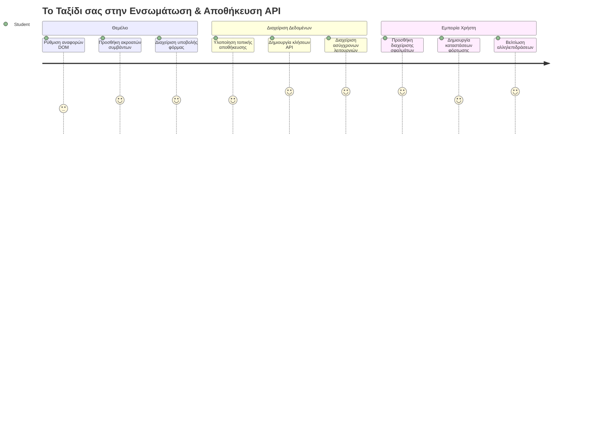
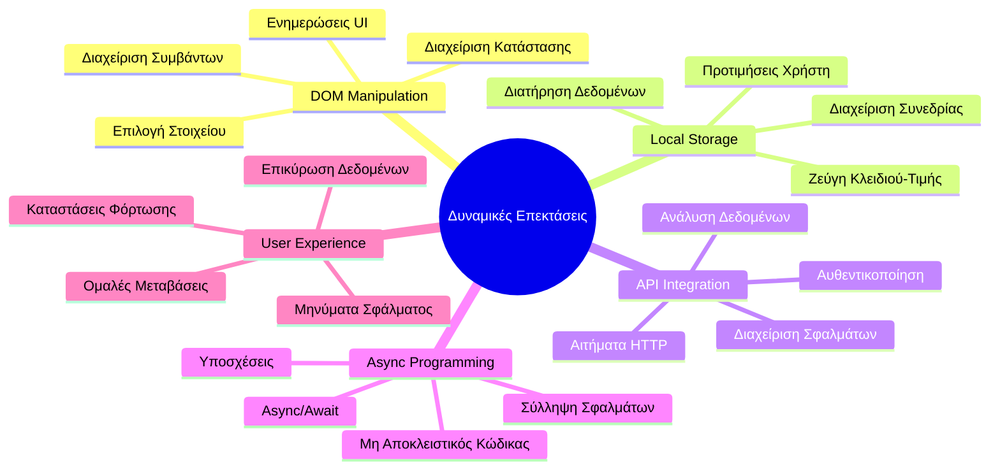
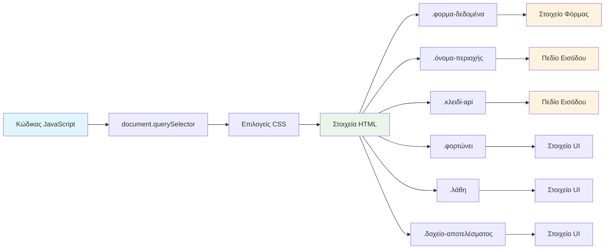
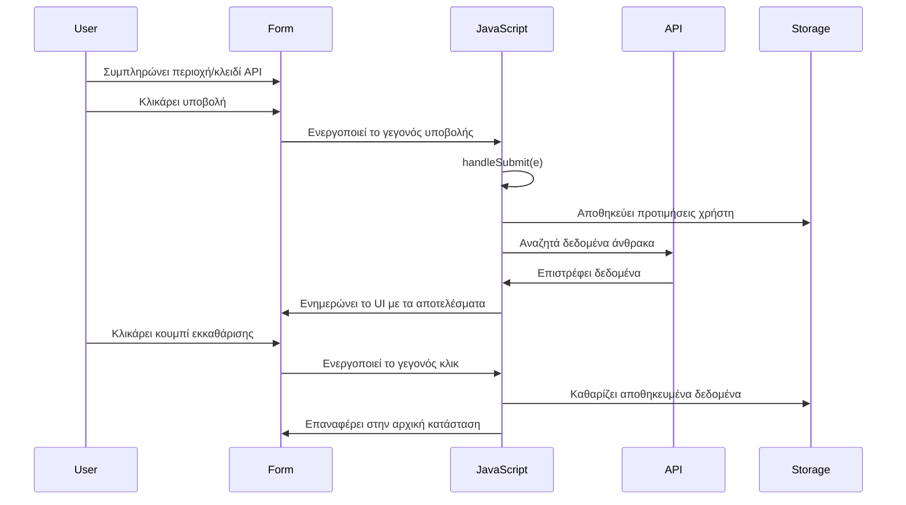
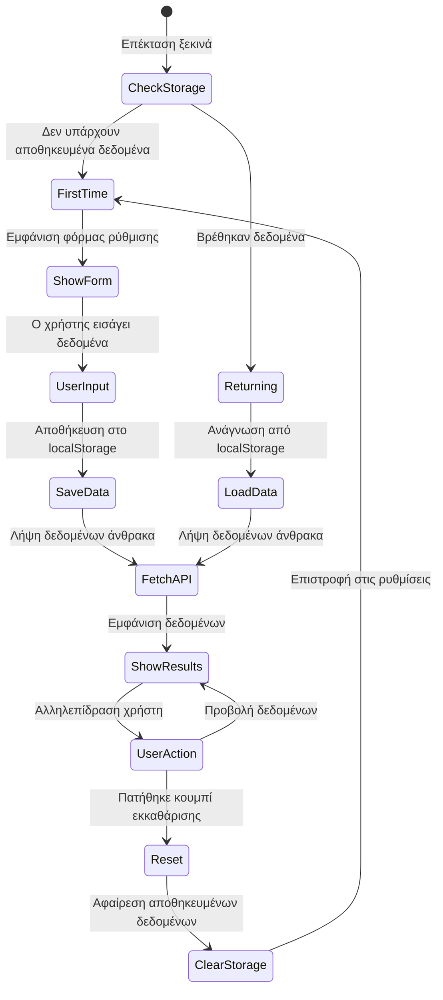
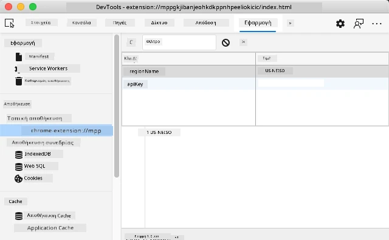
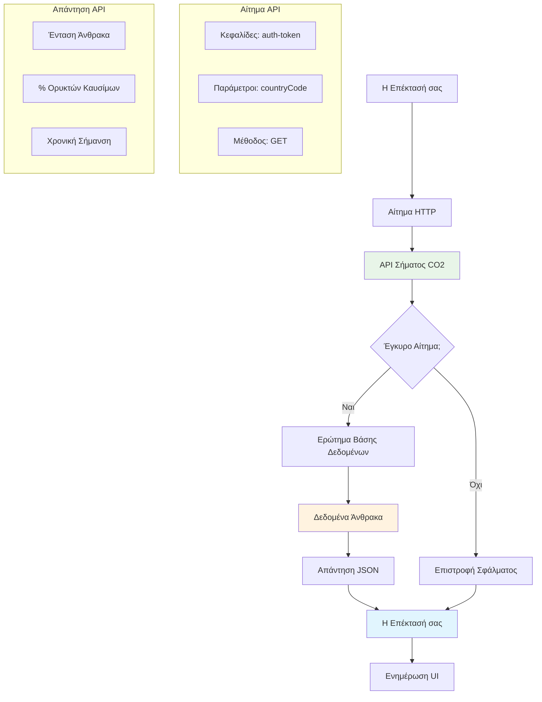
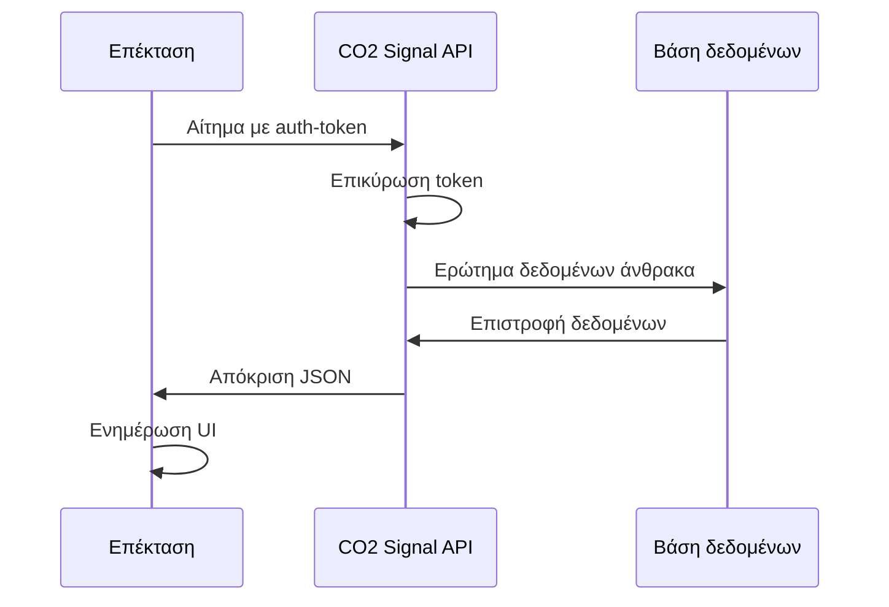
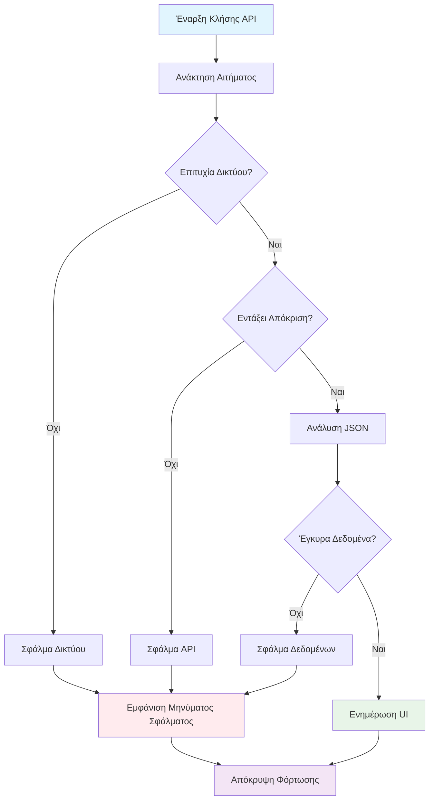
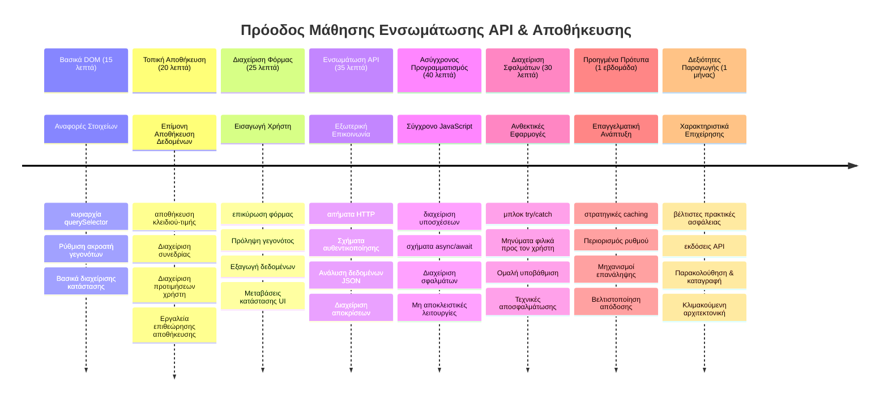

<!--
CO_OP_TRANSLATOR_METADATA:
{
  "original_hash": "2b6203a48c48d8234e0948353b47d84e",
  "translation_date": "2026-01-06T20:43:40+00:00",
  "source_file": "5-browser-extension/2-forms-browsers-local-storage/README.md",
  "language_code": "el"
}
-->
# Πρότζεκτ Επέκτασης Προγράμματος Περιήγησης Μέρος 2: Κλήση API, χρήση Local Storage


## Προ-διάλεξη Κουίζ

[Προ-διάλεξη κουίζ](https://ff-quizzes.netlify.app/web/quiz/25)

## Εισαγωγή

Θυμάσαι εκείνη την επέκταση προγράμματος περιήγησης που άρχισες να φτιάχνεις; Αυτή τη στιγμή έχεις μια όμορφη φόρμα, αλλά είναι ουσιαστικά στατική. Σήμερα θα τη ζωντανέψουμε συνδέοντάς την με πραγματικά δεδομένα και δίνοντάς της μνήμη.

Σκέψου τους υπολογιστές ελέγχου της αποστολής Apollo - δεν απλά εμφάνιζαν σταθερές πληροφορίες. Επικοινωνούσαν συνεχώς με το διαστημόπλοιο, ενημερώνονταν με τηλεμετρία και θυμόνταν κρίσιμες παραμέτρους της αποστολής. Αυτό το είδος δυναμικής συμπεριφοράς κατασκευάζουμε σήμερα. Η επέκτασή σου θα συνδεθεί με το διαδίκτυο, θα τραβήξει πραγματικά περιβαλλοντικά δεδομένα και θα θυμάται τις ρυθμίσεις σου για την επόμενη φορά.

Η ενσωμάτωση API μπορεί να ακούγεται πολύπλοκη, αλλά είναι ουσιαστικά το να διδάξεις τον κώδικά σου πώς να επικοινωνεί με άλλες υπηρεσίες. Είτε τραβάς δεδομένα καιρού, ροές κοινωνικών δικτύων ή πληροφορίες αποτυπώματος άνθρακα όπως θα κάνουμε σήμερα, όλα έχουν να κάνουν με την εγκαθίδρυση αυτών των ψηφιακών συνδέσεων. Επίσης, θα εξερευνήσουμε πώς οι φυλλομετρητές μπορούν να διατηρούν πληροφορίες - όπως οι βιβλιοθήκες χρησιμοποιούσαν κατάλογους καρτών για να θυμούνται πού ανήκαν τα βιβλία.

Στο τέλος αυτού του μαθήματος, θα έχεις μια επέκταση προγράμματος περιήγησης που τραβάει πραγματικά δεδομένα, αποθηκεύει τις προτιμήσεις του χρήστη και παρέχει ομαλή εμπειρία. Ας ξεκινήσουμε!


✅ Ακολούθησε τα αρίθμημένα τμήματα στα κατάλληλα αρχεία για να ξέρεις πού να τοποθετήσεις τον κώδικά σου

## Ρύθμιση των στοιχείων για διαχείριση στην επέκταση

Πριν ο JavaScript σου μπορέσει να χειριστεί τη διεπαφή, χρειάζεται αναφορές σε συγκεκριμένα στοιχεία HTML. Σκέψου το σαν ένα τηλεσκόπιο που πρέπει να στοχεύσει συγκεκριμένα αστέρια - πριν ο Γαλιλαίος μπορέσει να μελετήσει τους δορυφόρους του Δία, έπρεπε να εντοπίσει και να εστιάσει στον ίδιο τον Δία.

Στο αρχείο `index.js`, θα δημιουργήσουμε μεταβλητές `const` που αποθηκεύουν αναφορές σε κάθε σημαντικό στοιχείο φόρμας. Αυτό είναι παρόμοιο με το πως οι επιστήμονες επισημαίνουν τον εξοπλισμό τους - αντί να ψάχνουν σε όλο το εργαστήριο κάθε φορά, μπορούν να έχουν άμεση πρόσβαση σε ό,τι χρειάζονται.


```javascript
// πεδία φόρμας
const form = document.querySelector('.form-data');
const region = document.querySelector('.region-name');
const apiKey = document.querySelector('.api-key');

// αποτελέσματα
const errors = document.querySelector('.errors');
const loading = document.querySelector('.loading');
const results = document.querySelector('.result-container');
const usage = document.querySelector('.carbon-usage');
const fossilfuel = document.querySelector('.fossil-fuel');
const myregion = document.querySelector('.my-region');
const clearBtn = document.querySelector('.clear-btn');
```

**Αυτά που κάνει ο κώδικας:**
- **Αποθηκεύει** στοιχεία φόρμας χρησιμοποιώντας `document.querySelector()` με επιλεκτές κλάσης CSS
- **Δημιουργεί** αναφορές σε πεδία εισόδου για το όνομα περιοχής και το κλειδί API
- **Εδραιώνει** συνδέσεις με στοιχεία εμφάνισης αποτελεσμάτων για δεδομένα χρήσης άνθρακα
- **Ορίζει** πρόσβαση σε στοιχεία UI όπως δείκτες φόρτωσης και μηνύματα λάθους
- **Φυλάσσει** κάθε αναφορά σε μεταβλητή `const` για εύκολη επαναχρησιμοποίηση σε όλο τον κώδικά σου

## Πρόσθεσε ακροατές γεγονότων

Τώρα θα κάνουμε την επέκτασή σου να ανταποκρίνεται σε ενέργειες του χρήστη. Οι ακροατές γεγονότων είναι ο τρόπος του κώδικά σου να παρακολουθεί τις αλληλεπιδράσεις του χρήστη. Σκέψου τους σαν τους τηλεφωνητές στις πρώτες τηλεφωνικές κέντρα - άκουγαν για εισερχόμενες κλήσεις και συνδέανε τους κατάλληλους κυκλώματα όταν κάποιος ήθελε να κάνει σύνδεση.


```javascript
form.addEventListener('submit', (e) => handleSubmit(e));
clearBtn.addEventListener('click', (e) => reset(e));
init();
```

**Κατανόηση αυτών των εννοιών:**
- **Συνδέει** ακροατή υποβολής στη φόρμα που ενεργοποιείται όταν ο χρήστης πατήσει Enter ή υποβάλει
- **Συνδέει** ακροατή κλικ στο κουμπί καθαρισμού για επαναφορά της φόρμας
- **Μεταφέρει** το αντικείμενο γεγονότος `(e)` στις συναρτήσεις χειρισμού για επιπλέον έλεγχο
- **Καλεί** αμέσως τη συνάρτηση `init()` για να ρυθμίσει την αρχική κατάσταση της επέκτασής σου

✅ Πρόσεξε τη σύντομη σύνταξη βέλους που χρησιμοποιείται εδώ. Αυτή η μοντέρνα προσέγγιση JavaScript είναι πιο καθαρή από τις παραδοσιακές εκφράσεις συναρτήσεων, αλλά και οι δύο δουλεύουν εξίσου καλά!

### 🔄 **Παιδαγωγικός Έλεγχος**
**Κατανόηση Χειρισμού Γεγονότων**: Πριν προχωρήσεις στην αρχικοποίηση, βεβαιώσου ότι μπορείς να:
- ✅ Εξηγήσεις πώς το `addEventListener` συνδέει τις ενέργειες του χρήστη με τις συναρτήσεις JavaScript
- ✅ Κατανοήσεις γιατί περνάμε το αντικείμενο γεγονότος `(e)` στις συναρτήσεις χειρισμού
- ✅ Αναγνωρίσεις τη διαφορά μεταξύ γεγονότων `submit` και `click`
- ✅ Περιγράψεις πότε εκτελείται η συνάρτηση `init()` και γιατί

**Γρήγορο Αυτο-Τεστ**: Τι συμβαίνει αν ξεχάσεις το `e.preventDefault()` σε υποβολή φόρμας;
*Απάντηση: Η σελίδα θα ανανεωθεί, χάνοντας όλη την κατάσταση του JavaScript και διακόπτοντας την εμπειρία χρήστη*

## Δημιουργία συναρτήσεων αρχικοποίησης και επαναφοράς

Ας φτιάξουμε τη λογική αρχικοποίησης για την επέκτασή σου. Η συνάρτηση `init()` είναι σαν το σύστημα πλοήγησης ενός πλοίου που ελέγχει τα όργανα - καθορίζει την τρέχουσα κατάσταση και προσαρμόζει τη διεπαφή αναλόγως. Ελέγχει αν κάποιος έχει χρησιμοποιήσει την επέκταση πριν και φορτώνει τις προηγούμενες ρυθμίσεις.

Η συνάρτηση `reset()` προσφέρει στους χρήστες μια καθαρή αρχή - όπως οι επιστήμονες που επαναφέρουν τα όργανα ανάμεσα στα πειράματα για να εξασφαλίσουν καθαρά δεδομένα.

```javascript
function init() {
	// Ελέγξτε αν ο χρήστης έχει προηγουμένως αποθηκεύσει διαπιστευτήρια API
	const storedApiKey = localStorage.getItem('apiKey');
	const storedRegion = localStorage.getItem('regionName');

	// Ορίστε το εικονίδιο της επέκτασης σε γενικό πράσινο ( προσωρινό για μελλοντικά μαθήματα)
	// TODO: Υλοποιήστε ενημέρωση εικονιδίου στο επόμενο μάθημα

	if (storedApiKey === null || storedRegion === null) {
		// Χρήστης που χρησιμοποιεί για πρώτη φορά: εμφανίστε τη φόρμα ρύθμισης
		form.style.display = 'block';
		results.style.display = 'none';
		loading.style.display = 'none';
		clearBtn.style.display = 'none';
		errors.textContent = '';
	} else {
		// Επιστρέφων χρήστης: φορτώστε αυτόματα τα αποθηκευμένα δεδομένα τους
		displayCarbonUsage(storedApiKey, storedRegion);
		results.style.display = 'none';
		form.style.display = 'none';
		clearBtn.style.display = 'block';
	}
}

function reset(e) {
	e.preventDefault();
	// Καθαρίστε την αποθηκευμένη περιοχή για να επιτρέψετε στον χρήστη να επιλέξει νέα τοποθεσία
	localStorage.removeItem('regionName');
	// Επανεκκινήστε τη διαδικασία αρχικοποίησης
	init();
}
```

**Ανάλυση των όσων συμβαίνουν εδώ:**
- **Ανακτά** το αποθηκευμένο κλειδί API και την περιοχή από το τοπικό αποθηκευτικό χώρο του φυλλομετρητή
- **Ελέγχει** αν είναι η πρώτη φορά χρήσης (χωρίς αποθηκευμένα στοιχεία) ή επαναλαμβανόμενος χρήστης
- **Εμφανίζει** τη φόρμα ρύθμισης για νέους χρήστες και κρύβει άλλα στοιχεία διεπαφής
- **Φορτώνει** αυτόματα αποθηκευμένα δεδομένα για επαναλαμβανόμενους χρήστες και δείχνει την επιλογή επαναφοράς
- **Διαχειρίζεται** την κατάσταση της διεπαφής ανάλογα με τα διαθέσιμα δεδομένα

**Σημαντικές έννοιες για το Local Storage:**
- **Διατηρεί** δεδομένα μεταξύ συνεδριών προγράμματος περιήγησης (σε αντίθεση με το session storage)
- **Αποθηκεύει** δεδομένα σε ζευγάρια κλειδιού-τιμής χρησιμοποιώντας `getItem()` και `setItem()`
- **Επιστρέφει** `null` όταν δεν υπάρχουν δεδομένα για το δοσμένο κλειδί
- **Παρέχει** έναν απλό τρόπο να θυμάται προτιμήσεις και ρυθμίσεις χρήστη

> 💡 **Κατανόηση της Αποθήκευσης Φυλλομετρητή**: Το [LocalStorage](https://developer.mozilla.org/docs/Web/API/Window/localStorage) μοιάζει με το να δίνεις στην επέκτασή σου μόνιμη μνήμη. Σκέψου πώς η αρχαία Βιβλιοθήκη της Αλεξάνδρειας αποθήκευε περγαμηνές - οι πληροφορίες παρέμεναν διαθέσιμες ακόμα και όταν οι μελετητές έφευγαν και επέστρεφαν.
>
> **Βασικά χαρακτηριστικά:**
> - **Διατηρεί** δεδομένα ακόμα και μετά το κλείσιμο του φυλλομετρητή σου
> - **Αντέχει** επανεκκινήσεις υπολογιστή και κρασάρισμα του φυλλομετρητή
> - **Παρέχει** σημαντικό χώρο αποθήκευσης για προτιμήσεις χρήστη
> - **Προσφέρει** άμεση πρόσβαση χωρίς καθυστερήσεις δικτύου

> **Σημαντική Σημείωση**: Η επέκτασή σου έχει τον δικό της απομονωμένο τοπικό αποθηκευτικό χώρο που είναι ξεχωριστός από τις κανονικές ιστοσελίδες. Αυτό προσφέρει ασφάλεια και αποτρέπει συγκρούσεις με άλλους ιστότοπους.

Μπορείς να δεις τα αποθηκευμένα δεδομένα σου ανοίγοντας τα Εργαλεία Ανάπτυξης του φυλλομετρητή (F12), πηγαίνοντας στην καρτέλα **Application**, και επεκτείνοντας την ενότητα **Local Storage**.




> ⚠️ **Ασφαλής Εξέταση**: Σε παραγωγικές εφαρμογές, η αποθήκευση κλειδιών API στο LocalStorage εγκυμονεί κινδύνους ασφάλειας αφού ο JavaScript μπορεί να αποκτήσει πρόσβαση σε αυτά τα δεδομένα. Για εκπαιδευτικούς σκοπούς, αυτή η προσέγγιση λειτουργεί καλά, αλλά πραγματικές εφαρμογές πρέπει να χρησιμοποιούν ασφαλή αποθήκευση στον server για ευαίσθητα διαπιστευτήρια.

## Χειρισμός υποβολής φόρμας

Τώρα θα χειριστούμε τι συμβαίνει όταν κάποιος υποβάλλει τη φόρμα σου. Από προεπιλογή, οι φυλλομετρητές ανανεώνουν τη σελίδα όταν υποβάλλονται φόρμες, αλλά θα παρεμποδίσουμε αυτή τη συμπεριφορά για μια πιο ομαλή εμπειρία.

Αυτή η προσέγγιση μιμείται το πώς ο έλεγχος αποστολής χειρίζεται την επικοινωνία με τα διαστημόπλοια - αντί να επανεκκινούν ολόκληρο το σύστημα για κάθε μετάδοση, διατηρούν συνεχή λειτουργία επεξεργάζοντας νέες πληροφορίες.

Δημιούργησε μια συνάρτηση που καταγράφει το γεγονός υποβολής της φόρμας και εξάγει τις εισόδους του χρήστη:

```javascript
function handleSubmit(e) {
	e.preventDefault();
	setUpUser(apiKey.value, region.value);
}
```

**Στο παραπάνω, έχουμε:**
- **Αποτρέπει** την προκαθορισμένη συμπεριφορά υποβολής φόρμας που θα ανανεώσει τη σελίδα
- **Εξάγει** τιμές εισόδου χρήστη από τα πεδία κλειδιού API και περιοχής
- **Περνά** τα δεδομένα της φόρμας στη συνάρτηση `setUpUser()` για επεξεργασία
- **Διατηρεί** τη συμπεριφορά εφαρμογής μονής σελίδας αποφεύγοντας ανανεώσεις

✅ Θυμήσου ότι τα πεδία της φόρμας HTML έχουν το χαρακτηριστικό `required`, οπότε ο φυλλομετρητής ελέγχει αυτόματα αν ο χρήστης παρείχε τόσο το κλειδί API όσο και την περιοχή πριν εκτελεστεί αυτή η λειτουργία.

## Ρύθμιση προτιμήσεων χρήστη

Η συνάρτηση `setUpUser` είναι υπεύθυνη για την αποθήκευση των διαπιστευτηρίων χρήστη και την εκκίνηση της πρώτης κλήσης API. Αυτό δημιουργεί μια ομαλή μετάβαση από τη ρύθμιση στην εμφάνιση αποτελεσμάτων.

```javascript
function setUpUser(apiKey, regionName) {
	// Αποθήκευση διαπιστευτηρίων χρήστη για μελλοντικές συνεδρίες
	localStorage.setItem('apiKey', apiKey);
	localStorage.setItem('regionName', regionName);
	
	// Ενημέρωση διεπαφής χρήστη για εμφάνιση κατάστασης φόρτωσης
	loading.style.display = 'block';
	errors.textContent = '';
	clearBtn.style.display = 'block';
	
	// Ανάκτηση δεδομένων χρήσης άνθρακα με τα διαπιστευτήρια του χρήστη
	displayCarbonUsage(apiKey, regionName);
}
```

**Βήμα βήμα, εδώ γίνεται:**
- **Αποθηκεύει** το κλειδί API και το όνομα περιοχής στο τοπικό αποθηκευτικό χώρο για μελλοντική χρήση
- **Εμφανίζει** δείκτη φόρτωσης για να ενημερώσει τους χρήστες ότι τα δεδομένα ανακτώνται
- **Καθαρίζει** τυχόν προηγούμενα μηνύματα λάθους από την οθόνη
- **Αποκαλύπτει** το κουμπί καθαρισμού για να επαναφέρουν αργότερα τις ρυθμίσεις τους οι χρήστες
- **Ξεκινά** την κλήση API για ανάκτηση πραγματικών δεδομένων χρήσης άνθρακα

Αυτή η συνάρτηση δημιουργεί μια ομαλή εμπειρία χρήστη διαχειριζόμενη τόσο την επίμονη αποθήκευση όσο και τις ενημερώσεις διεπαφής σε μια συντονισμένη ενέργεια.

## Εμφάνιση δεδομένων χρήσης άνθρακα

Τώρα θα συνδέσουμε την επέκτασή σου με εξωτερικές πηγές δεδομένων μέσω APIs. Αυτό μετατρέπει την επέκτασή σου από ένα αυτόνομο εργαλείο σε κάτι που μπορεί να έχει πρόσβαση σε πληροφορίες σε πραγματικό χρόνο από ολόκληρο το διαδίκτυο.

**Κατανόηση των APIs**

[Τα API](https://www.webopedia.com/TERM/A/API.html) είναι ο τρόπος που διαφορετικές εφαρμογές επικοινωνούν μεταξύ τους. Σκέψου τα σαν το σύστημα του τηλέγραφου που συνέδεε μακρινές πόλεις τον 19ο αιώνα - οι τηλεγραφητές έστελναν αιτήματα σε απομακρυσμένους σταθμούς και λάμβαναν απαντήσεις με τις ζητούμενες πληροφορίες. Κάθε φορά που ελέγχεις τα κοινωνικά δίκτυα, ρωτάς έναν φωνητικό βοηθό ή χρησιμοποιείς μια εφαρμογή διανομής, τα APIs διευκολύνουν αυτές τις ανταλλαγές δεδομένων.


**Βασικές έννοιες για τα REST APIs:**
- **REST** σημαίνει 'Representational State Transfer'
- **Χρησιμοποιεί** τυπικές μεθόδους HTTP (GET, POST, PUT, DELETE) για αλληλεπίδραση με δεδομένα
- **Επιστρέφει** δεδομένα σε προβλέψιμα φορμά, συνήθως JSON
- **Προσφέρει** συνεπή, βασισμένα σε URL τελικά σημεία για διαφορετικούς τύπους αιτημάτων

✅ Το [CO2 Signal API](https://www.co2signal.com/) που θα χρησιμοποιήσουμε παρέχει δεδομένα έντασης άνθρακα σε πραγματικό χρόνο από δίκτυα ηλεκτρικής ενέργειας παγκοσμίως. Αυτό βοηθά τους χρήστες να κατανοήσουν τον περιβαλλοντικό αντίκτυπο της κατανάλωσης ενέργειας τους!

> 💡 **Κατανόηση Ασύγχρονου JavaScript**: Η λέξη-κλειδί [`async`](https://developer.mozilla.org/docs/Web/JavaScript/Reference/Statements/async_function) επιτρέπει στον κώδικά σου να χειρίζεται πολλαπλές λειτουργίες ταυτόχρονα. Όταν ζητάς δεδομένα από έναν server, δεν θέλεις ολόκληρη η επέκταση σου να παγώνει - θα ήταν σαν ο έλεγχος εναέριας κυκλοφορίας να σταματά όλες τις εργασίες περιμένοντας ένα αεροπλάνο να απαντήσει.
>
> **Βασικά οφέλη:**
> - **Διατηρεί** την ανταπόκριση της επέκτασης όσο φορτώνουν δεδομένα
> - **Επιτρέπει** άλλο κώδικα να εκτελείται κατά τη διάρκεια δικτυακών αιτημάτων
> - **Βελτιώνει** την αναγνωσιμότητα κώδικα σε σχέση με παραδοσιακά μοτίβα callback
> - **Επιτρέπει** ομαλό χειρισμό σφαλμάτων δικτύου

Να ένα σύντομο βίντεο για το `async`:

[](https://youtube.com/watch?v=YwmlRkrxvkk "Async and Await για διαχείριση υποσχέσεων")

> 🎥 Πάτησε την εικόνα για βίντεο σχετικά με async/await.

### 🔄 **Παιδαγωγικός Έλεγχος**
**Κατανόηση Ασύγχρονης Προγραμματισμού**: Πριν βουτήξεις στη συνάρτηση API, βεβαιώσου ότι κατανοείς:
- ✅ Γιατί χρησιμοποιούμε `async/await` αντί να μπλοκάρουμε ολόκληρη την επέκταση
- ✅ Πώς τα μπλοκ `try/catch` χειρίζονται ομαλά σφάλματα δικτύου
- ✅ Τη διαφορά μεταξύ συγχρονικών και ασύγχρονων λειτουργιών
- ✅ Γιατί οι κλήσεις API μπορεί να αποτύχουν και πώς να χειρίζεσαι αυτές τις αποτυχίες

**Σύνδεση με Πραγματική Ζωή**: Σκέψου αυτά τα καθημερινά async παραδείγματα:
- **Παραγγελία φαγητού**: Δεν περιμένεις στην κουζίνα - παίρνεις απόδειξη και συνεχίζεις άλλες δραστηριότητες
- **Αποστολή email**: Η εφαρμογή email δεν παγώνει όσο στέλνεις - μπορείς να συντάξεις κι άλλα emails
- **Φόρτωση ιστοσελίδων**: Οι εικόνες φορτώνουν προοδευτικά ενώ μπορείς ήδη να διαβάσεις το κείμενο

**Ροή Επαλήθευσης API**:

Δημιούργησε τη συνάρτηση που τραβά και εμφανίζει τα δεδομένα χρήσης άνθρακα:

```javascript
// Σύγχρονη προσέγγιση fetch API (χωρίς ανάγκη εξωτερικών εξαρτήσεων)
async function displayCarbonUsage(apiKey, region) {
	try {
		// Ανάκτηση δεδομένων έντασης άνθρακα από το CO2 Signal API
		const response = await fetch('https://api.co2signal.com/v1/latest', {
			method: 'GET',
			headers: {
				'auth-token': apiKey,
				'Content-Type': 'application/json'
			},
			// Προσθήκη παραμέτρων ερωτήματος για συγκεκριμένη περιοχή
			...new URLSearchParams({ countryCode: region }) && {
				url: `https://api.co2signal.com/v1/latest?countryCode=${region}`
			}
		});

		// Έλεγχος αν το αίτημα API ήταν επιτυχές
		if (!response.ok) {
			throw new Error(`API request failed: ${response.status}`);
		}

		const data = await response.json();
		const carbonData = data.data;

		// Υπολογισμός στρογγυλοποιημένης τιμής έντασης άνθρακα
		const carbonIntensity = Math.round(carbonData.carbonIntensity);

		// Ενημέρωση του περιβάλλοντος χρήστη με τα ληφθέντα δεδομένα
		loading.style.display = 'none';
		form.style.display = 'none';
		myregion.textContent = region.toUpperCase();
		usage.textContent = `${carbonIntensity} grams (grams CO₂ emitted per kilowatt hour)`;
		fossilfuel.textContent = `${carbonData.fossilFuelPercentage.toFixed(2)}% (percentage of fossil fuels used to generate electricity)`;
		results.style.display = 'block';

		// TODO: calculateColor(carbonIntensity) - υλοποίηση στο επόμενο μάθημα

	} catch (error) {
		console.error('Error fetching carbon data:', error);
		
		// Εμφάνιση φιλικού προς τον χρήστη μηνύματος σφάλματος
		loading.style.display = 'none';
		results.style.display = 'none';
		errors.textContent = 'Sorry, we couldn\'t fetch data for that region. Please check your API key and region code.';
	}
}
```

**Ανάλυση όσων γίνονται εδώ:**
- **Χρησιμοποιεί** το σύγχρονο API `fetch()` αντί εξωτερικών βιβλιοθηκών όπως το Axios για πιο καθαρό κώδικα χωρίς εξαρτήσεις
- **Εφαρμόζει** σωστό έλεγχο λάθους με `response.ok` για έγκαιρο εντοπισμό αποτυχιών API
- **Χειρίζεται** ασύγχρονες λειτουργίες με `async/await` για πιο ευανάγνωστη ροή κώδικα
- **Πραγματοποιεί** αυθεντικοποίηση με το CO2 Signal API μέσω της κεφαλίδας `auth-token`
- **Αναλύει** τα δεδομένα JSON και εξάγει πληροφορίες άνθρακα
- **Ενημερώνει** πολλά στοιχεία UI με μορφοποιημένα περιβαλλοντικά δεδομένα
- **Παρέχει** φιλικά μηνύματα σφάλματος όταν αποτυγχάνουν οι κλήσεις API

**Βασικές σύγχρονες έννοιες JavaScript που αποδεικνύονται:**
- **Λογαριθμικές αλυσίδες** με τη σύνταξη `${}` για καθαρή μορφοποίηση συμβολοσειρών
- **Χειρισμός σφαλμάτων** με μπλοκ try/catch για ανθεκτικές εφαρμογές
- **Ασύγχρονο μοτίβο** async/await για ομαλό χειρισμό δικτυακών αιτημάτων
- **Αποδόμηση αντικειμένου** για εξαγωγή συγκεκριμένων δεδομένων από απαντήσεις API
- **Αλυσίδωση μεθόδων** για πολλαπλές χειρισμούς DOM

✅ Αυτή η συνάρτηση παρουσιάζει αρκετές σημαντικές έννοιες ανάπτυξης διαδικτύου - επικοινωνία με εξωτερικούς servers, χειρισμό αυθεντικοποίησης, επεξεργασία δεδομένων, ενημέρωση διεπαφής και διαχείριση σφαλμάτων ομαλά. Αυτές είναι θεμελιώδεις δεξιότητες που χρησιμοποιούν τακτικά οι προγραμματιστές.


### 🔄 **Παιδαγωγικός Έλεγχος**
**Ολοκληρωμένη Κατανόηση Συστήματος**: Βεβαιώσου για την κατανόηση ολόκληρης της ροής:
- ✅ Πώς οι αναφορές DOM επιτρέπουν στον JavaScript να ελέγχει τη διεπαφή
- ✅ Γιατί το local storage δημιουργεί επιμονή μεταξύ συνεδριών προγράμματος περιήγησης
- ✅ Πώς το async/await κάνει τις κλήσεις API χωρίς να παγώνει η επέκταση
- ✅ Τι συμβαίνει όταν αποτυγχάνουν οι κλήσεις API και πώς διαχειρίζονται τα σφάλματα
- ✅ Γιατί η εμπειρία χρήστη περιλαμβάνει καταστάσεις φόρτωσης και μηνύματα λάθους

🎉 **Τι πέτυχες:** Δημιούργησες μια επέκταση προγράμματος περιήγησης που:
- **Συνδέεται** με το διαδίκτυο και αντλεί πραγματικά περιβαλλοντικά δεδομένα
- **Διατηρεί** τις ρυθμίσεις του χρήστη μεταξύ συνεδριών
- **Χειρίζεται** τα λάθη ομαλά αντί να καταρρέει
- **Παρέχει** ομαλή, επαγγελματική εμπειρία χρήστη

Δοκίμασε τη δουλειά σου τρέχοντας `npm run build` και ανανεώνοντας την επέκταση στο πρόγραμμα περιήγησης. Τώρα έχεις έναν λειτουργικό ανιχνευτή αποτυπώματος άνθρακα. Το επόμενο μάθημα θα προσθέσει λειτουργικότητα δυναμικού εικονιδίου για την ολοκλήρωση της επέκτασης.

---

## Πρόκληση GitHub Copilot Agent 🚀

Χρησιμοποίησε τη λειτουργία Agent για να ολοκληρώσεις την παρακάτω πρόκληση:
**Περιγραφή:** Βελτιώστε την επέκταση του προγράμματος περιήγησης προσθέτοντας βελτιώσεις στη διαχείριση σφαλμάτων και χαρακτηριστικά εμπειρίας χρήστη. Αυτό το challenge θα σας βοηθήσει να εξασκηθείτε στη χρήση API, τοπικής αποθήκευσης και χειρισμό DOM χρησιμοποιώντας σύγχρονα πρότυπα JavaScript.

**Προτροπή:** Δημιουργήστε μια βελτιωμένη έκδοση της συνάρτησης displayCarbonUsage που θα περιλαμβάνει: 1) Μηχανισμό επανάληψης για αποτυχημένες κλήσεις API με εκθετική παύση, 2) Έλεγχο εγκυρότητας της εισόδου για τον κωδικό περιοχής πριν την κλήση API, 3) Κινούμενη εικόνα φόρτωσης με ενδείξεις προόδου, 4) Αποθήκευση στην cache των απαντήσεων API στο localStorage με χρονικά όρια λήξης (cache για 30 λεπτά), και 5) Μια λειτουργία για εμφάνιση ιστορικών δεδομένων από προηγούμενες κλήσεις API. Προσθέστε επίσης κατάλληλα σχόλια JSDoc τύπου TypeScript για να τεκμηριώσετε όλες τις παραμέτρους και τους τύπους επιστροφής της συνάρτησης.

Μάθετε περισσότερα για το [agent mode](https://code.visualstudio.com/blogs/2025/02/24/introducing-copilot-agent-mode) εδώ.

## 🚀 Πρόκληση

Επεκτείνετε την κατανόησή σας για τα APIs εξερευνώντας τον πλούτο των API που βασίζονται στο πρόγραμμα περιήγησης και είναι διαθέσιμα για ανάπτυξη στον ιστό. Επιλέξτε ένα από αυτά τα browser APIs και δημιουργήστε μια μικρή επίδειξη:

- [Geolocation API](https://developer.mozilla.org/docs/Web/API/Geolocation_API) - Λάβετε την τρέχουσα τοποθεσία του χρήστη  
- [Notification API](https://developer.mozilla.org/docs/Web/API/Notifications_API) - Αποστολή ειδοποιήσεων στην επιφάνεια εργασίας  
- [HTML Drag and Drop API](https://developer.mozilla.org/docs/Web/API/HTML_Drag_and_Drop_API) - Δημιουργία διαδραστικών διεπαφών drag  
- [Web Storage API](https://developer.mozilla.org/docs/Web/API/Web_Storage_API) - Προηγμένες τεχνικές τοπικής αποθήκευσης  
- [Fetch API](https://developer.mozilla.org/docs/Web/API/Fetch_API) - Σύγχρονη εναλλακτική του XMLHttpRequest  

**Ερωτήματα έρευνας προς εξέταση:**  
- Ποια πραγματικά προβλήματα λύνει αυτό το API;  
- Πώς το API διαχειρίζεται σφάλματα και οριακές περιπτώσεις;  
- Ποιες είναι οι ανησυχίες ασφαλείας κατά τη χρήση αυτού του API;  
- Πόσο ευρέως υποστηρίζεται αυτό το API σε διάφορους περιηγητές;

Μετά την έρευνά σας, προσδιορίστε ποια χαρακτηριστικά κάνουν ένα API φιλικό στον προγραμματιστή και αξιόπιστο.

## Κουίζ Μετά τη Διάλεξη

[Κουίζ μετά τη διάλεξη](https://ff-quizzes.netlify.app/web/quiz/26)

## Ανασκόπηση & Αυτο-μάθηση

Μάθατε για το LocalStorage και τα APIs σε αυτό το μάθημα, και τα δύο πολύ χρήσιμα για τον επαγγελματία προγραμματιστή ιστοσελίδων. Μπορείτε να σκεφτείτε πώς αυτές οι δύο τεχνολογίες συνεργάζονται; Σκεφτείτε πώς θα σχεδιάζατε έναν ιστότοπο που αποθηκεύει στοιχεία για να χρησιμοποιηθούν από ένα API.

### ⚡ **Τι Μπορείτε να Κάνετε στα Επόμενα 5 Λεπτά**  
- [ ] Ανοίξτε την καρτέλα Εφαρμογών (Application) στα DevTools και εξερευνήστε το localStorage σε οποιονδήποτε ιστότοπο  
- [ ] Δημιουργήστε μια απλή φόρμα HTML και δοκιμάστε τον έλεγχο εγκυρότητας φόρμας στο πρόγραμμα περιήγησης  
- [ ] Προσπαθήστε να αποθηκεύσετε και να ανακτήσετε δεδομένα χρησιμοποιώντας το localStorage στην κονσόλα του προγράμματος περιήγησης  
- [ ] Εξετάστε τα δεδομένα που υποβάλλονται από τη φόρμα μέσω της καρτέλας Δικτύου (Network)  

### 🎯 **Τι Μπορείτε να Πραγματοποιήσετε Αυτή την Ώρα**  
- [ ] Ολοκληρώστε το κουίζ μετά το μάθημα και κατανοήστε τις έννοιες διαχείρισης φορμών  
- [ ] Δημιουργήστε μια φόρμα επέκτασης προγράμματος περιήγησης που αποθηκεύει προτιμήσεις χρήστη  
- [ ] Υλοποιήστε έλεγχο εγκυρότητας στην πλευρά του πελάτη με χρήσιμα μηνύματα σφάλματος  
- [ ] Εξασκηθείτε στη χρήση του chrome.storage API για διατήρηση δεδομένων επέκτασης  
- [ ] Δημιουργήστε διεπαφή χρήστη που αντιδρά στις αποθηκευμένες ρυθμίσεις χρήστη  

### 📅 **Η Εβδομαδιαία Κατασκευή της Επέκτασής Σας**  
- [ ] Ολοκληρώστε μια πλήρως λειτουργική επέκταση προγράμματος περιήγησης με λειτουργικότητα φόρμας  
- [ ] Εξοικειωθείτε με διάφορες επιλογές αποθήκευσης: τοπική, συγχρονισμένη και αποθήκευση συνεδρίας  
- [ ] Υλοποιήστε προηγμένες λειτουργίες φόρμας όπως αυτόματη συμπλήρωση και validation  
- [ ] Προσθέστε λειτουργίες εισαγωγής/εξαγωγής για δεδομένα χρήστη  
- [ ] Δοκιμάστε διεξοδικά την επέκτασή σας σε διάφορους browsers  
- [ ] Βελτιώστε την εμπειρία χρήστη και τη διαχείριση σφαλμάτων της επέκτασής σας  

### 🌟 **Η Μηνιαία Κατάρτιση σας στο Web API**  
- [ ] Δημιουργήστε σύνθετες εφαρμογές χρησιμοποιώντας διάφορα browser storage APIs  
- [ ] Μάθετε πρότυπα ανάπτυξης offline-first  
- [ ] Συμβάλετε σε open source έργα που αφορούν τη διατήρηση δεδομένων  
- [ ] Εξειδικευτείτε σε ανάπτυξη με σεβασμό στην ιδιωτικότητα και συμμόρφωση με το GDPR  
- [ ] Δημιουργήστε επαναχρησιμοποιήσιμες βιβλιοθήκες για διαχείριση φορμών και δεδομένων  
- [ ] Μοιραστείτε γνώσεις για τα web APIs και την ανάπτυξη επεκτάσεων  

## 🎯 Χρονοδιάγραμμα Κατάρτισης Ανάπτυξης Επέκταση σας


### 🛠️ Περίληψη Εργαλείων Full-Stack Ανάπτυξης

Μετά την ολοκλήρωση αυτού του μαθήματος, διαθέτετε πλέον:  
- **Εξοικείωση με το DOM**: Ακριβής στόχευση και χειρισμός στοιχείων  
- **Εξειδίκευση στην Αποθήκευση**: Διάρκεια διαχείρισης δεδομένων με το localStorage  
- **Ενσωμάτωση API**: Ανάκτηση δεδομένων σε πραγματικό χρόνο και πιστοποίηση  
- **Ασύγχρονος Προγραμματισμός**: Μη αποκλειστικές λειτουργίες με μοντέρνα JavaScript  
- **Διαχείριση Σφαλμάτων**: Ανθεκτικές εφαρμογές που διαχειρίζονται εύστοχα τις αποτυχίες  
- **Εμπειρία Χρήστη**: Καταστάσεις φόρτωσης, validation και ομαλές αλληλεπιδράσεις  
- **Σύγχρονα Πρότυπα**: fetch API, async/await και χαρακτηριστικά ES6+

**Επαγγελματικές Δεξιότητες που Απέκτησατε**: Έχετε υλοποιήσει πρότυπα που χρησιμοποιούνται σε:  
- **Διαδικτυακές Εφαρμογές**: Single-page apps με εξωτερικές πηγές δεδομένων  
- **Κινητή Ανάπτυξη**: Εφαρμογές βασισμένες σε API με offline δυνατότητες  
- **Επιτραπέζιο Λογισμικό**: Εφαρμογές Electron με μονιμοποιημένη αποθήκευση  
- **Επιχειρησιακά Συστήματα**: Πιστοποίηση, caching και διαχείριση σφαλμάτων  
- **Σύγχρονα Frameworks**: React/Vue/Angular πρότυπα διαχείρισης δεδομένων  

**Επόμενο Επίπεδο**: Είστε έτοιμοι να εξερευνήσετε προχωρημένα θέματα όπως στρατηγικές caching, συνδέσεις WebSocket σε πραγματικό χρόνο ή σύνθετη διαχείριση κατάστασης!

## Ανάθεση

[Υιοθέτηση ενός API](assignment.md)

---

<!-- CO-OP TRANSLATOR DISCLAIMER START -->
**Αποποίηση ευθύνης**:  
Αυτό το έγγραφο έχει μεταφραστεί χρησιμοποιώντας την υπηρεσία μετάφρασης με τεχνητή νοημοσύνη [Co-op Translator](https://github.com/Azure/co-op-translator). Παρά τις προσπάθειές μας για ακρίβεια, παρακαλούμε να λάβετε υπόψη ότι οι αυτόματες μεταφράσεις μπορεί να περιέχουν λάθη ή ανακρίβειες. Το πρωτότυπο έγγραφο στη γλώσσα του πρέπει να θεωρείται η αυθεντική πηγή. Για κρίσιμες πληροφορίες, συνιστάται επαγγελματική μετάφραση από ανθρώπους. Δεν φέρουμε ευθύνη για τυχόν παρεξηγήσεις ή παρανοήσεις που προκύπτουν από τη χρήση αυτής της μετάφρασης.
<!-- CO-OP TRANSLATOR DISCLAIMER END -->