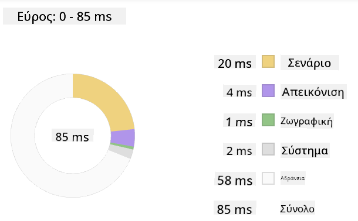
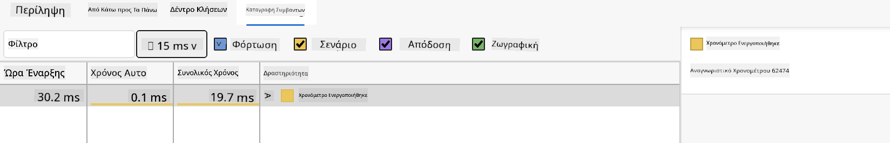

<!--
CO_OP_TRANSLATOR_METADATA:
{
  "original_hash": "49b58721a71cfda824e2f3e1f46908c6",
  "translation_date": "2025-08-29T07:06:23+00:00",
  "source_file": "5-browser-extension/3-background-tasks-and-performance/README.md",
  "language_code": "el"
}
-->
# Έργο Επέκτασης Περιηγητή Μέρος 3: Μάθετε για Εργασίες Υποβάθρου και Απόδοση

## Ερωτηματολόγιο Πριν το Μάθημα

[Ερωτηματολόγιο πριν το μάθημα](https://ff-quizzes.netlify.app/web/quiz/27)

### Εισαγωγή

Στα δύο τελευταία μαθήματα αυτής της ενότητας, μάθατε πώς να δημιουργείτε μια φόρμα και μια περιοχή εμφάνισης για δεδομένα που λαμβάνονται από ένα API. Είναι ένας πολύ τυπικός τρόπος δημιουργίας παρουσίας στον ιστό. Μάθατε επίσης πώς να χειρίζεστε την ασύγχρονη λήψη δεδομένων. Η επέκταση του περιηγητή σας είναι σχεδόν ολοκληρωμένη.

Απομένει να διαχειριστείτε κάποιες εργασίες υποβάθρου, όπως η ανανέωση του χρώματος του εικονιδίου της επέκτασης, οπότε είναι μια εξαιρετική στιγμή να μιλήσουμε για το πώς ο περιηγητής διαχειρίζεται αυτού του είδους τις εργασίες. Ας σκεφτούμε αυτές τις εργασίες του περιηγητή στο πλαίσιο της απόδοσης των στοιχείων του ιστότοπού σας καθώς τα δημιουργείτε.

## Βασικά Στοιχεία Απόδοσης Ιστού

> "Η απόδοση ενός ιστότοπου αφορά δύο πράγματα: πόσο γρήγορα φορτώνει η σελίδα και πόσο γρήγορα εκτελείται ο κώδικας σε αυτήν." -- [Zack Grossbart](https://www.smashingmagazine.com/2012/06/javascript-profiling-chrome-developer-tools/)

Το θέμα του πώς να κάνετε τους ιστότοπούς σας εξαιρετικά γρήγορους σε κάθε είδους συσκευές, για κάθε είδους χρήστες, σε κάθε είδους καταστάσεις, είναι αναμενόμενα εκτενές. Ακολουθούν ορισμένα σημεία που πρέπει να έχετε υπόψη σας καθώς δημιουργείτε είτε ένα τυπικό έργο ιστού είτε μια επέκταση περιηγητή.

Το πρώτο πράγμα που πρέπει να κάνετε για να διασφαλίσετε ότι ο ιστότοπός σας λειτουργεί αποτελεσματικά είναι να συλλέξετε δεδομένα σχετικά με την απόδοσή του. Το πρώτο μέρος για να το κάνετε αυτό είναι στα εργαλεία προγραμματιστών του περιηγητή σας. Στον Edge, μπορείτε να επιλέξετε το κουμπί "Ρυθμίσεις και περισσότερα" (το εικονίδιο με τις τρεις τελείες επάνω δεξιά στον περιηγητή) και στη συνέχεια να μεταβείτε στα Περισσότερα Εργαλεία > Εργαλεία Προγραμματιστών και να ανοίξετε την καρτέλα Απόδοση. Μπορείτε επίσης να χρησιμοποιήσετε τις συντομεύσεις πληκτρολογίου `Ctrl` + `Shift` + `I` στα Windows ή `Option` + `Command` + `I` στο Mac για να ανοίξετε τα εργαλεία προγραμματιστών.

Η καρτέλα Απόδοση περιέχει ένα εργαλείο Προφίλ. Ανοίξτε έναν ιστότοπο (δοκιμάστε, για παράδειγμα, [https://www.microsoft.com](https://www.microsoft.com/?WT.mc_id=academic-77807-sagibbon)) και κάντε κλικ στο κουμπί 'Εγγραφή', στη συνέχεια ανανεώστε τον ιστότοπο. Σταματήστε την εγγραφή οποιαδήποτε στιγμή και θα μπορείτε να δείτε τις διαδικασίες που δημιουργούνται για να 'σενάριο', 'απόδοση' και 'ζωγραφική' του ιστότοπου:


✅ Επισκεφθείτε την [Τεκμηρίωση της Microsoft](https://docs.microsoft.com/microsoft-edge/devtools-guide/performance/?WT.mc_id=academic-77807-sagibbon) σχετικά με την καρτέλα Απόδοσης στον Edge

> Συμβουλή: για να έχετε μια ακριβή μέτρηση του χρόνου εκκίνησης του ιστότοπού σας, καθαρίστε την προσωρινή μνήμη του περιηγητή σας

Επιλέξτε στοιχεία της χρονογραμμής προφίλ για να εστιάσετε σε γεγονότα που συμβαίνουν ενώ φορτώνει η σελίδα σας.

Αποκτήστε μια στιγμιότυπο της απόδοσης της σελίδας σας επιλέγοντας ένα μέρος της χρονογραμμής προφίλ και κοιτάζοντας το παράθυρο σύνοψης:



Ελέγξτε το παράθυρο Καταγραφής Γεγονότων για να δείτε αν κάποιο γεγονός πήρε περισσότερο από 15 ms:



✅ Γνωρίστε το εργαλείο προφίλ σας! Ανοίξτε τα εργαλεία προγραμματιστών σε αυτόν τον ιστότοπο και δείτε αν υπάρχουν σημεία συμφόρησης. Ποιο είναι το στοιχείο που φορτώνει πιο αργά; Το πιο γρήγορο;

## Έλεγχοι Προφίλ

Γενικά, υπάρχουν ορισμένες "προβληματικές περιοχές" που κάθε προγραμματιστής ιστού πρέπει να παρακολουθεί κατά τη δημιουργία ενός ιστότοπου για να αποφύγει δυσάρεστες εκπλήξεις όταν έρθει η ώρα να τον αναπτύξει σε παραγωγή.

**Μεγέθη στοιχείων**: Ο ιστός έχει γίνει πιο 'βαρύς' και, επομένως, πιο αργός τα τελευταία χρόνια. Μέρος αυτού του βάρους έχει να κάνει με τη χρήση εικόνων.

✅ Αναζητήστε στο [Internet Archive](https://httparchive.org/reports/page-weight) μια ιστορική άποψη του βάρους των σελίδων και περισσότερα.

Μια καλή πρακτική είναι να διασφαλίσετε ότι οι εικόνες σας είναι βελτιστοποιημένες και παραδίδονται στο σωστό μέγεθος και ανάλυση για τους χρήστες σας.

**Περιηγήσεις DOM**: Ο περιηγητής πρέπει να δημιουργήσει το Μοντέλο Αντικειμένου Εγγράφου (DOM) βάσει του κώδικα που γράφετε, οπότε είναι προς το συμφέρον της καλής απόδοσης της σελίδας να διατηρείτε τις ετικέτες σας ελάχιστες, χρησιμοποιώντας και στυλιζάροντας μόνο ό,τι χρειάζεται η σελίδα. Σε αυτό το σημείο, το υπερβολικό CSS που σχετίζεται με μια σελίδα θα μπορούσε να βελτιστοποιηθεί. Στυλ που χρειάζονται μόνο σε μία σελίδα δεν χρειάζεται να περιλαμβάνονται στο κύριο φύλλο στυλ, για παράδειγμα.

**JavaScript**: Κάθε προγραμματιστής JavaScript πρέπει να παρακολουθεί 'σενάρια που μπλοκάρουν την απόδοση', τα οποία πρέπει να φορτωθούν πριν ο υπόλοιπος DOM μπορέσει να περιηγηθεί και να ζωγραφιστεί στον περιηγητή. Σκεφτείτε να χρησιμοποιήσετε `defer` με τα ενσωματωμένα σενάριά σας (όπως γίνεται στην ενότητα Terrarium).

✅ Δοκιμάστε μερικούς ιστότοπους σε έναν [ιστότοπο δοκιμής ταχύτητας](https://www.webpagetest.org/) για να μάθετε περισσότερα σχετικά με τους κοινούς ελέγχους που γίνονται για να προσδιοριστεί η απόδοση του ιστότοπου.

Τώρα που έχετε μια ιδέα για το πώς ο περιηγητής αποδίδει τα στοιχεία που του στέλνετε, ας δούμε τα τελευταία πράγματα που πρέπει να κάνετε για να ολοκληρώσετε την επέκτασή σας:

### Δημιουργία συνάρτησης για υπολογισμό χρώματος

Εργαζόμενοι στο `/src/index.js`, προσθέστε μια συνάρτηση που ονομάζεται `calculateColor()` μετά τη σειρά των μεταβλητών `const` που ορίσατε για να αποκτήσετε πρόσβαση στο DOM:

```JavaScript
function calculateColor(value) {
	let co2Scale = [0, 150, 600, 750, 800];
	let colors = ['#2AA364', '#F5EB4D', '#9E4229', '#381D02', '#381D02'];

	let closestNum = co2Scale.sort((a, b) => {
		return Math.abs(a - value) - Math.abs(b - value);
	})[0];
	console.log(value + ' is closest to ' + closestNum);
	let num = (element) => element > closestNum;
	let scaleIndex = co2Scale.findIndex(num);

	let closestColor = colors[scaleIndex];
	console.log(scaleIndex, closestColor);

	chrome.runtime.sendMessage({ action: 'updateIcon', value: { color: closestColor } });
}
```

Τι συμβαίνει εδώ; Δίνετε μια τιμή (την ένταση του άνθρακα) από την κλήση API που ολοκληρώσατε στο τελευταίο μάθημα και στη συνέχεια υπολογίζετε πόσο κοντά είναι η τιμή της στον δείκτη που παρουσιάζεται στον πίνακα χρωμάτων. Στη συνέχεια, στέλνετε αυτήν την πλησιέστερη τιμή χρώματος στο chrome runtime.

Το chrome.runtime έχει [ένα API](https://developer.chrome.com/extensions/runtime) που χειρίζεται κάθε είδους εργασίες υποβάθρου, και η επέκτασή σας το αξιοποιεί:

> "Χρησιμοποιήστε το API chrome.runtime για να ανακτήσετε τη σελίδα υποβάθρου, να επιστρέψετε λεπτομέρειες σχετικά με το manifest και να ακούσετε και να απαντήσετε σε γεγονότα στον κύκλο ζωής της εφαρμογής ή της επέκτασης. Μπορείτε επίσης να χρησιμοποιήσετε αυτό το API για να μετατρέψετε τη σχετική διαδρομή των URL σε πλήρως προσδιορισμένα URL."

✅ Εάν αναπτύσσετε αυτήν την επέκταση περιηγητή για τον Edge, μπορεί να σας εκπλήξει ότι χρησιμοποιείτε ένα API του chrome. Οι νεότερες εκδόσεις του περιηγητή Edge λειτουργούν στη μηχανή περιήγησης Chromium, οπότε μπορείτε να αξιοποιήσετε αυτά τα εργαλεία.

> Σημείωση: Εάν θέλετε να κάνετε προφίλ μιας επέκτασης περιηγητή, ανοίξτε τα εργαλεία προγραμματιστών από την ίδια την επέκταση, καθώς είναι μια ξεχωριστή παρουσία περιηγητή.

### Ορισμός προεπιλεγμένου χρώματος εικονιδίου

Τώρα, στη συνάρτηση `init()`, ορίστε το εικονίδιο να είναι γενικά πράσινο για αρχή, καλώντας ξανά τη δράση `updateIcon` του chrome:

```JavaScript
chrome.runtime.sendMessage({
	action: 'updateIcon',
		value: {
			color: 'green',
		},
});
```

### Κλήση της συνάρτησης, εκτέλεση της κλήσης

Στη συνέχεια, καλέστε τη συνάρτηση που μόλις δημιουργήσατε προσθέτοντάς την στην υπόσχεση που επιστρέφεται από το API C02Signal:

```JavaScript
//let CO2...
calculateColor(CO2);
```

Και τέλος, στο `/dist/background.js`, προσθέστε τον ακροατή για αυτές τις κλήσεις δράσης υποβάθρου:

```JavaScript
chrome.runtime.onMessage.addListener(function (msg, sender, sendResponse) {
	if (msg.action === 'updateIcon') {
		chrome.browserAction.setIcon({ imageData: drawIcon(msg.value) });
	}
});
//borrowed from energy lollipop extension, nice feature!
function drawIcon(value) {
	let canvas = document.createElement('canvas');
	let context = canvas.getContext('2d');

	context.beginPath();
	context.fillStyle = value.color;
	context.arc(100, 100, 50, 0, 2 * Math.PI);
	context.fill();

	return context.getImageData(50, 50, 100, 100);
}
```

Σε αυτόν τον κώδικα, προσθέτετε έναν ακροατή για οποιαδήποτε μηνύματα που έρχονται στον διαχειριστή εργασιών υποβάθρου. Εάν ονομάζεται 'updateIcon', τότε εκτελείται ο επόμενος κώδικας για να σχεδιάσει ένα εικονίδιο του κατάλληλου χρώματος χρησιμοποιώντας το Canvas API.

✅ Θα μάθετε περισσότερα για το Canvas API στα [μαθήματα Space Game](../../6-space-game/2-drawing-to-canvas/README.md).

Τώρα, ξαναχτίστε την επέκτασή σας (`npm run build`), ανανεώστε και εκκινήστε την επέκτασή σας και παρακολουθήστε την αλλαγή χρώματος. Είναι καλή στιγμή να κάνετε μια δουλειά ή να πλύνετε τα πιάτα; Τώρα ξέρετε!

Συγχαρητήρια, δημιουργήσατε μια χρήσιμη επέκταση περιηγητή και μάθατε περισσότερα για το πώς λειτουργεί ο περιηγητής και πώς να κάνετε προφίλ της απόδοσής του.

---

## 🚀 Πρόκληση

Ερευνήστε μερικούς ιστότοπους ανοιχτού κώδικα που υπάρχουν εδώ και πολύ καιρό και, βάσει του ιστορικού τους στο GitHub, δείτε αν μπορείτε να προσδιορίσετε πώς βελτιστοποιήθηκαν με τα χρόνια για την απόδοση, αν έγινε κάτι τέτοιο. Ποιο είναι το πιο κοινό σημείο πόνου;

## Ερωτηματολόγιο Μετά το Μάθημα

[Ερωτηματολόγιο μετά το μάθημα](https://ff-quizzes.netlify.app/web/quiz/28)

## Ανασκόπηση & Αυτομελέτη

Σκεφτείτε να εγγραφείτε σε ένα [newsletter απόδοσης](https://perf.email/)

Ερευνήστε μερικούς από τους τρόπους με τους οποίους οι περιηγητές αξιολογούν την απόδοση ιστού κοιτάζοντας τις καρτέλες απόδοσης στα εργαλεία ιστού τους. Βρίσκετε κάποιες σημαντικές διαφορές;

## Εργασία

[Αναλύστε έναν ιστότοπο για απόδοση](assignment.md)

---

**Αποποίηση ευθύνης**:  
Αυτό το έγγραφο έχει μεταφραστεί χρησιμοποιώντας την υπηρεσία αυτόματης μετάφρασης [Co-op Translator](https://github.com/Azure/co-op-translator). Παρόλο που καταβάλλουμε προσπάθειες για ακρίβεια, παρακαλούμε να έχετε υπόψη ότι οι αυτοματοποιημένες μεταφράσεις ενδέχεται να περιέχουν σφάλματα ή ανακρίβειες. Το πρωτότυπο έγγραφο στη μητρική του γλώσσα θα πρέπει να θεωρείται η αυθεντική πηγή. Για κρίσιμες πληροφορίες, συνιστάται επαγγελματική ανθρώπινη μετάφραση. Δεν φέρουμε ευθύνη για τυχόν παρεξηγήσεις ή εσφαλμένες ερμηνείες που προκύπτουν από τη χρήση αυτής της μετάφρασης.