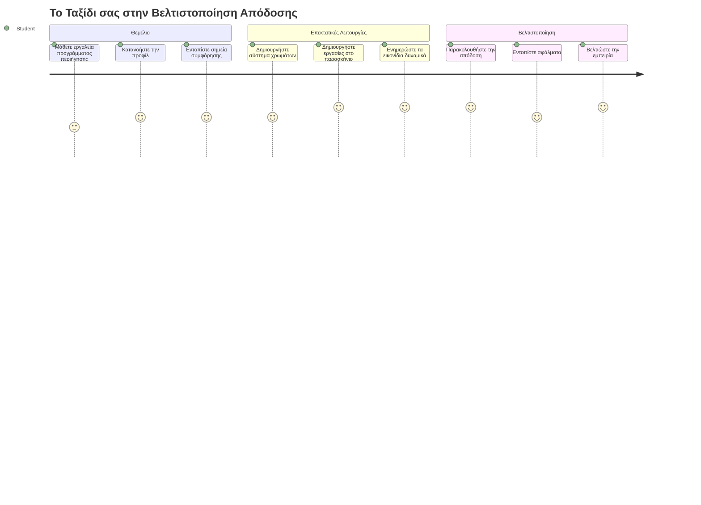
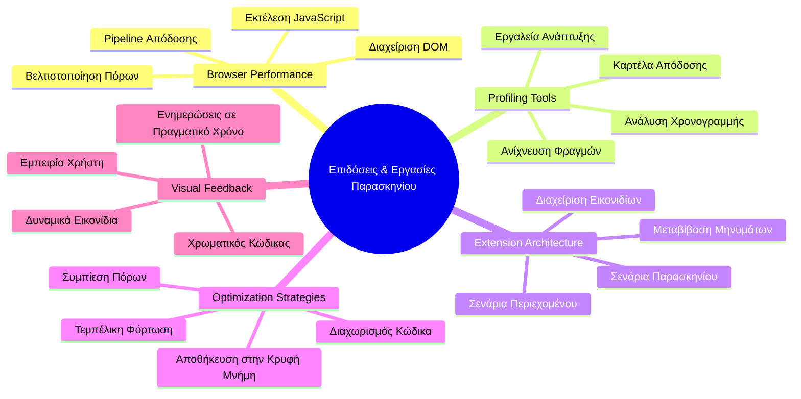
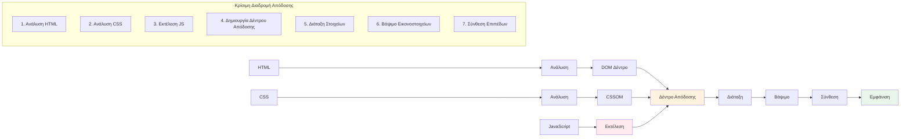
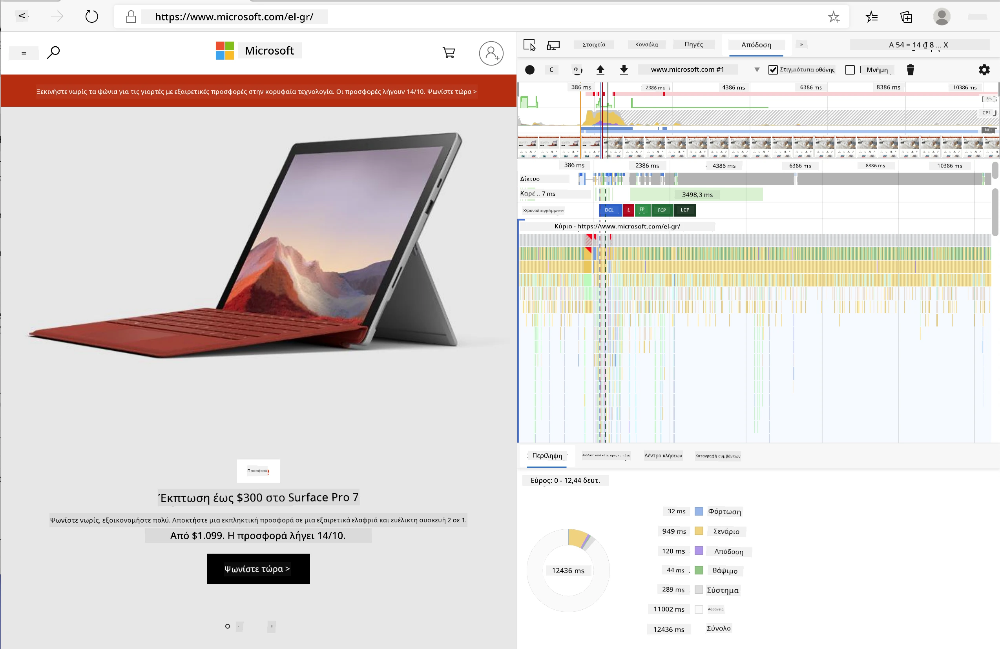
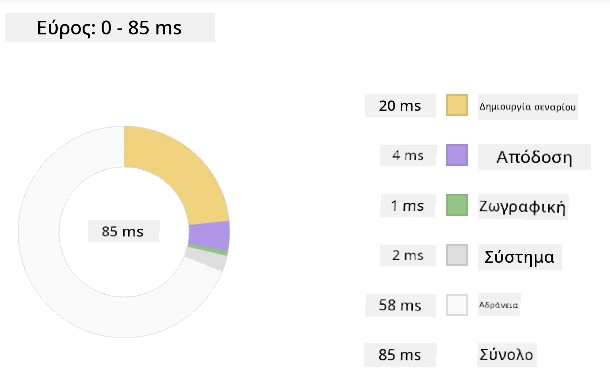
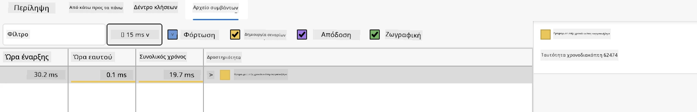
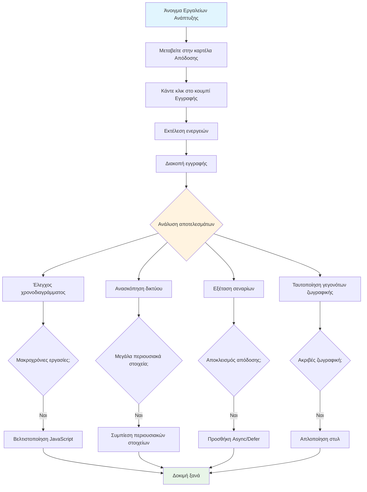
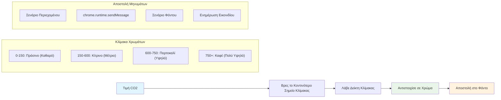
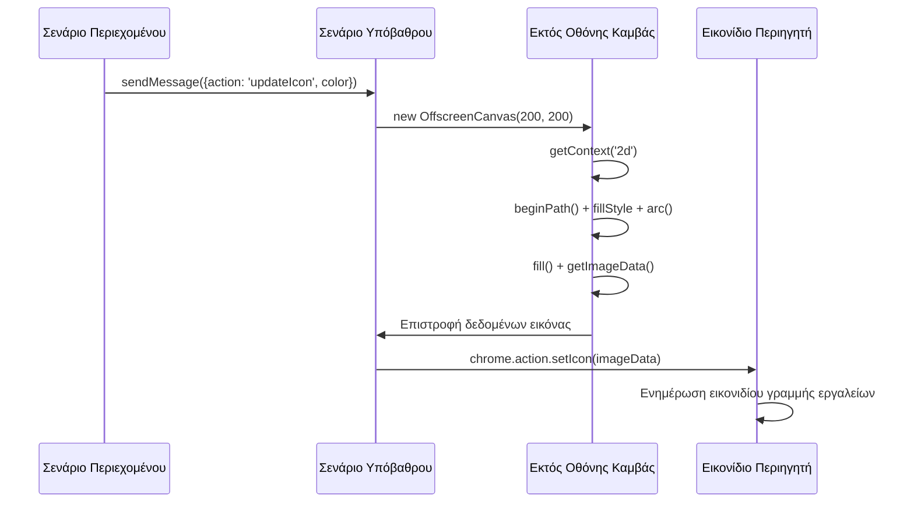
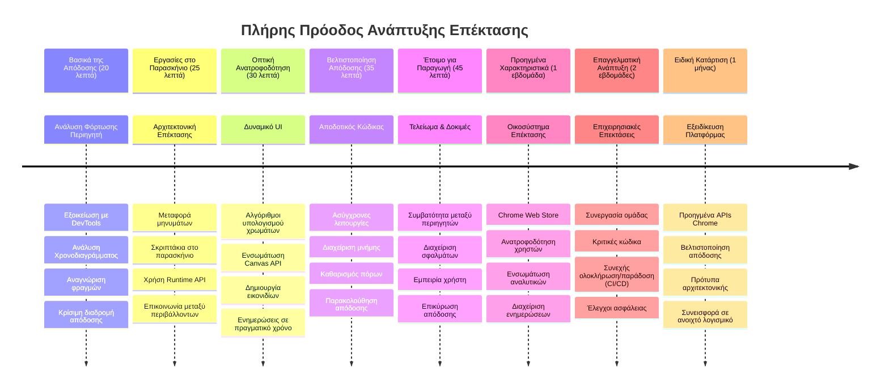

<!--
CO_OP_TRANSLATOR_METADATA:
{
  "original_hash": "b275fed2c6fc90d2b9b6661a3225faa2",
  "translation_date": "2026-01-06T20:46:10+00:00",
  "source_file": "5-browser-extension/3-background-tasks-and-performance/README.md",
  "language_code": "el"
}
-->
# Πρόγραμμα Επέκτασης Περιηγητή Μέρος 3: Μάθετε για τις Εργασίες Παρασκηνίου και την Απόδοση


Έχετε ποτέ αναρωτηθεί γιατί κάποιες επεκτάσεις περιηγητή φαίνονται γρήγορες και ευέλικτες ενώ άλλες μοιάζουν αργές; Το μυστικό κρύβεται σε όσα συμβαίνουν πίσω από τα φώτα. Ενώ οι χρήστες κάνουν κλικ στη διεπαφή της επέκτασής σας, ένας ολόκληρος κόσμος διεργασιών παρασκηνίου διαχειρίζεται σιωπηρά την ανάκτηση δεδομένων, τις ενημερώσεις εικονιδίων και τους πόρους του συστήματος.

Αυτό είναι το τελευταίο μας μάθημα στη σειρά επεκτάσεων περιηγητή, και σκοπεύουμε να κάνουμε τον ιχνηλάτη αποτυπώματος άνθρακα να λειτουργεί ομαλά. Θα προσθέσετε δυναμικές ενημερώσεις εικονιδιών και θα μάθετε πώς να ανιχνεύετε προβλήματα απόδοσης πριν γίνουν προβλήματα. Είναι σαν να ρυθμίζετε ένα αγωνιστικό αυτοκίνητο - μικρές βελτιώσεις μπορούν να κάνουν τεράστια διαφορά στον τρόπο λειτουργίας των πραγμάτων.

Μέχρι να τελειώσουμε, θα έχετε μια στιλβωμένη επέκταση και θα κατανοείτε τις αρχές απόδοσης που διαχωρίζουν τις καλές διαδικτυακές εφαρμογές από τις εξαιρετικές. Ας βουτήξουμε στον κόσμο της βελτιστοποίησης περιηγητή.

## Διαγώνισμα Προ-Διάλεξης

[Διαγώνισμα προ-διάλεξης](https://ff-quizzes.netlify.app/web/quiz/27)

### Εισαγωγή

Στα προηγούμενα μαθήματά μας, φτιάξατε μια φόρμα, τη συνδέσατε με API και αντιμετωπίσατε την ασύγχρονη ανάκτηση δεδομένων. Η επέκτασή σας παίρνει ωραίο σχήμα.

Τώρα πρέπει να προσθέσουμε τις τελευταίες πινελιές - όπως να κάνουμε το εικονίδιο της επέκτασης να αλλάζει χρώματα ανάλογα με τα δεδομένα άνθρακα. Αυτό μου θυμίζει πώς η NASA έπρεπε να βελτιστοποιήσει κάθε σύστημα στο διαστημικό σκάφος Απόλλων. Δεν μπορούσαν να αντέξουν πλέον κύκλους ή μνήμη, γιατί οι ζωές εξαρτιόνταν από την απόδοση. Ενώ η επέκτασή μας δεν είναι τόσο κρίσιμη, οι ίδιες αρχές ισχύουν - ο αποδοτικός κώδικας δημιουργεί καλύτερες εμπειρίες χρήστη.


## Βασικά στοιχεία Απόδοσης Ιστού

Όταν ο κώδικάς σας τρέχει αποδοτικά, οι άνθρωποι μπορούν πραγματικά να *νιώσουν* τη διαφορά. Ξέρετε εκείνη τη στιγμή που μια σελίδα φορτώνει ακαριαία ή μια κίνηση ρέει ομαλά; Αυτή είναι η καλή απόδοση σε δράση.

Η απόδοση δεν είναι μόνο θέμα ταχύτητας - αφορά τη δημιουργία διαδικτυακών εμπειριών που αισθάνονται φυσικές αντί για αδέξιες και απογοητευτικές. Στις πρώτες μέρες της πληροφορικής, η Γκρέις Χόπερ διατηρούσε γνωστά ένα νανοδευτερόλεπτο (ένα κομμάτι σύρματος περίπου ένα πόδι μήκος) στο γραφείο της για να δείξει πόσο μακριά διανύει το φως σε ένα δισεκατομμυριοστό του δευτερολέπτου. Ήταν ο τρόπος της να εξηγήσει γιατί κάθε μικροδευτερόλεπτο μετράει στον υπολογισμό. Ας εξερευνήσουμε τα εργαλεία ανίχνευσης που σας βοηθούν να καταλάβετε τι επιβραδύνει τα πράγματα.

> "Η απόδοση μιας ιστοσελίδας αφορά δύο πράγματα: πόσο γρήγορα φορτώνει η σελίδα και πόσο γρήγορα τρέχει ο κώδικας της." -- [Zack Grossbart](https://www.smashingmagazine.com/2012/06/javascript-profiling-chrome-developer-tools/)

Το θέμα του πώς να κάνετε τις ιστοσελίδες σας αστραπιαία γρήγορες σε όλα τα είδη συσκευών, για όλα τα είδη χρηστών, σε όλα τα είδη καταστάσεων, είναι αναπόφευκτα τεράστιο. Εδώ είναι μερικά σημεία που πρέπει να θυμάστε καθώς δημιουργείτε είτε ένα τυπικό διαδικτυακό έργο είτε μια επέκταση περιηγητή.

Το πρώτο βήμα στη βελτιστοποίηση του ιστότοπού σας είναι να κατανοήσετε τι ακριβώς συμβαίνει από κάτω. Ευτυχώς, ο περιηγητής σας διαθέτει ισχυρά εργαλεία ανίχνευσης ενσωματωμένα.


Για να ανοίξετε τα Εργαλεία Προγραμματιστή στο Edge, κάντε κλικ στις τρεις τελείες επάνω δεξιά, μετά πηγαίνετε στην Περισσότερα εργαλεία > Εργαλεία προγραμματιστή. Ή χρησιμοποιήστε τη συντόμευση πληκτρολογίου: `Ctrl` + `Shift` + `I` στα Windows ή `Option` + `Command` + `I` σε Mac. Αφού φτάσετε εκεί, κάντε κλικ στην καρτέλα Απόδοση - εδώ θα κάνετε την έρευνά σας.

**Να το σετ εργαλείων ανίχνευσης απόδοσης:**
- **Άνοιγμα** Εργαλείων Προγραμματιστή (θα τα χρησιμοποιείτε συνεχώς ως προγραμματιστής!)
- **Πηγαίνετε** στην καρτέλα Απόδοση - σκεφτείτε το ως το μετρητή φυσικής κατάστασης της διαδικτυακής σας εφαρμογής
- **Πατήστε** το κουμπί Εγγραφή και παρακολουθήστε τη σελίδα σας σε δράση
- **Μελετήστε** τα αποτελέσματα για να εντοπίσετε τι επιβραδύνει τα πράγματα

Ας το δοκιμάσουμε. Ανοίξτε μια ιστοσελίδα (το Microsoft.com λειτουργεί καλά για αυτό) και κάντε κλικ στο κουμπί 'Εγγραφή'. Τώρα ανανεώστε τη σελίδα και παρακολουθήστε τον προφίλ να καταγράφει όσα συμβαίνουν. Όταν σταματήσετε την εγγραφή, θα δείτε μια λεπτομερή ανάλυση του πώς ο περιηγητής «γράφει σενάρια», «αποδίδει» και «ζωγραφίζει» τη σελίδα. Μου θυμίζει πώς ο κεντρικός έλεγχος αποστολής παρακολουθεί κάθε σύστημα κατά την εκτόξευση πυραύλου - λαμβάνετε δεδομένα σε πραγματικό χρόνο για το τι συμβαίνει και πότε.



✅ Το [Τεκμηρίωση της Microsoft](https://docs.microsoft.com/microsoft-edge/devtools-guide/performance/?WT.mc_id=academic-77807-sagibbon) έχει πολλές περισσότερες λεπτομέρειες αν θέλετε να εμβαθύνετε

> Επαγγελματική συμβουλή: Καθαρίστε την προσωρινή μνήμη του περιηγητή σας πριν τη δοκιμή για να δείτε πώς αποδίδει ο ιστότοπός σας στους πρώτους επισκέπτες - συνήθως διαφέρει πολύ από τις επαναλαμβανόμενες επισκέψεις!

Επιλέξτε στοιχεία της χρονογραμμής προφίλ για να εστιάσετε σε γεγονότα που συμβαίνουν ενώ φορτώνει η σελίδα σας.

Πάρτε ένα στιγμιότυπο της απόδοσης της σελίδας σας επιλέγοντας ένα τμήμα της χρονογραμμής και κοιτάζοντας τον πίνακα περίληψης:



Ελέγξτε τον πίνακα του Ημερολογίου Γεγονότων για να δείτε αν κάποιο γεγονός κράτησε πάνω από 15 ms:



✅ Γνωρίστε τον προφίλ σας! Ανοίξτε τα εργαλεία προγραμματιστή σε αυτή την ιστοσελίδα και δείτε αν υπάρχουν στενώσεις. Ποιο είναι το πιο αργό στοιχείο στην φόρτωση; Το πιο γρήγορο;


## Τι να Ψάχνετε Όταν Κάνετε Προφίλ

Η εκτέλεση του προφίλ είναι μόνο η αρχή - η πραγματική δεξιότητα είναι να γνωρίζετε τι πραγματικά σας λένε αυτά τα πολύχρωμα γραφήματα. Μην ανησυχείτε, θα μάθετε να τα διαβάζετε. Οι έμπειροι προγραμματιστές έχουν μάθει να εντοπίζουν τα προειδοποιητικά σημάδια πριν γίνουν σοβαρά προβλήματα.

Ας μιλήσουμε για τους συνήθεις ύποπτους - τους δημιουργούς προβλημάτων απόδοσης που συνήθως μπαίνουν κρυφά στα διαδικτυακά έργα. Όπως η Μαρι Κιουρί που έπρεπε να παρακολουθεί προσεκτικά τα επίπεδα ακτινοβολίας στο εργαστήριό της, έτσι και εμείς πρέπει να παρατηρούμε ορισμένα μοτίβα που δείχνουν προβλήματα που αναπτύσσονται. Ο γρήγορος εντοπισμός τους θα σας γλυτώσει (και τους χρήστες σας) από πολλή απογοήτευση.

**Μέγεθος πόρων**: Οι ιστότοποι έχουν γίνει «βαρύτεροι» με τα χρόνια, και μεγάλο μέρος αυτής της πρόσθετης βάρους προέρχεται από εικόνες. Είναι σαν να γεμίζουμε όλο και περισσότερο τις ψηφιακές μας βαλίτσες.

✅ Ρίξτε μια ματιά στο [Internet Archive](https://httparchive.org/reports/page-weight) για να δείτε πώς έχουν αυξηθεί τα μεγέθη σελίδων με το πέρασμα του χρόνου - είναι πολύ αποκαλυπτικό.

**Πώς να διατηρείτε τους πόρους σας βελτιστοποιημένους:**
- **Συμπιέστε** τις εικόνες! Σύγχρονα φορμά όπως το WebP μπορούν να μειώσουν δραματικά το μέγεθος αρχείων
- **Σερβίρετε** το σωστό μέγεθος εικόνας για κάθε συσκευή - δεν υπάρχει λόγος να στέλνετε τεράστιες εικόνες για υπολογιστές σε κινητά
- **Μινιμαρίστε** το CSS και το JavaScript σας - κάθε byte μετράει
- **Χρησιμοποιήστε** lazy loading έτσι ώστε οι εικόνες να κατεβαίνουν μόνο όταν οι χρήστες κάνουν scroll σε αυτές

**Διασχίσεις DOM**: Ο περιηγητής πρέπει να χτίσει το DOM βάσει του κώδικα που γράφετε, έτσι συμφέρει για καλή απόδοση σελίδας να κρατάτε τα tags στο ελάχιστο, χρησιμοποιώντας και στυλιζάροντας μόνο ό,τι χρειάζεται η σελίδα. Σε αυτό το σημείο, CSS που είναι περιττό μπορεί να βελτιστοποιηθεί· στυλ που χρειάζονται μόνο σε μία σελίδα δεν χρειάζεται να περιλαμβάνονται στο κύριο φύλλο στυλ, για παράδειγμα.

**Κύριες στρατηγικές βελτιστοποίησης DOM:**
- **Μειώνει** τον αριθμό των HTML στοιχείων και των επιπέδων εμφώλευσης
- **Αφαιρεί** αχρησιμοποίητους κανόνες CSS και συγκεντρώνει αποτελεσματικά τα στυλ
- **Οργανώνει** το CSS ώστε να φορτώνεται μόνο το απαραίτητο για κάθε σελίδα
- **Δομεί** το HTML σημασιολογικά για καλύτερη ανάλυση από τον περιηγητή

**JavaScript**: Κάθε προγραμματιστής JavaScript πρέπει να προσέχει για 'render-blocking' scripts που πρέπει να φορτωθούν πριν συνεχίσει το DOM να αναλυθεί και να αποδοθεί στον περιηγητή. Σκεφτείτε να χρησιμοποιήσετε `defer` με τα inline scripts σας (όπως γίνεται στο module Terrarium).

**Σύγχρονες τεχνικές βελτιστοποίησης JavaScript:**
- **Χρησιμοποιεί** το χαρακτηριστικό `defer` για φόρτωση scripts μετά την ανάλυση του DOM
- **Υλοποιεί** διαχωρισμό κώδικα ώστε να φορτώνεται μόνο η απαραίτητη JavaScript
- **Εφαρμόζει** lazy loading για λειτουργικότητα που δεν είναι κρίσιμη
- **Μειώνει** τη χρήση βαριών βιβλιοθηκών και πλαισίων όπου είναι δυνατόν

✅ Δοκιμάστε μερικές ιστοσελίδες σε ένα [Site Speed Test website](https://www.webpagetest.org/) για να μάθετε περισσότερα για τους συνηθισμένους ελέγχους που γίνονται ώστε να καθοριστεί η απόδοση του ιστότοπου.

### 🔄 **Εκπαιδευτικός Έλεγχος**
**Κατανόηση Απόδοσης**: Πριν φτιάξετε λειτουργίες στην επέκταση, βεβαιωθείτε ότι μπορείτε:
- ✅ Να εξηγήσετε τη κρίσιμη διαδρομή απόδοσης από το HTML μέχρι τα pixels
- ✅ Να εντοπίζετε κοινές στενώσεις απόδοσης σε διαδικτυακές εφαρμογές
- ✅ Να χρησιμοποιείτε εργαλεία προγραμματιστή περιηγητή για την ανάλυση απόδοσης σελίδας
- ✅ Να κατανοείτε πώς το μέγεθος των πόρων και η πολυπλοκότητα DOM επηρεάζουν την ταχύτητα

**Γρήγορο Τεστ**: Τι συμβαίνει όταν έχετε render-blocking JavaScript;
*Απάντηση: Ο περιηγητής πρέπει να κατεβάσει και να εκτελέσει το script πριν συνεχίσει την ανάλυση του HTML και την απόδοση της σελίδας*

**Πραγματικές Επιδράσεις Απόδοσης**:
- **Καθυστέρηση 100ms**: Οι χρήστες αντιλαμβάνονται την επιβράδυνση
- **Καθυστέρηση 1 δευτερολέπτου**: Οι χρήστες αρχίζουν να χάνουν συγκέντρωση
- **Άνω 3 δευτερολέπτα**: Το 40% των χρηστών εγκαταλείπουν τη σελίδα
- **Δίκτυα κινητής**: Η απόδοση έχει ακόμα περισσότερη σημασία

Τώρα που έχετε μια ιδέα για το πώς ο περιηγητής αποδίδει τους πόρους που στέλνετε, ας δούμε τα τελευταία πράγματα που πρέπει να κάνετε για να ολοκληρώσετε την επέκτασή σας:

### Δημιουργία συνάρτησης για τον υπολογισμό χρώματος

Τώρα θα δημιουργήσουμε μια συνάρτηση που μετατρέπει αριθμητικά δεδομένα σε ουσιαστικά χρώματα. Σκεφτείτε το σαν ένα σύστημα φωτεινού σηματοδότη - πράσινο για καθαρή ενέργεια, κόκκινο για υψηλή ένταση άνθρακα.

Αυτή η συνάρτηση θα πάρει τα δεδομένα CO2 από το API μας και θα αποφασίσει ποιο χρώμα αντιπροσωπεύει καλύτερα τον περιβαλλοντικό αντίκτυπο. Είναι παρόμοιο με το πώς οι επιστήμονες χρησιμοποιούν κωδικοποίηση χρώματος σε θερμικούς χάρτες για να οπτικοποιήσουν πολύπλοκα μοτίβα δεδομένων - από θερμοκρασίες ωκεανών μέχρι σχηματισμό αστεριών. Ας το προσθέσουμε στο `/src/index.js`, αμέσως μετά τις `const` μεταβλητές που ορίσαμε προηγουμένως:


```javascript
function calculateColor(value) {
	// Ορίστε την κλίμακα έντασης CO2 (γραμμάρια ανά kWh)
	const co2Scale = [0, 150, 600, 750, 800];
	// Αντιστοιχίες χρωμάτων από πράσινο (καθαρό) έως σκούρο καφέ (υψηλό ανθρακικό)
	const colors = ['#2AA364', '#F5EB4D', '#9E4229', '#381D02', '#381D02'];

	// Βρείτε την πλησιέστερη τιμή κλίμακας στην είσοδό μας
	const closestNum = co2Scale.sort((a, b) => {
		return Math.abs(a - value) - Math.abs(b - value);
	})[0];
	
	console.log(`${value} is closest to ${closestNum}`);
	
	// Βρείτε το δείκτη για την αντιστοίχηση χρώματος
	const num = (element) => element > closestNum;
	const scaleIndex = co2Scale.findIndex(num);

	const closestColor = colors[scaleIndex];
	console.log(scaleIndex, closestColor);

	// Στείλτε μήνυμα ενημέρωσης χρώματος στο σενάριο φόντου
	chrome.runtime.sendMessage({ action: 'updateIcon', value: { color: closestColor } });
}
```

**Ας αναλύσουμε αυτή τη έξυπνη μικρή συνάρτηση:**
- **Ορίζει** δύο πίνακες - έναν για επίπεδα CO2 και έναν για χρώματα (πράσινο = καθαρό, καφέ = βρώμικο!)
- **Βρίσκει** το πιο κοντινό αντίστοιχο στην πραγματική τιμή CO2 χρησιμοποιώντας έξυπνο ταξινόμηση πίνακα
- **Παίρνει** το αντίστοιχο χρώμα χρησιμοποιώντας τη μέθοδο findIndex()
- **Στέλνει** μήνυμα στο background script του Chrome με το επιλεγμένο χρώμα
- **Χρησιμοποιεί** template literals (τα backticks) για πιο καθαρή μορφοποίηση συμβολοσειράς
- **Κρατά** τα πάντα οργανωμένα με δηλώσεις const

Το `chrome.runtime` [API](https://developer.chrome.com/extensions/runtime) είναι σαν το νευρικό σύστημα της επέκτασής σας - χειρίζεται όλη την επικοινωνία και τις εργασίες παρασκηνίου:

> "Χρησιμοποιήστε το chrome.runtime API για να ανακτήσετε τη σελίδα παρασκηνίου, να επιστρέψετε λεπτομέρειες για το manifest και να ακούτε και να απαντάτε σε γεγονότα στο κύκλο ζωής της εφαρμογής ή της επέκτασης. Μπορείτε επίσης να χρησιμοποιήσετε αυτό το API για να μετατρέψετε σχετικές διαδρομές URL σε πλήρως καταγεγραμμένα URL."

**Γιατί το Chrome Runtime API είναι τόσο χρήσιμο:**
- **Επιτρέπει** στα διάφορα μέρη της επέκτασής σας να επικοινωνούν μεταξύ τους
- **Χειρίζεται** εργασίες παρασκηνίου χωρίς να παγώνει η διεπαφή χρήστη
- **Διαχειρίζεται** τα γεγονότα κύκλου ζωής της επέκτασης
- **Κάνει** την ανταλλαγή μηνυμάτων ανάμεσα σε σενάρια πολύ εύκολη

✅ Αν αναπτύσσετε αυτήν την επέκταση περιηγητή για Edge, μπορεί να σας εκπλήσσει ότι χρησιμοποιείτε ένα chrome API. Οι νεότερες εκδόσεις του Edge τρέχουν στον μηχανισμό Chromium, οπότε μπορείτε να εκμεταλλευτείτε αυτά τα εργαλεία.


> **Συμβουλή για προχωρημένους**: Αν θέλετε να κάνετε προφίλ σε μια επέκταση περιηγητή, ξεκινήστε τα εργαλεία προγραμματιστή από μέσα στην ίδια την επέκταση, καθώς είναι μια ξεχωριστή περίοδος λειτουργίας του περιηγητή. Αυτό σας δίνει πρόσβαση σε μετρικές απόδοσης ειδικές για την επέκταση.

### Ορισμός προεπιλεγμένου χρώματος εικονιδίου

Πριν ξεκινήσουμε να αντλούμε πραγματικά δεδομένα, ας δώσουμε στην επέκτασή μας ένα σημείο εκκίνησης. Κανείς δεν θέλει να κοιτάζει ένα κενό ή σπασμένο εικονίδιο. Θα ξεκινήσουμε με πράσινο χρώμα ώστε οι χρήστες να ξέρουν ότι η επέκταση λειτουργεί από τη στιγμή που την εγκαθιστούν.

Στη συνάρτηση `init()`, ας ορίσουμε αυτό το προεπιλεγμένο πράσινο εικονίδιο:

```javascript
chrome.runtime.sendMessage({
	action: 'updateIcon',
	value: {
		color: 'green',
	},
});
```

**Τι πετυχαίνει αυτή η αρχικοποίηση:**
- **Ορίζει** ένα ουδέτερο πράσινο χρώμα ως προεπιλεγμένη κατάσταση
- **Παρέχει** άμεση οπτική επανατροφοδότηση όταν φορτώνει η επέκταση
- **Εδραιώνει** το μοτίβο επικοινωνίας με το background script
- **Εξασφαλίζει** ότι οι χρήστες βλέπουν μια λειτουργική επέκταση πριν φορτωθούν δεδομένα

### Κλήση της συνάρτησης, εκτέλεση της κλήσης

Τώρα ας συνδέσουμε τα πάντα ώστε όταν φτάνουν νέα δεδομένα CO2, το εικονίδιό σας να ενημερώνεται αυτόματα με το σωστό χρώμα. Είναι σαν να συνδέετε το τελικό κύκλωμα σε μια ηλεκτρονική συσκευή - ξαφνικά όλα τα επιμέρους μέρη λειτουργούν ως ένα σύστημα.

Προσθέστε αυτή τη γραμμή αμέσως μετά την ανάκτηση των δεδομένων CO2 από το API:

```javascript
// Αφού ανακτηθούν τα δεδομένα CO2 από το API
// άσε CO2 = data.data[0].intensity.actual;
calculateColor(CO2);
```

**Αυτή η ενσωμάτωση πετυχαίνει:**
- **Συνδέει** την ροή δεδομένων API με το σύστημα οπτικής ένδειξης
- **Ενεργοποιεί** αυτόματα τις ενημερώσεις εικονιδίου όταν φτάνουν νέα δεδομένα
- **Εξασφαλίζει** οπτική αντίδραση σε πραγματικό χρόνο βασισμένη στην τρέχουσα ένταση άνθρακα
- **Διατηρεί** τον διαχωρισμό ανησυχιών μεταξύ ανάκτησης δεδομένων και λογικής εμφάνισης

Και τέλος, στο `/dist/background.js`, προσθέστε τον ακροατή για αυτές τις κλήσεις ενεργειών παρασκηνίου:

```javascript
// Ακούστε μηνύματα από το σενάριο περιεχομένου
chrome.runtime.onMessage.addListener(function (msg, sender, sendResponse) {
	if (msg.action === 'updateIcon') {
		chrome.action.setIcon({ imageData: drawIcon(msg.value) });
	}
});

// Σχεδιάστε δυναμικό εικονίδιο χρησιμοποιώντας το Canvas API
// Δανεισμένο από την επέκταση energy lollipop - ωραία λειτουργία!
function drawIcon(value) {
	// Δημιουργήστε έναν καμβά εκτός οθόνης για καλύτερη απόδοση
	const canvas = new OffscreenCanvas(200, 200);
	const context = canvas.getContext('2d');

	// Σχεδιάστε έναν χρωματιστό κύκλο που αντιπροσωπεύει την ένταση του άνθρακα
	context.beginPath();
	context.fillStyle = value.color;
	context.arc(100, 100, 50, 0, 2 * Math.PI);
	context.fill();

	// Επιστρέψτε τα δεδομένα εικόνας για το εικονίδιο του προγράμματος περιήγησης
	return context.getImageData(50, 50, 100, 100);
}
```

**Το παρακάτω κάνει το background script:**
- **Ακούει** για μηνύματα από το κύριο σενάριό σας (σαν μια ρεσεψιονίστ που παίρνει κλήσεις)
- **Επεξεργάζεται** αιτήματα 'updateIcon' για να αλλάξει το εικονίδιο στη γραμμή εργαλείων
- **Δημιουργεί** νέα εικονίδια επί τόπου χρησιμοποιώντας το Canvas API
- **Σχεδιάζει** έναν απλό χρωματιστό κύκλο που δείχνει την τρέχουσα ένταση άνθρακα
- **Ενημερώνει** τη γραμμή εργαλείων του περιηγητή με το φρέσκο εικονίδιο
- **Χρησιμοποιεί** OffscreenCanvas για ομαλή απόδοση (χωρίς μπλοκάρισμα UI)

✅ Θα μάθετε περισσότερα για το Canvas API στα [μαθήματα του Space Game](../../6-space-game/2-drawing-to-canvas/README.md).


### 🔄 **Εκπαιδευτικός Έλεγχος**
**Ολοκληρωμένη Κατανόηση Επέκτασης**: Επαληθεύστε την κυριαρχία σας στο σύστημα ολόκληρο:
- ✅ Πώς λειτουργεί η ανταλλαγή μηνυμάτων μεταξύ διαφόρων σεναρίων της επέκτασης;
- ✅ Γιατί χρησιμοποιούμε OffscreenCanvas αντί του κανονικού Canvas για απόδοση;
- ✅ Ποιο ρόλο παίζει το Chrome Runtime API στην αρχιτεκτονική των επεκτάσεων;
- ✅ Πώς ο αλγόριθμος υπολογισμού χρώματος αντιστοιχεί δεδομένα σε οπτική ανατροφοδότηση;

**Θέματα Απόδοσης**: Η επέκτασή σας τώρα επιδεικνύει:
- **Αποδοτική επικοινωνία**: Καθαρή επικοινωνία μεταξύ σεναρίων
- **Βελτιστοποιημένη απόδοση**: OffscreenCanvas αποτρέπει το μπλοκάρισμα του UI
- **Ενημερώσεις σε πραγματικό χρόνο**: Δυναμικές αλλαγές στο εικονίδιο με βάση ζωντανά δεδομένα
- **Διαχείριση μνήμης**: Σωστός καθαρισμός και διαχείριση πόρων

**Ώρα να δοκιμάσετε την επέκτασή σας:**
- **Κατασκευάστε** τα πάντα με `npm run build`
- **Επαναφορτώστε** την επέκτασή σας στον περιηγητή (μη ξεχάσετε αυτό το βήμα)
- **Ανοίξτε** την επέκταση και παρατηρήστε το εικονίδιο να αλλάζει χρώματα
- **Ελέγξτε** πώς αντιδρά σε πραγματικά δεδομένα διοξειδίου του άνθρακα από όλο τον κόσμο

Τώρα θα ξέρετε με μια ματιά αν είναι καλή στιγμή για το πλύσιμο ή αν πρέπει να περιμένετε καθαρότερη ενέργεια. Μόλις δημιουργήσατε κάτι πραγματικά χρήσιμο και μάθατε για την απόδοση του περιηγητή κατά τη διαδικασία.

## Πρόκληση GitHub Copilot Agent 🚀

Χρησιμοποιήστε τη λειτουργία Agent για να ολοκληρώσετε την ακόλουθη πρόκληση:

**Περιγραφή:** Βελτιώστε τη δυνατότητα παρακολούθησης απόδοσης της επέκτασης προσθέτοντας λειτουργία που παρακολουθεί και εμφανίζει τους χρόνους φόρτωσης για διαφορετικά στοιχεία της επέκτασης.

**Εντολή:** Δημιουργήστε ένα σύστημα παρακολούθησης απόδοσης για την επέκταση που μετρά και καταγράφει τον χρόνο που απαιτείται για την ανάκτηση δεδομένων CO2 από το API, τον υπολογισμό των χρωμάτων και την ενημέρωση του εικονιδίου. Προσθέστε μια συνάρτηση με όνομα `performanceTracker` που χρησιμοποιεί το Performance API για τη μέτρηση αυτών των λειτουργιών και εμφανίζει τα αποτελέσματα στην κονσόλα του περιηγητή με χρονικές σφραγίδες και δείκτες διάρκειας.

Μάθετε περισσότερα για τη [λειτουργία agent](https://code.visualstudio.com/blogs/2025/02/24/introducing-copilot-agent-mode) εδώ.

## 🚀 Πρόκληση

Ιδού μια ενδιαφέρουσα αποστολή ντετέκτιβ: επιλέξτε μερικές ανοικτού κώδικα ιστοσελίδες που υπάρχουν εδώ και χρόνια (σκεφτείτε Wikipedia, GitHub ή Stack Overflow) και ψάξτε το ιστορικό commits τους. Μπορείτε να εντοπίσετε πού έγιναν βελτιώσεις απόδοσης; Ποια προβλήματα επανεμφανίζονταν συνέχεια;

**Η προσέγγιση της έρευνάς σας:**
- **Ψάξτε** μηνύματα commit για λέξεις όπως "optimize," "performance," ή "faster"
- **Αναζητήστε** μοτίβα - διορθώνουν συνέχεια τα ίδια είδη προβλημάτων;
- **Εντοπίστε** τους συνηθισμένους ενόχους που επιβραδύνουν τις ιστοσελίδες
- **Μοιραστείτε** αυτά που ανακαλύψατε - άλλοι προγραμματιστές μαθαίνουν από πραγματικά παραδείγματα

## Κουίζ Μετά το Μάθημα

[Κουίζ μετά το μάθημα](https://ff-quizzes.netlify.app/web/quiz/28)

## Ανασκόπηση & Αυτομελέτη

Σκεφτείτε να εγγραφείτε σε [newsletter απόδοσης](https://perf.email/)

Ερευνήστε τους τρόπους με τους οποίους οι περιηγητές μετρούν την απόδοση ιστοσελίδων αναζητώντας στις καρτέλες απόδοσης στα εργαλεία ανάπτυξης. Βρίσκετε σημαντικές διαφορές;

### ⚡ **Τι Μπορείτε να Κάνετε σε 5 Λεπτά**
- [ ] Ανοίξτε τον Task Manager του περιηγητή (Shift+Esc στο Chrome) για να δείτε χρήση πόρων των επεκτάσεων
- [ ] Χρησιμοποιήστε την καρτέλα Performance στα DevTools για να καταγράψετε και αναλύσετε την απόδοση σελίδας
- [ ] Ελέγξτε τη σελίδα Επεκτάσεων του περιηγητή για να δείτε ποιες επεκτάσεις επηρεάζουν τον χρόνο εκκίνησης
- [ ] Δοκιμάστε να απενεργοποιήσετε τις επεκτάσεις προσωρινά για διαφορές στην απόδοση

### 🎯 **Τι Μπορείτε να Επιτύχετε Σε Αυτήν την Ώρα**
- [ ] Ολοκληρώστε το κουίζ μετά το μάθημα και κατανοήστε τις έννοιες απόδοσης
- [ ] Υλοποιήστε ένα background script για την επέκταση του περιηγητή σας
- [ ] Μάθετε να χρησιμοποιείτε το browser.alarms για αποδοτικές εργασίες στο παρασκήνιο
- [ ] Εξασκηθείτε στη μεταβίβαση μηνυμάτων μεταξύ content scripts και background scripts
- [ ] Μετρήστε και βελτιστοποιήστε τη χρήση πόρων της επέκτασής σας

### 📅 **Η Εβδομαδιαία Διαδρομή Αποδόσης Σας**
- [ ] Ολοκληρώστε μια επέκταση περιηγητή υψηλής απόδοσης με λειτουργικότητα παρασκηνίου
- [ ] Εξελιχθείτε στους service workers και τη σύγχρονη αρχιτεκτονική επεκτάσεων
- [ ] Υλοποιήστε αποδοτικές στρατηγικές συγχρονισμού δεδομένων και caching
- [ ] Μάθετε προχωρημένες τεχνικές αποσφαλμάτωσης για απόδοση επεκτάσεων
- [ ] Βελτιστοποιήστε την επέκτασή σας για λειτουργικότητα και απόδοση πόρων
- [ ] Δημιουργήστε ολοκληρωμένα tests για σενάρια απόδοσης επεκτάσεων

### 🌟 **Ο Μηνιαίος Μάστερ Οπτιμάιζεσιον Σας**
- [ ] Δημιουργήστε επεκτάσεις περιηγητή επιπέδου enterprise με βέλτιστη απόδοση
- [ ] Μάθετε για Web Workers, Service Workers και σύγχρονη απόδοση web
- [ ] Συμβάλετε σε ανοικτού κώδικα έργα που εστιάζουν στη βελτιστοποίηση απόδοσης
- [ ] Εμβαθύνετε σε εσωτερικά του περιηγητή και προχωρημένες τεχνικές αποσφαλμάτωσης
- [ ] Δημιουργήστε εργαλεία παρακολούθησης απόδοσης και οδηγούς βέλτιστων πρακτικών
- [ ] Γίνετε ειδικός απόδοσης που βοηθά στη βελτιστοποίηση web εφαρμογών

## 🎯 Το Χρονοδιάγραμμα Εμπειρογνωμοσύνης στην Επέκταση Περιηγητή Σας


### 🛠️ Το Πλήρες Σετ Εργαλείων Ανάπτυξης Επέκτασης Σας

Μετά την ολοκλήρωση αυτής της τριλογίας, έχετε κατακτήσει:
- **Αρχιτεκτονική Περιηγητή**: Βαθιά κατανόηση πώς οι επεκτάσεις ενσωματώνονται στα συστήματα του περιηγητή
- **Προφίλ Απόδοσης**: Ικανότητα να εντοπίζετε και να διορθώνετε σημεία συμφόρησης με εργαλεία ανάπτυξης
- **Ασύγχρονος Προγραμματισμός**: Σύγχρονα μοτίβα JavaScript για ανταποκρίσιμες, μη αποκλειστικές λειτουργίες
- **Ενσωμάτωση API**: Ανάκτηση εξωτερικών δεδομένων με αυθεντικοποίηση και διαχείριση σφαλμάτων
- **Οπτικός Σχεδιασμός**: Δυναμικές ενημερώσεις UI και δημιουργία γραφικών με Canvas
- **Μεταβίβαση Μηνυμάτων**: Επικοινωνία μεταξύ σεναρίων σε αρχιτεκτονικές επεκτάσεων
- **Εμπειρία Χρήστη**: Καταστάσεις φόρτωσης, διαχείριση σφαλμάτων, και διαισθητικές αλληλεπιδράσεις
- **Δεξιότητες Παραγωγής**: Δοκιμές, αποσφαλμάτωση, και βελτιστοποίηση για πραγματική χρήση

**Εφαρμογές στον Πραγματικό Κόσμο**: Οι δεξιότητές σας στην ανάπτυξη επεκτάσεων εφαρμόζονται άμεσα σε:
- **Προοδευτικές Web Εφαρμογές**: Παρόμοια αρχιτεκτονική και μοτίβα απόδοσης
- **Εφαρμογές Electron Desktop**: Πολυπλατφορμικές εφαρμογές με τεχνολογίες web
- **Υβριδικές Εφαρμογές για Κινητά**: Ανάπτυξη με Cordova/PhoneGap χρησιμοποιώντας web APIs
- **Επιχειρησιακές Web Εφαρμογές**: Σύνθετα εργαλεία πίνακα εργαλείων και παραγωγικότητας
- **Επεκτάσεις Chrome DevTools**: Προηγμένος εξοπλισμός ανάπτυξης και αποσφαλμάτωσης
- **Ενσωμάτωση Web API**: Οποιαδήποτε εφαρμογή που επικοινωνεί με εξωτερικές υπηρεσίες

**Επαγγελματική Επίδραση**: Μπορείτε πλέον να:
- **Δημιουργείτε** επεκτάσεις περιηγητή έτοιμες για παραγωγή από την ιδέα μέχρι την κυκλοφορία
- **Βελτιστοποιείτε** την απόδοση web εφαρμογών χρησιμοποιώντας εργαλεία προφίλ βιομηχανικού επιπέδου
- **Σχεδιάζετε** κλιμακούμενα συστήματα με ορθή διαχωρισμό ευθυνών
- **Αποσφαλματώνετε** σύνθετες ασύγχρονες λειτουργίες και επικοινωνία μεταξύ πλαισίων
- **Συμβάλλετε** σε έργα ανοικτού κώδικα επεκτάσεων και προδιαγραφές περιηγητών

**Επόμενες Ευκαιρίες Επιπέδου:**
- **Προγραμματιστής στο Chrome Web Store**: Δημοσίευση επεκτάσεων σε εκατομμύρια χρήστες
- **Μηχανικός Απόδοσης Web**: Εξειδίκευση σε βελτιστοποίηση και εμπειρία χρήστη
- **Προγραμματιστής Πλατφόρμας Περιηγητή**: Συμμετοχή στην ανάπτυξη του κινητήρα περιηγητή
- **Δημιουργός Πλαισίου Επεκτάσεων**: Δημιουργία εργαλείων που βοηθούν άλλους προγραμματιστές
- **Σχέσεις με Προγραμματιστές**: Μοιραστείτε γνώση μέσω διδασκαλίας και δημιουργίας περιεχομένου

🌟 **Επίτευγμα Ξεκλειδώθηκε**: Δημιουργήσατε μια πλήρη, λειτουργική επέκταση περιηγητή που δείχνει επαγγελματικές πρακτικές ανάπτυξης και σύγχρονες προδιαγραφές web!

## Ανάθεση Εργασίας

[Ανάλυση μιας ιστοσελίδας για απόδοση](assignment.md)

---

<!-- CO-OP TRANSLATOR DISCLAIMER START -->
**Αποποίηση ευθυνών**:  
Αυτό το έγγραφο έχει μεταφραστεί χρησιμοποιώντας την υπηρεσία αυτόματης μετάφρασης AI [Co-op Translator](https://github.com/Azure/co-op-translator). Παρόλο που επιδιώκουμε την ακρίβεια, παρακαλούμε να λάβετε υπόψη ότι οι αυτόματες μεταφράσεις μπορεί να περιέχουν σφάλματα ή ανακρίβειες. Το πρωτότυπο έγγραφο στη μητρική του γλώσσα πρέπει να θεωρείται η αυθεντική πηγή. Για κρίσιμες πληροφορίες συνιστάται η επαγγελματική ανθρώπινη μετάφραση. Δεν φέρουμε ευθύνη για τυχόν παρερμηνείες ή λανθασμένες ερμηνείες που προκύπτουν από τη χρήση αυτής της μετάφρασης.
<!-- CO-OP TRANSLATOR DISCLAIMER END -->