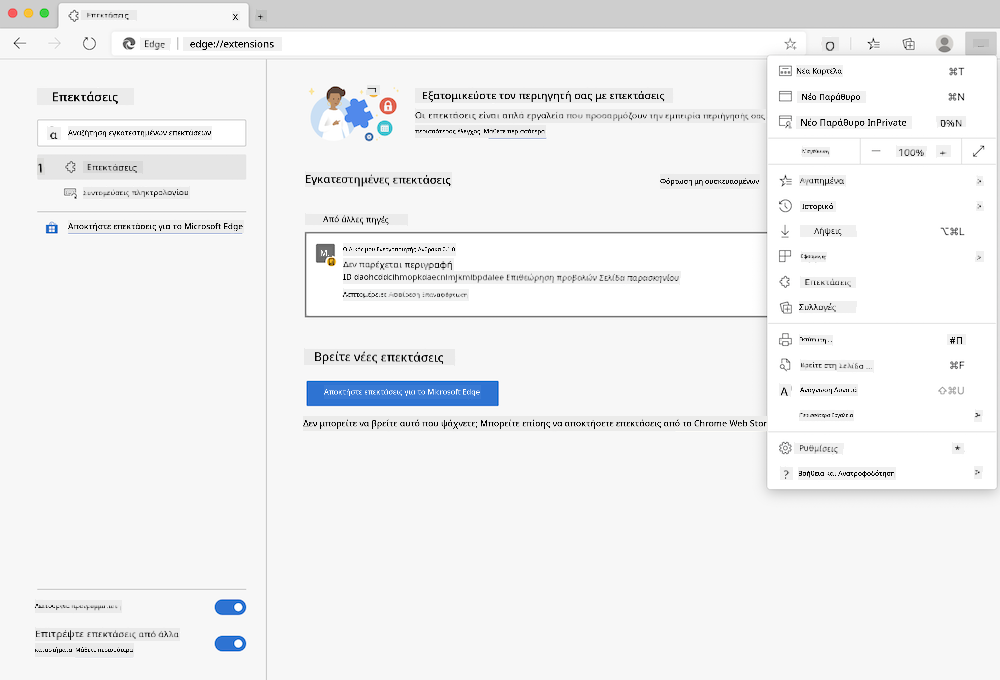

<!--
CO_OP_TRANSLATOR_METADATA:
{
  "original_hash": "fab4e6b4f0efcd587a9029d82991f597",
  "translation_date": "2025-08-26T22:46:01+00:00",
  "source_file": "5-browser-extension/solution/README.md",
  "language_code": "el"
}
-->
# Επέκταση Περιηγητή Carbon Trigger: Ολοκληρωμένος Κώδικας

Χρησιμοποιώντας το API C02 Signal της tmrow για την παρακολούθηση της χρήσης ηλεκτρικής ενέργειας, δημιουργήστε μια επέκταση περιηγητή ώστε να έχετε μια υπενθύμιση απευθείας στον περιηγητή σας σχετικά με το πόσο έντονη είναι η χρήση ηλεκτρικής ενέργειας στην περιοχή σας. Η χρήση αυτής της επέκτασης κατά περίπτωση θα σας βοηθήσει να λαμβάνετε αποφάσεις για τις δραστηριότητές σας βάσει αυτών των πληροφοριών.


## Ξεκινώντας

Θα χρειαστεί να έχετε εγκατεστημένο το [npm](https://npmjs.com). Κατεβάστε ένα αντίγραφο αυτού του κώδικα σε έναν φάκελο στον υπολογιστή σας.

Εγκαταστήστε όλα τα απαραίτητα πακέτα:

```
npm install
```

Δημιουργήστε την επέκταση χρησιμοποιώντας το webpack:

```
npm run build
```

Για να εγκαταστήσετε την επέκταση στον Edge, χρησιμοποιήστε το μενού με τις 'τρεις τελείες' στην επάνω δεξιά γωνία του περιηγητή για να βρείτε τον πίνακα Επεκτάσεων. Από εκεί, επιλέξτε 'Φόρτωση μη συσκευασμένης' για να φορτώσετε μια νέα επέκταση. Ανοίξτε τον φάκελο 'dist' όταν σας ζητηθεί και η επέκταση θα φορτωθεί. Για να τη χρησιμοποιήσετε, θα χρειαστείτε ένα API key για το API του CO2 Signal ([αποκτήστε ένα εδώ μέσω email](https://www.co2signal.com/) - εισάγετε το email σας στο πλαίσιο αυτής της σελίδας) και τον [κωδικό για την περιοχή σας](http://api.electricitymap.org/v3/zones) που αντιστοιχεί στον [Electricity Map](https://www.electricitymap.org/map) (στη Βοστώνη, για παράδειγμα, χρησιμοποιώ 'US-NEISO').



Μόλις εισαχθούν το API key και η περιοχή στη διεπαφή της επέκτασης, η χρωματιστή κουκκίδα στη γραμμή επέκτασης του περιηγητή θα πρέπει να αλλάξει ώστε να αντικατοπτρίζει τη χρήση ενέργειας της περιοχής σας και να σας δώσει μια ένδειξη για το ποιες δραστηριότητες με υψηλή κατανάλωση ενέργειας θα ήταν κατάλληλες να εκτελέσετε. Η ιδέα πίσω από αυτό το σύστημα 'κουκκίδας' μου δόθηκε από την επέκταση [Energy Lollipop](https://energylollipop.com/) για τις εκπομπές της Καλιφόρνιας.

---

**Αποποίηση ευθύνης**:  
Αυτό το έγγραφο έχει μεταφραστεί χρησιμοποιώντας την υπηρεσία αυτόματης μετάφρασης [Co-op Translator](https://github.com/Azure/co-op-translator). Παρόλο που καταβάλλουμε προσπάθειες για ακρίβεια, παρακαλούμε να έχετε υπόψη ότι οι αυτοματοποιημένες μεταφράσεις ενδέχεται να περιέχουν λάθη ή ανακρίβειες. Το πρωτότυπο έγγραφο στη μητρική του γλώσσα θα πρέπει να θεωρείται η αυθεντική πηγή. Για κρίσιμες πληροφορίες, συνιστάται επαγγελματική ανθρώπινη μετάφραση. Δεν φέρουμε ευθύνη για τυχόν παρεξηγήσεις ή εσφαλμένες ερμηνείες που προκύπτουν από τη χρήση αυτής της μετάφρασης.