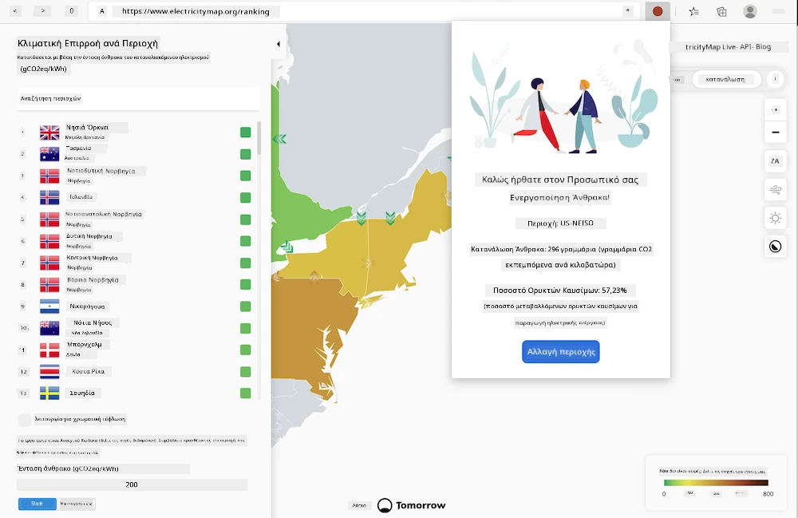
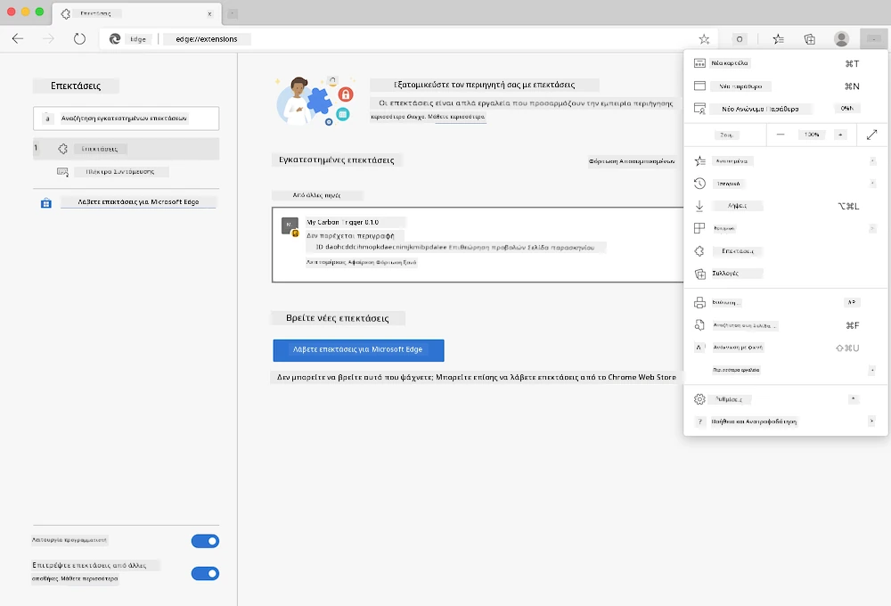

<!--
CO_OP_TRANSLATOR_METADATA:
{
  "original_hash": "dd58ae1b7707034f055718c1b68bc8de",
  "translation_date": "2025-08-26T22:47:41+00:00",
  "source_file": "5-browser-extension/solution/translation/README.hi.md",
  "language_code": "el"
}
-->
# Επέκταση Περιηγητή Carbon Trigger: Ολοκληρωμένος Κώδικας

Χρησιμοποιώντας το API CO2 Signal της tmrow για την παρακολούθηση της χρήσης ηλεκτρικής ενέργειας, δημιουργήθηκε μια επέκταση περιηγητή που σας υπενθυμίζει πόσο έντονη είναι η χρήση ηλεκτρικής ενέργειας στην περιοχή σας μέσω του περιηγητή σας. Η χρήση αυτής της επέκτασης μπορεί να σας βοηθήσει να λαμβάνετε αποφάσεις για τις δραστηριότητές σας με βάση αυτές τις πληροφορίες.



## Ξεκινώντας

Θα χρειαστεί να εγκαταστήσετε το [npm](https://npmjs.com). Κατεβάστε ένα αντίγραφο αυτού του κώδικα σε έναν φάκελο στον υπολογιστή σας.

Εγκαταστήστε όλα τα απαραίτητα πακέτα:

```
npm install
```

Δημιουργήστε την επέκταση με το webpack:

```
npm run build
```

Για να εγκαταστήσετε στον Edge, χρησιμοποιήστε το μενού "τρεις τελείες" στην επάνω δεξιά γωνία του περιηγητή για να βρείτε το πάνελ επεκτάσεων. Από εκεί, επιλέξτε "Φόρτωση μη συσκευασμένης επέκτασης". Στο προτρεπτικό μήνυμα, ανοίξτε τον φάκελο 'dist' και η επέκταση θα φορτωθεί. Για να τη χρησιμοποιήσετε, θα χρειαστείτε ένα API key από το CO2 Signal ([λάβετε το μέσω email εδώ](https://www.co2signal.com/) - εισάγετε το email σας στο κουτί αυτής της σελίδας) και [τον κωδικό της περιοχής σας](http://api.electricitymap.org/v3/zones) από τον [χάρτη ηλεκτρικής ενέργειας](https://www.electricitymap.org/map) (για παράδειγμα, στη Βοστώνη, χρησιμοποιώ το 'US-NEISO').



Μόλις εισαχθούν το API key και η περιοχή στη διεπαφή της επέκτασης, η χρωματιστή κουκκίδα στη γραμμή επέκτασης του περιηγητή θα πρέπει να αλλάξει ώστε να αντικατοπτρίζει τη χρήση ενέργειας της περιοχής σας και να σας δώσει έναν δείκτη για το ποιες δραστηριότητες έντονης ενέργειας είναι κατάλληλες για την απόδοσή σας. Η ιδέα πίσω από αυτό το σύστημα "κουκκίδας" μου δόθηκε από την επέκταση [Energy Lollipop](https://energylollipop.com/) για τις εκπομπές της Καλιφόρνιας.

---

**Αποποίηση ευθύνης**:  
Αυτό το έγγραφο έχει μεταφραστεί χρησιμοποιώντας την υπηρεσία αυτόματης μετάφρασης [Co-op Translator](https://github.com/Azure/co-op-translator). Παρόλο που καταβάλλουμε προσπάθειες για ακρίβεια, παρακαλούμε να έχετε υπόψη ότι οι αυτοματοποιημένες μεταφράσεις ενδέχεται να περιέχουν λάθη ή ανακρίβειες. Το πρωτότυπο έγγραφο στη μητρική του γλώσσα θα πρέπει να θεωρείται η αυθεντική πηγή. Για κρίσιμες πληροφορίες, συνιστάται επαγγελματική ανθρώπινη μετάφραση. Δεν φέρουμε ευθύνη για τυχόν παρεξηγήσεις ή εσφαλμένες ερμηνείες που προκύπτουν από τη χρήση αυτής της μετάφρασης.