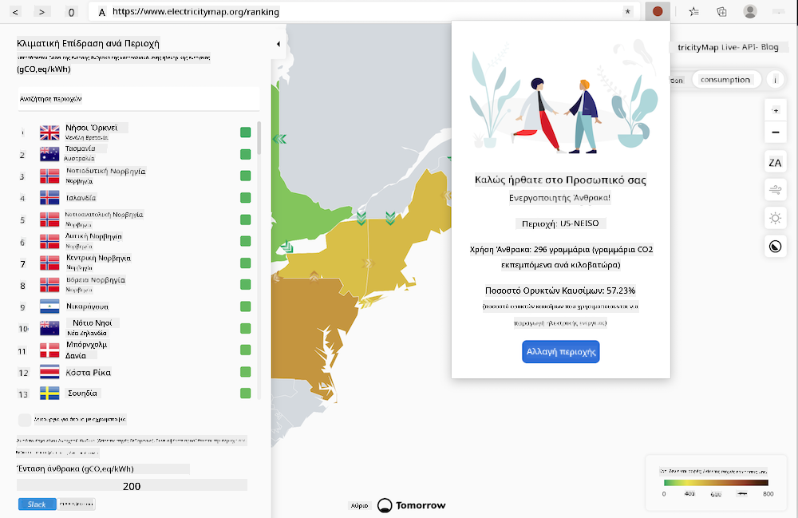

<!--
CO_OP_TRANSLATOR_METADATA:
{
  "original_hash": "9a6b22a2eff0f499b66236be973b24ad",
  "translation_date": "2025-08-26T22:50:00+00:00",
  "source_file": "5-browser-extension/solution/translation/README.it.md",
  "language_code": "el"
}
-->
# Επέκταση προγράμματος περιήγησης Carbon Trigger: κώδικας για να ξεκινήσετε

Θα χρησιμοποιηθεί το API Signal CO2 της tmrow για την παρακολούθηση της χρήσης ηλεκτρικής ενέργειας, ώστε να δημιουργηθεί μια επέκταση για το πρόγραμμα περιήγησης που θα παρέχει υπενθυμίσεις απευθείας στον περιηγητή σας σχετικά με το πόσο επιβαρυμένη είναι η χρήση ηλεκτρικής ενέργειας στην περιοχή σας. Η χρήση αυτής της ειδικής επέκτασης θα βοηθήσει στην αξιολόγηση των δραστηριοτήτων σας με βάση αυτές τις πληροφορίες.



## Ξεκινώντας

Είναι απαραίτητο να έχετε εγκατεστημένο το [npm](https://npmjs.com). Κατεβάστε ένα αντίγραφο αυτού του κώδικα σε έναν φάκελο στον υπολογιστή σας.

Εγκαταστήστε όλα τα απαιτούμενα πακέτα:

```
npm install
```

Δημιουργήστε την επέκταση με το webpack:

```
npm run build
```

Για εγκατάσταση στον Edge, χρησιμοποιήστε το μενού "τρεις τελείες" στην επάνω δεξιά γωνία του προγράμματος περιήγησης για να βρείτε τον πίνακα Επεκτάσεις. Εάν δεν είναι ήδη ενεργοποιημένη, ενεργοποιήστε τη Λειτουργία προγραμματιστή (κάτω αριστερά). Επιλέξτε "Φόρτωση μη συμπιεσμένου" για να φορτώσετε μια νέα επέκταση. Ανοίξτε τον φάκελο "dist" στο prompt και η επέκταση θα φορτωθεί. Για να τη χρησιμοποιήσετε, θα χρειαστείτε ένα API key για το API του CO2 Signal (μπορείτε [να το αποκτήσετε μέσω email εδώ](https://www.co2signal.com/) - εισάγετε το email σας στο πεδίο αυτής της σελίδας) και τον [κωδικό για την περιοχή σας](http://api.electricitymap.org/v3/zones) που αντιστοιχεί στον [ηλεκτρικό χάρτη](https://www.electricitymap.org/map) (για παράδειγμα, στη Βοστώνη, "US-NEISO").


Μόλις εισαχθούν το API key και η περιοχή στη διεπαφή της επέκτασης, το χρωματιστό σημείο στη γραμμή της επέκτασης του προγράμματος περιήγησης θα πρέπει να αλλάξει για να αντικατοπτρίζει τη χρήση ενέργειας της περιοχής και να παρέχει μια ένδειξη για το ποιες δραστηριότητες υψηλής κατανάλωσης ενέργειας θα ήταν κατάλληλες να εκτελεστούν. Η ιδέα πίσω από αυτό το σύστημα "σημείων" έχει εμπνευστεί από την [επέκταση Energy Lollipop](https://energylollipop.com/) για τις εκπομπές της Καλιφόρνιας.

---

**Αποποίηση ευθύνης**:  
Αυτό το έγγραφο έχει μεταφραστεί χρησιμοποιώντας την υπηρεσία αυτόματης μετάφρασης AI [Co-op Translator](https://github.com/Azure/co-op-translator). Παρόλο που καταβάλλουμε προσπάθειες για ακρίβεια, παρακαλούμε να έχετε υπόψη ότι οι αυτόματες μεταφράσεις ενδέχεται να περιέχουν σφάλματα ή ανακρίβειες. Το πρωτότυπο έγγραφο στη μητρική του γλώσσα θα πρέπει να θεωρείται η αυθεντική πηγή. Για κρίσιμες πληροφορίες, συνιστάται επαγγελματική ανθρώπινη μετάφραση. Δεν φέρουμε ευθύνη για τυχόν παρεξηγήσεις ή εσφαλμένες ερμηνείες που προκύπτουν από τη χρήση αυτής της μετάφρασης.