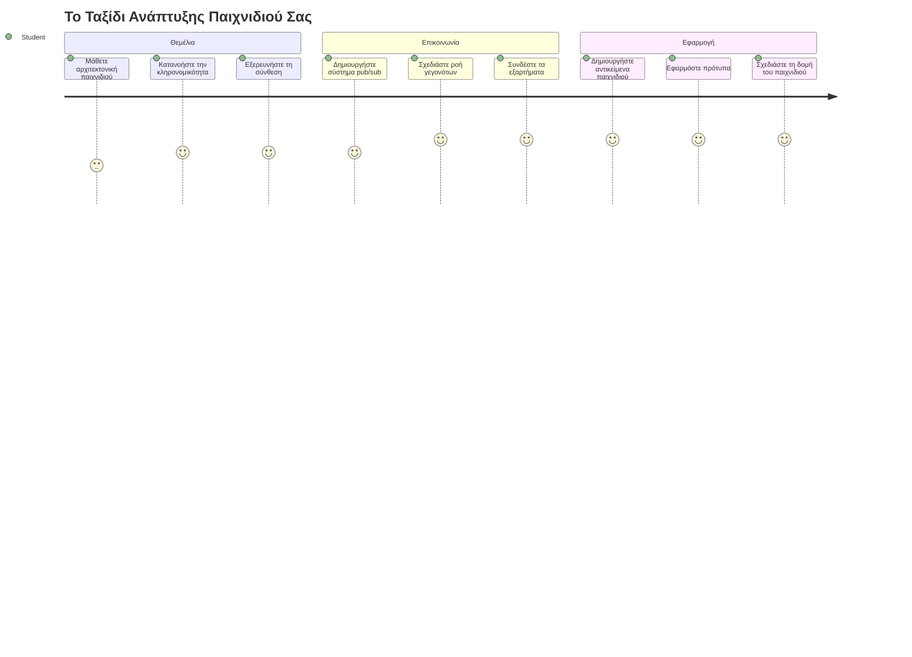
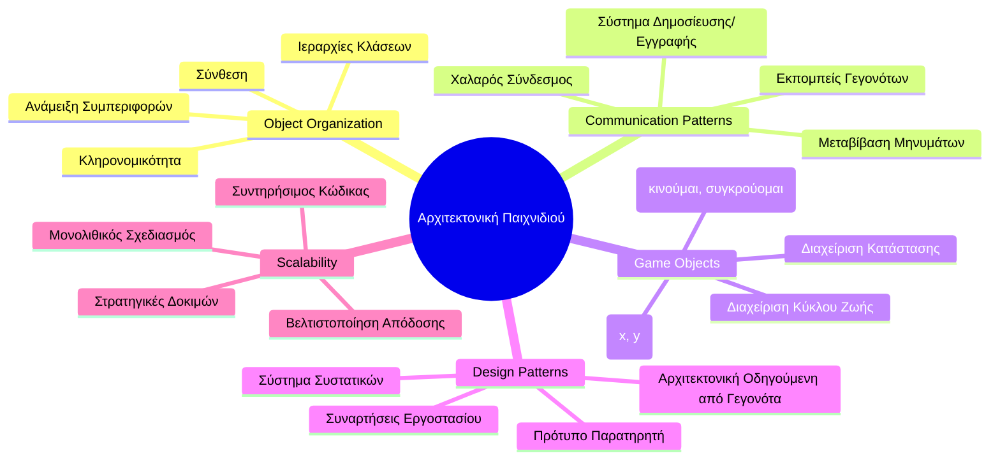
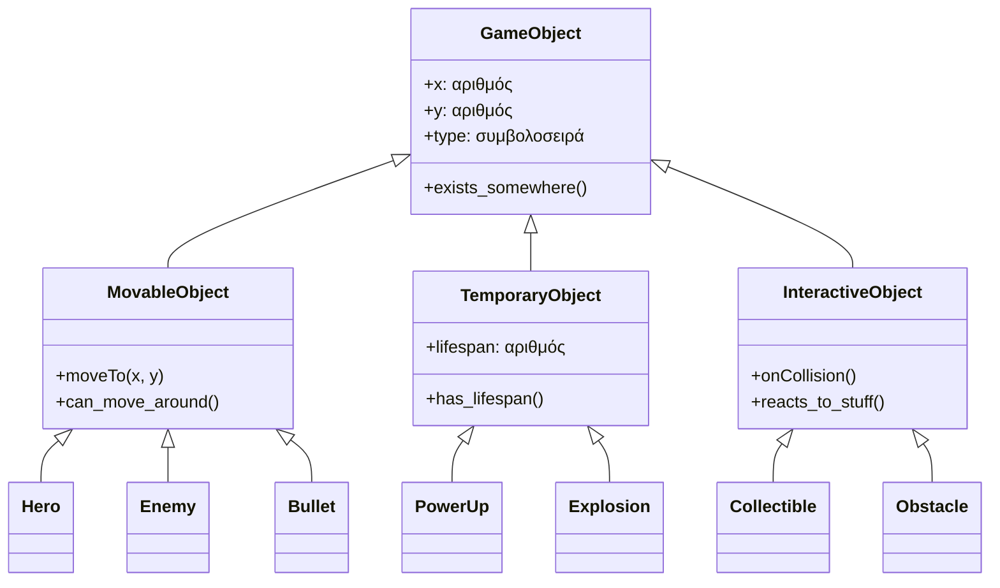
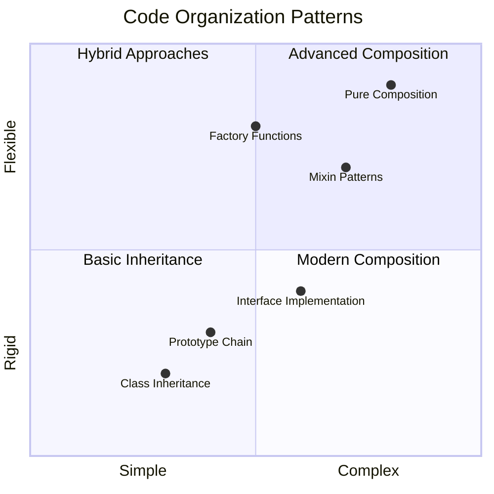
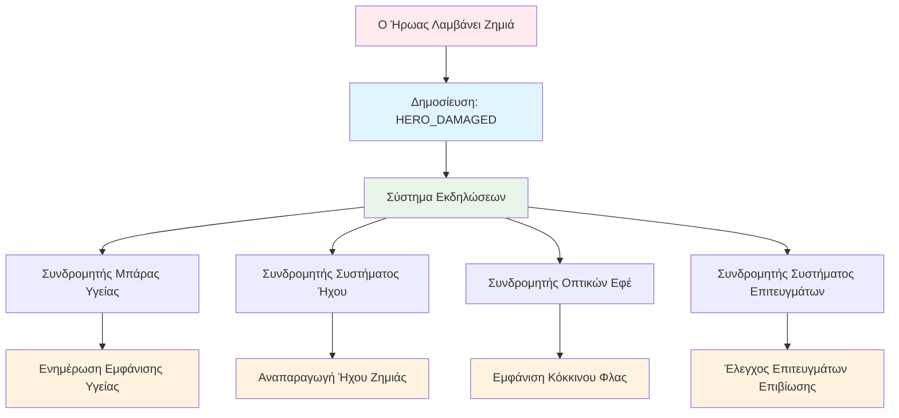
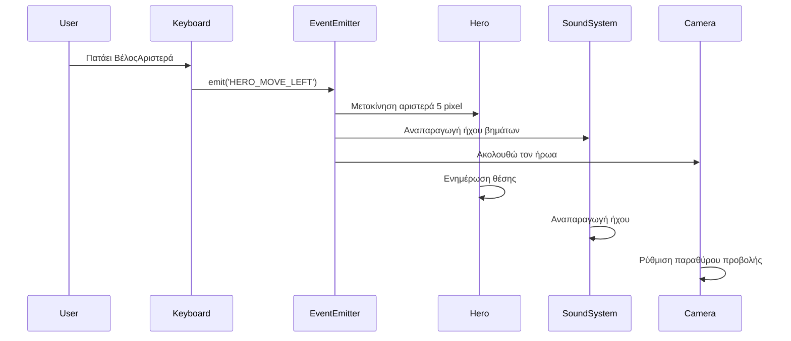
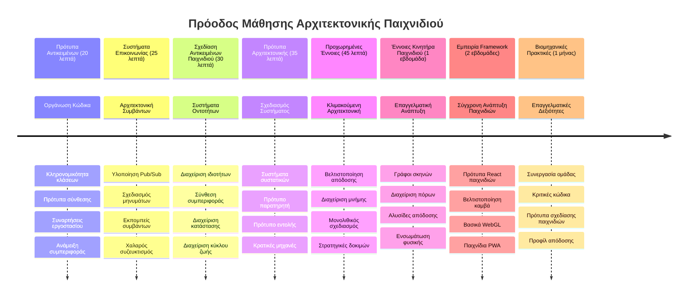

# Δημιουργία ενός Διαστημικού Παιχνιδιού Μέρος 1: Εισαγωγή




Όπως η αποστολή ελέγχου της NASA συντονίζει πολλαπλά συστήματα κατά την εκτόξευση ενός διαστημοπλοίου, έτσι και εμείς θα δημιουργήσουμε ένα διαστημικό παιχνίδι που δείχνει πώς διαφορετικά μέρη ενός προγράμματος μπορούν να συνεργαστούν χωρίς προβλήματα. Ενώ δημιουργείς κάτι που μπορείς πραγματικά να παίξεις, θα μάθεις βασικές προγραμματιστικές έννοιες που ισχύουν για οποιοδήποτε λογισμικό.

Θα εξερευνήσουμε δύο θεμελιώδεις προσεγγίσεις για την οργάνωση του κώδικα: την κληρονομικότητα και τη σύνθεση. Δεν είναι απλά ακαδημαϊκές έννοιες – είναι τα ίδια μοτίβα που δίνουν ζωή σε τα πάντα, από βιντεοπαιχνίδια μέχρι τραπεζικά συστήματα. Θα υλοποιήσουμε επίσης ένα σύστημα επικοινωνίας που ονομάζεται pub/sub και λειτουργεί όπως τα δίκτυα επικοινωνίας στα διαστημικά οχήματα, επιτρέποντας σε διαφορετικά στοιχεία να μοιράζονται πληροφορίες χωρίς να δημιουργούν εξαρτήσεις.

Στο τέλος αυτής της σειράς, θα καταλάβεις πώς να δημιουργείς εφαρμογές που μπορούν να κλιμακωθούν και να εξελιχθούν – είτε αναπτύσσεις παιχνίδια, web εφαρμογές, είτε οποιοδήποτε άλλο σύστημα λογισμικού.


## Προ-Διάλεξη Κουίζ

[Pre-lecture quiz](https://ff-quizzes.netlify.app/web/quiz/29)

## Κληρονομικότητα και Σύνθεση στην Ανάπτυξη Παιχνιδιών

Καθώς τα έργα γίνονται πιο πολύπλοκα, η οργάνωση του κώδικα γίνεται κρίσιμη. Αυτό που αρχικά είναι ένα απλό σκριπτ μπορεί να γίνει δύσκολο στη συντήρηση χωρίς σωστή δομή – όπως οι αποστολές Apollo που χρειάζονταν προσεκτικό συντονισμό μεταξύ χιλιάδων συστατικών.

Θα εξερευνήσουμε δύο θεμελιώδεις προσεγγίσεις για την οργάνωση του κώδικα: την κληρονομικότητα και τη σύνθεση. Η καθεμία έχει ξεχωριστά πλεονεκτήματα, και η κατανόηση και των δύο σε βοηθά να επιλέξεις τη σωστή προσέγγιση για διαφορετικές καταστάσεις. Θα δείξουμε αυτές τις έννοιες μέσα από το διαστημικό μας παιχνίδι, όπου ήρωες, εχθροί, ενισχύσεις και άλλα αντικείμενα πρέπει να αλληλεπιδρούν αποδοτικά.

✅ Ένα από τα πιο διάσημα βιβλία προγραμματισμού που γράφτηκαν έχει να κάνει με τα [μοτίβα σχεδιασμού](https://en.wikipedia.org/wiki/Design_Patterns).

Σε κάθε παιχνίδι, έχεις `αντικείμενα παιχνιδιού` – τα διαδραστικά στοιχεία που γεμίζουν τον κόσμο του παιχνιδιού σου. Ήρωες, εχθροί, ενισχύσεις και οπτικά εφέ είναι όλα αντικείμενα παιχνιδιού. Κάθε ένα υπάρχει σε συγκεκριμένες συντεταγμένες οθόνης χρησιμοποιώντας τιμές `x` και `y`, παρόμοια με το πιάσιμο σημείων σε ένα καρτεσιανό επίπεδο.

Παρά τις οπτικές τους διαφορές, αυτά τα αντικείμενα συχνά μοιράζονται θεμελιώδεις συμπεριφορές:

- **Υπάρχουν κάπου** – Κάθε αντικείμενο έχει συντεταγμένες x και y ώστε το παιχνίδι να ξέρει πού να το σχεδιάσει
- **Πολλά μπορούν να κινηθούν** – Οι ήρωες τρέχουν, οι εχθροί κυνηγούν, οι σφαίρες πετάνε στην οθόνη
- **Έχουν διάρκεια ζωής** – Κάποια μένουν για πάντα, άλλα (όπως εκρήξεις) εμφανίζονται για λίγο και εξαφανίζονται
- **Αντιδρούν σε γεγονότα** – Όταν συγκρούονται, συλλέγονται ενισχύσεις, ενημερώνονται οι μπάρες υγείας

✅ Σκέψου ένα παιχνίδι όπως το Pac-Man. Μπορείς να αναγνωρίσεις τους τέσσερις τύπους αντικειμένων που αναφέρονται παραπάνω σε αυτό το παιχνίδι;


### Έκφραση Συμπεριφοράς Μέσω Κώδικα

Τώρα που καταλαβαίνεις τις κοινές συμπεριφορές που μοιράζονται τα αντικείμενα παιχνιδιού, ας εξερευνήσουμε πώς να υλοποιήσεις αυτές τις συμπεριφορές σε JavaScript. Μπορείς να εκφράσεις τη συμπεριφορά ενός αντικειμένου μέσω μεθόδων συνημμένων είτε σε κλάσεις είτε σε μεμονωμένα αντικείμενα, και υπάρχουν αρκετές προσεγγίσεις για να διαλέξεις.

**Η Προσέγγιση Βασισμένη στις Κλάσεις**

Οι κλάσεις και η κληρονομικότητα προσφέρουν μια δομημένη προσέγγιση για την οργάνωση των αντικειμένων του παιχνιδιού. Όπως το ταξινομικό σύστημα του Carl Linnaeus, ξεκινάς με μια βασική κλάση που περιέχει κοινά χαρακτηριστικά, και μετά δημιουργείς εξειδικευμένες κλάσεις που κληρονομούν αυτά τα βασικά και προσθέτουν συγκεκριμένες δυνατότητες.

✅ Η κληρονομικότητα είναι μια σημαντική έννοια που πρέπει να κατανοήσεις. Μάθε περισσότερα στο [άρθρο της MDN για την κληρονομικότητα](https://developer.mozilla.org/docs/Web/JavaScript/Inheritance_and_the_prototype_chain).

Δες πώς μπορείς να υλοποιήσεις αντικείμενα παιχνιδιού χρησιμοποιώντας κλάσεις και κληρονομικότητα:

```javascript
// Βήμα 1: Δημιουργήστε την βασική κλάση GameObject
class GameObject {
  constructor(x, y, type) {
    this.x = x;
    this.y = y;
    this.type = type;
  }
}
```

**Ας αναλύσουμε βήμα προς βήμα:**
- Δημιουργούμε ένα βασικό πρότυπο που μπορεί να χρησιμοποιεί κάθε αντικείμενο παιχνιδιού
- Ο κατασκευαστής αποθηκεύει πού βρίσκεται το αντικείμενο (`x`, `y`) και τι είδους είναι
- Αυτό γίνεται το θεμέλιο πάνω στο οποίο θα χτίσουν όλα τα αντικείμενα του παιχνιδιού

```javascript
// Βήμα 2: Προσθήκη δυνατότητας κίνησης μέσω κληρονομικότητας
class Movable extends GameObject {
  constructor(x, y, type) {
    super(x, y, type); // Κλήση του constructor του γονέα
  }

  // Προσθήκη της δυνατότητας μετακίνησης σε νέα θέση
  moveTo(x, y) {
    this.x = x;
    this.y = y;
  }
}
```

**Στο παραπάνω, έχουμε:**
- **Επεκτείνει** την κλάση GameObject για να προσθέσουμε λειτουργία κίνησης
- **Καλεί** τον κατασκευαστή γονέα χρησιμοποιώντας `super()` για να αρχικοποιήσει τις κληρονομούμενες ιδιότητες
- **Προσθέτει** μια μέθοδο `moveTo()` που ενημερώνει τη θέση του αντικειμένου

```javascript
// Βήμα 3: Δημιουργήστε συγκεκριμένους τύπους αντικειμένων παιχνιδιού
class Hero extends Movable {
  constructor(x, y) {
    super(x, y, 'Hero'); // Ορίστε τον τύπο αυτόματα
  }
}

class Tree extends GameObject {
  constructor(x, y) {
    super(x, y, 'Tree'); // Τα δέντρα δεν χρειάζονται κίνηση
  }
}

// Βήμα 4: Χρησιμοποιήστε τα αντικείμενα παιχνιδιού σας
const hero = new Hero(0, 0);
hero.moveTo(5, 5); // Ο ήρωας μπορεί να κινηθεί!

const tree = new Tree(10, 15);
// tree.moveTo() θα προκαλούσε σφάλμα - τα δέντρα δεν μπορούν να κινηθούν
```

**Κατανόηση αυτών των εννοιών:**
- **Δημιουργεί** εξειδικευμένους τύπους αντικειμένων που κληρονομούν τις κατάλληλες συμπεριφορές
- **Δείχνει** πώς η κληρονομικότητα επιτρέπει την επιλεκτική ένταξη λειτουργιών
- **Δείχνει** ότι οι ήρωες μπορούν να κινηθούν ενώ τα δέντρα παραμένουν ακίνητα
- **Εξηγεί** πώς η ιεραρχία κλάσεων αποτρέπει ακατάλληλες ενέργειες

✅ Πάρε λίγα λεπτά να φανταστείς ξανά έναν ήρωα του Pac-Man (π.χ. Inky, Pinky ή Blinky) και πώς θα γραφόταν σε JavaScript.

**Η Προσέγγιση της Σύνθεσης**

Η σύνθεση ακολουθεί μια φιλοσοφία modular σχεδίασης, παρόμοια με το πώς οι μηχανικοί σχεδιάζουν διαστημικά οχήματα με ανταλλάξιμα μέρη. Αντί να κληρονομείς από μια γονική κλάση, συνδυάζεις συγκεκριμένες συμπεριφορές για να δημιουργήσεις αντικείμενα με ακριβώς τη λειτουργικότητα που χρειάζονται. Αυτή η προσέγγιση προσφέρει ευελιξία χωρίς αυστηρούς ιεραρχικούς περιορισμούς.

```javascript
// Βήμα 1: Δημιουργήστε αντικείμενα βασικής συμπεριφοράς
const gameObject = {
  x: 0,
  y: 0,
  type: ''
};

const movable = {
  moveTo(x, y) {
    this.x = x;
    this.y = y;
  }
};
```

**Τι κάνει αυτός ο κώδικας:**
- **Ορίζει** ένα βασικό `gameObject` με ιδιότητες θέσης και τύπου
- **Δημιουργεί** ένα ξεχωριστό αντικείμενο συμπεριφοράς `movable` με λειτουργία κίνησης
- **Διαχωρίζει** τις ανησυχίες κρατώντας τα δεδομένα θέσης και τη λογική κίνησης ανεξάρτητα

```javascript
// Βήμα 2: Σύνθεση αντικειμένων συνδυάζοντας συμπεριφορές
const movableObject = { ...gameObject, ...movable };

// Βήμα 3: Δημιουργία συναρτήσεων εργοστασίου για διαφορετικούς τύπους αντικειμένων
function createHero(x, y) {
  return {
    ...movableObject,
    x,
    y,
    type: 'Hero'
  };
}

function createStatic(x, y, type) {
  return {
    ...gameObject,
    x,
    y,
    type
  };
}
```

**Στο παραπάνω, έχουμε:**
- **Συνδυάσει** τις βασικές ιδιότητες αντικειμένου με τη συμπεριφορά κίνησης χρησιμοποιώντας το συντακτικό spread
- **Δημιουργήσει** λειτουργίες εργοστασίου που επιστρέφουν προσαρμοσμένα αντικείμενα
- **Ενεργοποιήσει** ευέλικτη δημιουργία αντικειμένων χωρίς αυστηρές ιεραρχίες κλάσεων
- **Επιτρέψει** στα αντικείμενα να έχουν ακριβώς τις συμπεριφορές που χρειάζονται

```javascript
// Βήμα 4: Δημιουργήστε και χρησιμοποιήστε τα συνθετικά αντικείμενά σας
const hero = createHero(10, 10);
hero.moveTo(5, 5); // Λειτουργεί τέλεια!

const tree = createStatic(0, 0, 'Tree');
// tree.moveTo() δεν ορίζεται - δεν συντέθηκε συμπεριφορά κίνησης
```

**Βασικά σημεία για να θυμάσαι:**
- **Συνθέτει** αντικείμενα αναμειγνύοντας συμπεριφορές αντί να τις κληρονομεί
- **Παρέχει** μεγαλύτερη ευελιξία σε σχέση με αυστηρές ιεραρχίες κληρονομικότητας
- **Επιτρέπει** στα αντικείμενα να έχουν ακριβώς τα χαρακτηριστικά που χρειάζονται
- **Χρησιμοποιεί** το σύγχρονο συντακτικό spread της JavaScript για καθαρό συνδυασμό αντικειμένων
```

**Which Pattern Should You Choose?**

**Which Pattern Should You Choose?**



> 💡 **Συμβουλή**: Και τα δύο μοτίβα έχουν τη θέση τους στην σύγχρονη ανάπτυξη JavaScript. Οι κλάσεις δουλεύουν καλά για καθορισμένες ιεραρχίες, ενώ η σύνθεση λάμπει όταν χρειάζεσαι μέγιστη ευελιξία.
> 
**Πότε να χρησιμοποιείς κάθε προσέγγιση:**
- **Επίλεξε** κληρονομικότητα όταν έχεις σαφείς σχέσεις "είναι-ένα" (π.χ. ένας Ήρωας *είναι* ένα κινητό αντικείμενο)
- **Διάλεξε** σύνθεση όταν έχεις σχέσεις "έχει-ένα" (π.χ. ένας Ήρωας *έχει* ικανότητες κίνησης)
- **Σκέψου** τις προτιμήσεις της ομάδας και τις απαιτήσεις του έργου
- **Θυμήσου** ότι μπορείς να συνδυάσεις και τις δύο προσεγγίσεις στην ίδια εφαρμογή

### 🔄 **Παιδαγωγικός Έλεγχος**
**Κατανόηση Οργάνωσης Αντικειμένων**: Πριν προχωρήσεις στα μοτίβα επικοινωνίας, βεβαιώσου ότι μπορείς να:
- ✅ Εξηγήσεις τη διαφορά μεταξύ κληρονομικότητας και σύνθεσης
- ✅ Αναγνωρίσεις πότε χρησιμοποιείς κλάσεις έναντι λειτουργιών εργοστασίου
- ✅ Καταλάβεις πώς λειτουργεί η λέξη-κλειδί `super()` στην κληρονομικότητα
- ✅ Αναγνωρίσεις τα οφέλη κάθε προσέγγισης για την ανάπτυξη παιχνιδιών

**Γρήγορο Αυτοτεστ**: Πώς θα δημιουργούσες έναν Πτητικό Εχθρό που μπορεί και να κινείται και να πετάει;
- **Προσέγγιση κληρονομικότητας**: `class FlyingEnemy extends Movable`
- **Προσέγγιση σύνθεσης**: `{ ...movable, ...flyable, ...gameObject }`

**Σύνδεση με την Πραγματικότητα**: Αυτά τα μοτίβα υπάρχουν παντού:
- **React Components**: Props (σύνθεση) έναντι κληρονομιάς κλάσεων
- **Game Engines**: Συστήματα οντοτήτων-συστατικών (ECS) χρησιμοποιούν σύνθεση
- **Εφαρμογές Κινητών**: Πλαίσια UI συχνά χρησιμοποιούν ιεραρχίες κληρονομικότητας

## Μοτίβα Επικοινωνίας: Το Σύστημα Pub/Sub

Καθώς οι εφαρμογές γίνονται πολύπλοκες, η διαχείριση της επικοινωνίας μεταξύ των συστατικών γίνεται πρόκληση. Το μοτίβο δημοσίευσης-εγγραφής (pub/sub) λύνει αυτό το πρόβλημα χρησιμοποιώντας αρχές παρόμοιες με την ραδιοφωνική μετάδοση – ένας πομπός μπορεί να φτάσει πολλούς δέκτες χωρίς να ξέρει ποιοι ακούνε.

Σκέψου τι συμβαίνει όταν ένας ήρωας δεχθεί ζημιά: η μπάρα υγείας ενημερώνεται, παίζουν ηχητικά εφέ, εμφανίζεται οπτική ανατροφοδότηση. Αντί να συνδέεται το αντικείμενο του ήρωα απευθείας με αυτά τα συστήματα, το pub/sub επιτρέπει στον ήρωα να εκπέμψει ένα μήνυμα "ζημιάς". Οποιοδήποτε σύστημα πρέπει να αντιδράσει μπορεί να εγγραφεί σε αυτόν τον τύπο μηνύματος και να αντιδράσει ανάλογα.

✅ **Pub/Sub** σημαίνει 'δημοσίευση-εγγραφή'


### Κατανόηση της Αρχιτεκτονικής Pub/Sub

Το μοτίβο pub/sub διατηρεί τα διαφορετικά μέρη της εφαρμογής σου χαλαρά συνδεδεμένα, που σημαίνει ότι μπορούν να συνεργάζονται χωρίς να εξαρτώνται άμεσα το ένα από το άλλο. Αυτή η διαχωρισμένη προσέγγιση κάνει τον κώδικά σου πιο συντηρήσιμο, δοκιμαστικό και ευέλικτο σε αλλαγές.

**Οι βασικοί παίκτες στο pub/sub:**
- **Μηνύματα** – Απλές ετικέτες κειμένου όπως `'PLAYER_SCORED'` που περιγράφουν τι συνέβη (συν επιπλέον πληροφορίες)
- **Δημοσιογράφοι** – Τα αντικείμενα που φωνάζουν "Κάτι συνέβη!" σε όποιον ακούει
- **Εγγεγραμμένοι** – Τα αντικείμενα που λένε "Με ενδιαφέρει αυτό το γεγονός" και αντιδρούν όταν συμβαίνει
- **Σύστημα Γεγονότων** – Ο μεσάζων που φροντίζει τα μηνύματα να φτάνουν στους κατάλληλους ακροατές

### Δημιουργία ενός Συστήματος Γεγονότων

Ας δημιουργήσουμε ένα απλό αλλά ισχυρό σύστημα γεγονότων που δείχνει αυτές τις έννοιες:

```javascript
// Βήμα 1: Δημιουργήστε την κλάση EventEmitter
class EventEmitter {
  constructor() {
    this.listeners = {}; // Αποθηκεύστε όλους τους ακροατές γεγονότων
  }
  
  // Εγγραφείτε έναν ακροατή για έναν συγκεκριμένο τύπο μηνύματος
  on(message, listener) {
    if (!this.listeners[message]) {
      this.listeners[message] = [];
    }
    this.listeners[message].push(listener);
  }
  
  // Αποστολή μηνύματος σε όλους τους εγγεγραμμένους ακροατές
  emit(message, payload = null) {
    if (this.listeners[message]) {
      this.listeners[message].forEach(listener => {
        listener(message, payload);
      });
    }
  }
}
```

**Ανάλυση του τι συμβαίνει εδώ:**
- **Δημιουργεί** ένα κεντρικό σύστημα διαχείρισης γεγονότων χρησιμοποιώντας μια απλή κλάση
- **Αποθηκεύει** ακροατές σε ένα αντικείμενο οργανωμένο ανά τύπο μηνύματος
- **Καταχωρεί** νέους ακροατές χρησιμοποιώντας τη μέθοδο `on()`
- **Διαδίδει** μηνύματα σε όλους τους ενδιαφερόμενους ακροατές μέσω της `emit()`
- **Υποστηρίζει** προαιρετικά δεδομένα για τη μεταφορά σχετικών πληροφοριών

### Βάζοντας Όλα Μαζί: Ένα Πρακτικό Παράδειγμα

Εντάξει, ας το δούμε στην πράξη! Θα δημιουργήσουμε ένα απλό σύστημα κίνησης που δείχνει πόσο καθαρό και ευέλικτο μπορεί να είναι το pub/sub:

```javascript
// Βήμα 1: Ορίστε τους τύπους των μηνυμάτων σας
const Messages = {
  HERO_MOVE_LEFT: 'HERO_MOVE_LEFT',
  HERO_MOVE_RIGHT: 'HERO_MOVE_RIGHT',
  ENEMY_SPOTTED: 'ENEMY_SPOTTED'
};

// Βήμα 2: Δημιουργήστε το σύστημα συμβάντων και τα αντικείμενα παιχνιδιού σας
const eventEmitter = new EventEmitter();
const hero = createHero(0, 0);
```

**Αυτός ο κώδικας κάνει:**
- **Ορίζει** ένα αντικείμενο σταθερών για την αποφυγή λαθών στα ονόματα των μηνυμάτων
- **Δημιουργεί** μια παρουσία ενός EventEmitter για να χειρίζεται όλη την επικοινωνία
- **Αρχικοποιεί** ένα αντικείμενο ήρωα στη θέση εκκίνησης

```javascript
// Βήμα 3: Ρυθμίστε ακροατές συμβάντων (συνδρομητές)
eventEmitter.on(Messages.HERO_MOVE_LEFT, () => {
  hero.moveTo(hero.x - 5, hero.y);
  console.log(`Hero moved to position: ${hero.x}, ${hero.y}`);
});

eventEmitter.on(Messages.HERO_MOVE_RIGHT, () => {
  hero.moveTo(hero.x + 5, hero.y);
  console.log(`Hero moved to position: ${hero.x}, ${hero.y}`);
});
```

**Στο παραπάνω, έχουμε:**
- **Καταχωρήσει** ακροατές γεγονότων που ανταποκρίνονται σε μηνύματα κίνησης
- **Ενημερώσει** τη θέση του ήρωα με βάση την κατεύθυνση κίνησης
- **Προσθέσει** καταγραφές κονσόλας για να παρακολουθείς τις αλλαγές θέσης του ήρωα
- **Διαχωρίσει** τη λογική κίνησης από τη διαχείριση εισόδου

```javascript
// Βήμα 4: Συνδέστε την είσοδο πληκτρολογίου με τα γεγονότα (εκδότες)
window.addEventListener('keydown', (event) => {
  switch(event.key) {
    case 'ArrowLeft':
      eventEmitter.emit(Messages.HERO_MOVE_LEFT);
      break;
    case 'ArrowRight':
      eventEmitter.emit(Messages.HERO_MOVE_RIGHT);
      break;
  }
});
```

**Κατανόηση αυτών των εννοιών:**
- **Συνδέει** την είσοδο πληκτρολογίου με γεγονότα παιχνιδιού χωρίς σφικτή σύνδεση
- **Επιτρέπει** στο σύστημα εισόδου να επικοινωνεί με τα αντικείμενα παιχνιδιού έμμεσα
- **Επιτρέπει** σε πολλά συστήματα να ανταποκρίνονται στα ίδια γεγονότα πληκτρολογίου
- **Κάνει** εύκολη την αλλαγή δεσμών πλήκτρων ή την προσθήκη νέων μεθόδων εισόδου


> 💡 **Συμβουλή**: Το ωραίο αυτού του μοτίβου είναι η ευελιξία! Μπορείς εύκολα να προσθέσεις ηχητικά εφέ, κούνημα οθόνης ή εφέ σωματιδίων απλά προσθέτοντας περισσότερους ακροατές γεγονότων – χωρίς να χρειάζεται να αλλάξεις τον υπάρχοντα κώδικα πληκτρολογίου ή κίνησης.
> 
**Γιατί θα λατρέψεις αυτή την προσέγγιση:**
- Η προσθήκη νέων λειτουργιών γίνεται πολύ εύκολη – απλά άκου τα γεγονότα που σε ενδιαφέρουν
- Πολλά πράγματα μπορούν να αντιδράσουν στο ίδιο γεγονός χωρίς να παρεμβαίνουν μεταξύ τους
- Οι δοκιμές γίνονται πολύ απλούστερες γιατί κάθε κομμάτι λειτουργεί ανεξάρτητα
- Όταν κάτι σπάσει, ξέρεις ακριβώς πού να κοιτάξεις

### Γιατί το Pub/Sub Κλιμακώνεται Αποτελεσματικά

Το μοτίβο pub/sub διατηρεί την απλότητα όσο οι εφαρμογές γίνονται πιο πολύπλοκες. Είτε διαχειρίζεσαι δεκάδες εχθρούς, δυναμικές ενημερώσεις UI ή ηχητικά συστήματα, το μοτίβο χειρίζεται την αυξημένη κλίμακα χωρίς αλλαγές στην αρχιτεκτονική. Νέες λειτουργίες ενσωματώνονται στο υπάρχον σύστημα γεγονότων χωρίς να επηρεάζουν τη λειτουργικότητα που έχει ήδη καθιερωθεί.

> ⚠️ **Συχνό Λάθος**: Μην δημιουργείς πάρα πολλούς εξειδικευμένους τύπους μηνυμάτων από νωρίς. Ξεκίνα με ευρείες κατηγορίες και βελτίωσέ τες καθώς οι ανάγκες του παιχνιδιού σου γίνονται πιο ξεκάθαρες.
> 
**Καλές πρακτικές που πρέπει να ακολουθείς:**
- **Ομαδοποιεί** σχετικά μηνύματα σε λογικές κατηγορίες
- **Χρησιμοποιεί** περιγραφικά ονόματα που δείχνουν ξεκάθαρα τι συνέβη
- **Κρατά** τα φορτία των μηνυμάτων απλά και στοχευμένα
- **Τεκμηριώνει** τους τύπους μηνυμάτων για καλύτερη συνεργασία ομάδας

### 🔄 **Παιδαγωγικός Έλεγχος**
**Κατανόηση Αρχιτεκτονικής με Γεγονότα**: Επιβεβαίωσε ότι καταλαβαίνεις το πλήρες σύστημα:
- ✅ Πώς το μοτίβο pub/sub αποτρέπει τη σφικτή σύνδεση μεταξύ των συστατικών;
- ✅ Γιατί είναι πιο εύκολο να προσθέτεις νέες λειτουργίες με την αρχιτεκτονική που βασίζεται σε γεγονότα;
- ✅ Ποιο ρόλο παίζει ο EventEmitter στη ροή της επικοινωνίας;
- ✅ Πώς τα σταθερά μηνύματα αποτρέπουν σφάλματα και βελτιώνουν τη συντηρησιμότητα;

**Πρόκληση Σχεδιασμού**: Πώς θα διαχειρίζονταν το pub/sub τα εξής σενάρια παιχνιδιού;
1. **Ο εχθρός πεθαίνει**: Ενημέρωση σκορ, αναπαραγωγή ήχου, δημιουργία ενίσχυσης, αφαίρεση από την οθόνη
2. **Ολοκλήρωση επιπέδου**: Σταμάτημα μουσικής, εμφάνιση UI, αποθήκευση προόδου, φόρτωση επόμενου επιπέδου
3. **Επισύναψη ενίσχυσης**: Ενίσχυση ικανοτήτων, ενημέρωση UI, αναπαραγωγή εφέ, έναρξη χρονομέτρου

**Σύνδεση με Επαγγελματικό Περιβάλλον**: Αυτό το μοτίβο εμφανίζεται σε:
- **Frontend Frameworks**: Συστήματα γεγονότων React/Vue
- **Backend Υπηρεσίες**: Επικοινωνία μικροσέρβις
- **Game Engines**: Σύστημα γεγονότων της Unity
- **Ανάπτυξη Κινητών**: Συστήματα ειδοποιήσεων iOS/Android

---

## Πρόκληση GitHub Copilot Agent 🚀

Χρησιμοποίησε τη λειτουργία Agent για να ολοκληρώσεις την επόμενη πρόκληση:

**Περιγραφή:** Δημιουργήστε ένα απλό σύστημα αντικειμένων παιχνιδιού χρησιμοποιώντας τόσο την κληρονομικότητα όσο και το μοτίβο pub/sub. Θα υλοποιήσεις ένα βασικό παιχνίδι όπου διαφορετικά αντικείμενα μπορούν να επικοινωνούν μέσω γεγονότων χωρίς να γνωρίζουν ο ένας τον άλλο άμεσα.

**Προτροπή:** Δημιουργήστε ένα σύστημα παιχνιδιού JavaScript με τις παρακάτω απαιτήσεις: 1) Δημιουργήστε μια βασική κλάση GameObject με συντεταγμένες x, y και μια ιδιότητα τύπου. 2) Δημιουργήστε μια κλάση Hero που επεκτείνει την GameObject και μπορεί να κινείται. 3) Δημιουργήστε μια κλάση Enemy που επεκτείνει την GameObject και μπορεί να κυνηγά τον ήρωα. 4) Υλοποιήστε μια κλάση EventEmitter για το μοτίβο pub/sub. 5) Ρυθμίστε ακροατές γεγονότων ώστε όταν ο ήρωας κινείται, οι κοντινοί εχθροί λαμβάνουν το γεγονός 'HERO_MOVED' και ενημερώνουν τη θέση τους για να κινηθούν προς τον ήρωα. Συμπεριλάβετε δηλώσεις console.log για να δείξετε την επικοινωνία μεταξύ των αντικειμένων.

Μάθε περισσότερα για τη [λειτουργία agent](https://code.visualstudio.com/blogs/2025/02/24/introducing-copilot-agent-mode) εδώ.

## 🚀 Πρόκληση
Σκεφτείτε πώς το πρότυπο pub-sub μπορεί να βελτιώσει την αρχιτεκτονική ενός παιχνιδιού. Αναγνωρίστε ποια στοιχεία θα πρέπει να εκπέμπουν γεγονότα και πώς θα πρέπει να ανταποκρίνεται το σύστημα. Σχεδιάστε ένα concept παιχνιδιού και χαρτογραφήστε τα μοτίβα επικοινωνίας μεταξύ των στοιχείων του.

## Post-Lecture Quiz

[Post-lecture quiz](https://ff-quizzes.netlify.app/web/quiz/30)

## Review & Self Study

Μάθετε περισσότερα για το Pub/Sub διαβάζοντας [εδώ](https://docs.microsoft.com/azure/architecture/patterns/publisher-subscriber/?WT.mc_id=academic-77807-sagibbon).

### ⚡ **Τι Μπορείτε να Κάνετε στα Επόμενα 5 Λεπτά**
- [ ] Ανοίξτε οποιοδήποτε παιχνίδι HTML5 online και ελέγξτε τον κώδικά του με DevTools
- [ ] Δημιουργήστε ένα απλό στοιχείο HTML5 Canvas και σχεδιάστε ένα βασικό σχήμα
- [ ] Δοκιμάστε να χρησιμοποιήσετε το `setInterval` για να δημιουργήσετε έναν απλό βρόχο κινούμενης εικόνας
- [ ] Εξερευνήστε την τεκμηρίωση της Canvas API και δοκιμάστε μια μέθοδο σχεδίασης

### 🎯 **Τι Μπορείτε να Επιτύχετε Αυτήν την Ώρα**
- [ ] Ολοκληρώστε το κουίζ μετά το μάθημα και κατανοήστε τις έννοιες ανάπτυξης παιχνιδιών
- [ ] Ρυθμίστε τη δομή του παιχνιδιού σας με αρχεία HTML, CSS και JavaScript
- [ ] Δημιουργήστε έναν βασικό βρόχο παιχνιδιού που ενημερώνει και αποδίδει συνεχώς
- [ ] Σχεδιάστε τους πρώτους χαρακτήρες του παιχνιδιού στον καμβά
- [ ] Υλοποιήστε βασική φόρτωση στοιχείων για εικόνες και ήχους

### 📅 **Δημιουργία Παιχνιδιού Διάρκειας Μίας Εβδομάδας**
- [ ] Ολοκληρώστε το πλήρες διαστημικό παιχνίδι με όλες τις προγραμματισμένες λειτουργίες
- [ ] Προσθέστε λιθογραφικά γραφικά, ηχητικά εφέ και ομαλές κινούμενες εικόνες
- [ ] Υλοποιήστε καταστάσεις παιχνιδιού (οθόνη εκκίνησης, παιχνίδι, τέλος παιχνιδιού)
- [ ] Δημιουργήστε σύστημα βαθμολογίας και παρακολούθηση προόδου παίκτη
- [ ] Κάντε το παιχνίδι σας ανταποκρίσιμο και προσβάσιμο σε διάφορες συσκευές
- [ ] Μοιραστείτε το παιχνίδι σας online και συλλέξτε σχόλια από τους παίκτες

### 🌟 **Ανάπτυξη Παιχνιδιού Διάρκειας Ένος Μηνός**
- [ ] Δημιουργήστε πολλαπλά παιχνίδια εξερευνώντας διαφορετικά είδη και μηχανισμούς
- [ ] Μάθετε ένα πλαίσιο ανάπτυξης παιχνιδιών όπως Phaser ή Three.js
- [ ] Συμβάλλετε σε έργα ανάπτυξης παιχνιδιών ανοιχτού κώδικα
- [ ] Κατακτήστε προηγμένα μοτίβα προγραμματισμού και βελτιστοποίησης παιχνιδιών
- [ ] Δημιουργήστε ένα portfolio που παρουσιάζει τις δεξιότητές σας στην ανάπτυξη παιχνιδιών
- [ ] Καθοδηγήστε άλλους που ενδιαφέρονται για την ανάπτυξη παιχνιδιών και διαδραστικών μέσων

## 🎯 Χρονοδιάγραμμα Δεξιοτήτων Ανάπτυξης Παιχνιδιού


### 🛠️ Περίληψη Εργαλείων Αρχιτεκτονικής Παιχνιδιού

Μετά την ολοκλήρωση αυτού του μαθήματος, έχετε πλέον:
- **Κατανόηση Μοτίβων Σχεδιασμού**: Κατανόηση των ανταλλαγών μεταξύ κληρονομικότητας και σύνθεσης
- **Αρχιτεκτονική Με Οδηγημένα Γεγονότα**: Υλοποίηση pub/sub για κλιμακούμενη επικοινωνία
- **Αντικειμενοστραφής Σχεδιασμός**: Ιεραρχίες κλάσεων και σύνθεση συμπεριφορών
- **Μοντέρνο JavaScript**: Συναρτήσεις εργοστασίου, spread σύνταξη και μοτίβα ES6+
- **Κλιμακούμενη Αρχιτεκτονική**: Χαλαρή συζευξιμότητα και αρχές modular σχεδιασμού
- **Βάσεις Ανάπτυξης Παιχνιδιών**: Συστήματα οντοτήτων και μοτίβα στοιχείων
- **Επαγγελματικά Μοτίβα**: Προσεγγίσεις οργάνωσης κώδικα βιομηχανικού επιπέδου

**Εφαρμογές στον Πραγματικό Κόσμο**: Αυτά τα μοτίβα εφαρμόζονται άμεσα σε:
- **Frontend Frameworks**: Αρχιτεκτονική και διαχείριση κατάστασης React/Vue
- **Backend Υπηρεσίες**: Επικοινωνία μικροϋπηρεσιών και συστήματα οδηγούμενα από γεγονότα
- **Κινητή Ανάπτυξη**: Αρχιτεκτονική εφαρμογών iOS/Android και συστήματα ειδοποιήσεων
- **Μηχανές Παιχνιδιών**: Unity, Unreal και ανάπτυξη παιχνιδιών στο web
- **Επιχειρησιακό Λογισμικό**: Event sourcing και σχεδιασμός κατανεμημένων συστημάτων
- **Σχεδιασμός API**: RESTful υπηρεσίες και επικοινωνία σε πραγματικό χρόνο

**Επαγγελματικές Δεξιότητες**: Τώρα μπορείτε να:
- **Σχεδιάζετε** κλιμακούμενες αρχιτεκτονικές λογισμικού με δοκιμασμένα μοτίβα
- **Υλοποιείτε** συστήματα οδηγούμενα από γεγονότα που διαχειρίζονται σύνθετες αλληλεπιδράσεις
- **Επιλέγετε** κατάλληλες στρατηγικές οργάνωσης κώδικα για διαφορετικά σενάρια
- **Αντιμετωπίζετε Σφάλματα** και διαχειρίζεστε αποτελεσματικά χαλαρά συζευγμένα συστήματα
- **Επικοινωνείτε** τεχνικές αποφάσεις χρησιμοποιώντας ορολογία βιομηχανικού επιπέδου

**Επόμενο Βήμα**: Είστε έτοιμοι να εφαρμόσετε αυτά τα μοτίβα σε πραγματικό παιχνίδι, να εξερευνήσετε προχωρημένα θέματα ανάπτυξης ή να εφαρμόσετε αυτές τις αρχιτεκτονικές έννοιες σε web εφαρμογές!

🌟 **Επίτευγμα Αποκτήθηκε**: Κατακτήσατε θεμελιώδη μοτίβα αρχιτεκτονικής λογισμικού που τροφοδοτούν από απλά παιχνίδια μέχρι πολύπλοκα επιχειρησιακά συστήματα!

## Assignment

[Mock up a game](assignment.md)

---

<!-- CO-OP TRANSLATOR DISCLAIMER START -->
**Αποποίηση ευθυνών**:  
Αυτό το έγγραφο έχει μεταφραστεί χρησιμοποιώντας την υπηρεσία μηχανικής μετάφρασης AI [Co-op Translator](https://github.com/Azure/co-op-translator). Παρόλο που επιδιώκουμε την ακρίβεια, παρακαλούμε να γνωρίζετε ότι οι αυτοματοποιημένες μεταφράσεις ενδέχεται να περιέχουν λάθη ή ανακρίβειες. Το πρωτότυπο έγγραφο στην μητρική του γλώσσα πρέπει να θεωρείται η αυθεντική πηγή. Για κρίσιμες πληροφορίες συνιστάται επαγγελματική μετάφραση από ανθρώπινο μεταφραστή. Δεν φέρουμε καμία ευθύνη για τυχόν παρεξηγήσεις ή λανθασμένες ερμηνείες που προκύπτουν από τη χρήση αυτής της μετάφρασης.
<!-- CO-OP TRANSLATOR DISCLAIMER END -->