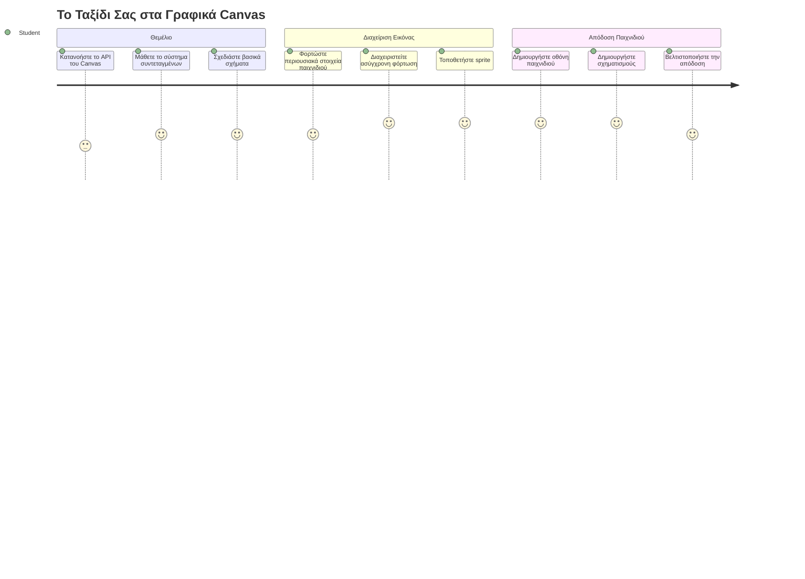
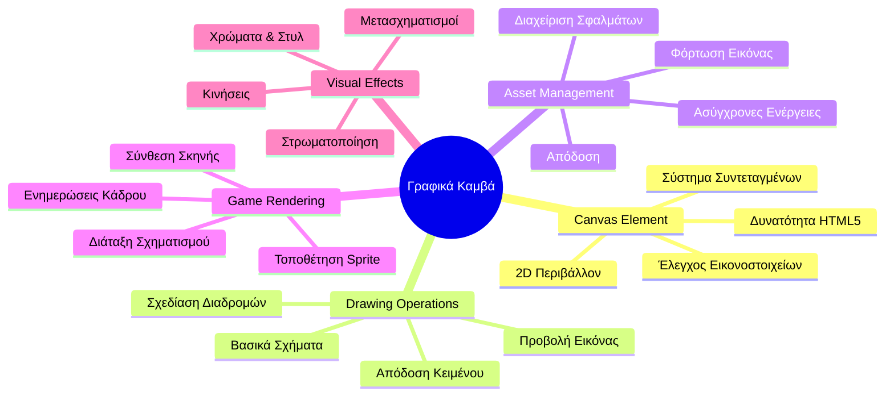
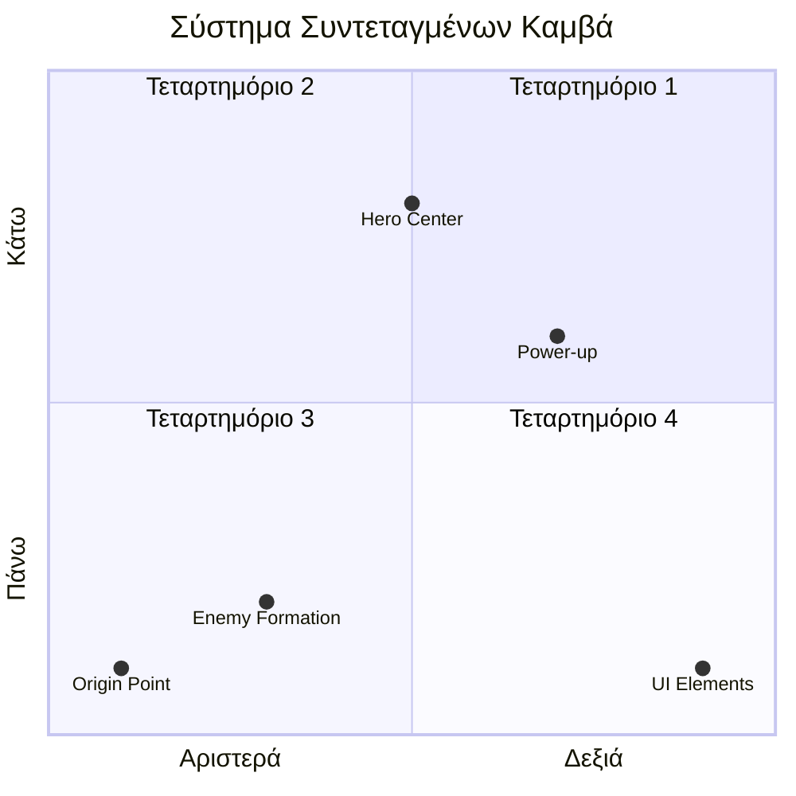
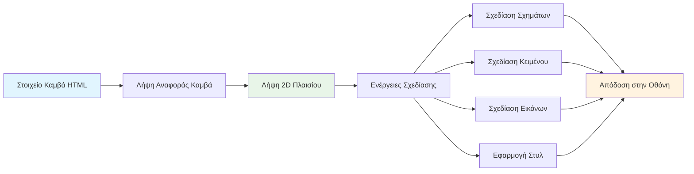
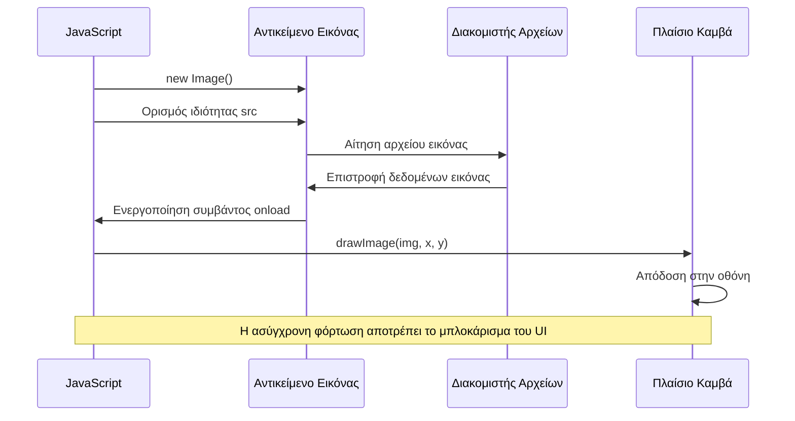
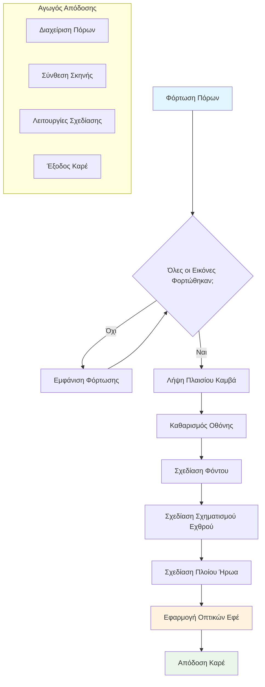
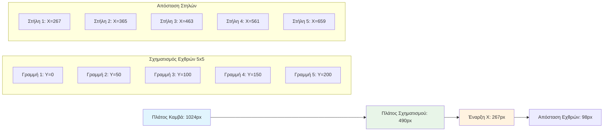
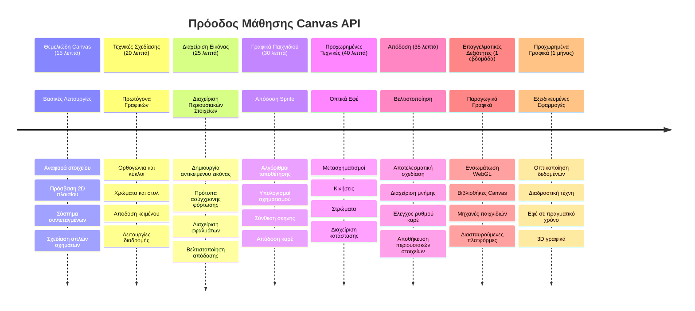

<!--
CO_OP_TRANSLATOR_METADATA:
{
  "original_hash": "7994743c5b21fdcceb36307916ef249a",
  "translation_date": "2026-01-06T20:33:01+00:00",
  "source_file": "6-space-game/2-drawing-to-canvas/README.md",
  "language_code": "el"
}
-->
# Δημιουργήστε ένα παιχνίδι διαστήματος Μέρος 2: Σχεδιάστε τον Ήρωα και τα Τέρατα στον Καμβά


Το Canvas API είναι ένα από τα πιο ισχυρά χαρακτηριστικά της ανάπτυξης ιστοσελίδων για τη δημιουργία δυναμικών, διαδραστικών γραφικών απευθείας στον περιηγητή σας. Σε αυτό το μάθημα, θα μεταμορφώσουμε το κενό HTML `<canvas>` στοιχείο σε έναν κόσμο παιχνιδιού γεμάτο ήρωες και τέρατα. Σκεφτείτε τον καμβά ως τον ψηφιακό σας καμβά, όπου ο κώδικας γίνεται οπτικό.

Χτίζουμε πάνω σε όσα μάθατε στο προηγούμενο μάθημα, και τώρα θα βουτήξουμε στα οπτικά στοιχεία. Θα μάθετε πώς να φορτώνετε και να εμφανίζετε sprites παιχνιδιού, να τοποθετείτε στοιχεία με ακρίβεια και να δημιουργήσετε το οπτικό θεμέλιο για το παιχνίδι διαστήματός σας. Αυτό γεφυρώνει το χάσμα μεταξύ στατικών ιστοσελίδων και δυναμικών, διαδραστικών εμπειριών.

Μέχρι το τέλος αυτού του μαθήματος, θα έχετε μια πλήρη σκηνή παιχνιδιού με το πλοίο του ήρωά σας τοποθετημένο σωστά και τις εχθρικές σχηματισμούς έτοιμες για μάχη. Θα κατανοήσετε πώς τα σύγχρονα παιχνίδια αποδίδουν γραφικά στους περιηγητές και θα αποκτήσετε δεξιότητες για να δημιουργήσετε τις δικές σας διαδραστικές οπτικές εμπειρίες. Ας εξερευνήσουμε τα γραφικά του καμβά και να ζωντανέψουμε το παιχνίδι διαστήματός σας!


## Προ-διάλεξη Quiz

[Προ-διάλεξη quiz](https://ff-quizzes.netlify.app/web/quiz/31)

## Ο Καμβάς

Τι ακριβώς είναι αυτό το στοιχείο `<canvas>`; Είναι η λύση του HTML5 για τη δημιουργία δυναμικών γραφικών και animations στους περιηγητές ιστού. Σε αντίθεση με τις κανονικές εικόνες ή βίντεο που είναι στατικά, ο καμβάς σας δίνει έλεγχο σε επίπεδο pixel για όλα όσα εμφανίζονται στην οθόνη. Αυτό τον καθιστά ιδανικό για παιχνίδια, οπτικοποιήσεις δεδομένων και διαδραστική τέχνη. Σκεφτείτε τον ως μια προγραμματιζόμενη επιφάνεια σχεδίασης όπου η JavaScript γίνεται το πινέλο σας.

Κατά προεπιλογή, ένα στοιχείο καμβά φαίνεται ως ένα κενό, διάφανο ορθογώνιο στη σελίδα σας. Αλλά εκεί βρίσκεται η δύναμή του! Η πραγματική του ισχύς εμφανίζεται όταν χρησιμοποιείτε την JavaScript για να σχεδιάσετε σχήματα, να φορτώσετε εικόνες, να δημιουργήσετε animations και να κάνετε τα πράγματα να αντιδρούν σε ενέργειες του χρήστη. Είναι παρόμοιο με τον τρόπο που οι πρώτοι πρωτοπόροι των υπολογιστικών γραφικών στα Bell Labs τη δεκαετία του 1960 έπρεπε να προγραμματίζουν κάθε pixel για να δημιουργήσουν τις πρώτες ψηφιακές animation.

✅ Διαβάστε [περισσότερα για το Canvas API](https://developer.mozilla.org/docs/Web/API/Canvas_API) στο MDN.

Έτσι δηλώνεται συνήθως, ως μέρος του σώματος της σελίδας:

```html
<canvas id="myCanvas" width="200" height="100"></canvas>
```

**Τι κάνει αυτός ο κώδικας:**
- **Ορίζει** το χαρακτηριστικό `id` ώστε να μπορείτε να αναφέρεστε σε αυτό το συγκεκριμένο στοιχείο καμβά στη JavaScript
- **Καθορίζει** το `width` σε pixel για να ελέγχετε το οριζόντιο μέγεθος του καμβά
- **Θέτει** το `height` σε pixel για να προσδιορίσετε τις κάθετες διαστάσεις του καμβά

## Σχεδίαση Απλής Γεωμετρίας

Τώρα που ξέρετε τι είναι το στοιχείο καμβά, ας εξερευνήσουμε πώς να σχεδιάζουμε σε αυτό! Ο καμβάς χρησιμοποιεί ένα σύστημα συντεταγμένων που μπορεί να σας είναι γνώριμο από τα μαθηματικά, αλλά υπάρχει μια σημαντική διαφορά ειδικά για τα υπολογιστικά γραφικά.

Ο καμβάς χρησιμοποιεί καρτεσιανές συντεταγμένες με άξονα x (οριζόντιο) και άξονα y (κατακόρυφο) για να τοποθετεί όλα όσα σχεδιάζετε. Αλλά εδώ είναι η βασική διαφορά: σε αντίθεση με το σύστημα συντεταγμένων που μαθαίνετε στα μαθηματικά, το σημείο εκκίνησης `(0,0)` αρχίζει στην επάνω αριστερή γωνία, με τις τιμές x να αυξάνονται καθώς προχωράτε δεξιά και τις τιμές y να αυξάνονται καθώς κατεβαίνετε προς τα κάτω. Αυτή η προσέγγιση προέρχεται από τις πρώτες οθόνες υπολογιστών όπου οι δέσμες ηλεκτρονίων σάρωναν από πάνω προς τα κάτω, κάνοντας την επάνω αριστερή γωνία το φυσικό σημείο εκκίνησης.



> Εικόνα από [MDN](https://developer.mozilla.org/docs/Web/API/Canvas_API/Tutorial/Drawing_shapes)

Για να σχεδιάσετε στο στοιχείο καμβά, θα ακολουθήσετε την ίδια διαδικασία τριών βημάτων που αποτελεί τη βάση όλων των γραφικών καμβά. Μόλις το κάνετε μερικές φορές, γίνεται δεύτερη φύση:


1. **Πάρτε αναφορά** από το στοιχείο Canvas από το DOM (όπως κάθε άλλο HTML στοιχείο)
2. **Πάρτε το 2D rendering context** – αυτό παρέχει όλες τις μεθόδους σχεδίασης
3. **Ξεκινήστε να σχεδιάζετε!** Χρησιμοποιήστε τις ενσωματωμένες μεθόδους του context για να δημιουργήσετε τα γραφικά σας

Να πώς φαίνεται αυτό στον κώδικα:

```javascript
// Βήμα 1: Πάρε το στοιχείο καμβά
const canvas = document.getElementById("myCanvas");

// Βήμα 2: Πάρε το 2D πλαίσιο απόδοσης
const ctx = canvas.getContext("2d");

// Βήμα 3: Θέσε το χρώμα πλήρωσης και σχεδίασε ένα ορθογώνιο
ctx.fillStyle = 'red';
ctx.fillRect(0, 0, 200, 200); // x, y, πλάτος, ύψος
```

**Ας το αναλύσουμε βήμα-βήμα:**
- **Πιάσουμε** το στοιχείο καμβά χρησιμοποιώντας το ID του και το αποθηκεύουμε σε μια μεταβλητή
- **Παίρνουμε** το 2D rendering context – αυτό είναι το σετ εργαλείων μας με μεθόδους σχεδίασης
- **Λέμε** στον καμβά να γεμίσει με κόκκινο χρησιμοποιώντας την ιδιότητα `fillStyle`
- **Σχεδιάζουμε** ένα ορθογώνιο ξεκινώντας από την επάνω αριστερή γωνία (0,0) που έχει πλάτος και ύψος 200 pixels

✅ Το Canvas API επικεντρώνεται κυρίως σε 2D σχήματα, αλλά μπορείτε επίσης να σχεδιάσετε 3D στοιχεία σε έναν ιστότοπο· για αυτό, ίσως χρησιμοποιήσετε το [WebGL API](https://developer.mozilla.org/docs/Web/API/WebGL_API).

Μπορείτε να σχεδιάσετε όλα τα είδη με το Canvas API όπως:

- **Γεωμετρικά σχήματα**, έχουμε ήδη δείξει πώς να σχεδιάζετε ένα ορθογώνιο, αλλά υπάρχουν πολλά ακόμα που μπορείτε να σχεδιάσετε.
- **Κείμενο**, μπορείτε να σχεδιάσετε κείμενο με οποιαδήποτε γραμματοσειρά και χρώμα επιθυμείτε.
- **Εικόνες**, μπορείτε να σχεδιάσετε μια εικόνα βασισμένη σε ένα αρχείο εικόνας όπως .jpg ή .png για παράδειγμα.

✅ Δοκιμάστε το! Ξέρετε πώς να σχεδιάσετε ένα ορθογώνιο, μπορείτε να σχεδιάσετε έναν κύκλο στη σελίδα; Ρίξτε μια ματιά σε μερικές ενδιαφέρουσες σχεδιάσεις Canvas στο CodePen. Εδώ είναι ένα [ιδιαίτερα εντυπωσιακό παράδειγμα](https://codepen.io/dissimulate/pen/KrAwx).

### 🔄 **Παιδαγωγικός Έλεγχος**
**Κατανόηση των Βασικών του Καμβά**: Πριν προχωρήσετε στο φόρτωμα εικόνων, βεβαιωθείτε ότι μπορείτε να:
- ✅ Εξηγήσετε πώς το σύστημα συντεταγμένων του καμβά διαφέρει από τα μαθηματικά
- ✅ Κατανοήσετε τη διαδικασία τριών βημάτων για τις λειτουργίες σχεδίασης σε καμβά
- ✅ Αναγνωρίσετε τι παρέχει το 2D rendering context
- ✅ Περιγράψετε πώς συνεργάζονται οι fillStyle και fillRect

**Γρήγορο Αυτο-τεστ**: Πώς θα σχεδιάζατε έναν μπλε κύκλο στη θέση (100, 50) με ακτίνα 25;
```javascript
ctx.fillStyle = 'blue';
ctx.beginPath();
ctx.arc(100, 50, 25, 0, 2 * Math.PI);
ctx.fill();
```

**Μέθοδοι Σχεδίασης Καμβά που Ξέρετε Τώρα**:
- **fillRect()**: Σχεδιάζει γεμάτα ορθογώνια
- **fillStyle**: Ορίζει χρώματα και μοτίβα
- **beginPath()**: Ξεκινά νέες διαδρομές σχεδίασης
- **arc()**: Δημιουργεί κύκλους και καμπύλες

## Φόρτωση και Σχεδίαση ενός Οπτικού Χαρακτηριστικού Εικόνας

Η σχεδίαση βασικών σχημάτων είναι χρήσιμη για να ξεκινήσετε, αλλά τα περισσότερα παιχνίδια χρειάζονται πραγματικές εικόνες! Τα sprites, τα φόντα και οι υφές είναι αυτά που δίνουν οπτικό ενδιαφέρον στα παιχνίδια. Η φόρτωση και η εμφάνιση εικόνων στον καμβά λειτουργούν διαφορετικά από το σχεδιασμό γεωμετρικών σχημάτων, αλλά είναι απλή διαδικασία όταν κατανοήσετε τη μέθοδο.

Πρέπει να δημιουργήσουμε ένα αντικείμενο `Image`, να φορτώσουμε το αρχείο εικόνας μας (αυτό γίνεται ασύγχρονα, δηλαδή "στο παρασκήνιο"), και στη συνέχεια να το σχεδιάσουμε στον καμβά μόλις είναι έτοιμο. Αυτή η προσέγγιση διασφαλίζει ότι οι εικόνες σας εμφανίζονται σωστά χωρίς να μπλοκάρει η εφαρμογή σας κατά τη φόρτωση.


### Βασική Φόρτωση Εικόνας

```javascript
const img = new Image();
img.src = 'path/to/my/image.png';
img.onload = () => {
  // Η εικόνα φορτώθηκε και είναι έτοιμη για χρήση
  console.log('Image loaded successfully!');
};
```

**Τι συμβαίνει σε αυτόν τον κώδικα:**
- **Δημιουργούμε** ένα καινούργιο αντικείμενο Image για το sprite ή την υφή μας
- **Λέμε** ποιο αρχείο εικόνας να φορτώσει ορίζοντας τη διαδρομή πηγής
- **Ακούμε** το γεγονός φόρτωσης ώστε να ξέρουμε ακριβώς πότε η εικόνα είναι έτοιμη για χρήση

### Καλύτερος Τρόπος Φόρτωσης Εικόνων

Εδώ είναι ένας πιο αξιόπιστος τρόπος διαχείρισης της φόρτωσης εικόνων που χρησιμοποιούν συχνά οι επαγγελματίες προγραμματιστές. Θα κλείσουμε τη λογική φόρτωσης εικόνων σε μια συνάρτηση που επιστρέφει Promise – αυτή η προσέγγιση, δημοφιλής όταν τα Promises της JavaScript έγιναν στάνταρ στο ES6, κάνει τον κώδικά σας πιο οργανωμένο και διαχειρίζεται τα σφάλματα με κομψό τρόπο:

```javascript
function loadAsset(path) {
  return new Promise((resolve, reject) => {
    const img = new Image();
    img.src = path;
    img.onload = () => {
      resolve(img);
    };
    img.onerror = () => {
      reject(new Error(`Failed to load image: ${path}`));
    };
  });
}

// Σύγχρονη χρήση με async/await
async function initializeGame() {
  try {
    const heroImg = await loadAsset('hero.png');
    const monsterImg = await loadAsset('monster.png');
    // Οι εικόνες είναι τώρα έτοιμες για χρήση
  } catch (error) {
    console.error('Failed to load game assets:', error);
  }
}
```

**Τι έχουμε κάνει εδώ:**
- **Ενσωματώσαμε** όλη τη λογική φόρτωσης εικόνας σε ένα Promise για καλύτερη διαχείριση
- **Προσθέσαμε** διαχείριση σφαλμάτων που ενημερώνει αν κάτι πάει στραβά
- **Χρησιμοποιήσαμε** τη μοντέρνα σύνταξη async/await επειδή είναι πολύ πιο καθαρή στην ανάγνωση
- **Περιλάβαμε** try/catch blocks για ευγενική διαχείριση τυχόν προβλημάτων φόρτωσης

Μόλις οι εικόνες σας φορτωθούν, το σχεδιάσμα τους στον καμβά είναι αρκετά απλό:

```javascript
async function renderGameScreen() {
  try {
    // Φόρτωση στοιχείων παιχνιδιού
    const heroImg = await loadAsset('hero.png');
    const monsterImg = await loadAsset('monster.png');

    // Λήψη καμβά και πλαισίου
    const canvas = document.getElementById("myCanvas");
    const ctx = canvas.getContext("2d");

    // Σχεδίαση εικόνων σε συγκεκριμένες θέσεις
    ctx.drawImage(heroImg, canvas.width / 2, canvas.height / 2);
    ctx.drawImage(monsterImg, 0, 0);
  } catch (error) {
    console.error('Failed to render game screen:', error);
  }
}
```

**Ας το δούμε βήμα-βήμα:**
- **Φορτώνουμε** και τις εικόνες ήρωα και τεράτων στο παρασκήνιο με await
- **Πιάνουμε** το στοιχείο καμβά και παίρνουμε το 2D rendering context που χρειαζόμαστε
- **Τοποθετούμε** την εικόνα του ήρωα στο κέντρο χρησιμοποιώντας λίγο γρήγορα μαθηματικά συντεταγμένων
- **Τοποθετούμε** την εικόνα του τέρατος στην επάνω αριστερή γωνία για να ξεκινήσει ο σχηματισμός των εχθρών
- **Πιανόμαστε** από τυχόν σφάλματα που μπορεί να συμβούν κατά τη φόρτωση ή την απόδοση


## Τώρα Ήρθε η Στιγμή να Ξεκινήσετε να Δημιουργείτε το Παιχνίδι σας

Τώρα θα ενώσουμε όλα τα κομμάτια για να δημιουργήσουμε το οπτικό θεμέλιο του παιχνιδιού διαστήματος. Έχετε μια σταθερή κατανόηση των βασικών του καμβά και των τεχνικών φόρτωσης εικόνων, οπότε αυτό το πρακτικό τμήμα θα σας καθοδηγήσει στο να δημιουργήσετε μια πλήρη οθόνη παιχνιδιού με sprites τοποθετημένα σωστά.

### Τι να Δημιουργήσετε

Θα δημιουργήσετε μια ιστοσελίδα με ένα στοιχείο Canvas. Πρέπει να αποδώσει μια μαύρη οθόνη `1024*768`. Σας έχουμε παράσχει δύο εικόνες:

- Πλοίο ήρωα

   

- Μονάδα 5*5 τεράτων

   

### Προτεινόμενα βήματα για να ξεκινήσετε την ανάπτυξη

Εντοπίστε τα αρχεία εκκίνησης που έχουν δημιουργηθεί για εσάς στον υποφάκελο `your-work`. Η δομή του έργου σας πρέπει να περιέχει:

```bash
your-work/
├── assets/
│   ├── enemyShip.png
│   └── player.png
├── index.html
├── app.js
└── package.json
```

**Τι έχετε στη διάθεσή σας:**
- **Τα sprites του παιχνιδιού** ζουν στον φάκελο `assets/` για να παραμένει όλα οργανωμένα
- **Το κύριο αρχείο HTML σας** ρυθμίζει το στοιχείο καμβά και προετοιμάζει τα πάντα
- **Ένα αρχείο JavaScript** όπου θα γράψετε όλη τη μαγεία του παιχνιδιού σας
- **Ένα package.json** που ρυθμίζει έναν διακομιστή ανάπτυξης ώστε να μπορείτε να δοκιμάζετε τοπικά

Ανοίξτε αυτόν τον φάκελο στο Visual Studio Code για να ξεκινήσετε την ανάπτυξη. Θα χρειαστείτε ένα τοπικό περιβάλλον ανάπτυξης με εγκατεστημένα Visual Studio Code, NPM και Node.js. Εάν δεν έχετε ρυθμίσει το `npm` στον υπολογιστή σας, [δείτε πώς να το εγκαταστήσετε](https://www.npmjs.com/get-npm).

Ξεκινήστε τον διακομιστή ανάπτυξης πλοηγούμενοι στον φάκελο `your-work`:

```bash
cd your-work
npm start
```

**Αυτή η εντολή κάνει αρκετά ωραία πράγματα:**
- **Εκκινεί** έναν τοπικό διακομιστή στο `http://localhost:5000` ώστε να δοκιμάσετε το παιχνίδι σας
- **Εξυπηρετεί** όλα τα αρχεία σωστά ώστε ο περιηγητής σας να τα φορτώνει κανονικά
- **Παρακολουθεί** τα αρχεία σας για αλλαγές ώστε να αναπτύσσετε ομαλά
- **Σας προσφέρει** ένα επαγγελματικό περιβάλλον ανάπτυξης για να δοκιμάζετε τα πάντα

> 💡 **Σημείωση**: Ο περιηγητής σας θα δείξει αρχικά μια κενή σελίδα – αυτό είναι αναμενόμενο! Καθώς προσθέτετε κώδικα, ανανεώστε τον περιηγητή για να δείτε τις αλλαγές σας. Αυτή η επαναληπτική προσέγγιση ανάπτυξης είναι παρόμοια με τον τρόπο που η NASA δημιούργησε τον υπολογιστή καθοδήγησης του Apollo – δοκιμάζοντας κάθε συνιστώσα πριν την ενσωματώσει στο μεγαλύτερο σύστημα.

### Προσθήκη κώδικα

Προσθέστε τον απαιτούμενο κώδικα στο `your-work/app.js` για να ολοκληρώσετε τα ακόλουθα καθήκοντα:

1. **Σχεδιάστε έναν καμβά με μαύρο φόντο**
   > 💡 **Να πώς**: Βρείτε το TODO στο `/app.js` και προσθέστε μόνο δύο γραμμές. Θέστε `ctx.fillStyle` σε μαύρο, και μετά χρησιμοποιήστε `ctx.fillRect()` ξεκινώντας από (0,0) με τις διαστάσεις του καμβά σας. Εύκολο!

2. **Φορτώστε τις υφές του παιχνιδιού**
   > 💡 **Να πώς**: Χρησιμοποιήστε `await loadAsset()` για να φορτώσετε τις εικόνες του παίκτη και του εχθρού. Αποθηκεύστε τις σε μεταβλητές ώστε να μπορείτε να τις χρησιμοποιήσετε αργότερα. Θυμηθείτε – δεν θα εμφανιστούν μέχρι να τις σχεδιάσετε!

3. **Σχεδιάστε το πλοίο του ήρωα στο κέντρο-κάτω μέρος**
   > 💡 **Να πώς**: Χρησιμοποιήστε `ctx.drawImage()` για να τοποθετήσετε τον ήρωα. Για τον συντεταγμένο x, δοκιμάστε `canvas.width / 2 - 45` για κεντράρισμα, και για τον y χρησιμοποιήστε `canvas.height - canvas.height / 4` για να το βάλετε στο κάτω μέρος.

4. **Σχεδιάστε έναν σχηματισμό 5×5 εχθρικών πλοίων**
   > 💡 **Να πώς**: Βρείτε τη συνάρτηση `createEnemies` και φτιάξτε ένα εμφωλευμένο βρόχο. Θα χρειαστείτε λίγη μαθηματική λογική για το διάστημα και την τοποθέτηση, αλλά μην ανησυχείτε – θα σας δείξω ακριβώς πώς!

Αρχικά, ορίστε σταθερές για σωστή διάταξη σχηματισμού εχθρών:

```javascript
const ENEMY_TOTAL = 5;
const ENEMY_SPACING = 98;
const FORMATION_WIDTH = ENEMY_TOTAL * ENEMY_SPACING;
const START_X = (canvas.width - FORMATION_WIDTH) / 2;
const STOP_X = START_X + FORMATION_WIDTH;
```

**Αναλύουμε τι κάνουν αυτές οι σταθερές:**
- Θέτουμε 5 εχθρούς ανά σειρά και στήλη (ένα ωραίο πλέγμα 5×5)
- Καθορίζουμε πόσο χώρο να βάλουμε ανάμεσα στους εχθρούς ώστε να μην είναι σφιχτοί
- Υπολογίζουμε πόσο πλάτος θα έχει όλος ο σχηματισμός
- Υπολογίζουμε πού να ξεκινήσει και πού να τελειώσει ώστε ο σχηματισμός να φαίνεται κεντραρισμένος


Έπειτα, δημιουργήστε εμφωλευμένους βρόχους για να σχεδιάσετε τον σχηματισμό εχθρών:

```javascript
for (let x = START_X; x < STOP_X; x += ENEMY_SPACING) {
  for (let y = 0; y < 50 * 5; y += 50) {
    ctx.drawImage(enemyImg, x, y);
  }
}
```

**Τι κάνει αυτός ο εμφωλευμένος βρόχος:**
- Ο εξωτερικός βρόχος **κινείται** από αριστερά προς τα δεξιά στον σχηματισμό μας
- Ο εσωτερικός βρόχος **πηγαίνει** από πάνω προς τα κάτω για να δημιουργήσει όμορφες σειρές
- **Σχεδιάζουμε** κάθε sprite εχθρού στις ακριβείς x,y συντεταγμένες που υπολογίσαμε
- Όλα **είναι ομοιόμορφα τοποθετημένα** ώστε να φαίνονται επαγγελματικά και οργανωμένα

### 🔄 **Παιδαγωγικός Έλεγχος**
**Δεξιότητες Απόδοσης Παιχνιδιού**: Επαληθεύστε την κατανόησή σας για το πλήρες σύστημα απόδοσης:
- ✅ Πώς η ασύγχρονη φόρτωση εικόνων αποτρέπει το μπλοκάρισμα της διεπαφής κατά την εκκίνηση του παιχνιδιού;
- ✅ Γιατί υπολογίζουμε τις θέσεις του σχηματισμού εχθρών χρησιμοποιώντας σταθερές αντί να κωδικοποιούμε απευθείας;
- ✅ Τι ρόλο παίζει το 2D rendering context στις λειτουργίες σχεδίασης;
- ✅ Πώς οι εμφωλευμένοι βρόχοι δημιουργούν οργανωμένους σχηματισμούς sprites;

**Εξετάσεις Απόδοσης**: Το παιχνίδι σας τώρα επιδεικνύει:
- **Αποδοτική φόρτωση πόρων**: Διαχείριση εικόνων βασισμένη σε Promises
- **Οργανωμένη απόδοση**: Δομημένες λειτουργίες σχεδίασης
- **Μαθηματική τοποθέτηση**: Υπολογισμένη θέση sprites
- **Διαχείριση σφαλμάτων**: Ευγενική διαχείριση αποτυχιών

**Έννοιες Οπτικού Προγραμματισμού**: Μάθατε:
- **Συστήματα συντεταγμένων**: Μετάφραση μαθηματικών σε θέσεις στην οθόνη  
- **Διαχείριση sprite**: Φόρτωση και εμφάνιση γραφικών παιχνιδιού  
- **Αλγόριθμοι σχηματισμών**: Μαθηματικά πρότυπα για οργανωμένες διατάξεις  
- **Ασύγχρονες λειτουργίες**: Σύγχρονο JavaScript για ομαλή εμπειρία χρήστη  

## Αποτέλεσμα

Το τελικό αποτέλεσμα θα πρέπει να μοιάζει ως εξής:


## Λύση

Παρακαλώ δοκιμάστε να το λύσετε μόνοι σας πρώτα αλλά αν κολλήσετε, δείτε μια [λύση](../../../../6-space-game/2-drawing-to-canvas/solution/app.js)

---

## Πρόκληση GitHub Copilot Agent 🚀

Χρησιμοποιήστε τη λειτουργία Agent για να ολοκληρώσετε την παρακάτω πρόκληση:

**Περιγραφή:** Βελτιώστε το καμβά του διαστημικού παιχνιδιού σας προσθέτοντας οπτικά εφέ και διαδραστικά στοιχεία χρησιμοποιώντας τις τεχνικές Canvas API που μάθατε.

**Οδηγία:** Δημιουργήστε ένα νέο αρχείο με όνομα `enhanced-canvas.html` με έναν καμβά που εμφανίζει κινούμενα αστέρια στο φόντο, μια παλλόμενη μπάρα υγείας για το πλοίο του ήρωα και εχθρικά πλοία που κινούνται αργά προς τα κάτω. Συμπεριλάβετε κώδικα JavaScript που σχεδιάζει λαμπυρίζοντα αστέρια σε τυχαίες θέσεις και με διαφορετική αδιαφάνεια, υλοποιεί μπάρα υγείας που αλλάζει χρώμα ανάλογα με το επίπεδο υγείας (πράσινο > κίτρινο > κόκκινο), και κινεί τα εχθρικά πλοία προς τα κάτω με διαφορετικές ταχύτητες.

Μάθετε περισσότερα για τη [λειτουργία agent](https://code.visualstudio.com/blogs/2025/02/24/introducing-copilot-agent-mode) εδώ.

## 🚀 Πρόκληση

Έχετε μάθει για το σχεδιασμό με το Canvas API εστιασμένο σε 2D· ρίξτε μια ματιά στο [WebGL API](https://developer.mozilla.org/docs/Web/API/WebGL_API) και προσπαθήστε να σχεδιάσετε ένα τρισδιάστατο αντικείμενο.

## Κουίζ Μετά τη Διάλεξη

[Κουίζ μετά τη διάλεξη](https://ff-quizzes.netlify.app/web/quiz/32)

## Ανασκόπηση & Αυτοδιδασκαλία

Μάθετε περισσότερα για το Canvas API διαβάζοντας για αυτό [εδώ](https://developer.mozilla.org/docs/Web/API/Canvas_API).

### ⚡ **Τι Μπορείτε να Κάνετε στα Επόμενα 5 Λεπτά**
- [ ] Ανοίξτε την κονσόλα του προγράμματος περιήγησης και δημιουργήστε ένα στοιχείο καμβά με `document.createElement('canvas')`
- [ ] Δοκιμάστε να σχεδιάσετε ένα ορθογώνιο με `fillRect()` σε πλαίσιο καμβά
- [ ] Πειραματιστείτε με διαφορετικά χρώματα χρησιμοποιώντας την ιδιότητα `fillStyle`
- [ ] Σχεδιάστε έναν απλό κύκλο με τη μέθοδο `arc()`

### 🎯 **Τι Μπορείτε να Καταφέρετε Αυτή την Ώρα**
- [ ] Ολοκληρώστε το κουίζ μετά το μάθημα και κατανοήστε τα βασικά του καμβά
- [ ] Δημιουργήστε μια εφαρμογή σχεδιασμού καμβά με πολλαπλά σχήματα και χρώματα
- [ ] Υλοποιήστε φόρτωση εικόνων και απόδοση sprite για το παιχνίδι σας
- [ ] Δημιουργήστε μια απλή κινούμενη εικόνα που μετακινεί αντικείμενα στον καμβά
- [ ] Εξασκηθείτε στις μετασχηματίσεις καμβά όπως κλιμάκωση, περιστροφή και μετάθεση

### 📅 **Η Εβδομαδιαία Σας Διαδρομή με Canvas**
- [ ] Ολοκληρώστε το διαστημικό παιχνίδι με γυαλισμένα γραφικά και κινούμενα sprites
- [ ] Εξοικειωθείτε με προχωρημένες τεχνικές καμβά όπως διαβαθμίσεις, μοτίβα και σύνθεση
- [ ] Δημιουργήστε διαδραστικές οπτικοποιήσεις δεδομένων με τον καμβά
- [ ] Μάθετε τεχνικές βελτιστοποίησης καμβά για ομαλή απόδοση
- [ ] Αναπτύξτε εφαρμογή σχεδίασης ή ζωγραφικής με διάφορα εργαλεία
- [ ] Εξερευνήστε πρότυπα δημιουργικού κώδικα και παραγωγικής τέχνης με καμβά

### 🌟 **Ο Μηνιαίος Σας Ορίζοντας Στον Τομέα των Γραφικών**
- [ ] Δημιουργήστε σύνθετες οπτικές εφαρμογές με Canvas 2D και WebGL
- [ ] Μάθετε έννοιες προγραμματισμού γραφικών και βασικά shaders
- [ ] Συνεισφέρετε σε ανοιχτές βιβλιοθήκες γραφικών και εργαλεία οπτικοποίησης
- [ ] Εξειδικευτείτε σε βελτιστοποίηση απόδοσης για εφαρμογές με έντονα γραφικά
- [ ] Δημιουργήστε εκπαιδευτικό υλικό για προγραμματισμό καμβά και υπολογιστικά γραφικά
- [ ] Γίνετε ειδικός προγραμματισμού γραφικών που βοηθά άλλους να δημιουργήσουν οπτικές εμπειρίες

## 🎯 Το Χρονοδιάγραμμα Κατάρτισής Σας στα Γραφικά Canvas


### 🛠️ Περίληψη Εργαλείων Canvas Graphics

Μετά την ολοκλήρωση αυτού του μαθήματος, έχετε πλέον:
- **Επάρκεια στο Canvas API**: Πλήρη κατανόηση του προγραμματισμού 2D γραφικών  
- **Μαθηματικά Συντεταγμένων**: Ακριβείς υπολογισμοί θέσεων και αλγόριθμοι σχηματισμών  
- **Διαχείριση Πόρων**: Επαγγελματική φόρτωση εικόνων και διαχείριση σφαλμάτων  
- **Αλυσίδα Απόδοσης**: Δομημένη προσέγγιση στη σύνθεση σκηνών  
- **Γραφικά Παιχνιδιών**: Θέση sprite και υπολογισμοί σχηματισμών  
- **Ασύγχρονος Προγραμματισμός**: Σύγχρονα πρότυπα JavaScript για ομαλή απόδοση  
- **Οπτικός Προγραμματισμός**: Μετάφραση μαθηματικών εννοιών σε γραφικά οθόνης  

**Πραγματικές Εφαρμογές**: Οι δεξιότητες Canvas εφαρμόζονται άμεσα σε:  
- **Οπτικοποίηση Δεδομένων**: Διαγράμματα, γραφήματα και διαδραστικοί πίνακες εργαλείων  
- **Ανάπτυξη Παιχνιδιών**: 2D παιχνίδια, προσομοιώσεις και διαδραστικές εμπειρίες  
- **Ψηφιακή Τέχνη**: Δημιουργικός κώδικας και παραγωγική τέχνη  
- **Σχεδιασμός UI/UX**: Προσαρμοσμένα γραφικά και διαδραστικά στοιχεία  
- **Εκπαιδευτικό Λογισμικό**: Οπτικά εργαλεία μάθησης και προσομοιώσεις  
- **Ιστοσελίδες**: Δυναμικά γραφικά και οπτικοποιήσεις σε πραγματικό χρόνο  

**Επαγγελματικές Δεξιότητες που Αποκτήσατε**: Μπορείτε τώρα να:  
- **Δημιουργείτε** προσαρμοσμένες γραφικές λύσεις χωρίς εξωτερικές βιβλιοθήκες  
- **Βελτιστοποιείτε** την απόδοση αποδόσεων για ομαλή εμπειρία χρήστη  
- **Αντιμετωπίζετε Σφάλματα** σε σύνθετα οπτικά προβλήματα με εργαλεία προγραμματιστών  
- **Σχεδιάζετε** επεκτάσιμα συστήματα γραφικών με μαθηματικές αρχές  
- **Ενσωματώνετε** τα γραφικά Canvas με σύγχρονα πλαίσια web εφαρμογών  

**Μέθοδοι Canvas API που Κυριαρχείτε**:  
- **Διαχείριση Στοιχείων**: getElementById, getContext  
- **Λειτουργίες Σχεδίασης**: fillRect, drawImage, fillStyle  
- **Φόρτωση Πόρων**: Αντικείμενα εικόνων, πρότυπα Promise  
- **Μαθηματική Τοποθέτηση**: Υπολογισμοί συντεταγμένων, αλγόριθμοι σχηματισμών  

**Επόμενο Επίπεδο**: Είστε έτοιμοι να προσθέσετε κινούμενα σχέδια, αλληλεπίδραση χρήστη, ανίχνευση συγκρούσεων ή να εξερευνήσετε το WebGL για 3D γραφικά!

🌟 **Επίτευγμα Ξεκλειδώθηκε**: Δημιουργήσατε ένα πλήρες σύστημα απόδοσης παιχνιδιού με τις βασικές τεχνικές του Canvas API!

## Ανάθεση

[Παίξτε με το Canvas API](assignment.md)

---

<!-- CO-OP TRANSLATOR DISCLAIMER START -->
**Αποποίηση ευθυνών**:  
Αυτό το έγγραφο έχει μεταφραστεί χρησιμοποιώντας την υπηρεσία μετάφρασης AI [Co-op Translator](https://github.com/Azure/co-op-translator). Παρόλο που προσπαθούμε για ακρίβεια, παρακαλούμε να γνωρίζετε ότι οι αυτόματες μεταφράσεις μπορεί να περιέχουν λάθη ή ανακρίβειες. Το πρωτότυπο έγγραφο στη γλώσσα του θεωρείται η επίσημη πηγή. Για κρίσιμες πληροφορίες, συνιστάται επαγγελματική ανθρώπινη μετάφραση. Δεν φέρουμε ευθύνη για οποιεσδήποτε παρεξηγήσεις ή παρερμηνείες προκύψουν από τη χρήση αυτής της μετάφρασης.
<!-- CO-OP TRANSLATOR DISCLAIMER END -->